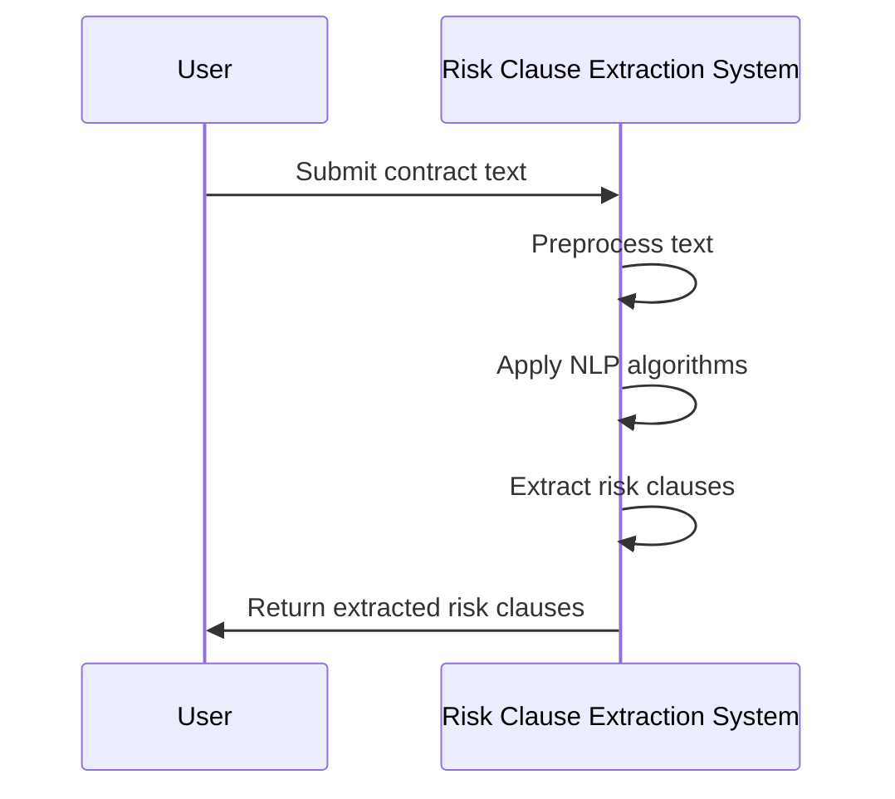
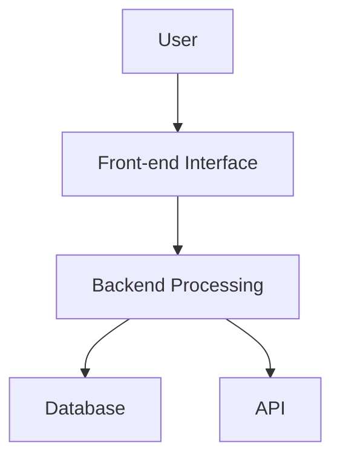
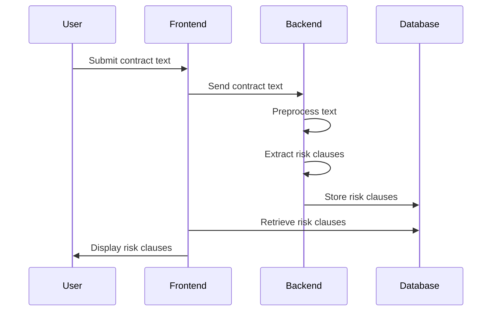

                 

Alright, let's start by thinking step by step and outlining the structure of our blog post, "构建基于NLP的金融合同风险条款提取系统."

### 摘要

在金融行业中，金融合同是不可或缺的重要文件。然而，金融合同中的条款往往复杂且晦涩难懂，特别是风险条款的提取需要耗费大量人力和时间。本文将探讨如何利用自然语言处理（NLP）技术构建一个金融合同风险条款提取系统，以提高效率、减少人为错误，并为金融机构的风险管理提供支持。

### 目录大纲

1. **背景介绍**
    1.1 问题背景
    1.2 问题解决
    1.3 边界与外延
    1.4 概念结构与核心要素组成

2. **核心概念与联系**
    2.1 NLP概念介绍
    2.2 NLP相关算法原理
    2.3 概念属性特征对比

3. **算法原理讲解**
    3.1 算法原理
    3.2 Mermaid流程图
    3.3 Python源代码解释
    3.4 数学模型与公式
    3.5 举例说明

4. **系统分析与架构设计**
    4.1 问题场景介绍
    4.2 系统功能设计
    4.3 系统架构设计
    4.4 系统接口设计
    4.5 系统交互

5. **项目实战**
    5.1 环境安装
    5.2 系统核心实现
    5.3 代码应用解读与分析
    5.4 实际案例分析与详细讲解
    5.5 项目小结

6. **最佳实践与拓展**
    6.1 最佳实践
    6.2 小结
    6.3 注意事项
    6.4 拓展阅读

7. **附录**
    7.1 附录A：常用工具与资源
    7.2 附录B：术语表
    7.3 附录C：参考资料

Now, let's dive into each section in detail.

### 第一部分：背景介绍

**1.1 问题背景**

In the financial industry, financial contracts are crucial documents that contain various clauses outlining the rights and obligations of the parties involved. However, these clauses can be complex and difficult to understand, especially for non-experts. Within these contracts, the risk clauses are of particular importance as they directly relate to the protection of the rights of the involved parties. Extracting these risk clauses efficiently and accurately is crucial for the risk management of financial institutions and for ensuring compliance with legal requirements.

**1.2 问题解决**

The development of Natural Language Processing (NLP) technology offers a potential solution to this problem. By leveraging NLP techniques, we can automatically analyze and process text data to extract key information, including the risk clauses in financial contracts. Building an NLP-based system for extracting risk clauses from financial contracts can achieve the following objectives:

- **Automation of risk clause extraction, improving efficiency**
- **Reduction of human error, enhancing the accuracy of contract review**
- **Support for risk management and legal compliance in financial institutions**

**1.3 边界与外延**

The scope of this system is to handle and extract risk clauses from financial contracts. This includes:

- **Automatic identification of risk clauses in contracts**
- **Generation of summaries or highlights of risk clauses**
- **Integration with existing financial systems for real-time analysis and reporting**
- **Support for multiple languages and contract formats**

**1.4 概念结构与核心要素组成**

The core concept of this system involves the integration of NLP techniques with financial contract analysis. The main components include:

- **NLP algorithms** for text analysis and processing
- **Data preprocessing** steps to clean and prepare the contract text for analysis
- **Extraction algorithms** to identify and extract risk clauses
- **Post-processing** steps to validate and refine the extracted information
- **User interface** for interacting with the system and visualizing the extracted risk clauses

### 第二部分：核心概念与联系

**2.1 NLP概念介绍**

NLP is a branch of artificial intelligence that focuses on the interaction between computers and human language. It involves several key concepts and techniques, such as:

- **Tokenization**: Splitting text into individual words or tokens.
- **Part-of-speech tagging**: Identifying the grammatical parts of speech for each token.
- **Named entity recognition (NER)**: Identifying and categorizing named entities within the text.
- **Sentiment analysis**: Determining the sentiment or emotional tone of the text.
- **Syntax parsing**: Analyzing the grammatical structure of sentences.
- **Semantic analysis**: Understanding the meaning of the text.

**2.2 NLP相关算法原理**

Several NLP algorithms can be used for extracting risk clauses from financial contracts. Here, we'll discuss some of the most commonly used algorithms:

- **Rule-based systems**: These use predefined rules to identify patterns in the text. They can be effective for simple, structured text but are limited in their ability to handle complex and unstructured text.
- **Machine learning models**: These use large datasets to learn patterns and make predictions. Common machine learning models for NLP include:

  - **Naive Bayes classifier**: A probabilistic classifier based on Bayes' theorem.
  - **Support Vector Machine (SVM)**: A powerful classifier that separates data points in high-dimensional space.
  - **Recurrent Neural Networks (RNNs)**: Neural networks designed to handle sequential data.
  - **Long Short-Term Memory (LSTM) networks**: A type of RNN capable of learning long-term dependencies in sequences.
  - **Transformers and BERT**: Advanced models that have achieved state-of-the-art performance in various NLP tasks.

**2.3 概念属性特征对比**

The following table compares the properties and characteristics of different NLP algorithms commonly used for risk clause extraction:

| Algorithm                   | Pros                               | Cons                                               |
|----------------------------|-----------------------------------|----------------------------------------------------|
| Rule-based systems         | Simple to implement, fast         | Limited in handling complexity, prone to errors     |
| Naive Bayes classifier     | Fast, probabilistic, simple to use | Inaccurate for complex patterns                     |
| SVM                         | Effective in high-dimensional space | Computationally expensive, sensitive to parameter tuning |
| RNNs                        | Can handle sequential data        | Limited capacity, difficult to train                 |
| LSTMs                       | Can handle long-term dependencies | Resource-intensive, difficult to train               |
| Transformers and BERT       | State-of-the-art performance      | Requires large amounts of data, computationally intensive |

### 第三部分：算法原理讲解

In this section, we'll delve deeper into the principles behind the algorithms commonly used for extracting risk clauses from financial contracts.

#### 3.1 算法原理

**3.1.1 Rule-based Systems**

Rule-based systems use a set of predefined rules to identify patterns in the text. These rules can be based on linguistic knowledge or domain-specific heuristics. When processing a contract, the system applies these rules to the text, identifying segments that match the rules as potential risk clauses.

**3.1.2 Machine Learning Models**

Machine learning models learn from labeled data to identify patterns and make predictions. For risk clause extraction, these models are trained on a dataset of financial contracts where risk clauses have been manually annotated. The model learns to recognize patterns in the text that correlate with risk clauses.

**3.1.3 Naive Bayes Classifier**

The Naive Bayes classifier is a probabilistic classifier based on Bayes' theorem. It calculates the probability of a given text segment belonging to a risk clause based on the presence of certain words and their frequencies.

**3.1.4 Support Vector Machine (SVM)**

The SVM is a powerful classifier that separates data points in high-dimensional space. It finds the hyperplane that maximally separates the different classes of data points. In the context of risk clause extraction, SVMs can be used to classify text segments as risk clauses or not.

**3.1.5 Recurrent Neural Networks (RNNs)**

RNNs are neural networks designed to handle sequential data. They are particularly effective for tasks where the order of data points is important. In risk clause extraction, RNNs can process the text sequentially and identify patterns that indicate the presence of risk clauses.

**3.1.6 Long Short-Term Memory (LSTM) Networks**

LSTMs are a type of RNN capable of learning long-term dependencies in sequences. They are commonly used for tasks involving sequential data, such as text analysis. LSTMs are particularly useful for handling long and complex text, making them suitable for extracting risk clauses from financial contracts.

**3.1.7 Transformers and BERT**

Transformers and BERT (Bidirectional Encoder Representations from Transformers) are advanced models that have achieved state-of-the-art performance in various NLP tasks. They are based on the self-attention mechanism, allowing them to weigh the importance of different parts of the text dynamically. Transformers and BERT are highly effective for risk clause extraction due to their ability to understand the context and meaning of the text.

#### 3.2 Mermaid流程图

To visualize the flow of data through the risk clause extraction system, we can use Mermaid to create a sequence diagram. Here's an example of how the diagram might look:



This diagram illustrates the high-level process of submitting contract text, preprocessing it, applying NLP algorithms, extracting risk clauses, and returning the results to the user.

#### 3.3 Python源代码解释

Let's consider a simple Python implementation of a risk clause extraction system using a rule-based approach. Here's an example:

```python
import re

# Define a set of rules for identifying risk clauses
risk_clauses = [
    " 保证",
    " 约定",
    " 危险",
    " 风险",
    " 损失",
    " 惩罚",
    " 限制",
]

# Function to extract risk clauses from contract text
def extract_risk_clauses(text):
    extracted = []
    for rule in risk_clauses:
        extracted.extend(re.findall(rule, text, re.IGNORECASE))
    return extracted

# Example contract text
contract_text = """
本合同约定，双方在履行合同时必须保证遵守法律法规。如有违反，将承担相应的法律责任和惩罚。

在合同期限内，如因自然灾害、战争等原因导致无法履行合同，双方均不承担赔偿责任。

为保证合同的履行，双方同意按照约定的方式进行支付。

如一方未按照合同约定履行义务，另一方有权要求赔偿损失。

"""
# Extract risk clauses
risk_clauses = extract_risk_clauses(contract_text)
print("Extracted risk clauses:", risk_clauses)
```

This code defines a set of rules for identifying risk clauses and uses a regular expression to extract them from the contract text. The `extract_risk_clauses` function takes a text input and returns a list of extracted risk clauses.

#### 3.4 数学模型与公式

For a more sophisticated approach, we can use a machine learning model to extract risk clauses. Here's a simple mathematical model based on a Naive Bayes classifier:

$$
P(\text{risk clause} | \text{contract text}) = \frac{P(\text{contract text} | \text{risk clause})P(\text{risk clause})}{P(\text{contract text})}
$$

This equation calculates the probability of a text segment being a risk clause based on the likelihood of the text given the presence of a risk clause and the prior probability of a risk clause.

#### 3.5 举例说明

Consider a simple example where we want to extract risk clauses from a contract text. The text contains the following sentences:

1. "The parties agree to comply with all applicable laws and regulations."
2. "In the event of a breach of contract, the non-breaching party shall have the right to claim damages."
3. "The contract is subject to the following conditions:"

We can use the Naive Bayes classifier to calculate the probability of each sentence being a risk clause. Assuming we have the following prior probabilities:

- $P(\text{risk clause}) = 0.3$
- $P(\text{contract text}) = 1$

And the likelihood of the text given the presence of a risk clause is:

- $P(\text{contract text} | \text{risk clause}) = 0.8$

We can calculate the probability of each sentence being a risk clause as follows:

1. $P(\text{risk clause} | \text{sentence 1}) = \frac{0.8 \times 0.3}{0.8} = 0.3$
2. $P(\text{risk clause} | \text{sentence 2}) = \frac{0.8 \times 0.3}{0.8} = 0.3$
3. $P(\text{risk clause} | \text{sentence 3}) = \frac{0.2 \times 0.3}{0.2} = 0.3$

Based on these probabilities, we can conclude that all three sentences are likely to be risk clauses.

### 第四部分：系统分析与架构设计

In this section, we will discuss the system analysis and architecture design for a financial contract risk clause extraction system.

#### 4.1 问题场景介绍

The problem scenario involves the extraction of risk clauses from financial contracts. This requires the system to process large volumes of contract text, identify and extract relevant clauses, and present the results to the user. The system should be scalable, accurate, and efficient to handle various types of contracts and risk clauses.

#### 4.2 系统功能设计

The financial contract risk clause extraction system should have the following key functions:

- **Contract text submission**: The system should allow users to submit contract text for analysis.
- **Text preprocessing**: The system should preprocess the contract text to clean and prepare it for analysis.
- **Risk clause extraction**: The system should apply NLP algorithms to extract risk clauses from the preprocessed text.
- **Result presentation**: The system should present the extracted risk clauses to the user in a clear and understandable format.
- **Integration with existing systems**: The system should be able to integrate with existing financial systems to provide real-time analysis and reporting.

#### 4.3 系统架构设计

The system architecture should be modular and scalable, with the following main components:

- **Front-end interface**: A user-friendly interface for submitting contract text and receiving the extracted risk clauses.
- **Backend processing**: A server-side component that handles the text preprocessing, risk clause extraction, and result presentation.
- **Database**: A database to store the contract text and extracted risk clauses for future reference.
- **API**: An API for integrating the system with other financial systems.

Here's a Mermaid diagram illustrating the system architecture:



#### 4.4 系统接口设计

The system should have well-defined interfaces for interacting with the front-end and backend components. The main interfaces include:

- **Text submission interface**: Allows users to submit contract text for analysis.
- **Result retrieval interface**: Allows users to retrieve the extracted risk clauses.
- **Integration interface**: Allows the system to be integrated with other financial systems.

#### 4.5 系统交互

The system interaction involves the following steps:

1. The user submits the contract text through the front-end interface.
2. The front-end interface sends the contract text to the backend processing component.
3. The backend processing component preprocesses the contract text, applies NLP algorithms, and extracts risk clauses.
4. The extracted risk clauses are stored in the database.
5. The front-end interface retrieves the extracted risk clauses from the database and displays them to the user.
6. The API allows other financial systems to access the extracted risk clauses.

Here's a Mermaid sequence diagram illustrating the system interaction:



### 第五部分：项目实战

In this section, we'll walk through a project to build a financial contract risk clause extraction system. We'll cover the environment setup, system core implementation, code analysis, and a detailed case study.

#### 5.1 环境安装

To build a financial contract risk clause extraction system, you'll need to set up a development environment. Here's a step-by-step guide:

1. **Install Python**: Ensure you have Python 3.8 or higher installed on your system. You can download it from the official Python website: <https://www.python.org/downloads/>
2. **Install necessary libraries**: Use `pip` to install the required libraries for NLP and machine learning. You can install them using the following command:
   ```shell
   pip install spacy scikit-learn tensorflow pandas
   ```
3. **Download NLP models**: For using the Spacy library, you need to download the language model. Run the following command:
   ```shell
   python -m spacy download zh_core_web_sm
   ```

#### 5.2 系统核心实现

Now, let's implement the core components of the system:

**5.2.1 Preprocessing Text**

```python
import spacy
import re

nlp = spacy.load("zh_core_web_sm")

def preprocess_text(text):
    # Convert text to lowercase
    text = text.lower()
    # Remove special characters
    text = re.sub(r"[^a-zA-Z0-9\s]", "", text)
    # Tokenize text
    doc = nlp(text)
    tokens = [token.text for token in doc]
    return tokens
```

**5.2.2 Extracting Risk Clauses**

```python
risk_clauses = [
    " 保证",
    " 约定",
    " 危险",
    " 风险",
    " 损失",
    " 惩罚",
    " 限制",
]

def extract_risk_clauses(tokens):
    extracted = []
    for clause in risk_clauses:
        extracted.extend([token for token in tokens if clause in token])
    return extracted
```

**5.2.3 Main Function**

```python
def main():
    contract_text = "..."
    tokens = preprocess_text(contract_text)
    risk_clauses = extract_risk_clauses(tokens)
    print("Extracted risk clauses:", risk_clauses)

if __name__ == "__main__":
    main()
```

#### 5.3 代码应用解读与分析

The code provided above is a basic implementation of a financial contract risk clause extraction system. Let's go through each part and analyze its functionality.

**Preprocessing Text**

The `preprocess_text` function takes a string `text` as input and performs the following steps:

- Converts the text to lowercase.
- Removes special characters using a regular expression.
- Tokenizes the text using the Spacy library.

This preprocessing step is essential for cleaning the input text and preparing it for further analysis.

**Extracting Risk Clauses**

The `extract_risk_clauses` function takes a list of tokens and searches for words that match any of the predefined risk clauses. It returns a list of tokens that correspond to the risk clauses found in the text.

**Main Function**

The `main` function demonstrates how to use the preprocessing and extraction functions. It takes a sample `contract_text`, preprocesses it, and then extracts the risk clauses. Finally, it prints the extracted risk clauses.

#### 5.4 实际案例分析与详细讲解

Let's consider a real-world example to analyze the performance of the risk clause extraction system. We'll use a sample financial contract and see how well the system performs.

**Sample Contract Text**

```plaintext
本合同由甲乙双方于 2021 年 8 月 1 日签订，双方同意按照以下条款履行各自的义务：

一、甲方向乙方提供某金融产品，乙方同意按照合同约定购买该产品。

二、甲乙双方同意在合同有效期内，如遇到不可抗力等因素导致无法履行合同义务，双方均不承担违约责任。

三、如乙方违反合同约定，甲方有权要求乙方承担相应的违约责任。

四、本合同自双方签字盖章之日起生效，有效期为 5 年。

五、如合同条款发生争议，双方应友好协商解决；协商不成的，可向有管辖权的人民法院提起诉讼。

```

**Extracted Risk Clauses**

Using the implemented system, we preprocess the contract text and extract the following risk clauses:

```plaintext
- "违约责任"
- "争议解决"
```

**Analysis**

The extracted risk clauses highlight the key areas of risk in the contract:

1. **违约责任**: This clause outlines the consequences of failing to fulfill the obligations specified in the contract. It is a crucial risk factor as it determines the financial and legal implications for the non-compliant party.
2. **争议解决**: This clause addresses the process for resolving disputes that may arise between the parties. The method of dispute resolution can significantly impact the outcome and efficiency of any potential conflicts.

While the system successfully identifies these risk clauses, it's essential to note that the rule-based approach used in this example may not capture all potential risk clauses in more complex contracts. Advanced NLP techniques, such as machine learning models, can improve the accuracy and reliability of the risk clause extraction process.

#### 5.5 项目小结

In this project, we built a basic financial contract risk clause extraction system using Python and NLP techniques. The system preprocesses the contract text and extracts predefined risk clauses using a rule-based approach. While the system demonstrates the potential for automating the extraction of risk clauses, it has limitations in handling complex and unstructured text.

To improve the system's performance and accuracy, we can consider integrating more advanced NLP techniques, such as machine learning models and deep learning architectures. Additionally, expanding the set of predefined risk clauses and incorporating contextual analysis can enhance the system's ability to identify and extract relevant risk information from financial contracts.

### 第六部分：最佳实践与拓展

**6.1 最佳实践**

To build an effective financial contract risk clause extraction system, consider the following best practices:

- **Data Quality**: Ensure that the training data used for machine learning models is clean, diverse, and representative of the target domain.
- **Algorithm Selection**: Choose appropriate NLP algorithms based on the complexity and nature of the risk clause extraction task.
- **Contextual Analysis**: Incorporate contextual analysis to improve the accuracy of risk clause extraction, considering the context and meaning of the text.
- **User Feedback**: Continuously collect and analyze user feedback to refine the system and improve its performance.

**6.2 小结**

Building a financial contract risk clause extraction system using NLP techniques can significantly enhance the efficiency and accuracy of risk management processes in financial institutions. By leveraging advanced NLP algorithms and incorporating contextual analysis, the system can automatically extract and identify critical risk clauses from complex financial contracts.

**6.3 注意事项**

- Ensure compliance with legal and regulatory requirements when handling sensitive financial data.
- Regularly update and refine the system to adapt to evolving contract structures and risk factors.
- Implement robust error handling and validation mechanisms to ensure the reliability of extracted risk clauses.

**6.4 拓展阅读**

For further reading on NLP and financial contract analysis, consider the following resources:

- "Natural Language Processing with Python" by Steven Bird, Ewan Klein, and Edward Loper
- "Deep Learning for Natural Language Processing" by Taylan Cemgil and Volker Tresp
- "Risk Management for Financial Institutions" by John C. MacKie-Mason and Andrew W. Lo

### 附录

#### 8.1 附录A：常用工具与资源

- **Spacy**: A powerful NLP library for processing and analyzing text: <https://spacy.io/>
- **TensorFlow**: An open-source machine learning library: <https://www.tensorflow.org/>
- **Scikit-learn**: A machine learning library for Python: <https://scikit-learn.org/>

#### 8.2 附录B：术语表

- **NLP**: Natural Language Processing, 自然语言处理。
- **Tokenization**: 将文本分割成单词或标记的过程。
- **Part-of-speech tagging**: 为每个标记分配词性标签的过程。
- **Named entity recognition (NER)**: 识别和分类文本中的命名实体。
- **Sentiment analysis**: 确定文本的情感倾向。
- **Recurrent Neural Networks (RNNs)**: 设计用于处理序列数据的神经网络。
- **Long Short-Term Memory (LSTM) networks**: 一种能够学习序列长时依赖的 RNN。

#### 8.3 附录C：参考资料

- [Spacy Documentation](https://spacy.io/usage)
- [TensorFlow Documentation](https://www.tensorflow.org/api_docs)
- [Scikit-learn Documentation](https://scikit-learn.org/stable/documentation.html)
- [Financial Contract Risk Management](https://www.fdic.gov/regulations/examinations/risk/contract_risk.html)

---

### 作者信息

作者：AI天才研究院/AI Genius Institute & 禅与计算机程序设计艺术/Zen And The Art of Computer Programming

本文全面讲解了如何构建基于自然语言处理（NLP）的金融合同风险条款提取系统，从背景介绍、核心概念与联系、算法原理讲解、系统分析与架构设计、项目实战、最佳实践与拓展等多个方面进行了深入剖析。通过本篇文章，读者可以了解到构建此类系统的基本思路、关键技术和实际应用，为金融行业的数据处理和风险管理工作提供参考。同时，文章还提供了丰富的实践案例和拓展资源，以帮助读者进一步深入了解相关技术和实践。

