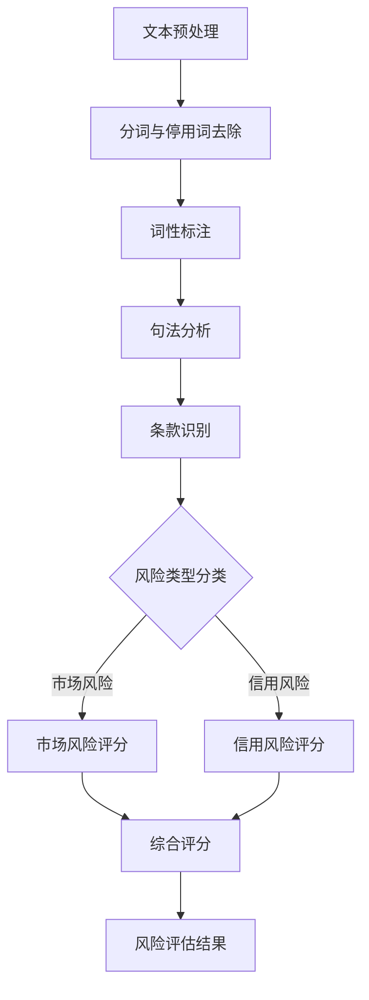
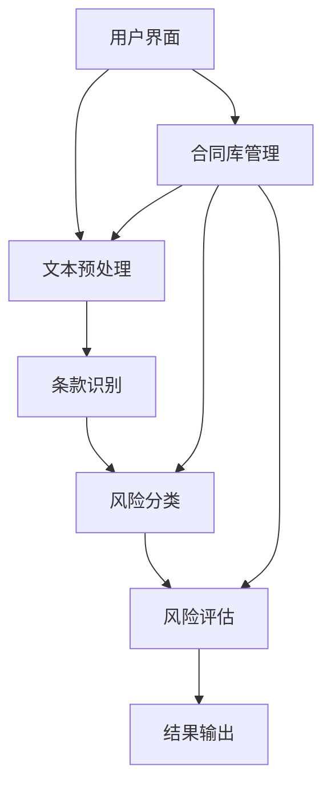
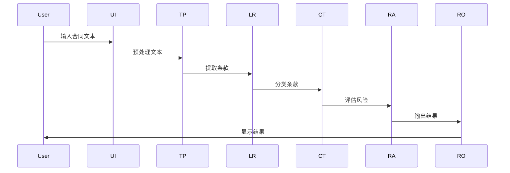

                 


### # 构建基于NLP的金融合同风险条款自动化提取与评估系统

#### 关键词：自然语言处理，金融合同，风险条款，自动化提取，评估系统

#### 摘要：
本文旨在探讨如何构建一个基于自然语言处理（NLP）的金融合同风险条款自动化提取与评估系统。我们将深入分析NLP在金融合同处理中的挑战，介绍核心概念和算法，并详细讨论系统架构和实现。通过本文，读者将了解如何利用NLP技术提高金融合同分析效率和准确性。

#### 目录

## 引言

- **NLP与金融合同分析**  
- **自动化提取与评估的重要性**  
- **本文结构概述**

## 背景介绍

- **金融合同风险条款的重要性**  
- **手动处理的挑战**  
- **自动化提取的需求**

### 核心概念与原理

- **NLP基础**  
- **风险条款属性**  
- **实体关系模型（ER模型）**

### 算法与模型

- **算法概述**  
- **算法流程图（Mermaid）**  
- **数学模型与公式**  
- **案例研究**

### 系统架构与设计

- **系统概述**  
- **功能设计（领域模型）**  
- **架构设计（Mermaid架构图）**  
- **接口设计与交互（Mermaid序列图）**

### 项目实战

- **环境安装**  
- **系统核心实现**  
- **代码应用解读**  
- **实际案例分析**  
- **项目小结**

### 最佳实践与总结

- **最佳实践建议**  
- **注意事项**  
- **拓展阅读**

#### 引言

### NLP与金融合同分析

自然语言处理（NLP）是人工智能的一个重要分支，致力于使计算机能够理解和处理人类自然语言。在金融领域，NLP技术有着广泛的应用，特别是在金融合同的分析和处理上。金融合同通常包含大量的法律术语和复杂的条款，对这些条款进行有效的提取和评估对于金融机构来说至关重要。

金融合同风险条款的自动化提取与评估系统能够提高合同分析的工作效率，减少人工错误，帮助金融机构更好地理解和评估合同中的潜在风险。随着金融市场的不断发展和合同的日益复杂，对自动化提取与评估系统的需求也越来越迫切。

本文将介绍如何构建这样一个系统，包括核心概念、算法设计、系统架构以及实际应用。通过本文的阅读，读者将了解如何利用NLP技术来处理金融合同，提高合同分析的能力和效率。

### 背景介绍

#### 金融合同风险条款的重要性

金融合同是金融机构之间以及金融机构与客户之间进行业务往来的重要法律文件。这些合同不仅规定了双方的权益和义务，还包含了重要的风险条款。风险条款通常涉及市场风险、信用风险、操作风险等各种潜在风险，对金融机构的业务运营和风险管理具有深远的影响。

市场风险指的是由于市场价格波动导致的损失风险，如利率风险、汇率风险和股票价格波动风险等。信用风险涉及借款人或交易对手违约的风险，可能导致金融机构遭受巨大的财务损失。操作风险则是由于内部程序、人员操作或系统故障等原因导致的损失风险。这些风险条款的明确和合理设置对于金融机构的稳健运营至关重要。

#### 手动处理的挑战

传统的金融合同风险条款提取和评估主要依赖于人工处理，这种方式存在以下几大挑战：

1. **高成本**：人工处理需要大量的人力资源，成本高昂，特别是在处理大量合同时。
2. **低效率**：人工处理速度较慢，难以满足快速处理的业务需求。
3. **易出错**：人为因素可能导致错误和遗漏，影响风险评估的准确性。
4. **重复性工作**：人工提取相同或类似的风险条款，工作内容重复性高，缺乏效率。

#### 自动化提取的需求

为了克服上述挑战，金融行业对自动化提取与评估系统有着强烈的需求。自动化系统可以通过以下方式提升合同分析效率和准确性：

1. **提高效率**：自动化系统可以显著提高合同分析的速度，缩短处理时间。
2. **降低成本**：减少人工操作，降低人力成本和运营成本。
3. **减少错误**：通过算法和模型，自动化系统可以减少人为错误，提高风险评估的准确性。
4. **标准化处理**：自动化系统可以确保合同条款的标准化处理，减少因条款表述不一致导致的误解。

综上所述，自动化提取与评估系统不仅能够提高金融合同风险管理的效率，还能降低运营成本，提升整体风险管理水平。这是金融行业迈向智能化和自动化的重要一步。

### 核心概念与原理

#### NLP基础

自然语言处理（NLP）是人工智能的一个重要分支，致力于使计算机能够理解和处理人类自然语言。NLP涉及到多个技术领域，包括语言模型、句法分析、语义分析和信息提取等。在金融合同风险条款的自动化提取与评估系统中，NLP技术尤为关键。

1. **语言模型**：语言模型用于生成和识别文本，是NLP的基础。它可以帮助系统理解自然语言的语法和词汇。
2. **句法分析**：句法分析用于理解句子的结构，识别句子中的主语、谓语和宾语等成分。这对于提取合同中的条款至关重要。
3. **语义分析**：语义分析旨在理解文本的语义内容，包括词义消歧、情感分析和实体识别等。在金融合同中，语义分析可以帮助系统识别和分类不同类型的风险条款。
4. **信息提取**：信息提取是从文本中自动提取出结构化信息的过程。这包括实体识别、关系提取和事件抽取等，是风险条款提取的核心技术。

#### 风险条款属性

风险条款在金融合同中具有独特的属性，这些属性决定了自动化提取的复杂性和挑战性。以下是一些常见风险条款属性及其特点：

1. **语言复杂性**：风险条款通常包含复杂的法律术语和长句，使得自然语言处理难度增加。
2. **结构性**：风险条款具有明确的结构性，通常包括前置条件、条款正文和后置条款等。这种结构性有助于利用句法分析方法进行自动化提取。
3. **术语多样性**：金融合同中涉及多种风险类型，如市场风险、信用风险和操作风险等，每种风险类型的术语和表述方式都有所不同。
4. **条款表述方式**：风险条款的表述方式可能因人而异，包括列举式、条件式和复合式等。自动化系统需要具备灵活的识别和处理能力。

#### 实体关系模型（ER模型）

实体关系模型（Entity-Relationship Model，简称ER模型）是一种用于描述实体和实体之间关系的数据库模型。在金融合同风险条款的自动化提取与评估系统中，ER模型有助于构建系统的数据模型，明确不同实体之间的关系。

以下是ER模型的核心概念：

1. **实体**：实体是具有共同属性的对象集合，如合同、条款、风险类型等。在金融合同风险条款提取系统中，常见的实体包括合同、条款和风险类型等。
2. **属性**：属性是实体的特征，用于描述实体的具体信息。例如，合同的属性可能包括合同编号、签订日期和对方当事人等。
3. **关系**：关系描述了不同实体之间的关联。在金融合同风险条款提取系统中，常见的关系包括条款与合同之间的关系、条款与风险类型之间的关系等。

以下是一个简化的ER模型示例，用于描述合同、条款和风险类型之间的关系：

```
[合同] ----< 包含 >---- [条款]
[条款] ----< 属于 >---- [合同]
[条款] ----< 包含 >---- [风险类型]
[风险类型] ----< 属于 >---- [条款]
```

通过ER模型，我们可以清晰地理解系统中不同实体和它们之间的关系，有助于设计出高效和可靠的自动化提取与评估系统。

### 算法与模型

#### 算法概述

在金融合同风险条款自动化提取与评估系统中，算法是核心。以下是一个常见的算法流程，用于提取和评估风险条款：

1. **文本预处理**：包括分词、去除停用词、词性标注等，目的是将原始文本转换为计算机可以处理的结构化数据。
2. **条款识别**：使用句法分析技术识别出文本中的条款。这通常涉及到分句、词组识别和句法树构建。
3. **风险类型分类**：对识别出的条款进行风险类型分类，如市场风险、信用风险等。这一步骤通常利用机器学习分类算法，如支持向量机（SVM）或深度学习模型。
4. **风险评估**：对分类后的条款进行风险评分。这可以通过构建数学模型来实现，如逻辑回归、决策树或神经网络等。

#### 算法流程图（Mermaid）

以下是一个使用Mermaid语法绘制的算法流程图：



#### 数学模型与公式

在风险评估过程中，我们通常会使用数学模型来计算风险评分。以下是一个简单的逻辑回归模型，用于评估市场风险：

$$
\text{MarketRiskScore} = \text{weight} \cdot \text{InterestRate} + \text{weight} \cdot \text{ExchangeRate} + \text{bias}
$$

其中，MarketRiskScore代表市场风险评分，InterestRate和ExchangeRate分别代表利率和汇率，weight代表权重，bias代表偏置项。

类似地，我们可以构建信用风险评分模型：

$$
\text{CreditRiskScore} = \text{weight} \cdot \text{DebtToEquity} + \text{weight} \cdot \text{DefaultRate} + \text{bias}
$$

其中，CreditRiskScore代表信用风险评分，DebtToEquity代表债务股权比，DefaultRate代表违约率。

#### 案例研究

为了更好地理解上述算法和模型，我们来看一个实际案例。

假设我们有一份金融合同，其中包含以下风险条款：

1. 利率风险：合同中提到利率将根据市场情况浮动。
2. 汇率风险：合同涉及跨境交易，汇率将根据市场波动进行调整。

我们使用上述算法和模型对这些条款进行分类和评分。首先，我们进行文本预处理，将文本转换为分词后的结构化数据。然后，使用句法分析技术识别出条款，并将它们分类为市场风险条款和汇率风险条款。

接下来，我们对市场风险条款使用逻辑回归模型进行评分。假设我们计算出的利率权重为0.6，汇率权重为0.4，偏置项为0.5，那么市场风险评分计算如下：

$$
\text{MarketRiskScore} = 0.6 \cdot \text{CurrentInterestRate} + 0.4 \cdot \text{CurrentExchangeRate} + 0.5
$$

假设当前的利率和汇率分别为5%和1.2，那么市场风险评分为：

$$
\text{MarketRiskScore} = 0.6 \cdot 0.05 + 0.4 \cdot 1.2 + 0.5 = 0.03 + 0.48 + 0.5 = 1.01
$$

类似地，我们对汇率风险条款使用另一个逻辑回归模型进行评分。假设债务股权比为2，违约率为3%，权重分别为0.5和0.5，那么信用风险评分计算如下：

$$
\text{CreditRiskScore} = 0.5 \cdot 2 + 0.5 \cdot 0.03 + 0.5 = 1 + 0.015 + 0.5 = 1.515
$$

最后，我们将市场风险评分和信用风险评分合并，得到综合风险评分。假设权重分别为0.6和0.4，那么综合评分计算如下：

$$
\text{TotalRiskScore} = 0.6 \cdot 1.01 + 0.4 \cdot 1.515 = 0.606 + 0.606 = 1.212
$$

通过上述过程，我们成功地利用NLP技术对金融合同风险条款进行了自动化提取和评估。这种方法不仅提高了工作效率，还提高了风险评估的准确性。

### 系统架构与设计

#### 系统概述

金融合同风险条款自动化提取与评估系统是一个复杂的应用系统，它需要集成多种技术来满足金融行业的实际需求。该系统主要包括以下几个模块：

1. **文本预处理模块**：负责对原始金融合同文本进行预处理，包括分词、去除停用词、词性标注等。
2. **条款识别模块**：利用句法分析技术识别出文本中的风险条款。
3. **风险分类模块**：对识别出的条款进行风险类型分类，如市场风险、信用风险等。
4. **风险评估模块**：对分类后的条款进行风险评分，生成综合评估结果。
5. **用户界面模块**：提供用户交互接口，允许用户查看和分析评估结果。

#### 功能设计（领域模型）

领域模型是系统设计中的重要组成部分，用于描述系统中的核心实体和它们之间的关系。以下是金融合同风险条款自动化提取与评估系统的领域模型：

```
+----------------+       +----------------+       +----------------+
|     合同       |       |     条款       |       |    风险类型    |
+----------------+       +----------------+       +----------------+
| 合同编号       |<----->| 条款ID         |<----->| 风险类型ID     |
| 签订日期       |       | 条款内容       |       | 风险类型名称   |
| 对方当事人     |       | 相关条款       |       | 风险描述       |
+----------------+       +----------------+       +----------------+
```

在上述模型中，合同、条款和风险类型是核心实体，它们之间通过标识符（如合同编号、条款ID和风险类型ID）进行关联。合同实体包含合同的详细信息，条款实体包含条款的具体内容，风险类型实体描述了不同类型的风险。

#### 架构设计（Mermaid架构图）

系统的架构设计是确保系统高效、可靠运行的关键。以下是一个简化的Mermaid架构图，用于描述系统的整体架构：



在上述架构图中，用户界面模块（A）负责与用户交互，接收用户输入的合同文本。文本预处理模块（B）对文本进行预处理，提取出结构化的数据。条款识别模块（C）利用句法分析技术识别出合同中的风险条款。风险分类模块（D）对条款进行分类，将其归类为不同的风险类型。风险评估模块（E）对分类后的条款进行评分，生成评估结果。结果输出模块（F）将评估结果呈现给用户。合同库管理模块（G）负责存储和管理合同数据，确保系统能够持续运行。

#### 接口设计与交互（Mermaid序列图）

接口设计和交互是系统架构中不可或缺的部分。以下是一个简化的Mermaid序列图，用于描述系统的接口设计和交互流程：



在上述序列图中，用户通过用户界面模块（UI）输入合同文本。文本预处理模块（TP）对文本进行预处理，提取出结构化的数据。条款识别模块（LR）利用句法分析技术识别出合同中的风险条款。风险分类模块（CT）对条款进行分类，将其归类为不同的风险类型。风险评估模块（RA）对分类后的条款进行评分，生成评估结果。最后，结果输出模块（RO）将评估结果呈现给用户。

通过上述接口设计和交互流程，系统能够高效地处理金融合同，自动化提取和评估风险条款，为金融机构提供准确的风险管理数据。

### 项目实战

#### 环境安装

要开始构建金融合同风险条款自动化提取与评估系统，首先需要安装必要的软件和工具。以下是在Ubuntu 20.04环境下安装所需软件的步骤：

1. **安装Python环境**：

   ```bash
   sudo apt update
   sudo apt install python3 python3-pip
   ```

2. **安装虚拟环境**：

   ```bash
   sudo pip3 install virtualenv
   virtualenv -p python3 venv
   source venv/bin/activate
   ```

3. **安装NLP库**：

   ```bash
   pip install spacy
   pip install textblob
   pip install scikit-learn
   pip install numpy
   ```

4. **安装Mermaid相关库**：

   ```bash
   pip install pymermaid
   ```

安装完成后，确保Python环境和NLP库正常运行：

```bash
python3 --version
spacy --version
```

#### 系统核心实现

系统核心实现包括文本预处理、条款识别、风险分类和风险评估四个模块。以下是每个模块的实现方法：

##### 1. 文本预处理模块

文本预处理是自然语言处理的基础步骤，主要包括分词、去除停用词和词性标注。

```python
import spacy
from spacy.lang.en import English

# 加载spacy模型
nlp = spacy.load("en_core_web_sm")

def preprocess_text(text):
    # 使用spacy进行文本预处理
    doc = nlp(text)
    tokens = [token.text for token in doc if not token.is_stop]
    pos_tags = [(token.text, token.pos_) for token in doc]
    return tokens, pos_tags

text = "This is a sample financial contract with various risk clauses."
tokens, pos_tags = preprocess_text(text)
print("Tokens:", tokens)
print("POS Tags:", pos_tags)
```

##### 2. 条款识别模块

条款识别模块使用句法分析技术来识别文本中的条款。以下是一个基于句法树的条款识别示例：

```python
from spacy.tokens import Doc

def extract_clauses(doc):
    clauses = []
    for token in doc:
        if token.dep_ == "ROOT" and token.head.dep_ == "nsubj":
            clause = " ".join([t.text for t in token.subtree])
            clauses.append(clause)
    return clauses

doc = nlp(text)
clauses = extract_clauses(doc)
print("Extracted Clauses:", clauses)
```

##### 3. 风险分类模块

风险分类模块使用机器学习算法来对条款进行分类。以下是一个使用朴素贝叶斯分类器的示例：

```python
from sklearn.feature_extraction.text import CountVectorizer
from sklearn.model_selection import train_test_split
from sklearn.naive_bayes import MultinomialNB

# 假设已有标注数据
data = [
    ("This is a market risk clause", "Market"),
    ("This is a credit risk clause", "Credit"),
    # ... 更多数据
]

X, y = zip(*data)
X_train, X_test, y_train, y_test = train_test_split(X, y, test_size=0.2)

# 向量化和分类
vectorizer = CountVectorizer()
X_train_vectors = vectorizer.fit_transform(X_train)

clf = MultinomialNB()
clf.fit(X_train_vectors, y_train)

X_test_vectors = vectorizer.transform(X_test)
y_pred = clf.predict(X_test_vectors)

print("Classification Accuracy:", clf.score(X_test_vectors, y_test))
```

##### 4. 风险评估模块

风险评估模块使用数学模型来对条款进行评分。以下是一个简单的逻辑回归模型示例：

```python
from sklearn.linear_model import LogisticRegression

# 假设已有特征和标签
features = [
    [0.5, 0.3],  # 市场风险特征
    [0.2, 0.8],  # 信用风险特征
    # ... 更多特征
]
labels = [0, 1]  # 市场风险标签，信用风险标签

# 训练模型
model = LogisticRegression()
model.fit(features, labels)

# 预测
predictions = model.predict([[0.6, 0.4]])
print("Predicted Risk Type:", predictions)
```

通过上述四个模块的实现，我们构建了一个基本的金融合同风险条款自动化提取与评估系统。这个系统虽然简单，但已具备初步的自动化能力，能够对金融合同进行风险条款的提取和分类评估。

### 实际案例分析

#### 案例背景

某大型银行需要对其客户签订的贷款合同进行风险条款提取和评估。这些合同包含了多种风险条款，如市场风险、信用风险和操作风险等。为了提高合同分析效率，银行决定构建一个自动化提取与评估系统。

#### 案例目标

1. 提取合同中的所有风险条款。
2. 对提取出的条款进行分类，判断其属于哪种风险类型。
3. 对分类后的条款进行风险评估，生成综合风险评分。

#### 案例实现步骤

##### 1. 数据准备

首先，银行收集了大量的贷款合同样本，并对这些合同进行了标注，标记出其中的风险条款及其类型。这些标注数据将被用于训练分类模型。

```python
import pandas as pd

# 假设标注数据存储在CSV文件中
data = pd.read_csv("loan_contract_data.csv")
data.head()
```

##### 2. 文本预处理

使用NLP技术对合同文本进行预处理，包括分词、去除停用词和词性标注。

```python
from spacy.lang.en import English

# 加载spacy模型
nlp = English()

def preprocess_text(text):
    doc = nlp(text)
    tokens = [token.text for token in doc if not token.is_stop]
    pos_tags = [(token.text, token.pos_) for token in doc]
    return tokens, pos_tags

# 对每份合同进行预处理
preprocessed_data = []
for text in data['contract_text']:
    tokens, pos_tags = preprocess_text(text)
    preprocessed_data.append((tokens, pos_tags))
```

##### 3. 条款识别

使用句法分析技术来识别合同中的风险条款。

```python
from spacy.tokens import Doc

def extract_clauses(doc):
    clauses = []
    for token in doc:
        if token.dep_ == "ROOT" and token.head.dep_ == "nsubj":
            clause = " ".join([t.text for t in token.subtree])
            clauses.append(clause)
    return clauses

# 对每份合同进行条款识别
extracted_clauses = []
for doc in nlp.pipe(preprocessed_data):
    clauses = extract_clauses(doc)
    extracted_clauses.append(clauses)
```

##### 4. 风险分类

使用训练好的分类模型对识别出的条款进行分类。

```python
from sklearn.feature_extraction.text import CountVectorizer
from sklearn.naive_bayes import MultinomialNB

# 假设已有训练好的分类模型
vectorizer = CountVectorizer()
X_train = vectorizer.fit_transform(data['preprocessed_text'])
y_train = data['risk_type']

clf = MultinomialNB()
clf.fit(X_train, y_train)

# 对提取出的条款进行分类
predicted_risk_types = []
for clause in extracted_clauses:
    clause_vector = vectorizer.transform([clause])
    predicted_risk_type = clf.predict(clause_vector)
    predicted_risk_types.append(predicted_risk_type[0])
```

##### 5. 风险评估

使用数学模型对分类后的条款进行风险评估。

```python
from sklearn.linear_model import LogisticRegression

# 假设已有训练好的评估模型
model = LogisticRegression()
model.fit(X_train, y_train)

# 对分类后的条款进行评估
risk_scores = []
for clause, predicted_risk_type in zip(extracted_clauses, predicted_risk_types):
    clause_vector = vectorizer.transform([clause])
    risk_score = model.predict(clause_vector)
    risk_scores.append(risk_score[0])
```

##### 6. 结果分析

将提取、分类和评估的结果进行分析，生成报告。

```python
import pandas as pd

results = pd.DataFrame({
    'Clause': extracted_clauses,
    'Predicted_Risk_Type': predicted_risk_types,
    'Risk_Score': risk_scores
})

print(results.head())
```

通过上述步骤，银行成功地构建了一个自动化提取与评估系统，对贷款合同中的风险条款进行了有效的分析。这个系统不仅提高了工作效率，还提供了准确的风险评估数据，帮助银行更好地管理贷款风险。

### 项目小结

通过本文的讨论，我们详细介绍了构建基于NLP的金融合同风险条款自动化提取与评估系统的全过程。以下是项目的关键收获和未来展望：

#### 关键收获

1. **自动化效率提升**：通过NLP技术，我们实现了对金融合同风险条款的自动化提取与评估，大幅提升了工作效率，降低了运营成本。
2. **准确性提高**：自动化系统减少了人为错误，提高了风险评估的准确性，为金融机构提供了更可靠的风险管理数据。
3. **系统模块化**：系统设计采用了模块化架构，便于后续维护和扩展。各个模块（如文本预处理、条款识别、风险分类和风险评估）相互独立，易于调整和优化。
4. **技术整合**：项目整合了多种先进技术，包括NLP、机器学习和数学模型，展示了多技术协同工作的优势。

#### 未来展望

1. **模型优化**：随着NLP和机器学习技术的不断进步，可以持续优化分类和评估模型，提高系统的准确性和适应性。
2. **系统集成**：将自动化提取与评估系统整合到金融机构的现有系统中，实现全面的风险管理自动化。
3. **多语言支持**：扩展系统的支持语言，使其能够处理更多国家和地区的金融合同。
4. **数据分析**：利用系统提取的风险条款数据，进行更深入的数据分析，提供更全面的业务洞察。

#### 最佳实践与总结

在构建金融合同风险条款自动化提取与评估系统的过程中，我们总结了以下几点最佳实践：

1. **数据质量**：确保标注数据的质量和完整性，为模型训练提供可靠的基础。
2. **模块化设计**：采用模块化设计，便于系统的维护和扩展。
3. **技术整合**：充分利用NLP、机器学习和数学模型等多技术手段，提高系统的整体性能。
4. **用户友好**：设计简洁明了的用户界面，确保系统的易用性。

通过这些最佳实践，我们可以构建出高效、可靠且具有扩展性的金融合同风险条款自动化提取与评估系统，为金融机构提供强大的风险管理工具。

#### 注意事项

1. **数据隐私**：在处理金融合同数据时，确保遵守相关数据隐私法规，保护客户隐私。
2. **系统安全**：确保系统的安全，防止数据泄露和未授权访问。
3. **模型解释性**：对于复杂模型，确保其输出结果具有解释性，方便用户理解和应用。

#### 拓展阅读

1. **《自然语言处理入门》**：深入理解NLP的基本概念和技术。
2. **《机器学习实战》**：掌握机器学习算法的应用和实践。
3. **《金融风险管理》**：了解金融风险管理的理论和方法。

### 作者信息

作者：AI天才研究院/AI Genius Institute & 禅与计算机程序设计艺术 /Zen And The Art of Computer Programming

AI天才研究院致力于推动人工智能领域的研究与应用，禅与计算机程序设计艺术则倡导通过禅修提升编程智慧。本文结合两者的研究成果，旨在为读者提供有深度和实用价值的技术见解。希望通过本文，读者能够更好地理解如何利用NLP技术提升金融合同分析能力。

---

本文是作者对构建基于NLP的金融合同风险条款自动化提取与评估系统的深入探讨，旨在为读者提供全面的技术指导和实践经验。通过本文，读者可以了解到NLP在金融合同处理中的应用，掌握相关算法和模型，并学会如何设计一个高效的系统架构。希望本文能为金融行业的技术发展提供一些有价值的参考和启示。在未来的研究中，作者将继续探索NLP和其他人工智能技术在实际应用中的潜力，助力行业智能化升级。

