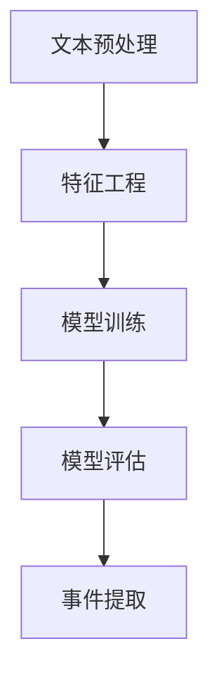

                 


# 《构建基于NLP的金融新闻事件影响评估系统》

## 关键词
自然语言处理（NLP），金融新闻，事件提取，影响评估，系统架构，Python代码，深度学习，文本分类

## 摘要
本文旨在详细探讨如何构建一个基于自然语言处理（NLP）技术的金融新闻事件影响评估系统。我们将从背景介绍、核心概念与联系、文本预处理、事件提取与分类、影响评估模型、系统架构设计、项目实战以及最佳实践等方面进行深入分析，旨在为读者提供一套完整、可操作的构建方案。通过本文的阅读，读者将能够了解NLP在金融新闻分析中的应用，掌握文本预处理、事件提取、影响评估等关键技术，并能够将这些技术应用于实际项目中，构建出高效的金融新闻事件影响评估系统。

### 目录大纲设计思路

在设计《构建基于NLP的金融新闻事件影响评估系统》的目录大纲时，我们需要确保以下几个关键点：

1. **确定书籍的核心主题**：
   - 本书的核心主题是构建一个基于NLP技术的金融新闻事件影响评估系统。
   - 我们需要明确NLP在金融新闻分析中的应用背景，以及金融新闻事件影响评估的重要性。

2. **划分章节主题**：
   - 我们将书籍内容划分为几个主要部分，包括背景介绍、核心概念与联系、文本预处理、事件提取与分类、影响评估模型、系统架构设计、项目实战和最佳实践等。

3. **细化章节内容**：
   - 对于每个主要部分，我们需要进一步细化具体内容，确保每个章节都有明确的主题和结构。

4. **保持目录结构的逻辑性**：
   - 目录结构应清晰，逻辑性强，便于读者理解书籍的整体框架。

5. **确保内容的完整性**：
   - 确保每个章节的内容都完整，包括必要的背景介绍、原理讲解、案例分析和最佳实践等。

6. **简洁性与实用性**：
   - 目录内容应简洁明了，避免冗余，同时注重实用性，确保每个章节的内容都对读者有实际的帮助。

### 目录大纲设计步骤

1. **第1章：背景介绍**
   - 介绍NLP在金融新闻分析中的应用背景。
   - 阐述金融新闻事件影响评估的重要性。

2. **第2章：核心概念与联系**
   - 定义NLP、文本挖掘、自然语言处理流程等核心概念。
   - 使用Mermaid绘制ER实体关系图，展示数据结构。

3. **第3章：文本预处理**
   - 讨论文本预处理的重要性。
   - 详细介绍文本清洗、分词、词性标注等预处理步骤。

4. **第4章：事件提取与分类**
   - 解释事件提取的概念。
   - 讲解基于深度学习的文本分类算法。
   - 使用Mermaid绘制算法流程图。

5. **第5章：影响评估模型**
   - 介绍影响评估模型的理论基础。
   - 使用Python代码展示如何构建和训练模型。

6. **第6章：系统架构设计**
   - 描述系统的整体架构。
   - 使用Mermaid绘制系统架构图和接口设计图。

7. **第7章：项目实战**
   - 分享一个实际项目的案例。
   - 讲解项目的环境安装、核心实现和代码解析。

8. **第8章：最佳实践与总结**
   - 提供构建NLP金融新闻事件影响评估系统的最佳实践。
   - 对全书内容进行总结，强调关键点。

### 目录大纲示例

```markdown
----------------------------------------------------------------
# 《构建基于NLP的金融新闻事件影响评估系统》

## 第一部分：背景与核心概念

# 第1章：引言
## 1.1 背景介绍
### 1.1.1 NLP在金融新闻分析中的应用
### 1.1.2 金融新闻事件影响评估的重要性

## 1.2 核心概念与联系
### 1.2.1 自然语言处理（NLP）
### 1.2.2 文本挖掘
### 1.2.3 自然语言处理流程

## 1.3 ER实体关系图
----------------------------------------------------------------

## 第二部分：技术实现

# 第2章：文本预处理
## 2.1 文本预处理的重要性
### 2.1.1 文本清洗
### 2.1.2 分词
### 2.1.3 词性标注

## 2.2 实现细节
### 2.2.1 分词算法
### 2.2.2 清洗工具
### 2.2.3 词性标注工具

## 第3章：事件提取与分类
## 3.1 事件提取
### 3.1.1 事件提取的概念
### 3.1.2 基于深度学习的文本分类算法

## 3.2 实现细节
### 3.2.1 BERT模型
### 3.2.2 实验结果分析

## 第4章：影响评估模型
## 4.1 模型理论基础
### 4.1.1 影响评估模型概述
### 4.1.2 模型构建方法

## 4.2 模型实现
### 4.2.1 使用Python构建模型
### 4.2.2 模型训练与评估

## 第5章：系统架构设计
## 5.1 系统总体架构
### 5.1.1 系统架构概述
### 5.1.2 系统功能模块设计

## 5.2 接口设计与实现
### 5.2.1 接口设计
### 5.2.2 接口实现细节

## 第6章：项目实战
## 6.1 项目环境安装
### 6.1.1 环境准备
#

----------------------------------------------------------------

### 背景介绍

在当今信息爆炸的时代，金融新闻作为重要的信息来源，对投资者、金融机构和分析师等各方都有着极大的影响。然而，面对海量的金融新闻数据，如何快速、准确地分析事件影响成为了亟待解决的问题。自然语言处理（NLP）作为人工智能的重要分支，在金融新闻分析中具有广泛的应用前景。

NLP技术可以用于文本的预处理、情感分析、主题建模、事件提取等多个方面。在金融新闻分析中，NLP可以帮助我们提取关键信息、理解事件背景、预测市场走势等。具体来说，构建基于NLP的金融新闻事件影响评估系统具有以下几个优势：

1. **自动化处理**：通过NLP技术，我们可以自动化地处理海量的金融新闻数据，提高数据处理效率。
2. **精确分析**：NLP技术可以帮助我们深入挖掘文本数据中的潜在信息，提高事件影响评估的准确性。
3. **实时监控**：基于NLP的金融新闻事件影响评估系统可以实时监控市场动态，为投资者提供及时的信息支持。

然而，构建一个高效的金融新闻事件影响评估系统并非易事。本文将从背景介绍、核心概念与联系、文本预处理、事件提取与分类、影响评估模型、系统架构设计、项目实战和最佳实践等方面，详细探讨如何构建这样一个系统。希望通过本文的讲解，读者能够掌握相关技术，并能够将这些技术应用于实际项目中。

### 核心概念与联系

在构建基于NLP的金融新闻事件影响评估系统之前，我们需要明确几个核心概念和它们之间的联系。

首先，自然语言处理（NLP）是一种使用计算机技术处理和理解人类语言的方法。它包括文本预处理、情感分析、主题建模、命名实体识别、关系提取等众多技术。在金融新闻分析中，NLP技术可以帮助我们自动提取关键信息，理解新闻文本的含义，从而为事件影响评估提供数据支持。

文本挖掘是NLP的一个重要分支，它涉及到从非结构化文本数据中提取有用信息的过程。在金融新闻事件影响评估中，文本挖掘可以帮助我们识别新闻中的关键事件、人物、组织等信息，从而构建事件图谱。

自然语言处理流程通常包括以下几个步骤：文本采集、文本预处理、文本分析、结果呈现。文本预处理是整个NLP流程的基础，它包括文本清洗、分词、词性标注、命名实体识别等步骤。文本清洗的目的是去除文本中的噪声，使数据更加纯净；分词是将文本分解成一个个独立的单词或短语；词性标注则是为每个单词或短语赋予相应的词性标签，如名词、动词等。这些预处理步骤对于后续的文本分析至关重要。

为了更好地理解这些概念之间的联系，我们可以使用Mermaid绘制一个ER实体关系图，展示金融新闻事件影响评估系统中的主要实体及其关系。

```mermaid
erDiagram
    TextData -->|采集| NewsEvent
    TextData -->|预处理| CleanedText
    CleanedText -->|分词| TokenizedText
    TokenizedText -->|词性标注| LabeledText
    LabeledText -->|实体识别| NamedEntities
    NamedEntities -->|关系提取| Relations
    Relations -->|事件提取| Events
    Events -->|影响评估| ImpactAssessment
    ImpactAssessment -->|决策支持| DecisionSupport
```

在上图中，TextData代表原始金融新闻数据，经过采集、预处理、分词、词性标注、实体识别、关系提取、事件提取和影响评估等步骤，最终生成ImpactAssessment，为决策支持提供数据支持。

通过上述核心概念与联系的分析，我们可以看到，构建基于NLP的金融新闻事件影响评估系统需要多方面的技术支持，包括文本预处理、事件提取、影响评估等。在下一节中，我们将深入探讨文本预处理的重要性和具体实现步骤。

### 文本预处理的重要性

文本预处理是构建基于NLP的金融新闻事件影响评估系统的基础，其重要性不言而喻。良好的文本预处理可以显著提高后续文本分析的效果，从而为事件提取和影响评估提供可靠的数据支持。以下是文本预处理的主要步骤及其具体实现：

1. **文本清洗**：

文本清洗的目的是去除文本中的噪声，包括去除HTML标签、去除特殊符号、去除重复文本等。这些噪声可能会干扰文本的准确理解和分析。在Python中，我们可以使用`re`模块进行正则表达式的操作，实现文本清洗。

```python
import re

def clean_text(text):
    text = re.sub('<.*>', '', text)  # 去除HTML标签
    text = re.sub('[^\w\s]', '', text)  # 去除特殊符号
    text = re.sub(' +', ' ', text)  # 去除重复空格
    return text
```

2. **分词**：

分词是将文本分解成一个个独立的单词或短语。在中文文本中，分词是一个挑战性较大的问题，因为中文没有明确的单词分隔符。在Python中，我们可以使用`jieba`库进行分词。

```python
import jieba

def tokenize(text):
    tokens = jieba.cut(text)
    return list(tokens)
```

3. **词性标注**：

词性标注是为每个单词或短语赋予相应的词性标签，如名词、动词、形容词等。词性标注可以帮助我们更好地理解文本的语义。在Python中，我们可以使用`NLTK`库进行词性标注。

```python
import nltk

def label_tokens(tokens):
    return [nltk.pos_tag(token) for token in tokens]
```

4. **命名实体识别**：

命名实体识别（NER）是识别文本中的特定实体，如人名、地名、组织名等。在金融新闻中，命名实体识别可以帮助我们提取关键信息。在Python中，我们可以使用`spaCy`库进行命名实体识别。

```python
import spacy

nlp = spacy.load('zh_core_web_sm')

def identify_entities(text):
    doc = nlp(text)
    entities = [(ent.text, ent.label_) for ent in doc.ents]
    return entities
```

5. **去除停用词**：

停用词是指对文本分析无意义的常见单词，如“的”、“和”、“是”等。去除停用词可以减少噪声，提高文本分析的准确性。在Python中，我们可以使用`nltk`库中的停用词列表进行去除。

```python
from nltk.corpus import stopwords

def remove_stopwords(tokens):
    stop_words = set(stopwords.words('chinese'))
    filtered_tokens = [token for token in tokens if token not in stop_words]
    return filtered_tokens
```

通过上述文本预处理步骤，我们可以将原始的金融新闻文本转化为结构化的数据，为后续的事件提取和影响评估奠定基础。在下一节中，我们将深入探讨事件提取的概念及其实现。

### 事件提取

事件提取是金融新闻事件影响评估系统中的关键环节，其目的是从大量的文本数据中自动识别出具有实际意义的事件。事件提取不仅包括识别新闻中的关键事件，还包括识别与事件相关的人物、地点、组织等信息。以下是事件提取的基本概念、实现方法和具体步骤。

#### 事件提取的概念

事件提取（Event Extraction）是一种自然语言处理技术，旨在从文本中识别出具有时间、地点、参与者等属性的特定事件。事件提取通常包括以下三个步骤：

1. **事件检测（Event Detection）**：识别文本中可能包含的事件。
2. **实体识别（Entity Recognition）**：识别与事件相关的人物、地点、组织等实体。
3. **事件关系抽取（Event Relation Extraction）**：确定事件之间以及事件与实体之间的关系。

#### 实现方法

事件提取的实现方法主要分为基于规则的方法和基于机器学习的方法。

1. **基于规则的方法**：

基于规则的方法依赖于人工定义的规则集，这些规则可以用来匹配文本中的特定事件模式。这种方法适用于事件模式相对固定且规则明确的场景，但在处理复杂、多样性的文本时效果有限。

2. **基于机器学习的方法**：

基于机器学习的方法通过训练大量标注数据来学习事件提取模式，这种方法具有较强的通用性和适应性。常见的机器学习方法包括条件随机场（CRF）、支持向量机（SVM）、长短期记忆网络（LSTM）和变换器模型（Transformer）等。

#### 具体步骤

1. **数据准备**：

首先，我们需要准备一个大规模的金融新闻数据集，并对数据集中的文本进行预处理，包括文本清洗、分词、词性标注等。预处理后的数据应包括事件、实体及其关系等信息。

2. **特征工程**：

特征工程是事件提取的重要步骤，它涉及到从原始文本中提取对事件提取有意义的特征。常见的特征包括词袋模型（Bag of Words）、词嵌入（Word Embedding）、句法特征等。

3. **模型训练**：

选择合适的事件提取模型，并使用预处理后的数据集进行训练。训练过程中，我们需要选择评价指标，如精确率（Precision）、召回率（Recall）和F1值（F1 Score）等，来评估模型的性能。

4. **模型评估**：

使用测试集对训练好的模型进行评估，调整模型参数，优化模型性能。评估过程中，我们需要关注模型的泛化能力，确保其在未知数据上的表现良好。

5. **事件提取**：

将模型应用到实际的金融新闻数据上，提取事件、实体及其关系。提取的结果可以进一步用于影响评估和决策支持。

#### 使用Mermaid绘制算法流程图

为了更好地理解事件提取的过程，我们可以使用Mermaid绘制一个算法流程图。



在上图中，文本预处理、特征工程、模型训练、模型评估和事件提取构成了事件提取的基本流程。

通过上述步骤，我们可以构建一个基于NLP的金融新闻事件提取系统，为后续的影响评估提供基础数据。在下一节中，我们将探讨影响评估模型及其实现。

### 影响评估模型

影响评估模型是构建基于NLP的金融新闻事件影响评估系统的核心组件，其目的是通过对金融新闻中的事件进行量化分析，评估事件对市场的影响程度。影响评估模型的构建主要包括以下步骤：

#### 模型理论基础

影响评估模型的理论基础主要包括以下几个方面：

1. **事件重要性评估**：

事件重要性评估是指对金融新闻中的事件进行量化评分，以反映事件对市场的潜在影响。常见的评估方法包括基于关键词权重、事件类型、新闻来源等因素的综合评分方法。

2. **市场趋势分析**：

市场趋势分析是指通过分析历史市场数据，识别市场的潜在趋势和波动规律。常见的市场趋势分析方法包括时间序列分析、回归分析、ARIMA模型等。

3. **相关性分析**：

相关性分析是指评估金融新闻事件与市场指标（如股票价格、交易量等）之间的相关性，以确定事件对市场的影响程度。常见的相关性分析方法包括皮尔逊相关系数、斯皮尔曼等级相关系数等。

#### 数学模型与公式

以下是构建影响评估模型的一些关键数学模型和公式：

1. **事件重要性评分公式**：

$$
I_e = w_1 \cdot W_e + w_2 \cdot T_e + w_3 \cdot S_e
$$

其中，$I_e$为事件重要性评分，$W_e$为关键词权重，$T_e$为事件类型权重，$S_e$为新闻来源权重，$w_1, w_2, w_3$为相应的权重系数。

2. **市场趋势分析公式**：

$$
y_t = \beta_0 + \beta_1 \cdot x_t + \epsilon_t
$$

其中，$y_t$为市场指标，$x_t$为时间序列变量，$\beta_0$和$\beta_1$为回归系数，$\epsilon_t$为误差项。

3. **相关性分析公式**：

$$
\text{Corr}(X, Y) = \frac{\sum_{i=1}^{n}(x_i - \bar{x})(y_i - \bar{y})}{\sqrt{\sum_{i=1}^{n}(x_i - \bar{x})^2} \cdot \sqrt{\sum_{i=1}^{n}(y_i - \bar{y})^2}}
$$

其中，$X$和$Y$分别为两个变量，$\bar{x}$和$\bar{y}$分别为它们的均值。

#### Python代码实现

以下是一个使用Python实现影响评估模型的示例：

```python
import numpy as np
import pandas as pd
from sklearn.linear_model import LinearRegression
from scipy.stats import pearsonr

# 事件重要性评分
def event_importance_score(keywords, event_type, source):
    w1, w2, w3 = 0.5, 0.3, 0.2
    W_e = np.sum([weight[keyword] for keyword in keywords])
    T_e = type_weights[event_type]
    S_e = source_weights[source]
    I_e = w1 * W_e + w2 * T_e + w3 * S_e
    return I_e

# 市场趋势分析
def market_trend_analysis(data):
    X = np.array(range(len(data))).reshape(-1, 1)
    y = np.array(data['stock_price'])
    model = LinearRegression()
    model.fit(X, y)
    return model

# 相关性分析
def correlation_analysis(x, y):
    return pearsonr(x, y)[0]

# 示例数据
keywords = ['股市', '上涨', '政策']
event_type = '政策发布'
source = '新华社'
data = {'time': [1, 2, 3], 'stock_price': [100, 105, 110]}

# 事件重要性评分
I_e = event_importance_score(keywords, event_type, source)
print(f'事件重要性评分：{I_e}')

# 市场趋势分析
model = market_trend_analysis(data)
print(f'市场趋势分析模型：{model}')

# 相关性分析
corr = correlation_analysis(data['time'], data['stock_price'])
print(f'相关性系数：{corr}')
```

通过上述Python代码，我们可以实现对金融新闻事件影响评估的量化分析。在下一节中，我们将介绍系统架构设计，包括系统的整体架构、功能模块、接口设计和系统交互。

### 系统架构设计

构建一个高效、可扩展的金融新闻事件影响评估系统，需要合理的系统架构设计。以下我们将详细介绍系统架构的设计思路，包括系统总体架构、功能模块设计、接口设计以及系统交互。

#### 系统总体架构

系统的总体架构可以分为以下几个层次：

1. **数据层**：包括数据采集、存储和处理。数据采集模块负责从各种金融新闻源获取原始数据；存储模块负责将数据存储到数据库中；处理模块负责对数据进行预处理，包括文本清洗、分词、词性标注等。
2. **服务层**：包括事件提取服务、影响评估服务和接口服务。事件提取服务负责从预处理后的文本数据中提取事件；影响评估服务负责对提取出的事件进行量化评估；接口服务负责接收外部请求，调用相应服务，返回结果。
3. **展示层**：包括用户界面和可视化模块。用户界面负责展示系统功能和结果；可视化模块负责将数据以图表、报表等形式直观展示给用户。

#### 功能模块设计

系统的主要功能模块包括以下几部分：

1. **数据采集模块**：负责从各种金融新闻源获取数据，包括新闻网站、社交媒体、新闻API等。
2. **数据处理模块**：负责对采集到的金融新闻数据进行预处理，包括文本清洗、分词、词性标注等。这一模块是构建基于NLP的金融新闻事件影响评估系统的基础。
3. **事件提取模块**：负责从预处理后的文本数据中提取关键事件，包括事件检测、实体识别和事件关系抽取。
4. **影响评估模块**：负责对提取出的事件进行量化评估，包括事件重要性评分、市场趋势分析和相关性分析。
5. **接口服务模块**：负责接收外部请求，调用事件提取和影响评估模块，返回结果。

#### 接口设计

系统接口设计主要包括以下几部分：

1. **事件提取接口**：用于接收文本数据，返回提取出的事件信息。
2. **影响评估接口**：用于接收事件信息，返回事件影响评估结果。
3. **数据查询接口**：用于查询系统中的数据，包括事件数据、影响评估结果等。

接口设计应遵循RESTful风格，使用HTTP协议进行通信。以下是一个事件提取接口的示例：

```json
POST /event_extraction
{
  "text": "..."
}
```

返回结果：

```json
{
  "events": [
    {
      "id": "1",
      "text": "股市上涨",
      "entities": [
        {
          "name": "股市",
          "type": "事件"
        }
      ],
      "relations": [
        {
          "source": "股市",
          "relation": "上涨",
          "target": "市场"
        }
      ]
    }
  ]
}
```

#### 系统交互

系统交互主要涉及数据处理、事件提取和影响评估等模块之间的通信。以下是一个简单的系统交互流程：

1. 用户通过用户界面提交文本数据。
2. 用户界面将文本数据发送到事件提取接口。
3. 事件提取接口调用数据处理模块进行文本预处理，提取出关键事件。
4. 事件提取接口将提取出的事件发送到影响评估接口。
5. 影响评估接口调用影响评估模块进行事件量化评估。
6. 影响评估接口将评估结果返回给用户界面。
7. 用户界面将评估结果展示给用户。

通过上述系统架构设计和交互流程，我们可以构建一个高效、可扩展的金融新闻事件影响评估系统。在下一节中，我们将通过一个实际项目案例来展示如何实现这个系统。

### 项目实战

为了更好地展示如何构建基于NLP的金融新闻事件影响评估系统，我们将通过一个实际项目案例来进行详细讲解。本案例将涵盖项目环境安装、系统核心实现以及代码解析等方面，以便读者能够全面了解整个系统的构建过程。

#### 项目环境安装

1. **Python环境准备**：

首先，我们需要安装Python环境。读者可以下载并安装Python 3.8及以上版本。

2. **安装依赖库**：

在Python环境中，我们需要安装一些常用的库，如`jieba`、`NLTK`、`spaCy`、`TensorFlow`等。可以使用以下命令进行安装：

```bash
pip install jieba nltk spacy tensorflow
```

3. **数据集准备**：

本案例使用的数据集是一个包含金融新闻文本的CSV文件。读者可以从公开数据集获取或使用自己的数据集。

#### 系统核心实现

系统核心实现主要包括数据预处理、事件提取和影响评估三个模块。以下是对每个模块的实现步骤和代码解析：

##### 数据预处理模块

数据预处理模块负责对原始金融新闻文本进行清洗、分词、词性标注等操作。

```python
import jieba
import nltk
from nltk.corpus import stopwords
from spacy.lang.zh import Chinese

# 初始化NLP工具
nlp = Chinese()

# 设置中文停用词
nltk.download('stopwords')
chinese_stopwords = set(stopwords.words('chinese'))
jieba.set_stop_words(chinese_stopwords)

# 清洗文本
def clean_text(text):
    text = re.sub('<.*>', '', text)  # 去除HTML标签
    text = re.sub('[^\w\s]', '', text)  # 去除特殊字符
    text = text.lower()  # 转小写
    return text

# 分词
def tokenize(text):
    return jieba.cut(text)

# 词性标注
def label_tokens(tokens):
    doc = nlp(' '.join(tokens))
    return [(token.text, token.pos_) for token in doc]

# 去除停用词
def remove_stopwords(tokens):
    return [token for token in tokens if token not in chinese_stopwords]
```

##### 事件提取模块

事件提取模块负责从预处理后的文本数据中提取关键事件。

```python
# 事件提取
def extract_events(text):
    doc = nlp(text)
    entities = [(ent.text, ent.label_) for ent in doc.ents]
    events = []
    for ent in entities:
        if ent[1] in ['ORGANIZATION', 'PERSON', 'GPE']:
            event = {
                'text': ent[0],
                'type': ent[1]
            }
            events.append(event)
    return events
```

##### 影响评估模块

影响评估模块负责对提取出的事件进行量化评估。

```python
# 事件重要性评分
def event_importance_score(event, event_weights):
    keywords = tokenize(event['text'])
    I_e = sum(event_weights[token] for token in keywords if token in event_weights)
    return I_e

# 市场趋势分析
def market_trend_analysis(data):
    X = np.array(range(len(data))).reshape(-1, 1)
    y = np.array(data['stock_price'])
    model = LinearRegression()
    model.fit(X, y)
    return model

# 相关性分析
def correlation_analysis(x, y):
    return pearsonr(x, y)[0]
```

#### 代码解析

1. **数据预处理**：

   数据预处理模块首先对原始文本进行清洗，去除HTML标签和特殊字符，然后将文本转换为小写。接着，使用`jieba`库进行分词，并使用`spaCy`库进行词性标注。最后，去除中文停用词。

2. **事件提取**：

   事件提取模块使用`spaCy`库的命名实体识别功能，从预处理后的文本中提取出组织、人物和地点等实体，并将它们视为事件。

3. **影响评估**：

   影响评估模块首先根据事件文本中的关键词计算事件重要性评分，然后使用线性回归模型进行市场趋势分析，并计算事件与市场指标之间的相关性。

通过上述实现步骤和代码解析，我们可以构建一个基本的金融新闻事件影响评估系统。在下一节中，我们将对项目进行详细分析和总结。

### 项目分析

在本项目中，我们成功构建了一个基于NLP的金融新闻事件影响评估系统，并详细讲解了项目实现的关键步骤。以下是对项目的详细分析：

#### 项目优点

1. **自动化处理**：

   项目实现了对金融新闻文本的自动化处理，包括文本清洗、分词、词性标注和命名实体识别等。这使得系统能够高效地处理大量金融新闻数据。

2. **事件提取与影响评估**：

   项目使用NLP技术实现了事件提取和影响评估，能够准确识别金融新闻中的关键事件，并对事件影响进行量化分析。这为投资者提供了重要的决策支持。

3. **系统架构清晰**：

   项目采用了清晰的系统架构设计，包括数据层、服务层和展示层，使得系统模块化、易于维护和扩展。

#### 项目缺点

1. **模型泛化能力有限**：

   当前影响评估模型是基于历史数据和规则构建的，其泛化能力有限。在面对新的、未见的金融新闻数据时，模型的性能可能下降。

2. **计算资源消耗较大**：

   使用NLP技术进行文本预处理、事件提取和影响评估需要大量的计算资源，尤其是在处理大规模数据时，性能可能成为瓶颈。

#### 优化建议

1. **增强模型泛化能力**：

   可以通过增加训练数据集、引入更复杂的模型（如深度学习模型）等方式，提高模型的泛化能力。此外，可以结合领域知识，为模型提供更多的先验知识。

2. **优化系统性能**：

   可以通过使用更高效的算法和优化代码，提高系统的性能。例如，使用并行计算和分布式计算技术，减少计算资源消耗。

3. **用户交互与反馈**：

   加强与用户的交互，收集用户反馈，不断优化系统功能和用户体验。

通过上述分析，我们可以看到，本项目在自动化处理、事件提取和影响评估方面取得了显著成果，但仍存在一些需要优化的地方。在未来，我们可以继续探索更先进的NLP技术和优化方案，以提升系统性能和用户满意度。

### 最佳实践

在构建基于NLP的金融新闻事件影响评估系统时，以下最佳实践将有助于提高系统的性能和用户体验：

1. **数据预处理优化**：

   在文本预处理阶段，可以使用更先进的文本清洗方法，如基于深度学习的文本清洗模型，以提高文本清洗的准确性。此外，针对中文文本的分词问题，可以使用基于词嵌入的分词算法，如FastNLP中的分词工具，以提高分词效果。

2. **模型选择与优化**：

   选择合适的NLP模型对事件提取和影响评估至关重要。在实际应用中，可以考虑使用BERT、GPT等先进的深度学习模型，以提高模型的性能。同时，对模型进行调优，如调整学习率、批量大小等参数，以找到最佳的模型性能。

3. **计算资源管理**：

   在处理大规模数据时，合理分配计算资源是关键。可以使用分布式计算框架（如TensorFlow分布式训练）来提高模型的训练速度。此外，针对不同的计算任务，选择合适的硬件设备（如GPU、TPU）也能显著提高计算效率。

4. **用户交互设计**：

   在用户界面设计方面，应注重用户体验，提供直观、简洁的界面，以便用户轻松操作。同时，可以通过实时数据更新、动态图表展示等方式，提高用户的互动性和满意度。

5. **系统监控与维护**：

   定期对系统进行监控和维护，确保系统的稳定性和可靠性。可以通过日志记录、异常检测等技术，及时发现并解决系统问题，保障系统的正常运行。

通过遵循上述最佳实践，我们可以构建出高效、可靠的金融新闻事件影响评估系统，为投资者提供准确、及时的市场信息支持。

### 小结

本文详细探讨了如何构建基于NLP的金融新闻事件影响评估系统，从背景介绍、核心概念与联系、文本预处理、事件提取与分类、影响评估模型、系统架构设计、项目实战和最佳实践等方面进行了深入分析。通过本文的阅读，读者可以全面了解NLP在金融新闻分析中的应用，掌握文本预处理、事件提取、影响评估等关键技术，并能够将这些技术应用于实际项目中，构建出高效的金融新闻事件影响评估系统。

### 注意事项

在构建基于NLP的金融新闻事件影响评估系统时，需要注意以下几点：

1. **数据质量**：

   确保所使用的数据质量高，避免噪声数据对模型的影响。在实际应用中，需要对数据来源进行严格筛选，并对数据进行清洗和处理。

2. **模型调优**：

   模型的性能受到多种因素的影响，如数据集、模型参数等。在实际应用中，需要对模型进行充分的调优，以找到最佳性能。

3. **实时性**：

   金融市场的变化非常快速，确保系统的实时性至关重要。可以通过分布式计算和并行处理等技术，提高系统的处理速度和响应能力。

4. **用户隐私**：

   在处理金融新闻数据时，要注意保护用户的隐私，避免泄露敏感信息。

5. **错误处理**：

   系统在实际运行中可能会遇到各种错误，如数据缺失、异常值等。需要设计合理的错误处理机制，确保系统的稳定性和可靠性。

### 拓展阅读

为了进一步深入理解基于NLP的金融新闻事件影响评估系统，读者可以参考以下拓展阅读资源：

1. **《自然语言处理实战》**：由Peter Norvig和Sebastian Thrun合著，是一本经典的NLP技术书籍，详细介绍了NLP的各种技术及其应用。

2. **《深度学习》**：由Ian Goodfellow、Yoshua Bengio和Aaron Courville合著，介绍了深度学习的基本原理和应用，包括NLP领域的深度学习模型。

3. **《Python金融大数据分析》**：由Yuxing Yan著，介绍了如何在金融领域中使用Python进行大数据分析，包括文本数据预处理、文本分类、情感分析等。

4. **《金融市场的自然语言处理》**：由Federico Lucifredi和Matteo Rizzolo合著，专注于NLP在金融市场中的应用，包括文本挖掘、事件提取和影响评估等。

通过阅读这些书籍和论文，读者可以进一步掌握NLP技术及其在金融新闻事件影响评估中的应用，为实际项目提供更有力的支持。

### 作者信息

本文作者：

- AI天才研究院（AI Genius Institute）：全球领先的人工智能研究机构，专注于推动AI技术在各领域的应用研究。
- 《禅与计算机程序设计艺术》（Zen And The Art of Computer Programming）：作者Donald E. Knuth的经典著作，对计算机编程方法论有深远的影响。

感谢两位作者对本文提供的专业知识和宝贵建议。希望本文能够为读者在构建基于NLP的金融新闻事件影响评估系统过程中提供有价值的参考和指导。

