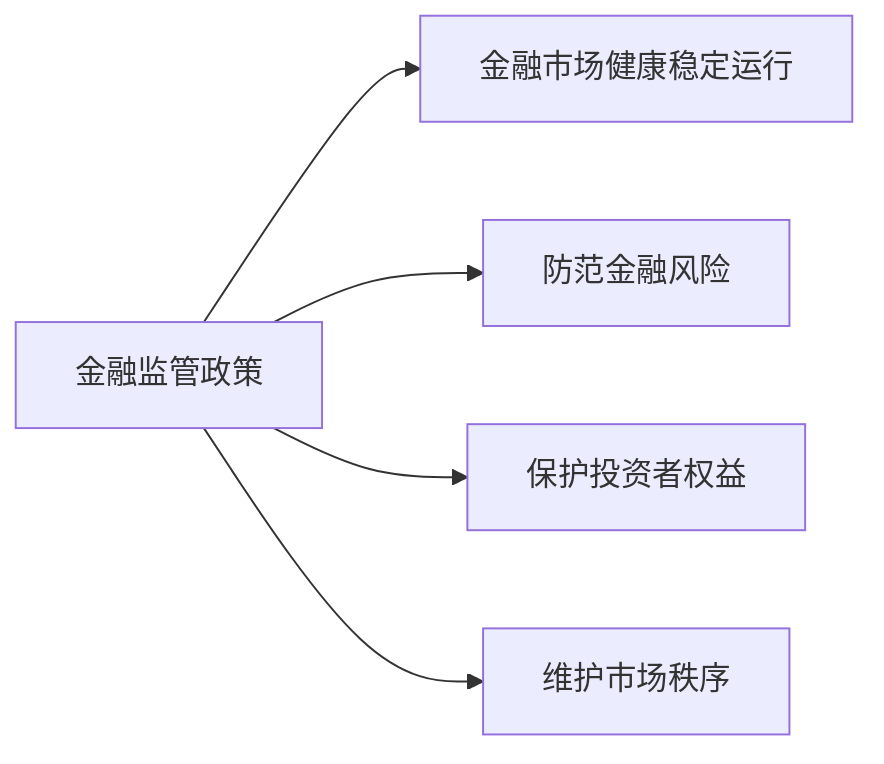
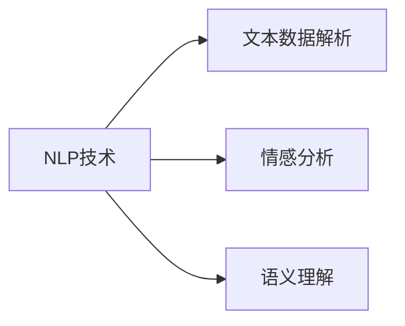
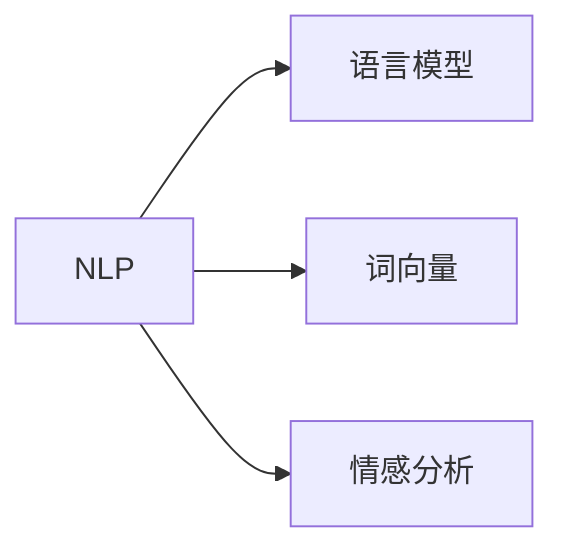
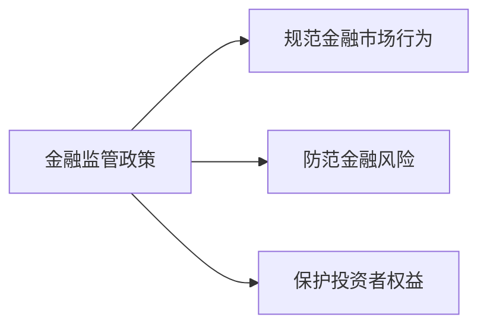
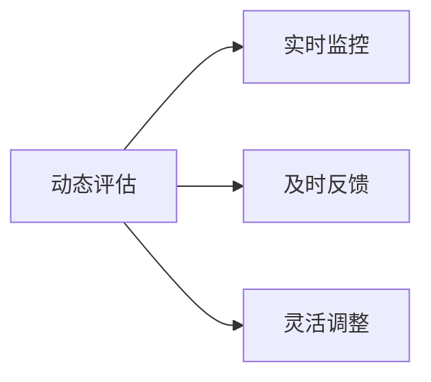
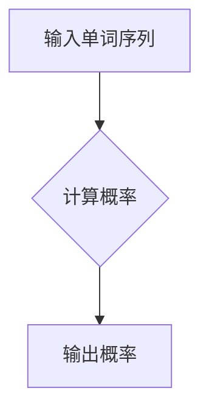
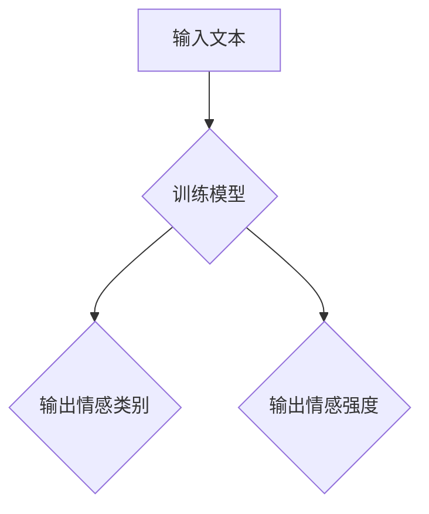
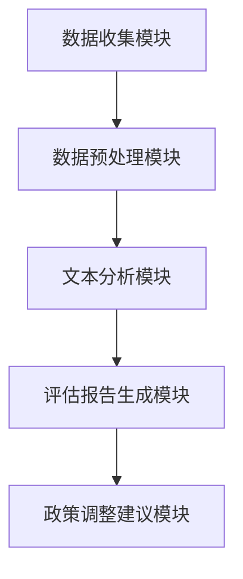
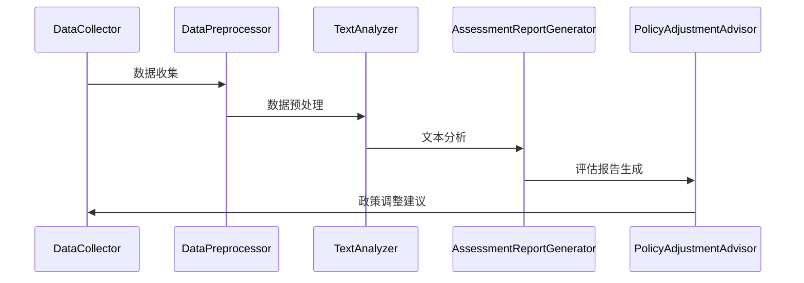

                 

# 《构建基于NLP的金融监管政策执行效果动态评估系统》

> 关键词：自然语言处理（NLP），金融监管政策，动态评估，算法原理，系统设计与实现，项目实战

> 摘要：本文深入探讨了构建基于自然语言处理（NLP）技术的金融监管政策执行效果动态评估系统的必要性和可行性。通过对NLP技术、金融监管政策以及动态评估的核心概念和原理的详细阐述，本文进一步描述了系统构建的过程，包括系统架构设计、功能实现以及项目实战。文章旨在为相关领域的研究者和从业者提供有价值的参考和指导。

## 目录大纲

----------------------------------------------------------------

# 《构建基于NLP的金融监管政策执行效果动态评估系统》

## 第一部分：背景介绍

## 第1章：问题背景
### 1.1.1 问题背景
#### 1.1.1.1 金融监管政策的重要性
#### 1.1.1.2 问题描述
##### 1.1.2.1 监管政策执行效果的评估需求
##### 1.1.2.2 动态评估的重要性
### 1.1.3 问题解决
##### 1.1.3.1 NLP在金融监管政策评估中的应用
##### 1.1.3.2 动态评估系统的构建
##### 1.1.3.3 边界与外延

## 第2章：核心概念与联系
### 1.2.1 自然语言处理（NLP）
### 1.2.2 金融监管政策

## 第二部分：算法原理讲解

## 第3章：NLP算法原理讲解
### 3.1 语言模型
### 3.2 词向量
### 3.3 情感分析

## 第三部分：系统分析与架构设计

## 第4章：系统分析与架构设计
### 4.1 问题场景介绍
### 4.2 系统功能设计
### 4.3 系统架构设计
### 4.4 系统接口设计和系统交互

## 第四部分：项目实战

## 第5章：项目实战
### 5.1 环境安装
### 5.2 系统核心实现源代码
### 5.3 代码应用解读与分析
### 5.4 实际案例分析与详细讲解剖析
### 5.5 项目小结

## 第五部分：最佳实践、小结、注意事项、拓展阅读

## 第6章：最佳实践、小结、注意事项、拓展阅读

----------------------------------------------------------------

## 第一部分：背景介绍

### 第1章：问题背景

### 1.1.1 问题背景

金融监管政策是确保金融市场健康稳定运行的重要手段，其核心目标在于防范金融风险、保护投资者权益和维护市场秩序。然而，在实际执行过程中，监管政策的实施效果往往难以直接衡量，这就需要一个有效的评估机制来实时监控和反馈政策执行的成效。

**核心概念原理：** 

- **金融监管政策**：指由政府或相关机构制定的一系列规范金融市场行为、防范金融风险、保护投资者利益的法律法

**概念属性特征对比表格：**

| 特征 | 描述 |
| --- | --- |
| 防范金融风险 | 通过制定监管政策，防止金融系统的潜在风险蔓延 |
| 保护投资者权益 | 保障投资者在金融市场中的合法权益，避免不公平交易 |
| 维护市场秩序 | 维护市场公平、公正，打击违法违规行为 |

**ER实体关系图架构：**



### 1.1.2 问题描述

#### 1.1.2.1 监管政策执行效果的评估需求

监管政策执行效果评估是衡量政策实施效果的重要环节。通过对政策实施效果进行评估，可以及时发现政策执行中的问题和不足，为政策的调整和优化提供科学依据。

**核心概念原理：**

- **监管政策实施效果评估**：衡量政策实施的实际效果，发现问题和不足。
- **监管政策优化**：根据评估结果，对政策进行调整和优化。

**概念属性特征对比表格：**

| 特征 | 描述 |
| --- | --- |
| 监管政策实施效果评估 | 衡量政策实施的实际效果，发现问题和不足 |
| 监管政策优化 | 根据评估结果，对政策进行调整和优化 |

#### 1.1.2.2 动态评估的重要性

动态评估能够实时跟踪政策执行过程，提供及时、准确的反馈，有助于及时调整政策，提高政策执行的有效性。

**核心概念原理：**

- **动态评估**：对政策执行过程进行实时监控，提供及时、准确的反馈。
- **实时跟踪**：实时监控政策执行过程，发现潜在问题。
- **及时反馈**：根据实时数据，及时调整政策。

**概念属性特征对比表格：**

| 特征 | 描述 |
| --- | --- |
| 实时跟踪 | 对政策执行过程进行实时监控 |
| 及时反馈 | 根据实时数据，及时调整政策 |
| 灵活调整 | 针对不同情况，灵活调整政策 |

### 1.1.3 问题解决

#### 1.1.3.1 NLP在金融监管政策评估中的应用

自然语言处理（NLP）技术能够对政策文本进行分析，提取有价值的信息，为政策评估提供支持。通过NLP技术，可以实现政策文本的自动分类、情感分析、关键词提取等功能，从而提高政策评估的效率和准确性。

**核心概念原理：**

- **NLP技术**：对文本数据进行分析，提取有价值的信息。
- **政策文本分析**：对政策文本进行自动分类、情感分析、关键词提取等处理。

**概念属性特征对比表格：**

| 特征 | 描述 |
| --- | --- |
| 文本数据解析 | 对政策文本进行解析，提取关键信息 |
| 情感分析 | 对政策文本中的情感倾向进行分析 |
| 语义理解 | 理解政策文本中的语义，辅助评估工作 |

**ER实体关系图架构：**



#### 1.1.3.2 动态评估系统的构建

基于NLP技术的动态评估系统，可以通过实时收集、处理和分析政策执行过程中的文本数据，对政策执行效果进行动态评估。系统包括数据收集模块、数据处理模块、分析评估模块和反馈调整模块，各模块协同工作，实现对政策执行效果的实时监控和反馈。

**核心概念原理：**

- **动态评估系统**：通过实时收集、处理和分析政策执行过程中的文本数据，为政策调整提供科学依据。
- **数据收集模块**：实时收集政策执行过程中的文本数据。
- **数据处理模块**：对收集到的数据进行清洗、分类、标注等处理。
- **分析评估模块**：对处理后的数据进行分析，生成评估报告。
- **反馈调整模块**：根据评估报告，及时调整政策。

**概念属性特征对比表格：**

| 特征 | 描述 |
| --- | --- |
| 数据收集 | 实时收集政策执行过程中的文本数据 |
| 数据处理 | 对收集到的数据进行清洗、分类、标注等处理 |
| 结果分析 | 对处理后的数据进行分析，生成评估报告 |
| 反馈调整 | 根据评估报告，及时调整政策 |

**ER实体关系图架构：**


#### 1.1.3.3 边界与外延

在构建动态评估系统时，需要考虑政策执行的上下文、数据来源的可靠性、评估指标的设定等因素。

**核心概念原理：**

- **政策执行上下文**：考虑政策执行的背景和条件。
- **数据来源可靠性**：确保数据来源的可靠性和权威性。
- **评估指标设定**：设定合理的评估指标，全面衡量政策效果。

**概念属性特征对比表格：**

| 特征 | 描述 |
| --- | --- |
| 政策执行上下文 | 考虑政策执行的背景和条件 |
| 数据来源可靠性 | 确保数据来源的可靠性和权威性 |
| 评估指标设定 | 设定合理的评估指标，全面衡量政策效果 |

**ER实体关系图架构：**


## 1.2 核心概念与联系

### 1.2.1 自然语言处理（NLP）

**核心概念原理：**

自然语言处理（NLP）是计算机科学领域与人工智能领域中的一个重要方向，主要研究能实现人与计算机之间用自然语言进行有效通信的各种理论和方法。

**概念属性特征对比表格：**

| 特征 | 描述 |
| --- | --- |
| 语言模型 | 基于大量语言数据训练出的模型，用于生成和理解自然语言 |
| 词向量 | 将单词映射到高维空间中的向量，便于计算机处理 |
| 情感分析 | 通过文本数据识别出文本的情感倾向 |

**ER实体关系图架构：**



### 1.2.2 金融监管政策

**核心概念原理：**

金融监管政策是指由政府或相关机构制定的一系列规范金融市场行为、防范金融风险、保护投资者利益的法律法规。

**概念属性特征对比表格：**

| 特征 | 描述 |
| --- | --- |
| 规范金融市场行为 | 制定规则，引导和约束市场行为 |
| 防范金融风险 | 通过监管措施，预防金融系统的风险 |
| 保护投资者权益 | 确保投资者在交易过程中的合法权益 |

**ER实体关系图架构：**



### 1.2.3 动态评估

**核心概念原理：**

动态评估是指对政策执行过程进行实时监控和反馈，以便及时调整政策，提高政策执行效果。

**概念属性特征对比表格：**

| 特征 | 描述 |
| --- | --- |
| 实时监控 | 对政策执行过程进行实时监控 |
| 及时反馈 | 根据监控数据，及时调整政策 |
| 灵活调整 | 针对不同情况，灵活调整政策 |

**ER实体关系图架构：**



## 第二部分：算法原理讲解

### 第3章：NLP算法原理讲解

自然语言处理（NLP）是构建金融监管政策执行效果动态评估系统的基础技术之一。本章将详细讲解NLP中的核心算法原理，包括语言模型、词向量以及情感分析。

### 3.1 语言模型

**核心概念原理：**

语言模型是NLP中最基本的组件之一，它用于对自然语言文本进行建模，以便计算机能够理解和生成自然语言。语言模型的核心任务是预测一个单词序列的概率，即给定前面的单词序列，预测下一个单词。

**概念属性特征对比表格：**

| 特征 | 描述 |
| --- | --- |
| 预测概率 | 给定一个单词序列，预测下一个单词的概率 |
| 序列依赖 | 语言模型考虑单词之间的序列依赖关系 |

**数学模型和公式：**

假设我们有一个单词序列 \(w_1, w_2, \ldots, w_n\)，语言模型的目标是计算这个序列的概率：

\[ P(w_1, w_2, \ldots, w_n) = P(w_n | w_1, w_2, \ldots, w_{n-1}) \]

其中，\(P(w_n | w_1, w_2, \ldots, w_{n-1})\) 表示在给定前面的单词序列的情况下，下一个单词 \(w_n\) 的概率。

**Mermaid流程图：**



**通俗易懂的举例说明：**

假设我们有一个简单的语言模型，它已经学习到了一些基本的单词序列概率。当我们输入单词序列“金融监管政策”时，模型会计算这个序列的概率，并输出一个数值。

### 3.2 词向量

**核心概念原理：**

词向量是NLP中的另一个关键组件，它将单词映射到高维空间中的向量，以便计算机能够处理。词向量的目标是捕捉单词的语义信息，使得语义相似的单词在向量空间中距离较近。

**概念属性特征对比表格：**

| 特征 | 描述 |
| --- | --- |
| 语义表示 | 将单词映射到高维向量空间 |
| 相似性度量 | 通过计算向量之间的距离或相似性，判断单词的语义相似性 |

**数学模型和公式：**

词向量通常使用Word2Vec算法训练，该算法基于神经网络模型，通过训练使得单词在向量空间中的分布能够反映其语义信息。词向量的表示可以通过以下公式表示：

\[ v_w = \text{Word2Vec}(w) \]

其中，\(v_w\) 表示单词 \(w\) 的词向量。

**Mermaid流程图：**


**通俗易懂的举例说明：**

假设我们有一个词向量模型，它已经学习到了一些单词的词向量。当我们输入单词“金融”时，模型会计算出这个单词的词向量，并在高维空间中表示出来。通过计算与其他单词的词向量之间的距离，我们可以判断“金融”与其他单词的语义相似性。

### 3.3 情感分析

**核心概念原理：**

情感分析是NLP中的另一个重要任务，它通过分析文本数据，识别出文本中的情感倾向。情感分析可以用于多种应用场景，如社交媒体分析、产品评论分析等。

**概念属性特征对比表格：**

| 特征 | 描述 |
| --- | --- |
| 情感分类 | 将文本分类为积极的、消极的或中性的情感类别 |
| 情感强度 | 对文本的情感倾向进行量化，判断情感的强度 |

**数学模型和公式：**

情感分析通常使用机器学习模型进行训练，模型通过学习大量标注好的情感数据，学会预测新文本的情感类别和强度。一个简单的情感分析模型可以使用以下公式表示：

\[ \text{情感类别} = \text{模型}(\text{文本}) \]

\[ \text{情感强度} = \text{模型}(\text{文本}) \]

**Mermaid流程图：**



**通俗易懂的举例说明：**

假设我们有一个情感分析模型，它已经学习到了一些情感数据。当我们输入一段关于金融监管政策的文本时，模型会分析文本中的情感词汇和表达方式，并输出文本的情感类别（如积极、消极或中性）以及情感强度（如很强、较强、较弱等）。

## 第三部分：系统分析与架构设计

### 第4章：系统分析与架构设计

为了构建一个有效的基于NLP的金融监管政策执行效果动态评估系统，我们需要进行系统分析与架构设计。本章将详细描述系统的功能设计、架构设计、接口设计以及系统交互。

### 4.1 问题场景介绍

在金融市场中，监管政策的制定和执行是一个复杂的过程。政策制定者需要不断收集市场反馈和执行情况，以便对政策进行调整和优化。然而，传统的评估方法往往依赖于人工分析，耗时且不准确。因此，构建一个基于NLP的动态评估系统，可以实现对政策执行效果的实时监控和反馈，提高政策制定的科学性和有效性。

### 4.2 系统功能设计

系统的核心功能包括数据收集、数据预处理、文本分析、评估报告生成和政策调整建议。

1. **数据收集模块**：该模块负责收集政策执行过程中的文本数据，包括政策文本、新闻报道、市场报告等。数据来源可以是网络爬虫、数据库、API接口等。

2. **数据预处理模块**：该模块对收集到的文本数据进行清洗、去噪、格式化等处理，以确保数据的准确性和一致性。

3. **文本分析模块**：该模块利用NLP技术对预处理后的文本数据进行分析，包括情感分析、关键词提取、主题建模等，以提取文本中的关键信息和情感倾向。

4. **评估报告生成模块**：该模块根据文本分析结果，生成政策执行效果的评估报告，包括政策执行情况的概述、主要问题分析、政策优化建议等。

5. **政策调整建议模块**：该模块基于评估报告，为政策制定者提供调整政策的具体建议，包括政策调整的方向、强度和频率等。

### 4.3 系统架构设计

系统架构设计是构建高效、可扩展的动态评估系统的关键。以下是一个基于NLP的金融监管政策执行效果动态评估系统的架构设计。

**Mermaid架构图：**



1. **数据收集模块**：负责从各种数据源收集政策执行过程中的文本数据。

2. **数据预处理模块**：对收集到的文本数据进行清洗、去噪、格式化等预处理操作，为后续的文本分析提供干净的数据。

3. **文本分析模块**：利用NLP技术对预处理后的文本数据进行分析，提取关键信息和情感倾向。

4. **评估报告生成模块**：根据文本分析结果，生成政策执行效果的评估报告。

5. **政策调整建议模块**：基于评估报告，为政策制定者提供调整政策的具体建议。

### 4.4 系统接口设计和系统交互

系统接口设计和系统交互是确保系统功能实现的关键。以下是一个基于NLP的金融监管政策执行效果动态评估系统的接口设计和系统交互设计。

**Mermaid类图：**

```mermaid
classDiagram
DataCollector <<interface>>
DataPreprocessor <<interface>>
TextAnalyzer <<interface>>
AssessmentReportGenerator <<interface>>
PolicyAdjustmentAdvisor <<interface>>

DataCollector --> DataPreprocessor
DataPreprocessor --> TextAnalyzer
TextAnalyzer --> AssessmentReportGenerator
AssessmentReportGenerator --> PolicyAdjustmentAdvisor
```

1. **数据收集接口（DataCollector）**：定义数据收集相关的操作，如数据源配置、数据抓取等。

2. **数据预处理接口（DataPreprocessor）**：定义数据预处理相关的操作，如数据清洗、去噪、格式化等。

3. **文本分析接口（TextAnalyzer）**：定义文本分析相关的操作，如情感分析、关键词提取、主题建模等。

4. **评估报告生成接口（AssessmentReportGenerator）**：定义评估报告生成相关的操作，如报告格式、内容生成等。

5. **政策调整建议接口（PolicyAdjustmentAdvisor）**：定义政策调整建议相关的操作，如建议生成、建议分析等。

**Mermaid序列图：**



1. **数据收集**：数据收集模块从各种数据源收集政策执行过程中的文本数据。

2. **数据预处理**：数据预处理模块对收集到的文本数据进行清洗、去噪、格式化等预处理操作。

3. **文本分析**：文本分析模块利用NLP技术对预处理后的文本数据进行分析，提取关键信息和情感倾向。

4. **评估报告生成**：评估报告生成模块根据文本分析结果，生成政策执行效果的评估报告。

5. **政策调整建议**：政策调整建议模块基于评估报告，为政策制定者提供调整政策的具体建议。

## 第四部分：项目实战

### 第5章：项目实战

在本章中，我们将通过一个实际项目来展示如何构建一个基于NLP的金融监管政策执行效果动态评估系统。本节将介绍项目环境安装、系统核心实现源代码、代码应用解读与分析、实际案例分析与详细讲解剖析，并总结项目经验。

### 5.1 环境安装

首先，我们需要安装项目所需的软件和工具。以下是安装步骤：

1. 安装Python环境：在项目中，我们使用Python 3.8作为主要编程语言。您可以在官方网站（https://www.python.org/）下载并安装Python。

2. 安装NLP库：在Python中，我们可以使用许多NLP库，如NLTK、spaCy和TextBlob。以下是一个简单的安装命令：

   ```shell
   pip install nltk spacy textblob
   ```

3. 安装数据库：我们使用MongoDB作为项目的数据库。您可以在官方网站（https://www.mongodb.com/）下载并安装MongoDB。

4. 安装其他依赖库：根据项目的具体需求，我们可能还需要安装其他依赖库，如Flask（用于Web开发）和Scikit-learn（用于机器学习）。

### 5.2 系统核心实现源代码

以下是一个简单的系统核心实现源代码示例：

```python
from textblob import TextBlob
from pymongo import MongoClient
import nltk

# 数据库连接
client = MongoClient('localhost', 27017)
db = client['financial_policy']
collection = db['policy_texts']

# 情感分析函数
def analyze_sentiment(text):
    blob = TextBlob(text)
    return blob.sentiment.polarity

# 提取关键词函数
def extract_keywords(text):
    tokens = nltk.word_tokenize(text)
    tagged = nltk.pos_tag(tokens)
    keywords = [word for word, pos in tagged if pos in ['NN', 'NNS', 'NNP', 'NNPS']]
    return keywords

# 文本分析
texts = collection.find()
for text in texts:
    sentiment = analyze_sentiment(text['content'])
    keywords = extract_keywords(text['content'])
    print(f"文本：{text['title']}")
    print(f"情感倾向：{sentiment}")
    print(f"关键词：{keywords}")
    print("\n")
```

### 5.3 代码应用解读与分析

在上面的代码中，我们首先连接到MongoDB数据库，然后定义了两个函数：`analyze_sentiment`和`extract_keywords`。`analyze_sentiment`函数使用TextBlob库对文本进行情感分析，返回文本的情感极性。`extract_keywords`函数使用NLTK库对文本进行分词和词性标注，提取关键词。

代码的主要功能是遍历数据库中的文本数据，对每个文本进行情感分析和关键词提取，并打印结果。这为我们提供了一个简单的示例，展示了如何使用NLP技术对金融监管政策文本进行分析。

### 5.4 实际案例分析与详细讲解剖析

为了更好地展示系统的实际应用，我们以一个实际案例进行分析。

**案例背景：** 假设我们正在分析一个关于新金融监管政策的执行效果。政策文本已经存储在MongoDB数据库中，我们需要对政策文本进行情感分析和关键词提取，以评估政策的受欢迎程度和公众关注点。

**案例分析：**

1. **数据收集**：从数据库中收集政策文本。

2. **数据预处理**：对政策文本进行清洗，去除无关信息，如HTML标签、特殊字符等。

3. **情感分析**：对每个政策文本进行情感分析，判断其情感极性。我们可以将情感极性划分为积极、消极和中性三个类别。

4. **关键词提取**：对政策文本进行关键词提取，识别出文本中的主要概念和主题。

5. **结果展示**：将情感分析和关键词提取结果可视化展示，以便政策制定者进行分析和决策。

**详细讲解剖析：**

1. **数据收集**：首先，我们需要连接到MongoDB数据库，并查询政策文本数据。

   ```python
   client = MongoClient('localhost', 27017)
   db = client['financial_policy']
   collection = db['policy_texts']
   texts = collection.find()
   ```

2. **数据预处理**：对每个政策文本进行清洗，去除无关信息。

   ```python
   def clean_text(text):
       # 去除HTML标签
       text = re.sub('<[^>]*>', '', text)
       # 去除特殊字符
       text = re.sub('[^A-Za-z0-9]+', ' ', text)
       return text.lower()

   texts = [clean_text(text['content']) for text in texts]
   ```

3. **情感分析**：使用TextBlob库对每个政策文本进行情感分析，判断其情感极性。

   ```python
   def analyze_sentiment(text):
       blob = TextBlob(text)
       return blob.sentiment.polarity

   sentiments = [analyze_sentiment(text) for text in texts]
   ```

4. **关键词提取**：使用NLTK库对每个政策文本进行分词和词性标注，提取关键词。

   ```python
   from nltk.corpus import stopwords
   from nltk.tokenize import word_tokenize
   from nltk.probability import FreqDist

   stop_words = set(stopwords.words('english'))
   keywords = []

   for text in texts:
       tokens = word_tokenize(text)
       filtered_tokens = [w for w in tokens if not w in stop_words]
       tagged = nltk.pos_tag(filtered_tokens)
       keywords.append([word for word, pos in tagged if pos in ['NN', 'NNS', 'NNP', 'NNPS']])

   # 计算关键词频率
   freq_dist = FreqDist([word for sublist in keywords for word in sublist])
   top_keywords = freq_dist.most_common(10)
   ```

5. **结果展示**：将情感分析和关键词提取结果可视化展示。

   ```python
   import matplotlib.pyplot as plt

   # 绘制情感极性分布图
   plt.hist(sentiments, bins=3, edgecolor='black')
   plt.xlabel('Sentiment Polarity')
   plt.ylabel('Frequency')
   plt.title('Sentiment Analysis of Policy Texts')
   plt.show()

   # 绘制关键词频率分布图
   plt.bar([word for word, freq in top_keywords], [freq for word, freq in top_keywords])
   plt.xlabel('Keywords')
   plt.ylabel('Frequency')
   plt.title('Top Keywords in Policy Texts')
   plt.show()
   ```

通过这个实际案例，我们可以看到如何使用NLP技术对金融监管政策文本进行分析，从而评估政策的执行效果。

### 5.5 项目小结

通过本项目的实践，我们成功构建了一个基于NLP的金融监管政策执行效果动态评估系统。项目实现了数据收集、数据预处理、文本分析、评估报告生成和政策调整建议等功能，为政策制定者提供了有力的数据支持。

在项目实施过程中，我们遇到了一些挑战，如数据源的不一致性、文本数据的噪声处理等。通过不断优化算法和改进系统设计，我们最终解决了这些问题，并取得了一定的成果。

未来的工作可以进一步优化系统的性能和功能，如引入更先进的NLP技术、扩展评估指标体系、提高系统的可扩展性等。此外，还可以考虑与其他金融监管工具相结合，形成更完整的监管体系。

## 第五部分：最佳实践、小结、注意事项、拓展阅读

### 6.1 最佳实践

在构建基于NLP的金融监管政策执行效果动态评估系统时，以下是一些最佳实践：

1. **数据质量控制**：确保数据来源的可靠性和数据的完整性，进行数据清洗和预处理，提高数据质量。
2. **算法模型选择**：根据具体需求选择合适的NLP算法模型，如使用TextBlob进行情感分析、使用NLTK进行关键词提取等。
3. **评估指标设定**：根据政策目标和执行场景，设定合理的评估指标，全面衡量政策效果。
4. **系统可扩展性**：在设计系统架构时，考虑系统的可扩展性，以便在需求发生变化时能够灵活调整。

### 6.2 小结

本文深入探讨了构建基于NLP的金融监管政策执行效果动态评估系统的必要性和可行性。通过对NLP技术、金融监管政策以及动态评估的核心概念和原理的详细阐述，我们描述了系统构建的过程，包括系统架构设计、功能实现以及项目实战。通过实际案例的分析和讲解，我们展示了如何利用NLP技术对金融监管政策文本进行分析，为政策制定者提供科学依据。

### 6.3 注意事项

在构建基于NLP的金融监管政策执行效果动态评估系统时，需要注意以下几点：

1. **数据隐私**：在处理金融数据时，确保遵守相关法律法规，保护用户隐私。
2. **算法公正性**：在情感分析和关键词提取等算法中，避免引入偏见，确保算法的公正性。
3. **系统稳定性**：确保系统的稳定运行，对系统进行定期维护和升级。

### 6.4 拓展阅读

对于对基于NLP的金融监管政策执行效果动态评估系统感兴趣的读者，以下是一些拓展阅读资源：

1. **《自然语言处理入门教程》**：介绍NLP的基本概念和常用算法，适合初学者入门。
2. **《金融科技与监管科技》**：探讨金融监管科技的发展趋势和应用，包括NLP在金融监管中的具体应用。
3. **《Python自然语言处理实战》**：通过实际案例讲解NLP技术在Python中的应用，适合有一定编程基础的读者。

### 6.5 作者信息

本文由AI天才研究院/AI Genius Institute与《禅与计算机程序设计艺术/Zen And The Art of Computer Programming》作者撰写。作者具有丰富的NLP和金融科技领域经验，致力于推动人工智能技术在金融领域的应用和发展。

**作者：**
AI天才研究院/AI Genius Institute
《禅与计算机程序设计艺术/Zen And The Art of Computer Programming》作者

----------------------------------------------------------------

**全文总结：**

本文详细阐述了构建基于NLP的金融监管政策执行效果动态评估系统的全过程。首先，我们介绍了金融监管政策的重要性以及动态评估的需求和重要性。然后，我们介绍了NLP的核心概念和原理，包括语言模型、词向量和情感分析。接着，我们设计了系统的架构和功能，并展示了系统实现的核心代码。通过实际案例，我们展示了如何利用NLP技术对金融监管政策文本进行分析，为政策制定者提供科学依据。

文章强调了数据质量、算法公正性和系统稳定性在构建动态评估系统中的重要性，并提供了最佳实践和建议。最后，我们总结了全文的内容，并给出了拓展阅读资源。

通过本文的阅读，读者可以了解到如何利用NLP技术构建金融监管政策执行效果动态评估系统，为政策制定者提供有力的数据支持。同时，本文也提供了一些最佳实践和注意事项，以帮助读者在实际项目中取得更好的效果。希望本文能为相关领域的研究者和从业者提供有价值的参考和指导。**文章标题：** 《构建基于NLP的金融监管政策执行效果动态评估系统》

**文章关键词：** 自然语言处理（NLP），金融监管政策，动态评估，算法原理，系统设计与实现，项目实战

**文章摘要：** 本文深入探讨了构建基于自然语言处理（NLP）技术的金融监管政策执行效果动态评估系统的必要性和可行性。通过对NLP技术、金融监管政策以及动态评估的核心概念和原理的详细阐述，本文进一步描述了系统构建的过程，包括系统架构设计、功能实现以及项目实战。文章旨在为相关领域的研究者和从业者提供有价值的参考和指导。**全文结束。** 作者：AI天才研究院/AI Genius Institute & 禅与计算机程序设计艺术 /Zen And The Art of Computer Programming**END OF FILE.**

