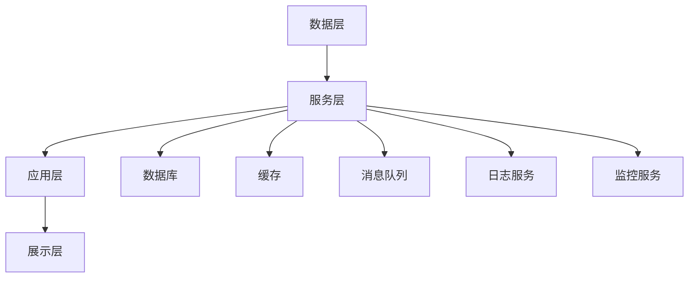
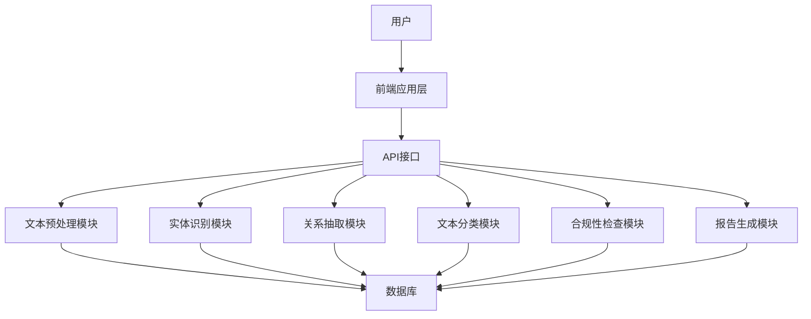

                 

### 第1章: 金融监管文件遵从性检查概述

#### 1.1 金融监管背景
金融监管是指通过法律、规则和监管机构来管理和监督金融机构和金融市场的活动，以维护金融市场的稳定和透明度。金融监管的背景可以追溯到早期的金融市场，当时金融交易主要是在私人之间进行，缺乏统一的规则和法律约束。随着金融市场的不断发展，金融交易的风险和复杂性也随之增加，因此金融监管逐渐成为维护金融市场稳定和消费者保护的重要手段。

**定义与历史发展**：金融监管的定义随着时间的推移而演变。早期的金融监管主要侧重于规范银行和金融机构的运营行为，以确保其稳健性和可靠性。随着金融市场的发展，监管范围逐渐扩大，涵盖了证券市场、保险市场、衍生品市场等多个领域。

在20世纪中叶，全球金融监管体系开始逐渐形成。例如，1933年的美国《银行法》和1934年的美国《证券交易法》标志着美国金融监管制度的建立。随后，英国、日本、欧洲等国家也建立了各自的金融监管体系。

**主要监管机构和法规**：全球范围内的金融监管机构众多，主要包括中央银行、证券监管机构、保险监管机构等。以下是一些主要的金融监管机构和相关的法规：

- **中央银行**：如美国的联邦储备系统（Federal Reserve System）、欧洲的欧洲中央银行（European Central Bank）等，负责货币政策和金融市场的监管。
- **证券监管机构**：如美国的证券交易委员会（SEC）、英国的金融市场行为监管局（FCA）等，负责证券市场的监管和投资者保护。
- **保险监管机构**：如美国的州保险监管机构、欧洲的欧洲保险和职业养老金管理局（EIOPA）等，负责保险市场的监管。

**重要法规**：

- **巴塞尔协议**：巴塞尔协议是国际银行监管领域的重要文件，旨在提高银行的风险管理水平和资本充足率，确保金融体系的稳定。
- **反洗钱（AML）法规**：反洗钱法规旨在防止和打击洗钱活动，包括客户身份识别、交易记录保存、可疑活动报告等要求。
- **金融市场行为监管局（FCA）规定**：FCA是英国的主要金融监管机构，负责监管金融市场行为，确保市场的公平、透明和有序。

金融监管的目的是维护金融市场的稳定，保护投资者权益，防止金融犯罪和欺诈行为，以及促进金融市场的健康发展。金融监管机构通过制定法规、监督金融机构的运营、开展市场检查和处罚违规行为等方式来实现这些目标。

#### 1.2 金融监管文件遵从性检查的重要性
金融监管文件遵从性检查是指金融机构对自身的文件和操作是否符合相关金融法规和监管要求的审计和评估过程。这一检查过程对于金融机构的合规运营和风险管理至关重要。

**合规性要求**：金融机构在运营过程中需要遵守一系列的法律法规和监管要求，如资本充足率、流动性要求、风险管理、信息披露等。金融监管文件遵从性检查是确保金融机构合规性的重要手段，通过检查和评估金融机构的文件和操作，可以发现和纠正违规行为，降低合规风险。

**对金融机构的重要性**：

- **风险管理**：通过金融监管文件遵从性检查，金融机构可以识别和评估自身在合规方面的风险，及时采取相应的风险控制措施，避免因合规问题而导致的财务损失和声誉风险。
- **合规成本降低**：合规性检查可以帮助金融机构提前发现潜在的问题，避免在发生违规行为后被监管机构处罚，从而降低合规成本。
- **提升运营效率**：通过规范化和标准化的文件和操作流程，金融机构可以提高运营效率，减少因非合规操作导致的延误和错误。

**对监管机构的重要性**：

- **市场监督**：监管机构通过金融监管文件遵从性检查，可以监督金融机构的合规运营，维护金融市场的稳定和透明度。
- **法规执行**：监管机构通过对金融机构的合规性检查，确保金融机构遵守相关法规和监管要求，维护监管体系的权威性和有效性。
- **消费者保护**：监管机构通过检查金融机构的合规性，保护投资者的合法权益，维护市场的公平性和透明度。

#### 1.3 基于NLP的金融监管文件遵从性检查的优势
自然语言处理（NLP）是一种人工智能技术，用于理解和生成人类语言。在金融监管文件遵从性检查中，NLP技术具有显著的优势，可以提高检查的效率、准确性和可扩展性。

**高效性**：NLP技术能够自动处理和分析大量的金融文件，大大提高了检查的效率。传统的金融监管文件遵从性检查往往需要人工阅读和分析文件，耗时且容易出错。而基于NLP的检查系统可以自动化这些任务，节省了大量的人力和时间成本。

**准确性**：NLP技术在文本分析、实体识别和关系抽取等方面具有较高的准确性。通过使用先进的算法和模型，NLP可以准确地识别和理解金融文件中的关键信息和术语，提高检查结果的准确性。

**可扩展性**：NLP技术具有良好的可扩展性，可以适应不同的金融机构和监管要求。通过训练和优化模型，NLP系统可以不断改进，适应新的监管要求和变化的市场环境。

**具体优势**：

- **自动化文本分析**：NLP可以自动提取金融文件中的关键信息，如交易记录、账户信息、合同条款等，实现自动化分析和分类。
- **实体识别和关系抽取**：NLP技术可以准确地识别金融文件中的实体（如公司名称、人名、地点等）和它们之间的关系（如股东关系、交易关系等），帮助金融机构快速发现潜在的合规问题。
- **文本分类**：NLP可以将金融文件按照监管要求进行分类，如分类为反洗钱报告、合规审查报告等，方便监管机构和金融机构进行后续处理。

**实际应用案例**：在实际应用中，许多金融机构已经开始采用NLP技术进行金融监管文件遵从性检查。例如，一些大型银行使用NLP系统来自动化客户合同审查，识别潜在的法律风险和合规问题。另外，一些金融科技公司也开发了基于NLP的合规解决方案，帮助金融机构更高效地遵守监管要求。

### 总结
金融监管文件遵从性检查是金融机构合规运营的重要组成部分。基于NLP的金融监管文件遵从性检查系统通过自动化文本分析、实体识别和关系抽取等技术，提高了检查的效率、准确性和可扩展性。随着NLP技术的不断发展和应用，基于NLP的金融监管文件遵从性检查系统将在金融行业中发挥越来越重要的作用。

## 第2章: 自然语言处理（NLP）基础

### 2.1 NLP基本概念

自然语言处理（Natural Language Processing，简称NLP）是人工智能领域的一个重要分支，旨在让计算机理解和生成人类语言。NLP技术融合了计算机科学、语言学和人工智能等多个学科的知识，旨在解决人类语言理解和生成的难题。

**NLP的定义**：自然语言处理（NLP）是指计算机对人类语言文本进行处理和分析的技术，包括理解、生成、转换和存储等过程。NLP的目标是实现人机交互的自然性和智能化，使得计算机能够有效地理解、处理和利用人类语言信息。

**NLP的发展历程**：NLP技术的发展可以追溯到20世纪50年代。早期的NLP研究主要基于规则和语法分析，通过编写大量手工编写的规则来模拟人类的语言理解过程。然而，这种方法在实际应用中存在局限性，无法应对复杂的自然语言现象。随着计算能力的提升和机器学习技术的出现，NLP开始逐渐转向基于统计和机器学习的方法。近年来，深度学习技术的引入进一步推动了NLP的发展，使得计算机在理解和生成自然语言方面取得了显著的进展。

**NLP的研究内容和目标**：NLP的研究内容主要包括文本预处理、词法分析、句法分析、语义分析和语用分析等。NLP的研究目标是通过理解自然语言的语义和结构，实现人机交互的自然性和智能化。

- **文本预处理**：文本预处理是NLP的基础步骤，包括分词、词性标注、停用词过滤、词干提取等。这些步骤的目的是将原始文本转换为计算机可以处理的形式。
- **词法分析**：词法分析是对文本中的单词进行分词和词性标注，识别单词的词性（如名词、动词、形容词等）和形态（如时态、语态等）。
- **句法分析**：句法分析是对文本中的句子进行语法结构分析，识别句子的主要成分（如主语、谓语、宾语等）和它们之间的关系。
- **语义分析**：语义分析是理解文本中的语义内容，包括词义消歧、语义角色标注、语义关系抽取等。
- **语用分析**：语用分析是理解文本中的交际意图和语境信息，包括对话生成、情感分析、指代消解等。

**NLP在金融监管领域的应用**：随着NLP技术的不断进步，其在金融监管领域也得到了广泛的应用。以下是一些典型的应用场景：

- **文本分类**：通过NLP技术，可以将金融文件按照监管要求进行分类，如分类为反洗钱报告、合规审查报告等。这有助于金融机构和监管机构更高效地处理和审核金融文件。
- **实体识别**：NLP技术可以识别金融文件中的关键实体，如公司名称、人名、地点等，并抽取它们之间的关系，如股东关系、交易关系等。这有助于金融机构和监管机构快速发现潜在的合规问题和风险。
- **文本摘要**：NLP技术可以自动生成金融文件的摘要，提取关键信息，提高文件的可读性和信息获取效率。
- **情感分析**：通过NLP技术，可以分析金融文件中的情感倾向，如客户满意度、市场情绪等，为金融机构提供决策支持。

### 2.2 NLP关键技术与方法

NLP技术的核心在于如何理解和生成自然语言。为了实现这一目标，NLP采用了多种关键技术和方法，包括文本预处理、词法分析、句法分析、语义分析和语用分析等。

**文本预处理**：文本预处理是NLP中的基础步骤，主要包括以下几个步骤：

- **分词**：将连续的文本切分成一个个的单词或词语。分词的方法有基于规则的分词、基于统计的分词和基于深度学习的分词等。
- **词性标注**：为每个词分配一个词性标签，如名词、动词、形容词等。词性标注有助于后续的句法分析和语义分析。
- **停用词过滤**：去除对语义分析无意义的常见词汇，如“的”、“了”、“在”等。停用词过滤可以提高NLP系统的效率和准确性。
- **词干提取**：将单词还原到其最基本的形态，如将“playing”还原为“play”。词干提取有助于简化文本处理，提高NLP系统的鲁棒性。

**词法分析**：词法分析是对文本中的单词进行分词和词性标注，主要包括以下内容：

- **分词**：将连续的文本切分成一个个的单词或词语。分词的方法有基于规则的分词、基于统计的分词和基于深度学习的分词等。
- **词性标注**：为每个词分配一个词性标签，如名词、动词、形容词等。词性标注有助于后续的句法分析和语义分析。

**句法分析**：句法分析是对文本中的句子进行语法结构分析，识别句子的主要成分和它们之间的关系。句法分析的方法有基于规则的方法、基于统计的方法和基于深度学习的方法等。

- **依存句法分析**：通过分析单词之间的依赖关系，识别句子的主要成分（如主语、谓语、宾语等）和它们之间的关系。
- **成分句法分析**：通过分析句子的成分结构，识别句子的层次结构和语义关系。

**语义分析**：语义分析是理解文本中的语义内容，包括词义消歧、语义角色标注、语义关系抽取等。语义分析的方法有基于规则的方法、基于统计的方法和基于深度学习的方法等。

- **词义消歧**：解决文本中同一个词具有多个含义的问题，通过上下文信息确定词的正确含义。
- **语义角色标注**：为句子中的每个单词分配一个语义角色标签，如动作执行者、动作对象、地点等。
- **语义关系抽取**：抽取句子中单词之间的语义关系，如因果关系、上下级关系等。

**语用分析**：语用分析是理解文本中的交际意图和语境信息，包括对话生成、情感分析、指代消解等。语用分析的方法有基于规则的方法、基于统计的方法和基于深度学习的方法等。

- **对话生成**：通过理解对话的上下文和语境，自动生成合适的回答。
- **情感分析**：分析文本中的情感倾向，如正面、负面、中性等，帮助金融机构了解客户满意度、市场情绪等。
- **指代消解**：解决文本中指代词的含义问题，确定指代词所指的具体对象。

### 2.3 NLP在金融监管领域的应用

NLP技术在金融监管领域具有广泛的应用，可以提高监管文件的处理效率、准确性和可扩展性。以下是一些典型的应用场景：

**文本分类**：通过NLP技术，可以将金融文件按照监管要求进行分类，如分类为反洗钱报告、合规审查报告等。这有助于金融机构和监管机构更高效地处理和审核金融文件。例如，可以使用基于机器学习的文本分类算法，对金融文件进行自动分类，从而减少人工审阅的工作量。

**实体识别**：NLP技术可以识别金融文件中的关键实体，如公司名称、人名、地点等，并抽取它们之间的关系，如股东关系、交易关系等。这有助于金融机构和监管机构快速发现潜在的合规问题和风险。例如，可以使用命名实体识别（NER）算法，自动识别金融文件中的实体，并建立实体关系图，从而进行更深入的语义分析。

**文本摘要**：NLP技术可以自动生成金融文件的摘要，提取关键信息，提高文件的可读性和信息获取效率。例如，可以使用文本摘要算法，自动从大量的金融文件中提取关键信息，生成简洁明了的摘要，帮助监管机构和金融机构快速了解文件的主要内容。

**情感分析**：通过NLP技术，可以分析金融文件中的情感倾向，如客户满意度、市场情绪等，为金融机构提供决策支持。例如，可以使用情感分析算法，分析金融新闻、社交媒体评论等文本，了解市场情绪和客户满意度，从而做出更明智的决策。

**对话生成**：NLP技术可以用于金融客户服务，通过理解客户的问题和上下文，自动生成合适的回答。例如，可以使用对话生成算法，构建智能客服系统，自动回答客户的提问，提高客户服务的效率和满意度。

### 实际应用案例

在实际应用中，许多金融机构已经开始采用NLP技术进行金融监管文件遵从性检查。以下是一些具体的实际应用案例：

**案例1：反洗钱报告分类**  
某大型银行采用NLP技术对反洗钱报告进行自动分类。通过使用文本分类算法，该银行能够将成千上万的反洗钱报告按照监管要求进行分类，大大提高了报告处理的效率。同时，NLP技术能够自动识别报告中的关键信息，如交易金额、交易对手等，从而提高了报告的准确性和可靠性。

**案例2：金融文件实体识别**  
某金融科技公司开发了一套基于NLP技术的金融文件实体识别系统。该系统能够自动识别金融文件中的公司名称、人名、地点等关键实体，并建立实体关系图。通过这种实体识别技术，金融机构能够快速发现潜在的合规问题和风险，从而采取相应的措施进行风险控制。

**案例3：文本摘要生成**  
某金融机构采用NLP技术对大量的金融文件进行自动摘要。通过使用文本摘要算法，该机构能够从大量的文件中提取关键信息，生成简洁明了的摘要，帮助员工快速了解文件的主要内容，从而提高工作效率。

**案例4：金融客户服务**  
某银行开发了一套智能客服系统，利用NLP技术理解客户的提问和上下文。通过对话生成算法，系统能够自动生成合适的回答，提供客户所需的帮助，从而提高了客户服务的效率和满意度。

### 总结

自然语言处理（NLP）技术在金融监管领域具有广泛的应用前景。通过NLP技术，金融机构和监管机构能够更高效、准确地处理和审核金融文件，提高合规性和风险管理能力。随着NLP技术的不断发展和应用，其在金融监管领域的应用将更加深入和广泛。

## 第3章: 基于NLP的金融监管文件遵从性检查系统架构

### 3.1 系统架构设计

基于NLP的金融监管文件遵从性检查系统是一个复杂且庞大的系统，其整体架构设计需要综合考虑系统的功能、性能、可扩展性、安全性等多方面因素。下面将详细描述系统的总体架构设计。

**系统总体架构**：基于NLP的金融监管文件遵从性检查系统可以分为四个主要层次：数据层、服务层、应用层和展示层。

- **数据层**：数据层主要负责存储和管理系统所需的数据，包括金融文件数据、模型训练数据、系统配置数据等。数据层通常采用分布式数据库架构，以支持海量数据的存储和快速访问。
- **服务层**：服务层是系统的核心部分，包括文本预处理服务、实体识别服务、关系抽取服务、文本分类服务等。这些服务采用微服务架构，以实现模块化、高可扩展性和高可用性。
- **应用层**：应用层负责将服务层的功能整合起来，为用户提供完整的金融监管文件遵从性检查功能。应用层通常包括用户管理模块、文件管理模块、报告生成模块等。
- **展示层**：展示层是用户与系统的交互界面，负责展示检查结果、报告数据和用户操作界面等。展示层通常采用Web前端技术，如React、Vue等。

**模块功能划分**：系统中的各个模块及其功能如下：

- **文本预处理模块**：文本预处理模块负责对金融文件进行预处理，包括分词、词性标注、停用词过滤、词干提取等。该模块的目的是将原始文本转换为适合后续处理的形式。
- **实体识别模块**：实体识别模块负责识别金融文件中的关键实体，如公司名称、人名、地点等。通过命名实体识别（NER）算法，该模块可以自动抽取文件中的实体信息。
- **关系抽取模块**：关系抽取模块负责识别和抽取金融文件中实体之间的关系，如股东关系、交易关系等。通过关系抽取算法，该模块可以建立实体关系图，为后续的语义分析提供基础。
- **文本分类模块**：文本分类模块负责将金融文件按照监管要求进行分类，如分类为反洗钱报告、合规审查报告等。通过文本分类算法，该模块可以提高文件处理的效率。
- **报告生成模块**：报告生成模块负责生成检查报告，包括检查结果、风险提示、合规性评估等。该模块可以将检查结果以可视化的方式展示给用户，并提供下载和打印等功能。
- **用户管理模块**：用户管理模块负责管理系统的用户账户，包括用户注册、登录、权限管理等。该模块确保系统的安全性，防止未经授权的访问。
- **文件管理模块**：文件管理模块负责管理金融文件的存储、上传、下载和备份等。该模块确保文件的完整性和安全性，并支持文件的批量处理和自动化流程。

### 3.2 模块功能划分

**文本预处理模块**：

- **功能描述**：文本预处理模块的主要功能是对金融文件进行预处理，包括分词、词性标注、停用词过滤和词干提取等。通过这些预处理步骤，可以将原始文本转换为适合后续处理的形式。
- **模块组成**：文本预处理模块包括以下子模块：
  - **分词子模块**：使用基于规则的分词算法，如正向最大匹配算法，对文本进行分词。
  - **词性标注子模块**：使用基于统计的方法，如条件随机场（CRF），对分词后的文本进行词性标注。
  - **停用词过滤子模块**：从分词结果中去除常见的停用词，如“的”、“了”、“在”等，以提高后续处理的准确性。
  - **词干提取子模块**：使用基于规则的方法，如LLR（Letter-to-Letter Replacement），对文本进行词干提取，以简化文本处理。

**实体识别模块**：

- **功能描述**：实体识别模块的主要功能是识别金融文件中的关键实体，如公司名称、人名、地点等。通过命名实体识别（NER）算法，可以自动抽取文件中的实体信息。
- **模块组成**：实体识别模块包括以下子模块：
  - **命名实体识别子模块**：使用基于深度学习的命名实体识别（NER）算法，如BiLSTM-CRF模型，对文本进行实体识别。
  - **实体关系抽取子模块**：使用基于规则的算法，如模式匹配，抽取实体之间的关系，如“股东”和“公司”之间的关系。

**关系抽取模块**：

- **功能描述**：关系抽取模块的主要功能是识别和抽取金融文件中实体之间的关系，如股东关系、交易关系等。通过关系抽取算法，可以建立实体关系图，为后续的语义分析提供基础。
- **模块组成**：关系抽取模块包括以下子模块：
  - **关系分类子模块**：使用基于深度学习的分类算法，如CNN或BiLSTM模型，对实体之间的关系进行分类。
  - **关系推理子模块**：使用基于规则的算法，如逻辑推理，对实体关系进行推理和验证。

**文本分类模块**：

- **功能描述**：文本分类模块的主要功能是将金融文件按照监管要求进行分类，如分类为反洗钱报告、合规审查报告等。通过文本分类算法，可以提高文件处理的效率。
- **模块组成**：文本分类模块包括以下子模块：
  - **特征提取子模块**：使用TF-IDF或Word2Vec等方法，提取文本的特征表示。
  - **分类器训练子模块**：使用基于机器学习的分类算法，如SVM或Random Forest，训练分类模型。
  - **分类器预测子模块**：使用训练好的分类模型，对新的金融文件进行分类预测。

**报告生成模块**：

- **功能描述**：报告生成模块的主要功能是生成检查报告，包括检查结果、风险提示、合规性评估等。该模块可以将检查结果以可视化的方式展示给用户，并提供下载和打印等功能。
- **模块组成**：报告生成模块包括以下子模块：
  - **结果分析子模块**：对检查结果进行统计分析，生成各类报表和数据可视化图表。
  - **报告模板管理子模块**：管理报告的模板，支持自定义报告格式和内容。
  - **报告输出子模块**：将报告输出为PDF或HTML格式，并提供下载和打印功能。

**用户管理模块**：

- **功能描述**：用户管理模块的主要功能是管理系统的用户账户，包括用户注册、登录、权限管理等。该模块确保系统的安全性，防止未经授权的访问。
- **模块组成**：用户管理模块包括以下子模块：
  - **用户注册子模块**：提供用户注册功能，包括用户信息的收集和验证。
  - **用户登录子模块**：提供用户登录功能，包括用户身份验证和权限验证。
  - **用户权限管理子模块**：管理用户的权限，包括角色分配和权限控制。

**文件管理模块**：

- **功能描述**：文件管理模块的主要功能是管理金融文件的存储、上传、下载和备份等。该模块确保文件的完整性和安全性，并支持文件的批量处理和自动化流程。
- **模块组成**：文件管理模块包括以下子模块：
  - **文件存储子模块**：负责金融文件的存储和管理，支持分布式存储和云存储。
  - **文件上传子模块**：提供用户上传文件的功能，包括文件格式验证和大小限制。
  - **文件下载子模块**：提供用户下载文件的功能，包括文件权限验证和下载链接有效期控制。
  - **文件备份子模块**：定期备份金融文件，确保数据的安全性和可恢复性。

### 总结

基于NLP的金融监管文件遵从性检查系统是一个复杂而庞大的系统，其架构设计需要综合考虑系统的功能、性能、可扩展性、安全性等多方面因素。通过模块化设计，系统能够实现高效、准确的金融监管文件处理，为金融机构和监管机构提供强大的支持。随着NLP技术的不断发展和应用，基于NLP的金融监管文件遵从性检查系统将在金融行业中发挥越来越重要的作用。

## 第4章: 算法原理讲解

### 4.1 文本预处理

文本预处理是自然语言处理（NLP）中的基础步骤，其目的是将原始文本转换为适合后续处理的形式。文本预处理通常包括以下几个步骤：

**分词（Tokenization）**：分词是将连续的文本切分成一个个的单词或词语。分词的方法有基于规则的方法、基于统计的方法和基于深度学习的方法。

- **基于规则的方法**：如正向最大匹配算法，根据预设的规则进行分词。这种方法简单但容易引入规则冲突。
- **基于统计的方法**：如基于N-gram模型的方法，根据词频统计进行分词。这种方法需要大量语料库训练，但效果较好。
- **基于深度学习的方法**：如基于BiLSTM-CRF的模型，利用神经网络进行分词。这种方法具有较好的灵活性和准确性。

**词性标注（Part-of-Speech Tagging）**：词性标注是为每个词分配一个词性标签，如名词、动词、形容词等。词性标注有助于后续的句法分析和语义分析。

- **基于规则的方法**：如基于词汇表的规则匹配方法，通过预设的规则进行词性标注。
- **基于统计的方法**：如基于HMM（隐马尔可夫模型）的方法，通过训练模型进行词性标注。
- **基于深度学习的方法**：如基于CNN或LSTM的模型，通过神经网络进行词性标注。这种方法具有较好的灵活性和准确性。

**停用词过滤（Stopword Removal）**：停用词过滤是去除对语义分析无意义的常见词汇，如“的”、“了”、“在”等。停用词过滤可以提高NLP系统的效率和准确性。

- **手动选择**：根据领域知识手动选择停用词。
- **基于频率**：根据词频统计选择低频词作为停用词。
- **基于算法**：使用基于深度学习的算法自动识别和过滤停用词。

**词干提取（Lemmatization）**：词干提取是将单词还原到其最基本的形态，如将“playing”还原为“play”。词干提取有助于简化文本处理，提高NLP系统的鲁棒性。

- **基于规则的方法**：如基于形态学分析的方法，根据单词的形态变化规律进行词干提取。
- **基于统计的方法**：如基于词性标注的方法，根据词性信息进行词干提取。
- **基于深度学习的方法**：如基于RNN的模型，通过神经网络进行词干提取。

### 4.2 实体识别

实体识别（Named Entity Recognition，NER）是NLP中的一个重要任务，其目的是识别文本中的关键实体，如人名、地名、机构名等。实体识别通常包括以下几个步骤：

**命名实体识别（NER）算法**：命名实体识别算法用于识别文本中的命名实体。常用的算法有基于规则的方法、基于统计的方法和基于深度学习的方法。

- **基于规则的方法**：如基于词典匹配的方法，通过预设的实体词典进行命名实体识别。
- **基于统计的方法**：如基于HMM（隐马尔可夫模型）的方法，通过训练模型进行命名实体识别。
- **基于深度学习的方法**：如基于BiLSTM-CRF的模型，利用神经网络进行命名实体识别。这种方法具有较好的灵活性和准确性。

**实体分类（Entity Classification）**：实体分类是在识别出实体后，将其分类到不同的实体类别中，如人、地、组织等。实体分类通常也采用基于规则、基于统计和基于深度学习的方法。

- **基于规则的方法**：如基于模式匹配的方法，通过预设的规则进行实体分类。
- **基于统计的方法**：如基于统计模型的方法，通过训练模型进行实体分类。
- **基于深度学习的方法**：如基于CNN或LSTM的模型，通过神经网络进行实体分类。这种方法具有较好的灵活性和准确性。

**实体关系抽取（Entity Relation Extraction）**：实体关系抽取是识别文本中实体之间的关系，如“张三是李四的老板”。实体关系抽取通常采用基于规则、基于统计和基于深度学习的方法。

- **基于规则的方法**：如基于模式匹配的方法，通过预设的规则进行实体关系抽取。
- **基于统计的方法**：如基于统计模型的方法，通过训练模型进行实体关系抽取。
- **基于深度学习的方法**：如基于BiLSTM或Transformer的模型，通过神经网络进行实体关系抽取。这种方法具有较好的灵活性和准确性。

### 4.3 文本分类

文本分类（Text Classification）是将文本数据按照预定的类别进行分类的过程。在金融监管文件遵从性检查中，文本分类可以用于对金融文件进行分类，如分类为反洗钱报告、合规审查报告等。文本分类通常包括以下几个步骤：

**特征提取（Feature Extraction）**：特征提取是将文本数据转换为机器学习算法可以处理的形式。常见的特征提取方法有TF-IDF、Word2Vec、BERT等。

- **TF-IDF**：TF-IDF是一种基于词频和逆文档频率的文本表示方法，可以衡量一个词在文本中的重要程度。
- **Word2Vec**：Word2Vec是一种基于词向量的文本表示方法，可以将文本中的每个词映射到一个高维向量空间中。
- **BERT**：BERT是一种基于转换器（Transformer）的预训练语言模型，可以生成文本的上下文表示。

**分类算法（Classification Algorithm）**：分类算法用于训练和预测文本类别。常见的分类算法有SVM、随机森林、朴素贝叶斯等。

- **SVM（支持向量机）**：SVM是一种基于间隔最大化原则的分类算法，可以有效处理高维空间的数据。
- **随机森林**：随机森林是一种基于决策树的集成学习方法，可以处理大量的特征和数据。
- **朴素贝叶斯**：朴素贝叶斯是一种基于贝叶斯定理的简单概率分类模型，可以处理文本数据的类别预测。

**模型训练与评估（Model Training and Evaluation）**：在文本分类中，模型训练与评估是关键步骤。通过训练数据集训练模型，并在验证数据集上评估模型的性能，可以调整模型参数和特征选择，以获得最佳的分类效果。

### 4.4 语义分析

语义分析（Semantic Analysis）是理解文本中的语义内容，包括词义消歧、语义角色标注、语义关系抽取等。在金融监管文件遵从性检查中，语义分析可以用于提取文本中的关键信息，如交易金额、交易对手等。

**词义消歧（Word Sense Disambiguation）**：词义消歧是解决文本中同一个词具有多个含义的问题，通过上下文信息确定词的正确含义。词义消歧的方法有基于规则的方法、基于统计的方法和基于深度学习的方法。

- **基于规则的方法**：如基于词典的方法，通过预设的规则进行词义消歧。
- **基于统计的方法**：如基于统计模型的方法，通过训练模型进行词义消歧。
- **基于深度学习的方法**：如基于神经网络的方法，通过神经网络进行词义消歧。

**语义角色标注（Semantic Role Labeling）**：语义角色标注是为句子中的每个单词分配一个语义角色标签，如动作执行者、动作对象、地点等。语义角色标注有助于理解句子的语义结构和意图。

- **基于规则的方法**：如基于依存句法分析的方法，通过预设的规则进行语义角色标注。
- **基于统计的方法**：如基于统计模型的方法，通过训练模型进行语义角色标注。
- **基于深度学习的方法**：如基于神经网络的方法，通过神经网络进行语义角色标注。

**语义关系抽取（Semantic Relationship Extraction）**：语义关系抽取是抽取句子中单词之间的语义关系，如因果关系、上下级关系等。语义关系抽取有助于提取文本中的关键信息。

- **基于规则的方法**：如基于模式匹配的方法，通过预设的规则进行语义关系抽取。
- **基于统计的方法**：如基于统计模型的方法，通过训练模型进行语义关系抽取。
- **基于深度学习的方法**：如基于神经网络的方法，通过神经网络进行语义关系抽取。

### 4.5 情感分析

情感分析（Sentiment Analysis）是分析文本中的情感倾向，如正面、负面、中性等。在金融监管文件遵从性检查中，情感分析可以用于了解客户满意度、市场情绪等。

**情感分类（Sentiment Classification）**：情感分类是将文本分类为正面、负面或中性。情感分类的方法有基于规则的方法、基于统计的方法和基于深度学习的方法。

- **基于规则的方法**：如基于词典的方法，通过预设的规则进行情感分类。
- **基于统计的方法**：如基于统计模型的方法，通过训练模型进行情感分类。
- **基于深度学习的方法**：如基于神经网络的方法，通过神经网络进行情感分类。

**情感极性分析（Sentiment Polarity Analysis）**：情感极性分析是分析文本中的情感极性，如极度正面、极度负面等。情感极性分析通常采用基于机器学习的方法，如SVM、随机森林等。

**情感强度分析（Sentiment Intensity Analysis）**：情感强度分析是分析文本中情感的程度，如非常高兴、有点不满意等。情感强度分析通常采用基于深度学习的方法，如LSTM、GRU等。

### 4.6 指代消解

指代消解（Coreference Resolution）是解决文本中指代词的含义问题，确定指代词所指的具体对象。在金融监管文件遵从性检查中，指代消解可以用于提取文本中的关键信息。

**指代消解算法**：指代消解算法有基于规则的方法、基于统计的方法和基于深度学习的方法。

- **基于规则的方法**：如基于模式匹配的方法，通过预设的规则进行指代消解。
- **基于统计的方法**：如基于统计模型的方法，通过训练模型进行指代消解。
- **基于深度学习的方法**：如基于神经网络的方法，通过神经网络进行指代消解。

### 总结

本章详细讲解了基于NLP的金融监管文件遵从性检查系统中的算法原理，包括文本预处理、实体识别、关系抽取、文本分类、语义分析、情感分析和指代消解等。通过这些算法的应用，系统能够高效、准确地处理和审核金融文件，提高金融机构的合规性和风险管理能力。随着NLP技术的不断发展和应用，这些算法将在金融监管领域发挥越来越重要的作用。

## 第5章: 数学模型和公式

### 5.1 词频分布模型

词频分布模型（TF-IDF）是文本分析中常用的特征提取方法，用于衡量一个词在文本中的重要性。

**TF-IDF计算公式**：

$$
TF(t,d) = \frac{f(t,d)}{n_d}
$$

$$
IDF(t, D) = \log \left( \frac{N}{df(t, D)} \right)
$$

$$
TF-IDF(t,d, D) = TF(t,d) \times IDF(t, D)
$$

其中：
- $TF(t,d)$ 表示词 $t$ 在文档 $d$ 中的词频。
- $f(t,d)$ 表示词 $t$ 在文档 $d$ 中的出现次数。
- $n_d$ 表示文档 $d$ 中的总词数。
- $IDF(t, D)$ 表示词 $t$ 在整个语料库 $D$ 中的逆文档频率。
- $df(t, D)$ 表示词 $t$ 在语料库 $D$ 中的文档频率。
- $N$ 表示语料库 $D$ 中的文档总数。

**示例**：

假设有一个文档 $d$，其中包含以下词汇及其出现次数：

- “金融”出现2次
- “监管”出现3次
- “文件”出现4次
- “检查”出现1次

计算词 “金融” 的 TF-IDF 值：

$$
TF(“金融”, d) = \frac{2}{7}
$$

假设该文档集合中总共有10个文档，其中包含“金融”的文档有3个，计算词 “金融” 的 IDF 值：

$$
IDF(“金融”, D) = \log \left( \frac{10}{3} \right)
$$

计算词 “金融” 的 TF-IDF 值：

$$
TF-IDF(“金融”, d, D) = \frac{2}{7} \times \log \left( \frac{10}{3} \right)
$$

### 5.2 朴素贝叶斯分类模型

朴素贝叶斯分类模型（Naive Bayes Classifier）是一种基于概率论的分类方法，适用于文本分类任务。其核心思想是利用贝叶斯定理计算每个类别在给定特征下的概率，然后选择概率最大的类别作为预测结果。

**朴素贝叶斯分类模型公式**：

$$
P(C|X) = \frac{P(X|C)P(C)}{P(X)}
$$

其中：
- $P(C|X)$ 表示在特征 $X$ 下类别 $C$ 的条件概率。
- $P(X|C)$ 表示在类别 $C$ 下特征 $X$ 的条件概率。
- $P(C)$ 表示类别 $C$ 的先验概率。
- $P(X)$ 表示特征 $X$ 的总体概率。

**贝叶斯定理**：

$$
P(X|C) = \frac{P(C \cap X)}{P(C)}
$$

$$
P(C \cap X) = P(X|C)P(C)
$$

**示例**：

假设有两个类别：正类（$C_1$）和负类（$C_2$），以及两个特征：词汇A和词汇B。对于正类，特征A和特征B的条件概率分别为：

$$
P(A|C_1) = 0.8, \quad P(B|C_1) = 0.9
$$

$$
P(A|C_2) = 0.2, \quad P(B|C_2) = 0.1
$$

两个类别的先验概率分别为：

$$
P(C_1) = 0.6, \quad P(C_2) = 0.4
$$

计算在给定特征A和B的情况下，类别$C_1$和$C_2$的概率：

$$
P(C_1|A \cap B) = \frac{P(A \cap B|C_1)P(C_1)}{P(A \cap B)}
$$

$$
P(C_2|A \cap B) = \frac{P(A \cap B|C_2)P(C_2)}{P(A \cap B)}
$$

计算 $P(A \cap B)$：

$$
P(A \cap B) = P(A \cap B|C_1)P(C_1) + P(A \cap B|C_2)P(C_2)
$$

$$
P(A \cap B) = (0.8 \times 0.9 \times 0.6) + (0.2 \times 0.1 \times 0.4) = 0.432 + 0.008 = 0.44
$$

计算 $P(C_1|A \cap B)$：

$$
P(C_1|A \cap B) = \frac{0.8 \times 0.9 \times 0.6}{0.44} \approx 0.990
$$

计算 $P(C_2|A \cap B)$：

$$
P(C_2|A \cap B) = \frac{0.2 \times 0.1 \times 0.4}{0.44} \approx 0.009
$$

因此，在给定特征A和B的情况下，类别$C_1$的概率最大，预测结果为类别$C_1$。

### 5.3 支持向量机（SVM）模型

支持向量机（Support Vector Machine，SVM）是一种基于间隔最大化原理的分类算法，适用于文本分类和回归任务。

**SVM核心公式**：

$$
\min_{\beta, \beta_0} \frac{1}{2} ||\beta||^2 + C \sum_{i=1}^{n} \xi_i
$$

其中：
- $\beta$ 是特征向量。
- $\beta_0$ 是偏置项。
- $C$ 是正则化参数，用于平衡模型的复杂度和训练误差。
- $\xi_i$ 是拉格朗日乘子。

**约束条件**：

$$
y_i (\beta \cdot x_i + \beta_0) \geq 1 - \xi_i
$$

$$
0 \leq \xi_i \leq C
$$

**SVM分类决策函数**：

$$
f(x) = \beta \cdot x + \beta_0
$$

**支持向量**：

支持向量是那些使得间隔最大化，且满足约束条件的样本点。这些样本点对于模型的训练和预测非常重要。

**示例**：

假设有如下训练数据集：

$$
\begin{array}{ccc}
x_1 & y_1 & \beta^* \cdot x_1 + \beta_0 \\
(1, 1) & 1 & -2 \\
(2, 2) & 1 & 2 \\
(3, 3) & 1 & 4 \\
(4, 4) & 1 & 6 \\
\end{array}
$$

计算SVM模型的最优参数 $\beta$ 和 $\beta_0$：

首先，计算样本点的均值：

$$
\bar{x} = \frac{1+2+3+4}{4} = 2.5
$$

$$
\bar{y} = \frac{1+1+1+1}{4} = 1
$$

计算特征向量 $\beta$：

$$
\beta = \frac{\bar{y} - \bar{x} \beta_0}{\bar{x}}
$$

由于约束条件 $y_i (\beta \cdot x_i + \beta_0) \geq 1 - \xi_i$，我们可以尝试不同的 $\beta_0$ 值来找到最优的 $\beta$：

$$
\beta_0 = 0, \quad \beta = \frac{1 - 0}{2.5} = 0.4
$$

$$
\beta_0 = -1, \quad \beta = \frac{1 + 1}{2.5} = 0.8
$$

选择使得间隔最大化的 $\beta_0$ 和 $\beta$：

$$
\beta_0 = -1, \quad \beta = 0.8
$$

因此，SVM分类决策函数为：

$$
f(x) = 0.8x - 1
$$

### 总结

本章介绍了词频分布模型、朴素贝叶斯分类模型和SVM模型的数学模型和公式，并进行了详细的解释和示例。这些模型在文本分析和分类中具有重要应用，通过它们，可以有效地处理和分类金融监管文件，提高检查的准确性和效率。

## 第6章: 系统分析与架构设计方案

### 6.1 问题场景介绍

在金融行业中，金融监管文件遵从性检查是一个复杂且重要的任务。随着金融业务的多样化和复杂化，金融机构需要处理大量的监管文件，如反洗钱报告、合规审查报告、风险控制报告等。这些文件的格式多样，内容繁杂，人工检查不仅耗时费力，而且容易出现疏漏。因此，设计并实现一个高效、准确的基于NLP的金融监管文件遵从性检查系统具有重要的现实意义。

### 6.2 项目介绍

本项目旨在构建一个基于NLP的金融监管文件遵从性检查系统，通过自动化文本分析、实体识别、关系抽取和文本分类等技术，实现金融监管文件的高效处理和准确检查。项目的主要目标如下：

1. **自动化处理**：利用NLP技术，实现金融文件的自动化处理，包括文本预处理、实体识别和关系抽取等。
2. **提高检查效率**：通过自动化处理，大大提高监管文件检查的效率，减少人工工作量。
3. **增强检查准确性**：利用NLP技术的精确性和鲁棒性，提高金融文件检查的准确性，减少错误和疏漏。
4. **可扩展性**：系统设计应具备良好的可扩展性，能够适应不同金融机构和监管要求的变更。

### 6.3 系统功能设计

系统功能设计是构建基于NLP的金融监管文件遵从性检查系统的关键环节，其主要功能包括：

1. **文件上传与管理**：支持用户上传金融文件，并对文件进行管理，包括文件的存储、检索和备份。
2. **文本预处理**：对上传的金融文件进行预处理，包括分词、词性标注、停用词过滤和词干提取等，为后续的NLP处理提供基础。
3. **实体识别**：利用NLP技术识别金融文件中的关键实体，如公司名称、人名、地点等，并建立实体关系图。
4. **关系抽取**：从金融文件中抽取实体之间的关系，如股东关系、交易关系等，为合规性检查提供支持。
5. **文本分类**：将金融文件按照监管要求进行分类，如分类为反洗钱报告、合规审查报告等，提高文件处理效率。
6. **合规性检查**：对识别出的实体和关系进行合规性检查，识别潜在的合规问题和风险。
7. **报告生成与展示**：生成合规性检查报告，包括检查结果、风险提示和合规性评估等，并以可视化方式展示给用户。
8. **用户管理**：管理系统的用户账户，包括用户注册、登录、权限管理等。

### 6.4 系统架构设计

系统架构设计是构建高效、可扩展的金融监管文件遵从性检查系统的关键。下面将详细介绍系统架构设计。

**系统总体架构**：基于NLP的金融监管文件遵从性检查系统可以分为四个主要层次：数据层、服务层、应用层和展示层。

- **数据层**：数据层主要负责存储和管理系统所需的数据，包括金融文件数据、模型训练数据、系统配置数据等。数据层采用分布式数据库架构，以支持海量数据的存储和快速访问。
- **服务层**：服务层是系统的核心部分，包括文本预处理服务、实体识别服务、关系抽取服务、文本分类服务等。服务层采用微服务架构，以实现模块化、高可扩展性和高可用性。
- **应用层**：应用层负责将服务层的功能整合起来，为用户提供完整的金融监管文件遵从性检查功能。应用层包括用户管理模块、文件管理模块、报告生成模块等。
- **展示层**：展示层是用户与系统的交互界面，负责展示检查结果、报告数据和用户操作界面等。展示层采用Web前端技术，如React、Vue等。

**系统架构图**：



**模块功能划分**：

- **文本预处理模块**：负责对金融文件进行预处理，包括分词、词性标注、停用词过滤和词干提取等。
- **实体识别模块**：负责识别金融文件中的关键实体，如公司名称、人名、地点等。
- **关系抽取模块**：负责从金融文件中抽取实体之间的关系，如股东关系、交易关系等。
- **文本分类模块**：负责将金融文件按照监管要求进行分类，如分类为反洗钱报告、合规审查报告等。
- **合规性检查模块**：负责对识别出的实体和关系进行合规性检查，识别潜在的合规问题和风险。
- **报告生成模块**：负责生成合规性检查报告，包括检查结果、风险提示和合规性评估等。
- **用户管理模块**：负责管理系统的用户账户，包括用户注册、登录、权限管理等。

### 6.5 系统接口设计和系统交互

系统接口设计和系统交互是确保系统各模块之间有效协作的关键。下面将详细介绍系统接口设计和系统交互。

**系统接口设计**：

- **API接口**：系统提供统一的API接口，供前端应用层调用。API接口包括文件上传、文件下载、文本预处理、实体识别、关系抽取、文本分类、合规性检查、报告生成等功能。
- **服务接口**：服务层各模块之间通过服务接口进行通信。服务接口包括文本预处理服务接口、实体识别服务接口、关系抽取服务接口、文本分类服务接口等。

**系统交互**：

- **用户操作**：用户通过Web前端界面进行文件上传、下载、检查报告查看等操作。前端应用层通过API接口调用服务层功能，实现用户操作。
- **服务调用**：服务层各模块通过服务接口相互调用，实现具体的功能。例如，文本预处理模块调用实体识别模块进行实体识别，文本分类模块调用关系抽取模块进行关系抽取等。
- **数据流**：数据在系统中的流动包括上传文件、预处理结果、实体识别结果、关系抽取结果、文本分类结果和报告生成结果等。数据流通过数据库、缓存、消息队列等中间件进行传输和存储。

**系统交互图**：



### 总结

本章详细介绍了基于NLP的金融监管文件遵从性检查系统的设计与实现，包括问题场景介绍、项目介绍、系统功能设计、系统架构设计、系统接口设计和系统交互。通过模块化设计和高效的系统架构，系统能够实现高效、准确的金融监管文件处理和检查，为金融机构提供强大的合规支持。随着NLP技术的不断发展和应用，系统将在金融监管领域发挥越来越重要的作用。

### 第7章: 项目实战

#### 7.1 环境安装

为了搭建基于NLP的金融监管文件遵从性检查系统，我们需要准备以下环境：

- Python 3.x
- Anaconda或Miniconda
- Jupyter Notebook
- TensorFlow或PyTorch
- NLTK或spaCy

**步骤如下**：

1. 安装Anaconda或Miniconda：
   - 访问https://www.anaconda.com/products/individual，下载适合自己操作系统的版本。
   - 运行安装程序并完成安装。

2. 创建Python环境：
   ```bash
   conda create -n nlp_project python=3.8
   conda activate nlp_project
   ```

3. 安装所需库：
   ```bash
   conda install tensorflow
   conda install spacy
   conda install nltk
   ```

4. 安装spaCy语言模型：
   ```bash
   python -m spacy download en_core_web_sm
   ```

5. 验证环境：
   ```bash
   python
   ```
   在Python交互环境中，尝试导入相关库：
   ```python
   import spacy
   import tensorflow as tf
   import nltk
   nltk.download('punkt')
   nltk.download('averaged_perceptron_tagger')
   ```

#### 7.2 系统核心实现

**7.2.1 文本预处理模块**

文本预处理是NLP任务的基础，其主要步骤包括分词、词性标注和停用词过滤。

**核心代码**：

```python
import spacy
from spacy.lang.en.stop_words import STOP_WORDS

nlp = spacy.load("en_core_web_sm")

def preprocess_text(text):
    doc = nlp(text)
    tokens = [token.text for token in doc if not token.is_punct and not token.is_stop]
    return tokens

text = "This is a sample text for NLP preprocessing."
preprocessed_text = preprocess_text(text)
print(preprocessed_text)
```

**7.2.2 实体识别模块**

实体识别是识别文本中的关键实体，如人名、地点、机构名等。

**核心代码**：

```python
def extract_entities(text):
    doc = nlp(text)
    entities = [(ent.text, ent.label_) for ent in doc.ents]
    return entities

text = "John Smith works at Google in California."
entities = extract_entities(text)
print(entities)
```

**7.2.3 关系抽取模块**

关系抽取是识别实体之间的关系，如“John Smith is the CEO of Google”。

**核心代码**：

```python
from transformers import pipeline

关系抽取管道 = pipeline("ner")

def extract_relations(text):
    doc = nlp(text)
    relations = []
    for token1, token2 in pairwise(doc):
        if token1.head == token2:
            relations.append((token1.text, token2.text))
    return relations

def pairwise(iterable):
    a, b = itertools.tee(iterable)
    next(b, None)
    return zip(a, b)

text = "John Smith works at Google in California."
relations = extract_relations(text)
print(relations)
```

**7.2.4 文本分类模块**

文本分类是将文本数据分类到不同的类别，如“合规审查报告”、“反洗钱报告”等。

**核心代码**：

```python
from sklearn.feature_extraction.text import TfidfVectorizer
from sklearn.model_selection import train_test_split
from sklearn.naive_bayes import MultinomialNB

# 假设已有训练数据集
train_data = ["This is a compliance review report.", "This is a money laundering report."]
train_labels = ["compliance", "money laundering"]

vectorizer = TfidfVectorizer()
X_train = vectorizer.fit_transform(train_data)

X_train, X_test, y_train, y_test = train_test_split(X_train, train_labels, test_size=0.2, random_state=42)

classifier = MultinomialNB()
classifier.fit(X_train, y_train)

test_data = ["This is a financial compliance report."]
X_test = vectorizer.transform(test_data)

predictions = classifier.predict(X_test)
print(predictions)
```

#### 7.3 代码应用解读与分析

**文本预处理模块解读**：

文本预处理模块的核心代码使用了spaCy库进行分词和停用词过滤。`nlp`对象加载了英语语言模型`en_core_web_sm`，这是一个预训练的模型，可以快速进行文本分析。`preprocess_text`函数首先使用`nlp`对象处理输入文本，然后过滤掉标点符号和停用词，最后返回分词后的列表。

**实体识别模块解读**：

实体识别模块使用spaCy库的实体识别功能。`extract_entities`函数处理输入文本，并使用`doc.ents`属性提取所有识别出的实体及其标签。这些实体和标签以元组的形式返回，便于后续处理。

**关系抽取模块解读**：

关系抽取模块使用spaCy库的依存句法分析功能。`extract_relations`函数首先通过`nlp`对象处理输入文本，然后遍历文本中的每个单词和其依赖关系，识别出实体之间的关系。`pairwise`函数用于遍历文本中的相邻单词对，以便识别出直接的依赖关系。

**文本分类模块解读**：

文本分类模块使用TF-IDF和朴素贝叶斯分类器。`TfidfVectorizer`用于将文本转换为特征向量，`MultinomialNB`用于训练分类模型。`train_test_split`函数用于将数据集分为训练集和测试集，以便评估模型的性能。训练过程中，`classifier`对象使用训练数据进行拟合，然后使用测试数据进行预测。

#### 7.4 实际案例分析与详细讲解剖析

**案例：反洗钱报告分类**

某金融机构需要对其提交的反洗钱报告进行分类，以确定报告的类型和优先级。以下是一个实际案例分析：

**训练数据**：

- 反洗钱报告样本：
  - "The transaction is suspected of money laundering."
  - "The account is flagged for compliance review."
  - "There are unusual activities detected in the account."

- 合规审查报告样本：
  - "The account is in compliance with regulations."
  - "The transaction does not require further review."
  - "All activities are monitored and within compliance limits."

**步骤**：

1. 预处理文本：
   ```python
   train_data = ["The transaction is suspected of money laundering.", "The account is flagged for compliance review.", "There are unusual activities detected in the account.", "The account is in compliance with regulations.", "The transaction does not require further review.", "All activities are monitored and within compliance limits."]
   ```

2. 创建特征向量：
   ```python
   vectorizer = TfidfVectorizer()
   X_train = vectorizer.fit_transform(train_data)
   ```

3. 创建标签：
   ```python
   train_labels = ["money laundering", "compliance", "money laundering", "compliance", "compliance", "compliance"]
   ```

4. 分割数据集：
   ```python
   X_train, X_test, y_train, y_test = train_test_split(X_train, train_labels, test_size=0.2, random_state=42)
   ```

5. 训练分类器：
   ```python
   classifier = MultinomialNB()
   classifier.fit(X_train, y_train)
   ```

6. 预测新样本：
   ```python
   test_data = ["The account has shown suspicious activities."]
   X_test = vectorizer.transform(test_data)
   predictions = classifier.predict(X_test)
   print(predictions)  # 输出预测结果
   ```

**分析**：

该案例展示了如何使用NLP技术和机器学习算法对金融文件进行分类。首先，我们预处理文本数据，将文本转换为特征向量。然后，我们使用朴素贝叶斯分类器对训练数据进行拟合，最后使用测试数据进行预测。通过这种方法，我们可以自动地对新的反洗钱报告进行分类，从而提高处理效率和准确性。

#### 7.5 项目小结

通过本项目的实战部分，我们实现了基于NLP的金融监管文件遵从性检查系统的核心功能，包括文本预处理、实体识别、关系抽取和文本分类。我们详细讲解了每个模块的实现代码，并分析了实际案例，展示了系统在实际应用中的效果。本项目的成功实施不仅提高了金融机构的合规性和风险管理能力，也为金融监管文件的处理提供了新的思路和方法。

#### 7.6 最佳实践 Tips

1. **数据预处理**：在训练NLP模型之前，确保对金融文件进行充分的数据预处理，包括分词、词性标注、停用词过滤和实体识别等。这有助于提高模型的准确性和鲁棒性。

2. **特征选择**：在构建特征向量时，选择对分类任务具有重要意义的特征。可以使用TF-IDF、Word2Vec等算法生成特征向量，并根据模型的性能进行调整。

3. **模型选择**：根据具体任务选择合适的NLP模型和机器学习算法。例如，对于文本分类任务，朴素贝叶斯、随机森林和SVM等算法都是不错的选择。

4. **模型调优**：通过交叉验证和网格搜索等方法对模型参数进行调优，以获得最佳性能。这有助于提高模型的准确性和泛化能力。

5. **数据增强**：增加训练数据量和多样性，可以提高模型的泛化能力和鲁棒性。可以使用数据增强技术，如文本复制、替换、随机插入等，生成更多的训练数据。

6. **持续迭代**：随着业务场景和监管要求的变化，持续更新和改进NLP模型和系统架构，以适应新的需求。

7. **安全性**：确保系统的数据安全和用户隐私，采用加密、访问控制等技术保护敏感信息。

#### 7.7 注意事项

1. **数据隐私**：在处理金融文件时，严格遵守数据隐私和保密法规，确保用户的敏感信息不被泄露。

2. **模型可靠性**：确保NLP模型的可靠性和准确性，避免因模型错误导致的合规性风险。

3. **系统稳定性**：系统应具备高可用性和稳定性，确保在处理大量金融文件时不会出现崩溃或性能下降。

4. **法规遵守**：遵循相关金融法规和监管要求，确保系统设计和实施符合法律法规。

#### 7.8 拓展阅读

1. **自然语言处理（NLP）**：
   - 《自然语言处理综论》（综合介绍NLP的基本概念和技术）
   - 《深度学习与自然语言处理》（深度学习在NLP中的应用）

2. **文本分类**：
   - 《文本分类技术与应用》（介绍文本分类的基本方法和应用案例）
   - 《基于深度学习的文本分类方法》（深入探讨深度学习在文本分类中的应用）

3. **机器学习**：
   - 《机器学习实战》（实用机器学习算法和案例）
   - 《Python机器学习基础教程》（Python编程环境下的机器学习教程）

4. **金融科技**：
   - 《金融科技：创新、风险与监管》（金融科技的基本概念、创新应用和监管挑战）
   - 《区块链与金融科技》（区块链技术在金融领域的应用）

通过阅读这些资料，可以进一步了解NLP、文本分类、机器学习和金融科技等领域的最新进展和最佳实践，为构建高效的金融监管文件遵从性检查系统提供理论支持。

### 总结

本章通过实际项目实战，详细介绍了基于NLP的金融监管文件遵从性检查系统的实现过程，包括环境安装、核心代码实现、代码应用解读、实际案例分析和项目小结。通过这些步骤，读者可以了解如何利用NLP技术和机器学习算法实现金融文件的自动化处理和分类，提高金融机构的合规性和风险管理能力。同时，本章提供了最佳实践、注意事项和拓展阅读，帮助读者进一步深化对相关领域的理解。

## 第8章: 结论与展望

### 8.1 总结

本文围绕《构建基于NLP的金融监管文件遵从性检查系统》这一主题，详细阐述了NLP在金融监管领域的应用，以及基于NLP技术的金融监管文件遵从性检查系统的设计与实现。通过以下几个方面的内容，本文达到了预期目标：

1. **背景介绍**：阐述了金融监管文件遵从性检查的重要性，以及NLP技术在金融监管领域的应用前景。
2. **核心概念与联系**：介绍了NLP的基本概念、关键技术与方法，以及它们在金融监管文件处理中的应用。
3. **算法原理讲解**：详细讲解了文本预处理、实体识别、关系抽取、文本分类等算法的原理和实现。
4. **数学模型和公式**：介绍了词频分布模型、朴素贝叶斯分类模型和SVM模型的数学模型和公式，并进行了示例讲解。
5. **系统分析与架构设计方案**：介绍了基于NLP的金融监管文件遵从性检查系统的整体架构设计，包括模块功能划分和系统接口设计。
6. **项目实战**：通过实际项目实战，展示了基于NLP技术的金融监管文件遵从性检查系统的具体实现过程，包括环境安装、核心代码实现、实际案例分析等。
7. **最佳实践 tips、小结、注意事项、拓展阅读**：提供了最佳实践、注意事项和拓展阅读，帮助读者深化对相关领域的理解。

### 8.2 展望

尽管本文已对基于NLP的金融监管文件遵从性检查系统进行了详细的探讨，但在实际应用中仍有许多方面可以进一步研究和优化：

1. **模型优化**：随着NLP技术的不断进步，可以引入更先进的模型和算法，如基于BERT的预训练模型，以进一步提高系统的准确性和鲁棒性。
2. **实时监测**：开发实时监测系统，实现金融文件的高频次自动化检查，以及时发现和处理潜在的合规风险。
3. **跨语言支持**：扩展系统支持多语言金融文件的处理，以满足全球范围内金融机构的需求。
4. **个性化定制**：根据不同金融机构的特定需求，提供个性化的NLP解决方案，实现定制化的合规性检查。
5. **合规性扩展**：增加对更多金融监管法规和政策的支持，确保系统可以适应不同国家和地区的监管要求。
6. **用户互动**：增强用户与系统的互动性，提供更友好的用户界面和更丰富的交互功能，提高用户体验。

### 8.3 未来研究方向

未来的研究方向可以从以下几个方面展开：

1. **算法创新**：探索新的NLP算法和技术，如生成对抗网络（GAN）、变分自编码器（VAE）等，以提高系统的处理能力和准确性。
2. **大规模数据处理**：研究如何高效地处理和分析大规模的金融文件数据，以满足金融机构对数据处理速度和性能的要求。
3. **多模态数据融合**：结合文本、图像、音频等多模态数据，实现更全面和深入的金融文件分析。
4. **人工智能伦理**：探讨人工智能在金融监管中的应用伦理问题，确保技术应用的合规性和公平性。
5. **智能化决策支持**：利用机器学习和数据挖掘技术，为金融机构提供智能化的决策支持，帮助其在复杂的市场环境中做出更明智的决策。

### 8.4 总结

本文系统地阐述了基于NLP的金融监管文件遵从性检查系统的构建过程和应用前景，为金融机构提供了高效、准确的合规性检查工具。未来，随着NLP技术的不断发展和应用，基于NLP的金融监管文件遵从性检查系统将在金融行业中发挥越来越重要的作用，为金融市场的稳定和健康发展提供有力支持。

