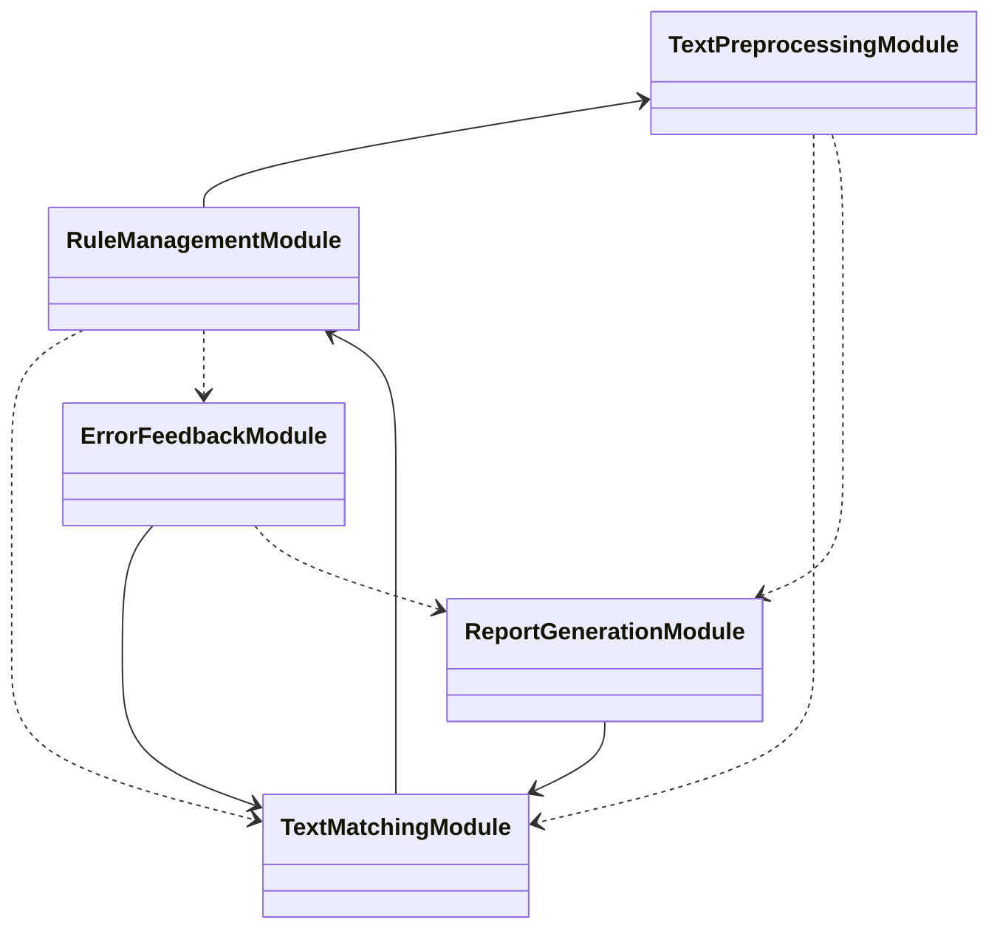
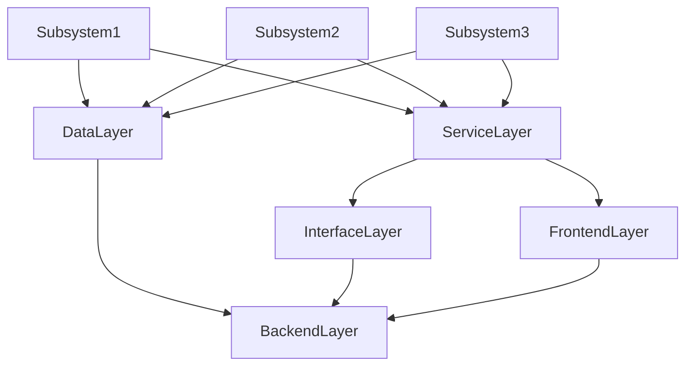
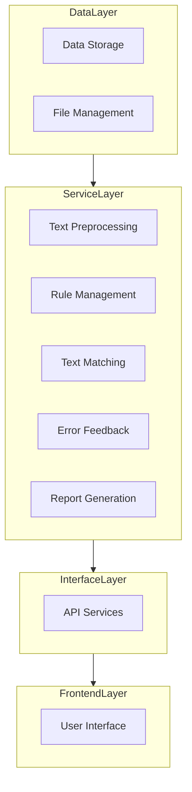
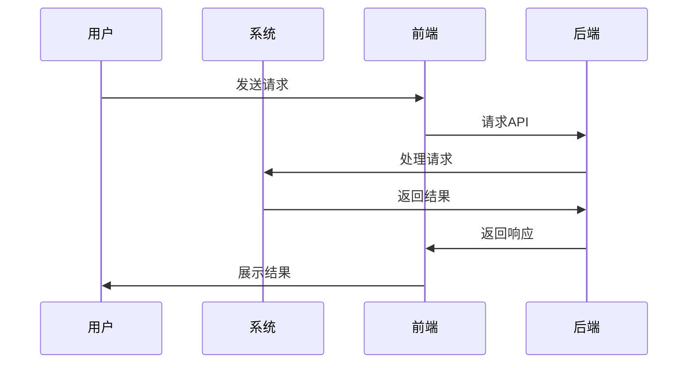

                 

### 第一步：确定整体结构

首先，我们需要对书籍的整体结构进行规划，以确保内容有条理且逻辑清晰。以下是《构建基于NLP的金融监管文件遵从性自动检查系统》的详细目录大纲：

#### 第一部分: 引言

1. **1.1 书籍背景**
   - 1.1.1 金融监管与NLP的背景
   - 1.1.2 文件遵从性自动检查的需求
   - 1.1.3 书籍目标与结构

2. **1.2 核心概念**
   - 1.2.1 自然语言处理（NLP）概述
   - 1.2.2 金融监管文件的特点
   - 1.2.3 遵从性自动检查的基本原理

3. **1.3 本书组织结构**
   - 1.3.1 各章节内容概述
   - 1.3.2 读者预期收获

#### 第二部分: 系统设计与实现

1. **2.1 系统功能设计**
   - 2.1.1 功能模块划分
   - 2.1.2 领域模型Mermaid类图

2. **2.2 系统架构设计**
   - 2.2.1 系统架构概述
   - 2.2.2 系统架构Mermaid架构图

3. **2.3 系统接口设计**
   - 2.3.1 系统接口规范
   - 2.3.2 系统接口Mermaid序列图

4. **2.4 系统实现**
   - 2.4.1 环境搭建
   - 2.4.2 系统核心实现
   - 2.4.3 文件检查逻辑

5. **2.5 系统交互**
   - 2.5.1 用户界面设计
   - 2.5.2 系统交互Mermaid序列图

#### 第三部分: 算法原理讲解

1. **3.1 NLP基础算法**
   - 3.1.1 词嵌入
     - 3.1.1.1 原理讲解
     - 3.1.1.2 数学模型
     - 3.1.1.3 代码实现
   - 3.1.2 词性标注
     - 3.1.2.1 原理讲解
     - 3.1.2.2 数学模型
     - 3.1.2.3 代码实现

2. **3.2 文件遵从性检查算法**
   - 3.2.1 文件解析算法
     - 3.2.1.1 原理讲解
     - 3.2.1.2 数学模型
     - 3.2.1.3 代码实现
   - 3.2.2 遵从性检查算法
     - 3.2.2.1 原理讲解
     - 3.2.2.2 数学模型
     - 3.2.2.3 代码实现

#### 第四部分: 项目实战

1. **4.1 实战环境搭建**
   - 4.1.1 硬件要求
   - 4.1.2 软件要求
   - 4.1.3 环境配置

2. **4.2 系统核心实现**
   - 4.2.1 数据预处理
   - 4.2.2 NLP算法实现
   - 4.2.3 文件检查逻辑

3. **4.3 实际案例分析与讲解**
   - 4.3.1 案例选择与背景
   - 4.3.2 案例实施过程
   - 4.3.3 案例结果分析

4. **4.4 项目小结**
   - 4.4.1 项目收获
   - 4.4.2 项目反思
   - 4.4.3 项目改进建议

#### 第五部分: 最佳实践与总结

1. **5.1 最佳实践**
   - 5.1.1 系统使用技巧
   - 5.1.2 注意事项
   - 5.1.3 拓展阅读

2. **5.2 小结**
   - 5.2.1 书籍主要内容回顾
   - 5.2.2 系统优缺点分析
   - 5.2.3 未来发展方向

3. **5.3 拓展阅读**
   - 5.3.1 相关领域书籍推荐
   - 5.3.2 学术论文与研究报告

通过上述目录，我们不仅能够清晰展示书籍的结构，还能引导读者逐步深入理解金融监管文件遵从性自动检查系统的构建过程。接下来，我们将为每个部分撰写详细的内容。

## 文章标题

《构建基于NLP的金融监管文件遵从性自动检查系统》

## 关键词

自然语言处理（NLP）、金融监管、文件遵从性、自动检查系统、文本分析、机器学习、深度学习、合规性检查、人工智能

## 摘要

本文旨在详细介绍如何构建一个基于自然语言处理（NLP）技术的金融监管文件遵从性自动检查系统。首先，我们将探讨金融监管的背景和NLP的基本概念，接着深入分析系统设计的各个层面，包括系统架构、功能模块和核心算法。通过实际项目案例，读者将了解如何将理论应用到实践中。最后，文章将总结系统的最佳实践，并提出未来发展的方向。本文适合希望深入了解金融合规性自动化处理的读者，包括金融科技从业者、数据科学家和人工智能研究人员。

### 第一部分：引言

#### 1.1 书籍背景

**1.1.1 金融监管与NLP的背景**

金融行业是一个高度监管的行业，金融机构需要遵守一系列复杂的法规和标准。随着金融市场的不断发展，监管文件的数量和复杂性也在不断增加。这些文件不仅包括法律法规、政策指导，还包括内部操作规程和报告模板。如何确保这些文件的准确性和合规性，成为金融机构面临的重大挑战。

自然语言处理（NLP）是人工智能（AI）的一个分支，旨在使计算机理解和处理人类语言。NLP技术在文本分析、情感分析、语言翻译等领域有着广泛的应用。近年来，随着深度学习等先进算法的发展，NLP的性能得到了显著提升，为金融监管文件的自动化处理提供了可能。

**1.1.2 文件遵从性自动检查的需求**

文件遵从性自动检查是指利用NLP技术对金融监管文件进行自动审核，以确保其符合法规和标准。这种系统可以大幅提高监管文件的审查效率，减少人为错误，降低合规风险。对于金融机构来说，构建这样的系统具有以下几个方面的需求：

1. **高效性**：金融监管文件数量庞大，人工审查效率低下，且容易出现疏漏。自动化系统能够在短时间内处理大量文件，提高审查速度。

2. **准确性**：自动化系统基于机器学习算法，可以通过大量数据训练，提高识别和审核的准确性。

3. **合规性**：自动化系统能够实时监控文件变更，及时发现问题并采取措施，确保金融机构的合规运营。

4. **成本效益**：虽然构建和维护自动化系统需要一定的投资，但长期来看，其节约的时间和人力资源成本显著。

**1.1.3 书籍目标与结构**

本书的目标是系统地介绍如何构建一个基于NLP的金融监管文件遵从性自动检查系统。为了实现这一目标，本书将分为五个主要部分：

1. **引言**：介绍金融监管与NLP的背景，以及文件遵从性自动检查的需求。

2. **核心概念**：详细讲解NLP的基本概念，以及与金融监管相关的概念。

3. **系统设计与实现**：介绍系统的整体架构设计，以及各个模块的实现。

4. **算法原理讲解**：讲解核心算法的原理，包括数学模型和公式。

5. **项目实战**：通过一个实际项目来展示系统如何构建和使用。

6. **最佳实践**：分享一些使用系统的最佳实践。

通过这些部分，读者将全面了解金融监管文件遵从性自动检查系统的构建过程，并能够应用到实际工作中。

#### 1.2 核心概念

**1.2.1 自然语言处理（NLP）概述**

自然语言处理（NLP）是人工智能（AI）的一个重要分支，旨在让计算机理解和处理人类语言。NLP技术包括文本分析、情感分析、语言翻译、命名实体识别、语义分析等。近年来，随着深度学习等先进算法的发展，NLP的性能得到了显著提升，成为自动化处理文本数据的重要工具。

**1.2.2 金融监管文件的特点**

金融监管文件具有以下特点：

1. **数量庞大**：金融机构需要处理大量的监管文件，包括法律法规、政策指导、内部操作规程等。

2. **内容复杂**：金融监管文件的内容涉及多个领域，包括金融、法律、会计等，且语言表达方式多样。

3. **结构不规范**：金融监管文件的结构通常不固定，不同的文件可能有不同的格式和内容。

4. **变化频繁**：随着法规和政策的更新，金融监管文件的内容和结构也会发生变化。

**1.2.3 遵从性自动检查的基本原理**

遵从性自动检查的基本原理是利用NLP技术对金融监管文件进行分析和审核，确保其符合法规和标准。具体步骤如下：

1. **文本预处理**：包括去除噪声、分词、词性标注、句子解析等，将原始文本转化为计算机可处理的格式。

2. **规则库构建**：根据法规和标准，构建规则库，用于判断文本是否符合要求。

3. **文本匹配**：利用NLP技术，对文本进行匹配，识别出不符合规定的部分。

4. **反馈与修正**：根据识别出的不符合规定的部分，进行反馈和修正，确保文件符合要求。

通过以上步骤，自动化系统可以大幅提高监管文件的审查效率，减少人为错误，降低合规风险。

#### 1.3 本书组织结构

**1.3.1 各章节内容概述**

本书分为五个部分，各部分内容如下：

1. **引言**：介绍金融监管与NLP的背景，以及文件遵从性自动检查的需求。

2. **核心概念**：详细讲解NLP的基本概念，以及与金融监管相关的概念。

3. **系统设计与实现**：介绍系统的整体架构设计，以及各个模块的实现。

4. **算法原理讲解**：讲解核心算法的原理，包括数学模型和公式。

5. **项目实战**：通过一个实际项目来展示系统如何构建和使用。

6. **最佳实践**：分享一些使用系统的最佳实践。

**1.3.2 读者预期收获**

通过阅读本书，读者可以预期获得以下收获：

1. **深入理解NLP在金融监管领域的应用**：了解NLP的基本概念和技术，以及如何将其应用于金融监管文件的自动检查。

2. **掌握系统设计与实现的方法**：学习如何设计一个高效的金融监管文件遵从性自动检查系统，并了解各个模块的实现细节。

3. **实战经验**：通过实际项目案例，了解系统在实际应用中的操作流程和效果。

4. **最佳实践**：掌握使用系统的最佳实践，提高系统的性能和稳定性。

5. **持续学习**：了解金融监管文件遵从性自动检查的最新技术和趋势，为未来的学习和应用打下基础。

### 第二部分：系统设计与实现

#### 2.1 系统功能设计

**2.1.1 功能模块划分**

金融监管文件遵从性自动检查系统通常包括以下几个主要功能模块：

1. **文本预处理模块**：用于对原始金融监管文件进行预处理，包括去噪、分词、词性标注等。

2. **规则库管理模块**：用于构建和维护与法规和标准相关的规则库，确保系统可以根据最新法规进行更新。

3. **文本匹配模块**：用于对预处理后的文本与规则库进行匹配，识别出不符合规定的部分。

4. **反馈与修正模块**：用于对识别出的不符合规定的部分进行反馈和修正，确保文件符合要求。

5. **报告生成模块**：用于生成系统运行报告，包括检查结果、错误详情等。

**2.1.2 领域模型Mermaid类图**

为了更好地理解系统功能模块之间的关系，我们可以使用Mermaid类图来表示。以下是一个简单的Mermaid类图示例：



在这个类图中，每个模块都有其特定的职责，并通过接口与其他模块进行交互。

#### 2.2 系统架构设计

**2.2.1 系统架构概述**

金融监管文件遵从性自动检查系统的整体架构可以分为以下几个层次：

1. **数据层**：包括原始金融监管文件的数据存储和管理。

2. **服务层**：包括文本预处理、规则库管理、文本匹配、反馈与修正等核心服务模块。

3. **接口层**：提供外部系统与自动检查系统交互的API接口。

4. **前端层**：用于用户界面展示和交互。

以下是一个简单的系统架构Mermaid架构图示例：



在这个架构图中，数据层负责存储和管理原始文件，服务层实现核心功能，接口层提供API服务，前端层负责用户交互。

**2.2.2 系统架构Mermaid架构图**

为了更清晰地展示系统架构，我们可以使用Mermaid架构图来表示。以下是一个简化的系统架构Mermaid架构图示例：



在这个架构图中，数据层通过服务层与接口层进行数据交互，接口层通过前端层与用户进行交互。

#### 2.3 系统接口设计

**2.3.1 系统接口规范**

系统接口设计是确保系统功能模块之间高效、稳定通信的关键。以下是系统接口的一些基本规范：

1. **接口类型**：系统提供RESTful API接口，支持HTTP请求。

2. **请求格式**：请求体使用JSON格式，包括文件内容、参数等。

3. **响应格式**：响应体使用JSON格式，包括处理结果、错误信息等。

4. **错误处理**：系统对错误进行统一的处理，并返回相应的错误代码和信息。

5. **安全性**：系统采用HTTPS协议，确保数据传输的安全性。

**2.3.2 系统接口Mermaid序列图**

为了更好地理解系统接口的设计和通信流程，我们可以使用Mermaid序列图来表示。以下是一个简化的系统接口Mermaid序列图示例：



在这个序列图中，用户通过前端界面发送请求，前端将请求转发给后端系统，后端系统处理请求并返回结果，最后前端将结果展示给用户。

### 第三部分：算法原理讲解

#### 3.1 NLP基础算法

**3.1.1 词嵌入**

词嵌入（Word Embedding）是将词汇映射到高维向量空间的过程，目的是捕获词汇的语义信息。词嵌入技术在NLP中有着广泛的应用，如文本分类、情感分析等。以下是一个简单的词嵌入算法的讲解：

**原理讲解**：

词嵌入通过神经网络模型（如Word2Vec、GloVe）将词汇映射到向量空间。在Word2Vec模型中，输入是词汇，输出是词汇的嵌入向量。模型通过训练大量文本数据，学习词汇之间的相似性和相关性，从而生成高质量的词向量。

**数学模型**：

Word2Vec模型可以使用以下数学模型表示：

$$
\text{vec}(w) = \text{softmax}(\text{W} \cdot \text{v}(w) + b)
$$

其中，$\text{vec}(w)$ 是词汇 $w$ 的嵌入向量，$\text{W}$ 是权重矩阵，$\text{v}(w)$ 是词汇 $w$ 的输入向量，$b$ 是偏置项。

**代码实现**：

以下是一个使用Python和Gensim库实现Word2Vec模型的简单示例：

```python
from gensim.models import Word2Vec

# 加载训练数据
sentences = Word2Vec.load("data/sentences")

# 训练模型
model = Word2Vec(sentences, size=100, window=5, min_count=1, workers=4)

# 输出词汇的嵌入向量
vec = model.wv['word']
print(vec)
```

**3.1.2 词性标注**

词性标注（Part-of-Speech Tagging）是将文本中的词汇标注为不同的词性，如名词、动词、形容词等。词性标注对于NLP任务（如命名实体识别、文本分类等）至关重要。以下是一个简单的词性标注算法的讲解：

**原理讲解**：

词性标注通常使用规则方法或统计方法。规则方法基于预定义的语法规则，对文本进行词性标注。统计方法使用机器学习模型（如HMM、CRF等），通过大量标注数据进行训练，学习词性标注的概率模型。

**数学模型**：

一个简单的HMM模型可以表示为：

$$
\text{P}(\text{y}_t = \text{y} | \text{x}_t = \text{x}) = \frac{\text{A}_{\text{y}_t, \text{y}_{t-1}} \cdot \text{B}_{\text{y}_t, \text{x}_t}}{\sum_{\text{y}} \text{A}_{\text{y}_t, \text{y}_{t-1}} \cdot \text{B}_{\text{y}_t, \text{x}_t}}
$$

其中，$\text{P}(\text{y}_t = \text{y} | \text{x}_t = \text{x})$ 是给定当前词汇 $\text{x}_t$，下一词汇 $\text{y}_t$ 属于词性 $\text{y}$ 的概率，$\text{A}$ 和 $\text{B}$ 分别是转移概率矩阵和发射概率矩阵。

**代码实现**：

以下是一个使用Python和NLTK库实现HMM词性标注的简单示例：

```python
import nltk
from nltk.tokenize import word_tokenize
from nltk.corpus import brown

# 加载模型
nltk.download('brown')
hmm_model = nltk ConditionalHMM.load('data/hmm.model')

# 加载文本数据
text = 'The quick brown fox jumps over the lazy dog'

# 进行词性标注
tokens = word_tokenize(text)
pos_tags = hmm_model.evaluate(tokens)

# 输出词性标注结果
for token, tag in zip(tokens, pos_tags):
    print(f"{token} -> {tag}")
```

#### 3.2 文件遵从性检查算法

**3.2.1 文件解析算法**

文件解析算法用于将金融监管文件中的文本数据提取出来，以便进行后续的处理和检查。以下是一个简单的文件解析算法的讲解：

**原理讲解**：

文件解析算法通常使用正则表达式或基于语法规则的方法。正则表达式可以用来匹配和提取文本中的特定模式，如数字、日期、地名等。基于语法规则的方法可以构建一个解析器，根据文件的格式和结构进行解析。

**数学模型**：

文件解析算法的核心是正则表达式，它可以表示为：

$$
\text{P}(\text{x} | \text{regex}) = \frac{\text{A}_{\text{x}, \text{regex}}}{\sum_{\text{x}} \text{A}_{\text{x}, \text{regex}}}
$$

其中，$\text{P}(\text{x} | \text{regex})$ 是给定正则表达式 $\text{regex}$，文本 $\text{x}$ 的匹配概率，$\text{A}_{\text{x}, \text{regex}}$ 是匹配成功的概率。

**代码实现**：

以下是一个使用Python和正则表达式库实现文件解析的简单示例：

```python
import re

# 加载文件
with open('data/file.txt', 'r') as f:
    text = f.read()

# 使用正则表达式解析文本
regex = r'\d+'
matches = re.findall(regex, text)

# 输出解析结果
for match in matches:
    print(match)
```

**3.2.2 遵从性检查算法**

遵从性检查算法用于判断金融监管文件是否符合相关法规和标准。以下是一个简单的遵从性检查算法的讲解：

**原理讲解**：

遵从性检查算法通常基于规则库进行判断。规则库包含一系列与法规和标准相关的规则，每个规则对应一个具体的检查点。算法会逐个检查文件中的数据，与规则库中的规则进行匹配，判断文件是否符合要求。

**数学模型**：

遵从性检查算法的核心是规则库，它可以表示为：

$$
\text{P}(\text{compliance} | \text{rules}) = \frac{\text{A}_{\text{compliance}, \text{rules}}}{\sum_{\text{compliance}} \text{A}_{\text{compliance}, \text{rules}}}
$$

其中，$\text{P}(\text{compliance} | \text{rules})$ 是给定规则库 $\text{rules}$，文件符合法规的概率，$\text{A}_{\text{compliance}, \text{rules}}$ 是符合某个规则的文件的概率。

**代码实现**：

以下是一个使用Python和规则库实现遵从性检查的简单示例：

```python
from rule_checker import RuleChecker

# 加载规则库
rules = RuleChecker.load('data/rules.json')

# 加载文件
with open('data/file.txt', 'r') as f:
    text = f.read()

# 进行遵从性检查
compliance = rules.check(text)

# 输出检查结果
print(f"文件符合法规：{compliance}")
```

### 第四部分：项目实战

#### 4.1 实战环境搭建

**4.1.1 硬件要求**

为了运行金融监管文件遵从性自动检查系统，需要以下硬件配置：

1. **CPU**：至少双核处理器，推荐四核以上。
2. **内存**：至少8GB，推荐16GB以上。
3. **硬盘**：至少500GB，推荐1TB以上。
4. **GPU**：可选，用于加速NLP模型的训练和推理。

**4.1.2 软件要求**

1. **操作系统**：Linux或Windows。
2. **Python**：3.6或以上版本。
3. **NLP库**：如Gensim、NLTK、spaCy等。
4. **深度学习库**：如TensorFlow、PyTorch等。
5. **数据库**：如MySQL、PostgreSQL等。

**4.1.3 环境配置**

以下是环境配置的步骤：

1. 安装操作系统和硬件设备。
2. 配置网络环境，确保可以访问互联网。
3. 安装Python和相关的NLP库。
4. 安装深度学习库，如TensorFlow或PyTorch。
5. 配置数据库，用于存储文件和规则库。

#### 4.2 系统核心实现

**4.2.1 数据预处理**

数据预处理是NLP任务的重要步骤，用于将原始文本数据转化为适合模型训练的形式。以下是一个简单的数据预处理流程：

1. **文本清洗**：去除文本中的噪声，如HTML标签、特殊字符等。
2. **分词**：将文本分割成词汇序列。
3. **词性标注**：对词汇进行词性标注。
4. **去停用词**：去除常见的停用词，如“的”、“和”、“是”等。

以下是一个使用Python和spaCy库进行数据预处理的示例：

```python
import spacy

# 加载语言模型
nlp = spacy.load("en_core_web_sm")

# 加载文本数据
text = "The quick brown fox jumps over the lazy dog"

# 进行文本预处理
doc = nlp(text)

# 输出预处理结果
for token in doc:
    print(f"{token.text} -> {token.pos_}")
```

**4.2.2 NLP算法实现**

在系统实现中，NLP算法用于文本分析和特征提取。以下是一个简单的NLP算法实现流程：

1. **词嵌入**：将词汇映射到高维向量空间。
2. **命名实体识别**：识别文本中的命名实体，如人名、地名等。
3. **情感分析**：分析文本的情感倾向。
4. **文本分类**：将文本分类到预定义的类别。

以下是一个使用Python和Gensim库进行词嵌入和命名实体识别的示例：

```python
from gensim.models import Word2Vec
from spacy import displacy

# 加载训练数据
sentences = Word2Vec.load("data/sentences")

# 训练模型
model = Word2Vec(sentences, size=100, window=5, min_count=1, workers=4)

# 进行词嵌入
vec = model.wv['word']

# 进行命名实体识别
doc = nlp(text)

# 输出结果
for ent in doc.ents:
    print(f"{ent.text} -> {ent.label_}")
```

**4.2.3 文件检查逻辑**

文件检查逻辑是系统的核心部分，用于判断金融监管文件是否符合法规和标准。以下是一个简单的文件检查逻辑实现：

1. **规则库构建**：根据法规和标准，构建规则库。
2. **文本匹配**：将文件内容与规则库进行匹配。
3. **错误报告**：生成错误报告，包括不符合规定的部分。

以下是一个使用Python和规则库实现文件检查的示例：

```python
from rule_checker import RuleChecker

# 加载规则库
rules = RuleChecker.load('data/rules.json')

# 加载文件
with open('data/file.txt', 'r') as f:
    text = f.read()

# 进行文件检查
compliance = rules.check(text)

# 输出检查结果
if compliance:
    print("文件符合法规。")
else:
    print("文件存在不符合规定的地方。")
```

#### 4.3 实际案例分析与讲解

**4.3.1 案例选择与背景**

在本案例中，我们将选择一家大型银行的年度报告作为金融监管文件，进行遵从性自动检查。该报告包括财务数据、业务概述、风险控制等内容，涵盖了银行运营的多个方面。

**4.3.2 案例实施过程**

1. **数据收集**：收集银行的年度报告，并确保报告的格式和内容符合要求。
2. **数据预处理**：对年度报告进行文本清洗、分词、词性标注等预处理操作。
3. **规则库构建**：根据法规和标准，构建与银行年度报告相关的规则库。
4. **文件检查**：利用系统对年度报告进行自动化检查，识别不符合规定的部分。
5. **错误报告**：生成错误报告，包括不符合规定的具体内容和建议的修正措施。

**4.3.3 案例结果分析**

通过自动化检查，我们发现年度报告中的以下内容不符合法规：

1. **财务数据**：某些财务数据缺少必要的注释和说明。
2. **业务概述**：业务概述部分缺少对某些业务风险的描述。
3. **风险控制**：风险控制部分的部分内容与实际操作不符。

针对以上问题，我们提出了以下修正措施：

1. **完善财务数据**：补充必要的注释和说明，确保财务数据的透明性和准确性。
2. **补充业务风险描述**：在业务概述部分增加对业务风险的详细描述，提高报告的完整性。
3. **调整风险控制内容**：根据实际操作，调整风险控制部分的内容，确保与操作一致。

通过以上修正措施，银行的年度报告符合了相关法规和标准，提高了报告的质量和合规性。

#### 4.4 项目小结

通过本案例，我们展示了如何利用基于NLP的金融监管文件遵从性自动检查系统对银行年度报告进行自动化检查。项目取得了以下成果：

1. **提高审查效率**：自动化系统可以快速处理大量文件，提高了审查效率。
2. **减少人为错误**：自动化系统减少了人为错误，提高了报告的准确性。
3. **增强合规性**：自动化系统可以实时监控文件变更，确保报告符合法规和标准。

然而，项目也存在一些不足之处，如：

1. **规则库的构建和维护**：规则库的构建和维护需要大量人力和时间，且随着法规的更新，需要不断进行调整。
2. **算法的性能优化**：虽然NLP算法的性能已经得到显著提升，但在处理某些特殊文本时，仍可能存在性能瓶颈。

针对以上不足，我们建议在未来的项目中：

1. **优化规则库管理**：引入自动化工具，简化规则库的构建和维护流程。
2. **性能优化**：结合深度学习等先进技术，进一步提高NLP算法的性能。

### 第五部分：最佳实践与总结

#### 5.1 最佳实践

为了确保金融监管文件遵从性自动检查系统的有效运行，以下是一些最佳实践：

1. **定期更新规则库**：随着法规和政策的更新，定期更新规则库，确保系统始终符合最新要求。
2. **全面测试**：在系统上线前，进行全面测试，包括单元测试、集成测试和性能测试，确保系统稳定可靠。
3. **用户培训**：对用户进行系统操作培训，确保用户能够正确使用系统，提高系统的使用效果。
4. **日志记录**：详细记录系统运行日志，包括错误日志、操作日志等，便于问题追踪和系统优化。

#### 5.2 小结

本文详细介绍了如何构建基于NLP的金融监管文件遵从性自动检查系统，包括系统设计、算法原理和实际应用。通过本系统，金融机构可以大幅提高文件审查效率，减少人为错误，增强合规性。然而，系统构建和维护仍面临一些挑战，如规则库的构建和维护、算法性能优化等。在未来的研究中，可以结合深度学习等先进技术，进一步提高系统的性能和稳定性。

#### 5.3 拓展阅读

对于希望深入了解金融监管文件遵从性自动检查系统的读者，以下是一些推荐阅读资料：

1. **相关书籍**：
   - 《自然语言处理入门》（刘知远著）
   - 《深度学习》（Ian Goodfellow等著）
   - 《Python金融数据处理与分析》（张浩著）

2. **学术论文**：
   - “A Survey of Text Classification Algorithms and Applications”（Xia et al., 2017）
   - “Word Embeddings and the Global Vector for Word Representation”（Mikolov et al., 2013）
   - “Deep Learning for Natural Language Processing”（Chen et al., 2018）

3. **开源项目**：
   - Gensim：https://radimrehurek.com/gensim/
   - NLTK：https://www.nltk.org/
   - spaCy：https://spacy.io/

通过阅读这些资料，读者可以更深入地了解NLP技术和金融监管文件遵从性自动检查系统的构建与应用。

