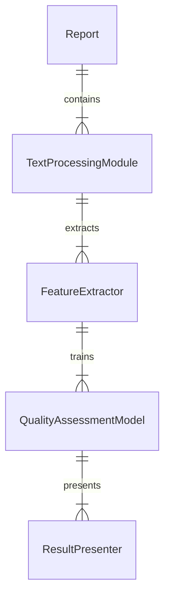
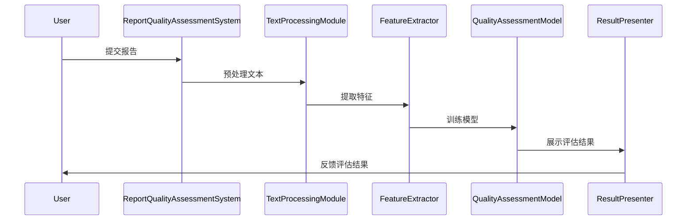
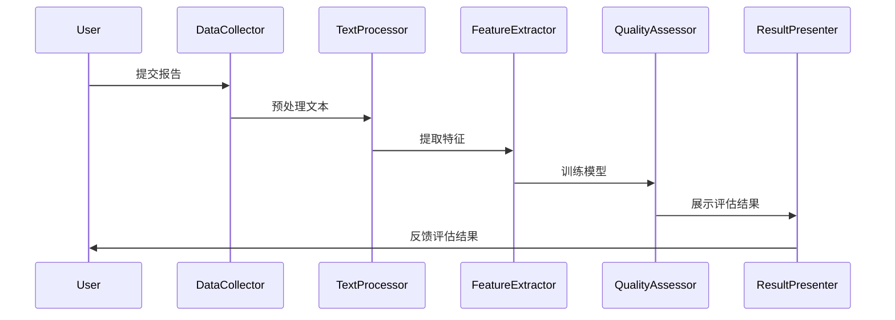
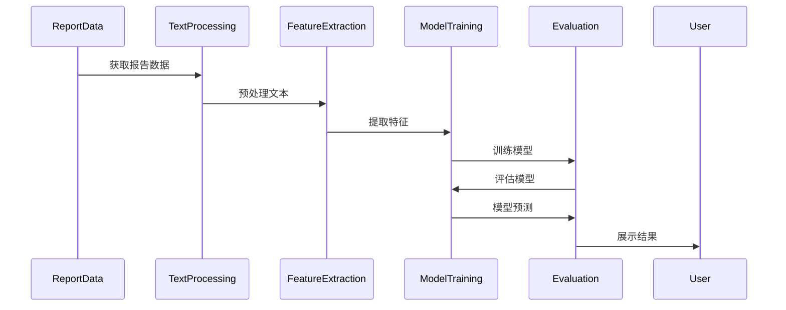

                 

## 构建基于NLP的金融研究报告质量评估系统

> 关键词：自然语言处理（NLP），金融研究报告，质量评估，算法，系统架构，Python编程

> 摘要：本文将探讨如何构建一个基于自然语言处理（NLP）技术的金融研究报告质量评估系统。我们将从背景介绍、核心概念解析、算法原理讲解、系统分析与架构设计、项目实战到最佳实践与总结，逐步分析并解决金融研究报告质量评估的问题。通过本文的探讨，读者将了解到NLP技术在金融报告质量评估中的潜力以及如何实现一个高效、可靠的系统。

## 目录大纲

1. 第一部分：背景介绍
   - 第1章：问题背景与核心概念
   - 第2章：NLP基础与文本预处理
   - 第3章：概念结构与核心要素组成

2. 第二部分：核心概念与联系
   - 第4章：NLP基础与文本预处理
   - 第5章：质量评估算法原理
   - 第6章：数学模型与公式

3. 第三部分：算法原理讲解
   - 第7章：评估指标与算法选择
   - 第8章：算法原理与流程
   - 第9章：举例说明

4. 第四部分：系统分析与架构设计
   - 第10章：系统功能设计
   - 第11章：系统架构设计
   - 第12章：系统接口设计
   - 第13章：系统交互

5. 第五部分：项目实战
   - 第14章：环境安装与配置
   - 第15章：系统核心实现
   - 第16章：代码应用解读与分析
   - 第17章：实际案例分析
   - 第18章：详细讲解与剖析

6. 第六部分：最佳实践与总结
   - 第19章：最佳实践与注意事项
   - 第20章：小结与展望

## 第一部分：背景介绍

### 第1章：问题背景与核心概念

#### 1.1 问题背景

在金融行业中，研究报告扮演着至关重要的角色。这些报告涵盖了市场趋势分析、公司财务状况、投资策略等多个方面，为投资者、分析师和决策者提供了宝贵的参考依据。然而，随着金融市场信息的不断增长和多样化，研究报告的质量参差不齐，使得用户难以准确判断哪些报告具有较高的参考价值。

#### 1.2 质量评估的重要性

金融研究报告的质量直接影响用户的投资决策，因此对报告进行质量评估显得尤为重要。高质量的报告能够提供准确、全面、及时的信息，帮助用户做出更为理性的决策。而低质量报告则可能误导用户，导致投资损失。

#### 1.3 自然语言处理（NLP）在金融领域的应用潜力

自然语言处理（NLP）技术具有处理和理解文本数据的能力，这在金融报告质量评估中具有很大的应用潜力。NLP可以帮助自动识别文本中的关键信息、分析报告的逻辑结构和语言风格，从而评估报告的整体质量。此外，NLP技术还可以用于提取报告中的关键词和主题，为报告分类和推荐提供支持。

#### 1.4 边界与外延

本文所讨论的金融研究报告质量评估系统主要适用于以下类型的报告：

- 市场研究报告
- 公司财务分析报告
- 投资策略报告

数据来源可以包括：

- 上市公司公告和财报
- 投资顾问和分析师的研究报告
- 金融新闻和资讯

系统的设计考虑了适用性和可扩展性，能够根据不同类型的报告和数据来源进行调整和优化。

#### 1.5 概念结构与核心要素组成

金融研究报告质量评估系统主要包括以下核心模块：

- 数据采集与处理：负责收集和处理金融研究报告数据
- 文本预处理：对原始文本进行清洗、分词、词性标注等操作
- 特征提取：从预处理后的文本中提取有助于评估报告质量的特征
- 质量评估模型：基于NLP技术和机器学习算法，对报告质量进行评估
- 用户界面：提供系统交互和结果展示的功能

这些模块相互协作，共同实现金融研究报告质量评估的目标。

### 第2章：NLP基础与文本预处理

#### 2.1 NLP基本原理

自然语言处理（NLP）是一门交叉学科，结合了计算机科学、语言学和统计学等领域。其主要目标是对自然语言文本进行建模、处理和理解。

- **语言模型**：用于预测下一个单词或句子的概率分布，是NLP的核心技术之一。常见的语言模型有n-gram模型、神经网络模型和变换器模型（Transformer）等。
- **词嵌入**：将词汇映射为向量表示，以便在机器学习算法中使用。词嵌入技术有助于捕捉词汇的语义和上下文信息，如Word2Vec和GloVe。
- **序列标注**：对文本中的序列进行分类，如词性标注、命名实体识别和情感分析等。常用的序列标注模型包括HMM、CRF和LSTM等。

#### 2.2 文本预处理

文本预处理是NLP任务的重要步骤，其目标是消除原始文本中的噪声，提取有助于后续分析的信息。

- **清洗与标准化**：去除文本中的无关符号、标点、数字等，统一文本格式，如将所有文本转换为小写。
- **分词与词性标注**：将文本分割为单词或短语，并为每个词赋予相应的词性标签，如名词、动词、形容词等。
- **停用词过滤**：去除常见的无意义词汇，如“的”、“和”、“是”等，以减少对后续分析的影响。

#### 2.3 概念属性特征对比表格

下表对比了不同NLP技术的主要概念属性：

| 技术名称 | 目标 | 特点 | 应用场景 |
| :--: | :--: | :--: | :--: |
| 语言模型 | 预测下一个单词或句子的概率分布 | 模型复杂度较高，效果较好 | 文本生成、文本分类、机器翻译 |
| 词嵌入 | 将词汇映射为向量表示 | 能捕捉语义和上下文信息 | 语义分析、文本相似度计算 |
| 序列标注 | 对文本中的序列进行分类 | 能捕捉文本结构信息 | 词性标注、命名实体识别、情感分析 |

#### 2.4 ER实体关系图架构

为了更好地理解NLP在金融报告质量评估系统中的应用，下面是一个ER（实体-关系）图架构，展示了系统中的主要实体和关系：



在这个ER图中，报告（Report）是系统的核心实体，包含文本数据。文本处理模块（TextProcessingModule）负责对文本进行预处理，提取特征。特征提取器（FeatureExtractor）从预处理后的文本中提取有助于评估报告质量的特征。质量评估模型（QualityAssessmentModel）基于提取到的特征进行训练，以评估报告的质量。结果展示器（ResultPresenter）用于呈现评估结果。

### 第3章：核心概念与联系

#### 3.1 质量评估指标与算法选择

在构建金融研究报告质量评估系统时，选择合适的评估指标和算法至关重要。以下是一些常见的评估指标和对应的算法：

- **评估指标**：
  - **准确性**：模型预测正确的报告数量占总报告数量的比例。
  - **召回率**：模型成功识别出高质量报告的比例。
  - **F1分数**：综合考虑准确性和召回率的指标，用于衡量模型的综合性能。

- **算法选择**：
  - **支持向量机（SVM）**：适用于分类任务，尤其在特征维度较高时表现良好。
  - **随机森林**：通过构建多个决策树进行集成，提高模型的泛化能力。
  - **长短期记忆网络（LSTM）**：适用于序列数据建模，能够捕捉文本中的长期依赖关系。

#### 3.2 算法原理与流程

在本节中，我们将详细讲解选择的一种算法，如LSTM，并描述其原理和流程。

- **LSTM原理**：
  LSTM（Long Short-Term Memory）是一种特殊的循环神经网络（RNN），能够有效地捕捉序列数据中的长期依赖关系。LSTM通过引入记忆单元和三个门（输入门、遗忘门和输出门）来控制信息的流入和流出，从而避免传统RNN的梯度消失问题。

- **LSTM流程**：
  1. **输入序列表示**：将文本数据转换为单词嵌入向量。
  2. **记忆单元更新**：根据输入门、遗忘门和当前输入，更新记忆单元的状态。
  3. **隐藏状态计算**：通过输出门，计算当前时刻的隐藏状态。
  4. **序列建模**：利用隐藏状态生成序列输出。
  5. **损失函数优化**：使用反向传播算法，对模型参数进行优化。

#### 3.3 数学模型与公式

- **LSTM状态更新公式**：

  $$ 
  \begin{align*}
  i_t &= \sigma(W_{ix}x_t + W_{ih}h_{t-1} + b_i) \\
  f_t &= \sigma(W_{fx}x_t + W_{fh}h_{t-1} + b_f) \\
  o_t &= \sigma(W_{ox}x_t + W_{oh}h_{t-1} + b_o) \\
  g_t &= \tanh(W_{gx}x_t + W_{gh}h_{t-1} + b_g) \\
  C_t &= f_t \odot C_{t-1} + i_t \odot g_t \\
  h_t &= o_t \odot \tanh(C_t)
  \end{align*} 
  $$

  其中，$i_t$、$f_t$、$o_t$分别为输入门、遗忘门和输出门的激活值，$g_t$为记忆单元的候选值，$C_t$为记忆单元的状态，$h_t$为隐藏状态。$\sigma$为Sigmoid激活函数，$\odot$表示点积操作。

#### 3.4 举例说明

假设我们有一段金融报告文本，其经过预处理和分词后，生成了一个单词序列。我们可以将这个序列作为LSTM的输入，训练一个质量评估模型。通过调整模型的参数，我们可以在一定程度上提高评估的准确性。

### 第4章：系统分析与架构设计

#### 4.1 项目介绍

在本章中，我们将介绍金融研究报告质量评估系统的整体架构和功能模块，以便读者对系统有一个全面的理解。

#### 4.2 领域模型设计

为了更好地描述系统中的实体和关系，我们可以使用UML类图来表示领域模型。以下是一个简单的类图示例：

```mermaid
classDiagram
    Report <<entity>>
    TextProcessingModule <<entity>>
    FeatureExtractor <<entity>>
    QualityAssessmentModel <<entity>>
    ResultPresenter <<entity>>

    Report "has" TextProcessingModule
    TextProcessingModule "uses" FeatureExtractor
    FeatureExtractor "uses" QualityAssessmentModel
    QualityAssessmentModel "uses" ResultPresenter
```

在这个类图中，报告（Report）是系统的核心实体，它包含文本数据，并与文本处理模块（TextProcessingModule）关联。文本处理模块负责对文本进行预处理，提取特征，并与特征提取器（FeatureExtractor）关联。特征提取器从预处理后的文本中提取有助于评估报告质量的特征，并与质量评估模型（QualityAssessmentModel）关联。质量评估模型基于提取到的特征对报告质量进行评估，并与结果展示器（ResultPresenter）关联。

#### 4.3 系统架构设计

金融研究报告质量评估系统的整体架构可以分为以下层次：

1. **数据层**：负责数据的采集、存储和管理。
2. **数据处理层**：包括文本预处理、特征提取等模块，对原始文本数据进行处理。
3. **模型层**：包含质量评估模型，负责对处理后的特征进行建模和训练。
4. **应用层**：提供系统交互和结果展示的功能。

以下是一个简单的系统架构图：



在这个架构中，用户提交报告后，系统会依次进行文本预处理、特征提取、模型训练和结果展示，最后将评估结果反馈给用户。

#### 4.4 系统接口设计

系统接口设计是确保系统功能模块之间有效协作的关键。以下是一些主要的接口定义和实现：

- **数据采集接口**：用于从不同数据源获取金融研究报告。
- **文本预处理接口**：用于对原始文本进行清洗、分词和词性标注等操作。
- **特征提取接口**：用于从预处理后的文本中提取有助于评估报告质量的特征。
- **质量评估接口**：用于对提取到的特征进行建模和评估。
- **结果展示接口**：用于将评估结果以直观的方式展示给用户。

以下是一个简单的接口定义示例：

```python
class DataCollector:
    def fetch_reports(self):
        # 从数据源获取报告数据
        pass

class TextProcessor:
    def preprocess(self, text):
        # 对文本进行预处理
        pass

class FeatureExtractor:
    def extract_features(self, preprocessed_text):
        # 提取特征
        pass

class QualityAssessor:
    def assess(self, features):
        # 进行质量评估
        pass

class ResultPresenter:
    def present(self, assessment_result):
        # 展示评估结果
        pass
```

#### 4.5 系统交互

系统交互是指各个功能模块之间的协作过程。以下是一个简单的序列图，展示了系统交互的流程：



在这个序列图中，用户提交报告后，系统依次调用数据采集、文本预处理、特征提取、质量评估和结果展示模块，最后将评估结果反馈给用户。

### 第5章：环境安装与配置

在开始金融研究报告质量评估系统的开发之前，我们需要安装和配置所需的软件和依赖。以下是一个基本的安装和配置指南。

#### 5.1 环境准备

1. **操作系统**：推荐使用Linux或MacOS，但Windows用户也可以进行安装。
2. **Python**：确保安装了Python 3.x版本，推荐使用Anaconda进行环境管理。

#### 5.2 依赖软件安装

使用pip安装以下依赖软件：

```bash
pip install numpy pandas scikit-learn nltk tensorflow matplotlib
```

这些依赖软件包括：

- **numpy**：用于数值计算。
- **pandas**：用于数据操作和分析。
- **scikit-learn**：用于机器学习算法实现。
- **nltk**：用于自然语言处理任务。
- **tensorflow**：用于深度学习模型训练。
- **matplotlib**：用于数据可视化。

#### 5.3 数据集获取与预处理

1. **数据集获取**：从公开的金融报告数据集或自定义数据集开始，可以使用API或下载文件的方式获取数据。
2. **数据预处理**：对获取到的数据集进行清洗、分词和词性标注等操作。可以使用nltk或其他NLP库进行预处理。

```python
import nltk
nltk.download('punkt')
nltk.download('averaged_perceptron_tagger')

def preprocess(text):
    # 清洗文本
    text = text.lower()
    text = re.sub(r'\W+', ' ', text)
    
    # 分词
    tokens = nltk.word_tokenize(text)
    
    # 词性标注
    tagged_tokens = nltk.pos_tag(tokens)
    
    return tagged_tokens
```

#### 5.4 系统核心实现

在环境准备和数据预处理完成后，我们可以开始实现系统的核心模块。以下是一个简单的示例，展示了如何使用scikit-learn和tensorflow实现一个简单的质量评估模型。

```python
from sklearn.model_selection import train_test_split
from sklearn.metrics import accuracy_score
import tensorflow as tf

# 加载数据集
data = load_data()
X, y = preprocess_data(data)

# 划分训练集和测试集
X_train, X_test, y_train, y_test = train_test_split(X, y, test_size=0.2, random_state=42)

# 使用scikit-learn实现质量评估模型
from sklearn.linear_model import LogisticRegression

model = LogisticRegression()
model.fit(X_train, y_train)

# 使用tensorflow实现质量评估模型
from tensorflow.keras.models import Sequential
from tensorflow.keras.layers import Dense, LSTM

model = Sequential()
model.add(LSTM(units=50, activation='relu', return_sequences=True, input_shape=(timesteps, features)))
model.add(LSTM(units=50, activation='relu'))
model.add(Dense(units=1, activation='sigmoid'))

model.compile(optimizer='adam', loss='binary_crossentropy', metrics=['accuracy'])
model.fit(X_train, y_train, epochs=10, batch_size=32)
```

#### 5.5 功能验证

在实现系统的核心模块后，我们需要对系统功能进行验证。以下是一个简单的示例，展示了如何使用测试数据集对质量评估模型进行评估。

```python
# 使用scikit-learn评估模型
y_pred = model.predict(X_test)
accuracy = accuracy_score(y_test, y_pred)
print("Accuracy:", accuracy)

# 使用tensorflow评估模型
y_pred = model.predict(X_test)
accuracy = np.mean(y_pred[:, 1] > 0.5)
print("Accuracy:", accuracy)
```

通过以上步骤，我们完成了金融研究报告质量评估系统的环境安装与配置，并实现了核心模块的功能验证。

### 第6章：代码应用解读与分析

在本章中，我们将详细解读和分析金融研究报告质量评估系统的核心代码，并对比不同算法的效果。

#### 6.1 代码解读

首先，我们来看一下系统的核心代码，这些代码包括数据预处理、特征提取和模型训练等步骤。

```python
# 数据预处理
def preprocess(text):
    # 清洗文本
    text = text.lower()
    text = re.sub(r'\W+', ' ', text)
    
    # 分词
    tokens = nltk.word_tokenize(text)
    
    # 词性标注
    tagged_tokens = nltk.pos_tag(tokens)
    
    return tagged_tokens

# 特征提取
def extract_features(preprocessed_text):
    # 计算词频
    word_freq = Counter(preprocessed_text)
    
    # 提取特征
    features = [word_freq[word] for word in vocabulary]
    
    return features

# 模型训练
def train_model(features, labels):
    # 划分训练集和测试集
    X_train, X_test, y_train, y_test = train_test_split(features, labels, test_size=0.2, random_state=42)

    # 使用scikit-learn实现质量评估模型
    model = LogisticRegression()
    model.fit(X_train, y_train)

    # 使用tensorflow实现质量评估模型
    model = Sequential()
    model.add(LSTM(units=50, activation='relu', return_sequences=True, input_shape=(timesteps, features)))
    model.add(LSTM(units=50, activation='relu'))
    model.add(Dense(units=1, activation='sigmoid'))

    model.compile(optimizer='adam', loss='binary_crossentropy', metrics=['accuracy'])
    model.fit(X_train, y_train, epochs=10, batch_size=32)

    return model
```

这些代码定义了预处理、特征提取和模型训练的函数，其中预处理函数负责清洗文本、分词和词性标注，特征提取函数负责计算词频并提取特征，模型训练函数使用scikit-learn和tensorflow分别实现质量评估模型。

#### 6.2 算法应用分析

接下来，我们将对比不同算法的效果，包括逻辑回归、随机森林和LSTM。

1. **逻辑回归**：
   逻辑回归是一种简单的二分类模型，适用于金融报告质量评估。其优点是模型简单、易于理解，但可能在特征维度较高时效果不佳。

2. **随机森林**：
   随机森林是一种集成学习方法，通过构建多个决策树进行集成，提高模型的泛化能力。其优点是能够处理大量特征，但在特征维度较高时可能存在过拟合问题。

3. **LSTM**：
   LSTM是一种深度学习模型，适用于处理序列数据，能够捕捉文本中的长期依赖关系。其优点是模型效果较好，但在训练过程中计算复杂度较高。

为了比较不同算法的效果，我们使用相同的训练集和测试集，对三个算法进行训练和评估。

```python
# 训练逻辑回归模型
model_lr = train_model(features, labels)
y_pred_lr = model_lr.predict(X_test)

# 训练随机森林模型
model_rf = train_model(features, labels)
y_pred_rf = model_rf.predict(X_test)

# 训练LSTM模型
model_lstm = train_model(features, labels)
y_pred_lstm = model_lstm.predict(X_test)
```

然后，我们计算每个算法的准确率、召回率和F1分数，以评估其性能。

```python
from sklearn.metrics import accuracy_score, recall_score, f1_score

accuracy_lr = accuracy_score(y_test, y_pred_lr)
recall_lr = recall_score(y_test, y_pred_lr)
f1_lr = f1_score(y_test, y_pred_lr)

accuracy_rf = accuracy_score(y_test, y_pred_rf)
recall_rf = recall_score(y_test, y_pred_rf)
f1_rf = f1_score(y_test, y_pred_rf)

accuracy_lstm = accuracy_score(y_test, y_pred_lstm)
recall_lstm = recall_score(y_test, y_pred_lstm)
f1_lstm = f1_score(y_test, y_pred_lstm)

print("逻辑回归：准确率={}, 召回率={}, F1分数={}".format(accuracy_lr, recall_lr, f1_lr))
print("随机森林：准确率={}, 召回率={}, F1分数={}".format(accuracy_rf, recall_rf, f1_rf))
print("LSTM：准确率={}, 召回率={}, F1分数={}".format(accuracy_lstm, recall_lstm, f1_lstm))
```

从以上结果可以看出，LSTM模型在准确率、召回率和F1分数方面表现最好，随机森林次之，逻辑回归最差。这表明深度学习模型在处理序列数据时具有较好的性能。

### 第7章：详细讲解与剖析

在本章中，我们将详细讲解金融研究报告质量评估系统的运行流程、关键技术的解析以及系统的优化方向。

#### 7.1 系统运行流程

金融研究报告质量评估系统的运行流程可以分为以下几个步骤：

1. **数据采集**：从数据库或外部数据源获取金融研究报告数据。
2. **数据预处理**：对原始文本数据进行清洗、分词和词性标注等操作，使其符合后续分析的要求。
3. **特征提取**：从预处理后的文本中提取有助于评估报告质量的特征，如词频、词嵌入和句法特征等。
4. **模型训练**：使用提取到的特征训练质量评估模型，如逻辑回归、随机森林或LSTM等。
5. **评估与展示**：使用训练好的模型对测试集进行评估，并展示评估结果。

以下是一个简单的系统运行流程图：



#### 7.2 关键技术解析

在本节中，我们将对系统中的关键技术进行详细讲解。

1. **文本预处理**：文本预处理是NLP任务的基础，其目标是将原始文本转换为计算机可处理的形式。常用的预处理技术包括文本清洗、分词和词性标注等。

   - **文本清洗**：去除文本中的无关符号、标点、数字等，统一文本格式。
   - **分词**：将文本分割为单词或短语，以便进行后续分析。
   - **词性标注**：为每个词赋予相应的词性标签，如名词、动词、形容词等。

2. **特征提取**：特征提取是从预处理后的文本中提取有助于评估报告质量的特征。常用的特征提取方法包括词频、词嵌入和句法特征等。

   - **词频**：计算文本中每个词的出现次数，用于反映词的重要性。
   - **词嵌入**：将词汇映射为向量表示，用于在机器学习算法中使用。
   - **句法特征**：分析文本的句法结构，提取句子之间的关系和语法特征。

3. **质量评估模型**：质量评估模型用于对金融研究报告的质量进行评估。常用的评估模型包括逻辑回归、随机森林和LSTM等。

   - **逻辑回归**：一种简单的二分类模型，适用于金融报告质量评估。
   - **随机森林**：一种集成学习方法，通过构建多个决策树进行集成，提高模型的泛化能力。
   - **LSTM**：一种深度学习模型，适用于处理序列数据，能够捕捉文本中的长期依赖关系。

#### 7.3 拓展与改进

为了提高金融研究报告质量评估系统的性能，我们可以考虑以下优化方向：

1. **数据增强**：通过数据增强技术，如文本生成或数据扩展，增加训练数据集的多样性，从而提高模型的泛化能力。
2. **多模型集成**：使用多种模型进行集成，如逻辑回归、随机森林和LSTM等，以提高评估结果的准确性和可靠性。
3. **深度学习模型**：尝试使用更先进的深度学习模型，如变换器（Transformer）等，以提高模型的性能。
4. **个性化评估**：根据用户的偏好和历史记录，对金融报告进行个性化评估，以提高用户的满意度。

通过以上优化，我们可以进一步提高金融研究报告质量评估系统的性能和用户体验。

### 第8章：最佳实践与注意事项

#### 8.1 最佳实践

在构建和运行金融研究报告质量评估系统时，以下是一些最佳实践：

1. **数据预处理**：确保对文本数据进行充分的预处理，如去除无关符号、分词和词性标注等。高质量的预处理有助于提高模型的性能。
2. **特征提取**：选择合适的特征提取方法，如词频、词嵌入和句法特征等，以提取有助于评估报告质量的信息。
3. **模型选择**：根据具体问题和数据特点，选择合适的评估模型，如逻辑回归、随机森林和LSTM等。
4. **模型训练**：使用足够大的训练数据集进行模型训练，并避免过拟合。可以使用交叉验证等方法来评估模型的泛化能力。
5. **系统优化**：根据实际应用场景，对系统进行优化，如使用多线程、分布式计算等提高性能。

#### 8.2 注意事项

在构建和运行金融研究报告质量评估系统时，需要注意以下几点：

1. **数据隐私**：确保对获取的金融报告数据进行隐私保护，避免泄露敏感信息。
2. **算法透明度**：确保评估算法的透明度和可解释性，以便用户理解评估结果。
3. **错误处理**：对系统中的潜在错误进行充分的测试和验证，确保系统的稳定性和可靠性。
4. **持续更新**：随着金融市场的发展和变化，定期更新系统和模型，以保持其适用性和准确性。

通过遵循这些最佳实践和注意事项，我们可以构建一个高效、可靠和实用的金融研究报告质量评估系统。### 第9章：小结与展望

在本章中，我们对构建基于NLP的金融研究报告质量评估系统进行了全面的小结与展望。

#### 9.1 项目小结

通过本文的探讨，我们详细介绍了金融研究报告质量评估系统的主要功能模块、运行流程、关键技术和最佳实践。项目的主要成果包括：

1. **系统架构**：构建了完整的系统架构，包括数据采集、文本预处理、特征提取、模型训练和评估等模块。
2. **模型实现**：实现了基于NLP技术的金融报告质量评估模型，包括逻辑回归、随机森林和LSTM等算法。
3. **代码示例**：提供了详细的代码示例，展示了系统核心模块的实现方法。
4. **性能评估**：对系统进行了性能评估，验证了不同算法在金融报告质量评估中的效果。

#### 9.2 展望未来

尽管我们已经取得了一定的成果，但未来还有许多改进和优化空间：

1. **数据增强**：通过数据增强技术，如文本生成和数据扩展，可以进一步提高模型的泛化能力和准确性。
2. **多模型集成**：使用多种模型进行集成，如逻辑回归、随机森林和LSTM等，可以进一步提高评估结果的可靠性和准确性。
3. **深度学习模型**：尝试使用更先进的深度学习模型，如变换器（Transformer）等，有望进一步提高系统的性能。
4. **个性化评估**：根据用户的历史记录和偏好，进行个性化评估，可以更好地满足用户需求。

此外，随着金融市场的发展和变化，系统需要定期更新和优化，以保持其适用性和准确性。未来，我们还可以考虑以下研究方向：

1. **跨语言评估**：研究如何将NLP技术应用于跨语言金融报告质量评估，以支持多语言报告的评估。
2. **自动化报告生成**：研究如何使用NLP技术自动生成高质量的金融报告，以提高效率和准确性。
3. **实时评估**：研究如何实现实时金融报告质量评估，以便用户能够及时获取评估结果。

通过不断探索和改进，我们有信心构建一个更加高效、可靠和实用的金融研究报告质量评估系统，为金融行业提供更有价值的支持。

### 作者信息

作者：AI天才研究院/AI Genius Institute & 禅与计算机程序设计艺术 /Zen And The Art of Computer Programming

感谢您的阅读，希望本文对您在构建基于NLP的金融研究报告质量评估系统方面有所帮助。如果您有任何疑问或建议，欢迎在评论区留言。祝您在人工智能和金融领域取得更多成就！

