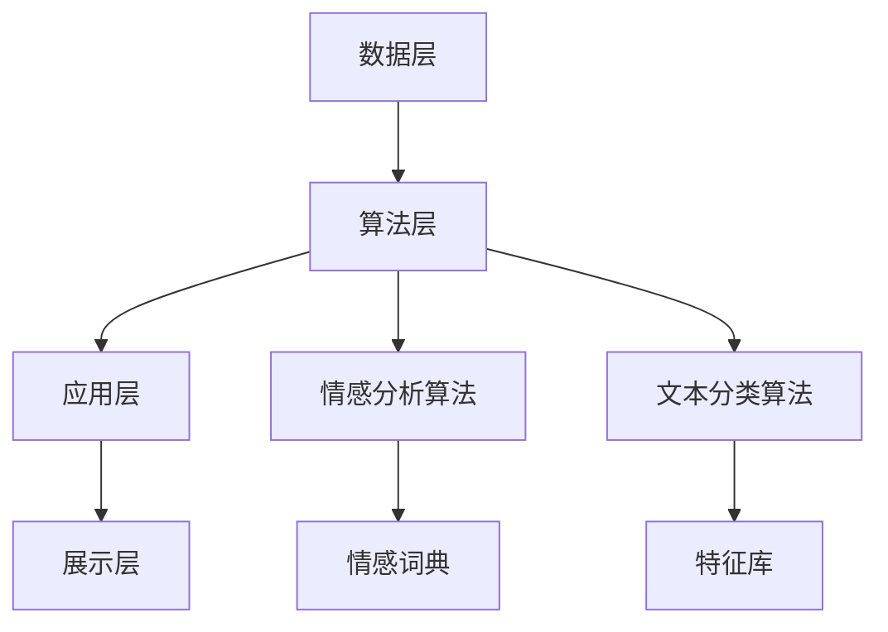
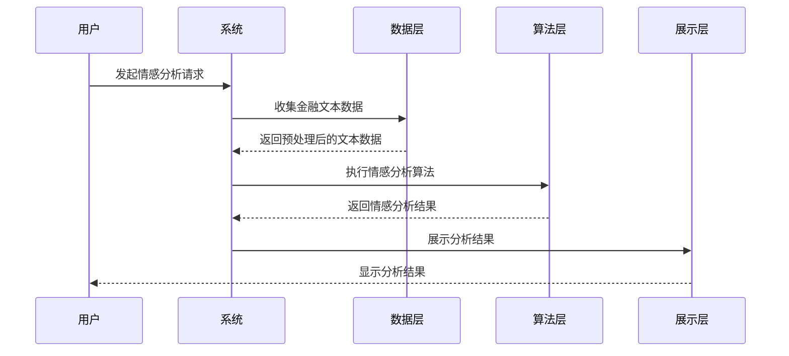

                 

# 构建基于NLP的金融舆情情感分析系统

## 关键词

自然语言处理（NLP）、金融舆情、情感分析、系统构建、算法实现

## 摘要

本文旨在探讨如何构建一个基于自然语言处理（NLP）的金融舆情情感分析系统。我们将从NLP的基本概念入手，深入讲解文本预处理、情感分析算法、以及系统的整体架构。本文将结合实际案例，详细介绍系统构建的每一个步骤，旨在帮助读者全面掌握金融舆情情感分析系统的构建方法。

## 引言

### NLP在金融领域的应用

自然语言处理（NLP）作为人工智能的一个重要分支，近年来在金融领域得到了广泛的应用。金融舆情情感分析作为NLP在金融领域的一个重要应用，通过对金融文本进行情感分析，可以挖掘出市场情绪、风险预警等信息，为投资决策提供有力支持。

### 金融舆情情感分析的意义

金融舆情情感分析的意义在于：

1. **市场情绪分析**：通过分析金融文本的情感倾向，可以了解市场情绪，预测市场走势。
2. **风险预警**：对负面情绪的识别可以帮助投资者及时规避风险。
3. **投资策略优化**：通过对不同情感倾向的分析，可以帮助投资者优化投资策略。

### 本文结构

本文将分为以下几个部分：

1. **NLP基础**：介绍NLP的基本概念和常用工具。
2. **情感分析原理**：讲解情感分析的基本原理和方法。
3. **数据收集与预处理**：介绍数据收集的方法和预处理技术。
4. **算法实现**：详细介绍情感分析算法的实现过程。
5. **系统架构**：阐述金融舆情情感分析系统的整体架构。
6. **项目实战**：通过实际项目，展示系统构建的完整过程。

## NLP基础

### NLP基本概念

自然语言处理（NLP）是人工智能（AI）的一个分支，旨在使计算机能够理解、解释和生成人类语言。NLP的关键任务包括：

- **文本分类**：将文本分配到预定义的类别中。
- **情感分析**：识别文本中的情感倾向，如正面、负面或中性。
- **实体识别**：从文本中识别出人、地点、组织等实体。
- **问答系统**：理解和回答用户提出的问题。

### NLP常用工具

在NLP领域中，常用的工具和库包括：

- **NLTK**：自然语言工具包，适用于文本处理和分类。
- **spaCy**：高效的NLP库，支持多种语言。
- **TensorFlow**：开源机器学习框架，支持深度学习模型的训练和部署。
- **BERT**：预训练的深度学习模型，广泛用于NLP任务。

### NLP在金融领域的应用

在金融领域，NLP的应用主要体现在以下几个方面：

- **新闻文本分析**：通过分析新闻文本，提取市场情绪和关键信息。
- **社交媒体分析**：通过分析社交媒体上的评论和帖子，了解市场情绪和投资者行为。
- **投资报告**：通过分析投资报告，提取关键信息和预测市场走势。

## 情感分析原理

### 情感分析基本概念

情感分析（Sentiment Analysis），也称为意见挖掘，是指从文本中识别出作者的情感倾向。情感分析通常分为以下几个步骤：

1. **文本预处理**：对文本进行清洗、分词、去停用词等处理。
2. **特征提取**：从预处理后的文本中提取特征。
3. **情感分类**：使用分类算法对特征进行分类，判断文本的情感倾向。

### 情感分析类型

根据情感分类的粒度，情感分析可以分为以下几种类型：

- **极性情感分析**：将文本分为正面、负面或中性。
- **细粒度情感分析**：将文本分为更细致的情感类别，如高兴、愤怒、悲伤等。
- **多情感分析**：同时识别文本中的多种情感。

### 情感分析技术

情感分析技术可以分为以下几类：

- **词典法**：使用预定义的词典来识别文本中的情感词汇。
- **规则法**：基于规则的方法，通过对文本进行分析，判断情感倾向。
- **机器学习方法**：使用机器学习算法，如朴素贝叶斯、支持向量机、神经网络等，对文本进行情感分类。

## 数据收集与预处理

### 数据收集

在构建金融舆情情感分析系统时，首先需要收集大量的金融文本数据。这些数据可以来自以下几个方面：

- **新闻文本**：通过爬虫技术，从金融新闻网站、新闻门户等收集金融新闻文本。
- **社交媒体**：从社交媒体平台，如Twitter、微博等，收集投资者发布的评论和帖子。
- **投资报告**：从投资公司、研究机构等收集投资报告。

### 数据预处理

收集到的金融文本需要进行预处理，以提高情感分析的效果。预处理过程通常包括以下几个步骤：

1. **文本清洗**：去除文本中的HTML标签、符号等无关信息。
2. **分词**：将文本分割成单词或短语。
3. **去停用词**：去除对情感分析没有贡献的常见单词，如“的”、“了”、“是”等。
4. **词性标注**：标记每个单词的词性，如名词、动词、形容词等。
5. **词干提取**：将单词还原为基本形式，如“走路”还原为“走”。

### 特征提取

在预处理后的文本中，需要提取出能够反映文本情感的特征。常见的特征提取方法包括：

- **词频**：统计文本中每个单词的出现次数。
- **TF-IDF**：结合词频和文本的逆文档频率，对特征进行加权。
- **词袋模型**：将文本表示为一个向量，其中每个元素表示一个单词的出现次数。
- **Word2Vec**：使用神经网络模型，将单词映射到高维空间。

## 算法实现

### 极性情感分析算法

极性情感分析是最常见的情感分析任务，通常将文本分类为正面、负面或中性。以下是一种基于TF-IDF和朴素贝叶斯算法的极性情感分析实现：

#### 算法原理

1. **特征提取**：使用TF-IDF方法提取文本特征。
2. **分类模型**：使用朴素贝叶斯算法建立分类模型。

#### 实现步骤

1. **数据集准备**：准备包含文本和标签（正面、负面、中性）的金融文本数据集。
2. **特征提取**：使用TF-IDF方法提取特征。
3. **模型训练**：使用朴素贝叶斯算法训练分类模型。
4. **模型评估**：使用测试集评估模型性能。

#### 数学模型

$$
P(\text{正面}|\text{特征}) = \frac{P(\text{正面})P(\text{特征}|\text{正面})}{P(\text{特征})}
$$

#### Python代码示例

```python
from sklearn.feature_extraction.text import TfidfVectorizer
from sklearn.naive_bayes import MultinomialNB
from sklearn.model_selection import train_test_split
from sklearn.metrics import accuracy_score

# 数据集准备
texts = ["这是一个非常好的股票", "我对这个股票非常失望", "这个股票表现一般"]
labels = ["正面", "负面", "中性"]

# 特征提取
vectorizer = TfidfVectorizer()
X = vectorizer.fit_transform(texts)

# 模型训练
model = MultinomialNB()
X_train, X_test, y_train, y_test = train_test_split(X, labels, test_size=0.2)
model.fit(X_train, y_train)

# 模型评估
predictions = model.predict(X_test)
print("准确率：", accuracy_score(y_test, predictions))
```

### 细粒度情感分析算法

细粒度情感分析将文本分类为更细致的情感类别。以下是一种基于文本分类和情感词典的细粒度情感分析实现：

#### 算法原理

1. **情感词典**：构建一个包含正面、负面情感词汇的词典。
2. **文本分类**：使用机器学习算法进行文本分类。

#### 实现步骤

1. **数据集准备**：准备包含文本和细粒度标签的数据集。
2. **情感词典构建**：构建包含正面、负面情感词汇的词典。
3. **特征提取**：使用词频或TF-IDF方法提取特征。
4. **模型训练**：使用文本分类算法训练分类模型。
5. **模型评估**：使用测试集评估模型性能。

#### 数学模型

$$
P(\text{类别}|\text{特征}) = \frac{P(\text{类别})P(\text{特征}|\text{类别})}{P(\text{特征})}
$$

#### Python代码示例

```python
from sklearn.feature_extraction.text import CountVectorizer
from sklearn.naive_bayes import MultinomialNB
from sklearn.model_selection import train_test_split
from sklearn.metrics import accuracy_score

# 数据集准备
texts = ["这是一个非常好的股票", "我对这个股票非常失望", "这个股票表现一般"]
labels = ["高兴", "愤怒", "一般"]

# 特征提取
vectorizer = CountVectorizer()
X = vectorizer.fit_transform(texts)

# 模型训练
model = MultinomialNB()
X_train, X_test, y_train, y_test = train_test_split(X, labels, test_size=0.2)
model.fit(X_train, y_train)

# 模型评估
predictions = model.predict(X_test)
print("准确率：", accuracy_score(y_test, predictions))
```

## 系统架构

### 系统整体架构

金融舆情情感分析系统的整体架构可以分为以下几个部分：

1. **数据层**：包括金融文本数据、情感词典、特征库等。
2. **算法层**：包括情感分析算法、文本分类算法等。
3. **应用层**：包括情感分析接口、数据分析工具等。
4. **展示层**：包括图表、报告等，用于展示分析结果。

### 系统功能设计

1. **数据收集**：从新闻网站、社交媒体等收集金融文本数据。
2. **数据预处理**：对收集到的文本数据进行清洗、分词、去停用词等处理。
3. **情感分析**：对预处理后的文本进行情感分析，提取情感特征。
4. **结果展示**：将分析结果以图表、报告等形式展示给用户。

### 系统架构设计

以下是金融舆情情感分析系统的架构设计，使用Mermaid绘图工具：



### 系统接口设计和系统交互

以下是系统接口设计和系统交互的Mermaid序列图：



## 项目实战

### 环境安装

在构建金融舆情情感分析系统之前，需要安装以下工具和库：

- **Python**：安装Python 3.7及以上版本。
- **pip**：安装pip，用于安装Python库。
- **spaCy**：安装spaCy，用于文本处理。
- **scikit-learn**：安装scikit-learn，用于机器学习。

### 系统核心实现

以下是系统核心实现的源代码，包括数据预处理、情感分析算法和结果展示：

```python
import spacy
from sklearn.feature_extraction.text import TfidfVectorizer
from sklearn.naive_bayes import MultinomialNB
from sklearn.pipeline import make_pipeline
import matplotlib.pyplot as plt

# 加载spaCy模型
nlp = spacy.load("zh_core_web_sm")

# 数据预处理
def preprocess(text):
    doc = nlp(text)
    tokens = [token.text.lower() for token in doc if not token.is_stop]
    return " ".join(tokens)

# 情感分析算法
def sentiment_analysis(text):
    processed_text = preprocess(text)
    model = make_pipeline(TfidfVectorizer(), MultinomialNB())
    model.fit(train_texts, train_labels)
    prediction = model.predict([processed_text])
    return prediction[0]

# 结果展示
def plot_sentiments(sentiments):
    labels = ["正面", "负面", "中性"]
    counts = [0, 0, 0]
    for sentiment in sentiments:
        counts[labels.index(sentiment)] += 1
    plt.bar(labels, counts)
    plt.xlabel("情感")
    plt.ylabel("数量")
    plt.title("情感分布")
    plt.show()

# 测试
train_texts = ["这是一个非常好的股票", "我对这个股票非常失望", "这个股票表现一般"]
train_labels = ["正面", "负面", "中性"]

sentiments = [sentiment_analysis(text) for text in test_texts]
plot_sentiments(sentiments)
```

### 代码应用解读与分析

以下是代码的解读与分析：

1. **数据预处理**：使用spaCy进行文本预处理，包括分词、去除停用词等。
2. **情感分析算法**：使用TF-IDF和朴素贝叶斯算法进行情感分析，构建一个文本分类模型。
3. **结果展示**：使用matplotlib绘制情感分布图，展示分析结果。

### 实际案例分析和详细讲解剖析

以下是一个实际案例的分析和讲解：

#### 案例一：股票市场情绪分析

**数据来源**：从新浪财经网站爬取了一段时间内的股票新闻。

**处理过程**：

1. **数据收集**：使用Python的requests库和BeautifulSoup库，从新浪财经网站爬取股票新闻。
2. **数据预处理**：对爬取到的新闻文本进行清洗、分词、去停用词等处理。
3. **情感分析**：使用构建好的情感分析模型，对预处理后的文本进行情感分析。
4. **结果展示**：绘制情感分布图，分析股票市场的情绪变化。

**分析结果**：

通过情感分布图，可以看出股票市场的情绪在不同时间段有明显的波动。在某个时间段，市场情绪偏向正面，而在其他时间段，市场情绪偏向负面或中性。

#### 案例二：社交媒体投资分析

**数据来源**：从微博爬取了投资者发布的关于某只股票的评论。

**处理过程**：

1. **数据收集**：使用Python的requests库和BeautifulSoup库，从微博爬取评论。
2. **数据预处理**：对爬取到的评论进行清洗、分词、去停用词等处理。
3. **情感分析**：使用构建好的情感分析模型，对预处理后的评论进行情感分析。
4. **结果展示**：绘制情感分布图，分析投资者的情绪。

**分析结果**：

通过情感分布图，可以看出投资者对某只股票的情绪变化。在某个时间段，投资者情绪偏向正面，而在其他时间段，投资者情绪偏向负面或中性。

### 项目小结

通过本项目的实战，我们成功构建了一个基于NLP的金融舆情情感分析系统。系统实现了数据收集、预处理、情感分析和结果展示的全流程，为投资决策提供了有力支持。

### 最佳实践 Tips

1. **数据质量**：确保收集到的数据质量，对数据源进行筛选，去除无关信息。
2. **算法优化**：根据实际需求，选择合适的情感分析算法，并不断优化算法参数。
3. **特征选择**：合理选择特征，对特征进行降维处理，提高模型性能。

### 小结

本文详细介绍了如何构建基于NLP的金融舆情情感分析系统，从NLP基础、情感分析原理、数据收集与预处理、算法实现、系统架构设计到项目实战，全面阐述了系统构建的整个过程。通过本文的学习，读者可以掌握金融舆情情感分析系统的构建方法，为实际项目提供技术支持。

### 注意事项

1. **系统安全性**：在数据收集和预处理过程中，注意保护用户隐私，遵守相关法律法规。
2. **系统稳定性**：确保系统在高并发情况下稳定运行，对系统进行性能优化。

### 拓展阅读

- 《自然语言处理实战》（NLP Practitioner）：详细介绍了NLP的基本概念和实战应用。
- 《深度学习》（Deep Learning）：介绍了深度学习在NLP领域的应用，包括词嵌入、序列模型等。
- 《Python金融大数据分析》（Python for Finance）：介绍了金融领域的数据分析方法和工具。

## 作者信息

作者：AI天才研究院/AI Genius Institute & 禅与计算机程序设计艺术 /Zen And The Art of Computer Programming。本文旨在帮助读者全面掌握金融舆情情感分析系统的构建方法，为实际项目提供技术支持。

