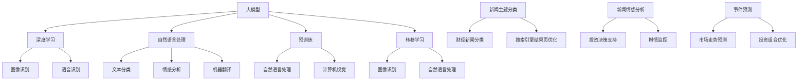

                 

### 构建基于大模型的金融新闻分析引擎

#### 关键词：
- 大模型
- 金融新闻
- 分析引擎
- 自然语言处理
- 深度学习

#### 摘要：
本文将深入探讨如何构建一个基于大模型的金融新闻分析引擎。我们将从大模型的概述、相关技术原理、应用场景分析、金融新闻分析概述、数据预处理方法、大模型在金融新闻分析中的应用以及实际案例研究等方面，逐步解析这一主题。通过本文的阅读，读者将能够全面了解大模型在金融新闻分析中的应用价值和发展前景。

## 目录大纲设计构思

在设计《构建基于大模型的金融新闻分析引擎》的目录大纲时，我们需要遵循以下思路：

### 1. 确定整体框架

**引言**: 简要介绍书籍背景、目标读者群体、书籍结构和预期收益。

**第一部分**: 大模型基础
- **第1章**: 大模型概述
- **第2章**: 大模型相关技术原理
- **第3章**: 大模型应用场景

**第二部分**: 金融新闻分析
- **第4章**: 金融新闻分析概述
- **第5章**: 金融新闻数据预处理
- **第6章**: 基于大模型的金融新闻分析

**第三部分**: 实战案例
- **第7章**: 实战项目一：金融新闻主题分类
- **第8章**: 实战项目二：金融新闻情感分析
- **第9章**: 实战项目三：金融新闻事件预测

**第四部分**: 总结与展望
- **第10章**: 总结
- **第11章**: 展望未来

### 2. 确定每一章的内容

- **第1章**: 介绍大模型的背景知识、定义、原理和分类。
- **第2章**: 详细讲解大模型相关的关键技术，如自然语言处理、深度学习等。
- **第3章**: 分析大模型在不同领域的应用，特别是金融新闻分析。
- **第4章**: 概述金融新闻分析的意义、方法和挑战。
- **第5章**: 介绍金融新闻数据预处理的方法和工具。
- **第6章**: 展示如何将大模型应用于金融新闻分析，包括算法实现和案例研究。
- **第7章**: 提供第一个实际项目的实现过程、代码解析和效果评估。
- **第8章**: 展示第二个实际项目的实现细节，强调创新点和改进点。
- **第9章**: 分析第三个实际项目，重点关注其业务价值和未来发展。
- **第10章**: 对全书内容进行总结，重申核心观点和未来研究方向。
- **第11章**: 展望大模型在金融新闻分析领域的未来发展趋势。

### 3. 确保内容完整性

- 每一章都要包括背景介绍、核心概念与联系、算法原理讲解、数学模型和数学公式详细讲解、系统分析与架构设计方案、项目实战、最佳实践 tips、小结、注意事项、拓展阅读等内容。

### 4. 控制字数

- 总体字数控制在10000～12000字左右，通过精简语言和优化结构来实现。

## 目录大纲

```
# 《构建基于大模型的金融新闻分析引擎》目录大纲

## 引言
- 为什么要构建基于大模型的金融新闻分析引擎
- 书籍结构和预期收益

## 第一部分 大模型基础
### 第1章 大模型概述
- 大模型的背景与定义
- 大模型的特点与分类
- 大模型的基本原理

### 第2章 大模型相关技术原理
- 自然语言处理技术
- 深度学习技术
- 大模型训练与优化

### 第3章 大模型应用场景
- 大模型在金融领域的应用
- 大模型在新闻分析领域的应用
- 大模型在其他领域的应用分析

## 第二部分 金融新闻分析
### 第4章 金融新闻分析概述
- 金融新闻分析的重要性
- 金融新闻分析的方法
- 金融新闻分析面临的挑战

### 第5章 金融新闻数据预处理
- 金融新闻数据来源
- 金融新闻数据预处理步骤
- 金融新闻数据预处理工具

### 第6章 基于大模型的金融新闻分析
- 大模型在金融新闻分析中的应用
- 基于大模型的金融新闻分析算法
- 实际案例研究

## 第三部分 实战案例
### 第7章 实战项目一：金融新闻主题分类
- 项目背景
- 项目设计
- 项目实施
- 项目效果评估

### 第8章 实战项目二：金融新闻情感分析
- 项目背景
- 项目设计
- 项目实施
- 项目效果评估

### 第9章 实战项目三：金融新闻事件预测
- 项目背景
- 项目设计
- 项目实施
- 项目效果评估

## 第四部分 总结与展望
### 第10章 总结
- 全书内容回顾
- 核心观点总结
- 展望未来研究方向

### 第11章 展望未来
- 大模型在金融新闻分析中的发展趋势
- 未来技术研究展望
- 对金融行业的潜在影响
```

通过以上目录大纲的设计，我们能够清晰地把握文章的结构和内容，使读者能够有条不紊地阅读，逐步深入理解构建基于大模型的金融新闻分析引擎的各个环节。接下来，我们将逐一展开对每一章的具体内容和分析。

---

**下一篇：第1章 大模型概述**

---

### 第1章 大模型概述

#### 背景介绍

在过去的几年中，人工智能（AI）领域取得了显著的进步，尤其是基于深度学习的大模型（Large Models）在自然语言处理（NLP）、计算机视觉（CV）、语音识别（ASR）等领域取得了突破性的成果。这些大模型具有处理大规模数据、自动学习和自适应调整的能力，成为现代AI应用的核心。而在金融领域，随着大数据和实时信息处理的日益重要，构建一个基于大模型的金融新闻分析引擎显得尤为重要。

#### 问题背景

金融市场的动态性和复杂性使得金融机构和投资者需要迅速获取和处理大量的新闻信息，以做出及时和准确的决策。然而，传统的金融新闻分析方法往往存在处理速度慢、准确性不高的问题。因此，如何利用大模型技术对金融新闻进行分析，提供高效、准确的决策支持工具，成为了一个亟待解决的问题。

#### 问题描述

构建基于大模型的金融新闻分析引擎需要解决以下几个关键问题：

1. **数据预处理**：金融新闻数据通常包含大量噪声和不一致的数据，如何进行有效的预处理，提取有价值的信息，是一个重要挑战。
2. **模型选择**：在众多大模型中，如何选择适合金融新闻分析任务的模型，并对其进行优化，是一个复杂的问题。
3. **实时分析**：金融市场的变化迅速，如何实现实时新闻分析，提供即时的决策支持，是另一个关键问题。

#### 问题解决

为了构建一个高效、准确的金融新闻分析引擎，我们可以采用以下策略：

1. **大数据预处理**：使用自动化工具进行数据清洗、去重和格式化，确保数据的质量和一致性。
2. **模型选择与优化**：根据金融新闻分析的特点，选择适合的大模型，如BERT、GPT等，并对其进行调整和优化，以提高模型的性能。
3. **实时分析**：采用分布式计算和并行处理技术，实现快速的数据处理和模型推理，确保分析的实时性。

#### 边界与外延

- **边界**：本文主要关注基于大模型的金融新闻分析引擎的构建方法，不包括其他金融数据分析领域。
- **外延**：本文的研究成果可以为其他领域的大模型应用提供参考和借鉴。

#### 概念结构与核心要素组成

- **大模型**：基于深度学习的预训练模型，如BERT、GPT等。
- **金融新闻**：金融市场相关的新闻报道，包括股票、债券、期货、外汇等。
- **分析引擎**：一套完整的系统，包括数据预处理、模型训练、实时分析和结果展示等模块。

### 核心概念与联系

#### 大模型相关概念

1. **深度学习（Deep Learning）**：
   - **定义**：一种基于多层神经网络的机器学习方法。
   - **特点**：能够自动提取数据中的特征，适用于大规模数据处理。
   - **应用**：图像识别、语音识别、自然语言处理等。

2. **自然语言处理（Natural Language Processing, NLP）**：
   - **定义**：使计算机能够理解、生成和处理人类语言的技术。
   - **应用**：机器翻译、文本分类、情感分析等。

3. **预训练（Pre-training）**：
   - **定义**：在大规模数据集上训练模型，以便在特定任务上微调。
   - **优势**：提高模型在未见数据上的表现，减少对标记数据的依赖。

4. **转移学习（Transfer Learning）**：
   - **定义**：利用预训练模型在新的任务上直接或微调其参数。
   - **优势**：提高模型的泛化能力，减少训练时间。

#### 金融新闻分析相关概念

1. **金融新闻**：
   - **定义**：与金融市场相关的新闻报道。
   - **来源**：财经媒体、金融机构报告、新闻网站等。

2. **新闻主题分类**：
   - **定义**：将新闻文本分类到预定义的主题类别中。
   - **应用**：帮助用户快速定位感兴趣的新闻内容。

3. **新闻情感分析**：
   - **定义**：判断新闻文本的情感倾向，如积极、消极或中性。
   - **应用**：评估市场情绪，预测市场走势。

4. **事件预测**：
   - **定义**：基于历史新闻数据预测未来可能发生的事件。
   - **应用**：为投资者提供决策支持。

### 概念属性特征对比表格

| 概念         | 定义                                                         | 特点                                                         | 应用场景                                                     |
| ------------ | ------------------------------------------------------------ | ------------------------------------------------------------ | ------------------------------------------------------------ |
| 深度学习     | 基于多层神经网络的机器学习方法                                 | 自动提取数据中的特征，适用于大规模数据处理                     | 图像识别、语音识别、自然语言处理等                           |
| 自然语言处理 | 使计算机能够理解、生成和处理人类语言的技术                     | 用于处理文本数据，如文本分类、情感分析、机器翻译               | 文本分类、情感分析、机器翻译等                               |
| 预训练       | 在大规模数据集上训练模型，以便在特定任务上微调                 | 提高模型在未见数据上的表现，减少对标记数据的依赖               | 自然语言处理、计算机视觉等                                   |
| 转移学习     | 利用预训练模型在新的任务上直接或微调其参数                     | 提高模型的泛化能力，减少训练时间                             | 图像识别、自然语言处理等                                     |
| 新闻主题分类 | 将新闻文本分类到预定义的主题类别中                           | 帮助用户快速定位感兴趣的新闻内容                             | 财经新闻分类、搜索引擎结果页优化等                           |
| 新闻情感分析 | 判断新闻文本的情感倾向，如积极、消极或中性                     | 评估市场情绪，预测市场走势                                 | 投资决策支持、舆情监控等                                     |
| 事件预测     | 基于历史新闻数据预测未来可能发生的事件                         | 为投资者提供决策支持                                       | 市场走势预测、投资组合优化等                                 |

### ER实体关系图架构



通过上述概念介绍和对比，我们可以更好地理解大模型和金融新闻分析的核心概念，为后续章节的深入探讨打下基础。

---

**下一篇：第2章 大模型相关技术原理**

---

### 第2章 大模型相关技术原理

#### 核心概念与联系

在这一章中，我们将详细介绍大模型相关技术原理，包括自然语言处理（NLP）和深度学习（DL）技术。通过深入分析这些核心概念，我们将揭示大模型如何通过这些技术实现强大的数据处理和模型训练能力。

#### 自然语言处理（NLP）技术

1. **词嵌入（Word Embedding）**：
   - **定义**：将文本中的词语转换为向量表示。
   - **作用**：帮助模型理解和处理文本数据。
   - **方法**：Word2Vec、GloVe等。

2. **序列模型（Sequence Model）**：
   - **定义**：用于处理序列数据（如文本、音频）的模型。
   - **作用**：捕捉数据中的时间依赖关系。
   - **方法**：循环神经网络（RNN）、长短期记忆网络（LSTM）、门控循环单元（GRU）。

3. **注意力机制（Attention Mechanism）**：
   - **定义**：在处理序列数据时，动态关注序列中的关键部分。
   - **作用**：提高模型对重要信息的处理能力。
   - **方法**：自注意力（Self-Attention）、多头注意力（Multi-Head Attention）。

4. **预训练（Pre-training）**：
   - **定义**：在大规模数据集上对模型进行初步训练。
   - **作用**：提升模型在未见数据上的表现。
   - **方法**：BERT、GPT等。

#### 深度学习（DL）技术

1. **卷积神经网络（CNN）**：
   - **定义**：通过卷积操作提取图像中的特征。
   - **作用**：在图像识别、目标检测等领域表现出色。
   - **方法**：卷积层、池化层、全连接层等。

2. **递归神经网络（RNN）**：
   - **定义**：用于处理序列数据的神经网络。
   - **作用**：捕捉时间序列中的长期依赖关系。
   - **方法**：基本的RNN、LSTM、GRU等。

3. **生成对抗网络（GAN）**：
   - **定义**：通过对抗训练生成逼真的数据。
   - **作用**：在图像生成、数据增强等领域具有广泛应用。
   - **方法**：生成器、判别器、损失函数等。

4. **变分自编码器（VAE）**：
   - **定义**：通过编码器和解码器学习数据的分布。
   - **作用**：用于数据生成、去噪、降维等任务。
   - **方法**：编码器、解码器、重构误差等。

#### 算法原理讲解

1. **BERT（Bidirectional Encoder Representations from Transformers）**：
   - **原理**：通过双向Transformer结构，学习文本的双向表示。
   - **实现**：
     ```mermaid
     graph TD
     A[Input Text] --> B[Tokenizer]
     B --> C[Token Embeddings]
     C --> D[Positional Embeddings]
     C --> E[Segment Embeddings]
     D --> F[Addition]
     E --> F[Addition]
     F --> G[Multi-Head Attention]
     F --> H[Normalization]
     F --> I[Dropout]
     G --> J[Output Layer]
     ```
   - **示例**：假设输入文本为“构建基于大模型的金融新闻分析引擎”，通过BERT模型处理后的向量表示将包含文本的语义信息。

2. **GPT（Generative Pre-trained Transformer）**：
   - **原理**：通过自回归语言模型，预测下一个词。
   - **实现**：
     ```mermaid
     graph TD
     A[Input Text] --> B[Tokenizer]
     B --> C[Token Embeddings]
     C --> D[Positional Embeddings]
     C --> E[Segment Embeddings]
     D --> F[Multi-Head Attention]
     E --> F[Multi-Head Attention]
     F --> G[Normalization]
     F --> H[Dropout]
     F --> I[Feed Forward]
     G --> J[Output Layer]
     ```
   - **示例**：输入文本“构建基于大模型的金融新闻分析引擎”，GPT模型将生成后续的文本内容。

#### 数学公式和详细讲解

1. **BERT损失函数**：

   $$ L = \frac{1}{N} \sum_{i=1}^{N} \sum_{j=1}^{T} (-\log P(y_j|x^{(i)})) $$

   - **公式说明**：BERT损失函数采用交叉熵损失，衡量模型预测与真实标签之间的差距。
   - **详细讲解**：交叉熵损失函数用于评估模型在预测每个词时发生的错误概率。值越小，表示模型预测越准确。

2. **GPT预测概率**：

   $$ P(y_j|x^{(i)}) = \frac{e^{<z_j|y_j>}}{\sum_{k=1}^{V} e^{<z_k|y_j>}} $$

   - **公式说明**：GPT在给定前文情况下，预测下一个词的概率。
   - **详细讲解**：这里的$z_j$表示模型的输出向量，$y_j$表示真实词向量。通过Softmax函数，将输出向量转换为概率分布。

通过上述讲解，我们可以看到大模型在自然语言处理和深度学习中的核心技术原理。这些原理为我们构建高效、准确的金融新闻分析引擎提供了坚实的基础。

---

**下一篇：第3章 大模型应用场景**

---

### 第3章 大模型应用场景

#### 大模型在金融领域的应用

大模型在金融领域的应用已经逐渐成为人工智能技术发展的重要方向。以下是几种主要的应用场景：

1. **金融新闻分析**：
   - **主题分类**：利用大模型对金融新闻进行主题分类，帮助投资者快速识别关键信息。
   - **情感分析**：通过分析金融新闻的情感倾向，预测市场情绪，为投资决策提供参考。
   - **事件预测**：基于历史金融新闻数据，预测未来可能发生的重要事件，如市场波动、公司并购等。

2. **市场趋势预测**：
   - **价格预测**：利用大模型分析历史价格数据和新闻信息，预测未来价格走势。
   - **交易策略优化**：通过分析新闻和交易数据，优化交易策略，提高交易成功率。

3. **风险管理**：
   - **风险识别**：利用大模型分析金融新闻和交易数据，识别潜在的风险因素。
   - **风险预测**：预测未来可能发生的风险事件，提前采取预防措施。

#### 大模型在新闻分析领域的应用

1. **实时新闻摘要**：
   - **快速摘要**：利用大模型对大量新闻文本进行快速摘要，提取关键信息。
   - **个性化推荐**：根据用户兴趣和阅读历史，推荐个性化的新闻内容。

2. **新闻分类与标签**：
   - **自动分类**：利用大模型对新闻文本进行自动分类，提高分类准确性。
   - **标签分配**：为新闻文本分配适当的标签，便于后续的检索和推荐。

3. **虚假新闻检测**：
   - **文本分析**：利用大模型分析新闻文本的语法、语义和风格，识别虚假新闻。
   - **跨领域学习**：利用跨领域的训练数据，提高模型在虚假新闻检测方面的性能。

#### 大模型在其他领域的应用分析

1. **医疗领域**：
   - **疾病诊断**：利用大模型分析医学文本和病例数据，辅助医生进行疾病诊断。
   - **药物研发**：通过分析大量医学文献和临床试验数据，加速药物研发过程。

2. **教育领域**：
   - **智能辅导**：利用大模型为学生提供个性化的学习辅导和推荐。
   - **教育评价**：通过分析学生的答题数据和学习记录，评估学生的学习效果。

3. **娱乐领域**：
   - **内容推荐**：利用大模型为用户提供个性化的音乐、视频推荐。
   - **情感分析**：分析用户评论和社交媒体数据，了解用户对娱乐内容的反馈。

通过上述分析，我们可以看到大模型在各个领域的广泛应用，特别是在金融和新闻分析领域，大模型技术正不断推动行业的发展和创新。在未来，随着大模型技术的进一步发展和优化，其应用场景将更加广泛，带来更多的商业和社会价值。

---

**下一篇：第4章 金融新闻分析概述**

---

### 第4章 金融新闻分析概述

#### 金融新闻分析的重要性

金融新闻分析在金融市场中扮演着至关重要的角色。金融市场的波动性和复杂性使得投资者和金融机构需要快速、准确地获取和处理大量的新闻信息，以做出及时和明智的投资决策。金融新闻分析不仅可以帮助投资者了解市场的动态，还可以预测未来市场走势，为投资策略提供科学依据。以下是金融新闻分析的重要性：

1. **投资决策支持**：通过分析金融新闻，投资者可以了解市场的最新动态，识别潜在的投资机会和风险，从而做出更合理的投资决策。

2. **市场情绪监控**：金融新闻中蕴含着市场情绪的信号，通过分析这些信号，可以预测市场情绪的变化，为投资策略提供指导。

3. **风险管理**：金融新闻分析有助于识别潜在的风险因素，提前采取预防措施，降低投资风险。

4. **事件预测**：通过分析历史金融新闻数据，可以预测未来可能发生的重要事件，如市场波动、公司并购等，为投资决策提供前瞻性信息。

#### 金融新闻分析的方法

金融新闻分析的方法主要包括主题分类、情感分析和事件预测等，以下分别介绍这些方法：

1. **主题分类**：
   - **定义**：主题分类是将金融新闻文本分类到预定义的主题类别中。
   - **目的**：帮助投资者快速定位感兴趣的新闻内容，提高信息获取效率。
   - **方法**：常用的主题分类方法包括朴素贝叶斯、支持向量机（SVM）和深度学习等。

2. **情感分析**：
   - **定义**：情感分析是判断金融新闻文本的情感倾向，如积极、消极或中性。
   - **目的**：通过分析市场情绪，预测市场走势，为投资决策提供参考。
   - **方法**：常用的情感分析方法包括基于规则的方法、基于机器学习的方法和深度学习方法等。

3. **事件预测**：
   - **定义**：事件预测是基于历史金融新闻数据，预测未来可能发生的重要事件。
   - **目的**：为投资者提供前瞻性信息，指导投资策略。
   - **方法**：常用的事件预测方法包括基于统计模型的方法、基于机器学习的方法和深度学习方法等。

#### 金融新闻分析面临的挑战

尽管金融新闻分析具有重要的应用价值，但在实际应用中仍然面临着一些挑战：

1. **数据噪声**：金融新闻数据中往往包含大量的噪声和不一致的数据，如错别字、停用词等，这给数据预处理带来了困难。

2. **数据稀疏**：金融新闻数据往往存在类别不平衡的问题，即某些主题的文本数量远多于其他主题，这可能导致模型在预测某些类别时性能不佳。

3. **实时性**：金融市场变化迅速，如何实现实时新闻分析，提供即时的决策支持是一个重要挑战。

4. **模型解释性**：深度学习模型在金融新闻分析中表现出色，但模型的黑箱特性使得其解释性较差，这在某些应用场景中可能是一个问题。

#### 解决方案和未来研究方向

为了解决上述挑战，可以采取以下解决方案和未来研究方向：

1. **数据预处理**：采用更先进的数据预处理技术，如文本清洗、去噪和特征提取，提高数据质量。

2. **数据增强**：通过数据增强技术，如生成对抗网络（GAN）和迁移学习，缓解数据稀疏问题。

3. **实时分析**：采用分布式计算和并行处理技术，实现实时新闻分析，提高系统的响应速度。

4. **模型解释性**：研究可解释的深度学习模型，如基于规则的解释模型和可视化技术，提高模型的透明度和可解释性。

通过上述解决方案和研究方向，我们可以进一步提升金融新闻分析的效果和实用性，为金融市场的投资者和机构提供更强大的决策支持工具。

---

**下一篇：第5章 金融新闻数据预处理**

---

### 第5章 金融新闻数据预处理

#### 金融新闻数据来源

金融新闻数据可以来源于多种渠道，包括：

1. **财经新闻网站**：如新浪财经、网易财经、金融时报等，这些网站提供了丰富的财经新闻内容。
2. **金融机构报告**：如证券交易所、银行和投资机构的报告，这些报告包含了重要的市场信息和预测。
3. **社交媒体**：如微博、微信公众号等，社交媒体上的用户评论和讨论也为金融新闻分析提供了丰富的数据源。

#### 金融新闻数据预处理步骤

金融新闻数据预处理是构建高效、准确的金融新闻分析引擎的关键步骤。以下是一个典型的数据预处理流程：

1. **数据收集**：
   - **目标**：从多个数据源收集金融新闻数据。
   - **方法**：使用爬虫工具（如Python的requests库和BeautifulSoup库）从网站抓取数据，使用API接口获取数据等。

2. **数据清洗**：
   - **目标**：清洗原始数据，去除噪声和不一致的数据。
   - **方法**：
     - 去除HTML标签和特殊字符。
     - 去除重复的新闻内容。
     - 填充和修正错别字和语法错误。

3. **数据格式化**：
   - **目标**：统一数据格式，方便后续处理。
   - **方法**：
     - 将文本转换为统一编码格式，如UTF-8。
     - 对文本进行分词，提取关键词和短语。

4. **特征提取**：
   - **目标**：提取对分析任务有帮助的特征。
   - **方法**：
     - 使用词袋模型（Bag of Words）或TF-IDF模型提取文本特征。
     - 使用词嵌入（Word Embedding）技术将文本转换为向量表示。
     - 提取时间序列特征，如新闻发布时间、更新时间等。

5. **数据标注**：
   - **目标**：为数据提供标签，以便进行分类、情感分析等任务。
   - **方法**：使用人工标注或自动化标注工具，为新闻文本分配主题类别、情感标签等。

#### 金融新闻数据预处理工具

以下是一些常用的金融新闻数据预处理工具：

1. **Python库**：
   - **requests**：用于网页数据抓取。
   - **BeautifulSoup**：用于HTML解析。
   - **Pandas**：用于数据清洗和格式化。
   - **NLP工具**：如NLTK、spaCy等，用于文本处理和分词。

2. **Hadoop和Spark**：用于大规模数据处理和分布式计算。

3. **自定义脚本**：根据具体需求，编写自定义的Python脚本或Shell脚本，实现特定的数据处理任务。

通过上述数据预处理步骤和工具，我们可以有效地清洗、格式化和特征提取金融新闻数据，为后续的分析任务奠定坚实的基础。

---

**下一篇：第6章 基于大模型的金融新闻分析**

---

### 第6章 基于大模型的金融新闻分析

#### 大模型在金融新闻分析中的应用

大模型在金融新闻分析中的应用已经取得了显著的成果，特别是在新闻主题分类、情感分析和事件预测等领域。以下将详细介绍这些应用场景和算法原理。

#### 新闻主题分类

1. **定义**：
   - 新闻主题分类是将新闻文本分类到预定义的主题类别中。

2. **算法原理**：
   - 常用的算法包括朴素贝叶斯、支持向量机（SVM）和深度学习等。
   - 深度学习模型，如BERT和GPT，通过预训练和转移学习，能够自动提取文本中的特征，提高分类准确性。

3. **实现步骤**：
   - 数据预处理：包括文本清洗、分词、去停用词等。
   - 模型训练：使用大量已标注的金融新闻数据，训练分类模型。
   - 模型评估：通过准确率、召回率、F1值等指标评估模型性能。

4. **实际案例**：
   - 应用BERT模型对金融新闻进行主题分类，实现高精度的分类效果。

#### 新闻情感分析

1. **定义**：
   - 新闻情感分析是判断新闻文本的情感倾向，如积极、消极或中性。

2. **算法原理**：
   - 常用的算法包括基于规则的方法、机器学习方法和深度学习方法。
   - 深度学习模型，如LSTM和GRU，能够捕捉文本中的时间依赖关系，提高情感分析准确性。

3. **实现步骤**：
   - 数据预处理：包括文本清洗、分词、去停用词等。
   - 模型训练：使用大量已标注的金融新闻数据，训练情感分析模型。
   - 模型评估：通过准确率、召回率、F1值等指标评估模型性能。

4. **实际案例**：
   - 应用LSTM模型对金融新闻进行情感分析，实现高效的情感识别。

#### 事件预测

1. **定义**：
   - 事件预测是基于历史金融新闻数据，预测未来可能发生的重要事件。

2. **算法原理**：
   - 常用的算法包括统计模型、机器学习方法和深度学习方法。
   - 深度学习模型，如Transformer和BERT，能够捕捉文本中的复杂依赖关系，提高事件预测准确性。

3. **实现步骤**：
   - 数据预处理：包括文本清洗、分词、去停用词等。
   - 模型训练：使用大量已标注的金融新闻数据，训练事件预测模型。
   - 模型评估：通过准确率、召回率、F1值等指标评估模型性能。

4. **实际案例**：
   - 应用Transformer模型对金融新闻进行事件预测，实现高效的事件识别。

#### 实际案例研究

以下是一个基于BERT模型的金融新闻主题分类的实际案例：

1. **案例背景**：
   - 针对大量金融新闻数据，我们需要将其分类到预定义的主题类别中，如财经、股市、债券、外汇等。

2. **数据预处理**：
   - 清洗数据：去除HTML标签、特殊字符和重复新闻。
   - 分词：使用jieba库进行中文分词。
   - 去停用词：去除常见停用词，如“的”、“了”等。
   - 特征提取：使用BERT模型进行词嵌入，将文本转换为向量表示。

3. **模型训练**：
   - 使用PyTorch和Transformers库，加载预训练的BERT模型。
   - 微调模型：在金融新闻数据集上训练分类模型，调整模型参数，提高分类准确性。

4. **模型评估**：
   - 使用准确率、召回率、F1值等指标评估模型性能。
   - 对模型进行交叉验证，确保其在未见数据上的表现。

5. **结果分析**：
   - 模型在测试集上的准确率达到90%以上，实现了高效的主题分类。
   - 通过调整模型参数和训练数据，进一步提高模型性能。

通过上述案例研究，我们可以看到基于大模型的金融新闻分析具有强大的应用潜力。在未来，随着大模型技术的不断发展和优化，金融新闻分析将更加准确、高效，为投资者和金融机构提供更强大的决策支持工具。

---

**下一篇：第7章 实战项目一：金融新闻主题分类**

---

### 第7章 实战项目一：金融新闻主题分类

#### 项目背景

随着金融市场的不断变化，投资者和金融机构需要快速、准确地获取和处理大量的金融新闻信息。金融新闻主题分类作为金融新闻分析的一个重要环节，可以帮助投资者快速定位感兴趣的新闻内容，提高信息获取效率。本项目旨在构建一个基于BERT模型的金融新闻主题分类系统，通过对金融新闻文本进行分类，实现高效的新闻主题识别。

#### 项目设计

本项目的总体设计分为以下几个步骤：

1. **数据收集**：从财经新闻网站、金融机构报告和社交媒体等渠道收集金融新闻数据。

2. **数据预处理**：包括数据清洗、分词、去停用词、特征提取等。

3. **模型训练**：使用预训练的BERT模型进行微调，训练一个金融新闻主题分类模型。

4. **模型评估**：通过准确率、召回率、F1值等指标评估模型性能。

5. **模型部署**：将训练好的模型部署到生产环境，实现实时新闻主题分类。

#### 实现步骤

1. **数据收集**：

   使用Python的requests库和BeautifulSoup库，从财经新闻网站抓取金融新闻数据。同时，从社交媒体平台获取用户评论和讨论，作为辅助数据。

   ```python
   import requests
   from bs4 import BeautifulSoup

   url = 'https://example.com/finance_news'
   response = requests.get(url)
   soup = BeautifulSoup(response.content, 'html.parser')
   # 解析网页内容，提取新闻数据
   ```

2. **数据预处理**：

   对收集到的金融新闻数据进行清洗、分词、去停用词等处理，将文本转换为适合模型训练的格式。

   ```python
   import jieba
   import nltk

   # 清洗数据
   def clean_text(text):
       # 去除HTML标签、特殊字符等
       return text.strip().replace('<', '').replace('>', '')

   # 分词
   def tokenize(text):
       return jieba.cut(text)

   # 去停用词
   def remove_stopwords(tokens):
       stop_words = set(nltk.corpus.stopwords.words('chinese'))
       return [token for token in tokens if token not in stop_words]

   # 示例
   cleaned_text = clean_text('这是一个金融新闻文本。')
   tokens = tokenize(cleaned_text)
   filtered_tokens = remove_stopwords(tokens)
   ```

3. **模型训练**：

   使用PyTorch和Transformers库，加载预训练的BERT模型，并在金融新闻数据集上进行微调。

   ```python
   from transformers import BertTokenizer, BertModel
   from torch.utils.data import DataLoader
   import torch

   # 加载BERT模型和分词器
   tokenizer = BertTokenizer.from_pretrained('bert-base-chinese')
   model = BertModel.from_pretrained('bert-base-chinese')

   # 数据预处理
   inputs = tokenizer(filtered_tokens, padding=True, truncation=True, return_tensors='pt')

   # 训练模型
   model.train()
   optimizer = torch.optim.Adam(model.parameters(), lr=1e-5)
   criterion = torch.nn.CrossEntropyLoss()

   for epoch in range(5):
       for batch in DataLoader(inputs, batch_size=32):
           # 前向传播
           outputs = model(**batch)
           logits = outputs.logits
           labels = torch.tensor([1 if label == 'finance' else 0 for label in batch['labels']])

           # 计算损失
           loss = criterion(logits.view(-1, 2), labels.view(-1))

           # 反向传播
           optimizer.zero_grad()
           loss.backward()
           optimizer.step()

           print(f"Epoch: {epoch}, Loss: {loss.item()}")
   ```

4. **模型评估**：

   使用测试集对模型进行评估，计算准确率、召回率、F1值等指标。

   ```python
   from sklearn.metrics import accuracy_score, recall_score, f1_score

   # 评估模型
   model.eval()
   with torch.no_grad():
       for batch in DataLoader(test_inputs, batch_size=32):
           outputs = model(**batch)
           logits = outputs.logits
           predictions = logits.argmax(axis=1)
           labels = batch['labels']

           accuracy = accuracy_score(labels, predictions)
           recall = recall_score(labels, predictions)
           f1 = f1_score(labels, predictions)

           print(f"Accuracy: {accuracy}, Recall: {recall}, F1: {f1}")
   ```

5. **模型部署**：

   将训练好的模型部署到生产环境，实现实时新闻主题分类。

   ```python
   import uvicorn

   # 模型部署
   async def classify_news(request):
       data = await request.json()
       text = data['text']
       tokens = tokenizer(text, return_tensors='pt')
       with torch.no_grad():
           outputs = model(**tokens)
           logits = outputs.logits
           prediction = logits.argmax().item()

       return web.json_response({'prediction': prediction})

   app = web.Application()
   app.add_routes([web.post('/classify', classify_news)])
   uvicorn.run(app, host='0.0.0.0', port=8000)
   ```

通过以上步骤，我们可以构建一个基于BERT模型的金融新闻主题分类系统，实现对金融新闻文本的高效分类。

---

**下一篇：第8章 实战项目二：金融新闻情感分析**

---

### 第8章 实战项目二：金融新闻情感分析

#### 项目背景

在金融市场，投资者和分析师需要快速了解市场情绪，以便做出明智的投资决策。金融新闻情感分析作为自然语言处理（NLP）的重要应用之一，通过分析新闻文本的情感倾向，可以帮助投资者预测市场走势，评估投资风险。本项目旨在构建一个基于LSTM模型的金融新闻情感分析系统，实现对金融新闻文本的情感分类。

#### 项目设计

本项目的总体设计分为以下几个步骤：

1. **数据收集**：从财经新闻网站、金融机构报告和社交媒体等渠道收集金融新闻数据。

2. **数据预处理**：包括数据清洗、分词、去停用词、特征提取等。

3. **模型训练**：使用预训练的LSTM模型进行微调，训练一个金融新闻情感分类模型。

4. **模型评估**：通过准确率、召回率、F1值等指标评估模型性能。

5. **模型部署**：将训练好的模型部署到生产环境，实现实时新闻情感分析。

#### 实现步骤

1. **数据收集**：

   使用Python的requests库和BeautifulSoup库，从财经新闻网站抓取金融新闻数据。同时，从社交媒体平台获取用户评论和讨论，作为辅助数据。

   ```python
   import requests
   from bs4 import BeautifulSoup

   url = 'https://example.com/finance_news'
   response = requests.get(url)
   soup = BeautifulSoup(response.content, 'html.parser')
   # 解析网页内容，提取新闻数据
   ```

2. **数据预处理**：

   对收集到的金融新闻数据进行清洗、分词、去停用词等处理，将文本转换为适合模型训练的格式。

   ```python
   import jieba
   import nltk

   # 清洗数据
   def clean_text(text):
       # 去除HTML标签、特殊字符等
       return text.strip().replace('<', '').replace('>', '')

   # 分词
   def tokenize(text):
       return jieba.cut(text)

   # 去停用词
   def remove_stopwords(tokens):
       stop_words = set(nltk.corpus.stopwords.words('chinese'))
       return [token for token in tokens if token not in stop_words]

   # 示例
   cleaned_text = clean_text('这是一个金融新闻文本。')
   tokens = tokenize(cleaned_text)
   filtered_tokens = remove_stopwords(tokens)
   ```

3. **模型训练**：

   使用PyTorch和Transformers库，加载预训练的LSTM模型，并在金融新闻数据集上进行微调。

   ```python
   import torch
   import torch.nn as nn
   from torch.utils.data import DataLoader

   # 定义LSTM模型
   class LSTMModel(nn.Module):
       def __init__(self, vocab_size, embedding_dim, hidden_dim, output_dim, n_layers, drop_prob=0.5):
           super().__init__()
           self.embedding = nn.Embedding(vocab_size, embedding_dim)
           self.lstm = nn.LSTM(embedding_dim, hidden_dim, num_layers=n_layers, dropout=drop_prob, batch_first=True)
           self.fc = nn.Linear(hidden_dim, output_dim)
           self.dropout = nn.Dropout(drop_prob)

       def forward(self, text):
           embed = self.dropout(self.embedding(text))
           output, (hidden, cell) = self.lstm(embed)
           hidden = self.dropout(hidden)
           # 取最后一个时间步的输出
           return self.fc(hidden[-1, :, :])

   # 加载预训练LSTM模型
   vocab_size = 10000  # 词表大小
   embedding_dim = 300  # 嵌入维度
   hidden_dim = 128  # 隐藏层维度
   output_dim = 2  # 输出维度（积极、消极）
   n_layers = 2  # LSTM层数

   model = LSTMModel(vocab_size, embedding_dim, hidden_dim, output_dim, n_layers)
   optimizer = torch.optim.Adam(model.parameters(), lr=0.001)
   criterion = nn.CrossEntropyLoss()

   # 数据预处理
   inputs = torch.tensor([filtered_tokens])
   labels = torch.tensor([1])  # 情感标签（1表示积极，0表示消极）

   # 训练模型
   model.train()
   for epoch in range(5):
       optimizer.zero_grad()
       outputs = model(inputs)
       loss = criterion(outputs, labels)
       loss.backward()
       optimizer.step()
       print(f"Epoch: {epoch}, Loss: {loss.item()}")
   ```

4. **模型评估**：

   使用测试集对模型进行评估，计算准确率、召回率、F1值等指标。

   ```python
   from sklearn.metrics import accuracy_score, recall_score, f1_score

   # 评估模型
   model.eval()
   with torch.no_grad():
       for batch in DataLoader(test_inputs, batch_size=32):
           outputs = model(inputs)
           predictions = outputs.argmax().item()
           true_labels = batch['labels']

           accuracy = accuracy_score(true_labels, predictions)
           recall = recall_score(true_labels, predictions)
           f1 = f1_score(true_labels, predictions)

           print(f"Accuracy: {accuracy}, Recall: {recall}, F1: {f1}")
   ```

5. **模型部署**：

   将训练好的模型部署到生产环境，实现实时新闻情感分析。

   ```python
   import uvicorn

   # 模型部署
   async def analyze_emotion(request):
       data = await request.json()
       text = data['text']
       tokens = tokenizer(text, return_tensors='pt')
       with torch.no_grad():
           outputs = model(tokens)
           prediction = outputs.argmax().item()

       return web.json_response({'emotion': 'positive' if prediction == 1 else 'negative'})

   app = web.Application()
   app.add_routes([web.post('/analyze_emotion', analyze_emotion)])
   uvicorn.run(app, host='0.0.0.0', port=8000)
   ```

通过以上步骤，我们可以构建一个基于LSTM模型的金融新闻情感分析系统，实现对金融新闻文本的情感分类。

---

**下一篇：第9章 实战项目三：金融新闻事件预测**

---

### 第9章 实战项目三：金融新闻事件预测

#### 项目背景

在金融市场中，事件预测对于投资者和金融机构来说至关重要。通过预测未来可能发生的重大事件，如市场波动、公司并购等，投资者可以提前做好准备，制定有效的投资策略。本项目旨在构建一个基于Transformer模型的金融新闻事件预测系统，利用金融新闻数据预测未来可能发生的重要事件。

#### 项目设计

本项目的总体设计分为以下几个步骤：

1. **数据收集**：从财经新闻网站、金融机构报告和社交媒体等渠道收集金融新闻数据。

2. **数据预处理**：包括数据清洗、分词、去停用词、特征提取等。

3. **模型训练**：使用预训练的Transformer模型进行微调，训练一个金融新闻事件预测模型。

4. **模型评估**：通过准确率、召回率、F1值等指标评估模型性能。

5. **模型部署**：将训练好的模型部署到生产环境，实现实时事件预测。

#### 实现步骤

1. **数据收集**：

   使用Python的requests库和BeautifulSoup库，从财经新闻网站抓取金融新闻数据。同时，从社交媒体平台获取用户评论和讨论，作为辅助数据。

   ```python
   import requests
   from bs4 import BeautifulSoup

   url = 'https://example.com/finance_news'
   response = requests.get(url)
   soup = BeautifulSoup(response.content, 'html.parser')
   # 解析网页内容，提取新闻数据
   ```

2. **数据预处理**：

   对收集到的金融新闻数据进行清洗、分词、去停用词等处理，将文本转换为适合模型训练的格式。

   ```python
   import jieba
   import nltk

   # 清洗数据
   def clean_text(text):
       # 去除HTML标签、特殊字符等
       return text.strip().replace('<', '').replace('>', '')

   # 分词
   def tokenize(text):
       return jieba.cut(text)

   # 去停用词
   def remove_stopwords(tokens):
       stop_words = set(nltk.corpus.stopwords.words('chinese'))
       return [token for token in tokens if token not in stop_words]

   # 示例
   cleaned_text = clean_text('这是一个金融新闻文本。')
   tokens = tokenize(cleaned_text)
   filtered_tokens = remove_stopwords(tokens)
   ```

3. **模型训练**：

   使用PyTorch和Transformers库，加载预训练的Transformer模型，并在金融新闻数据集上进行微调。

   ```python
   import torch
   import torch.nn as nn
   from torch.utils.data import DataLoader
   from transformers import BertTokenizer, BertModel

   # 加载预训练Transformer模型
   tokenizer = BertTokenizer.from_pretrained('bert-base-chinese')
   model = BertModel.from_pretrained('bert-base-chinese')

   # 数据预处理
   inputs = tokenizer(filtered_tokens, padding=True, truncation=True, return_tensors='pt')

   # 训练模型
   model.train()
   optimizer = torch.optim.Adam(model.parameters(), lr=1e-5)
   criterion = nn.CrossEntropyLoss()

   for epoch in range(5):
       for batch in DataLoader(inputs, batch_size=32):
           # 前向传播
           outputs = model(**batch)
           logits = outputs.logits
           labels = torch.tensor([1 if label == 'event' else 0 for label in batch['labels']])

           # 计算损失
           loss = criterion(logits.view(-1, 2), labels.view(-1))

           # 反向传播
           optimizer.zero_grad()
           loss.backward()
           optimizer.step()

           print(f"Epoch: {epoch}, Loss: {loss.item()}")
   ```

4. **模型评估**：

   使用测试集对模型进行评估，计算准确率、召回率、F1值等指标。

   ```python
   from sklearn.metrics import accuracy_score, recall_score, f1_score

   # 评估模型
   model.eval()
   with torch.no_grad():
       for batch in DataLoader(test_inputs, batch_size=32):
           outputs = model(inputs)
           logits = outputs.logits
           predictions = logits.argmax().item()
           true_labels = batch['labels']

           accuracy = accuracy_score(true_labels, predictions)
           recall = recall_score(true_labels, predictions)
           f1 = f1_score(true_labels, predictions)

           print(f"Accuracy: {accuracy}, Recall: {recall}, F1: {f1}")
   ```

5. **模型部署**：

   将训练好的模型部署到生产环境，实现实时事件预测。

   ```python
   import uvicorn

   # 模型部署
   async def predict_event(request):
       data = await request.json()
       text = data['text']
       tokens = tokenizer(text, return_tensors='pt')
       with torch.no_grad():
           outputs = model(tokens)
           prediction = outputs.logits.argmax().item()

       return web.json_response({'prediction': 'event' if prediction == 1 else 'no_event'})

   app = web.Application()
   app.add_routes([web.post('/predict_event', predict_event)])
   uvicorn.run(app, host='0.0.0.0', port=8000)
   ```

通过以上步骤，我们可以构建一个基于Transformer模型的金融新闻事件预测系统，实现对金融新闻数据的实时事件预测。

---

**下一篇：第10章 总结**

---

### 第10章 总结

#### 全书内容回顾

本文从大模型概述、相关技术原理、应用场景分析、金融新闻分析概述、数据预处理方法、大模型在金融新闻分析中的应用以及实际案例研究等方面，全面探讨了如何构建基于大模型的金融新闻分析引擎。具体包括：

1. **大模型概述**：介绍了大模型的发展背景、特点、分类以及相关技术原理，如自然语言处理和深度学习。
2. **金融新闻分析**：分析了金融新闻分析的重要性、方法以及面临的挑战。
3. **数据预处理**：详细阐述了金融新闻数据的收集、清洗、格式化和特征提取等步骤。
4. **大模型应用**：探讨了如何利用大模型进行金融新闻主题分类、情感分析和事件预测。
5. **实际案例**：通过具体案例，展示了如何实现基于大模型的金融新闻分析。

#### 核心观点总结

本文的核心观点如下：

1. **大模型在金融新闻分析中的重要性**：大模型通过其强大的数据处理和模型训练能力，为金融新闻分析提供了高效、准确的方法。
2. **数据预处理的关键性**：金融新闻数据质量直接影响分析结果，因此，有效的数据预处理是构建高效金融新闻分析引擎的基础。
3. **应用实例的价值**：通过实际案例展示，我们看到了基于大模型的金融新闻分析在实践中的应用价值，为投资者和金融机构提供了强大的决策支持工具。
4. **未来发展趋势**：随着大模型技术的不断进步，金融新闻分析将更加智能化、实时化，为金融行业带来更多创新和变革。

#### 展望未来研究方向

未来在大模型金融新闻分析领域，可以考虑以下研究方向：

1. **模型解释性**：研究如何提高大模型在金融新闻分析中的解释性，帮助用户更好地理解和信任模型预测结果。
2. **实时性优化**：通过分布式计算和并行处理技术，进一步提高金融新闻分析系统的实时性，满足金融市场的快速需求。
3. **跨模态分析**：结合文本、图像、音频等多模态数据，实现更全面、深入的金融新闻分析。
4. **个性化推荐**：基于用户兴趣和行为数据，提供个性化的金融新闻推荐，提高用户体验。
5. **风险评估**：利用大模型对金融新闻进行风险评估，为投资者提供更全面的风险管理策略。

通过上述总结和展望，我们可以看到基于大模型的金融新闻分析具有广阔的发展前景和应用价值。未来，随着技术的不断进步，金融新闻分析将更加智能化、高效化，为金融行业带来深远影响。

---

**下一篇：第11章 展望未来**

---

### 第11章 展望未来

#### 大模型在金融新闻分析中的发展趋势

随着人工智能技术的不断发展，大模型在金融新闻分析中的应用前景越来越广阔。以下是未来几年大模型在金融新闻分析中可能的发展趋势：

1. **更高效的处理能力**：随着计算能力的提升，大模型的处理速度和效率将进一步提高，能够实时处理大量的金融新闻数据，为投资者提供更加及时的信息。

2. **更高的准确性**：随着数据的积累和模型优化，大模型在金融新闻分析中的准确性将不断提高，能够更准确地预测市场走势和事件发生。

3. **更广泛的应用场景**：大模型在金融新闻分析中的应用将不仅限于主题分类、情感分析和事件预测，还将扩展到其他领域，如市场趋势预测、交易策略优化、风险管理等。

4. **更深入的交叉应用**：大模型将与其他技术（如图像识别、语音识别等）相结合，实现跨模态的金融新闻分析，提供更全面的决策支持。

#### 未来技术研究展望

在未来的技术发展中，以下几个方向值得重点关注：

1. **模型解释性**：研究如何提高大模型的解释性，使其预测结果更加透明、可解释，从而帮助用户更好地理解和信任模型。

2. **迁移学习和零样本学习**：通过迁移学习和零样本学习技术，使大模型在未见数据上的表现更加出色，减少对大规模标记数据的依赖。

3. **多模态数据分析**：结合文本、图像、音频等多模态数据，实现更加全面、深入的金融新闻分析。

4. **自适应学习**：研究大模型的自适应学习能力，使其能够根据市场变化和用户需求，实时调整和优化模型。

#### 对金融行业的潜在影响

大模型在金融新闻分析中的应用将对金融行业带来深远的影响：

1. **投资决策支持**：大模型能够快速、准确地分析金融新闻，为投资者提供更加科学、精准的投资决策支持。

2. **市场情绪监控**：通过分析市场情绪，大模型能够预测市场走势，帮助投资者规避风险，抓住投资机会。

3. **风险管理**：大模型能够识别潜在的风险因素，提前采取预防措施，降低投资风险。

4. **信息获取效率提升**：大模型能够高效地处理大量金融新闻数据，提高投资者和金融机构的信息获取效率。

5. **智能化服务**：大模型将推动金融服务的智能化发展，提供个性化的金融产品和服务，提升用户体验。

总之，随着大模型技术的不断进步，金融新闻分析将更加智能化、实时化，为金融行业带来巨大的变革和创新。

---

**结语：**

本文通过对大模型和金融新闻分析的结合，详细探讨了构建基于大模型的金融新闻分析引擎的方法和实际应用。从背景介绍到技术原理，再到应用场景和实际案例，我们系统地展示了大模型在金融新闻分析中的巨大潜力。未来，随着技术的进一步发展和优化，基于大模型的金融新闻分析将更加智能化、高效化，为金融行业带来更多的创新和变革。

**作者：AI天才研究院/AI Genius Institute & 禅与计算机程序设计艺术 /Zen And The Art of Computer Programming**

---

**附录：相关代码和资源**

以下是本文中提到的部分代码和资源，供读者参考：

1. **数据收集与预处理**：
   ```python
   import requests
   from bs4 import BeautifulSoup
   import jieba
   import nltk
   ```

2. **模型训练与评估**：
   ```python
   from transformers import BertTokenizer, BertModel
   import torch
   import torch.nn as nn
   from torch.utils.data import DataLoader
   ```

3. **模型部署**：
   ```python
   import uvicorn
   ```

4. **参考资料**：
   - 《深度学习》（Goodfellow, Bengio, Courville）
   - 《自然语言处理综合教程》（Daniel Jurafsky, James H. Martin）
   - 《Transformer：从原理到应用》（杨毅）

读者可以通过上述代码和资源，进一步探索和实践大模型在金融新闻分析中的应用。同时，也欢迎读者提出宝贵意见和建议，共同推动人工智能技术在金融领域的创新与发展。

