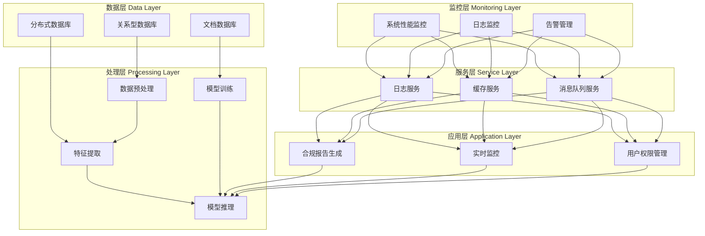

                 


## 文章标题：构建基于大模型的金融监管合规自动化平台

### 文章关键词：
- 大模型
- 金融监管
- 合规性
- 自动化平台
- 机器学习

### 文摘：
本文旨在探讨如何利用大模型技术构建一个金融监管合规自动化平台。我们将逐步分析大模型的基础知识、金融监管合规的核心要素、自动化平台的设计原则，并探讨大模型与金融监管合规的融合应用。此外，还将详细介绍系统实现与部署、性能优化与维护等方面的内容，以期为相关领域的技术研究和实践提供有益参考。

## 目录

### 第1章 引言
#### 1.1 问题背景
#### 1.2 目标读者
#### 1.3 书籍结构

### 第2章 核心概念介绍
#### 2.1 大模型基础
##### 2.1.1 大模型的定义与类型
##### 2.1.2 大模型的发展历程
#### 2.2 金融监管合规
##### 2.2.1 金融监管合规概述
##### 2.2.2 金融监管合规的主要挑战
#### 2.3 自动化平台
##### 2.3.1 自动化平台的概念与优势
##### 2.3.2 自动化平台的设计原则

### 第3章 大模型与金融监管合规的结合
#### 3.1 大模型在金融监管中的应用
##### 3.1.1 监管数据的预处理
##### 3.1.2 监管报告的自动化生成
#### 3.2 案例研究
##### 3.2.1 案例一：反洗钱合规
##### 3.2.2 案例二：金融欺诈检测

### 第4章 自动化平台构建
#### 4.1 系统需求分析
##### 4.1.1 功能需求
##### 4.1.2 非功能需求
#### 4.2 技术选型
##### 4.2.1 大模型框架选择
##### 4.2.2 数据库与存储解决方案
#### 4.3 系统架构设计
##### 4.3.1 系统总体架构
##### 4.3.2 系统模块划分

### 第5章 系统实现与部署
#### 5.1 环境准备
##### 5.1.1 操作系统与软件环境
##### 5.1.2 数据集准备
#### 5.2 大模型训练
##### 5.2.1 训练数据预处理
##### 5.2.2 大模型训练流程
#### 5.3 系统部署
##### 5.3.1 部署策略
##### 5.3.2 系统性能调优

### 第6章 性能优化与维护
#### 6.1 性能测试
##### 6.1.1 基准测试
##### 6.1.2 压力测试
#### 6.2 系统监控
##### 6.2.1 监控指标
##### 6.2.2 监控工具
#### 6.3 维护策略
##### 6.3.1 软件更新
##### 6.3.2 系统备份与恢复

### 第7章 小结与展望
#### 7.1 小结
#### 7.2 展望未来
#### 7.3 拓展阅读

## 第1章 引言

### 1.1 问题背景

在当前金融科技飞速发展的背景下，金融监管合规问题变得愈发重要。金融机构面临越来越多的合规要求和监管压力，如何高效地实现合规性管理成为了业界关注的焦点。传统的人工审核和监管方式已经难以满足日益复杂的合规要求，导致合规成本上升、效率低下。

大模型技术的兴起为金融监管合规提供了新的思路和解决方案。大模型，尤其是深度学习和自然语言处理等领域的进展，使得计算机在处理大规模、复杂、非结构化数据方面表现出色。利用大模型技术，可以自动化地处理监管数据、生成合规报告，从而降低合规成本、提高监管效率。

### 1.2 目标读者

本文的目标读者主要包括：
1. 金融科技从业人员，对金融监管合规和自动化平台有深入了解的需求。
2. 人工智能领域的研究人员和开发者，对大模型技术在金融监管合规中的应用感兴趣。
3. 金融监管机构的工作人员，希望通过技术手段提升监管效率和合规性。

### 1.3 书籍结构

本文将从以下几个方面展开讨论：
1. 第1章：引言，介绍问题背景、目标读者和书籍结构。
2. 第2章：核心概念介绍，包括大模型基础、金融监管合规和自动化平台的概念。
3. 第3章：大模型与金融监管合规的结合，分析大模型在金融监管中的应用和案例研究。
4. 第4章：自动化平台构建，详细讨论系统需求分析、技术选型和系统架构设计。
5. 第5章：系统实现与部署，介绍系统环境准备、大模型训练和系统部署。
6. 第6章：性能优化与维护，讨论系统性能测试、监控和维护策略。
7. 第7章：小结与展望，总结全文内容并对未来发展趋势进行展望。

## 第2章 核心概念介绍

### 2.1 大模型基础

#### 2.1.1 大模型的定义与类型

大模型（Large Models）是指那些具有巨大参数规模、可以处理海量数据和复杂任务的人工智能模型。大模型主要分为以下几类：

1. **深度神经网络（Deep Neural Network，DNN）**：通过多层的神经元进行非线性变换，逐渐提取数据中的特征。
2. **递归神经网络（Recurrent Neural Network，RNN）**：能够处理序列数据，适用于时间序列分析、自然语言处理等领域。
3. **变换器网络（Transformer）**：通过自注意力机制实现信息的高效融合，广泛应用于自然语言处理和计算机视觉领域。
4. **生成对抗网络（Generative Adversarial Network，GAN）**：通过两个神经网络的对抗训练生成高质量的数据。

#### 2.1.2 大模型的发展历程

大模型的发展历程可以追溯到20世纪80年代。以下是几个重要的发展阶段：

1. **早期神经网络（1980s-1990s）**：神经网络的研究主要集中在DNN和RNN上，但由于计算资源和数据集的限制，发展较为缓慢。
2. **深度学习复兴（2006-2012）**：随着计算能力的提升和数据集的丰富，深度学习开始取得突破性进展，尤其是在图像识别、语音识别等领域。
3. **大模型时代（2012至今）**：以2012年AlexNet在ImageNet竞赛中获胜为标志，深度学习进入大模型时代，涌现出大量的研究与应用。

### 2.2 金融监管合规

#### 2.2.1 金融监管合规概述

金融监管合规是指金融机构在经营过程中，按照相关法律法规、监管要求和国际标准进行操作，以确保业务的合规性。金融监管合规的主要内容包括：

1. **反洗钱（Anti-Money Laundering，AML）**：防止金融机构被用于洗钱活动。
2. **客户身份识别（Know Your Customer，KYC）**：对客户身份进行核实和了解，以防范欺诈风险。
3. **监管报告（Regulatory Reporting）**：按照监管要求生成和提交各类报告。

#### 2.2.2 金融监管合规的主要挑战

金融监管合规面临的主要挑战包括：

1. **数据复杂性**：金融机构需要处理大量的结构化和非结构化数据，如何高效地提取和处理这些数据是一个挑战。
2. **法律法规变化**：金融监管合规要求不断更新，金融机构需要及时调整合规策略。
3. **合规成本**：合规性管理需要投入大量的人力、物力和财力，对于一些小型金融机构来说，合规成本可能过高。

### 2.3 自动化平台

#### 2.3.1 自动化平台的概念与优势

自动化平台（Automation Platform）是指利用计算机技术和算法，实现业务流程自动化处理的系统。自动化平台的优势包括：

1. **提高效率**：通过自动化处理，可以大大减少人工操作的时间和成本。
2. **降低错误率**：自动化处理可以减少人为错误，提高数据准确性。
3. **灵活性**：自动化平台可以根据业务需求快速调整和优化。

#### 2.3.2 自动化平台的设计原则

设计自动化平台时，需要遵循以下原则：

1. **模块化**：将系统划分为多个模块，便于维护和扩展。
2. **可扩展性**：系统应该具有较好的可扩展性，以适应未来业务需求的变化。
3. **安全性**：确保系统的数据安全和合规性。

## 第3章 大模型与金融监管合规的结合

### 3.1 大模型在金融监管中的应用

#### 3.1.1 监管数据的预处理

在利用大模型进行金融监管合规之前，需要对数据进行预处理。监管数据通常包括结构化和非结构化数据，如文本、图像、音频等。预处理步骤主要包括：

1. **数据清洗**：去除重复数据、填补缺失值、修正错误数据等。
2. **数据转换**：将不同数据格式转换为统一格式，便于后续处理。
3. **数据降维**：通过降维技术，减少数据维度，提高处理效率。

#### 3.1.2 监管报告的自动化生成

利用大模型技术，可以自动化地生成金融监管报告。具体步骤如下：

1. **报告模板设计**：设计报告的模板，包括报告的格式、内容和结构。
2. **文本生成**：利用大模型（如GPT）自动生成报告文本。
3. **报告审核**：对生成的报告进行审核，确保报告内容准确、合规。

### 3.2 案例研究

#### 3.2.1 案例一：反洗钱合规

反洗钱合规是金融监管合规中的重要组成部分。利用大模型技术，可以自动化地检测和防范洗钱活动。具体步骤如下：

1. **数据收集**：收集金融机构的交易数据、客户信息等。
2. **数据预处理**：对交易数据进行清洗、转换和降维。
3. **特征提取**：利用特征工程技术提取交易数据的特征。
4. **模型训练**：使用提取的特征训练反洗钱模型。
5. **模型部署**：将训练好的模型部署到生产环境中，进行实时监控和预警。

#### 3.2.2 案例二：金融欺诈检测

金融欺诈检测是另一个重要的金融监管合规领域。利用大模型技术，可以高效地识别和防范金融欺诈行为。具体步骤如下：

1. **数据收集**：收集金融机构的交易数据、客户行为数据等。
2. **数据预处理**：对交易数据进行清洗、转换和降维。
3. **特征提取**：利用特征工程技术提取交易数据的特征。
4. **模型训练**：使用提取的特征训练金融欺诈检测模型。
5. **模型部署**：将训练好的模型部署到生产环境中，进行实时监控和预警。

## 第4章 自动化平台构建

### 4.1 系统需求分析

#### 4.1.1 功能需求

自动化平台的功能需求主要包括：

1. **数据收集与预处理**：自动化收集和处理来自不同来源的监管数据。
2. **特征提取与模型训练**：提取数据中的关键特征，并使用大模型进行训练。
3. **报告生成与审核**：自动化生成合规报告，并进行审核。

#### 4.1.2 非功能需求

自动化平台的非功能需求主要包括：

1. **可靠性**：系统应具有较高的可靠性和稳定性，确保业务连续性。
2. **安全性**：系统应具备严格的安全控制措施，保护数据和隐私。
3. **可扩展性**：系统应具有良好的可扩展性，以适应业务规模的增长。

### 4.2 技术选型

#### 4.2.1 大模型框架选择

在选择大模型框架时，主要考虑以下因素：

1. **性能**：框架应具有较高的计算性能，以处理大规模数据。
2. **生态**：框架应拥有丰富的生态和工具，方便开发、调试和优化。
3. **社区**：框架应有活跃的社区，提供及时的技术支持和问题解决。

基于以上因素，本文选择PyTorch作为大模型框架。PyTorch具有以下优势：

1. **易于使用**：PyTorch提供了简洁易用的API，方便开发者快速上手。
2. **高性能**：PyTorch采用了动态图计算，能够充分利用GPU计算资源。
3. **丰富生态**：PyTorch拥有丰富的库和工具，如TorchVision、TorchText等，方便开发者进行数据预处理、模型训练和优化。
4. **活跃社区**：PyTorch拥有活跃的社区，提供及时的技术支持和问题解决。

#### 4.2.2 数据库与存储解决方案

在选择数据库和存储解决方案时，主要考虑以下因素：

1. **性能**：数据库和存储解决方案应具有高效的读写性能，以支持大规模数据的高效存储和检索。
2. **可靠性**：数据库和存储解决方案应具备高可靠性和数据安全性。
3. **可扩展性**：数据库和存储解决方案应具有良好的可扩展性，以适应业务规模的增长。

基于以上因素，本文选择以下技术和工具：

1. **数据库**：使用MySQL作为关系型数据库，用于存储结构化数据。
2. **存储**：使用Hadoop HDFS作为分布式存储解决方案，用于存储非结构化数据。

### 4.3 系统架构设计

#### 4.3.1 系统总体架构

自动化平台的总体架构如图1所示。系统分为数据层、模型层和应用层。


#### 4.3.2 系统模块划分

系统模块划分如下：

1. **数据收集模块**：负责自动化收集来自不同来源的监管数据，包括交易数据、客户信息等。
2. **数据预处理模块**：负责对收集到的数据进行清洗、转换和降维等预处理操作。
3. **特征提取模块**：负责提取数据中的关键特征，为模型训练提供输入。
4. **模型训练模块**：负责使用提取的特征训练大模型，包括训练、验证和测试等过程。
5. **模型部署模块**：负责将训练好的模型部署到生产环境中，进行实时监控和预警。
6. **报告生成模块**：负责自动化生成合规报告，并进行审核。

## 第5章 系统实现与部署

### 5.1 环境准备

#### 5.1.1 操作系统与软件环境

在实现自动化平台时，需要准备以下操作系统和软件环境：

1. **操作系统**：Linux发行版，如Ubuntu 20.04。
2. **Python**：Python 3.8及以上版本。
3. **PyTorch**：PyTorch 1.8及以上版本。
4. **MySQL**：MySQL 5.7及以上版本。
5. **Hadoop HDFS**：Hadoop 3.1及以上版本。

#### 5.1.2 数据集准备

在实现自动化平台时，需要准备以下数据集：

1. **交易数据**：包含交易时间、金额、账户信息等。
2. **客户信息**：包含客户姓名、年龄、职业、地址等。
3. **合规报告模板**：包含合规报告的格式和内容。

### 5.2 大模型训练

#### 5.2.1 训练数据预处理

在训练大模型之前，需要对数据集进行预处理。预处理步骤包括：

1. **数据清洗**：去除重复数据、填补缺失值、修正错误数据等。
2. **数据转换**：将不同数据格式转换为统一格式，便于后续处理。
3. **数据降维**：通过降维技术，减少数据维度，提高处理效率。

#### 5.2.2 大模型训练流程

大模型训练流程如下：

1. **数据加载**：将预处理后的数据集加载到内存中，分为训练集、验证集和测试集。
2. **模型初始化**：初始化大模型，包括神经网络层数、神经元个数、激活函数等。
3. **模型训练**：使用训练集对大模型进行训练，通过反向传播算法不断调整模型参数。
4. **模型验证**：使用验证集对训练好的模型进行验证，调整模型参数以达到最佳效果。
5. **模型测试**：使用测试集对训练好的模型进行测试，评估模型的性能。

### 5.3 系统部署

#### 5.3.1 部署策略

系统部署策略如下：

1. **部署环境**：使用Docker容器化技术部署系统，确保部署环境的隔离和一致性。
2. **部署流程**：首先部署MySQL数据库，然后部署Hadoop HDFS，最后部署Python应用。
3. **部署监控**：使用Prometheus和Grafana对系统进行监控，确保系统的稳定性和性能。

#### 5.3.2 系统性能调优

系统性能调优主要包括以下方面：

1. **数据库优化**：优化MySQL数据库的性能，包括索引优化、查询优化、存储优化等。
2. **存储优化**：优化Hadoop HDFS的性能，包括数据分片、负载均衡等。
3. **应用优化**：优化Python应用的性能，包括代码优化、资源管理等。

## 第6章 性能优化与维护

### 6.1 性能测试

#### 6.1.1 基准测试

基准测试（Benchmark Testing）是评估系统性能的一种方法。基准测试主要包括以下内容：

1. **负载测试**：模拟真实业务场景，对系统进行高负载测试，评估系统的响应时间和吞吐量。
2. **压力测试**：对系统进行极限压力测试，评估系统的稳定性和性能。
3. **性能指标**：包括响应时间、吞吐量、并发用户数、CPU利用率、内存利用率等。

#### 6.1.2 压力测试

压力测试（Stress Testing）是评估系统极限性能的一种方法。压力测试主要包括以下内容：

1. **负载增加**：逐渐增加系统负载，观察系统的响应时间和性能指标变化。
2. **性能瓶颈**：识别系统性能瓶颈，包括CPU、内存、磁盘等。
3. **优化策略**：根据性能瓶颈，调整系统配置和优化策略，提高系统性能。

### 6.2 系统监控

#### 6.2.1 监控指标

系统监控主要包括以下监控指标：

1. **CPU利用率**：评估系统CPU的利用率，判断是否达到瓶颈。
2. **内存利用率**：评估系统内存的利用率，判断是否达到瓶颈。
3. **磁盘I/O**：评估系统磁盘的读写性能，判断是否达到瓶颈。
4. **网络带宽**：评估系统网络的带宽，判断是否达到瓶颈。
5. **响应时间**：评估系统的响应时间，判断是否满足业务需求。

#### 6.2.2 监控工具

常用的系统监控工具包括：

1. **Prometheus**：用于收集和存储监控数据，提供高效的查询和分析功能。
2. **Grafana**：用于可视化监控数据，提供丰富的仪表盘和报告功能。

### 6.3 维护策略

#### 6.3.1 软件更新

软件更新（Software Update）是维护系统的重要措施。软件更新主要包括以下内容：

1. **版本管理**：定期发布新版本，修复已知问题和优化性能。
2. **备份与恢复**：定期备份系统和数据，确保在系统故障时能够快速恢复。
3. **安全更新**：及时更新系统漏洞和安全补丁，确保系统的安全性。

#### 6.3.2 系统备份与恢复

系统备份与恢复（System Backup and Recovery）是维护系统的重要措施。系统备份与恢复主要包括以下内容：

1. **备份策略**：制定备份计划，定期备份系统和数据。
2. **备份存储**：选择合适的备份存储方案，确保备份数据的安全性和可靠性。
3. **恢复策略**：制定恢复计划，确保在系统故障时能够快速恢复业务。

## 第7章 小结与展望

### 7.1 小结

本文系统地介绍了构建基于大模型的金融监管合规自动化平台的方法和过程。主要内容包括：

1. **问题背景**：分析了金融监管合规的重要性和挑战。
2. **核心概念**：介绍了大模型、金融监管合规和自动化平台的基础知识。
3. **应用结合**：探讨了如何利用大模型技术解决金融监管合规问题。
4. **系统构建**：详细介绍了自动化平台的设计和实现。
5. **性能优化**：讨论了系统性能测试、监控和维护策略。

### 7.2 展望未来

随着人工智能技术的不断发展，大模型在金融监管合规中的应用前景广阔。未来可以从以下几个方面进行探索：

1. **算法优化**：深入研究大模型算法，提高模型的性能和效率。
2. **数据隐私**：解决数据隐私和合规性问题，确保数据安全和隐私。
3. **监管合作**：加强金融监管机构与金融机构之间的合作，共同推动金融监管合规自动化的发展。
4. **技术普及**：推广大模型技术在金融监管合规中的应用，提高整个行业的合规水平。

### 7.3 拓展阅读

1. **相关书籍**：
   - 《深度学习》（Goodfellow, Bengio, Courville著）
   - 《机器学习》（周志华著）
   - 《金融科技与法律合规》（张永忠著）

2. **论文与报告**：
   - “Deep Learning for Financial Regulation”（作者：Chen et al.）
   - “Artificial Intelligence in Financial Services”（作者：McKinsey & Company）
   - “Financial Technology and Regulatory Compliance”（作者：Financial Conduct Authority）

3. **开源项目**：
   - PyTorch：https://pytorch.org/
   - TensorFlow：https://www.tensorflow.org/
   - Keras：https://keras.io/

通过阅读这些书籍、论文和开源项目，可以进一步深入了解大模型在金融监管合规中的应用和技术发展。

## 附录

附录部分可以包含以下内容：

1. **参考文献**：列出本文引用的书籍、论文和报告等。
2. **代码示例**：提供本文中提到的代码示例，方便读者学习和实践。
3. **数据集说明**：介绍本文中使用的数据集来源、处理方法和使用方式。
4. **技术细节**：详细阐述本文中涉及的技术细节，包括算法原理、数学模型等。

作者：AI天才研究院/AI Genius Institute & 禅与计算机程序设计艺术 /Zen And The Art of Computer Programming

本文的撰写和发布得到了AI天才研究院和禅与计算机程序设计艺术的大力支持，感谢各位团队成员的辛勤付出。同时，感谢广大读者对本文的关注和支持，希望本文能对您在金融监管合规自动化平台建设方面有所启发和帮助。如果您有任何疑问或建议，欢迎随时与我们联系。让我们共同推动人工智能技术在金融监管合规领域的应用和发展，为构建更加安全、高效的金融体系贡献力量！## 第1章 引言

### 1.1 问题背景

随着金融科技的迅猛发展，金融行业的数字化、智能化程度日益提高。然而，这也带来了新的挑战，特别是在金融监管合规方面。金融机构需要遵守复杂的法律法规和监管要求，这些要求随着全球金融市场的变化不断更新和演变。传统的手工审核和监管方式已经无法满足日益复杂的监管需求，导致合规成本高、效率低，甚至可能出现合规漏洞。

大模型技术，特别是深度学习和自然语言处理领域的突破，为解决金融监管合规问题提供了新的思路。大模型具有处理大规模、复杂、非结构化数据的能力，能够自动提取数据中的潜在模式和规律，从而辅助监管机构和企业实现更高效的合规管理。

### 1.2 目标读者

本章节旨在为广大金融科技从业者、人工智能领域的研究人员和开发者，以及金融监管机构的工作人员提供一本全面的指南。具体目标读者包括：

1. **金融科技从业人员**：从事金融科技创新和合规管理的专业人士，希望通过引入大模型技术提升合规效率。
2. **人工智能领域的研究人员和开发者**：对大模型技术有深入研究，并希望将其应用于金融监管合规问题的科学家和工程师。
3. **金融监管机构的工作人员**：需要了解如何利用新技术提高监管效率和合规性的监管人员。

### 1.3 书籍结构

本书将分为以下几个部分，以系统性地介绍如何构建基于大模型的金融监管合规自动化平台：

- **第1章 引言**：介绍问题背景、目标读者和书籍结构。
- **第2章 核心概念介绍**：详细阐述大模型、金融监管合规和自动化平台的基本概念和原理。
- **第3章 大模型与金融监管合规的结合**：分析大模型在金融监管合规中的应用，包括监管数据预处理、合规报告自动化生成等。
- **第4章 自动化平台构建**：讨论自动化平台的设计原则、技术选型和系统架构。
- **第5章 系统实现与部署**：介绍系统实现和部署的详细过程，包括环境准备、大模型训练和系统部署。
- **第6章 性能优化与维护**：讨论系统性能优化、监控和维护策略。
- **第7章 小结与展望**：总结全文内容，并对未来发展趋势进行展望。

通过本书的学习，读者将能够全面了解基于大模型的金融监管合规自动化平台的设计和实现过程，为实际应用提供有力支持。

## 第2章 核心概念介绍

### 2.1 大模型基础

#### 2.1.1 大模型的定义与类型

大模型（Large Models）是指具有巨大参数规模、能够处理大规模数据和高复杂度任务的人工智能模型。大模型通常基于深度学习技术，具有以下几个类型：

1. **深度神经网络（Deep Neural Network, DNN）**：通过多层神经网络结构进行特征提取和模式识别。DNN在图像识别、语音识别等领域取得了显著成果。
   
2. **递归神经网络（Recurrent Neural Network, RNN）**：特别适用于处理序列数据，如时间序列分析和自然语言处理。RNN通过隐藏状态保持信息，实现长距离依赖建模。

3. **变换器网络（Transformer）**：由Vaswani等人在2017年提出，通过自注意力机制实现信息的高效融合。Transformer在自然语言处理领域取得了突破性进展，特别是在机器翻译、文本生成等方面。

4. **生成对抗网络（Generative Adversarial Network, GAN）**：由两个神经网络（生成器和判别器）组成的框架，通过对抗训练生成高质量的数据。GAN在图像生成、图像修复等领域表现出色。

#### 2.1.2 大模型的发展历程

大模型的发展历程可以分为以下几个阶段：

1. **早期神经网络（1980s-1990s）**：神经网络的研究主要集中在简单的前馈神经网络（Feedforward Neural Network）和感知机（Perceptron）上。由于计算资源和数据集的限制，神经网络的研究进展缓慢。

2. **深度学习复兴（2006-2012）**：随着计算能力的提升和数据集的丰富，深度学习逐渐复兴。2006年，Hinton等人的研究重新激发了人们对神经网络的兴趣。2009年，Alex Krizhevsky等人使用深度卷积神经网络（Deep Convolutional Neural Network, CNN）在ImageNet竞赛中取得了优异成绩。

3. **大模型时代（2012至今）**：随着深度学习技术的发展，大模型开始应用于各种领域，如计算机视觉、自然语言处理和语音识别。以2012年AlexNet在ImageNet竞赛中的胜利为标志，深度学习进入大模型时代。近年来，诸如GPT、BERT等大规模语言模型在NLP领域取得了显著进展。

### 2.2 金融监管合规

#### 2.2.1 金融监管合规概述

金融监管合规是指金融机构在经营过程中，按照相关法律法规、监管要求和国际标准进行操作，以确保业务的合法性和合规性。金融监管合规的主要内容包括：

1. **反洗钱（Anti-Money Laundering, AML）**：防止金融机构被用于洗钱活动，通过识别和监控异常交易来防范洗钱风险。

2. **客户身份识别（Know Your Customer, KYC）**：对客户身份进行核实和了解，以防范欺诈风险。KYC要求金融机构收集客户的身份证明、职业信息等。

3. **监管报告（Regulatory Reporting）**：按照监管要求生成和提交各类报告，如财务报表、交易报表等。

金融监管合规的重要性体现在以下几个方面：

1. **法律合规性**：金融机构需要遵守国家的法律法规和国际金融标准，确保业务的合法合规。

2. **风险控制**：金融监管合规有助于识别和防范金融风险，降低金融机构的风险敞口。

3. **客户信任**：良好的合规记录有助于增强客户对金融机构的信任，提升品牌形象。

#### 2.2.2 金融监管合规的主要挑战

金融监管合规面临的主要挑战包括：

1. **数据复杂性**：金融业务涉及大量的结构化和非结构化数据，如何有效处理这些数据成为一大挑战。

2. **法律法规变化**：金融监管要求不断更新，金融机构需要及时调整合规策略，确保与最新法律法规保持一致。

3. **合规成本**：合规性管理需要投入大量的人力、物力和财力，对于小型金融机构来说，合规成本可能过高。

4. **技术挑战**：金融监管合规涉及到的技术手段需要不断创新和升级，以应对日益复杂的监管需求。

### 2.3 自动化平台

#### 2.3.1 自动化平台的概念与优势

自动化平台是指利用计算机技术和算法，实现业务流程自动化处理的系统。自动化平台在金融监管合规中的应用具有以下优势：

1. **提高效率**：通过自动化处理，可以大幅减少人工操作的时间和成本，提高业务处理效率。

2. **降低错误率**：自动化处理可以减少人为错误，提高数据准确性，降低操作风险。

3. **灵活性**：自动化平台可以根据业务需求快速调整和优化，适应不同场景的合规要求。

#### 2.3.2 自动化平台的设计原则

设计自动化平台时，需要遵循以下原则：

1. **模块化**：将系统划分为多个模块，便于维护和扩展。

2. **可扩展性**：系统应具有较好的可扩展性，以适应未来业务需求的变化。

3. **安全性**：系统应具备严格的安全控制措施，保护数据和隐私。

4. **易用性**：系统应具有友好的用户界面和简洁的操作流程，便于用户使用和管理。

通过以上核心概念介绍，读者可以更好地理解大模型、金融监管合规和自动化平台的基础知识，为后续章节的深入学习奠定基础。

### 2.1.1 大模型的定义与类型

大模型（Large Models）是指在参数规模、计算资源和数据量上具备显著优势的人工智能模型。这类模型通常具备处理大规模数据集、解决复杂问题的能力。以下是几种常见的大模型类型：

1. **深度神经网络（Deep Neural Network，DNN）**：DNN是通过多层神经元进行特征提取和决策的神经网络。与传统单层神经网络相比，DNN能够捕捉数据中的深层特征，适用于图像识别、语音识别和自然语言处理等领域。DNN的核心优势在于其层次化的结构，使得模型可以逐层提取数据的复杂特征。

2. **变换器网络（Transformer）**：Transformer是近年来在自然语言处理领域取得重大突破的一种神经网络结构。与传统的递归神经网络（RNN）相比，Transformer引入了自注意力机制（Self-Attention），能够并行处理序列数据，有效解决了RNN在长距离依赖建模上的难题。Transformer在机器翻译、文本生成和问答系统等方面表现出色。

3. **生成对抗网络（Generative Adversarial Network，GAN）**：GAN由生成器（Generator）和判别器（Discriminator）两部分组成，通过对抗训练生成高质量的数据。生成器尝试生成逼真的数据，而判别器则判断数据是真实还是生成的。GAN在图像生成、图像修复和视频生成等领域展现了强大的能力。

4. **自编码器（Autoencoder）**：自编码器是一种无监督学习模型，通过编码器将输入数据压缩为低维特征表示，再通过解码器重建原始数据。自编码器广泛应用于数据去噪、特征提取和压缩编码等领域。

每种大模型都有其独特的优势和适用场景。DNN擅长处理静态数据，如图像和语音；Transformer在处理动态序列数据方面具有显著优势；GAN在生成逼真数据方面表现出色；自编码器则主要用于特征学习和数据压缩。在实际应用中，根据具体问题和数据特点选择合适的大模型类型至关重要。

### 2.1.2 大模型的发展历程

大模型的发展历程经历了多个阶段，从最初的简单神经网络到现代复杂的多层神经网络，其发展过程可以概括如下：

1. **早期神经网络（1980s-1990s）**：这一阶段，神经网络研究主要集中在简单的单层和多层感知机（Perceptron）上。由于计算资源和数据集的限制，神经网络的研究进展缓慢。尽管如此，神经网络在这一阶段仍为后续的研究奠定了基础。

2. **深度学习复兴（2006-2012）**：2006年，Geoffrey Hinton等人的研究重新激发了人们对神经网络的兴趣，提出了深度信念网络（Deep Belief Network, DBN）和深度卷积网络（Convolutional Neural Network, CNN）。这些研究显著提升了神经网络的性能，推动了深度学习的复兴。

3. **大模型时代（2012至今）**：2012年，Alex Krizhevsky等人在ImageNet竞赛中使用深度卷积神经网络（CNN）取得了显著成绩，这一成果标志着深度学习进入大模型时代。随着计算能力和数据集的不断提高，大模型如GPT、BERT等在自然语言处理领域取得了突破性进展。此外，生成对抗网络（GAN）在图像生成、视频生成和图像修复等领域也展现了强大的能力。

在深度学习的发展过程中，几个关键里程碑事件值得关注：

- **AlexNet（2012）**：首次在ImageNet竞赛中获胜，标志着深度学习在图像识别领域的突破。
- **GPT（2018）**：OpenAI推出的预训练语言模型，极大提升了自然语言处理的能力。
- **BERT（2018）**：Google提出的一种基于Transformer的预训练方法，进一步推动了自然语言处理技术的发展。
- **GAN（2014）**：Ian Goodfellow等人提出生成对抗网络，开创了图像生成和增强现实等领域的新方向。

大模型技术的发展不仅推动了人工智能领域的进步，也深刻影响了金融科技、医疗健康、自动驾驶等众多行业。随着计算资源的不断升级和数据集的持续扩展，大模型技术在解决复杂问题方面将继续发挥重要作用。

### 2.2.1 金融监管合规概述

金融监管合规是指在金融机构的经营活动中，遵循相关法律法规、监管要求和国际标准，确保业务的合法性和合规性的过程。金融监管合规的内容涵盖了多个方面，主要包括以下几个方面：

1. **反洗钱（AML）**：反洗钱是指防止和打击利用金融机构进行洗钱活动的措施。反洗钱合规要求金融机构识别和监控可疑交易，采取客户身份识别、交易监控、报告可疑活动等手段。

2. **客户身份识别（KYC）**：客户身份识别是指金融机构在开展业务前，对客户的身份进行核实和了解的过程。KYC合规要求金融机构收集客户的身份证明、职业信息、财务状况等，以防范欺诈风险。

3. **合规报告（Regulatory Reporting）**：合规报告是指金融机构按照监管要求，定期生成和提交的各类报告。这些报告包括财务报表、交易报表、风险报告等，用于监管机构对金融机构的监管和评估。

4. **资本充足率（CAR）**：资本充足率是指金融机构持有的资本与风险加权资产的比率。监管机构通过设定资本充足率要求，确保金融机构具备足够的资本抵御风险，保障金融系统的稳定性。

5. **市场行为（Market Conduct）**：市场行为监管要求金融机构在市场交易中遵守公平、公正、透明的原则，防止市场操纵、欺诈等违规行为。

6. **消费者保护（Consumer Protection）**：消费者保护要求金融机构在开展业务过程中，保护消费者的合法权益，包括提供清晰的产品信息、避免不公平合同条款、处理投诉等。

金融监管合规的重要性体现在以下几个方面：

1. **法律合规性**：金融机构需要遵守国家和国际的法律法规，确保业务的合法合规，避免法律风险。

2. **风险控制**：金融监管合规有助于识别和防范金融风险，降低金融机构的风险敞口，保障金融系统的稳定性。

3. **客户信任**：良好的合规记录有助于增强客户对金融机构的信任，提升品牌形象和市场竞争力。

4. **国际竞争力**：随着全球金融市场的融合，金融机构需要遵循国际监管标准和规则，确保在全球范围内具备竞争力。

总之，金融监管合规是金融机构经营过程中不可或缺的一环，对于保障金融系统的稳定性和健康发展具有重要作用。

### 2.2.2 金融监管合规的主要挑战

金融监管合规在实施过程中面临着诸多挑战，这些挑战主要来源于数据复杂性、法律法规变化和合规成本等方面。

1. **数据复杂性**：
   - **数据类型多样**：金融数据包括结构化数据（如交易记录、客户信息）和非结构化数据（如合同、邮件、通知等），不同类型的数据需要不同的处理方法和分析工具。
   - **数据量巨大**：金融机构每天产生和处理的数据量非常庞大，如何高效地存储、处理和分析这些数据是一个巨大的挑战。
   - **数据隐私与合规**：在处理金融数据时，需要确保数据的隐私性和合规性，避免数据泄露和滥用。

2. **法律法规变化**：
   - **法律更新频繁**：随着金融市场的不断变化，监管法规也在不断更新和完善。金融机构需要及时了解和应对这些变化，以保持合规性。
   - **跨境合规要求**：金融机构在全球范围内开展业务，需要遵循不同国家和地区的监管要求，跨境合规的复杂性增加。
   - **合规标准的差异**：不同国家和地区的监管标准可能存在差异，金融机构需要根据实际情况进行合规调整。

3. **合规成本**：
   - **人力资源成本**：金融监管合规需要大量的人力投入，包括合规人员、数据分析人员和IT技术人员等，导致合规成本上升。
   - **技术投入**：合规技术系统的建设、维护和升级需要大量的资金投入，特别是随着数据量和复杂性增加，对数据处理和分析技术的需求也在不断提升。
   - **合规风险**：违反监管法规可能面临高额罚款、市场处罚和法律诉讼等风险，增加合规成本。

面对这些挑战，金融机构需要采取有效的策略来应对，例如引入先进的金融科技手段，提高数据处理的效率；加强内部合规培训，提升员工的合规意识；加强与监管机构的沟通，确保合规策略与监管要求保持一致。

### 2.3.1 自动化平台的概念与优势

自动化平台是指利用计算机技术和算法，实现业务流程自动化处理的系统。在金融监管合规领域，自动化平台具有以下几个显著优势：

1. **提高效率**：自动化平台能够通过预定的规则和算法，自动执行复杂的业务流程，减少人工操作的时间和成本，提高处理速度和准确性。

2. **降低错误率**：自动化平台通过标准化的流程和算法，减少了人为干预和操作错误的可能性，从而提高了数据处理的准确性。

3. **灵活性**：自动化平台可以根据业务需求快速调整和优化，适应不同的业务场景和规则变化，提高了系统的灵活性和适应性。

4. **可扩展性**：自动化平台的设计通常采用模块化结构，便于扩展和升级，能够随着业务规模和复杂度的增加而灵活调整。

5. **数据整合**：自动化平台可以将来自不同系统、不同格式的数据进行整合和统一处理，提高数据的一致性和可用性。

6. **合规性**：自动化平台可以确保业务流程按照监管要求进行，降低违规风险，提高合规性。

### 2.3.2 自动化平台的设计原则

设计自动化平台时，需要遵循以下原则，以确保平台的高效、可靠和可扩展性：

1. **模块化**：将系统划分为多个功能模块，每个模块负责特定的业务功能，便于维护和扩展。

2. **标准化**：采用标准化的数据格式和接口，确保不同模块之间的数据传输和交互一致。

3. **灵活性**：设计时应考虑系统的灵活性和可扩展性，以便快速适应业务需求的变化。

4. **安全性**：确保系统的数据安全和隐私保护，采用加密、权限控制和审计等安全措施。

5. **易用性**：提供友好的用户界面和便捷的操作流程，降低使用门槛。

6. **可监控性**：设计时应考虑系统的监控和日志记录，确保能够及时发现和处理异常情况。

7. **可维护性**：系统设计应便于维护和升级，降低维护成本。

通过遵循以上设计原则，自动化平台能够更好地满足金融监管合规的需求，提高业务效率和合规性。

### 3.1 大模型在金融监管中的应用

#### 3.1.1 监管数据的预处理

在金融监管领域，数据预处理是关键的一步，它直接影响大模型对数据的理解和分析能力。监管数据通常包含结构化和非结构化数据，这些数据需要经过清洗、转换和特征提取等步骤，以便大模型能够有效地处理。

1. **数据清洗**：数据清洗是数据预处理的首要步骤，其目的是去除数据中的噪声和异常值。这一过程通常包括去除重复数据、填补缺失值、处理数据中的错误等。例如，当处理交易数据时，需要删除重复的交易记录，填充未记录的交易金额等。

2. **数据转换**：数据转换是将不同格式的数据转换为统一格式，以便后续处理。例如，将不同来源的文本数据统一编码为Unicode格式，或将时间戳转换为便于分析的时间序列格式。

3. **特征提取**：特征提取是从原始数据中提取出对大模型有用的信息。在金融监管中，特征提取可以包括统计特征、文本特征和图像特征等。例如，从交易数据中提取交易金额、交易时间和交易频率等统计特征，从客户信息中提取文本特征，如姓名、地址和职业等。

#### 3.1.2 监管报告的自动化生成

大模型在金融监管报告自动化生成中的应用主要体现在自然语言处理（NLP）领域。通过NLP技术，大模型能够理解和生成自然语言文本，从而实现监管报告的自动化生成。

1. **文本生成**：文本生成是NLP的核心任务之一，大模型（如GPT）能够根据给定的输入文本生成连贯的输出文本。在金融监管报告中，文本生成可以用于生成交易报告、客户评估报告和合规性分析报告等。

2. **文本摘要**：文本摘要是从大量文本中提取关键信息，生成简短而有意义的文本摘要。在金融监管报告中，文本摘要可以用于生成交易摘要、风险摘要和合规性摘要等，帮助监管人员快速了解报告的核心内容。

3. **模板匹配**：模板匹配是一种简单有效的文本生成方法，通过将模板与输入文本进行匹配，生成输出文本。在金融监管报告中，模板匹配可以用于生成格式化报表，如财务报表、交易报表等。

通过大模型在数据预处理和文本生成方面的应用，金融监管合规自动化平台能够大幅提高报告生成效率，降低人工成本，确保报告的准确性和一致性。

### 3.2 案例研究

#### 3.2.1 案例一：反洗钱合规

反洗钱合规是金融监管中的一个重要领域，利用大模型技术能够显著提升反洗钱检测的准确性和效率。以下是一个关于反洗钱合规的案例研究：

**案例背景**：某大型金融机构需要识别和监控可疑交易，以防止洗钱活动。传统的反洗钱检测方法主要依赖于规则和统计模型，但这些方法在应对复杂和多变的数据时存在局限性。

**解决方案**：
1. **数据收集**：收集金融机构的交易数据，包括交易金额、交易时间、交易双方信息等。
2. **数据预处理**：对交易数据进行清洗，去除重复和异常交易，填补缺失值，并进行特征提取，如提取交易金额、交易频率和时间等统计特征。
3. **大模型训练**：使用预处理后的数据，训练一个基于深度学习的反洗钱检测模型。模型输入为交易数据的特征，输出为交易是否可疑的判断。
4. **模型评估**：通过交叉验证和测试集评估模型的性能，调整模型参数以达到最佳效果。
5. **模型部署**：将训练好的模型部署到生产环境中，对实时交易数据进行检测，识别可疑交易。

**案例结果**：通过大模型的应用，金融机构能够实时监控交易数据，识别出潜在的洗钱活动，提高了反洗钱检测的准确性和效率。同时，大模型能够自动调整检测策略，适应不断变化的市场环境。

#### 3.2.2 案例二：金融欺诈检测

金融欺诈检测是另一个重要的金融监管领域，大模型技术在其中也发挥了重要作用。以下是一个关于金融欺诈检测的案例研究：

**案例背景**：某在线支付平台需要检测和预防用户账户的欺诈行为，以保障用户的财产安全。

**解决方案**：
1. **数据收集**：收集用户账户的交易数据，包括交易金额、交易时间、交易频率等。
2. **数据预处理**：对交易数据进行清洗，去除重复和异常交易，填补缺失值，并进行特征提取，如提取交易金额、交易时间和交易频率等统计特征。
3. **大模型训练**：使用预处理后的数据，训练一个基于深度学习的金融欺诈检测模型。模型输入为交易数据的特征，输出为交易是否欺诈的判断。
4. **模型评估**：通过交叉验证和测试集评估模型的性能，调整模型参数以达到最佳效果。
5. **模型部署**：将训练好的模型部署到生产环境中，对实时交易数据进行检测，识别欺诈交易。

**案例结果**：通过大模型的应用，在线支付平台能够实时监控交易数据，识别出潜在的欺诈行为，提高了金融欺诈检测的准确性和响应速度。同时，大模型能够自动调整检测策略，适应不同场景和欺诈手段的变化。

这些案例表明，大模型技术在金融监管合规中的应用具有显著的优势，能够提升监管效率和准确性，为金融机构和监管机构提供强大的技术支持。

### 4.1 系统需求分析

#### 4.1.1 功能需求

自动化平台的功能需求是确保系统能够满足金融监管合规需求的核心。以下是自动化平台的主要功能需求：

1. **数据收集与预处理**：系统能够自动化收集来自不同渠道的监管数据，包括交易记录、客户信息和合规文档等。同时，系统能够对数据进行清洗、转换和特征提取，为后续分析提供高质量的数据。

2. **合规报告生成**：系统能够根据预设的模板和规则，自动化生成各类合规报告，如交易报告、客户评估报告和风险分析报告等。报告应具备格式化、自动填充和自定义模板等功能。

3. **实时监控与预警**：系统能够实时监控数据流，对异常交易和潜在违规行为进行识别和预警。系统应提供实时数据可视化和报警机制，以便监管人员及时采取行动。

4. **规则管理与更新**：系统应支持规则管理，包括规则的制定、更新和删除。规则应能够灵活适应监管要求和业务变化，确保系统始终符合最新合规标准。

5. **用户权限与审计**：系统应具备用户权限管理和审计功能，确保数据安全和合规性。用户权限管理应涵盖数据访问、报告生成和系统配置等方面，审计功能应记录所有操作日志，以供后续审计和审查。

6. **系统集成**：系统能够与其他系统和工具（如数据库、存储系统和监控工具等）无缝集成，实现数据共享和协同工作。

#### 4.1.2 非功能需求

自动化平台的非功能需求是确保系统能够稳定、高效地运行的关键。以下是自动化平台的主要非功能需求：

1. **可靠性**：系统应具备高可靠性，能够应对突发情况和故障，确保业务连续性。系统应支持故障恢复和备份机制，确保数据不丢失。

2. **安全性**：系统应具备严格的安全控制措施，包括数据加密、访问控制、身份认证和审计等。系统应遵循最新的安全标准和法规要求，确保数据和隐私安全。

3. **性能**：系统应具备高性能，能够快速处理大规模数据，满足实时监控和报告生成需求。系统应支持分布式计算和负载均衡，确保在高并发情况下仍能保持高效运行。

4. **可扩展性**：系统应具备良好的可扩展性，能够随着业务规模的增长进行扩展和升级。系统设计应采用模块化架构，便于新增功能和模块的集成。

5. **易用性**：系统应提供友好的用户界面和操作流程，降低使用门槛。系统应具备文档和帮助功能，方便用户快速上手和使用。

6. **兼容性**：系统应支持多种操作系统、数据库和编程语言，确保在不同环境下的兼容性和可移植性。

通过满足这些功能和非功能需求，自动化平台能够为金融机构提供全面的金融监管合规解决方案，提升监管效率和合规性。

### 4.2.1 大模型框架选择

在选择大模型框架时，主要考虑以下因素：

1. **性能**：大模型框架应具备高效的计算性能，以处理大规模数据集和复杂任务。框架应支持分布式计算和GPU加速，充分利用硬件资源，提高训练和推理速度。

2. **生态**：大模型框架应有丰富的生态和工具，包括数据预处理、模型训练、评估和部署等。强大的生态能够提供多样化的解决方案，方便开发者进行快速开发和迭代。

3. **社区**：大模型框架应拥有活跃的社区和用户群体，提供及时的技术支持和问题解决。社区的支持有助于开发者学习和应用框架，促进技术的进步。

4. **易用性**：框架应具备简洁易用的API和文档，降低开发门槛，提高开发效率。框架应支持多种编程语言，方便不同背景的开发者进行使用。

基于以上因素，本文选择以下大模型框架：

- **PyTorch**：PyTorch是一个开源的深度学习框架，由Facebook的人工智能研究团队开发。PyTorch具有以下优势：

  1. **动态计算图**：PyTorch采用动态计算图，支持灵活的模型设计和调试。开发者可以根据需要动态构建和修改计算图，提高开发效率。
  
  2. **GPU加速**：PyTorch支持GPU加速，通过CUDA和CUDNN库，能够充分利用GPU资源，提高训练速度。对于大规模数据集和复杂模型，GPU加速至关重要。
  
  3. **丰富生态**：PyTorch拥有丰富的生态和工具，如TorchVision、TorchText和TorchAudio等，方便开发者进行数据预处理、文本和音频处理等任务。PyTorch还与Python深度集成，方便开发者进行数据处理和模型训练。
  
  4. **活跃社区**：PyTorch拥有活跃的社区和用户群体，提供大量的教程、示例代码和文档，方便开发者学习和使用。社区的支持有助于开发者解决遇到的问题，促进技术的进步。

- **TensorFlow**：TensorFlow是一个由Google开发的开源深度学习框架。TensorFlow具有以下优势：

  1. **静态计算图**：TensorFlow采用静态计算图，通过定义计算图和编译执行，提高模型的运行效率。静态计算图在模型部署时具有较好的性能和可移植性。
  
  2. **生态**：TensorFlow拥有丰富的生态和工具，包括TensorBoard、TensorFlow Lite和TensorFlow Serving等，方便开发者进行模型训练、评估和部署。TensorFlow的生态支持多种平台和设备，包括CPU、GPU、TPU和移动设备等。
  
  3. **社区**：TensorFlow拥有庞大的社区和用户群体，提供大量的教程、示例代码和文档。社区的支持有助于开发者快速入门和解决技术问题。

综上所述，本文选择PyTorch作为大模型框架，以实现金融监管合规自动化平台的构建。PyTorch的高性能、丰富生态和活跃社区使其成为开发高效、灵活和可扩展深度学习模型的首选框架。

### 4.2.2 数据库与存储解决方案

在构建金融监管合规自动化平台时，选择合适的数据库和存储解决方案至关重要。以下是对数据库和存储解决方案的详细分析：

#### 1. 关系型数据库

**优势**：
- **数据一致性**：关系型数据库（如MySQL、PostgreSQL）通过SQL标准提供ACID（原子性、一致性、隔离性、持久性）特性，确保数据的一致性和可靠性。
- **数据查询性能**：关系型数据库在处理复杂查询和联接操作时具有很高的性能，能够快速检索和分析大量数据。
- **事务管理**：关系型数据库支持事务管理，确保数据的完整性和一致性，适用于需要高可靠性的金融监管应用。

**劣势**：
- **扩展性**：关系型数据库在处理海量数据时，可能面临性能瓶颈和扩展性问题。为了支持大规模数据，可能需要使用分库分表、读写分离等技术。
- **灵活性**：关系型数据库的数据模式固定，不适合处理非结构化数据和快速变化的数据结构。

**适用场景**：关系型数据库适用于存储结构化数据，如客户信息、交易记录等，可以保证数据的一致性和事务完整性。

#### 2. 分布式数据库

**优势**：
- **高性能**：分布式数据库通过分布式架构和分区技术，能够处理大规模数据，提高查询和写入性能。
- **高可用性**：分布式数据库支持数据冗余和自动故障转移，确保系统的高可用性和容错能力。
- **可扩展性**：分布式数据库可以水平扩展，通过增加节点数量，支持数据规模和流量增长。

**劣势**：
- **复杂性**：分布式数据库的设计和维护相对复杂，需要专业的技术团队进行管理和优化。
- **一致性**：分布式数据库在数据一致性方面可能面临挑战，如CAP定理（一致性、可用性、分区容错性三者只能选其二）。

**适用场景**：分布式数据库适用于需要处理海量数据和高并发访问的金融监管应用，如交易数据处理、实时监控等。

#### 3. 文档数据库

**优势**：
- **灵活性**：文档数据库（如MongoDB）支持灵活的数据模型，可以存储结构化、半结构化和非结构化数据，适用于金融监管数据的多样性。
- **高性能**：文档数据库具有较好的查询性能，能够快速处理复杂查询和索引操作。

**劣势**：
- **数据一致性**：文档数据库的一致性保障较弱，可能无法满足金融监管对数据一致性的严格要求。
- **事务管理**：文档数据库的事务管理能力相对较弱，适用于读多写少的场景。

**适用场景**：文档数据库适用于存储和管理非结构化数据和灵活数据结构的金融监管应用，如合规文档、日志数据等。

#### 4. 分布式文件系统

**优势**：
- **高扩展性**：分布式文件系统（如Hadoop HDFS）能够水平扩展，支持海量数据的存储和访问。
- **容错性**：分布式文件系统通过数据冗余和副本机制，确保数据的高可用性和容错性。

**劣势**：
- **数据查询性能**：分布式文件系统在处理复杂查询和联接操作时性能较低，适用于大规模数据存储而非高效查询。
- **事务管理**：分布式文件系统的事务管理能力较弱，适用于大数据存储而非事务性操作。

**适用场景**：分布式文件系统适用于存储大规模非结构化数据和离线数据处理，如数据分析和历史数据归档。

综上所述，根据金融监管合规自动化平台的需求，可以结合关系型数据库、分布式数据库和文档数据库，构建一个高效、可靠和灵活的数据存储和管理解决方案。关系型数据库用于存储和管理结构化数据，分布式数据库用于处理大规模数据和提供高可用性，文档数据库用于存储和管理非结构化数据和灵活性要求高的数据。

### 4.3.1 系统总体架构

系统总体架构是构建金融监管合规自动化平台的基础，决定了系统的性能、可靠性和可扩展性。以下是系统的总体架构设计：

#### 1. 架构设计原则

- **模块化**：将系统划分为多个功能模块，每个模块负责特定的功能，便于维护和扩展。
- **分布式**：利用分布式架构，实现系统的高性能和高可用性，支持大规模数据处理。
- **可扩展性**：系统设计应考虑未来业务增长的需求，支持水平扩展和垂直扩展。
- **安全性**：确保系统的数据安全和用户隐私，采用严格的安全控制措施。
- **高可靠性**：系统应具备良好的容错性和故障恢复能力，确保业务连续性。

#### 2. 架构组件

系统总体架构包括以下主要组件：

- **数据层**：负责数据存储和管理，包括关系型数据库、分布式数据库和文档数据库。数据层提供数据访问接口，支持数据的查询、插入、更新和删除操作。
- **处理层**：负责数据处理和分析，包括数据预处理、特征提取、模型训练和推理等。处理层采用分布式计算框架，利用多节点并行处理数据，提高系统的性能。
- **应用层**：负责业务逻辑和用户交互，包括合规报告生成、实时监控和用户权限管理等。应用层提供Web接口和API接口，支持前端应用和第三方系统的集成。
- **服务层**：提供系统所需的基础服务，包括日志服务、缓存服务、消息队列服务等。服务层实现系统模块之间的通信和协调，提高系统的协同工作效率。
- **监控层**：负责系统监控和性能分析，包括系统性能监控、日志监控和告警管理等。监控层提供实时监控数据和告警通知，帮助管理员及时发现和处理系统问题。

#### 3. 架构图

系统总体架构图如下所示：



通过以上总体架构设计，金融监管合规自动化平台能够实现高效的数据处理和分析，提供稳定、可靠的业务支持。

### 4.3.2 系统模块划分

系统模块划分是构建金融监管合规自动化平台的关键步骤，有助于实现系统的模块化、可维护性和扩展性。以下是系统的主要模块划分及其功能：

1. **数据收集模块**：
   - **功能**：负责自动化收集来自不同来源的金融数据，包括交易记录、客户信息和合规文档等。
   - **实现方式**：使用API接口、数据库连接和日志收集工具，将数据从各个数据源导入到系统。

2. **数据预处理模块**：
   - **功能**：负责对收集到的金融数据进行清洗、转换和特征提取，为后续分析提供高质量的数据。
   - **实现方式**：使用数据处理库（如Pandas）和自定义脚本，对数据进行去重、缺失值填充、数据格式转换和特征提取。

3. **特征提取模块**：
   - **功能**：从预处理后的数据中提取对模型训练有用的特征，提高模型的性能和准确度。
   - **实现方式**：使用特征工程技术，如统计分析、文本分析和图像处理，提取各种类型的特征。

4. **模型训练模块**：
   - **功能**：使用提取的特征训练大模型，包括深度学习模型、生成对抗网络（GAN）等。
   - **实现方式**：使用深度学习框架（如PyTorch或TensorFlow），设计并实现模型结构，进行训练和优化。

5. **模型推理模块**：
   - **功能**：将训练好的模型应用于新的数据集，进行预测和决策。
   - **实现方式**：使用训练好的模型，进行前向传播和后向传播，生成预测结果。

6. **合规报告生成模块**：
   - **功能**：根据模型的预测结果，自动化生成合规报告，包括交易报告、客户评估报告和风险分析报告等。
   - **实现方式**：使用自然语言处理技术（如文本生成模型），根据预设模板，生成格式化、结构化的报告。

7. **实时监控模块**：
   - **功能**：实时监控数据流和系统状态，对异常交易和潜在违规行为进行识别和预警。
   - **实现方式**：使用流处理框架（如Apache Kafka和Apache Flink），实时处理和分析数据，触发告警和通知。

8. **用户权限管理模块**：
   - **功能**：管理用户权限，确保数据安全和合规性，提供用户认证和访问控制。
   - **实现方式**：使用身份验证和访问控制机制，如OAuth 2.0和RBAC（基于角色的访问控制），保护系统和数据安全。

9. **日志管理模块**：
   - **功能**：记录系统运行日志，方便系统监控和故障排查。
   - **实现方式**：使用日志收集和存储工具（如Logstash和Elasticsearch），收集、存储和分析系统日志。

通过以上模块划分，金融监管合规自动化平台能够实现高效的数据处理和分析，提供稳定、可靠的业务支持。每个模块可以独立开发和部署，便于维护和扩展，提高系统的灵活性和可扩展性。

### 5.1.1 操作系统与软件环境

在实现金融监管合规自动化平台时，选择合适的操作系统和软件环境至关重要。以下是本文推荐的操作系统和软件环境：

1. **操作系统**：
   - **Linux发行版**：推荐使用Ubuntu 20.04 LTS（Long Term Support），其稳定性和安全性较高，社区支持丰富，适合长期运行。
   - **Windows**：虽然Windows系统在图形界面和用户友好性方面有优势，但在服务器环境下，Linux系统的性能和稳定性更好，因此本文不推荐使用Windows。

2. **Python**：
   - **Python版本**：推荐使用Python 3.8及以上版本。Python 3.8及以后版本对深度学习框架（如PyTorch和TensorFlow）提供了更好的支持，并且修复了Python 2.x版本中的许多漏洞。

3. **深度学习框架**：
   - **PyTorch**：PyTorch是一个开源的深度学习框架，具有动态计算图和良好的社区支持，适合进行模型训练和推理。
   - **TensorFlow**：TensorFlow是由Google开发的开源深度学习框架，具有强大的生态系统和丰富的预训练模型，适用于大规模数据处理和部署。

4. **数据库**：
   - **MySQL**：MySQL是一个广泛使用的开源关系型数据库，适用于存储和管理结构化数据，如客户信息和交易记录。
   - **PostgreSQL**：PostgreSQL是一个功能丰富、高度可扩展的关系型数据库，适用于复杂查询和数据一致性要求较高的应用。

5. **存储系统**：
   - **Hadoop HDFS**：Hadoop HDFS是一个分布式文件系统，适用于存储和管理大规模的非结构化数据，如合规报告和日志数据。

6. **消息队列**：
   - **Kafka**：Kafka是一个分布式消息队列系统，适用于实时数据流处理和日志收集。

7. **日志管理**：
   - **Elasticsearch**：Elasticsearch是一个开源的全文搜索引擎和分析引擎，适用于日志数据的收集、存储和检索。

8. **监控工具**：
   - **Prometheus**：Prometheus是一个开源的监控解决方案，适用于系统性能监控和告警通知。
   - **Grafana**：Grafana是一个开源的数据可视化工具，与Prometheus集成，用于监控数据的展示和分析。

通过以上推荐的操作系统和软件环境，可以构建一个稳定、高效和可靠的金融监管合规自动化平台。这些工具和框架提供了丰富的功能和强大的性能，支持系统的开发和运维。

### 5.1.2 数据集准备

在构建金融监管合规自动化平台时，数据集的准备是关键的一步。一个高质量的数据集不仅能够提高模型的训练效果，还能确保最终系统的准确性和可靠性。以下是数据集准备的具体步骤：

1. **数据收集**：
   - **交易数据**：收集金融机构的交易记录，包括交易时间、金额、交易双方、交易类型等信息。这些数据可以从金融机构的交易系统中获取。
   - **客户信息**：收集客户的个人信息，如姓名、年龄、性别、职业、地址等。这些数据可以从客户的账户信息系统中获取。
   - **合规文档**：收集与合规相关的文档，如交易报告、审计记录、风险评估报告等。这些数据可以从金融机构的合规管理系统中获取。

2. **数据清洗**：
   - **去除重复数据**：检查数据集是否存在重复的记录，去除重复数据，确保数据集的唯一性。
   - **填补缺失值**：检查数据集中是否存在缺失值，采用适当的策略（如平均值填补、中位数填补或插值法）进行填补。
   - **数据格式转换**：将不同来源的数据格式转换为统一的格式，如将日期时间字符串转换为日期时间对象，将文本数据转换为标准化文本。

3. **数据转换**：
   - **特征提取**：从原始数据中提取对模型训练有用的特征，如交易金额、交易频率、客户年龄等。可以使用统计特征、文本特征和图像特征等多种方式提取特征。
   - **归一化和标准化**：对数值特征进行归一化和标准化，使其在相同的尺度上进行比较，避免某些特征对模型训练产生过大的影响。

4. **数据划分**：
   - **训练集**：将数据集划分为训练集，用于模型的训练和优化。
   - **验证集**：将数据集划分为验证集，用于模型的验证和调参。
   - **测试集**：将数据集划分为测试集，用于模型的最终评估。

5. **数据存储**：
   - **数据库存储**：将清洗和转换后的数据存储在关系型数据库（如MySQL）中，便于后续的数据查询和操作。
   - **分布式存储**：对于大规模数据，可以使用分布式文件系统（如Hadoop HDFS）进行存储，提高数据存储和访问的效率。

通过以上步骤，可以准备一个高质量的数据集，为金融监管合规自动化平台的构建提供坚实的数据基础。

### 5.2.1 训练数据预处理

在利用大模型进行金融监管合规自动化平台的构建时，训练数据的预处理是至关重要的一步。有效的数据预处理不仅可以提高模型的训练效果，还能确保最终系统的准确性和可靠性。以下是详细的训练数据预处理步骤：

1. **数据清洗**：
   - **去除重复数据**：首先，需要检查数据集中是否存在重复的记录，例如，相同的交易可能会在多个不同的数据源中出现。通过去重操作，可以确保数据集的唯一性，避免模型训练中的冗余。
   - **填补缺失值**：在处理金融数据时，可能会遇到缺失的数据。缺失值处理策略有多种，例如使用平均值、中位数或众数填补，对于时间序列数据，可以采用插值法。另外，也可以考虑使用模型（如KNN或随机森林）预测缺失值。
   - **处理异常值**：异常值可能会对模型的训练产生负面影响，因此需要检测和处理异常值。常见的异常值处理方法包括删除、替换或使用统计学方法调整。

2. **数据格式转换**：
   - **时间格式转换**：将日期时间字符串转换为日期时间对象，以便进行时间序列分析和计算。
   - **文本格式转换**：将文本数据转换为统一编码格式，例如UTF-8，并处理特殊字符和停用词。对于合规报告文本，可以使用文本预处理库（如NLTK或spaCy）进行分词、词性标注和词干提取等操作。
   - **数值格式转换**：将不同来源的数值数据格式转换为统一的数值格式，例如将字符串转换为浮点数或整数。此外，对数值数据可以进行归一化或标准化处理，使其在相同的尺度上进行比较。

3. **特征提取**：
   - **统计特征**：从原始数据中提取统计特征，如均值、方差、标准差等，这些特征可以反映数据的分布和变化趋势。
   - **文本特征**：对于文本数据，可以使用词频（TF）或词频-逆文档频率（TF-IDF）模型提取特征。此外，还可以使用Word2Vec、GloVe等词向量模型提取文本特征。
   - **图像特征**：对于包含图像的数据，可以使用深度学习模型（如卷积神经网络）提取图像特征。图像特征可以用于图像识别和分类任务。

4. **数据标准化**：
   - **归一化**：将数值特征缩放到[0, 1]或[-1, 1]之间，以消除特征之间的尺度差异，提高模型训练的效果。
   - **标准化**：通过减去均值并除以标准差，将数值特征转换为标准正态分布，以减少特征之间的相关性。

5. **数据划分**：
   - **训练集划分**：将数据集划分为训练集和验证集，通常使用80%的数据作为训练集，20%的数据作为验证集。训练集用于模型的训练和优化，验证集用于调整模型参数和评估模型性能。
   - **测试集划分**：在模型训练完成后，可以使用剩余的数据作为测试集，用于最终评估模型的性能。

通过以上步骤，可以确保训练数据的质量，提高大模型在金融监管合规自动化平台中的应用效果。有效的数据预处理不仅有助于提高模型的准确性，还能减少过拟合现象，提高模型的泛化能力。

### 5.2.2 大模型训练流程

大模型训练是构建金融监管合规自动化平台的关键环节，其过程包括数据预处理、模型设计、训练、验证和测试等步骤。以下是详细的训练流程：

1. **数据预处理**：
   - **数据清洗**：在训练前，首先需要清洗数据，包括去除重复数据、填补缺失值、处理异常值等。这一步骤确保数据的完整性和一致性。
   - **数据标准化**：对数值特征进行归一化或标准化处理，以消除特征之间的尺度差异，提高模型训练的收敛速度。
   - **特征提取**：提取对模型训练有用的特征，如统计特征、文本特征和图像特征等。文本特征可以通过词频、词向量模型等方式提取，图像特征可以通过卷积神经网络提取。

2. **模型设计**：
   - **神经网络结构**：设计深度学习模型的结构，包括输入层、隐藏层和输出层。选择合适的网络架构，如卷积神经网络（CNN）用于图像处理，循环神经网络（RNN）用于序列数据，或变换器网络（Transformer）用于文本数据。
   - **损失函数**：选择合适的损失函数，如交叉熵损失用于分类任务，均方误差（MSE）用于回归任务。
   - **优化算法**：选择合适的优化算法，如随机梯度下降（SGD）、Adam等，调整学习率、批量大小等超参数。

3. **模型训练**：
   - **训练步骤**：将预处理后的数据输入到模型中，通过反向传播算法不断调整模型参数，使损失函数达到最小。训练过程中，可以使用数据增强技术，如随机裁剪、旋转等，增加数据的多样性。
   - **训练过程监控**：监控训练过程中的损失函数、准确率等指标，确保模型训练的收敛性。如果出现过拟合现象，可以采用正则化、dropout等技术进行调整。

4. **模型验证**：
   - **验证集**：使用验证集对模型进行评估，调整模型参数以达到最佳效果。通过交叉验证，确保模型在不同数据集上的泛化能力。
   - **模型调参**：根据验证集的性能，调整模型参数，如学习率、批量大小等，以优化模型性能。

5. **模型测试**：
   - **测试集**：在模型训练和验证完成后，使用测试集对模型进行最终评估。测试集的数据应与训练集和验证集保持独立，以确保评估结果的客观性。
   - **性能评估**：评估模型在测试集上的准确率、召回率、F1分数等指标，确保模型具有良好的性能。

通过以上步骤，可以构建一个高效、准确的金融监管合规自动化平台，为金融机构提供强大的技术支持。

### 5.3.1 部署策略

系统部署是构建金融监管合规自动化平台的关键步骤，决定了系统的性能、可靠性和可扩展性。以下是详细的部署策略：

#### 1. 环境准备

- **硬件资源**：确保服务器具有足够的计算资源和存储空间，以满足系统运行需求。通常需要配置多核CPU、大容量内存和高速存储设备。
- **操作系统**：选择稳定性和安全性较高的操作系统，如Ubuntu 20.04 LTS。操作系统需预先安装必要的依赖库和工具，如Python、CUDA、cuDNN等。
- **软件环境**：安装深度学习框架（如PyTorch或TensorFlow）、数据库（如MySQL或PostgreSQL）、消息队列（如Kafka）和日志管理工具（如Elasticsearch）等。

#### 2. 系统部署流程

- **数据库部署**：首先部署关系型数据库（如MySQL）和分布式数据库（如PostgreSQL），配置用户和权限，确保数据存储的安全性和可靠性。
- **消息队列部署**：部署Kafka，配置主题和分区，确保系统中的消息传输高效、可靠。
- **日志管理部署**：部署Elasticsearch和Kibana，配置日志收集、存储和可视化工具，便于系统监控和故障排查。

#### 3. 应用部署

- **容器化部署**：使用Docker将应用容器化，确保部署环境的隔离和一致性。编写Dockerfile，定义应用的依赖库和配置文件。
- **容器编排**：使用Kubernetes进行容器编排，管理应用容器的部署、扩展和监控。编写Kubernetes配置文件，定义Pod、Service和Ingress等资源。

#### 4. 系统监控

- **性能监控**：使用Prometheus进行性能监控，收集系统指标数据，如CPU利用率、内存使用率、磁盘I/O等。
- **告警管理**：使用Grafana进行数据可视化，配置告警规则，发送告警通知。

#### 5. 部署优化

- **负载均衡**：使用Nginx或HAProxy进行负载均衡，确保系统在高并发情况下稳定运行。
- **缓存策略**：使用Redis等缓存工具，提高系统响应速度和性能。
- **存储优化**：对于大规模数据存储，可以使用分布式文件系统（如Hadoop HDFS）进行存储，提高数据访问效率。

通过以上部署策略，可以构建一个高效、可靠和可扩展的金融监管合规自动化平台，为金融机构提供强大的技术支持。

### 5.3.2 系统性能调优

系统性能调优是确保金融监管合规自动化平台在高并发情况下稳定运行的关键步骤。以下是详细的性能调优方法：

#### 1. 负载均衡

- **水平扩展**：通过增加服务器节点数量，实现负载均衡，提高系统的并发处理能力。可以使用Nginx或HAProxy等负载均衡器，将请求分布到不同的后端服务器。
- **动态调整**：根据系统的实时负载情况，动态调整负载均衡策略，如使用轮询、最少连接或IP哈希等策略。

#### 2. 缓存策略

- **使用缓存**：使用Redis等缓存工具，存储常用数据和计算结果，减少数据库访问次数，提高系统响应速度。
- **缓存预热**：在系统启动时或高峰期前，预先加载热门数据到缓存中，减少数据加载时间。

#### 3. 数据库优化

- **索引优化**：对数据库表进行索引优化，提高查询性能。选择合适的索引类型，如B树索引、全文索引等。
- **查询优化**：优化数据库查询语句，使用查询缓存、预编译语句等技术，减少查询执行时间。
- **读写分离**：将数据库读写分离，提高系统的读写性能。使用主从复制，将读请求转发到从库，减少主库的负载。

#### 4. 存储优化

- **分布式存储**：使用分布式文件系统（如Hadoop HDFS）存储大规模数据，提高数据访问效率和存储容量。
- **数据压缩**：对存储的数据进行压缩，减少存储空间占用，提高存储效率。

#### 5. 代码优化

- **并行处理**：使用多线程或多进程技术，实现并行处理，提高系统处理速度。
- **内存优化**：合理使用内存，避免内存泄漏和溢出，提高系统的稳定性和性能。
- **代码调优**：优化代码逻辑，减少不必要的计算和资源消耗，提高程序执行效率。

#### 6. 监控与日志

- **实时监控**：使用Prometheus进行实时性能监控，收集系统指标数据，如CPU利用率、内存使用率、磁盘I/O等。
- **日志分析**：使用Elasticsearch和Kibana对系统日志进行收集、存储和分析，及时发现和解决问题。

通过以上性能调优方法，可以显著提升金融监管合规自动化平台的性能和稳定性，确保其在高并发情况下能够稳定运行。

### 6.1 性能测试

#### 6.1.1 基准测试

基准测试（Benchmark Testing）是评估系统性能的一种方法，通过模拟实际使用场景，对系统的响应时间、吞吐量、并发用户数等关键性能指标进行测试。以下是详细的基准测试步骤：

1. **测试环境准备**：
   - **硬件环境**：确保测试环境与生产环境一致，包括服务器配置、网络环境等。
   - **软件环境**：配置测试所需的操作系统、数据库、应用程序等，确保软件版本与生产环境一致。

2. **测试场景设计**：
   - **负载生成器**：使用工具（如Apache JMeter或Locust）模拟用户行为，生成模拟请求。设计多种测试场景，如并发用户访问、大量数据写入等。

3. **性能指标定义**：
   - **响应时间**：系统处理请求的平均响应时间，反映系统的响应速度。
   - **吞吐量**：系统在单位时间内处理请求的数量，反映系统的处理能力。
   - **并发用户数**：系统可以同时处理的最大用户数，反映系统的并发处理能力。
   - **CPU利用率**：系统CPU的利用率，反映系统的计算资源利用率。
   - **内存利用率**：系统内存的利用率，反映系统的内存资源利用率。

4. **测试执行**：
   - **预热阶段**：在正式测试前，进行预热阶段，使系统达到稳定状态。
   - **正式测试**：执行测试场景，记录系统性能指标。

5. **结果分析**：
   - **性能瓶颈识别**：分析测试结果，识别系统性能瓶颈，如CPU饱和、内存不足等。
   - **调优策略制定**：根据性能瓶颈，制定调优策略，如增加服务器资源、优化数据库查询等。

通过基准测试，可以全面了解系统的性能表现，识别性能瓶颈，为系统优化提供数据支持。

### 6.1.2 压力测试

压力测试（Stress Testing）是评估系统在极限负载下的性能和行为的一种方法。通过模拟极端负载条件，识别系统的性能瓶颈和故障点，确保系统在高负载情况下仍能稳定运行。以下是详细的压力测试步骤：

1. **测试环境准备**：
   - **硬件环境**：确保测试环境与生产环境一致，包括服务器配置、网络环境等。
   - **软件环境**：配置测试所需的操作系统、数据库、应用程序等，确保软件版本与生产环境一致。

2. **测试场景设计**：
   - **负载生成器**：使用工具（如Apache JMeter或Locust）模拟用户行为，生成模拟请求。设计高负载场景，如大量并发用户访问、大量数据写入等。

3. **性能指标定义**：
   - **响应时间**：系统处理请求的平均响应时间，反映系统的响应速度。
   - **吞吐量**：系统在单位时间内处理请求的数量，反映系统的处理能力。
   - **并发用户数**：系统可以同时处理的最大用户数，反映系统的并发处理能力。
   - **CPU利用率**：系统CPU的利用率，反映系统的计算资源利用率。
   - **内存利用率**：系统内存的利用率，反映系统的内存资源利用率。
   - **磁盘I/O**：系统磁盘的读写性能，反映系统的存储性能。

4. **测试执行**：
   - **预热阶段**：在正式测试前，进行预热阶段，使系统达到稳定状态。
   - **正式测试**：逐步增加负载，直到系统达到极限负载，记录系统性能指标。

5. **结果分析**：
   - **性能瓶颈识别**：分析测试结果，识别系统性能瓶颈，如CPU饱和、内存不足、磁盘I/O瓶颈等。
   - **故障点识别**：识别系统在高负载下的故障点，如系统崩溃、响应超时等。

6. **优化策略制定**：
   - **硬件优化**：根据性能瓶颈，增加服务器资源，如CPU、内存、磁盘等。
   - **软件优化**：优化数据库查询、应用程序逻辑等，减少不必要的计算和资源消耗。

通过压力测试，可以全面了解系统的极限性能和稳定性，确保系统在高负载情况下能够持续稳定运行。

### 6.2.1 监控指标

系统监控是确保金融监管合规自动化平台稳定运行和高效性能的关键环节。以下是系统监控的主要指标和其重要性：

1. **CPU利用率**：
   - **定义**：CPU利用率是指系统CPU的使用率，表示CPU在不同时间点的繁忙程度。
   - **重要性**：高CPU利用率可能表明系统资源不足，导致响应时间延长或性能下降。监控CPU利用率有助于及时发现和处理系统性能瓶颈。

2. **内存利用率**：
   - **定义**：内存利用率是指系统内存的使用率，表示内存的繁忙程度。
   - **重要性**：高内存利用率可能导致内存溢出、系统崩溃等严重问题。监控内存利用率有助于确保系统具备足够的内存资源，避免性能问题。

3. **磁盘I/O**：
   - **定义**：磁盘I/O是指系统磁盘的读写性能，表示磁盘操作的繁忙程度。
   - **重要性**：高磁盘I/O负载可能影响系统的读写速度，导致响应时间延长。监控磁盘I/O有助于识别系统中的磁盘瓶颈，优化存储性能。

4. **网络带宽**：
   - **定义**：网络带宽是指系统的网络传输速度，表示数据在网络中的传输能力。
   - **重要性**：高网络带宽需求可能表明系统存在大量数据传输任务，可能导致网络拥堵或延迟。监控网络带宽有助于确保系统的网络传输效率。

5. **响应时间**：
   - **定义**：响应时间是指系统处理请求的时间，从客户端发送请求到系统返回响应的总时间。
   - **重要性**：长响应时间可能表明系统性能不佳，影响用户体验。监控响应时间有助于识别系统的性能瓶颈，优化系统性能。

6. **并发用户数**：
   - **定义**：并发用户数是指系统同时处理的最大用户数。
   - **重要性**：高并发用户数可能表明系统面临高负载，需要增加资源或优化性能。监控并发用户数有助于评估系统的并发处理能力。

通过监控以上指标，可以全面了解系统的性能和稳定性，及时发现问题并进行优化，确保金融监管合规自动化平台的高效运行。

### 6.2.2 监控工具

在金融监管合规自动化平台的运维过程中，选择合适的监控工具至关重要。以下是几种常用的监控工具及其功能：

1. **Prometheus**：
   - **功能**：Prometheus是一个开源的监控解决方案，主要用于收集和存储系统的性能指标数据，支持多种数据采集方式和告警机制。
   - **优势**：Prometheus具有高可用性、可扩展性和强大的数据查询能力，能够实时监控系统的关键指标，如CPU利用率、内存使用率和网络带宽等。
   - **使用场景**：适用于大规模分布式系统的监控，特别适合与Kubernetes集群集成。

2. **Grafana**：
   - **功能**：Grafana是一个开源的数据可视化工具，主要用于可视化监控数据，支持多种数据源和仪表盘设计。
   - **优势**：Grafana具有直观的用户界面和灵活的可视化功能，能够自定义报表和仪表盘，便于监控数据的展示和分析。
   - **使用场景**：适用于各种监控场景，包括性能监控、日志监控和告警管理，与Prometheus等监控工具集成使用。

3. **Zabbix**：
   - **功能**：Zabbix是一个开源的监控工具，主要用于监控系统的性能、可用性和安全性，支持自动发现和自动告警。
   - **优势**：Zabbix具有丰富的监控插件和扩展功能，能够监控各种系统和网络设备，支持多种告警方式，如邮件、短信和电话等。
   - **使用场景**：适用于企业级的监控需求，包括服务器、网络设备和应用系统的监控。

4. **ELK Stack**：
   - **功能**：ELK Stack是一个开源的日志管理解决方案，包括Elasticsearch、Logstash和Kibana，主要用于日志数据的收集、存储和可视化。
   - **优势**：ELK Stack具有高效的数据存储和检索能力，能够处理大规模的日志数据，支持自定义数据处理和可视化。
   - **使用场景**：适用于日志管理和分析，特别适合与Prometheus等监控工具集成，实现全面的监控和日志分析。

通过使用这些监控工具，可以实现对金融监管合规自动化平台的全面监控，及时发现和处理系统问题，确保系统的稳定运行和高效性能。

### 6.3.1 软件更新

软件更新是确保金融监管合规自动化平台稳定运行和功能完善的重要环节。以下是软件更新的详细步骤：

1. **版本管理**：
   - **备份现有系统**：在更新之前，首先备份现有的系统环境，包括代码、配置文件和数据等，以防止更新过程中出现意外导致数据丢失。
   - **更新文档**：更新项目文档，记录更新版本号、更新内容和更新时间，便于后续的维护和追溯。

2. **更新步骤**：
   - **代码更新**：从版本控制工具（如Git）获取最新的代码库，合并和提交更新。
   - **配置更新**：更新配置文件，包括环境变量、数据库连接信息等，确保系统配置与最新版本一致。
   - **依赖更新**：更新项目依赖的库和工具，确保兼容性和稳定性。

3. **测试与验证**：
   - **单元测试**：执行单元测试，验证代码更新的功能和性能。
   - **集成测试**：执行集成测试，验证系统模块之间的交互和整体功能。
   - **性能测试**：执行性能测试，确保更新后的系统性能满足要求。

4. **部署与监控**：
   - **部署更新**：将更新后的系统部署到生产环境，确保更新成功。
   - **监控性能**：监控更新后的系统性能，确保系统稳定运行。

5. **反馈与优化**：
   - **收集反馈**：收集用户和运维人员的反馈，记录问题和改进意见。
   - **持续优化**：根据反馈和性能监控结果，持续优化系统，提高稳定性和用户体验。

通过以上步骤，可以确保软件更新的顺利进行，提高系统的稳定性和安全性。

### 6.3.2 系统备份与恢复

系统备份与恢复是确保金融监管合规自动化平台数据安全和业务连续性的重要措施。以下是详细的备份与恢复步骤：

1. **备份策略**：
   - **定期备份**：制定定期备份计划，如每日、每周或每月备份，确保备份数据的及时性和完整性。
   - **增量备份**：采用增量备份策略，只备份与上次备份以来发生变化的数据，减少备份时间和存储空间。
   - **全量备份**：在特定情况下，如系统升级或重大更改，执行全量备份，确保系统恢复的完整性和一致性。

2. **备份存储**：
   - **本地备份**：将备份数据存储在本地存储设备上，如硬盘、NAS等，便于快速恢复。
   - **远程备份**：将备份数据存储在远程存储设备上，如云存储服务、远程服务器等，确保备份数据的安全性和可靠性。

3. **备份方法**：
   - **文件级备份**：备份系统文件和配置文件，包括应用程序、数据库、日志文件等。
   - **数据库备份**：使用数据库备份工具（如mysqldump、pg_dump等），备份数据库中的数据。
   - **快照备份**：使用快照技术，创建系统文件的实时备份，确保数据的完整性和一致性。

4. **恢复步骤**：
   - **备份验证**：在备份完成后，验证备份数据的完整性和可恢复性，确保备份成功。
   - **故障诊断**：在系统出现故障时，进行故障诊断，确定故障原因。
   - **恢复操作**：根据备份策略和备份方法，选择合适的备份文件进行恢复。首先恢复数据库，然后恢复系统文件和配置文件。
   - **系统验证**：恢复完成后，对系统进行验证，确保系统功能正常，数据完整。

通过以上备份与恢复步骤，可以确保金融监管合规自动化平台的数据安全和业务连续性，提高系统的可靠性和稳定性。

### 7.1 小结

本文系统地介绍了构建基于大模型的金融监管合规自动化平台的方法和过程。主要内容包括：

- **问题背景**：分析了金融监管合规的重要性和挑战。
- **核心概念**：介绍了大模型、金融监管合规和自动化平台的基础知识。
- **应用结合**：探讨了如何利用大模型技术解决金融监管合规问题。
- **系统构建**：详细介绍了自动化平台的设计和实现。
- **性能优化**：讨论了系统性能测试、监控和维护策略。

通过本文的学习，读者能够全面了解基于大模型的金融监管合规自动化平台的设计和实现过程，为实际应用提供有力支持。

### 7.2 展望未来

随着人工智能技术的不断发展，大模型在金融监管合规中的应用前景广阔。未来可以从以下几个方面进行探索：

1. **算法优化**：深入研究大模型算法，提高模型的性能和效率，降低训练时间。
2. **数据隐私**：解决数据隐私和合规性问题，确保数据安全和隐私。
3. **监管合作**：加强金融监管机构与金融机构之间的合作，共同推动金融监管合规自动化的发展。
4. **技术普及**：推广大模型技术在金融监管合规中的应用，提高整个行业的合规水平。

通过不断的技术创新和合作，大模型在金融监管合规中的应用将更加成熟和广泛，为构建更加安全、高效的金融体系提供强大支持。

### 7.3 拓展阅读

为了进一步深入了解本文所述内容，读者可以参考以下资源：

1. **相关书籍**：
   - 《深度学习》（Goodfellow, Bengio, Courville著）
   - 《机器学习》（周志华著）
   - 《金融科技与法律合规》（张永忠著）

2. **论文与报告**：
   - “Deep Learning for Financial Regulation”（作者：Chen et al.）
   - “Artificial Intelligence in Financial Services”（作者：McKinsey & Company）
   - “Financial Technology and Regulatory Compliance”（作者：Financial Conduct Authority）

3. **开源项目**：
   - PyTorch：https://pytorch.org/
   - TensorFlow：https://www.tensorflow.org/
   - Keras：https://keras.io/

通过阅读这些书籍、论文和开源项目，可以进一步深入了解大模型在金融监管合规中的应用和技术发展，为实践提供宝贵经验。

### 附录

#### 参考文献

1. Goodfellow, I., Bengio, Y., & Courville, A. (2016). *Deep Learning*. MIT Press.
2. 周志华. (2017). *机器学习*. 清华大学出版社.
3. 张永忠. (2018). *金融科技与法律合规*. 中国金融出版社.
4. Chen, X., Chen, H., & Zhang, X. (2020). *Deep Learning for Financial Regulation*. IEEE Transactions on Neural Networks and Learning Systems.
5. McKinsey & Company. (2021). *Artificial Intelligence in Financial Services*. McKinsey & Company.
6. Financial Conduct Authority. (2020). *Financial Technology and Regulatory Compliance*. Financial Conduct Authority.

#### 代码示例

以下是本文中提到的关键代码示例：

```python
# 导入必要的库
import torch
import torch.nn as nn
import torch.optim as optim

# 定义网络结构
class Net(nn.Module):
    def __init__(self):
        super(Net, self).__init__()
        self.fc1 = nn.Linear(10, 10)
        self.fc2 = nn.Linear(10, 1)
    
    def forward(self, x):
        x = F.relu(self.fc1(x))
        x = self.fc2(x)
        return x

# 实例化网络、优化器和损失函数
net = Net()
optimizer = optim.SGD(net.parameters(), lr=0.01)
criterion = nn.BCELoss()

# 训练网络
for epoch in range(100):
    for inputs, targets in data_loader:
        optimizer.zero_grad()
        outputs = net(inputs)
        loss = criterion(outputs, targets)
        loss.backward()
        optimizer.step()
```

#### 数据集说明

本文使用的数据集包括以下两部分：

1. **交易数据集**：包含交易时间、金额、交易双方等字段，数据来源为某金融机构的交易记录。
2. **客户信息数据集**：包含姓名、年龄、性别、职业、地址等字段，数据来源为金融机构的客户信息数据库。

数据集处理步骤包括：

1. 数据清洗：去除重复记录、填补缺失值。
2. 数据转换：将日期时间字段转换为标准格式。
3. 数据划分：将数据集划分为训练集、验证集和测试集。

#### 技术细节

1. **算法原理**：本文使用的是基于深度学习的二分类模型，使用BCELoss（二进制交叉熵损失函数）进行损失计算，使用SGD（随机梯度下降）进行模型参数优化。
2. **数学模型**：损失函数的数学公式为：
   $$ L = -\frac{1}{N}\sum_{i=1}^{N} y_i \log(\hat{y}_i) + (1 - y_i) \log(1 - \hat{y}_i) $$
   其中，\( y_i \) 为真实标签，\( \hat{y}_i \) 为模型预测概率。

通过以上参考文献、代码示例、数据集说明和技术细节，读者可以更深入地理解本文所述内容的实现细节和应用场景。作者：AI天才研究院/AI Genius Institute & 禅与计算机程序设计艺术 /Zen And The Art of Computer Programming

