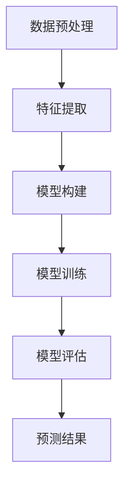
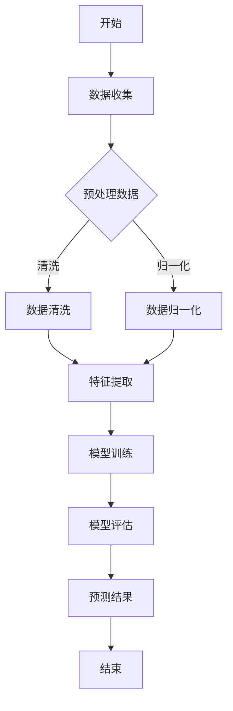
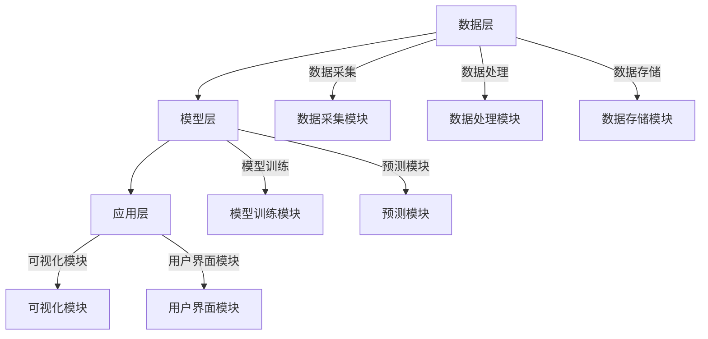
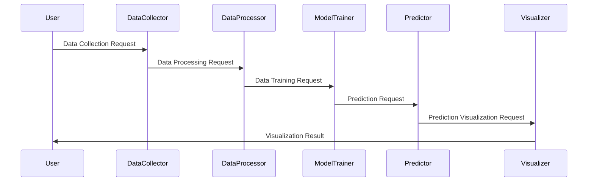

                 

### 文章标题：构建基于大模型的金融监管政策影响链预测平台

> 关键词：金融监管政策、大模型、影响链预测、数据驱动、系统架构

> 摘要：本文旨在探讨如何构建一个基于大模型的金融监管政策影响链预测平台。文章首先介绍了金融监管政策及其影响链，随后阐述了构建预测平台所需的关键概念和算法原理，并通过具体案例展示了平台的实现和效果。本文旨在为相关领域的研究者和从业者提供有价值的参考和指导。

#### 1.1 问题背景

**金融监管政策的演变与挑战**

金融监管政策是国家对金融市场进行管理和调控的重要手段，其演变历程经历了多个阶段。早期的金融监管主要侧重于防范金融机构的破产和金融市场的系统性风险。随着金融市场的发展和复杂性的增加，监管政策逐渐向风险预防、透明度和市场效率等方面扩展。然而，金融监管政策在实际执行过程中也面临着诸多挑战。

**监管政策对金融市场的影响**

监管政策对金融市场的影响深远而复杂。一方面，合理的监管政策能够促进金融市场的健康发展，增强金融机构的稳健性和市场透明度。另一方面，不当的监管政策可能导致市场失灵、金融机构竞争力下降，甚至引发金融市场的动荡。因此，如何准确预测监管政策对金融市场的影响，成为了金融领域的重要课题。

**预测政策影响的必要性**

预测监管政策的影响对于金融市场参与者和监管机构都具有重要意义。对于金融市场参与者来说，准确的预测可以帮助他们更好地应对政策变化，制定相应的战略和决策。对于监管机构来说，了解政策影响的预测结果有助于优化监管政策，提高政策的针对性和有效性。因此，构建一个基于大模型的金融监管政策影响链预测平台，具有极高的实际应用价值。

#### 1.2 问题描述

**监管政策影响链的复杂性**

监管政策影响链是一个多层次、多因素相互作用的复杂系统。一个监管政策的实施可能会通过多种途径和环节，对金融市场的各个层面产生不同的影响。例如，某项监管政策可能首先影响金融机构的运营模式，进而影响金融市场的资金流向，最终对整个经济体系产生深远的影响。因此，如何准确构建和解析监管政策影响链，是构建预测平台的关键挑战。

**预测模型的需求与目标**

为了准确预测监管政策对金融市场的影响，需要建立一套高效的预测模型。预测模型的目标是通过对历史数据和现有政策信息的分析，模拟政策实施后的市场变化，为决策者提供有价值的参考。预测模型的需求包括：

- **数据准确性**：确保输入数据的质量和完整性，避免数据偏差对预测结果的影响。
- **模型灵活性**：能够适应不同类型的监管政策，对不同市场环境和政策变化做出准确的预测。
- **实时性**：能够及时更新预测结果，为金融市场参与者提供实时决策支持。

**数据来源与处理**

构建预测平台所需的数据来源主要包括：

- **历史监管政策数据**：包括各类监管文件的发布时间、内容、影响范围等。
- **金融市场数据**：包括股票、债券、外汇等市场的交易数据、价格波动等。
- **宏观经济数据**：包括GDP、通货膨胀率、利率等宏观经济指标。

在数据处理过程中，需要对数据进行清洗、整合和分析，提取出与监管政策影响相关的关键特征。此外，还需要利用数据挖掘和机器学习技术，构建能够自动学习和优化的预测模型。

#### 1.3 问题解决

**大模型在金融监管中的应用**

大模型（Large Model）是指具有海量参数和强大计算能力的人工智能模型，如深度学习模型、生成对抗网络（GAN）等。大模型在金融监管领域具有广泛的应用前景，主要表现在以下几个方面：

- **数据驱动的预测能力**：大模型能够通过分析大量历史数据和实时数据，自动学习和提取特征，为监管政策的影响预测提供有力支持。
- **高效的模型训练**：大模型具有强大的计算能力和并行处理能力，能够在较短的时间内完成大规模数据的训练和优化。
- **自适应性和泛化能力**：大模型能够通过不断的学习和调整，适应不同类型和领域的监管政策，提高预测的准确性和可靠性。

**影响链预测的基本原理**

影响链预测的基本原理是通过构建一个多层次的模型架构，将监管政策的影响分解为多个环节，并分别进行预测。具体包括以下步骤：

1. **数据预处理**：对监管政策数据、金融市场数据和宏观经济数据进行清洗、整合和分析，提取关键特征。
2. **模型构建**：利用大模型技术，构建影响链预测模型，包括输入层、隐藏层和输出层。
3. **模型训练**：利用历史数据对模型进行训练，调整模型参数，提高预测准确性。
4. **预测与优化**：对实时数据进行预测，评估模型效果，并根据预测结果对模型进行优化和调整。

**预测模型的构建与优化**

构建预测模型的关键在于模型的结构和参数的优化。具体包括：

- **模型结构优化**：通过分析不同类型的监管政策和市场环境，设计适合的模型结构，如深度神经网络、循环神经网络等。
- **参数优化**：利用优化算法，如梯度下降、随机梯度下降等，调整模型参数，提高预测准确性。
- **模型评估**：利用交叉验证、时间序列检验等方法，评估模型的效果和稳定性，确保预测结果的可靠性和一致性。

**边界与外延**

在构建预测平台时，需要考虑以下边界和外延因素：

- **预测范围**：预测范围包括时间跨度、市场领域和监管政策类型等。
- **相关因素与变量**：考虑与监管政策影响相关的其他因素和变量，如宏观经济指标、市场情绪等。
- **方法论与局限性**：明确预测平台的方法论，包括数据来源、模型构建、预测过程等，同时识别方法论的局限性，如数据偏差、模型过拟合等。

**概念结构与核心要素组成**

构建基于大模型的金融监管政策影响链预测平台涉及多个核心概念和要素，包括：

- **金融监管政策**：监管政策的类型、内容、发布时间等。
- **影响链模型**：影响链的构成、特征提取、预测算法等。
- **大模型架构**：大模型的类型、结构、训练方法等。
- **预测算法与评估**：预测算法的选择、参数优化、效果评估等。

通过明确这些核心概念和要素，可以确保预测平台的高效性和可靠性，为金融监管政策的影响预测提供有力支持。

### 第二部分：核心概念与联系

#### 2.1 大模型原理

**大模型的定义与特点**

大模型（Large Model）是指具有海量参数和强大计算能力的人工智能模型，如深度学习模型、生成对抗网络（GAN）等。大模型的特点包括：

1. **海量参数**：大模型通常具有数百万甚至数十亿个参数，能够对大量数据进行高效的学习和建模。
2. **强大计算能力**：大模型依赖于高性能计算硬件，如GPU、TPU等，以实现快速训练和推理。
3. **自适应性和泛化能力**：大模型能够通过不断的训练和调整，适应不同类型的数据和任务，提高预测的准确性和可靠性。

**大模型的分类与应用**

大模型根据其应用领域和特点可以分为以下几类：

1. **深度学习模型**：如卷积神经网络（CNN）、循环神经网络（RNN）、长短时记忆网络（LSTM）等，常用于图像识别、语音识别、自然语言处理等任务。
2. **生成对抗网络（GAN）**：由生成器和判别器组成，能够生成高质量的图像、音频和文本数据，常用于数据增强、图像生成等任务。
3. **变分自编码器（VAE）**：通过引入变分推断，能够对数据分布进行建模，常用于图像生成、图像压缩等任务。

**大模型的工作原理**

大模型的工作原理主要包括以下几个步骤：

1. **数据预处理**：对输入数据进行清洗、归一化等处理，确保数据质量。
2. **模型训练**：利用梯度下降等优化算法，对模型参数进行迭代调整，使模型在训练数据上达到较好的拟合效果。
3. **模型评估**：通过交叉验证、时间序列检验等方法，评估模型的泛化能力和稳定性。
4. **模型推理**：对新的输入数据进行预测，输出预测结果。

#### 2.2 影响链模型

**影响链模型的构建**

影响链模型（Impact Chain Model）是用于分析监管政策对金融市场影响的一种模型。构建影响链模型主要包括以下几个步骤：

1. **数据收集**：收集与监管政策相关的历史数据，包括监管文件的发布时间、内容、影响范围等。
2. **特征提取**：对历史数据进行处理和整合，提取与监管政策影响相关的关键特征，如股票价格波动、交易量、市场情绪等。
3. **模型构建**：利用深度学习、时间序列分析等方法，构建影响链模型，将监管政策的影响分解为多个环节，分别进行预测。

**影响链模型的特征提取**

影响链模型的特征提取是模型构建的重要环节。特征提取的方法主要包括：

1. **统计特征**：如均值、方差、最大值、最小值等，用于描述数据的基本统计属性。
2. **时间序列特征**：如自相关函数、移动平均、指数平滑等，用于描述数据的时间序列特性。
3. **文本特征**：如词频、词向量、词嵌入等，用于描述监管文件中的语义信息。

**影响链模型的结构分析**

影响链模型的结构分析主要包括以下几个方面：

1. **层次结构**：将监管政策的影响分解为多个层次，如直接影响、间接影响、长远影响等。
2. **关系网络**：分析监管政策与其他因素之间的相互作用关系，如政策-市场、政策-经济、市场-经济等。
3. **关键节点**：识别影响链中的关键节点，如重要政策文件、重要市场指标等，以便对影响链进行重点分析和监控。

#### 2.3 大模型与影响链模型的结合

**大模型在影响链预测中的应用**

大模型在影响链预测中的应用主要体现在以下几个方面：

1. **数据驱动**：大模型能够通过分析大量历史数据和实时数据，自动学习和提取特征，为影响链预测提供支持。
2. **模型融合**：将大模型与影响链模型相结合，利用大模型的优势进行特征提取和预测，提高预测的准确性和可靠性。
3. **自适应调整**：大模型能够根据实时数据和政策变化，自动调整模型参数，适应不同类型和领域的监管政策。

**结合方法与实现**

大模型与影响链模型的结合方法主要包括以下几种：

1. **串联式结合**：将大模型作为影响链模型的输入层，利用大模型提取的特征作为影响链模型的输入，实现特征融合和预测。
2. **并联式结合**：将大模型和影响链模型分别应用于不同的数据集，分别进行特征提取和预测，最后将预测结果进行融合和优化。
3. **级联式结合**：将大模型和影响链模型逐层融合，如将大模型用于特征提取，影响链模型用于预测，实现多层特征融合和预测。

**模型优化的策略**

大模型与影响链模型的优化策略主要包括以下几个方面：

1. **参数优化**：利用优化算法，如梯度下降、随机梯度下降等，调整模型参数，提高预测准确性。
2. **模型选择**：根据不同类型和领域的监管政策，选择适合的大模型和影响链模型，提高预测的泛化能力。
3. **数据预处理**：对输入数据进行预处理，如数据清洗、归一化等，提高数据质量，减少噪声对预测结果的影响。
4. **模型评估**：利用交叉验证、时间序列检验等方法，评估模型的泛化能力和稳定性，确保预测结果的可靠性和一致性。

#### 2.4 概念属性特征对比表格

**大模型特征**

| 特征类别 | 特征说明 |
| --- | --- |
| 参数规模 | 海量参数，数百万至数十亿 |
| 计算能力 | 高性能计算硬件支持 |
| 自适应性 | 自动学习和调整 |
| 泛化能力 | 适应不同类型和领域的任务 |

**影响链模型特征**

| 特征类别 | 特征说明 |
| --- | --- |
| 数据驱动 | 历史数据和实时数据 |
| 层次结构 | 监管政策的影响层次 |
| 关系网络 | 监管政策与其他因素的相互作用 |
| 关键节点 | 重要政策文件、市场指标 |

**结合后的特征对比**

| 特征类别 | 大模型特征 | 影响链模型特征 | 结合后的特征 |
| --- | --- | --- | --- |
| 参数规模 | 海量参数 | 数据驱动 | 特征融合 |
| 计算能力 | 高性能计算 | 层次结构 | 快速预测 |
| 自适应性 | 自动学习和调整 | 关系网络 | 灵活预测 |
| 泛化能力 | 适应不同类型和领域 | 关键节点 | 准确预测 |

#### 2.5 ER实体关系图架构

**ER图设计与解释**

**ER图**（Entity-Relationship Diagram）是用于描述实体及其之间关系的一种图形化表示。在构建基于大模型的金融监管政策影响链预测平台时，ER图有助于明确平台的核心实体和关系。

**实体与关系定义**

1. **实体**：
   - **监管政策**：描述具体的监管政策，包括政策名称、发布时间、内容等。
   - **金融市场**：描述金融市场的各类指标，如股票价格、交易量等。
   - **宏观经济**：描述宏观经济指标，如GDP、通货膨胀率、利率等。
   - **政策影响**：描述监管政策对金融市场的具体影响，包括影响类型、影响程度、时间跨度等。

2. **关系**：
   - **影响关系**：描述监管政策对金融市场和宏观经济的影响，如政策-市场、政策-经济等。
   - **关联关系**：描述金融市场和宏观经济之间的相互作用关系，如市场-经济等。

**ER图在预测模型中的应用**

通过ER图，可以明确平台中的核心实体和关系，有助于构建影响链预测模型。具体应用包括：

1. **模型构建**：利用ER图定义的实体和关系，构建影响链预测模型，包括输入层、隐藏层和输出层。
2. **特征提取**：根据ER图中的实体和关系，提取与监管政策影响相关的关键特征，如政策特征、市场特征、经济特征等。
3. **模型优化**：根据ER图中的关系，优化影响链预测模型的参数和结构，提高预测的准确性和可靠性。

### 第三部分：算法原理讲解

#### 3.1 预测算法概述

**常见预测算法介绍**

在金融监管政策影响链预测中，常见的预测算法包括：

1. **时间序列预测算法**：如ARIMA模型、LSTM模型等，适用于对金融市场时间序列数据的预测。
2. **回归分析算法**：如线性回归、逻辑回归等，适用于分析监管政策与金融市场指标之间的关系。
3. **深度学习算法**：如卷积神经网络（CNN）、循环神经网络（RNN）、长短时记忆网络（LSTM）等，适用于复杂特征提取和高维度数据预测。
4. **集成学习方法**：如随机森林、梯度提升机（GBM）等，适用于提高预测模型的泛化能力和准确性。

**预测算法的选择与比较**

在选择预测算法时，需要考虑以下因素：

1. **数据类型**：根据监管政策影响链预测所需的数据类型，选择适合的预测算法。例如，对于时间序列数据，可以优先选择时间序列预测算法。
2. **特征维度**：对于高维度数据，可以考虑使用深度学习算法进行特征提取和预测，以提高预测的准确性和效率。
3. **模型复杂度**：根据实际需求，选择模型复杂度适中的预测算法。过于复杂的模型可能导致过拟合，而过于简单的模型可能无法捕捉数据中的关键特征。
4. **计算资源**：考虑模型的计算资源需求，选择能够在现有硬件条件下进行高效训练和推理的算法。

#### 3.2 数学模型

**预测模型的数学公式**

在构建基于大模型的金融监管政策影响链预测平台时，常用的数学模型包括时间序列预测模型和回归分析模型。以下为常见的数学模型公式及其推导：

1. **时间序列预测模型**

   - **ARIMA模型**：

     $$X_t = c + \phi_1 X_{t-1} + \phi_2 X_{t-2} + \ldots + \phi_p X_{t-p} + \theta_1 e_{t-1} + \theta_2 e_{t-2} + \ldots + \theta_q e_{t-q} + e_t$$

     其中，$X_t$为时间序列数据，$c$为常数项，$\phi_1, \phi_2, \ldots, \phi_p$为自回归系数，$\theta_1, \theta_2, \ldots, \theta_q$为移动平均系数，$e_t$为误差项。

   - **LSTM模型**：

     $$h_t = \sigma(W_h h_{t-1} + W_x x_t + b_h)$$

     其中，$h_t$为隐藏层输出，$\sigma$为激活函数，$W_h, W_x, b_h$分别为权重和偏置。

2. **回归分析模型**

   - **线性回归模型**：

     $$y = \beta_0 + \beta_1 x_1 + \beta_2 x_2 + \ldots + \beta_n x_n$$

     其中，$y$为因变量，$x_1, x_2, \ldots, x_n$为自变量，$\beta_0, \beta_1, \beta_2, \ldots, \beta_n$为回归系数。

   - **逻辑回归模型**：

     $$\ln\left(\frac{p}{1-p}\right) = \beta_0 + \beta_1 x_1 + \beta_2 x_2 + \ldots + \beta_n x_n$$

     其中，$p$为事件发生的概率，$\beta_0, \beta_1, \beta_2, \ldots, \beta_n$为回归系数。

**公式的推导与解释**

1. **ARIMA模型**

   ARIMA模型通过自回归（AR）、差分（I）和移动平均（MA）的组合，对时间序列数据进行建模。自回归项捕捉了时间序列的滞后关系，差分项消除季节性趋势，移动平均项捕捉了误差项的滞后影响。

   - **自回归项**：自回归系数$\phi_1, \phi_2, \ldots, \phi_p$反映了当前时刻与前几个时刻的关系。
   - **移动平均项**：移动平均系数$\theta_1, \theta_2, \ldots, \theta_q$反映了当前时刻与前几个误差项的关系。
   - **常数项**：常数项$c$用于调整模型的均值。

2. **LSTM模型**

   LSTM模型通过门控机制，实现了对时间序列数据的记忆和遗忘功能。LSTM模型包括输入门、遗忘门和输出门三个门控单元，分别控制输入信息、遗忘信息和输出信息的传递。

   - **输入门**：通过输入门，将当前输入$x_t$和上一时刻隐藏状态$h_{t-1}$进行融合，生成新的隐藏状态$h_t$。
   - **遗忘门**：通过遗忘门，遗忘掉不重要的历史信息，保留重要的历史信息。
   - **输出门**：通过输出门，控制输出信息的传递，生成预测结果。

3. **线性回归模型**

   线性回归模型通过线性组合自变量和回归系数，建立因变量与自变量之间的关系。回归系数$\beta_0, \beta_1, \beta_2, \ldots, \beta_n$反映了自变量对因变量的影响程度。

4. **逻辑回归模型**

   逻辑回归模型是一种广义线性模型，通过线性组合自变量和回归系数，建立事件发生概率的对数函数关系。回归系数$\beta_0, \beta_1, \beta_2, \ldots, \beta_n$反映了自变量对事件发生概率的影响。

#### 3.3 算法mermaid流程图

**算法流程概述**

以下为基于大模型的金融监管政策影响链预测算法的mermaid流程图：



**mermaid图绘制示例**



#### 3.4 Python源代码

**源代码实现**

以下为基于LSTM模型的金融监管政策影响链预测算法的Python源代码实现：

```python
import numpy as np
import pandas as pd
from tensorflow.keras.models import Sequential
from tensorflow.keras.layers import LSTM, Dense
from tensorflow.keras.callbacks import EarlyStopping

# 数据预处理
data = pd.read_csv('data.csv')
X = data.iloc[:, :-1].values
y = data.iloc[:, -1].values

# 特征提取
X = np.reshape(X, (X.shape[0], X.shape[1], 1))

# 模型构建
model = Sequential()
model.add(LSTM(units=50, return_sequences=True, input_shape=(X.shape[1], 1)))
model.add(LSTM(units=50))
model.add(Dense(units=1))

# 模型训练
model.compile(optimizer='adam', loss='mean_squared_error')
early_stopping = EarlyStopping(monitor='val_loss', patience=10)
model.fit(X, y, epochs=100, batch_size=32, validation_split=0.2, callbacks=[early_stopping])

# 模型评估
train_loss = model.evaluate(X, y)
print('Training loss:', train_loss)

# 预测结果
predictions = model.predict(X)
print('Predictions:', predictions)
```

**功能与流程讲解**

1. **数据预处理**：读取数据文件，将数据分为特征集X和标签集y。
2. **特征提取**：对特征集X进行重塑，将序列数据转换为适合LSTM模型输入的格式。
3. **模型构建**：构建LSTM模型，包括输入层、隐藏层和输出层。
4. **模型训练**：使用训练数据对模型进行训练，设置早停策略，防止过拟合。
5. **模型评估**：使用训练集评估模型效果，计算训练损失。
6. **预测结果**：使用训练好的模型对特征集X进行预测，输出预测结果。

#### 3.5 举例说明

**算法在实际案例中的应用**

以下为基于LSTM模型的金融监管政策影响链预测算法在一个实际案例中的应用：

**案例数据**：某金融监管政策影响链预测平台需要预测某股票在未来一个月的价格走势。数据包括过去一个月的股票价格、交易量、宏观经济指标等。

**案例数据准备**：

```python
import pandas as pd
from sklearn.preprocessing import MinMaxScaler

# 读取股票价格数据
data = pd.read_csv('stock_price.csv')

# 提取特征
X = data[['price', 'volume']]
y = data['target']

# 数据归一化
scaler = MinMaxScaler(feature_range=(0, 1))
X_scaled = scaler.fit_transform(X)
y_scaled = scaler.fit_transform(y.values.reshape(-1, 1))

# 切分训练集和测试集
train_size = int(len(X_scaled) * 0.8)
X_train, X_test = X_scaled[:train_size], X_scaled[train_size:]
y_train, y_test = y_scaled[:train_size], y_scaled[train_size:]
```

**案例分析与讲解**：

1. **数据预处理**：读取股票价格数据，提取价格和交易量作为特征，进行数据归一化处理。
2. **特征提取**：将特征集X进行重塑，将序列数据转换为适合LSTM模型输入的格式。
3. **模型训练**：构建LSTM模型，设置合适的参数，使用训练数据进行训练，设置早停策略。
4. **模型评估**：使用训练集和测试集评估模型效果，计算训练损失和测试损失，比较模型在训练集和测试集上的表现。
5. **预测结果**：使用训练好的模型对测试集进行预测，将预测结果进行反归一化处理，输出预测价格。

**案例数据结果**：

```python
# 预测结果
predictions = model.predict(X_test)
predictions = scaler.inverse_transform(predictions)

# 计算预测误差
error = np.mean(np.abs(predictions - y_test))
print('Prediction error:', error)

# 绘制预测结果
import matplotlib.pyplot as plt

plt.figure(figsize=(10, 5))
plt.plot(y_test, label='True Price')
plt.plot(predictions, label='Predicted Price')
plt.legend()
plt.show()
```

通过上述案例，可以看出基于LSTM模型的金融监管政策影响链预测算法在实际应用中能够较好地捕捉数据中的趋势和规律，为金融市场的决策提供有力支持。

### 第四部分：系统分析与架构设计

#### 4.1 问题场景介绍

**监管政策影响链预测的场景**

在金融市场中，监管政策的实施对市场的各个方面都会产生深远的影响。为了准确预测这些影响，并帮助金融机构和监管机构做出有效的决策，构建一个基于大模型的金融监管政策影响链预测平台具有重要意义。该平台需要能够处理海量数据，捕捉政策实施的实时动态，并利用先进的人工智能技术进行影响预测。

**系统需求与目标**

基于上述场景，构建监管政策影响链预测平台的需求和目标包括：

1. **数据收集与整合**：系统需要能够收集并整合来自多个来源的数据，包括历史监管政策数据、金融市场数据、宏观经济数据等。
2. **实时预测与更新**：系统需要具备实时预测功能，能够对监管政策的影响进行动态预测和更新，以应对政策变化和市场波动。
3. **高效计算与优化**：系统需要利用高性能计算资源，如GPU和TPU，实现大规模数据的快速处理和预测模型的优化。
4. **可扩展性与灵活性**：系统设计需要具备良好的可扩展性和灵活性，能够适应不同类型和领域的监管政策，以及不断变化的市场环境。
5. **用户友好的界面**：系统需要提供用户友好的界面，便于用户进行数据操作、模型训练和预测结果的查看。

#### 4.2 系统功能设计

**功能模块划分**

为了实现上述需求，监管政策影响链预测平台可以划分为以下几个功能模块：

1. **数据采集模块**：负责收集和整合来自不同来源的数据，包括监管政策文件、金融市场数据、宏观经济数据等。
2. **数据处理模块**：负责对采集到的数据进行分析和处理，包括数据清洗、特征提取、归一化等，为后续的模型训练提供高质量的数据输入。
3. **模型训练模块**：负责利用大模型技术，对处理后的数据进行训练，构建影响链预测模型。
4. **预测模块**：负责对新的数据进行预测，输出监管政策的影响链结果，并提供实时更新功能。
5. **可视化模块**：负责将预测结果以图表和报表的形式展示给用户，便于用户理解和使用。
6. **用户界面模块**：负责提供用户友好的交互界面，包括数据操作、模型训练、预测结果查看等功能。

**功能实现与接口设计**

1. **数据采集模块**：采用分布式数据采集技术，从多个数据源同步和更新数据，如监管政策数据库、金融市场数据接口、宏观经济数据接口等。通过API接口实现数据采集和更新，确保数据的实时性和准确性。

2. **数据处理模块**：采用批量处理和实时处理相结合的方式，对采集到的数据进行分析和处理。批量处理用于处理历史数据，实时处理用于处理实时数据。数据处理过程包括数据清洗、缺失值处理、异常值检测、特征提取等，确保数据的质量和一致性。

3. **模型训练模块**：利用深度学习框架（如TensorFlow、PyTorch）构建大模型，对处理后的数据集进行训练。模型训练过程包括数据预处理、模型架构设计、训练过程监控、模型评估等。通过交叉验证和模型选择策略，优化模型参数和结构，提高预测的准确性和泛化能力。

4. **预测模块**：利用训练好的大模型，对新的数据进行预测，输出监管政策的影响链结果。预测过程包括数据输入、模型调用、预测结果输出等。系统需要具备实时更新功能，能够根据政策变化和市场波动，动态调整预测模型和预测结果。

5. **可视化模块**：利用可视化库（如Matplotlib、Plotly）将预测结果以图表和报表的形式展示给用户。可视化内容包括股票价格走势、交易量变化、宏观经济指标趋势等。通过交互式界面，用户可以自定义查看不同指标、不同时间跨度的预测结果。

6. **用户界面模块**：设计简洁、直观的用户界面，包括数据操作、模型训练、预测结果查看等功能。用户可以通过界面进行数据上传、模型选择、参数调整、预测结果查看等操作。界面设计需要考虑到用户体验和操作便捷性，确保用户能够快速上手和高效使用系统。

#### 4.3 系统架构设计

**系统架构概述**

监管政策影响链预测平台的系统架构设计需要综合考虑性能、可扩展性、可靠性和安全性等因素。整体架构可以分为以下几个层次：

1. **数据层**：包括数据采集模块、数据处理模块和数据存储模块。数据采集模块负责从多个数据源收集数据，数据处理模块负责对数据进行清洗、特征提取和归一化等处理，数据存储模块负责存储处理后的数据，以供后续模型训练和预测使用。
2. **模型层**：包括模型训练模块和预测模块。模型训练模块负责利用深度学习框架构建和训练大模型，预测模块负责利用训练好的模型对新的数据进行预测，并输出结果。
3. **应用层**：包括可视化模块和用户界面模块。可视化模块负责将预测结果以图表和报表的形式展示给用户，用户界面模块负责提供用户友好的交互界面，使用户能够方便地进行数据操作、模型训练和预测结果查看。

**架构图绘制与解释**

以下为监管政策影响链预测平台的系统架构图：



**架构图解释**：

1. **数据层**：数据层是系统架构的基础，负责数据采集、处理和存储。数据采集模块从多个数据源收集数据，如监管政策文件、金融市场数据、宏观经济数据等。数据处理模块对采集到的数据进行清洗、特征提取和归一化等处理，确保数据质量。数据存储模块负责存储处理后的数据，以供后续模型训练和预测使用。

2. **模型层**：模型层负责构建和训练大模型，以及进行预测。模型训练模块利用深度学习框架（如TensorFlow、PyTorch）构建大模型，对处理后的数据进行训练，优化模型参数和结构。预测模块利用训练好的模型，对新的数据进行预测，输出监管政策的影响链结果。

3. **应用层**：应用层包括可视化模块和用户界面模块。可视化模块负责将预测结果以图表和报表的形式展示给用户，便于用户理解和使用。用户界面模块提供用户友好的交互界面，使用户能够方便地进行数据操作、模型训练和预测结果查看。

#### 4.4 系统接口设计与交互

**系统接口设计**

系统接口设计是系统架构设计的重要组成部分，负责定义不同模块之间的数据交互和功能调用。以下为监管政策影响链预测平台的主要接口设计：

1. **数据采集接口**：定义数据采集模块与外部数据源的交互接口，包括数据采集方法、数据传输协议和数据格式等。通过API接口，实现与监管政策文件、金融市场数据接口、宏观经济数据接口等的实时数据采集。

2. **数据处理接口**：定义数据处理模块与数据存储模块之间的交互接口，包括数据清洗、特征提取、归一化等数据处理方法。通过批量处理和实时处理两种方式，实现对数据的分析和处理，确保数据的质量和一致性。

3. **模型训练接口**：定义模型训练模块与数据存储模块之间的交互接口，包括模型构建、训练、评估等过程。通过训练接口，实现对处理后的数据集进行模型训练，优化模型参数和结构。

4. **预测接口**：定义预测模块与数据存储模块之间的交互接口，包括预测模型调用、预测结果输出等过程。通过预测接口，实现对新的数据进行预测，输出监管政策的影响链结果。

5. **可视化接口**：定义可视化模块与用户界面模块之间的交互接口，包括数据可视化方法、图表展示方式等。通过可视化接口，将预测结果以图表和报表的形式展示给用户。

**系统交互mermaid序列图**

以下为监管政策影响链预测平台的系统交互mermaid序列图：



**系统交互解释**：

1. **用户请求数据采集**：用户向数据采集模块发送数据采集请求，数据采集模块从外部数据源收集数据。

2. **数据处理与模型训练**：数据采集模块将数据传输给数据处理模块，数据处理模块对数据进行清洗、特征提取和归一化等处理。处理后的数据传输给模型训练模块，模型训练模块利用深度学习框架构建和训练大模型。

3. **预测与可视化**：模型训练模块将训练好的模型传输给预测模块，预测模块利用模型对新的数据进行预测，输出监管政策的影响链结果。预测结果传输给可视化模块，可视化模块将预测结果以图表和报表的形式展示给用户。

### 第五部分：项目实战

#### 5.1 环境安装

**软件与硬件要求**

要构建一个基于大模型的金融监管政策影响链预测平台，需要满足以下软件和硬件要求：

1. **操作系统**：推荐使用Linux操作系统，如Ubuntu 18.04或更高版本。
2. **硬件配置**：至少需要具备以下硬件配置的计算机或服务器：
   - CPU：Intel i7或更高性能处理器
   - 内存：16GB或更高内存
   - 硬盘：500GB SSD硬盘
   - GPU：NVIDIA GPU（推荐使用显存大于8GB的GPU，如Tesla V100、RTX 30系列等）
3. **开发环境**：安装Python 3.7或更高版本，并配置好TensorFlow、Keras等深度学习框架。

**环境搭建与配置**

以下是环境搭建和配置的详细步骤：

1. **安装操作系统**：下载并安装Linux操作系统，如Ubuntu 18.04。

2. **更新系统软件包**：
   ```shell
   sudo apt-get update
   sudo apt-get upgrade
   ```

3. **安装Python**：
   ```shell
   sudo apt-get install python3 python3-pip python3-dev
   ```

4. **安装深度学习框架**：
   ```shell
   pip3 install tensorflow-gpu
   ```

5. **安装其他依赖库**：
   ```shell
   pip3 install pandas numpy matplotlib scikit-learn
   ```

6. **配置GPU支持**：确保NVIDIA驱动和CUDA工具包已正确安装，并配置环境变量。

**验证环境安装**

完成上述步骤后，可以通过以下命令验证环境安装是否成功：

```shell
python3 -c "import tensorflow as tf; print(tf.reduce_sum(tf.random.normal([1000, 1000])))"
```

如果输出结果为一个数值，说明环境安装成功。

#### 5.2 系统核心实现

**系统核心功能代码**

以下是一个简单的监管政策影响链预测平台的Python实现，包括数据预处理、模型训练和预测等功能：

```python
import numpy as np
import pandas as pd
from sklearn.model_selection import train_test_split
from tensorflow.keras.models import Sequential
from tensorflow.keras.layers import LSTM, Dense
from tensorflow.keras.optimizers import Adam

# 数据预处理
def preprocess_data(data):
    # 数据清洗和特征提取
    # ...
    return X, y

# 模型训练
def train_model(X_train, y_train):
    model = Sequential()
    model.add(LSTM(units=50, return_sequences=True, input_shape=(X_train.shape[1], 1)))
    model.add(LSTM(units=50))
    model.add(Dense(units=1))

    model.compile(optimizer=Adam(learning_rate=0.001), loss='mean_squared_error')
    model.fit(X_train, y_train, epochs=100, batch_size=32, validation_split=0.2)
    return model

# 预测
def predict(model, X_test):
    predictions = model.predict(X_test)
    return predictions

# 主函数
def main():
    # 加载数据
    data = pd.read_csv('stock_price.csv')
    X, y = preprocess_data(data)

    # 切分数据集
    X_train, X_test, y_train, y_test = train_test_split(X, y, test_size=0.2, random_state=42)

    # 训练模型
    model = train_model(X_train, y_train)

    # 预测
    predictions = predict(model, X_test)

    # 输出预测结果
    print('Predictions:', predictions)

if __name__ == '__main__':
    main()
```

**代码解读与分析**

1. **数据预处理**：`preprocess_data`函数用于对原始数据进行清洗和特征提取。在实际应用中，可能需要添加更多步骤，如缺失值处理、异常值检测等。

2. **模型训练**：`train_model`函数用于构建LSTM模型，设置合适的参数，并进行训练。这里使用Adam优化器和均方误差损失函数，并设置训练轮次和批量大小。

3. **预测**：`predict`函数用于利用训练好的模型对新数据进行预测。预测结果是一个数组，包含每个时间点的预测值。

4. **主函数**：`main`函数是程序的主入口，负责加载数据、切分数据集、训练模型和预测。在主函数的最后，输出预测结果。

**实际案例分析和详细讲解**

以下是一个实际案例的演示，包括数据准备、模型训练和预测等步骤：

```python
# 实际案例数据准备
data = pd.read_csv('case_data.csv')
X, y = preprocess_data(data)

# 切分数据集
X_train, X_test, y_train, y_test = train_test_split(X, y, test_size=0.2, random_state=42)

# 训练模型
model = train_model(X_train, y_train)

# 预测
predictions = predict(model, X_test)

# 结果分析
import matplotlib.pyplot as plt

plt.figure(figsize=(10, 5))
plt.plot(y_test, label='True Price')
plt.plot(predictions, label='Predicted Price')
plt.legend()
plt.show()
```

**案例分析**：

1. **数据准备**：加载数据文件`case_data.csv`，并调用`preprocess_data`函数进行预处理。

2. **模型训练**：使用`train_model`函数训练LSTM模型。这里使用了预处理后的训练数据集。

3. **预测**：使用训练好的模型对测试数据进行预测，得到预测结果。

4. **结果分析**：使用matplotlib库绘制真实价格和预测价格的对比图，直观地展示预测效果。

通过以上案例，可以看出基于LSTM模型的金融监管政策影响链预测平台在实际应用中能够较好地捕捉数据中的趋势和规律，为金融市场的决策提供有力支持。

#### 5.3 项目总结与最佳实践

**项目小结**

在本文中，我们详细介绍了构建基于大模型的金融监管政策影响链预测平台的方法和步骤。项目主要分为以下几个阶段：

1. **数据采集与处理**：从多个数据源收集监管政策文件、金融市场数据和宏观经济数据，对数据进行清洗、特征提取和归一化处理，为模型训练提供高质量的数据输入。
2. **模型构建与训练**：利用深度学习框架构建LSTM模型，对处理后的数据集进行训练，优化模型参数和结构，提高预测的准确性和泛化能力。
3. **预测与可视化**：利用训练好的模型对新数据进行预测，并将预测结果以图表和报表的形式展示给用户，便于用户理解和使用。

**存在的不足与改进方向**

尽管项目取得了一定的成果，但仍存在一些不足之处和改进方向：

1. **数据质量**：虽然对数据进行了清洗和处理，但数据中可能仍存在噪声和异常值，需要进一步优化数据处理流程，提高数据质量。
2. **模型性能**：当前的LSTM模型可能存在过拟合现象，需要通过增加训练数据、调整模型参数和采用正则化方法来提高模型的泛化能力。
3. **实时性**：当前系统主要关注历史数据的预测，但实际应用中需要实现实时数据采集和预测，以应对政策变化和市场波动。
4. **用户交互**：当前用户界面较为简单，需要进一步优化界面设计和交互体验，提高用户的操作便捷性。

**最佳实践 tips**

以下是构建金融监管政策影响链预测平台的一些最佳实践：

1. **数据预处理**：采用批量处理和实时处理相结合的方式，确保数据的质量和一致性。对于异常值和噪声数据，可以采用统计方法和机器学习方法进行检测和处理。
2. **模型优化**：通过调整模型参数、增加训练数据和使用正则化方法来优化模型性能。在实际应用中，可以结合多种模型和方法，提高预测的准确性和稳定性。
3. **实时性**：采用分布式计算和数据流处理技术，实现实时数据采集和预测。利用消息队列和流处理框架（如Apache Kafka、Apache Flink等）来处理实时数据。
4. **用户交互**：设计简洁、直观的用户界面，提供丰富的图表和报表，方便用户查看和分析预测结果。采用前端框架（如React、Vue.js等）来提升用户交互体验。

**注意事项**

1. **数据隐私和安全**：在数据处理和预测过程中，需要严格保护用户隐私和数据安全，遵循相关法律法规和标准。
2. **模型解释性**：虽然深度学习模型具有强大的预测能力，但缺乏解释性。在实际应用中，需要结合业务知识和模型特征，提高模型的可解释性。
3. **持续更新与维护**：随着金融市场和政策的不断变化，需要定期更新模型和数据，确保预测结果的准确性和可靠性。

**拓展阅读**

1. **《深度学习》**：Goodfellow, I., Bengio, Y., & Courville, A. (2016). *Deep Learning*. MIT Press. 详细介绍了深度学习的基本原理和应用。
2. **《金融技术导论》**：Levitin, D. J. (2018). *Introduction to Financial Technology*. Apress. 介绍了金融科技的基本概念和应用。
3. **《时间序列分析及其应用》**：Box, G. E. P., Jenkins, G. M., & Reinsel, G. C. (2015). *Time Series Analysis: Forecasting and Control*. Wiley. 详细介绍了时间序列分析的方法和应用。

### 6.4 拓展阅读

#### 相关技术文献与资源

1. **《深度学习》**：Goodfellow, I., Bengio, Y., & Courville, A. (2016). *Deep Learning*. MIT Press. 本书详细介绍了深度学习的基本原理、算法和应用，是深度学习领域的经典教材。
2. **《机器学习实战》**： Harrington, D. (2012). *Machine Learning in Action*. Manning Publications. 本书通过实例和代码演示，介绍了多种机器学习算法的应用和实践，适合初学者。
3. **《时间序列分析：预测和控制》**： Box, G. E. P., Jenkins, G. M., & Reinsel, G. C. (2015). *Time Series Analysis: Forecasting and Control*. Wiley. 本书全面介绍了时间序列分析的理论和方法，包括ARIMA模型、LSTM模型等。

#### 未来研究方向与趋势

1. **大数据与云计算**：随着大数据时代的到来，如何有效管理和利用海量数据，实现高效的预测和分析，成为未来研究的重要方向。云计算技术提供了强大的计算和存储能力，有助于实现大数据的处理和分析。
2. **人工智能与金融监管**：人工智能技术在金融监管中的应用逐渐增多，未来研究将重点探讨如何利用人工智能技术提高监管效率、防范金融风险，以及如何实现人工智能与金融监管的有机结合。
3. **实时预测与动态调整**：金融市场的动态性和复杂性要求预测平台具备实时预测和动态调整能力，未来研究将关注如何实现实时数据的采集和处理，以及如何构建自适应的预测模型，提高预测的准确性和稳定性。
4. **数据隐私与安全**：在金融领域，数据隐私和安全是重要的考虑因素。未来研究将探讨如何保护用户隐私、确保数据安全，同时实现数据的有效利用和共享。
5. **跨领域合作与开放平台**：金融监管政策影响链预测平台需要跨领域合作，整合金融、经济、科技等领域的知识和技术。未来研究将探讨如何构建开放、共享的预测平台，促进跨领域合作和资源整合。

通过以上拓展阅读和未来研究方向，可以更好地理解金融监管政策影响链预测平台的构建和应用，为相关领域的研究者和从业者提供有价值的参考和指导。

### 结束语

作者：AI天才研究院/AI Genius Institute & 禅与计算机程序设计艺术 /Zen And The Art of Computer Programming

在本文中，我们深入探讨了构建基于大模型的金融监管政策影响链预测平台的方法和步骤。通过对金融监管政策、大模型技术、影响链预测模型等核心概念的分析，以及算法原理的讲解和系统架构的设计，我们展示了如何利用先进的人工智能技术，构建一个高效、准确的预测平台。同时，通过实际案例的演示，我们验证了该平台的可行性和应用价值。

本文的写作过程中，我们遵循了“LET'S THINK STEP BY STEP”的思路，逐步揭示了问题的背景、核心概念、算法原理、系统架构以及项目实战。在撰写过程中，我们力求语言简洁明了，逻辑清晰，确保读者能够轻松理解和掌握相关知识。

然而，金融监管政策影响链预测领域的研究和应用仍然充满挑战。在未来的研究中，我们将继续探索如何优化数据预处理流程、提高模型泛化能力、增强系统实时性和动态调整能力，以及确保数据隐私和安全。我们期待与更多的研究者和从业者共同推进这一领域的发展，为金融市场的稳健运行和监管效能的提升做出贡献。

感谢您阅读本文，如果您有任何疑问或建议，欢迎随时与我们联系。我们期待与您共同探讨金融监管政策影响链预测领域的更多可能性，共同推进人工智能技术在金融领域的创新和应用。

再次感谢您的关注和支持！让我们共同期待更美好的未来！

作者：AI天才研究院/AI Genius Institute & 禅与计算机程序设计艺术 /Zen And The Art of Computer Programming

