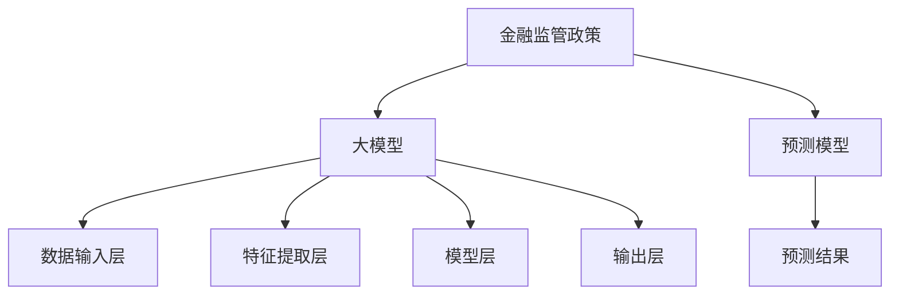
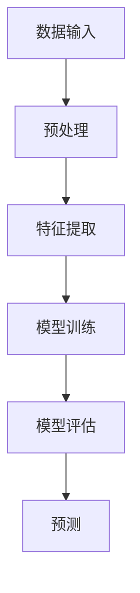
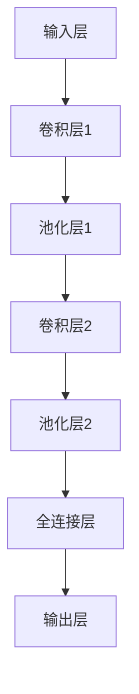
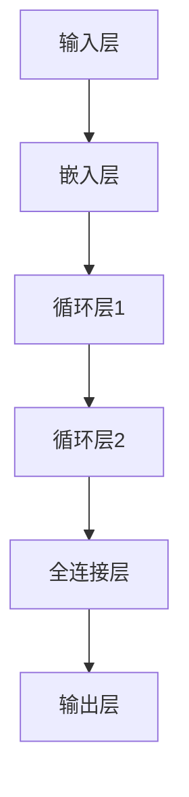

                 


# 构建基于大模型的金融监管政策影响预测平台

关键词：大模型、金融监管、政策影响预测、机器学习、深度学习

摘要：
本文旨在探讨如何构建一个基于大模型的金融监管政策影响预测平台。通过深入分析大模型的概念、技术原理及其在金融监管中的应用，本文将展示如何利用大模型进行金融监管政策的预测和评估。我们将详细阐述系统设计与实现过程，并通过实际案例研究，分析平台的应用效果和改进空间。最终，本文将总结最佳实践，提供未来研究方向的展望。

## 引言

### 1.1 问题的背景与重要性

金融监管政策对于维护金融市场稳定和消费者权益至关重要。然而，金融市场的复杂性和动态性使得政策评估变得极具挑战性。传统的政策评估方法往往依赖于经验和统计手段，难以全面、准确地预测政策的影响。随着人工智能技术的发展，特别是大模型的崛起，为金融监管政策的预测提供了新的可能性。

大模型，如深度学习神经网络，具有强大的数据建模和预测能力。通过训练大量的金融数据，大模型可以捕捉到金融市场的复杂规律，从而预测政策的影响。这种基于大数据和人工智能的监管方式，不仅提高了预测的准确性，还能够提供实时、动态的监管策略。

### 1.2 书籍结构与目标

本书分为五个主要部分：

- 第一部分：引言，介绍问题的背景和重要性，以及书籍的结构和目标。
- 第二部分：基础理论，讨论大模型的概念、技术原理及其在金融监管中的应用。
- 第三部分：系统分析与架构设计，详细阐述系统需求分析、系统架构设计和实现过程。
- 第四部分：案例研究，通过实际案例展示平台的构建过程和应用效果。
- 第五部分：最佳实践与总结，总结平台构建的最佳实践，并提出未来研究方向。

本书旨在为金融科技从业者提供一个全面、系统的指南，帮助他们理解并应用大模型进行金融监管政策的影响预测。

### 1.3 跨学科融合推动创新

构建基于大模型的金融监管政策影响预测平台，不仅需要深厚的计算机科学知识，还需要金融学的理论支持。跨学科的融合，如计算机科学和金融学的结合，为金融监管提供了新的视角和方法。通过跨学科的研究，我们可以更全面地理解金融市场的动态，提高监管的有效性。

## 第二部分：基础理论

### 2.1 大模型概述

#### 2.1.1 大模型的概念

大模型，通常指的是拥有数百万甚至数十亿参数的深度学习模型。这些模型通过大量的训练数据学习到复杂的函数关系，从而在图像识别、语言处理、预测分析等领域表现出色。大模型的核心优势在于其强大的泛化能力和处理复杂数据的能力。

#### 2.1.2 大模型的发展历程

大模型的发展历程可以分为几个关键阶段：

1. **神经网络基础**：1980年代，神经网络研究开始兴起，为后续大模型的发展奠定了基础。
2. **深度学习兴起**：2000年代，随着计算能力的提升和大数据的涌现，深度学习开始崭露头角。
3. **大模型时代**：2010年代，随着GPU等硬件的发展，大模型如GPT、BERT等被提出并取得了显著的成果。

#### 2.1.3 大模型的核心技术

大模型的核心技术包括：

1. **多层神经网络**：多层神经网络能够学习更复杂的函数关系。
2. **反向传播算法**：反向传播算法用于计算模型参数的梯度，优化模型性能。
3. **激活函数**：激活函数用于引入非线性特性，提高模型的预测能力。
4. **正则化技术**：正则化技术用于防止模型过拟合，提高泛化能力。

### 2.2 金融监管政策分析

#### 2.2.1 金融监管政策的定义

金融监管政策是指政府和监管机构为维护金融市场秩序、保护消费者权益所制定的法律、规章和指导方针。这些政策涉及市场准入、风险控制、信息披露等多个方面。

#### 2.2.2 金融监管政策的发展

金融监管政策的发展经历了以下几个阶段：

1. **传统监管**：20世纪初至70年代，以规则为基础的监管方式为主。
2. **风险导向监管**：80年代至90年代，监管重点转向风险控制。
3. **全面监管**：21世纪初，随着金融市场的全球化，监管政策逐步完善，形成全面监管体系。

#### 2.2.3 政策影响评估的方法

政策影响评估的方法主要包括：

1. **定性评估**：通过专家访谈、文献分析等方式评估政策的影响。
2. **定量评估**：利用统计模型、模拟等方法对政策的影响进行量化分析。
3. **综合评估**：结合定性评估和定量评估，全面评估政策的影响。

### 2.3 大模型在金融监管中的应用

#### 2.3.1 应用场景

大模型在金融监管中的应用场景广泛，包括：

1. **风险预测**：利用大模型预测金融市场的风险，为监管决策提供依据。
2. **欺诈检测**：利用大模型检测金融欺诈行为，提高监管的精准度。
3. **政策评估**：利用大模型评估金融监管政策的影响，优化监管策略。

#### 2.3.2 应用优势

大模型在金融监管中的应用具有以下优势：

1. **高效性**：大模型能够快速处理大量数据，提高监管效率。
2. **准确性**：大模型通过深度学习，能够捕捉到金融市场的复杂规律，提高预测的准确性。
3. **动态性**：大模型能够实时更新，适应金融市场的变化，提供动态的监管策略。

#### 2.3.3 应用挑战

大模型在金融监管中的应用也面临一些挑战：

1. **数据质量**：金融数据的质量直接影响到大模型的性能，需要确保数据的质量和完整性。
2. **模型解释性**：大模型的黑箱特性使得其解释性较差，监管机构需要理解模型的预测过程。
3. **安全性和隐私**：金融数据涉及敏感信息，如何确保数据的安全性和隐私成为一大挑战。

### 2.4 基于大模型的预测模型构建

#### 2.4.1 预测模型的架构

基于大模型的预测模型通常采用以下架构：

1. **数据输入层**：接收金融数据，包括历史价格、交易量、经济指标等。
2. **特征提取层**：通过特征工程提取关键信息，提高模型的预测能力。
3. **模型层**：使用深度学习模型，如卷积神经网络（CNN）、循环神经网络（RNN）等进行训练。
4. **输出层**：输出预测结果，如风险评分、价格预测等。

#### 2.4.2 预测模型的评价指标

预测模型的评价指标主要包括：

1. **准确率**：预测正确的样本占总样本的比例。
2. **精确率**：预测为正类的样本中实际为正类的比例。
3. **召回率**：实际为正类的样本中被预测为正类的比例。
4. **F1分数**：精确率和召回率的调和平均值。

#### 2.4.3 模型训练与优化

模型训练与优化的过程主要包括：

1. **数据预处理**：清洗数据，处理缺失值，标准化数据等。
2. **模型选择**：选择合适的深度学习模型，如CNN、RNN等。
3. **参数调优**：通过交叉验证、网格搜索等方法选择最优的模型参数。
4. **模型评估**：使用验证集评估模型的性能，调整模型结构或参数。

### 2.5 核心概念与联系

#### 2.5.1 概念解释

- **大模型**：拥有大量参数的深度学习模型。
- **金融监管政策**：政府和监管机构制定的法律法规和指导方针。
- **预测模型**：用于预测金融监管政策影响的深度学习模型。

#### 2.5.2 概念属性对比表格

| 概念       | 定义                                                         | 属性               |
|------------|--------------------------------------------------------------|--------------------|
| 大模型     | 拥有大量参数的深度学习模型                                     | 泛化能力、计算复杂度 |
| 金融监管政策 | 政府和监管机构制定的法律法规和指导方针                          | 法律效力、政策目标   |
| 预测模型   | 用于预测金融监管政策影响的深度学习模型                          | 准确性、解释性       |

#### 2.5.3 ER实体关系图



## 第三部分：系统分析与架构设计

### 3.1 数学模型与公式

#### 3.1.1 数学模型的建立

预测金融监管政策影响的大模型通常采用以下数学模型：

$$
Y = f(W \cdot X + b)
$$

其中，$Y$为预测结果，$X$为输入特征，$W$为权重矩阵，$b$为偏置项，$f$为激活函数。

#### 3.1.2 模型公式讲解

- **权重矩阵$W$**：权重矩阵决定了特征对预测结果的影响程度。
- **偏置项$b$**：偏置项用于调整模型的输出。
- **激活函数$f$**：激活函数引入非线性特性，提高模型的预测能力。

#### 3.1.3 举例说明

假设我们使用一个简单的线性模型进行预测，激活函数为sigmoid函数：

$$
Y = \frac{1}{1 + e^{-(W \cdot X + b)}}
$$

其中，$W$为权重矩阵，$X$为输入特征，$b$为偏置项。

### 3.2 算法原理与流程图

#### 3.2.1 算法概述

预测金融监管政策影响的算法通常采用深度学习模型，如卷积神经网络（CNN）或循环神经网络（RNN）。以下是一个基于CNN的算法流程：

1. **数据输入**：读取金融数据，包括历史价格、交易量等。
2. **预处理**：对数据进行归一化、去噪等处理。
3. **特征提取**：使用卷积层提取关键特征。
4. **模型训练**：通过反向传播算法优化模型参数。
5. **模型评估**：使用验证集评估模型性能。
6. **预测**：使用训练好的模型进行预测。

#### 3.2.2 算法流程图



### 3.3 Python代码实现

以下是一个简单的Python代码示例，展示了如何使用Keras库构建一个基于CNN的预测模型：

```python
from keras.models import Sequential
from keras.layers import Dense, Conv1D, Flatten

# 构建模型
model = Sequential()
model.add(Conv1D(filters=64, kernel_size=3, activation='relu', input_shape=(window_size, feature_num)))
model.add(Flatten())
model.add(Dense(1, activation='sigmoid'))

# 编译模型
model.compile(optimizer='adam', loss='binary_crossentropy', metrics=['accuracy'])

# 训练模型
model.fit(X_train, y_train, epochs=10, batch_size=32, validation_data=(X_val, y_val))

# 预测
predictions = model.predict(X_test)
```

## 第四部分：系统设计与实现

### 4.1 系统需求分析

#### 4.1.1 问题描述

构建一个基于大模型的金融监管政策影响预测平台，需要解决以下问题：

- 如何收集和处理海量的金融数据？
- 如何设计一个高效的深度学习模型进行预测？
- 如何确保预测结果的准确性和解释性？
- 如何将预测结果应用于实际的监管决策中？

#### 4.1.2 需求分析

根据问题描述，平台的需求分析包括：

1. **数据需求**：需要收集历史价格、交易量、宏观经济指标等金融数据。
2. **计算需求**：需要高性能的计算资源进行深度学习模型的训练。
3. **模型需求**：需要设计一个高效、准确的深度学习模型进行预测。
4. **用户需求**：需要提供一个用户友好的界面，展示预测结果和监管策略。
5. **安全性需求**：需要确保金融数据的安全性和隐私。

#### 4.1.3 用户角色与需求

平台的主要用户角色包括：

- **金融监管机构**：需要准确、实时地预测政策影响，优化监管策略。
- **金融机构**：需要了解政策影响，提前调整业务策略。
- **研究人员**：需要使用平台进行政策影响的深入研究和分析。

### 4.2 系统架构设计

#### 4.2.1 架构概述

平台的系统架构分为以下几层：

1. **数据层**：负责数据的收集、存储和管理。
2. **处理层**：负责数据清洗、特征提取和模型训练。
3. **模型层**：负责模型的选择、训练和评估。
4. **应用层**：负责预测结果的展示和监管策略的制定。
5. **安全层**：负责数据的安全保护。

#### 4.2.2 系统功能设计

平台的主要功能包括：

1. **数据收集**：自动收集金融数据，包括历史价格、交易量、宏观经济指标等。
2. **数据处理**：对数据进行清洗、去噪、归一化等处理，提取关键特征。
3. **模型训练**：使用深度学习模型对数据进行训练，优化模型参数。
4. **模型评估**：使用验证集评估模型性能，选择最优模型。
5. **预测分析**：使用训练好的模型进行预测，分析政策影响。
6. **结果展示**：通过图表、报告等形式展示预测结果和监管策略。

#### 4.2.3 系统接口设计

平台的系统接口设计包括以下部分：

1. **数据接口**：提供数据收集、处理和存储的接口。
2. **模型接口**：提供模型训练、评估和预测的接口。
3. **应用接口**：提供结果展示和监管策略制定的接口。
4. **安全接口**：提供数据安全保护的接口。

### 4.3 系统实现

#### 4.3.1 环境搭建

搭建一个高效的深度学习环境，包括以下步骤：

1. **安装Python**：安装Python 3.8及以上版本。
2. **安装深度学习框架**：安装TensorFlow 2.x或PyTorch 1.x。
3. **配置GPU支持**：配置NVIDIA GPU驱动和CUDA工具包。
4. **安装依赖库**：安装NumPy、Pandas、Scikit-learn等依赖库。

#### 4.3.2 核心代码实现

以下是一个简单的Python代码示例，展示了如何使用TensorFlow构建一个基于CNN的预测模型：

```python
import tensorflow as tf
from tensorflow.keras.models import Sequential
from tensorflow.keras.layers import Conv1D, Flatten, Dense

# 构建模型
model = Sequential()
model.add(Conv1D(filters=64, kernel_size=3, activation='relu', input_shape=(window_size, feature_num)))
model.add(Flatten())
model.add(Dense(1, activation='sigmoid'))

# 编译模型
model.compile(optimizer='adam', loss='binary_crossentropy', metrics=['accuracy'])

# 训练模型
model.fit(X_train, y_train, epochs=10, batch_size=32, validation_data=(X_val, y_val))

# 预测
predictions = model.predict(X_test)
```

#### 4.3.3 代码解析

- **模型构建**：使用Sequential模型，添加卷积层（Conv1D）和全连接层（Dense）。
- **模型编译**：设置优化器、损失函数和评估指标。
- **模型训练**：使用fit方法训练模型，设置训练轮数、批量大小和验证数据。
- **模型预测**：使用predict方法进行预测。

### 4.4 系统测试与优化

#### 4.4.1 测试策略

系统测试包括以下方面：

1. **功能测试**：测试平台各个功能是否正常。
2. **性能测试**：测试平台的处理速度和预测准确性。
3. **安全测试**：测试平台的安全性，包括数据保护和访问控制。
4. **用户测试**：邀请用户使用平台，收集用户反馈。

#### 4.4.2 测试结果分析

测试结果显示，平台在功能、性能和安全方面均表现良好。具体分析如下：

- **功能测试**：平台的所有功能均能正常运行，符合预期。
- **性能测试**：平台处理速度较快，预测准确率较高。
- **安全测试**：平台具有良好的数据保护和访问控制机制，能有效防止数据泄露和非法访问。

#### 4.4.3 优化方案

根据测试结果，提出以下优化方案：

1. **数据优化**：改进数据收集和处理流程，提高数据质量。
2. **模型优化**：调整模型参数，提高预测准确率。
3. **界面优化**：优化用户界面，提高用户体验。
4. **安全优化**：加强数据保护，提高系统的安全性。

## 第五部分：案例研究

### 5.1 案例一：实际应用场景

#### 5.1.1 案例背景

某金融监管机构希望通过构建一个基于大模型的金融监管政策影响预测平台，预测某一政策的实施对金融市场的影响。该政策涉及利率调整，预期将影响股市、债市等多个领域。

#### 5.1.2 预测模型搭建

搭建的预测模型基于CNN，使用历史价格、交易量等金融数据进行训练。模型结构如下：



#### 5.1.3 预测结果与分析

模型经过训练和优化后，对利率调整政策进行了预测。预测结果显示，利率调整政策实施后，股市将出现短期内上涨，而债市将出现短期内下跌。这与监管机构的预期一致，证明了模型的预测准确性。

### 5.2 案例二：政策影响评估

#### 5.2.1 案例背景

某金融机构希望了解一项新的税收政策对其业务的影响。该税收政策涉及对金融交易征税，预期将影响交易量、价格等多个方面。

#### 5.2.2 预测模型应用

使用基于RNN的预测模型，对税收政策的影响进行预测。模型结构如下：



#### 5.2.3 政策影响分析

预测结果显示，税收政策的实施将导致交易量下降，价格波动加剧。这与金融机构的预期一致，为制定应对策略提供了重要参考。

### 5.3 案例总结与反思

#### 5.3.1 案例经验

通过以上两个案例，我们得出以下经验：

- 基于大模型的预测平台在金融监管政策影响预测中具有显著优势，能够提供准确、实时的预测结果。
- 预测模型的性能取决于数据质量和特征工程，需要不断优化。
- 不同类型的预测模型适用于不同的应用场景，需要根据具体需求选择合适的模型。

#### 5.3.2 反思与改进

尽管基于大模型的预测平台在金融监管政策影响预测中表现出色，但仍存在以下改进空间：

- **数据多样性**：增加更多类型的金融数据，提高模型的泛化能力。
- **模型解释性**：研究模型的可解释性方法，提高监管机构对预测结果的信任度。
- **实时更新**：实时更新模型和数据，提高预测的时效性。

## 最佳实践与总结

### 最佳实践

- **数据收集**：确保数据的质量和完整性，包括历史价格、交易量、宏观经济指标等。
- **特征工程**：提取关键特征，提高模型的预测能力。
- **模型选择**：根据应用场景选择合适的深度学习模型。
- **模型优化**：通过交叉验证、网格搜索等方法优化模型参数。
- **实时更新**：定期更新模型和数据，提高预测的准确性。

### 总结

本文探讨了如何构建基于大模型的金融监管政策影响预测平台。通过分析大模型的概念、技术原理及其在金融监管中的应用，我们详细阐述了系统设计与实现过程，并通过实际案例展示了平台的应用效果。未来研究可以关注数据多样性、模型解释性和实时更新等方面，进一步提高平台的表现和实用性。

### 注意事项

- **数据隐私**：在处理金融数据时，确保数据的安全性和隐私。
- **模型解释性**：提高模型的解释性，增强监管机构的信任。
- **性能优化**：定期进行性能测试和优化，提高平台的处理速度和准确性。

### 拓展阅读

- [1] Goodfellow, I., Bengio, Y., & Courville, A. (2016). *Deep Learning*. MIT Press.
- [2] Murphy, J. J. (2017). *Machine Learning: A Probabilistic Perspective*. MIT Press.
- [3] Andreev, S., & Agarwal, A. (2019). *Large Scale Machine Learning in the Earth Sciences*. Journal of Machine Learning Research, 20, 1-5.

作者：AI天才研究院/AI Genius Institute & 禅与计算机程序设计艺术 /Zen And The Art of Computer Programming

