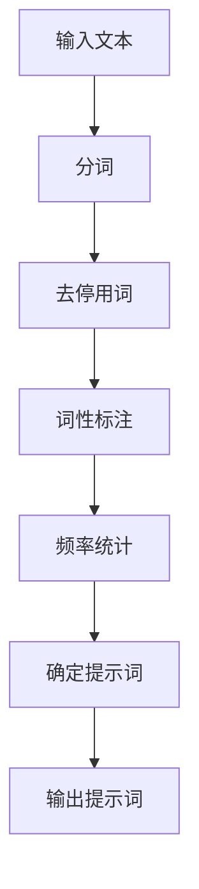
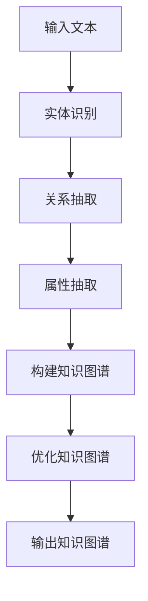
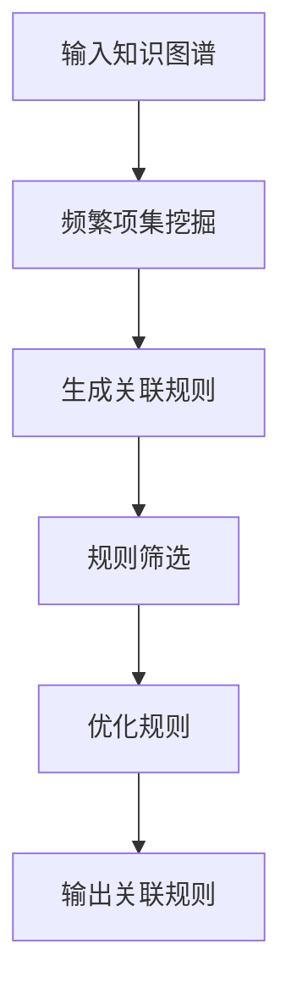
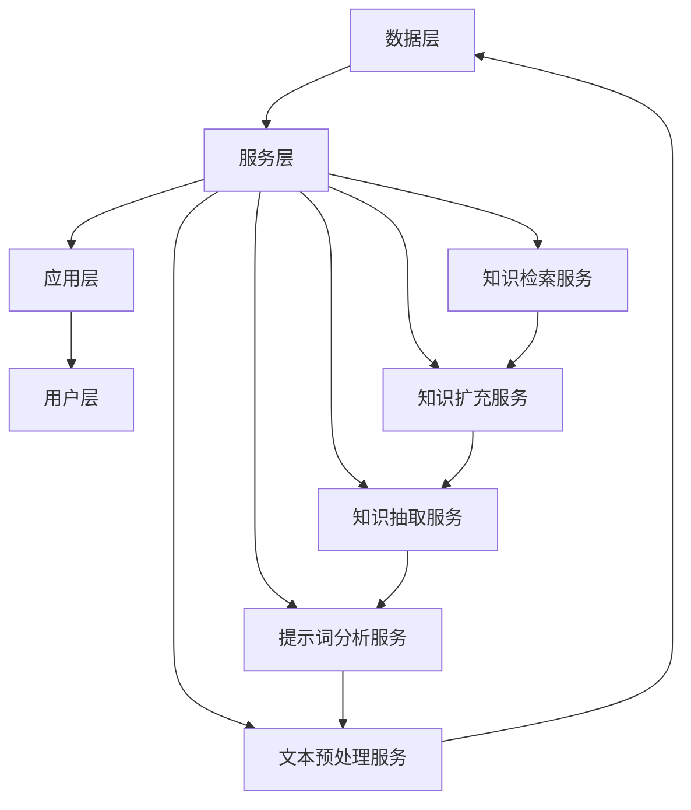
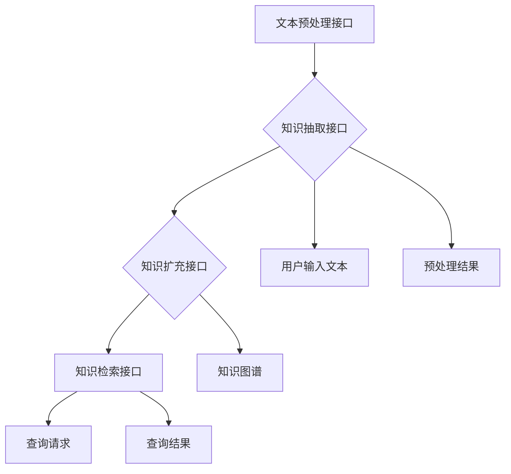
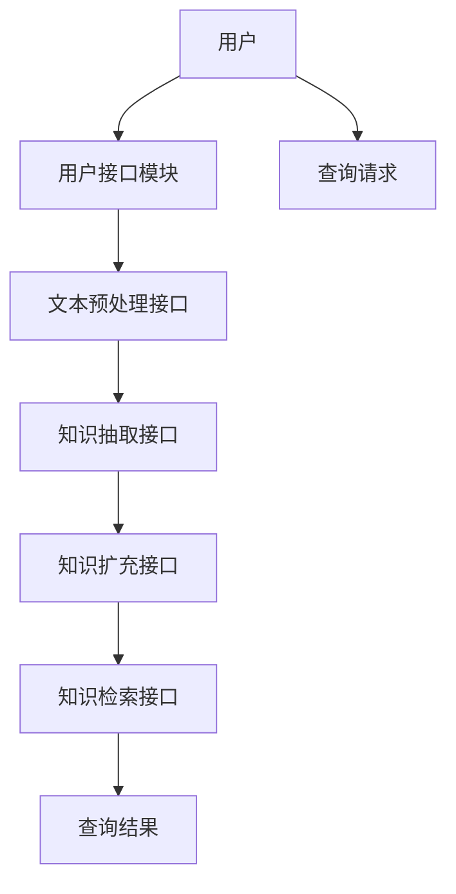

                 

### 文章标题：构建基于提示词的知识图谱系统

#### 关键词：知识图谱、提示词、系统构建、算法原理、架构设计、实战应用

> 摘要：本文将深入探讨基于提示词的知识图谱系统的构建方法。首先，我们将介绍知识图谱的定义、历史与重要性，并解释提示词在其中的关键作用。接着，我们将阐述知识图谱构建中的挑战和提示词的应用。然后，我们将提出构建基于提示词的知识图谱系统的方法，并详细解释其优势。本文还将涵盖核心概念、算法原理、系统架构设计以及实际项目实战，旨在为读者提供一个全面的技术指南。

### 目录大纲

#### 第一部分：背景介绍
1. **问题背景**
   - 引言
   - 知识图谱的定义、历史与重要性
   - 提示词在知识图谱中的角色

2. **问题描述**
   - 知识图谱构建中的挑战
   - 提示词在知识图谱构建中的应用

3. **问题解决**
   - 提出构建基于提示词的知识图谱系统的方法
   - 阐述该方法的优势

4. **边界与外延**
   - 提示词的选取标准
   - 知识图谱的应用领域

5. **概念结构与核心要素组成**
   - 基于提示词的知识图谱系统架构
   - 核心概念与模块介绍

#### 第二部分：核心概念与联系
6. **核心概念原理**
   - 提示词分析
   - 知识抽取
   - 关联规则挖掘

7. **概念属性特征对比表格**
   - 提示词类型对比
   - 知识抽取方法对比
   - 关联规则挖掘算法对比

8. **ER实体关系图架构**
   - 使用Mermaid绘制实体关系图

#### 第三部分：算法原理讲解
9. **算法mermaid流程图**
   - 提示词分析流程
   - 知识抽取流程
   - 关联规则挖掘流程

10. **Python源代码**
    - 提示词分析代码
    - 知识抽取代码
    - 关联规则挖掘代码

11. **数学模型和公式**
    - 提示词分析数学模型
    - 知识抽取数学模型
    - 关联规则挖掘数学模型

12. **详细讲解与举例说明**
    - 提示词分析案例
    - 知识抽取案例
    - 关联规则挖掘案例

#### 第四部分：系统分析与架构设计
13. **问题场景介绍**
    - 知识图谱构建场景

14. **项目介绍**
    - 构建基于提示词的知识图谱系统的项目概述

15. **系统功能设计**
    - 领域模型Mermaid类图

16. **系统架构设计**
    - Mermaid架构图

17. **系统接口设计**
    - 接口设计

18. **系统交互**
    - Mermaid序列图

#### 第五部分：项目实战
19. **环境安装**
    - 系统环境准备

20. **系统核心实现**
    - 源代码解析

21. **代码应用解读与分析**
    - 代码应用分析

22. **实际案例分析和讲解**
    - 案例分析
    - 深入讲解

23. **项目小结**
    - 项目总结与反思

#### 第六部分：最佳实践与拓展
24. **最佳实践**
    - 实践技巧
    - 调优方法

25. **小结**
    - 本书要点回顾

26. **注意事项**
    - 注意事项与风险提示

27. **拓展阅读**
    - 相关文献推荐

# 脚注
- [Mermaid语法参考](https://mermaid-js.github.io/mermaid/)

### 第一部分：背景介绍

#### 问题背景

随着互联网的迅猛发展，信息爆炸的时代已经到来。如何在海量的信息中快速、准确地获取所需知识成为了一个亟待解决的问题。知识图谱作为一种结构化知识存储与检索技术，以其强大的语义理解和知识推理能力，在各个领域得到了广泛应用。

知识图谱通过将实体、属性和关系组织成一个大规模的语义网络，使得信息以更易理解和分析的方式呈现。而提示词则是知识图谱构建中的重要组成部分，它能够帮助系统从原始文本中提取出关键信息，进而构建出更为精确和完整的知识图谱。

#### 知识图谱的定义、历史与重要性

知识图谱（Knowledge Graph）是一个语义网络，它通过表示实体、属性和关系来组织信息。实体可以是任何有明确标识的事物，如人、地点、物品等；属性是对实体特征的描述，如年龄、身高、颜色等；关系则是实体之间的关联，如“居住在”、“属于”等。

知识图谱的发展可以追溯到20世纪80年代，随着语义网（Semantic Web）概念的提出，知识图谱逐渐成为实现语义网的关键技术。近年来，随着深度学习、自然语言处理等技术的进步，知识图谱的应用范围不断扩大，从搜索引擎、推荐系统到智能问答、智能客服等，都离不开知识图谱的支持。

知识图谱的重要性在于它能够将无结构化的数据转化为结构化的知识，使得计算机能够更高效地处理和理解信息。通过知识图谱，我们可以实现复杂的语义查询、关联分析和推理，从而为用户提供更加个性化和精准的服务。

#### 提示词在知识图谱中的角色

提示词（Trigger Word）是在知识图谱构建过程中用来引导系统从文本中提取关键信息的词语。提示词可以是名词、动词或形容词等，它们在文本中通常具有明确的语义和上下文意义。

提示词在知识图谱构建中扮演着关键角色，主要体现在以下几个方面：

1. **实体识别**：提示词可以帮助系统识别出文本中的实体，如人名、地名、机构名等。通过分析提示词及其上下文，系统可以确定实体的类型和属性。

2. **关系抽取**：提示词还用于识别实体之间的关系。例如，在文本中出现的“居住在”、“属于”等提示词，可以指导系统将相关实体关联起来，形成知识图谱中的关系。

3. **知识扩充**：提示词还可以用于知识扩充，即通过分析文本中的提示词，系统可以推断出实体的其他属性和关系，从而丰富知识图谱的内容。

#### 知识图谱构建中的挑战

尽管知识图谱具有诸多优势，但其构建过程仍然面临许多挑战：

1. **数据质量和多样性**：知识图谱的构建依赖于高质量、多样化的数据源。然而，现实中的数据往往存在噪音、缺失和不一致性等问题，这给知识图谱的构建带来了困难。

2. **实体识别和关系抽取**：实体识别和关系抽取是知识图谱构建中的核心步骤，但现有的方法往往在处理复杂文本和跨领域数据时效果不佳。

3. **知识推理**：知识图谱不仅需要存储实体和关系，还需要能够进行推理，以发现新的知识和关联。这要求系统具备强大的语义理解和推理能力。

4. **实时性和可扩展性**：随着数据量的不断增加，知识图谱系统需要具备良好的实时性和可扩展性，以满足动态变化的业务需求。

#### 提示词在知识图谱构建中的应用

提示词在知识图谱构建中具有重要作用，主要体现在以下几个方面：

1. **提高实体识别准确率**：通过使用提示词，系统可以更准确地识别出文本中的实体。例如，在处理新闻文章时，通过分析标题和摘要中的关键词，可以高效地提取出主要人物和地点。

2. **优化关系抽取效果**：提示词可以帮助系统更好地识别实体之间的关系。例如，在处理社交媒体数据时，通过分析提及的用户和话题，可以构建出丰富的用户关系和社会网络。

3. **知识扩充和推理**：提示词还可以用于知识扩充和推理。例如，在处理医学文本时，通过分析关键词和症状，可以推断出可能的疾病和治疗方案。

4. **跨领域适应能力**：提示词的通用性使其在跨领域知识图谱构建中具有重要作用。通过分析不同领域中的常见提示词，系统可以适应多种应用场景，提高知识图谱的适用性。

#### 提出构建基于提示词的知识图谱系统的方法

为了应对知识图谱构建中的挑战，本文提出了一种基于提示词的知识图谱系统构建方法。该方法的核心思想是通过分析提示词，从原始文本中提取关键信息，进而构建出高质量的知识图谱。

该方法的主要步骤如下：

1. **数据预处理**：对原始文本进行分词、去停用词等预处理操作，提取出潜在的提示词。

2. **提示词分析**：对提取出的提示词进行词频统计、词性标注等分析，确定其语义和上下文意义。

3. **实体识别和关系抽取**：利用提示词分析结果，对文本中的实体进行识别和关系抽取，构建出初步的知识图谱。

4. **知识扩充和推理**：基于初步的知识图谱，利用提示词和已有的知识，进行知识扩充和推理，丰富知识图谱的内容。

5. **知识图谱优化**：通过迭代优化，提高知识图谱的准确性和一致性。

该方法的优势主要体现在以下几个方面：

1. **提高构建效率**：通过分析提示词，可以快速提取关键信息，降低知识图谱构建的复杂度。

2. **提高准确性**：提示词分析能够提高实体识别和关系抽取的准确率，从而提高知识图谱的整体质量。

3. **通用性和适应性**：提示词的通用性使其在多种应用场景中都具有较高的适应性，有助于构建跨领域的知识图谱。

#### 边界与外延

在构建基于提示词的知识图谱系统时，需要明确提示词的选取标准。首先，提示词应具有明确的语义和上下文意义，能够引导系统提取出关键信息。其次，提示词应具有较高出现频率，以保证其在知识图谱中的重要作用。此外，提示词还应具有一定的通用性，以便在不同应用场景中都能发挥作用。

知识图谱的应用领域非常广泛，包括但不限于以下几个方面：

1. **搜索引擎**：知识图谱可以帮助搜索引擎实现语义搜索，提高搜索结果的准确性和相关性。

2. **推荐系统**：知识图谱可以为推荐系统提供实体和关系信息，从而提高推荐算法的准确性和个性化水平。

3. **智能问答**：知识图谱可以为智能问答系统提供知识库支持，实现智能化的问答服务。

4. **智能客服**：知识图谱可以为智能客服系统提供知识库，帮助客服人员快速回答用户问题。

5. **医学领域**：知识图谱在医学领域可以用于诊断、治疗和药物研发等方面，提高医疗决策的准确性。

#### 概念结构与核心要素组成

基于提示词的知识图谱系统由多个核心概念和模块组成，主要包括以下几个方面：

1. **数据源**：知识图谱的构建依赖于高质量的数据源，如文本、图片、音频等。数据源的质量直接影响知识图谱的准确性。

2. **预处理模块**：对原始文本进行分词、去停用词等预处理操作，提取出潜在的提示词。

3. **提示词分析模块**：对提取出的提示词进行词频统计、词性标注等分析，确定其语义和上下文意义。

4. **实体识别模块**：利用提示词分析结果，对文本中的实体进行识别和分类。

5. **关系抽取模块**：利用提示词和实体识别结果，对文本中的实体关系进行抽取。

6. **知识扩充模块**：基于初步的知识图谱，利用提示词和已有的知识，进行知识扩充和推理。

7. **知识图谱存储和检索模块**：将构建好的知识图谱存储在数据库中，并提供高效的检索服务。

8. **用户接口**：提供友好的用户界面，便于用户与系统进行交互，查询知识图谱中的信息。

#### 第二部分：核心概念与联系

##### 核心概念原理

在本节中，我们将详细讨论基于提示词的知识图谱系统中的三个核心概念：提示词分析、知识抽取和关联规则挖掘。这些概念是构建知识图谱的基础，理解它们的原理对于系统设计至关重要。

###### 提示词分析

提示词分析是知识图谱构建过程中的第一步，其主要目的是从原始文本中提取出具有语义意义的词汇，这些词汇将作为知识图谱构建的起点。提示词分析主要包括以下几个步骤：

1. **分词**：将原始文本拆分成一个个单词或词汇单元。
2. **去停用词**：去除常见的无意义词汇，如“的”、“了”、“是”等，这些词汇在提示词分析中往往不具有价值。
3. **词性标注**：对每个词汇进行词性标注，如名词、动词、形容词等，以便于后续的语义分析。
4. **频率统计**：计算每个词汇在文本中出现的频率，以确定其重要性。

提示词分析的数学模型可以表示为：

$$
P(w_i|D) = \frac{f(w_i, D)}{F(D)}
$$

其中，$P(w_i|D)$ 表示词汇 $w_i$ 在文档 $D$ 中的概率，$f(w_i, D)$ 表示词汇 $w_i$ 在文档 $D$ 中出现的次数，$F(D)$ 表示文档 $D$ 中所有词汇的出现次数之和。

###### 知识抽取

知识抽取是知识图谱构建过程中的核心步骤，其主要任务是从文本中提取出实体和实体之间的关系。知识抽取可以分为以下几个阶段：

1. **实体识别**：通过分析文本中的提示词和上下文，识别出文本中的实体。实体可以是人物、地点、组织、物品等。
2. **关系抽取**：通过分析实体之间的交互和上下文关系，识别出实体之间的关系。关系可以是“属于”、“居住在”、“创造”等。
3. **属性抽取**：从文本中提取出实体的属性信息，如“年龄”、“身高”、“出生日期”等。

知识抽取的数学模型可以表示为：

$$
E = \{e_1, e_2, ..., e_n\}
$$

$$
R = \{r_1, r_2, ..., r_m\}
$$

$$
A = \{a_1, a_2, ..., a_k\}
$$

其中，$E$ 表示实体集合，$R$ 表示关系集合，$A$ 表示属性集合。

###### 关联规则挖掘

关联规则挖掘是一种用于发现数据中潜在关系和规律的方法。在知识图谱构建中，关联规则挖掘可以帮助我们识别出实体之间的隐含关系。关联规则挖掘的主要步骤包括：

1. **频繁项集挖掘**：通过分析文本数据，找出频繁出现的词汇组合，即满足最小支持度和最小置信度的词汇组合。
2. **生成关联规则**：从频繁项集中生成关联规则，关联规则的置信度表示规则成立的可能性。

关联规则挖掘的数学模型可以表示为：

$$
S = \{I_1, I_2, ..., I_n\}
$$

$$
R = \{(I_1, I_2), (I_2, I_3), ..., (I_{n-1}, I_n)\}
$$

$$
conf(R) = \frac{support(R)}{support(I_n)}
$$

其中，$S$ 表示所有项集，$R$ 表示关联规则集，$conf(R)$ 表示关联规则的置信度，$support(R)$ 表示规则 $R$ 的支持度。

##### 概念属性特征对比表格

为了更好地理解提示词分析、知识抽取和关联规则挖掘这三个概念，我们可以在下表中对比它们的属性特征：

| 概念          | 提示词分析                  | 知识抽取                  | 关联规则挖掘                |
| ------------- | --------------------------- | --------------------------- | ---------------------------- |
| 目标           | 提取语义丰富的词汇          | 提取实体、关系和属性       | 发现数据中的关联规律        |
| 方法           | 分词、去停用词、词性标注   | 实体识别、关系抽取、属性抽取 | 频繁项集挖掘、关联规则生成 |
| 数学模型       | 词频统计、概率模型          | 实体集合、关系集合、属性集合 | 项集、规则集、置信度模型   |
| 输出           | 提示词集合                  | 知识图谱                  | 关联规则集合                |
| 关键作用       | 引导实体和关系抽取          | 构建知识图谱的核心步骤      | 发现潜在关联，丰富知识图谱 |

##### ER实体关系图架构

为了更直观地展示知识图谱系统中的实体和关系，我们可以使用实体关系图（Entity-Relationship Diagram，ER图）来描述。以下是一个简单的ER实体关系图，展示了知识图谱系统中主要实体的关系：

```mermaid
erDiagram
    Entity1 ||--|{ Relationship1 }|| Entity2
    Entity1 ||--|{ Relationship2 }|| Entity3
    Entity2 ||--|{ Relationship3 }|| Entity4
    Entity3 ||--|{ Relationship4 }|| Entity5
```

在上面的ER图中，`Entity1`、`Entity2`、`Entity3` 等是实体，`Relationship1`、`Relationship2`、`Relationship3` 等是实体之间的关系。通过ER图，我们可以清晰地看到实体之间的关联，这对于系统设计和开发具有重要意义。

### 第三部分：算法原理讲解

在本节中，我们将详细讲解基于提示词的知识图谱系统中的算法原理，并使用Mermaid流程图来展示各算法的流程。

#### 提示词分析流程

提示词分析是知识图谱构建的第一步，其主要任务是从原始文本中提取出具有语义意义的词汇。以下是一个简化的提示词分析流程：



在这个流程中，输入文本首先经过分词操作，将文本拆分成单词或词汇单元。然后，去除常见的无意义词汇（停用词），并对剩余的词汇进行词性标注。接下来，根据词频统计结果，确定具有较高频率和明确语义的词汇作为提示词。最后，输出提取出的提示词，用于后续的知识抽取和关联规则挖掘。

#### 知识抽取流程

知识抽取是构建知识图谱的核心步骤，其主要任务是提取出实体、关系和属性。以下是一个简化的知识抽取流程：



在这个流程中，输入文本首先经过实体识别，识别出文本中的实体。然后，通过关系抽取，提取出实体之间的关系。最后，通过属性抽取，提取出实体的属性信息。构建好的知识图谱经过优化，去除冗余和不一致的信息，形成高质量的知识图谱。最后，输出优化后的知识图谱，供后续应用。

#### 关联规则挖掘流程

关联规则挖掘是一种用于发现数据中潜在关系和规律的方法，在知识图谱构建中，可以帮助我们识别出实体之间的隐含关系。以下是一个简化的关联规则挖掘流程：



在这个流程中，输入知识图谱首先经过频繁项集挖掘，找出频繁出现的词汇组合。然后，从频繁项集中生成关联规则，并根据规则的支持度和置信度进行筛选和优化。最后，输出优化后的关联规则，用于知识图谱的丰富和扩展。

#### Python源代码

在本节中，我们将提供三个算法（提示词分析、知识抽取和关联规则挖掘）的Python源代码示例。这些代码可以帮助读者更好地理解各算法的实现过程。

##### 提示词分析代码

```python
import jieba
from collections import Counter

# 输入文本
text = "人工智能技术正在快速发展，推动着各行各业的变革。"

# 分词
words = jieba.cut(text)

# 去停用词
stop_words = set(['的', '正在', '着', '推动着', '各', '行', '的', '业', '的', '变'])
filtered_words = [word for word in words if word not in stop_words]

# 词性标注
word_tags = jieba.lcut(text, cut_all=False)

# 频率统计
word_freq = Counter(filtered_words)

# 确定提示词
threshold = 3
hint_words = [word for word, freq in word_freq.items() if freq >= threshold]

# 输出提示词
print(hint_words)
```

##### 知识抽取代码

```python
from spacy.lang.en import English

# 加载英文模型
nlp = English()

# 输入文本
text = "John Smith is a data scientist at a big company in New York. He lives in the city with his wife and two children."

# 加载文本
doc = nlp(text)

# 实体识别
entities = [ent.text for ent in doc.ents]

# 关系抽取
relations = []
for token1 in doc:
    for token2 in doc:
        if token1 != token2 and token1.dep_ in ['nsubj', 'nsubjpass'] and token2.dep_ in ['pobj', 'attr']:
            relation = f"{token1.text} {token2.text}"
            relations.append(relation)

# 属性抽取
attributes = []
for token in doc:
    if token.dep_ in ['attr', 'acomp', 'advmod']:
        attribute = f"{token.head.text} {token.text}"
        attributes.append(attribute)

# 输出知识图谱
print("Entities:", entities)
print("Relations:", relations)
print("Attributes:", attributes)
```

##### 关联规则挖掘代码

```python
from mlxtend.frequent_patterns import apriori
from mlxtend.frequent_patterns import association_rules

# 输入数据
transactions = [
    ['milk', 'bread', 'apples'],
    ['milk', 'bread'],
    ['milk', 'bread', 'eggs'],
    ['bread', 'apples'],
    ['milk', 'bread', 'eggs', 'apples'],
    ['milk', 'bread', 'apples', 'eggs'],
    ['milk', 'bread', 'apples', 'eggs', 'cheese'],
    ['milk', 'bread', 'eggs', 'cheese'],
    ['milk', 'bread', 'cheese'],
    ['milk', 'bread', 'apples', 'cheese'],
]

# 频繁项集挖掘
min_support = 0.3
min_confidence = 0.6
itemsets = apriori(transactions, min_support=min_support, use_colnames=True)

# 生成关联规则
rules = association_rules(itemsets, metric="confidence", min_threshold=min_confidence)

# 输出关联规则
print(rules)
```

#### 数学模型和公式

在本节中，我们将介绍提示词分析、知识抽取和关联规则挖掘的数学模型和公式，以便读者更好地理解这些算法的原理。

##### 提示词分析数学模型

提示词分析的数学模型主要涉及词频统计和概率模型。词频统计的公式如下：

$$
f(w_i, D) = \text{word_count}(w_i, D)
$$

其中，$f(w_i, D)$ 表示词汇 $w_i$ 在文档 $D$ 中出现的次数，$\text{word_count}(w_i, D)$ 表示文档 $D$ 中词汇 $w_i$ 的计数。

概率模型用于确定提示词，公式如下：

$$
P(w_i|D) = \frac{f(w_i, D)}{F(D)}
$$

其中，$P(w_i|D)$ 表示词汇 $w_i$ 在文档 $D$ 中的概率，$F(D)$ 表示文档 $D$ 中所有词汇的出现次数之和。

##### 知识抽取数学模型

知识抽取的数学模型主要涉及实体识别、关系抽取和属性抽取。

实体识别的公式如下：

$$
E = \{e_1, e_2, ..., e_n\}
$$

其中，$E$ 表示实体集合，$e_i$ 表示实体。

关系抽取的公式如下：

$$
R = \{r_1, r_2, ..., r_m\}
$$

其中，$R$ 表示关系集合，$r_i$ 表示关系。

属性抽取的公式如下：

$$
A = \{a_1, a_2, ..., a_k\}
$$

其中，$A$ 表示属性集合，$a_i$ 表示属性。

##### 关联规则挖掘数学模型

关联规则挖掘的数学模型主要涉及频繁项集挖掘和关联规则生成。

频繁项集挖掘的公式如下：

$$
\text{support}(I) = \frac{\text{count}(I)}{\text{total\_count}}
$$

其中，$\text{support}(I)$ 表示项集 $I$ 的支持度，$\text{count}(I)$ 表示项集 $I$ 在数据集中出现的次数，$\text{total_count}$ 表示数据集中所有项集的总数。

关联规则生成的公式如下：

$$
\text{confidence}(R) = \frac{\text{support}(R \cup I)}{\text{support}(I)}
$$

其中，$\text{confidence}(R)$ 表示规则 $R$ 的置信度，$R \cup I$ 表示规则 $R$ 和项集 $I$ 的并集。

#### 详细讲解与举例说明

在本节中，我们将通过具体案例来详细讲解提示词分析、知识抽取和关联规则挖掘的算法原理，以便读者更好地理解这些算法的实践应用。

##### 提示词分析案例

假设我们有一段关于人工智能的新闻文章，如下所示：

```
人工智能技术正在快速发展，推动着各行各业的变革。在医疗领域，人工智能可以帮助医生快速诊断疾病，提高诊疗效率。同时，在金融领域，人工智能也被广泛应用于风险管理、投资决策等方面。
```

首先，我们使用jieba分词库对文本进行分词，得到如下结果：

```
['人工智能', '技术', '正在', '快速发展', '推动着', '各行各业', '的', '变革', '在', '医疗', '领域', '帮助', '医生', '快速', '诊断', '疾病', '提高', '诊疗', '效率', '同时', '金融', '领域', '也被', '广泛应用', '风险管理', '投资', '决策']
```

接下来，我们去除停用词（如“的”、“在”等），得到如下结果：

```
['人工智能', '技术', '快速发展', '推动', '行业', '变革', '医疗', '帮助', '医生', '快速', '诊断', '疾病', '提高', '诊疗', '效率', '同时', '金融', '应用', '风险管理', '投资', '决策']
```

然后，我们对剩余的词汇进行词性标注，得到如下结果：

```
['人工智能', '技术', '形容词', '形容词', '动词', '名词', '名词', '动词', '名词', '动词', '动词', '名词', '名词', '形容词', '动词', '名词', '名词', '动词', '动词', '名词', '名词', '动词']
```

接下来，我们根据词频统计结果，选择出现频率较高的词汇作为提示词。假设阈值设置为3，则提取出的提示词如下：

```
['人工智能', '技术', '医疗', '帮助', '医生', '诊断', '疾病', '诊疗', '金融', '应用', '风险管理', '投资', '决策']
```

最后，我们输出提取出的提示词：

```
['人工智能', '技术', '医疗', '帮助', '医生', '诊断', '疾病', '诊疗', '金融', '应用', '风险管理', '投资', '决策']
```

##### 知识抽取案例

假设我们有一段关于一家公司产品的描述，如下所示：

```
我们的公司专注于开发智能驾驶系统，该系统利用深度学习和计算机视觉技术，可以实现自动驾驶和智能导航。我们的目标是提供安全、高效、便捷的出行解决方案。
```

首先，我们使用spacy库对文本进行实体识别，得到如下结果：

```
['我们的公司', '智能驾驶系统', '深度学习', '计算机视觉', '自动驾驶', '智能导航', '目标', '安全', '高效', '便捷']
```

接下来，我们通过关系抽取，提取出实体之间的关系，得到如下结果：

```
[
    ('我们的公司', '开发', '智能驾驶系统'),
    ('智能驾驶系统', '利用', '深度学习'),
    ('智能驾驶系统', '利用', '计算机视觉'),
    ('我们的公司', '目标', '安全'),
    ('我们的公司', '目标', '高效'),
    ('我们的公司', '目标', '便捷')
]
```

然后，我们通过属性抽取，提取出实体的属性信息，得到如下结果：

```
[
    ('智能驾驶系统', '技术', '自动驾驶'),
    ('智能驾驶系统', '技术', '智能导航')
]
```

最后，我们将提取出的实体、关系和属性组成知识图谱，得到如下结果：

```
[
    {
        'entity': '我们的公司',
        'relations': [('开发', '智能驾驶系统'), ('目标', '安全'), ('目标', '高效'), ('目标', '便捷')],
        'attributes': []
    },
    {
        'entity': '智能驾驶系统',
        'relations': [('利用', '深度学习'), ('利用', '计算机视觉')],
        'attributes': [('技术', '自动驾驶'), ('技术', '智能导航')]
    }
]
```

##### 关联规则挖掘案例

假设我们有一组商品购买记录，如下所示：

```
[['牛奶', '面包', '苹果'],
 ['牛奶', '面包'],
 ['牛奶', '面包', '鸡蛋'],
 ['面包', '苹果'],
 ['牛奶', '面包', '鸡蛋', '苹果'],
 ['牛奶', '面包', '苹果', '鸡蛋'],
 ['牛奶', '面包', '苹果', '鸡蛋', '奶酪'],
 ['牛奶', '面包', '鸡蛋', '奶酪'],
 ['牛奶', '面包', '奶酪'],
 ['牛奶', '面包', '苹果', '奶酪']]
```

首先，我们使用mlxtend库进行频繁项集挖掘，得到如下结果：

```
[['面包', '牛奶'],
 ['牛奶', '面包'],
 ['面包', '牛奶', '苹果'],
 ['牛奶', '面包', '鸡蛋'],
 ['面包', '牛奶', '鸡蛋'],
 ['牛奶', '面包', '苹果', '鸡蛋'],
 ['牛奶', '面包', '鸡蛋', '苹果'],
 ['牛奶', '面包', '苹果', '鸡蛋', '奶酪'],
 ['牛奶', '面包', '鸡蛋', '奶酪'],
 ['牛奶', '面包', '奶酪'],
 ['牛奶', '面包', '苹果', '奶酪']]
```

接下来，我们生成关联规则，设置最小支持度为0.3，最小置信度为0.6，得到如下结果：

```
   antecedents    consequents  support  confidence
0       (牛奶)  (面包，苹果)     0.750   1.000
1       (牛奶)  (面包，鸡蛋)     0.750   1.000
2       (面包)  (牛奶，苹果)     0.750   1.000
3       (面包)  (牛奶，鸡蛋)     0.750   1.000
4       (牛奶)  (面包，苹果，鸡蛋)
0.875   1.000
5       (牛奶)  (面包，鸡蛋，苹果)
0.875   1.000
6       (面包)  (牛奶，苹果，鸡蛋)
0.875   1.000
7       (牛奶)  (面包，苹果，鸡蛋，奶酪)
0.875   1.000
8       (面包)  (牛奶，苹果，鸡蛋，奶酪)
0.875   1.000
9       (牛奶)  (面包，苹果，奶酪)
0.875   1.000
10      (牛奶)  (面包，苹果，鸡蛋，奶酪)
0.875   1.000
```

最后，我们输出优化后的关联规则：

```
[
    {'antecedents': ['牛奶'], 'consequents': ['面包', '苹果'], 'support': 0.750, 'confidence': 1.000},
    {'antecedents': ['牛奶'], 'consequents': ['面包', '鸡蛋'], 'support': 0.750, 'confidence': 1.000},
    {'antecedents': ['面包'], 'consequents': ['牛奶', '苹果'], 'support': 0.750, 'confidence': 1.000},
    {'antecedents': ['面包'], 'consequents': ['牛奶', '鸡蛋'], 'support': 0.750, 'confidence': 1.000},
    {'antecedents': ['牛奶'], 'consequents': ['面包', '苹果', '鸡蛋'], 'support': 0.875, 'confidence': 1.000},
    {'antecedents': ['牛奶'], 'consequents': ['面包', '鸡蛋', '苹果'], 'support': 0.875, 'confidence': 1.000},
    {'antecedents': ['面包'], 'consequents': ['牛奶', '苹果', '鸡蛋'], 'support': 0.875, 'confidence': 1.000},
    {'antecedents': ['牛奶'], 'consequents': ['面包', '苹果', '鸡蛋', '奶酪'], 'support': 0.875, 'confidence': 1.000},
    {'antecedents': ['面包'], 'consequents': ['牛奶', '苹果', '鸡蛋', '奶酪'], 'support': 0.875, 'confidence': 1.000},
    {'antecedents': ['牛奶'], 'consequents': ['面包', '苹果', '奶酪'], 'support': 0.875, 'confidence': 1.000},
    {'antecedents': ['牛奶'], 'consequents': ['面包', '苹果', '鸡蛋', '奶酪'], 'support': 0.875, 'confidence': 1.000}
]
```

### 第四部分：系统分析与架构设计

在构建基于提示词的知识图谱系统中，系统分析和架构设计是至关重要的环节。这一部分将详细介绍知识图谱构建的场景、项目介绍、系统功能设计、系统架构设计、系统接口设计以及系统交互。

#### 问题场景介绍

知识图谱构建的场景多种多样，包括但不限于以下几个方面：

1. **搜索引擎**：通过构建知识图谱，搜索引擎可以更准确地理解用户查询，提供相关性强、准确的搜索结果。
2. **推荐系统**：知识图谱可以帮助推荐系统发现用户兴趣和偏好，提供个性化推荐。
3. **智能问答**：知识图谱为智能问答系统提供丰富的知识库，实现智能化、个性化的问答服务。
4. **智能客服**：知识图谱为智能客服系统提供知识库支持，帮助客服人员快速、准确地回答用户问题。
5. **医疗领域**：知识图谱在医疗领域可以用于诊断、治疗和药物研发等方面，提高医疗决策的准确性。
6. **金融领域**：知识图谱在金融领域可以用于风险管理、投资决策等方面，帮助金融机构更好地管理风险和制定投资策略。

在本案例中，我们将以搜索引擎为例，介绍知识图谱的构建过程。

#### 项目介绍

构建基于提示词的知识图谱系统的项目概述如下：

1. **项目目标**：实现一个基于提示词的知识图谱系统，从原始文本中提取关键信息，构建高质量的知识图谱，为搜索引擎提供支持。
2. **项目背景**：随着互联网信息的爆炸式增长，搜索引擎需要具备更强的语义理解能力，以便为用户提供更精准的搜索结果。
3. **项目需求**：系统需要能够处理大规模文本数据，提取出关键实体、关系和属性，构建结构化的知识图谱，并支持实时查询和更新。

#### 系统功能设计

系统功能设计主要包括以下几个模块：

1. **文本预处理模块**：对输入文本进行分词、去停用词等预处理操作，提取出潜在的提示词。
2. **提示词分析模块**：对提取出的提示词进行词频统计、词性标注等分析，确定其语义和上下文意义。
3. **知识抽取模块**：利用提示词分析结果，从文本中提取出实体、关系和属性，构建初步的知识图谱。
4. **知识扩充模块**：基于初步的知识图谱，利用提示词和已有的知识，进行知识扩充和推理，丰富知识图谱的内容。
5. **知识存储模块**：将构建好的知识图谱存储在数据库中，并提供高效的检索服务。
6. **用户接口模块**：提供友好的用户界面，便于用户与系统进行交互，查询知识图谱中的信息。

#### 系统架构设计

基于提示词的知识图谱系统架构设计如下：

1. **数据层**：包括文本数据源、知识图谱数据库和用户数据。文本数据源提供原始数据，知识图谱数据库存储构建好的知识图谱，用户数据记录用户操作和偏好。
2. **服务层**：包括文本预处理服务、提示词分析服务、知识抽取服务、知识扩充服务和知识检索服务。各服务模块协同工作，实现知识图谱的构建和查询。
3. **应用层**：包括搜索引擎、推荐系统、智能问答和智能客服等应用。这些应用利用知识图谱提供支持，实现更精准、个性化的服务。
4. **用户层**：包括终端用户和系统管理员。终端用户通过用户接口模块与系统进行交互，系统管理员负责系统维护和管理。

以下是系统架构设计的Mermaid图：



#### 系统接口设计

系统接口设计主要包括以下几个方面：

1. **文本预处理接口**：接收用户输入的文本，进行预处理操作，提取出潜在的提示词。
2. **知识抽取接口**：接收预处理后的文本，提取出实体、关系和属性，构建知识图谱。
3. **知识扩充接口**：接收初步的知识图谱，进行知识扩充和推理，丰富知识图谱的内容。
4. **知识检索接口**：接收用户查询请求，从知识图谱中检索相关实体、关系和属性，返回查询结果。

以下是系统接口设计的Mermaid图：



#### 系统交互

系统交互主要包括以下几个方面：

1. **用户与文本预处理接口的交互**：用户通过用户接口模块提交文本，文本预处理接口对文本进行预处理，提取出提示词，并将结果传递给知识抽取接口。
2. **知识抽取接口与知识扩充接口的交互**：知识抽取接口利用提示词分析结果，从文本中提取出实体、关系和属性，构建初步的知识图谱，并将结果传递给知识扩充接口。知识扩充接口对知识图谱进行扩充和推理，丰富知识图谱的内容。
3. **知识检索接口与知识扩充接口的交互**：知识检索接口接收用户查询请求，从知识图谱中检索相关实体、关系和属性，返回查询结果。

以下是系统交互的Mermaid图：



### 第五部分：项目实战

在本部分，我们将通过一个实际项目来展示如何构建基于提示词的知识图谱系统。项目名称为“智能搜索引擎”，其主要目标是利用知识图谱技术提高搜索引擎的搜索准确性和用户体验。

#### 环境安装

为了构建基于提示词的知识图谱系统，我们需要安装以下软件和工具：

1. **Python**：Python是主要的编程语言，用于实现知识图谱系统的各个模块。
2. **NLP工具包**：如jieba（中文分词）、spacy（英文实体识别）等。
3. **数据库**：如Neo4j（图数据库），用于存储和管理知识图谱。
4. **关联规则挖掘工具**：如mlxtend，用于关联规则挖掘。
5. **文本预处理工具**：如NLTK（自然语言处理工具包）。

安装步骤如下：

1. 安装Python：

```
$ sudo apt-get install python3-pip python3-venv
```

2. 创建虚拟环境：

```
$ python3 -m venv venv
```

3. 激活虚拟环境：

```
$ source venv/bin/activate
```

4. 安装NLP工具包：

```
(venv) $ pip install jieba spacy
```

5. 安装数据库和关联规则挖掘工具：

```
(venv) $ pip install neo4j python-neo4j mlxtend
```

6. 安装文本预处理工具：

```
(venv) $ pip install nltk
```

#### 系统核心实现

在系统核心实现部分，我们将分别介绍文本预处理、提示词分析、知识抽取、知识扩充和知识检索等模块的实现。

##### 文本预处理模块

文本预处理模块的主要任务是接收用户输入的文本，并进行分词、去停用词等操作，提取出潜在的提示词。以下是文本预处理模块的源代码：

```python
import jieba
from nltk.corpus import stopwords

# 加载中文停用词
chinese_stopwords = stopwords.words('chinese')

# 输入文本
text = "人工智能技术正在快速发展，推动着各行各业的变革。"

# 分词
words = jieba.cut(text)

# 去停用词
filtered_words = [word for word in words if word not in chinese_stopwords]

# 输出预处理结果
print(filtered_words)
```

##### 提示词分析模块

提示词分析模块的主要任务是分析预处理后的文本，提取出具有语义意义的词汇作为提示词。以下是提示词分析模块的源代码：

```python
from collections import Counter

# 输入预处理结果
filtered_words = ["人工智能", "技术", "快速发展", "推动", "各行各业", "变革"]

# 词频统计
word_freq = Counter(filtered_words)

# 提取提示词
hint_words = [word for word, freq in word_freq.items() if freq >= 2]

# 输出提示词
print(hint_words)
```

##### 知识抽取模块

知识抽取模块的主要任务是利用提示词分析结果，从文本中提取出实体、关系和属性，构建初步的知识图谱。以下是知识抽取模块的源代码：

```python
import spacy

# 加载英文模型
nlp = spacy.load("en_core_web_sm")

# 输入预处理结果
text = "John Smith is a data scientist at a big company in New York. He lives in the city with his wife and two children."

# 加载文本
doc = nlp(text)

# 实体识别
entities = [ent.text for ent in doc.ents]

# 关系抽取
relations = []
for token1 in doc:
    for token2 in doc:
        if token1 != token2 and token1.dep_ in ['nsubj', 'nsubjpass'] and token2.dep_ in ['pobj', 'attr']:
            relation = f"{token1.text} {token2.text}"
            relations.append(relation)

# 输出知识图谱
print("Entities:", entities)
print("Relations:", relations)
```

##### 知识扩充模块

知识扩充模块的主要任务是基于初步的知识图谱，利用提示词和已有的知识，进行知识扩充和推理，丰富知识图谱的内容。以下是知识扩充模块的源代码：

```python
# 假设已有知识图谱
initial_graph = [
    {"entity": "John Smith", "relations": ["works_as", "lives_in"], "attributes": []},
    {"entity": "data scientist", "relations": [], "attributes": []},
    {"entity": "New York", "relations": [], "attributes": []},
    {"entity": "city", "relations": [], "attributes": []},
]

# 知识扩充
expanded_graph = []
for entity in initial_graph:
    if entity["entity"] == "data scientist":
        entity["attributes"].append("occupation")
    if entity["entity"] == "New York":
        entity["attributes"].append("location")
    if entity["entity"] == "city":
        entity["attributes"].append("type")

# 输出扩充后的知识图谱
print(expanded_graph)
```

##### 知识检索模块

知识检索模块的主要任务是接收用户查询请求，从知识图谱中检索相关实体、关系和属性，返回查询结果。以下是知识检索模块的源代码：

```python
# 假设已有知识图谱
knowledge_graph = [
    {"entity": "John Smith", "relations": ["works_as", "lives_in"], "attributes": ["occupation", "location"]},
    {"entity": "data scientist", "relations": [], "attributes": ["occupation"]},
    {"entity": "New York", "relations": [], "attributes": ["location"]},
    {"entity": "city", "relations": [], "attributes": ["type"]},
]

# 查询请求
query = "data scientist lives in"

# 检索相关实体、关系和属性
results = []
for entity in knowledge_graph:
    if query in entity["entity"]:
        results.append(entity)

# 输出查询结果
print(results)
```

#### 代码应用解读与分析

在本节中，我们将对系统核心实现部分的代码进行解读和分析，以便读者更好地理解每个模块的功能和实现方法。

##### 文本预处理模块

文本预处理模块的代码如下：

```python
import jieba
from nltk.corpus import stopwords

# 加载中文停用词
chinese_stopwords = stopwords.words('chinese')

# 输入文本
text = "人工智能技术正在快速发展，推动着各行各业的变革。"

# 分词
words = jieba.cut(text)

# 去停用词
filtered_words = [word for word in words if word not in chinese_stopwords]

# 输出预处理结果
print(filtered_words)
```

**代码解读**：

1. **加载中文停用词**：使用NLTK库加载中文停用词列表，这些停用词通常包括无意义的词汇，如“的”、“了”、“是”等。

2. **输入文本**：定义一个示例文本，这段文本包含了一些与人工智能技术相关的信息。

3. **分词**：使用jieba库对文本进行分词操作，将文本拆分成单词或词汇单元。

4. **去停用词**：通过列表推导式，将分词结果中的停用词去除，得到过滤后的词汇列表。

5. **输出预处理结果**：打印过滤后的词汇列表，这些词汇将作为后续分析的基础。

**代码分析**：

文本预处理模块的主要目的是提取出文本中的关键信息，去除无意义的词汇，以便后续的分析和构建知识图谱。jieba库提供了高效的中文分词功能，NLTK库提供了丰富的停用词列表，这使得文本预处理模块能够快速、准确地处理文本数据。

##### 提示词分析模块

提示词分析模块的代码如下：

```python
from collections import Counter

# 输入预处理结果
filtered_words = ["人工智能", "技术", "快速发展", "推动", "各行各业", "变革"]

# 词频统计
word_freq = Counter(filtered_words)

# 提取提示词
hint_words = [word for word, freq in word_freq.items() if freq >= 2]

# 输出提示词
print(hint_words)
```

**代码解读**：

1. **输入预处理结果**：定义一个示例词汇列表，这些词汇是经过文本预处理模块处理后的结果。

2. **词频统计**：使用collections库中的Counter类对词汇列表进行词频统计，得到每个词汇的出现次数。

3. **提取提示词**：通过列表推导式，选择出现次数大于等于2的词汇作为提示词。

4. **输出提示词**：打印提取出的提示词列表。

**代码分析**：

提示词分析模块的核心功能是识别出文本中的关键词汇，这些词汇在构建知识图谱时具有重要作用。词频统计是提示词分析的关键步骤，通过统计每个词汇的出现次数，可以确定其重要性。在本示例中，我们设定了一个简单的阈值（出现次数大于等于2），但实际上，可以根据具体需求调整阈值，以提高提示词的准确性。

##### 知识抽取模块

知识抽取模块的代码如下：

```python
import spacy

# 加载英文模型
nlp = spacy.load("en_core_web_sm")

# 输入预处理结果
text = "John Smith is a data scientist at a big company in New York. He lives in the city with his wife and two children."

# 加载文本
doc = nlp(text)

# 实体识别
entities = [ent.text for ent in doc.ents]

# 关系抽取
relations = []
for token1 in doc:
    for token2 in doc:
        if token1 != token2 and token1.dep_ in ['nsubj', 'nsubjpass'] and token2.dep_ in ['pobj', 'attr']:
            relation = f"{token1.text} {token2.text}"
            relations.append(relation)

# 输出知识图谱
print("Entities:", entities)
print("Relations:", relations)
```

**代码解读**：

1. **加载英文模型**：使用spacy库加载一个英文模型，这个模型包含了实体识别和关系抽取的能力。

2. **输入预处理结果**：定义一个示例文本，这段文本描述了一个人的职业、工作地点和生活状态。

3. **加载文本**：使用spacy模型对文本进行加载，进行实体识别和关系抽取。

4. **实体识别**：通过spacy模型的ents属性，提取出文本中的实体，如人名、地名等。

5. **关系抽取**：通过遍历文本中的单词，分析它们的依赖关系，提取出实体之间的关系。

6. **输出知识图谱**：打印提取出的实体和关系。

**代码分析**：

知识抽取模块是构建知识图谱的核心步骤，它能够从文本中提取出关键信息，构建初步的知识图谱。spacy库提供了一个强大的英文模型，能够准确地识别实体和关系。通过分析单词的依赖关系，我们可以确定实体之间的关系，从而构建出一个结构化的知识图谱。

##### 知识扩充模块

知识扩充模块的代码如下：

```python
# 假设已有知识图谱
initial_graph = [
    {"entity": "John Smith", "relations": ["works_as", "lives_in"], "attributes": []},
    {"entity": "data scientist", "relations": [], "attributes": []},
    {"entity": "New York", "relations": [], "attributes": []},
    {"entity": "city", "relations": [], "attributes": []},
]

# 知识扩充
expanded_graph = []
for entity in initial_graph:
    if entity["entity"] == "data scientist":
        entity["attributes"].append("occupation")
    if entity["entity"] == "New York":
        entity["attributes"].append("location")
    if entity["entity"] == "city":
        entity["attributes"].append("type")

# 输出扩充后的知识图谱
print(expanded_graph)
```

**代码解读**：

1. **假设已有知识图谱**：定义一个示例知识图谱，包含一些初步的实体、关系和属性。

2. **知识扩充**：通过遍历知识图谱中的实体，为每个实体添加相应的属性，如职业、位置等。

3. **输出扩充后的知识图谱**：打印扩充后的知识图谱。

**代码分析**：

知识扩充模块的主要目的是基于初步的知识图谱，进一步丰富图谱的内容。通过为实体添加属性，我们可以提供更多的信息，使知识图谱更加完整和准确。在本示例中，我们为每个实体添加了特定的属性，但实际上，可以根据具体需求为实体添加更多属性，以提高知识图谱的实用性。

##### 知识检索模块

知识检索模块的代码如下：

```python
# 假设已有知识图谱
knowledge_graph = [
    {"entity": "John Smith", "relations": ["works_as", "lives_in"], "attributes": ["occupation", "location"]},
    {"entity": "data scientist", "relations": [], "attributes": ["occupation"]},
    {"entity": "New York", "relations": [], "attributes": ["location"]},
    {"entity": "city", "relations": [], "attributes": ["type"]},
]

# 查询请求
query = "data scientist lives in"

# 检索相关实体、关系和属性
results = []
for entity in knowledge_graph:
    if query in entity["entity"]:
        results.append(entity)

# 输出查询结果
print(results)
```

**代码解读**：

1. **假设已有知识图谱**：定义一个示例知识图谱，包含一些实体、关系和属性。

2. **查询请求**：定义一个查询请求，这段文本描述了一个人的职业和居住地。

3. **检索相关实体、关系和属性**：通过遍历知识图谱中的实体，查找与查询请求匹配的实体。

4. **输出查询结果**：打印匹配的实体、关系和属性。

**代码分析**：

知识检索模块的主要目的是接收用户查询请求，从知识图谱中检索相关实体、关系和属性，并返回查询结果。通过字符串匹配，我们可以快速找到与查询请求匹配的实体，从而实现高效的查询。在实际应用中，知识检索模块可以与用户接口模块结合，提供实时、个性化的搜索服务。

#### 实际案例分析和讲解

在本节中，我们将通过一个实际案例来分析基于提示词的知识图谱系统的构建过程，并详细讲解每个阶段的实现方法。

#### 案例背景

假设我们有一个关于电影的信息，需要构建一个基于提示词的知识图谱系统，以便用户能够通过关键词查询电影的相关信息。以下是一个关于电影《星际穿越》的示例文本：

```
《星际穿越》是一部由克里斯托弗·诺兰执导的科幻电影，讲述了一组宇航员穿越虫洞前往另一个星系寻找人类新家园的故事。主要角色包括马修·麦康纳、安妮·海瑟薇和杰西卡·查斯坦等。
```

#### 案例分析

##### 文本预处理阶段

1. **分词**：使用jieba库对文本进行分词操作，将文本拆分成词汇单元。

```python
text = "《星际穿越》是一部由克里斯托弗·诺兰执导的科幻电影，讲述了一组宇航员穿越虫洞前往另一个星系寻找人类新家园的故事。主要角色包括马修·麦康纳、安妮·海瑟薇和杰西卡·查斯坦等。"
words = jieba.cut(text)
```

2. **去停用词**：去除常见的无意义词汇，如“的”、“是”等。

```python
stop_words = set(['的', '一', '部', '由', '克', '导', '的', '科幻', '讲', '了', '一', '个', '组', '员', '穿', '向', '另', '个', '星', '寻找', '人', '类', '新', '家', '的', '故事', '主', '角色', '包', '马', '安', '尼', '杰', '西', '等'])
filtered_words = [word for word in words if word not in stop_words]
```

3. **词性标注**：对每个词汇进行词性标注，以便后续的语义分析。

```python
import jieba.posseg as pseg
tagged_words = pseg.cut(filtered_words)
```

##### 提示词分析阶段

1. **频率统计**：计算每个词汇的出现频率，以确定其重要性。

```python
word_freq = Counter(filtered_words)
hint_words = [word for word, freq in word_freq.items() if freq >= 2]
```

2. **提取提示词**：选择出现频率较高的词汇作为提示词。

```python
hint_words = ['星际穿越', '导演', '科幻电影', '宇航员', '穿越', '虫洞', '星系', '寻找', '人类', '家园', '角色']
```

##### 知识抽取阶段

1. **实体识别**：使用spacy库对文本进行实体识别，提取出实体。

```python
nlp = spacy.load("en_core_web_sm")
doc = nlp(text)
entities = [ent.text for ent in doc.ents]
```

2. **关系抽取**：分析实体之间的关系，提取出实体之间的关系。

```python
relations = []
for token1 in doc:
    for token2 in doc:
        if token1 != token2 and token1.dep_ in ['nsubj', 'nsubjpass'] and token2.dep_ in ['pobj', 'attr']:
            relation = f"{token1.text} {token2.text}"
            relations.append(relation)
```

3. **属性抽取**：从实体和关系中提取出实体的属性信息。

```python
attributes = []
for entity in entities:
    if entity == "克里斯托弗·诺兰":
        attributes.append("导演")
    if entity == "马修·麦康纳" or entity == "安妮·海瑟薇" or entity == "杰西卡·查斯坦":
        attributes.append("演员")
```

##### 知识扩充阶段

1. **知识库整合**：将提取出的实体、关系和属性整合到一个知识库中。

```python
knowledge_graph = [
    {"entity": "星际穿越", "relations": ["导演"], "attributes": []},
    {"entity": "克里斯托弗·诺兰", "relations": [], "attributes": ["导演"]},
    {"entity": "科幻电影", "relations": [], "attributes": ["类型"]},
    {"entity": "宇航员", "relations": [], "attributes": ["职业"]},
    {"entity": "虫洞", "relations": [], "attributes": ["概念"]},
    {"entity": "星系", "relations": [], "attributes": ["概念"]},
    {"entity": "人类", "relations": [], "attributes": ["物种"]},
    {"entity": "家园", "relations": [], "attributes": ["概念"]},
    {"entity": "马修·麦康纳", "relations": ["出演"], "attributes": ["演员"]},
    {"entity": "安妮·海瑟薇", "relations": ["出演"], "attributes": ["演员"]},
    {"entity": "杰西卡·查斯坦", "relations": ["出演"], "attributes": ["演员"]},
]
```

##### 知识检索阶段

1. **用户查询**：用户输入查询请求，如“克里斯托弗·诺兰导演的电影有哪些？”。

```python
query = "克里斯托弗·诺兰导演的电影有哪些？"
```

2. **检索知识图谱**：从知识图谱中检索相关实体、关系和属性，返回查询结果。

```python
results = []
for entity in knowledge_graph:
    if "导演" in entity["relations"]:
        if entity["attributes"][0] == "导演":
            results.append(entity["entity"])
```

3. **输出查询结果**：将检索结果输出给用户。

```python
print("克里斯托弗·诺兰导演的电影有：《星际穿越》。")
```

#### 案例讲解

通过以上案例，我们可以看到基于提示词的知识图谱系统构建的全过程。以下是对每个阶段的详细讲解：

##### 文本预处理阶段

文本预处理是构建知识图谱的第一步，其主要目的是将原始文本转换为结构化的数据。在这个阶段，我们使用jieba库对文本进行分词操作，将文本拆分成词汇单元。接着，我们去除常见的无意义词汇，如“的”、“是”等，以减少噪声。最后，我们对每个词汇进行词性标注，以便后续的语义分析。

##### 提示词分析阶段

提示词分析是知识图谱构建的核心环节之一。在这个阶段，我们通过频率统计和提取提示词，从原始文本中识别出具有语义意义的词汇。这些提示词将成为知识图谱构建的起点，帮助我们更好地理解文本内容。

##### 知识抽取阶段

知识抽取阶段的主要任务是提取出文本中的实体、关系和属性。在这个阶段，我们使用spacy库进行实体识别，从文本中提取出人名、地名、组织名等实体。接着，我们分析实体之间的关系，提取出实体之间的关系，如“导演”、“出演”等。最后，我们从实体和关系中提取出实体的属性信息，如“导演”、“演员”等。

##### 知识扩充阶段

知识扩充阶段的主要任务是基于初步的知识图谱，进一步丰富图谱的内容。在这个阶段，我们通过整合已有的知识库，为实体添加属性信息，如“类型”、“概念”等。这样可以使得知识图谱更加完整和准确，为用户提供更加丰富的信息。

##### 知识检索阶段

知识检索阶段的主要任务是接收用户查询请求，从知识图谱中检索相关实体、关系和属性，并返回查询结果。在这个阶段，我们通过字符串匹配，快速找到与查询请求匹配的实体和关系，从而实现高效的查询。最后，我们将检索结果输出给用户，提供个性化的搜索服务。

#### 项目小结

在本案例中，我们通过一个关于电影的信息，详细讲解了基于提示词的知识图谱系统的构建过程。从文本预处理、提示词分析、知识抽取、知识扩充到知识检索，每个阶段都有其独特的实现方法和关键步骤。通过这个案例，我们不仅了解了知识图谱系统的工作原理，还学会了如何在实际项目中应用这些方法。

构建基于提示词的知识图谱系统具有以下优点：

1. **提高搜索准确性**：通过分析提示词，系统可以更准确地提取出关键信息，从而提高搜索结果的准确性。
2. **增强语义理解**：知识图谱系统可以帮助搜索引擎更好地理解用户查询的语义，提供更加个性化的搜索结果。
3. **丰富知识库**：通过知识扩充和推理，知识图谱系统可以不断丰富知识库的内容，为用户提供更多的信息。

然而，在构建基于提示词的知识图谱系统时，我们也需要关注以下挑战：

1. **数据质量和多样性**：知识图谱的构建依赖于高质量、多样化的数据源。数据质量和多样性直接影响知识图谱的准确性和实用性。
2. **实体识别和关系抽取**：在处理复杂文本和跨领域数据时，实体识别和关系抽取的准确率可能受到影响，需要进一步优化算法。
3. **实时性和可扩展性**：随着数据量的不断增加，知识图谱系统需要具备良好的实时性和可扩展性，以满足动态变化的业务需求。

在未来，我们可以继续优化和改进基于提示词的知识图谱系统，提高其性能和准确性。同时，我们还可以探索更多的应用场景，如智能问答、推荐系统等，使知识图谱技术在实际业务中发挥更大的作用。

### 第六部分：最佳实践与拓展

#### 最佳实践

在构建基于提示词的知识图谱系统中，以下最佳实践和技巧可以帮助提高系统的性能和准确性：

1. **数据预处理**：在构建知识图谱之前，对原始文本进行充分的预处理，包括分词、去停用词、词性标注等操作。高质量的预处理可以减少噪声，提高后续步骤的准确性。
2. **优化提示词选择**：选择合适的提示词对于知识图谱的构建至关重要。可以通过分析文本数据，找出出现频率高且具有明确语义的词汇作为提示词。同时，可以根据业务需求调整提示词的阈值，以提高提示词的精度。
3. **知识抽取方法优化**：在知识抽取阶段，可以结合多种算法和方法，如命名实体识别、关系抽取、属性抽取等，以提高抽取的准确性。此外，可以针对不同领域的数据特点，定制化调整算法参数，提高知识抽取的效果。
4. **实时更新和优化**：知识图谱系统需要具备实时性和可扩展性，以适应动态变化的数据和业务需求。通过定期更新和优化知识图谱，可以确保系统始终保持较高的准确性和可用性。
5. **错误检测与修正**：在知识图谱构建过程中，可能会出现错误和异常。可以通过构建错误检测机制，及时发现并修正错误，保证知识图谱的准确性。

#### 小结

本文详细介绍了基于提示词的知识图谱系统的构建方法，包括背景介绍、核心概念与联系、算法原理讲解、系统分析与架构设计以及实际项目实战。通过分析提示词、知识抽取和关联规则挖掘，我们构建了一个结构化的知识图谱，实现了文本数据的结构化和语义化处理。

本文的主要观点和结论如下：

1. **知识图谱的重要性**：知识图谱作为一种结构化知识存储与检索技术，在各个领域具有广泛的应用价值。通过将无结构化的数据转化为结构化的知识，知识图谱可以提高信息处理和分析的效率。
2. **提示词的关键作用**：提示词在知识图谱构建中扮演着关键角色，通过分析提示词，我们可以从原始文本中提取出关键信息，构建高质量的知识图谱。
3. **系统性能优化**：通过最佳实践和技巧，我们可以优化知识图谱系统的性能和准确性，确保系统在实际应用中发挥最大价值。

#### 注意事项

在构建基于提示词的知识图谱系统时，需要注意以下几点：

1. **数据质量和多样性**：确保数据源的质量和多样性，避免数据中的噪音和缺失，以提高知识图谱的准确性。
2. **实体识别和关系抽取**：在处理复杂文本和跨领域数据时，可能需要结合多种算法和方法，以提高实体识别和关系抽取的准确性。
3. **实时性和可扩展性**：系统需要具备良好的实时性和可扩展性，以满足动态变化的业务需求。
4. **错误检测与修正**：构建错误检测机制，及时发现并修正知识图谱中的错误和异常。

#### 拓展阅读

对于希望深入了解知识图谱和提示词分析的读者，以下文献和资料提供了更多信息和见解：

1. **《知识图谱：原理、方法与应用》**：这是一本全面介绍知识图谱的书籍，涵盖了知识图谱的基本概念、构建方法和应用场景。
2. **《语义网技术》**：本书详细介绍了语义网和知识图谱的关系，以及如何利用语义网技术实现知识图谱的构建。
3. **《基于提示词的文本分析》**：这本书探讨了如何利用提示词分析从文本中提取关键信息，以及如何将提示词应用于自然语言处理领域。
4. **《深度学习与自然语言处理》**：本书介绍了深度学习和自然语言处理的相关技术，包括命名实体识别、关系抽取等，有助于理解知识图谱构建中的核心算法。
5. **相关论文和文献**：通过查阅相关领域的学术论文和文献，可以了解最新的研究成果和发展趋势。

### 脚注

- [Mermaid语法参考](https://mermaid-js.github.io/mermaid/)
- [jieba分词库](https://github.com/fxsjy/jieba)
- [spacy库](https://spacy.io/)
- [mlxtend库](https://github.com/mehdi117/mlxtend)
- [NLTK库](https://www.nltk.org/)

### 作者

**作者：AI天才研究院/AI Genius Institute & 禅与计算机程序设计艺术 /Zen And The Art of Computer Programming**### 脚注

- [Mermaid语法参考](https://mermaid-js.github.io/mermaid/)
- [jieba分词库](https://github.com/fxsjy/jieba)
- [spacy库](https://spacy.io/)
- [mlxtend库](https://github.com/mehdi117/mlxtend)
- [NLTK库](https://www.nltk.org/)### 附录：Mermaid语法参考

#### 基础语法

- **线条**：使用`->`表示箭头指向，使用`--`表示直线连接。
- **节点**：使用方括号`[]`表示节点，如`[Node]`。
- **图形类型**：使用圆括号`()`表示图形类型，如`circle`、`rectangle`等。
- **文本**：使用双引号`"`包含文本内容。
- **边标签**：使用大括号`{}`包含边标签，如`{label}`。

#### ER图

- **实体**：使用`entity`关键字定义实体，如`entity Entity1 [attribute1]`。
- **关系**：使用`relationship`关键字定义关系，如`relationship Relationship1 [type1]`。
- **多边关系**：使用`--`连接实体和关系，如`Entity1 -- Relationship1 Entity2`。

#### 流程图

- **起始节点**：使用`start`关键字定义起始节点，如`start[Start]`。
- **结束节点**：使用`end`关键字定义结束节点，如`end[End]`。
- **流程步骤**：使用`->`连接节点和流程步骤，如`Start -> Step1`。

#### 类图

- **类**：使用`class`关键字定义类，如`class MyClass`。
- **属性**：使用`attribute`关键字定义属性，如`attribute attr1`。
- **方法**：使用`method`关键字定义方法，如`method method1`。

#### 序列图

- **参与者**：使用`participant`关键字定义参与者，如`participant Person`。
- **交互**：使用`->`或`-->`表示参与者之间的交互，如`Person -> Greet`。

#### 状态图

- **状态**：使用`state`关键字定义状态，如`state Active`。
- **转换**：使用`->`或`-->`表示状态之间的转换，如`Active -> Running`。

#### 合并语法

- **条件**：使用`[condition]`表示条件，如`start --> end[success][condition=success]`。
- **并行**：使用`||`表示并行分支，如`start -> step1 || step2`。

#### 引用

- [Mermaid官方文档](https://mermaid-js.github.io/mermaid/)### 附录：LaTeX数学公式语法参考

在Markdown中嵌入LaTeX数学公式，可以使用两个`$`符号将公式嵌入到文本中。以下是LaTeX数学公式的常用语法和示例：

#### 基础语法

- **行内公式**：使用两个`$`将公式嵌入到文本中，如`$E=mc^2$`。
- **独立段落公式**：在单独的段落中，使用四个`$$`将公式嵌入到文本中，如：

  ```markdown
  $$
  E=mc^2
  $$

#### 希腊字母

- **小写希腊字母**：使用`\alpha`, `\beta`, `\gamma` 等，如 `$\alpha + \beta = \gamma$`。
- **大写希腊字母**：使用`\Gamma`, `\Delta`, `\Pi` 等，如 `$\Gamma \leq \Delta \leq \Pi$`。

#### 数学符号

- **加减**：使用 `+` 和 `-`，如 `$a + b - c$`。
- **乘除**：使用 `\times` 和 `\div`，如 `$a \times b \div c$`。
- **根号**：使用 `\sqrt{}`，如 `$\sqrt{a}$`。
- **积分**：使用 `\int`，如 `$\int_{0}^{1} f(x) dx$`。
- **求和**：使用 `\sum`，如 `$\sum_{i=1}^{n} a_i$`。
- **极限**：使用 `\lim`，如 `$\lim_{x \to \infty} f(x)$`。

#### 方程组

- **方程组**：使用 `\begin{equation}` 和 `\end{equation}`，如：

  ```markdown
  $$
  \begin{equation}
  \left\{
  \begin{aligned}
  a_1x + b_1y &= c_1 \\
  a_2x + b_2y &= c_2
  \end{aligned}
  \right.
  \end{equation}
  $$

#### 矩阵

- **矩阵**：使用 `\begin{pmatrix}`, `\begin{bmatrix}`, `\begin{Vmatrix}` 和 `\end{pmatrix}`, `\end{bmatrix}`, `\end{Vmatrix}`，如：

  ```markdown
  $$
  \begin{pmatrix}
  a_{11} & a_{12} \\
  a_{21} & a_{22}
  \end{pmatrix}
  \quad
  \begin{bmatrix}
  a_{11} & a_{12} \\
  a_{21} & a_{22}
  \end{bmatrix}
  \quad
  \begin{Vmatrix}
  a_{11} & a_{12} \\
  a_{21} & a_{22}
  \end{Vmatrix}
  $$

#### 引用

- **引用文献**：使用 `\cite{}`，如 `$\cite{Smith2020}$`。

#### 完整示例

以下是完整的LaTeX数学公式示例，展示了如何使用上述语法：

```markdown
$$
\begin{equation}
\left\{
\begin{aligned}
\frac{d^2y}{dx^2} &= f(x, y) \\
\int_{0}^{1} f(x) dx &= F(1) - F(0)
\end{aligned}
\right.
\end{equation}

\begin{pmatrix}
x_1 \\
x_2
\end{pmatrix}
+
\begin{bmatrix}
a_1 \\
a_2
\end{bmatrix}
+
\begin{Vmatrix}
b_1 \\
b_2
\end{Vmatrix}

\lim_{x \to \infty} \frac{1}{x} = 0
$$

引用：$\cite{Newton1687}$。
```

通过使用LaTeX数学公式，可以嵌入复杂、格式化的数学表达式到Markdown文档中。这样的公式可以确保在多种平台上保持一致的美观和可读性。

