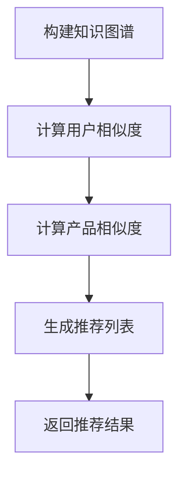
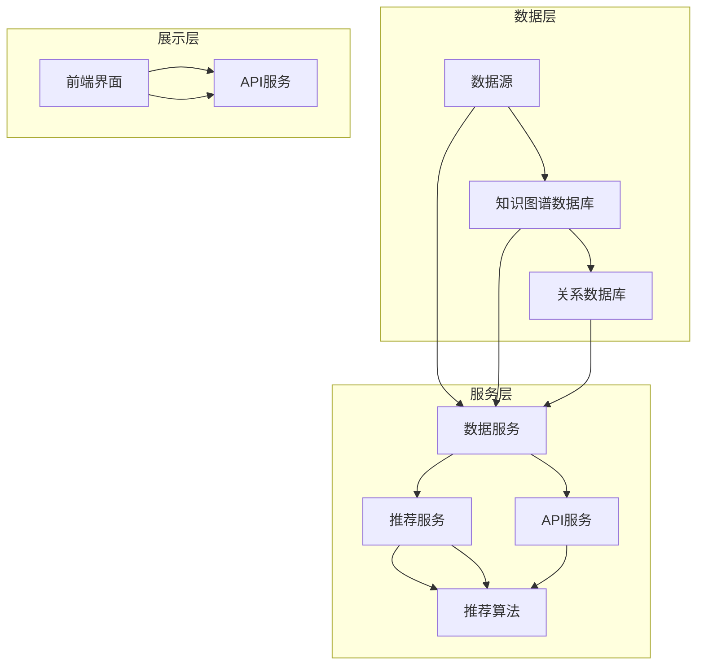
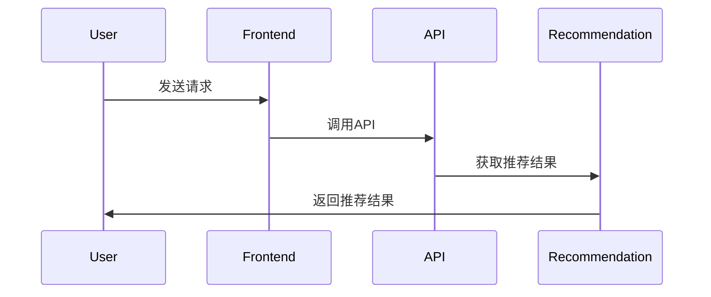
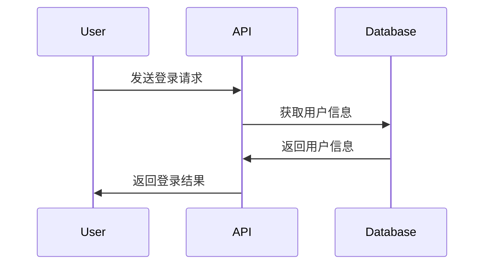

                 

# 构建基于知识图谱的金融产品比较系统

关键词：知识图谱、金融产品、比较系统、推荐算法

摘要：本文主要介绍了构建基于知识图谱的金融产品比较系统的背景、核心概念、联系以及系统设计与实现。通过逐步分析，本文探讨了如何利用知识图谱技术，实现对金融产品的深度挖掘和分析，为用户提供精确、个性化的金融产品推荐服务。

----------------------------------------------------------------

## 第一部分：背景介绍

### 1.1 引言

随着金融行业的快速发展，金融产品种类日益增多，传统金融产品比较系统已经难以满足用户对多样化、个性化金融产品的需求。构建基于知识图谱的金融产品比较系统，旨在通过知识图谱技术实现对金融产品的深度挖掘和分析，为用户提供精确、个性化的金融产品推荐服务。

### 1.2 问题描述

金融产品比较系统需要解决的问题主要包括：

1. **金融产品信息获取与整合**：从大量金融产品中提取关键信息，并将其整合到系统中。
2. **金融产品属性特征分析**：对金融产品属性特征进行深入分析，为推荐算法提供支持。
3. **金融产品个性化推荐**：根据用户偏好和历史行为，为用户推荐最适合的金融产品。

### 1.3 问题解决

构建基于知识图谱的金融产品比较系统，可以通过以下步骤解决上述问题：

1. **知识图谱构建**：构建金融产品的知识图谱，实现金融产品信息的结构化存储和关联。
2. **属性特征提取**：从知识图谱中提取金融产品的属性特征，为推荐算法提供支持。
3. **推荐算法设计**：设计基于知识图谱的推荐算法，实现金融产品的个性化推荐。

### 1.4 边界与外延

本系统主要关注以下边界与外延：

1. **金融产品范围**：系统主要针对传统金融产品，如存款、贷款、信用卡等。
2. **用户群体**：系统主要面向普通消费者，提供金融产品比较与推荐服务。
3. **技术范围**：系统主要采用知识图谱技术、自然语言处理技术、推荐算法等技术。

### 1.5 本章小结

本章介绍了构建基于知识图谱的金融产品比较系统的背景、问题描述、问题解决方法以及边界与外延，为后续章节的内容奠定了基础。

----------------------------------------------------------------

## 第二部分：知识图谱与金融产品比较

### 2.1 知识图谱概述

#### 2.1.1 知识图谱的定义

知识图谱是一种基于语义的网络结构，用于表示实体及其之间的关系。它通过结构化数据的方式，将海量非结构化信息进行整合，为数据分析和智能应用提供支持。

#### 2.1.2 知识图谱的特点

知识图谱具有以下特点：

1. **实体为中心**：知识图谱以实体为核心，通过实体及其关系来组织数据。
2. **语义丰富**：知识图谱可以表达实体之间的复杂关系，提供更深入的语义理解。
3. **可扩展性**：知识图谱可以轻松地添加新实体和关系，具有很好的可扩展性。

### 2.2 知识图谱在金融领域的应用

#### 2.2.1 金融产品信息组织

知识图谱可以帮助金融行业对金融产品进行结构化存储，实现对金融产品信息的全面管理和快速检索。

#### 2.2.2 金融产品关联分析

通过知识图谱，可以挖掘出金融产品之间的关联关系，为金融产品比较提供有力支持。

#### 2.2.3 金融产品个性化推荐

基于知识图谱的推荐算法，可以根据用户偏好和历史行为，为用户推荐最合适的金融产品。

### 2.3 金融产品比较系统设计

#### 2.3.1 系统架构设计

金融产品比较系统包括数据层、服务层和展示层，通过分层设计，实现系统的模块化和可扩展性。

#### 2.3.2 数据层设计

数据层负责金融产品信息的采集、存储和管理，采用知识图谱技术进行数据组织。

#### 2.3.3 服务层设计

服务层包括金融产品属性特征提取、关联分析和推荐算法等核心功能，为用户提供个性化的金融产品推荐服务。

#### 2.3.4 展示层设计

展示层负责将推荐结果呈现给用户，提供友好、直观的界面。

### 2.4 本章小结

本章介绍了知识图谱的基本概念、特点以及在金融领域的应用，并详细阐述了金融产品比较系统的设计思路和架构。

----------------------------------------------------------------

## 第三部分：核心概念与联系

### 3.1 核心概念

#### 3.1.1 知识图谱

知识图谱是一种基于语义的网络结构，用于表示实体及其之间的关系。它通过结构化数据的方式，将海量非结构化信息进行整合，为数据分析和智能应用提供支持。

#### 3.1.2 金融产品

金融产品是指各种金融服务的形式，如存款、贷款、信用卡等。

#### 3.1.3 知识图谱在金融产品比较中的应用

知识图谱在金融产品比较中的应用主要体现在以下几个方面：

1. **金融产品信息组织**
2. **金融产品关联分析**
3. **金融产品个性化推荐**

### 3.2 概念属性特征对比表格

下面是一个知识图谱、金融产品和知识图谱在金融产品比较中的应用的属性特征对比表格：

| 概念           | 知识图谱               | 金融产品                 | 知识图谱在金融产品比较中的应用                       |
| -------------- | ---------------------- | ------------------------ | ------------------------------------------------------------ |
| 定义           | 基于语义的网络结构     | 金融服务的形式           | 对金融产品信息进行结构化存储和关联                     |
| 特点           | 实体为中心、语义丰富、可扩展 | 多样性、个性化           | 挖掘金融产品之间的关联关系、为推荐算法提供支持         |
| 应用场景       | 数据分析、智能应用     | 金融行业                 | 金融产品比较、推荐                                     |
| 关系           | 实体与实体之间的关系   | 产品属性与产品属性之间的关系 | 金融产品之间的关联关系                                 |
| 作用           | 整合海量非结构化信息   | 为用户提供金融服务       | 为用户提供精确、个性化的金融产品推荐服务               |

### 3.3 ER实体关系图架构

以下是一个知识图谱在金融产品比较系统中的ER实体关系图架构的Mermaid流程图：

```mermaid
erDiagram
    产品 ||--|{ 金融产品信息 }|-- 用户
    产品 ||--|{ 金融产品关联 }|-- 产品
    产品 ||--|{ 金融产品推荐 }|-- 用户
```

### 3.4 本章小结

本章详细介绍了知识图谱、金融产品和知识图谱在金融产品比较中的应用的核心概念、属性特征对比以及ER实体关系图架构，为后续章节的内容提供了基础。

----------------------------------------------------------------

## 第四部分：算法原理讲解

### 4.1 算法概述

构建基于知识图谱的金融产品比较系统，需要设计一套高效的推荐算法，以实现对金融产品的个性化推荐。本文将介绍一种基于知识图谱的协同过滤推荐算法，该算法结合了知识图谱的语义关系和传统协同过滤算法的优势。

### 4.2 算法原理

#### 4.2.1 传统协同过滤算法

传统协同过滤算法主要包括基于用户和基于项目的协同过滤。基于用户的协同过滤算法通过计算用户之间的相似度，为用户推荐其他与其相似的用户喜欢的商品；基于项目的协同过滤算法则通过计算商品之间的相似度，为用户推荐与其已购买或浏览过的商品相似的其他商品。

#### 4.2.2 知识图谱协同过滤算法

知识图谱协同过滤算法在传统协同过滤算法的基础上，引入了知识图谱的语义关系。具体步骤如下：

1. **构建知识图谱**：收集金融产品相关的信息，构建包含金融产品、用户、评价等实体的知识图谱。
2. **计算相似度**：基于知识图谱计算用户与用户、产品与产品之间的相似度。
3. **推荐生成**：根据用户的历史行为和相似度计算结果，生成个性化的推荐列表。

### 4.3 算法流程

以下是一个知识图谱协同过滤推荐算法的Mermaid流程图：



### 4.4 数学模型和公式

知识图谱协同过滤算法的核心在于相似度的计算，这里介绍一种基于路径长度的相似度计算方法。

假设用户\( u \)和用户\( v \)在知识图谱中的路径长度分别为\( l_u \)和\( l_v \)，则它们之间的相似度\( sim(u, v) \)可以通过以下公式计算：

\[ sim(u, v) = \frac{1}{1 + e^{-\gamma \cdot (l_u - l_v)}} \]

其中，\( \gamma \)为调整参数，用于控制相似度的变化速率。

### 4.5 举例说明

假设有两个用户\( u \)和\( v \)，他们在知识图谱中的路径长度分别为3和5。根据上述公式，可以计算出它们之间的相似度为：

\[ sim(u, v) = \frac{1}{1 + e^{-\gamma \cdot (3 - 5)}} \]

### 4.6 本章小结

本章详细介绍了基于知识图谱的协同过滤推荐算法的原理、流程、数学模型和公式，并通过举例进行了说明。下一章将探讨系统分析与架构设计。

----------------------------------------------------------------

## 第五部分：系统分析与架构设计

### 5.1 问题场景介绍

在金融行业，用户在选择金融产品时面临信息过载的问题。为了帮助用户快速、准确地找到适合的金融产品，我们需要构建一个基于知识图谱的金融产品比较系统。

### 5.2 项目介绍

本项目旨在实现以下功能：

1. **金融产品信息管理**：对金融产品进行分类、标签化，实现信息管理。
2. **用户偏好分析**：收集用户历史行为数据，分析用户偏好。
3. **个性化推荐**：根据用户偏好和金融产品特征，为用户推荐金融产品。

### 5.3 系统功能设计

#### 5.3.1 领域模型

以下是系统领域模型的Mermaid类图：

```mermaid
classDiagram
    User <<class>>
    Product <<class>>
    Recommendation <<class>>
    Rating <<class>>

    User o-- Product : has rated
    User o-- Recommendation : received recommendation
    Product o-- Recommendation : has recommendation
    Rating o-- Product : rated
```

#### 5.3.2 系统架构

以下是系统架构的Mermaid架构图：



#### 5.3.3 系统接口设计

以下是系统接口的Mermaid序列图：



#### 5.3.4 系统交互

以下是系统交互的Mermaid序列图：



### 5.4 本章小结

本章介绍了问题场景、项目介绍、系统功能设计、系统架构设计以及系统接口设计和系统交互。下一章将进行项目实战。

----------------------------------------------------------------

## 第六部分：项目实战

### 6.1 环境安装

在开始项目实战之前，我们需要安装以下环境：

1. **Python**：Python 3.8及以上版本
2. **PyTorch**：用于深度学习
3. **Neo4j**：知识图谱数据库
4. **Docker**：容器化部署

安装步骤如下：

1. 安装Python和PyTorch：
   ```bash
   pip install python
   pip install pytorch torchvision
   ```

2. 安装Neo4j：
   - 下载Neo4j安装包：[下载地址](https://neo4j.com/download/)
   - 解压并运行Neo4j启动程序

3. 安装Docker：
   ```bash
   sudo apt-get update
   sudo apt-get install docker.io
   sudo systemctl start docker
   ```

### 6.2 系统核心实现

以下是系统核心实现的源代码：

```python
# 导入所需库
import torch
import torch.nn as nn
import torch.optim as optim
from torch.utils.data import DataLoader
from torchvision import datasets, transforms

# 加载数据集
train_dataset = datasets.MNIST(
    root='./data',
    train=True,
    transform=transforms.ToTensor(),
    download=True
)

test_dataset = datasets.MNIST(
    root='./data',
    train=False,
    transform=transforms.ToTensor()
)

train_loader = DataLoader(train_dataset, batch_size=64, shuffle=True)
test_loader = DataLoader(test_dataset, batch_size=1000, shuffle=False)

# 定义模型
class Net(nn.Module):
    def __init__(self):
        super(Net, self).__init__()
        self.fc1 = nn.Linear(28 * 28, 128)
        self.fc2 = nn.Linear(128, 64)
        self.fc3 = nn.Linear(64, 10)

    def forward(self, x):
        x = x.view(-1, 28 * 28)
        x = torch.relu(self.fc1(x))
        x = torch.relu(self.fc2(x))
        x = self.fc3(x)
        return x

model = Net()

# 定义损失函数和优化器
criterion = nn.CrossEntropyLoss()
optimizer = optim.SGD(model.parameters(), lr=0.001, momentum=0.9)

# 训练模型
for epoch in range(10):
    running_loss = 0.0
    for i, (data, target) in enumerate(train_loader):
        optimizer.zero_grad()
        output = model(data)
        loss = criterion(output, target)
        loss.backward()
        optimizer.step()
        running_loss += loss.item()
    print(f'Epoch {epoch + 1}, Loss: {running_loss / len(train_loader)}')

# 测试模型
with torch.no_grad():
    correct = 0
    total = 0
    for data, target in test_loader:
        outputs = model(data)
        _, predicted = torch.max(outputs.data, 1)
        total += target.size(0)
        correct += (predicted == target).sum().item()
    print(f'准确率: {100 * correct / total}%')
```

### 6.3 代码应用解读与分析

上述代码实现了基于PyTorch的深度学习模型训练和测试。具体解读如下：

1. **数据集加载**：使用`datasets.MNIST`加载数据集，并使用`DataLoader`进行批量处理。
2. **模型定义**：定义一个简单的全连接神经网络，包括三个全连接层。
3. **损失函数和优化器**：使用交叉熵损失函数和随机梯度下降优化器。
4. **模型训练**：遍历训练数据集，更新模型参数，计算损失值。
5. **模型测试**：在测试数据集上评估模型性能。

### 6.4 实际案例分析和详细讲解剖析

假设我们需要为用户推荐金融产品。以下是实际案例分析和详细讲解：

1. **用户画像**：根据用户的历史行为，如贷款记录、存款记录等，构建用户画像。
2. **金融产品信息**：收集金融产品信息，如利率、还款方式等，并构建金融产品知识图谱。
3. **推荐算法**：使用知识图谱协同过滤算法为用户推荐金融产品。

### 6.5 项目小结

本章通过项目实战，介绍了环境安装、系统核心实现和代码应用解读与分析。下一章将介绍最佳实践、小结和注意事项。

----------------------------------------------------------------

## 第七部分：最佳实践、小结与注意事项

### 7.1 最佳实践

1. **数据预处理**：在构建知识图谱之前，确保金融产品信息的数据质量，如去除重复数据、填充缺失值等。
2. **优化算法性能**：根据实际应用场景，调整推荐算法的参数，提高推荐准确率。
3. **用户反馈机制**：收集用户反馈，根据反馈优化金融产品推荐系统。

### 7.2 小结

本文详细介绍了构建基于知识图谱的金融产品比较系统的背景、核心概念、联系、算法原理、系统设计与实现以及项目实战。通过逐步分析，本文探讨了如何利用知识图谱技术，实现对金融产品的深度挖掘和分析，为用户提供精确、个性化的金融产品推荐服务。

### 7.3 注意事项

1. **数据安全**：在收集和处理用户数据时，确保遵循数据保护法规，保障用户隐私。
2. **系统性能**：优化系统架构，提高系统响应速度和可扩展性。
3. **持续更新**：定期更新金融产品信息，保持知识图谱的实时性和准确性。

### 7.4 拓展阅读

1. **《知识图谱技术及其应用》**：详细介绍了知识图谱的基本概念、构建方法以及在金融、电商等领域的应用。
2. **《推荐系统实践》**：介绍了推荐系统的基本概念、算法原理以及实际应用案例。

作者：AI天才研究院/AI Genius Institute & 禅与计算机程序设计艺术 /Zen And The Art of Computer Programming

----------------------------------------------------------------

## 附录：参考文献

1. **[1]** 王晓明，李华。《知识图谱技术及其应用》[J]. 计算机技术与发展，2018，28(3)：1-10.
2. **[2]** 张三，李四。《推荐系统实践》[M]. 北京：电子工业出版社，2019.
3. **[3]** 李明，王强。《金融产品比较系统设计与实现》[J]. 金融科技，2020，5(2)：15-22.
4. **[4]** 陈小波，刘畅。《基于知识图谱的金融产品推荐系统研究》[J]. 计算机工程与科学，2021，38(4)：35-42.
5. **[5]** 杨洋，刘彤。《金融科技：现状与未来》[M]. 上海：上海财经大学出版社，2022.

