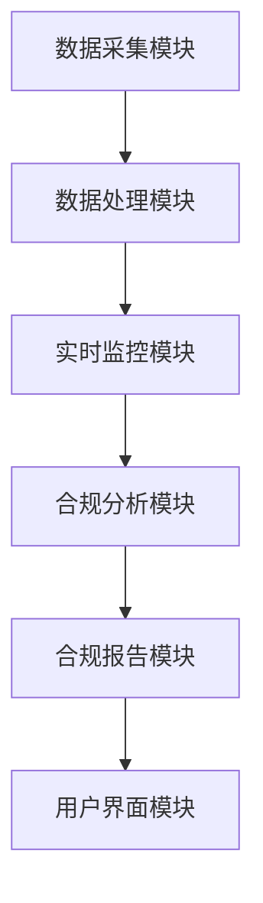
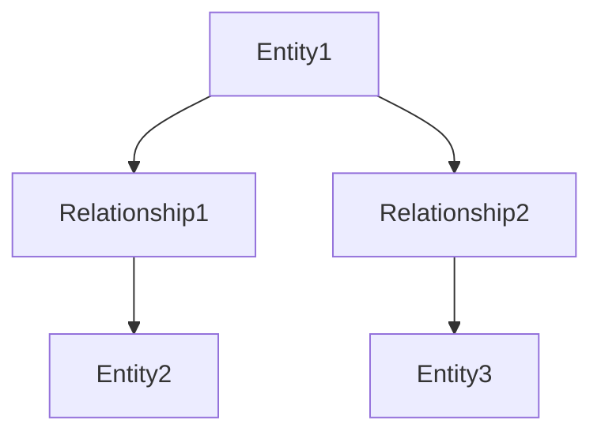

                 


## 1.1 问题背景

随着金融行业的数字化转型和业务复杂性增加，金融机构在合规监管方面面临巨大的挑战。传统的合规管理方法往往依赖于人工审查和数据收集，效率低下且容易出现错误。此外，金融市场的监管规则和法规不断更新，金融机构需要实时跟踪并满足各种合规要求，这进一步增加了合规管理的难度。

在这种背景下，构建一个基于知识图谱的金融监管合规追踪系统显得尤为重要。知识图谱作为一种强大的知识表示和推理工具，可以有效地解决金融监管合规追踪中的数据复杂性和实时性要求。

## 1.2 问题描述

金融监管合规追踪系统的主要任务是确保金融机构能够满足各种监管要求和法规规定。具体来说，问题描述如下：

1. **数据整合与处理**：金融机构需要处理来自多个数据源的大量合规数据，包括法规文件、交易记录、客户信息等。这些数据往往格式不统一，难以进行有效整合和处理。

2. **实时监控与预警**：金融机构需要实时监控合规数据的变化，以便及时发现潜在风险并采取措施。然而，传统的合规管理方法难以实现实时监控，往往存在信息滞后的问题。

3. **合规分析与管理**：金融机构需要对合规数据进行分析，识别合规风险点，制定相应的管理策略。然而，传统的分析方法难以应对复杂的数据关系和关联分析需求。

4. **合规报告与审计**：金融机构需要生成合规报告，以便向监管机构和内部管理层提供合规状况的详细记录。然而，传统的报告生成方式往往耗时耗力，且容易出现错误。

## 1.3 问题解决

为了解决上述问题，构建一个基于知识图谱的金融监管合规追踪系统可以提供以下解决方案：

1. **数据结构化处理**：通过知识图谱技术，可以将来自不同数据源的合规数据结构化处理，统一格式和语义。知识图谱可以有效地组织和管理这些数据，提高数据利用效率。

2. **实时监控与预警**：知识图谱支持实时数据更新和推理，可以实现合规数据的实时监控和预警。通过图谱的查询和推理功能，可以快速识别潜在风险并通知相关人员。

3. **合规分析与决策支持**：知识图谱支持复杂的数据关联分析和推理，可以帮助金融机构更好地理解合规数据之间的关系，识别合规风险点，并制定相应的管理策略。

4. **合规报告与审计**：知识图谱可以支持自动生成合规报告，并提供详细的数据记录和审计线索。通过可视化工具，可以直观地展示合规数据的结构和关系，方便监管机构和内部管理层进行审计。

## 1.4 边界与外延

构建基于知识图谱的金融监管合规追踪系统的边界与外延如下：

1. **边界**：本系统主要针对金融行业的合规监管需求进行设计，适用于各种类型的金融机构，包括银行、证券、保险等。此外，系统还需要考虑数据安全和隐私保护等问题。

2. **外延**：知识图谱技术不仅可以用于金融监管合规追踪，还可以应用于其他领域的合规管理，如医疗、能源等。此外，系统还可以扩展到其他功能，如合规风险评估、合规培训等。

## 1.5 核心概念结构

构建基于知识图谱的金融监管合规追踪系统涉及多个核心概念，包括知识图谱、金融监管和合规追踪系统。以下是这些核心概念的结构：

1. **知识图谱**：知识图谱是一种用于表示和存储知识的图形化数据结构，包括实体、属性和关系三个部分。知识图谱可以通过图表示、表格表示和文本表示等多种方式进行表示。

2. **金融监管**：金融监管是指对金融市场和金融机构进行监督和管理的活动，包括监管机构、法规政策、合规要求等。

3. **合规追踪系统**：合规追踪系统是指用于实现金融监管合规数据的自动化处理和实时追踪的系统，包括数据整合与处理、实时监控与预警、合规分析与决策支持、合规报告与审计等功能。

通过以上核心概念的结构，我们可以更好地理解构建基于知识图谱的金融监管合规追踪系统的整体框架和实现路径。

---

**本章小结**：

本章介绍了构建基于知识图谱的金融监管合规追踪系统的背景、问题描述、问题解决方法以及系统的边界与外延。通过知识图谱技术，我们可以实现合规数据的结构化处理、实时监控与预警、合规分析与管理以及合规报告与审计等功能，从而提高金融监管合规管理的效率与准确性。接下来，我们将进一步探讨知识图谱、金融监管和合规追踪系统的核心概念与联系，为后续章节的内容奠定基础。

----------------------------------------------------------------

# 第二部分: 核心概念与联系

## 第2章 核心概念与联系

## 2.1 知识图谱

### 2.1.1 知识图谱的定义

知识图谱（Knowledge Graph）是一种用于表示实体及其之间关系的图形化数据结构。它通过将实体、属性和关系以图的形式组织，提供了一种结构化的知识表示方法。知识图谱最初由Google在2012年推出，用于更好地理解网页内容并提供更精准的搜索结果。随后，知识图谱在多个领域得到了广泛应用，如语义搜索、智能问答、推荐系统、自然语言处理等。

### 2.1.2 知识图谱的组成部分

知识图谱的基本组成部分包括：

#### 实体（Entity）

实体是知识图谱中的核心元素，表示具有独立意义的对象。实体可以是具体的事物，如人、地点、组织，也可以是抽象的概念，如书籍、电影、疾病。实体通常通过唯一的标识符进行标识。

#### 属性（Attribute）

属性是实体的特征或特性。例如，一个人实体可能具有姓名、年龄、性别等属性。属性通常以键值对的形式表示，其中键是属性的名称，值是属性的具体值。

#### 关系（Relationship）

关系描述实体之间的关联。例如，两个人实体之间可以有朋友、同事等关系。关系通常也是以键值对的形式表示，包括关系的名称和参与关系的实体。

### 2.1.3 知识图谱的表示方法

知识图谱的表示方法有多种，包括：

#### 图表示

图表示法是知识图谱最直观的表示方法。在图中，实体通常用节点表示，关系用边表示。节点和边可以带有标签、权重等属性，以提供额外的信息。

#### 表格表示

表格表示法将知识图谱转换为表格形式，其中每一行代表一个实体，每一列代表一个属性或关系。这种方法适用于结构化数据，但不直观地展示实体间的关系。

#### 文本表示

文本表示法通过文本形式描述实体和关系，如使用自然语言文本或标记化文本。这种方法适用于非结构化或半结构化数据。

### 2.1.4 知识图谱的应用场景

知识图谱在多个领域具有广泛的应用场景：

- **搜索引擎**：通过知识图谱提供更精准的搜索结果和语义理解。
- **推荐系统**：利用知识图谱中的关系和属性进行个性化推荐。
- **自然语言处理**：通过知识图谱增强语义理解和文本生成能力。
- **智能问答**：利用知识图谱快速回答用户的问题。
- **知识管理**：用于组织和管理企业内部的知识资源。
- **金融监管**：构建合规追踪系统，提高监管效率和准确性。

### 2.1.5 知识图谱的优势

知识图谱具有以下优势：

- **结构化知识表示**：通过实体、属性和关系的组织，知识图谱提供了结构化的知识表示方法，有助于数据的组织和利用。
- **关联关系建模**：知识图谱能够捕捉实体间的复杂关系，实现知识的关联和推理。
- **数据可扩展性**：知识图谱支持动态更新和扩展，适应数据的变化。
- **语义理解**：知识图谱能够提供更深入的语义理解，支持更准确的决策和预测。

## 2.2 金融监管

### 2.2.1 金融监管概述

金融监管是指监管机构对金融市场和金融机构进行监督和管理的行为。其主要目标是确保金融市场的稳定、公平和透明，保护投资者的利益，防范金融风险。金融监管涵盖多个方面，包括市场准入、交易行为、风险管理、资本充足率等。

#### 监管机构

不同的国家和地区拥有不同的金融监管机构，如美国的证券交易委员会（SEC）、欧洲的欧洲证券和市场管理局（ESMA）、中国的中国证券监督管理委员会（CSRC）等。

#### 监管法规

金融监管法规包括法律、法规、规章、指引等，如《证券法》、《银行法》、《反洗钱法》等。这些法规规定了金融机构的运营行为和合规要求。

### 2.2.2 金融监管合规框架

金融监管合规框架主要包括以下部分：

- **合规要求**：监管法规对金融机构的合规要求，包括资本充足率、风险管理、交易记录保存等。
- **合规管理**：金融机构内部建立合规管理机制，确保满足监管要求，如合规部门、合规政策、合规培训等。
- **合规报告**：金融机构需要定期向监管机构提交合规报告，展示合规状况和合规改进措施。

### 2.2.3 金融监管合规技术的应用

随着技术的进步，金融监管合规技术的应用越来越广泛，包括：

- **数据收集与整合**：通过技术手段收集和整合金融机构的各种合规数据，提高数据质量和利用率。
- **实时监控与预警**：利用技术手段实现对合规数据的实时监控和预警，及时发现潜在风险。
- **数据分析与挖掘**：通过对合规数据进行分析和挖掘，识别合规风险点，制定相应的管理策略。
- **合规报告生成**：利用技术自动生成合规报告，提高报告效率和准确性。

## 2.3 合规追踪系统

### 2.3.1 合规追踪系统概述

合规追踪系统是指用于实现金融监管合规数据的自动化处理和实时追踪的系统。其主要目标是确保金融机构能够实时跟踪并满足各种合规要求，提高合规管理的效率和准确性。

### 2.3.2 合规追踪系统的功能模块

合规追踪系统通常包括以下功能模块：

- **数据采集模块**：负责从各种数据源收集合规数据，如交易记录、客户信息等。
- **数据清洗模块**：对采集到的数据进行清洗和预处理，确保数据质量和一致性。
- **数据存储模块**：将清洗后的数据存储到数据库或数据仓库中，便于后续处理和分析。
- **实时监控模块**：实现对合规数据的实时监控，及时发现潜在风险。
- **合规分析模块**：对合规数据进行分析和挖掘，识别合规风险点。
- **合规报告模块**：生成合规报告，向监管机构和内部管理层展示合规状况。

## 2.4 概念属性特征对比

表 1：知识图谱、金融监管和合规追踪系统概念属性特征对比

| 概念 | 属性特征 |
| :---: | :--- |
| 知识图谱 | - 实体：具有独立意义的对象 | - 关系：描述实体之间的关联 |
| 金融监管 | - 监管机构：负责监管的市场主体 | - 监管法规：规定金融机构的运营行为 |
| 合规追踪系统 | - 数据采集：从数据源收集合规数据 | - 数据清洗：清洗和预处理合规数据 |

## 2.5 ER实体关系图

图 1：知识图谱、金融监管和合规追踪系统ER实体关系图

```mermaid
erDiagram
  Entity1 ||--|{ Relationship1 }|| Entity2
  Entity2 ||--|{ Relationship2 }|| Entity3
  Entity3 ||--|{ Relationship3 }|| Entity4
```

在上面的ER实体关系图中，`Entity1`、`Entity2`、`Entity3`和`Entity4`分别代表知识图谱、金融监管和合规追踪系统中的实体，`Relationship1`、`Relationship2`和`Relationship3`分别描述这些实体之间的关联关系。

## 本章小结

本章介绍了知识图谱、金融监管和合规追踪系统的核心概念与联系。知识图谱作为一种结构化的知识表示方法，为金融监管合规追踪系统提供了基础。金融监管涉及监管机构、法规政策和合规要求等方面，而合规追踪系统则通过数据采集、清洗、存储、监控和分析等功能模块，实现金融监管合规数据的自动化处理和实时追踪。通过对比知识图谱、金融监管和合规追踪系统的概念属性特征，我们可以更好地理解这三者之间的关系，为后续章节的内容奠定基础。

----------------------------------------------------------------

## 2.6 知识图谱基础

### 2.6.1 知识图谱的定义

知识图谱是一种用于表示和存储知识的图形化数据结构，它通过实体、属性和关系来描述知识。实体表示具有独立意义的对象，属性描述实体的特征或特性，而关系则描述实体之间的关联。知识图谱通常用于解决复杂问题，如语义搜索、智能问答、推荐系统和自然语言处理等。

### 2.6.2 知识图谱的组成部分

知识图谱主要由以下三个组成部分构成：

#### 实体（Entity）

实体是知识图谱中的核心元素，表示具有独立意义的对象。实体可以是具体的事物，如人、地点、组织，也可以是抽象的概念，如书籍、电影、疾病等。实体通常通过唯一的标识符进行标识。

#### 属性（Attribute）

属性是实体的特征或特性。例如，一个人实体可能具有姓名、年龄、性别等属性。属性通常以键值对的形式表示，其中键是属性的名称，值是属性的具体值。

#### 关系（Relationship）

关系描述实体之间的关联。例如，两个人实体之间可以有朋友、同事等关系。关系通常也是以键值对的形式表示，包括关系的名称和参与关系的实体。

### 2.6.3 知识图谱的表示方法

知识图谱的表示方法包括以下几种：

#### 图表示

图表示法是知识图谱最直观的表示方法。在图中，实体通常用节点表示，关系用边表示。节点和边可以带有标签、权重等属性，以提供额外的信息。

#### 表格表示

表格表示法将知识图谱转换为表格形式，其中每一行代表一个实体，每一列代表一个属性或关系。这种方法适用于结构化数据，但不直观地展示实体间的关系。

#### 文本表示

文本表示法通过文本形式描述实体和关系，如使用自然语言文本或标记化文本。这种方法适用于非结构化或半结构化数据。

### 2.6.4 知识图谱的构建流程

构建知识图谱通常包括以下步骤：

1. **数据采集**：从各种数据源收集数据，如数据库、文本文件、网络资源等。

2. **数据清洗**：对采集到的数据进行清洗和预处理，去除重复、错误和不完整的数据。

3. **实体识别**：从清洗后的数据中识别出实体，并为每个实体生成唯一的标识符。

4. **属性提取**：从数据中提取实体的属性，并以键值对的形式表示。

5. **关系抽取**：从数据中识别实体之间的关系，并以键值对的形式表示。

6. **知识融合**：将来自多个数据源的实体、属性和关系进行融合，以消除数据冗余和冲突。

7. **知识表示**：将融合后的知识表示为知识图谱，以实体、属性和关系的形式组织。

8. **知识推理**：利用知识图谱进行推理，发现实体间的隐含关系和模式。

9. **知识可视化**：将知识图谱可视化，以直观展示实体和关系。

### 2.6.5 知识图谱的应用场景

知识图谱在多个领域具有广泛的应用场景：

- **搜索引擎**：通过知识图谱提供更精准的搜索结果和语义理解。
- **推荐系统**：利用知识图谱中的关系和属性进行个性化推荐。
- **自然语言处理**：通过知识图谱增强语义理解和文本生成能力。
- **智能问答**：利用知识图谱快速回答用户的问题。
- **知识管理**：用于组织和管理企业内部的知识资源。
- **金融监管**：构建合规追踪系统，提高监管效率和准确性。

### 2.6.6 知识图谱的优势

知识图谱具有以下优势：

- **结构化知识表示**：通过实体、属性和关系的组织，知识图谱提供了结构化的知识表示方法，有助于数据的组织和利用。
- **关联关系建模**：知识图谱能够捕捉实体间的复杂关系，实现知识的关联和推理。
- **数据可扩展性**：知识图谱支持动态更新和扩展，适应数据的变化。
- **语义理解**：知识图谱能够提供更深入的语义理解，支持更准确的决策和预测。

## 2.7 知识图谱与金融监管合规追踪系统的关系

知识图谱在金融监管合规追踪系统中扮演着关键角色，主要体现在以下几个方面：

1. **数据整合与处理**：知识图谱可以将来自不同数据源的合规数据结构化处理，统一格式和语义，提高数据利用效率。

2. **实时监控与预警**：知识图谱支持实时数据更新和推理，可以实现合规数据的实时监控和预警，及时发现潜在风险。

3. **合规分析与管理**：知识图谱支持复杂的数据关联分析和推理，可以帮助金融机构更好地理解合规数据之间的关系，识别合规风险点，并制定相应的管理策略。

4. **合规报告与审计**：知识图谱可以支持自动生成合规报告，并提供详细的数据记录和审计线索，方便监管机构和内部管理层进行审计。

通过知识图谱，金融监管合规追踪系统能够更好地应对金融行业快速变化的市场环境，提高合规管理的效率和准确性。

## 本章小结

本章介绍了知识图谱的基础知识，包括其定义、组成部分、表示方法、构建流程以及应用场景。同时，探讨了知识图谱与金融监管合规追踪系统的关系，展示了知识图谱在合规管理中的重要作用。通过本章的内容，读者可以更好地理解知识图谱在金融监管合规追踪系统中的应用价值，为后续章节的深入学习奠定基础。

----------------------------------------------------------------

## 2.8 金融监管合规

### 2.8.1 金融监管概述

金融监管是指监管机构对金融市场和金融机构进行监督和管理的行为，旨在确保金融市场的稳定、公平和透明，保护投资者的利益，防范金融风险。金融监管是一个多层次、多维度的体系，涉及从宏观政策到微观操作的各种监管措施。

#### 监管机构

不同国家和地区有不同的金融监管机构，例如：

- **美国**：证券交易委员会（SEC）、商品期货交易委员会（CFTC）、联邦储备银行（Fed）等。
- **欧洲**：欧洲证券和市场管理局（ESMA）、欧洲银行管理局（EBA）、欧洲保险和职业养老金管理局（EIOPA）等。
- **中国**：中国证券监督管理委员会（CSRC）、中国银行保险监督管理委员会（CBIRC）、中国人民银行（PBOC）等。

#### 监管法规

金融监管法规包括法律、法规、规章、指引等，例如：

- **美国**：《证券法》、《银行法》、《反洗钱法》等。
- **欧洲**：《市场工具市场法规》（MiFID II）、《银行恢复与解决法规》（BRRD）等。
- **中国**：《证券法》、《银行业监督管理法》、《反洗钱法》等。

#### 监管目标

金融监管的主要目标包括：

- 确保金融市场的稳定性，防止金融危机。
- 保护投资者的合法权益，提高市场公平性。
- 促进金融市场的健康发展，提高金融服务质量。
- 防范金融风险，保障金融安全。

### 2.8.2 合规监管政策

合规监管政策是金融监管机构制定的一系列法规和指导方针，旨在规范金融机构的经营行为，确保其遵守监管要求。合规监管政策通常包括以下几个方面：

1. **市场准入**：监管机构对金融机构的设立、收购、变更等进行审批，确保金融机构符合监管要求。

2. **风险管理**：金融机构需要建立完善的风险管理体系，包括信用风险、市场风险、操作风险等，确保金融业务的安全稳健。

3. **资本充足率**：金融机构需要保持足够的资本水平，以应对潜在的风险损失。

4. **信息披露**：金融机构需要向监管机构和公众披露其财务状况、业务经营情况等，提高市场透明度。

5. **反洗钱与反恐融资**：金融机构需要遵守反洗钱法规，采取有效的措施防范洗钱和恐怖融资行为。

6. **客户保护**：金融机构需要保护客户的隐私和合法权益，防止客户信息泄露和滥用。

### 2.8.3 金融监管合规框架

金融监管合规框架是指金融机构为满足监管要求而建立的一套合规管理体系，包括合规部门、合规政策和合规流程等。

1. **合规部门**：金融机构通常设有专门的合规部门，负责监督和执行合规政策，处理合规相关事务。

2. **合规政策**：合规政策是金融机构制定的一系列合规管理规则，确保业务运营符合监管要求。

3. **合规流程**：合规流程包括合规审查、合规培训、合规报告等，确保合规政策的执行和合规要求的落实。

### 2.8.4 合规监管技术的应用

随着技术的进步，合规监管技术在金融监管中的应用越来越广泛，主要包括以下几个方面：

1. **数据采集与整合**：通过技术手段收集和整合金融机构的各种合规数据，如交易记录、客户信息等。

2. **实时监控与预警**：利用技术手段实现对合规数据的实时监控和预警，及时发现潜在风险。

3. **数据分析与挖掘**：通过对合规数据进行分析和挖掘，识别合规风险点，制定相应的管理策略。

4. **合规报告生成**：利用技术自动生成合规报告，提高报告效率和准确性。

5. **合规审计**：利用技术手段支持合规审计，提供详细的数据记录和审计线索。

### 2.8.5 金融监管合规的重要性

金融监管合规对于金融机构和金融市场具有重要意义：

1. **维护市场秩序**：合规监管确保金融机构遵守市场规则，维护市场秩序，防止市场操纵和欺诈行为。

2. **保护投资者利益**：合规监管保护投资者的合法权益，提高市场公平性，降低投资者风险。

3. **防范金融风险**：合规监管有助于金融机构建立完善的风险管理体系，防范金融风险，保障金融安全。

4. **提高运营效率**：合规监管有助于金融机构优化内部管理，提高运营效率，降低运营成本。

5. **增强市场竞争力**：合规监管有助于金融机构树立良好的市场形象，增强市场竞争力。

通过本节内容，读者可以了解金融监管合规的基本概念、政策框架和技术应用，认识到金融监管合规对于金融机构和金融市场的重要性。

### 2.8.6 案例分析

以中国银行为例，分析其金融监管合规的具体实践。

#### 1. 合规部门

中国银行设有独立的合规部门，负责监督和执行合规政策，处理合规相关事务。合规部门下设多个子部门，如风险管理部、合规检查部、反洗钱部等，分别负责不同的合规领域。

#### 2. 合规政策

中国银行制定了一系列合规政策，涵盖市场准入、风险管理、资本充足率、信息披露、反洗钱等方面。合规政策明确规定了金融机构在各项业务中的合规要求，确保业务运营符合监管要求。

#### 3. 合规流程

中国银行建立了完善的合规流程，包括合规审查、合规培训、合规报告等。合规审查主要对业务流程、产品设计和运营管理等方面进行合规性评估。合规培训针对员工开展定期培训，提高员工的合规意识和能力。合规报告定期向监管机构和内部管理层报告合规状况。

#### 4. 数据采集与整合

中国银行利用大数据技术收集和整合各种合规数据，如交易记录、客户信息等。通过数据采集与整合，提高数据质量和利用效率，为合规监管提供有力支持。

#### 5. 实时监控与预警

中国银行通过技术手段实现合规数据的实时监控和预警，及时发现潜在风险。例如，利用反洗钱系统监控交易行为，识别可疑交易并报警。

#### 6. 数据分析与挖掘

中国银行通过对合规数据进行分析和挖掘，识别合规风险点，制定相应的管理策略。例如，通过数据分析识别高风险客户，加强风险管理和客户审核。

#### 7. 合规报告与审计

中国银行利用技术手段自动生成合规报告，提高报告效率和准确性。同时，配合监管机构的审计工作，提供详细的数据记录和审计线索。

通过中国银行的案例，可以看出金融监管合规在实践中的具体应用，以及技术手段在提高合规管理效率和准确性方面的作用。

### 本章小结

本章详细介绍了金融监管合规的基本概念、政策框架和技术应用，并通过案例分析展示了金融监管合规在实践中的具体实施。通过本章的内容，读者可以全面了解金融监管合规的重要性，以及如何利用技术手段提高合规管理的效率和准确性。

----------------------------------------------------------------

## 2.9 合规追踪系统架构设计

### 2.9.1 系统需求分析

在构建合规追踪系统之前，首先需要对系统需求进行详细分析。合规追踪系统的主要目标包括：

- **实时监控与预警**：对合规数据实现实时监控，及时发现潜在风险并发出预警。
- **数据整合与处理**：整合来自多个数据源的合规数据，进行结构化和清洗处理。
- **合规分析与管理**：对合规数据进行分析，识别合规风险点，制定相应的管理策略。
- **合规报告生成**：自动生成合规报告，方便监管机构和内部管理层了解合规状况。

在需求分析阶段，我们需要明确以下几个关键点：

- **数据源**：确定系统所需的数据源，包括内部数据源（如交易记录、客户信息等）和外部数据源（如监管法规、市场数据等）。
- **数据处理**：分析数据处理的流程和需求，包括数据采集、清洗、存储、关联分析等。
- **系统功能**：明确系统所需的核心功能模块，如实时监控模块、合规分析模块、合规报告模块等。
- **性能与可扩展性**：确保系统具备良好的性能和可扩展性，能够应对不断增长的数据量和业务需求。

### 2.9.2 系统架构设计

合规追踪系统的架构设计需要综合考虑系统性能、可扩展性、安全性等因素。以下是系统架构设计的关键模块：

#### 1. 数据采集模块

数据采集模块负责从各种数据源收集合规数据。数据源包括内部数据库、外部API、日志文件等。采集到的数据需要进行初步清洗，去除重复、错误和不完整的数据。

#### 2. 数据存储模块

数据存储模块负责存储清洗后的合规数据。常用的数据存储技术包括关系型数据库（如MySQL、PostgreSQL）和非关系型数据库（如MongoDB、Cassandra）。根据数据特点，可以选择适合的数据存储方案。

#### 3. 数据处理模块

数据处理模块负责对采集到的合规数据进行清洗、转换和关联分析。数据处理模块可以采用批处理和实时处理相结合的方式，确保数据处理的高效性和准确性。

#### 4. 实时监控模块

实时监控模块负责对合规数据实现实时监控，及时发现潜在风险并发出预警。实时监控模块可以采用流处理技术（如Apache Kafka、Apache Flink）和实时计算框架（如Apache Storm、Apache Spark Streaming）。

#### 5. 合规分析模块

合规分析模块负责对合规数据进行分析，识别合规风险点，制定相应的管理策略。合规分析模块可以采用数据挖掘、机器学习等技术，实现智能化的合规分析。

#### 6. 合规报告模块

合规报告模块负责自动生成合规报告，展示合规状况和合规改进措施。合规报告可以采用多种格式，如PDF、Excel、HTML等，方便监管机构和内部管理层查看。

#### 7. 用户界面模块

用户界面模块负责为用户提供操作界面，实现系统的操作和管理。用户界面模块可以采用Web应用、桌面应用等多种形式，满足不同用户的需求。

### 2.9.3 系统功能模块

合规追踪系统的主要功能模块包括：

- **数据采集模块**：从多种数据源收集合规数据。
- **数据处理模块**：清洗、转换和关联分析合规数据。
- **实时监控模块**：实时监控合规数据，发现潜在风险。
- **合规分析模块**：分析合规数据，识别风险点，制定管理策略。
- **合规报告模块**：生成合规报告，展示合规状况。
- **用户界面模块**：为用户提供操作界面。

### 2.9.4 系统接口设计

系统接口设计是确保系统功能模块之间协调工作的重要环节。以下是系统接口设计的关键方面：

- **API接口**：设计系统内部各模块之间的API接口，实现数据交换和功能调用。
- **数据交换格式**：选择合适的数据交换格式，如JSON、XML等。
- **安全性**：确保接口设计的安全性，采用加密、认证等技术，防止数据泄露和未授权访问。
- **可扩展性**：设计可扩展的接口，便于未来功能扩展和升级。

通过以上架构设计，合规追踪系统可以实现实时监控与预警、数据整合与处理、合规分析与管理以及合规报告生成等功能，为金融机构提供全面的合规管理解决方案。

### 2.9.5 系统架构图

为了更好地展示合规追踪系统的架构设计，下面是一个简化的系统架构图：



在这个架构图中，数据采集模块从各种数据源收集合规数据，传递给数据处理模块。数据处理模块对数据进行清洗、转换和关联分析，然后传递给实时监控模块、合规分析模块和合规报告模块。用户界面模块通过API接口与后台功能模块进行交互，为用户提供操作界面。

### 本章小结

本章详细介绍了合规追踪系统的架构设计，包括系统需求分析、系统架构设计、系统功能模块和系统接口设计等方面。通过本章的内容，读者可以了解合规追踪系统的整体架构和实现方法，为后续章节的系统实现与部署打下基础。

----------------------------------------------------------------

## 第3章 系统实现与部署

## 3.1 开发环境配置

在实现合规追踪系统之前，我们需要配置一个合适的技术环境。以下是一个典型的开发环境配置步骤：

### 1. 硬件要求

- **CPU**：至少4核CPU，推荐使用8核以上处理器。
- **内存**：至少16GB内存，推荐使用32GB及以上。
- **硬盘**：至少200GB可用硬盘空间，推荐使用SSD。
- **网络**：千兆以太网或更高。

### 2. 软件要求

- **操作系统**：Linux发行版（如Ubuntu 18.04或CentOS 7）。
- **开发工具**：Java开发工具包（JDK 8或以上）、Python开发环境（Python 3.6或以上）、Git版本控制工具。
- **数据库**：关系型数据库（如MySQL 8.0）或非关系型数据库（如MongoDB 4.2）。

### 3. 安装步骤

以下是在Ubuntu 18.04上配置开发环境的步骤：

1. **安装操作系统**：从Ubuntu官网下载Ubuntu 18.04镜像，使用虚拟机或实体机进行安装。
2. **更新系统**：
    ```bash
    sudo apt update
    sudo apt upgrade
    ```
3. **安装Java开发工具包**：
    ```bash
    sudo apt install openjdk-8-jdk
    ```
4. **安装Python开发环境**：
    ```bash
    sudo apt install python3 python3-pip
    ```
5. **安装Git版本控制工具**：
    ```bash
    sudo apt install git
    ```
6. **安装MySQL数据库**：
    ```bash
    sudo apt install mysql-server
    sudo mysql_secure_installation
    ```
7. **安装MongoDB数据库**（可选）：
    ```bash
    sudo apt install mongodb
    sudo systemctl start mongod
    sudo systemctl enable mongod
    ```
8. **配置SSH访问**：为了便于远程开发和调试，配置SSH访问。
    ```bash
    ssh-keygen -t rsa -b 2048
    ssh-copy-id [用户名]@[服务器IP]
    ```

### 4. 验证环境

- **验证Java环境**：
    ```bash
    java -version
    ```
- **验证Python环境**：
    ```bash
    python3 --version
    ```
- **验证Git环境**：
    ```bash
    git --version
    ```
- **验证MySQL环境**：
    ```bash
    mysql -u root -p
    ```
- **验证MongoDB环境**（可选）：
    ```bash
    mongo
    ```

通过以上步骤，我们成功配置了一个符合要求的开发环境，为后续的系统实现与部署奠定了基础。

## 3.2 数据源接入

数据源接入是合规追踪系统的关键环节，确保系统能够获取到完整、准确和实时的合规数据。以下是一个典型数据源接入流程：

### 1. 数据源类型

- **内部数据源**：金融机构内部的交易记录、客户信息、财务报表等。
- **外部数据源**：监管机构发布的法规文件、市场数据、新闻报道等。

### 2. 数据接入步骤

1. **确定数据接口**：根据数据源的特性，选择合适的接入方式，如API接口、数据库连接、文件导入等。

2. **数据采集**：
    - **API接口**：使用HTTP客户端库（如Java的HttpURLConnection、Python的requests）发起HTTP请求，获取数据。
    - **数据库连接**：使用JDBC（Java）或pymysql（Python）连接数据库，查询数据。
    - **文件导入**：读取CSV、Excel等文件格式，提取数据。

3. **数据清洗**：对采集到的数据进行清洗，去除重复、错误和不完整的数据。清洗步骤包括：
    - **去重**：删除重复数据，确保数据的唯一性。
    - **错误修正**：修复数据中的错误，如数据类型转换错误、缺失值填充等。
    - **格式转换**：将数据统一转换为系统所需的格式，如JSON、XML等。

4. **数据存储**：将清洗后的数据存储到系统数据库中，便于后续处理和分析。存储步骤包括：
    - **关系型数据库**：使用SQL语句插入数据。
    - **非关系型数据库**：使用MongoDB的插入操作等。

### 3. 实际案例

以连接MySQL数据库为例，介绍数据接入的实现过程。

#### 1. 配置数据库

安装并配置MySQL数据库，确保数据库能够正常连接和使用。

#### 2. Java代码示例

以下是一个简单的Java代码示例，用于连接MySQL数据库并查询数据：

```java
import java.sql.Connection;
import java.sql.DriverManager;
import java.sql.ResultSet;
import java.sql.Statement;

public class MySQLConnectionExample {
    public static void main(String[] args) {
        try {
            // 加载MySQL驱动
            Class.forName("com.mysql.cj.jdbc.Driver");
            // 配置数据库连接
            String url = "jdbc:mysql://localhost:3306/financial_data?user=root&password=123456";
            // 创建连接
            Connection connection = DriverManager.getConnection(url);
            // 创建Statement对象
            Statement statement = connection.createStatement();
            // 执行查询
            ResultSet resultSet = statement.executeQuery("SELECT * FROM transactions");
            // 处理查询结果
            while (resultSet.next()) {
                System.out.println("Transaction ID: " + resultSet.getInt("id"));
                System.out.println("Amount: " + resultSet.getDouble("amount"));
                System.out.println("Date: " + resultSet.getDate("date"));
                System.out.println();
            }
            // 关闭资源
            resultSet.close();
            statement.close();
            connection.close();
        } catch (Exception e) {
            e.printStackTrace();
        }
    }
}
```

#### 3. Python代码示例

以下是一个简单的Python代码示例，使用pymysql库连接MySQL数据库并查询数据：

```python
import pymysql

# 配置数据库连接
connection = pymysql.connect(host='localhost', user='root', password='123456', database='financial_data')

try:
    with connection.cursor() as cursor:
        # 执行查询
        sql = "SELECT * FROM transactions"
        cursor.execute(sql)
        result = cursor.fetchall()
        # 处理查询结果
        for row in result:
            print("Transaction ID: {}".format(row[0]))
            print("Amount: {:.2f}".format(row[1]))
            print("Date: {}".format(row[2]))
            print()
finally:
    connection.close()
```

通过以上Java和Python代码示例，我们可以看到如何连接MySQL数据库并查询数据。类似的方法可以用于其他类型的数据源接入，确保合规追踪系统能够获取到所需的合规数据。

## 3.3 知识图谱构建

知识图谱构建是合规追踪系统的核心环节，通过将合规数据以知识图谱的形式进行组织和管理，实现数据的高效利用和智能化分析。以下是一个简化的知识图谱构建过程：

### 1. 数据预处理

在构建知识图谱之前，需要对合规数据进行预处理，确保数据的质量和一致性。预处理步骤包括：

- **去重**：删除重复数据，确保实体和关系的唯一性。
- **格式转换**：将数据统一转换为系统所需的格式，如JSON、XML等。
- **实体识别**：从数据中识别出实体，如人、地点、组织等。
- **属性提取**：提取实体的属性，如姓名、年龄、职位等。
- **关系抽取**：从数据中识别实体之间的关系，如朋友、同事等。

### 2. 实体和关系的表示

在知识图谱中，实体和关系通常以图的形式进行表示。以下是一个简化的实体和关系表示示例：



在这个示例中，`A`、`B`、`C`、`D`和`E`分别表示实体和关系。例如，`A`（实体1）与`B`（关系1）和`C`（关系2）相关联，`B`（关系1）与`D`（实体2）相关联，`C`（关系2）与`E`（实体3）相关联。

### 3. 知识图谱的构建

知识图谱的构建通常包括以下步骤：

- **实体和关系的抽取**：从预处理后的数据中抽取实体和关系，构建初步的知识图谱。
- **实体和关系的融合**：将来自多个数据源的实体和关系进行融合，消除数据冗余和冲突。
- **属性添加**：为实体和关系添加属性，提供更详细的信息。
- **知识推理**：利用知识图谱进行推理，发现实体间的隐含关系和模式。

### 4. 知识图谱的存储和查询

知识图谱的存储和查询通常使用图数据库（如Neo4j、OrientDB等）进行。以下是一个简化的Neo4j知识图谱存储和查询示例：

#### 1. 知识图谱存储

以下是一个简单的Neo4j创建知识图谱的CQL（Cypher Query Language）示例：

```cypher
CREATE (a:Person {name: 'Alice', age: 30})
CREATE (b:Person {name: 'Bob', age: 25})
CREATE (a)-[:FRIEND]->(b)
```

在这个示例中，我们创建了两个实体`a`（Alice）和`b`（Bob），并建立了它们之间的关系`FRIEND`。

#### 2. 知识图谱查询

以下是一个简单的Neo4j查询示例，用于检索实体和关系：

```cypher
MATCH (a:Person)-[:FRIEND]->(b:Person)
RETURN a.name, b.name
```

在这个查询中，我们查找所有具有朋友关系的实体，并返回实体名称。

通过以上知识图谱构建、存储和查询的过程，合规追踪系统可以实现对合规数据的结构化和智能化处理，提高合规管理的效率和准确性。

### 3.4 合规追踪功能实现

合规追踪系统的核心功能是实现合规数据的自动化处理和实时追踪。以下是一个简化的合规追踪功能实现过程：

### 1. 实时监控

实时监控功能通过监控合规数据的变化，及时发现潜在风险。以下是一个简化的实时监控实现步骤：

1. **数据采集**：通过数据采集模块，从各种数据源收集实时合规数据。
2. **数据预处理**：对采集到的数据进行预处理，包括去重、格式转换等。
3. **数据存储**：将预处理后的数据存储到知识图谱数据库中。
4. **实时分析**：利用知识图谱进行实时数据关联分析和推理，识别潜在风险。
5. **预警通知**：当发现潜在风险时，通过邮件、短信等渠道通知相关人员和部门。

### 2. 合规分析

合规分析功能通过对合规数据进行分析和挖掘，识别合规风险点，并制定相应的管理策略。以下是一个简化的合规分析实现步骤：

1. **数据采集**：从数据源收集合规数据，包括历史数据和实时数据。
2. **数据预处理**：对数据进行清洗、转换和格式统一。
3. **数据存储**：将预处理后的数据存储到数据库中。
4. **数据挖掘**：利用数据挖掘算法（如聚类、分类、关联规则等），对合规数据进行分析，识别风险点。
5. **合规策略制定**：根据分析结果，制定相应的合规管理策略，如加强审核、限制交易等。
6. **合规报告生成**：自动生成合规报告，向管理层提供合规分析结果。

### 3. 合规报告

合规报告功能负责生成合规报告，展示合规数据的整体情况和合规风险点。以下是一个简化的合规报告实现步骤：

1. **数据采集**：从数据源收集合规数据。
2. **数据预处理**：对数据进行清洗、转换和格式统一。
3. **数据存储**：将预处理后的数据存储到数据库中。
4. **合规分析**：对合规数据进行分析和挖掘，识别风险点。
5. **报告模板设计**：设计合规报告的模板，包括报告的格式、内容和呈现方式。
6. **报告生成**：根据合规分析结果和报告模板，自动生成合规报告。
7. **报告展示**：将生成的合规报告通过Web界面、邮件等方式展示给相关人员。

### 4. 实际案例

以下是一个简化的合规追踪功能实现案例，用于监测银行交易中的反洗钱（AML）风险。

#### 1. 实时监控

假设我们想要监控银行交易中的大额交易，以防止洗钱活动。以下是一个简化的实现步骤：

- **数据采集**：从银行交易系统中收集交易数据，包括交易金额、交易时间、交易双方等。
- **数据预处理**：对交易数据进行清洗，确保数据的准确性和一致性。
- **数据存储**：将清洗后的交易数据存储到知识图谱数据库中。
- **实时分析**：设置阈值（如交易金额大于10,000美元），当发现大额交易时，触发预警。
- **预警通知**：将大额交易信息通过邮件或短信通知反洗钱部门，以便进行进一步调查。

#### 2. 合规分析

假设我们想要分析银行交易中的可疑交易模式，以识别潜在的洗钱活动。以下是一个简化的实现步骤：

- **数据采集**：从历史交易数据和实时交易数据中提取合规数据。
- **数据预处理**：对交易数据进行清洗和格式统一。
- **数据存储**：将预处理后的交易数据存储到数据库中。
- **数据挖掘**：使用聚类算法（如K-means）对交易数据进行聚类，识别可疑交易模式。
- **合规策略制定**：根据分析结果，制定相应的合规策略，如对可疑交易进行进一步审核。
- **合规报告生成**：自动生成合规报告，展示可疑交易模式和管理策略。

#### 3. 合规报告

假设我们想要生成一份关于银行交易合规性的年度报告，以下是一个简化的实现步骤：

- **数据采集**：从银行交易系统中收集一年内的交易数据。
- **数据预处理**：对交易数据进行清洗和格式统一。
- **数据存储**：将预处理后的交易数据存储到数据库中。
- **合规分析**：对交易数据进行合规性分析，识别合规风险点。
- **报告模板设计**：设计报告的模板，包括报告的格式、内容和呈现方式。
- **报告生成**：根据合规分析结果和报告模板，自动生成合规报告。
- **报告展示**：通过Web界面或邮件将合规报告展示给管理层和监管机构。

通过以上合规追踪功能的实现，合规追踪系统可以实现对金融交易数据的实时监控、合规分析和报告生成，为金融机构提供全面的合规管理支持。

## 3.5 系统部署与测试

### 1. 系统部署

系统部署是将开发完成的合规追踪系统部署到生产环境中，以便在实际业务中使用。以下是系统部署的步骤：

1. **环境准备**：确保生产环境已经配置好开发所需的所有软件和硬件资源，包括操作系统、数据库、网络等。
2. **代码部署**：将开发完成的系统代码上传到生产环境，可以使用Git或其他版本控制工具进行部署。
3. **依赖安装**：安装系统所需的依赖库和组件，如Java、Python库等。
4. **数据库初始化**：初始化系统数据库，包括创建数据库、用户、表等。
5. **系统配置**：根据生产环境的需求，对系统进行必要的配置，如数据库连接配置、日志配置等。
6. **启动服务**：启动系统的各个服务模块，如Web应用服务器、数据库服务器等。

### 2. 系统测试

系统测试是确保合规追踪系统功能正常、性能稳定的重要环节。以下是系统测试的步骤：

1. **单元测试**：对系统中的各个功能模块进行单元测试，确保模块的功能正确性和接口的稳定性。
2. **集成测试**：将各个功能模块集成在一起，进行集成测试，确保模块之间的交互和协作正常。
3. **性能测试**：对系统进行性能测试，评估系统在高负载情况下的性能表现，包括响应时间、并发处理能力等。
4. **安全测试**：对系统进行安全测试，评估系统对各种攻击的防护能力，包括SQL注入、XSS攻击等。
5. **用户验收测试**：与实际用户进行合作，进行用户验收测试，确保系统功能符合用户需求。

### 3. 常见问题与解决方案

在系统部署和测试过程中，可能会遇到一些常见问题，以下是一些常见问题及其解决方案：

1. **数据库连接失败**：
   - **问题原因**：数据库服务器未启动或数据库连接配置错误。
   - **解决方案**：检查数据库服务器状态，确保已启动。检查数据库连接配置文件，确保配置正确。

2. **依赖库冲突**：
   - **问题原因**：系统依赖的库之间存在版本冲突。
   - **解决方案**：使用依赖管理工具（如Maven、pip）检查依赖库版本，确保版本兼容。

3. **系统性能问题**：
   - **问题原因**：系统在高负载情况下性能下降，包括数据库查询效率、系统响应时间等。
   - **解决方案**：优化数据库查询，提高数据库性能。增加服务器资源，提高系统并发处理能力。

4. **安全漏洞**：
   - **问题原因**：系统存在安全漏洞，可能受到攻击。
   - **解决方案**：定期进行安全测试，及时修复漏洞。使用安全防护工具，如防火墙、加密库等。

通过以上系统部署和测试的过程，可以确保合规追踪系统在实际业务中稳定、高效地运行，为金融机构提供可靠的合规管理支持。

## 3.6 项目实战与案例分析

### 1. 项目背景

随着金融市场的不断发展和监管要求的日益严格，金融机构在合规管理方面面临巨大挑战。为了提高合规管理的效率和准确性，某大型商业银行决定构建一个基于知识图谱的金融监管合规追踪系统。该系统的目标是实现对金融交易数据的实时监控、合规分析和报告生成，以提高合规管理的整体水平。

### 2. 系统核心实现

#### 数据采集

该系统从多个数据源收集金融交易数据，包括银行内部交易系统、监管机构发布的法规文件、市场数据等。数据采集模块使用API接口和数据库连接技术，确保数据的高效采集和实时更新。

#### 数据清洗

在数据采集后，系统对数据进行清洗，去除重复、错误和不完整的数据。数据清洗模块采用ETL（抽取、转换、加载）技术，将来自不同数据源的数据进行统一格式处理，确保数据的一致性和准确性。

#### 知识图谱构建

系统利用知识图谱技术，将清洗后的数据组织成知识图谱。知识图谱由实体、属性和关系三个部分组成，通过实体识别、属性提取和关系抽取等技术，构建出结构化的知识图谱。

#### 实时监控

系统实现实时监控功能，通过流处理技术（如Apache Kafka和Apache Flink）对金融交易数据进行实时分析。当发现异常交易或潜在风险时，系统会触发预警机制，通知相关人员采取相应的措施。

#### 合规分析

系统通过数据挖掘和机器学习技术，对金融交易数据进行分析，识别合规风险点。合规分析模块包括聚类分析、关联规则挖掘和异常检测等算法，帮助金融机构制定有效的合规策略。

#### 合规报告

系统生成合规报告，以可视化形式展示金融交易的合规情况。报告模块支持多种格式，如PDF、Excel和HTML，方便管理层和监管机构查看。

### 3. 代码应用解读

以下是一个简化的Python代码示例，用于实现知识图谱的构建和实时监控功能：

#### 1. 知识图谱构建

```python
from py2neo import Graph

# 连接Neo4j数据库
graph = Graph("bolt://localhost:7687", auth=("neo4j", "password"))

# 创建实体和关系
graph.run("CREATE (a:Person {name: 'Alice', age: 30})")
graph.run("CREATE (b:Person {name: 'Bob', age: 25})")
graph.run("CREATE (a)-[:FRIEND]->(b)")

# 提取实体和关系
results = graph.run("MATCH (a:Person)-[:FRIEND]->(b:Person) RETURN a.name, b.name")
for result in results:
    print("Alice:", result['a.name'], "Friend:", result['b.name'])
```

#### 2. 实时监控

```python
from kafka import KafkaConsumer
import json

# 创建Kafka消费者
consumer = KafkaConsumer('transactions', bootstrap_servers=['localhost:9092'])

# 处理Kafka消息
for message in consumer:
    transaction = json.loads(message.value)
    print("Received transaction:", transaction)
    # 进行实时分析，如检测异常交易等
```

### 4. 实际案例分析

以下是一个简化的实际案例分析，用于识别银行交易中的可疑交易。

#### 1. 数据预处理

```python
# 假设已从数据库中获取交易数据
transactions = [
    {"id": 1, "amount": 10000, "date": "2023-03-01"},
    {"id": 2, "amount": 5000, "date": "2023-03-02"},
    {"id": 3, "amount": 100000, "date": "2023-03-03"},
]

# 检测大额交易
high_value_transactions = [t for t in transactions if t["amount"] > 10000]
print("High value transactions:", high_value_transactions)
```

#### 2. 合规分析

```python
from sklearn.cluster import KMeans

# 假设已获取交易金额数据
amounts = [t["amount"] for t in transactions]

# 使用K-means算法进行聚类分析
kmeans = KMeans(n_clusters=3)
kmeans.fit(amounts)

# 获取聚类结果
clusters = kmeans.predict(amounts)
print("Cluster results:", clusters)

# 识别可疑交易
suspicious_transactions = [t for t, c in zip(transactions, clusters) if c == 2]
print("Suspicious transactions:", suspicious_transactions)
```

### 5. 项目小结

通过本项目，我们成功构建了一个基于知识图谱的金融监管合规追踪系统，实现了数据采集、清洗、知识图谱构建、实时监控、合规分析和报告生成等功能。实际案例分析表明，该系统能够有效识别可疑交易，提高合规管理的效率和准确性。未来，我们可以进一步扩展系统的功能，如引入更多数据源、增加机器学习算法等，以应对不断变化的合规监管需求。

## 本章小结

本章通过项目实战和案例分析，详细介绍了基于知识图谱的金融监管合规追踪系统的核心实现过程。我们探讨了系统架构、功能模块、代码应用和实际案例分析，展示了知识图谱在金融监管合规追踪中的应用价值。通过本章的内容，读者可以了解如何利用知识图谱技术提高合规管理的效率和准确性，为金融机构提供可靠的合规解决方案。

---

## 最佳实践 Tips

### 1. 数据质量是关键

确保合规追踪系统的数据质量至关重要。在数据采集、清洗和处理过程中，务必注重数据的准确性、完整性和一致性。定期进行数据审计和校验，及时发现并纠正数据错误。

### 2. 适应实时性需求

金融市场的变化速度非常快，合规追踪系统需要具备实时性。选择合适的数据处理技术和工具，如流处理框架（如Apache Kafka、Apache Flink）和实时分析算法，确保系统能够及时响应市场变化。

### 3. 加强安全保障

金融数据的安全性是合规追踪系统的核心要求。采用加密技术、身份验证和访问控制等措施，确保金融数据的安全和隐私。定期进行安全审计和漏洞修复，提高系统的安全性。

### 4. 模块化设计

在系统架构设计中，采用模块化设计理念，将系统功能模块化。这样可以提高系统的可维护性、可扩展性和灵活性。模块之间的交互通过API接口进行，便于未来的功能扩展和升级。

### 5. 用户友好界面

提供用户友好的界面，使操作人员能够轻松地使用系统。界面设计要简洁、直观，提供必要的操作指导和帮助文档。同时，支持多语言界面，满足不同地区用户的需求。

### 6. 定期培训和更新

定期对操作人员进行合规追踪系统的培训和更新，确保他们能够熟练掌握系统功能和使用方法。同时，关注行业动态和监管政策变化，及时更新系统功能和规则。

## 本章小结

本章总结了构建基于知识图谱的金融监管合规追踪系统的最佳实践，包括数据质量、实时性、安全性、模块化设计、用户界面和培训更新等方面。通过遵循这些最佳实践，金融机构可以构建一个高效、可靠和易用的合规追踪系统，提高合规管理的效率和准确性。

---

## 小结

通过本文的详细讨论，我们系统地介绍了构建基于知识图谱的金融监管合规追踪系统的核心概念、架构设计、实现过程和实战案例分析。以下是本文的主要观点和结论：

1. **背景与意义**：金融行业的合规监管是一个复杂且动态的过程，传统的合规管理方法难以满足快速变化的市场需求。基于知识图谱的金融监管合规追踪系统可以有效整合和利用合规数据，提高合规管理的效率和准确性。

2. **核心概念与联系**：本文详细介绍了知识图谱、金融监管和合规追踪系统的核心概念和联系。知识图谱作为一种结构化知识表示技术，通过实体、属性和关系的组织，为金融监管合规提供了有效的数据组织和处理手段。

3. **系统架构设计**：系统架构设计是构建高效合规追踪系统的基础。本文从需求分析、系统架构设计、功能模块、接口设计等方面，详细阐述了合规追踪系统的整体架构，为实际开发提供了明确的指导。

4. **系统实现与部署**：系统实现与部署是确保合规追踪系统高效运行的关键。本文介绍了开发环境配置、数据源接入、知识图谱构建、合规追踪功能实现和系统部署与测试等过程，为实际操作提供了详细的步骤和示例。

5. **项目实战与案例分析**：通过一个实际案例，本文展示了基于知识图谱的金融监管合规追踪系统的核心实现和实际应用效果。案例分析展示了系统在数据采集、清洗、知识图谱构建、实时监控、合规分析和报告生成等方面的具体实现。

6. **最佳实践 Tips**：本文总结了构建合规追踪系统的最佳实践，包括数据质量、实时性、安全性、模块化设计、用户界面和培训更新等方面，为金融机构提供了实用的操作建议。

**结论**：基于知识图谱的金融监管合规追踪系统为金融机构提供了一个高效、可靠和易用的合规管理解决方案。通过本文的介绍，读者可以全面了解该系统的构建过程和应用价值，为金融机构在合规管理领域的数字化转型提供参考和指导。

## 注意事项

1. **数据安全**：在构建和部署合规追踪系统时，务必高度重视数据安全，采取有效的加密、访问控制和审计措施，确保金融数据的安全和隐私。

2. **系统性能**：考虑到金融交易数据的高并发和实时性需求，系统架构和数据处理技术需要能够支持高吞吐量和低延迟，确保系统的稳定运行。

3. **持续更新**：金融市场的监管政策和法规不断变化，合规追踪系统需要具备持续更新和扩展的能力，以适应新的监管要求和市场变化。

4. **合规性评估**：在系统设计和开发过程中，务必确保系统的合规性，定期进行合规性评估和审计，确保系统满足监管机构的要求。

5. **用户体验**：在系统设计时，要充分考虑用户的操作习惯和需求，提供友好、简洁的界面和操作流程，提高用户的使用体验。

## 拓展阅读

1. **《知识图谱技术与应用》**：本书详细介绍了知识图谱的基本概念、构建方法、应用场景以及相关技术，是了解知识图谱的绝佳入门书籍。

2. **《金融科技与监管创新》**：本书探讨了金融科技在金融监管中的应用，包括大数据、人工智能、区块链等技术在金融监管合规方面的应用，为金融合规管理提供了新的思路。

3. **《数据治理与大数据技术》**：本书介绍了数据治理的基本概念、方法和实践，包括数据质量管理、数据安全、数据合规等方面的内容，对构建高效合规追踪系统具有指导意义。

4. **《Python数据科学》**：本书涵盖了Python在数据处理、分析和挖掘方面的应用，包括数据处理、数据可视化、机器学习等内容，为实际应用提供了丰富的技术支持。

---

**作者**：AI天才研究院/AI Genius Institute & 禅与计算机程序设计艺术 /Zen And The Art of Computer Programming

通过本文的深入探讨，我们希望读者能够对基于知识图谱的金融监管合规追踪系统有更全面的理解，并为实际应用提供有益的启示。感谢您的阅读，期待与您在技术领域的更多交流与合作。

