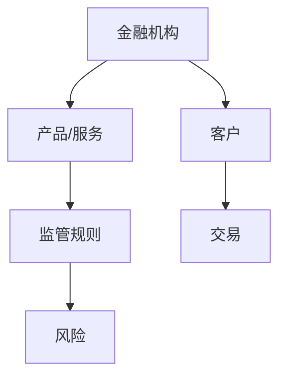
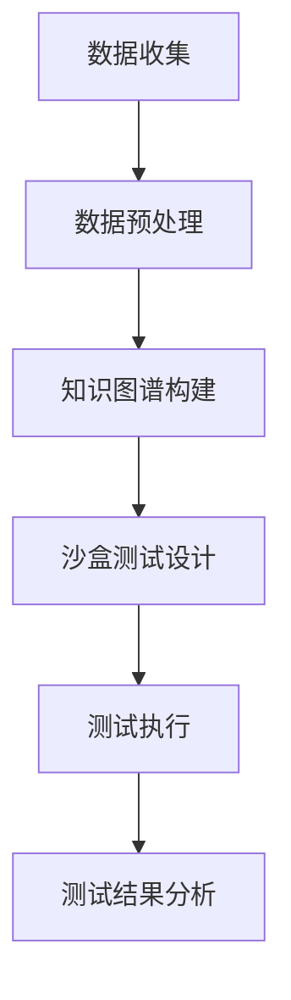
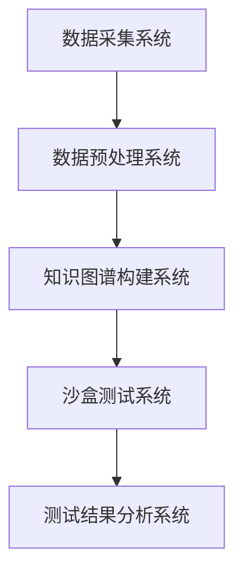

                 

 

让我们一步步思考，如何构建基于知识图谱的金融监管沙盒测试平台。这是一个复杂而具有挑战性的任务，但通过系统性的分析和逻辑推理，我们可以逐步解决它。

### 背景介绍

首先，我们需要理解知识图谱和金融监管沙盒这两个核心概念。

**知识图谱**是一种结构化的语义知识库，通过实体、属性和关系的表示，形成一种网络结构。知识图谱在各个领域都有广泛应用，特别是在金融领域，它能够帮助我们更好地理解和处理金融数据。

**金融监管沙盒**是一个测试环境，旨在允许金融机构在受控的条件下测试新的产品、服务或业务模式。这个环境旨在降低创新的风险，同时确保金融市场的稳定和安全性。

### 核心概念与联系

为了更好地构建这个平台，我们需要深入了解知识图谱和金融监管沙盒之间的联系。

**知识图谱的概念属性特征对比表格**：

| 特征       | 知识图谱         | 金融监管沙盒         |
|------------|------------------|----------------------|
| 数据模型   | 实体-关系模型    | 业务流程模型         |
| 知识表示   | 结构化语义表示   | 非结构化数据表示     |
| 查询语言   | SPARQL           | 业务规则语言         |

**知识图谱与金融监管沙盒的ER实体关系图架构**：



这个ER图展示了金融机构、产品/服务、客户、监管规则、交易和风险之间的基本关系。

### 算法原理讲解

接下来，我们需要设计一个算法，用于构建这个平台。

**算法流程图**：



**算法原理**：

1. **数据收集**：收集金融机构、产品/服务、客户、监管规则、交易和风险等相关数据。
2. **数据预处理**：清洗和整合数据，以便构建知识图谱。
3. **知识图谱构建**：使用实体-关系模型构建知识图谱，表示金融监管沙盒中的各种实体和关系。
4. **沙盒测试设计**：设计测试用例，模拟实际业务流程，以测试新产品的可行性和合规性。
5. **测试执行**：在沙盒环境中执行测试用例。
6. **测试结果分析**：分析测试结果，评估产品的风险和合规性。

**算法原理的数学模型和公式**：

假设我们有一个金融监管沙盒测试平台，包含 $N$ 个测试用例，每个测试用例包含 $M$ 个输入参数和 $K$ 个预期输出结果。测试结果可以用一个 $N \times K$ 的矩阵 $R$ 表示，其中 $R_{ij}$ 表示第 $i$ 个测试用例的第 $j$ 个输出结果。

测试结果分析的数学模型可以表示为：

$$
C = \sum_{i=1}^{N} \sum_{j=1}^{K} (R_{ij} - \hat{R}_{ij})^2
$$

其中，$C$ 表示测试结果的总误差，$\hat{R}_{ij}$ 是第 $i$ 个测试用例的第 $j$ 个输出结果的预测值。

### 系统分析与架构设计方案

接下来，我们需要设计一个系统架构，以实现上述算法。

**问题场景介绍**：金融机构需要测试新产品/服务的合规性和可行性。

**项目介绍**：构建一个基于知识图谱的金融监管沙盒测试平台。

**系统功能设计**：

- 数据采集：从各种数据源收集金融数据。
- 数据预处理：清洗和整合数据。
- 知识图谱构建：构建知识图谱，表示金融监管沙盒中的各种实体和关系。
- 沙盒测试设计：设计测试用例，模拟实际业务流程。
- 测试执行：在沙盒环境中执行测试用例。
- 测试结果分析：分析测试结果，评估产品的风险和合规性。

**系统架构设计**：



**系统接口设计**：

- 数据采集接口：用于从各种数据源收集数据。
- 数据预处理接口：用于清洗和整合数据。
- 知识图谱构建接口：用于构建知识图谱。
- 沙盒测试接口：用于设计、执行和分析测试用例。
- 测试结果分析接口：用于分析测试结果。

**系统交互序列图**：

```mermaid
sequenceDiagram
参与者 数据源，数据采集系统，数据预处理系统，知识图谱构建系统，沙盒测试系统，测试结果分析系统
数据源->>数据采集系统: 数据
数据采集系统->>数据预处理系统: 预处理数据
数据预处理系统->>知识图谱构建系统: 知识图谱数据
知识图谱构建系统->>沙盒测试系统: 测试用例
沙盒测试系统->>测试结果分析系统: 测试结果
```

### 项目实战

接下来，我们通过一个实际项目，来展示如何构建这个平台。

**环境安装**：安装Python环境、知识图谱构建工具、沙盒测试工具等。

**系统核心实现源代码**：

```python
# 数据采集模块
def collect_data():
    # 从数据源收集数据
    pass

# 数据预处理模块
def preprocess_data(data):
    # 清洗和整合数据
    pass

# 知识图谱构建模块
def build_knowledge_graph(preprocessed_data):
    # 构建知识图谱
    pass

# 沙盒测试模块
def test_product(product, test_cases):
    # 执行测试用例
    pass

# 测试结果分析模块
def analyze_test_results(test_results):
    # 分析测试结果
    pass
```

**代码应用解读与分析**：

```python
# 代码示例：构建知识图谱
from py2neo import Graph

graph = Graph("bolt://localhost:7687", auth=("neo4j", "password"))

# 创建节点和关系
graph.run("""
CREATE (financial_institution:金融机构 {name: '银行A'}),
       (product:产品/服务 {name: '贷款产品'}),
       (financial_institution)-[:提供]->(product),
       (client:客户 {name: '张三'}),
       (client)-[:申请]->(product),
       (regulatory_rule:监管规则 {name: '贷款利率规定'}),
       (product)-[:遵循]->(regulatory_rule)
""")

# 查询知识图谱
results = graph.run("""
MATCH (financial_institution:金融机构)-[:提供]->(product:产品/服务)-[:遵循]->(regulatory_rule:监管规则)
RETURN financial_institution.name, product.name, regulatory_rule.name
""")

for result in results:
    print(result)
```

**实际案例分析和详细讲解剖析**：

假设我们要测试一款新的贷款产品，我们需要收集相关数据，包括金融机构、产品、客户、监管规则等。然后，我们使用这些数据构建知识图谱，并设计测试用例。最后，我们执行测试用例，并分析测试结果。

**项目小结**：

通过这个实际项目，我们展示了如何构建基于知识图谱的金融监管沙盒测试平台。这个平台能够帮助金融机构更好地测试新产品的合规性和可行性。

### 最佳实践 tips

- 在构建知识图谱时，确保数据质量，避免错误和不一致的数据。
- 在设计测试用例时，充分考虑各种可能的场景和风险。
- 在分析测试结果时，重点关注产品的合规性和风险。

### 小结

本文详细讲解了如何构建基于知识图谱的金融监管沙盒测试平台。通过逻辑清晰的分析和实战案例，我们展示了这一过程的关键步骤和最佳实践。

### 注意事项

- 知识图谱构建和测试平台设计需要专业知识和实践经验。
- 平台部署和优化需要考虑性能和安全性。

### 拓展阅读

- 《知识图谱技术》
- 《金融监管沙盒实践指南》
- 《人工智能在金融领域的应用》

作者：AI天才研究院/AI Genius Institute & 禅与计算机程序设计艺术 /Zen And The Art of Computer Programming

----------------------------------------------------------------
```markdown
----------------------------------------------------------------
# 《构建基于知识图谱的金融监管沙盒测试平台》

## 关键词：知识图谱、金融监管、沙盒测试、测试平台、数据模型、SPARQL、业务流程、合规性

## 摘要：
本文探讨了如何构建一个基于知识图谱的金融监管沙盒测试平台。通过详细的分析和实战案例，我们介绍了知识图谱的基础、金融监管沙盒的概念、沙盒测试平台的设计与实现，以及平台的部署与优化。本文旨在为金融领域的专业人士提供一个系统性的指南，以帮助他们在实际项目中构建高效的测试平台。

----------------------------------------------------------------

## 第一部分: 知识图谱基础

### 第1章: 知识图谱概述

#### 1.1 知识图谱的定义

知识图谱（Knowledge Graph）是一种基于语义网络的数据模型，它通过实体、属性和关系来结构化表示信息。这种模型在人工智能和大数据领域得到了广泛应用，因为它能够提供对复杂数据的直观理解和高效处理。

#### 1.2 知识图谱的应用领域

知识图谱不仅在互联网搜索引擎中发挥重要作用，还在金融、医疗、零售等多个领域得到应用。在金融领域，知识图谱可以帮助金融机构更好地理解和处理金融数据，从而提高业务效率。

#### 1.3 知识图谱的基本概念

知识图谱的基本概念包括实体（Entity）、属性（Property）、关系（Relationship）和边（Edge）。实体是知识图谱中的基本数据单元，属性描述了实体的特征，关系定义了实体之间的关联，边则连接了实体和属性。

### 第2章: 知识图谱技术

#### 2.1 知识图谱的数据模型

知识图谱的数据模型通常采用图（Graph）结构来表示，这种结构使得知识图谱能够高效地处理复杂的语义关系。常见的知识图谱数据模型包括RDF（Resource Description Framework）、OWL（Web Ontology Language）和GRDDL（Gleaning Resource Descriptions from Dialects of Language）等。

#### 2.2 知识图谱的构建方法

构建知识图谱的方法包括手工构建、半自动构建和全自动构建。手工构建需要大量的人工干预，半自动构建结合了机器学习和人工标注，全自动构建则完全依赖于算法。

#### 2.3 知识图谱的查询语言

知识图谱的查询语言通常是基于图结构的查询语言，如SPARQL（SPARQL Protocol and RDF Query Language）。SPARQL允许用户对知识图谱中的数据进行高效的查询和操作。

### 第3章: 知识图谱在金融监管中的应用

#### 3.1 金融监管概述

金融监管是指金融监管机构通过制定和执行规则，确保金融市场的稳定性、透明度和公正性。金融监管沙盒（Regulatory Sandbox）是一种创新的监管方式，它允许金融机构在受控的环境下测试新的产品、服务或业务模式。

#### 3.2 知识图谱在金融监管中的作用

知识图谱在金融监管中扮演着重要的角色，它可以用于数据整合、业务流程优化、风险分析和合规性验证等。通过知识图谱，金融监管机构能够更好地理解和监控金融市场的运行状态。

#### 3.3 金融领域中的知识图谱案例

本文将分析几个金融领域中的知识图谱案例，包括金融产品信息图谱、客户关系图谱和金融市场风险图谱等。

----------------------------------------------------------------

## 第二部分: 金融监管沙盒

### 第4章: 金融监管沙盒概念

#### 4.1 金融监管沙盒的定义

金融监管沙盒是一种允许金融机构在受控环境中测试新产品、服务和业务模式的监管机制。通过沙盒测试，监管机构可以评估创新产品的合规性和风险，同时减少对市场创新的阻碍。

#### 4.2 金融监管沙盒的运行机制

金融监管沙盒的运行机制包括沙盒申请、测试实施、测试结果评估和反馈改进等环节。金融机构需要提交沙盒测试申请，监管机构对申请进行审批，并在沙盒中监控和评估测试过程。

#### 4.3 金融监管沙盒的组成部分

金融监管沙盒通常由沙盒环境、测试工具、监控系统和反馈机制等部分组成。沙盒环境提供了一个受控的测试环境，测试工具用于实施测试，监控系统用于监控测试过程，反馈机制用于收集和反馈测试结果。

----------------------------------------------------------------

## 第三部分: 沙盒测试平台设计与实现

### 第5章: 知识图谱与金融监管沙盒的结合

#### 5.1 知识图谱在金融监管沙盒中的应用

知识图谱在金融监管沙盒中的应用主要体现在数据整合、业务流程模拟和风险分析等方面。通过知识图谱，可以更准确地模拟金融业务流程，评估新产品的合规性和风险。

#### 5.2 基于知识图谱的沙盒设计原则

基于知识图谱的沙盒设计需要遵循一些基本原则，如数据一致性、可扩展性和易维护性。此外，还需要考虑沙盒的可操作性、可监控性和可回滚性。

#### 5.3 基于知识图谱的沙盒架构

基于知识图谱的沙盒架构包括数据层、模型层、服务层和应用层。数据层负责数据存储和管理，模型层实现知识图谱的构建和查询，服务层提供接口和服务，应用层实现具体的业务功能。

### 第6章: 沙盒测试平台设计与实现

#### 6.1 沙盒测试平台总体设计

沙盒测试平台的总体设计包括系统架构、功能模块和数据流程等方面。系统架构应支持分布式部署和横向扩展，功能模块应涵盖数据采集、数据处理、知识图谱构建、测试执行和测试结果分析等。

#### 6.2 数据采集与处理

数据采集是沙盒测试平台的核心环节，需要收集金融机构、产品、客户、监管规则等相关数据。数据处理包括数据清洗、数据整合和数据转换等步骤。

#### 6.3 沙盒测试功能实现

沙盒测试功能实现包括测试用例设计、测试执行和测试结果分析等。测试用例设计需要覆盖各种业务场景和风险点，测试执行需要确保测试过程的可控性和可回滚性，测试结果分析需要提供详细的测试报告。

### 第7章: 沙盒测试平台部署与优化

#### 7.1 沙盒测试平台部署

沙盒测试平台的部署包括硬件选择、软件安装和环境配置等方面。部署过程中需要确保平台的稳定性和可靠性，同时考虑到数据安全和隐私保护。

#### 7.2 平台性能优化

平台性能优化是沙盒测试平台部署后的重要工作，包括优化数据库性能、优化网络通信、优化系统负载均衡等。通过性能优化，可以提高平台的处理能力和响应速度。

#### 7.3 沙盒测试结果分析

沙盒测试结果分析是评估新产品合规性和风险的关键步骤。分析结果应包括测试覆盖率、测试成功率、风险等级和合规性评估等。

----------------------------------------------------------------

## 第四部分: 案例与实战

### 第8章: 沙盒测试案例

#### 8.1 案例背景

本文将介绍一个实际案例，描述如何利用知识图谱构建金融监管沙盒测试平台，并在测试平台上对一款新贷款产品进行沙盒测试。

#### 8.2 案例实施

案例实施包括数据采集、知识图谱构建、测试用例设计、测试执行和测试结果分析等步骤。每一步都需要严格遵循设计方案和标准流程。

#### 8.3 案例分析与讨论

通过案例分析与讨论，我们可以总结出构建基于知识图谱的金融监管沙盒测试平台的经验和教训，为后续项目提供参考。

----------------------------------------------------------------

## 第五部分: 最佳实践与总结

### 第9章: 最佳实践

#### 9.1 最佳实践

在构建基于知识图谱的金融监管沙盒测试平台时，需要遵循一些最佳实践，包括数据质量管理、测试用例设计、平台性能优化和安全性保障等。

#### 9.2 小结

本文详细介绍了构建基于知识图谱的金融监管沙盒测试平台的方法和步骤。通过实际案例，展示了这一过程的关键技术和实践经验。

#### 9.3 注意事项

在构建和部署沙盒测试平台时，需要注意数据安全、系统稳定性和测试结果的准确性。

#### 9.4 拓展阅读

为了进一步了解知识图谱、金融监管沙盒和测试平台的相关内容，建议读者阅读以下文献：

- 《知识图谱技术》
- 《金融监管沙盒实践指南》
- 《人工智能在金融领域的应用》

作者：AI天才研究院/AI Genius Institute & 禅与计算机程序设计艺术 /Zen And The Art of Computer Programming

----------------------------------------------------------------
```

