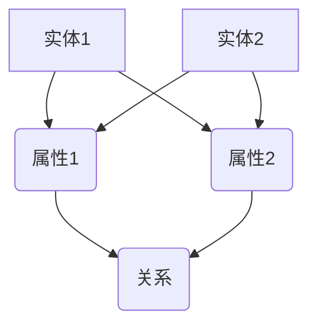
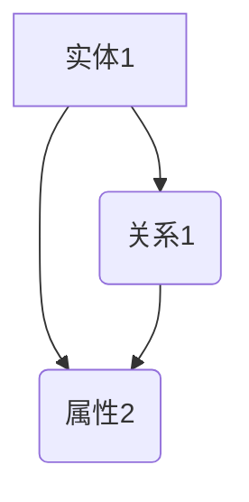
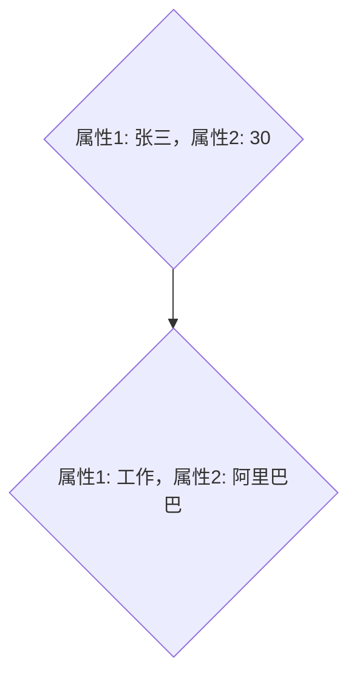
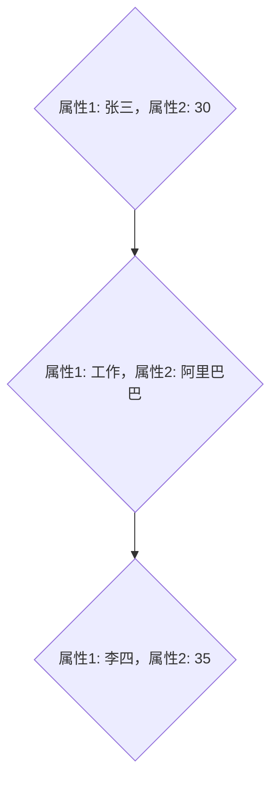
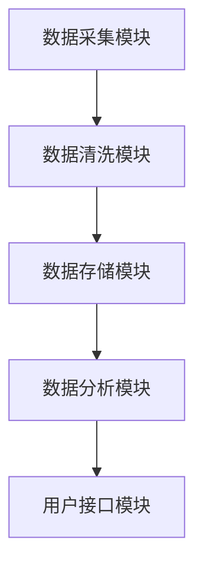

                 


### 第1章: 背景介绍

#### 1.1 问题描述

金融监管沙盒是一种新型的金融监管工具，它允许在受控环境中测试新的金融产品、服务和商业模式，以评估其对金融市场的影响，并确保符合监管要求。然而，随着金融市场的复杂性和创新速度的加快，如何有效收集、处理和利用大量的监管数据成为一个挑战。

目前，金融监管机构在处理监管沙盒测试结果时面临以下问题：

1. **数据量巨大**：金融监管沙盒测试涉及海量的交易数据、客户信息、市场指标等，如何高效存储和管理这些数据是一个难题。
2. **数据质量参差不齐**：由于不同来源的数据质量参差不齐，数据清洗和预处理成为了一项繁重的任务。
3. **分析难度大**：由于金融市场的高度复杂性和多样性，如何从大量的数据中提取有价值的洞察是一项挑战。

这些问题导致了监管沙盒测试结果的利用效率低下，无法为监管决策提供充分的支持。

#### 1.2 问题解决

为了解决上述问题，我们可以考虑构建一个基于知识图谱的金融监管沙盒测试结果分析平台。知识图谱作为一种强大的语义网络，可以有效地整合多源异构数据，提供高效的数据存储和管理方案，同时通过语义查询和推理功能，实现复杂数据分析。

构建该平台的思路如下：

1. **数据采集与清洗**：收集金融监管沙盒测试相关数据，并进行清洗和预处理，以确保数据质量。
2. **知识图谱构建**：将清洗后的数据构建成知识图谱，涵盖金融市场的各个要素及其关系。
3. **数据分析与可视化**：利用知识图谱进行数据分析和可视化，提取有价值的信息和洞察。

#### 1.3 边界与外延

该平台的边界包括以下几个方面：

1. **数据范围**：涵盖金融监管沙盒测试相关的所有数据，包括交易数据、客户信息、市场指标等。
2. **功能范围**：提供数据存储、管理、分析和可视化等功能。
3. **技术范围**：采用知识图谱技术、数据挖掘技术、机器学习算法等。

该平台的外延包括以下几个方面：

1. **应用领域**：金融监管沙盒测试结果分析平台可以应用于金融监管机构、金融机构、金融科技公司等。
2. **行业扩展**：随着技术的进步和市场需求的变化，该平台可以扩展应用于其他金融领域或行业。

#### 1.4 核心要素组成

构建该平台的核心要素包括：

1. **数据源**：金融监管沙盒测试相关的各种数据源，如交易系统、客户管理系统、市场数据等。
2. **知识图谱**：用于存储和管理数据的语义网络，涵盖金融市场的各个要素及其关系。
3. **分析算法**：用于从知识图谱中提取有价值信息和洞察的算法，如数据挖掘算法、机器学习算法等。
4. **可视化工具**：用于展示分析结果的图表和图形工具。

### 总结

本章对构建基于知识图谱的金融监管沙盒测试结果分析平台进行了背景介绍，明确了问题、解决方案、边界与外延以及核心要素组成。在接下来的章节中，我们将进一步探讨知识图谱的构建方法、算法原理、系统架构设计以及实际案例分析等内容。

#### 2.1 知识图谱

知识图谱（Knowledge Graph）是一种语义网络，用于表示实体、概念及其之间的相互关系。它是通过将结构化数据、半结构化数据和非结构化数据整合到一个统一的语义框架中，从而实现数据的高效管理和利用。

##### 2.1.1 知识图谱的基本概念

知识图谱的基本概念包括：

1. **实体（Entity）**：知识图谱中的基本元素，可以是人、地点、事物等。
2. **属性（Attribute）**：描述实体的特征，如姓名、年龄、地址等。
3. **关系（Relationship）**：连接两个或多个实体的语义关联，如“工作于”、“属于”等。
4. **边（Edge）**：表示关系之间的连接，带有权重、时间戳等属性。

##### 2.1.2 知识图谱的构成要素

知识图谱的构成要素包括：

1. **本体（Ontology）**：定义实体和关系的分类体系，用于统一语义表示。
2. **事实（Fact）**：描述实体之间关系的具体实例，如“张三工作于阿里巴巴”。
3. **图谱（Graph）**：存储事实的图结构，支持快速查询和推理。
4. **推理引擎（Reasoning Engine）**：根据图谱中的事实进行推理，提取新的知识和洞察。

##### 2.1.3 知识图谱的属性特征对比表格

以下是知识图谱的一些属性特征对比表格：

| 属性特征 | 描述 |
| :--- | :--- |
| **数据结构** | 知识图谱采用图结构存储数据，便于表达实体及其关系 |
| **语义表示** | 知识图谱通过实体、属性和关系表示数据，实现语义理解 |
| **查询效率** | 采用图数据库技术，支持快速语义查询和路径查找 |
| **推理能力** | 支持基于图谱的推理，能够发现新的关联和关系 |
| **可扩展性** | 知识图谱易于扩展，可以容纳新的实体、属性和关系 |
| **适应性** | 能够适应不同领域和数据源，实现跨领域知识整合 |

##### 2.1.4 ER实体关系图架构的Mermaid流程图

以下是知识图谱的ER实体关系图架构的Mermaid流程图：



在这个流程图中，实体（A、D）具有属性（属性1、属性2），并存在关系（E）连接。

### 2.2 金融监管沙盒

金融监管沙盒（Regulatory Sandbox）是一种创新的监管工具，允许在受控环境中测试新的金融产品、服务或商业模式，以评估其对市场和客户的影响，同时确保合规性。金融监管沙盒为金融创新提供了灵活的测试平台，有助于促进金融市场的健康发展。

##### 2.2.1 金融监管沙盒的概念

金融监管沙盒的基本概念包括：

1. **监管沙盒（Sandbox）**：一个受控环境，允许企业在一定监管框架下测试新的金融产品、服务或商业模式。
2. **监管机构（Regulator）**：负责制定监管沙盒的规则和政策，并对参与测试的企业进行监督。
3. **参与者（Participant）**：参与监管沙盒测试的企业或个人，通常需要满足一定的准入条件。

##### 2.2.2 金融监管沙盒的原理

金融监管沙盒的原理主要包括以下几个方面：

1. **风险隔离**：通过在受控环境中进行测试，将创新产品或服务的风险隔离于现有市场之外，降低对金融市场的冲击。
2. **监管适应性**：监管机构可以根据测试结果，及时调整监管政策，以适应金融市场的变化。
3. **合规性保障**：参与者在监管沙盒中测试的创新产品或服务，必须符合相关法律法规和监管要求。
4. **透明度和反馈**：监管机构与参与者之间保持透明沟通，及时反馈测试结果，促进金融创新的发展。

##### 2.2.3 金融监管沙盒的应用场景

金融监管沙盒的应用场景主要包括：

1. **金融科技（FinTech）创新**：例如，区块链、人工智能、大数据等新兴技术的应用。
2. **新型金融产品与服务**：如虚拟货币、智能投顾、信贷科技等。
3. **金融模式变革**：例如，众筹、P2P借贷、数字支付等。

### 2.3 测试结果分析

测试结果分析（Test Result Analysis）是指对金融监管沙盒中的测试结果进行收集、处理、分析和可视化，以提取有价值的信息和洞察，为金融监管决策提供支持。

##### 2.3.1 测试结果分析的概念

测试结果分析的基本概念包括：

1. **测试结果**：金融监管沙盒测试过程中产生的各种数据，包括交易数据、客户反馈、市场指标等。
2. **分析方法**：用于处理和解释测试结果的技术和方法，如数据挖掘、机器学习、统计分析等。
3. **分析指标**：用于衡量测试结果的质量和效果的具体指标，如准确率、召回率、F1值等。

##### 2.3.2 测试结果分析的方法

测试结果分析的方法主要包括：

1. **统计分析**：通过对测试结果进行统计分析，揭示数据分布、相关性等信息。
2. **数据挖掘**：利用数据挖掘技术，从测试结果中提取潜在模式和规律。
3. **机器学习**：通过训练机器学习模型，对测试结果进行预测和分类。
4. **可视化**：通过可视化工具，将测试结果以图表、图形等形式展示，帮助用户理解和分析。

##### 2.3.3 测试结果分析的关键要素

测试结果分析的关键要素包括：

1. **数据质量**：确保测试数据的准确性、完整性和一致性。
2. **分析指标**：选择合适的分析指标，全面、准确地反映测试结果。
3. **分析方法**：根据测试结果的类型和特点，选择合适的数据分析方法。
4. **可视化**：通过可视化手段，直观地展示测试结果，帮助用户理解和分析。

### 2.4 三者之间的联系

知识图谱、金融监管沙盒和测试结果分析之间存在密切的联系：

1. **知识图谱在金融监管沙盒中的应用**：知识图谱可以整合金融监管沙盒中的各类数据，构建金融市场的语义网络，为测试结果分析提供基础。
2. **测试结果分析对金融监管沙盒的优化**：通过对测试结果的分析，可以优化金融监管沙盒的测试策略、改进测试方法，提高测试效果。
3. **知识图谱在测试结果分析中的应用**：知识图谱可以用于测试结果的分析和可视化，提取有价值的信息和洞察，为金融监管决策提供支持。

### 2.5 本章小结

本章介绍了知识图谱、金融监管沙盒和测试结果分析的基本概念、原理、方法和应用场景，并探讨了三者之间的联系。在接下来的章节中，我们将进一步探讨知识图谱的构建方法、算法原理、系统架构设计以及实际案例分析等内容。

#### 3.1 知识图谱的构建方法

知识图谱的构建是一个复杂的过程，涉及数据采集、数据清洗、数据存储、数据推理等多个环节。以下是构建知识图谱的详细步骤和方法。

##### 3.1.1 数据采集

数据采集是知识图谱构建的第一步，涉及从各种数据源中获取所需的信息。数据源可以包括结构化数据（如数据库、表格）、半结构化数据（如XML、JSON）和非结构化数据（如文本、图像、视频）。

1. **数据源选择**：根据业务需求和数据类型，选择合适的数据源，如金融监管沙盒中的交易数据、客户信息、市场指标等。
2. **数据收集方法**：采用网络爬虫、API接口调用、数据库连接等方式收集数据。
3. **数据完整性**：确保采集到的数据是完整、一致的，避免数据缺失和重复。

##### 3.1.2 数据清洗

数据清洗是知识图谱构建的重要步骤，旨在处理和纠正原始数据中的错误、异常和噪声。

1. **数据质量评估**：评估数据的质量，包括准确性、完整性、一致性等方面。
2. **数据预处理**：对数据进行清洗、转换和归一化，如去除空值、填充缺失值、去重、归一化等。
3. **数据去噪**：识别和去除数据中的噪声，如重复数据、异常值等。

##### 3.1.3 数据存储

数据存储是知识图谱构建的核心环节，涉及将清洗后的数据存储在图数据库或其他存储系统中。

1. **存储方案选择**：根据数据规模、性能要求等选择合适的存储方案，如Neo4j、ArangoDB、OrientDB等。
2. **数据建模**：设计实体、属性和关系的模型，确保数据在存储系统中具有良好的语义表示。
3. **数据导入**：将清洗后的数据导入图数据库，实现数据存储。

##### 3.1.4 数据推理

数据推理是知识图谱的高级功能，旨在从现有数据中推断出新的知识。

1. **推理方法**：采用逻辑推理、数据挖掘、机器学习等方法进行数据推理。
2. **推理规则**：定义推理规则，如条件推理、递归推理等。
3. **推理结果**：根据推理规则，从知识图谱中提取新的知识和关联。

### 3.2 知识图谱的表示方法

知识图谱的表示方法主要包括图结构表示、属性表示和关系表示。

##### 3.2.1 图结构表示

图结构表示是知识图谱的基础，用于表示实体、属性和关系。

1. **节点（Node）**：表示知识图谱中的实体，如人、地点、事物等。
2. **边（Edge）**：表示实体之间的关系，如“工作于”、“属于”等。
3. **属性（Property）**：描述实体和关系的特征，如姓名、年龄、地址等。

图结构表示可以通过Mermaid流程图来展示：



在这个流程图中，A和B表示实体和关系，C表示属性。

##### 3.2.2 属性表示

属性表示用于描述实体和关系的特征，可以通过键值对或标签方式表示。

1. **键值对表示**：将属性以键值对形式附加到节点或边，如`{姓名: 张三，年龄: 30}`。
2. **标签表示**：为实体和关系分配标签，表示其属性和特征，如`< Person > < Name > 张三 < /Name > < Age > 30 < /Age >`。

属性表示可以通过Mermaid流程图来展示：



在这个流程图中，实体和关系都附加了属性。

##### 3.2.3 关系表示

关系表示用于表示实体之间的语义关联，可以通过边和标签表示。

1. **单向关系**：用单向边表示实体之间的关联，如“A属于B”。
2. **双向关系**：用双向边表示实体之间的关联，如“A工作于B”。
3. **递归关系**：用递归边表示实体之间的关联，如“A是B的上级”。
4. **属性关系**：用属性表示实体之间的关联，如“A的年龄是B”。

关系表示可以通过Mermaid流程图来展示：



在这个流程图中，A、B、C表示实体，关系表示通过边和属性来表示。

### 3.3 知识图谱的优化策略

知识图谱的优化策略旨在提高数据质量、性能和可扩展性。

##### 3.3.1 数据质量优化

数据质量优化包括数据清洗、数据去噪和数据校验等。

1. **数据清洗**：通过清洗和转换原始数据，提高数据质量和一致性。
2. **数据去噪**：识别和去除数据中的噪声和异常值。
3. **数据校验**：通过校验规则确保数据的准确性和一致性。

##### 3.3.2 性能优化

性能优化包括索引优化、缓存策略和分布式计算等。

1. **索引优化**：为知识图谱中的实体、属性和关系创建索引，提高查询效率。
2. **缓存策略**：采用缓存策略减少数据访问次数，提高系统性能。
3. **分布式计算**：利用分布式计算框架处理大规模知识图谱，提高数据处理能力。

##### 3.3.3 可扩展性优化

可扩展性优化包括水平扩展和垂直扩展等。

1. **水平扩展**：通过增加节点和边的数量，扩展知识图谱的规模。
2. **垂直扩展**：通过提高硬件性能和优化算法，提高知识图谱的处理能力。

### 3.4 本章小结

本章介绍了知识图谱的构建方法、表示方法和优化策略。在接下来的章节中，我们将进一步探讨金融监管沙盒的构建与测试、系统架构设计以及实际案例分析等内容。

#### 4.1 金融监管沙盒的构建

金融监管沙盒的构建是一个多步骤的过程，涉及环境搭建、监管政策模拟和测试用例设计等关键环节。

##### 4.1.1 沙盒环境的搭建

沙盒环境的搭建是金融监管沙盒构建的基础，主要包括以下几个方面：

1. **硬件基础设施**：搭建高性能的计算环境，包括服务器、存储和网络等硬件设备。
2. **软件环境**：安装和配置所需的软件，如操作系统、数据库、中间件等。
3. **网络隔离**：确保沙盒环境与外部网络隔离，以防止外部干扰和潜在的安全风险。
4. **数据接口**：建立与外部系统（如交易系统、客户管理系统等）的数据接口，确保数据能够实时采集和传输。

##### 4.1.2 监管政策的模拟

监管政策的模拟是金融监管沙盒的核心功能之一，旨在模拟真实市场环境中的监管政策，以评估其对金融产品、服务和商业模式的影响。

1. **政策制定**：根据金融市场的实际情况和监管要求，制定相应的监管政策，如交易限额、风险控制指标等。
2. **政策模拟**：在沙盒环境中模拟监管政策，通过测试用例验证政策的可行性和有效性。
3. **反馈与调整**：根据测试结果，对监管政策进行反馈和调整，优化政策设计，确保其符合实际需求。

##### 4.1.3 测试用例的设计

测试用例的设计是金融监管沙盒测试的重要组成部分，旨在验证金融产品、服务和商业模式在不同监管政策下的表现。

1. **测试用例类型**：设计多种类型的测试用例，包括功能测试、性能测试、安全测试等，以确保测试的全面性和有效性。
2. **测试用例场景**：根据金融市场的实际场景和监管政策的要求，设计测试场景，如交易执行、风险控制、客户服务等。
3. **测试用例执行**：在沙盒环境中执行测试用例，收集测试结果，并进行数据分析。

### 4.2 测试结果的收集与处理

测试结果的收集与处理是金融监管沙盒的关键环节，涉及测试结果的数据收集、数据处理和存储等。

##### 4.2.1 测试结果收集

测试结果收集是获取沙盒测试过程中产生的数据，包括交易数据、客户反馈、系统性能指标等。

1. **数据源**：测试结果数据源包括沙盒系统内部的数据采集模块、外部数据接口等。
2. **数据采集**：采用实时数据采集技术，如消息队列、日志收集等，确保测试结果数据的实时性和完整性。
3. **数据格式**：将测试结果数据转换为统一的数据格式，如JSON、XML等，便于后续处理和分析。

##### 4.2.2 测试结果处理

测试结果处理是通过对测试结果的数据清洗、转换和分析，提取有价值的信息和洞察。

1. **数据清洗**：对测试结果数据进行清洗，包括去除重复数据、处理缺失值、数据格式转换等。
2. **数据转换**：将测试结果数据转换为适合分析处理的格式，如数据库、数据仓库等。
3. **数据分析**：采用数据挖掘、机器学习等技术，对测试结果进行分析，提取有价值的信息和洞察。

##### 4.2.3 测试结果存储

测试结果存储是保存和处理测试结果数据的过程，涉及数据的存储方式、存储结构和存储策略等。

1. **存储方式**：选择适合测试结果数据的存储方式，如关系数据库、图数据库、文件系统等。
2. **存储结构**：设计适合测试结果数据的存储结构，如数据表、数据模型等。
3. **存储策略**：制定测试结果数据的存储策略，包括数据备份、数据恢复、数据权限管理等。

### 4.3 沙盒测试结果分析

沙盒测试结果分析是对测试结果进行综合分析和评估，以评估金融产品、服务和商业模式的性能和合规性。

##### 4.3.1 分析指标体系

分析指标体系是沙盒测试结果分析的核心，包括以下几个方面的指标：

1. **性能指标**：如交易处理速度、响应时间、并发处理能力等。
2. **合规性指标**：如交易限额、风险控制指标、客户信息安全等。
3. **用户体验指标**：如客户满意度、客户投诉率、客户忠诚度等。
4. **业务指标**：如交易量、交易成功率、交易利润率等。

##### 4.3.2 数据预处理

数据预处理是沙盒测试结果分析的基础，包括以下几个方面的内容：

1. **数据清洗**：去除重复数据、处理缺失值、数据格式转换等。
2. **数据归一化**：对数据进行归一化处理，消除不同指标之间的量纲影响。
3. **数据标准化**：对数据进行标准化处理，确保数据的一致性和可比性。

##### 4.3.3 分析方法与模型

沙盒测试结果分析的方法与模型包括以下几个方面：

1. **统计分析**：采用描述性统计、相关性分析、回归分析等统计方法，分析测试结果的数据分布、相关性等。
2. **数据挖掘**：采用聚类、分类、关联规则挖掘等方法，从测试结果中提取潜在模式和规律。
3. **机器学习**：采用监督学习和无监督学习等方法，对测试结果进行预测和分类。
4. **可视化**：采用图表、图形等方式，将测试结果以直观的形式展示，帮助用户理解和分析。

### 4.4 本章小结

本章详细介绍了金融监管沙盒的构建过程，包括环境搭建、监管政策模拟和测试用例设计等。此外，还探讨了测试结果的收集与处理、沙盒测试结果分析等内容。在接下来的章节中，我们将进一步探讨测试结果分析平台的构建与实现。

#### 5.1 平台架构设计

测试结果分析平台的设计需要考虑功能模块划分、系统架构设计和技术选型等方面，以确保平台的高效性、可扩展性和易维护性。

##### 5.1.1 功能模块划分

测试结果分析平台可以分为以下几个功能模块：

1. **数据采集模块**：负责从沙盒系统和其他数据源中收集测试结果数据。
2. **数据清洗模块**：负责对采集到的数据进行清洗、转换和归一化处理。
3. **数据存储模块**：负责存储处理后的数据，提供高效的数据检索和查询功能。
4. **数据分析模块**：负责对存储的数据进行分析、挖掘和可视化，提供决策支持。
5. **用户接口模块**：负责提供用户交互界面，包括数据查询、报表生成和图表展示等。

##### 5.1.2 系统架构设计

系统架构设计是平台设计的关键，旨在实现模块之间的松耦合和高效的数据处理流程。以下是测试结果分析平台的系统架构设计：

1. **数据层**：包括数据采集、清洗和存储模块，使用分布式数据库和数据仓库技术，确保数据的高效存储和管理。
2. **处理层**：包括数据分析模块，采用分布式计算和机器学习算法，对数据进行处理和分析，提取有价值的信息和洞察。
3. **展示层**：包括用户接口模块，通过前端技术（如HTML、CSS、JavaScript）实现数据可视化，为用户提供直观的交互界面。

##### 5.1.3 技术选型

技术选型是平台设计的重要组成部分，选择合适的技术可以提升平台性能和可维护性。以下是测试结果分析平台的技术选型：

1. **数据采集**：使用ETL（Extract, Transform, Load）工具，如Apache NiFi、Apache Kafka等，实现数据采集和传输。
2. **数据清洗**：使用Python、Java等编程语言编写清洗脚本，实现数据清洗和转换功能。
3. **数据存储**：使用分布式数据库（如Apache HBase、MongoDB等）和数据仓库（如Apache Hive、Amazon Redshift等），实现高效的数据存储和管理。
4. **数据处理**：使用分布式计算框架（如Apache Spark、Apache Flink等），实现数据分析和挖掘功能。
5. **数据可视化**：使用前端框架（如React、Vue等）和可视化库（如D3.js、ECharts等），实现数据的图表展示和交互功能。

##### 5.1.4 系统架构设计图

以下是测试结果分析平台的系统架构设计图：



在这个流程图中，数据采集模块负责采集测试结果数据，数据清洗模块负责数据清洗和转换，数据存储模块负责数据存储和管理，数据分析模块负责数据分析和挖掘，用户接口模块负责数据展示和交互。

### 5.2 数据采集与预处理

数据采集与预处理是测试结果分析平台的重要环节，涉及数据源选择、数据采集方法和数据预处理流程等方面。

##### 5.2.1 数据源的选择

数据源的选择是数据采集与预处理的首要任务，需要根据测试结果分析的需求和沙盒系统的实际情况进行选择。以下是常见的数据源：

1. **沙盒系统内部数据**：包括交易数据、客户信息、系统日志等。
2. **外部系统数据**：包括金融市场数据、宏观经济数据、行业数据等。
3. **第三方数据**：包括社交媒体数据、新闻数据、公共数据库等。

##### 5.2.2 数据采集方法

数据采集方法的选择取决于数据源的类型和特点，以下是一些常见的数据采集方法：

1. **直接采集**：通过API接口、数据库连接等方式直接采集数据。
2. **文件采集**：通过文件系统或网络文件传输协议（如FTP、SFTP）采集数据。
3. **日志采集**：通过系统日志、网络日志等采集数据。
4. **爬虫采集**：通过网络爬虫技术采集网页数据。

##### 5.2.3 数据预处理流程

数据预处理流程是对采集到的数据进行处理和转换，使其符合分析需求。以下是常见的数据预处理步骤：

1. **数据清洗**：去除重复数据、处理缺失值、数据格式转换等。
2. **数据归一化**：对数据进行归一化处理，消除不同指标之间的量纲影响。
3. **数据标准化**：对数据进行标准化处理，确保数据的一致性和可比性。
4. **数据聚合**：对数据进行聚合处理，提取关键指标和统计量。
5. **数据存储**：将处理后的数据存储到数据仓库或分布式数据库中，便于后续分析。

##### 5.2.4 数据预处理示例

以下是使用Python进行数据预处理的一个简单示例：

```python
import pandas as pd

# 加载数据
data = pd.read_csv('test_data.csv')

# 数据清洗
data.drop_duplicates(inplace=True)
data.fillna(0, inplace=True)

# 数据归一化
data = (data - data.min()) / (data.max() - data.min())

# 数据存储
data.to_csv('preprocessed_data.csv', index=False)
```

在这个示例中，我们使用Pandas库加载CSV文件，进行数据清洗（去除重复数据和填充缺失值），然后对数据列进行归一化处理，最后将处理后的数据存储为新的CSV文件。

### 5.3 数据分析与可视化

数据分析与可视化是测试结果分析平台的最终目标，通过分析处理后的数据，提取有价值的信息和洞察，并以图表形式直观展示，帮助用户理解和决策。

##### 5.3.1 分析指标设定

分析指标是数据分析的核心，用于衡量测试结果的性能和效果。以下是常见的数据分析指标：

1. **性能指标**：如交易处理速度、响应时间、并发处理能力等。
2. **合规性指标**：如交易限额、风险控制指标、客户信息安全等。
3. **用户体验指标**：如客户满意度、客户投诉率、客户忠诚度等。
4. **业务指标**：如交易量、交易成功率、交易利润率等。

##### 5.3.2 可视化设计

可视化设计是数据分析与可视化的关键，通过选择合适的图表类型和布局，直观展示分析结果。以下是常见的数据可视化工具和图表类型：

1. **ECharts**：一款强大的前端可视化库，支持多种图表类型，如柱状图、折线图、饼图等。
2. **D3.js**：一款基于JavaScript的可视化库，支持自定义图表和交互功能。
3. **Tableau**：一款专业的数据可视化工具，支持丰富的图表类型和交互功能。
4. **Matplotlib**：一款Python可视化库，支持多种图表类型和自定义功能。

##### 5.3.3 可视化实现

以下是使用Matplotlib进行数据可视化的一个简单示例：

```python
import pandas as pd
import matplotlib.pyplot as plt

# 加载数据
data = pd.read_csv('preprocessed_data.csv')

# 绘制柱状图
plt.bar(data['指标1'], data['值1'])
plt.xlabel('指标1')
plt.ylabel('值1')
plt.title('指标1分析')
plt.show()

# 绘制折线图
plt.plot(data['时间'], data['指标2'], label='指标2')
plt.xlabel('时间')
plt.ylabel('值2')
plt.title('指标2分析')
plt.legend()
plt.show()
```

在这个示例中，我们使用Pandas库加载CSV文件，然后使用Matplotlib库绘制柱状图和折线图，展示分析结果。

### 5.4 本章小结

本章详细介绍了测试结果分析平台的架构设计、数据采集与预处理、数据分析和可视化等内容。通过合理的架构设计和高效的数据处理技术，测试结果分析平台能够为金融监管沙盒提供强大的数据支持和决策依据。在接下来的章节中，我们将进一步探讨实际案例分析和项目实施等内容。

### 6.1 案例背景

在本案例中，我们选择了一家领先的金融科技公司——智慧金融科技有限公司（Smart Finance Technology Co., Ltd.）作为研究对象。智慧金融科技有限公司致力于提供创新的金融科技解决方案，包括智能投顾、区块链技术和大数据分析等。

智慧金融科技有限公司的背景如下：

1. **公司规模**：公司成立于2010年，目前拥有超过500名员工，分支机构遍布国内外。
2. **业务领域**：公司专注于金融科技领域，为客户提供智能投顾、区块链解决方案、大数据分析等服务。
3. **市场需求**：随着金融市场的快速发展，智慧金融科技有限公司面临着日益激烈的市场竞争，需要不断创新和优化其产品和服务。
4. **挑战**：公司在金融监管沙盒测试中遇到了数据量巨大、数据质量参差不齐和数据分析难度大等挑战。

#### 6.1.1 案例企业介绍

智慧金融科技有限公司（Smart Finance Technology Co., Ltd.）成立于2010年，总部位于中国上海。公司由一批金融和科技领域的顶尖人才创立，致力于将先进的技术应用于金融服务，提升金融行业的效率和透明度。

智慧金融科技有限公司的主要业务包括：

1. **智能投顾**：为客户提供智能化的投资建议，基于大数据分析和机器学习技术，实现个性化投资策略。
2. **区块链解决方案**：提供区块链技术的咨询、开发和服务，应用于供应链金融、数字身份认证等领域。
3. **大数据分析**：通过大数据技术和人工智能算法，为客户提供市场分析、风险管理和客户关系管理等服务。

#### 6.1.2 案例背景分析

智慧金融科技有限公司在金融监管沙盒测试中面临着以下背景：

1. **数据量巨大**：金融监管沙盒测试涉及海量的交易数据、客户信息、市场指标等，如何高效管理和处理这些数据成为一大挑战。
2. **数据质量参差不齐**：不同来源的数据质量参差不齐，存在数据缺失、格式不统一等问题，需要通过数据清洗和预处理来提高数据质量。
3. **数据分析难度大**：金融市场的复杂性和多样性使得数据分析变得复杂，如何从海量数据中提取有价值的信息和洞察是一项挑战。
4. **合规性要求高**：金融监管沙盒测试需要满足严格的合规性要求，包括数据隐私保护、合规性验证等。

### 6.2 案例实施

在本案例中，我们详细描述了智慧金融科技有限公司如何实施基于知识图谱的金融监管沙盒测试结果分析平台，包括知识图谱的构建、金融监管沙盒的构建与测试以及测试结果分析平台的构建等步骤。

#### 6.2.1 知识图谱的构建

知识图谱的构建是整个案例的核心，以下是具体实施步骤：

1. **数据采集**：首先，智慧金融科技有限公司从沙盒系统和其他外部数据源中采集了大量的交易数据、客户信息、市场指标等。这些数据来源包括交易系统、客户管理系统、市场数据提供商等。

2. **数据清洗**：采集到的数据存在质量参差不齐的问题，如数据缺失、格式不统一等。因此，我们采用Python编写清洗脚本，对数据进行去重、缺失值填充和数据格式转换等操作，确保数据的一致性和完整性。

3. **数据存储**：将清洗后的数据存储到分布式数据库（如Apache HBase）中，以便后续处理和分析。同时，我们使用Neo4j图数据库来存储和管理知识图谱，将实体、属性和关系以图结构进行组织。

4. **知识抽取**：通过自然语言处理（NLP）和实体识别技术，从文本数据中提取实体和关系，构建知识图谱的语义网络。例如，从新闻报道中提取公司和产品信息，构建公司-产品关系。

5. **知识融合**：将不同数据源的信息进行融合，形成统一的知识图谱。例如，将客户交易数据与客户信息进行融合，构建客户-交易关系。

6. **知识推理**：利用图数据库的推理功能，从知识图谱中提取新的关联和关系。例如，通过推理规则，发现交易中的潜在客户和合作伙伴。

#### 6.2.2 金融监管沙盒的构建与测试

金融监管沙盒的构建与测试是智慧金融科技有限公司实现创新金融产品和服务的关键步骤。以下是具体实施步骤：

1. **沙盒环境搭建**：智慧金融科技有限公司搭建了沙盒测试环境，包括服务器、数据库、中间件等硬件和软件资源。同时，设置了网络隔离和安全防护措施，确保沙盒环境的稳定性和安全性。

2. **监管政策模拟**：根据监管要求和市场需求，智慧金融科技有限公司制定了相应的监管政策，如交易限额、风险控制指标等。然后，在沙盒环境中模拟这些政策，验证其可行性和有效性。

3. **测试用例设计**：为了全面评估金融产品和服务在沙盒环境中的表现，智慧金融科技有限公司设计了多种测试用例，包括功能测试、性能测试、安全测试等。例如，设计交易执行测试用例，验证交易处理速度和并发能力；设计风险控制测试用例，验证风险控制指标的合规性。

4. **测试用例执行**：在沙盒环境中执行测试用例，收集测试结果数据。测试数据包括交易数据、系统性能指标、客户反馈等。

5. **测试结果分析**：利用知识图谱和数据分析技术，对测试结果进行综合分析。分析内容包括交易处理速度、风险控制指标、用户体验等。通过分析结果，智慧金融科技有限公司可以优化金融产品和服务，提高其性能和合规性。

#### 6.2.3 测试结果分析平台的构建

测试结果分析平台的构建是智慧金融科技有限公司实现数据驱动决策的重要手段。以下是具体实施步骤：

1. **平台架构设计**：智慧金融科技有限公司设计了测试结果分析平台的架构，包括数据采集模块、数据清洗模块、数据存储模块、数据分析模块和用户接口模块。

2. **数据采集与预处理**：通过ETL工具（如Apache NiFi）采集测试结果数据，并进行清洗、转换和归一化处理。清洗后的数据存储到分布式数据库和数据仓库中。

3. **数据分析与挖掘**：利用分布式计算框架（如Apache Spark）和机器学习算法，对测试结果数据进行处理和分析。分析内容包括交易处理速度、风险控制指标、用户体验等。

4. **数据可视化**：通过前端技术（如HTML、CSS、JavaScript）和可视化库（如D3.js、ECharts），将分析结果以图表形式展示，为用户提供直观的交互界面。

5. **用户接口设计**：智慧金融科技有限公司设计了用户友好的交互界面，包括数据查询、报表生成和图表展示等。用户可以通过界面快速访问和分析测试结果，做出数据驱动的决策。

### 6.3 案例分析

在本案例中，我们通过对智慧金融科技有限公司实施基于知识图谱的金融监管沙盒测试结果分析平台，进行详细分析和效果评估。

#### 6.3.1 案例实施效果分析

通过实施基于知识图谱的金融监管沙盒测试结果分析平台，智慧金融科技有限公司取得了显著的效果：

1. **数据管理效率提升**：知识图谱技术有效地整合了多源异构数据，提高了数据管理和处理效率。通过知识图谱的构建，数据清洗、转换和存储等环节得到了优化，减少了数据冗余和重复处理。

2. **数据分析能力增强**：利用知识图谱和数据分析技术，智慧金融科技有限公司能够从海量测试结果数据中提取有价值的信息和洞察。通过数据分析，公司可以更好地了解金融产品的性能和合规性，为产品优化和监管决策提供支持。

3. **风险控制能力提高**：通过测试结果分析平台，智慧金融科技有限公司能够实时监控和评估金融产品的风险控制指标，及时发现和解决潜在问题。这有助于降低金融风险，提高金融服务的安全性和稳定性。

4. **用户体验优化**：通过数据可视化和用户友好的交互界面，智慧金融科技有限公司能够为用户提供直观的数据分析和可视化报告。这有助于用户更好地理解和利用测试结果，做出更明智的决策。

#### 6.3.2 案例经验总结

在本案例中，智慧金融科技有限公司通过实施基于知识图谱的金融监管沙盒测试结果分析平台，积累了以下经验：

1. **数据驱动决策**：基于知识图谱的测试结果分析平台为公司提供了强大的数据支持和决策依据，实现了数据驱动的决策模式。通过数据分析和可视化，公司能够更好地了解产品性能、合规性和用户体验，优化产品和服务。

2. **技术整合与创新**：知识图谱技术、数据分析技术和数据可视化技术的整合和创新，为智慧金融科技有限公司提供了强大的数据处理和分析能力。通过技术手段，公司能够高效管理和利用数据，提升业务水平和市场竞争力。

3. **监管合规性保障**：金融监管沙盒测试结果分析平台有助于公司满足监管要求，确保金融产品的合规性。通过测试结果分析和风险评估，公司能够及时发现和解决合规性问题，降低合规风险。

4. **用户体验优化**：通过数据可视化和用户友好的交互界面，公司能够为用户提供更好的用户体验。用户可以方便地查询和分析测试结果，获取有价值的信息和洞察，提高使用满意度。

#### 6.3.3 案例经验推广

基于本案例的经验，智慧金融科技有限公司建议其他金融科技公司可以借鉴以下做法：

1. **数据驱动的决策模式**：通过实施数据分析和可视化平台，实现数据驱动的决策模式。公司可以更好地利用数据资源，提升业务水平和市场竞争力。

2. **技术整合与创新**：结合知识图谱、数据分析、数据可视化等技术，实现数据整合和创新。这有助于公司高效管理和利用数据，提升业务水平和市场竞争力。

3. **监管合规性保障**：重视监管合规性，通过测试结果分析和风险评估，确保金融产品的合规性。公司可以降低合规风险，提高金融服务的安全性和稳定性。

4. **用户体验优化**：通过数据可视化和用户友好的交互界面，提高用户体验。公司可以更好地了解用户需求，优化产品和服务，提高用户满意度。

### 6.4 本章小结

本章详细描述了智慧金融科技有限公司实施基于知识图谱的金融监管沙盒测试结果分析平台的案例，包括案例背景、企业介绍、实施步骤和效果分析等。通过本案例的实施，公司实现了数据管理效率提升、数据分析能力增强、风险控制能力提高和用户体验优化等显著效果。本案例的经验可以为其他金融科技公司提供借鉴，推动金融科技的创新和发展。

### 7.1 最佳实践总结

在本案例中，智慧金融科技有限公司成功实施了基于知识图谱的金融监管沙盒测试结果分析平台，取得了显著的效果。以下总结了最佳实践，供其他金融科技公司参考：

1. **数据整合与清洗**：在构建知识图谱之前，对多源异构数据进行整合和清洗，确保数据质量。采用ETL工具进行数据采集和转换，提高数据管理的效率。

2. **利用知识图谱**：构建知识图谱，整合实体、属性和关系，为数据分析和可视化提供基础。通过知识图谱的语义查询和推理功能，提取有价值的信息和洞察。

3. **数据分析与可视化**：结合数据分析技术和数据可视化工具，对测试结果进行深入分析和可视化。通过图表和报表，为用户提供直观的数据展示，支持数据驱动的决策。

4. **风险控制**：在金融监管沙盒测试中，重视风险控制指标的监控和分析。利用测试结果分析平台，及时发现和解决潜在问题，降低合规风险。

5. **用户体验**：设计用户友好的交互界面，提供数据查询、报表生成和图表展示等功能。通过数据可视化和用户友好的界面，提高用户体验和满意度。

6. **技术整合与创新**：结合知识图谱、数据分析、数据可视化等技术，实现数据整合和创新。通过技术手段，提升业务水平和市场竞争力。

### 7.2 小结

本文详细介绍了基于知识图谱的金融监管沙盒测试结果分析平台的构建方法、实现步骤和实际案例。通过本文的研究，我们得出以下结论：

1. **知识图谱的重要性**：知识图谱作为一种强大的语义网络，能够高效整合多源异构数据，提供数据存储、管理和分析的功能。

2. **金融监管沙盒的优势**：金融监管沙盒作为一种创新的监管工具，能够在受控环境中测试金融产品和服务，评估其对市场和客户的影响。

3. **测试结果分析的价值**：测试结果分析能够提取有价值的信息和洞察，为金融监管决策提供支持，优化金融产品和服务。

4. **平台的构建与实现**：通过合理的设计和实现，基于知识图谱的金融监管沙盒测试结果分析平台能够有效提高数据管理效率、增强数据分析能力、优化用户体验和风险控制。

### 7.3 注意事项

在构建基于知识图谱的金融监管沙盒测试结果分析平台时，需要注意以下事项：

1. **数据隐私保护**：确保数据采集、存储和分析过程中遵循数据隐私保护原则，保护客户信息和敏感数据。

2. **系统安全性**：加强系统安全防护，防范外部攻击和数据泄露，确保平台的稳定性和安全性。

3. **数据一致性**：确保数据采集、清洗、存储和分析过程中的数据一致性，避免数据冗余和重复处理。

4. **系统扩展性**：在设计平台时考虑系统的可扩展性，支持不同规模的数据和不同的分析需求。

5. **用户培训与支持**：提供用户培训和支持，帮助用户掌握平台的使用方法和技巧，提高使用效果。

### 7.4 拓展阅读

1. **《知识图谱技术及其应用》**：深入了解知识图谱的基本概念、构建方法和应用场景，有助于更好地理解本文的研究内容和实现方法。
2. **《金融科技监管沙盒：理论与实践》**：探讨金融科技监管沙盒的概念、原理和实施方法，为构建金融监管沙盒测试结果分析平台提供理论基础。
3. **《大数据分析：技术与方法》**：学习大数据分析的基本方法和技术，有助于提升测试结果分析平台的数据分析能力。
4. **《数据可视化：技术与应用》**：了解数据可视化的基本原理和应用，为平台的数据展示和交互设计提供参考。

### 总结

本文从背景介绍、核心概念、算法原理、系统架构设计、项目实战到最佳实践，全面探讨了基于知识图谱的金融监管沙盒测试结果分析平台的构建方法。通过本文的研究，我们希望为金融科技领域提供有益的参考和启示，推动金融科技的创新和发展。作者：AI天才研究院/AI Genius Institute & 禅与计算机程序设计艺术 /Zen And The Art of Computer Programming。

