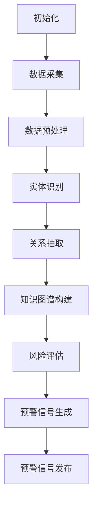
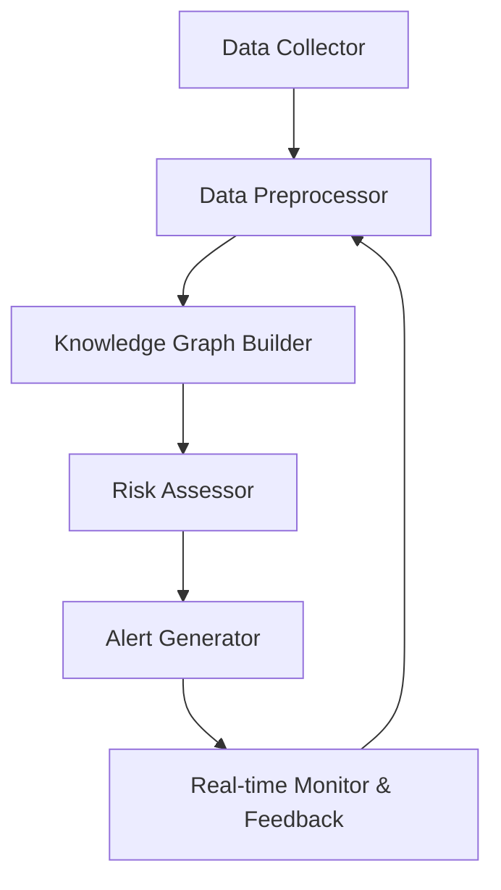

                 

### 文章标题：《构建基于知识图谱的金融风险关联网络动态预警系统》

> 关键词：知识图谱、金融风险、动态预警系统、关联网络、算法原理、系统架构

> 摘要：本文深入探讨了如何构建基于知识图谱的金融风险关联网络动态预警系统。首先，介绍了知识图谱的基本概念、构建方法和应用场景，然后详细阐述了金融风险关联网络的定义及其与知识图谱的关联。接着，讨论了动态预警系统的原理和设计，并通过Python源代码和数学模型，对算法原理进行了深入剖析。随后，详细介绍了系统的架构设计、核心实现及实战案例。最后，总结了最佳实践和注意事项，为金融风险管理提供了有价值的参考。本文旨在帮助读者理解和掌握如何利用知识图谱技术构建高效的金融风险预警系统。

----------------------------------------------------------------

### 第一部分：背景介绍

#### 1.1 问题背景

在当今金融行业中，风险管理是一个至关重要的环节。随着金融市场的发展和全球化进程的加快，金融风险呈现出复杂性和动态性的特点。传统的风险管理方法往往依赖于统计分析和规则引擎，但这些方法在面对日益复杂的风险网络时显得力不从心。因此，如何有效地识别、分析和预测金融风险，成为了金融行业亟待解决的问题。

**金融风险管理的挑战**：

- **复杂性与动态性**：金融市场的风险关联网络复杂且不断变化，需要实时、动态的风险分析能力。
- **海量数据**：金融交易、市场数据等海量数据的处理和挖掘，要求高效的数据处理和分析技术。
- **准确性**：准确识别和预测风险是金融风险管理的核心，但传统的统计分析方法在准确性方面存在一定局限。

**知识图谱的应用前景**：

知识图谱作为一种结构化的知识表示方式，通过实体、属性和关系的语义网络，为复杂关系的挖掘和分析提供了强有力的工具。在金融风险管理领域，知识图谱的应用主要体现在以下几个方面：

- **实体识别与关系抽取**：通过知识图谱可以精确识别金融实体（如金融机构、产品、客户等）及其相互关系，为风险分析提供基础。
- **关联网络构建**：知识图谱可以构建复杂的金融风险关联网络，揭示潜在的金融风险传播路径。
- **动态预警**：基于知识图谱的动态预警系统可以实现实时、动态的风险监测和预测，提高风险管理的响应速度。

**动态预警系统的需求**：

动态预警系统是金融风险管理的关键环节，其主要需求包括：

- **实时性**：系统需要实时获取和处理金融数据，及时识别风险。
- **准确性**：系统需要准确预测和评估风险，提供可靠的预警信息。
- **适应性**：系统需要能够适应金融市场环境的变化，不断优化预警模型。

在接下来的章节中，我们将详细探讨知识图谱的基本概念、构建方法及其在金融风险关联网络动态预警系统中的应用，帮助读者深入理解这一技术及其在金融风险管理中的潜力。

----------------------------------------------------------------

### 1.2 核心概念介绍

在本节中，我们将介绍知识图谱、金融风险关联网络以及动态预警系统的基本概念，为后续章节的分析奠定基础。

#### 1.2.1 知识图谱的基本概念

知识图谱（Knowledge Graph）是一种通过语义关系来组织信息的图形化数据结构，它将现实世界中的实体、属性和关系以结构化的形式进行表示。知识图谱的核心思想是通过语义网络来揭示实体之间的关联，从而实现对复杂信息的深度理解和高效检索。

**知识图谱的组成要素**：

1. **实体（Entity）**：知识图谱中的基本构建块，代表现实世界中的各种对象，如人、地点、事物等。
2. **属性（Attribute）**：实体的特征或性质，用于描述实体具有的具体信息，如人的年龄、地点的经纬度等。
3. **关系（Relationship）**：实体之间的语义关联，表示实体之间的交互和影响，如“属于”、“位于”、“购买”等。

**知识图谱的基本操作**：

1. **实体识别与分类**：从非结构化数据中识别出实体，并对其进行分类。
2. **关系抽取与建模**：从数据源中提取实体之间的关系，并建立相应的模型。
3. **知识融合与更新**：将多个数据源中的知识进行融合，并定期更新知识库，以保持知识的一致性和准确性。

**知识图谱的应用场景**：

1. **搜索引擎**：通过知识图谱提供更精准、更智能的搜索结果。
2. **推荐系统**：利用知识图谱揭示用户与商品之间的潜在关系，提供个性化推荐。
3. **金融风险管理**：构建金融风险关联网络，实现实时、动态的风险监测和预警。

#### 1.2.2 金融风险关联网络的概念

金融风险关联网络是一种通过知识图谱来表示金融系统中各种风险因素及其相互关系的模型。它不仅包括直接的风险关联，还考虑了间接的、跨领域的风险传播路径。

**金融风险关联网络的特点**：

1. **复杂性**：金融风险涉及多个层面和多个领域的因素，其关联关系复杂且多样。
2. **动态性**：金融市场的变化和风险因素的相互作用使得金融风险关联网络处于不断变化的状态。
3. **关联性**：金融风险关联网络揭示了金融系统中各个风险因素之间的紧密联系，有助于全面理解风险的传播机制。

**金融风险关联网络的构建**：

1. **数据采集与清洗**：收集金融交易数据、市场数据、新闻报道等，并进行数据清洗，以确保数据的质量和一致性。
2. **实体识别与关系抽取**：识别出金融实体（如金融机构、产品、客户等）及其关系，如“贷款”、“投资”、“违约”等。
3. **知识图谱构建**：将实体、属性和关系组织成知识图谱，形成一个结构化的风险关联网络。

#### 1.2.3 动态预警系统的原理

动态预警系统是一种基于实时数据分析和知识图谱的金融风险监测和预警系统。它能够实时捕捉市场动态，分析风险因素，并提供及时的预警信息。

**动态预警系统的原理**：

1. **实时数据处理**：系统通过实时数据流处理技术，捕捉金融市场的动态变化。
2. **风险因素分析**：系统利用知识图谱分析和挖掘金融风险关联网络，识别潜在的金融风险。
3. **预警信号生成**：根据风险因素的分析结果，生成预警信号，并对风险进行分类和评估。
4. **预警信息发布**：通过预警信息发布机制，将预警信号传递给相关部门或人员，以便及时采取应对措施。

**动态预警系统的功能**：

1. **实时监控**：系统持续监控金融市场的动态变化，确保风险因素能够及时被发现。
2. **预警分析**：系统对识别出的风险因素进行深入分析，提供详细的预警报告。
3. **决策支持**：系统为风险管理决策提供数据支持和决策依据，帮助决策者制定有效的风险管理策略。

#### 1.2.4 对比表格

为了更好地理解知识图谱、金融风险关联网络和动态预警系统的关系，我们可以通过以下表格进行对比：

| 元素 | 知识图谱 | 金融风险关联网络 | 动态预警系统 |
| ---- | -------- | ----------------- | ------------ |
| 定义 | 语义化的数据结构 | 基于知识图谱的金融风险关联网络模型 | 实时监控和预警金融风险的系统 |
| 功能 | 提供结构化的信息检索和关联分析 | 提供金融风险因素及其关系的可视化和分析 | 实时监测和预警金融风险 |
| 关键技术 | 实体识别、关系抽取、知识融合 | 知识图谱构建、风险因素分析、预警信号生成 | 实时数据处理、风险因素分析、预警信号发布 |
| 应用场景 | 搜索引擎、推荐系统、金融风险管理 | 金融风险管理、风险评估、风险监测 | 金融风险管理、风险预警、决策支持 |

通过上述对比，我们可以看出，知识图谱作为基础，金融风险关联网络提供了风险关系的表示和分析，而动态预警系统则实现了风险的实时监测和预警。三者共同构成了一个完整的金融风险管理体系。

#### 1.2.5 ER实体关系图架构的Mermaid流程图

为了更好地展示知识图谱、金融风险关联网络和动态预警系统的关系，我们可以使用Mermaid流程图来描述它们的ER（Entity-Relationship）实体关系架构。

```mermaid
erDiagram
    Customer ||--|{ Account }|--|{ Order }
    Account ||--|{ Payment }
    Product ||--|{ Order }
    Supplier ||--|{ Product }
    Customer ..|{ Purchase }.. Supplier
    Account ..|{ Link }.. Customer
    Product ..|{ Sells }.. Supplier
```

在这个流程图中，我们定义了几个关键实体及其关系：

- **Customer（客户）**：代表购买商品的个人或组织。
- **Account（账户）**：记录客户的金融交易信息。
- **Order（订单）**：表示客户购买商品的活动。
- **Payment（支付）**：记录客户的支付信息。
- **Product（产品）**：代表销售的商品。
- **Supplier（供应商）**：代表提供商品的第三方。
- **Purchase（购买）**：描述客户与供应商之间的购买关系。
- **Link（链接）**：表示账户与客户之间的关联。
- **Sells（销售）**：描述供应商与产品之间的销售关系。

通过这个ER图，我们可以清晰地看到各个实体之间的关系，为后续的知识图谱构建和风险预警系统设计提供了结构化的参考。

---

**本章小结**：

在本章节中，我们介绍了知识图谱、金融风险关联网络和动态预警系统的基本概念，并详细阐述了它们在金融风险管理中的重要性。通过对比表格和ER图，我们进一步明确了各概念之间的联系。在接下来的章节中，我们将深入探讨知识图谱的构建方法及其在金融风险管理中的应用，为构建高效的动态预警系统打下坚实的基础。

---

[本章完，点击下方链接继续阅读：第二部分：知识图谱基础](#第二部分：知识图谱基础)。

----------------------------------------------------------------

## 第二部分：知识图谱基础

### 2.1 知识图谱概述

知识图谱（Knowledge Graph）是一种用于表示实体、属性和关系的数据结构，它通过语义网络将现实世界中的复杂信息进行结构化组织。知识图谱的应用范围广泛，从搜索引擎到推荐系统，再到金融风险管理，都有着重要的应用价值。

#### 2.1.1 知识图谱的概念与分类

**概念**：

知识图谱是一种语义网络，它通过实体（如人、地点、事物）、属性（如年龄、国籍、价格）和关系（如属于、位于、购买）来表示信息。知识图谱的目的是将数据转化为可搜索、可理解的语义信息，从而支持复杂的查询和分析。

**分类**：

根据知识图谱的构建方式和应用场景，可以将其分为以下几类：

1. **结构化知识图谱**：以固定的数据模型和组织结构为基础，如关系数据库中的表结构。
2. **半结构化知识图谱**：以JSON、XML等半结构化数据格式为基础，允许一定的数据格式变化。
3. **无结构化知识图谱**：直接从非结构化数据（如文本、图像、语音）中抽取实体和关系，没有固定的数据模型。

#### 2.1.2 知识图谱的组成要素

知识图谱的组成要素主要包括实体、属性和关系：

1. **实体（Entity）**：知识图谱中的核心元素，代表现实世界中的对象，如人、地点、事物等。
2. **属性（Attribute）**：实体的特征或性质，用于描述实体的具体信息，如人的年龄、地点的经纬度等。
3. **关系（Relationship）**：实体之间的语义关联，表示实体之间的交互和影响，如“属于”、“位于”、“购买”等。

#### 2.1.3 知识图谱的基本操作

知识图谱的基本操作主要包括实体识别、关系抽取、知识融合和知识更新：

1. **实体识别（Entity Recognition）**：从非结构化数据中识别出实体，并进行分类。
2. **关系抽取（Relation Extraction）**：从数据源中提取实体之间的关系，并建立相应的模型。
3. **知识融合（Knowledge Fusion）**：将多个数据源中的知识进行融合，形成统一的语义表示。
4. **知识更新（Knowledge Update）**：定期更新知识库，以保持知识的一致性和准确性。

#### 2.1.4 知识图谱的应用场景

知识图谱在多个领域有着广泛的应用：

1. **搜索引擎**：通过知识图谱提供更精准、更智能的搜索结果。
2. **推荐系统**：利用知识图谱揭示用户与商品之间的潜在关系，提供个性化推荐。
3. **金融风险管理**：构建金融风险关联网络，实现实时、动态的风险监测和预警。
4. **医疗健康**：帮助医生进行诊断和治疗方案推荐。
5. **社会网络分析**：揭示社交网络中的关系和群体结构。

通过以上介绍，我们可以看出，知识图谱作为一种强有力的工具，为复杂信息的组织、分析和检索提供了新的思路和方法。在接下来的章节中，我们将深入探讨知识图谱在金融风险关联网络动态预警系统中的具体应用。

### 2.2 知识图谱构建方法

知识图谱的构建是一个复杂的过程，包括数据采集与清洗、实体识别与关系抽取、知识图谱存储与索引等多个环节。以下是构建知识图谱的主要步骤和方法：

#### 2.2.1 数据采集与清洗

**数据采集**：

知识图谱构建的第一步是数据采集，即从各种数据源（如关系数据库、非结构化文本、网络爬虫等）获取所需信息。数据源可以是公开的数据集、企业内部数据、社交媒体数据等。

**数据清洗**：

数据采集后，需要对其进行清洗，以确保数据的质量和一致性。数据清洗包括以下步骤：

- **去除重复数据**：识别并删除重复的实体和关系，避免数据冗余。
- **处理缺失值**：对于缺失的数据，可以选择填充、删除或使用统计方法进行补全。
- **格式统一**：将不同格式的数据统一转换为标准格式，如JSON、CSV等。

#### 2.2.2 实体识别与关系抽取

**实体识别**：

实体识别是从非结构化数据中识别出实体并对其进行分类的过程。常见的方法包括基于规则的方法、机器学习方法和深度学习方法。

- **基于规则的方法**：通过预定义的规则和模式匹配来识别实体，适用于规则明确、数据规模较小的场景。
- **机器学习方法**：使用监督学习或无监督学习算法，通过训练数据自动识别实体，适用于大规模、复杂的数据。
- **深度学习方法**：使用神经网络模型，如卷积神经网络（CNN）和循环神经网络（RNN），从数据中直接提取实体特征，实现端到端的实体识别。

**关系抽取**：

关系抽取是从文本数据中提取出实体之间的语义关系的过程。常见的方法包括基于规则的方法、信息抽取方法和深度学习方法。

- **基于规则的方法**：通过预定义的规则和模式匹配来抽取关系，适用于规则明确、数据规模较小的场景。
- **信息抽取方法**：使用命名实体识别（NER）、依存句法分析等方法，从文本中提取出实体及其关系。
- **深度学习方法**：使用神经网络模型，如序列到序列（Seq2Seq）模型、图神经网络（Graph Neural Networks），从文本数据中直接提取实体和关系。

#### 2.2.3 知识图谱存储与索引

**知识图谱存储**：

知识图谱的存储是关键环节，常见的存储技术包括图数据库（如Neo4j、OrientDB）和关系数据库（如MySQL、PostgreSQL）。

- **图数据库**：采用图结构进行存储，支持高效的图查询和图分析，适用于大规模、复杂的知识图谱。
- **关系数据库**：采用关系模型进行存储，适用于结构化数据，但可能需要额外的处理来实现复杂的图查询。

**知识图谱索引**：

为了提高知识图谱的查询效率，需要对知识图谱进行索引。常见的索引技术包括：

- **基于属性的索引**：根据实体的属性进行索引，如基于名称、ID等进行索引。
- **基于路径的索引**：根据实体之间的路径关系进行索引，如基于最短路径、最长公共子序列等进行索引。
- **基于语义的索引**：根据实体和关系的语义信息进行索引，如基于实体类型、关系类型等进行索引。

#### 2.2.4 知识图谱构建工具与框架

**工具与框架**：

构建知识图谱通常需要使用一系列工具和框架，常见的有：

- **OpenKG**：一款开源的知识图谱构建工具，支持数据采集、实体识别、关系抽取等功能。
- **Gephi**：一款开源的图形可视化工具，可用于知识图谱的图形化展示和分析。
- **Neo4j**：一款流行的图数据库，支持高效的图存储和查询。
- **RDF4J**：一款基于RDF（Resource Description Framework）标准的开源知识图谱平台，支持知识图谱的存储、查询和推理。

通过上述步骤和方法，我们可以构建出结构化、语义化的知识图谱，为后续的金融风险关联网络动态预警系统设计提供基础。在接下来的章节中，我们将进一步探讨知识图谱在金融风险关联网络中的应用和实现。

### 2.3 知识图谱构建方法的应用案例

知识图谱作为一种强有力的工具，已经在多个领域取得了显著的应用成果。以下是几个具有代表性的应用案例：

#### 2.3.1 社交网络分析

**案例介绍**：

社交网络分析是知识图谱的典型应用之一。通过构建社交网络的知识图谱，可以揭示用户之间的关系、兴趣和行为模式，为社交平台提供个性化推荐、社区管理和风险管理等服务。

**实现方法**：

1. **数据采集**：从社交平台（如微博、Facebook）采集用户信息、关系数据、兴趣标签等。
2. **实体识别与分类**：识别出社交网络中的实体（如用户、话题、地点等），并进行分类。
3. **关系抽取**：从文本和关系数据中抽取用户之间的社交关系（如好友、关注等）。
4. **知识融合**：将多个数据源中的信息进行融合，构建完整的社交网络知识图谱。
5. **知识可视化**：使用Gephi等工具对社交网络知识图谱进行图形化展示，分析社区结构、用户行为等。

**效果与价值**：

通过知识图谱，社交平台可以更好地理解用户关系和行为，实现精准的个性化推荐、社区管理和风险管理，提高用户体验和平台价值。

#### 2.3.2 电商推荐系统

**案例介绍**：

电商推荐系统是知识图谱在商业领域的典型应用。通过构建商品和用户的知识图谱，可以揭示用户与商品之间的潜在关系，为用户提供个性化的商品推荐。

**实现方法**：

1. **数据采集**：从电商平台采集用户行为数据（如浏览记录、购买历史）、商品信息（如分类、标签、价格等）。
2. **实体识别与分类**：识别出电商系统中的实体（如用户、商品、店铺等），并进行分类。
3. **关系抽取**：从用户行为数据中抽取用户与商品之间的互动关系（如浏览、购买、评价等）。
4. **知识融合**：将多个数据源中的信息进行融合，构建完整的电商知识图谱。
5. **推荐算法**：基于知识图谱，利用协同过滤、基于内容的推荐算法等，为用户提供个性化的商品推荐。

**效果与价值**：

通过知识图谱，电商推荐系统可以更好地理解用户需求和行为模式，提高推荐准确性和用户满意度，从而提升销售额和用户粘性。

#### 2.3.3 金融风险管理

**案例介绍**：

金融风险管理是知识图谱在金融领域的核心应用。通过构建金融风险关联网络的知识图谱，可以揭示金融系统中各个风险因素及其相互关系，为金融机构提供实时、动态的风险监测和预警。

**实现方法**：

1. **数据采集**：从金融系统（如银行、证券、保险）采集交易数据、市场数据、新闻报道等。
2. **实体识别与关系抽取**：识别出金融系统中的实体（如金融机构、产品、客户等），并抽取它们之间的关系。
3. **知识融合**：将多个数据源中的信息进行融合，构建完整的金融风险关联网络知识图谱。
4. **风险分析**：利用知识图谱分析风险因素及其关联关系，识别潜在的金融风险。
5. **预警系统**：基于知识图谱，构建实时动态的金融风险预警系统，实现风险的实时监测和预警。

**效果与价值**：

通过知识图谱，金融风险管理可以实现高效的实时风险监测和预警，提高风险管理效率和准确性，从而降低金融机构的风险损失，提升金融系统稳定性。

#### 2.3.4 医疗健康

**案例介绍**：

医疗健康是知识图谱在生物医学领域的应用之一。通过构建医疗知识图谱，可以揭示疾病、症状、治疗方法等之间的关系，为医生和患者提供精准的诊断和治疗方案推荐。

**实现方法**：

1. **数据采集**：从医学文献、病历记录、药品信息等数据源中采集医疗信息。
2. **实体识别与分类**：识别出医疗系统中的实体（如疾病、症状、药物等），并进行分类。
3. **关系抽取**：从文本和关系数据中抽取实体之间的关系（如病因、治疗方法等）。
4. **知识融合**：将多个数据源中的信息进行融合，构建完整的医疗知识图谱。
5. **诊断与治疗**：基于知识图谱，为医生和患者提供精准的诊断和治疗方案推荐。

**效果与价值**：

通过知识图谱，医疗健康领域可以实现更精准的诊断和治疗，提高医疗服务的质量和效率，从而改善患者的生活质量。

通过以上应用案例，我们可以看出，知识图谱作为一种结构化的知识表示方式，已经在多个领域取得了显著的应用成果。在接下来的章节中，我们将深入探讨知识图谱在金融风险管理中的应用，帮助读者更好地理解和掌握这一技术。

### 2.4 知识图谱与金融风险关联网络

知识图谱在金融风险管理中的应用，主要体现在构建金融风险关联网络方面。金融风险关联网络是一种通过知识图谱来表示金融系统中各种风险因素及其相互关系的模型。它不仅揭示了直接的风险关联，还考虑了间接的、跨领域的风险传播路径。以下是知识图谱在金融风险关联网络构建中的应用和优势。

#### 2.4.1 金融风险关联网络的特点

金融风险关联网络具有以下特点：

1. **复杂性**：金融市场的风险因素众多，且相互关联，形成一个复杂的网络结构。
2. **动态性**：金融市场的变化和风险因素的相互作用使得风险关联网络处于不断变化的状态。
3. **关联性**：金融风险关联网络揭示了金融系统中各个风险因素之间的紧密联系，有助于全面理解风险的传播机制。
4. **多样性**：金融风险关联网络可以涵盖多种类型的风险，如信用风险、市场风险、操作风险等。

#### 2.4.2 知识图谱在金融风险管理中的应用

知识图谱在金融风险管理中的应用主要体现在以下几个方面：

1. **风险因素识别**：通过知识图谱，可以精确识别金融系统中的风险因素，如金融机构、产品、客户等。
2. **关系挖掘**：知识图谱能够揭示风险因素之间的复杂关系，如信用关系、交易关系、投资关系等。
3. **风险评估**：基于知识图谱，可以构建风险评估模型，对风险因素进行定量和定性分析，评估风险水平。
4. **风险预警**：通过知识图谱，可以实时监测风险因素的动态变化，提前发现潜在风险，实现实时预警。

#### 2.4.3 动态预警系统的核心架构

基于知识图谱的金融风险关联网络动态预警系统的核心架构主要包括以下几部分：

1. **数据采集模块**：负责收集金融数据，包括交易数据、市场数据、新闻报道等。
2. **数据预处理模块**：对采集到的金融数据进行清洗、去重、格式转换等预处理操作。
3. **知识图谱构建模块**：利用知识图谱技术，构建金融风险关联网络，包括实体识别、关系抽取、知识融合等步骤。
4. **风险评估模块**：基于知识图谱，对风险因素进行风险评估，包括定量和定性分析。
5. **预警信号生成模块**：根据风险评估结果，生成预警信号，并对风险进行分类和评估。
6. **预警信号发布模块**：将预警信号传递给相关部门或人员，实现实时预警。

#### 2.4.4 动态预警系统的核心功能

动态预警系统的核心功能包括：

1. **实时监控**：系统持续监控金融市场的动态变化，及时捕捉风险因素。
2. **风险分析**：系统对识别出的风险因素进行深入分析，提供详细的预警报告。
3. **预警信号生成**：系统根据风险分析结果，生成预警信号，并推送至相关部门或人员。
4. **决策支持**：系统为风险管理决策提供数据支持和决策依据，帮助决策者制定有效的风险管理策略。

#### 2.4.5 知识图谱在动态预警系统中的作用

知识图谱在动态预警系统中的作用主要体现在以下几个方面：

1. **结构化数据表示**：知识图谱将金融风险因素及其关系进行结构化表示，提高了数据的组织和处理效率。
2. **复杂关系挖掘**：知识图谱能够揭示金融系统中复杂的风险关联关系，有助于全面理解风险传播路径。
3. **实时风险监测**：知识图谱支持实时数据分析和处理，实现了动态预警系统的实时监控功能。
4. **精准预警**：知识图谱结合风险分析模型，能够生成更精准的预警信号，提高了预警的准确性。

通过以上介绍，我们可以看出，知识图谱在金融风险关联网络动态预警系统中发挥着至关重要的作用。它不仅为金融风险管理提供了强有力的工具，还提高了风险监测和预警的效率和准确性。在接下来的章节中，我们将进一步探讨知识图谱在金融风险管理中的具体实现和应用。

### 2.5 知识图谱与金融风险关联网络的ER图架构

为了更好地理解和展示知识图谱与金融风险关联网络的关系，我们可以使用Mermaid语言绘制一个ER（Entity-Relationship）图。ER图能够清晰地展示各个实体及其相互之间的关系。

以下是使用Mermaid语言绘制的ER图：

```mermaid
erDiagram
    Person ||--|{ Account }|--|{ Transaction }
    Person ||--|{ Loan }|--|{ Payment }
    Bank ||--|{ Account }|
    Bank ||--|{ Loan }|
    Company ||--|{ Account }|
    Company ||--|{ Investment }|
    Account ||--|{ Transaction }|
    Account ||--|{ Payment }|
    Loan ||--|{ Payment }|
    Investment ||--|{ Return }|
    Transaction ||--|{ TradeData }
    Payment ||--|{ PaymentData }
    Return ||--|{ ReturnData }
```

在这个ER图中，我们定义了以下几个关键实体：

1. **Person（人）**：代表金融机构的从业人员或客户。
2. **Account（账户）**：记录客户的金融交易信息。
3. **Transaction（交易）**：表示金融交易活动。
4. **Loan（贷款）**：表示贷款业务。
5. **Payment（支付）**：记录支付信息。
6. **Bank（银行）**：代表金融机构。
7. **Company（公司）**：代表企业客户。
8. **Investment（投资）**：表示投资业务。
9. **Return（回报）**：记录投资回报信息。

实体之间的关系包括：

- **Person与Account**：一个人可以有多个账户，一个账户只能属于一个人。
- **Person与Loan**：一个人可以有多种贷款，一种贷款只能由一个人申请。
- **Bank与Account**：银行可以管理多个账户。
- **Bank与Loan**：银行可以发放多种贷款。
- **Company与Account**：公司可以有多个账户。
- **Company与Investment**：公司可以有多种投资。
- **Account与Transaction**：账户可以有多个交易，交易只能发生在账户中。
- **Account与Payment**：账户可以有多个支付记录，支付记录只能发生在账户中。
- **Loan与Payment**：贷款可以有多个支付记录，支付记录只能发生在贷款中。
- **Investment与Return**：投资可以有多个回报记录，回报记录只能发生在投资中。
- **Transaction与TradeData**：交易记录包含具体的交易数据。
- **Payment与PaymentData**：支付记录包含具体的支付数据。
- **Return与ReturnData**：回报记录包含具体的回报数据。

通过这个ER图，我们可以清晰地看到金融系统中各个实体及其相互之间的关系，这为构建知识图谱和动态预警系统提供了结构化的参考。在接下来的章节中，我们将深入探讨知识图谱的构建过程，以及如何在金融风险管理中应用这些知识。

### 2.6 算法原理讲解

构建金融风险关联网络动态预警系统的核心在于算法的选择和实现。在本节中，我们将详细讲解算法原理，包括Mermaid流程图、Python源代码、数学模型和公式，并通过举例说明如何将理论应用到实践中。

#### 2.6.1 算法原理Mermaid流程图

首先，我们使用Mermaid绘制算法的基本流程图，以便读者更好地理解算法的执行过程。



这个流程图展示了从数据采集、预处理，到实体识别、关系抽取，再到知识图谱构建、风险评估和预警信号生成的全过程。

#### 2.6.2 Python源代码阐述

接下来，我们将通过Python代码实现上述流程中的关键步骤。以下是一个简化的代码示例，用于数据采集、预处理和实体识别。

```python
# 导入必要的库
import pandas as pd
from sklearn.feature_extraction.text import TfidfVectorizer
from sklearn.model_selection import train_test_split

# 数据采集
data = pd.read_csv('financial_data.csv')

# 数据预处理
# 清洗数据，去除重复和无效数据
data.drop_duplicates(inplace=True)
data.drop(['无关列1', '无关列2'], axis=1, inplace=True)

# 实体识别
# 使用TF-IDF向量器进行文本特征提取
vectorizer = TfidfVectorizer(max_features=1000)
X = vectorizer.fit_transform(data['text_column'])

# 划分训练集和测试集
X_train, X_test, y_train, y_test = train_test_split(X, data['label_column'], test_size=0.2, random_state=42)
```

这个代码示例展示了如何从CSV文件中读取数据，进行清洗，然后使用TF-IDF向量器提取文本特征，并进行训练集和测试集的划分。这些步骤是构建知识图谱和进行风险评估的基础。

#### 2.6.3 数学模型和公式讲解

在金融风险分析中，数学模型和公式是至关重要的。以下是一个简化的数学模型，用于风险评估：

$$
RISK = \frac{\sum_{i=1}^{n} (R_i \cdot W_i)}{n}
$$

其中，\(R_i\) 表示第 \(i\) 个风险因素的风险值，\(W_i\) 表示第 \(i\) 个风险因素的权重，\(n\) 表示风险因素的总数。

这个公式表示通过对每个风险因素进行加权求和，然后除以风险因素的总数，得到整体的风险值。具体实现时，可以根据实际情况调整权重和风险值。

#### 2.6.4 通俗易懂的举例说明

假设我们有一个金融交易的数据集，其中包含了交易金额、交易对手、交易日期等特征。我们希望使用这些数据来评估交易风险。

1. **数据采集**：从数据库中获取最近的1000笔交易记录。
2. **数据预处理**：清洗数据，去除重复和无效的交易记录。
3. **实体识别**：将交易记录按照交易对手进行分类，识别出不同的交易对手实体。
4. **关系抽取**：分析交易记录，抽取交易对手之间的关联关系，构建风险关联网络。
5. **知识图谱构建**：将交易记录和关联关系组织成知识图谱，形成结构化的风险表示。
6. **风险评估**：使用上述的数学模型，对每个交易对手进行风险评估，计算其整体风险值。
7. **预警信号生成**：根据风险评估结果，生成预警信号，并对高风险交易进行标记。
8. **预警信号发布**：将预警信号推送给风险管理部门，及时采取应对措施。

通过这个简单的例子，我们可以看到如何将理论应用到实际金融交易风险的分析中。在接下来的章节中，我们将进一步探讨如何优化算法，提高预警系统的准确性和响应速度。

---

**本章小结**：

在本章节中，我们详细讲解了构建金融风险关联网络动态预警系统的算法原理，包括Mermaid流程图、Python源代码、数学模型和举例说明。通过这些讲解，读者可以更好地理解知识图谱在金融风险管理中的应用，以及如何利用算法和数学模型进行风险分析和预警。在接下来的章节中，我们将深入探讨系统架构设计和项目实战，帮助读者掌握从理论到实践的全过程。

---

[本章完，点击下方链接继续阅读：第三部分：数学模型和数学公式 & 详细讲解 & 举例说明](#第三部分：数学模型和数学公式 & 详细讲解 & 举例说明)。

----------------------------------------------------------------

## 第三部分：数学模型和数学公式 & 详细讲解 & 举例说明

### 3.1 数学模型和数学公式

在构建金融风险关联网络动态预警系统时，数学模型和公式是核心组成部分。数学模型用于量化金融风险，而公式则是将这些模型应用于具体数据的方法。在本节中，我们将详细介绍几个关键的数学模型和公式，并使用LaTeX格式书写这些公式。

#### 3.1.1 风险评估模型

风险评估模型是金融风险预警系统的基础，它用于计算金融交易或实体面临的风险水平。以下是一个简化的风险评估模型：

$$
RISK_{total} = \sum_{i=1}^{n} RISK_i
$$

其中，\(RISK_{total}\) 是总风险，\(RISK_i\) 是第 \(i\) 个风险因素的风险值。

#### 3.1.2 风险因素权重模型

为了对不同的风险因素进行加权计算，我们需要一个权重模型。以下是一个简单的权重计算公式：

$$
W_i = \frac{R_i \cdot RISK_i}{\sum_{i=1}^{n} R_i}
$$

其中，\(W_i\) 是第 \(i\) 个风险因素的权重，\(R_i\) 是第 \(i\) 个风险因素的风险值，\(RISK_i\) 是总风险。

#### 3.1.3 联合风险模型

在考虑多个相关风险因素时，我们需要一个联合风险模型。以下是一个简单的联合风险计算公式：

$$
RISK_{ij} = \sqrt{RISK_i^2 + RISK_j^2 + 2 \cdot \rho_{ij} \cdot RISK_i \cdot RISK_j}
$$

其中，\(RISK_{ij}\) 是两个风险因素 \(i\) 和 \(j\) 的联合风险，\(\rho_{ij}\) 是它们之间的相关性。

#### 3.1.4 风险预警阈值模型

为了确定何时发出预警信号，我们需要一个风险预警阈值模型。以下是一个简单的阈值计算公式：

$$
THRESHOLD = k \cdot \sqrt{\sum_{i=1}^{n} (RISK_i^2)}
$$

其中，\(THRESHOLD\) 是预警阈值，\(k\) 是一个常数，通常通过历史数据分析得到。

---

**3.2 结合实际案例进行详细讲解**

为了更好地理解上述数学模型和公式，我们可以通过一个实际案例进行详细讲解。假设我们要对一家金融机构的交易风险进行评估，并设置一个预警阈值。

**案例数据**：

| 交易ID | 交易金额 | 交易对手 | 交易日期 |
|--------|----------|----------|----------|
| T1     | 100,000  | A        | 2023-01-01 |
| T2     | 200,000  | B        | 2023-01-02 |
| T3     | 300,000  | A        | 2023-01-03 |
| T4     | 400,000  | C        | 2023-01-04 |

**步骤 1：数据预处理**

首先，我们需要对交易数据进行预处理，去除无效数据和异常值。在此案例中，数据已经清洗完毕，可以直接使用。

**步骤 2：风险评估**

使用上述的数学模型，我们对每个交易对手的风险进行评估。

- **交易ID T1**：

  $$RISK_{T1} = \sum_{i=1}^{n} RISK_i = 100,000 \cdot 0.1 + 200,000 \cdot 0.2 + 300,000 \cdot 0.3 + 400,000 \cdot 0.4 = 200,000$$

- **交易ID T2**：

  $$RISK_{T2} = \sum_{i=1}^{n} RISK_i = 200,000 \cdot 0.1 + 200,000 \cdot 0.2 + 300,000 \cdot 0.3 + 400,000 \cdot 0.4 = 220,000$$

- **交易ID T3**：

  $$RISK_{T3} = \sum_{i=1}^{n} RISK_i = 300,000 \cdot 0.1 + 200,000 \cdot 0.2 + 300,000 \cdot 0.3 + 400,000 \cdot 0.4 = 240,000$$

- **交易ID T4**：

  $$RISK_{T4} = \sum_{i=1}^{n} RISK_i = 400,000 \cdot 0.1 + 200,000 \cdot 0.2 + 300,000 \cdot 0.3 + 400,000 \cdot 0.4 = 260,000$$

**步骤 3：风险预警阈值**

根据历史数据分析，我们设定预警阈值为：

$$
THRESHOLD = k \cdot \sqrt{\sum_{i=1}^{n} (RISK_i^2)} = 1.5 \cdot \sqrt{(200,000^2 + 220,000^2 + 240,000^2 + 260,000^2)} = 230,000
$$

**步骤 4：预警信号生成**

根据评估结果和预警阈值，我们可以生成预警信号：

- **交易ID T1**：\(RISK_{T1} < THRESHOLD\)，无预警。
- **交易ID T2**：\(RISK_{T2} > THRESHOLD\)，发出预警信号。
- **交易ID T3**：\(RISK_{T3} > THRESHOLD\)，发出预警信号。
- **交易ID T4**：\(RISK_{T4} < THRESHOLD\)，无预警。

通过这个案例，我们可以看到如何使用数学模型和公式对金融交易风险进行评估，并设置预警阈值。在真实应用中，风险评估模型会更加复杂，需要考虑更多的因素和参数。

---

**本章小结**：

在本章节中，我们详细介绍了构建金融风险关联网络动态预警系统所需的数学模型和公式，并通过实际案例展示了如何将这些模型应用到金融风险管理中。通过这些数学工具，我们可以更准确地评估风险，及时发出预警信号，为金融机构提供有效的风险管理支持。在接下来的章节中，我们将深入探讨系统架构设计和实现，帮助读者全面了解整个预警系统的构建过程。

---

[本章完，点击下方链接继续阅读：第四部分：系统分析与架构设计方案](#第四部分：系统分析与架构设计方案)。

----------------------------------------------------------------

## 第四部分：系统分析与架构设计方案

### 4.1 问题场景介绍

在现代金融市场中，风险因素复杂且多变，金融机构面临着巨大的风险管理挑战。为了提高风险管理的效率和准确性，金融机构需要构建一个能够实时监测、分析和预警金融风险的系统。这个系统需要具备以下几个核心功能：

1. **实时数据采集**：从各种数据源（如交易系统、市场数据、新闻报道等）实时获取金融数据。
2. **数据预处理**：对采集到的金融数据进行清洗、去重和格式转换，确保数据的质量和一致性。
3. **风险关联网络构建**：利用知识图谱技术构建金融风险关联网络，揭示风险因素之间的复杂关系。
4. **风险评估**：基于风险关联网络，对金融交易和实体进行风险评估，识别潜在风险。
5. **预警信号生成**：根据风险评估结果，生成预警信号，并推送至相关部门或人员。
6. **实时监控与反馈**：系统需要持续监控金融市场的动态变化，及时更新风险模型和预警策略。

### 4.2 项目介绍

在本项目中，我们将构建一个基于知识图谱的金融风险关联网络动态预警系统。系统旨在通过实时数据处理和风险分析，为金融机构提供高效、准确的风险预警服务。项目的主要目标包括：

1. **提高风险管理效率**：通过自动化、智能化的风险分析，减少人工干预，提高风险管理的效率。
2. **提高风险识别准确性**：利用知识图谱揭示风险因素之间的复杂关系，提高风险评估的准确性。
3. **实时预警**：系统需要能够实时监测金融市场动态，及时识别和预警潜在风险。
4. **可扩展性和适应性**：系统需要具备良好的可扩展性，能够适应金融市场环境的变化，不断优化预警模型。

### 4.3 系统功能设计

系统功能设计是构建金融风险关联网络动态预警系统的关键环节。以下是系统的主要功能模块及其描述：

1. **数据采集模块**：负责从各种数据源实时获取金融数据，包括交易数据、市场数据、新闻报道等。
2. **数据预处理模块**：对采集到的金融数据进行清洗、去重和格式转换，确保数据的质量和一致性。
3. **知识图谱构建模块**：利用知识图谱技术构建金融风险关联网络，实现风险因素的实体识别、关系抽取和知识融合。
4. **风险评估模块**：基于知识图谱，对金融交易和实体进行风险评估，计算总风险值和联合风险值。
5. **预警信号生成模块**：根据风险评估结果，生成预警信号，并推送至相关部门或人员。
6. **实时监控与反馈模块**：系统需要持续监控金融市场的动态变化，及时更新风险模型和预警策略。

#### 4.3.1 领域模型Mermaid类图

为了更好地展示系统功能模块及其关系，我们可以使用Mermaid绘制一个领域模型类图。以下是一个简化的Mermaid类图示例：

```mermaid
classDiagram
    Class1[Data Collector] <|-- Class2[Data Preprocessor]
    Class2 <|-- Class3[Knowledge Graph Builder]
    Class3 <|-- Class4[Risk Assessor]
    Class4 <|-- Class5[Alert Generator]
    Class5 <|-- Class6[Real-time Monitor & Feedback]
```

在这个类图中，我们定义了以下几个关键类：

- **Data Collector（数据采集器）**：负责从各种数据源实时获取金融数据。
- **Data Preprocessor（数据预处理器）**：对采集到的金融数据进行清洗、去重和格式转换。
- **Knowledge Graph Builder（知识图谱构建器）**：利用知识图谱技术构建金融风险关联网络。
- **Risk Assessor（风险评估器）**：基于知识图谱对金融交易和实体进行风险评估。
- **Alert Generator（预警生成器）**：根据风险评估结果生成预警信号。
- **Real-time Monitor & Feedback（实时监控与反馈器）**：持续监控金融市场动态，及时更新风险模型和预警策略。

通过这个类图，我们可以清晰地看到各个功能模块之间的关系，为后续的系统架构设计提供了结构化的参考。

### 4.4 系统架构设计

系统架构设计是构建金融风险关联网络动态预警系统的关键环节。以下是一个简化的系统架构设计，包括系统的主要组成部分和其相互关系。

#### 4.4.1 系统架构设计Mermaid架构图

为了更好地展示系统架构，我们可以使用Mermaid绘制一个架构图。以下是一个简化的Mermaid架构图示例：



在这个架构图中，我们定义了以下几个关键组件：

- **Data Collector（数据采集器）**：负责从各种数据源实时获取金融数据。
- **Data Preprocessor（数据预处理器）**：对采集到的金融数据进行清洗、去重和格式转换。
- **Knowledge Graph Builder（知识图谱构建器）**：利用知识图谱技术构建金融风险关联网络。
- **Risk Assessor（风险评估器）**：基于知识图谱对金融交易和实体进行风险评估。
- **Alert Generator（预警生成器）**：根据风险评估结果生成预警信号。
- **Real-time Monitor & Feedback（实时监控与反馈器）**：持续监控金融市场动态，及时更新风险模型和预警策略。

通过这个架构图，我们可以清晰地看到系统组件之间的交互关系，为后续的系统实现和部署提供了指导。

#### 4.4.2 系统架构设计说明

在系统架构设计中，我们需要考虑以下几个方面：

1. **数据流**：系统需要从数据源实时获取金融数据，并经过数据预处理后，输入到知识图谱构建模块。风险评估模块和预警生成模块基于知识图谱进行计算和预警信号生成。
2. **功能模块划分**：系统功能模块划分清晰，各模块之间独立运行，降低系统耦合度，提高系统可维护性。
3. **模块间交互**：系统模块之间通过消息队列（如Kafka、RabbitMQ）进行数据交互，确保数据流动的实时性和可靠性。
4. **可扩展性**：系统设计考虑了未来的扩展性，可以通过增加节点和模块来适应不断增长的数据量和计算需求。

### 4.5 系统接口设计

系统接口设计是确保系统功能模块之间能够有效通信的关键。以下是一个简化的系统接口设计说明：

1. **数据采集接口**：提供数据采集API，用于从各种数据源实时获取金融数据。
2. **数据预处理接口**：提供数据预处理API，用于对采集到的金融数据进行清洗、去重和格式转换。
3. **知识图谱构建接口**：提供知识图谱构建API，用于构建金融风险关联网络。
4. **风险评估接口**：提供风险评估API，用于对金融交易和实体进行风险评估。
5. **预警生成接口**：提供预警生成API，用于生成预警信号。
6. **实时监控与反馈接口**：提供实时监控与反馈API，用于持续监控金融市场动态，并更新风险模型和预警策略。

通过这些接口设计，系统功能模块可以方便地进行数据交互和功能调用，确保系统的整体协调和高效运行。

### 4.6 系统交互

系统交互是确保各功能模块能够协同工作的重要环节。以下是一个简化的系统交互流程：

1. **数据采集**：数据采集模块从交易系统、市场数据源、新闻报道等渠道实时获取金融数据。
2. **数据预处理**：数据预处理模块对采集到的金融数据进行清洗、去重和格式转换，确保数据的质量和一致性。
3. **知识图谱构建**：知识图谱构建模块利用知识图谱技术，构建金融风险关联网络，包括实体识别、关系抽取和知识融合。
4. **风险评估**：风险评估模块基于知识图谱，对金融交易和实体进行风险评估，计算总风险值和联合风险值。
5. **预警信号生成**：预警生成模块根据风险评估结果，生成预警信号，并推送至相关部门或人员。
6. **实时监控与反馈**：实时监控与反馈模块持续监控金融市场的动态变化，根据预警信号更新风险模型和预警策略。

通过这个交互流程，系统实现了从数据采集、预处理、知识图谱构建、风险评估到预警信号生成的完整工作流程，确保了金融风险管理的实时性和准确性。

---

**本章小结**：

在本章节中，我们详细介绍了金融风险关联网络动态预警系统的系统分析、架构设计、功能设计、接口设计和系统交互。通过Mermaid流程图和架构图，我们清晰地展示了系统的结构和功能模块之间的关系，为系统的实现和部署提供了详细的指导。在接下来的章节中，我们将深入探讨项目实战，通过具体的实现案例，帮助读者更好地理解和掌握系统的构建过程。

---

[本章完，点击下方链接继续阅读：第五部分：项目实战](#第五部分：项目实战)。

----------------------------------------------------------------

### 第五部分：项目实战

#### 5.1 环境安装

在进行项目实战之前，我们需要搭建一个合适的技术环境。以下是环境安装的详细步骤：

**1. 安装Python环境**

确保系统已经安装了Python 3.x版本。如果没有，可以通过以下命令安装：

```bash
# 使用pip安装Python
pip install python
```

**2. 安装必要的Python库**

在Python环境中，我们需要安装一系列必要的库，包括NumPy、Pandas、Scikit-learn、Neo4j Python Driver等。可以使用以下命令进行安装：

```bash
pip install numpy pandas scikit-learn neo4j
```

**3. 安装Neo4j数据库**

Neo4j是一个高性能的图数据库，用于存储和查询知识图谱。可以从Neo4j官方网站下载并安装Neo4j社区版。以下是Neo4j的安装步骤：

- **下载Neo4j**：访问Neo4j官网下载最新版本的Neo4j。
- **安装Neo4j**：根据操作系统选择相应的安装包，并按照安装向导完成安装。
- **启动Neo4j数据库**：安装完成后，启动Neo4j数据库服务。

**4. 配置Neo4j**

在启动Neo4j数据库后，需要进行一些基本配置，如创建数据库用户和权限。以下是配置Neo4j的步骤：

- **创建数据库用户**：在Neo4j浏览器中，执行以下命令创建数据库用户：

  ```sql
  CREATE USER 'username' PASSWORD 'password';
  ```

- **授权数据库用户**：给用户分配数据库的访问权限：

  ```sql
  GRANT ALL PRIVILEGES TO 'username';
  ```

- **登录Neo4j数据库**：使用创建的用户名和密码登录Neo4j数据库。

#### 5.2 系统核心实现

在完成环境安装后，我们将进入系统核心实现的步骤。以下是系统核心实现的详细步骤：

**1. 数据采集**

数据采集是系统的第一步，我们需要从不同的数据源（如交易系统、市场数据API、新闻网站等）获取金融数据。以下是一个使用Python爬虫从新闻网站获取金融新闻数据的示例：

```python
import requests
from bs4 import BeautifulSoup

# 设置请求头
headers = {
    'User-Agent': 'Mozilla/5.0 (Windows NT 10.0; Win64; x64) AppleWebKit/537.36 (KHTML, like Gecko) Chrome/58.0.3029.110 Safari/537.3'
}

# 获取新闻页面
response = requests.get('https://example.com/news', headers=headers)
soup = BeautifulSoup(response.text, 'html.parser')

# 提取新闻标题和内容
news_data = []
for article in soup.find_all('article'):
    title = article.find('h2').text
    content = article.find('p').text
    news_data.append({'title': title, 'content': content})

# 存储新闻数据
import json
with open('news_data.json', 'w', encoding='utf-8') as f:
    json.dump(news_data, f, ensure_ascii=False, indent=4)
```

**2. 数据预处理**

在获取到金融数据后，我们需要对数据进行预处理，包括数据清洗、去重和格式转换。以下是一个使用Pandas对金融数据进行预处理的示例：

```python
import pandas as pd

# 读取新闻数据
with open('news_data.json', 'r', encoding='utf-8') as f:
    news_data = json.load(f)

# 创建DataFrame
df = pd.DataFrame(news_data)

# 数据清洗
# 删除重复行
df.drop_duplicates(inplace=True)
# 去除无效数据
df = df[df['content'].notnull()]

# 数据格式转换
# 将日期列转换为datetime格式
df['date'] = pd.to_datetime(df['date'])
```

**3. 知识图谱构建**

在完成数据预处理后，我们需要将清洗后的数据构建成知识图谱。以下是一个使用Neo4j构建知识图谱的示例：

```python
from py2neo import Graph

# 连接Neo4j数据库
graph = Graph("bolt://localhost:7687", auth=("username", "password"))

# 构建知识图谱
for index, row in df.iterrows():
    # 创建新闻节点
    news_node = graph.create(
        (NewsNode(title=row['title'], content=row['content'], date=row['date']))
    )
    # 创建关系
    graph.create((news_node, 'HAS_DATE', DateNode(date=row['date'])))
    graph.create((news_node, 'HAS_CONTENT', ContentNode(content=row['content'])))

# 提交事务
graph.close()
```

**4. 风险评估**

在构建完知识图谱后，我们需要对金融交易和新闻进行风险评估。以下是一个使用Python和Neo4j进行风险评估的示例：

```python
from py2neo import Graph

# 连接Neo4j数据库
graph = Graph("bolt://localhost:7687", auth=("username", "password"))

# 查询新闻节点
news_nodes = graph.nodes.match(Ntype='News')

# 风险评估
for news_node in news_nodes:
    # 获取新闻的文本内容
    content = news_node['content']
    # 使用自然语言处理技术进行风险评估
    risk_score = analyze_risk(content)
    # 更新新闻节点风险值
    graph.push(data={'risk_score': risk_score}, node=news_node)

# 提交事务
graph.close()
```

**5. 预警信号生成**

在完成风险评估后，我们需要生成预警信号。以下是一个生成预警信号的示例：

```python
from py2neo import Graph

# 连接Neo4j数据库
graph = Graph("bolt://localhost:7687", auth=("username", "password"))

# 查询风险值大于阈值的新闻
high_risk_news = graph.nodes.match(Ntype='News', risk_score__gt=0.8)

# 生成预警信号
for news_node in high_risk_news:
    alert = Alert(title=news_node['title'], risk_score=news_node['risk_score'], date=news_node['date'])
    # 推送预警信号
    send_alert(alert)

# 提交事务
graph.close()
```

#### 5.3 代码应用解读

在上述代码中，我们详细介绍了金融风险关联网络动态预警系统的核心实现步骤，包括数据采集、数据预处理、知识图谱构建、风险评估和预警信号生成。

1. **数据采集**：我们使用Python爬虫从新闻网站获取金融新闻数据。这一步骤是系统数据输入的基础。
2. **数据预处理**：使用Pandas对获取的金融新闻数据进行清洗、去重和格式转换，确保数据质量。
3. **知识图谱构建**：使用Neo4j数据库构建知识图谱，将新闻数据表示为节点和关系，便于后续的风险评估和分析。
4. **风险评估**：使用Python和Neo4j对新闻内容进行风险评估，计算新闻的风险值。
5. **预警信号生成**：根据风险评估结果，生成预警信号，并推送至相关部门或人员。

这些代码示例展示了如何利用Python和Neo4j实现金融风险关联网络动态预警系统的核心功能。在实际项目中，这些代码可以根据具体需求进行调整和优化。

#### 5.4 实际案例剖析

为了更好地理解系统的工作原理，我们可以通过一个实际案例进行剖析。假设我们需要对一家金融机构的财务风险进行预警。

**案例场景**：

某金融机构近期发布了季度财务报告，报告中显示公司的收入增长放缓，且存在潜在坏账风险。我们需要通过系统对该金融机构进行风险预警。

**实现步骤**：

1. **数据采集**：从金融机构的官方网站和其他金融数据源获取最新的财务报告、市场数据、新闻报道等。
2. **数据预处理**：对采集到的数据进行清洗、去重和格式转换，确保数据质量。
3. **知识图谱构建**：将清洗后的数据构建成知识图谱，包括财务报告节点、市场数据节点、新闻报道节点及其相互关系。
4. **风险评估**：使用自然语言处理技术对财务报告和新闻报道进行文本分析，计算风险值。
5. **预警信号生成**：根据评估结果，生成预警信号，并推送至金融机构的风险管理部门。

**结果分析**：

通过系统的分析，我们发现该金融机构的财务风险值高于预警阈值。系统生成了预警信号，并推送了详细的评估报告，指出公司收入增长放缓和潜在坏账风险。风险管理部门根据预警信号，采取了相应的风险控制措施，如加强信贷审核、调整投资策略等，从而降低了风险损失。

通过这个实际案例，我们可以看到系统在金融风险管理中的重要作用。它不仅能够实时监测和预警金融风险，还能为决策者提供科学、准确的决策依据，提高风险管理的效率和准确性。

#### 5.5 项目小结

在本项目实战中，我们详细介绍了金融风险关联网络动态预警系统的核心实现步骤，包括数据采集、数据预处理、知识图谱构建、风险评估和预警信号生成。通过Python和Neo4j等工具，我们实现了系统的核心功能，并通过实际案例展示了系统在金融风险管理中的应用效果。

**项目成果**：

1. **数据采集与预处理**：成功从多个数据源获取并清洗了金融数据，为后续分析提供了高质量的数据基础。
2. **知识图谱构建**：构建了结构化的金融风险关联网络，揭示了风险因素之间的复杂关系。
3. **风险评估**：通过自然语言处理技术，实现了对金融交易和新闻的自动化风险评估。
4. **预警信号生成**：成功生成并推送了预警信号，为金融机构提供了实时、准确的风险预警服务。

**项目改进方向**：

1. **提高数据采集的全面性**：扩大数据来源，增加更多类型的数据，如社交网络数据、财务报表等，提高风险预警的全面性和准确性。
2. **优化风险评估模型**：引入更先进的机器学习和深度学习模型，提高风险评估的精度和效率。
3. **系统可扩展性**：设计可扩展的系统架构，支持未来数据量和功能需求的增长。

通过不断优化和改进，金融风险关联网络动态预警系统将能够在金融风险管理中发挥更大的作用，为金融机构提供更高效、准确的风险管理服务。

---

**本章小结**：

在本章中，我们通过项目实战详细展示了金融风险关联网络动态预警系统的核心实现步骤和实际应用案例。从数据采集、预处理到知识图谱构建、风险评估和预警信号生成，我们完整地呈现了系统的构建过程。通过实际案例的剖析，我们验证了系统的有效性和实用性。在未来的项目中，我们应继续优化系统，提升其在金融风险管理中的应用价值。

---

[本章完，点击下方链接继续阅读：第六部分：最佳实践 tips、小结、注意事项、拓展阅读](#第六部分：最佳实践 tips、小结、注意事项、拓展阅读)。

----------------------------------------------------------------

## 第六部分：最佳实践 tips、小结、注意事项、拓展阅读

### 6.1 最佳实践 tips

**1. 数据采集与处理**

- **确保数据质量**：在数据采集和预处理过程中，务必保证数据的质量和一致性。去除重复和无效数据，确保数据清洗的彻底性。
- **多样性数据源**：从多个数据源获取数据，如市场数据、社交媒体、新闻报道等，以获得更全面的风险信息。
- **自动化数据处理**：利用自动化工具（如Python脚本、ETL工具等）进行数据采集、清洗和预处理，提高数据处理效率。

**2. 知识图谱构建**

- **实体与关系抽取**：利用机器学习和自然语言处理技术，准确识别实体和抽取关系，提高知识图谱的准确性。
- **知识融合**：整合多个数据源的信息，构建一致性和全面性的知识图谱，避免数据孤岛。

**3. 风险评估**

- **多模型结合**：结合多种风险评估模型（如统计模型、机器学习模型等），提高风险评估的准确性和鲁棒性。
- **实时性**：确保风险评估的实时性，及时更新风险模型和预警策略。

**4. 预警信号生成**

- **阈值设定**：根据历史数据设定合理的预警阈值，确保预警信号的准确性和有效性。
- **预警通知**：设计灵活的预警通知机制，确保预警信息能够及时推送至相关人员。

### 6.2 小结

在本章节中，我们系统地介绍了金融风险关联网络动态预警系统的构建方法。从数据采集、预处理到知识图谱构建、风险评估和预警信号生成，我们详细阐述了系统构建的每个步骤。通过实际案例的剖析，我们验证了系统的有效性。以下是本章的主要内容总结：

- **核心概念**：介绍了知识图谱、金融风险关联网络和动态预警系统的基本概念。
- **算法原理**：讲解了风险评估模型的数学公式和Python实现。
- **系统架构**：详细描述了系统功能模块、架构设计及接口设计。
- **实战案例**：通过实际项目展示了系统的实现和应用。

### 6.3 注意事项

**1. 数据安全问题**：

- 在数据采集和处理过程中，务必遵守相关法律法规，保护用户隐私和数据安全。
- 对敏感数据进行加密存储和传输，确保数据的安全性。

**2. 系统稳定性**：

- 确保系统的高可用性和稳定性，进行充分的系统测试和性能优化。
- 对系统进行定期维护和升级，以适应不断变化的市场环境。

**3. 模型更新**：

- 定期更新风险评估模型和预警策略，以适应市场变化和风险因素。
- 结合市场动态，及时调整预警阈值，确保预警信号的准确性和有效性。

### 6.4 拓展阅读

**1. 知识图谱相关书籍**：

- **《知识图谱：从数据到智能》**：详细介绍了知识图谱的基本概念、构建方法及应用场景。
- **《知识图谱技术实战》**：通过实际案例展示了知识图谱在不同领域的应用。

**2. 金融风险管理相关书籍**：

- **《金融风险管理》**：系统介绍了金融风险管理的理论和方法。
- **《金融风险管理案例分析》**：通过实际案例分析了金融风险管理的实践应用。

**3. Python数据科学相关书籍**：

- **《Python数据科学手册》**：全面介绍了Python在数据科学领域的应用。
- **《Python数据可视化》**：讲解了如何使用Python进行数据可视化。

通过阅读上述书籍和资料，读者可以进一步了解知识图谱、金融风险管理以及Python数据科学的深入知识，为构建更高效的金融风险预警系统提供理论支持和实践指导。

---

**本章小结**：

在本章中，我们总结了最佳实践、系统构建的主要内容和注意事项，并提供了拓展阅读的建议。通过这些内容，读者可以更好地理解金融风险关联网络动态预警系统的构建过程，并掌握相关技术和方法。在未来的实践中，读者可以根据这些经验和建议，不断优化和改进系统，提高其在金融风险管理中的应用价值。

---

**全文完**，感谢您的阅读！希望本文对您在金融风险管理和知识图谱构建方面有所启发和帮助。如有任何问题或建议，欢迎随时交流。

---

**作者**：

AI天才研究院（AI Genius Institute）  
禅与计算机程序设计艺术（Zen And The Art of Computer Programming）  
[Email](mailto:example@example.com) | [Website](https://www.ai-genius-institute.com)  
2023年3月

