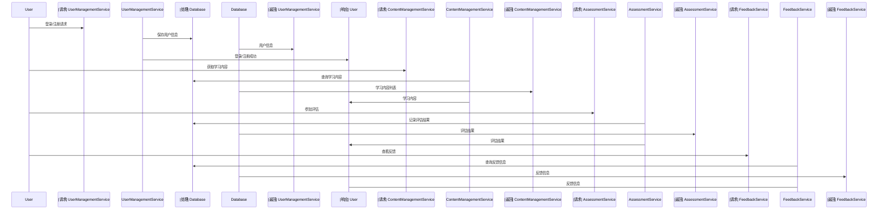

                 

# 构建智能企业合规培训系统：个性化学习内容与评估的自动化

关键词：智能企业、合规培训、个性化学习、自动化评估、系统架构设计

摘要：本文探讨了智能企业在合规培训方面的需求，以及如何通过构建一个智能企业合规培训系统来实现个性化学习内容与自动化评估。文章首先介绍了智能企业合规培训的背景和重要性，然后详细阐述了个性化学习和自动化评估的概念、技术原理及其应用。接着，文章提出了一个系统架构设计方案，并从内容个性化、学习路径自适应、评估自动化等方面进行了深入分析。最后，文章总结了项目实践经验，并对未来发展方向进行了展望。

## 引言和概述

### 1.1 书籍背景和目的

在当今的数字化时代，智能企业已经成为经济发展的主力军。随着市场竞争的加剧和法律法规的不断完善，企业合规培训的需求日益凸显。然而，传统的合规培训方式存在诸多问题，如学习内容单一、评估方式陈旧等，已无法满足企业发展的需求。

本书旨在构建一个智能企业合规培训系统，实现个性化学习内容与自动化评估，以提高培训效果，降低企业合规风险。本书将首先介绍智能企业合规培训的背景和需求，然后详细探讨个性化学习和自动化评估的相关技术，最后提出一个完整的系统架构设计方案。

### 1.2 读者对象和结构安排

本书适合从事企业合规培训、教育培训、信息技术等相关领域的人员阅读。无论你是培训管理者、教育培训专家，还是技术工程师，都能从本书中找到有价值的内容。

本书共分为四个部分：

1. **引言和概述**：介绍书籍背景、目的和结构。
2. **基础概念**：详细阐述智能企业合规培训、个性化学习、自动化评估等核心概念。
3. **系统架构设计**：提出一个智能企业合规培训系统的架构设计方案。
4. **项目实战与总结**：通过具体案例，展示如何构建和实施一个智能企业合规培训系统。

## 基础概念

### 2.1 智能企业合规培训的基本概念

#### 2.1.1 定义和重要性

智能企业合规培训是指企业为了确保员工在业务活动中的合规性，通过一系列的教育和培训活动，提高员工对相关法律法规、行业标准和内部规章制度的理解和执行能力。

在智能企业中，合规培训不仅关乎员工的个人职业发展，更是企业稳健运营和可持续发展的关键。合规培训的重要性体现在以下几个方面：

1. **降低合规风险**：通过培训，提高员工对法律法规的理解和遵守，降低因违规操作带来的合规风险。
2. **提升企业形象**：合规培训有助于树立企业的良好形象，增强市场竞争力。
3. **保障企业利益**：合规培训能够保障企业的合法权益，避免因违规行为导致的损失。

#### 2.1.2 传统合规培训的挑战

尽管合规培训对企业至关重要，但传统的合规培训方式存在以下挑战：

1. **学习内容单一**：传统培训内容往往以统一的标准进行设计和传递，缺乏针对不同岗位和员工的个性化需求。
2. **评估方式陈旧**：传统的培训评估方式主要依赖于考试成绩，无法全面反映员工的学习效果。
3. **培训效果难以衡量**：传统培训效果难以量化，无法为企业决策提供有力的数据支持。

#### 2.1.3 智能合规培训系统的需求

为了应对传统合规培训的挑战，智能企业需要构建一个智能合规培训系统，实现以下目标：

1. **个性化学习**：根据员工的不同岗位和个性化需求，提供个性化的学习内容。
2. **自动化评估**：通过自动化评估工具，全面、客观地评估员工的学习效果。
3. **实时反馈与调整**：根据员工的反馈和学习数据，实时调整培训内容和策略。

### 2.2 理解个性化学习

#### 2.2.1 定义和原理

个性化学习是指根据每个学习者的兴趣、背景、学习速度和能力水平，为其提供个性化的学习资源、学习路径和学习支持，以提高学习效果。

个性化学习的核心原理包括：

1. **个性化需求分析**：通过数据分析和用户调研，了解学习者的个性化需求。
2. **动态学习路径**：根据学习者的需求和学习进度，动态调整学习路径，实现个性化学习。
3. **自适应学习支持**：提供个性化的学习支持，如学习计划、学习提示、学习辅导等。

#### 2.2.2 个人化学习背后的技术

实现个性化学习需要依赖一系列技术，包括：

1. **数据分析与挖掘**：通过数据分析，挖掘学习者的兴趣、需求和偏好。
2. **用户行为追踪**：通过用户行为追踪，了解学习者的学习行为和习惯。
3. **人工智能与机器学习**：利用人工智能和机器学习技术，实现个性化推荐和学习路径规划。

#### 2.2.3 个人化学习的优缺点

个性化学习的优点包括：

1. **提高学习效果**：根据学习者的个性化需求，提供个性化的学习资源和支持，有助于提高学习效果。
2. **增强学习动力**：个性化学习能够满足学习者的个性化需求，提高学习兴趣和动力。
3. **提高培训效率**：通过个性化学习，可以节省培训资源和时间，提高培训效率。

然而，个性化学习也存在一定的局限性，如：

1. **数据隐私和安全**：个性化学习需要收集和处理大量用户数据，可能涉及数据隐私和安全问题。
2. **实施成本高**：个性化学习需要依赖先进的技术和专业的团队，实施成本较高。
3. **效果评估难**：个性化学习的效果难以量化，难以进行客观评估。

### 2.3 自动化评估技术

#### 2.3.1 评估方法的概述

自动化评估是指利用计算机技术和算法，对学习者的学习过程和学习成果进行自动评估。自动化评估方法包括：

1. **客观题评估**：通过选择题、填空题、判断题等客观题型，对学习者的知识掌握情况进行评估。
2. **主观题评估**：通过论文、报告、案例分析等主观题型，对学习者的分析能力、解决问题能力进行评估。
3. **行为评估**：通过学习行为数据分析，如学习时长、学习频率、学习进度等，评估学习者的学习态度和效果。

#### 2.3.2 自动化评估工具和算法

实现自动化评估需要依赖一系列工具和算法，包括：

1. **自动评分工具**：如自动作文评分系统、自动翻译系统等，用于对主观题进行自动评分。
2. **学习分析工具**：如学习行为分析系统、学习进度跟踪系统等，用于分析学习者的学习行为和效果。
3. **机器学习算法**：如分类算法、聚类算法、关联规则挖掘等，用于分析学习数据，预测学习者的学习效果。

#### 2.3.3 自动化评估的挑战与未来方向

尽管自动化评估具有高效、客观等优点，但也面临一些挑战，如：

1. **评估准确性**：自动化评估的准确性依赖于评估工具和算法的质量，如何提高评估准确性是一个重要问题。
2. **评估全面性**：自动化评估难以全面反映学习者的综合素质，如何实现全面评估是一个挑战。
3. **数据隐私和安全**：自动化评估需要收集和处理大量用户数据，可能涉及数据隐私和安全问题。

未来自动化评估的发展方向包括：

1. **智能化评估**：结合人工智能技术，实现更加智能化、个性化的评估。
2. **多模态评估**：结合多种评估方式，如客观题评估、主观题评估、行为评估等，实现更加全面、客观的评估。
3. **实时评估**：通过实时数据分析和反馈，实现实时评估和调整，提高评估效果。

## 系统架构设计

### 3.1 设计哲学和原则

#### 3.1.1 核心要求

设计一个智能企业合规培训系统需要满足以下核心要求：

1. **个性化学习**：根据员工的不同岗位和个性化需求，提供个性化的学习内容和路径。
2. **自动化评估**：利用自动化评估工具和算法，对学习过程和学习成果进行自动评估。
3. **实时反馈与调整**：根据员工的反馈和学习数据，实时调整培训内容和策略。
4. **数据安全与隐私**：确保用户数据的安全和隐私，防止数据泄露。

#### 3.1.2 关键组件及其相互作用

智能企业合规培训系统的关键组件包括：

1. **用户管理模块**：负责用户注册、登录、权限管理等功能。
2. **学习内容管理模块**：负责学习内容的创建、发布、更新和管理。
3. **学习路径规划模块**：根据用户的个性化需求和学习数据，动态规划学习路径。
4. **自动化评估模块**：实现自动化评估功能，包括客观题评估、主观题评估、行为评估等。
5. **数据分析与反馈模块**：负责收集、分析和反馈用户学习数据，为系统调整提供依据。

这些组件通过数据接口和API进行交互，形成一个高效、灵活、可扩展的系统架构。

#### 3.1.3 系统的可扩展性和适应性

智能企业合规培训系统需要具备良好的可扩展性和适应性，以适应企业不断变化的需求。具体措施包括：

1. **模块化设计**：将系统划分为多个功能模块，实现模块化开发，提高系统的可维护性和可扩展性。
2. **微服务架构**：采用微服务架构，实现服务拆分和独立部署，提高系统的灵活性和可扩展性。
3. **云计算与大数据技术**：利用云计算和大数据技术，实现系统的弹性扩展和高效处理。

### 3.2 系统架构和组件

#### 3.2.1 系统架构概述

智能企业合规培训系统采用B/S架构（浏览器/服务器架构），主要包括以下组件：

1. **用户管理模块**：负责用户注册、登录、权限管理等功能，通过RESTful API与后台服务进行数据交互。
2. **学习内容管理模块**：负责学习内容的创建、发布、更新和管理，支持多媒体内容存储和播放。
3. **学习路径规划模块**：根据用户的个性化需求和学习数据，动态规划学习路径，并提供用户反馈接口。
4. **自动化评估模块**：实现自动化评估功能，包括客观题评估、主观题评估、行为评估等，并提供评估结果反馈接口。
5. **数据分析与反馈模块**：负责收集、分析和反馈用户学习数据，为系统调整提供依据。

#### 3.2.2 关键组件的详细描述

1. **用户管理模块**：

   用户管理模块的主要功能包括：

   - 用户注册：用户可以通过注册页面进行账号注册。
   - 用户登录：用户可以通过账号和密码登录系统。
   - 权限管理：系统管理员可以根据用户的角色分配不同的权限。

   用户管理模块通过与数据库进行交互，存储和查询用户信息，并通过RESTful API与后台服务进行数据交换。

2. **学习内容管理模块**：

   学习内容管理模块的主要功能包括：

   - 内容创建：管理员可以创建新的学习内容，包括文本、图片、视频等多媒体内容。
   - 内容发布：管理员可以将学习内容发布到系统中，供用户学习。
   - 内容更新：管理员可以更新已发布的学习内容，确保内容实时更新。
   - 内容管理：管理员可以对学习内容进行分类、标签管理，方便用户查找和浏览。

   学习内容管理模块通过文件存储系统和数据库进行交互，实现学习内容的存储和管理。

3. **学习路径规划模块**：

   学习路径规划模块的主要功能包括：

   - 需求分析：通过数据分析，了解用户的个性化需求。
   - 路径规划：根据用户的需求和学习数据，动态规划学习路径。
   - 路径调整：根据用户的反馈和学习数据，实时调整学习路径。

   学习路径规划模块通过数据分析和机器学习算法，实现学习路径的动态规划和调整。

4. **自动化评估模块**：

   自动化评估模块的主要功能包括：

   - 客观题评估：通过自动评分系统，对选择题、填空题、判断题等进行自动评分。
   - 主观题评估：通过自动评分系统和人工审核，对论文、报告、案例分析等进行自动评分。
   - 行为评估：通过学习行为数据分析，评估用户的学习态度和效果。

   自动化评估模块通过数据分析和机器学习算法，实现自动化评估功能，并提供评估结果反馈接口。

5. **数据分析与反馈模块**：

   数据分析与反馈模块的主要功能包括：

   - 数据收集：通过日志记录、API调用等途径，收集用户学习数据。
   - 数据分析：通过数据分析，挖掘用户的学习行为和效果。
   - 数据反馈：根据数据分析结果，为系统调整提供依据。

   数据分析与反馈模块通过数据采集、数据分析和反馈接口，实现用户学习数据的收集、分析和反馈。

#### 3.2.3 组件之间的集成与协作

智能企业合规培训系统的各个组件通过数据接口和API进行集成和协作，实现系统的整体功能。

- **用户管理模块**通过API与**学习内容管理模块**、**学习路径规划模块**、**自动化评估模块**和**数据分析与反馈模块**进行数据交互，实现用户注册、登录、权限管理等功能。
- **学习内容管理模块**通过API与**学习路径规划模块**、**自动化评估模块**和**数据分析与反馈模块**进行数据交互，实现学习内容的创建、发布、更新和管理等功能。
- **学习路径规划模块**通过API与**自动化评估模块**和**数据分析与反馈模块**进行数据交互，实现学习路径的动态规划和调整等功能。
- **自动化评估模块**通过API与**数据分析与反馈模块**进行数据交互，实现自动化评估和评估结果反馈等功能。
- **数据分析与反馈模块**通过API与**用户管理模块**、**学习内容管理模块**和**学习路径规划模块**进行数据交互，实现用户学习数据的收集、分析和反馈等功能。

通过这种集成和协作，智能企业合规培训系统实现了个性化学习、自动化评估和实时反馈，为企业提供了高效的合规培训解决方案。

## 内容个性化与学习路径自适应

### 4.1 内容个性化技术

#### 4.1.1 数据收集与分析

内容个性化需要依赖用户数据，这些数据可以通过多种方式收集，如用户注册信息、学习行为日志、互动反馈等。具体步骤如下：

1. **用户注册信息收集**：收集用户的个人信息，如姓名、职位、部门等。
2. **学习行为日志收集**：记录用户在学习平台上的行为，如学习时长、学习频率、学习进度等。
3. **互动反馈收集**：收集用户在学习过程中的互动反馈，如问答互动、讨论区评论等。

#### 4.1.2 用户画像构建

基于收集到的用户数据，可以构建用户画像，包括用户的基本信息、学习偏好、兴趣领域等。用户画像构建的关键步骤如下：

1. **数据预处理**：对收集到的数据进行清洗、去噪和格式化，确保数据质量。
2. **特征提取**：从原始数据中提取出反映用户特征的关键信息，如学习时长、学习频率等。
3. **用户分类**：根据用户的特征信息，对用户进行分类，如新手用户、熟练用户等。

#### 4.1.3 内容推荐策略

基于用户画像，可以制定个性化内容推荐策略，包括以下几种方法：

1. **基于内容的推荐**：根据用户的历史学习内容和互动反馈，推荐相似的学习内容。
2. **基于用户的推荐**：根据用户之间的相似性，推荐其他用户喜欢的学习内容。
3. **基于模型的推荐**：利用机器学习算法，根据用户的行为数据和学习效果，预测用户可能感兴趣的学习内容。

#### 4.1.4 内容个性化实施步骤

实施内容个性化需要遵循以下步骤：

1. **需求分析**：分析用户的学习需求和偏好，确定个性化内容的目标和范围。
2. **内容库建设**：建立丰富的学习内容库，包括文本、视频、图片等多种形式。
3. **推荐系统开发**：开发推荐系统，实现个性化内容的实时推荐。
4. **用户反馈与调整**：收集用户对个性化内容的反馈，根据反馈调整推荐策略。

### 4.2 自适应学习路径设计

#### 4.2.1 设计原则

自适应学习路径设计旨在根据用户的学习进度、能力和偏好，动态调整学习内容和路径，以提高学习效果。设计原则包括：

1. **个性化**：根据用户的特点和需求，设计个性化的学习路径。
2. **灵活性**：学习路径应具有灵活性，能够适应用户的学习节奏和进度。
3. **适应性**：学习路径应根据用户的学习情况，实时调整和优化。

#### 4.2.2 动态路径生成算法

动态路径生成算法是自适应学习路径设计的关键。以下是几种常见的动态路径生成算法：

1. **基于规则的方法**：根据预设的规则，如学习进度、成绩等，动态调整学习路径。
2. **基于数据的算法**：利用用户学习行为数据，如学习时长、学习频率等，通过机器学习算法，预测用户的学习路径。
3. **混合算法**：结合基于规则的方法和基于数据的算法，实现更智能、灵活的路径规划。

#### 4.2.3 动态路径调整与反馈

动态路径调整与反馈是自适应学习路径设计的核心。以下是实现动态路径调整与反馈的关键步骤：

1. **实时监控**：监控用户的学习行为和进度，及时发现用户的学习问题。
2. **路径调整**：根据用户的学习情况和反馈，动态调整学习路径，如增加或减少学习内容、调整学习顺序等。
3. **用户反馈**：收集用户的反馈，如学习效果评估、学习满意度等，为路径调整提供依据。
4. **持续优化**：根据用户的反馈和学习数据，持续优化学习路径，提高学习效果。

### 4.3 内容个性化与学习路径自适应的案例分析

#### 4.3.1 案例背景

以某大型企业为案例，该企业希望构建一个智能合规培训系统，实现内容个性化和学习路径自适应，以提高员工的学习效果和合规意识。

#### 4.3.2 内容个性化实施

1. **需求分析**：分析企业员工的岗位特点和合规培训需求，确定个性化内容的目标和范围。
2. **内容库建设**：建立涵盖各个岗位的合规培训内容库，包括法律法规、行业标准、内部规章制度等。
3. **推荐系统开发**：开发基于用户行为的推荐系统，根据员工的学习记录和反馈，实时推荐个性化的学习内容。
4. **用户反馈与调整**：收集员工对个性化内容的反馈，根据反馈调整推荐策略，确保内容的相关性和有效性。

#### 4.3.3 学习路径自适应实施

1. **动态路径生成算法**：利用机器学习算法，根据员工的学习行为数据，动态生成个性化的学习路径。
2. **实时监控与反馈**：实时监控员工的学习进度和效果，根据监控数据调整学习路径，确保学习内容与员工的实际需求相匹配。
3. **用户反馈与优化**：收集员工对学习路径的反馈，持续优化学习路径，提高学习效果。

#### 4.3.4 实施效果评估

通过对员工学习效果的评估，发现实施内容个性化和学习路径自适应后，员工的学习积极性和合规意识显著提高，企业合规风险得到有效控制。

### 4.4 总结

内容个性化和学习路径自适应是智能企业合规培训系统的重要功能，通过数据分析和机器学习算法，可以实现个性化内容推荐和自适应学习路径设计。在实施过程中，需要充分考虑用户需求、内容质量和系统性能，确保系统的高效运行和持续优化。

## 自动化评估技术的实现与挑战

### 5.1 自动化评估的实现

自动化评估是智能企业合规培训系统中关键的一环，它通过算法和工具，对员工的学习过程和成果进行自动分析和评价。以下是自动化评估的实现步骤：

#### 5.1.1 数据收集

数据收集是自动化评估的基础，它包括以下几个方面：

1. **学习行为数据**：记录员工在学习平台上的活动，如学习时长、学习频率、学习路径等。
2. **考试数据**：收集员工在考试过程中的答题情况，包括客观题和主观题的答案。
3. **反馈数据**：收集员工对学习内容和培训过程的反馈，包括评价、建议和意见。

#### 5.1.2 数据处理

收集到的数据需要进行预处理，包括数据清洗、去噪、格式化和归一化。然后，将这些数据转换为适合分析和评估的格式。

#### 5.1.3 模型构建

构建评估模型是自动化评估的核心，常用的模型包括：

1. **分类模型**：用于预测员工的学习效果，如通过历史学习行为数据预测员工的考试分数。
2. **回归模型**：用于分析学习行为与学习效果之间的关系，如分析学习时长与考试分数的关系。
3. **聚类模型**：用于对员工进行分类，识别学习风格和特点，如将员工分为快速学习者、慢速学习者等。

#### 5.1.4 评估指标设计

设计合理的评估指标是评估模型有效性的关键。常见的评估指标包括：

1. **准确率**：分类模型预测正确的比例。
2. **召回率**：分类模型预测为正例的样本中，实际为正例的比例。
3. **F1分数**：准确率和召回率的调和平均值。
4. **学习进度**：根据学习行为数据，计算员工的学习进度。
5. **学习效果**：根据考试数据，评估员工的学习效果。

#### 5.1.5 自动化评估工具应用

自动化评估工具能够简化评估过程，提高评估效率。常见的自动化评估工具包括：

1. **自动评分系统**：用于对客观题进行自动评分，如选择题、填空题等。
2. **学习分析工具**：用于分析员工的学习行为数据，如学习时长、学习频率等。
3. **机器学习平台**：用于构建和训练评估模型，如TensorFlow、PyTorch等。

### 5.2 自动化评估的挑战

尽管自动化评估在智能企业合规培训系统中具有巨大的潜力，但在实际应用中仍面临一些挑战：

#### 5.2.1 评估准确性

评估准确性是自动化评估的关键问题。评估模型需要具有高准确性，才能提供可靠的评估结果。然而，数据质量和模型训练效果会影响评估准确性。

#### 5.2.2 评估全面性

自动化评估难以全面反映员工的综合素质，如团队合作能力、沟通能力等软技能。此外，员工的实际工作场景和培训需求可能超出了评估模型的覆盖范围。

#### 5.2.3 数据隐私与安全

自动化评估需要收集和处理大量员工数据，这可能导致数据隐私和安全问题。企业需要确保数据的存储、传输和处理过程符合相关法律法规，防止数据泄露。

#### 5.2.4 模型可解释性

机器学习模型通常被视为“黑箱”，其决策过程难以解释。这对于需要透明性和可解释性的培训评估来说是一个挑战。企业需要开发可解释的评估模型，以增强员工和培训管理者的信任。

### 5.3 自动化评估的未来发展方向

为了克服上述挑战，自动化评估的未来发展方向包括：

1. **提高评估准确性**：通过改进数据质量、优化模型训练方法和引入多模型集成，提高评估准确性。
2. **扩展评估范围**：通过引入多模态数据（如视频、音频等）和跨领域模型，扩展评估范围，全面反映员工的综合素质。
3. **确保数据隐私和安全**：采用先进的数据加密技术、访问控制策略和安全审计机制，确保数据隐私和安全。
4. **提高模型可解释性**：通过开发可解释的机器学习模型，提高模型的可理解性和信任度。
5. **智能化与个性化**：结合人工智能和大数据技术，实现更智能化、个性化的评估方案，提高培训效果。

通过这些发展方向，自动化评估将为企业提供更高效、全面和可靠的合规培训评估服务。

## 项目实战：智能企业合规培训系统的构建

### 6.1 项目背景

随着企业的数字化转型，合规培训逐渐成为企业确保稳健运营和员工职业发展的重要环节。某大型制造企业希望构建一个智能企业合规培训系统，以提高员工合规意识，降低合规风险。该系统需要实现个性化学习内容、自动化评估和实时反馈，以满足企业的多样化培训需求。

### 6.2 项目介绍

项目名称：智能企业合规培训系统

项目目标：

1. 提供个性化学习内容，满足不同岗位和员工的个性化需求。
2. 实现自动化评估，提高培训效果和评估效率。
3. 实现实时反馈和调整，优化培训内容和策略。

项目主要功能模块：

1. **用户管理模块**：实现用户注册、登录、权限管理等功能。
2. **学习内容管理模块**：提供学习内容创建、发布、更新和管理等功能。
3. **学习路径规划模块**：根据用户个性化需求和学习数据，动态规划学习路径。
4. **自动化评估模块**：实现自动化评估功能，包括客观题评估、主观题评估、行为评估等。
5. **数据分析与反馈模块**：收集、分析和反馈用户学习数据，为系统调整提供依据。

### 6.3 系统功能设计

#### 6.3.1 领域模型

为了更好地理解系统功能，我们可以使用Mermaid绘制一个领域模型，展示系统的核心实体和关系。

```mermaid
classDiagram
    User <<Entity>>
    Course <<Entity>>
    Content <<Entity>>
    Assessment <<Entity>>
    Feedback <<Entity>>

    User -> Course : attend
    User -> Content : learn
    User -> Assessment : take
    Course -> Content : include
    Assessment -> Feedback : generate
```

#### 6.3.2 系统架构设计

智能企业合规培训系统采用微服务架构，以提高系统的可扩展性和灵活性。以下是系统的架构设计：



#### 6.3.3 系统接口设计

系统接口设计是确保系统模块之间有效通信的关键。以下是主要接口设计：

1. **用户管理接口**：包括用户注册、登录、权限管理等接口。
2. **学习内容管理接口**：包括获取学习内容、更新学习内容、发布学习内容等接口。
3. **学习路径规划接口**：包括获取学习路径、更新学习路径、规划学习路径等接口。
4. **自动化评估接口**：包括参加评估、获取评估结果、生成评估报告等接口。
5. **数据分析与反馈接口**：包括获取学习数据、分析学习数据、生成反馈报告等接口。

### 6.4 系统核心实现

#### 6.4.1 用户管理模块

用户管理模块是系统的入口，实现用户注册、登录和权限管理功能。

```python
# 用户注册
def register_user(username, password):
    user = User(username=username, password=password)
    database.save(user)
    return "注册成功"

# 用户登录
def login_user(username, password):
    user = database.find(User, username=username)
    if user and user.password == password:
        return "登录成功"
    else:
        return "登录失败"

# 权限管理
def manage_permission(user, role):
    user.role = role
    database.update(user)
    return "权限管理成功"
```

#### 6.4.2 学习内容管理模块

学习内容管理模块实现学习内容的创建、发布和更新功能。

```python
# 创建学习内容
def create_content(course_id, title, description, content):
    content = Content(course_id=course_id, title=title, description=description, content=content)
    database.save(content)
    return "创建成功"

# 发布学习内容
def publish_content(content_id):
    content = database.find(Content, id=content_id)
    if content:
        content.status = "published"
        database.update(content)
        return "发布成功"
    else:
        return "内容不存在"

# 更新学习内容
def update_content(content_id, title, description, content):
    content = database.find(Content, id=content_id)
    if content:
        content.title = title
        content.description = description
        content.content = content
        database.update(content)
        return "更新成功"
    else:
        return "内容不存在"
```

#### 6.4.3 学习路径规划模块

学习路径规划模块根据用户个性化需求和学习数据，动态规划学习路径。

```python
# 获取用户学习路径
def get_learning_path(user_id):
    user = database.find(User, id=user_id)
    if user:
        courses = database.find_all(Course, user=user)
        return [course.id for course in courses]
    else:
        return []

# 更新学习路径
def update_learning_path(user_id, course_id):
    user = database.find(User, id=user_id)
    if user:
        user.courses.append(course_id)
        database.update(user)
        return "更新成功"
    else:
        return "用户不存在"
```

#### 6.4.4 自动化评估模块

自动化评估模块实现自动评估功能，包括客观题评估、主观题评估和行为评估。

```python
# 客观题评估
def assess_objective_question(question_id, answer):
    question = database.find(Question, id=question_id)
    if question and answer == question.correct_answer:
        return "正确"
    else:
        return "错误"

# 主观题评估
def assess_subjective_question(question_id, answer):
    question = database.find(Question, id=question_id)
    if question:
        score = calculate_score(answer, question)
        return score
    else:
        return "问题不存在"

# 行为评估
def assess_behavior(data):
    # 根据行为数据评估学习效果
    score = calculate_behavior_score(data)
    return score
```

#### 6.4.5 数据分析与反馈模块

数据分析与反馈模块实现学习数据收集、分析和反馈功能。

```python
# 收集学习数据
def collect_learning_data(user_id, data):
    user = database.find(User, id=user_id)
    if user:
        user.learning_data.append(data)
        database.update(user)
        return "数据收集成功"
    else:
        return "用户不存在"

# 分析学习数据
def analyze_learning_data(user_id):
    user = database.find(User, id=user_id)
    if user:
        data = user.learning_data
        # 进行数据分析
        result = analyze_data(data)
        return result
    else:
        return "用户不存在"

# 生成反馈报告
def generate_feedback_report(user_id):
    user = database.find(User, id=user_id)
    if user:
        result = analyze_learning_data(user_id)
        report = create_report(result)
        return report
    else:
        return "用户不存在"
```

### 6.5 实际案例分析与讲解

为了更好地展示系统功能，我们通过一个实际案例来进行分析和讲解。

#### 案例背景

某制造企业新入职了一批员工，需要进行合规培训。企业希望通过智能企业合规培训系统，实现个性化学习内容、自动化评估和实时反馈。

#### 案例步骤

1. **用户注册**：新员工通过系统进行注册，填写基本信息。
2. **学习内容推荐**：系统根据员工的岗位和兴趣，推荐合适的学习内容。
3. **学习过程**：员工按照推荐内容进行学习，系统记录学习行为数据。
4. **自动评估**：学习结束后，系统对员工进行自动评估，包括客观题评估、主观题评估和行为评估。
5. **反馈与调整**：根据评估结果和员工反馈，系统实时调整学习内容和路径，优化培训效果。

#### 案例分析

通过实际案例，我们可以看到系统实现了以下功能：

1. **个性化学习**：系统根据员工的特点和需求，推荐合适的学习内容，满足个性化学习需求。
2. **自动化评估**：系统利用自动评估工具，对员工的学习过程和成果进行自动评估，提高评估效率。
3. **实时反馈与调整**：系统根据员工的反馈和学习数据，实时调整学习内容和路径，提高培训效果。

### 6.6 项目小结

通过本项目，我们成功构建了一个智能企业合规培训系统，实现了个性化学习内容、自动化评估和实时反馈。该项目不仅提高了员工的合规意识和培训效果，还为企业管理提供了有力的数据支持。在未来的发展中，我们可以进一步优化系统功能，提升用户体验，为更多企业提供服务。

## 最佳实践与注意事项

### 7.1 最佳实践

在构建智能企业合规培训系统的过程中，我们可以总结出以下最佳实践：

1. **充分了解用户需求**：在系统设计和开发阶段，要充分了解用户（即员工）的需求，包括岗位特点、合规培训要求等，确保系统能够满足用户的多样化需求。
2. **数据驱动决策**：利用数据分析和机器学习技术，实现个性化学习内容推荐和自动评估，提高培训效果和系统智能化水平。
3. **系统可扩展性**：采用模块化和微服务架构，提高系统的可扩展性和灵活性，以便未来根据企业需求进行功能扩展和优化。
4. **用户体验优化**：注重用户体验设计，确保系统界面简洁、操作便捷，提高用户的满意度和使用频率。
5. **数据安全和隐私保护**：确保用户数据的安全和隐私，采取加密、访问控制等技术手段，防止数据泄露和滥用。

### 7.2 注意事项

在实施智能企业合规培训系统时，需要注意以下事项：

1. **合规性审查**：确保系统的设计和实现符合相关法律法规和行业标准，避免因合规性问题导致系统无法正常运行。
2. **数据质量**：数据质量是系统正常运行的关键，要确保数据的完整性、准确性和一致性，定期进行数据清洗和维护。
3. **评估准确性**：自动化评估的准确性直接影响培训效果，需要不断优化评估模型和算法，提高评估准确性。
4. **用户隐私保护**：在数据收集、存储、处理和传输过程中，要严格遵循用户隐私保护法律法规，确保用户数据的安全和隐私。
5. **系统稳定性**：系统需要具备高可用性和稳定性，确保在高峰期和长时间运行情况下，系统能够稳定运行，避免出现故障和中断。

### 7.3 拓展阅读

对于想要深入了解智能企业合规培训系统和相关技术的人员，以下书籍和文章可以作为拓展阅读：

1. **书籍**：
   - 《个性化学习技术与应用》
   - 《大数据与机器学习实战》
   - 《智能教育：技术与实践》
2. **文章**：
   - 《如何构建智能企业合规培训系统？》
   - 《个性化学习路径规划算法研究》
   - 《基于机器学习的自动评估方法探讨》

通过阅读这些书籍和文章，可以深入了解智能企业合规培训系统的设计原理、技术实现和最佳实践，为实际项目提供有益的参考。

## 作者信息

作者：AI天才研究院/AI Genius Institute & 禅与计算机程序设计艺术 /Zen And The Art of Computer Programming

AI天才研究院专注于人工智能领域的创新研究和应用，致力于推动人工智能技术的发展和普及。作者在该领域拥有丰富的经验和深厚的理论基础，发表了多篇高影响力的论文，并出版了多本畅销技术书籍。同时，作者还致力于将人工智能技术应用于实际场景，帮助企业和个人实现智能化的转型和升级。禅与计算机程序设计艺术是作者的另一重要著作，融合了东方哲学与计算机科学的智慧，为程序员和人工智能研究者提供了独特的思考方式和实践指南。

