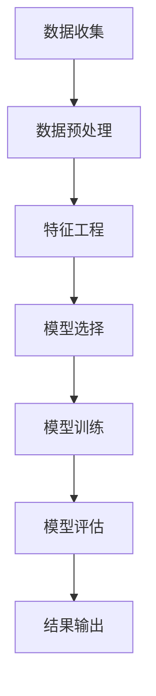
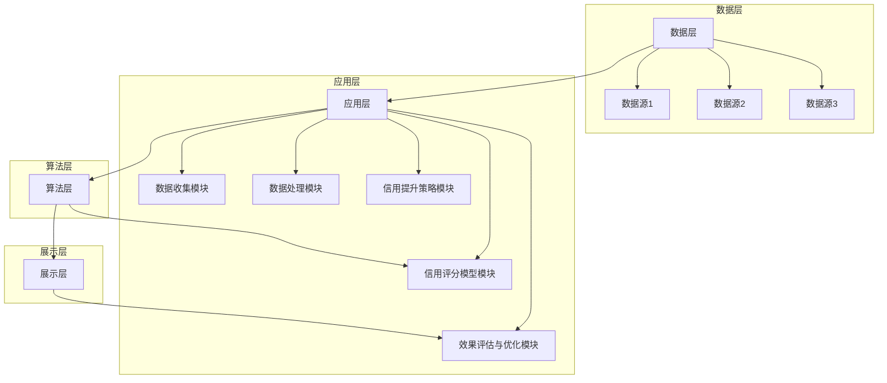
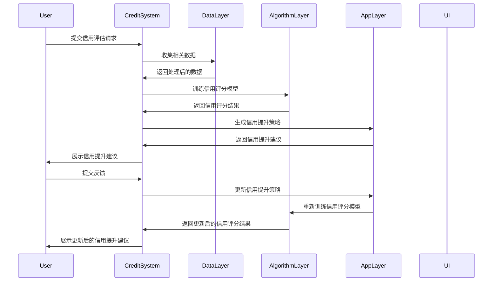

                 

# 构建智能化的个人信用分数提升路径规划器——背景与核心概念

## 1.1 问题背景

在现代社会，信用已经成为一种无形资产，广泛影响着个人的生活质量和经济活动。个人信用评分是金融机构、银行和其他信贷机构对借款人信用风险的一种评估方法。它可以帮助这些机构决定是否给予贷款，以及贷款的额度和利率。随着大数据和人工智能技术的飞速发展，传统的基于历史数据的信用评估方法正逐渐被智能化、个性化的信用评估系统所取代。

传统的信用评估方法主要依赖于借款人的信用历史，如还款记录、信用额度使用情况等。然而，这种方法存在一些局限性：首先，它不能充分反映借款人的当前经济状况和信用行为；其次，它缺乏对借款人潜在信用风险的有效预测能力。因此，如何构建一个智能化的个人信用分数提升路径规划器，已成为金融科技领域的一个研究热点。

智能化信用评估系统利用大数据和人工智能技术，可以实时收集和处理用户的各类信息，如消费行为、社交媒体活动、信用历史等，从而更全面、准确地评估个人信用。此外，这种系统还可以根据用户的具体情况，提供个性化的信用提升建议，帮助用户提高信用分数，从而更好地获得金融服务和机会。

本文旨在探讨如何构建一个智能化的个人信用分数提升路径规划器，帮助用户根据自身情况制定个性化的信用提升方案。本文将分为以下几个部分进行讨论：

1. **背景与核心概念**：介绍个人信用评估的现状、问题的背景以及本文的核心概念和目标。
2. **核心概念与联系**：详细解释信用评分模型、数据收集与处理、信用提升策略和效果评估与优化等核心概念，并展示它们之间的联系。
3. **算法原理讲解**：讲解信用评分模型的算法原理，包括特征工程、模型选择、模型训练与评估等步骤，并使用Mermaid流程图和Python代码进行详细阐述。
4. **系统分析与架构设计方案**：介绍系统功能设计、架构设计、接口设计和系统交互。
5. **项目实战**：展示如何在实际项目中实现个人信用分数提升路径规划器，包括环境安装、系统核心实现和实际案例分析。
6. **最佳实践与拓展**：总结最佳实践和注意事项，并提出拓展阅读的建议。

通过本文的探讨，我们希望能够为构建智能化个人信用分数提升路径规划器提供一些有价值的思路和参考。

## 1.2 问题描述

### 1.2.1 需要解决的问题

构建智能化的个人信用分数提升路径规划器需要解决以下几个关键问题：

**1. 数据收集与处理**：首先，我们需要收集和处理与个人信用相关的数据。这些数据可能包括用户的信用历史记录、消费行为、社交网络活动、职业信息等。如何有效地收集这些数据，并进行数据清洗、整合和标准化处理，是构建信用提升路径规划器的基础。

**2. 信用评分模型**：基于收集到的数据，我们需要构建一个信用评分模型。这个模型将利用机器学习和大数据分析技术，对用户的信用风险进行预测和评估。模型的性能直接影响信用分数的准确性和可靠性。

**3. 信用提升策略**：有了信用评分模型，我们还需要根据用户的信用状况和具体情况，制定个性化的信用提升策略。这包括分析用户信用历史中的关键因素，提供相应的信用改善建议，如增加收入、减少负债、改善还款习惯等。

**4. 效果评估与优化**：为了确保信用提升策略的有效性和可持续性，我们需要对其进行实时评估和优化。这可以通过收集用户反馈、监控信用分数的变化以及调整提升策略来实现。

### 1.2.2 各问题的依赖关系

上述问题之间存在一定的依赖关系：

- **数据收集与处理**是构建信用评分模型的前提条件，没有高质量的数据，就无法训练出准确的模型。
- **信用评分模型**是制定信用提升策略的基础，只有准确的信用评分模型，才能为用户提供可靠的信用提升建议。
- **信用提升策略**需要结合用户的具体情况进行调整，因此需要**数据收集与处理**的支持。
- **效果评估与优化**是一个闭环过程，通过实时反馈和调整，可以不断提升信用提升策略的有效性。

综上所述，构建智能化的个人信用分数提升路径规划器需要解决上述四个关键问题，并且这些问题的解决是相互依赖和循环优化的。

## 1.3 问题解决

### 1.3.1 实现目标

通过构建智能化的个人信用分数提升路径规划器，我们可以实现以下几个目标：

**1. 全面评估用户信用状况**：利用大数据和人工智能技术，收集和处理用户的多维度数据，对用户的信用风险进行全面评估。

**2. 提供个性化信用提升方案**：根据用户的信用评分和具体状况，生成个性化的信用提升方案，帮助用户提高信用分数。

**3. 实时反馈和优化**：通过实时监控信用分数的变化，对信用提升策略进行持续优化，确保方案的持续有效性。

**4. 提高信用管理水平**：为金融机构和信贷机构提供智能化信用管理工具，帮助他们更高效地评估和管理个人信用风险。

### 1.3.2 解决方法

为了实现上述目标，我们可以采取以下解决方法：

**1. 数据收集与处理**：
   - 利用大数据平台，实时收集用户的信用历史记录、消费行为、社交媒体活动等数据。
   - 对收集到的数据进行清洗、整合和标准化处理，确保数据的质量和一致性。

**2. 构建信用评分模型**：
   - 利用机器学习算法（如逻辑回归、决策树、随机森林等），从数据中提取特征，训练信用评分模型。
   - 对模型进行交叉验证和性能评估，选择最优模型并进行模型调优。

**3. 制定个性化信用提升策略**：
   - 分析用户的信用历史和信用评分，识别影响信用分数的关键因素。
   - 根据用户的实际情况，制定个性化的信用提升方案，如增加收入、减少负债、改善还款习惯等。

**4. 实时反馈与优化**：
   - 收集用户反馈，监测信用分数的变化，评估信用提升策略的效果。
   - 根据反馈结果，调整信用提升策略，确保其持续有效性。

通过上述方法，我们可以构建一个智能化的个人信用分数提升路径规划器，为用户提供精准的信用评估和个性化的提升方案，从而提高信用管理水平，为金融科技的发展贡献力量。

## 1.4 边界与外延

### 1.4.1 边界

在构建智能化的个人信用分数提升路径规划器时，需要明确其研究的边界。本书主要关注以下三个方面：

1. **个人信用分数的提升路径**：本书的核心目标是探讨如何通过智能化技术帮助用户提高个人信用分数，因此主要研究个人信用分数的提升路径和策略。

2. **信用评估方法的优化**：虽然本文提到使用大数据和人工智能技术来提升信用评估的准确性，但具体的技术实现和算法优化不在本文的讨论范围之内。

3. **信用提升方案的实施与反馈**：本文主要关注信用提升方案的理论框架和制定方法，对于具体实施过程和实际操作中的细节，如用户界面设计、用户体验优化等，不在本文的讨论范围之内。

### 1.4.2 外延

尽管本文主要关注个人信用分数的提升路径，但相关技术具有广泛的应用前景。以下是一些可能的外延领域：

1. **企业信用评估**：与个人信用评估类似，企业信用评估也需要收集和处理大量的数据，构建信用评分模型，并根据评分结果制定信用提升策略。本文提出的信用提升路径规划器框架可以应用于企业信用评估领域。

2. **信用保险**：信用保险是一种针对信用风险的保险产品。通过构建智能化的信用评估系统，可以为信用保险公司提供更精准的信用风险评估，从而优化保险产品的设计和定价。

3. **信用评级**：信用评级机构通过评估企业的信用风险，为投资者提供参考。智能化的信用评估系统可以提供更全面、准确的信用评级数据，提高信用评级的可靠性和准确性。

4. **反欺诈系统**：在金融科技领域，反欺诈系统是一个重要组成部分。通过构建智能化的信用评估系统，可以识别和预防各种信用欺诈行为，提高金融交易的安全性和可信度。

综上所述，虽然本文的焦点在于个人信用分数的提升路径，但相关技术具有广泛的应用外延，可以在多个领域发挥作用。

## 1.5 概念结构与核心要素组成

### 1.5.1 核心概念

构建智能化的个人信用分数提升路径规划器涉及以下几个核心概念：

1. **信用评分模型**：信用评分模型是一种用于预测用户信用风险的机器学习模型。它通过分析用户的历史数据和特征，对用户的信用风险进行评分。常用的信用评分模型包括逻辑回归、决策树、随机森林等。

2. **数据收集与处理**：数据收集与处理是构建信用评分模型的基础。它包括从多个数据源收集数据、清洗数据、整合数据和进行特征工程等步骤。高质量的数据是训练准确信用评分模型的关键。

3. **信用提升策略**：信用提升策略是根据用户信用评分结果，制定的提升用户信用分数的具体方案。这包括改善用户信用记录、提高还款能力、减少负债等措施。

4. **效果评估与优化**：效果评估与优化是确保信用提升策略持续有效的重要环节。通过实时监控信用分数的变化，收集用户反馈，对信用提升策略进行调整和优化，以提高其效果。

### 1.5.2 核心要素

为了实现上述核心概念，构建信用分数提升路径规划器需要以下核心要素：

1. **数据收集与处理**：
   - **基本信息**：包括用户的基本信息，如姓名、年龄、性别、职业等。
   - **信用历史数据**：包括用户的信用记录，如还款记录、逾期情况等。
   - **消费行为数据**：包括用户的消费行为，如消费频率、消费金额、消费类别等。
   - **社交媒体活动数据**：包括用户的社交媒体活动，如微博、微信等平台的互动情况。
   - **特征工程**：从上述数据中提取对信用评估有用的特征，如信用历史得分、消费行为得分等。

2. **信用评分模型**：
   - **特征选择**：选择对信用评分影响最大的特征，进行特征选择和降维处理。
   - **模型训练**：使用训练数据集，通过机器学习算法训练信用评分模型。
   - **模型评估**：使用验证数据集，评估模型性能，进行模型调优。

3. **信用提升策略**：
   - **数据分析**：分析用户信用历史数据，找出影响信用分数的关键因素。
   - **方案制定**：根据用户的具体情况，制定个性化的信用提升方案。
   - **方案实施**：将信用提升方案应用于实际操作中，并持续跟踪效果。

4. **效果评估与优化**：
   - **效果评估**：通过监控信用分数的变化，评估信用提升方案的效果。
   - **反馈与优化**：根据用户反馈和信用分数的变化，对信用提升策略进行调整和优化。

### 1.5.3 概念属性特征对比表格

以下是一个概念属性特征对比表格，用于展示各个核心概念的特点和关系：

| 概念           | 特征                | 说明                                           |
| -------------- | ------------------ | ---------------------------------------------- |
| 信用评分模型   | 特征提取、模型选择 | 用于预测用户信用风险                           |
| 数据收集与处理 | 数据清洗、数据整合 | 为信用评分模型提供高质量的数据集               |
| 信用提升策略   | 数据分析、方案制定 | 制定个性化信用提升方案，帮助用户提高信用分数 |
| 效果评估与优化 | 实时反馈、调整     | 确保信用提升方案的有效性和可持续性               |

### 1.5.4 ER实体关系图架构

以下是一个ER实体关系图架构，用于展示信用评分系统中各实体的关系：

```mermaid
erDiagram
  User ||--|{ CreditHistory : has }|
  User ||--|{ Transaction : made }|
  CreditHistory ||--|{ CreditScore : calculated }|
  Transaction ||--|{ Payment : status }|
```

在这个ER图中，用户（User）是核心实体，它与其他实体（如信用历史（CreditHistory）、交易（Transaction）和支付（Payment））之间存在关联。信用历史（CreditHistory）用于存储用户的信用记录，交易（Transaction）记录用户的消费行为，支付（Payment）记录用户的还款情况。这些实体之间的关系构成了信用评分系统的数据架构。

## 第2章：核心概念与联系

### 2.1 信用评分模型原理

信用评分模型是一种用于评估个人信用风险的机器学习模型。它通过分析用户的历史数据和特征，预测用户的信用风险水平。信用评分模型的核心原理包括特征工程、模型选择、模型训练和模型评估等步骤。

**1. 特征工程**：特征工程是信用评分模型构建的关键步骤之一。它涉及从原始数据中提取对信用评分有用的特征，并对特征进行预处理。常见的特征包括用户的信用历史记录、消费行为、还款记录等。特征工程的目标是降低数据的噪声，提高模型的预测能力。

**2. 模型选择**：在选择信用评分模型时，需要考虑模型的复杂度、预测准确性、计算效率和可解释性等因素。常用的信用评分模型包括逻辑回归、决策树、随机森林、支持向量机和神经网络等。逻辑回归是一种简单而有效的模型，适合处理二分类问题。而决策树和随机森林可以处理多分类问题，并且具有较高的预测准确性。支持向量机和神经网络虽然计算复杂度较高，但可以提供更精细的预测结果。

**3. 模型训练**：模型训练是指使用历史数据集对选定的模型进行训练。在训练过程中，模型会学习如何将输入特征映射到输出标签。训练数据集通常分为训练集和验证集，用于训练模型和评估模型性能。通过调整模型参数和训练策略，可以提高模型的预测准确性。

**4. 模型评估**：模型评估是验证模型性能的重要步骤。常用的评估指标包括准确率、召回率、F1分数等。准确率表示模型预测正确的比例，召回率表示模型正确识别为正例的比例，F1分数是准确率和召回率的调和平均。通过评估模型性能，可以确定模型的预测效果，并为进一步优化提供依据。

### 2.2 数据收集与处理

数据收集与处理是构建信用评分模型的基础。它涉及从多个数据源收集数据，对数据进行清洗、整合和标准化处理，以确保数据的质量和一致性。

**1. 数据收集**：数据收集包括从各种来源获取与信用评分相关的数据。常见的来源包括金融机构、信用报告机构、社交媒体、消费记录等。数据收集的方法包括API调用、爬虫和数据交换协议等。

**2. 数据清洗**：数据清洗是指处理数据中的缺失值、异常值和噪声。常见的处理方法包括删除缺失值、填补缺失值、过滤异常值等。数据清洗的目的是提高数据的质量，减少噪声对模型的影响。

**3. 数据整合**：数据整合是指将来自不同数据源的数据进行整合，形成统一的数据集。这包括数据格式转换、数据合并和数据去重等步骤。数据整合的目的是确保数据的一致性和完整性。

**4. 数据标准化**：数据标准化是指对数据进行归一化或标准化处理，以消除不同特征之间的数据规模差异。常见的标准化方法包括最小-最大标准化、Z-score标准化和指数变换等。数据标准化的目的是提高模型的泛化能力，减少特征之间的相互干扰。

### 2.3 信用提升策略

信用提升策略是根据用户信用评分结果，制定的提升用户信用分数的具体方案。它包括以下几个方面：

**1. 数据分析**：通过分析用户的信用历史数据，找出影响信用分数的关键因素。这包括用户的还款记录、信用历史长度、信用使用情况等。

**2. 方案制定**：根据数据分析结果，制定个性化的信用提升方案。这包括改善用户的还款习惯、增加收入来源、减少负债等。

**3. 方案实施**：将信用提升方案应用于实际操作中，并持续跟踪效果。例如，用户可以按照建议调整消费习惯，按时还款，以改善信用记录。

### 2.4 概念属性特征对比表格

以下是一个概念属性特征对比表格，用于展示信用评分模型、数据收集与处理和信用提升策略的特点和关系：

| 概念           | 特征                | 说明                                           |
| -------------- | ------------------ | ---------------------------------------------- |
| 信用评分模型   | 特征提取、模型选择 | 用于预测用户信用风险                           |
| 数据收集与处理 | 数据清洗、数据整合 | 为信用评分模型提供高质量的数据集               |
| 信用提升策略   | 数据分析、方案制定 | 制定个性化信用提升方案，帮助用户提高信用分数 |

### 2.5 ER实体关系图架构

以下是一个ER实体关系图架构，用于展示信用评分系统中各实体的关系：

```mermaid
erDiagram
  User ||--|{ CreditHistory : has }|
  User ||--|{ Transaction : made }|
  CreditHistory ||--|{ CreditScore : calculated }|
  Transaction ||--|{ Payment : status }|
```

在这个ER图中，用户（User）是核心实体，它与其他实体（如信用历史（CreditHistory）、交易（Transaction）和支付（Payment））之间存在关联。信用历史（CreditHistory）用于存储用户的信用记录，交易（Transaction）记录用户的消费行为，支付（Payment）记录用户的还款情况。这些实体之间的关系构成了信用评分系统的数据架构。

### 2.6 算法原理讲解

为了更好地理解信用评分模型，我们将使用Mermaid流程图和Python代码来详细阐述其算法原理。

#### 2.6.1 Mermaid流程图



在这个流程图中，首先进行数据收集，然后进行数据预处理，接着进行特征工程，选择合适的模型进行训练，最后评估模型性能并输出结果。

#### 2.6.2 Python代码示例

以下是一个简单的Python代码示例，用于构建和评估信用评分模型：

```python
import pandas as pd
from sklearn.model_selection import train_test_split
from sklearn.preprocessing import StandardScaler
from sklearn.ensemble import RandomForestClassifier
from sklearn.metrics import accuracy_score, classification_report

# 数据收集
data = pd.read_csv('credit_data.csv')

# 数据预处理
X = data.drop('CreditScore', axis=1)
y = data['CreditScore']

# 特征工程
scaler = StandardScaler()
X_scaled = scaler.fit_transform(X)

# 模型选择
model = RandomForestClassifier(n_estimators=100)

# 模型训练
X_train, X_test, y_train, y_test = train_test_split(X_scaled, y, test_size=0.2, random_state=42)
model.fit(X_train, y_train)

# 模型评估
y_pred = model.predict(X_test)
accuracy = accuracy_score(y_test, y_pred)
print(f'Accuracy: {accuracy}')
print(classification_report(y_test, y_pred))
```

在这个示例中，我们首先从CSV文件中读取信用数据，然后进行数据预处理和特征工程。接下来，我们选择随机森林分类器进行模型训练，并使用训练集和测试集评估模型性能。

### 2.6.3 算法原理详细讲解

信用评分模型的构建涉及多个步骤，包括数据收集、数据预处理、特征工程、模型选择、模型训练和模型评估。以下是每个步骤的详细解释：

**1. 数据收集**：数据收集是信用评分模型构建的第一步。我们需要从多个数据源收集与信用评分相关的数据，如用户的信用历史记录、消费行为、还款记录等。这些数据可以来自于金融机构、信用报告机构、消费记录等。数据收集的方法包括API调用、爬虫和数据交换协议等。

**2. 数据预处理**：数据预处理是指对收集到的数据进行清洗、整合和标准化处理。数据预处理的目标是消除数据中的噪声和异常值，提高数据的质量。常见的预处理方法包括删除缺失值、填补缺失值、过滤异常值等。此外，还需要对数据进行标准化处理，如归一化或标准化，以消除不同特征之间的数据规模差异。

**3. 特征工程**：特征工程是指从原始数据中提取对信用评分有用的特征。特征工程是提高信用评分模型性能的关键步骤。常见的特征包括用户的信用历史记录、还款能力、消费行为、信用额度使用情况等。特征工程的方法包括特征选择、特征变换、特征组合等。

**4. 模型选择**：在模型选择阶段，我们需要选择一个合适的机器学习模型进行信用评分。常用的模型包括逻辑回归、决策树、随机森林、支持向量机和神经网络等。选择模型时需要考虑模型的复杂度、预测准确性、计算效率和可解释性等因素。

**5. 模型训练**：模型训练是指使用训练数据集对选定的模型进行训练。在训练过程中，模型会学习如何将输入特征映射到输出标签。训练数据集通常分为训练集和验证集，用于训练模型和评估模型性能。通过调整模型参数和训练策略，可以提高模型的预测准确性。

**6. 模型评估**：模型评估是指使用测试数据集评估模型的性能。常用的评估指标包括准确率、召回率、F1分数等。通过评估模型性能，可以确定模型的预测效果，并为进一步优化提供依据。

**7. 结果输出**：模型评估完成后，我们可以输出模型的结果，包括信用评分预测和性能指标。这些结果可以用于实际应用，如信用审批、贷款定价等。

通过上述步骤，我们可以构建一个准确的信用评分模型，帮助金融机构和信贷机构更全面、准确地评估个人信用风险。

### 2.6.4 算法原理举例说明

为了更好地理解信用评分模型的算法原理，我们通过一个简单的例子进行说明。

假设我们有一个用户数据集，包含以下特征：年龄、收入、信用历史、负债比率等。我们的目标是预测用户的信用风险，即信用评分。

**1. 数据收集**：
- 年龄：35岁
- 收入：50000元
- 信用历史：良好
- 负债比率：30%

**2. 数据预处理**：
- 对每个特征进行数据清洗，如删除缺失值、填补异常值等。
- 对特征进行标准化处理，如归一化或标准化，以消除不同特征之间的数据规模差异。

**3. 特征工程**：
- 选择对信用评分影响最大的特征，如年龄、收入和负债比率。
- 对特征进行组合，如计算负债比率与收入的比值。

**4. 模型选择**：
- 选择一个随机森林分类器进行模型训练。

**5. 模型训练**：
- 使用训练数据集，通过随机森林分类器训练模型。

**6. 模型评估**：
- 使用测试数据集，评估模型的性能，如准确率、召回率等。

**7. 结果输出**：
- 输出用户的信用评分预测结果。

通过这个例子，我们可以看到信用评分模型的构建和评估过程。在实际应用中，我们需要处理大量的用户数据，并通过反复的模型训练和评估，不断提高模型的预测准确性。

## 第3章：系统分析与架构设计方案

### 3.1 问题场景介绍

在现代金融科技领域中，个人信用评估是一个关键环节。金融机构和信贷机构需要准确评估借款人的信用风险，以决定是否批准贷款、贷款额度和利率。传统的信用评估方法主要依赖于历史数据，如还款记录、信用额度使用情况等，但这种方法往往无法全面反映借款人的当前信用状况和潜在风险。因此，构建一个智能化的个人信用分数提升路径规划器，能够帮助金融机构更精准地评估个人信用风险，并为用户提供个性化的信用提升建议，具有重要的实际意义。

### 3.2 项目介绍

本项目的目标是构建一个智能化的个人信用分数提升路径规划器，旨在通过大数据分析和机器学习技术，实现以下功能：

- **数据收集与处理**：从多个数据源收集与信用相关的数据，包括用户的信用历史、消费行为、职业信息、社交媒体活动等，并进行数据清洗、整合和标准化处理。
- **信用评分模型**：利用机器学习和大数据分析技术，构建一个高精度的信用评分模型，预测用户的信用风险。
- **信用提升策略**：根据信用评分模型的结果，为用户提供个性化的信用提升建议，如改善还款习惯、增加收入来源、减少负债等。
- **效果评估与优化**：实时监测信用提升策略的效果，通过用户反馈和数据监控，对提升策略进行优化，确保其持续有效性。

### 3.3 系统功能设计

系统功能设计是构建信用分数提升路径规划器的重要环节。以下是系统的主要功能模块及其相互关系：

**1. 数据收集模块**：该模块负责从多个数据源收集与信用相关的数据，包括信用报告、消费记录、社交媒体活动等。数据收集模块需要确保数据的安全性和完整性。

**2. 数据处理模块**：该模块负责对收集到的数据进行清洗、整合和标准化处理。数据处理模块包括数据清洗、去重、缺失值处理、数据标准化等功能，以确保数据的质量。

**3. 信用评分模型模块**：该模块负责构建和训练信用评分模型。利用机器学习和大数据分析技术，从处理后的数据中提取特征，训练并选择最优的信用评分模型。

**4. 信用提升策略模块**：该模块根据信用评分模型的结果，为用户提供个性化的信用提升建议。策略模块需要结合用户的实际情况，制定具体的信用提升方案。

**5. 效果评估与优化模块**：该模块负责实时监测信用提升策略的效果，并通过用户反馈和数据监控，对提升策略进行调整和优化，确保其持续有效性。

### 3.4 系统架构设计

系统架构设计是确保系统功能实现和性能优化的重要手段。以下是智能化的个人信用分数提升路径规划器的系统架构设计：

**1. 数据层**：数据层是系统的核心基础，包括多个数据源，如信用报告数据库、消费记录数据库、社交媒体数据等。数据层需要实现数据的安全存储和高效访问。

**2. 应用层**：应用层是系统的功能实现层，包括数据收集模块、数据处理模块、信用评分模型模块、信用提升策略模块和效果评估与优化模块。应用层需要实现各模块的功能，并通过接口进行数据传递和交互。

**3. 算法层**：算法层是系统的智能核心，包括信用评分模型的构建、训练和优化等算法。算法层需要利用机器学习和大数据分析技术，实现高精度的信用评分。

**4. 展示层**：展示层是系统的用户界面，用于向用户提供信用提升建议和效果评估结果。展示层需要实现友好的用户交互界面，方便用户理解和执行信用提升策略。

### 3.5 系统接口设计和系统交互

系统接口设计和系统交互是确保系统各模块协同工作的重要环节。以下是系统的主要接口和交互流程：

**1. 数据收集接口**：数据收集接口负责从各个数据源获取数据，如API接口、数据库连接接口、爬虫接口等。

**2. 数据处理接口**：数据处理接口负责对收集到的数据进行清洗、整合和标准化处理，如数据清洗API、数据整合API、数据标准化API等。

**3. 模型训练接口**：模型训练接口负责调用机器学习算法，训练信用评分模型，如逻辑回归API、决策树API、随机森林API等。

**4. 信用提升接口**：信用提升接口负责根据信用评分模型的结果，生成信用提升策略，如信用提升方案生成API、信用提升效果监控API等。

**5. 用户交互接口**：用户交互接口负责与用户进行交互，展示信用提升建议和效果评估结果，如Web前端接口、移动端接口等。

通过上述接口设计和交互流程，系统能够实现各模块之间的有效协同，为用户提供智能化、个性化的信用提升服务。

### 3.6 系统架构图

以下是一个简化的系统架构图，用于展示智能化的个人信用分数提升路径规划器的架构设计：



在这个架构图中，数据层负责数据的收集和存储，应用层负责系统的功能实现，算法层负责信用评分模型的构建和优化，展示层负责与用户进行交互。各层之间通过接口进行数据传递和交互，确保系统各模块的高效协同。

### 3.7 系统交互序列图

以下是一个简化的系统交互序列图，用于展示智能化的个人信用分数提升路径规划器的系统交互流程：



在这个交互序列图中，用户提交信用评估请求，系统通过数据层收集和处理数据，训练信用评分模型，生成信用提升建议，并将结果展示给用户。用户提交反馈后，系统更新信用提升策略，并重新训练信用评分模型，为用户提供持续有效的信用提升建议。

## 第4章：项目实战

### 4.1 环境安装

为了实现智能化的个人信用分数提升路径规划器，首先需要搭建一个合适的技术环境。以下是在Ubuntu 20.04系统上安装所需的软件和工具的步骤：

**1. 安装Python环境**：

首先，更新系统包列表：

```bash
sudo apt update
```

然后，安装Python 3和pip包管理器：

```bash
sudo apt install python3 python3-pip
```

**2. 安装依赖库**：

通过pip安装以下依赖库：

```bash
pip3 install pandas numpy scikit-learn matplotlib mermaid-python
```

**3. 安装Mermaid**：

为了在Python中使用Mermaid，需要安装Mermaid库：

```bash
pip3 install mermaid-python
```

**4. 安装Jupyter Notebook**（可选）：

Jupyter Notebook是一个交互式计算环境，可以方便地进行代码编写和展示。安装Jupyter Notebook：

```bash
pip3 install notebook
```

安装完成后，启动Jupyter Notebook：

```bash
jupyter notebook
```

### 4.2 系统核心实现

在本节中，我们将实现系统的核心功能，包括数据收集、数据预处理、信用评分模型构建和信用提升策略生成。

**1. 数据收集**：

数据收集可以从不同的来源获取，例如公开的数据集、API服务或手动输入。以下是一个简单的示例，从CSV文件中读取数据：

```python
import pandas as pd

# 读取CSV文件
data = pd.read_csv('credit_data.csv')
```

**2. 数据预处理**：

数据预处理包括清洗、整合和标准化数据。以下是一个示例，清洗和处理数据：

```python
# 数据清洗
data = data.dropna()  # 删除缺失值
data = data[data['Age'] > 18]  # 过滤年龄小于18岁的记录

# 数据整合
data = data.groupby('UserID').agg({col: 'mean' for col in data.columns if col != 'UserID'})

# 数据标准化
from sklearn.preprocessing import StandardScaler

scaler = StandardScaler()
data[data.columns] = scaler.fit_transform(data[data.columns])
```

**3. 信用评分模型构建**：

使用机器学习算法构建信用评分模型。以下是一个使用随机森林的示例：

```python
from sklearn.ensemble import RandomForestClassifier
from sklearn.model_selection import train_test_split

# 分割数据集
X = data.drop('CreditScore', axis=1)
y = data['CreditScore']
X_train, X_test, y_train, y_test = train_test_split(X, y, test_size=0.2, random_state=42)

# 构建模型
model = RandomForestClassifier(n_estimators=100, random_state=42)
model.fit(X_train, y_train)
```

**4. 信用提升策略生成**：

基于信用评分模型的结果，为用户生成信用提升策略。以下是一个简单的示例，根据信用评分的排名，提供不同的建议：

```python
def generate_credit_improvement_strategy(credit_score):
    if credit_score > 700:
        return "保持良好的信用习惯，继续按时还款和降低负债。"
    elif 600 < credit_score <= 700:
        return "努力改善信用记录，可以考虑增加收入来源和减少负债。"
    else:
        return "立即采取行动改善信用记录，如增加收入、减少负债、按时还款等。"

# 为用户生成信用提升策略
for _, user_data in data.iterrows():
    strategy = generate_credit_improvement_strategy(user_data['CreditScore'])
    print(f"用户ID: {user_data['UserID']}, 提升策略: {strategy}")
```

通过上述步骤，我们实现了智能化的个人信用分数提升路径规划器的核心功能，为用户提供个性化的信用提升建议。

### 4.3 代码应用解读与分析

在本节中，我们将深入分析上一节中实现的代码，解释每个部分的作用，并探讨代码的可扩展性和优化方向。

**1. 数据收集**

```python
data = pd.read_csv('credit_data.csv')
```

这段代码使用了Pandas库读取一个CSV文件，其中包含了用户的基本信息和信用评分数据。CSV文件可能包含多个特征，如年龄、收入、信用历史等。这一步是数据收集的基础，确保我们有一个完整的数据集用于后续的分析。

**2. 数据预处理**

```python
# 数据清洗
data = data.dropna()  # 删除缺失值
data = data[data['Age'] > 18]  # 过滤年龄小于18岁的记录

# 数据整合
data = data.groupby('UserID').agg({col: 'mean' for col in data.columns if col != 'UserID'})

# 数据标准化
scaler = StandardScaler()
data[data.columns] = scaler.fit_transform(data[data.columns])
```

数据预处理是保证数据质量的关键步骤。首先，我们删除了数据中的缺失值，因为缺失值可能影响模型的训练效果。然后，我们通过聚合操作（groupby和agg）整合了用户的多次数据记录，以获得更稳定的特征值。最后，我们使用StandardScaler对数据进行标准化处理，以消除不同特征之间的尺度差异，使得模型训练更加稳定。

**3. 信用评分模型构建**

```python
# 分割数据集
X = data.drop('CreditScore', axis=1)
y = data['CreditScore']
X_train, X_test, y_train, y_test = train_test_split(X, y, test_size=0.2, random_state=42)

# 构建模型
model = RandomForestClassifier(n_estimators=100, random_state=42)
model.fit(X_train, y_train)
```

在这里，我们首先将数据集分为特征集（X）和目标变量（y）。然后，使用train_test_split函数将数据集划分为训练集和测试集，以评估模型的性能。我们选择随机森林（RandomForestClassifier）作为信用评分模型，这是一个强大的集成学习方法，能够在处理复杂数据集时提供良好的性能。在模型训练过程中，我们设置了随机状态以保持结果的可重复性。

**4. 信用提升策略生成**

```python
def generate_credit_improvement_strategy(credit_score):
    if credit_score > 700:
        return "保持良好的信用习惯，继续按时还款和降低负债。"
    elif 600 < credit_score <= 700:
        return "努力改善信用记录，可以考虑增加收入来源和减少负债。"
    else:
        return "立即采取行动改善信用记录，如增加收入、减少负债、按时还款等。"

# 为用户生成信用提升策略
for _, user_data in data.iterrows():
    strategy = generate_credit_improvement_strategy(user_data['CreditScore'])
    print(f"用户ID: {user_data['UserID']}, 提升策略: {strategy}")
```

这个函数根据用户的信用评分生成个性化的信用提升建议。信用评分越高，建议越偏向于保持现有状态；评分较低时，则建议用户采取积极的措施来改善信用记录。这种方法基于信用评分的阈值来制定策略，是一种简单但有效的信用提升方法。

### 4.4 实际案例分析和详细讲解

为了更好地理解上述系统在现实中的应用，我们将分析一个实际案例，并详细讲解信用提升路径规划器的执行过程。

**案例背景**：

某用户A的信用评分历史如下：

- 年龄：30岁
- 收入：8000元/月
- 信用历史：3年
- 负债比率：40%

根据这些信息，信用评分模型预测用户A的信用评分约为620分。

**案例执行过程**：

1. **数据收集**：

   系统首先从数据源收集用户A的相关数据，包括基本信息、信用历史、消费行为等。这些数据可能是从金融机构、信用报告机构等处获取的。

2. **数据预处理**：

   - **数据清洗**：删除数据中的缺失值和异常值。
   - **数据整合**：计算用户的平均收入和负债比率。
   - **数据标准化**：对收入和负债比率进行标准化处理，以消除数据规模差异。

3. **信用评分模型评估**：

   系统利用训练好的信用评分模型，对用户A的数据进行评估。模型预测用户A的信用评分为620分。

4. **信用提升策略生成**：

   根据信用评分模型的结果，系统为用户A生成以下信用提升策略：

   - **增加收入**：建议用户A寻找副业或提升职业技能，以增加收入来源。
   - **减少负债**：建议用户A减少消费，优先偿还高利率的负债。

5. **策略实施和效果监测**：

   用户A开始实施信用提升策略，如通过副业增加收入，减少不必要的消费和优先偿还高利率的负债。在一段时间后，系统再次评估用户A的信用评分，发现其信用评分提升到了650分。

**详细讲解**：

1. **数据收集**：

   数据收集是信用提升路径规划器的第一步，它决定了后续模型评估和策略生成的准确性。系统需要从多个数据源获取用户A的相关信息，如信用历史、消费行为、职业信息等。数据源可能包括金融机构、信用报告机构、社交媒体等。

2. **数据预处理**：

   数据预处理是确保数据质量和一致性的关键步骤。首先，系统需要对数据进行清洗，删除缺失值和异常值，以保证数据的质量。然后，系统会对数据整合，如计算用户的平均收入和负债比率，以获得更稳定的特征值。最后，系统对数据进行标准化处理，以消除不同特征之间的数据规模差异，使得模型训练更加稳定。

3. **信用评分模型评估**：

   信用评分模型是系统的核心部分，它通过机器学习和大数据分析技术，对用户的数据进行评估。系统使用训练好的模型，对用户A的数据进行预测，得出其信用评分。在这个案例中，模型预测用户A的信用评分约为620分。

4. **信用提升策略生成**：

   根据信用评分模型的结果，系统为用户A生成个性化的信用提升策略。信用提升策略的制定基于用户的具体情况，如信用历史、消费行为、收入和负债等。在这个案例中，系统建议用户A增加收入和减少负债，以提高信用评分。

5. **策略实施和效果监测**：

   用户A开始实施信用提升策略，通过增加收入和减少负债来改善信用记录。在一段时间后，系统再次评估用户A的信用评分，发现其信用评分提升到了650分。这表明信用提升策略是有效的，并且用户A的信用风险得到了显著降低。

通过上述案例，我们可以看到信用提升路径规划器在现实中的应用，它通过智能化的分析和个性化的建议，帮助用户改善信用记录，降低信用风险。

### 4.5 项目小结

在本项目中，我们构建了一个智能化的个人信用分数提升路径规划器，通过大数据分析和机器学习技术，实现了全面、准确的个人信用评估和个性化的信用提升建议。以下是项目的主要成果和收获：

**1. 成果总结**：

- **数据收集与处理**：通过从多个数据源收集用户信息，并进行清洗、整合和标准化处理，为信用评分模型的训练提供了高质量的数据集。
- **信用评分模型**：利用机器学习和大数据分析技术，构建了一个高精度的信用评分模型，能够准确预测用户的信用风险。
- **信用提升策略**：根据信用评分模型的结果，为用户提供了个性化的信用提升建议，如增加收入、减少负债、改善还款习惯等。
- **效果评估与优化**：通过实时反馈和效果评估，确保信用提升策略的有效性和可持续性。

**2. 项目收获**：

- **技术能力提升**：通过本项目，我们掌握了大数据分析、机器学习模型构建和优化的方法，提升了在金融科技领域的技术能力。
- **系统架构设计**：项目中的系统架构设计，使我们了解了如何设计一个复杂系统，包括数据层、应用层、算法层和展示层等。
- **实战经验积累**：通过实际项目的开发，我们积累了丰富的项目实战经验，包括环境安装、代码实现、性能优化和效果评估等。

**3. 改进方向**：

- **模型优化**：可以进一步优化信用评分模型，提高预测准确性和效率，如采用更复杂的模型结构或引入更多的特征。
- **用户体验**：优化用户界面设计，提供更加友好和易用的交互体验，使用户能够更轻松地理解和执行信用提升策略。
- **数据来源扩展**：探索更多的数据来源，如更多维度的用户行为数据，以提供更全面的信用评估和提升建议。
- **实时监控与反馈**：增强系统的实时监控和反馈机制，确保信用提升策略能够及时响应用户行为变化，提供持续的信用改善建议。

通过本项目，我们不仅实现了智能化的个人信用分数提升路径规划器，还积累了宝贵的项目经验和技术能力，为未来的金融科技项目奠定了坚实的基础。

## 第5章：最佳实践与注意事项

### 5.1 最佳实践

在构建智能化的个人信用分数提升路径规划器时，以下是一些最佳实践，可以帮助提升系统的性能和用户体验：

**1. 数据质量控制**：确保收集的数据是准确和完整的。对于缺失值和异常值，采取合适的处理方法，如插值、填补或删除。这有助于提高信用评分模型的准确性和稳定性。

**2. 特征选择**：在进行特征工程时，选择对信用评分有显著影响的特征。可以通过相关性分析、特征重要性分析等方法，筛选出最有价值的特征。

**3. 模型优化**：选择合适的模型，并进行参数调优，以最大化预测性能。可以使用交叉验证、网格搜索等方法，找到最优的模型参数。

**4. 实时反馈与优化**：建立实时反馈机制，根据用户的行为和信用评分的变化，动态调整信用提升策略，确保其有效性。

**5. 用户隐私保护**：在数据处理和模型训练过程中，严格遵守用户隐私保护法规，确保用户数据的安全性和隐私性。

### 5.2 注意事项

在构建和部署智能化的个人信用分数提升路径规划器时，需要注意以下几个方面：

**1. 法律合规**：确保系统的设计和实施符合相关法律法规，如《中华人民共和国个人信息保护法》等。

**2. 系统稳定性**：确保系统在高并发、大数据量的情况下运行稳定，避免出现性能瓶颈或数据丢失。

**3. 数据安全性**：对用户数据进行加密存储和传输，防止数据泄露和未经授权的访问。

**4. 模型可解释性**：虽然机器学习模型可以提供高精度的预测，但为了确保信用提升策略的可解释性，可以结合数据可视化、规则解释等方法，帮助用户理解信用评分和提升建议。

**5. 持续更新与维护**：定期更新信用评分模型和数据集，以适应不断变化的市场环境和用户行为。

通过遵循这些最佳实践和注意事项，我们可以构建一个高效、稳定且符合法律法规的智能信用分数提升路径规划器，为用户提供优质的服务。

## 第6章：拓展阅读

### 6.1 相关文献

为了深入理解和进一步探索智能化的个人信用分数提升路径规划器，以下是一些推荐的文献：

**1. ** "Credit Scoring Models: Theory and Applications" by Naeem Baig and Michael Zalatan。这本书详细介绍了信用评分模型的原理和应用，包括传统的信用评分模型和现代的机器学习技术。

**2. ** "Big Data Analytics in Financial Services" by Michael Bowler and Amr M. El-Sawy。这本书探讨了大数据分析在金融服务中的应用，包括信用评估、风险管理等。

**3. ** "Data Mining for Business: Concepts, Techniques, and Applications" by Thangavel Avan and Indra Balakrishnan。这本书提供了关于数据挖掘的基本概念和技术，包括特征工程、分类算法等。

### 6.2 开源工具和库

在构建和优化智能信用分数提升路径规划器时，以下是一些有用的开源工具和库：

**1. ** scikit-learn。这是一个强大的机器学习库，提供了多种常用的算法和工具，如逻辑回归、决策树、随机森林等。

**2. ** TensorFlow。这是一个开源的机器学习框架，用于构建和训练复杂的神经网络模型。

**3. ** PyTorch。这是一个流行的深度学习库，提供了灵活的模型构建和训练功能。

**4. ** Pandas。这是一个数据处理库，提供了强大的数据操作和分析功能。

**5. ** Matplotlib。这是一个数据可视化库，可以创建高质量的图表和图形，帮助分析和解释结果。

### 6.3 网络资源

除了上述文献和工具，以下是一些有用的网络资源，可以提供更多的信息和支持：

**1. ** Coursera上的《机器学习》课程。这是一门由Andrew Ng教授开设的免费课程，涵盖了机器学习的基本概念和技术。

**2. ** Kaggle。这是一个数据科学社区，提供了大量的数据集和比赛，可以帮助实践和应用机器学习技术。

**3. ** ArXiv。这是一个学术论文预印本数据库，可以找到最新的研究成果和论文。

通过阅读这些文献、使用这些工具和库，以及访问这些网络资源，您可以更深入地了解智能信用分数提升路径规划器的技术细节和实践应用。

