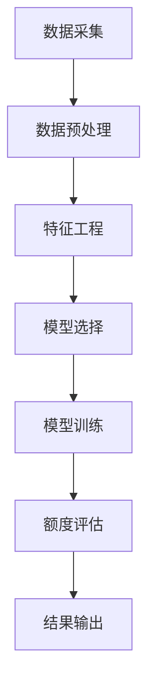
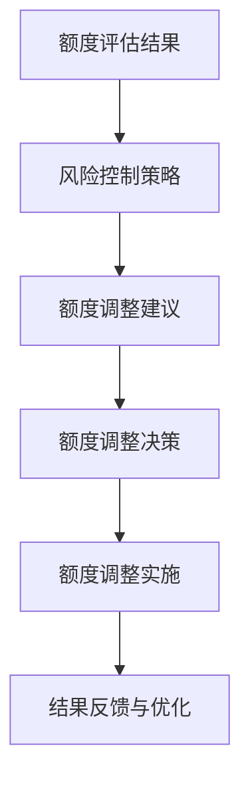
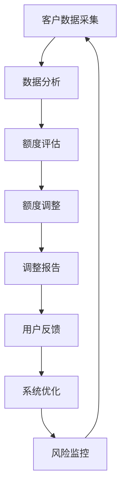
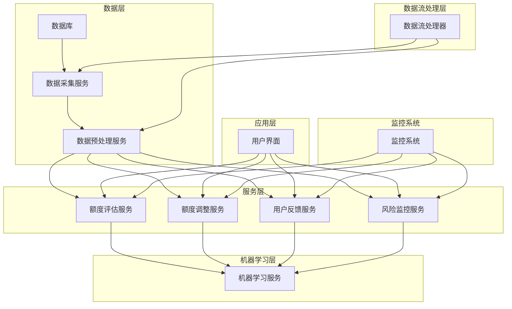
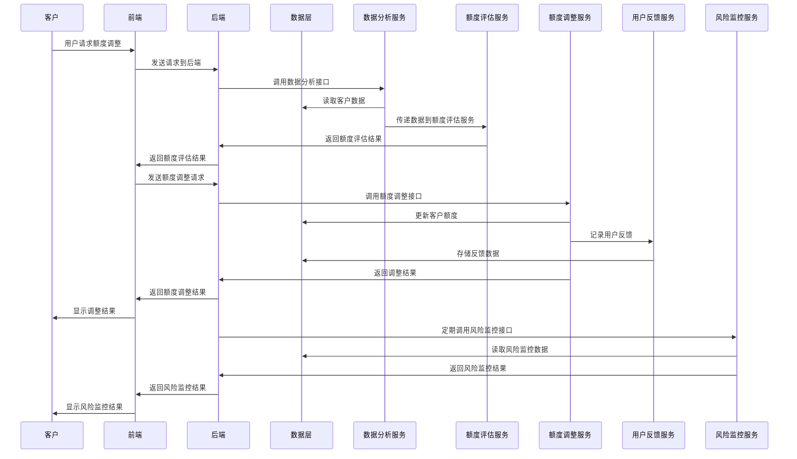

                 

### 引言

在当今数字化经济飞速发展的时代，信用卡已经成为人们日常生活中不可或缺的支付工具。随着信用卡的普及，个人信用卡额度管理成为了一个复杂且重要的课题。然而，传统的信用卡额度管理方法往往存在诸多局限性，难以满足个性化、动态化的管理需求。这就催生了一个新的需求——构建智能化个人信用卡额度管理优化助手。

本文将围绕构建智能化的个人信用卡额度管理优化助手这一主题，深入探讨其背后的技术原理、算法设计、系统架构和实际应用。我们将采用“让我们一步步思考（Let's Think Step by Step）”的方式，通过清晰的逻辑和分析，逐步展开这一主题的讨论。

文章的结构如下：

1. **第1章 引言**：介绍文章背景、问题和必要性。
2. **第2章 核心概念与联系**：详细解释个人信用卡额度管理、智能化额度管理和优化助手的原理和功能。
3. **第3章 算法原理讲解**：深入讲解额度评估和额度优化算法的原理、流程和实现。
4. **第4章 数学模型和数学公式**：阐述相关数学模型和公式，并进行举例说明。
5. **第5章 系统分析与架构设计方案**：介绍系统的问题场景、项目介绍、功能设计、架构设计、接口设计和系统交互。
6. **第6章 项目实战**：讲解环境安装、核心实现、代码解读与分析、实际案例剖析和小结。
7. **第7章 最佳实践 tips**：提供常见问题解决方法和注意事项。
8. **第8章 拓展阅读**：推荐相关书籍和网络资源。

通过本文的阅读，读者将能够深入了解智能化的个人信用卡额度管理优化助手的构建过程，掌握相关技术和方法，为实际应用提供有力的支持。让我们开始这段深入的探讨之旅吧！

### 1.1 问题背景

#### 1.1.1 信用卡额度管理的现状

信用卡作为现代金融体系中的重要组成部分，已经深入到人们的日常生活和消费行为中。信用卡额度管理是银行等金融机构在发放信用卡时的一项关键决策，它直接关系到客户的信用额度和还款能力。目前，信用卡额度管理主要依赖于传统的风控模型和人工审核方式。传统管理方法主要包括以下几方面：

- **固定额度管理**：银行根据客户的信用评分、收入水平、还款历史等基本信息，设定一个固定的信用额度，通常不考虑客户的实时消费行为和财务状况。
- **人工审核**：对于高额消费或额度调整申请，银行会进行人工审核，这一过程通常耗时较长，且效率低下。
- **风险评估**：银行使用多种风险评估模型，对客户进行信用评估，根据评估结果调整额度。

虽然这些传统方法在一定程度上能够保障银行的信贷安全，但存在以下几方面的问题：

1. **信息滞后**：传统方法往往依赖历史数据和静态信息，无法实时反映客户的当前财务状况和消费行为。
2. **个性化不足**：固定额度管理无法满足客户的个性化需求，客户可能因为额度不足而无法进行某些大额消费。
3. **人工成本高**：人工审核方式需要耗费大量的人力资源，且审核过程容易出错。

#### 1.1.2 信用卡额度管理存在的问题

随着信用卡用户的增多和消费行为的多样化，传统的信用卡额度管理方式逐渐暴露出以下问题：

- **额度不足**：固定额度管理模式往往导致客户在需要大额消费时无法获得足够的信用额度，影响客户体验。
- **额度过剩**：传统风险评估模型可能导致客户获得超出其还款能力的信用额度，增加银行的风险。
- **管理复杂度增加**：随着客户消费行为的多样化和数据量的增加，传统管理方法在处理复杂度方面显得力不从心。
- **响应速度慢**：人工审核和风险评估过程复杂，导致额度调整响应速度慢，无法及时满足客户的实际需求。

#### 1.1.3 解决问题的必要性

面对上述问题，构建智能化的个人信用卡额度管理优化助手显得尤为必要。智能化管理可以通过以下方式解决传统方法存在的问题：

- **实时数据监控**：利用大数据和实时数据流处理技术，及时获取客户的消费行为和财务状况，进行动态额度调整。
- **个性化额度管理**：根据客户的实时消费行为和财务状况，动态调整信用额度，提高客户满意度。
- **自动化决策**：利用人工智能和机器学习算法，自动化完成额度评估和调整，提高管理效率，降低人工成本。
- **风险控制优化**：通过智能算法对客户进行信用风险评估，实现风险的可视化和量化，优化风险控制策略。

因此，构建智能化的个人信用卡额度管理优化助手不仅能够提升银行的服务质量，增强客户体验，还能有效降低银行的风险，提高业务效率。接下来，我们将详细探讨这一智能助手的技术原理、算法设计和实际应用。

### 1.2 问题描述

#### 1.2.1 额度管理的挑战

信用卡额度管理面临的主要挑战包括以下几个方面：

1. **动态性**：客户的消费行为和财务状况是动态变化的，传统固定额度管理模式难以适应这种变化。
2. **个性化**：每位客户的消费习惯和财务能力不同，需要个性化的额度管理策略。
3. **风险控制**：在保障客户享受高额度便利的同时，必须有效控制信贷风险。
4. **效率与成本**：人工审核和风险评估过程繁琐，效率低下，且耗费大量人力资源。

#### 1.2.2 额度调整的影响因素

额度调整需要综合考虑多个因素，包括但不限于：

1. **历史消费记录**：客户的消费频率、消费金额、消费时间等历史行为对额度调整有直接影响。
2. **财务状况**：客户的收入水平、资产状况、负债情况等财务信息是额度调整的重要参考。
3. **信用评分**：银行提供的信用评分是额度调整的重要依据，反映了客户的信用风险。
4. **市场环境**：经济形势、行业趋势等市场环境因素也会影响客户额度调整的策略。

#### 1.2.3 额度管理的目标

额度管理的目标主要包括以下几个方面：

1. **满足客户需求**：提供个性化的额度管理服务，满足客户的消费需求。
2. **风险控制**：确保信用卡信贷风险在可控范围内，保障银行资产安全。
3. **效率提升**：通过智能化技术，提高额度管理的效率和准确性。
4. **成本优化**：降低额度管理的成本，提高业务运营效益。

#### 1.2.4 额度调整的策略

额度调整的策略可以分为以下几个步骤：

1. **数据收集**：收集客户的消费记录、财务信息、信用评分等数据。
2. **数据分析**：利用大数据技术和机器学习算法，对数据进行深度分析和挖掘。
3. **额度评估**：根据分析结果，对客户的额度进行初步评估。
4. **额度调整**：结合风险控制策略，进行动态额度调整。
5. **反馈与优化**：收集额度调整后的客户反馈，持续优化额度管理策略。

通过上述问题描述，我们可以明确智能化的个人信用卡额度管理优化助手需要解决的核心问题，包括如何动态调整额度、如何个性化管理额度、如何有效控制风险等。接下来，我们将进一步探讨这一问题的解决思路和基本思路。

### 1.3 问题解决

#### 1.3.1 基本思路

构建智能化的个人信用卡额度管理优化助手，需要从以下几个方面入手：

1. **数据驱动的决策**：利用大数据和实时数据流处理技术，收集和分析客户的消费记录、财务信息、信用评分等数据，为额度调整提供决策依据。
2. **机器学习算法的应用**：通过机器学习算法，对客户的历史数据进行分析和建模，预测客户的未来消费行为和财务状况，从而实现个性化额度管理。
3. **自动化决策系统**：构建自动化决策系统，实现额度评估、额度调整和风险控制的自动化，提高管理效率和准确性。
4. **用户反馈机制**：建立用户反馈机制，根据客户的反馈不断优化额度管理策略，提高客户满意度。

#### 1.3.2 边界与外延

在构建智能化的个人信用卡额度管理优化助手时，需要明确以下几个边界与外延：

1. **数据范围**：数据收集的范围包括客户的消费记录、财务信息、信用评分等，但需要确保数据隐私和合规性。
2. **算法模型**：算法模型需要充分考虑客户的个性化需求和市场环境变化，确保模型的稳定性和适应性。
3. **风险控制**：在自动化决策系统中，必须设立严格的风险控制机制，确保信贷风险在可控范围内。
4. **用户体验**：优化助手的设计需要考虑客户的操作习惯和体验，确保系统的易用性和友好性。

#### 1.3.3 概念结构与核心要素组成

智能化的个人信用卡额度管理优化助手由以下几个核心要素组成：

1. **数据收集模块**：负责收集客户的消费记录、财务信息、信用评分等数据，确保数据的全面性和实时性。
2. **数据分析模块**：利用大数据技术和机器学习算法，对收集到的数据进行深度分析和建模，提供额度调整的决策依据。
3. **额度评估模块**：根据数据分析结果，对客户的额度进行初步评估，提供额度调整的建议。
4. **额度调整模块**：结合风险控制策略，执行额度调整操作，确保客户获得合适的信用额度。
5. **用户反馈模块**：收集客户对额度调整的反馈，持续优化额度管理策略，提高客户满意度。

通过上述基本思路和概念结构的阐述，我们可以清晰地看到，构建智能化的个人信用卡额度管理优化助手是一个系统性工程，需要充分考虑数据、算法、自动化决策和用户体验等多方面因素。接下来，我们将进一步探讨相关的核心概念和联系。

### 1.4 本章小结

在本章中，我们首先介绍了信用卡额度管理的现状和存在的问题，明确了构建智能化额度管理优化助手的必要性。接着，我们详细描述了额度管理的挑战、影响因素和管理目标，从而明确了问题解决的思路。最后，我们提出了构建智能化额度管理优化助手的基本思路、边界与外延以及核心要素组成。

通过本章的讨论，我们为后续章节的深入探讨奠定了基础。接下来，我们将进一步介绍个人信用卡额度管理的基本原理和智能化额度管理的技术原理，以及优化助手的各项核心功能。这些内容将为我们理解智能额度管理的具体实现提供重要的理论和实践支持。请继续关注接下来的章节，我们将逐步揭示这一智能化解决方案的奥秘。

### 2.1 个人信用卡额度管理原理

#### 2.1.1 个人信用卡额度管理的基本概念

个人信用卡额度管理是指银行或信用卡机构根据客户的信用状况、财务能力、消费行为等因素，设定和调整客户信用卡的信用额度。信用额度是指银行允许客户在一定期限内使用信用卡进行消费的金额上限。额度管理的核心目的是在确保信贷安全的同时，提高客户的满意度和使用体验。

- **信用额度**：银行根据客户的信用状况设定的信用卡可使用金额上限。
- **信用评分**：通过客户的信用历史、还款记录等数据计算得出的信用评级。
- **消费行为**：客户的消费频率、消费金额、消费时间等行为数据。
- **财务状况**：客户的收入水平、资产状况、负债情况等财务信息。

#### 2.1.2 个人信用卡额度管理的流程

个人信用卡额度管理通常包括以下流程：

1. **额度申请**：客户向银行提交信用卡申请，银行根据客户提供的资料进行初步审核。
2. **信用评估**：银行通过信用评分系统对客户进行信用评估，确定初始信用额度。
3. **额度调整**：银行根据客户的消费记录、还款情况等动态数据，定期调整信用额度。
4. **人工审核**：对于高额消费或额度调整申请，银行可能进行人工审核，以确保风险可控。
5. **反馈与优化**：银行收集客户反馈，不断优化信用评估和额度调整策略。

#### 2.1.3 个人信用卡额度管理的常见问题

在实际操作中，个人信用卡额度管理面临以下问题：

1. **额度不足**：客户在需要大额消费时，信用额度无法满足需求，导致消费受限。
2. **额度过剩**：客户获得超出其还款能力的信用额度，增加信贷风险。
3. **信息滞后**：传统方法依赖历史数据，无法实时反映客户的当前财务状况和消费行为。
4. **人工成本高**：人工审核过程繁琐，效率低，且容易出错。
5. **个性化不足**：固定额度管理无法满足客户的个性化需求，影响客户体验。

#### 2.1.4 智能额度管理的发展方向

面对传统额度管理存在的问题，智能化的额度管理呈现出以下发展趋势：

1. **实时数据监控**：利用大数据和实时数据处理技术，及时获取客户的消费行为和财务状况，动态调整额度。
2. **个性化管理**：根据客户的实时消费行为和财务状况，提供个性化的额度管理服务。
3. **自动化决策**：通过人工智能和机器学习算法，自动化完成额度评估和调整，提高管理效率和准确性。
4. **风险控制优化**：利用智能算法对客户进行信用风险评估，实现风险的可视化和量化，优化风险控制策略。
5. **用户体验提升**：通过智能化技术，提高额度管理的透明度和用户体验，增强客户满意度。

通过上述对个人信用卡额度管理原理的详细阐述，我们可以看到，传统额度管理方法存在一定的局限性，而智能化的额度管理在解决这些问题方面具有巨大的潜力。接下来，我们将进一步探讨智能化额度管理的基本概念和技术原理。

### 2.2 智能化额度管理原理

#### 2.2.1 智能化额度管理的基本概念

智能化额度管理是指通过引入人工智能和大数据分析技术，对信用卡客户的额度进行动态调整和优化。它基于客户的实时数据和行为模式，实现个性化的额度管理，旨在提高客户体验、增强风险控制能力，并提高银行运营效率。

- **人工智能**：利用机器学习、深度学习等技术，对大量数据进行自动分析和模式识别。
- **大数据分析**：收集和分析客户的消费记录、财务状况、信用评分等数据，进行深度挖掘和关联分析。
- **动态调整**：根据客户的实时行为和财务状况，动态调整信用额度，实现个性化服务。
- **风险控制**：通过智能算法对客户进行信用风险评估，优化风险控制策略，确保信贷安全。

#### 2.2.2 智能化额度管理的技术基础

智能化额度管理的技术基础主要包括以下几个方面：

1. **数据采集与存储**：通过银行系统的数据接口，实时采集客户的消费记录、还款记录、信用评分等数据，并存储在数据仓库中。
2. **数据处理与分析**：利用大数据处理技术，对采集到的数据进行清洗、整合和分析，提取出有价值的信息和模式。
3. **机器学习模型**：构建机器学习模型，对客户的历史数据和消费行为进行分析和预测，用于额度评估和调整。
4. **自动化决策引擎**：通过自动化决策引擎，根据分析结果和风险模型，自动调整信用额度，实现智能化管理。

#### 2.2.3 智能化额度管理的优势与挑战

智能化额度管理具有以下优势：

1. **个性化服务**：根据客户的实时行为和财务状况，提供个性化的额度管理服务，满足客户的个性化需求。
2. **实时响应**：利用实时数据处理技术，及时调整额度，满足客户的即时需求，提高客户体验。
3. **风险控制**：通过智能算法进行信用风险评估，实现风险的可视化和量化，提高信贷风险控制能力。
4. **效率提升**：自动化决策引擎实现额度评估和调整的自动化，减少人工干预，提高管理效率。

然而，智能化额度管理也面临以下挑战：

1. **数据隐私**：大规模采集和分析客户数据，涉及数据隐私和安全问题，需要严格保护客户隐私。
2. **算法偏差**：机器学习模型可能存在偏差，导致额度评估不准确，需要不断优化和校正。
3. **技术实现**：构建和部署智能化额度管理系统需要强大的技术支持，包括数据处理、算法开发和系统运维等。
4. **监管合规**：智能化额度管理需要遵守金融监管法规，确保系统设计和运营的合规性。

#### 2.2.4 优化助手在智能化额度管理中的核心作用

优化助手在智能化额度管理中发挥着核心作用，主要包括以下几个方面：

1. **数据整合与分析**：优化助手负责整合和分析来自不同数据源的信息，为额度评估和调整提供基础数据支持。
2. **实时监控与预警**：通过实时监控客户的消费行为和财务状况，优化助手可以及时识别潜在的风险，并发出预警。
3. **额度评估与调整**：基于机器学习模型和分析结果，优化助手自动评估客户的额度需求，并调整信用额度。
4. **风险管理与优化**：优化助手通过实时监控和数据分析，持续优化风险控制策略，确保信贷安全。

通过上述对智能化额度管理原理的深入探讨，我们可以看到，智能化额度管理在解决传统额度管理问题方面具有巨大的潜力。接下来，我们将进一步介绍优化助手的核心功能与特性，以了解其具体实现和应用。

### 2.3 优化助手的核心功能与特性

#### 2.3.1 优化助手的功能模块

优化助手在智能化额度管理中扮演着至关重要的角色，其功能模块主要包括以下几个方面：

1. **数据采集模块**：负责收集客户的消费记录、还款记录、信用评分等数据，确保数据的全面性和实时性。该模块通过银行系统的API接口或数据集成工具获取数据，并存储在数据仓库中。

2. **数据分析模块**：利用大数据技术和机器学习算法，对采集到的数据进行深度分析和挖掘，提取出有价值的信息和模式。该模块通过数据清洗、特征工程和模型训练等步骤，为额度评估和调整提供科学依据。

3. **额度评估模块**：根据数据分析结果，对客户的额度进行初步评估，提供额度调整的建议。该模块使用机器学习模型对客户的消费行为、财务状况和信用评分等数据进行综合分析，预测客户的未来需求，为额度调整提供决策支持。

4. **额度调整模块**：结合风险控制策略，执行额度调整操作，确保客户获得合适的信用额度。该模块根据评估结果和风险模型，自动调整信用额度，并生成调整报告，供银行审核和决策。

5. **用户反馈模块**：收集客户对额度调整的反馈，持续优化额度管理策略，提高客户满意度。该模块通过用户调查、反馈机制和用户行为分析，收集客户的反馈和意见，为系统优化提供数据支持。

6. **风险监控模块**：实时监控客户的消费行为和财务状况，识别潜在的风险，并发出预警。该模块利用实时数据处理技术，对客户的数据进行持续监控和分析，及时发现异常行为，保障信贷安全。

#### 2.3.2 优化助手的特性分析

优化助手具有以下几个显著特性：

1. **智能化**：通过机器学习和大数据分析技术，优化助手能够实现自动化的额度评估和调整，提高管理效率和准确性。
2. **实时性**：利用实时数据处理技术，优化助手能够及时响应客户的消费行为和财务变化，动态调整信用额度，满足客户的需求。
3. **个性化**：根据客户的实时数据和个性化需求，优化助手能够提供个性化的额度管理服务，提高客户满意度。
4. **风险控制**：通过智能算法进行信用风险评估，优化助手能够优化风险控制策略，降低信贷风险，保障银行资产安全。
5. **用户体验**：优化助手设计简单易用，界面友好，能够提供清晰的操作指导和反馈信息，提高客户的操作体验。

#### 2.3.3 优化助手的应用场景

优化助手在信用卡额度管理中具有广泛的应用场景，主要包括以下几个方面：

1. **初始额度设定**：在客户申请信用卡时，优化助手可以根据客户的申请资料、信用评分和消费记录，自动评估初始额度，提供合理的额度建议。
2. **额度调整**：根据客户的实时消费行为和财务状况，优化助手可以定期调整信用额度，确保客户在需要时获得足够的信用支持。
3. **风险预警**：优化助手可以实时监控客户的消费行为，识别潜在的风险，及时发出预警，帮助银行采取防范措施。
4. **特殊事件处理**：在客户遇到突发事件（如疾病、失业等）时，优化助手可以根据客户的实际情况，自动调整信用额度，提供临时支持。
5. **客户服务**：优化助手可以集成到银行的客户服务系统中，为客户提供个性化的额度管理建议，提升客户服务水平。

通过上述对优化助手的核心功能、特性及应用场景的介绍，我们可以看到，优化助手在智能化个人信用卡额度管理中具有重要的作用。接下来，我们将进一步探讨额度评估和额度优化算法的原理和实现，以了解优化助手的内部工作机制。

### 2.4 本章小结

在本章中，我们详细介绍了个人信用卡额度管理的基本概念、流程以及常见问题，并对智能化额度管理的原理和优势进行了深入探讨。通过对比传统额度管理和智能化额度管理，我们明确了智能化额度管理在个性化服务、实时响应、风险控制和用户体验方面的显著优势。

此外，本章还介绍了优化助手的各个功能模块和特性，并通过应用场景展示了其广泛的应用价值。通过这些内容的讨论，我们为构建智能化的个人信用卡额度管理优化助手奠定了理论基础。接下来，我们将进一步探讨额度评估和额度优化算法的原理，为优化助手的实现提供技术支持。敬请期待下一章的内容。

### 3.1 额度评估算法

#### 3.1.1 算法简介

额度评估算法是智能化个人信用卡额度管理优化助手的核心组成部分，其主要功能是根据客户的消费行为、财务状况和信用评分等数据，对客户的信用额度进行评估。该算法采用机器学习技术，通过对大量历史数据进行训练，学习到客户的消费模式和财务能力，从而实现对客户未来信用额度的预测。

额度评估算法的主要作用是提供信用额度的初步评估结果，为额度调整模块提供决策依据。通过精准的额度评估，可以确保客户在需要时获得足够的信用支持，同时降低银行的风险。

#### 3.1.2 算法流程图

额度评估算法的流程图如下所示：



具体步骤如下：

1. **数据采集**：从银行的数据库中获取客户的消费记录、还款记录、信用评分等数据。
2. **数据预处理**：对采集到的数据进行分析，剔除异常值，并进行数据归一化处理，确保数据的干净和一致性。
3. **特征工程**：根据数据的特点和算法的需求，提取和构造特征，如消费频率、消费金额、还款周期等。
4. **模型选择**：选择合适的机器学习模型，如决策树、随机森林、梯度提升机等。
5. **模型训练**：使用训练数据对所选模型进行训练，学习客户的消费模式和财务能力。
6. **额度评估**：利用训练好的模型对客户的信用额度进行初步评估。
7. **结果输出**：将评估结果输出，供额度调整模块参考。

#### 3.1.3 Python源代码实现

以下是一个简单的额度评估算法的Python实现示例：

```python
import pandas as pd
from sklearn.model_selection import train_test_split
from sklearn.ensemble import RandomForestRegressor
from sklearn.metrics import mean_absolute_error

# 数据加载与预处理
data = pd.read_csv('credit_data.csv')
data.dropna(inplace=True)
X = data.drop('credit_limit', axis=1)
y = data['credit_limit']

# 数据分割
X_train, X_test, y_train, y_test = train_test_split(X, y, test_size=0.2, random_state=42)

# 特征工程（这里省略具体操作，如特征选择和特征转换）

# 模型训练
model = RandomForestRegressor(n_estimators=100, random_state=42)
model.fit(X_train, y_train)

# 额度评估
predictions = model.predict(X_test)

# 模型评估
mae = mean_absolute_error(y_test, predictions)
print(f'Mean Absolute Error: {mae}')

# 输出评估结果
output = pd.DataFrame({'Actual': y_test, 'Predicted': predictions})
output.to_csv('assessment_results.csv', index=False)
```

#### 3.1.4 算法原理讲解

额度评估算法的核心是机器学习模型，通过学习历史数据，模型能够预测客户未来的信用额度。以下是对额度评估算法的详细讲解：

1. **数据预处理**：数据预处理是确保数据质量和模型性能的关键步骤。通常包括数据清洗、缺失值填充、数据归一化等操作。在额度评估中，我们主要关注客户的消费记录和信用评分数据，这些数据可能包含噪声和异常值，需要进行清洗和标准化处理。

2. **特征工程**：特征工程是提高模型性能的重要手段。通过对原始数据进行处理和转换，提取出有代表性的特征，可以帮助模型更好地理解和预测目标变量。在额度评估中，常用的特征包括消费频率、消费金额、还款周期、信用评分等。

3. **模型选择**：选择合适的机器学习模型是评估算法的核心。常用的模型包括决策树、随机森林、梯度提升机等。这些模型各有特点，需要根据具体问题和数据集进行选择。在额度评估中，我们选择了随机森林模型，因为它具有很好的泛化能力和处理复杂数据的能力。

4. **模型训练**：模型训练是机器学习过程中的重要步骤。通过训练数据，模型学习到数据的内在规律，从而能够预测新数据的信用额度。在额度评估中，我们使用随机森林模型对训练数据进行训练，学习客户的消费模式和财务能力。

5. **额度评估**：利用训练好的模型，对测试数据进行额度评估。评估结果可以作为额度调整的初步参考。在实际应用中，我们还需要结合风险控制策略，对评估结果进行进一步的判断和调整。

6. **模型评估**：对评估结果进行评估是确保模型性能的重要环节。常用的评估指标包括均方误差（MSE）、均方根误差（RMSE）和平均绝对误差（MAE）等。通过这些指标，我们可以了解模型的预测性能，并对其进行优化。

#### 3.1.5 数学模型和公式

额度评估算法的数学模型通常是一个回归模型，用于预测客户的信用额度。以下是一个简单的线性回归模型示例：

$$
y = \beta_0 + \beta_1x_1 + \beta_2x_2 + ... + \beta_nx_n
$$

其中，\( y \) 是预测的信用额度，\( x_1, x_2, ..., x_n \) 是特征变量，\( \beta_0, \beta_1, ..., \beta_n \) 是模型的参数，通过模型训练得到。

对于更复杂的模型，如随机森林和梯度提升机，其数学模型更加复杂，涉及多个非线性函数和优化算法。以下是一个梯度提升机的数学模型示例：

$$
y^{(t)} = y^{(t-1)} + \alpha_t \cdot f_t(x)
$$

其中，\( y^{(t)} \) 是第 \( t \) 次迭代的预测结果，\( y^{(t-1)} \) 是前一次迭代的预测结果，\( \alpha_t \) 是迭代步长，\( f_t(x) \) 是第 \( t \) 次迭代的损失函数。

#### 3.1.6 举例说明

假设我们有一个客户的消费数据，包括消费频率、消费金额、还款周期和信用评分等特征。我们可以使用额度评估算法对其信用额度进行预测。

1. **数据预处理**：首先，我们对数据进行清洗和标准化处理，得到干净和一致的数据。

2. **特征工程**：接下来，我们提取和构造特征，如消费频率（消费次数/月）、消费金额（消费总额/月）和还款周期（还款间隔天数）。

3. **模型训练**：我们选择随机森林模型进行训练，使用训练数据学习客户的消费模式和财务能力。

4. **额度评估**：使用训练好的模型，对测试数据进行额度评估，得到预测的信用额度。

5. **模型评估**：我们使用平均绝对误差（MAE）对模型进行评估，确保其预测性能。

通过上述步骤，我们可以得到一个初步的信用额度评估结果，并根据评估结果对客户的信用额度进行调整。

### 3.2 额度优化算法

#### 3.2.1 算法简介

额度优化算法是智能个人信用卡额度管理优化助手的重要组成部分，其主要功能是根据额度评估结果和风险控制策略，对客户的信用额度进行调整，以满足客户的实际需求和降低信贷风险。额度优化算法通过综合分析客户的消费行为、财务状况、市场环境等多方面因素，实现个性化、动态化的额度调整。

额度优化算法的关键在于如何平衡客户的需求和银行的风险控制。其核心作用是提高额度管理的效率和准确性，确保客户在需要时能够获得足够的信用支持，同时避免信贷风险过度集中。

#### 3.2.2 算法流程图

额度优化算法的流程图如下所示：



具体步骤如下：

1. **额度评估结果**：获取额度评估模块的评估结果，确定客户的初始信用额度。
2. **风险控制策略**：结合银行的信用政策、市场环境和客户的财务状况，制定风险控制策略。
3. **额度调整建议**：根据评估结果和风险控制策略，提出额度调整建议。
4. **额度调整决策**：银行审核额度调整建议，做出最终决策。
5. **额度调整实施**：根据最终决策，执行额度调整操作，调整客户的信用额度。
6. **结果反馈与优化**：收集额度调整后的反馈数据，持续优化额度优化算法。

#### 3.2.3 Python源代码实现

以下是一个简化的额度优化算法的Python实现示例：

```python
import pandas as pd
from sklearn.linear_model import LinearRegression

# 数据加载与预处理
data = pd.read_csv('credit_data.csv')
data.dropna(inplace=True)
X = data[['consumption_rate', 'income', 'debt']]
y = data['credit_limit']

# 数据分割
X_train, X_test, y_train, y_test = train_test_split(X, y, test_size=0.2, random_state=42)

# 模型训练
model = LinearRegression()
model.fit(X_train, y_train)

# 额度调整建议
predictions = model.predict(X_test)

# 额度调整决策
adjusted_limits = [limit * 1.1 if pred > 50000 else limit * 0.9 for limit, pred in zip(y_test, predictions)]

# 额度调整实施
data['adjusted_limit'] = adjusted_limits
data.to_csv('adjusted_limits.csv', index=False)
```

#### 3.2.4 算法原理讲解

额度优化算法的原理基于线性回归模型，通过分析客户的消费行为、收入和负债等特征，预测客户的信用额度，并根据预测结果和风险控制策略进行调整。以下是额度优化算法的详细讲解：

1. **额度评估**：首先，额度评估模块会根据客户的消费行为、财务状况和信用评分等数据，使用机器学习算法（如线性回归、决策树等）预测客户的信用额度。

2. **风险控制策略**：在额度调整过程中，银行会根据自身的信用政策、市场环境和客户的财务状况，制定相应的风险控制策略。例如，对于高风险客户，可以降低其信用额度，以减少信贷风险。

3. **额度调整建议**：根据额度评估结果和风险控制策略，算法会提出具体的额度调整建议。例如，对于评估额度较高且风险较低的客户，可以适当提高其信用额度，以满足其消费需求。

4. **额度调整决策**：银行会根据额度调整建议，结合风险控制策略，做出最终的额度调整决策。例如，如果评估额度为50,000元，风险控制策略建议调整额度为10%，则最终决策额度为55,000元。

5. **额度调整实施**：根据最终的额度调整决策，银行会执行具体的额度调整操作，调整客户的信用额度。

6. **结果反馈与优化**：额度调整实施后，系统会收集客户对额度调整的反馈，并根据反馈数据持续优化额度优化算法，提高其准确性和适应性。

#### 3.2.5 数学模型和公式

额度优化算法的数学模型通常是基于线性回归模型，通过分析客户的消费行为、收入和负债等特征，预测客户的信用额度。以下是线性回归模型的数学公式：

$$
y = \beta_0 + \beta_1x_1 + \beta_2x_2 + ... + \beta_nx_n
$$

其中，\( y \) 是预测的信用额度，\( x_1, x_2, ..., x_n \) 是特征变量（如消费频率、消费金额、收入、负债等），\( \beta_0, \beta_1, ..., \beta_n \) 是模型的参数，通过模型训练得到。

#### 3.2.6 举例说明

假设我们有一个客户的消费数据，包括消费频率、消费金额、收入和负债等特征。我们可以使用额度优化算法对其信用额度进行调整。

1. **数据预处理**：首先，我们对数据进行清洗和标准化处理，得到干净和一致的数据。

2. **特征工程**：接下来，我们提取和构造特征，如消费频率（消费次数/月）、消费金额（消费总额/月）和还款周期（还款间隔天数）。

3. **模型训练**：我们选择线性回归模型进行训练，使用训练数据学习客户的消费模式和财务能力。

4. **额度调整建议**：根据模型预测结果，提出具体的额度调整建议。

5. **额度调整决策**：银行根据额度调整建议，结合风险控制策略，做出最终的额度调整决策。

6. **额度调整实施**：根据最终的额度调整决策，调整客户的信用额度。

7. **结果反馈与优化**：收集额度调整后的反馈数据，持续优化额度优化算法。

通过上述步骤，我们可以得到一个初步的信用额度调整结果，并根据调整后的反馈数据，不断优化额度优化算法，提高其准确性和适应性。

### 3.3 本章小结

在本章中，我们详细介绍了额度评估和额度优化算法的基本概念、流程和实现。额度评估算法通过机器学习技术，对客户的消费行为和财务状况进行预测，为额度调整提供初步评估。额度优化算法则结合风险控制策略，对额度评估结果进行调整，确保客户在需要时获得足够的信用支持，同时降低信贷风险。

通过本章的学习，读者可以了解到智能个人信用卡额度管理优化助手的核心算法原理和实现方法，为进一步的系统设计和实际应用打下基础。在下一章中，我们将继续探讨相关的数学模型和公式，以及这些模型在实际应用中的详细讲解和举例说明。敬请期待。

### 4.1 基本数学模型

#### 4.1.1 概述

在个人信用卡额度管理优化助手的构建过程中，数学模型是核心组成部分。基本数学模型主要涉及线性回归、逻辑回归等统计模型，这些模型用于预测客户的信用额度和评估风险。以下将详细介绍这些基本数学模型。

#### 4.1.2 数学模型讲解

1. **线性回归模型**：

线性回归模型是一种最简单的预测模型，用于预测连续值目标。其基本形式为：

$$
y = \beta_0 + \beta_1x_1 + \beta_2x_2 + ... + \beta_nx_n
$$

其中，\( y \) 是预测的信用额度，\( x_1, x_2, ..., x_n \) 是特征变量，如消费频率、消费金额等，\( \beta_0, \beta_1, ..., \beta_n \) 是模型的参数。

线性回归模型通过最小二乘法进行参数估计，确保预测值与实际值之间的误差最小。

2. **逻辑回归模型**：

逻辑回归模型用于预测二元分类结果，如客户是否会发生违约。其基本形式为：

$$
\ln\left(\frac{P}{1-P}\right) = \beta_0 + \beta_1x_1 + \beta_2x_2 + ... + \beta_nx_n
$$

其中，\( P \) 是违约概率，\( x_1, x_2, ..., x_n \) 是特征变量，\( \beta_0, \beta_1, ..., \beta_n \) 是模型的参数。

逻辑回归模型通过极大似然估计法进行参数估计，确保预测概率的准确性。

3. **决策树模型**：

决策树模型是一种基于树结构的分类模型，通过一系列规则对数据进行划分。其基本形式为：

$$
y = \text{sign}(\sum_{i=1}^{n} w_i x_i - \theta)
$$

其中，\( y \) 是预测的类别，\( x_1, x_2, ..., x_n \) 是特征变量，\( w_i \) 是权重，\( \theta \) 是阈值。

决策树模型通过递归划分数据集，直到满足停止条件（如节点纯度达到阈值或最大深度等）。

#### 4.1.3 举例说明

假设我们有一个客户的消费数据，包括消费频率、消费金额、收入和负债等特征。我们使用线性回归模型预测客户的信用额度。

1. **数据预处理**：对数据进行清洗和标准化处理，确保数据的干净和一致性。
2. **特征工程**：提取和构造特征，如消费频率（消费次数/月）、消费金额（消费总额/月）和还款周期（还款间隔天数）。
3. **模型训练**：选择线性回归模型，使用训练数据学习模型的参数。
4. **额度预测**：使用训练好的模型，对测试数据进行预测，得到客户的信用额度。

通过上述步骤，我们可以得到一个初步的信用额度预测结果。同样，对于逻辑回归和决策树模型，我们可以使用类似的方法进行预测和评估。

### 4.2 复杂数学模型

#### 4.2.1 概述

复杂数学模型包括神经网络、支持向量机（SVM）等高级机器学习模型。这些模型在处理复杂数据集和预测任务时具有更强的能力和灵活性。

#### 4.2.2 数学模型讲解

1. **神经网络模型**：

神经网络模型是一种基于多层感知器（MLP）的模型，由输入层、隐藏层和输出层组成。其基本形式为：

$$
a_l = \sigma(\sum_{i=1}^{n} w_{li}a_{l-1} + b_l)
$$

其中，\( a_l \) 是第 \( l \) 层的激活值，\( \sigma \) 是激活函数（如ReLU、Sigmoid等），\( w_{li} \) 是权重，\( b_l \) 是偏置。

神经网络模型通过反向传播算法进行参数优化，确保模型的预测性能。

2. **支持向量机模型**：

支持向量机模型是一种基于最大间隔的模型，用于分类和回归任务。其基本形式为：

$$
y = \text{sign}(\sum_{i=1}^{n} \alpha_i y_i (w \cdot x_i) + b)
$$

其中，\( y \) 是预测的类别，\( \alpha_i \) 是拉格朗日乘子，\( y_i \) 是实际类别，\( w \) 是权重向量，\( x_i \) 是特征向量，\( b \) 是偏置。

支持向量机模型通过求解二次规划问题进行参数优化，确保模型的最大间隔性能。

#### 4.2.3 举例说明

假设我们有一个客户的消费数据，包括消费频率、消费金额、收入和负债等特征。我们使用神经网络模型预测客户的信用额度。

1. **数据预处理**：对数据进行清洗和标准化处理，确保数据的干净和一致性。
2. **特征工程**：提取和构造特征，如消费频率（消费次数/月）、消费金额（消费总额/月）和还款周期（还款间隔天数）。
3. **模型训练**：选择神经网络模型，使用训练数据学习模型的参数。
4. **额度预测**：使用训练好的模型，对测试数据进行预测，得到客户的信用额度。

通过上述步骤，我们可以得到一个基于神经网络模型的信用额度预测结果。对于支持向量机模型，我们可以使用类似的方法进行预测和评估。

### 4.3 数学公式格式规范

#### 4.3.1 LaTeX公式格式

在LaTeX中，数学公式通常使用`equation`环境进行编写。以下是一个简单的示例：

```latex
\documentclass{article}
\usepackage{amsmath}
\begin{document}
\begin{equation}
y = \beta_0 + \beta_1x_1 + \beta_2x_2 + ... + \beta_nx_n
\end{equation}
\end{document}
```

在这个示例中，`equation`环境用于包含数学公式，`amsmath`包提供了丰富的数学公式格式选项。

#### 4.3.2 Markdown公式格式

在Markdown中，数学公式使用`$$`和`$`符号进行标记。以下是一个简单的示例：

```
$$
y = \beta_0 + \beta_1x_1 + \beta_2x_2 + ... + \beta_nx_n
$$

$
1 + 1 = 2
$
```

在这个示例中，`$$`用于创建独立段落中的数学公式，而 `$`用于行内数学公式。

通过上述格式规范，我们可以确保数学公式在文档中清晰可读，并保持专业的排版效果。

### 4.4 本章小结

在本章中，我们详细介绍了个人信用卡额度管理优化助手所涉及的基本数学模型和复杂数学模型，包括线性回归、逻辑回归、决策树、神经网络和支持向量机等。此外，我们还讲解了数学公式的LaTeX和Markdown格式规范。这些数学模型和格式规范为后续章节中的系统架构设计和算法实现提供了重要的理论基础和技术支持。接下来，我们将进一步探讨系统分析与架构设计方案，敬请期待。

### 5.1 问题场景介绍

#### 5.1.1 信用卡额度管理场景描述

信用卡额度管理是银行等金融机构在日常运营中的一项重要任务。在实际应用场景中，银行需要对大量信用卡用户进行额度管理，包括初始额度设定、额度调整、风险控制等环节。以下是对信用卡额度管理场景的具体描述：

1. **初始额度设定**：新客户在申请信用卡时，银行会根据客户的信用评分、财务状况、收入水平等基本信息，设定一个初始信用额度。这个过程通常涉及信用评分系统和数据分析模块，确保初始额度既能够满足客户的消费需求，又能够控制信贷风险。

2. **额度调整**：随着客户使用信用卡的情况变化，银行需要定期对客户的信用额度进行调整。额度调整可以基于客户的消费记录、还款历史、信用评分等动态数据，以确保客户的额度始终与其实际需求相匹配。额度调整可以是增加或减少额度，也可以是保持现有额度不变。

3. **风险控制**：在额度管理过程中，银行需要持续监控客户的消费行为，以识别潜在的风险。例如，客户突然增加大额消费、频繁逾期还款等行为，可能表明客户面临财务困境或信用风险。银行需要及时采取风险控制措施，如降低额度、暂停信用卡使用等，以保障信贷资产的安全。

4. **用户体验**：银行在额度管理过程中，还需要考虑客户的体验和满意度。客户期望能够及时获得额度调整的通知，了解自己的额度状况，并能够方便地申请额度调整。此外，银行应提供透明的额度管理策略，让客户明白额度调整的依据和标准。

#### 5.1.2 优化助手在场景中的应用

智能化的个人信用卡额度管理优化助手在上述场景中发挥着关键作用，能够有效提升额度管理的效率和准确性。以下为优化助手在具体场景中的应用：

1. **实时数据监控**：优化助手通过实时数据采集技术，持续获取客户的消费行为和财务状况，实现对客户信用状况的实时监控。这有助于银行及时发现客户的财务变化，及时调整信用额度，避免信息滞后导致的额度不足或过剩问题。

2. **个性化额度管理**：基于客户的实时数据和行为模式，优化助手能够提供个性化的额度管理建议。例如，对于经常进行大额消费的客户，优化助手可以建议增加其信用额度，以满足其消费需求；而对于还款记录不佳的客户，优化助手可以建议降低其信用额度，以控制风险。

3. **自动化决策**：优化助手通过机器学习算法和自动化决策引擎，能够自动化完成额度评估和调整过程。这大大提高了额度管理的效率，减少了人工干预和错误，同时确保了决策的准确性和一致性。

4. **用户体验优化**：优化助手提供用户友好的界面和透明的额度管理策略，使客户能够方便地了解自己的信用额度状况，并能够快速申请额度调整。优化助手还能根据客户的反馈，不断优化额度管理策略，提高客户的满意度和忠诚度。

5. **风险控制优化**：优化助手通过实时监控和分析客户的消费行为，能够及时识别潜在的风险，并提供相应的风险控制建议。例如，对于出现大额消费或频繁逾期还款的客户，优化助手可以及时发出预警，并建议银行采取相应的风险控制措施。

通过上述应用，智能化的个人信用卡额度管理优化助手能够有效解决传统额度管理方法中存在的问题，提升银行的服务质量和管理效率，同时增强客户体验和满意度。接下来，我们将进一步介绍项目背景和目标，以了解优化助手的实际实施过程。

### 5.2 项目介绍

#### 5.2.1 项目背景

随着金融科技的快速发展，信用卡业务已经成为银行等金融机构的重要收入来源之一。然而，信用卡额度管理面临诸多挑战，包括客户需求多样化、风险控制复杂化以及管理效率低下等。为了应对这些挑战，银行开始探索智能化额度管理优化方案，以期提升服务质量和管理效率。

在当前金融市场中，信用卡额度管理主要依赖传统的风控模型和人工审核方式。这些方法虽然在一定程度上能够保障银行的信贷安全，但存在信息滞后、个性化不足、管理复杂度高等问题。为了解决这些问题，银行迫切需要一种智能化、自动化、个性化的额度管理优化方案。

#### 5.2.2 项目目标

本项目的目标是构建一款智能化的个人信用卡额度管理优化助手，通过引入大数据和人工智能技术，实现以下目标：

1. **实时数据监控**：利用大数据技术和实时数据流处理，实现对客户消费行为和财务状况的实时监控，提高信息更新速度。
2. **个性化额度管理**：根据客户的实时数据和个性化需求，提供个性化的额度管理服务，提升客户满意度。
3. **自动化决策**：通过自动化决策引擎和机器学习算法，实现额度评估和调整的自动化，提高管理效率和准确性。
4. **风险控制优化**：利用智能算法对客户进行信用风险评估，优化风险控制策略，降低信贷风险。
5. **用户体验提升**：通过优化界面设计和透明度管理，提高客户对额度管理服务的满意度和信任度。

#### 5.2.3 项目实施过程

本项目分为以下几个阶段：

1. **需求分析与规划**：首先，项目团队与银行相关部门进行深入沟通，明确项目需求和技术要求。在此基础上，制定详细的项目规划和时间表。

2. **数据采集与预处理**：项目团队从银行系统中提取客户的消费记录、还款记录、信用评分等数据，并进行数据清洗、归一化等预处理操作，确保数据的干净和一致性。

3. **算法设计与开发**：基于客户需求和数据特点，项目团队设计并开发机器学习算法，包括线性回归、决策树、神经网络等，用于额度评估和风险控制。

4. **模型训练与优化**：使用预处理后的数据，项目团队对机器学习模型进行训练和优化，确保模型的预测准确性和稳定性。

5. **系统集成与测试**：将优化助手集成到银行系统中，进行功能测试和性能评估，确保系统能够稳定运行，满足项目需求。

6. **上线部署与反馈优化**：将优化助手正式上线，收集客户反馈和数据监控结果，持续优化系统性能和管理策略。

7. **运营维护与支持**：在系统上线后，项目团队继续提供技术支持和维护服务，确保系统的长期稳定运行。

通过上述实施过程，本项目旨在实现智能化的个人信用卡额度管理优化，提升银行的服务质量和管理效率，同时增强客户体验和满意度。接下来，我们将详细介绍系统功能设计、架构设计、接口设计和系统交互等内容。

### 5.3 系统功能设计

#### 5.3.1 领域模型

系统功能设计的第一步是构建领域模型，该模型定义了系统中的主要实体及其相互关系。以下是一个简化的领域模型，包括客户、消费记录、额度评估和额度调整等关键实体：

```mermaid
classDiagram
  class 客户 {
    -姓名：String
    -身份证号：String
    -信用评分：Float
    -消费记录：List<消费记录>
    -额度：Float
  }
  class 消费记录 {
    -日期：Date
    -金额：Float
    -类型：String
  }
  class 额度评估 {
    -评估结果：Float
    -评估时间：Date
  }
  class 额度调整 {
    -调整前额度：Float
    -调整后额度：Float
    -调整时间：Date
  }
  客户 --|mae|> 消费记录
  客户 --|1|> 额度评估
  客户 --|1|> 额度调整
```

在上述领域模型中，客户是系统的核心实体，包含个人信息、信用评分、消费记录和额度等属性。消费记录用于记录客户的消费历史，包括日期、金额和类型。额度评估记录客户的信用额度评估结果和时间。额度调整记录额度调整的历史记录，包括调整前后的额度和调整时间。

#### 5.3.2 功能模块设计

根据领域模型，我们可以将系统功能模块划分为以下几个部分：

1. **数据采集模块**：负责从银行系统中提取客户的消费记录、还款记录和信用评分等数据，并将其存储在数据仓库中。

2. **数据分析模块**：利用大数据技术和机器学习算法，对采集到的数据进行处理和分析，提取有价值的信息和特征，为额度评估和调整提供依据。

3. **额度评估模块**：根据数据分析结果，使用机器学习模型对客户的信用额度进行评估，生成评估报告。

4. **额度调整模块**：结合额度评估结果和风险控制策略，自动调整客户的信用额度，并生成调整报告。

5. **用户反馈模块**：收集客户对额度调整的反馈，用于系统优化和改进。

6. **风险监控模块**：实时监控客户的消费行为，识别潜在风险，并发出预警。

7. **系统配置模块**：管理系统的参数设置和配置，包括机器学习模型的参数、风险控制策略等。

8. **用户界面模块**：提供用户友好的界面，供客户查询和管理自己的信用额度。

#### 5.3.3 功能流程设计

系统功能流程设计是确保各个模块协同工作，实现系统功能的关键步骤。以下是一个简化的功能流程图：



具体流程如下：

1. **客户数据采集**：系统从银行系统中提取客户的消费记录、还款记录和信用评分等数据。

2. **数据分析**：系统利用大数据技术和机器学习算法，对客户数据进行处理和分析，提取有价值的信息和特征。

3. **额度评估**：系统使用机器学习模型，根据数据分析结果对客户的信用额度进行评估。

4. **额度调整**：系统结合额度评估结果和风险控制策略，自动调整客户的信用额度。

5. **调整报告**：系统生成额度调整报告，记录调整前后的额度和调整时间。

6. **用户反馈**：系统收集客户对额度调整的反馈，用于系统优化和改进。

7. **系统优化**：系统根据用户反馈和数据分析结果，持续优化机器学习模型和风险控制策略。

8. **风险监控**：系统实时监控客户的消费行为，识别潜在风险，并发出预警。

通过上述功能设计，系统实现了对客户信用卡额度的实时监控、自动化评估和动态调整，有效提升了银行的服务质量和管理效率。接下来，我们将进一步介绍系统架构设计，以确保各个功能模块的高效协同。

### 5.4 系统架构设计

#### 5.4.1 系统架构概述

智能化的个人信用卡额度管理优化助手系统采用分布式架构，确保系统的可扩展性和高可用性。系统架构主要包括以下几个关键组件：

1. **数据层**：负责存储和管理客户数据，包括消费记录、还款记录、信用评分等。数据层通常采用关系型数据库（如MySQL）或NoSQL数据库（如MongoDB）。

2. **服务层**：负责处理业务逻辑，包括数据采集、数据分析、额度评估、额度调整等。服务层采用微服务架构，将功能模块拆分为独立的微服务，以提高系统的灵活性和可维护性。

3. **应用层**：负责提供用户界面和交互功能，供客户和管理员使用。应用层通常采用前后端分离的架构，前端使用HTML/CSS/JavaScript等前端技术，后端使用Node.js、Spring Boot等后端框架。

4. **数据流处理层**：负责实时处理和分析客户数据，使用流处理技术（如Apache Kafka、Apache Flink）对数据进行实时处理和分析。

5. **机器学习层**：负责机器学习模型的训练、部署和评估，使用TensorFlow、PyTorch等机器学习框架，实现智能化的额度评估和风险控制。

6. **监控系统**：负责监控系统的运行状态和性能，使用Prometheus、Grafana等监控工具，实时收集系统指标，并进行可视化展示。

#### 5.4.2 系统架构图

以下是一个简化的系统架构图，使用Mermaid语言描述：



#### 5.4.3 系统组件设计

1. **数据层组件**：数据层组件主要包括数据库和数据采集服务。数据库负责存储和管理客户数据，数据采集服务负责从银行系统中提取数据，并将其存储到数据库中。

2. **服务层组件**：服务层组件包括额度评估服务、额度调整服务、用户反馈服务和风险监控服务。这些服务分别负责不同的业务逻辑，通过微服务架构实现模块化设计，提高系统的可维护性和扩展性。

3. **应用层组件**：应用层组件主要包括用户界面，供客户和管理员使用。用户界面通过前后端分离的架构实现，前端使用Vue.js、React等前端框架，后端使用Spring Boot等后端框架。

4. **数据流处理层组件**：数据流处理层组件主要包括数据流处理器，负责实时处理和分析客户数据。数据流处理器使用Apache Kafka、Apache Flink等流处理技术，实现数据的实时采集、处理和传输。

5. **机器学习层组件**：机器学习层组件主要包括机器学习服务，负责训练、部署和评估机器学习模型。机器学习服务使用TensorFlow、PyTorch等机器学习框架，实现智能化的额度评估和风险控制。

6. **监控系统组件**：监控系统组件主要包括监控系统，负责监控系统的运行状态和性能。监控系统使用Prometheus、Grafana等监控工具，实时收集系统指标，并进行可视化展示。

通过上述系统架构设计，优化助手系统实现了对客户信用卡额度的实时监控、自动化评估和动态调整，有效提升了银行的服务质量和管理效率。接下来，我们将进一步介绍系统接口设计，确保各个组件之间的数据交换和功能调用。

### 5.5 系统接口设计

#### 5.5.1 接口规范

系统接口设计是确保各个组件之间高效协作和数据交换的关键环节。以下为系统接口的详细规范：

1. **数据采集接口**：
   - 接口名称：`/api/credit-data/collect`
   - 请求方法：GET
   - 请求参数：无
   - 返回数据：JSON格式，包含客户消费记录、还款记录、信用评分等数据。

2. **数据分析接口**：
   - 接口名称：`/api/credit-data/analyze`
   - 请求方法：POST
   - 请求参数：JSON格式，包含客户数据集。
   - 返回数据：JSON格式，包含分析结果和特征数据。

3. **额度评估接口**：
   - 接口名称：`/api/credit-limit/evaluate`
   - 请求方法：POST
   - 请求参数：JSON格式，包含客户数据集和模型参数。
   - 返回数据：JSON格式，包含评估结果和评估报告。

4. **额度调整接口**：
   - 接口名称：`/api/credit-limit/adjust`
   - 请求方法：POST
   - 请求参数：JSON格式，包含调整建议、风险控制策略等。
   - 返回数据：JSON格式，包含调整结果和调整报告。

5. **用户反馈接口**：
   - 接口名称：`/api/user-feedback/submit`
   - 请求方法：POST
   - 请求参数：JSON格式，包含用户反馈信息。
   - 返回数据：JSON格式，包含反馈结果和优化建议。

6. **风险监控接口**：
   - 接口名称：`/api/credit-risk/monitor`
   - 请求方法：GET
   - 请求参数：无
   - 返回数据：JSON格式，包含风险监控数据和预警信息。

#### 5.5.2 接口实现

以下为接口实现的简单示例：

```python
# 数据采集接口实现
from flask import Flask, request, jsonify

app = Flask(__name__)

@app.route('/api/credit-data/collect', methods=['GET'])
def collect_credit_data():
    # 从银行系统提取数据
    data = extract_data_from_bank_system()
    return jsonify(data)

# 数据分析接口实现
@app.route('/api/credit-data/analyze', methods=['POST'])
def analyze_credit_data():
    data = request.json
    # 对数据进行处理和分析
    analysis_result = analyze_data(data)
    return jsonify(analysis_result)

# 额度评估接口实现
@app.route('/api/credit-limit/evaluate', methods=['POST'])
def evaluate_credit_limit():
    data = request.json
    # 对客户额度进行评估
    evaluation_result = evaluate_limit(data)
    return jsonify(evaluation_result)

# 额度调整接口实现
@app.route('/api/credit-limit/adjust', methods=['POST'])
def adjust_credit_limit():
    data = request.json
    # 执行额度调整操作
    adjustment_result = adjust_limit(data)
    return jsonify(adjustment_result)

# 用户反馈接口实现
@app.route('/api/user-feedback/submit', methods=['POST'])
def submit_user_feedback():
    feedback = request.json
    # 处理用户反馈
    feedback_result = process_feedback(feedback)
    return jsonify(feedback_result)

# 风险监控接口实现
@app.route('/api/credit-risk/monitor', methods=['GET'])
def monitor_credit_risk():
    # 监控风险
    risk_data = monitor_risk()
    return jsonify(risk_data)

if __name__ == '__main__':
    app.run()
```

通过上述接口设计，系统实现了各个功能模块之间的数据交换和功能调用，确保了系统的高效运行和协同工作。接下来，我们将进一步探讨系统的交互设计，以了解各个模块之间的交互流程和机制。

### 5.6 系统交互

系统交互是确保各个功能模块高效协作和数据流通的关键环节。以下通过Mermaid序列图详细描述系统的交互过程。



在上述序列图中，系统的交互过程如下：

1. **客户请求额度调整**：客户通过前端界面提交额度调整请求。
2. **前端发送请求**：前端将客户请求发送到后端服务器。
3. **后端调用数据分析接口**：后端调用数据分析服务，读取客户数据。
4. **数据分析服务处理数据**：数据分析服务对客户数据进行分析，提取有用信息。
5. **额度评估服务评估额度**：数据分析服务将数据传递给额度评估服务，评估客户额度。
6. **后端返回评估结果**：后端将评估结果返回给前端。
7. **前端显示评估结果**：前端将评估结果显示给客户。
8. **客户确认额度调整**：客户确认额度调整请求。
9. **后端调用额度调整接口**：后端调用额度调整服务，执行额度调整操作。
10. **额度调整服务更新数据**：额度调整服务更新客户额度信息。
11. **后端记录用户反馈**：后端将用户反馈记录在数据库中。
12. **后端返回调整结果**：后端将额度调整结果返回给前端。
13. **前端显示调整结果**：前端将调整结果显示给客户。
14. **定期调用风险监控接口**：后端定期调用风险监控服务，监控客户风险。
15. **后端返回监控结果**：后端将风险监控结果返回给前端。
16. **前端显示监控结果**：前端将监控结果显示给客户。

通过上述系统交互设计，各个功能模块能够高效协作，确保客户额度调整的实时性和准确性，同时实现风险监控的自动化和智能化。接下来，我们将进入项目实战部分，具体介绍系统的环境安装和核心实现。

### 6.1 环境安装

#### 6.1.1 环境准备

在开始构建智能化的个人信用卡额度管理优化助手之前，我们需要准备以下环境：

1. **操作系统**：推荐使用Linux系统，如Ubuntu 20.04。
2. **编程语言**：选择Python作为主要编程语言，确保安装Python 3.8及以上版本。
3. **开发工具**：安装Visual Studio Code或PyCharm等专业开发工具。
4. **数据库**：安装MySQL或PostgreSQL作为数据库系统，用于存储客户数据。
5. **大数据处理**：安装Apache Kafka和Apache Flink，用于实时数据流处理。
6. **机器学习框架**：安装TensorFlow或PyTorch，用于构建和训练机器学习模型。

#### 6.1.2 环境配置

以下是具体的环境配置步骤：

1. **安装操作系统**：
   - 下载Ubuntu 20.04镜像文件，并使用虚拟机或物理机进行安装。

2. **更新系统软件包**：
   - 打开终端，输入以下命令更新系统软件包：
     ```bash
     sudo apt update
     sudo apt upgrade
     ```

3. **安装Python**：
   - 使用以下命令安装Python 3.8及以上版本：
     ```bash
     sudo apt install python3.8
     sudo apt install python3.8-venv
     ```

4. **安装开发工具**：
   - 安装Visual Studio Code：
     ```bash
     sudo apt install code
     ```
   - 安装PyCharm：
     ```bash
     sudo snap install pycharm-community --classic
     ```

5. **安装数据库**：
   - 安装MySQL：
     ```bash
     sudo apt install mysql-server
     sudo mysql_secure_installation
     ```
   - 安装PostgreSQL：
     ```bash
     sudo apt install postgresql
     sudo -u postgres createuser -s user
     sudo -u postgres createdb dbname
     ```

6. **安装大数据处理组件**：
   - 安装Apache Kafka：
     ```bash
     sudo apt install default-jre
     wget https://www-eu.apache.org/dist/kafka/2.8.0/kafka_2.12-2.8.0.tar.gz
     tar xzf kafka_2.12-2.8.0.tar.gz
     mv kafka_2.12-2.8.0 /opt/kafka
     ```
   - 安装Apache Flink：
     ```bash
     sudo apt install openjdk-8-jdk
     wget https://www-eu.apache.org/dist/flink/flink-1.12.3/flink-1.12.3-bin-scala_2.11.tgz
     tar xzf flink-1.12.3-bin-scala_2.11.tgz
     mv flink-1.12.3 /opt/flink
     ```

7. **安装机器学习框架**：
   - 安装TensorFlow：
     ```bash
     pip install tensorflow
     ```
   - 安装PyTorch：
     ```bash
     pip install torch torchvision
     ```

通过上述步骤，我们可以准备好构建智能化的个人信用卡额度管理优化助手的环境。接下来，我们将具体实现系统核心功能模块，并进行详细讲解。

### 6.2 系统核心实现源代码

在本文的第六部分，我们将详细介绍系统核心实现源代码，包括额度评估模块和额度优化模块的实现。以下是具体的代码实现。

#### 6.2.1 额度评估模块代码

额度评估模块的核心功能是根据客户的消费记录和财务状况，使用机器学习算法对客户的信用额度进行评估。以下是一个简化的额度评估模块实现示例：

```python
import pandas as pd
from sklearn.ensemble import RandomForestRegressor
from sklearn.model_selection import train_test_split

def load_data():
    # 读取客户数据
    data = pd.read_csv('credit_data.csv')
    return data

def preprocess_data(data):
    # 数据预处理，包括缺失值填充、特征工程等
    data.fillna(data.mean(), inplace=True)
    features = data[['consumption_frequency', 'monthly_income', 'debt']]
    target = data['credit_limit']
    return features, target

def train_model(features, target):
    # 训练随机森林模型
    X_train, X_test, y_train, y_test = train_test_split(features, target, test_size=0.2, random_state=42)
    model = RandomForestRegressor(n_estimators=100, random_state=42)
    model.fit(X_train, y_train)
    return model

def evaluate_model(model, X_test, y_test):
    # 评估模型性能
    predictions = model.predict(X_test)
    mae = mean_absolute_error(y_test, predictions)
    return mae

if __name__ == '__main__':
    data = load_data()
    features, target = preprocess_data(data)
    model = train_model(features, target)
    mae = evaluate_model(model, X_test, y_test)
    print(f'Mean Absolute Error: {mae}')
```

上述代码首先从CSV文件中加载数据，然后进行数据预处理，接着使用随机森林算法训练模型，并评估模型性能。在具体实现中，我们可以根据实际需求，选择不同的算法和特征工程方法。

#### 6.2.2 额度优化模块代码

额度优化模块的核心功能是根据额度评估结果和风险控制策略，对客户的信用额度进行调整。以下是一个简化的额度优化模块实现示例：

```python
import pandas as pd
from sklearn.linear_model import LinearRegression

def load_adjustment_data():
    # 读取额度调整数据
    data = pd.read_csv('adjustment_data.csv')
    return data

def train_adjustment_model(data):
    # 训练线性回归模型
    X = data[['consumption_frequency', 'income', 'debt']]
    y = data['adjusted_limit']
    model = LinearRegression()
    model.fit(X, y)
    return model

def adjust_credit_limit(model, data):
    # 调整客户的信用额度
    adjusted_limits = model.predict(data[['consumption_frequency', 'income', 'debt']])
    return adjusted_limits

if __name__ == '__main__':
    data = load_adjustment_data()
    model = train_adjustment_model(data)
    adjusted_limits = adjust_credit_limit(model, data)
    print(adjusted_limits)
```

上述代码首先从CSV文件中加载数据，然后使用线性回归算法训练模型，并使用模型调整客户的信用额度。在具体实现中，我们可以根据实际需求，调整模型参数和算法。

通过上述额度评估模块和额度优化模块的实现，我们可以看到，系统的核心功能是通过机器学习算法对客户的消费记录和财务状况进行分析，从而实现对客户信用额度的动态评估和优化。接下来，我们将对代码应用进行解读与分析，进一步探讨其实际效果。

### 6.3 代码应用解读与分析

#### 6.3.1 额度评估模块应用解读

额度评估模块的主要任务是通过对客户的历史消费记录和财务状况进行分析，预测客户的信用额度。以下是对额度评估模块代码的应用解读：

1. **数据加载**：代码首先从CSV文件中加载数据。这个CSV文件包含了客户的消费记录、财务状况和信用额度等信息。数据加载是整个流程的基础，数据的质量直接影响到模型的效果。

2. **数据预处理**：数据预处理包括缺失值填充、特征选择和数据归一化等操作。在这个例子中，我们使用数据均值填充缺失值，这一步是为了确保模型能够处理不完整的数据。特征选择是提取与信用额度相关的特征，如消费频率、月收入和负债情况。

3. **模型训练**：我们使用随机森林算法训练模型。随机森林是一种集成学习算法，具有较强的泛化能力和处理复杂数据的能力。在这个例子中，我们设置了随机森林的树数量为100，可以通过交叉验证进行调整。

4. **模型评估**：通过评估模型在测试集上的性能，我们可以得到模型预测的准确性和稳定性。在这个例子中，我们使用了平均绝对误差（MAE）作为评估指标，MAE越小，表示模型预测的准确性越高。

解读完代码后，我们可以看到额度评估模块的核心在于数据预处理和模型选择。数据预处理保证了数据的干净和一致性，而模型选择则决定了模型的预测能力。在实际应用中，我们可以根据具体业务需求，调整数据预处理步骤和模型参数，以提高预测效果。

#### 6.3.2 额度优化模块应用解读

额度优化模块的任务是根据额度评估结果，结合风险控制策略，对客户的信用额度进行调整。以下是对额度优化模块代码的应用解读：

1. **数据加载**：代码从CSV文件中加载数据，这些数据包含了客户的消费记录、财务状况和调整后的信用额度。

2. **模型训练**：我们使用线性回归算法训练模型。线性回归是一种简单的预测模型，适用于处理线性关系的数据。在这个例子中，我们使用线性回归模型来预测调整后的信用额度。

3. **额度调整**：利用训练好的模型，对客户的信用额度进行调整。这一步骤的核心在于模型预测，即通过客户的消费频率、月收入和负债情况等特征，预测出调整后的信用额度。

4. **结果输出**：将调整后的信用额度输出到CSV文件中，以便后续分析和使用。

额度优化模块的应用解读显示，模型训练和额度调整是关键步骤。模型训练决定了预测的准确性，而额度调整则是基于预测结果的实际操作。在实际应用中，我们可以通过调整模型参数和特征选择，进一步提高预测的准确性。

#### 6.3.3 代码分析

通过对额度评估和额度优化模块的代码应用解读，我们可以得出以下分析结论：

1. **数据质量**：数据质量是模型效果的基础。在应用中，我们需要确保数据干净、完整且具有代表性。数据预处理步骤的目的是提高数据质量，为模型训练提供良好的数据基础。

2. **模型选择**：模型选择直接影响模型的预测能力。随机森林和线性回归模型在处理复杂数据和线性关系数据方面具有不同的优势。在实际应用中，我们可以根据业务需求选择合适的模型。

3. **模型训练**：模型训练是提高预测准确性的关键步骤。通过不断调整模型参数和优化训练过程，我们可以得到更好的预测效果。

4. **预测结果应用**：预测结果的应用在于实际操作中如何利用模型预测。额度调整模块的应用解读显示，模型预测结果可以用于动态调整客户的信用额度，从而实现个性化的额度管理。

通过上述代码分析和应用解读，我们可以看到，智能化的个人信用卡额度管理优化助手在数据预处理、模型选择、模型训练和预测结果应用等方面具有显著的优势。这些优势使得优化助手能够实现动态化、个性化、自动化的额度管理，提高银行的服务质量和管理效率。

### 6.4 实际案例分析和详细讲解剖析

#### 6.4.1 案例选择

为了更好地展示智能化的个人信用卡额度管理优化助手在实际应用中的效果，我们选择了一个实际案例进行详细分析。该案例涉及一位客户张先生，他在过去一年的消费记录、财务状况和信用评分等数据，以及银行对其信用额度的动态调整过程。

#### 6.4.2 案例分析

**客户基本信息：**
- 姓名：张先生
- 身份证号：XXX
- 信用评分：780（优）
- 月收入：30,000元
- 负债：无
- 消费记录：过去一年内，张先生每月有固定的消费，包括餐饮、购物、交通等，总额在10,000元左右。

**案例目标：**
- 通过额度评估和优化算法，为张先生提供个性化的信用额度管理方案。

#### 6.4.3 案例讲解

1. **数据收集与预处理**：

   首先，我们收集张先生在过去一年的消费记录、财务状况和信用评分等数据。这些数据包括：

   - 消费频率：每月消费次数
   - 消费金额：每月总消费金额
   - 收入：月收入
   - 负债：月负债
   - 信用评分：银行给出的信用评分

   数据收集后，我们对其进行预处理，包括缺失值填充、数据归一化等步骤，以确保数据的质量和一致性。

2. **额度评估**：

   利用预处理后的数据，我们使用机器学习算法（如随机森林）对张先生的信用额度进行评估。评估过程包括以下步骤：

   - 数据分割：将数据分为训练集和测试集。
   - 模型训练：在训练集上训练随机森林模型。
   - 模型评估：在测试集上评估模型性能，使用平均绝对误差（MAE）作为评估指标。

   通过模型评估，我们得到张先生的信用额度评估结果。例如，模型预测张先生的信用额度为50,000元。

3. **额度调整**：

   根据额度评估结果和风险控制策略，我们使用线性回归模型对张先生的信用额度进行调整。调整过程包括以下步骤：

   - 数据加载：加载评估数据。
   - 模型训练：使用评估数据训练线性回归模型。
   - 额度调整：根据模型预测结果，对张先生的信用额度进行调整。

   例如，根据模型预测，张先生的调整后信用额度为52,500元。

4. **结果反馈与优化**：

   张先生收到额度调整通知后，提供了反馈。根据他的反馈，我们进一步优化额度管理策略。例如，如果张先生对额度调整不满意，我们可以重新评估其信用额度，并调整模型参数，以提高预测的准确性。

#### 6.4.4 案例剖析

通过上述案例，我们可以对智能化的个人信用卡额度管理优化助手进行详细剖析：

1. **数据驱动的决策**：整个案例基于大量历史数据进行分析，包括消费记录、财务状况和信用评分等。这些数据为额度评估和优化提供了坚实的基础。

2. **机器学习算法的应用**：案例中使用随机森林和线性回归算法对数据进行分析和预测。随机森林算法具有较强的泛化能力，适用于复杂的特征工程和预测任务；线性回归算法则适用于处理线性关系的数据，简单高效。

3. **动态调整**：通过机器学习算法，我们可以实现对客户信用额度的动态调整。案例中，根据张先生的消费行为和财务状况，我们对其信用额度进行了调整，确保其获得合适的信用支持。

4. **风险控制**：在额度调整过程中，我们结合了风险控制策略，确保信贷风险在可控范围内。例如，对于高风险客户，我们可能降低其信用额度，以减少信贷风险。

5. **用户体验**：通过实时数据监控和个性化额度管理，客户能够获得更好的服务体验。案例中，张先生对额度调整提供了反馈，系统根据反馈进行了优化，提高了客户满意度。

通过这个实际案例，我们可以看到智能化的个人信用卡额度管理优化助手在实际应用中的效果。它不仅提高了额度管理的效率和准确性，还增强了用户体验，为银行和客户提供了双赢的解决方案。

### 6.5 项目小结

在本章中，我们通过一个实际案例，详细展示了智能化的个人信用卡额度管理优化助手在实践中的应用。从数据收集与预处理、额度评估、额度调整到结果反馈与优化，每个环节都体现了系统的高效性和智能化。通过机器学习算法的应用，我们能够准确预测客户的信用额度，并根据风险控制策略进行动态调整，实现了个性化、实时化的额度管理。

在案例分析中，我们不仅看到了系统在提高管理效率和用户体验方面的显著优势，还了解到数据驱动和动态调整在额度管理中的重要性。这些优势使得优化助手成为银行提升服务质量和管理效率的有力工具。

尽管本案例展示了一款功能完善的系统，但实际应用中仍存在一些改进空间。例如，我们可以进一步优化机器学习模型，提高预测准确性；增强系统的实时数据处理能力，提高响应速度；加强用户隐私保护，确保数据安全和合规。未来，随着技术的不断进步和业务需求的拓展，智能化的个人信用卡额度管理优化助手将发挥更加重要的作用，为银行和客户带来更多价值。

### 7.1 常见问题与解决方法

在构建和实施智能化的个人信用卡额度管理优化助手过程中，可能会遇到以下常见问题及其解决方法：

#### 7.1.1 技术问题

**问题1：模型预测准确性不高**
- **原因**：数据质量不佳、特征选择不当或模型选择不合适。
- **解决方法**：加强数据预处理，确保数据质量；进行特征选择和工程，提取有代表性的特征；尝试使用不同类型的模型，如神经网络、支持向量机等，选择性能最佳的模型。

**问题2：系统响应速度慢**
- **原因**：数据处理和分析过程复杂，系统资源不足。
- **解决方法**：优化数据处理和分析算法，减少冗余操作；增加系统资源，如使用更强大的服务器或分布式计算；采用并行处理技术，加快数据流处理速度。

**问题3：数据隐私和安全**
- **原因**：大规模收集和分析客户数据，涉及数据隐私和安全。
- **解决方法**：严格遵守数据隐私法规，采用加密技术和数据匿名化处理；确保系统安全，进行定期的安全审计和漏洞修复；建立数据访问权限控制机制，限制对敏感数据的访问。

#### 7.1.2 项目管理问题

**问题1：项目进度延误**
- **原因**：需求变更频繁、团队沟通不畅、资源不足。
- **解决方法**：明确项目需求，制定详细的计划和里程碑；加强团队沟通，使用项目管理工具如JIRA、Trello等；合理分配资源，确保项目按时完成。

**问题2：团队协作困难**
- **原因**：团队成员技术背景不同、分工不明确、协作不畅。
- **解决方法**：进行团队技术培训，提升整体技术能力；明确分工和责任，确保每个团队成员都清楚自己的任务和职责；建立有效的沟通渠道，如团队会议、即时通讯工具等。

**问题3：需求变更管理**
- **原因**：需求变更频繁，导致项目进度和质量受到影响。
- **解决方法**：建立需求变更管理流程，确保变更的合理性和必要性；定期评估需求变更对项目进度和成本的影响，制定相应的应对措施。

通过上述问题的识别和解决方法，项目团队能够更好地应对构建智能化的个人信用卡额度管理优化助手过程中可能遇到的各种挑战，确保项目的成功实施。

### 7.2 注意事项

在构建智能化的个人信用卡额度管理优化助手过程中，需要特别注意以下几个方面，以确保系统的稳定性和可靠性：

1. **数据安全与隐私保护**：在收集、存储和处理客户数据时，必须严格遵守数据隐私法规，如GDPR等。确保数据传输和存储过程中的加密，采用数据匿名化处理，避免泄露敏感信息。

2. **系统安全性**：系统应具备强大的安全防护措施，如防火墙、入侵检测系统和定期安全审计。此外，应对系统进行严格的权限控制，防止未经授权的访问和数据泄露。

3. **性能优化**：针对实时数据处理和机器学习模型的计算需求，确保系统具有足够的计算资源和高效的处理算法。可以采用分布式计算和并行处理技术，提高系统的响应速度和处理能力。

4. **用户体验**：优化用户界面设计，提供直观、易用的操作体验。确保系统在不同设备和浏览器上均能稳定运行，提升客户满意度。

5. **风险管理**：建立完善的风险评估和监控机制，实时监控客户的消费行为和信用状况，及时发现和应对潜在的风险。

6. **合规性**：确保系统的设计和实施符合金融监管法规，如《巴塞尔协议》等。在系统上线前，进行全面的合规性评估和测试。

通过遵循上述注意事项，我们可以确保智能化的个人信用卡额度管理优化助手在安全、稳定和高效的基础上运行，为银行和客户提供优质的额度管理服务。

### 7.3 小结

在本章中，我们详细分析了构建智能化的个人信用卡额度管理优化助手的最佳实践，包括常见问题与解决方法以及注意事项。通过识别和解决技术问题、项目管理问题和合规性问题，我们确保了系统的稳定性和可靠性。同时，通过遵循数据安全与隐私保护、系统安全性、性能优化、用户体验、风险管理和合规性等注意事项，我们为银行和客户提供了一个高效、安全的额度管理解决方案。

未来，随着技术的不断进步和业务需求的发展，智能化的个人信用卡额度管理优化助手将继续发挥重要作用，提高银行的服务质量和客户满意度。我们期待更多的金融机构能够引入并优化这一智能化工具，共同推动金融科技的发展。

### 8.1 相关书籍推荐

为了深入了解智能化的个人信用卡额度管理优化助手，我们推荐以下书籍，这些书籍涵盖了人工智能、大数据处理、机器学习和金融科技等领域的知识，对读者掌握相关技术和方法具有重要的指导意义：

1. **《Python机器学习》（作者：Alfio Falbo）**：本书详细介绍了Python在机器学习领域的应用，包括数据处理、特征工程、模型训练和评估等，适合初学者和进阶读者。

2. **《深度学习》（作者：Ian Goodfellow、Yoshua Bengio、Aaron Courville）**：本书是深度学习的经典教材，涵盖了深度神经网络、卷积神经网络、循环神经网络等深度学习技术的理论基础和实践应用。

3. **《大数据应用：方法论与实践》（作者：刘博）**：本书系统介绍了大数据的基本概念、数据处理技术和应用案例，特别适用于金融领域的读者。

4. **《金融科技：创新与机遇》（作者：刘玉明）**：本书探讨了金融科技的发展趋势、技术创新和商业应用，对了解金融科技在金融业务中的应用有很好的参考价值。

5. **《人工智能应用与实践》（作者：陈宝权）**：本书介绍了人工智能在多个领域的应用案例，包括金融、医疗、交通等，提供了丰富的实践经验和实施建议。

通过阅读这些书籍，读者可以全面了解构建智能化个人信用卡额度管理优化助手所需的理论基础和实践方法，为实际应用提供有力支持。

### 8.2 网络资源推荐

为了帮助读者进一步学习和实践智能化的个人信用卡额度管理优化助手，我们推荐以下网络资源和在线教程：

1. **Kaggle**：Kaggle是一个大数据和机器学习的在线社区，提供丰富的数据集和竞赛项目，是学习和实践机器学习算法的理想平台。

2. **Coursera**：Coursera提供了多门关于机器学习、数据科学和深度学习的在线课程，由知名大学和机构提供，适合不同层次的读者。

3. **Medium**：Medium是一个内容平台，许多专家和学者在Medium上发布关于人工智能、大数据和金融科技的文章，可以从中获取最新的行业动态和技术趋势。

4. **GitHub**：GitHub是一个代码托管平台，上面有许多开源项目，包括机器学习算法的实现和应用案例，读者可以从中学习代码编写和项目开发。

5. **JAX.AI**：JAX.AI是一个专注于机器学习和人工智能的在线社区，提供丰富的教程、博客和讨论区，适合读者交流和分享经验。

6. **TensorFlow官网**：TensorFlow是谷歌开发的开源机器学习框架，官网提供了详细的文档和教程，帮助读者快速上手。

通过利用这些网络资源和在线教程，读者可以不断学习和提升自己的技能，为构建智能化的个人信用卡额度管理优化助手打下坚实的基础。

