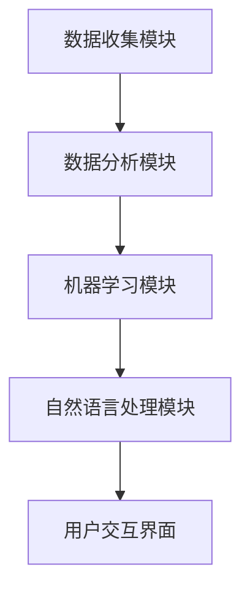
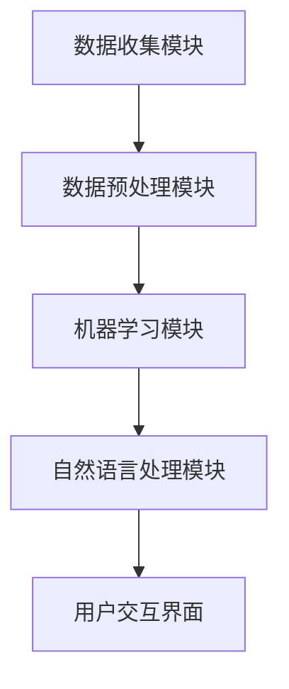
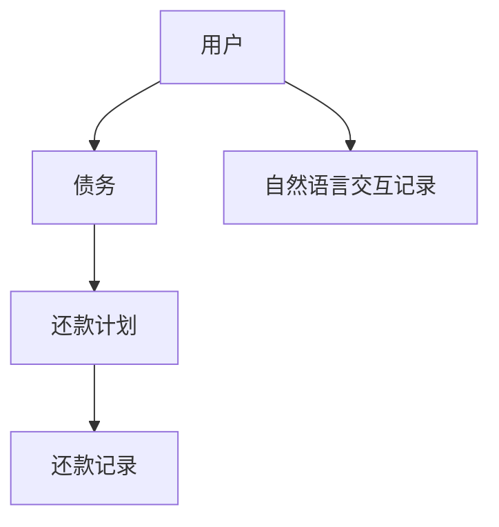
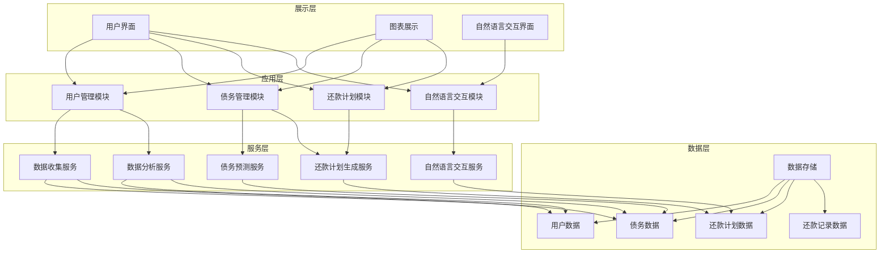
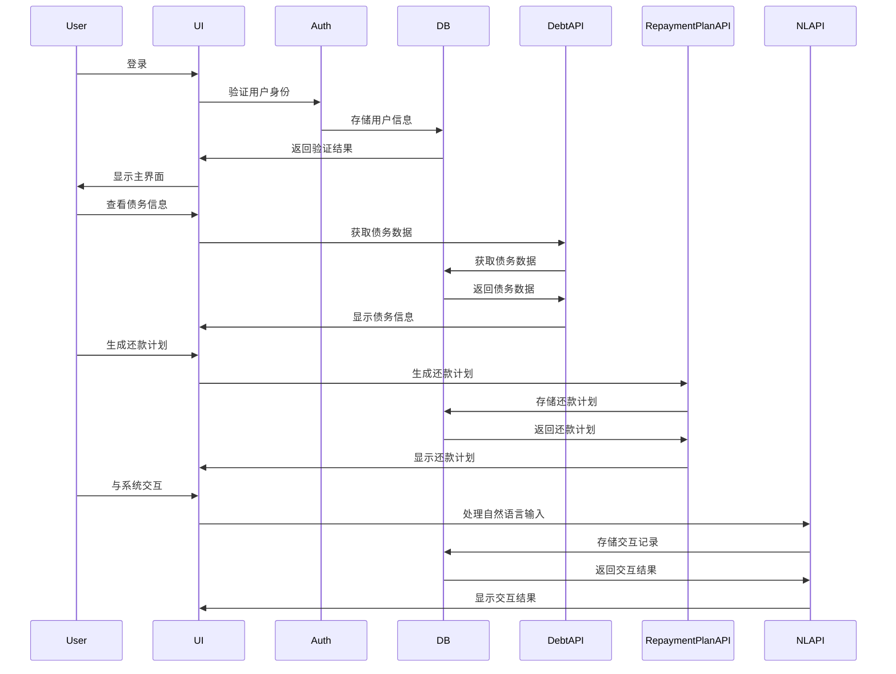
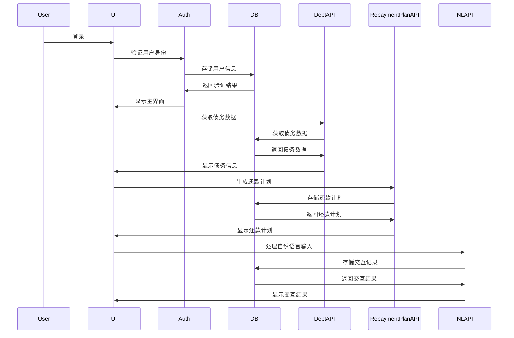

                 

# 构建智能化的个人债务管理助手

## 关键词：
- 个人债务管理
- 智能化
- 数据分析
- 机器学习
- 自然语言处理

## 摘要：
本文旨在探讨如何构建一款智能化的个人债务管理助手，以帮助用户更好地管理其财务状况。我们将逐步分析背景、核心概念、算法原理和系统实现，并提出具体的构建方案和最佳实践。本文适用于对金融科技和个人财务管理感兴趣的读者。

----------------------------------------------------------------

## 第一部分：背景介绍

### 第1章：问题背景与核心概念

### 1.1 问题背景

#### 1.1.1 个人债务管理的现状

个人债务管理是当今社会中一个普遍存在的问题。随着消费信贷的普及，越来越多的人背负着债务。然而，很多用户在管理债务时面临着诸多挑战，如债务种类繁杂、还款期限不明确、利息计算复杂等。这些问题不仅增加了用户的财务压力，还可能导致债务违约，影响信用记录。

#### 1.1.2 智能化债务管理的需求

为了应对上述挑战，用户迫切需要一款智能化、易用的债务管理工具。智能化债务管理助手可以通过自动化处理债务信息，提供个性化的还款计划和建议，帮助用户更好地掌握自己的财务状况。此外，智能化工具还可以通过数据分析和机器学习技术，预测债务趋势，提供前瞻性的财务规划。

#### 1.1.3 债务管理工具的发展历程

债务管理工具的发展经历了从手工记账到电子化，再到智能化的发展过程。早期的债务管理工具主要是基于Excel等电子表格进行记账，用户需要手动输入和计算各项数据。随着移动互联网和大数据技术的发展，债务管理工具开始集成更多智能功能，如自动同步账户信息、智能还款提醒等。然而，这些工具在处理复杂债务关系和提供个性化建议方面仍有不足。

### 1.2 核心概念

#### 1.2.1 智能化个人债务管理助手

智能化个人债务管理助手是一款集成了数据分析、机器学习和自然语言处理技术的软件工具。它能够自动收集、分析和处理用户的债务信息，提供智能化的还款计划和财务建议。

#### 1.2.2 数据分析与机器学习

数据分析是智能化债务管理助手的基石。通过对用户债务数据进行分析，助手可以识别债务的构成、计算利息和还款额，为用户提供准确的财务信息。机器学习则可以进一步提升债务管理的智能化水平。通过训练机器学习模型，助手可以预测债务趋势，提供个性化的还款计划。

#### 1.2.3 自然语言处理

自然语言处理技术使得智能化债务管理助手能够理解和处理用户的自然语言输入。用户可以通过文字或语音命令与助手交互，获取还款计划、财务建议等信息。自然语言处理技术还可以用于处理用户的历史对话记录，帮助助手不断学习和优化自己的服务。

### 1.3 概念联系与结构

#### 1.3.1 智能化债务管理助手的构成

智能化债务管理助手主要由以下几个部分构成：

1. **数据收集模块**：负责从用户的银行账户、信用卡账户等渠道自动收集债务数据。
2. **数据分析模块**：负责对收集到的数据进行清洗、归一化和特征提取，为机器学习模型提供输入。
3. **机器学习模块**：负责训练和部署机器学习模型，用于债务预测和个性化还款计划。
4. **自然语言处理模块**：负责处理用户的自然语言输入，提供交互式的财务建议。

#### 1.3.2 数据分析与机器学习在债务管理中的应用

数据分析在债务管理中的应用主要体现在以下几个方面：

1. **债务构成分析**：通过数据分析，可以清晰地了解用户的债务构成，如债务种类、债务金额、还款期限等。
2. **利息计算**：通过数据分析，可以精确计算各项债务的利息，帮助用户了解自己的财务状况。
3. **还款计划制定**：基于数据分析的结果，可以为用户提供个性化的还款计划，帮助用户合理安排财务。

机器学习在债务管理中的应用主要体现在以下几个方面：

1. **债务预测**：通过训练机器学习模型，可以预测用户的债务变化趋势，为用户提供前瞻性的财务规划。
2. **个性化还款计划**：通过机器学习模型，可以为用户提供个性化的还款计划，帮助用户减少利息支出。
3. **风险控制**：通过机器学习模型，可以预测用户的债务违约风险，帮助金融机构制定风险控制策略。

#### 1.3.3 自然语言处理在债务管理中的作用

自然语言处理技术在债务管理中的应用主要体现在以下几个方面：

1. **用户交互**：通过自然语言处理技术，用户可以方便地与债务管理助手进行交互，获取财务信息和建议。
2. **历史对话记录分析**：通过自然语言处理技术，可以分析用户的历史对话记录，帮助助手更好地了解用户需求，提供个性化的服务。
3. **文本数据分析**：通过自然语言处理技术，可以对用户发布的内容进行情感分析和主题识别，帮助金融机构了解用户的情绪和需求，提供更好的服务。

### 1.4 边界与外延

#### 1.4.1 债务管理范围界定

债务管理范围主要涉及以下几个方面：

1. **债务种类**：包括信用卡债务、贷款债务、消费分期债务等。
2. **还款期限**：包括短期、中期和长期债务的还款期限管理。
3. **还款计划**：包括还款金额、还款时间、还款频率等。
4. **利息计算**：包括固定利率和浮动利率的利息计算方法。

#### 1.4.2 智能化程度定义

智能化程度主要指债务管理助手在自动化处理债务信息、提供个性化服务方面的能力。具体包括：

1. **自动数据收集**：是否能够自动从用户的银行账户、信用卡账户等渠道收集债务信息。
2. **数据分析能力**：是否能够对用户的债务信息进行有效的清洗、归一化和特征提取。
3. **机器学习应用**：是否能够通过机器学习模型为用户提供债务预测和个性化还款计划。
4. **自然语言处理**：是否能够理解和处理用户的自然语言输入，提供交互式的财务建议。

#### 1.4.3 技术应用边界

在技术层面，债务管理助手的智能化程度受限于当前数据分析、机器学习和自然语言处理技术的发展。例如：

1. **数据处理能力**：数据量过大可能导致数据处理效率降低。
2. **模型训练时间**：大规模的机器学习模型训练可能需要较长的时间。
3. **算法准确率**：现有算法在处理复杂债务关系和提供个性化建议方面仍有提升空间。

### 1.5 本章小结

本章从问题背景、核心概念、概念联系与结构、边界与外延等方面，对智能化个人债务管理助手进行了全面介绍。下一章将深入探讨数据分析与机器学习的基础知识，为构建智能化债务管理助手提供理论基础。

----------------------------------------------------------------

## 第二部分：核心概念与原理

### 第2章：数据分析与机器学习基础

数据分析与机器学习是构建智能化个人债务管理助手的核心技术。本章将介绍数据分析的基础概念、流程和工具，以及机器学习的基础知识、流程和算法。此外，还将探讨自然语言处理的基础概念、流程和技术，以及它们在债务管理中的应用。

### 2.1 数据分析基础

#### 2.1.1 数据分析的概念

数据分析是一种通过统计学、计算机科学和数学方法，从大量数据中提取有用信息和知识的过程。数据分析旨在帮助用户发现数据中的规律和趋势，为决策提供支持。

#### 2.1.2 数据分析的基本流程

数据分析的基本流程包括以下几个阶段：

1. **数据收集**：收集与债务管理相关的数据，如银行账户信息、信用卡账单、贷款合同等。
2. **数据清洗**：清洗数据中的噪声和错误，确保数据的准确性和一致性。
3. **数据归一化**：将不同数据集的数据进行归一化处理，使其具有相同的量纲和尺度。
4. **特征提取与选择**：从原始数据中提取有用的特征，并选择最相关的特征，用于后续的分析和建模。
5. **数据分析与建模**：使用统计学和机器学习方法，对特征进行建模和分析，提取有价值的信息。
6. **结果解释与可视化**：对分析结果进行解释和可视化，帮助用户理解数据中的规律和趋势。

#### 2.1.3 数据分析工具介绍

常见的数据分析工具包括Excel、Python、R、SQL等。Excel是进行简单数据分析的常用工具，适用于数据量较小的情况。Python和R是功能强大的数据分析语言，适用于复杂的数据分析和建模任务。SQL是关系型数据库的查询语言，用于从数据库中提取和分析数据。

### 2.2 机器学习基础

#### 2.2.1 机器学习的概念

机器学习是一种人工智能的分支，通过让计算机从数据中自动学习和发现规律，进行预测和决策。机器学习不依赖于显式编程，而是通过训练模型来学习和模拟人类的学习过程。

#### 2.2.2 机器学习的基本流程

机器学习的基本流程包括以下几个阶段：

1. **数据收集**：收集与债务管理相关的数据，如银行账户信息、信用卡账单、贷款合同等。
2. **数据预处理**：对数据进行清洗、归一化和特征提取，为训练模型做好准备。
3. **模型选择**：根据问题的性质和数据的特点，选择合适的机器学习模型。
4. **模型训练**：使用训练数据集，训练机器学习模型，使其能够学习和模拟债务管理的规律。
5. **模型评估**：使用测试数据集，评估模型的性能，确定是否需要进行模型调整。
6. **模型部署**：将训练好的模型部署到生产环境中，用于实际的债务管理任务。

#### 2.2.3 常见机器学习算法介绍

常见的机器学习算法包括线性回归、决策树、支持向量机、神经网络等。线性回归是一种简单的预测算法，用于建模债务金额与还款期限之间的关系。决策树是一种基于树结构的预测算法，可以用于分类和回归任务。支持向量机是一种强大的分类算法，通过找到最优超平面，将不同类别的债务数据分开。神经网络是一种模拟人脑神经网络结构的算法，可以用于复杂的数据建模和预测任务。

### 2.3 数据分析与机器学习在债务管理中的应用

#### 2.3.1 数据收集与预处理

在债务管理中，数据收集和预处理是至关重要的。需要收集与用户债务相关的各种数据，如银行账户信息、信用卡账单、贷款合同等。然后，对这些数据进行清洗、归一化和特征提取，以便为后续的机器学习模型训练提供高质量的输入。

#### 2.3.2 特征提取与选择

特征提取和选择是数据分析中的一项关键任务。在债务管理中，需要从原始数据中提取有用的特征，如债务金额、还款期限、利率、还款方式等。然后，通过选择最相关的特征，提高机器学习模型的预测性能。

#### 2.3.3 模型训练与优化

在债务管理中，需要训练机器学习模型，以便为用户提供个性化的还款计划和财务建议。选择合适的模型，如线性回归、决策树或神经网络，对模型进行训练和优化，以提高预测准确率和鲁棒性。

### 2.4 自然语言处理基础

#### 2.4.1 自然语言处理的概念

自然语言处理是一种人工智能的分支，旨在使计算机理解和处理自然语言。自然语言处理包括文本处理、语音识别、机器翻译等多个领域。

#### 2.4.2 自然语言处理的基本流程

自然语言处理的基本流程包括以下几个阶段：

1. **文本预处理**：对文本进行清洗、分词、去停用词等处理，以便为后续的分析提供高质量的输入。
2. **词向量表示**：将文本转换为词向量表示，以便进行数值化的计算和分析。
3. **文本分类与情感分析**：使用机器学习模型，对文本进行分类和情感分析，提取文本中的关键信息。
4. **文本生成与摘要**：使用自然语言生成技术，生成文本摘要或回答用户的问题。

#### 2.4.3 常见自然语言处理技术

常见的自然语言处理技术包括词向量表示、主题模型、序列标注、文本生成等。词向量表示是一种将文本转换为数值向量的技术，用于文本分析和分类。主题模型是一种无监督学习方法，用于发现文本中的潜在主题。序列标注是一种将文本序列标记为不同类别的技术，用于文本分类和实体识别。文本生成是一种生成文本的技术，用于自动生成文章、摘要或回答用户的问题。

### 2.5 概念联系与结构

#### 2.5.1 数据分析、机器学习与自然语言处理的联系

数据分析、机器学习和自然语言处理是构建智能化个人债务管理助手中的三个核心技术。它们相互关联，共同作用于债务管理的各个环节。数据分析提供基础数据支持，机器学习用于建模和预测，自然语言处理用于处理用户的自然语言输入和文本数据。

#### 2.5.2 智能化债务管理助手的核心组件

智能化债务管理助手的核心组件包括：

1. **数据收集模块**：负责从用户的银行账户、信用卡账户等渠道收集债务数据。
2. **数据分析模块**：负责对收集到的债务数据进行清洗、归一化和特征提取。
3. **机器学习模块**：负责训练和部署机器学习模型，用于债务预测和个性化还款计划。
4. **自然语言处理模块**：负责处理用户的自然语言输入，提供交互式的财务建议。

#### 2.5.3 核心概念架构图

以下是智能化债务管理助手的核心概念架构图：



### 2.6 本章小结

本章介绍了数据分析与机器学习的基础知识，以及自然语言处理的概念和技术。通过这些技术，可以构建一款智能化的个人债务管理助手，帮助用户更好地管理其财务状况。下一章将深入讲解算法原理和实现，为构建智能化债务管理助手提供具体的技术指导。

----------------------------------------------------------------

## 第三部分：算法原理与实现

### 第3章：算法原理讲解

在构建智能化个人债务管理助手的过程中，算法原理的理解和实现是关键的一环。本章将详细讲解数据预处理算法、机器学习算法和自然语言处理算法，并通过Mermaid流程图和Python代码示例，帮助读者深入理解这些算法的原理和应用。

### 3.1 数据预处理算法

数据预处理是数据分析中的关键步骤，它确保了后续分析的质量和效率。数据预处理算法主要包括数据清洗、数据归一化和数据标准化。

#### 3.1.1 数据清洗

数据清洗是指识别和纠正数据集中的错误、异常和不一致。以下是数据清洗的几个步骤：

1. **缺失值处理**：缺失值可以通过删除缺失值、填充平均值或使用其他统计方法进行填充。
2. **异常值处理**：异常值可以通过统计方法检测，并选择删除或调整。
3. **重复值处理**：删除重复的数据记录，确保数据的唯一性。

以下是使用Python进行数据清洗的示例代码：

```python
import pandas as pd

# 读取数据
data = pd.read_csv('debt_data.csv')

# 删除缺失值
data.dropna(inplace=True)

# 删除重复值
data.drop_duplicates(inplace=True)

# 检测异常值
from scipy import stats
z_scores = stats.zscore(data['debt_amount'])
abs_z_scores = pd.Series(z_scores).abs()
filtered_entries = (abs_z_scores < 3)
data = data[filtered_entries]
```

#### 3.1.2 数据归一化

数据归一化是将数据转换到相同的尺度，以便进行后续分析。常用的归一化方法包括最小-最大缩放和Z-Score标准化。

最小-最大缩放公式如下：

$$
x_{\text{normalized}} = \frac{x - x_{\text{min}}}{x_{\text{max}} - x_{\text{min}}}
$$

Z-Score标准化公式如下：

$$
x_{\text{normalized}} = \frac{x - \mu}{\sigma}
$$

以下是使用Python进行数据归一化的示例代码：

```python
from sklearn.preprocessing import MinMaxScaler

# 创建缩放器
scaler = MinMaxScaler()

# 归一化数据
data_normalized = scaler.fit_transform(data[['debt_amount', 'interest_rate']])
```

#### 3.1.3 数据标准化

数据标准化是通过计算数据的均值和标准差，将数据转换为标准正态分布。常用的标准化方法包括Z-Score标准化和标准分数。

以下是使用Python进行数据标准化的示例代码：

```python
from sklearn.preprocessing import StandardScaler

# 创建缩放器
scaler = StandardScaler()

# 标准化数据
data_standardized = scaler.fit_transform(data[['debt_amount', 'interest_rate']])
```

### 3.2 机器学习算法

机器学习算法是构建智能化债务管理助手的核心。以下是几种常用的机器学习算法及其原理。

#### 3.2.1 线性回归

线性回归是一种简单的预测算法，用于建模债务金额与还款期限之间的关系。线性回归模型公式如下：

$$
y = \beta_0 + \beta_1x
$$

其中，$y$ 是债务金额，$x$ 是还款期限，$\beta_0$ 和 $\beta_1$ 是模型参数。

以下是使用Python进行线性回归的示例代码：

```python
from sklearn.linear_model import LinearRegression

# 创建线性回归模型
model = LinearRegression()

# 训练模型
model.fit(X_train, y_train)

# 预测
predictions = model.predict(X_test)
```

#### 3.2.2 决策树

决策树是一种基于树结构的预测算法，通过一系列的决策规则，将数据分类或回归到不同的节点。决策树模型公式如下：

$$
y = f(x) = g(x) = h(x)
$$

其中，$y$ 是债务金额或还款期限，$x$ 是特征，$g(x)$、$h(x)$ 是决策函数。

以下是使用Python进行决策树回归的示例代码：

```python
from sklearn.tree import DecisionTreeRegressor

# 创建决策树模型
model = DecisionTreeRegressor()

# 训练模型
model.fit(X_train, y_train)

# 预测
predictions = model.predict(X_test)
```

#### 3.2.3 自然语言处理算法

自然语言处理算法是处理文本数据的关键技术。以下是几种常用的自然语言处理算法及其原理。

##### 3.2.3.1 词向量

词向量是一种将文本转换为数值向量的技术，用于文本分析和分类。词向量模型公式如下：

$$
\text{Word} \rightarrow \text{Vector}
$$

其中，$\text{Word}$ 是单词，$\text{Vector}$ 是词向量。

以下是使用Python进行词向量转换的示例代码：

```python
from gensim.models import Word2Vec

# 加载文本数据
sentences = [['我', '想', '购买', '一套', '新房'], ['我', '需要', '贷款', '来', '支付', '首付']]

# 训练词向量模型
model = Word2Vec(sentences, vector_size=100, window=5, min_count=1, workers=4)

# 获取词向量
vector = model['我']
```

##### 3.2.3.2 主题模型

主题模型是一种无监督学习方法，用于发现文本中的潜在主题。常用的主题模型包括LDA（Latent Dirichlet Allocation）。

LDA模型公式如下：

$$
P(\text{Word}|\text{Topic}) \propto \alpha + \sum_{w \in \text{Word}} \beta_{w}
$$

$$
P(\text{Topic}|\text{Document}) \propto \gamma + \sum_{w \in \text{Word}} \alpha_{w}
$$

其中，$\text{Word}$ 是单词，$\text{Topic}$ 是主题，$\alpha$ 和 $\beta$ 是超参数。

以下是使用Python进行LDA主题模型的示例代码：

```python
from sklearn.decomposition import LatentDirichletAllocation

# 加载文本数据
corpus = [['我', '想', '购买', '一套', '新房'], ['我', '需要', '贷款', '来', '支付', '首付']]

# 创建LDA模型
lda = LatentDirichletAllocation(n_components=2, random_state=0)

# 训练模型
lda.fit(corpus)

# 获取主题分布
topic_distribution = lda.transform(corpus)
```

### 3.3 算法联系与架构设计

#### 3.3.1 数据预处理算法与机器学习算法的联系

数据预处理算法是机器学习算法的基础，确保了机器学习模型的性能和可靠性。数据清洗、归一化和标准化等步骤为机器学习模型提供了高质量的输入数据。

#### 3.3.2 机器学习算法与自然语言处理算法的联系

机器学习算法和自然语言处理算法在债务管理中相互补充。机器学习算法用于处理结构化数据，如债务金额、还款期限等；自然语言处理算法用于处理文本数据，如用户评论、历史对话等。

#### 3.3.3 整体架构设计

智能化债务管理助手的整体架构设计如下：

1. **数据收集模块**：从用户的银行账户、信用卡账户等渠道收集债务数据。
2. **数据预处理模块**：进行数据清洗、归一化和标准化，确保数据质量。
3. **机器学习模块**：训练机器学习模型，如线性回归、决策树等，用于债务预测和个性化还款计划。
4. **自然语言处理模块**：处理用户的自然语言输入，如文本分类、情感分析等，提供交互式的财务建议。
5. **用户交互界面**：提供用户友好的界面，让用户轻松管理债务。

以下是智能化债务管理助手的架构设计图：



### 3.4 本章小结

本章详细讲解了数据预处理算法、机器学习算法和自然语言处理算法的原理和实现。通过这些算法，可以构建一款智能化的个人债务管理助手，帮助用户更好地管理其财务状况。下一章将介绍系统分析与架构设计，为构建智能化债务管理助手提供整体解决方案。

----------------------------------------------------------------

## 第四部分：系统设计与实现

### 第4章：系统分析与架构设计

系统分析与架构设计是构建智能化个人债务管理助手的重要环节。本章将详细介绍系统功能设计、系统架构设计、系统接口设计和系统交互设计，为读者提供全面的系统实现方案。

### 4.1 问题场景介绍

#### 4.1.1 债务管理场景概述

在当前金融科技快速发展的背景下，个人债务管理已成为许多人日常财务管理的核心问题。用户面临着多种债务，如信用卡债务、消费贷款、房贷等。为了有效管理这些债务，用户需要一个智能化、便捷的债务管理工具，以帮助他们合理安排还款计划、降低财务压力。

#### 4.1.2 系统需求分析

智能化个人债务管理助手应满足以下需求：

1. **数据自动收集**：系统能够自动从用户的银行账户、信用卡账户等渠道收集债务数据。
2. **数据分析与预测**：系统能够对债务数据进行清洗、归一化和特征提取，并利用机器学习算法预测债务变化趋势。
3. **个性化还款计划**：系统能根据债务数据为用户生成个性化的还款计划，并提供还款建议。
4. **自然语言交互**：系统应具备自然语言处理能力，能够理解用户的自然语言输入，提供交互式的财务建议。
5. **用户友好的界面**：系统应提供简洁、直观的用户界面，方便用户使用和管理债务。

### 4.2 系统功能设计

#### 4.2.1 系统功能概述

智能化个人债务管理助手的主要功能包括：

1. **债务数据收集**：自动从用户的银行账户、信用卡账户等渠道收集债务数据。
2. **数据分析**：对收集到的债务数据进行清洗、归一化和特征提取，为机器学习模型提供高质量的数据输入。
3. **债务预测**：利用机器学习算法预测用户的债务变化趋势，为用户提供前瞻性的财务规划。
4. **还款计划生成**：根据用户的债务数据，生成个性化的还款计划，并提供还款建议。
5. **自然语言交互**：处理用户的自然语言输入，提供交互式的财务建议。
6. **用户管理**：允许用户查看和管理自己的债务信息，修改还款计划等。

#### 4.2.2 领域模型设计

领域模型是系统功能的核心抽象，用于表示债务管理助手的关键实体及其关系。以下是债务管理助手的领域模型设计：



实体关系图（ER图）如下所示：

```mermaid
erDiagram
  User ||--|{ Debt : has }
  Debt ||--|{ RepaymentPlan : has }
  Debt ||--|{ RepaymentRecord : has }
  User ||--|{ NaturalLanguageInteraction : has }
```

### 4.3 系统架构设计

系统架构设计决定了智能化个人债务管理助手的性能、可扩展性和维护性。以下是系统架构的概述：

1. **数据层**：负责存储和管理用户的债务数据。
2. **服务层**：提供债务数据的收集、清洗、分析和预测等服务。
3. **应用层**：实现债务预测、还款计划生成和自然语言交互等功能。
4. **展示层**：提供用户友好的界面，供用户查看和管理债务信息。

以下是系统架构设计图：



### 4.4 系统接口设计

系统接口设计是确保系统模块之间协同工作的关键。以下是智能化个人债务管理助手的主要接口设计：

1. **用户接口**：提供用户注册、登录、查看和管理债务信息的接口。
2. **债务数据接口**：提供债务数据收集、清洗和存储的接口。
3. **数据分析接口**：提供债务数据特征提取、分析和预测的接口。
4. **还款计划接口**：提供还款计划生成、管理和调用的接口。
5. **自然语言处理接口**：提供自然语言处理服务，如文本分类、情感分析等的接口。

以下是接口设计概述：



### 4.5 系统交互设计

系统交互设计是确保用户与智能化个人债务管理助手高效、顺畅互动的关键。以下是系统交互设计概述：

1. **用户与用户界面的交互**：用户通过界面进行登录、查看债务信息、生成还款计划等操作。
2. **用户界面与系统后台的交互**：界面通过接口与后台服务进行数据交换，如债务数据收集、分析、还款计划生成和自然语言处理等。
3. **系统后台之间的交互**：后台服务之间进行数据共享和协同工作，如债务数据在数据层与数据分析服务之间的交互。

以下是系统交互设计图：



### 4.6 本章小结

本章详细介绍了系统分析与架构设计，包括系统功能设计、系统架构设计、系统接口设计和系统交互设计。这些设计为构建智能化个人债务管理助手提供了坚实的理论基础和实践指导。下一章将深入探讨系统实现过程中的核心技术和方法，帮助读者更好地理解系统的构建过程。

----------------------------------------------------------------

## 第五部分：项目实战

### 第5章：环境安装与系统核心实现

在这一章中，我们将详细介绍如何搭建智能化个人债务管理助手的项目环境，以及实现系统的核心功能。我们将逐步进行环境安装、系统核心实现、代码应用解读与分析、实际案例分析和详细讲解剖析，并总结项目成果。

### 5.1 环境安装

要搭建智能化个人债务管理助手，首先需要安装以下环境和工具：

1. **Python环境**：Python是构建智能化债务管理助手的编程语言。安装Python可以从其官方网站（https://www.python.org/）下载安装包。
2. **Anaconda**：Anaconda是一个Python数据科学平台，包含了许多常用的数据分析和机器学习库。安装Anaconda可以从其官方网站（https://www.anaconda.com/products/individual）下载安装包。
3. **Jupyter Notebook**：Jupyter Notebook是一个交互式的计算环境，适合编写和运行Python代码。安装Jupyter Notebook可以通过Anaconda命令行工具安装。
4. **机器学习库**：安装scikit-learn、TensorFlow、PyTorch等常用的机器学习库。
5. **自然语言处理库**：安装NLTK、spaCy、gensim等常用的自然语言处理库。

安装命令如下：

```bash
conda install python
conda install anaconda
conda install jupyter
conda install scikit-learn tensorflow pytorch nltk spacy gensim
```

### 5.2 系统核心实现

智能化个人债务管理助手的核心实现包括数据收集、数据预处理、数据分析、机器学习模型训练和自然语言处理。以下是每个核心功能的实现步骤：

#### 5.2.1 数据收集

数据收集是智能化债务管理助手的基础。我们需要从用户的银行账户、信用卡账户等渠道收集债务数据。可以使用API接口或Web爬虫技术来实现数据收集。以下是使用API接口收集数据的示例：

```python
import requests
import json

api_url = 'https://api.bank.com/debt'
api_key = 'your_api_key'

headers = {
    'Authorization': f'Bearer {api_key}',
    'Content-Type': 'application/json'
}

response = requests.get(api_url, headers=headers)

if response.status_code == 200:
    debt_data = json.loads(response.text)
    print(debt_data)
else:
    print(f"Error: {response.status_code}")
```

#### 5.2.2 数据预处理

数据预处理是确保数据质量的关键步骤。我们需要对收集到的数据进行清洗、归一化和特征提取。以下是数据预处理的核心步骤：

1. **数据清洗**：删除缺失值和异常值。
2. **数据归一化**：使用Min-Max缩放或Z-Score标准化。
3. **特征提取**：从债务数据中提取有用的特征，如债务金额、还款期限、利率等。

```python
import pandas as pd
from sklearn.preprocessing import MinMaxScaler, StandardScaler

# 读取数据
data = pd.read_csv('debt_data.csv')

# 数据清洗
data.dropna(inplace=True)
data.drop_duplicates(inplace=True)

# 数据归一化
scaler = MinMaxScaler()
data[['debt_amount', 'interest_rate']] = scaler.fit_transform(data[['debt_amount', 'interest_rate']])

# 数据标准化
scaler = StandardScaler()
data[['debt_amount', 'interest_rate']] = scaler.fit_transform(data[['debt_amount', 'interest_rate']])
```

#### 5.2.3 数据分析

数据分析是智能化债务管理助手的重要功能。我们需要使用统计分析方法来分析债务数据，如计算平均债务金额、最大债务金额、最小债务金额等。以下是数据分析的示例代码：

```python
import pandas as pd

# 读取数据
data = pd.read_csv('debt_data.csv')

# 数据分析
print("平均债务金额：", data['debt_amount'].mean())
print("最大债务金额：", data['debt_amount'].max())
print("最小债务金额：", data['debt_amount'].min())
```

#### 5.2.4 机器学习模型训练

机器学习模型训练是智能化债务管理助手的核

