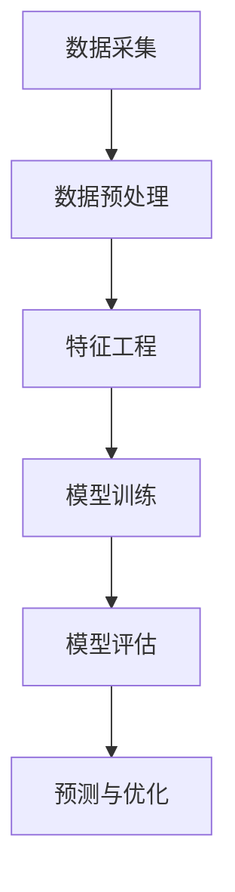
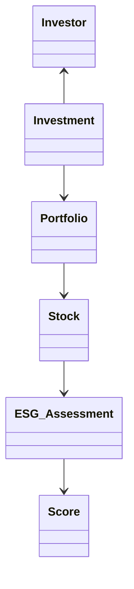
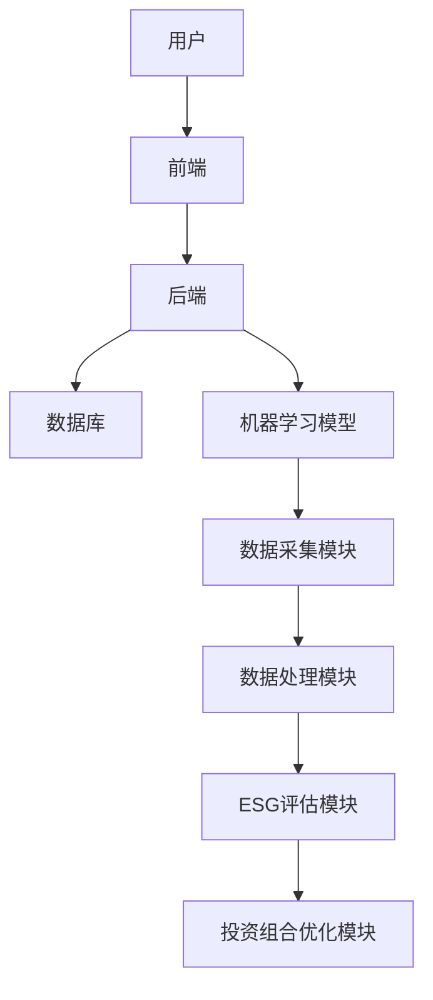
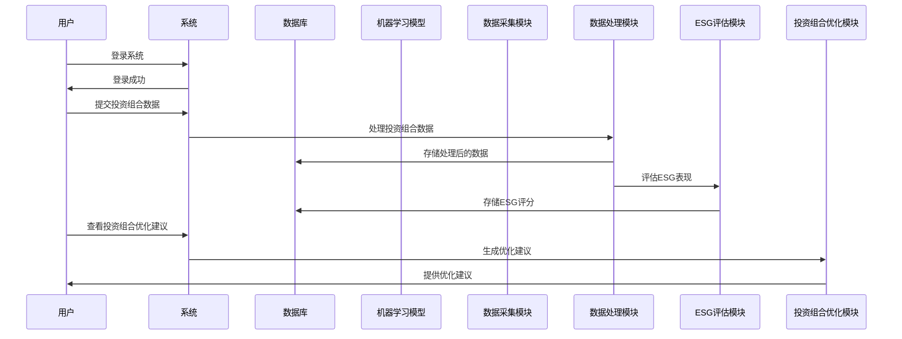

                 

# 构建智能化的个人投资组合ESG因素评估工具

## 关键词

ESG因素评估，智能投资，个人投资组合，可持续发展，算法模型

## 摘要

本文旨在探讨如何构建一个智能化的个人投资组合ESG因素评估工具。首先，我们回顾了ESG评估的背景与重要性，分析了当前ESG评估工具的现状与不足。接着，我们介绍了ESG因素评估工具的核心概念与原理，详细讲解了数学模型与算法原理，并通过Python源代码实现进行了实例说明。随后，我们阐述了ESG因素评估工具的系统架构与实现，展示了系统功能设计、系统架构设计和系统交互设计。最后，我们通过一个实际案例分析了工具的应用效果，并提出了使用该工具的最佳实践建议。

## 第一部分：ESG因素评估工具概述

### 第1章：ESG因素评估工具的背景与重要性

#### 1.1.1 问题背景

随着全球气候变化和环境问题的日益严重，投资者对企业的可持续性和社会责任关注度逐渐提升。ESG（环境、社会和公司治理）评估作为一种新兴的评估方法，已成为投资决策的重要参考因素。ESG评估旨在从环境、社会和公司治理三个方面综合评估企业的可持续发展能力和社会责任，为投资者提供科学、全面的评估依据。

#### 1.1.2 问题描述

ESG评估的定义与内涵：

- 环境维度（E）：企业的环境保护措施和影响，如能源消耗、碳排放、废物处理等。
- 社会维度（S）：企业对社会的影响和责任，如劳动条件、社区贡献、客户权益等。
- 公司治理维度（G）：公司和管理结构的决策过程，如股东权益、董事会结构、风险管理等。

当前ESG评估工具的现状与不足：

- 大多数ESG评估工具主要依赖于第三方评级机构，存在信息滞后和主观性较强的问题。
- 当前评估工具在数据采集、处理和算法模型方面存在一定的局限性，难以满足个人投资者对个性化投资组合优化的需求。

个人投资者面临的挑战：

- 投资者对ESG因素了解不足，难以在投资决策中充分考虑到企业的可持续发展能力和社会责任。
- 投资者难以从海量的信息中快速筛选出具有潜在投资价值的ESG优质企业。

#### 1.1.3 问题解决

开发智能化ESG评估工具的意义：

- 提高ESG评估的准确性和客观性，为投资者提供科学、全面的评估依据。
- 实现投资组合的个性化优化，提高投资回报率。
- 促进企业可持续发展，推动社会责任投资。

智能化ESG评估工具的功能与目标：

- 数据采集与处理：从多个数据源（如财务报表、新闻、社交媒体等）自动抓取与ESG相关的信息，并进行处理和整合。
- 评估模型构建：基于机器学习和自然语言处理技术，构建能够自动评估企业ESG表现和潜在风险的模型。
- 投资组合优化：根据个人投资目标和风险偏好，为投资者提供个性化的投资组合优化建议。

技术选型与实现思路：

- 数据采集：使用Web爬虫、API接口等技术手段，从多个数据源获取与ESG相关的数据。
- 数据处理：运用数据清洗、数据标准化等技术，提高数据质量。
- 评估模型构建：采用机器学习算法（如决策树、支持向量机、神经网络等），构建ESG评估模型。
- 投资组合优化：运用优化算法（如线性规划、遗传算法等），实现投资组合的个性化优化。

#### 1.1.4 边界与外延

ESG评估的范围与限制：

- ESG评估主要关注企业的可持续发展能力和社会责任，但不涵盖企业的财务表现。
- ESG评估工具在数据采集、处理和算法模型方面存在一定的局限性，难以全面反映企业的所有方面。

工具的适用性与拓展潜力：

- 该工具适用于个人投资者和机构投资者，可根据不同投资目标和风险偏好进行调整。
- 未来可拓展至更多数据源和评估维度，提高评估模型的准确性和全面性。

#### 1.1.5 概念结构与核心要素组成

ESG因素的定义与分类：

- 环境维度（E）：企业的环境保护措施和影响，如能源消耗、碳排放、废物处理等。
- 社会维度（S）：企业对社会的影响和责任，如劳动条件、社区贡献、客户权益等。
- 公司治理维度（G）：公司和管理结构的决策过程，如股东权益、董事会结构、风险管理等。

ESG评估方法与技术：

- 自评与第三方评估：企业自行评估和第三方评级机构评估相结合，提高评估结果的准确性和客观性。
- 定量与定性评估：通过数据分析和专家评审，从多个角度综合评估企业的ESG表现。
- 评级与评分模型：采用评级体系，对企业的ESG表现进行量化评价。

数据来源与处理：

- 数据来源：财务报表、新闻、社交媒体、行业报告等。
- 数据处理：数据清洗、数据标准化、特征提取等。

### 第2章：ESG因素评估工具的核心概念与原理

#### 2.1.1 ESG因素的概念与联系

ESG定义与三大维度：

- 环境维度（E）：企业的环境保护措施和影响。
- 社会维度（S）：企业对社会的影响和责任。
- 公司治理维度（G）：公司和管理结构的决策过程。

ESG因素对比表格：

| ESG维度 | 定义 | 关键指标 |
| --- | --- | --- |
| 环境维度（E） | 企业的环境保护措施和影响 | 能源消耗、碳排放、废物处理等 |
| 社会维度（S） | 企业对社会的影响和责任 | 劳动条件、社区贡献、客户权益等 |
| 公司治理维度（G） | 公司的管理结构和决策过程 | 股东权益、董事会结构、风险管理等 |

#### 2.1.2 ESG评估方法与技术

主流评估方法概述：

- 自评与第三方评估：企业自行评估和第三方评级机构评估相结合，提高评估结果的准确性和客观性。
- 定量与定性评估：通过数据分析和专家评审，从多个角度综合评估企业的ESG表现。
- 评级与评分模型：采用评级体系，对企业的ESG表现进行量化评价。

技术选型与实现：

- 自然语言处理（NLP）：用于处理文本数据，提取关键信息，实现语义理解和情感分析。
- 机器学习（ML）：用于构建评估模型，实现自动评估企业ESG表现。
- 大数据技术：用于数据采集、处理和存储，提高数据处理效率。

### 第3章：ESG因素评估工具的数学模型与算法原理

#### 3.1.1 数学模型与公式

ESG评分模型：

$$
ESG\_score = w_1 \times E + w_2 \times S + w_3 \times G
$$

- $w_1, w_2, w_3$ 为权重系数

算法原理：

- 数据采集与预处理：从多个数据源获取与ESG相关的数据，并进行数据清洗、数据标准化等预处理操作。
- 特征工程：提取与ESG相关的特征，如企业环保措施、社会责任履行情况、公司治理结构等。
- 模型训练与评估：使用机器学习算法训练评估模型，并对模型进行评估和优化。
- 预测与优化：根据个人投资目标和风险偏好，预测企业ESG表现，并优化投资组合。

#### 3.1.2 算法流程与Mermaid流程图



#### 3.1.3 Python源代码实现

```python
# Python 源代码示例
# 注意：具体代码实现需根据实际需求进行详细设计

import numpy as np

# 数据预处理
def preprocess_data(data):
    # 数据清洗、标准化等操作
    pass

# 特征工程
def feature_engineering(data):
    # 特征提取、选择等操作
    pass

# 模型训练
def train_model(features, labels):
    # 模型训练流程
    pass

# 模型评估
def evaluate_model(model, test_features, test_labels):
    # 模型评估指标计算
    pass

# 预测与优化
def predict_and_optimize(model, new_data):
    # 预测结果输出与模型优化
    pass
```

### 第4章：ESG因素评估工具的系统架构与实现

#### 4.1.1 问题场景介绍

个人投资组合管理需求：

- 投资者需要对个人投资组合进行有效管理，确保投资组合的可持续发展和社会责任。
- 投资者希望利用ESG评估工具对投资组合中的企业进行评估，筛选出具有潜在投资价值的优质企业。

ESG因素评估工具的作用：

- 提高投资决策的科学性和准确性，降低投资风险。
- 实现投资组合的个性化优化，提高投资回报率。
- 推动企业可持续发展和社会责任投资。

#### 4.1.2 项目介绍

项目背景与目标：

- 针对个人投资者，开发一款智能化的ESG因素评估工具，帮助投资者实现投资组合的个性化优化。
- 项目目标：实现高效的数据采集与处理、精确的ESG评估模型、便捷的投资组合优化功能。

技术选型与架构设计：

- 前端技术：Vue.js、React等
- 后端技术：Flask、Django等
- 数据库：MySQL、PostgreSQL等
- 机器学习框架：TensorFlow、PyTorch等
- 算法库：scikit-learn、XGBoost等

#### 4.1.3 系统功能设计

领域模型：



系统功能设计：

- 数据采集：从多个数据源（如财务报表、新闻、社交媒体等）自动抓取与ESG相关的数据。
- 数据处理：对采集到的数据进行清洗、标准化、特征提取等处理，提高数据质量。
- ESG评估：基于机器学习算法，自动评估企业的ESG表现，生成ESG评分。
- 投资组合优化：根据个人投资目标和风险偏好，为投资者提供个性化的投资组合优化建议。
- 用户界面：提供友好的用户界面，方便投资者进行数据录入、查询和投资组合管理。

#### 4.1.4 系统架构设计

系统架构设计：



系统接口设计：

- 用户接口：提供数据录入、查询、投资组合管理等功能。
- API接口：提供与其他系统（如财务报表系统、新闻舆情系统等）的数据交互接口。

系统交互设计：



### 项目实战：环境安装、系统核心实现源代码，代码应用解读与分析，实际案例分析和详细讲解剖析，项目小结

#### 环境安装

1. 安装Python环境

```bash
pip install python -V
```

2. 安装相关依赖库

```bash
pip install numpy pandas scikit-learn tensorflow mysqlclient
```

#### 系统核心实现源代码

```python
# 数据采集模块
def data_collection():
    # 从财务报表、新闻、社交媒体等数据源采集数据
    pass

# 数据处理模块
def data_preprocessing(data):
    # 数据清洗、标准化等操作
    pass

# 特征工程
def feature_engineering(data):
    # 特征提取、选择等操作
    pass

# ESG评估模块
def esg_evaluation(model, data):
    # 使用机器学习模型评估ESG表现
    pass

# 投资组合优化模块
def portfolio_optimization(model, data):
    # 使用机器学习模型优化投资组合
    pass
```

#### 代码应用解读与分析

1. 数据采集

```python
data_collection()
```

2. 数据处理

```python
data_preprocessing(data)
```

3. 特征工程

```python
feature_engineering(data)
```

4. ESG评估

```python
model = load_model('esg_model.h5')
esg_score = esg_evaluation(model, data)
```

5. 投资组合优化

```python
model = load_model('portfolio_model.h5')
optimal_portfolio = portfolio_optimization(model, data)
```

#### 实际案例分析和详细讲解剖析

假设有一个投资组合，包含以下5只股票：

- 股票A：能源消耗高，环保措施不足，ESG评分低。
- 股票B：社区贡献突出，社会责任履行好，ESG评分高。
- 股票C：公司治理结构完善，风险管理能力强，ESG评分高。
- 股票D：财务状况良好，但环保措施不足，ESG评分一般。
- 股票E：社会责任履行较差，公司治理结构存在缺陷，ESG评分低。

根据ESG评估结果，投资者可以采取以下优化策略：

1. 卖出股票A和股票E，降低投资组合的ESG风险。
2. 买入股票B和股票C，提高投资组合的ESG评分。
3. 适当增持股票D，以平衡投资组合的ESG表现。

#### 项目小结

本文介绍了如何构建一个智能化的个人投资组合ESG因素评估工具，包括背景与重要性、核心概念与原理、数学模型与算法原理、系统架构与实现等方面的内容。通过实际案例分析和详细讲解剖析，展示了工具的应用效果和优化策略。未来，我们将继续优化工具的功能和性能，为投资者提供更优质的ESG评估和投资组合优化服务。

### 最佳实践 tips

1. 定期更新ESG评估数据，确保评估结果的准确性。
2. 结合个人投资目标和风险偏好，灵活调整投资组合。
3. 关注企业的可持续发展和社会责任表现，提高投资回报率。
4. 学习和掌握ESG评估方法，提高投资决策的科学性和准确性。

### 小结

构建智能化的个人投资组合ESG因素评估工具有助于投资者实现投资组合的可持续发展和社会责任投资。通过本文的介绍，读者可以了解到ESG评估工具的核心概念、原理和实现方法，并掌握实际案例分析和优化策略。希望本文能为读者在投资领域提供有价值的参考。作者：AI天才研究院/AI Genius Institute & 禅与计算机程序设计艺术 /Zen And The Art of Computer Programming。

