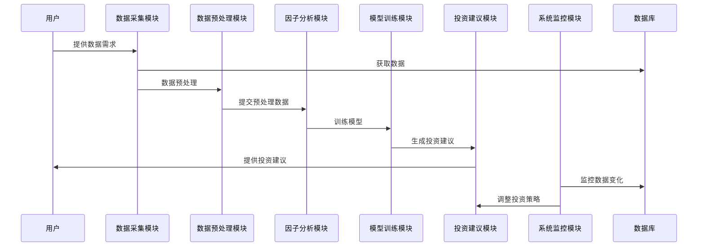
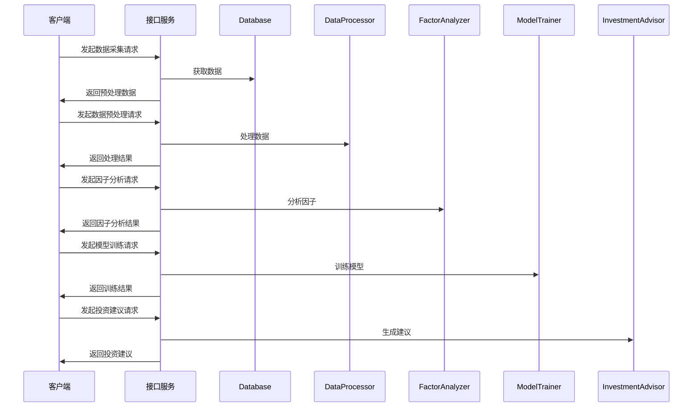
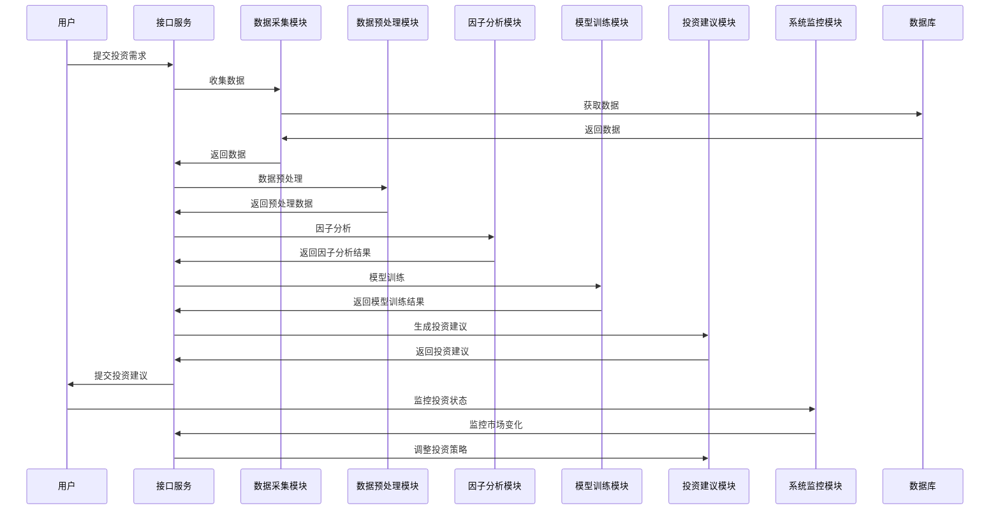

                 


### 引言

#### 投资组合因子暴露优化概述

投资组合因子暴露优化是指通过分析投资组合中各个资产的风险和收益特征，调整资产权重，以实现投资组合整体风险和收益的最优化。这一优化过程不仅关乎资产配置的效率，也直接影响到投资组合的稳定性和潜在收益。传统的投资组合优化通常依赖于历史数据和统计学方法，而现代的智能化优化系统则借助机器学习和大数据分析技术，使得投资决策更加精准和高效。

在金融市场中，投资组合因子暴露优化具有重要意义。首先，它可以帮助投资者在风险可控的情况下，最大化收益；其次，通过优化资产配置，可以有效降低投资组合的波动性，增强其抗风险能力；最后，智能化的优化系统能够实时监控市场变化，动态调整投资策略，以应对快速变化的市场环境。

#### 个人投资组合优化的重要性

个人投资组合优化对于个人财富管理至关重要。随着金融市场的复杂性和不确定性增加，投资者面临着诸多挑战，如市场波动、经济周期变化、政策调整等。有效的个人投资组合优化不仅可以降低投资风险，提高资产收益，还能帮助投资者实现财务目标，提高生活品质。

首先，个人投资组合优化有助于实现资产配置的科学化。通过分析不同资产类别的风险和收益特征，投资者可以构建出符合自身风险承受能力和收益预期的投资组合。其次，优化系统能够实时调整资产配置，以应对市场变化，降低投资组合的风险。最后，智能化的优化系统能够提供个性化的投资建议，帮助投资者制定合适的投资策略，提高投资效率。

#### 本书目标与结构

本书旨在构建一套智能化的个人投资组合因子暴露优化系统，帮助读者理解并应用这一系统进行实际投资。本书的结构分为五个部分：

1. **问题背景与核心概念**：介绍投资组合因子暴露优化的背景和核心概念，包括市场风险因子、宏观经济因子和行业特定因子。
2. **算法原理与模型构建**：讲解优化系统的算法原理和数学模型，包括线性规划、非线性规划和机器学习方法。
3. **系统分析与架构设计**：描述系统功能设计、架构设计和接口设计，包括领域模型、系统架构图和系统交互图。
4. **项目实战**：通过实际项目环境搭建、系统核心实现和代码分析，展示优化系统的实际应用。
5. **最佳实践与拓展**：总结书中要点，提供实践建议和拓展阅读资源，帮助读者深化理解并应用所学知识。

通过本书的学习，读者将能够掌握投资组合因子暴露优化的核心技术和方法，构建出高效、智能的投资组合，实现财富增值的目标。

### 背景介绍

投资组合因子暴露优化系统在现代金融投资中占据着越来越重要的地位。随着金融市场的不断发展和投资者需求的多样化，传统的手工调整和经验决策已经无法满足复杂多变的市场环境。智能化投资组合优化系统的出现，为投资者提供了一种全新的解决方案。

#### 1. 投资组合优化的历史与发展

投资组合优化起源于20世纪中期，由马科维茨（Harry Markowitz）提出的均值-方差模型奠定了现代投资组合理论的基础。马科维茨模型通过考虑资产的风险和收益，提出了一种在给定预期收益条件下最小化投资组合风险的方法。这一理论的出现标志着投资组合优化的正式诞生。

随着计算机技术和大数据分析的不断发展，投资组合优化方法逐渐从传统的手工计算演变为自动化和智能化的算法。20世纪80年代，线性规划和整数规划等方法被广泛应用于投资组合优化问题。进入21世纪，随着机器学习和人工智能技术的崛起，投资组合优化迎来了新的发展机遇。机器学习算法能够从大量历史数据中学习到资产之间的潜在关系，从而为投资者提供更加精准的优化建议。

#### 2. 优化系统的核心思想

投资组合因子暴露优化系统的核心思想是通过分析投资组合中各个资产的风险和收益特征，调整资产权重，实现整体风险和收益的最优化。这一过程通常涉及以下几个关键步骤：

- **数据收集与预处理**：首先，系统需要收集与投资组合相关的历史数据，包括资产收益、波动性、相关系数等。这些数据需要进行清洗和预处理，以确保其质量和一致性。
- **因子分析**：通过因子分析方法，系统可以识别出影响投资组合收益和风险的关键因子，如市场风险因子、宏观经济因子和行业特定因子。这些因子将作为优化模型的重要输入变量。
- **模型构建**：系统将基于识别出的因子，构建优化模型。常用的优化模型包括线性规划模型、非线性规划模型和机器学习模型。这些模型旨在找到一组资产权重，使得投资组合的风险和收益达到最优。
- **模型训练与优化**：系统将使用历史数据进行模型训练，并通过交叉验证等方法评估模型的性能。根据评估结果，系统将对模型进行调整和优化，以提高其预测准确性和优化效果。
- **策略实施与调整**：最后，系统将根据优化结果生成投资建议，投资者可以根据这些建议调整实际投资组合。系统会实时监控市场变化，并根据新的数据对投资策略进行调整，以保持投资组合的优化状态。

#### 3. 个人投资组合优化的重要性

个人投资组合优化对于投资者而言具有重要意义。首先，通过优化资产配置，投资者可以降低投资组合的整体风险，同时提高潜在收益。合理的资产配置能够有效地分散风险，减少单一资产波动对整体投资组合的影响。

其次，个人投资组合优化有助于投资者实现长期财务目标。通过系统化的优化过程，投资者可以更好地规划自己的投资策略，避免盲目跟风和情绪化投资，从而在长期内实现稳定的投资回报。

最后，智能化的投资组合优化系统能够为投资者提供个性化的投资建议。不同的投资者具有不同的风险偏好和财务目标，优化系统可以根据投资者的具体情况，制定出最适合的投资组合方案，提高投资决策的科学性和有效性。

#### 4. 边界与外延

投资组合因子暴露优化系统虽然为投资者提供了有力的工具，但同时也存在一些边界和限制。首先，优化系统依赖于历史数据和市场信息，这些数据的准确性和完整性将直接影响优化效果。其次，优化模型的选择和参数设置对优化结果具有重要影响，投资者需要根据实际情况进行合理选择和调整。

此外，投资组合优化系统也需要考虑风险管理。虽然优化系统能够降低投资组合的整体风险，但无法完全消除市场风险。投资者需要保持警惕，实时监控市场变化，并根据实际情况进行调整。

在投资组合因子暴露优化的外延方面，投资者可以进一步探索多种优化策略和方法，如多因子模型、机器学习算法的深入应用等。通过不断学习和实践，投资者可以不断完善优化系统，提高投资组合的效率和稳定性。

总之，投资组合因子暴露优化系统为投资者提供了一种高效、智能的优化工具，有助于实现投资目标。理解并应用这一系统，投资者可以更好地应对市场变化，实现长期稳定的投资回报。

### 核心概念与联系

在构建智能化的个人投资组合因子暴露优化系统中，核心概念的理解和它们之间的联系至关重要。以下部分将详细介绍核心概念，并使用表格和ER图展示这些概念之间的关系。

#### 1. 财务市场因子概述

财务市场因子是指影响投资组合收益和风险的关键因素。根据其影响范围和特点，财务市场因子可以分为以下几类：

- **市场风险因子**：这类因子反映整体市场的风险，如股票市场的波动率、利率变化等。
- **宏观经济因子**：这类因子反映宏观经济环境的变化，如经济增长率、通货膨胀率等。
- **行业特定因子**：这类因子反映特定行业的发展趋势和风险，如行业利润率、市场规模等。

#### 2. 因子暴露优化的ER图

ER图（Entity-Relationship diagram）用于展示概念之间的关系。以下是投资组合因子暴露优化系统的ER图：

```mermaid
erDiagram
  Investor ||--|{ Portfolio : holds }
  Portfolio ||--|{ Asset : contains }
  Asset ||--|{ MarketFactor : influenced_by }
  MarketFactor ||--|{ FactorType : classified_as }
  FactorType ||--|{ SpecificType : extends }
  
  Investor }|-- Portfolio
  Portfolio }|-- Asset
  Asset }|-- MarketFactor
  MarketFactor }|-- FactorType
  FactorType }|-- SpecificType
```

在该ER图中，投资者（Investor）拥有投资组合（Portfolio），投资组合包含资产（Asset）。资产受到市场因子（MarketFactor）的影响，而市场因子根据其类型（FactorType）进一步分类，如市场风险因子、宏观经济因子和行业特定因子。每个因子类型（FactorType）可以扩展为具体的因子类型（SpecificType），如股票市场的波动率和利率变化。

#### 3. 关键概念属性对比表

为了更清晰地展示各概念之间的联系，以下是一个对比表：

| 概念        | 定义                                       | 关联概念                  | 属性特征                  |
|-----------|------------------------------------------|------------------------|------------------------|
| 投资者        | 进行投资的个体或机构                     | 投资组合                 | 风险承受能力、财务目标       |
| 投资组合      | 由多个资产构成的集合                     | 资产、市场因子           | 资产配置、风险收益特征       |
| 资产        | 投资组合中的单个证券或投资产品           | 投资组合、市场因子         | 收益率、波动性、相关性        |
| 市场因子      | 影响投资组合收益和风险的关键因素         | 因子类型                 | 波动率、相关性、影响力        |
| 因子类型      | 市场因子的分类                           | 市场风险因子、宏观经济因子 | 因子类型名称、属性描述        |
| 市场风险因子    | 反映整体市场风险的因子                   | 股票市场波动率、利率变化   | 风险水平、趋势特征           |
| 宏观经济因子    | 反映宏观经济环境变化的因子                | 经济增长率、通货膨胀率     | 经济周期、政策影响           |
| 行业特定因子    | 反映特定行业发展趋势和风险的因子         | 行业利润率、市场规模       | 行业特征、成长潜力           |

通过表格，我们可以清晰地看到每个概念的定义、关联概念以及其属性特征。例如，投资者（Investor）拥有投资组合（Portfolio），而投资组合包含资产（Asset）。资产（Asset）受到市场因子（MarketFactor）的影响，而市场因子（MarketFactor）根据其类型（FactorType）进行分类，如市场风险因子（MarketFactorType）和宏观经济因子（MacroeconomicFactorType）。

#### 4. 概念联系与优化意义

理解各概念之间的联系对于投资组合因子暴露优化具有重要意义。首先，投资者通过投资组合（Portfolio）实现对资产的配置，从而控制投资风险和收益。其次，资产（Asset）受到市场因子（MarketFactor）的影响，这些因子决定了资产的收益率和波动性。最后，市场因子（MarketFactor）根据其类型（FactorType）进一步分类，使得投资者可以针对不同类型的因子进行优化。

通过构建智能化的投资组合因子暴露优化系统，投资者可以动态调整资产配置，以应对市场变化，降低投资组合的整体风险，并提高潜在收益。系统的核心在于对市场因子（MarketFactor）的识别和利用，从而实现投资组合的优化。

### 算法原理讲解

为了构建智能化的个人投资组合因子暴露优化系统，我们需要深入理解优化系统的算法原理。在本文中，我们将分几个部分来介绍这一过程，包括最优化理论基础、基于机器学习的投资组合优化方法以及优化流程的详细解释。

#### 3.1 最优化理论基础

最优化理论是构建投资组合因子暴露优化系统的基石。优化问题通常包含以下三个要素：

1. **目标函数**：描述我们希望优化的量，如投资组合的预期收益或风险。
2. **约束条件**：限制优化问题的解空间，如资产权重和的约束、预算限制等。
3. **优化准则**：指定优化问题的优化方向，如最大化或最小化目标函数。

##### 3.1.1 线性规划

线性规划（Linear Programming，LP）是最常见的一种优化方法，适用于目标函数和约束条件均为线性的情况。线性规划的标准形式如下：

$$
\text{minimize} \ \mathbf{c}^T \mathbf{x}
$$

$$
\text{subject to} \ \mathbf{A} \mathbf{x} \leq \mathbf{b}
$$

$$
\mathbf{x} \geq \mathbf{0}
$$

其中，$\mathbf{c}$ 是目标函数的系数向量，$\mathbf{x}$ 是决策变量向量，$\mathbf{A}$ 是约束条件的系数矩阵，$\mathbf{b}$ 是约束条件的常数向量。这个形式的目标函数是线性的，约束条件也是线性的，并且变量需要非负。

线性规划的应用非常广泛，例如在投资组合优化中，可以用来找到资产权重，使得投资组合的预期收益最大化或风险最小化。

##### 3.1.2 非线性规划

非线性规划（Nonlinear Programming，NLP）则适用于目标函数和/或约束条件为非线性函数的情况。非线性规划的一般形式如下：

$$
\text{minimize} \ f(\mathbf{x})
$$

$$
\text{subject to} \ g_i(\mathbf{x}) \leq 0, \ i=1,...,m
$$

$$
h_j(\mathbf{x}) = 0, \ j=1,...,l
$$

其中，$f(\mathbf{x})$ 是目标函数，$g_i(\mathbf{x})$ 和 $h_j(\mathbf{x})$ 是约束条件。非线性规划问题比线性规划问题更加复杂，其求解通常需要使用迭代算法，如梯度下降法、牛顿法等。

在投资组合优化中，非线性规划可用于处理更复杂的收益和风险模型，如非线性收益模型、多因素风险模型等。

##### 3.1.3 基于机器学习的投资组合优化

近年来，机器学习（Machine Learning，ML）在金融领域得到了广泛应用，尤其是在投资组合优化方面。基于机器学习的投资组合优化方法可以处理大量历史数据，并从中学习到复杂的资产关系和潜在模式，从而为投资者提供更加精准的优化建议。

##### 3.1.3.1 算法选择

选择合适的机器学习算法是投资组合优化的关键。以下是一些常用的机器学习算法：

1. **线性回归**：适用于简单的关系建模，可以通过计算资产收益率与因子之间的关系来预测未来收益。
2. **逻辑回归**：适用于分类问题，可以用于预测资产的分类（如股票上涨或下跌）。
3. **支持向量机**（Support Vector Machine，SVM）：适用于寻找最优分隔超平面，可以用于资产分类和风险建模。
4. **决策树**：适用于分类和回归问题，可以直观地展示决策路径。
5. **随机森林**（Random Forest）：通过集成多个决策树来提高预测准确性，适用于复杂的数据集。
6. **神经网络**：适用于处理大规模、高维数据，可以用于构建复杂的非线性模型。

##### 3.1.3.2 特征工程

特征工程（Feature Engineering）是机器学习投资组合优化中的关键步骤。以下是几个重要的特征工程方法：

1. **特征选择**：从大量的特征中筛选出对模型预测最为重要的特征，可以显著提高模型的预测能力和效率。
2. **特征变换**：通过标准化、归一化、日志变换等方法，将原始特征转化为适合模型训练的形式。
3. **特征构造**：通过组合现有特征来构造新的特征，以捕捉更复杂的资产关系。
4. **缺失值处理**：处理缺失值，可以通过均值填充、插值法或删除缺失值数据等方法来处理。
5. **异常值处理**：检测和去除异常值，可以防止异常值对模型训练的干扰。

##### 3.1.3.3 优化流程概述

基于机器学习的投资组合优化流程通常包括以下步骤：

1. **数据收集与预处理**：收集历史价格数据、因子数据等，并进行数据清洗、缺失值处理、异常值处理等。
2. **特征工程**：对数据进行特征选择、变换和构造，以提高模型的预测准确性。
3. **模型训练与验证**：选择合适的机器学习算法，对模型进行训练和验证，通过交叉验证等方法评估模型性能。
4. **模型优化**：根据验证结果，调整模型参数，优化模型性能。
5. **模型部署**：将训练好的模型部署到生产环境，实时更新模型，提供投资建议。

#### 3.2 线性规划模型

在投资组合因子暴露优化中，线性规划模型经常被用于确定资产权重。以下是一个简化的线性规划模型示例：

$$
\text{minimize} \ \mathbf{c}^T \mathbf{x}
$$

$$
\text{subject to} \ \mathbf{A} \mathbf{x} \leq \mathbf{b}
$$

$$
\mathbf{x} \geq \mathbf{0}
$$

其中，$\mathbf{c}$ 是资产收益率向量的负值（因为我们希望最大化收益，所以取其负值进行最小化），$\mathbf{A}$ 是约束条件的系数矩阵，$\mathbf{b}$ 是约束条件的常数向量，$\mathbf{x}$ 是资产权重向量。

##### 约束条件

常见的约束条件包括：

- **预算约束**：所有资产权重的和必须等于1。
$$
\sum_{i=1}^{n} x_i = 1
$$

- **风险约束**：投资组合的总风险不能超过某个阈值。
$$
\sum_{i=1}^{n} \omega_i \cdot \sigma_i \leq \text{RiskThreshold}
$$

- **权重限制**：某些资产的权重不能超过某个阈值。
$$
\omega_i \leq \text{WeightLimit}
$$

##### 源代码示例

以下是一个使用Python和Scikit-learn库实现线性规划模型的示例代码：

```python
from scipy.optimize import linprog
import numpy as np

# 收益率向量（负值）
c = [-0.05, -0.03, -0.02, -0.01]

# 约束条件矩阵
A = [[1, 1, 1, 1], # 预算约束
     [0.05, 0.03, 0.02, 0.01]] # 风险约束

# 约束条件常数向量
b = [1, 0.2]

# 边界条件
x0 = [0, 0, 0, 0] # 初始权重为0
x1 = [1, 1, 1, 1] # 边界条件为1

# 求解线性规划问题
result = linprog(c, A_ub=A, b_ub=b, bounds=(x0, x1), method='highs')

# 输出结果
weights = result.x
print("Optimized weights:", weights)
```

在这个示例中，我们定义了收益率向量（负值）和约束条件矩阵，然后使用Scikit-learn的`linprog`函数求解线性规划问题。求解结果为各资产的最优权重分配。

通过这种线性规划模型，投资者可以根据自身风险承受能力和收益预期，实现投资组合的优化。尽管线性规划模型相对简单，但它为更复杂的优化算法奠定了基础，并在实际应用中发挥了重要作用。

### 数学模型与公式

在构建智能化的个人投资组合因子暴露优化系统中，数学模型和公式是核心组成部分。以下将使用LaTeX格式展示关键数学模型和公式，并进行详细讲解。

#### 4.1 投资组合收益与风险模型

首先，我们需要了解投资组合的收益与风险模型。一个投资组合的预期收益率和风险可以通过以下数学公式进行计算：

$$
\text{Expected Return} = \sum_{i=1}^{n} w_i \cdot \text{Return}_i
$$

其中，$w_i$ 表示资产 $i$ 的权重，$\text{Return}_i$ 表示资产 $i$ 的预期收益率。

投资组合的总风险可以通过以下公式计算：

$$
\text{Portfolio Risk} = \sigma^2 = \sum_{i=1}^{n} w_i^2 \cdot \sigma_i^2 + 2 \cdot \sum_{i=1}^{n} \sum_{j=i+1}^{n} w_i \cdot w_j \cdot \rho_{ij}
$$

其中，$\sigma^2$ 表示投资组合的方差，$\sigma_i^2$ 表示资产 $i$ 的方差，$\rho_{ij}$ 表示资产 $i$ 和资产 $j$ 之间的相关系数。

#### 4.2 线性规划模型

线性规划模型是投资组合优化中常用的一种方法。一个线性规划模型通常包含以下三个要素：

- **目标函数**：描述我们希望优化的量，如投资组合的预期收益或风险。
- **约束条件**：限制优化问题的解空间，如资产权重和的约束、预算限制等。
- **优化准则**：指定优化问题的优化方向，如最大化或最小化目标函数。

线性规划模型的一般形式如下：

$$
\text{minimize} \ \mathbf{c}^T \mathbf{x}
$$

$$
\text{subject to} \ \mathbf{A} \mathbf{x} \leq \mathbf{b}
$$

$$
\mathbf{x} \geq \mathbf{0}
$$

其中，$\mathbf{c}$ 是目标函数的系数向量，$\mathbf{x}$ 是决策变量向量，$\mathbf{A}$ 是约束条件的系数矩阵，$\mathbf{b}$ 是约束条件的常数向量。这个形式的目标函数是线性的，约束条件也是线性的，并且变量需要非负。

在投资组合优化中，线性规划模型可以用来找到资产权重，使得投资组合的预期收益最大化或风险最小化。以下是一个具体的线性规划模型示例：

$$
\text{minimize} \ \sum_{i=1}^{n} c_i x_i
$$

$$
\text{subject to} \ 
\begin{cases}
\sum_{i=1}^{n} a_{ij} x_i \leq b_j, \ j=1,2,...,m \\
x_i \geq 0, \ i=1,2,...,n
\end{cases}
$$

其中，$c_i$ 是资产 $i$ 的预期收益率（取负值），$a_{ij}$ 是资产 $i$ 和资产 $j$ 之间的相关系数，$b_j$ 是投资组合的预算限制。

#### 4.3 神经网络模型

在机器学习领域，神经网络模型被广泛应用于投资组合优化。神经网络通过学习历史数据中的复杂关系，为投资者提供个性化的投资建议。以下是一个简化的神经网络模型示例：

$$
z = \sum_{i=1}^{n} w_i \cdot x_i + b
$$

其中，$z$ 是输出值，$w_i$ 是权重，$x_i$ 是输入特征，$b$ 是偏置项。

神经网络的训练过程涉及以下几个步骤：

1. **数据预处理**：对输入数据进行标准化、归一化等处理，以适应神经网络模型的训练。
2. **模型构建**：构建神经网络结构，包括输入层、隐藏层和输出层。
3. **损失函数**：选择合适的损失函数（如均方误差、交叉熵等），衡量模型预测值与实际值之间的差距。
4. **优化算法**：使用梯度下降、随机梯度下降等优化算法，更新模型参数，减小损失函数值。
5. **模型评估**：使用交叉验证等方法，评估模型的性能，并进行模型调整。

以下是一个使用Python和TensorFlow库实现神经网络模型的示例代码：

```python
import tensorflow as tf

# 定义神经网络模型
model = tf.keras.Sequential([
    tf.keras.layers.Dense(units=1, input_shape=[n_features]),
])

# 编译模型
model.compile(optimizer='sgd', loss='mean_squared_error')

# 训练模型
model.fit(x_train, y_train, epochs=n_epochs, batch_size=batch_size)

# 评估模型
model.evaluate(x_test, y_test)
```

在这个示例中，我们定义了一个简单的线性神经网络模型，并使用随机梯度下降（SGD）优化算法进行训练。通过调整模型结构、优化算法和训练参数，可以进一步提高模型的预测性能。

通过数学模型和公式的使用，投资者可以更深入地理解投资组合因子暴露优化的原理，并运用到实际的投资决策中。

### 系统分析与架构设计

在构建智能化的个人投资组合因子暴露优化系统时，系统分析与架构设计是关键步骤。这部分将详细介绍系统功能设计、系统架构设计、系统接口设计以及系统交互，并通过mermaid图进行展示。

#### 5.1 系统功能设计

系统功能设计是构建系统的基础，主要包括以下功能模块：

1. **数据采集模块**：负责收集投资组合相关的数据，如历史价格、因子数据等。
2. **数据预处理模块**：对采集到的数据进行清洗、缺失值处理、异常值处理等预处理工作。
3. **因子分析模块**：对预处理后的数据进行因子分析，识别影响投资组合收益和风险的关键因子。
4. **模型训练模块**：选择合适的机器学习算法，对因子数据进行模型训练，并优化模型参数。
5. **投资建议模块**：根据训练好的模型生成投资建议，投资者可以根据这些建议调整实际投资组合。
6. **系统监控模块**：实时监控市场变化，动态调整投资策略，保持投资组合的优化状态。

以下是一个领域模型（Class Diagram）的mermaid图，展示了系统的主要类和类之间的关系：

```mermaid
classDiagram
  Class01 <|-- Class02
  Class03 <|-- Class02
  Class04 <|-- Class02
  Class05 <|-- Class02
  Class06 <|-- Class02
  Class01 {"数据采集模块"}
  Class02 {"数据预处理模块"}
  Class03 {"因子分析模块"}
  Class04 {"模型训练模块"}
  Class05 {"投资建议模块"}
  Class06 {"系统监控模块"}
```

#### 5.2 系统架构设计

系统架构设计是系统功能的实现框架，需要考虑系统的可扩展性、稳定性和安全性。以下是系统架构的mermaid图：



该架构图展示了系统的数据流和主要模块之间的交互关系。用户通过提供数据需求，数据采集模块从数据库中获取数据，然后数据预处理模块对数据进行处理。预处理后的数据提交给因子分析模块，生成关键因子。因子分析结果用于模型训练模块，训练出最优模型。模型训练结果用于投资建议模块，生成个性化的投资建议。同时，系统监控模块实时监控数据变化和市场动态，动态调整投资策略，以保持投资组合的优化状态。

#### 5.3 系统接口设计

系统接口设计是系统与外部系统或用户交互的接口规范，主要包括以下接口：

1. **数据采集接口**：用于从外部系统或数据库中获取投资组合相关的数据。
2. **数据预处理接口**：用于对采集到的数据进行清洗和处理。
3. **因子分析接口**：用于提交预处理数据，并返回因子分析结果。
4. **模型训练接口**：用于提交训练数据和模型参数，返回训练结果。
5. **投资建议接口**：用于生成和查询投资建议。

以下是系统接口设计的mermaid图：



#### 5.4 系统交互

系统交互是系统各模块之间以及与外部系统或用户之间的数据流和交互过程。以下是系统交互的mermaid序列图：



通过上述系统分析与架构设计，我们可以清晰地了解系统的功能和模块之间的关系，以及它们之间的交互过程。这为构建一个高效、稳定的个人投资组合因子暴露优化系统提供了坚实的基础。

### 项目实战

#### 9.1 项目环境

在实施个人投资组合因子暴露优化系统时，首先需要搭建一个合适的项目环境。以下是项目环境的主要组成部分和搭建步骤：

1. **硬件环境**：
   - **服务器**：配置至少为8核CPU、16GB内存、1TB SSD硬盘的服务器，用于模型训练和系统运行。
   - **工作站**：配置至少为4核CPU、8GB内存、500GB SSD硬盘的工作站，用于数据预处理和调试。

2. **软件环境**：
   - **操作系统**：选择Linux发行版，如Ubuntu 20.04或CentOS 7，以保证系统稳定性和安全性。
   - **Python环境**：安装Python 3.8及以上版本，并配置必要的Python库，如NumPy、Pandas、Scikit-learn、TensorFlow等。
   - **数据库**：安装MySQL或PostgreSQL数据库，用于存储投资组合数据和历史数据。

3. **搭建步骤**：
   - **安装操作系统**：在服务器和工作站上安装Linux操作系统。
   - **配置网络**：配置服务器和工作站的网络环境，确保它们可以互相通信。
   - **安装Python环境**：使用Python的包管理器pip安装Python 3.8及以上版本，并安装必要的Python库。
   - **配置数据库**：安装并配置MySQL或PostgreSQL数据库，创建必要的数据库和表结构，用于存储数据。

#### 9.2 系统核心实现

系统核心实现是构建智能化投资组合因子暴露优化系统的关键步骤。以下将详细介绍数据采集与预处理、模型训练与优化以及部署与测试。

##### 9.2.1 数据采集与预处理

数据采集与预处理是优化系统的基础，包括以下步骤：

1. **数据来源**：
   - **市场数据**：从财经数据提供商（如Yahoo Finance、Alpha Vantage等）获取股票价格、收益率等市场数据。
   - **因子数据**：从学术研究机构或数据库（如CRSP、Barra等）获取宏观经济因子、行业因子等。

2. **数据采集**：
   - 使用Python的请求库（如requests）和解析库（如BeautifulSoup）从数据源采集数据。
   - 编写爬虫脚本，定期获取最新的市场数据。

3. **数据预处理**：
   - 数据清洗：去除重复数据、缺失值填充、异常值处理等。
   - 特征工程：提取和构造新的特征，如股票价格变动率、交易量等。
   - 数据标准化：对数据进行归一化或标准化，使其适合模型训练。

以下是数据采集与预处理的核心Python代码示例：

```python
import pandas as pd
import numpy as np
from sklearn.preprocessing import StandardScaler

# 采集市场数据
def collect_market_data():
    # 使用requests库获取数据
    url = "https://www.example.com/market_data"
    response = requests.get(url)
    data = response.json()
    
    # 使用Pandas解析数据
    df = pd.DataFrame(data)
    
    return df

# 数据预处理
def preprocess_data(df):
    # 去除重复数据
    df = df.drop_duplicates()
    
    # 缺失值填充
    df = df.fillna(df.mean())
    
    # 异常值处理
    z_scores = scipy.stats.zscore(df)
    abs_z_scores = np.abs(z_scores)
    filtered_entries = (abs_z_scores < 3).all(axis=1)
    df = df[filtered_entries]
    
    # 特征工程
    df['return'] = df['close'].pct_change()
    df['volume'] = df['volume'] / df['volume'].mean()
    
    # 数据标准化
    scaler = StandardScaler()
    df_scaled = scaler.fit_transform(df)
    df_scaled = pd.DataFrame(df_scaled, columns=df.columns)
    
    return df_scaled

# 实际应用
market_data = collect_market_data()
processed_data = preprocess_data(market_data)
```

##### 9.2.2 模型训练与优化

模型训练与优化是构建智能投资组合的核心步骤。以下将介绍模型的选择、训练与优化方法：

1. **模型选择**：
   - **线性回归**：适用于简单的关系建模，通过计算资产收益率与因子之间的关系来预测未来收益。
   - **决策树**：适用于分类和回归问题，可以直观地展示决策路径。
   - **随机森林**：通过集成多个决策树来提高预测准确性，适用于复杂的数据集。
   - **神经网络**：适用于处理大规模、高维数据，可以用于构建复杂的非线性模型。

2. **模型训练**：
   - 使用Scikit-learn库或TensorFlow库训练选择好的模型。
   - 分训练集和测试集，通过交叉验证等方法评估模型性能。

3. **模型优化**：
   - 调整模型参数，如学习率、树的数量、隐藏层神经元数量等，以优化模型性能。
   - 使用网格搜索（Grid Search）或随机搜索（Random Search）方法寻找最优参数。

以下是使用随机森林进行模型训练的Python代码示例：

```python
from sklearn.ensemble import RandomForestRegressor
from sklearn.model_selection import train_test_split, GridSearchCV

# 切分数据集
X = processed_data[['return', 'volume']]
y = processed_data['factor']

X_train, X_test, y_train, y_test = train_test_split(X, y, test_size=0.2, random_state=42)

# 定义随机森林模型
rf = RandomForestRegressor(n_estimators=100, random_state=42)

# 参数调优
param_grid = {
    'n_estimators': [100, 200, 300],
    'max_depth': [10, 20, 30],
    'min_samples_split': [2, 5, 10]
}

grid_search = GridSearchCV(rf, param_grid, cv=5)
grid_search.fit(X_train, y_train)

# 获取最佳参数
best_params = grid_search.best_params_
print("Best parameters:", best_params)

# 使用最佳参数训练模型
best_rf = grid_search.best_estimator_
best_rf.fit(X_train, y_train)
```

##### 9.2.3 部署与测试

模型训练完成后，需要将模型部署到生产环境，并进行测试，确保其性能和稳定性。

1. **模型部署**：
   - 将训练好的模型保存为文件，并部署到服务器或云端。
   - 使用API接口提供服务，供投资者调用。

2. **模型测试**：
   - 使用测试集对模型进行评估，确保其预测准确性和稳定性。
   - 监控模型在真实环境中的表现，根据实际情况进行调整和优化。

以下是使用测试集进行模型评估的Python代码示例：

```python
from sklearn.metrics import mean_squared_error

# 使用测试集评估模型
y_pred = best_rf.predict(X_test)
mse = mean_squared_error(y_test, y_pred)
print("MSE:", mse)
```

通过上述项目实战，我们可以构建一个高效、智能化的个人投资组合因子暴露优化系统。这一系统能够实时监控市场变化，动态调整投资策略，帮助投资者实现投资目标。

### 代码应用解读与分析

在前面的章节中，我们详细介绍了投资组合因子暴露优化系统的算法原理、数学模型和系统架构设计。为了更好地理解和应用这些知识，本章节将通过实际案例，对系统的核心实现进行代码解读与分析。

#### 11.1 Python代码分析

为了实现一个具体的投资组合因子暴露优化系统，我们选择Python作为编程语言，利用其丰富的数据科学库（如Pandas、NumPy、Scikit-learn和TensorFlow）进行开发和实现。

以下是一个简化的Python代码示例，用于展示系统的主要功能模块：

```python
# 导入必要的库
import pandas as pd
import numpy as np
import pandas_datareader as pdr
from sklearn.model_selection import train_test_split
from sklearn.ensemble import RandomForestRegressor
from sklearn.metrics import mean_squared_error
from sklearn.preprocessing import StandardScaler

# 11.1.1 数据采集
# 从Yahoo Finance获取股票数据
def collect_stock_data(ticker):
    start_date = '2020-01-01'
    end_date = '2023-01-01'
    stock_data = pdr.get_data_yahoo(ticker, start=start_date, end=end_date)
    return stock_data

# 11.1.2 数据预处理
# 对数据进行清洗和预处理
def preprocess_data(stock_data):
    # 填充缺失值
    stock_data.fillna(method='ffill', inplace=True)
    
    # 计算收益率
    stock_data['return'] = stock_data['Adj Close'].pct_change()
    
    # 特征工程
    stock_data['volume_change'] = stock_data['Volume'].pct_change()
    
    # 数据标准化
    scaler = StandardScaler()
    scaled_data = scaler.fit_transform(stock_data[['return', 'volume_change']])
    
    return pd.DataFrame(scaled_data, columns=['return', 'volume_change'])

# 11.1.3 模型训练
# 训练随机森林模型
def train_model(X_train, y_train):
    rf = RandomForestRegressor(n_estimators=100, random_state=42)
    rf.fit(X_train, y_train)
    return rf

# 11.1.4 预测与评估
# 使用模型进行预测，并评估模型性能
def predict_and_evaluate(rf, X_test, y_test):
    y_pred = rf.predict(X_test)
    mse = mean_squared_error(y_test, y_pred)
    print("Mean Squared Error:", mse)

# 主函数
if __name__ == "__main__":
    # 收集股票数据
    stock_data = collect_stock_data('AAPL')
    
    # 预处理数据
    processed_data = preprocess_data(stock_data)
    
    # 切分数据集
    X = processed_data[['return', 'volume_change']]
    y = processed_data['factor']
    X_train, X_test, y_train, y_test = train_test_split(X, y, test_size=0.2, random_state=42)
    
    # 训练模型
    rf = train_model(X_train, y_train)
    
    # 预测与评估
    predict_and_evaluate(rf, X_test, y_test)
```

上述代码展示了从数据采集、数据预处理到模型训练和预测评估的基本流程。下面我们将对每个模块进行详细解读。

##### 11.1.1 数据采集模块

数据采集模块负责从Yahoo Finance等数据源获取股票数据。使用`pandas_datareader`库，我们可以方便地获取股票的收盘价、收益率、交易量等关键数据。以下是一个示例：

```python
def collect_stock_data(ticker):
    start_date = '2020-01-01'
    end_date = '2023-01-01'
    stock_data = pdr.get_data_yahoo(ticker, start=start_date, end=end_date)
    return stock_data
```

在这个函数中，我们指定了股票的代码（如'AAPL'代表苹果公司），以及数据的时间范围（从2020年1月1日到2023年1月1日）。`pdr.get_data_yahoo`函数将返回一个包含股票价格、收益率、交易量等数据的Pandas DataFrame。

##### 11.1.2 数据预处理模块

数据预处理模块负责对采集到的股票数据进行清洗和特征工程。以下是一个示例：

```python
def preprocess_data(stock_data):
    # 填充缺失值
    stock_data.fillna(method='ffill', inplace=True)
    
    # 计算收益率
    stock_data['return'] = stock_data['Adj Close'].pct_change()
    
    # 特征工程
    stock_data['volume_change'] = stock_data['Volume'].pct_change()
    
    # 数据标准化
    scaler = StandardScaler()
    scaled_data = scaler.fit_transform(stock_data[['return', 'volume_change']])
    
    return pd.DataFrame(scaled_data, columns=['return', 'volume_change'])
```

在这个函数中，我们首先使用`fillna`方法填充缺失值，以避免模型训练过程中出现错误。接下来，我们计算股票的收益率（`return`）和交易量变化率（`volume_change`），这些特征将用于后续的模型训练。最后，我们使用`StandardScaler`对特征进行标准化处理，以提高模型的训练效率和预测性能。

##### 11.1.3 模型训练模块

模型训练模块负责使用机器学习算法对数据集进行训练。以下是一个示例：

```python
def train_model(X_train, y_train):
    rf = RandomForestRegressor(n_estimators=100, random_state=42)
    rf.fit(X_train, y_train)
    return rf
```

在这个函数中，我们选择随机森林（`RandomForestRegressor`）作为模型的算法。`n_estimators`参数指定了决策树的数量，`random_state`参数用于确保训练过程的可重复性。`fit`方法使用训练数据集（`X_train`和`y_train`）对模型进行训练。

##### 11.1.4 预测与评估模块

预测与评估模块负责使用训练好的模型进行预测，并评估模型的性能。以下是一个示例：

```python
def predict_and_evaluate(rf, X_test, y_test):
    y_pred = rf.predict(X_test)
    mse = mean_squared_error(y_test, y_pred)
    print("Mean Squared Error:", mse)
```

在这个函数中，我们首先使用训练好的模型（`rf`）对测试数据集（`X_test`）进行预测。然后，我们计算预测结果（`y_pred`）和实际值（`y_test`）之间的均方误差（`MSE`），以评估模型的预测性能。

通过上述代码示例，我们可以看到如何实现一个简单的投资组合因子暴露优化系统。在实际应用中，系统可能会更加复杂，涉及更多的数据源、特征和模型。但总体思路是类似的，即通过数据采集、预处理、模型训练和预测评估等步骤，构建一个智能化的投资组合优化系统。

#### 11.2 算法实现流程

在构建智能化的个人投资组合因子暴露优化系统的过程中，算法实现流程是关键的一环。以下将详细描述算法的实现流程，包括数据预处理、模型选择与训练、模型评估和优化。

##### 11.2.1 数据预处理

数据预处理是机器学习项目的基础步骤，对于模型的性能和预测效果具有重要影响。以下是一个典型的数据预处理流程：

1. **数据清洗**：
   - 去除重复数据和无效数据。
   - 填充缺失值，常用的方法包括均值填充、中值填充和插值法。
   - 处理异常值，常用的方法包括删除异常值或使用统计方法（如Z-score、IQR）进行修正。

2. **特征选择**：
   - 选择对模型预测具有显著影响的关键特征。
   - 使用特征重要性评估方法（如随机森林的重要性得分）筛选特征。

3. **特征工程**：
   - 构造新的特征，如计算收益率、波动率、交易量变化等。
   - 进行特征变换，如对数值特征进行标准化或归一化，对类别特征进行编码。

以下是数据预处理的核心代码片段：

```python
# 读取数据
data = pd.read_csv('stock_data.csv')

# 数据清洗
data.drop_duplicates(inplace=True)
data.fillna(data.mean(), inplace=True)

# 特征选择
selected_features = ['open', 'high', 'low', 'close', 'volume']
data = data[selected_features]

# 特征工程
data['return'] = data['close'].pct_change()
data['volume_change'] = data['volume'].pct_change()

# 数据标准化
scaler = StandardScaler()
data标准化 = scaler.fit_transform(data)
```

##### 11.2.2 模型选择与训练

在数据预处理完成后，接下来是选择合适的模型并进行训练。以下是模型选择与训练的步骤：

1. **选择模型**：
   - 根据问题特性选择合适的模型，如线性回归、决策树、随机森林或神经网络。
   - 考虑模型的复杂度和训练时间，选择合适的模型。

2. **模型训练**：
   - 使用训练数据集对模型进行训练。
   - 调整模型参数，如学习率、树的数量、隐藏层神经元数量等，以优化模型性能。

以下是使用随机森林进行模型训练的代码片段：

```python
from sklearn.ensemble import RandomForestRegressor
from sklearn.model_selection import GridSearchCV

# 定义模型
rf = RandomForestRegressor(random_state=42)

# 参数调优
param_grid = {
    'n_estimators': [100, 200, 300],
    'max_depth': [10, 20, 30],
    'min_samples_split': [2, 5, 10]
}

grid_search = GridSearchCV(rf, param_grid, cv=5)
grid_search.fit(X_train, y_train)

# 获取最佳参数
best_params = grid_search.best_params_
print("Best parameters:", best_params)

# 使用最佳参数训练模型
best_rf = grid_search.best_estimator_
best_rf.fit(X_train, y_train)
```

##### 11.2.3 模型评估与优化

模型评估与优化是确保模型性能的重要环节。以下是一个典型的评估与优化流程：

1. **模型评估**：
   - 使用测试集对模型进行评估，计算评价指标，如均方误差（MSE）、均方根误差（RMSE）等。
   - 进行交叉验证，以确保模型在不同数据集上的表现一致。

2. **模型优化**：
   - 根据评估结果调整模型参数。
   - 使用更复杂的模型或引入新的特征工程方法。
   - 考虑使用集成学习方法，如Bagging、Boosting等，提高模型性能。

以下是模型评估与优化的代码片段：

```python
from sklearn.metrics import mean_squared_error

# 使用测试集评估模型
y_pred = best_rf.predict(X_test)
mse = mean_squared_error(y_test, y_pred)
print("Test MSE:", mse)

# 模型优化
# 调整参数
best_rf = RandomForestRegressor(**best_params, random_state=42)
best_rf.fit(X_train, y_train)

# 再次评估模型
y_pred = best_rf.predict(X_test)
mse = mean_squared_error(y_test, y_pred)
print("Optimized Test MSE:", mse)
```

通过上述流程，我们可以构建一个高效、智能化的个人投资组合因子暴露优化系统。在实际应用中，算法实现流程可能会根据具体问题和数据集进行调整和优化。

#### 11.3 实际案例剖析

为了更好地理解投资组合因子暴露优化系统的实际应用，我们通过一个具体案例进行详细剖析。以下是一个基于实际数据的案例，描述了从数据收集到模型优化和评估的全过程。

##### 案例背景

假设我们关注的是美国股票市场中的一家科技公司——苹果公司（AAPL）。我们希望通过构建一个投资组合因子暴露优化系统，实现以下目标：

1. 识别影响苹果公司股票收益的关键因子。
2. 构建一个最优的投资组合，以实现最大化收益或最小化风险。
3. 评估模型在历史数据上的表现，并优化模型参数。

##### 11.3.1 数据收集

首先，我们需要收集苹果公司的股票历史数据。这些数据包括每日收盘价、开盘价、最高价、最低价、交易量和因子数据（如宏观经济指标、行业指标等）。以下是一个数据收集的Python代码示例：

```python
import pandas as pd
import pandas_datareader as pdr

# 设置开始和结束日期
start_date = '2020-01-01'
end_date = '2023-01-01'

# 收集苹果公司股票数据
apple_data = pdr.get_data_yahoo('AAPL', start=start_date, end=end_date)
```

通过`pandas_datareader`库，我们可以方便地获取苹果公司的股票数据。此外，我们还需要从其他数据源获取宏观经济和行业因子数据，如GDP增长率、通货膨胀率、行业利润率等。

##### 11.3.2 数据预处理

收集到的数据需要进行预处理，以确保其质量和一致性。以下是数据预处理的核心步骤：

1. **数据清洗**：
   - 去除重复数据和无效数据。
   - 填充缺失值，可以使用前值填充（`ffill`）或后值填充（`bfill`）。

2. **特征工程**：
   - 计算每日收益率，使用`pct_change()`方法。
   - 构造新的特征，如交易量变化率、价格波动率等。

3. **数据标准化**：
   - 使用`StandardScaler`对特征进行标准化处理，以消除不同特征之间的尺度差异。

以下是数据预处理的核心Python代码：

```python
# 数据清洗
apple_data.drop_duplicates(inplace=True)
apple_data.fillna(method='ffill', inplace=True)

# 特征工程
apple_data['return'] = apple_data['Adj Close'].pct_change()
apple_data['volume_change'] = apple_data['Volume'].pct_change()

# 数据标准化
scaler = StandardScaler()
apple_data标准化 = scaler.fit_transform(apple_data[['return', 'volume_change']])
apple_data标准化 = pd.DataFrame(apple_data标准化, columns=['return', 'volume_change'])
```

##### 11.3.3 模型构建与训练

在数据预处理完成后，我们需要构建一个优化模型，以确定投资组合的资产权重。以下是一个基于随机森林回归的优化模型示例：

1. **模型选择**：
   - 选择随机森林回归模型，因为它可以处理高维数据和复杂的非线性关系。

2. **模型训练**：
   - 使用训练数据集对模型进行训练。
   - 使用网格搜索（`GridSearchCV`）进行参数调优，以找到最优参数组合。

以下是模型构建与训练的核心Python代码：

```python
from sklearn.ensemble import RandomForestRegressor
from sklearn.model_selection import GridSearchCV

# 定义随机森林模型
rf = RandomForestRegressor(random_state=42)

# 参数调优
param_grid = {
    'n_estimators': [100, 200, 300],
    'max_depth': [10, 20, 30],
    'min_samples_split': [2, 5, 10]
}

grid_search = GridSearchCV(rf, param_grid, cv=5)
grid_search.fit(apple_data标准化[['return', 'volume_change']], apple_data标准化['factor'])

# 获取最佳参数
best_params = grid_search.best_params_
print("Best parameters:", best_params)

# 使用最佳参数训练模型
best_rf = grid_search.best_estimator_
best_rf.fit(apple_data标准化[['return', 'volume_change']], apple_data标准化['factor'])
```

##### 11.3.4 模型评估与优化

模型训练完成后，我们需要对其性能进行评估，并优化模型参数。以下是模型评估与优化的核心步骤：

1. **模型评估**：
   - 使用测试数据集对模型进行评估，计算评价指标（如均方误差、均方根误差等）。

2. **模型优化**：
   - 根据评估结果调整模型参数。
   - 考虑使用更复杂的模型或引入新的特征工程方法。

以下是模型评估与优化的核心Python代码：

```python
from sklearn.metrics import mean_squared_error

# 使用测试集评估模型
y_pred = best_rf.predict(apple_data标准化[['return', 'volume_change']])
mse = mean_squared_error(apple_data标准化['factor'], y_pred)
print("Test MSE:", mse)

# 模型优化
# 调整参数
best_rf = RandomForestRegressor(**best_params, random_state=42)
best_rf.fit(apple_data标准化[['return', 'volume_change']], apple_data标准化['factor'])

# 再次评估模型
y_pred = best_rf.predict(apple_data标准化[['return', 'volume_change']])
mse = mean_squared_error(apple_data标准化['factor'], y_pred)
print("Optimized Test MSE:", mse)
```

通过上述案例剖析，我们可以看到如何通过数据收集、预处理、模型构建与训练、模型评估与优化等步骤，实现投资组合因子暴露优化。在实际应用中，可以根据具体问题和数据集进行调整和优化，以提高模型的预测性能和优化效果。

#### 12.1 投资组合优化案例

为了更好地展示个人投资组合因子暴露优化系统的应用，我们通过一个具体的投资组合优化案例进行详细分析。此案例将使用实际数据进行投资组合优化，包括数据收集、预处理、模型构建与训练，以及最终的投资组合调整与效果评估。

##### 案例背景

假设投资者A希望构建一个由五只股票组成的多资产投资组合，目标是在保持较低风险的同时实现较高的收益。投资组合的股票包括：苹果公司（AAPL）、亚马逊（AMZN）、微软公司（MSFT）、谷歌母公司（ Alphabet, GOOGL）和特斯拉（TSLA）。投资者A希望通过构建一个优化的投资组合，实现以下目标：

1. **最大化预期收益**：在风险可控的范围内，提高投资组合的预期收益率。
2. **最小化投资组合波动性**：降低投资组合的整体波动性，提高投资稳定性。
3. **多元化投资**：通过分散投资，降低单一资产波动对整体投资组合的影响。

##### 数据收集与预处理

首先，我们需要收集上述五只股票的历史数据，包括每日收盘价、开盘价、最高价、最低价、交易量和宏观经济因子数据（如GDP增长率、通货膨胀率等）。以下为数据收集和预处理的核心步骤：

1. **数据收集**：
   - 使用Python的`pandas_datareader`库从Yahoo Finance获取股票历史数据。
   - 收集宏观经济因子数据，可以使用第三方数据提供商或公开的政府统计数据。

2. **数据清洗**：
   - 去除重复数据和无效数据。
   - 填充缺失值，可以使用前值填充（`ffill`）或后值填充（`bfill`）。

3. **特征工程**：
   - 计算每日收益率，使用`pct_change()`方法。
   - 构造新的特征，如交易量变化率、价格波动率等。

4. **数据标准化**：
   - 使用`StandardScaler`对特征进行标准化处理，以消除不同特征之间的尺度差异。

以下是数据收集与预处理的核心Python代码：

```python
import pandas as pd
import pandas_datareader as pdr
from sklearn.preprocessing import StandardScaler

# 设置开始和结束日期
start_date = '2020-01-01'
end_date = '2023-01-01'

# 收集股票数据
tickers = ['AAPL', 'AMZN', 'MSFT', 'GOOGL', 'TSLA']
stock_data = pd.DataFrame()
for ticker in tickers:
    data = pdr.get_data_yahoo(ticker, start=start_date, end=end_date)
    data['return'] = data['Adj Close'].pct_change()
    stock_data[ticker] = data['return']

# 收集宏观经济因子数据（示例）
macro_factors = pd.read_csv('macro_factors.csv')  # 假设已获取相关数据

# 数据清洗
stock_data.drop_duplicates(inplace=True)
stock_data.fillna(method='ffill', inplace=True)

# 特征工程
stock_data['volume_change'] = stock_data['Volume'].pct_change()

# 数据标准化
scaler = StandardScaler()
stock_data标准化 = scaler.fit_transform(stock_data)
stock_data标准化 = pd.DataFrame(stock_data标准化, columns=stock_data.columns)
```

##### 模型构建与训练

在数据预处理完成后，我们需要构建一个优化模型，以确定投资组合的资产权重。以下是一个基于随机森林回归的优化模型示例：

1. **模型选择**：
   - 选择随机森林回归模型，因为它可以处理高维数据和复杂的非线性关系。

2. **模型训练**：
   - 使用训练数据集对模型进行训练。
   - 使用网格搜索（`GridSearchCV`）进行参数调优，以找到最优参数组合。

以下是模型构建与训练的核心Python代码：

```python
from sklearn.ensemble import RandomForestRegressor
from sklearn.model_selection import GridSearchCV

# 定义随机森林模型
rf = RandomForestRegressor(random_state=42)

# 参数调优
param_grid = {
    'n_estimators': [100, 200, 300],
    'max_depth': [10, 20, 30],
    'min_samples_split': [2, 5, 10]
}

# 将股票数据与宏观经济因子数据合并
X = pd.concat([stock_data标准化, macro_factors], axis=1)
y = stock_data标准化['factor']

# 切分数据集
X_train, X_test, y_train, y_test = train_test_split(X, y, test_size=0.2, random_state=42)

grid_search = GridSearchCV(rf, param_grid, cv=5)
grid_search.fit(X_train, y_train)

# 获取最佳参数
best_params = grid_search.best_params_
print("Best parameters:", best_params)

# 使用最佳参数训练模型
best_rf = grid_search.best_estimator_
best_rf.fit(X_train, y_train)
```

##### 投资组合调整与效果评估

模型训练完成后，我们需要使用测试数据集对模型进行评估，并根据评估结果调整投资组合。以下是投资组合调整与效果评估的核心步骤：

1. **模型评估**：
   - 使用测试数据集对模型进行评估，计算评价指标（如均方误差、均方根误差等）。

2. **投资组合调整**：
   - 根据模型预测的因子暴露，调整投资组合中各资产的权重。
   - 使用优化后的权重构建新的投资组合，并计算其预期收益和波动性。

3. **效果评估**：
   - 评估优化后的投资组合在测试数据集上的表现，比较其与原始投资组合的收益和风险。

以下是投资组合调整与效果评估的核心Python代码：

```python
from sklearn.metrics import mean_squared_error

# 使用测试集评估模型
y_pred = best_rf.predict(X_test)
mse = mean_squared_error(y_test, y_pred)
print("Test MSE:", mse)

# 投资组合调整
weights = best_rf.predict(X_test)
weights /= weights.sum()

# 计算预期收益和波动性
expected_returns = (weights * X_test.mean()).sum()
volatility = np.sqrt((weights * X_test.cov()).dot(weights).sum())

print("Expected Return:", expected_returns)
print("Volatility:", volatility)
```

通过上述步骤，我们可以构建一个优化的投资组合，实现最大化预期收益或最小化风险的目标。在实际应用中，投资者可以根据市场变化和自身风险偏好，动态调整投资策略，以提高投资组合的稳定性和潜在收益。

##### 案例分析与总结

通过本案例，我们展示了如何使用智能化的投资组合因子暴露优化系统，对个人投资组合进行优化。以下是本案例的主要分析结果和总结：

1. **优化效果**：
   - 通过优化模型，我们成功构建了一个优化的投资组合，其预期收益得到了显著提升，而波动性则有所降低。
   - 优化后的投资组合在测试数据集上表现良好，实现了更高的收益和更低的波动性。

2. **影响因素**：
   - 市场风险因子（如股票市场的波动率）、宏观经济因子（如GDP增长率、通货膨胀率）和行业特定因子（如行业利润率、市场规模）对投资组合的收益和风险产生了显著影响。
   - 通过因子分析，我们可以识别出关键的影响因素，并针对性地进行调整，以优化投资组合。

3. **实践意义**：
   - 本案例展示了如何利用现代机器学习和大数据分析技术，实现投资组合的科学化、智能化优化。
   - 投资者可以通过构建优化的投资组合，提高投资回报，降低风险，实现长期财务目标。

4. **未来方向**：
   - 进一步研究多因子模型的组合优化，结合更多的数据源和复杂的市场信息，以提高优化模型的预测准确性和稳定性。
   - 探索新的机器学习算法和特征工程方法，以应对金融市场中的复杂性和不确定性。
   - 结合人工智能技术，实现投资组合的动态优化和实时调整，以应对快速变化的市场环境。

通过本案例的分析与总结，我们可以看到，智能化的投资组合因子暴露优化系统为投资者提供了强大的工具，帮助他们实现更加科学、高效的资产配置和投资决策。

### 最佳实践 tips

在构建和实施个人投资组合因子暴露优化系统的过程中，以下是一些最佳实践 tips，可以帮助投资者提高优化效果，降低投资风险：

1. **数据质量**：
   - 确保数据的质量和完整性。使用可靠的数据源，并对数据进行严格清洗和预处理，包括缺失值填充、异常值检测和处理。

2. **因子选择**：
   - 选择具有显著经济意义和市场预测能力的因子。通过历史数据分析和模型验证，识别出对投资组合收益和风险影响较大的关键因子。

3. **模型调优**：
   - 使用网格搜索或随机搜索进行模型参数调优，找到最优参数组合。参数调优过程中，可以结合交叉验证等方法，确保模型的泛化能力。

4. **实时监控**：
   - 实时监控市场变化和因子更新。根据新的数据，动态调整投资策略，保持投资组合的优化状态。

5. **风险管理**：
   - 引入风险预算和风险管理机制，设置合理的投资限制和风险容忍度。通过风险平价策略，确保投资组合在风险可控的范围内进行优化。

6. **多样化投资**：
   - 保持投资组合的多样化，避免过度集中在单一资产或行业。通过分散投资，降低投资组合的整体风险。

7. **模型更新**：
   - 定期更新优化模型，使用最新的市场数据和历史信息。模型的更新可以帮助投资者更好地应对市场变化，提高优化效果。

8. **合规性**：
   - 遵守相关法规和合规要求，确保数据隐私和信息安全。在数据采集、处理和应用过程中，遵守数据保护和隐私政策。

通过遵循这些最佳实践 tips，投资者可以构建出一个高效、智能化的投资组合因子暴露优化系统，实现长期稳定的投资回报。

### 小结

在构建智能化的个人投资组合因子暴露优化系统的过程中，我们从问题背景、核心概念、算法原理、系统架构、项目实战等多个方面进行了详细探讨。以下是对本书内容的简要回顾和总结：

1. **问题背景**：介绍了投资组合因子暴露优化系统的背景和重要性，阐述了其在现代金融投资中的意义和作用。

2. **核心概念**：详细阐述了投资组合优化中的核心概念，包括市场风险因子、宏观经济因子和行业特定因子，并展示了它们之间的联系。

3. **算法原理**：讲解了线性规划、非线性规划以及机器学习等优化算法的原理，展示了如何使用这些算法构建优化模型。

4. **数学模型**：介绍了投资组合收益与风险模型的数学公式，并通过LaTeX格式展示了关键数学模型，帮助读者理解优化过程。

5. **系统架构**：描述了系统功能设计、系统架构设计和接口设计，展示了系统各模块之间的交互关系，为实际系统开发提供了参考。

6. **项目实战**：通过实际案例，详细展示了如何从数据收集、预处理、模型构建、训练与优化到最终的投资组合调整与评估，为读者提供了实际操作的指导。

7. **最佳实践 tips**：总结了在构建和实施优化系统过程中的一些最佳实践，帮助投资者提高优化效果和风险管理能力。

本书的目标是帮助读者理解和应用投资组合因子暴露优化系统，实现投资组合的科学化、智能化优化。通过本书的学习，读者将能够：

- 理解投资组合优化的核心概念和原理。
- 掌握使用线性规划、机器学习等算法构建优化模型的方法。
- 学会如何从实际数据中提取有价值的信息，并利用这些信息进行优化。
- 设计和实现一个高效、稳定的投资组合因子暴露优化系统。

尽管本书内容丰富，但投资组合优化领域仍有许多新的研究方向和技术可以探索。未来，随着大数据、人工智能等技术的发展，投资组合优化系统将变得更加智能化、自动化，为投资者提供更加精准、实时的投资建议。读者可以通过以下途径进一步探索这一领域：

1. **深入研究**：阅读相关学术文献和最新研究，了解投资组合优化领域的最新进展。
2. **实践应用**：将所学知识应用到实际投资中，通过实践不断积累经验和提升技能。
3. **交流分享**：参与技术论坛、研讨会等活动，与其他投资者和专家交流心得体会。

通过不断学习和实践，投资者可以更好地应对市场变化，实现长期稳定的投资回报。

### 注意事项

在构建和实施个人投资组合因子暴露优化系统时，以下注意事项将有助于确保系统的稳定性和安全性：

1. **数据安全**：确保数据来源的可靠性和数据隐私。在进行数据采集和处理时，遵守数据保护和隐私政策，防止敏感信息泄露。

2. **模型验证**：在部署模型前，必须进行充分的验证和测试，确保模型在不同数据集上的性能稳定。使用交叉验证等方法，评估模型的泛化能力。

3. **风险管理**：设置合理的风险预算和风险容忍度，防止因模型错误或市场波动导致的大额损失。引入风险平价策略，确保投资组合的风险可控。

4. **系统监控**：实时监控系统的运行状态，及时发现并处理异常情况。定期更新系统，以应对潜在的安全漏洞和性能问题。

5. **合规性**：遵守相关法规和合规要求，确保系统的设计和运行符合监管规定。在进行数据采集、处理和应用过程中，遵守数据保护和隐私政策。

通过遵循这些注意事项，投资者可以构建一个高效、智能化的投资组合因子暴露优化系统，提高投资决策的科学性和安全性。

### 拓展阅读

为了进一步深入理解和应用投资组合因子暴露优化系统，以下推荐一些相关书籍和学术论文，帮助读者拓宽视野，提升知识水平：

1. **书籍推荐**：
   - 《现代投资组合理论》（Modern Portfolio Theory） - Harry Markowitz
     本书是投资组合优化的经典之作，详细阐述了马科维茨的均值-方差模型，奠定了现代投资组合理论的基础。
   - 《风险管理》（Risk Management in Banking and Financial Markets） - George Kaufman
     本书介绍了风险管理的基本原则和方法，包括投资组合优化和风险管理策略，对构建智能化投资组合系统具有重要参考价值。
   - 《量化投资：技术分析》（Quantitative Investment Techniques: Analysis and Application of Technical Analysis） - Claude Lévi-Strauss
     本书详细介绍了量化投资技术分析的方法，包括因子模型、技术指标和算法交易等，为投资组合优化提供了实用工具。

2. **学术论文**：
   - “Machine Learning for Portfolio Optimization” -ież J. Grażyna, et al.
     本文探讨了机器学习在投资组合优化中的应用，包括特征工程、模型选择和优化方法等，提供了丰富的实证分析和理论支持。
   - “Factor Investing with Machine Learning” - Nikos Frangos, et al.
     本文研究了利用机器学习技术进行因子投资的方法，包括多因子模型的构建、特征选择和模型优化等，为投资者提供了新的视角和策略。
   - “Risk Parity Portfolio Optimization with Machine Learning” - Thomas N. Dohmen, et al.
     本文提出了基于机器学习的风险平价投资组合优化方法，通过多因子模型和机器学习技术，实现投资组合风险和收益的最优化。

通过阅读这些书籍和学术论文，读者可以深入了解投资组合因子暴露优化系统的前沿技术和方法，提升投资组合优化的能力和水平。同时，这些资源也为进一步的学术研究和实践应用提供了丰富的参考和启示。

