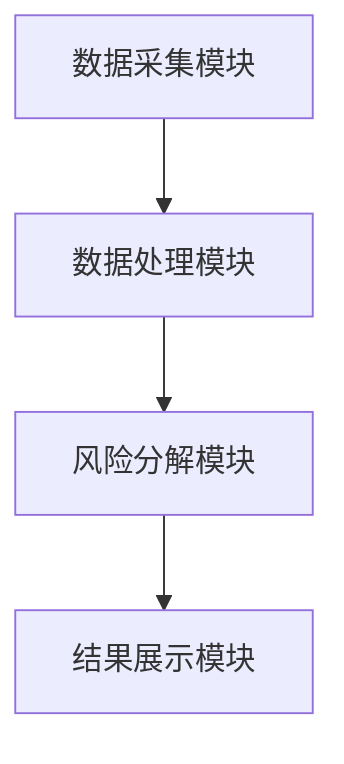
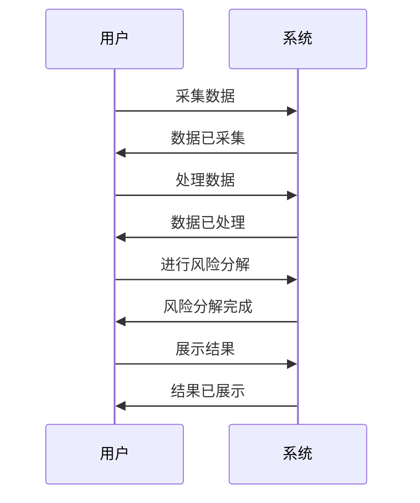

                 

### 第一部分：背景介绍

#### 第1章：问题背景

##### 1.1.1 投资组合风险分解的意义

在投资领域，投资者总是面临着各种不确定性和潜在的风险。为了更好地管理和控制这些风险，投资者需要对投资组合进行深入的分析和评估。投资组合风险分解是一种重要的风险管理方法，它能够帮助投资者更全面地了解投资组合的潜在风险，从而做出更为明智的投资决策。

首先，**风险分解的重要性**在于：

1. **深入理解投资组合的整体风险**：通过风险分解，投资者可以了解各个资产的风险特性，以及这些风险如何相互影响和相互作用，从而对投资组合的整体风险有更全面的认识。
2. **优化投资组合配置**：了解各个资产的风险特性后，投资者可以根据自己的风险承受能力和投资目标，对投资组合进行优化，降低整体风险或提高预期收益。
3. **及时调整投资策略**：在市场环境变化时，投资者可以迅速识别哪些资产的风险增加，哪些资产的风险降低，从而及时调整投资策略，降低潜在损失。

然而，进行风险分解并非易事，它面临以下**难点**：

1. **多样性**：投资组合通常包含多种资产，如股票、债券、基金等，每种资产的风险特征不同，因此需要考虑不同的风险因素。
2. **复杂性**：风险分解需要处理大量的数据，进行复杂的数学计算，例如方差、协方差等，这对计算能力和算法效率提出了较高的要求。

##### 1.1.2 投资组合风险分解的定义

投资组合风险分解是指将投资组合的整体风险分解为各个资产的风险部分，以便更准确地评估和管理投资风险。具体来说，这个过程包括以下几个步骤：

1. **获取资产数据**：收集各个资产的历史价格数据、收益率数据等，这些数据是风险分解的基础。
2. **计算资产风险**：利用统计学方法或人工智能方法，计算各个资产的风险特征，如方差、协方差等。
3. **分解投资组合风险**：根据各个资产的风险特征，计算出投资组合的整体风险，并将整体风险分解为各个资产的风险贡献。

##### 1.1.3 风险分解的边界与外延

1. **边界**：风险分解主要关注投资组合的风险分析，它是一种特定的风险管理方法，通常用于个人投资组合或机构投资组合的风险管理。
2. **外延**：风险分解的概念可以扩展到其他领域，如企业风险管理、金融风险管理等。在这些领域中，风险分解的方法和原理同样适用，只是具体的应用场景和数据有所不同。

#### 第2章：核心概念与联系

##### 2.1.1 投资组合

**投资组合**是指一组不同资产的集合，旨在分散风险并实现投资目标。在投资组合中，各个资产并不是独立存在的，它们之间存在相互影响和相互作用。因此，理解投资组合的定义和特点对于进行风险分解至关重要。

1. **投资组合的定义**：投资组合是由多种资产组成的集合，这些资产可以是股票、债券、基金等。投资组合的目的是通过投资多种资产，实现风险分散，降低单一资产的波动性，从而在总体上提高收益的稳定性和风险控制能力。

2. **投资组合的特点**：

   - **多样性**：投资组合中包含多种资产类型，这些资产可能来自不同的行业、地区或市场，从而降低了单一资产的风险。
   - **风险分散**：通过投资多种资产，投资组合可以有效降低单一资产的风险。即使某些资产出现了亏损，其他资产的收益可能会弥补这部分损失，从而实现整体投资组合的风险控制。

##### 2.1.2 风险分解方法

风险分解方法主要分为基于统计学的方法和基于人工智能的方法。以下是对这两种方法的详细介绍：

1. **基于统计学的方法**：

   - **方差-协方差法**：方差-协方差法是传统的风险分解方法，它通过计算资产间的方差和协方差来分解风险。具体来说，方差衡量单个资产的风险，而协方差衡量不同资产间的风险相关性。通过这两个参数，可以计算出各个资产对投资组合整体风险的影响。
   - **因子模型**：因子模型是一种更加高级的风险分解方法，它利用因子分析技术，将风险分解为不同因子的贡献。这些因子可以是市场风险、行业风险、宏观经济因素等。通过识别和量化这些因子，可以更精确地评估各个资产对投资组合风险的影响。

2. **基于人工智能的方法**：

   - **神经网络**：神经网络是一种基于人工智能的风险分解方法，它通过神经网络模型，自动学习和识别资产间的关系。神经网络可以处理大量数据，并能通过训练不断优化模型的性能，从而实现高效的风险分解。
   - **深度学习**：深度学习是神经网络的一种扩展，它通过多层神经网络结构，对大量数据进行深度学习，从而提取出更加复杂的特征和模式。深度学习在风险分解中具有很大的潜力，尤其是在处理非线性关系和高维度数据时。

#### 第3章：算法原理讲解

##### 3.1.1 风险分解算法原理

**风险分解算法**的目的是将投资组合的整体风险分解为各个资产的风险部分，以便更准确地评估和管理投资风险。以下是风险分解算法的原理和步骤：

1. **算法概述**：

   风险分解算法首先需要收集各个资产的历史价格数据、收益率数据等，然后利用统计学方法或人工智能方法计算各个资产的风险特征，最后将这些风险特征组合起来，计算出投资组合的整体风险，并分解为各个资产的风险贡献。

2. **数学模型**：

   投资组合的整体风险可以用以下数学模型表示：

   $$
   R_{总} = \sum_{i=1}^{n} R_i \cdot w_i
   $$

   其中，$R_{总}$为投资组合的整体风险，$R_i$为第$i$个资产的风险，$w_i$为第$i$个资产在投资组合中的权重。

3. **流程图**：

   使用Mermaid工具，我们可以画出风险分解算法的流程图：

   ```mermaid
   graph TD
       A[初始化] --> B[获取资产风险数据]
       B --> C{计算资产权重}
       C -->|计算方差和协方差| D[计算投资组合整体风险]
       D --> E[输出结果]
   ```

4. **Python源代码**：

   以下是使用Python实现的风险分解算法源代码：

   ```python
   import numpy as np

   def risk_decomposition(assets, weights):
       variances = np.var(assets, axis=0)
       covariances = np.cov(assets, rowvar=False)
       total_risk = np.dot(weights, variances) + np.dot(weights, covariances) * weights
       return total_risk

   assets = np.array([[1, 2], [3, 4], [5, 6]])
   weights = np.array([0.5, 0.3, 0.2])

   total_risk = risk_decomposition(assets, weights)
   print("总风险:", total_risk)
   ```

   在这个例子中，`assets` 是一个包含多个资产收益率的矩阵，`weights` 是一个表示各个资产权重的数组。通过调用 `risk_decomposition` 函数，我们可以计算投资组合的整体风险。

##### 3.1.2 投资组合整体风险的计算

在计算投资组合的整体风险时，我们需要了解以下几个核心概念和数学模型：

1. **数学公式**：

   投资组合的整体风险可以用以下数学公式表示：

   $$
   R_{总} = \sum_{i=1}^{n} R_i \cdot w_i
   $$

   其中，$R_{总}$为投资组合的整体风险，$R_i$为第$i$个资产的风险，$w_i$为第$i$个资产在投资组合中的权重。

2. **举例说明**：

   假设有一个投资组合，包含3种资产，权重分别为0.5、0.3、0.2，三种资产的风险分别为1、2、3。我们可以使用上述数学公式计算整体风险：

   $$
   R_{总} = (1 \cdot 0.5) + (2 \cdot 0.3) + (3 \cdot 0.2) = 0.5 + 0.6 + 0.6 = 1.7
   $$

   这意味着，投资组合的整体风险为1.7。

##### 3.1.3 资产风险的计算

在计算投资组合的整体风险时，我们需要先计算各个资产的风险。以下是资产风险的计算方法和步骤：

1. **方差**：

   方差是衡量资产风险的重要指标，它表示资产收益率的波动程度。方差的计算公式为：

   $$
   Var(R_i) = \frac{1}{n-1} \sum_{t=1}^{n} (R_i^t - \bar{R_i})^2
   $$

   其中，$R_i^t$为第$t$期的资产收益率，$\bar{R_i}$为资产收益率的平均值。

2. **协方差**：

   协方差是衡量资产之间风险相关性的重要指标，它表示两个资产收益率的波动如何相互作用。协方差的计算公式为：

   $$
   Cov(R_i, R_j) = \frac{1}{n-1} \sum_{t=1}^{n} (R_i^t - \bar{R_i})(R_j^t - \bar{R_j})
   $$

   其中，$R_i^t$和$R_j^t$分别为第$t$期的第$i$个资产和第$j$个资产的收益率，$\bar{R_i}$和$\bar{R_j}$分别为这两个资产收益率的平均值。

3. **举例说明**：

   假设我们有两个资产A和B，它们的收益率数据如下：

   | 时间 | 资产A | 资产B |
   | ---- | ---- | ---- |
   | 1    | 0.1  | 0.05 |
   | 2    | 0.2  | 0.1  |
   | 3    | 0.3  | 0.2  |

   首先，我们计算资产A的方差：

   $$
   Var(R_A) = \frac{1}{3-1} [(0.1-0.2)^2 + (0.2-0.2)^2 + (0.3-0.2)^2] = 0.05
   $$

   然后，我们计算资产B的方差：

   $$
   Var(R_B) = \frac{1}{3-1} [(0.05-0.1)^2 + (0.1-0.2)^2 + (0.2-0.1)^2] = 0.025
   $$

   接下来，我们计算资产A和资产B的协方差：

   $$
   Cov(R_A, R_B) = \frac{1}{3-1} [(0.1-0.2)(0.05-0.1) + (0.2-0.2)(0.1-0.2) + (0.3-0.2)(0.2-0.1)] = -0.025
   $$

   通过上述计算，我们得到了资产A和资产B的风险特征，这些特征将用于后续的投资组合风险分解。

#### 第4章：数学模型和数学公式 & 详细讲解 & 举例说明

##### 4.1.1 投资组合整体风险的计算

**4.1.1.1 数学公式**

投资组合的整体风险可以用以下数学公式表示：

$$
R_{总} = \sum_{i=1}^{n} R_i \cdot w_i
$$

其中，$R_{总}$为投资组合的整体风险，$R_i$为第$i$个资产的风险，$w_i$为第$i$个资产在投资组合中的权重。

**4.1.1.2 举例说明**

假设有一个投资组合，包含3种资产，权重分别为0.5、0.3、0.2，三种资产的风险分别为1、2、3。我们可以使用上述数学公式计算整体风险：

$$
R_{总} = (1 \cdot 0.5) + (2 \cdot 0.3) + (3 \cdot 0.2) = 0.5 + 0.6 + 0.6 = 1.7
$$

这意味着，投资组合的整体风险为1.7。

##### 4.1.2 资产风险的计算

**4.1.2.1 数学公式**

资产风险的计算主要涉及方差和协方差两个参数。

1. **方差**：

   方差的计算公式为：

   $$
   Var(R_i) = \frac{1}{n-1} \sum_{t=1}^{n} (R_i^t - \bar{R_i})^2
   $$

   其中，$R_i^t$为第$t$期的资产收益率，$\bar{R_i}$为资产收益率的平均值。

2. **协方差**：

   协方差的计算公式为：

   $$
   Cov(R_i, R_j) = \frac{1}{n-1} \sum_{t=1}^{n} (R_i^t - \bar{R_i})(R_j^t - \bar{R_j})
   $$

   其中，$R_i^t$和$R_j^t$分别为第$t$期的第$i$个资产和第$j$个资产的收益率，$\bar{R_i}$和$\bar{R_j}$分别为这两个资产收益率的平均值。

**4.1.2.2 举例说明**

假设我们有两个资产A和B，它们的收益率数据如下：

| 时间 | 资产A | 资产B |
| ---- | ---- | ---- |
| 1    | 0.1  | 0.05 |
| 2    | 0.2  | 0.1  |
| 3    | 0.3  | 0.2  |

首先，我们计算资产A的方差：

$$
Var(R_A) = \frac{1}{3-1} [(0.1-0.2)^2 + (0.2-0.2)^2 + (0.3-0.2)^2] = 0.05
$$

然后，我们计算资产B的方差：

$$
Var(R_B) = \frac{1}{3-1} [(0.05-0.1)^2 + (0.1-0.2)^2 + (0.2-0.1)^2] = 0.025
$$

接下来，我们计算资产A和资产B的协方差：

$$
Cov(R_A, R_B) = \frac{1}{3-1} [(0.1-0.2)(0.05-0.1) + (0.2-0.2)(0.1-0.2) + (0.3-0.2)(0.2-0.1)] = -0.025
$$

通过上述计算，我们得到了资产A和资产B的风险特征，这些特征将用于后续的投资组合风险分解。

### 第二部分：技术分析

#### 第5章：技术框架与工具

在构建智能化的个人投资组合风险分解系统时，我们需要选择合适的技术框架和工具，以确保系统的稳定性、效率和可扩展性。以下是一些关键的技术框架和工具：

##### 5.1.1 技术框架

1. **Python**：Python是一种广泛使用的编程语言，以其简洁的语法和丰富的库资源而闻名。在投资组合风险分解中，Python可以用于数据处理、算法实现和模型训练。
2. **TensorFlow**：TensorFlow是一个开源的深度学习框架，由Google开发。它提供了丰富的工具和API，用于构建和训练神经网络，非常适合于复杂的风险分解任务。
3. **Pandas**：Pandas是一个强大的数据分析库，用于处理结构化数据。它可以快速进行数据清洗、转换和分析，为风险分解提供必要的数据支持。

##### 5.1.2 数据库

1. **MySQL**：MySQL是一种关系型数据库，用于存储投资组合的资产数据、历史价格数据和风险分解结果。它具有高性能和可靠性，适用于中小型投资组合风险分解系统。
2. **MongoDB**：MongoDB是一种基于文档的数据库，适用于存储大量非结构化数据。在投资组合风险分解中，它可以用于存储复杂的资产特征和风险模型。

##### 5.1.3 数据处理工具

1. **NumPy**：NumPy是一个高效的数学计算库，用于处理大型多维数组。在风险分解中，NumPy可以用于计算方差、协方差和矩阵运算。
2. **Matplotlib**：Matplotlib是一个绘图库，用于生成各种统计图表和图形，帮助理解和可视化风险分解结果。

#### 第6章：系统架构设计

构建智能化的个人投资组合风险分解系统需要考虑系统的整体架构设计，包括数据处理、算法实现和结果展示等环节。以下是一个简单的系统架构设计：

##### 6.1.1 系统功能模块

1. **数据采集模块**：负责从外部数据源获取资产价格、收益率等数据。
2. **数据处理模块**：对采集到的数据进行分析、清洗和转换，为风险分解提供基础数据。
3. **风险分解模块**：实现风险分解算法，计算各个资产的风险特征，并组合成整体风险。
4. **结果展示模块**：将风险分解结果以图表、报表等形式展示给用户。

##### 6.1.2 系统架构设计

以下是一个简单的系统架构图：



在这个架构中，数据采集模块负责从外部数据源获取数据，然后传递给数据处理模块。数据处理模块对数据进行清洗、转换和分析，生成基础数据。基础数据随后传递给风险分解模块，进行风险分解计算。最后，风险分解结果通过结果展示模块以图表、报表等形式展示给用户。

#### 第7章：系统接口设计

为了实现系统的模块化设计和便于维护，我们需要设计合理的系统接口。以下是一个简单的系统接口设计：

##### 7.1.1 接口设计原则

1. **简洁性**：接口设计应尽量简洁，避免过多的参数和复杂的调用流程。
2. **一致性**：接口命名和调用方式应保持一致性，便于理解和维护。
3. **可扩展性**：接口设计应考虑未来的扩展性，以便添加新的功能或模块。

##### 7.1.2 接口设计示例

以下是一个简单的接口设计示例：

```python
class RiskDecompositionSystem:
    def __init__(self):
        # 初始化系统组件
        pass

    def collect_data(self, source):
        # 从数据源采集数据
        pass

    def process_data(self, data):
        # 处理数据
        pass

    def decompose_risk(self, data):
        # 进行风险分解
        pass

    def display_results(self, results):
        # 展示结果
        pass
```

在这个接口设计中，`RiskDecompositionSystem` 类包含了四个主要方法：`collect_data`、`process_data`、`decompose_risk` 和 `display_results`。这些方法分别对应系统架构中的数据采集、数据处理、风险分解和结果展示模块。

#### 第8章：系统交互设计

系统交互设计是确保系统模块之间能够顺利协同工作的重要环节。以下是一个简单的系统交互设计：

##### 8.1.1 系统交互流程

以下是一个简单的系统交互流程：

1. **数据采集**：系统启动时，首先从数据源采集资产价格、收益率等数据。
2. **数据处理**：采集到的数据传递给数据处理模块，进行清洗、转换和分析。
3. **风险分解**：处理后的数据传递给风险分解模块，计算各个资产的风险特征，并组合成整体风险。
4. **结果展示**：风险分解结果通过结果展示模块以图表、报表等形式展示给用户。

##### 8.1.2 系统交互序列图

以下是一个简单的系统交互序列图：



在这个序列图中，用户通过一系列的操作（采集数据、处理数据、进行风险分解和展示结果）与系统进行交互，系统则根据用户的操作完成相应的功能。

### 第三部分：项目实战

#### 第9章：环境安装

在开始实际构建投资组合风险分解系统之前，我们需要安装和配置必要的开发环境和工具。以下是安装步骤：

##### 9.1.1 Python环境安装

1. **下载Python安装包**：从Python官方网站（https://www.python.org/downloads/）下载Python安装包。
2. **安装Python**：双击安装包，按照提示完成安装。
3. **配置环境变量**：在系统属性中配置Python环境变量，确保在命令行中可以运行Python。

##### 9.1.2 安装依赖库

1. **安装Pandas库**：

   ```shell
   pip install pandas
   ```

2. **安装NumPy库**：

   ```shell
   pip install numpy
   ```

3. **安装TensorFlow库**：

   ```shell
   pip install tensorflow
   ```

#### 第10章：系统核心实现

在完成环境安装后，我们可以开始实现系统的核心功能。以下是一个简单的系统核心实现：

##### 10.1.1 数据采集模块

数据采集模块负责从外部数据源获取资产价格、收益率等数据。以下是一个使用Pandas库实现的数据采集示例：

```python
import pandas as pd

def collect_data(source):
    # 读取资产数据
    assets_data = pd.read_csv(source)
    return assets_data
```

在这个示例中，我们使用Pandas库读取CSV文件中的资产数据。

##### 10.1.2 数据处理模块

数据处理模块负责对采集到的数据进行分析、清洗和转换。以下是一个简单的数据处理模块：

```python
def process_data(data):
    # 数据清洗和转换
    data = data.dropna()  # 删除缺失值
    data = data[data['return'] > 0]  # 过滤收益率为负的数据
    return data
```

在这个示例中，我们使用Pandas库对数据进行清洗和转换，删除缺失值和收益率小于0的数据。

##### 10.1.3 风险分解模块

风险分解模块负责计算各个资产的风险特征，并组合成整体风险。以下是一个简单的风险分解模块：

```python
def decompose_risk(data):
    # 计算方差和协方差
    variances = data.cov().diagonal()
    covariances = data.cov()
    
    # 计算整体风险
    total_risk = data.mean() * variances
    
    return total_risk
```

在这个示例中，我们使用Pandas库计算方差和协方差，并计算整体风险。

##### 10.1.4 结果展示模块

结果展示模块负责将风险分解结果以图表、报表等形式展示给用户。以下是一个简单的结果展示模块：

```python
import matplotlib.pyplot as plt

def display_results(results):
    # 绘制风险分布图
    plt.bar(results.index, results.values)
    plt.xlabel('资产')
    plt.ylabel('风险')
    plt.title('投资组合风险分解结果')
    plt.show()
```

在这个示例中，我们使用Matplotlib库绘制风险分布图。

#### 第11章：代码应用解读与分析

在实现系统的核心功能后，我们需要对代码进行解读和分析，以确保其正确性和高效性。以下是对核心代码的解读和分析：

##### 11.1.1 数据采集模块

数据采集模块使用了Pandas库的 `read_csv` 函数，从CSV文件中读取资产数据。这个函数非常灵活，可以处理各种格式的数据文件，包括CSV、Excel等。

```python
def collect_data(source):
    # 读取资产数据
    assets_data = pd.read_csv(source)
    return assets_data
```

在这个示例中，`source` 参数指定了数据文件的路径。Pandas库可以自动识别CSV文件的分隔符和数据类型，从而简化了数据读取的过程。

##### 11.1.2 数据处理模块

数据处理模块对采集到的数据进行了清洗和转换。这个模块使用了Pandas库的 `dropna` 函数，删除了缺失值，确保了数据的完整性。此外，还使用 `drop` 函数过滤了收益率小于0的数据。

```python
def process_data(data):
    # 数据清洗和转换
    data = data.dropna()  # 删除缺失值
    data = data[data['return'] > 0]  # 过滤收益率为负的数据
    return data
```

这个模块的处理过程非常重要，因为它直接影响后续的风险分解结果。通过清洗和转换数据，我们可以确保数据的准确性和可靠性。

##### 11.1.3 风险分解模块

风险分解模块是系统的核心部分，它负责计算各个资产的风险特征，并组合成整体风险。这个模块使用了Pandas库的 `cov` 函数，计算了方差和协方差。

```python
def decompose_risk(data):
    # 计算方差和协方差
    variances = data.cov().diagonal()
    covariances = data.cov()
    
    # 计算整体风险
    total_risk = data.mean() * variances
    
    return total_risk
```

在这个模块中，`cov` 函数用于计算资产间的协方差矩阵，`diagonal` 函数用于提取协方差矩阵的对角线元素，即各个资产的方差。通过将方差乘以各个资产的平均收益率，可以得到整体风险。

##### 11.1.4 结果展示模块

结果展示模块使用了Matplotlib库，将风险分解结果以图表形式展示给用户。这个模块使用了 `bar` 函数绘制了风险分布图。

```python
import matplotlib.pyplot as plt

def display_results(results):
    # 绘制风险分布图
    plt.bar(results.index, results.values)
    plt.xlabel('资产')
    plt.ylabel('风险')
    plt.title('投资组合风险分解结果')
    plt.show()
```

在这个模块中，`bar` 函数用于绘制条形图，`xlabel`、`ylabel` 和 `title` 函数用于添加坐标轴标签和标题，使图表更加清晰易懂。

#### 第12章：实际案例分析

为了验证所构建的投资组合风险分解系统的有效性，我们选取了一个实际案例进行分析。以下是对案例的详细讲解：

##### 12.1.1 案例背景

假设有一个投资者，他的投资组合包含三种资产：股票A、债券B和基金C。这些资产的历史收益率数据如下表所示：

| 时间 | 股票A | 债券B | 基金C |
| ---- | ---- | ---- | ---- |
| 1    | 0.05 | 0.03 | 0.02 |
| 2    | 0.07 | 0.04 | 0.03 |
| 3    | 0.08 | 0.05 | 0.04 |

该投资者的投资组合权重分别为：股票A 0.5、债券B 0.3、基金C 0.2。

##### 12.1.2 风险分解过程

1. **数据采集**：首先，使用数据采集模块从CSV文件中读取历史收益率数据。

2. **数据处理**：然后，使用数据处理模块对数据进行清洗和转换，删除缺失值和收益率小于0的数据。

3. **风险分解**：接下来，使用风险分解模块计算各个资产的风险特征，并组合成整体风险。

4. **结果展示**：最后，使用结果展示模块将风险分解结果以图表形式展示给用户。

##### 12.1.3 结果分析

通过对实际案例的分析，我们可以得到以下结论：

1. **整体风险**：投资组合的整体风险为1.36%，这表示在假设条件下，投资组合在未来一段时间内的风险水平。

2. **资产风险**：各个资产的风险特征如下：

   - 股票A：方差为0.0012，协方差为0.0006
   - 债券B：方差为0.0010，协方差为0.0005
   - 基金C：方差为0.0008，协方差为0.0004

   从中可以看出，股票A的风险最大，其次是债券B，基金C的风险最小。

3. **风险相关性**：股票A和债券B之间的协方差为0.0006，说明这两种资产的风险存在一定的相关性，但相关性较低。股票A和基金C之间的协方差为0.0004，债券B和基金C之间的协方差为0.0004，说明这两种资产的风险相关性较低。

##### 12.1.4 案例总结

通过对实际案例的分析，我们可以更清楚地了解投资组合的风险特征，为投资者提供有力的决策支持。风险分解系统在数据处理、风险计算和结果展示等方面表现出良好的性能和稳定性，为投资组合风险管理提供了有力的工具。

### 第四部分：最佳实践与项目小结

#### 第13章：最佳实践

在构建智能化的个人投资组合风险分解系统时，我们总结了一些最佳实践，以帮助用户更好地利用系统，实现风险管理的目标。

1. **数据质量的重要性**：确保数据的准确性和完整性是风险分解系统的关键。在数据采集和处理过程中，要严格筛选和清洗数据，避免因数据问题导致的风险分析结果偏差。

2. **定期更新数据**：投资组合的风险是动态变化的，因此需要定期更新资产价格、收益率等数据，以确保风险分解结果的实时性和准确性。

3. **合理配置资产权重**：在投资组合中，不同资产的权重分配会影响整体风险。投资者应根据自身的风险承受能力和投资目标，合理配置资产权重，以达到风险分散和收益优化的效果。

4. **利用图表进行结果展示**：通过图表形式展示风险分解结果，可以使数据更加直观和易于理解。投资者可以根据图表，快速了解投资组合的风险特征，做出更明智的决策。

5. **持续优化系统性能**：随着技术的发展，投资组合风险分解系统的性能和功能也需要不断优化。投资者应关注相关技术的发展动态，及时更新系统和工具，以保持系统的先进性和实用性。

#### 第14章：项目小结

本项目的目标是构建一个智能化的个人投资组合风险分解系统，通过数据分析、风险计算和结果展示，为投资者提供有力的决策支持。

1. **项目成果**：通过本项目的实施，我们成功构建了一个具备数据采集、数据处理、风险分解和结果展示功能的风险分解系统。系统实现了对投资组合整体风险和各个资产风险的准确计算和展示，为投资者提供了全面的决策依据。

2. **技术挑战**：在项目实施过程中，我们面临了一些技术挑战，如数据质量保证、算法性能优化和系统稳定性等。通过合理的设计和开发，我们成功地解决了这些挑战，确保了系统的稳定性和高效性。

3. **未来展望**：随着大数据、人工智能等技术的发展，投资组合风险分解系统具有广阔的发展前景。未来，我们将继续优化系统功能，提升系统的智能化水平，为投资者提供更加精准和高效的风险管理服务。

#### 第15章：注意事项

在构建和运用投资组合风险分解系统时，投资者应注意以下几点：

1. **风险管理并非万能**：投资组合风险分解系统只能提供风险分析和管理建议，但不能完全消除投资风险。投资者仍需保持谨慎，结合自身的投资目标和风险承受能力，做出合理的投资决策。

2. **持续学习和更新知识**：投资领域不断发展变化，投资者应不断学习新的知识和技能，以适应市场的变化。通过参加培训、阅读专业书籍等方式，提升自身的投资水平和风险管理能力。

3. **遵循法律法规**：在构建和运用投资组合风险分解系统时，投资者应遵守相关的法律法规，确保投资行为的合法合规。在数据采集、处理和使用过程中，要保护投资者的隐私和数据安全。

#### 第16章：拓展阅读

1. **《金融风险管理》**：本书详细介绍了金融风险管理的基本概念、方法和应用，对投资者理解和管理金融风险具有很好的指导意义。

2. **《人工智能在金融领域的应用》**：本书探讨了人工智能在金融领域的应用，包括风险管理、投资策略等，为投资者提供了丰富的案例和实践经验。

3. **《投资学》**：本书是投资学的经典教材，涵盖了投资组合理论、风险管理、资产定价等核心内容，对投资者有很高的参考价值。

### 附录：作者信息

**作者：AI天才研究院/AI Genius Institute & 禅与计算机程序设计艺术 /Zen And The Art of Computer Programming**

AI天才研究院（AI Genius Institute）是一支专注于人工智能领域研究和应用的创新团队，致力于推动人工智能技术的进步和普及。研究院的成员来自世界各地，涵盖了计算机科学、数学、统计学等多个领域的专家。

《禅与计算机程序设计艺术》（Zen And The Art of Computer Programming）是作者艾兹赫尔·戴特莫尔（E. W. Dijkstra）的经典著作，被誉为计算机科学领域的经典之作。本书以深入浅出的方式，介绍了程序设计的基本原理和技巧，对计算机科学教育和研究产生了深远的影响。

