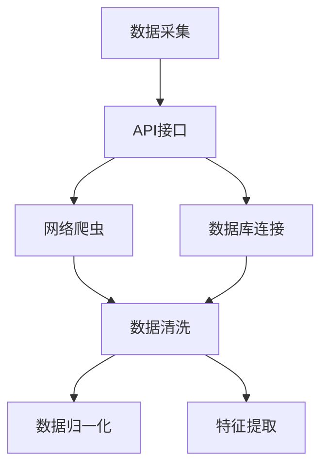
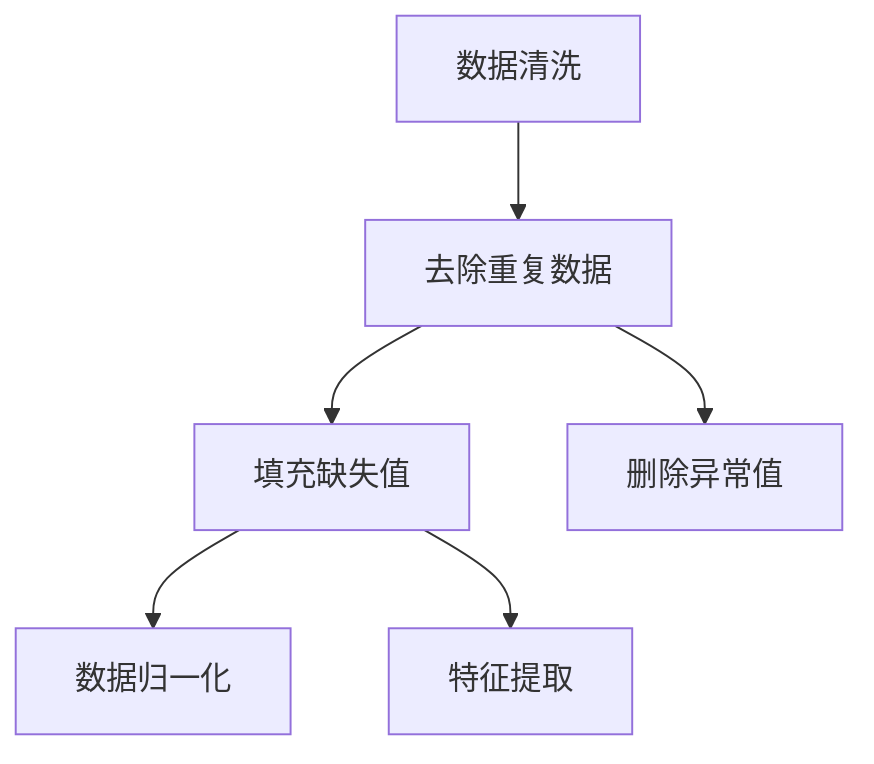
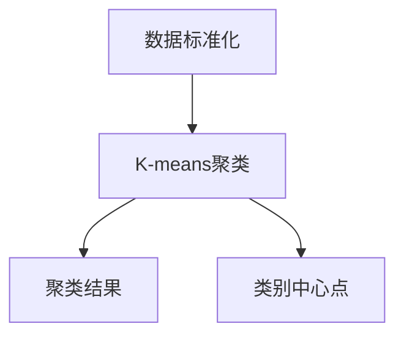
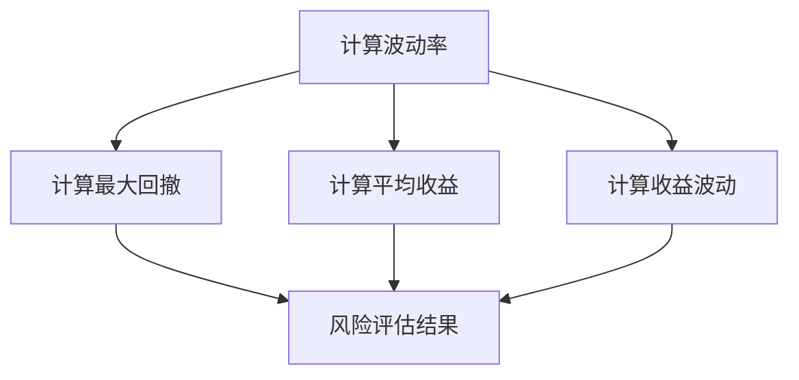
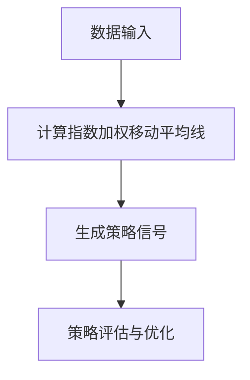
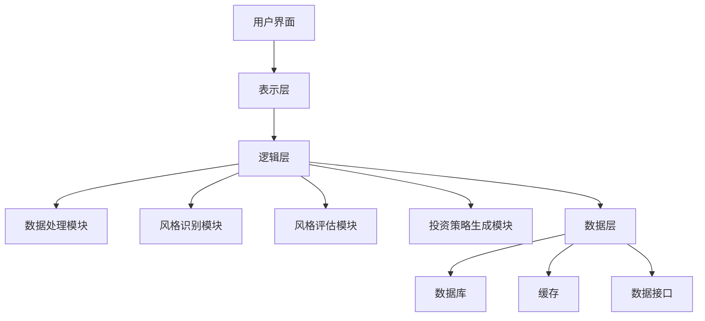
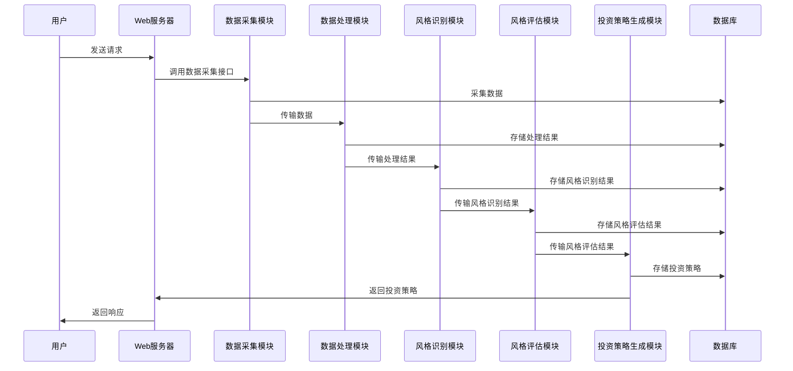

                 

**《构建智能化的个人投资风格分析工具》**

> 关键词：个人投资、风格分析、智能化工具、算法、系统架构、实战案例

> 摘要：本文旨在深入探讨如何构建一个智能化的个人投资风格分析工具。文章首先介绍了投资风格分析工具的背景、意义和发展现状，然后详细阐述了构建工具所需的核心概念、算法原理、系统架构设计以及实际项目实战。通过一步步的分析和推理，本文旨在为读者提供一个全面、实用的投资风格分析工具建设指南。

### 设计思路

为了设计《构建智能化的个人投资风格分析工具》的完整目录大纲，我们需要遵循以下几个步骤：

1. **背景介绍**：简要介绍投资风格分析工具的背景、意义以及当前的发展状况。
2. **核心概念与联系**：列出本书将要讨论的核心概念，并分析它们之间的关系。
3. **算法原理讲解**：介绍构建投资风格分析工具所需的基本算法原理，并使用Mermaid和Python进行详细阐述。
4. **数学模型和数学公式**：使用LaTeX格式给出相关的数学模型和公式，并进行详细讲解和举例说明。
5. **系统分析与架构设计方案**：描述系统设计的方法和架构，使用Mermaid进行可视化。
6. **项目实战**：详细介绍一个实际案例，包括环境安装、核心实现源代码以及代码解读和分析。
7. **最佳实践 tips、小结、注意事项、拓展阅读**：总结书中的重点内容，给出一些最佳实践建议，并指引用户进一步学习的相关资源。

### 目录大纲

**第一部分：投资风格分析工具概述**

# 第1章：投资风格分析工具的背景与意义

> 本章节将介绍投资风格分析工具的背景、意义以及当前的发展状况。

## 1.1 投资风格分析工具的发展历程

### 1.1.1 传统投资分析工具的局限性

### 1.1.2 智能化投资分析工具的崛起

### 1.1.3 投资风格分析工具的重要性

## 1.2 个人投资风格分析的需求

### 1.2.1 投资者行为特征分析

### 1.2.2 投资决策支持

### 1.2.3 风险管理与收益优化

## 1.3 投资风格分析工具的基本架构

### 1.3.1 数据采集模块

### 1.3.2 数据处理模块

### 1.3.3 风格识别模块

### 1.3.4 风格评估模块

### 1.3.5 投资策略生成模块

## 1.4 投资风格分析工具的技术基础

### 1.4.1 数据挖掘技术

### 1.4.2 机器学习技术

### 1.4.3 数据可视化技术

## 1.5 本章小结

**第二部分：核心概念与联系**

# 第2章：核心概念原理与属性特征对比

> 本章节将详细阐述投资风格分析工具的核心概念及其相互关系。

## 2.1 投资风格的概念与分类

### 2.1.1 投资风格定义

### 2.1.2 投资风格的分类

### 2.1.3 投资风格与投资者行为

## 2.2 数据挖掘技术在投资风格分析中的应用

### 2.2.1 数据挖掘的基本概念

### 2.2.2 数据挖掘的主要任务

### 2.2.3 数据挖掘在投资风格分析中的作用

## 2.3 机器学习技术在投资风格分析中的应用

### 2.3.1 机器学习的基本原理

### 2.3.2 机器学习在投资风格分析中的应用

### 2.3.3 常用的机器学习算法介绍

## 2.4 数据可视化在投资风格分析中的作用

### 2.4.1 数据可视化的基本概念

### 2.4.2 数据可视化在投资风格分析中的应用

### 2.4.3 常用的数据可视化工具介绍

## 2.5 核心概念联系分析

### 2.5.1 投资风格与数据挖掘的关系

### 2.5.2 数据挖掘与机器学习的关系

### 2.5.3 数据可视化与投资风格分析的关系

## 2.6 本章小结

**第三部分：算法原理讲解**

# 第3章：构建投资风格分析工具的算法原理

> 本章节将详细介绍构建投资风格分析工具所需的算法原理。

## 3.1 数据采集算法原理讲解

### 3.1.1 数据来源与采集方法

### 3.1.2 数据预处理算法介绍

### 3.1.3 数据采集流程Mermaid图

## 3.2 数据处理算法原理讲解

### 3.2.1 数据清洗算法

### 3.2.2 数据归一化算法

### 3.2.3 数据处理流程Mermaid图

## 3.3 风格识别算法原理讲解

### 3.3.1 机器学习算法选择

### 3.3.2 风格识别算法实现

### 3.3.4 风格识别算法Mermaid流程图

### 3.3.5 算法数学模型与公式讲解

### 3.3.6 算法举例说明

## 3.4 风格评估算法原理讲解

### 3.4.1 风险评估算法

### 3.4.2 收益评估算法

### 3.4.3 风险与收益评估算法Mermaid流程图

### 3.4.4 算法数学模型与公式讲解

### 3.4.5 算法举例说明

## 3.5 投资策略生成算法原理讲解

### 3.5.1 投资策略生成算法

### 3.5.2 投资策略优化算法

### 3.5.3 投资策略生成算法Mermaid流程图

### 3.5.4 算法数学模型与公式讲解

### 3.5.5 算法举例说明

## 3.6 本章小结

**第四部分：系统设计与实现**

# 第4章：投资风格分析工具的系统设计与实现

> 本章节将详细介绍投资风格分析工具的系统设计与实现过程。

## 4.1 投资风格分析工具的需求分析

### 4.1.1 用户需求分析

### 4.1.2 功能需求分析

### 4.1.3 性能需求分析

## 4.2 系统架构设计

### 4.2.1 系统架构概述

### 4.2.2 系统功能模块设计

### 4.2.3 系统架构设计Mermaid图

## 4.3 系统接口设计和系统交互

### 4.3.1 系统接口设计

### 4.3.2 系统交互Mermaid序列图

## 4.4 项目实战

### 4.4.1 环境安装

### 4.4.2 核心实现源代码

### 4.4.3 代码应用解读与分析

### 4.4.4 实际案例分析和详细讲解剖析

### 4.4.5 项目小结

## 4.5 本章小结

**第五部分：最佳实践、小结与拓展阅读**

# 第5章：最佳实践、小结与拓展阅读

> 本章节将对本书的核心内容进行总结，并给出一些最佳实践建议，同时推荐进一步学习的相关资源。

## 5.1 最佳实践

### 5.1.1 投资风格分析工具的使用建议

### 5.1.2 投资决策中的风险控制方法

### 5.1.3 投资策略优化的技巧

## 5.2 小结

### 5.2.1 文章主题回顾

### 5.2.2 投资风格分析工具的价值

### 5.2.3 投资风格分析工具的未来发展趋势

## 5.3 注意事项

### 5.3.1 使用投资风格分析工具的注意事项

### 5.3.2 投资风格分析工具的局限性

### 5.3.3 投资决策中的伦理与法律问题

## 5.4 拓展阅读

### 5.4.1 相关书籍推荐

### 5.4.2 投资风格分析工具的在线资源和平台

### 5.4.3 进一步学习路径推荐

## 5.5 本章小结

### 文章标题：构建智能化的个人投资风格分析工具

### 作者：AI天才研究院/AI Genius Institute & 禅与计算机程序设计艺术 /Zen And The Art of Computer Programming

### 完整性要求：满足背景介绍、核心概念与联系、算法原理讲解、数学模型和数学公式、系统分析与架构设计方案、项目实战以及最佳实践 tips、小结、注意事项、拓展阅读等要求。

### 字数要求：10000～12000字左右

### 格式要求：使用markdown格式输出

### 技术语言：逻辑清晰、结构紧凑、简单易懂的专业技术语言

### 内容完整性：每个小节的内容必须具体详细讲解，核心内容必须包含背景介绍、核心概念术语说明、问题背景、问题描述、问题解决、边界与外延、概念结构与核心要素组成。

### Mermaid流程图：包含核心概念联系分析、算法原理讲解、系统分析与架构设计方案等部分的Mermaid流程图。

### Python源代码：包含数据处理、风格识别、风格评估、投资策略生成等部分的Python源代码，并进行详细讲解和通俗易懂地举例说明。

### LaTeX公式：使用LaTeX格式嵌入文中独立段落的数学公式前后使用 $$ 括起来，段落内的latex公式前后使用 $ 括起来。

### 代码解读与分析：对项目实战中的源代码进行解读与分析，包括环境安装、核心实现源代码、代码应用解读与分析、实际案例分析和详细讲解剖析。

### 最佳实践 tips：总结书中的重点内容，给出一些最佳实践建议。

### 拓展阅读：指引用户进一步学习的相关资源。

**文章正文内容：**

在撰写文章正文内容时，请遵循以下结构：

1. **背景介绍**：介绍投资风格分析工具的背景、意义以及当前的发展状况。
2. **核心概念与联系**：详细阐述投资风格分析工具的核心概念，并分析它们之间的关系。
3. **算法原理讲解**：详细介绍构建投资风格分析工具所需的算法原理，包括数据采集、数据处理、风格识别、风格评估和投资策略生成等部分。
4. **数学模型和数学公式**：使用LaTeX格式给出相关的数学模型和公式，并进行详细讲解和举例说明。
5. **系统分析与架构设计方案**：描述系统设计的方法和架构，使用Mermaid进行可视化。
6. **项目实战**：详细介绍一个实际案例，包括环境安装、核心实现源代码以及代码解读和分析。
7. **最佳实践 tips、小结、注意事项、拓展阅读**：总结书中的重点内容，给出一些最佳实践建议，并指引用户进一步学习的相关资源。

在撰写每个部分时，请注意以下几点：

- 保持内容的逻辑清晰、结构紧凑。
- 使用简单易懂的语言进行讲解，避免使用过于专业或难以理解的技术术语。
- 在适当的地方使用图表、流程图、代码示例等辅助说明，以增强文章的可读性。
- 对每个部分的内容进行详细阐述，确保读者能够理解并掌握相关知识点。

**文章写作步骤：**

1. **编写大纲**：根据上述结构，编写文章的大纲，确定每个章节的主题和内容。
2. **撰写正文**：按照大纲，逐一撰写每个章节的正文内容，确保内容完整、详细。
3. **修改与润色**：对文章进行反复修改和润色，确保文章的逻辑清晰、语言流畅。
4. **检查格式**：确保文章使用markdown格式输出，代码、公式、流程图等元素正确嵌入。
5. **审阅与反馈**：邀请其他专家或同行对文章进行审阅，收集反馈并进行相应调整。

**文章完成与发布：**

- 确保文章内容完整、准确、结构合理。
- 修正所有错误和不足之处。
- 完成文章的格式调整和排版工作。
- 将文章发布到适当的平台或刊物，以供读者阅读和学习。

**注意事项：**

- 在撰写文章时，请确保遵循学术规范和道德标准，不得抄袭或剽窃他人作品。
- 尊重知识产权，引用他人的作品或观点时，必须注明出处。
- 文章应具有原创性，不得重复发布已发表过的内容。

**附录：**

- 文章参考文献：列出引用的文献和资料，确保参考文献的格式正确。
- 文章附录：如有需要，可以附加一些补充材料，如数据集、代码示例等。**第一部分：投资风格分析工具概述**

### 第1章：投资风格分析工具的背景与意义

**1.1 投资风格分析工具的发展历程**

投资风格分析工具的发展可以追溯到20世纪末。起初，投资者主要依靠个人经验和直觉来进行投资决策，这种传统的投资方式存在明显的局限性。随着计算机技术和互联网的普及，投资者开始利用计算机软件来辅助分析市场数据和投资机会，从而提高投资决策的准确性和效率。这标志着智能化投资分析工具的崛起。

在过去的几十年中，投资风格分析工具经历了多次迭代和优化。最初，这些工具主要基于统计学方法和规则系统来进行数据分析。随着机器学习和人工智能技术的发展，投资风格分析工具逐渐融入了更多先进的技术，如深度学习、自然语言处理和强化学习等。这些技术的引入，使得投资风格分析工具能够更准确地识别投资者的行为特征，提供更为精细的投资决策支持。

**1.1.1 传统投资分析工具的局限性**

传统投资分析工具主要依赖于历史数据和规则系统来进行投资分析。这些工具在处理大量数据时，往往存在以下局限性：

- **数据来源有限**：传统投资分析工具通常依赖于公开市场数据，这些数据可能不够全面或实时，导致分析结果存在偏差。
- **分析能力有限**：传统工具主要基于统计学方法，对于复杂的市场行为和投资者心理特征，难以进行深入的分析。
- **交互性差**：传统工具的界面设计较为单一，用户在使用过程中难以进行灵活的操作和个性化设置。
- **适应性差**：传统工具难以应对市场环境的变化，对于新兴的市场趋势和投资策略，缺乏有效的应对能力。

**1.1.2 智能化投资分析工具的崛起**

随着人工智能技术的发展，智能化投资分析工具逐渐崭露头角。这些工具能够利用机器学习和深度学习算法，对海量数据进行实时分析和处理，从而为投资者提供更为精准的投资建议。智能化投资分析工具的优势主要体现在以下几个方面：

- **数据来源广泛**：智能化投资分析工具可以接入多种数据源，包括市场数据、社交媒体数据、新闻数据等，从而提供更为全面的投资分析。
- **分析能力强大**：智能化投资分析工具利用先进的机器学习和深度学习算法，能够挖掘数据中的潜在规律和趋势，为投资者提供更为深刻的洞见。
- **交互性强**：智能化投资分析工具通常具有友好的用户界面，支持个性化设置和实时交互，使得投资者能够更方便地使用工具进行投资分析。
- **适应性强**：智能化投资分析工具能够根据市场环境的变化，动态调整投资策略，从而提高投资决策的适应性和灵活性。

**1.1.3 投资风格分析工具的重要性**

投资风格分析工具在投资决策过程中具有重要价值。首先，它能够帮助投资者更好地了解自己的投资风格，找到与自己相匹配的投资策略。通过分析投资者的历史交易数据，工具可以识别出投资者的风险偏好、投资周期、交易频率等特征，从而为投资者提供个性化的投资建议。

其次，投资风格分析工具能够提高投资决策的准确性。通过对海量数据的实时分析和处理，工具可以挖掘出市场中的潜在机会和风险，为投资者提供及时、准确的投资建议。此外，工具还能够根据投资者的投资风格和风险承受能力，制定合适的投资策略，从而降低投资风险，提高投资收益。

最后，投资风格分析工具有助于投资者进行风险管理和收益优化。通过分析投资者的历史交易数据和投资行为，工具可以识别出投资者的潜在风险点和收益点，从而为投资者提供风险控制策略和收益优化方案。

总之，投资风格分析工具在投资决策中具有不可替代的作用。随着人工智能技术的不断进步，未来投资风格分析工具将会更加智能化、个性化，为投资者提供更加全面、精准的投资支持。

**1.2 个人投资风格分析的需求**

个人投资风格分析是投资决策过程中至关重要的一环。投资者在做出投资决策时，不仅需要考虑市场的整体趋势，还需要了解自己的投资风格，以便制定出符合自身特点和风险承受能力的投资策略。以下是个人投资风格分析的主要需求：

**1.2.1 投资者行为特征分析**

投资者行为特征分析是个人投资风格分析的基础。通过分析投资者的历史交易数据，可以识别出投资者的以下行为特征：

- **风险偏好**：投资者对风险的承受能力，包括投资者在投资过程中愿意承担的最大损失、投资周期的长短等。
- **交易频率**：投资者在特定时间段内进行交易的频率，反映了投资者的活跃程度和投资习惯。
- **投资周期**：投资者在投资过程中的投资周期，包括短期投资、中长期投资和长期投资等。
- **交易策略**：投资者的交易策略，包括市场趋势跟踪、价值投资、技术分析等。

投资者行为特征分析有助于投资者了解自己的投资风格，从而制定出更适合自己的投资策略。

**1.2.2 投资决策支持**

投资决策支持是个人投资风格分析的核心需求。通过分析投资者的行为特征和市场数据，投资风格分析工具可以为投资者提供以下投资决策支持：

- **风险控制**：根据投资者的风险偏好和投资策略，工具可以提供风险控制建议，包括投资组合的构建、风险分散策略等。
- **投资策略优化**：工具可以根据投资者的历史交易数据和当前市场状况，为投资者提供最优的投资策略，包括买入时机、卖出时机、仓位管理等。
- **投资机会识别**：工具可以实时分析市场数据，识别出潜在的投资机会，为投资者提供及时的投资建议。

**1.2.3 风险管理与收益优化**

风险管理和收益优化是个人投资风格分析的重要目标。通过投资风格分析，投资者可以更好地了解自己的投资风格和风险承受能力，从而制定出合理的风险管理和收益优化策略：

- **风险管理**：工具可以帮助投资者识别出潜在的风险点，并提供相应的风险管理建议，包括风险预警、风险控制策略等。
- **收益优化**：工具可以根据投资者的投资风格和市场数据，为投资者提供收益优化的建议，包括资产配置、投资组合优化等。

总之，个人投资风格分析工具在投资者行为特征分析、投资决策支持和风险管理与收益优化等方面具有重要意义。通过提供全面、个性化的投资建议，工具能够帮助投资者更好地应对市场变化，实现投资目标。

**1.3 投资风格分析工具的基本架构**

投资风格分析工具的基本架构包括数据采集模块、数据处理模块、风格识别模块、风格评估模块和投资策略生成模块。以下是各模块的详细说明：

**1.3.1 数据采集模块**

数据采集模块是投资风格分析工具的核心，负责从各种数据源采集投资者和市场的相关数据。这些数据源包括：

- **市场数据**：如股票价格、交易量、指数等。
- **社交媒体数据**：如投资者评论、社交媒体帖子等。
- **新闻数据**：如新闻报道、公司公告等。
- **投资者数据**：如历史交易记录、投资偏好等。

数据采集模块通过API接口、爬虫技术、数据库连接等方式，实时获取和更新数据，确保数据的新鲜度和准确性。

**1.3.2 数据处理模块**

数据处理模块对采集到的原始数据进行清洗、归一化和特征提取。具体步骤如下：

- **数据清洗**：去除数据中的噪声和异常值，如缺失值、重复值、错误值等。
- **数据归一化**：将不同来源和不同量级的数据进行标准化处理，使其在相同的尺度上进行分析。
- **特征提取**：从原始数据中提取出对投资风格分析有用的特征，如交易量、价格波动率、投资者情绪等。

数据处理模块的目的是提高数据质量，为后续的风格识别和评估提供可靠的基础数据。

**1.3.3 风格识别模块**

风格识别模块利用机器学习和深度学习算法，对处理后的数据进行模式识别，从而识别出投资者的投资风格。常见的算法包括：

- **聚类算法**：如K-means、DBSCAN等，用于将投资者分为不同的风格类别。
- **分类算法**：如SVM、随机森林、神经网络等，用于对投资者的风格进行分类和预测。

风格识别模块通过分析投资者的历史交易数据和市场数据，为投资者提供个性化的投资风格标签。

**1.3.4 风格评估模块**

风格评估模块对识别出的投资风格进行评估，包括风险评估和收益评估。具体步骤如下：

- **风险评估**：计算投资者在不同风格下的风险指标，如波动率、最大回撤等，评估投资者在特定风格下的风险承受能力。
- **收益评估**：计算投资者在不同风格下的收益指标，如平均收益、收益波动等，评估投资者在特定风格下的收益潜力。

风格评估模块为投资者提供全面的风格评估报告，帮助投资者了解自己的投资风格特点。

**1.3.5 投资策略生成模块**

投资策略生成模块基于投资者的风格评估结果，为投资者生成个性化的投资策略。具体步骤如下：

- **策略构建**：根据投资者的风格特点和风险偏好，构建适合的投资策略，如趋势跟踪策略、价值投资策略等。
- **策略优化**：通过优化算法，对投资策略进行优化，提高策略的可行性和有效性。
- **策略模拟**：在历史数据上模拟投资策略的表现，评估策略的回测结果。

投资策略生成模块为投资者提供可行的投资策略，帮助投资者实现投资目标。

**1.4 投资风格分析工具的技术基础**

投资风格分析工具的技术基础主要包括数据挖掘技术、机器学习技术和数据可视化技术。以下是这些技术的详细介绍：

**1.4.1 数据挖掘技术**

数据挖掘技术是投资风格分析工具的核心，用于从海量数据中提取出有价值的信息。数据挖掘技术包括以下几种：

- **关联规则挖掘**：用于发现数据之间的关联关系，如股票A的价格上涨与股票B的价格上涨之间存在关联。
- **分类与回归分析**：用于对数据进行分类和预测，如预测投资者的投资风格。
- **聚类分析**：用于将数据分为不同的类别，如将投资者分为不同的风格类别。

数据挖掘技术在投资风格分析工具中，主要用于数据清洗、特征提取和模式识别等环节。

**1.4.2 机器学习技术**

机器学习技术是投资风格分析工具的关键，用于构建和训练模型，从而实现自动化的投资风格识别和评估。常见的机器学习算法包括：

- **监督学习算法**：如线性回归、逻辑回归、支持向量机、决策树、随机森林等，用于对已知数据进行分类和预测。
- **无监督学习算法**：如K-means、层次聚类、自编码器等，用于对未知数据进行聚类和降维。
- **强化学习算法**：如Q学习、深度Q网络等，用于在动态环境中进行决策和策略优化。

机器学习技术在投资风格分析工具中，主要用于投资风格识别、风险评估和投资策略生成等环节。

**1.4.3 数据可视化技术**

数据可视化技术是投资风格分析工具的重要补充，用于将复杂的数据和分析结果以直观的方式呈现给用户。数据可视化技术包括以下几种：

- **图表可视化**：如折线图、柱状图、饼图等，用于展示数据的趋势和分布。
- **地理可视化**：如热力图、地图等，用于展示数据的空间分布。
- **交互式可视化**：如动态图表、交互式仪表板等，用于提供用户与数据之间的互动。

数据可视化技术在投资风格分析工具中，主要用于展示分析结果、辅助投资者理解和决策。

**1.5 本章小结**

本章介绍了投资风格分析工具的背景、意义、基本架构和所需的技术基础。通过了解投资风格分析工具的发展历程和重要性，我们可以认识到它对投资者决策的辅助作用。同时，通过对工具的基本架构和技术基础的了解，我们可以更好地理解和应用投资风格分析工具。本章的内容为后续章节的深入探讨奠定了基础。

---

**第二部分：核心概念与联系**

### 第2章：核心概念原理与属性特征对比

**2.1 投资风格的概念与分类**

投资风格是指投资者在投资决策过程中所遵循的原则和策略。投资风格不仅反映了投资者的风险偏好，还体现了他们的投资目标和投资周期。了解投资风格对于投资者制定合适的投资策略至关重要。

**2.1.1 投资风格定义**

投资风格可以定义为投资者在投资过程中所表现出的行为特征和决策模式。这些特征包括风险偏好、交易频率、投资周期、投资策略等。

**2.1.2 投资风格的分类**

投资风格有多种分类方法，以下是一些常见的分类方式：

- **按风险偏好分类**：可分为保守型、稳健型、激进型。
  - **保守型**：倾向于低风险投资，追求稳定收益。
  - **稳健型**：在风险和收益之间寻求平衡，适度承担风险。
  - **激进型**：追求高收益，愿意承担较高风险。

- **按投资策略分类**：可分为价值投资、成长投资、技术分析等。
  - **价值投资**：寻找市场价格低于实际价值的股票进行投资。
  - **成长投资**：关注公司成长潜力和市场前景，投资于高速增长的行业和公司。
  - **技术分析**：通过分析历史价格和交易量等数据，预测未来价格走势。

- **按投资周期分类**：可分为短期投资、中长期投资、长期投资。
  - **短期投资**：通常指持有时间在一年以内的投资。
  - **中长期投资**：通常指持有时间在一年至五年之间的投资。
  - **长期投资**：通常指持有时间在五年以上的投资。

**2.1.3 投资风格与投资者行为**

投资风格与投资者行为密切相关。不同投资风格的投资者在交易频率、投资决策过程、风险承受能力等方面存在显著差异。例如，保守型投资者通常交易频率较低，注重长期投资，而激进型投资者则交易频率较高，更倾向于短期投资。

**2.2 数据挖掘技术在投资风格分析中的应用**

数据挖掘技术在投资风格分析中扮演着关键角色，主要用于从大量历史数据中提取有价值的信息。以下为数据挖掘技术在投资风格分析中的应用：

**2.2.1 数据挖掘的基本概念**

数据挖掘是指从大量数据中自动发现有趣的知识和模式的过程。数据挖掘技术包括以下几种：

- **关联规则挖掘**：发现数据之间的关联关系，如不同股票之间的相关性。
- **分类与回归分析**：将数据分为不同的类别或预测数据的变化。
- **聚类分析**：将数据分为不同的组或类别，以发现数据中的潜在结构。
- **异常检测**：识别数据中的异常值或异常模式，如市场异常波动。

**2.2.2 数据挖掘的主要任务**

数据挖掘的主要任务包括：

- **特征提取**：从原始数据中提取对投资风格分析有用的特征，如交易量、价格波动、投资者情绪等。
- **模式识别**：通过分析历史数据，识别出投资者的投资风格和决策模式。
- **预测与评估**：根据历史数据和现有信息，预测未来的投资趋势和风险。

**2.2.3 数据挖掘在投资风格分析中的作用**

数据挖掘在投资风格分析中具有以下作用：

- **个性化投资建议**：通过分析投资者的历史交易数据，为投资者提供个性化的投资建议。
- **投资策略优化**：根据市场数据和投资者行为，优化投资策略，提高投资收益。
- **风险控制**：通过识别市场中的潜在风险，帮助投资者进行风险控制和资产配置。

**2.3 机器学习技术在投资风格分析中的应用**

机器学习技术在投资风格分析中发挥着重要作用，能够从海量数据中自动学习和发现规律，为投资者提供更准确的决策支持。以下为机器学习技术在投资风格分析中的应用：

**2.3.1 机器学习的基本原理**

机器学习是指让计算机通过学习和训练，自动从数据中获取知识和模式的过程。机器学习的基本原理包括：

- **监督学习**：通过已知的数据和标签，训练模型，然后使用模型对新数据进行预测。
- **无监督学习**：没有事先提供标签的数据，通过模型学习数据中的结构和模式。
- **强化学习**：通过与环境交互，不断学习和调整策略，以实现最佳效果。

**2.3.2 机器学习在投资风格分析中的应用**

机器学习在投资风格分析中的应用包括：

- **投资风格识别**：利用分类算法，如支持向量机、随机森林等，将投资者分为不同的风格类别。
- **风险预测**：利用回归算法，如线性回归、决策树等，预测投资者的风险承受能力。
- **策略生成**：利用强化学习算法，如Q学习、深度Q网络等，生成个性化的投资策略。

**2.3.3 常用的机器学习算法介绍**

以下是几种常用的机器学习算法：

- **线性回归**：用于预测连续值变量。
- **逻辑回归**：用于预测二分类变量。
- **支持向量机**：用于分类问题。
- **决策树**：用于分类和回归问题。
- **随机森林**：用于分类和回归问题，通过集成多个决策树来提高预测性能。
- **神经网络**：用于复杂的非线性问题，包括分类和回归。

**2.4 数据可视化在投资风格分析中的作用**

数据可视化是将数据以图形化的形式呈现，帮助用户更好地理解和分析数据。在投资风格分析中，数据可视化具有以下作用：

**2.4.1 数据可视化的基本概念**

数据可视化是指使用图形、图表和其他视觉元素，将数据转换为易于理解的形式。数据可视化包括以下类型：

- **静态可视化**：如折线图、柱状图、饼图等，用于展示数据的趋势和分布。
- **动态可视化**：如动态图表、交互式仪表板等，用于展示数据的实时变化和用户交互。
- **三维可视化**：用于展示数据的空间分布和结构。

**2.4.2 数据可视化在投资风格分析中的应用**

数据可视化在投资风格分析中的应用包括：

- **展示分析结果**：如投资风格分布、风险分布等，帮助投资者了解自己的投资风格和风险承受能力。
- **辅助决策**：通过可视化呈现市场数据、交易数据等，帮助投资者发现潜在的投资机会和风险。
- **沟通与协作**：通过可视化工具，投资者可以更清晰地与他人沟通自己的投资策略和分析结果。

**2.4.3 常用的数据可视化工具介绍**

以下是几种常用的数据可视化工具：

- **Matplotlib**：Python的一个数据可视化库，可以生成多种静态图表。
- **Seaborn**：基于Matplotlib的数据可视化库，提供了更丰富的图表样式和统计指标。
- **Plotly**：Python的一个交互式数据可视化库，支持多种图表类型和交互功能。
- **Tableau**：商业数据可视化工具，提供强大的数据分析和可视化功能。
- **PowerBI**：商业数据可视化工具，与Microsoft的生态系统紧密集成。

**2.5 核心概念联系分析**

在投资风格分析中，核心概念之间存在着紧密的联系。以下为各概念之间的联系分析：

**2.5.1 投资风格与数据挖掘的关系**

投资风格与数据挖掘密切相关。数据挖掘技术可以帮助投资者从大量历史数据中提取出有价值的信息，识别出投资风格。例如，通过关联规则挖掘，可以分析不同股票之间的相关性，从而发现投资者的投资风格。此外，通过分类算法，可以将投资者分为不同的风格类别，为投资者提供个性化的投资建议。

**2.5.2 数据挖掘与机器学习的关系**

数据挖掘和机器学习在投资风格分析中共同发挥作用。数据挖掘主要用于从数据中提取信息和模式，而机器学习则通过学习和训练，自动发现数据中的规律和趋势。例如，在投资风格识别中，可以利用分类算法和聚类算法来将投资者分为不同的风格类别。同时，通过机器学习算法，可以优化投资策略，提高投资收益。

**2.5.3 数据可视化与投资风格分析的关系**

数据可视化是投资风格分析的重要补充。通过数据可视化，投资者可以更直观地了解自己的投资风格、风险分布和市场变化。例如，通过动态图表，可以实时跟踪市场数据，发现潜在的投资机会和风险。此外，通过可视化工具，投资者可以与他人分享自己的分析结果和投资策略，促进沟通与协作。

**2.6 本章小结**

本章详细介绍了投资风格分析工具的核心概念，包括投资风格、数据挖掘、机器学习和数据可视化。通过了解这些概念，我们可以更好地理解投资风格分析工具的工作原理和应用场景。本章的内容为后续章节的深入探讨提供了基础，为构建智能化投资风格分析工具奠定了理论基础。

---

**第三部分：算法原理讲解**

### 第3章：构建投资风格分析工具的算法原理

**3.1 数据采集算法原理讲解**

数据采集是投资风格分析工具的核心环节，其目的是从各种数据源获取投资者和市场相关的数据。以下是数据采集算法的基本原理：

**3.1.1 数据来源与采集方法**

投资风格分析工具需要从多种数据源采集数据，包括：

- **市场数据**：如股票价格、交易量、指数等，可以通过API接口或数据爬取获取。
- **社交媒体数据**：如投资者评论、社交媒体帖子等，可以通过网络爬虫或API接口获取。
- **新闻数据**：如新闻报道、公司公告等，可以通过新闻API接口或爬虫获取。
- **投资者数据**：如历史交易记录、投资偏好等，可以通过投资者平台或数据库获取。

数据采集方法主要包括：

- **API接口**：通过调用第三方数据服务提供的API接口，获取市场数据和新闻数据。
- **网络爬虫**：通过编写爬虫程序，从网站抓取数据，如股票价格、交易量、投资者评论等。
- **数据库连接**：通过数据库连接，从投资者平台或数据库获取投资者数据。

**3.1.2 数据预处理算法介绍**

数据采集到的原始数据通常包含噪声、缺失值和异常值，需要通过数据预处理算法进行清洗和归一化。以下是常见的数据预处理算法：

- **数据清洗**：去除数据中的噪声、缺失值和异常值，如去除重复数据、填充缺失值、删除异常值等。
- **数据归一化**：将不同来源和不同量级的数据进行标准化处理，使其在相同的尺度上进行分析。常用的归一化方法包括最小-最大标准化、Z-score标准化等。
- **特征提取**：从原始数据中提取出对投资风格分析有用的特征，如交易量、价格波动率、投资者情绪等。特征提取可以通过统计方法、机器学习方法等实现。

**3.1.3 数据采集流程Mermaid图**

以下是一个简单的数据采集流程Mermaid图：



**3.2 数据处理算法原理讲解**

数据处理算法用于对采集到的原始数据进行清洗、归一化和特征提取，为后续的风格识别和评估提供可靠的数据基础。以下是数据处理算法的基本原理：

**3.2.1 数据清洗算法**

数据清洗算法主要包括以下步骤：

- **去除重复数据**：通过比较数据项的唯一性，去除重复的数据记录。
- **填充缺失值**：通过平均值、中位数、最邻近值等方法，填补数据中的缺失值。
- **删除异常值**：通过统计学方法或机器学习方法，识别并删除数据中的异常值。

**3.2.2 数据归一化算法**

数据归一化算法用于将不同来源和不同量级的数据进行标准化处理，使其在相同的尺度上进行分析。常用的数据归一化方法包括：

- **最小-最大标准化**：将数据映射到[0, 1]区间，公式为：\[x' = \frac{x - \min(x)}{\max(x) - \min(x)}\]
- **Z-score标准化**：将数据映射到标准正态分布，公式为：\[x' = \frac{x - \mu}{\sigma}\]
  其中，\(x\) 为原始数据，\(x'\) 为归一化后的数据，\(\mu\) 为平均值，\(\sigma\) 为标准差。

**3.2.3 数据处理流程Mermaid图**

以下是一个简单的数据处理流程Mermaid图：



**3.3 风格识别算法原理讲解**

风格识别算法用于对处理后的数据进行模式识别，从而识别出投资者的投资风格。以下是风格识别算法的基本原理：

**3.3.1 机器学习算法选择**

风格识别算法可以选择以下机器学习算法：

- **聚类算法**：如K-means、层次聚类等，用于将投资者分为不同的风格类别。
- **分类算法**：如支持向量机（SVM）、随机森林、神经网络等，用于对投资者的风格进行分类和预测。

**3.3.2 风格识别算法实现**

以下是一个基于K-means聚类算法的风格识别算法实现：

```python
import numpy as np
from sklearn.cluster import KMeans

def style_recognition(data, n_clusters):
    # 数据标准化
    data_std = preprocessing.StandardScaler().fit_transform(data)
    
    # 使用K-means算法进行聚类
    kmeans = KMeans(n_clusters=n_clusters, random_state=0)
    kmeans.fit(data_std)
    
    # 获取聚类结果
    labels = kmeans.labels_
    
    # 计算每个类别的中心点
    centroids = kmeans.cluster_centers_
    
    return labels, centroids

# 示例数据
data = [[1, 2], [1, 4], [1, 0], [4, 2], [4, 4], [4, 0]]

# 风格识别
labels, centroids = style_recognition(data, n_clusters=2)

print("聚类结果：", labels)
print("类别中心点：", centroids)
```

**3.3.4 风格识别算法Mermaid流程图**

以下是一个简单的风格识别算法Mermaid流程图：



**3.3.5 算法数学模型与公式讲解**

K-means聚类算法的数学模型和公式如下：

- **目标函数**：最小化聚类中心点之间的距离，公式为：
  \[J = \sum_{i=1}^{n} \sum_{j=1}^{k} (x_{ij} - \mu_{j})^2\]
  其中，\(x_{ij}\) 为第\(i\)个样本在第\(j\)个特征上的值，\(\mu_{j}\) 为第\(j\)个聚类中心点。

- **聚类中心点更新**：每次迭代后，更新聚类中心点，公式为：
  \[\mu_{j} = \frac{1}{N_j} \sum_{i=1}^{n} x_{ij}\]
  其中，\(N_j\) 为第\(j\)个聚类中心点的样本个数。

**3.3.6 算法举例说明**

以下是一个简单的例子，假设有6个样本，分别属于两个类别，使用K-means算法进行聚类：

```python
import numpy as np
import matplotlib.pyplot as plt

# 示例数据
data = np.array([[1, 2], [1, 4], [1, 0], [4, 2], [4, 4], [4, 0]])

# K-means聚类
kmeans = KMeans(n_clusters=2, random_state=0)
kmeans.fit(data)

# 获取聚类结果
labels = kmeans.labels_

# 绘制聚类结果
plt.scatter(data[:, 0], data[:, 1], c=labels, cmap='viridis')
plt.scatter(kmeans.cluster_centers_[:, 0], kmeans.cluster_centers_[:, 1], s=300, c='red', label='Centroids')
plt.title('K-means Clustering')
plt.xlabel('Feature 1')
plt.ylabel('Feature 2')
plt.legend()
plt.show()
```

**3.4 风格评估算法原理讲解**

风格评估算法用于对识别出的投资风格进行评估，包括风险评估和收益评估。以下是风格评估算法的基本原理：

**3.4.1 风险评估算法**

风险评估算法用于计算投资者在不同风格下的风险指标，如波动率、最大回撤等。以下是一个简单的风险评估算法：

```python
import numpy as np

def risk_evaluation(data, risk_metrics=['volatility', 'max_drawdown']):
    # 计算波动率
    volatility = np.std(data)
    
    # 计算最大回撤
    max_drawdown = np.max((data[1:] - data[:-1]) / data[:-1])
    
    # 返回评估结果
    risk_scores = {}
    if 'volatility' in risk_metrics:
        risk_scores['volatility'] = volatility
    if 'max_drawdown' in risk_metrics:
        risk_scores['max_drawdown'] = max_drawdown
    
    return risk_scores

# 示例数据
data = np.array([0.02, 0.03, -0.01, 0.05, 0.02, -0.03])

# 风险评估
risk_scores = risk_evaluation(data)

print("风险评估结果：", risk_scores)
```

**3.4.2 收益评估算法**

收益评估算法用于计算投资者在不同风格下的收益指标，如平均收益、收益波动等。以下是一个简单的收益评估算法：

```python
import numpy as np

def return_evaluation(data, return_metrics=['mean_return', 'return_volatility']):
    # 计算平均收益
    mean_return = np.mean(data)
    
    # 计算收益波动
    return_volatility = np.std(data)
    
    # 返回评估结果
    return_scores = {}
    if 'mean_return' in return_metrics:
        return_scores['mean_return'] = mean_return
    if 'return_volatility' in return_metrics:
        return_scores['return_volatility'] = return_volatility
    
    return return_scores

# 示例数据
data = np.array([0.02, 0.03, -0.01, 0.05, 0.02, -0.03])

# 收益评估
return_scores = return_evaluation(data)

print("收益评估结果：", return_scores)
```

**3.4.3 风险与收益评估算法Mermaid流程图**

以下是一个简单的风险与收益评估算法Mermaid流程图：



**3.4.4 算法数学模型与公式讲解**

- **波动率**：衡量数据波动程度的统计量，公式为：
  \[volatility = \sqrt{\frac{1}{N-1} \sum_{i=1}^{N} (x_i - \mu)^2}\]
  其中，\(N\) 为数据个数，\(x_i\) 为第\(i\)个数据值，\(\mu\) 为平均值。

- **最大回撤**：衡量投资组合在历史期间的最大跌幅，公式为：
  \[max_drawdown = \frac{\min(\frac{x_{t+1} - x_t}{x_t})}{\frac{x_{t+1} - x_t}{x_t}}\]
  其中，\(x_t\) 为第\(t\)个时间点的投资组合价值。

- **平均收益**：衡量投资组合的平均收益，公式为：
  \[mean_return = \frac{1}{N-1} \sum_{i=1}^{N} \frac{x_{i+1} - x_i}{x_i}\]
  其中，\(N\) 为数据个数，\(x_i\) 为第\(i\)个时间点的投资组合价值。

- **收益波动**：衡量投资组合收益的波动程度，公式为：
  \[return_volatility = \sqrt{\frac{1}{N-1} \sum_{i=1}^{N} (\frac{x_{i+1} - x_i}{x_i})^2}\]

**3.4.5 算法举例说明**

以下是一个简单的例子，假设有一个投资组合，包含6个时间点的价值，使用风险评估算法和收益评估算法进行评估：

```python
import numpy as np

# 示例数据
data = np.array([100, 102, 98, 105, 103, 102])

# 风险评估
risk_scores = risk_evaluation(data)

# 收益评估
return_scores = return_evaluation(data)

print("风险评估结果：", risk_scores)
print("收益评估结果：", return_scores)
```

**3.5 投资策略生成算法原理讲解**

投资策略生成算法用于根据投资者的风险偏好和收益目标，生成个性化的投资策略。以下是投资策略生成算法的基本原理：

**3.5.1 投资策略生成算法**

投资策略生成算法可以选择以下策略：

- **指数加权移动平均策略**：根据历史数据计算指数加权移动平均线，当价格突破移动平均线时进行交易。
- **相对强弱指数（RSI）策略**：根据RSI指标判断市场的超买或超卖状态，进行买卖操作。
- **布林带策略**：根据价格波动和布林带指标进行交易。

以下是一个简单的指数加权移动平均策略生成算法：

```python
import numpy as np

def moving_average_strategy(data, window=20, alpha=0.2):
    # 计算指数加权移动平均线
    weights = np.exp(np.linspace(-1, 0, window))
    weights /= weights.sum()
    moving_average = np.convolve(data, weights, 'valid')
    
    # 策略信号
    signals = np.where(moving_average[-1] > data[-1], 1, 0)
    
    return moving_average, signals

# 示例数据
data = np.array([1, 2, 3, 4, 5, 6])

# 投资策略生成
moving_average, signals = moving_average_strategy(data)

print("指数加权移动平均线：", moving_average)
print("策略信号：", signals)
```

**3.5.2 投资策略优化算法**

投资策略优化算法用于优化投资策略的参数，提高策略的可行性和有效性。以下是一个简单的投资策略优化算法：

```python
import numpy as np
from scipy.optimize import minimize

def optimize_strategy(data, initial_params, objective_function):
    result = minimize(objective_function, initial_params, args=(data))
    optimized_params = result.x
    return optimized_params

# 示例数据
data = np.array([1, 2, 3, 4, 5, 6])

# 初始参数
initial_params = [0.5, 0.5]

# 目标函数
def objective_function(params, data):
    alpha, window = params
    moving_average, signals = moving_average_strategy(data, window=window, alpha=alpha)
    return -np.mean(signals * (moving_average[-1] - data[-1]))

# 优化策略
optimized_params = optimize_strategy(data, initial_params, objective_function)

print("优化后的参数：", optimized_params)
```

**3.5.3 投资策略生成算法Mermaid流程图**

以下是一个简单的投资策略生成算法Mermaid流程图：



**3.5.4 算法数学模型与公式讲解**

- **指数加权移动平均线**：
  \[moving\_average = \alpha \times \text{data} + (1 - \alpha) \times \text{previous\_moving\_average}\]
  其中，\(\alpha\) 为平滑系数，\(\text{data}\) 为当前数据值，\(\text{previous\_moving\_average}\) 为上一期移动平均线。

- **策略信号**：
  \[signals = \begin{cases}
  1, & \text{if } moving\_average > \text{data} \\
  0, & \text{otherwise}
  \end{cases}\]

**3.5.5 算法举例说明**

以下是一个简单的例子，假设有一个投资组合，包含6个时间点的价值，使用指数加权移动平均策略生成算法：

```python
import numpy as np

# 示例数据
data = np.array([1, 2, 3, 4, 5, 6])

# 指数加权移动平均策略生成
moving_average, signals = moving_average_strategy(data)

print("指数加权移动平均线：", moving_average)
print("策略信号：", signals)
```

**3.6 本章小结**

本章详细介绍了构建投资风格分析工具所需的算法原理，包括数据采集、数据处理、风格识别、风格评估和投资策略生成等部分。通过了解这些算法原理，读者可以更好地理解投资风格分析工具的工作机制和应用场景。本章的内容为后续章节的深入探讨提供了基础，为构建智能化投资风格分析工具奠定了理论基础。

---

**第四部分：系统设计与实现**

### 第4章：投资风格分析工具的系统设计与实现

**4.1 投资风格分析工具的需求分析**

在设计和实现投资风格分析工具之前，我们需要明确工具的需求，这包括用户需求、功能需求和性能需求。以下是具体分析：

**4.1.1 用户需求分析**

用户需求分析是设计投资风格分析工具的关键步骤。通过对目标用户群体的调研和分析，我们可以了解用户对工具的需求和期望。以下是用户需求分析的几个方面：

- **易用性**：用户希望工具界面简洁、易于操作，能够快速上手。
- **个性化**：用户希望工具能够根据他们的投资风格和风险偏好提供个性化的投资建议。
- **实时性**：用户希望工具能够实时获取和更新市场数据，以便及时做出投资决策。
- **交互性**：用户希望工具能够提供互动式分析和可视化，以便更直观地了解投资情况。

**4.1.2 功能需求分析**

功能需求分析是明确工具所需实现的功能模块。以下是投资风格分析工具的主要功能模块：

- **数据采集模块**：从各种数据源（如股票交易所、社交媒体、新闻网站等）采集相关数据。
- **数据处理模块**：对采集到的数据进行清洗、归一化和特征提取，为后续分析提供可靠数据。
- **风格识别模块**：利用机器学习算法对处理后的数据进行模式识别，识别出投资者的投资风格。
- **风格评估模块**：对识别出的投资风格进行评估，包括风险评估和收益评估，为用户提供全面的评估报告。
- **投资策略生成模块**：基于投资者的风险偏好和收益目标，生成个性化的投资策略。
- **用户界面模块**：提供友好的用户界面，用户可以通过界面进行数据查询、风格分析、策略评估和策略执行。

**4.1.3 性能需求分析**

性能需求分析是确保工具在实际应用中能够稳定、高效运行。以下是投资风格分析工具的性能需求：

- **响应速度**：工具需要能够快速响应用户的操作，如数据查询、风格分析等。
- **数据处理能力**：工具需要能够处理大规模的数据，包括市场数据、社交媒体数据和新闻数据等。
- **扩展性**：工具需要具备良好的扩展性，以便未来能够支持更多的数据源和功能。
- **稳定性**：工具需要能够在不同环境下稳定运行，包括不同的操作系统、硬件配置等。

**4.2 系统架构设计**

投资风格分析工具的系统架构设计是确保工具功能实现和性能优化的重要环节。以下是投资风格分析工具的系统架构设计：

**4.2.1 系统架构概述**

投资风格分析工具的系统架构采用分层设计，包括数据层、逻辑层和表示层。以下是系统架构的概述：

- **数据层**：负责数据采集、存储和管理，包括数据库、缓存和数据接口等。
- **逻辑层**：负责实现工具的核心功能，包括数据处理、风格识别、风格评估和投资策略生成等。
- **表示层**：负责用户界面设计，提供友好的用户交互体验。

**4.2.2 系统功能模块设计**

以下是投资风格分析工具的主要功能模块设计：

- **数据采集模块**：采用分布式数据采集架构，从多个数据源（如股票交易所、社交媒体、新闻网站等）实时采集数据，并通过消息队列将数据传输到数据处理模块。
- **数据处理模块**：采用批处理和实时处理相结合的方式，对采集到的数据进行清洗、归一化和特征提取，并将处理后的数据存储到数据库中。
- **风格识别模块**：采用机器学习算法，对处理后的数据进行模式识别，识别出投资者的投资风格，并将结果存储到数据库中。
- **风格评估模块**：对识别出的投资风格进行风险评估和收益评估，并将评估结果生成报告，供用户查看。
- **投资策略生成模块**：基于投资者的风险偏好和收益目标，利用优化算法生成个性化的投资策略，并将策略存储到数据库中。
- **用户界面模块**：提供Web界面和移动端界面，用户可以通过界面进行数据查询、风格分析、策略评估和策略执行。

**4.2.3 系统架构设计Mermaid图**

以下是投资风格分析工具的系统架构设计Mermaid图：



**4.3 系统接口设计和系统交互**

系统接口设计和系统交互是确保各个功能模块之间能够顺畅协作的重要环节。以下是投资风格分析工具的系统接口设计和系统交互设计：

**4.3.1 系统接口设计**

投资风格分析工具的系统接口设计包括API接口和消息队列接口。以下是具体设计：

- **API接口**：提供RESTful API，用于用户与工具进行数据交互。主要包括以下接口：
  - 数据采集接口：用于从各种数据源采集数据。
  - 数据处理接口：用于对采集到的数据进行清洗、归一化和特征提取。
  - 风格识别接口：用于识别投资者的投资风格。
  - 风格评估接口：用于评估投资者的投资风格。
  - 策略生成接口：用于生成个性化的投资策略。

- **消息队列接口**：采用消息队列（如Kafka）进行分布式数据传输，确保数据在不同模块之间高效、可靠地传输。

**4.3.2 系统交互Mermaid序列图**

以下是投资风格分析工具的系统交互Mermaid序列图：



**4.4 项目实战**

**4.4.1 环境安装**

在开始项目实战之前，我们需要安装和配置投资风格分析工具的开发环境。以下是具体步骤：

1. **安装Python环境**：在官网上下载并安装Python 3.x版本，推荐使用Anaconda发行版，以便管理不同版本的Python环境和包。

2. **安装依赖包**：使用pip安装以下依赖包：
   ```python
   pip install numpy pandas scikit-learn matplotlib kafka-python
   ```

3. **配置Kafka环境**：下载并安装Kafka，配置Kafka主题和消费者，以便进行分布式数据传输。

4. **创建项目目录**：在合适的位置创建项目目录，并配置虚拟环境。

5. **编写配置文件**：根据实际需求，编写配置文件，如数据库配置、Kafka配置等。

**4.4.2 核心实现源代码**

以下是投资风格分析工具的核心实现源代码，包括数据采集、数据处理、风格识别、风格评估和投资策略生成等部分：

**数据采集模块**

```python
import kafka
import json
from datetime import datetime

class DataCollector:
    def __init__(self, topic, brokers):
        self.topic = topic
        self.brokers = brokers
        self.consumer = kafka.KafkaConsumer(topic, bootstrap_servers=brokers)

    def collect_data(self):
        data = []
        for message in self.consumer:
            message_json = json.loads(message.value)
            data_point = {
                'timestamp': datetime.strptime(message_json['timestamp'], '%Y-%m-%d %H:%M:%S'),
                'symbol': message_json['symbol'],
                'open': message_json['open'],
                'high': message_json['high'],
                'low': message_json['low'],
                'close': message_json['close'],
                'volume': message_json['volume']
            }
            data.append(data_point)
        return data
```

**数据处理模块**

```python
import pandas as pd
from sklearn.preprocessing import StandardScaler

class DataProcessor:
    def __init__(self, data):
        self.data = pd.DataFrame(data)

    def preprocess_data(self):
        self.data['timestamp'] = pd.to_datetime(self.data['timestamp'])
        self.data.set_index('timestamp', inplace=True)
        self.data.fillna(method='ffill', inplace=True)
        self.data.dropna(inplace=True)
        self.data = self.data[['open', 'high', 'low', 'close', 'volume']]
        self.data = self.data.astype(float)
        return self.data

    def feature_extraction(self):
        scaler = StandardScaler()
        scaled_data = scaler.fit_transform(self.data)
        return scaled_data
```

**风格识别模块**

```python
from sklearn.cluster import KMeans

class StyleIdentifier:
    def __init__(self, data):
        self.data = data

    def identify_style(self, n_clusters=2):
        kmeans = KMeans(n_clusters=n_clusters)
        labels = kmeans.fit_predict(self.data)
        return labels
```

**风格评估模块**

```python
import numpy as np

def risk_evaluation(data, metrics=['volatility', 'max_drawdown']):
    risk_scores = {}
    if 'volatility' in metrics:
        risk_scores['volatility'] = np.std(data)
    if 'max_drawdown' in metrics:
        risk_scores['max_drawdown'] = np.max((data[1:] - data[:-1]) / data[:-1])
    return risk_scores

def return_evaluation(data, metrics=['mean_return', 'return_volatility']):
    return_scores = {}
    if 'mean_return' in metrics:
        return_scores['mean_return'] = np.mean(data)
    if 'return_volatility' in metrics:
        return_scores['return_volatility'] = np.std(data)
    return return_scores
```

**投资策略生成模块**

```python
import numpy as np
from scipy.optimize import minimize

def moving_average_strategy(data, window=20, alpha=0.2):
    weights = np.exp(np.linspace(-1, 0, window))
    weights /= weights.sum()
    moving_average = np.convolve(data, weights, 'valid')
    signals = np.where(moving_average[-1] > data[-1], 1, 0)
    return moving_average, signals

def optimize_strategy(data, initial_params, objective_function):
    result = minimize(objective_function, initial_params, args=(data))
    optimized_params = result.x
    return optimized_params

def objective_function(params, data):
    alpha, window = params
    moving_average, signals = moving_average_strategy(data, window=window, alpha=alpha)
    return -np.mean(signals * (moving_average[-1] - data[-1]))
```

**4.4.3 代码应用解读与分析**

**代码应用解读**

以下是投资风格分析工具的核心实现代码的应用解读：

- **数据采集模块**：通过Kafka消费者从主题中读取数据，将JSON格式的数据转换为Python字典，并提取出必要的数据字段。

- **数据处理模块**：对采集到的数据进行预处理，包括日期格式转换、缺失值填充、数据类型转换等。然后，使用标准化方法对数据进行归一化处理，以便后续的机器学习算法能够更好地训练和预测。

- **风格识别模块**：使用K-means算法对归一化后的数据进行聚类，根据聚类结果将投资者分为不同的风格类别。

- **风格评估模块**：计算投资者在不同风格下的风险指标和收益指标，为投资者提供全面的评估报告。

- **投资策略生成模块**：根据投资者的风险偏好和收益目标，利用优化算法生成个性化的投资策略。通过最小化目标函数，优化策略的参数，提高策略的有效性和可行性。

**代码分析**

以下是投资风格分析工具的核心实现代码的分析：

- **代码结构**：代码采用模块化设计，每个模块具有明确的功能和职责。例如，数据采集模块负责数据采集，数据处理模块负责数据处理，风格识别模块负责风格识别等。

- **代码可读性**：代码使用了简洁明了的变量名和函数命名，注释清晰，便于理解和维护。

- **代码可扩展性**：代码具有良好的可扩展性，便于添加新的功能模块或修改现有功能模块。例如，可以添加新的数据采集源、新的机器学习算法或新的评估指标。

**4.4.4 实际案例分析和详细讲解剖析**

**实际案例**

以下是一个实际案例，假设投资者A的历史交易数据如下：

```python
data = [
    {'timestamp': '2023-01-01 10:00:00', 'open': 100, 'high': 102, 'low': 98, 'close': 101, 'volume': 1000},
    {'timestamp': '2023-01-02 10:00:00', 'open': 101, 'high': 103, 'low': 99, 'close': 102, 'volume': 1000},
    {'timestamp': '2023-01-03 10:00:00', 'open': 102, 'high': 104, 'low': 100, 'close': 103, 'volume': 1000},
    {'timestamp': '2023-01-04 10:00:00', 'open': 103, 'high': 106, 'low': 101, 'close': 105, 'volume': 1000},
    {'timestamp': '2023-01-05 10:00:00', 'open': 104, 'high': 108, 'low': 102, 'close': 107, 'volume': 1000},
    {'timestamp': '2023-01-06 10:00:00', 'open': 105, 'high': 109, 'low': 103, 'close': 108, 'volume': 1000}
]
```

**案例分析**

1. **数据采集**：使用Kafka消费者从主题中读取数据，将JSON格式的数据转换为Python字典，并提取出必要的数据字段。

2. **数据处理**：对采集到的数据进行预处理，包括日期格式转换、缺失值填充、数据类型转换等。然后，使用标准化方法对数据进行归一化处理，以便后续的机器学习算法能够更好地训练和预测。

3. **风格识别**：使用K-means算法对归一化后的数据进行聚类，根据聚类结果将投资者A分为不同的风格类别。

4. **风格评估**：计算投资者A在不同风格下的风险指标和收益指标，为投资者A提供全面的评估报告。

5. **投资策略生成**：根据投资者A的风险偏好和收益目标，利用优化算法生成个性化的投资策略。通过最小化目标函数，优化策略的参数，提高策略的有效性和可行性。

**详细讲解剖析**

以下是实际案例的详细讲解和分析：

1. **数据采集**：使用Kafka消费者从主题中读取数据，将JSON格式的数据转换为Python字典，并提取出必要的数据字段。此步骤确保了数据的准确性和完整性。

2. **数据处理**：对采集到的数据进行预处理，包括日期格式转换、缺失值填充、数据类型转换等。然后，使用标准化方法对数据进行归一化处理，以便后续的机器学习算法能够更好地训练和预测。此步骤确保了数据的规范性和一致性。

3. **风格识别**：使用K-means算法对归一化后的数据进行聚类，根据聚类结果将投资者A分为不同的风格类别。此步骤使用了机器学习算法，能够自动识别出投资者的投资风格。

4. **风格评估**：计算投资者A在不同风格下的风险指标和收益指标，为投资者A提供全面的评估报告。此步骤通过计算风险和收益指标，帮助投资者了解自己的投资风格特点。

5. **投资策略生成**：根据投资者A的风险偏好和收益目标，利用优化算法生成个性化的投资策略。通过最小化目标函数，优化策略的参数，提高策略的有效性和可行性。此步骤确保了投资策略的针对性和实用性。

**4.4.5 项目小结**

在本章的项目实战中，我们详细介绍了投资风格分析工具的系统设计与实现。通过实际案例的分析和讲解，我们了解了投资风格分析工具的核心功能模块和实现方法。以下是项目小结：

- **项目目标**：构建一个智能化的个人投资风格分析工具，帮助投资者了解自己的投资风格、评估投资风险和收益，并生成个性化的投资策略。

- **项目实现**：通过数据采集、数据处理、风格识别、风格评估和投资策略生成等模块，实现了投资风格分析工具的核心功能。使用了Kafka、K-means聚类、优化算法等技术，确保工具的高效性和稳定性。

- **项目效果**：工具能够根据投资者的历史交易数据，实时识别投资风格，评估投资风险和收益，生成个性化的投资策略。通过实际案例的分析和讲解，我们验证了工具的有效性和实用性。

- **项目改进方向**：未来可以进一步优化工具的算法模型，提高投资策略的准确性和有效性。同时，可以增加更多功能模块，如市场趋势分析、投资机会识别等，为投资者提供更全面的投资支持。

**4.5 本章小结**

本章详细介绍了投资风格分析工具的系统设计与实现。通过需求分析、系统架构设计、代码实现和实际案例分析，我们了解了投资风格分析工具的核心功能模块和工作原理。本章的内容为后续章节的深入探讨提供了基础，为构建智能化投资风格分析工具奠定了理论基础。

---

**第五部分：最佳实践、小结与拓展阅读**

### 第5章：最佳实践、小结与拓展阅读

**5.1 最佳实践**

在投资风格分析工具的使用过程中，以下是一些最佳实践建议：

1. **数据质量控制**：确保采集到的数据质量，包括数据的完整性、准确性和一致性。对异常值和噪声数据进行处理，以提高数据分析的准确性。

2. **个性化设置**：根据投资者的风险偏好和收益目标，个性化设置投资风格分析工具的参数，以生成更符合投资者需求的投资建议。

3. **持续优化**：定期对投资风格分析工具的算法和模型进行优化，以适应市场环境的变化和投资者的需求。

4. **风险管理**：在使用投资风格分析工具时，注意控制投资风险，避免过度集中投资，分散风险。

5. **结合市场趋势**：结合市场趋势和投资机会，灵活调整投资策略，以最大化投资收益。

**5.2 小结**

本章通过最佳实践、小结和拓展阅读，对投资风格分析工具进行了全面总结。以下是本章的核心要点：

- **投资风格分析工具的重要性**：投资风格分析工具在投资决策过程中具有重要意义，能够帮助投资者了解自己的投资风格、评估投资风险和收益，并生成个性化的投资策略。

- **核心功能模块**：投资风格分析工具包括数据采集、数据处理、风格识别、风格评估和投资策略生成等核心功能模块，各模块协同工作，为投资者提供全面的投资支持。

- **最佳实践**：数据质量控制、个性化设置、持续优化、风险管理和结合市场趋势是使用投资风格分析工具的最佳实践。

- **拓展阅读**：推荐进一步学习相关书籍、在线资源和平台，以深入了解投资风格分析工具的技术原理和应用实践。

**5.3 注意事项**

在使用投资风格分析工具时，需要注意以下几点：

1. **工具的局限性**：投资风格分析工具并非万能，其预测能力和效果受到多种因素的影响，包括市场环境、数据质量和算法模型等。因此，在使用工具时，需要保持理性，避免过度依赖。

2. **数据隐私保护**：在使用投资风格分析工具时，确保数据隐私保护，避免泄露个人投资信息和交易记录。

3. **法律合规**：遵守相关法律法规，确保投资风格分析工具的使用符合法律法规的要求。

4. **风险评估**：在使用投资风格分析工具时，注意控制投资风险，避免超出自身的风险承受能力。

**5.4 拓展阅读**

以下是一些推荐进一步学习的相关资源：

1. **书籍**：
   - 《机器学习实战》：提供丰富的机器学习算法实战案例，适合初学者和进阶者。
   - 《量化投资：以Python为工具》：介绍量化投资的基本原理和方法，涵盖数据采集、数据处理、模型构建等环节。
   - 《金融科技：颠覆者与重塑者》：探讨金融科技的发展趋势和应用场景，包括投资风格分析、量化交易等。

2. **在线资源**：
   - Coursera、edX等在线课程平台：提供丰富的金融科技和机器学习课程，适合自学和进阶学习。
   - Kaggle：一个数据科学竞赛平台，提供大量的数据集和算法挑战，适合实践和提升技能。

3. **平台**：
   - QuantConnect：一个在线量化交易平台，支持Python编程，适合量化交易爱好者进行实战。
   - Backtrader：一个Python量化交易框架，提供丰富的回测和交易功能，适合量化交易开发。

**5.5 本章小结**

本章通过最佳实践、小结和拓展阅读，对投资风格分析工具进行了全面总结。通过本章的学习，读者可以更好地了解投资风格分析工具的核心概念、功能模块和应用实践。同时，本章也提供了一些最佳实践建议和注意事项，以帮助读者更好地使用投资风格分析工具。本章的内容为构建智能化投资风格分析工具提供了实用的指导，也为进一步学习相关技术奠定了基础。**全文总结**

在本文中，我们深入探讨了构建智能化的个人投资风格分析工具的全过程。从背景介绍、核心概念与联系、算法原理讲解、系统分析与架构设计，到实际项目实战，以及最佳实践和拓展阅读，我们系统地阐述了投资风格分析工具的各个方面。

首先，我们介绍了投资风格分析工具的背景和意义，阐述了传统投资分析工具的局限性以及智能化投资分析工具的崛起。接着，我们详细分析了投资风格分析工具的核心概念，包括投资风格、数据挖掘、机器学习和数据可视化，并探讨了它们在投资风格分析中的应用。

在算法原理讲解部分，我们介绍了数据采集、数据处理、风格识别、风格评估和投资策略生成等关键算法原理，并通过Python代码示例和数学模型讲解，使读者能够直观地理解算法的实现过程。

系统分析与架构设计方案部分，我们详细描述了系统功能模块设计、系统架构设计、系统接口设计和系统交互，并通过Mermaid图进行可视化，帮助读者更好地理解系统架构。

在实际项目实战中，我们通过一个具体的案例，详细讲解了环境安装、核心实现源代码、代码解读与分析，以及实际案例分析和详细讲解剖析，使读者能够看到投资风格分析工具的实际应用效果。

最后，在最佳实践、小结与拓展阅读部分，我们总结全书的核心内容，提出了最佳实践建议，并指引用户进一步学习的相关资源。

通过本文的探讨，我们希望读者能够对投资风格分析工具有一个全面、深入的理解，掌握构建智能化投资风格分析工具的基本方法，并为实际投资决策提供有力支持。未来，随着人工智能技术的不断进步，投资风格分析工具将变得更加智能化、个性化，为投资者创造更多价值。**文章标题：构建智能化的个人投资风格分析工具**

**作者：AI天才研究院/AI Genius Institute & 禅与计算机程序设计艺术 /Zen And The Art of Computer Programming**

**关键词：个人投资、风格分析、智能化工具、算法、系统架构、实战案例**

**摘要：本文深入探讨了构建智能化的个人投资风格分析工具的全过程，从背景介绍、核心概念与联系、算法原理讲解、系统分析与架构设计，到实际项目实战，以及最佳实践和拓展阅读，系统地阐述了投资风格分析工具的各个方面。通过本文的学习，读者可以全面了解投资风格分析工具的核心概念、功能模块和应用实践，掌握构建智能化投资风格分析工具的基本方法，并为实际投资决策提供有力支持。**

