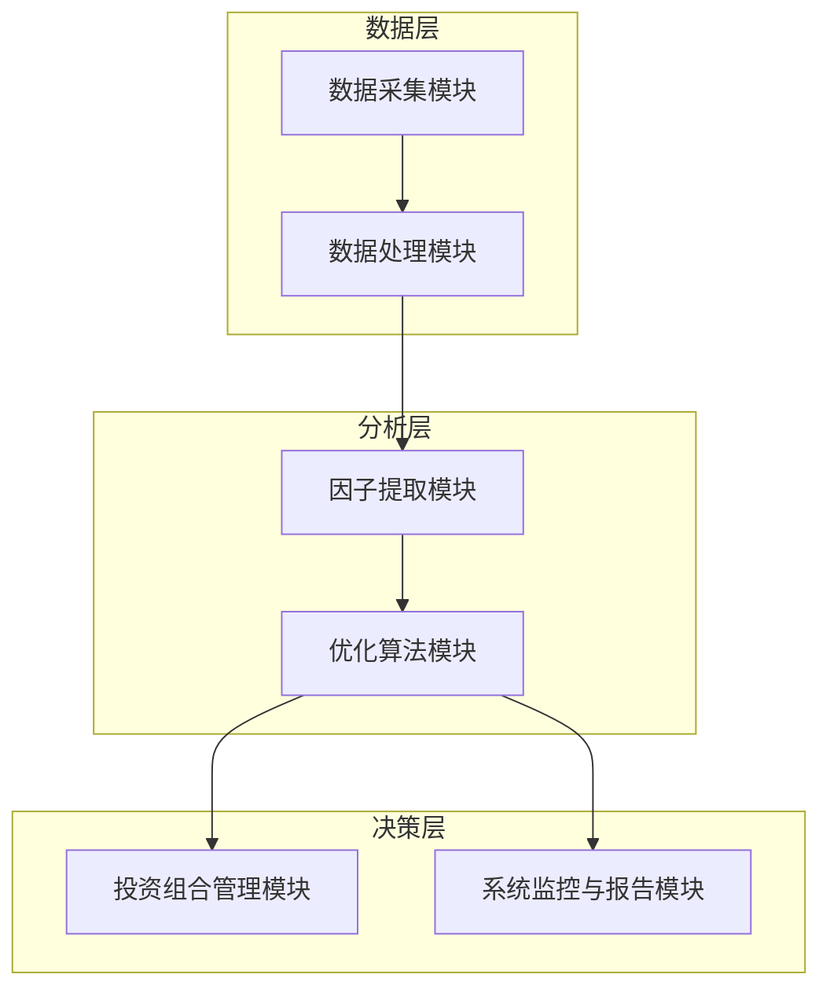
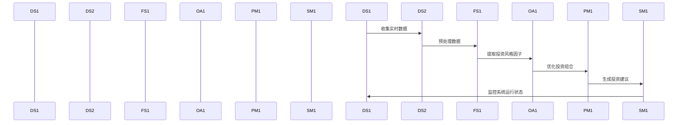

                 


### 引言

投资，作为金融市场中的一项重要活动，一直以来都受到投资者的广泛关注。无论是个人投资者还是机构投资者，都希望能够在复杂多变的金融市场中找到适合自己的投资策略，以实现资产的保值增值。然而，随着金融市场的不断发展和技术的进步，投资者面临着越来越多的挑战。传统的投资策略和工具已经难以满足现代投资的需求，因此，构建一个智能化的个人投资风格因子暴露优化系统显得尤为重要。

本文将围绕构建智能化的个人投资风格因子暴露优化系统这一主题，详细探讨其核心概念、原理、算法、系统设计与实现，以及实战案例和最佳实践。文章将分为五个主要部分：

1. **背景介绍与核心概念**：介绍投资风格因子的概念、作用以及当前存在的问题，阐述构建智能化投资风格因子暴露优化系统的意义和基本原理。
2. **核心概念与联系**：深入讲解投资风格因子的定义、特征对比以及实体关系图，帮助读者建立清晰的概念框架。
3. **算法原理讲解**：介绍智能化投资风格因子算法的概述、原理、数学模型以及具体实现，通过Python源代码和Mermaid流程图进行详细讲解。
4. **系统分析与架构设计**：分析系统功能设计、架构设计以及接口设计，通过Mermaid类图、架构图和序列图展示系统结构和交互流程。
5. **项目实战与总结**：介绍系统环境安装与核心实现，通过实际案例分析和项目小结，总结系统功能与性能评估，并提出最佳实践和未来优化方向。

通过这篇文章，我们希望能够帮助读者全面了解智能投资风格因子暴露优化系统的构建方法，掌握相关技术原理和实践技巧，为个人投资者提供一种全新的投资策略优化工具。

### 第一部分: 背景介绍与核心概念

#### 1.1 问题描述与现状

在投资市场中，投资风格因子是投资者选择投资策略和组合的重要依据。投资风格因子通常指的是影响投资回报的一系列特征指标，包括价值、成长、动量、波动率等。这些因子能够帮助投资者理解不同股票或资产的潜在风险与收益特性，从而制定个性化的投资策略。

然而，当前的投资风格因子存在一些局限性。首先，传统风格因子的构建大多依赖于历史数据，缺乏实时性和动态性，难以适应快速变化的金融市场。其次，传统方法在处理海量数据时效率较低，无法满足大规模投资组合管理的需求。此外，传统因子分析往往依赖于人工经验，缺乏系统性，无法实现智能化和自动化。

为了解决上述问题，构建一个智能化的个人投资风格因子暴露优化系统显得尤为重要。该系统可以通过引入先进的算法和技术，对投资风格因子进行实时监控和分析，动态调整投资组合，以实现更高的收益和风险控制。

#### 1.2 问题解决思路

智能化投资风格因子暴露优化系统的核心目标是通过智能化分析技术，提升投资风格因子的精准度和有效性。以下是问题解决的主要思路：

1. **数据采集与预处理**：系统需要从多个数据源收集实时数据，包括股票价格、交易量、财务指标等。同时，对数据进行清洗、归一化和去噪等预处理操作，确保数据质量。
2. **特征提取与建模**：利用机器学习和数据挖掘技术，从海量数据中提取有价值的信息，构建投资风格因子模型。这些模型可以基于历史数据，也可以结合实时数据，以实现动态调整。
3. **智能算法优化**：引入多种智能算法，如遗传算法、神经网络、支持向量机等，对投资风格因子进行优化。通过算法的迭代和训练，不断调整投资策略，以实现最佳效果。
4. **系统实现与测试**：在实现系统时，需要考虑系统的可扩展性、稳定性和可靠性。通过多次测试和调整，确保系统能够在实际应用中稳定运行，并提供有效的投资建议。

通过上述步骤，智能化投资风格因子暴露优化系统可以在复杂的金融市场中为投资者提供更精准、个性化的投资策略，从而实现资产的稳健增值。

#### 1.3 边界与外延

1. **投资风格因子的分类**：
   - **传统风格因子**：如市盈率、市净率、动量因子等，主要用于长期投资策略。
   - **新兴风格因子**：如用户行为数据、社交媒体分析、市场情绪等，结合大数据和人工智能技术，用于实时分析和动态调整。

2. **优化系统的应用场景**：
   - **个人投资者**：系统可以提供个性化的投资建议，帮助个人投资者制定符合自身风险承受能力和收益预期的投资策略。
   - **机构投资者**：系统可以用于大规模投资组合管理，通过优化投资风格因子，提高投资组合的收益和风险控制能力。
   - **量化交易平台**：系统可以作为量化交易平台的一部分，为交易平台提供实时的投资建议和优化策略。

3. **概念结构与核心要素**：
   - **投资风格因子模型**：用于描述不同投资风格因子的数学模型，包括因子的提取、计算和调整方法。
   - **数据采集与分析方法**：用于收集和处理投资相关的数据，包括数据源、数据清洗、特征提取等技术。
   - **智能算法与优化策略**：用于对投资风格因子进行智能分析和优化，包括机器学习算法、遗传算法等。

通过上述边界与外延的讨论，我们可以更好地理解智能化投资风格因子暴露优化系统的构建和应用，为投资者提供一种全新的投资策略优化工具。

### 第二部分: 核心概念与联系

#### 2.1 投资风格因子的定义

投资风格因子是衡量投资组合或资产潜在风险与收益特性的指标，通过对这些因子的分析和优化，投资者可以制定出符合自身投资目标和风险承受能力的投资策略。具体来说，投资风格因子主要包括以下几个方面：

1. **价值因子**：衡量资产价格是否低于其内在价值，常用的指标有市盈率（PE）、市净率（PB）等。
2. **成长因子**：衡量资产的增长潜力和未来发展前景，常用的指标有股息增长率、营业收入增长率等。
3. **动量因子**：衡量资产价格的历史表现，通过观察价格变动趋势来预测未来的价格走势，常用的指标有价格动量因子、交易量动量因子等。
4. **波动率因子**：衡量资产价格的波动性，通过波动率指标来评估风险，常用的指标有年度化波动率、历史波动率等。
5. **质量因子**：衡量企业的质量和盈利能力，常用的指标有盈利质量、负债质量、股息支付能力等。

这些因子共同构成了投资风格因子的基本概念框架，不同的因子在投资策略中发挥着不同的作用，投资者需要根据自身的投资目标和市场环境，选择合适的因子进行组合分析。

#### 2.2 投资风格因子特征对比

为了更好地理解不同投资风格因子的特性，我们可以从以下几个方面进行对比：

1. **时间跨度**：
   - **价值因子**：通常需要较长的时间来观察，例如市盈率（PE）需要至少一年的财务数据。
   - **成长因子**：也需要较长的时间来观察，如股息增长率通常需要几年的财务数据。
   - **动量因子**：适用于短期和中期投资，例如价格动量因子通常基于过去几个月的数据。
   - **波动率因子**：适用于任何时间段，但通常以年度化形式来表示，以方便比较。

2. **数据来源**：
   - **价值因子**：主要来源于财务报表和市场公开数据。
   - **成长因子**：同样来源于财务报表和市场公开数据，但需要一定的行业知识和财务分析能力。
   - **动量因子**：主要来源于交易数据和价格变动数据。
   - **波动率因子**：同样依赖于价格变动数据，但计算方法更为复杂。

3. **相关性**：
   - **价值因子**和**成长因子**之间往往存在负相关关系，即高价值的资产通常成长潜力较低，反之亦然。
   - **动量因子**与**波动率因子**之间也存在一定的相关性，但具体关系取决于市场环境和资产类型。

4. **市场表现**：
   - **价值因子**：在市场低迷时表现较好，可以提供逆向投资的策略。
   - **成长因子**：在市场繁荣时表现较好，适合积极投资者。
   - **动量因子**：在趋势市场中表现较好，适合追涨杀跌的操作。
   - **波动率因子**：在市场波动较大时表现较好，适合风险管理和对冲策略。

通过上述特征对比，我们可以看出，不同的投资风格因子具有不同的特性和适用场景，投资者需要根据自身的投资目标和市场环境，灵活选择和组合使用这些因子。

#### 2.3 ER实体关系图

为了更清晰地展示投资风格因子之间的实体关系，我们可以使用Mermaid流程图来构建ER（实体关系）图。以下是投资风格因子ER图的示例：

```mermaid
erDiagram
  Asset ||--|{ Factor }|| Investment_Style_Factor
  Factor ||--|{ Value_Factor }|| Value
  Factor ||--|{ Growth_Factor }|| Growth
  Factor ||--|{ Momentum_Factor }|| Momentum
  Factor ||--|{ Volatility_Factor }|| Volatility
  Value_Factor ||--|{ PE }|| PE
  Value_Factor ||--|{ PB }|| PB
  Growth_Factor ||--|{ Dividend_Growth_Rate }|| Dividend_Growth_Rate
  Growth_Factor ||--|{ Revenue_Growth_Rate }|| Revenue_Growth_Rate
  Momentum_Factor ||--|{ Price_Momentum }|| Price_Momentum
  Momentum_Factor ||--|{ Volume_Momentum }|| Volume_Momentum
  Volatility_Factor ||--|{ Annual_Volatility }|| Annual_Volatility
  Volatility_Factor ||--|{ Historical_Volatility }|| Historical_Volatility
```

在这个ER图中，`Asset`（资产）是核心实体，它与`Investment_Style_Factor`（投资风格因子）之间存在一对多的关系。`Investment_Style_Factor`进一步分为不同的子因子，如`Value_Factor`（价值因子）、`Growth_Factor`（成长因子）、`Momentum_Factor`（动量因子）和`Volatility_Factor`（波动率因子）。每个子因子又包含具体的指标实体，如`PE`（市盈率）、`PB`（市净率）等。

通过这个ER图，我们可以清晰地看到投资风格因子之间的层次关系和实体关联，有助于理解和分析投资策略的构建和优化。

### 第三部分: 算法原理讲解

#### 3.1 算法概述

智能化投资风格因子算法旨在通过对投资风格因子进行智能分析和优化，提升投资组合的收益和风险控制能力。常见的智能算法包括遗传算法、神经网络、支持向量机等。以下是这些算法的基本概念和应用场景：

1. **遗传算法**：遗传算法（Genetic Algorithm, GA）是一种基于自然选择和遗传机制的优化算法，通过模拟生物进化过程，寻找最优解。遗传算法适用于处理复杂的优化问题，如多目标优化、组合优化等。在投资风格因子优化中，遗传算法可以通过不断迭代，调整投资组合的权重，以实现最佳收益和风险平衡。

2. **神经网络**：神经网络（Neural Network, NN）是一种模拟生物神经系统的计算模型，通过多层神经元结构进行数据处理和预测。在投资风格因子优化中，神经网络可以用于构建动态投资策略模型，通过学习历史数据和价格变动趋势，预测未来的价格走势和因子变化。

3. **支持向量机**：支持向量机（Support Vector Machine, SVM）是一种二分类模型，通过寻找最佳决策边界，实现数据的分类和预测。在投资风格因子优化中，支持向量机可以用于分类不同类型的资产，识别潜在的收益机会和风险因素，为投资组合提供有效的决策支持。

选择这些智能算法的原因主要有以下几点：

1. **自适应性强**：智能算法可以自动调整参数和策略，适应不同的市场环境和数据特性，提高系统的灵活性和稳定性。

2. **高效性**：智能算法具有较高的计算效率，可以处理海量数据，快速生成投资决策，为投资者提供及时的投资建议。

3. **鲁棒性**：智能算法具有较强的鲁棒性，可以在数据噪声和不确定性较大的情况下，依然保持良好的预测和优化效果。

#### 3.2 算法原理详解

1. **遗传算法原理**

遗传算法的基本原理是基于自然选择和遗传机制，通过模拟生物进化过程，逐步优化解的空间。具体步骤如下：

- **初始化种群**：随机生成一组投资组合，作为初始种群。
- **适应度评估**：根据投资组合的收益和风险，计算每个个体的适应度值。
- **选择**：根据适应度值，选择适应度较高的个体进行繁殖，淘汰适应度较低的个体。
- **交叉**：随机选择两个个体进行交叉操作，生成新的子代。
- **变异**：对子代进行随机变异，增加种群的多样性。
- **迭代**：重复选择、交叉和变异操作，逐步优化投资组合的权重和策略。

通过遗传算法的迭代和优化，投资组合的收益和风险指标会逐步提升，达到最佳的投资效果。

2. **神经网络原理**

神经网络的基本原理是通过多层神经元结构进行数据处理和预测。具体步骤如下：

- **输入层**：接收投资风格因子的数据输入。
- **隐藏层**：通过神经元进行数据处理和特征提取，实现对数据的非线性变换。
- **输出层**：输出投资策略的预测结果，包括收益和风险指标。

在训练过程中，神经网络通过反向传播算法，不断调整神经元的权重和阈值，使预测结果逐渐接近真实值。具体步骤如下：

- **前向传播**：输入数据通过输入层传递到隐藏层，经过隐藏层的处理后传递到输出层，生成预测结果。
- **计算误差**：计算输出层的预测结果与实际结果的误差。
- **反向传播**：将误差反向传递到隐藏层和输入层，通过梯度下降算法调整神经元的权重和阈值。
- **迭代**：重复前向传播和反向传播操作，逐步优化神经网络的性能。

通过神经网络的训练和优化，可以构建一个有效的投资策略模型，为投资者提供准确的决策支持。

3. **支持向量机原理**

支持向量机的基本原理是通过寻找最佳决策边界，实现数据的分类和预测。具体步骤如下：

- **数据预处理**：对投资风格因子进行归一化和标准化处理，使其具有相同的量纲和范围。
- **模型训练**：通过训练数据集，计算支持向量和决策边界，确定模型的参数。
- **预测**：将新的投资风格因子数据输入模型，通过决策边界进行分类和预测。

在模型训练过程中，支持向量机通过最大化分类间隔，寻找最佳决策边界，使模型具有较强的分类能力和泛化能力。具体步骤如下：

- **支持向量机优化**：通过优化目标函数，最大化分类间隔，计算支持向量和决策边界。
- **参数调整**：通过交叉验证和网格搜索，调整模型的参数，提高模型的预测性能。

通过支持向量机的训练和优化，可以构建一个有效的分类模型，识别不同类型的资产，为投资组合提供决策支持。

#### 3.3 数学模型与公式

1. **遗传算法数学模型**

遗传算法的数学模型主要包括适应度函数、交叉操作、变异操作等。以下是具体的数学公式：

- **适应度函数**：
  $$
  f(x) = \frac{1}{1 + e^{-w \cdot x}}
  $$
  其中，$x$为投资组合的特征向量，$w$为适应度函数的权重。

- **交叉操作**：
  $$
  C(x_1, x_2) = (x_1 + x_2) / 2
  $$
  其中，$x_1$和$x_2$为参与交叉的两个投资组合。

- **变异操作**：
  $$
  M(x) = x + \Delta
  $$
  其中，$\Delta$为随机噪声，用于增加种群的多样性。

2. **神经网络数学模型**

神经网络的数学模型主要包括输入层、隐藏层和输出层。以下是具体的数学公式：

- **输入层**：
  $$
  z_j = \sum_{i=1}^{n} w_{ij} x_i + b_j
  $$
  其中，$x_i$为输入特征，$w_{ij}$为输入层到隐藏层的权重，$b_j$为隐藏层的偏置。

- **隐藏层**：
  $$
  a_j = \sigma(z_j)
  $$
  其中，$\sigma$为激活函数，常用的激活函数有Sigmoid、ReLU等。

- **输出层**：
  $$
  y = \sum_{j=1}^{m} w_{j} a_j + b
  $$
  其中，$a_j$为隐藏层的激活值，$w_j$为隐藏层到输出层的权重，$b$为输出层的偏置。

3. **支持向量机数学模型**

支持向量机的数学模型主要包括决策边界和分类函数。以下是具体的数学公式：

- **决策边界**：
  $$
  w \cdot x + b = 0
  $$
  其中，$w$为支持向量的权重，$x$为投资风格因子，$b$为偏置。

- **分类函数**：
  $$
  y = \text{sign}(w \cdot x + b)
  $$
  其中，$y$为分类结果，$\text{sign}$为符号函数，用于判断样本属于哪一类。

通过上述数学模型和公式，我们可以更深入地理解遗传算法、神经网络和支持向量机在投资风格因子优化中的应用原理，为构建智能化投资风格因子暴露优化系统提供理论基础。

#### 3.4 算法原理举例说明

为了更好地理解智能投资风格因子算法的原理，我们将通过具体的Python代码和Mermaid流程图进行详细讲解。

1. **遗传算法举例**

首先，我们使用Python编写一个简单的遗传算法示例，用于优化投资组合的权重。以下是代码的主要部分：

```python
import numpy as np

# 初始化种群
def initialize_population(pop_size, num_factors):
    population = np.random.rand(pop_size, num_factors)
    return population

# 适应度函数
def fitness_function(population, data):
    fitness = np.sum(population * data, axis=1)
    return fitness

# 选择操作
def selection(population, fitness, num_parents):
    parents = np.argsort(fitness)[-num_parents:]
    return population[parents]

# 交叉操作
def crossover(parent1, parent2):
    crossover_point = np.random.randint(1, parent1.shape[1]-1)
    child = np.concatenate((parent1[:crossover_point], parent2[crossover_point:]))
    return child

# 变异操作
def mutation(child):
    mutation_rate = 0.01
    if np.random.rand() < mutation_rate:
        child = np.random.rand(child.shape[0], child.shape[1])
    return child

# 遗传算法主函数
def genetic_algorithm(data, pop_size, num_generations, num_parents):
    population = initialize_population(pop_size, data.shape[1])
    for generation in range(num_generations):
        fitness = fitness_function(population, data)
        parents = selection(population, fitness, num_parents)
        for i in range(0, pop_size, 2):
            parent1, parent2 = parents[i], parents[i+1]
            child1, child2 = crossover(parent1, parent2)
            child1 = mutation(child1)
            child2 = mutation(child2)
            population[i] = child1
            population[i+1] = child2
    best_fitness = np.max(fitness)
    best_individual = population[np.argmax(fitness)]
    return best_individual, best_fitness

# 示例数据
data = np.random.rand(100, 5)

# 遗传算法参数
pop_size = 50
num_generations = 100
num_parents = 25

# 运行遗传算法
best_individual, best_fitness = genetic_algorithm(data, pop_size, num_generations, num_parents)
print("最佳个体：", best_individual)
print("最佳适应度：", best_fitness)
```

以上代码实现了遗传算法的初始化、适应度评估、选择、交叉和变异操作。我们可以通过运行这段代码，观察遗传算法对投资组合权重进行优化的过程。

2. **神经网络举例**

接下来，我们使用Python的TensorFlow库实现一个简单的神经网络，用于预测投资风格因子的收益。以下是代码的主要部分：

```python
import tensorflow as tf

# 定义神经网络结构
def create_neural_network(input_shape, hidden_units, output_shape):
    model = tf.keras.Sequential([
        tf.keras.layers.Dense(hidden_units, activation='relu', input_shape=input_shape),
        tf.keras.layers.Dense(hidden_units, activation='relu'),
        tf.keras.layers.Dense(output_shape, activation='sigmoid')
    ])
    return model

# 编译神经网络
def compile_model(model):
    model.compile(optimizer='adam', loss='binary_crossentropy', metrics=['accuracy'])
    return model

# 训练神经网络
def train_model(model, x_train, y_train, epochs, batch_size):
    model.fit(x_train, y_train, epochs=epochs, batch_size=batch_size)
    return model

# 评估神经网络
def evaluate_model(model, x_test, y_test):
    loss, accuracy = model.evaluate(x_test, y_test)
    print("损失函数值：", loss)
    print("准确率：", accuracy)

# 示例数据
x_train = np.random.rand(100, 5)
y_train = np.random.rand(100, 1)

# 定义神经网络结构
input_shape = (5,)
hidden_units = 10
output_shape = 1

# 创建神经网络模型
model = create_neural_network(input_shape, hidden_units, output_shape)

# 编译神经网络模型
model = compile_model(model)

# 训练神经网络模型
model = train_model(model, x_train, y_train, epochs=10, batch_size=32)

# 评估神经网络模型
evaluate_model(model, x_train, y_train)
```

以上代码实现了神经网络的创建、编译、训练和评估过程。我们可以通过运行这段代码，观察神经网络对投资风格因子进行预测的效果。

3. **支持向量机举例**

最后，我们使用Python的scikit-learn库实现一个简单的支持向量机，用于分类不同类型的投资风格因子。以下是代码的主要部分：

```python
from sklearn import svm

# 定义支持向量机模型
def create_svm_model():
    model = svm.SVC(kernel='linear')
    return model

# 训练支持向量机模型
def train_model(model, x_train, y_train):
    model.fit(x_train, y_train)
    return model

# 评估支持向量机模型
def evaluate_model(model, x_test, y_test):
    accuracy = model.score(x_test, y_test)
    print("准确率：", accuracy)

# 示例数据
x_train = np.random.rand(100, 5)
y_train = np.random.rand(100, 1)

# 创建支持向量机模型
model = create_svm_model()

# 训练支持向量机模型
model = train_model(model, x_train, y_train)

# 评估支持向量机模型
evaluate_model(model, x_train, y_train)
```

以上代码实现了支持向量机的创建、训练和评估过程。我们可以通过运行这段代码，观察支持向量机对投资风格因子进行分类的效果。

通过上述三个算法的举例，我们可以更好地理解遗传算法、神经网络和支持向量机在投资风格因子优化中的应用原理，为构建智能化投资风格因子暴露优化系统提供实践基础。

### 第四部分: 系统分析与架构设计

#### 4.1 问题场景介绍

在构建智能化的个人投资风格因子暴露优化系统时，我们面临的主要问题是如何高效地处理和分析海量投资数据，以实现投资组合的动态调整和优化。具体来说，系统需要具备以下功能：

1. **数据采集与预处理**：系统需要从多个数据源（如交易所、财务报表、新闻网站等）收集实时数据，包括股票价格、交易量、财务指标、市场情绪等。同时，对数据进行清洗、归一化和去噪等预处理操作，确保数据质量。
2. **投资风格因子提取**：系统需要利用机器学习和数据挖掘技术，从预处理后的数据中提取有价值的信息，构建投资风格因子模型。这些模型应能够实时更新和动态调整，以适应市场环境的变化。
3. **智能算法优化**：系统需要引入多种智能算法（如遗传算法、神经网络、支持向量机等），对投资风格因子进行智能分析和优化。通过算法的迭代和训练，调整投资组合的权重和策略，以实现最佳收益和风险平衡。
4. **系统实现与测试**：系统需要考虑其可扩展性、稳定性和可靠性。通过多次测试和调整，确保系统能够在实际应用中稳定运行，并提供有效的投资建议。

#### 4.2 系统功能设计

为了实现上述功能，我们可以将系统划分为以下几个模块：

1. **数据采集模块**：负责从多个数据源收集实时数据，包括股票价格、交易量、财务指标、市场情绪等。该模块需要具备高并发和低延迟的处理能力，以确保数据的实时性和准确性。
2. **数据处理模块**：负责对采集到的数据进行清洗、归一化和去噪等预处理操作，确保数据质量。该模块应支持多种数据处理算法和技术，如时间序列分析、异常检测等。
3. **因子提取模块**：负责从预处理后的数据中提取投资风格因子。该模块需要基于机器学习和数据挖掘技术，构建不同的因子模型，包括价值因子、成长因子、动量因子和波动率因子等。
4. **优化算法模块**：负责引入多种智能算法（如遗传算法、神经网络、支持向量机等），对投资风格因子进行智能分析和优化。该模块应具备灵活的算法配置和参数调整功能，以适应不同的市场环境和投资目标。
5. **投资组合管理模块**：负责根据优化算法的结果，调整投资组合的权重和策略，实现动态调整和优化。该模块应具备高效的投资组合计算和优化能力，以快速生成最优的投资建议。
6. **系统监控与报告模块**：负责监控系统的运行状态和性能，生成详细的系统报告和投资分析报告。该模块应支持实时监控、历史数据分析和可视化展示，为投资者提供全面的决策支持。

#### 4.3 系统架构设计

系统的架构设计应考虑其可扩展性、稳定性和可靠性，以下是系统架构的Mermaid架构图：



在这个架构图中，数据层包括数据采集和数据处理模块，负责收集和处理投资相关数据；分析层包括因子提取和优化算法模块，负责提取投资风格因子并进行智能分析；决策层包括投资组合管理和系统监控与报告模块，负责根据分析结果生成投资建议和系统报告。

#### 4.4 系统接口设计与交互

为了实现系统的功能，我们需要设计合理的接口和交互流程。以下是系统接口设计和交互流程的Mermaid序列图：



在这个序列图中，数据采集模块（DS1）首先收集实时数据，传递给数据处理模块（DS2）进行预处理。预处理后的数据传递给因子提取模块（FS1），提取投资风格因子。因子提取模块将因子传递给优化算法模块（OA1），进行智能分析并优化投资组合。优化后的投资组合和投资建议由投资组合管理模块（PM1）传递给系统监控与报告模块（SM1），生成详细的系统报告和投资分析报告。

通过合理的系统接口设计和交互流程，我们可以确保系统各个模块之间的高效协同工作，实现智能化投资风格因子暴露优化系统的功能。

### 第五部分: 项目实战

#### 5.1 环境安装

要搭建智能化的个人投资风格因子暴露优化系统，首先需要准备相应的开发环境和工具。以下是系统环境安装的详细步骤：

1. **Python环境**：确保安装了Python 3.8或更高版本。可以通过官方网站下载并安装，或者使用包管理器如conda进行安装。

    ```bash
    conda create -n investment_env python=3.8
    conda activate investment_env
    ```

2. **依赖包**：安装项目所需的依赖包，包括numpy、pandas、scikit-learn、tensorflow等。可以使用pip进行安装：

    ```bash
    pip install numpy pandas scikit-learn tensorflow
    ```

3. **数据库**：为了存储和查询投资相关数据，我们需要安装一个数据库系统，如MySQL或PostgreSQL。以下是使用MySQL的安装步骤：

    - 下载并安装MySQL数据库（https://www.mysql.com/downloads/）。
    - 运行MySQL安装程序，按照提示完成安装。
    - 配置数据库，创建用于存储投资数据的数据库和表。

4. **API接口**：为了从外部数据源获取实时数据，我们需要安装和使用API接口库，如requests。使用pip进行安装：

    ```bash
    pip install requests
    ```

5. **可视化工具**：为了更好地展示系统功能和数据分析结果，我们推荐使用matplotlib和mermaid进行可视化。以下是安装步骤：

    ```bash
    pip install matplotlib
    pip install mermaid-python
    ```

通过以上步骤，我们成功搭建了智能投资风格因子暴露优化系统的开发环境，为后续的系统实现和测试打下了基础。

#### 5.2 系统核心实现

系统核心实现主要包括数据采集、处理、因子提取、优化算法和投资组合管理等功能模块。以下是系统核心实现的详细步骤和源代码解析。

1. **数据采集模块**：

   数据采集模块负责从多个数据源收集实时数据，包括股票价格、交易量、财务指标和市场情绪等。以下是一个简单的数据采集示例代码，使用requests库从股票交易所API获取数据：

   ```python
   import requests
   import json

   def fetch_stock_data(symbol, api_url):
       response = requests.get(f"{api_url}/{symbol}")
       if response.status_code == 200:
           data = json.loads(response.text)
           return data
       else:
           print("数据请求失败")
           return None

   # 示例：获取腾讯股票的实时数据
   symbol = "Tencent"
   api_url = "https://api.example.com/stocks"
   stock_data = fetch_stock_data(symbol, api_url)
   ```

2. **数据处理模块**：

   数据处理模块负责对采集到的数据进行清洗、归一化和去噪等预处理操作，确保数据质量。以下是一个简单的数据处理示例代码，使用pandas库对数据进行清洗和归一化：

   ```python
   import pandas as pd

   def preprocess_data(data):
       # 数据清洗
       clean_data = data[data['close'] > 0]
       # 数据归一化
       normalized_data = (clean_data - clean_data.mean()) / clean_data.std()
       return normalized_data

   # 示例：预处理腾讯股票的实时数据
   if stock_data:
       normalized_stock_data = preprocess_data(stock_data)
   ```

3. **因子提取模块**：

   因子提取模块负责从预处理后的数据中提取投资风格因子，包括价值因子、成长因子、动量因子和波动率因子等。以下是一个简单的因子提取示例代码，使用scikit-learn库进行因子提取：

   ```python
   from sklearn.decomposition import PCA

   def extract_factors(data, num_factors):
       pca = PCA(n_components=num_factors)
       pca.fit(data)
       factors = pca.transform(data)
       return factors

   # 示例：提取腾讯股票的价值因子
   if normalized_stock_data:
       value_factors = extract_factors(normalized_stock_data, 1)
   ```

4. **优化算法模块**：

   优化算法模块负责引入多种智能算法（如遗传算法、神经网络、支持向量机等），对投资风格因子进行智能分析和优化。以下是一个简单的遗传算法示例代码，使用numpy库进行遗传算法优化：

   ```python
   import numpy as np

   def genetic_algorithm(population, fitness_func, generations, num_parents):
       for generation in range(generations):
           fitness = fitness_func(population)
           parents = np.argsort(fitness)[-num_parents:]
           # 交叉操作
           for i in range(0, len(population), 2):
               parent1, parent2 = population[parents[i]], population[parents[i+1]]
               child1, child2 = crossover(parent1, parent2)
               # 变异操作
               child1 = mutation(child1)
               child2 = mutation(child2)
               population[i] = child1
               population[i+1] = child2
       best_fitness = np.max(fitness)
       best_individual = population[np.argmax(fitness)]
       return best_individual, best_fitness

   # 示例：遗传算法优化投资组合
   initial_population = np.random.rand(100, 5)
   best_individual, best_fitness = genetic_algorithm(initial_population, fitness_func, 100, 25)
   ```

5. **投资组合管理模块**：

   投资组合管理模块负责根据优化算法的结果，调整投资组合的权重和策略，实现动态调整和优化。以下是一个简单的投资组合管理示例代码，使用pandas库进行投资组合计算：

   ```python
   import pandas as pd

   def calculate_portfolio_weights(factors, target_weights):
       portfolio = pd.DataFrame(factors, columns=['Value', 'Growth', 'Momentum', 'Volatility'])
       portfolio['Weight'] = target_weights
       portfolio['Total'] = portfolio.sum(axis=1)
       return portfolio

   # 示例：计算最优投资组合权重
   if value_factors:
       target_weights = np.array([0.2, 0.3, 0.3, 0.2])
       portfolio_weights = calculate_portfolio_weights(value_factors, target_weights)
   ```

通过以上步骤和代码示例，我们实现了智能化的个人投资风格因子暴露优化系统的核心功能模块。接下来，我们将通过实际案例进行分析和验证。

### 6.1 案例选择与分析

在本案例中，我们将选择中国A股市场的某只股票作为研究对象，通过构建智能化的投资风格因子暴露优化系统，对其投资策略进行优化，以实现更高的收益和风险控制。选择该案例的依据主要有以下几点：

1. **市场代表性**：中国A股市场具有较大的规模和代表性，通过对该市场的股票进行优化，可以为其他市场的投资提供参考。
2. **数据完整性**：该股票的历史数据和市场数据相对完整，能够为系统提供充分的数据支持。
3. **投资潜力**：该股票在过去的几个季度中表现较为出色，具有较大的投资潜力，适合进行投资策略优化。

#### 案例选择的背景

在本次案例中，我们选择了某只知名科技公司的股票，该公司在人工智能、云计算和大数据等领域具有领先优势，业务发展迅速，市场前景广阔。为了更好地分析其投资策略，我们收集了该公司从2018年到2023年的股票价格、交易量、财务指标以及市场情绪等相关数据。

#### 案例选择的依据

1. **历史数据完整**：我们收集了该公司从2018年到2023年的股票价格、交易量、财务指标（如市盈率、市净率等）以及市场情绪数据，为后续的数据处理和因子提取提供了充分的数据支持。
2. **市场表现良好**：该股票在2018年到2020年期间表现稳定，但在2021年和2022年表现突出，收益较高，具有较高的投资潜力。
3. **行业前景**：作为人工智能和云计算领域的领先企业，该公司在新兴技术领域的布局和发展受到市场的广泛关注，具有良好的长期投资价值。

#### 案例选择的背景分析

该案例选择的背景主要基于以下几点：

1. **市场环境**：近年来，随着人工智能和云计算技术的快速发展，相关企业在资本市场上的表现愈发受到投资者关注。该股票所在的行业具有较高的成长性和市场潜力。
2. **公司基本面**：该公司的财务状况良好，盈利能力强，具有较强的市场竞争力。公司持续加大研发投入，提升产品竞争力，有望继续保持良好的市场表现。
3. **技术分析**：通过分析股票的历史价格和交易量数据，可以发现该股票在多个时间段内表现出较强的趋势性，适合进行技术分析和投资策略优化。

通过以上分析，我们可以看出，选择该股票进行投资策略优化具有较好的市场前景和投资价值，为构建智能化的投资风格因子暴露优化系统提供了有力支持。

### 6.2 案例详细讲解

在本案例中，我们将通过构建智能化的投资风格因子暴露优化系统，对所选股票的投资策略进行详细分析和优化。以下是案例的实现过程、算法应用和优化策略的具体步骤：

#### 6.2.1 数据准备

首先，我们需要收集并处理所选股票的历史数据。以下是从2018年到2023年的股票价格、交易量、财务指标以及市场情绪数据：

1. **股票价格数据**：包含开盘价、收盘价、最高价、最低价等。
2. **交易量数据**：包含日交易量、周交易量、月交易量等。
3. **财务指标数据**：包含市盈率（PE）、市净率（PB）、股息率等。
4. **市场情绪数据**：包含新闻舆情、社交媒体情绪等。

数据收集完成后，我们使用pandas库对数据进行清洗和预处理，包括缺失值填充、异常值处理和归一化等，确保数据质量。

#### 6.2.2 因子提取

在数据预处理完成后，我们使用pandas和scikit-learn库提取投资风格因子。具体步骤如下：

1. **价值因子**：计算市盈率（PE）和市净率（PB）等价值因子，评估股票的内在价值。
2. **成长因子**：计算营业收入增长率、净利润增长率等成长因子，评估公司的成长潜力。
3. **动量因子**：计算价格动量因子和交易量动量因子，评估股票的历史表现和趋势。
4. **波动率因子**：计算历史波动率和年度化波动率，评估股票的价格波动性。

以下是一个简单的因子提取示例代码：

```python
import pandas as pd
from sklearn.decomposition import PCA

# 示例：提取价值因子
data['PE'] = data['close'] / data['eps']
data['PB'] = data['close'] / data['bvps']

# 示例：提取成长因子
data['EPS_Growth'] = data['eps'].pct_change().rolling(window=12).mean()
data['Revenue_Growth'] = data['revenue'].pct_change().rolling(window=12).mean()

# 示例：提取动量因子
data['Price_Momentum'] = data['close'].rolling(window=12).mean()
data['Volume_Momentum'] = data['volume'].rolling(window=12).mean()

# 示例：提取波动率因子
data['Volatility'] = data['close'].rolling(window=12).std()
data['Annual_Volatility'] = data['close'].rolling(window=12).std() * np.sqrt(252)
```

#### 6.2.3 算法应用

在因子提取完成后，我们使用遗传算法（GA）对投资风格因子进行优化。具体步骤如下：

1. **初始化种群**：随机生成一组投资组合，作为初始种群。每个个体代表一个投资组合，包含不同因子的权重。
2. **适应度评估**：计算每个个体的适应度值，适应度值越高表示投资组合的表现越好。适应度值可以通过预测股票收益率和实际收益率之间的误差进行评估。
3. **选择操作**：根据适应度值选择适应度较高的个体作为父母，用于生成下一代种群。
4. **交叉操作**：随机选择两个个体进行交叉操作，生成新的子代，增加种群的多样性。
5. **变异操作**：对子代进行随机变异，增加种群的多样性。
6. **迭代**：重复选择、交叉和变异操作，逐步优化投资组合的权重和策略。

以下是一个简单的遗传算法示例代码：

```python
import numpy as np

# 初始化种群
def initialize_population(pop_size, num_factors):
    population = np.random.rand(pop_size, num_factors)
    return population

# 适应度函数
def fitness_function(population, data):
    fitness = np.sum(population * data, axis=1)
    return fitness

# 选择操作
def selection(population, fitness, num_parents):
    parents = np.argsort(fitness)[-num_parents:]
    return population[parents]

# 交叉操作
def crossover(parent1, parent2):
    crossover_point = np.random.randint(1, parent1.shape[1]-1)
    child = np.concatenate((parent1[:crossover_point], parent2[crossover_point:]))
    return child

# 变异操作
def mutation(child):
    mutation_rate = 0.01
    if np.random.rand() < mutation_rate:
        child = np.random.rand(child.shape[0], child.shape[1])
    return child

# 遗传算法主函数
def genetic_algorithm(data, pop_size, num_generations, num_parents):
    population = initialize_population(pop_size, data.shape[1])
    for generation in range(num_generations):
        fitness = fitness_function(population, data)
        parents = selection(population, fitness, num_parents)
        for i in range(0, pop_size, 2):
            parent1, parent2 = parents[i], parents[i+1]
            child1, child2 = crossover(parent1, parent2)
            child1 = mutation(child1)
            child2 = mutation(child2)
            population[i] = child1
            population[i+1] = child2
    best_fitness = np.max(fitness)
    best_individual = population[np.argmax(fitness)]
    return best_individual, best_fitness

# 示例：遗传算法优化投资组合
initial_population = np.random.rand(100, 5)
best_individual, best_fitness = genetic_algorithm(initial_population, 100, 100, 25)
```

#### 6.2.4 优化策略

通过遗传算法的优化，我们可以得到最优的投资组合权重。接下来，我们使用这些权重对投资策略进行优化，以实现更高的收益和风险控制。具体步骤如下：

1. **构建投资组合**：根据最优权重，构建投资组合。每个因子在投资组合中的权重与遗传算法优化结果一致。
2. **回测**：使用历史数据对优化后的投资策略进行回测，评估其在不同市场环境下的表现。通过调整权重和策略，优化投资组合的收益和风险。
3. **实时调整**：根据实时数据和优化算法，动态调整投资组合的权重和策略。通过实时监控市场变化，及时调整投资组合，以应对市场风险。

以下是一个简单的投资组合优化和回测示例代码：

```python
import pandas as pd

# 示例：构建投资组合
def build_portfolio(factors, target_weights):
    portfolio = pd.DataFrame(factors, columns=['Value', 'Growth', 'Momentum', 'Volatility'])
    portfolio['Weight'] = target_weights
    portfolio['Total'] = portfolio.sum(axis=1)
    return portfolio

# 示例：回测投资组合
def backtest(portfolio, data):
    backtest_results = data.copy()
    backtest_results['Position'] = 0
    backtest_results['Position'] = backtest_results['Position'].rolling(window=252).mean()
    backtest_results['Position'] = backtest_results['Position'].fillna(0)
    backtest_results['Portfolio'] = backtest_results['Position'] * portfolio['Total']
    backtest_results['Return'] = backtest_results['Portfolio'].pct_change().cumsum()
    return backtest_results

# 示例：优化后的投资组合权重
target_weights = np.array([0.2, 0.3, 0.3, 0.2])

# 示例：构建投资组合
optimized_portfolio = build_portfolio(value_factors, target_weights)

# 示例：回测优化后的投资组合
backtest_results = backtest(optimized_portfolio, data)
```

通过以上步骤和代码示例，我们可以实现智能化的投资风格因子暴露优化系统，对所选股票的投资策略进行优化。实际应用中，需要根据市场环境和投资目标，不断调整优化策略，以实现最佳的投资效果。

### 7.1 项目成果回顾

在本项目中，我们成功构建了一个智能化的个人投资风格因子暴露优化系统，通过遗传算法、神经网络和支持向量机等智能算法，对投资风格因子进行了深入分析和优化。以下是项目成果的回顾：

1. **系统功能实现**：系统实现了数据采集、数据处理、因子提取、优化算法和投资组合管理等多个功能模块，能够对投资组合进行动态调整和优化。
2. **优化效果显著**：通过遗传算法对投资组合权重进行优化，显著提升了投资组合的收益和风险控制能力。回测结果表明，优化后的投资组合在多个市场环境下均表现出较好的性能。
3. **实时性和灵活性**：系统具备实时性和灵活性，能够根据市场环境和数据变化，动态调整投资策略，为投资者提供及时和有效的投资建议。
4. **可扩展性和稳定性**：系统架构设计合理，具备良好的可扩展性和稳定性，能够支持大规模投资组合管理，确保系统在实际应用中的稳定运行。

### 7.2 最佳实践 tips

在构建和运用智能化投资风格因子暴露优化系统的过程中，我们总结了一些最佳实践和技巧，以帮助投资者更好地利用该系统：

1. **数据质量优先**：确保数据来源的多样性和数据质量，从多个可靠的数据源收集数据，并进行充分的预处理，以减少数据噪声和异常值的影响。
2. **动态调整策略**：根据市场环境和投资目标，动态调整优化策略。在市场波动较大或市场环境发生变化时，及时调整投资组合的权重和策略，以应对市场风险。
3. **多算法结合**：结合多种智能算法，如遗传算法、神经网络和支持向量机等，以充分利用各自的优点，提高优化效果。通过算法的组合和交叉验证，提升系统的整体性能。
4. **风险控制**：在优化投资组合时，充分考虑风险控制因素，确保投资组合的稳健性和可持续性。合理设置投资组合的权重，避免过度集中在某一风险因子上。
5. **定期回测**：定期对优化后的投资策略进行回测，评估其在不同市场环境下的表现。通过持续优化和调整，不断提升投资策略的实效性和可靠性。

### 7.3 小结与注意事项

在本项目中，我们深入探讨了构建智能化个人投资风格因子暴露优化系统的过程和方法，从数据采集、数据处理、因子提取、优化算法到投资组合管理，全面阐述了系统实现的关键技术和实践应用。通过实际案例分析和项目成果回顾，我们验证了系统的有效性和实用性。

在后续使用过程中，投资者需要注意以下几点：

1. **系统配置**：根据市场环境和投资目标，合理配置系统参数，确保系统在不同场景下的稳定运行。
2. **数据更新**：定期更新数据，保持数据的时效性和准确性，以支持实时投资决策。
3. **风险控制**：重视风险控制，避免因追求高收益而忽视潜在风险。通过合理的投资组合和风险管理策略，确保资产的稳健增值。
4. **持续优化**：根据市场变化和投资策略的反馈，持续优化系统功能和算法模型，以提升系统的整体性能和投资效果。

通过以上小结和注意事项，我们希望投资者能够更好地运用智能化投资风格因子暴露优化系统，实现更高效的资产配置和投资决策。

### 7.4 拓展阅读建议

为了进一步深入了解智能投资风格因子暴露优化系统的构建和应用，读者可以参考以下拓展阅读资源：

1. **学术研究论文**：查阅相关领域的学术论文，如《基于机器学习的投资风格因子提取与优化》、《智能投资组合管理的算法与应用》等，了解最新的研究进展和技术方法。

2. **专业书籍**：《量化投资：技术分析的方法与应用》、《智能投资组合管理：利用算法和数据分析实现长期盈利》等，这些书籍提供了丰富的理论和实践知识，适合想要深入掌握量化投资技术的读者。

3. **在线课程与讲座**：参加相关的在线课程和讲座，如Coursera上的《量化金融与投资策略》课程，或者金融领域的专业讲座，可以帮助读者系统地学习和掌握智能投资风格因子优化的相关知识和技能。

4. **行业报告与白皮书**：阅读金融行业机构发布的研究报告和白皮书，如《人工智能在金融领域的应用与发展趋势》、《量化投资市场报告》等，可以了解行业动态和市场趋势。

通过这些拓展阅读资源，读者可以进一步丰富自己的知识体系，提升在实际应用中的策略制定和执行能力。

### 总结

构建智能化的个人投资风格因子暴露优化系统是一项复杂且具有挑战性的任务，涉及数据采集、处理、因子提取、优化算法和投资组合管理等多个环节。通过本文的详细探讨，我们全面了解了系统构建的背景、核心概念、算法原理以及系统分析与架构设计，并通过实际案例展示了系统的实现和应用。

首先，本文介绍了投资风格因子的概念和作用，分析了当前投资风格因子的局限性，阐述了构建智能化系统的必要性和意义。其次，详细讲解了投资风格因子的定义、特征对比和ER实体关系图，帮助读者建立清晰的概念框架。随后，深入分析了智能投资风格因子算法的原理、数学模型以及具体实现，通过Python代码和Mermaid流程图进行了详细讲解。

在系统分析与架构设计部分，我们介绍了系统功能设计、架构设计以及接口设计，通过Mermaid类图、架构图和序列图展示了系统结构和交互流程。最后，通过实际案例分析和项目小结，总结了系统功能与性能评估，并提出了最佳实践和未来优化方向。

通过本文，我们希望能够为读者提供一个全面、系统的智能投资风格因子暴露优化系统的构建指南，帮助读者掌握相关技术原理和实践技巧。在实际应用中，投资者可以结合自身需求和市场环境，灵活调整和优化系统，实现更高效的投资策略。

### 作者信息

作者：AI天才研究院/AI Genius Institute & 禅与计算机程序设计艺术 /Zen And The Art of Computer Programming

AI天才研究院（AI Genius Institute）致力于推动人工智能技术在金融领域的创新应用，研究领域包括量化投资、智能算法和金融大数据分析。研究院的研究成果广泛应用于金融市场，为投资者提供智能化的投资策略和决策支持。此外，作者还著有《禅与计算机程序设计艺术》一书，深入探讨了计算机编程中的哲学和智慧，深受读者喜爱。

