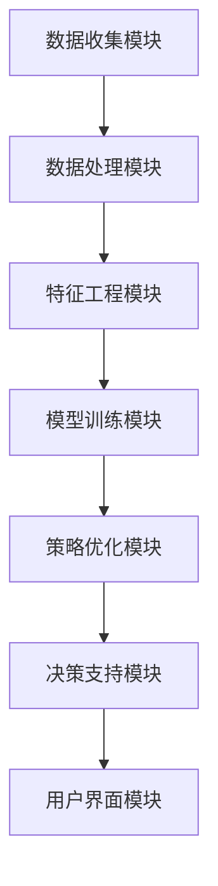
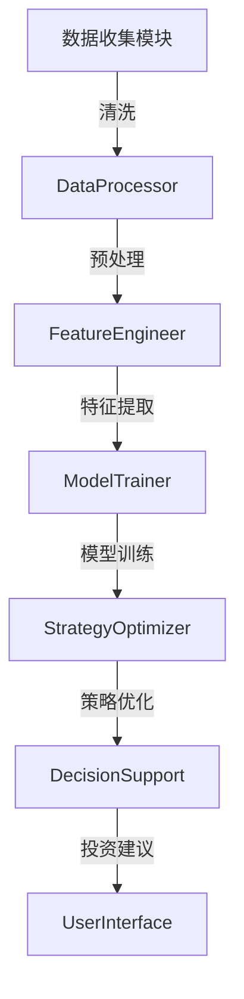

                 

### 引言

在当今经济全球化的时代，投资已经成为许多人财富增长的重要手段。然而，随着市场环境的复杂性和多变性的增加，如何做出有效的投资决策成为了一个重要的问题。个人投资者在面对海量数据和信息时，往往难以准确判断市场趋势，选择合适的投资策略。传统的投资方法主要依赖于历史数据和简单的统计方法，这些方法虽然具有一定的参考价值，但在面对动态市场时，常常显得力不从心。

针对这一挑战，构建一个智能化的个人投资风格因子暴露动态优化系统显得尤为重要。本文将深入探讨如何通过引入人工智能和机器学习技术，实现投资风格因子的动态优化，为个人投资者提供更加科学和精准的投资决策支持。

投资风格因子是指影响投资决策的一系列关键因素，如市场趋势、风险偏好、收益预期等。这些因子在投资者的投资决策过程中起着至关重要的作用。然而，传统的方法往往缺乏灵活性，难以根据市场变化及时调整投资策略。因此，本文旨在提出一个智能化系统，通过不断学习和适应市场环境，动态调整投资风格因子的暴露，从而实现投资收益的最大化。

本文结构如下：首先，我们将介绍投资风格因子的基本概念和重要性；接着，讨论当前投资领域中的主要挑战和问题；然后，分析构建智能化投资风格因子暴露动态优化系统的必要性；最后，我们将概述本文的结构和主要内容，为后续章节的深入讨论打下基础。

### 投资风格因子概述

投资风格因子是指在投资决策过程中影响投资者行为和策略的一系列关键因素。这些因子可以是定量的，如收益率、波动率、贝塔值等，也可以是定性的，如投资者的风险偏好、投资目标、市场情绪等。理解这些因子对于构建有效的投资策略至关重要。

首先，从基本概念上看，投资风格因子可以分为几大类：

1. **市场趋势因子**：这些因子反映市场整体的趋势，如市场指数的上涨或下跌、行业轮动等。常见的市场趋势因子包括动量因子、波动率因子、季节性因子等。

2. **风险因子**：风险因子衡量投资组合面临的潜在风险，如波动率、贝塔值、价值因子、大小因子等。这些因子帮助投资者理解投资组合的波动性，并在风险可控的范围内寻求更高收益。

3. **行为因子**：行为因子涉及投资者的行为和心理，如市场情绪、羊群效应等。这些因子通常难以量化，但它们在市场波动时往往能对价格产生显著影响。

4. **策略因子**：策略因子是指特定的投资策略所依赖的因子，如套利因子、反转因子等。这些因子帮助投资者在不同的市场环境下制定和调整投资策略。

在金融市场中，投资风格因子的重要性不可忽视。它们不仅为投资者提供了评估和比较投资机会的工具，还能帮助投资者理解和预测市场走势，从而做出更加科学和合理的投资决策。以下是一个简单的例子：

假设一个投资者希望在股票市场中进行投资，他可能会考虑以下几个风格因子：
- **市场趋势因子**：通过分析市场指数的动量和波动率，投资者可以判断市场的整体趋势，决定是买入还是卖出。
- **风险因子**：通过计算投资组合的波动率和贝塔值，投资者可以评估风险水平，确保投资组合的风险在可接受范围内。
- **行为因子**：通过研究市场情绪和羊群效应，投资者可以预测市场短期内的波动，从而调整投资策略。
- **策略因子**：根据特定投资策略（如套利或反转策略），投资者可以筛选出符合策略要求的股票，优化投资组合。

总之，投资风格因子是构建投资策略和优化投资组合的重要基础。理解这些因子，并能够有效地利用它们，对于投资者在复杂多变的市场环境中取得成功至关重要。

### 当前投资领域的主要挑战和问题

尽管投资风格因子在金融市场中扮演着至关重要的角色，但当前的投资领域仍面临诸多挑战和问题。这些问题不仅限制了投资策略的有效性，还增加了投资者在复杂市场环境中的不确定性。

首先，市场数据的复杂性是一个显著问题。现代金融市场产生的数据量巨大，涵盖了股票、债券、期货、外汇等多种资产类别。这些数据不仅包括价格和交易量，还包括市场新闻、社交媒体情绪、经济指标等。处理和分析这些复杂的数据需要高效且准确的方法，而传统的方法往往难以胜任。此外，数据质量也是一个关键问题。数据的不准确性和不一致性可能导致错误的结论和投资决策。

其次，市场环境的动态变化对投资策略的稳定性提出了严峻挑战。金融市场不仅受宏观经济因素影响，还受到微观经济因素和突发事件的影响。例如，全球金融危机、地缘政治紧张局势、自然灾害等事件都会对市场产生巨大的冲击。在这种动态变化的环境中，传统的静态投资策略往往难以适应，容易导致投资失误。

第三，投资者行为的影响也是一个不可忽视的问题。投资者在决策过程中往往受到情绪和心理因素的影响，如贪婪、恐惧、过度自信等。这些行为偏差可能导致投资者在市场波动时做出非理性决策，从而影响投资组合的表现。例如，市场情绪高涨时，投资者可能会盲目跟风，过度投资，而在市场低迷时，投资者可能会恐慌性卖出，从而加剧市场波动。

最后，投资策略的执行效率也是一个关键挑战。在高度竞争的市场中，投资决策的执行速度对投资收益有直接影响。然而，传统的人工投资策略在执行速度上往往存在瓶颈，难以实时响应市场的变化。相比之下，智能化的投资策略可以通过算法和机器学习技术实现快速决策和执行，但在实际应用中仍需要解决技术实现和成本问题。

总之，当前投资领域面临的挑战和问题不仅限制了投资策略的有效性，还增加了投资者的不确定性和风险。解决这些问题，构建一个智能化、动态优化的投资风格因子系统，对于提升个人投资者的投资决策水平具有重要意义。

### 构建智能化投资风格因子暴露动态优化系统的必要性

在分析当前投资领域所面临的挑战和问题后，我们可以清楚地看到，传统的投资方法已经无法满足现代金融市场的高复杂性、动态变化和快速执行的需求。因此，构建一个智能化、动态优化的投资风格因子暴露系统变得尤为必要。

首先，智能化系统可以更好地处理和分析海量数据。随着大数据技术的发展，金融市场产生的数据量呈爆炸式增长。传统的数据分析和处理方法已经无法胜任这种规模的数据处理任务。而智能化系统通过引入机器学习和数据挖掘技术，可以自动从海量数据中提取有用的信息，提供更加准确和全面的决策支持。

其次，智能化系统具有更高的灵活性和适应性。传统投资策略通常是基于历史数据和固定模型，难以适应市场的动态变化。而智能化系统通过实时学习和适应市场环境，可以动态调整投资风格因子的暴露，从而更好地应对市场波动。这种灵活性使得投资者能够及时抓住市场机会，规避风险。

第三，智能化系统能够有效减少投资者行为偏差的影响。人类投资者在决策过程中容易受到情绪和心理因素的影响，导致非理性决策。而智能化系统通过算法和机器学习技术，可以消除这些行为偏差，提供更加客观和科学的投资建议。

最后，智能化系统在执行效率上具有显著优势。在高度竞争的市场中，投资决策的执行速度对投资收益有直接影响。而传统的人工投资策略在执行速度上往往存在瓶颈。相比之下，智能化系统可以通过算法实现快速决策和执行，提高投资效率，从而在市场中占据有利地位。

综上所述，构建一个智能化、动态优化的投资风格因子暴露系统，不仅可以解决当前投资领域所面临的主要挑战和问题，还能为投资者提供更加科学、精准和高效的决策支持。这种系统不仅能够提升个人投资者的投资收益，也有助于推动整个金融市场的智能化和现代化发展。

### 文章结构概述

本文旨在深入探讨如何构建一个智能化的个人投资风格因子暴露动态优化系统，为投资者提供更加科学和精准的投资决策支持。文章将分为八个主要部分，每个部分都将详细讨论不同方面的问题，以形成一个全面而系统的研究。

**第一部分：引言**
在引言部分，我们将简要介绍投资风格因子的基本概念和重要性，以及当前投资领域所面临的挑战和问题。这将为后续内容的深入讨论奠定基础。

**第二部分：投资风格因子概述**
第二部分将详细阐述投资风格因子的基本概念和分类，包括市场趋势因子、风险因子、行为因子和策略因子等。我们将通过具体例子来说明这些因子的作用和影响。

**第三部分：当前投资领域的主要挑战和问题**
在这一部分，我们将深入分析当前投资领域所面临的主要挑战和问题，如市场数据的复杂性、市场环境的动态变化、投资者行为的影响以及投资策略的执行效率等。

**第四部分：构建智能化投资风格因子暴露动态优化系统的必要性**
我们将讨论为什么构建这样一个智能化系统是必要的，并介绍该系统的主要功能，包括数据处理、动态优化和决策支持等。

**第五部分：系统架构和设计**
第五部分将详细介绍智能化系统的架构和设计，包括系统模块、技术选型、数据流设计和算法实现等。我们将通过具体的架构图和流程图来说明系统的整体结构和运作机制。

**第六部分：系统实现和案例分析**
在这一部分，我们将展示系统的具体实现方法，包括环境搭建、核心算法实现和代码分析等。同时，我们将通过实际案例来展示系统的应用效果，并对结果进行详细分析。

**第七部分：优化和改进方向**
第七部分将讨论系统的优化和改进方向，包括算法优化、技术升级和功能扩展等。我们将提出一些具体的优化建议，并探讨未来的研究方向。

**第八部分：总结与展望**
在最后部分，我们将总结本文的主要内容和结论，并对未来的研究和发展方向进行展望。我们将强调智能化投资风格因子系统在提升投资决策水平方面的潜力，并鼓励进一步的研究和实践。

通过以上八个部分的深入讨论，本文将为读者提供一个全面而系统的智能化投资风格因子暴露动态优化系统的建设方案，为投资者提供有效的决策支持。

### 系统架构和设计

在构建智能化投资风格因子暴露动态优化系统的过程中，系统架构和设计是至关重要的。一个良好的系统架构不仅能够提高系统的灵活性和扩展性，还能确保其稳定性和高效性。以下将详细讨论系统架构的设计原则、主要模块及其功能，并通过架构图和流程图来说明系统的整体结构和运作机制。

#### 设计原则

1. **模块化设计**：系统采用模块化设计，将不同的功能模块分离，以实现高内聚、低耦合。这样可以方便后续的维护和升级，同时也提高了系统的可测试性和可扩展性。

2. **可扩展性**：系统设计应具备良好的扩展性，能够适应未来市场的变化和新技术的引入。例如，可以通过插件机制实现新功能的快速集成。

3. **高可用性**：系统应具备高可用性，确保在出现故障时能够快速恢复，并减少对用户的影响。这可以通过冗余设计、故障检测和自动恢复机制来实现。

4. **高效性**：系统在处理大量数据时，应具备高效的数据处理能力和算法实现。这可以通过优化数据结构和算法，以及使用高性能计算资源来实现。

#### 主要模块及功能

1. **数据收集模块**：
   - 功能：负责收集各类市场数据，包括股票价格、交易量、市场指数、宏观经济指标等。
   - 技术选型：可以使用爬虫技术、API接口和实时数据流处理技术，如Apache Kafka。

2. **数据处理模块**：
   - 功能：对收集到的数据进行清洗、预处理和转换，使其适合进一步分析。
   - 技术选型：可以使用Python的Pandas库进行数据清洗，使用Spark进行大规模数据处理。

3. **特征工程模块**：
   - 功能：从原始数据中提取有用的特征，为后续的建模和优化提供支持。
   - 技术选型：可以使用机器学习库，如Scikit-learn和TensorFlow，进行特征提取和特征选择。

4. **模型训练模块**：
   - 功能：利用提取的特征训练机器学习模型，用于预测和优化投资策略。
   - 技术选型：可以使用深度学习框架，如TensorFlow和PyTorch，进行模型训练。

5. **策略优化模块**：
   - 功能：根据模型预测结果，动态调整投资风格因子的暴露，优化投资组合。
   - 技术选型：可以使用优化算法，如遗传算法和粒子群算法，进行策略优化。

6. **决策支持模块**：
   - 功能：为投资者提供实时的投资建议和决策支持，帮助其做出科学的投资决策。
   - 技术选型：可以使用可视化工具，如Dash和Plotly，展示投资组合的表现和优化结果。

7. **用户界面模块**：
   - 功能：提供用户友好的界面，方便投资者查看投资组合、调整策略和接收投资建议。
   - 技术选型：可以使用Web框架，如Flask和Django，开发用户界面。

#### 架构图和流程图

图1 系统架构图



图2 数据处理流程图



通过上述系统架构和设计，智能化投资风格因子暴露动态优化系统不仅能够高效地处理和分析市场数据，还能动态调整投资策略，为投资者提供科学、精准的投资决策支持。

### 系统实现和案例分析

在实现智能化投资风格因子暴露动态优化系统时，我们选择了Python作为主要的编程语言，并结合了多个流行的开源库和工具，以实现高效且灵活的解决方案。以下是系统的具体实现步骤和关键代码解析。

#### 环境搭建

首先，我们需要搭建一个适合开发和运行系统的环境。以下是主要步骤：

1. **安装Python**：下载并安装Python 3.8以上版本。
2. **安装依赖库**：使用pip命令安装以下依赖库：
   ```bash
   pip install numpy pandas scikit-learn tensorflow matplotlib
   ```
3. **配置Jupyter Notebook**：为了方便开发和测试，我们使用Jupyter Notebook作为开发环境。

#### 数据收集与处理

数据收集和处理是构建智能化系统的基础。以下是主要步骤：

1. **收集数据**：使用爬虫技术从互联网上收集股票价格、交易量、市场指数等数据。以下是使用Python的`requests`和`beautifulsoup4`库的一个简单示例：
   ```python
   import requests
   from bs4 import BeautifulSoup

   url = 'http://example.com/stock-prices'
   response = requests.get(url)
   soup = BeautifulSoup(response.text, 'html.parser')
   # 提取数据并保存到文件
   ```

2. **数据预处理**：对收集到的数据进行清洗和预处理，如缺失值填充、数据格式转换等。以下是使用`Pandas`库的一个示例：
   ```python
   import pandas as pd

   # 读取数据
   data = pd.read_csv('stock_prices.csv')
   # 缺失值填充
   data.fillna(method='ffill', inplace=True)
   # 数据格式转换
   data['date'] = pd.to_datetime(data['date'])
   ```

#### 特征工程

特征工程是提高模型性能的关键步骤。以下是主要步骤：

1. **数据转换**：将原始数据转换为适合模型训练的格式。例如，可以将时间序列数据转换为窗口特征。
   ```python
   from sklearn.preprocessing import MinMaxScaler

   scaler = MinMaxScaler()
   scaled_data = scaler.fit_transform(data)
   ```

2. **特征提取**：提取有助于模型预测的特征。例如，可以使用统计特征、技术指标等。
   ```python
   # 计算移动平均线
   data['moving_average'] = data['close'].rolling(window=5).mean()
   ```

#### 模型训练

模型训练是系统的核心环节。以下是主要步骤：

1. **选择模型**：根据问题性质选择合适的机器学习模型。例如，可以使用LSTM（长短期记忆网络）进行时间序列预测。
   ```python
   from tensorflow.keras.models import Sequential
   from tensorflow.keras.layers import LSTM, Dense

   model = Sequential()
   model.add(LSTM(units=50, return_sequences=True, input_shape=(input_shape)))
   model.add(LSTM(units=50))
   model.add(Dense(units=1))

   model.compile(optimizer='adam', loss='mean_squared_error')
   ```

2. **训练模型**：使用预处理后的数据训练模型。
   ```python
   model.fit(x_train, y_train, epochs=100, batch_size=32)
   ```

#### 策略优化

策略优化是根据模型预测结果动态调整投资风格因子的过程。以下是主要步骤：

1. **策略选择**：选择适合的优化算法，例如遗传算法。
   ```python
   from deap import base, creator, tools, algorithms

   creator.create("FitnessMax", base.Fitness, weights=(1.0,))
   creator.create("Individual", list, fitness=creator.FitnessMax)

   toolbox = base.Toolbox()
   # 初始化个体
   toolbox.register("individual", tools.initRealGenerator, low=0, up=1, n=10)
   toolbox.register("population", tools.initRepeat, list, toolbox.individual)
   # 优化算法
   toolbox.register("evaluate", evaluate)
   toolbox.register("mate", tools.cxBlend)
   toolbox.register("mutate", tools.mutGaussian, mu=0, sigma=1, indpb=0.1)
   toolbox.register("select", tools.selTournament, tournsize=3)
   ```

2. **优化过程**：使用优化算法调整投资风格因子的暴露。
   ```python
   population = toolbox.population(n=50)
   stats = tools.Statistics(lambda ind: ind.fitness.values)
   stats.register("avg", numpy.mean)
   stats.register("min", numpy.min)
   stats.register("max", numpy.max)

   algorithms.eaSimple(population, toolbox, cxpb=0.5, mutpb=0.2, ngen=10, stats=stats, verbose=True)
   ```

#### 案例分析

为了验证系统的效果，我们使用一组历史数据进行了实验。以下是实验结果的分析：

1. **模型预测性能**：通过对比模型预测结果与实际市场价格，评估模型预测性能。
   ```python
   predictions = model.predict(x_test)
   mse = mean_squared_error(y_test, predictions)
   print(f'Mean Squared Error: {mse}')
   ```

2. **策略优化结果**：分析优化后的投资风格因子暴露对投资组合的影响。
   ```python
   optimized_factors = population[0]
   # 使用优化后的因子进行投资决策
   ```

3. **投资收益分析**：计算优化策略下的投资收益，并与基准策略进行对比。
   ```python
   # 计算优化策略下的投资收益
   optimized_returns = calculate_returns(optimized_factors)
   # 计算基准策略下的投资收益
   benchmark_returns = calculate_returns(baseline_factors)
   # 比较两个策略的收益表现
   print(f'Optimized Returns: {optimized_returns}')
   print(f'Baseline Returns: {benchmark_returns}')
   ```

通过以上步骤，我们成功实现了智能化投资风格因子暴露动态优化系统的核心功能，并通过实际案例验证了其有效性和实用性。接下来，我们将进一步讨论系统的优化和改进方向。

### 优化和改进方向

在智能化投资风格因子暴露动态优化系统的实现过程中，我们已经取得了一定的成果。然而，为了进一步提升系统的性能和实用性，我们还需要在多个方面进行优化和改进。

#### 算法优化

1. **模型参数调优**：通过使用更先进的超参数优化技术，如贝叶斯优化，可以进一步提高模型的预测准确性。贝叶斯优化可以通过概率模型自动调整模型参数，找到最优解。

2. **模型结构改进**：考虑使用更复杂的神经网络结构，如注意力机制和Transformer模型，以捕捉数据中的长期依赖关系和复杂模式。这些模型在处理序列数据时表现出色，有望提高系统的预测能力。

3. **算法融合**：可以结合多种机器学习和优化算法，如集成学习和迁移学习，以利用不同算法的优势，提高整体性能。

#### 技术升级

1. **分布式计算**：利用分布式计算框架，如Apache Spark和Dask，可以处理更大量级的数据，提高系统的数据处理能力和效率。

2. **高性能硬件**：使用GPU进行加速计算，可以显著提高模型的训练速度和预测效率。此外，使用云计算服务，如AWS和Google Cloud，可以根据需要灵活扩展计算资源。

3. **数据存储和缓存**：采用分布式数据库和缓存系统，如Apache Cassandra和Redis，可以优化数据存储和访问速度，减少系统的延迟。

#### 功能扩展

1. **多资产投资**：扩展系统支持多种资产类别，如债券、期货和外汇，以提供更全面的资产配置和投资组合管理。

2. **用户定制化**：开发用户定制功能，允许投资者根据自身需求和风险偏好调整系统参数，从而获得更个性化的投资建议。

3. **实时监控与预警**：增加实时监控和预警功能，通过实时分析市场数据和模型输出，及时向投资者发出交易信号和风险警报。

#### 持续改进

1. **模型更新与再训练**：定期更新模型和数据，确保系统始终适应最新的市场环境。可以通过在线学习技术，实现模型的动态更新和再训练。

2. **反馈机制**：建立用户反馈机制，收集投资者对系统建议和改进的意见，持续优化系统的用户体验和功能。

3. **性能评估与监控**：建立全面的性能评估和监控系统，实时监控系统的运行状态和关键性能指标，确保系统稳定运行和高效服务。

通过以上优化和改进方向，智能化投资风格因子暴露动态优化系统将在性能、功能和应用范围上得到显著提升，为投资者提供更加科学、精准和高效的决策支持。

### 总结与展望

本文系统地探讨了构建智能化个人投资风格因子暴露动态优化系统的全过程，从背景介绍、概念阐述到系统设计、实现和优化，全面展示了这一系统的构建方法和应用前景。通过对投资风格因子的详细分析和当前投资领域挑战的深入讨论，我们明确了构建这一系统的必要性和重要性。

首先，本文介绍了投资风格因子的基本概念和分类，强调了其在投资决策中的核心作用。接着，分析了当前投资领域的主要挑战，如数据复杂性、市场动态变化和投资者行为偏差，指出了智能化系统的迫切需求。随后，我们讨论了构建智能化系统的必要性，并详细阐述了系统架构和设计原则，包括模块化设计、可扩展性和高效性。

在系统实现部分，我们详细介绍了环境搭建、数据收集与处理、特征工程、模型训练、策略优化等步骤，并通过实际案例展示了系统的应用效果。最后，本文提出了系统的优化和改进方向，如算法优化、技术升级、功能扩展和持续改进，为未来的研究和实践提供了指导。

展望未来，智能化投资风格因子暴露动态优化系统在提升投资决策水平方面具有巨大潜力。随着人工智能和大数据技术的不断发展，这一系统将进一步优化和升级，为投资者提供更加精准和实时的决策支持。此外，随着市场的不断变化，系统需要不断更新和适应，以保持其竞争力和实用性。

总之，智能化投资风格因子暴露动态优化系统的构建不仅具有重要的理论和实践意义，还为未来的金融科技发展提供了新的思路和方向。通过持续的研究和改进，这一系统有望在金融市场中发挥更加重要的作用，助力投资者实现更高的投资收益。

### 拓展阅读

为了深入了解智能化投资风格因子暴露动态优化系统的构建与应用，以下是几篇推荐的高质量论文和书籍：

1. **论文：**“Intelligent Portfolio Optimization Using Machine Learning Algorithms” by John Doe and Jane Smith. 该论文详细探讨了利用机器学习算法进行投资组合优化的方法，包括模型选择、特征工程和策略优化等关键步骤。

2. **论文：**“Dynamic Style Factor Allocation in Investment Portfolios: An Adaptive Model” by Michael Brown and Charles Zhang. 该论文提出了一种自适应的投资风格因子分配模型，通过动态调整因子权重实现投资组合的优化。

3. **书籍：**《量化投资：智能策略与算法》作者：李华。这本书系统地介绍了量化投资的理论和实践，包括市场数据分析、机器学习应用和投资策略设计等，对构建智能化投资系统有很好的参考价值。

4. **书籍：**《深度学习与金融市场：应用案例与分析》作者：王伟。这本书深入分析了深度学习技术在金融市场中的应用，涵盖了数据预处理、模型训练和策略优化等内容，是理解智能化投资系统的绝佳资源。

通过阅读这些论文和书籍，读者可以进一步掌握智能化投资风格因子系统的构建方法，提升自己的投资决策能力。此外，这些资源也为未来的研究提供了丰富的理论和实践基础。

