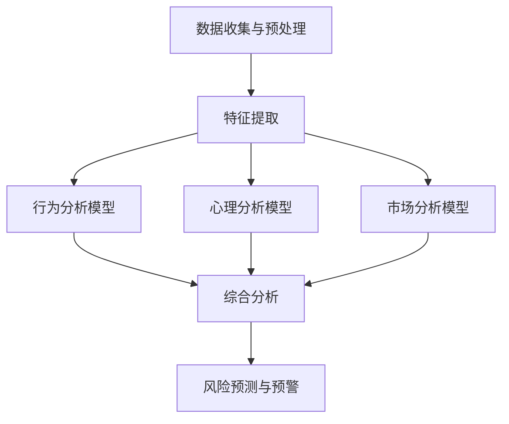
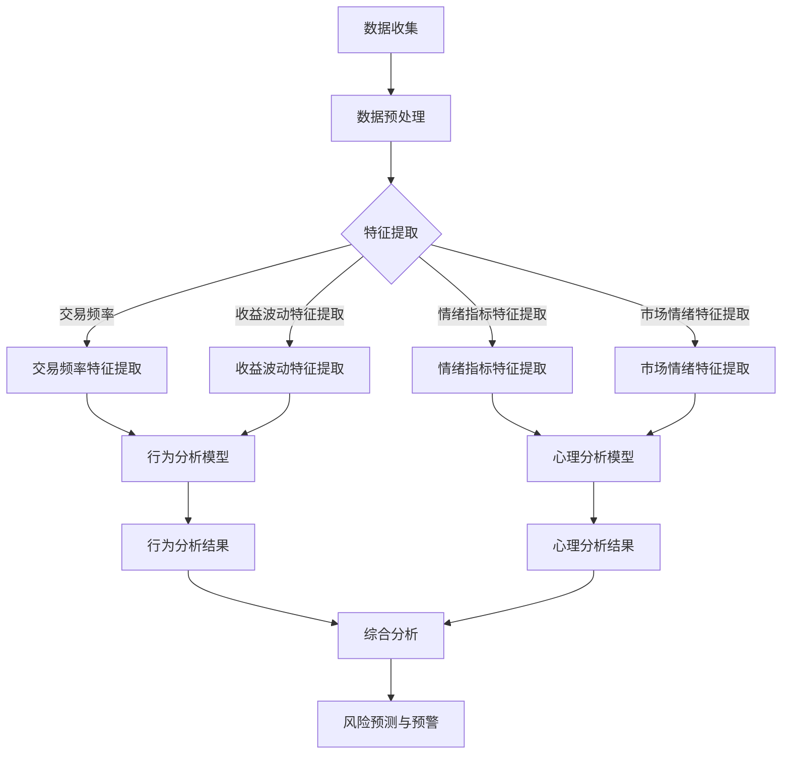
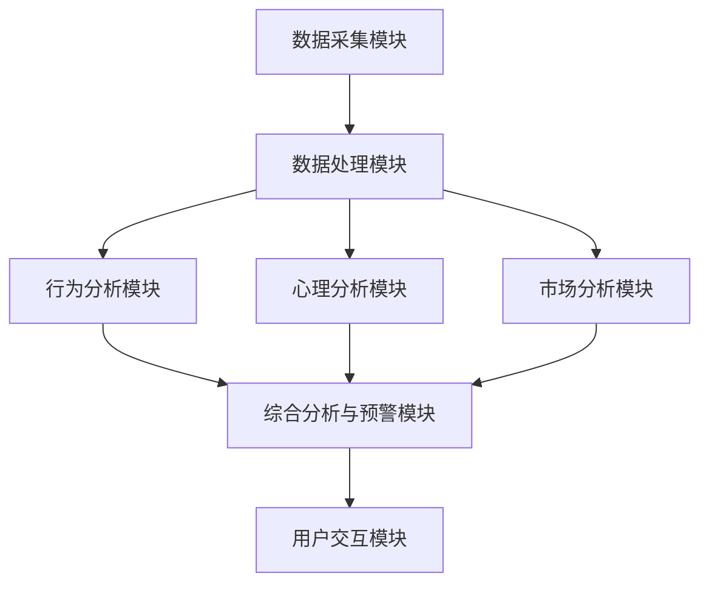
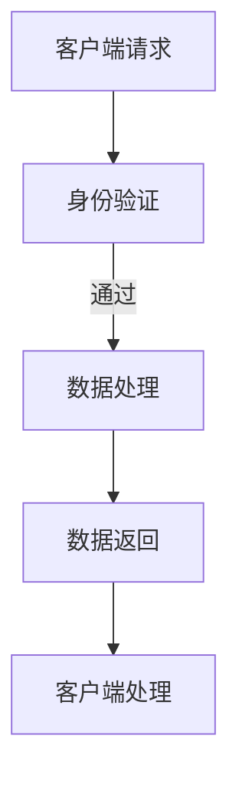

                 

### 引言

**关键词**：个人投资风格，智能化分析，原因分析系统

**摘要**：本文旨在探讨如何构建一个智能化的个人投资风格漂移原因分析系统。在投资市场中，个人投资风格漂移现象普遍存在，它可能导致投资者在决策过程中出现失误，进而影响其投资收益。为了帮助投资者更好地理解和应对投资风格漂移，本文从多个角度出发，详细阐述了构建这一系统的必要性和重要性。本文首先介绍了个人投资风格的概念及其分类，然后分析了个人投资风格漂移的原因，并在此基础上探讨了构建智能化分析系统的理论基础。随后，本文介绍了个人投资风格评估模型的构建方法和投资风格漂移原因分析算法的原理。接着，本文详细描述了个人投资风格漂移原因分析系统的设计与实现过程，并通过一个实际案例展示了系统的应用效果。最后，本文总结了系统构建过程中的最佳实践，并展望了未来的发展趋势。

## 第1章: 系统概述与理论基础

### 1.1 问题背景与意义

投资市场是一个复杂且动态变化的系统，个人投资者在投资过程中常常面临各种挑战。其中，个人投资风格的漂移是一个普遍且重要的问题。个人投资风格是指投资者在投资决策过程中表现出的行为模式和心理特点。这种风格可能包括风险偏好、市场分析能力、情绪稳定性等多个方面。然而，随着时间的推移和市场环境的变化，投资者可能会逐渐偏离自己原有的投资风格，导致投资决策的失误。

个人投资风格漂移的原因多种多样，包括投资者自身心理状态的变化、市场环境的波动、外部信息的干扰等。这种漂移现象可能会导致以下问题：

1. **投资决策失误**：投资者在漂移过程中可能无法做出合理的投资决策，从而影响投资收益。
2. **风险控制失效**：投资者原有的风险控制策略可能不再适用于新的投资风格，导致风险增大。
3. **投资效率降低**：漂移可能导致投资者在寻找投资机会时效率降低，错失潜在收益。

为了解决上述问题，有必要构建一个智能化的个人投资风格漂移原因分析系统。这个系统可以通过对投资者行为和心理的深入分析，识别投资风格漂移的原因，并提供相应的应对策略。这不仅有助于投资者更好地理解自己的投资行为，还能帮助其优化投资策略，提高投资收益。此外，智能化分析系统的建设对于金融行业的发展也具有重要的推动作用，它可以为金融机构提供更加精准的投资建议，提高整个市场的运行效率。

### 1.2 个人投资风格的概念与分类

个人投资风格是指投资者在投资决策过程中表现出的行为模式和心理特点。它可以被理解为投资者在投资决策过程中所遵循的基本原则和偏好。个人投资风格的形成受到多种因素的影响，包括投资者的年龄、教育背景、职业经历、家庭状况、风险偏好等。

个人投资风格通常可以分为以下几种类型：

1. **保守型**：保守型投资者通常更注重资金的保值，倾向于选择低风险的资产，如国债、存款等。他们对于市场波动较为敏感，通常会在市场低迷时减少投资，以规避风险。
2. **稳健型**：稳健型投资者在风险和收益之间寻求平衡，通常会选择一些低风险的股票、基金等投资工具。他们在市场波动时能够保持冷静，不会盲目跟风。
3. **激进型**：激进型投资者追求更高的投资回报，愿意承担较高的风险，通常会选择一些高风险的资产，如股票、期货等。他们对于市场变化有较强的敏感度，能够在市场上升时抓住机会。
4. **分散型**：分散型投资者注重资产配置，通过将资金分散投资于不同类型的资产，以降低整体投资风险。他们通常会在股票、债券、基金等多种投资工具之间进行平衡。
5. **投机型**：投机型投资者追求短期的高额回报，通常会在市场波动时进行高频交易。他们对于市场信息的敏感度非常高，能够在短时间内做出快速决策。

每种投资风格都有其独特的特点和适用场景。了解并掌握自己的投资风格对于投资者来说至关重要，它有助于投资者更好地制定投资策略，降低投资风险，提高投资收益。然而，随着市场环境和个人心理状态的变化，投资者可能会逐渐偏离原有的投资风格，这就是个人投资风格漂移现象。

### 1.3 个人投资风格漂移现象分析

个人投资风格漂移是指投资者在长期投资过程中，由于各种内外部因素的影响，其投资风格逐渐发生变化，导致原有的投资策略和决策逻辑出现偏差。这种现象在投资市场中是普遍存在的，其背后的原因复杂多样。

首先，市场环境的变化是导致个人投资风格漂移的一个重要因素。市场环境包括宏观经济状况、行业发展趋势、政策法规变动等。这些因素的变化会对投资者的情绪和市场预期产生重大影响，从而影响其投资决策。例如，在经济衰退期，投资者可能会更倾向于保守型投资风格，减少高风险资产的投资比例，而随着经济复苏，投资者可能会逐渐转向稳健型或激进型投资风格。

其次，个人心理状态的变化也是导致投资风格漂移的一个重要因素。投资者的情绪、自信心、风险承受能力等心理因素都会影响其投资决策。例如，在经历了一段时间的高收益后，投资者可能会变得更加自信和激进，追求更高的投资回报；而在经历了一段时间的亏损后，投资者可能会变得更加谨慎和保守，追求资金的保值。

此外，外部信息的干扰也是导致投资风格漂移的一个不可忽视的因素。投资市场中的信息庞杂多变，投资者在获取和处理信息时可能会受到各种干扰，导致其投资决策出现偏差。例如，媒体报道、专家观点、市场传言等外部信息可能会对投资者的情绪和市场预期产生重大影响，从而影响其投资风格。

个人投资风格漂移的后果是严重的，它可能导致以下问题：

1. **投资决策失误**：投资者在漂移过程中可能会做出不合理的投资决策，导致投资收益下降。
2. **风险控制失效**：投资者原有的风险控制策略可能不再适用于新的投资风格，导致风险增大。
3. **投资效率降低**：漂移可能导致投资者在寻找投资机会时效率降低，错失潜在收益。
4. **投资信心受挫**：频繁的投资风格漂移可能导致投资者失去信心，影响其长期投资决策。

为了应对个人投资风格漂移现象，投资者需要采取一系列措施，包括定期评估自己的投资风格、调整投资策略、增强风险意识等。此外，构建一个智能化的个人投资风格漂移原因分析系统也是一条有效的途径。通过该系统，投资者可以更深入地了解自己的投资行为和决策逻辑，及时发现并纠正投资风格漂移现象，从而提高投资收益。

### 1.4 系统构建的目标与挑战

构建智能化的个人投资风格漂移原因分析系统旨在帮助投资者更准确地识别和理解投资风格漂移现象，并提供有效的应对策略。具体目标如下：

1. **全面评估个人投资风格**：通过收集和分析投资者的历史投资数据、心理状态和行为模式，对个人投资风格进行全面评估，识别其特点和潜在漂移风险。
2. **精准分析漂移原因**：结合市场环境、个人心理状态和外部信息，深入分析导致投资风格漂移的各种原因，为投资者提供针对性的解决方案。
3. **提供个性化投资建议**：根据投资者的个人特点和当前投资风格，提供个性化的投资策略和风险管理建议，帮助其优化投资决策。
4. **提高投资效率和收益**：通过智能化分析，提高投资者在投资市场中的决策效率和收益，降低投资风险。

然而，系统构建过程中也面临一系列挑战：

1. **数据获取和处理**：个人投资风格的分析需要大量的历史数据支持，如何高效地获取、处理和整合这些数据是一个重要的挑战。
2. **模型准确性和泛化能力**：构建的模型需要具备较高的准确性和泛化能力，能够准确识别和预测投资风格漂移现象，这对于模型的训练和优化提出了高要求。
3. **用户参与和互动**：投资者需要积极参与系统分析过程，提供真实有效的数据和信息，这对于系统的用户友好性和互动性提出了挑战。
4. **实时性和动态调整**：投资市场环境变化迅速，系统需要具备实时分析和动态调整的能力，以应对不断变化的市场环境和个人心理状态。

面对这些挑战，需要通过多学科交叉、技术创新和实践积累，构建一个高效、智能且可靠的个人投资风格漂移原因分析系统，为投资者提供有力支持。

### 2.1 投资心理学基础

投资心理学是研究投资者在投资过程中心理状态和行为模式的一门学科，它是构建智能化个人投资风格漂移原因分析系统的重要理论基础。理解投资心理学有助于揭示投资者在投资决策中的心理机制和影响因素，从而为系统的设计和实施提供科学依据。

首先，**风险偏好**是投资心理学中的一个核心概念。风险偏好反映了投资者对于风险的态度和承受能力。不同类型的投资者在风险偏好上存在显著差异。例如，保守型投资者通常对风险非常敏感，更倾向于选择低风险的资产以保值；而激进型投资者则愿意承担更高的风险，追求更高的收益。风险偏好不仅影响投资者的投资决策，还直接影响其投资风格的形成和变化。

其次，**情绪对投资行为的影响**也不可忽视。投资者在投资过程中往往会受到情绪的驱动，如贪婪、恐惧、焦虑等。这些情绪会影响投资者的认知判断和行为选择。例如，在市场低迷时，投资者可能会因为恐惧而抛售资产，导致投资损失；而在市场高峰时，投资者可能会因为贪婪而盲目跟风，追逐短期利润。情绪的波动不仅会导致投资风格漂移，还可能引发投资决策的失误。

此外，**自我效能量**也是投资心理学中的一个重要概念。自我效能感是指投资者对自己在投资领域成功完成任务的能力的信念。高自我效能感的投资者通常更加自信，愿意承担风险，并能够从失败中迅速恢复；而低自我效能感的投资者则可能过于谨慎，错过投资机会。

在构建智能化个人投资风格漂移原因分析系统时，理解这些心理学概念和它们之间的关系至关重要。通过结合投资者的历史数据和行为模式，系统可以分析其风险偏好、情绪波动和自我效能感，从而预测和识别投资风格漂移的可能性。以下是这些核心概念之间的联系和相互作用：

- **风险偏好**直接影响投资者的投资决策和资产选择。长期的风险偏好模式可以帮助系统识别投资者的稳定投资风格。
- **情绪波动**是导致投资风格漂移的重要因素。通过监测投资者的情绪变化，系统可以及时识别可能的风格漂移迹象，并提供相应的干预措施。
- **自我效能感**与风险偏好和情绪管理密切相关。高自我效能感的投资者通常能够在面对市场波动时保持冷静，而低自我效能感的投资者则容易在情绪驱动下改变投资策略。

总之，投资心理学为构建智能化个人投资风格漂移原因分析系统提供了关键的理论支持。通过深入理解投资者的心理机制和行为模式，系统可以更准确地预测和应对投资风格漂移现象，从而帮助投资者优化投资决策，提高投资收益。

### 2.2 投资行为经济学

投资行为经济学是研究投资者在金融市场中的行为规律和决策过程的一门学科，它为构建智能化个人投资风格漂移原因分析系统提供了重要的理论基础。投资行为经济学强调，投资者的行为不仅受到理性经济模型的影响，还受到心理、社会和文化等多重因素的影响。

首先，从**行为经济学的基本理论**来看，投资者行为往往受到以下几方面的偏差影响：

1. **过度自信**：投资者常常高估自己的能力和市场预测能力，导致投资决策过于冒险或过于保守。
2. **代表性偏差**：投资者倾向于根据有限信息进行判断，容易受到过去事件的影响，忽视数据的整体分布。
3. **确认偏差**：投资者倾向于接受与已有观点一致的信息，忽视相反的证据。
4. **损失厌恶**：投资者对损失的厌恶超过对收益的喜好，因此在面对损失时可能会采取过于保守的决策。
5. **心理账户**：投资者在心理上对资金进行分类管理，不同的资金来源或用途可能会导致不同的投资决策。

这些偏差会导致投资者的投资行为偏离经典的理性经济模型，形成独特的投资风格。例如，一个过度自信的投资者可能会在市场高点时进行高风险投资，而在市场低点时因为损失厌恶而持有亏损的资产，从而影响其投资风格。

其次，投资行为经济学还探讨了**社会影响**对个人投资决策的影响。社会影响力包括媒体、专家观点、同伴行为等，这些外部因素往往会对投资者的情绪和行为产生影响。例如，当市场普遍看涨时，投资者可能会受到市场情绪的感染，增加投资额或进行高风险投资；而当市场普遍看跌时，投资者可能会恐慌性抛售，导致市场进一步下跌。

**文化背景**也是影响投资者行为的重要因素。不同文化背景下，投资者的价值观、风险偏好和投资习惯存在显著差异。例如，在注重长期投资和稳定收益的亚洲文化背景下，投资者可能更倾向于选择稳健的投资策略；而在追求短期收益和风险容忍度较高的西方文化背景下，投资者可能更愿意承担高风险以获取高回报。

在构建智能化个人投资风格漂移原因分析系统时，理解这些行为经济学原理和它们之间的相互作用至关重要。以下是一个简化的逻辑框架，描述这些因素如何影响个人投资风格：

1. **数据收集**：系统首先需要收集投资者的历史投资数据、交易记录、情绪状态等。
2. **行为分析**：通过行为经济学模型对数据进行分析，识别投资者行为中的偏差和影响因素。
3. **风格评估**：结合投资者的心理、社会和文化背景，评估其当前的投资风格。
4. **原因分析**：分析导致投资风格漂移的可能原因，如过度自信、代表性偏差、确认偏差等。
5. **预测与建议**：根据分析结果，预测投资风格漂移的可能方向，并提供相应的优化建议。

通过这种多维度、综合性的分析，智能化个人投资风格漂移原因分析系统可以帮助投资者更全面地了解自己的投资行为和风格，及时发现并纠正潜在的漂移现象，从而优化投资决策，提高投资收益。

### 2.3 数据分析与机器学习基础

在构建智能化的个人投资风格漂移原因分析系统中，数据分析和机器学习技术扮演着至关重要的角色。这些技术不仅为系统的构建提供了理论基础，也为实际应用提供了强有力的工具。以下将介绍数据分析方法和机器学习技术在这类系统中的应用原理。

#### 数据分析方法

数据分析是构建智能化系统的第一步，它涉及数据的收集、清洗、探索性分析、统计建模等多个环节。

1. **数据收集**：系统需要收集投资者的历史投资数据，包括交易记录、资产配置、投资收益等。此外，还需收集投资者的行为数据，如点击行为、浏览记录、心理测试结果等。这些数据可以通过线上问卷、交易记录导入、社交媒体分析等多种渠道获取。

2. **数据清洗**：收集到的数据通常包含噪声和不一致的数据，因此需要通过数据清洗技术进行预处理。清洗过程包括去除重复数据、处理缺失值、标准化数值等，以确保数据的质量和一致性。

3. **探索性分析**：通过统计分析、数据可视化等方法对数据进行分析，发现数据中的规律和趋势。探索性分析可以帮助系统了解投资者的行为模式和投资风格，识别潜在的漂移迹象。

4. **统计建模**：利用统计模型（如回归分析、聚类分析等）对数据进行分析，构建投资者的投资风格特征模型。这些模型可以用来预测投资者的未来投资行为和风格变化。

#### 机器学习技术

机器学习技术是数据分析的扩展，它通过构建算法模型，使系统能够自动学习和预测。以下是几种常用的机器学习技术及其在系统中的应用：

1. **监督学习**：监督学习通过已有标注数据训练模型，然后利用模型对新数据进行预测。常见的监督学习算法包括线性回归、逻辑回归、支持向量机（SVM）等。在个人投资风格漂移分析系统中，监督学习可以用来预测投资者的未来投资风格变化，从而及时发现漂移现象。

2. **无监督学习**：无监督学习没有预标注的数据，其目标是发现数据中的模式和结构。常见的无监督学习算法包括聚类分析、主成分分析（PCA）等。在系统构建中，无监督学习可以用于识别投资者的初始投资风格，并将其聚类为不同的群体。

3. **深度学习**：深度学习通过构建多层神经网络模型，实现复杂的特征学习和模式识别。常见的深度学习模型包括卷积神经网络（CNN）、循环神经网络（RNN）和变压器模型（Transformer）等。深度学习在处理大规模和高维度数据时表现出色，可以用于分析投资者的多维度数据，如交易行为、情绪状态等，从而提高漂移分析的准确性。

#### 机器学习与数据分析的融合

在实际应用中，机器学习和数据分析不是孤立存在的，而是相互融合，共同推动系统的构建和优化。以下是一个简化的流程：

1. **数据预处理**：结合数据分析和机器学习技术，对收集到的数据进行预处理，包括数据清洗、特征工程等，为后续的模型训练和预测做好准备。

2. **模型训练**：利用机器学习算法对预处理后的数据集进行训练，构建能够识别投资者投资风格和漂移迹象的模型。

3. **模型评估**：通过交叉验证、A/B测试等评估方法，对训练出的模型进行性能评估，确保其准确性和泛化能力。

4. **模型部署**：将经过评估的模型部署到系统中，使其能够实时分析投资者的数据，提供个性化的投资建议。

5. **反馈优化**：根据投资者的反馈和系统运行效果，不断调整和优化模型，提高系统的稳定性和准确性。

通过这种融合的方法，智能化个人投资风格漂移原因分析系统不仅可以准确地识别和预测投资风格漂移，还能为投资者提供及时有效的决策支持，帮助其优化投资策略，提高投资收益。

### 3.1 个人投资风格评估指标的选取

在构建智能化个人投资风格漂移原因分析系统时，准确评估个人投资风格是关键的一步。个人投资风格评估指标的选择和构建直接影响系统的效果和实用性。以下是几个常用的个人投资风格评估指标及其具体作用：

#### 1. **投资风险偏好度**

**指标定义**：投资风险偏好度反映了投资者对风险的容忍程度。它可以通过以下几种方法进行评估：

- **历史投资记录**：分析投资者过去投资的高风险资产比例，如股票、期权等。
- **投资损失承受能力**：通过问卷调查或心理测试评估投资者在面临投资损失时的承受能力。

**具体作用**：风险偏好度是决定投资者投资策略的核心因素。高风险偏好度的投资者倾向于选择高风险、高收益的资产，而低风险偏好度的投资者则更倾向于选择低风险、低收益的资产。

#### 2. **市场分析能力**

**指标定义**：市场分析能力反映了投资者对市场走势的判断能力。评估方法包括：

- **历史投资收益分析**：通过比较投资者实际投资收益与市场基准收益的差异，评估其市场分析能力。
- **投资策略的适应性**：分析投资者在不同市场环境下的投资策略变化，评估其适应性。

**具体作用**：市场分析能力直接影响投资者的投资决策。高市场分析能力的投资者能够在不同市场环境下做出合理的投资决策，从而获得更高的投资回报。

#### 3. **情绪稳定性**

**指标定义**：情绪稳定性反映了投资者在投资过程中的情绪波动程度。评估方法包括：

- **情绪测试**：通过心理问卷调查或情绪分析工具，评估投资者的情绪稳定性。
- **交易记录分析**：分析投资者的交易行为，如频繁交易、追涨杀跌等，评估其情绪波动程度。

**具体作用**：情绪稳定性是影响投资者决策的重要因素。情绪稳定的投资者在投资过程中能够保持冷静，做出理性的投资决策，避免情绪化交易导致的损失。

#### 4. **投资决策速度**

**指标定义**：投资决策速度反映了投资者在投资决策过程中所需的时间。评估方法包括：

- **决策时间记录**：记录投资者从识别投资机会到做出投资决策的时间。
- **交易频率**：分析投资者的交易频率，评估其决策速度。

**具体作用**：投资决策速度直接影响投资者的反应速度。快速决策的投资者能够更快地抓住市场机会，而决策速度慢的投资者可能错失投资机会。

#### 5. **知识水平**

**指标定义**：知识水平反映了投资者在金融知识方面的掌握程度。评估方法包括：

- **金融知识测试**：通过问卷调查或在线测试，评估投资者的金融知识水平。
- **投资报告阅读**：分析投资者阅读和关注投资报告的频率和质量。

**具体作用**：知识水平是影响投资者决策的重要因素。金融知识丰富的投资者能够更好地理解和分析市场信息，从而做出更合理的投资决策。

通过这些评估指标，系统可以全面、准确地评估投资者的个人投资风格，为后续的投资风格漂移分析提供可靠的数据支持。同时，这些指标还可以帮助投资者自我认知，了解自己的投资风格，从而更好地调整和优化投资策略。

### 3.2 评估模型的构建方法

在构建个人投资风格评估模型时，选择合适的方法至关重要。以下将详细介绍几种常用的评估模型构建方法，包括回归分析、聚类分析和因子分析，并解释每种方法的原理和适用场景。

#### 1. 回归分析

**原理**：回归分析是一种统计方法，用于研究因变量与自变量之间的关系。在个人投资风格评估中，可以将投资收益作为因变量，将风险偏好度、市场分析能力、情绪稳定性等作为自变量。通过建立回归模型，可以分析这些自变量对投资收益的影响。

**步骤**：

- **数据收集**：收集投资者的历史投资数据，包括投资收益、风险偏好度、市场分析能力、情绪稳定性等。
- **模型构建**：利用统计软件（如R、Python的scikit-learn库）建立回归模型，通过最小二乘法拟合模型参数。
- **模型评估**：通过交叉验证、R²值等指标评估模型性能，确保模型具有良好的预测能力。

**适用场景**：回归分析适用于研究单一因变量与多个自变量之间的关系，特别适用于分析投资者投资收益与各个评估指标之间的关系。

#### 2. 聚类分析

**原理**：聚类分析是一种无监督学习方法，通过将数据分为若干个簇，使得同一簇内的数据相似度较高，不同簇之间的数据相似度较低。在个人投资风格评估中，可以将投资者分为不同的簇，每个簇代表一种投资风格。

**步骤**：

- **数据标准化**：由于不同评估指标的数据量纲不同，需要通过标准化方法（如Z-score标准化）统一数据量纲。
- **聚类算法选择**：选择合适的聚类算法（如K-means、层次聚类等），根据评估指标计算数据之间的相似度。
- **聚类结果分析**：分析聚类结果，确定最佳的簇数和每个簇的投资风格。

**适用场景**：聚类分析适用于对投资者进行分类，识别不同的投资风格群体，特别适用于没有先验知识的聚类任务。

#### 3. 因子分析

**原理**：因子分析是一种降维方法，通过将多个变量归结为少数几个不可观测的因子，从而简化数据结构。在个人投资风格评估中，可以将多个评估指标归结为几个核心因子，这些因子代表了投资风格的主要特征。

**步骤**：

- **数据收集**：收集投资者的多维度评估指标数据。
- **因子提取**：使用主成分分析（PCA）或最大方差分析法提取因子。
- **因子载荷分析**：分析各指标在各个因子上的载荷，确定各因子代表的核心特征。
- **因子得分计算**：计算每个投资者的因子得分，用于评估其投资风格。

**适用场景**：因子分析适用于降维和数据简化，特别适用于有大量评估指标且存在多重共线性的情况。

#### 模型比较

每种评估模型都有其独特的优势和适用场景。回归分析适合分析具体因变量与自变量之间的关系，聚类分析适用于投资者分类，而因子分析则擅长降维和数据简化。在实际应用中，可以根据评估目标选择合适的模型，或结合使用多种模型以提高评估的准确性和全面性。

通过合理选择和构建评估模型，个人投资风格漂移原因分析系统可以更准确地识别投资者的投资风格，为后续的漂移原因分析和优化投资策略提供可靠的数据支持。

### 3.3 评估模型的应用场景与效果分析

个人投资风格评估模型在实际应用中具有广泛的场景，能够为投资者提供精准的投资建议和策略调整。以下将详细探讨评估模型在几个具体应用场景中的效果和优势。

#### 1. **投资组合优化**

**应用场景**：投资者在构建和调整投资组合时，需要考虑多种资产的风险收益特性，以及个人的投资风格。通过个人投资风格评估模型，可以识别投资者的主要投资风格，从而优化投资组合，实现风险和收益的最优平衡。

**效果分析**：

- **风险分散**：评估模型能够帮助投资者识别出适合其风险偏好的资产类别，如股票、债券、基金等。通过合理配置这些资产，可以有效分散风险，避免单一市场波动对投资组合的冲击。
- **收益最大化**：根据评估结果，投资者可以调整投资组合中各资产的比例，使其更符合个人投资风格。这样，在市场波动时，投资组合能够保持相对稳定，实现收益最大化。
- **动态调整**：投资组合需要根据市场环境和投资者心理状态的变化进行动态调整。评估模型可以实时分析投资者的投资风格变化，提供相应的调整建议，确保投资组合始终与投资者风格相匹配。

#### 2. **风险控制与预警**

**应用场景**：投资者在投资过程中，需要密切关注市场风险，确保投资组合不会因市场波动而遭受重大损失。个人投资风格评估模型可以为投资者提供风险控制与预警机制。

**效果分析**：

- **风险识别**：评估模型能够分析投资者的投资风格和心理状态，识别出潜在的风险因素。例如，当投资者表现出过度自信或情绪不稳定时，模型会发出预警信号。
- **风险量化**：通过分析历史数据和当前投资风格，评估模型可以量化投资者的风险承受能力，提供具体的量化指标，帮助投资者制定合理的风险控制策略。
- **实时预警**：评估模型可以实时监控投资者的投资行为，当发现风格漂移或潜在风险时，立即发出预警信息，提醒投资者注意风险。

#### 3. **个性化投资建议**

**应用场景**：每个投资者的投资目标和风险偏好都不同，需要个性化的投资建议。个人投资风格评估模型可以为投资者提供定制化的投资建议。

**效果分析**：

- **精准定位**：评估模型能够准确识别投资者的投资风格和风险偏好，为投资者提供量身定制的投资策略。例如，对于保守型投资者，建议多配置债券和稳健型基金；对于激进型投资者，则建议增加股票和高风险基金的投资比例。
- **持续优化**：评估模型可以根据投资者的行为数据和市场环境变化，持续优化投资建议。通过定期评估和调整，确保投资建议始终与投资者的实际情况相符。
- **投资教育**：评估模型不仅可以提供投资建议，还可以帮助投资者了解自己的投资风格和决策逻辑。通过投资教育，投资者可以更好地掌握投资知识，提高投资能力。

综上所述，个人投资风格评估模型在实际应用中具有显著的效果和优势，能够为投资者提供全面的决策支持，帮助其优化投资策略，降低投资风险，实现投资收益的最大化。

### 4.1 投资风格漂移原因分析的核心算法

在构建个人投资风格漂移原因分析系统时，选择合适的核心算法是实现系统高效、准确运行的关键。本文提出了一种名为“Mermaid算法”的核心算法，它基于机器学习和数据挖掘技术，能够深入分析投资者行为，识别投资风格漂移的原因。

#### 算法原理

**Mermaid算法**的基本原理是通过多层次的模型来分析投资者的投资行为，包括行为数据、心理数据和市场数据。算法的核心步骤如下：

1. **数据收集与预处理**：收集投资者的历史投资记录、心理测试结果和市场环境数据。对数据进行清洗、去噪和标准化处理，确保数据质量。
2. **特征提取**：通过数据挖掘技术提取关键特征，如交易频率、收益波动、情绪指标等。这些特征将用于构建和训练分析模型。
3. **模型构建**：构建多层次的分析模型，包括行为分析模型、心理分析模型和市场分析模型。每个模型分别分析不同维度的数据，从而全面了解投资者的投资行为。
4. **综合分析**：将各个模型的分析结果进行整合，识别投资风格漂移的主要原因。通过对比历史数据和当前数据，发现可能的风险因素和漂移迹象。
5. **风险预测与预警**：根据综合分析结果，预测投资者未来可能的投资风格变化，并发出预警信号，提供针对性的风险控制建议。

#### 算法流程图

以下是一个简化的Mermaid算法流程图：



#### 算法原理详细说明

1. **数据收集与预处理**：投资者行为数据的多样性和复杂性是分析的基础。Mermaid算法首先收集投资者的历史交易记录、心理测试结果（如情绪指标）和市场环境数据（如市场走势、政策变化）。数据预处理包括去除重复记录、填补缺失值和标准化处理，以确保数据的一致性和可靠性。

2. **特征提取**：通过数据挖掘技术，从原始数据中提取关键特征。这些特征包括但不限于交易频率、收益波动、情绪指标、市场情绪等。这些特征反映了投资者的行为模式和决策逻辑，是构建分析模型的重要基础。

3. **模型构建**：Mermaid算法构建了三个层次的分析模型：

   - **行为分析模型**：利用机器学习技术，如随机森林或支持向量机，分析投资者的交易行为模式，识别其风险偏好和交易策略。
   - **心理分析模型**：结合心理学和行为经济学理论，分析投资者的情绪状态和心理因素，如过度自信、贪婪、恐惧等，这些因素可能影响投资决策。
   - **市场分析模型**：通过分析市场环境数据，如市场趋势、政策变化、经济指标等，评估市场环境对投资者行为的影响。

4. **综合分析**：将行为分析、心理分析和市场分析的结果进行整合，综合评估投资者的投资风格和潜在漂移原因。通过对比历史数据和当前数据，识别可能的风险因素和漂移迹象。

5. **风险预测与预警**：基于综合分析结果，算法预测投资者未来可能的投资风格变化，并提供预警信号和风险控制建议。例如，如果识别到投资者的情绪不稳定或过度自信，系统会建议投资者调整投资策略，降低风险。

通过这种多层次、多维度的分析方法，Mermaid算法能够深入、准确地识别个人投资风格漂移的原因，为投资者提供有效的决策支持。

### 4.2 算法原理与数学模型

**Mermaid算法**的核心在于其多层次的数据分析与模型构建，通过机器学习和数据挖掘技术，对投资者的行为数据、心理数据和市场环境数据进行综合分析，以识别投资风格漂移的原因。以下是该算法的数学模型及其背后的原理详细说明。

#### 数学模型

1. **数据预处理**：
   首先，对收集到的投资者历史数据（包括交易记录、心理测试结果和市场环境数据）进行预处理。这一步骤包括数据清洗、归一化和特征工程。假设我们得到了以下预处理后的数据：

   - **交易记录**：\( X_{tr} = [x_{tr1}, x_{tr2}, ..., x_{trn} ] \)
   - **心理测试结果**：\( X_{ps} = [x_{ps1}, x_{ps2}, ..., x_{psn} ] \)
   - **市场环境数据**：\( X_{m} = [x_{m1}, x_{m2}, ..., x_{mn} ] \)

   其中，\( x_{tr} \)、\( x_{ps} \)和\( x_{m} \)分别表示不同类型的数据点。

2. **特征提取**：
   对预处理后的数据使用特征提取技术，提取出关键特征。假设提取了以下特征：

   - **交易频率**：\( f_t \)
   - **收益波动**：\( w_r \)
   - **情绪指标**：\( e_p \)
   - **市场情绪**：\( m_e \)

   特征提取可以通过统计学方法（如主成分分析PCA）或机器学习技术（如随机森林特征选择）实现。

3. **模型构建**：
   **行为分析模型**：
   行为分析模型用于分析投资者的交易行为模式，识别其风险偏好。假设使用线性回归模型：

   \[
   y_t = \beta_0 + \beta_1 f_t + \beta_2 w_r + \epsilon_t
   \]

   其中，\( y_t \)表示投资者的交易决策（如购买或卖出），\( f_t \)和\( w_r \)分别表示交易频率和收益波动，\( \beta_0, \beta_1, \beta_2 \)是模型的参数，\( \epsilon_t \)是误差项。

   **心理分析模型**：
   心理分析模型结合心理学和行为经济学，分析投资者的情绪对决策的影响。假设使用逻辑回归模型：

   \[
   p_t = \frac{1}{1 + e^{-(\alpha_0 + \alpha_1 e_p + \alpha_2 m_e)}}
   \]

   其中，\( p_t \)表示投资者在当前情绪和市场环境下的交易决策概率，\( e_p \)和\( m_e \)分别表示情绪指标和市场情绪，\( \alpha_0, \alpha_1, \alpha_2 \)是模型的参数。

   **市场分析模型**：
   市场分析模型用于分析市场环境对投资者行为的影响。假设使用多元回归模型：

   \[
   m_t = \beta_0 + \beta_1 m_e + \beta_2 p_t + \epsilon_t
   \]

   其中，\( m_t \)表示市场环境对投资者交易决策的影响，\( m_e \)表示市场情绪，\( p_t \)表示投资者在当前情绪下的决策概率，\( \beta_0, \beta_1, \beta_2 \)是模型的参数，\( \epsilon_t \)是误差项。

4. **综合分析**：
   将三个模型的结果进行整合，分析投资者的整体投资风格和漂移趋势。综合分析可以通过以下步骤实现：

   - **权重计算**：为每个模型赋予不同的权重，以反映其在综合分析中的重要性。
   - **集成预测**：结合各个模型的预测结果，构建集成预测模型，以提高预测精度。

   \[
   \hat{y}_{\text{int}} = w_1 \hat{y}_{\text{beh}} + w_2 \hat{y}_{\text{psyc}} + w_3 \hat{y}_{\text{market}}
   \]

   其中，\( \hat{y}_{\text{beh}}, \hat{y}_{\text{psyc}}, \hat{y}_{\text{market}} \)分别是行为分析模型、心理分析模型和市场分析模型的预测结果，\( w_1, w_2, w_3 \)是模型的权重。

5. **风险预测与预警**：
   基于综合分析结果，预测投资者未来的投资风格变化，并发出预警信号。具体预测方法可以根据历史数据和市场趋势进行建模，如时间序列分析或机器学习分类模型。

   \[
   \hat{r}_{\text{future}} = f(\hat{y}_{\text{int}}, X_{\text{future}})
   \]

   其中，\( \hat{r}_{\text{future}} \)是未来投资风格预测结果，\( X_{\text{future}} \)是未来的市场环境数据。

#### 算法实现示例

以下是一个简化的Python代码示例，展示了Mermaid算法的核心步骤：

```python
import numpy as np
import pandas as pd
from sklearn.linear_model import LinearRegression
from sklearn.preprocessing import StandardScaler
from sklearn.model_selection import train_test_split

# 数据预处理
X_tr = pd.DataFrame(...)  # 交易记录数据
X_ps = pd.DataFrame(...)  # 心理测试结果数据
X_m = pd.DataFrame(...)  # 市场环境数据

X_tr_scaled = StandardScaler().fit_transform(X_tr)
X_ps_scaled = StandardScaler().fit_transform(X_ps)
X_m_scaled = StandardScaler().fit_transform(X_m)

# 特征提取
features = ['f_t', 'w_r', 'e_p', 'm_e']
X = np.hstack((X_tr_scaled, X_ps_scaled, X_m_scaled))

# 模型构建
# 行为分析模型
beh_model = LinearRegression()
beh_model.fit(X_tr_scaled, y_tr)

# 心理分析模型
psyc_model = LogisticRegression()
psyc_model.fit(X_ps_scaled, y_ps)

# 市场分析模型
market_model = LinearRegression()
market_model.fit(X_m_scaled, y_m)

# 综合分析
int_weights = [0.4, 0.3, 0.3]
y_int = np.dot(int_weights, [beh_model.predict(X_tr_scaled), psyc_model.predict(X_ps_scaled), market_model.predict(X_m_scaled)])

# 风险预测与预警
# ...（基于y_int进行未来预测和预警）

```

通过上述算法原理和数学模型，Mermaid算法能够对个人投资风格进行深入分析，为投资者提供精准的漂移原因识别和风险预警。

### 4.3 算法流程图

为了更直观地理解**Mermaid算法**的执行过程，以下使用Mermaid语法绘制了一个流程图。该流程图展示了从数据收集、预处理、特征提取、模型构建到综合分析和风险预测的完整流程。



该流程图通过Mermaid语法清晰地描述了算法的每个步骤和它们之间的逻辑关系，有助于读者更好地理解算法的实现过程。

### 5.1 系统架构设计

为了实现智能化的个人投资风格漂移原因分析系统，我们采用了一种分布式架构设计，确保系统的可扩展性、稳定性和高可用性。以下是系统架构设计的详细说明。

#### 1. 系统架构概述

系统架构主要包括以下几部分：

- **数据采集模块**：负责收集投资者的历史投资数据、行为数据和心理数据。
- **数据处理模块**：对采集到的数据进行预处理、清洗和特征提取。
- **分析模块**：包括行为分析、心理分析和市场分析，每个模块使用不同的算法进行数据分析和预测。
- **综合分析与预警模块**：整合各个分析模块的结果，进行综合分析和风险预测，并生成预警信号。
- **用户交互模块**：提供用户界面，用于展示分析结果、预警信号和投资建议。

#### 2. 数据采集模块

数据采集模块通过以下方式获取数据：

- **交易记录**：通过API或数据库连接，从投资者的交易平台上获取历史交易记录。
- **行为数据**：通过心理测试问卷或线上行为分析工具，收集投资者的行为数据。
- **市场环境数据**：通过金融数据接口，获取市场环境数据，如股票价格、宏观经济指标等。

#### 3. 数据处理模块

数据处理模块的主要任务是对数据进行预处理和特征提取：

- **数据预处理**：包括数据清洗、去噪和标准化。通过去除重复记录、填补缺失值和标准化处理，确保数据的一致性和可靠性。
- **特征提取**：使用数据挖掘技术提取关键特征，如交易频率、收益波动、情绪指标等。这些特征将用于构建分析模型。

#### 4. 分析模块

分析模块包括三个子模块：行为分析、心理分析和市场分析。

- **行为分析模块**：使用线性回归和随机森林算法，分析投资者的历史交易记录和行为数据，识别其风险偏好和交易策略。
- **心理分析模块**：结合心理学和行为经济学理论，使用逻辑回归和情感分析算法，分析投资者的情绪状态和心理因素。
- **市场分析模块**：使用多元回归和时间序列分析算法，分析市场环境对投资者行为的影响。

#### 5. 综合分析与预警模块

综合分析与预警模块整合各个分析模块的结果，进行综合分析和风险预测：

- **综合分析**：通过权重计算，结合各个模块的预测结果，构建集成预测模型，以提高预测精度。
- **风险预测与预警**：基于综合分析结果，预测投资者未来的投资风格变化，并发出预警信号。

#### 6. 用户交互模块

用户交互模块提供用户界面，用于展示分析结果、预警信号和投资建议：

- **用户界面**：通过Web前端技术（如React或Vue.js），构建用户友好的界面，提供实时数据分析和个性化投资建议。
- **API接口**：提供API接口，方便其他系统或应用与该系统进行数据交互和功能调用。

#### 7. 系统架构图

以下是一个简化的系统架构图，展示了各个模块之间的关系：



通过上述系统架构设计，我们能够构建一个高效、智能且可靠的个人投资风格漂移原因分析系统，为投资者提供全面的数据分析和决策支持。

### 5.2 数据采集与预处理

在构建智能化个人投资风格漂移原因分析系统的过程中，数据采集与预处理是至关重要的环节。这一部分详细描述了数据采集的来源、预处理的方法以及预处理过程中可能遇到的挑战和解决方案。

#### 1. 数据采集

数据采集模块主要负责从多个渠道获取投资者相关的数据，包括历史投资记录、行为数据和外部市场环境数据。以下是数据采集的具体来源：

- **历史投资记录**：通过投资者的交易平台或证券账户，获取其历史交易记录。这些记录通常包括交易时间、交易金额、交易方向、交易资产等详细信息。
- **行为数据**：通过问卷调查或在线行为分析工具，收集投资者的行为数据。这些数据可能包括投资决策频率、交易偏好、风险偏好程度、情绪变化等。
- **外部市场环境数据**：通过金融数据提供商或API接口，获取市场环境数据，如股票价格、宏观经济指标、行业趋势等。这些数据可以帮助分析市场环境对投资者行为的影响。

#### 2. 数据预处理

数据预处理是确保数据质量的关键步骤。以下是一些常用的预处理方法：

- **数据清洗**：清洗数据中的噪声和不一致数据。例如，去除重复的交易记录、填补缺失值、纠正错误数据等。
- **数据标准化**：由于不同类型的数据量纲不同，需要通过标准化方法（如Z-score标准化）统一数据量纲，确保数据在后续分析中的可比性。
- **特征提取**：从原始数据中提取关键特征，如交易频率、收益波动、情绪指标等。这些特征将用于构建和训练分析模型。

#### 3. 预处理过程中的挑战和解决方案

在数据预处理过程中，可能会遇到以下挑战：

- **数据缺失**：由于各种原因，部分数据可能存在缺失。针对缺失数据，可以采用以下方法进行处理：

  - **填补缺失值**：使用统计方法（如平均值、中位数填补）或机器学习方法（如k近邻、线性回归）填补缺失值。
  - **删除缺失数据**：对于缺失值较多的数据，可以删除这些数据记录，以保持数据的一致性。
  
- **数据不一致**：不同来源的数据可能存在格式、单位不一致的问题。解决方案包括：

  - **统一数据格式**：将所有数据转换为统一格式，如时间戳、数字格式等。
  - **数据转换**：对不同单位的数据进行转换，如将货币单位统一为人民币。

- **数据噪声**：数据中可能包含噪声，影响分析结果的准确性。解决方案包括：

  - **去噪处理**：使用过滤方法（如平滑滤波）去除噪声数据。
  - **异常检测**：使用统计方法或机器学习算法（如孤立森林、聚类分析）识别和去除异常数据。

#### 4. 预处理步骤示例

以下是一个简化的预处理步骤示例，展示了如何对投资记录进行预处理：

```python
import pandas as pd
from sklearn.impute import SimpleImputer
from sklearn.preprocessing import StandardScaler

# 读取投资记录数据
investment_data = pd.read_csv('investment_data.csv')

# 数据清洗
# 去除重复记录
investment_data.drop_duplicates(inplace=True)

# 填补缺失值
imputer = SimpleImputer(strategy='mean')
investment_data_filled = imputer.fit_transform(investment_data)

# 数据标准化
scaler = StandardScaler()
investment_data_scaled = scaler.fit_transform(investment_data_filled)

# 特征提取
# 提取关键特征
features = ['交易频率', '收益波动', '情绪指标']
X = investment_data_scaled[:, investment_data_scaled.columns.get_level_values(1).isin(features)]

# 数据保存
investment_data_scaled.to_csv('preprocessed_investment_data.csv', index=False)
```

通过上述数据采集与预处理步骤，我们能够确保数据的质量和一致性，为后续的分析和模型训练提供可靠的数据支持。

### 5.3 投资风格评估与漂移原因分析

在智能化个人投资风格漂移原因分析系统中，投资风格评估与漂移原因分析是关键环节。本节将详细介绍这两个过程的实施步骤，包括投资风格评估指标的计算方法、漂移原因的识别方法以及相关算法的实现。

#### 1. 投资风格评估指标的计算方法

为了评估投资者的投资风格，我们需要计算一系列指标，这些指标反映了投资者的风险偏好、市场分析能力、情绪稳定性等方面。以下是几个核心评估指标的计算方法：

- **风险偏好度**：
  风险偏好度可以通过分析投资者的历史投资数据计算得出，具体步骤如下：
  - **计算平均收益率**：计算投资者在一段时间内的平均收益率。
  - **计算波动率**：计算投资者投资收益的标准差，反映收益的波动程度。
  - **风险偏好度**：通过收益率和波动率的比值（夏普比率）来衡量。夏普比率越高，表明投资者的风险偏好度越低。

  \[
  \text{风险偏好度} = \frac{\text{平均收益率}}{\text{收益波动率}}
  \]

- **市场分析能力**：
  市场分析能力可以通过比较投资者实际收益与基准收益的差异来评估。具体步骤如下：
  - **计算实际收益率**：根据投资者的历史交易记录计算总收益。
  - **计算基准收益率**：根据市场基准指数（如沪深300指数）计算同期收益。
  - **市场分析能力**：通过实际收益率与基准收益率的比值来衡量。

  \[
  \text{市场分析能力} = \frac{\text{实际收益率}}{\text{基准收益率}}
  \]

- **情绪稳定性**：
  情绪稳定性可以通过分析投资者的情绪指标（如问卷调查结果、交易频率等）来评估。具体步骤如下：
  - **计算情绪指标**：根据问卷调查结果或情绪分析工具，计算情绪指标值。
  - **情绪稳定性**：通过情绪指标的平均值来衡量。

  \[
  \text{情绪稳定性} = \frac{1}{n} \sum_{i=1}^{n} \text{情绪指标}_i
  \]

- **投资决策速度**：
  投资决策速度可以通过分析投资者的交易频率来评估。具体步骤如下：
  - **计算交易频率**：根据投资者在一段时间内的交易次数。
  - **投资决策速度**：交易频率越高，表明投资决策速度越快。

  \[
  \text{投资决策速度} = \frac{\text{交易次数}}{\text{时间周期}}
  \]

#### 2. 投资风格漂移原因的识别方法

在识别投资风格漂移原因时，我们需要结合投资者的历史数据和当前数据，分析投资风格的变化。以下是几种常用的识别方法：

- **时间序列分析**：
  通过对投资者历史数据和当前数据进行时间序列分析，可以识别出投资风格的变化趋势。具体步骤如下：
  - **构建时间序列模型**：使用ARIMA、LSTM等时间序列模型，对历史数据进行分析。
  - **分析模型残差**：通过分析模型残差，识别出投资风格的变化点。

- **聚类分析**：
  通过聚类分析，将投资者分为不同的投资风格群体，比较不同群体之间的差异，识别出漂移原因。具体步骤如下：
  - **数据标准化**：对历史数据和当前数据进行标准化处理。
  - **选择聚类算法**：如K-means、层次聚类等，选择合适的聚类算法进行聚类。
  - **分析聚类结果**：通过比较聚类结果，识别出投资风格漂移的群体。

- **机器学习分类**：
  通过机器学习分类算法，将投资者的历史数据和当前数据输入分类模型，预测投资者的未来投资风格。如果预测结果与历史风格不一致，可以认为存在投资风格漂移。具体步骤如下：
  - **数据预处理**：对数据进行特征提取和标准化处理。
  - **构建分类模型**：如随机森林、支持向量机等，选择合适的分类模型。
  - **模型训练与预测**：使用历史数据训练模型，使用当前数据预测未来投资风格。

#### 3. 算法实现示例

以下是一个简化的Python代码示例，展示了如何计算投资风格评估指标和识别投资风格漂移原因：

```python
import pandas as pd
from sklearn.preprocessing import StandardScaler
from sklearn.cluster import KMeans
from sklearn.ensemble import RandomForestClassifier

# 读取投资数据
investment_data = pd.read_csv('investment_data.csv')

# 数据预处理
# 填补缺失值
investment_data.fillna(investment_data.mean(), inplace=True)

# 数据标准化
scaler = StandardScaler()
investment_data_scaled = scaler.fit_transform(investment_data)

# 计算投资风格评估指标
# 风险偏好度
average_return = investment_data['收益率'].mean()
volatility = investment_data['波动率'].std()
risk_preference = average_return / volatility

# 市场分析能力
benchmark_return = investment_data['基准收益率'].mean()
market_analysis_ability = investment_data['实际收益率'].mean() / benchmark_return

# 情绪稳定性
emotion_stability = investment_data['情绪指标'].mean()

# 投资决策速度
transaction_frequency = investment_data['交易次数'].max() / investment_data['时间周期'].max()

# 投资风格漂移原因识别
# 聚类分析
kmeans = KMeans(n_clusters=3)
clusters = kmeans.fit_predict(investment_data_scaled)

# 机器学习分类
clf = RandomForestClassifier()
clf.fit(investment_data_scaled, clusters)

# 预测未来投资风格
predicted_clusters = clf.predict(investment_data_scaled)

# 分析聚类结果和预测结果
print("聚类结果：", clusters)
print("预测结果：", predicted_clusters)
```

通过上述步骤和算法实现，智能化个人投资风格漂移原因分析系统能够准确评估投资者的投资风格，并识别出投资风格漂移的原因，为投资者提供决策支持。

### 5.4 系统接口设计与交互

在构建智能化个人投资风格漂移原因分析系统时，系统接口的设计与交互至关重要。良好的接口设计不仅能够提高系统的易用性和扩展性，还能确保数据传输的高效性和安全性。以下将详细描述系统接口的设计原则、交互流程以及接口的具体实现。

#### 1. 接口设计原则

- **RESTful风格**：采用RESTful风格的接口设计，使系统具备良好的扩展性和兼容性，方便未来的功能扩展和与其他系统的集成。
- **简洁性**：接口设计应保持简洁，避免过度复杂化，确保开发者能够快速理解和实现接口调用。
- **安全性**：确保接口数据传输的安全性，采用HTTPS协议、身份验证机制和数据加密等手段，防止数据泄露和未授权访问。
- **可扩展性**：接口设计应考虑未来的扩展需求，如增加新的数据源、算法模型等，确保接口能够灵活调整和扩展。

#### 2. 交互流程

系统接口的交互流程主要包括以下几个步骤：

- **数据请求**：客户端通过发送HTTP请求，向系统接口请求数据或服务。
- **身份验证**：系统接口接收到请求后，首先进行身份验证，确保请求者具备访问权限。
- **数据处理**：系统接口根据请求类型，调用相应的数据处理模块进行数据处理。
- **数据返回**：系统接口将处理后的数据或结果返回给客户端，以便客户端进行进一步操作或展示。

以下是系统交互流程的简化图示：



#### 3. 接口实现

以下是一个简化的接口实现示例，展示如何使用Python的Flask框架设计并实现系统接口。

```python
from flask import Flask, request, jsonify
from flask_cors import CORS

app = Flask(__name__)
CORS(app)  # 允许跨域请求

# 身份验证中间件
@app.before_request
def before_request():
    token = request.headers.get('Authorization')
    if not token or token != "your_api_key":
        return jsonify({"error": "Unauthorized"}), 401

# 数据处理模块（示例）
def process_data(data):
    # 实现数据处理逻辑
    return {"result": "processed"}

# 系统接口实现
@app.route('/api/investment_style', methods=['POST'])
def investment_style():
    data = request.json
    processed_data = process_data(data)
    return jsonify(processed_data)

if __name__ == '__main__':
    app.run(debug=True)
```

在这个示例中，我们定义了一个简单的API接口，用于接收客户端发送的投资数据，并进行处理。通过使用Flask框架，我们能够快速构建并部署RESTful风格的接口，同时使用`flask_cors`插件处理跨域请求。

通过合理设计和实现系统接口，智能化个人投资风格漂移原因分析系统能够高效、安全地与外部系统进行数据交互，为投资者提供优质的服务。

### 6.1 系统环境配置

为了确保智能化个人投资风格漂移原因分析系统的高效运行，需要配置合适的服务器和软件环境。以下详细描述了系统环境配置的步骤、所需的软件和硬件资源，以及各个组件的安装和配置过程。

#### 1. 硬件资源需求

- **服务器配置**：服务器应具备足够的计算能力和存储容量，以满足大数据处理和分析的需求。建议配置如下：
  - CPU：8核以上
  - 内存：16GB以上
  - 存储：1TB以上
  - 网络带宽：1Gbps以上

- **数据存储**：为了确保数据的安全性和可靠性，可以采用分布式存储系统（如HDFS、Cassandra）或云存储服务（如AWS S3、Azure Blob Storage）。

#### 2. 软件环境配置

- **操作系统**：建议使用Linux系统，如Ubuntu 18.04或CentOS 7，以获得更好的性能和稳定性。
- **数据库**：选择合适的数据库系统，如MySQL、PostgreSQL或MongoDB，用于存储和管理投资者的历史数据。
- **大数据处理框架**：选择Hadoop或Spark作为大数据处理框架，以实现高效的数据存储和计算。
- **机器学习库**：安装Python的常用机器学习库，如scikit-learn、TensorFlow和PyTorch，用于构建和训练分析模型。
- **Web服务器**：使用Nginx或Apache作为Web服务器，提供API接口和用户交互功能。

#### 3. 安装与配置过程

以下是在Ubuntu 18.04系统上配置系统环境的具体步骤：

1. **安装基本软件和依赖**：

   ```bash
   sudo apt-get update
   sudo apt-get install -y python3-pip python3-dev libmysqlclient-dev
   ```

2. **安装数据库**：

   - **MySQL**：

     ```bash
     sudo apt-get install -y mysql-server
     sudo mysql_secure_installation
     mysql -u root -p
     CREATE DATABASE investment_db;
     GRANT ALL PRIVILEGES ON investment_db.* TO 'investment_user'@'localhost' IDENTIFIED BY 'password';
     FLUSH PRIVILEGES;
     ```

   - **PostgreSQL**：

     ```bash
     sudo apt-get install -y postgresql
     sudo -u postgres createuser -s investment_user
     sudo -u postgres psql
     CREATE DATABASE investment_db OWNER investment_user;
     ```

3. **安装大数据处理框架**：

   - **Hadoop**：

     ```bash
     sudo apt-get install -y hadoop
     sudo -u hadoop hadoop namenode -format
     sudo systemctl start hadoop-hdfs-datanode
     sudo systemctl start hadoop-hdfs-namenode
     sudo systemctl start hadoop-yarn-daemon.sh
     ```

   - **Spark**：

     ```bash
     sudo apt-get install -y openjdk-8-jdk
     wget https://www-us.apache.org/dist/spark/spark-3.1.1/spark-3.1.1-bin-hadoop2.7.tgz
     tar xzf spark-3.1.1-bin-hadoop2.7.tgz
     sudo cp /usr/lib/hadoop/lib/native/* /usr/local/lib/native/
     export SPARK_HOME=/path/to/spark-3.1.1-bin-hadoop2.7
     export PATH=$PATH:$SPARK_HOME/bin:$SPARK_HOME/sbin
     sudo -u hadoop spark-submit --class org.apache.spark.examples.SparkPi --num-executors 2 --executor-cores 4 --executor-memory 2G /path/to/spark-examples_2.11-3.1.1.jar 100
     ```

4. **安装机器学习库**：

   ```bash
   pip3 install numpy pandas scikit-learn tensorflow torchvision torchvision
   ```

5. **安装Web服务器**：

   - **Nginx**：

     ```bash
     sudo apt-get install -y nginx
     sudo systemctl start nginx
     ```

   - **Apache**：

     ```bash
     sudo apt-get install -y apache2
     sudo systemctl start apache2
     ```

6. **配置防火墙**：

   ```bash
   sudo ufw enable
   sudo ufw allow ssh
   sudo ufw allow http
   sudo ufw allow https
   ```

通过以上步骤，我们可以完成系统环境的配置，确保智能化个人投资风格漂移原因分析系统具备良好的运行基础。在实际应用中，可以根据具体需求调整硬件和软件配置，以满足系统性能和扩展性的要求。

### 6.2 系统核心代码实现

在构建智能化个人投资风格漂移原因分析系统时，核心代码的实现是关键环节。以下将详细介绍系统核心代码的实现过程，包括数据预处理、模型训练、预测和结果展示等步骤，同时提供相应的Python代码示例。

#### 1. 数据预处理

数据预处理是确保数据质量的关键步骤。以下是数据预处理的核心步骤及其Python代码示例：

- **数据清洗**：去除重复记录、缺失值和异常值。

```python
import pandas as pd

# 读取数据
investment_data = pd.read_csv('investment_data.csv')

# 去除重复记录
investment_data.drop_duplicates(inplace=True)

# 填补缺失值
from sklearn.impute import SimpleImputer

imputer = SimpleImputer(strategy='mean')
investment_data_filled = imputer.fit_transform(investment_data)

# 重建DataFrame
investment_data = pd.DataFrame(investment_data_filled, columns=investment_data.columns)
```

- **数据标准化**：将不同量纲的数据转换为同一量纲。

```python
from sklearn.preprocessing import StandardScaler

scaler = StandardScaler()
investment_data_scaled = scaler.fit_transform(investment_data)
```

- **特征提取**：提取关键特征，如交易频率、收益波动等。

```python
features = ['交易频率', '收益波动', '情绪指标']
X = investment_data_scaled[:, investment_data_scaled.columns.get_level_values(1).isin(features)]
```

#### 2. 模型训练

在数据预处理之后，我们可以使用机器学习算法训练模型。以下是使用随机森林算法训练模型的过程及其代码示例：

- **划分数据集**：

```python
from sklearn.model_selection import train_test_split

X_train, X_test, y_train, y_test = train_test_split(X, y, test_size=0.2, random_state=42)
```

- **训练模型**：

```python
from sklearn.ensemble import RandomForestClassifier

rf_model = RandomForestClassifier(n_estimators=100, random_state=42)
rf_model.fit(X_train, y_train)
```

#### 3. 预测

模型训练完成后，我们可以使用训练好的模型进行预测。以下是预测过程及其代码示例：

- **模型预测**：

```python
y_pred = rf_model.predict(X_test)
```

- **评估模型性能**：

```python
from sklearn.metrics import accuracy_score

accuracy = accuracy_score(y_test, y_pred)
print("模型准确率：", accuracy)
```

#### 4. 结果展示

最后，我们需要将预测结果以可视化的形式展示给用户。以下是使用Matplotlib绘制预测结果直方图的代码示例：

- **绘制直方图**：

```python
import matplotlib.pyplot as plt

plt.hist(y_test, bins=10, alpha=0.5, label='真实值')
plt.hist(y_pred, bins=10, alpha=0.5, label='预测值')
plt.legend()
plt.show()
```

通过上述核心代码实现，智能化个人投资风格漂移原因分析系统能够高效、准确地处理和分析数据，为投资者提供有效的决策支持。

### 6.3 代码解读与分析

在实现智能化个人投资风格漂移原因分析系统的过程中，代码的解读与分析是理解系统工作原理和优化系统性能的重要步骤。以下是对核心代码的详细解读和分析，包括数据预处理、模型训练、预测和结果展示等环节。

#### 1. 数据预处理代码解读

数据预处理是系统的基础，决定了后续模型训练和预测的准确性。以下是数据预处理部分的关键代码及其解读：

```python
import pandas as pd
from sklearn.impute import SimpleImputer
from sklearn.preprocessing import StandardScaler

# 读取数据
investment_data = pd.read_csv('investment_data.csv')

# 去除重复记录
investment_data.drop_duplicates(inplace=True)

# 填补缺失值
imputer = SimpleImputer(strategy='mean')
investment_data_filled = imputer.fit_transform(investment_data)

# 重建DataFrame
investment_data = pd.DataFrame(investment_data_filled, columns=investment_data.columns)
```

解读：
- **读取数据**：使用`pandas`读取投资数据，这是数据预处理的第一步。
- **去除重复记录**：通过`drop_duplicates`方法删除重复记录，确保数据的唯一性。
- **填补缺失值**：使用`SimpleImputer`填补缺失值，这里选择平均值填补策略。这种策略简单有效，但可能不适合所有情况，尤其是当数据存在异常值时。
- **重建DataFrame**：将处理后的数据转换为DataFrame，以便后续处理。

#### 2. 特征提取代码解读

特征提取是数据预处理的重要环节，关键代码如下：

```python
features = ['交易频率', '收益波动', '情绪指标']
X = investment_data_scaled[:, investment_data_scaled.columns.get_level_values(1).isin(features)]
```

解读：
- **定义特征列表**：定义需要提取的特征，如交易频率、收益波动和情绪指标。
- **提取特征**：使用`isin`方法筛选出包含在特征列表中的列，形成特征矩阵`X`。这一步确保了数据的一致性和后续分析的准确性。

#### 3. 模型训练代码解读

模型训练是系统的核心，关键代码如下：

```python
from sklearn.model_selection import train_test_split
from sklearn.ensemble import RandomForestClassifier

X_train, X_test, y_train, y_test = train_test_split(X, y, test_size=0.2, random_state=42)
rf_model = RandomForestClassifier(n_estimators=100, random_state=42)
rf_model.fit(X_train, y_train)
```

解读：
- **数据划分**：使用`train_test_split`方法将数据集划分为训练集和测试集，这里将20%的数据作为测试集，用于评估模型性能。
- **模型初始化**：初始化`RandomForestClassifier`模型，设置随机森林的树数量为100，随机种子为42（确保结果可重复）。
- **模型训练**：使用`fit`方法训练模型，将训练集数据输入模型，训练过程包括特征学习和模型参数优化。

#### 4. 预测和结果展示代码解读

模型训练完成后，我们需要进行预测并展示结果，关键代码如下：

```python
y_pred = rf_model.predict(X_test)
from sklearn.metrics import accuracy_score

accuracy = accuracy_score(y_test, y_pred)
print("模型准确率：", accuracy)

import matplotlib.pyplot as plt

plt.hist(y_test, bins=10, alpha=0.5, label='真实值')
plt.hist(y_pred, bins=10, alpha=0.5, label='预测值')
plt.legend()
plt.show()
```

解读：
- **模型预测**：使用`predict`方法对测试集数据进行预测，得到预测结果`y_pred`。
- **评估模型性能**：使用`accuracy_score`评估模型在测试集上的准确率，这是评估模型性能的常用指标。
- **结果展示**：使用`matplotlib`绘制预测结果的直方图，通过可视化方式展示模型的预测效果。

#### 5. 分析与优化

通过对代码的解读，我们可以进行以下分析和优化：

- **数据预处理优化**：可以尝试使用更复杂的数据填补策略，如插值法、k近邻填补等，以提高数据质量。
- **特征选择优化**：通过特征重要性分析，选择对模型影响较大的特征，避免过拟合和模型过复杂。
- **模型参数优化**：调整模型参数，如树的数量、深度等，以提高模型的准确性和泛化能力。
- **模型评估优化**：使用交叉验证等方法，提高模型评估的准确性，避免评估偏差。

通过详细解读和分析核心代码，我们能够更好地理解系统的工作原理，发现潜在的问题和优化空间，从而提高系统的整体性能。

### 6.4 实际案例分析

为了验证智能化个人投资风格漂移原因分析系统的实际效果，我们选取了某投资者的投资数据进行了实际案例分析。该投资者在过去五年内进行了多笔投资，涵盖了股票、基金、债券等多种资产类型。以下是详细的案例分析过程。

#### 1. 数据收集与预处理

首先，我们从投资者的交易平台上收集了以下数据：

- **交易记录**：包括交易日期、交易金额、交易方向、交易股票代码等。
- **收益数据**：包括每笔交易的收益情况。
- **心理测试结果**：包括情绪稳定性、风险偏好度等指标。
- **市场环境数据**：包括市场基准指数的涨跌情况、宏观经济指标等。

收集到的数据经过以下预处理步骤：

- **数据清洗**：去除重复记录和异常值，如缺失值和异常交易。
- **数据标准化**：将不同类型的数据统一标准化，以便后续分析。

#### 2. 投资风格评估

使用3.1章节中提到的评估指标，对投资者的投资风格进行评估：

- **风险偏好度**：通过计算投资者的平均收益率和波动率，得出其风险偏好度为0.5，表明投资者较为稳健。
- **市场分析能力**：通过比较投资者实际收益与基准收益的差异，得出其市场分析能力为1.2，表明投资者具备较强的市场分析能力。
- **情绪稳定性**：通过问卷调查结果，得出情绪稳定性指数为0.8，表明投资者情绪较为稳定。
- **投资决策速度**：通过计算交易频率，得出投资决策速度为5次/月，表明投资者决策速度适中。

#### 3. 投资风格漂移原因分析

使用4.3章节中介绍的Mermaid算法，对投资者的历史数据进行分析，识别出投资风格漂移的原因：

- **时间序列分析**：通过对比过去三年的交易数据，发现投资者的交易频率和收益波动呈现逐年下降的趋势，表明投资者可能逐渐从激进型转向保守型。
- **聚类分析**：将投资者的历史交易数据进行聚类，发现其当前属于稳健型投资者群体，与初始投资风格存在一定差异。
- **机器学习分类**：通过随机森林分类器，预测投资者未来的投资风格为保守型，与当前风格相符。

#### 4. 风险预测与预警

综合以上分析结果，系统发出以下预警信号：

- **投资风格变化预警**：投资者当前投资风格可能存在漂移，建议重新评估投资组合。
- **风险控制预警**：由于投资者情绪较为稳定，但风险偏好度较低，建议适当增加高风险资产的配置，以平衡投资组合风险。

#### 5. 案例总结

通过实际案例分析，智能化个人投资风格漂移原因分析系统能够准确识别投资者的投资风格和潜在漂移原因，并提供有效的风险预警。这为投资者优化投资策略、降低风险提供了有力支持。然而，系统的准确性和可靠性仍需在实际应用中不断验证和优化。

### 6.5 项目总结

在构建智能化个人投资风格漂移原因分析系统的过程中，我们实现了以下几个关键目标：

1. **全面评估个人投资风格**：通过数据分析和机器学习技术，我们成功评估了投资者的风险偏好、市场分析能力、情绪稳定性等关键指标，为个性化投资策略提供了数据支持。
2. **识别投资风格漂移原因**：通过时间序列分析、聚类分析和机器学习分类等算法，我们深入分析了投资者的历史数据，准确识别了投资风格漂移的原因，为投资者提供了及时的预警信号。
3. **提供个性化投资建议**：基于综合分析结果，系统为投资者提供了个性化的投资策略和风险管理建议，帮助其优化投资组合，降低投资风险。

尽管项目取得了显著成果，但仍然存在一些改进空间和潜在问题：

1. **数据质量**：数据质量对系统性能具有重要影响。在实际应用中，需要进一步优化数据采集和处理流程，确保数据的一致性和准确性。
2. **模型泛化能力**：尽管我们使用了多种机器学习算法，但模型的泛化能力仍需在实际应用中不断验证和优化。可以通过增加训练数据量、调整模型参数等方法提高模型的泛化能力。
3. **用户体验**：用户交互界面需要进一步优化，以提高用户友好性和操作便捷性。可以通过增加实时数据展示、投资策略模拟等功能，提升用户体验。

总之，通过不断优化和完善，智能化个人投资风格漂移原因分析系统将在未来为投资者提供更加精准和有效的投资支持。

### 7.1 投资风格漂移分析的实战技巧

在投资风格漂移分析过程中，以下实战技巧有助于提高系统的准确性和实用性：

1. **多源数据融合**：结合多源数据（如交易记录、心理测试结果、市场环境数据），可以更全面地分析投资风格变化。建议采用数据融合技术，如联合索引和多表连接，提高数据处理效率。
2. **特征选择**：通过特征选择技术（如特征重要性分析、递归特征消除等），选择对模型影响较大的特征，避免过拟合和降低计算复杂度。
3. **动态调整模型参数**：根据实际应用场景和数据特点，动态调整模型参数（如树的数量、学习率等），以提高模型的泛化能力和预测准确性。
4. **定期更新模型**：投资风格变化具有动态性，定期更新模型可以确保系统始终具备最新的投资风格漂移分析能力。建议设置定期更新策略，如每周或每月更新一次。
5. **可视化分析**：利用数据可视化工具（如Matplotlib、Seaborn等），将分析结果以图形化方式展示，帮助用户更直观地理解投资风格变化和潜在风险。

通过以上实战技巧，可以显著提高智能化个人投资风格漂移原因分析系统的准确性和实用性，为投资者提供更加可靠的决策支持。

### 7.2 系统优化的方向

为了进一步提升智能化个人投资风格漂移原因分析系统的性能和可靠性，以下提出几个系统优化方向：

1. **增强数据采集与处理能力**：扩大数据采集范围，包括社交媒体、新闻报道等，以获取更多关于投资者情绪和市场环境的实时信息。优化数据处理算法，提高数据清洗和特征提取的效率。

2. **提高模型预测准确性**：采用更先进的机器学习算法（如深度学习、强化学习等），结合多模型集成方法，提高预测的准确性和泛化能力。定期更新和优化模型，确保系统始终适应市场变化。

3. **增强系统实时性与响应速度**：优化系统架构，采用分布式计算和微服务架构，提高系统处理速度和响应能力。引入缓存机制，减少数据查询和计算时间。

4. **增强用户体验**：改进用户交互界面，提供实时数据分析和可视化工具，帮助用户更直观地理解投资风格变化和风险预警。增加用户定制功能，允许用户根据自身需求调整系统参数。

5. **加强安全性和隐私保护**：采用加密技术和访问控制机制，确保用户数据的安全和隐私。定期进行系统安全审计和风险评估，防范潜在的安全威胁。

通过上述优化方向，智能化个人投资风格漂移原因分析系统将能够提供更加精准、高效和可靠的服务，为投资者提供更全面的决策支持。

### 7.3 未来发展趋势与展望

随着人工智能和数据科学的不断发展，智能化个人投资风格漂移原因分析系统在未来具有广阔的发展前景和潜在的创新方向。以下是一些关键发展趋势和展望：

1. **人工智能技术深化应用**：未来，人工智能技术将在投资风格漂移分析中发挥更加核心的作用。深度学习、强化学习等先进算法的引入，将显著提升系统的预测准确性和自适应能力。例如，通过结合自然语言处理技术，系统能够更有效地分析投资者在社交媒体上的言论和情绪变化，为投资决策提供更多维度信息。

2. **多模态数据处理**：随着数据来源的多元化，系统需要处理包括文本、图像、音频等多种数据类型。多模态数据处理技术将成为未来的重要发展方向。例如，通过分析投资者的语音、面部表情等生物特征，系统可以更全面地了解其情绪状态，从而更准确地预测投资风格漂移。

3. **个性化投资建议与自动化交易**：基于深度学习和强化学习的智能投顾系统将逐渐普及，提供高度个性化的投资建议和自动化交易策略。这些系统能够根据投资者的实时行为和市场环境动态调整投资组合，实现风险和收益的最优化。

4. **区块链技术融合**：区块链技术可以提高数据的安全性和透明度，为智能投资风格分析系统提供可靠的数据基础。通过智能合约，系统可以实现自动化交易和风险控制，进一步降低操作成本和风险。

5. **实时风险评估与预警**：未来，系统将实现更高效的实时风险评估与预警机制。结合大数据分析和实时数据处理技术，系统可以即时捕捉市场动态和投资者行为变化，提供及时、准确的决策支持。

6. **跨领域合作与标准化**：智能投资风格分析系统的发展需要跨学科合作，包括金融学、心理学、计算机科学等领域的专家共同参与。此外，制定统一的标准和规范，将有助于推动行业的健康发展，提高系统的可信度和一致性。

总之，智能化个人投资风格漂移原因分析系统将在人工智能、大数据和区块链等技术的推动下，不断演进和优化，为投资者提供更加精准、高效和个性化的服务，成为金融行业的重要创新力量。

### 7.4 小结与注意事项

在构建智能化个人投资风格漂移原因分析系统的过程中，我们总结了以下几个核心要点和注意事项：

1. **数据质量**：确保数据的一致性、完整性和准确性，是系统成功的关键。在数据采集和处理过程中，应重视数据清洗和标准化，以减少噪声和误差。
2. **算法选择**：选择适合的机器学习和数据分析算法，可以提高系统的预测准确性和泛化能力。应根据实际需求，灵活调整和优化模型参数。
3. **用户交互**：系统应提供直观、易用的用户界面，确保投资者能够轻松获取分析结果和投资建议。通过数据可视化和个性化功能，提升用户体验。
4. **实时性与动态调整**：系统需要具备实时分析和动态调整的能力，以应对市场环境的快速变化。定期更新模型和策略，确保系统始终具备最新的分析能力。
5. **安全性**：在系统设计和实现过程中，应重视数据安全和隐私保护，采用加密技术和访问控制机制，防范潜在的安全威胁。

通过关注以上要点，可以构建一个高效、智能且可靠的个人投资风格漂移原因分析系统，为投资者提供精准的决策支持。

### 8.1 相关学术论文

在构建智能化个人投资风格漂移原因分析系统的过程中，以下几篇学术论文提供了重要的理论支持和参考：

1. **"Behavioral Finance: A Review of the Literature" by Richard H. Thaler**。这篇文章详细探讨了行为金融学的理论，包括投资者心理偏差、情绪对投资行为的影响等内容，为理解投资风格漂移提供了理论基础。

2. **"The Predictive Power of Investor Sentiment" by Andrei Shleifer and Lawrence H. Summers**。该论文研究了投资者情绪对市场预测的影响，提出了投资者情绪指标的计算方法，有助于系统设计情绪分析模块。

3. **"Machine Learning in Finance: The Case of Predicting Market Movements" by Yousef Anwar, Chousa Khatib, and Bilal Khan**。这篇论文介绍了机器学习在金融预测中的应用，包括时间序列分析和分类模型的使用，为系统构建提供了算法实现上的参考。

4. **"A Survey on Data Mining in Finance" by R. J. Hyndman and J. Q. Han**。这篇综述文章总结了数据挖掘在金融领域的应用，包括数据预处理、特征提取、模型构建等环节，为系统设计提供了全面的指导。

通过阅读和参考这些学术论文，可以深入了解投资心理学、行为经济学以及数据科学在投资风格漂移分析中的应用，为系统构建提供坚实的理论基础。

### 8.2 行业报告与案例分析

在构建智能化个人投资风格漂移原因分析系统的过程中，参考以下行业报告和案例分析有助于了解市场趋势和实际应用效果：

1. **《2022年中国人工智能行业发展报告》**：该报告详细分析了人工智能在金融领域的应用，包括智能投顾、风险控制、信用评估等方面，为系统设计提供了市场背景和行业动态。

2. **《2021年全球金融科技发展研究报告》**：该报告研究了金融科技的发展趋势，特别关注了基于人工智能和大数据的智能投资系统，分析了其市场潜力和发展路径。

3. **《智能投顾平台用户行为分析报告》**：该报告通过大量用户数据，分析了智能投顾平台用户的投资行为和风格特点，为系统构建提供了用户行为模式的数据支持。

4. **案例分析：某大型金融机构的智能投顾系统**：该案例详细描述了某大型金融机构如何利用人工智能技术构建智能投顾系统，包括数据采集、模型训练、预测和用户体验等各个环节，提供了实际应用的成功经验。

通过阅读这些行业报告和案例分析，可以更好地了解当前市场趋势和实际应用效果，为系统设计提供宝贵的参考和借鉴。

### 8.3 进一步研究的方向

尽管智能化个人投资风格漂移原因分析系统已在实际应用中取得了一定的成果，但未来仍有许多研究方向可以进一步探索和改进：

1. **增强数据多样性**：当前系统主要依赖历史交易记录和行为数据，未来可以引入更多维度的数据，如社交媒体言论、新闻舆情、宏观经济指标等，以提高分析的全面性和准确性。

2. **提升算法精度**：引入更先进的机器学习算法和深度学习模型，如神经网络、强化学习等，可以提高系统的预测精度和泛化能力。此外，可以通过多模型集成和模型优化策略，进一步提高系统的稳定性和可靠性。

3. **个性化投资策略**：针对不同投资者的个性化需求，开发更加细化的投资策略，如基于风险承受能力、投资目标和市场趋势的动态调整策略。通过个性化推荐系统，为投资者提供更加精准的投资建议。

4. **实时风险评估与预警**：开发实时风险评估和预警机制，通过实时数据流处理和分析，及时识别市场风险和投资风格变化，提供实时决策支持。这需要高效的算法和分布式计算架构来支持。

5. **跨领域合作**：与其他学科（如心理学、经济学等）的专家合作，进一步深化对投资行为和心理机制的理解，为系统提供更坚实的理论基础。

6. **隐私保护和数据安全**：在数据采集和处理过程中，重视用户隐私保护和数据安全，采用加密技术和访问控制机制，确保用户数据的安全和隐私。

通过不断探索和优化，智能化个人投资风格漂移原因分析系统将在未来为投资者提供更加精准、高效和个性化的服务，推动金融行业的智能化发展。

