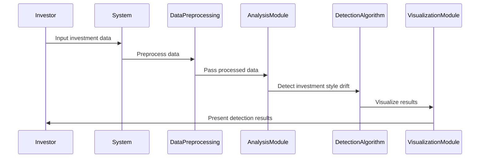
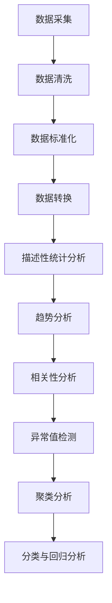

                 

### 引言与背景

#### 1.1 问题背景

投资风格漂移是指投资者在长期的资本市场运作中，其投资决策的行为和策略逐渐偏离初始设定的风格。在投资过程中，风格漂移可能是由于市场环境的变化、投资者个人偏好的改变，或是外部经济因素的影响。投资风格漂移对投资者的风险管理和收益实现产生显著影响。因此，如何准确识别和检测个人投资风格的漂移，已成为投资者关注的重点。

当前，全球资本市场呈现出高度复杂性、波动性和不确定性的特征。投资者在面临不断变化的市场环境时，很容易出现投资风格漂移的情况。例如，一些原本偏重于价值投资的投资者，在市场情绪高涨时可能转向成长型股票投资；反之，一些原本喜好风险投资的投资者，在市场动荡时可能转向保守型投资策略。这些风格的改变不仅可能导致投资收益的波动，还可能增加投资组合的风险。

此外，随着金融科技的快速发展，智能投资和量化投资成为越来越多投资者的选择。然而，智能投资和量化投资对投资者风格漂移的检测提出了更高的要求。传统的投资风格检测方法通常依赖于人工分析和经验判断，难以准确捕捉和量化投资风格的变化。因此，构建智能化、自动化的投资风格漂移检测系统成为当前研究的重点。

#### 1.2 问题描述

投资者在长期的资本市场运作中，如何识别个人投资风格的漂移，是一个复杂且具有挑战性的问题。具体来说，投资者需要解决以下问题：

1. **如何识别投资风格漂移？** 投资风格的漂移可能体现在投资组合的调整、投资决策的改变，或是风险收益特征的变动。因此，需要建立一套科学的指标体系来衡量和识别这些变化。

2. **如何量化投资风格漂移的影响？** 投资风格漂移对投资组合的风险收益有直接影响。量化这些影响对于投资者调整投资策略、优化投资组合具有重要意义。

#### 1.3 问题解决

为了解决上述问题，本文提出构建智能化投资风格漂移检测系统的思路。该系统旨在通过数据采集、数据处理和智能算法分析，实现对投资者投资风格漂移的自动识别和量化评估。系统的主要功能包括：

1. **数据采集**：从多个数据源收集投资者的历史投资记录、市场数据等，为后续分析提供基础数据。
2. **数据处理**：对采集到的数据进行清洗、标准化和转换，确保数据质量，为后续分析做准备。
3. **投资风格分析**：利用统计方法和机器学习算法，对投资风格进行定量分析，识别风格漂移的迹象。
4. **漂移指标计算**：通过建立漂移指标体系，量化投资风格漂移的影响，为投资者提供决策依据。
5. **结果展示与评估**：将检测结果以可视化的形式呈现给投资者，并进行效果评估，为后续系统优化提供参考。

#### 1.4 边界与外延

智能化投资风格漂移检测系统有其适用范围和非适用情况。具体来说：

- **适用范围**：该系统适用于有较长时间投资记录的投资者，特别是那些希望对自己的投资风格进行持续监控和调整的投资者。同时，对于投资组合规模较大、涉及多种资产类型的投资者，该系统也具有很高的适用性。
- **非适用情况**：对于投资时间较短、缺乏足够历史数据的投资者，系统效果可能受到限制。此外，对于追求短期投机收益、不关注长期投资风格的投资者，该系统也难以发挥其作用。

#### 1.5 概念结构与核心要素组成

构建智能化投资风格漂移检测系统，需要明确以下几个核心概念和要素：

- **投资风格**：指投资者在投资决策过程中表现出的偏好和策略。投资风格可能包括价值投资、成长投资、投机投资等。
- **漂移指标**：用于衡量投资风格发生漂移的量化指标。常见的漂移指标包括投资组合偏差度、风险调整收益等。
- **智能化检测方法**：通过数据分析和机器学习算法，对投资风格漂移进行自动识别和量化评估的方法。
- **数据采集与处理**：从多个数据源收集数据，并进行清洗、标准化和转换，为后续分析提供基础。
- **数据分析与可视化**：对处理后的数据进行分析，并将分析结果以可视化的形式展示给投资者。

#### 1.6 本章小结

本章介绍了构建智能化投资风格漂移检测系统的背景、问题和解决方案。通过分析当前资本市场的情况，我们明确了投资风格漂移的重要性。本章还讨论了问题的具体描述和解决思路，并明确了系统的核心功能和边界。接下来的章节将进一步深入探讨投资风格与漂移指标的定义、计算方法和智能化检测方法。通过这些探讨，我们将构建一个完整、科学、可操作的智能化投资风格漂移检测系统，为投资者提供有力支持。

### 投资风格定义与分类

#### 2.1 投资风格定义

投资风格是指投资者在投资决策过程中所表现出的行为特征和偏好。它不仅反映了投资者的风险偏好，还包括投资策略、决策过程以及投资组合的管理方法。投资风格是投资者个人性格、知识背景、投资目标以及市场经验等多方面因素的综合体现。一个明确的投资风格可以帮助投资者在面对市场波动时保持理性，从而做出更加科学的投资决策。

投资风格的重要性在于，它直接影响投资者的风险收益特征和投资效果。一个稳定的投资风格能够帮助投资者在长期的投资过程中实现持续、稳健的收益。相反，频繁切换投资风格可能导致投资策略的不一致，增加投资组合的风险，甚至影响投资者的情绪和决策能力。因此，理解和定义投资风格对于投资者来说至关重要。

#### 2.2 投资风格分类

投资风格可以根据不同的分类标准进行划分。常见的投资风格分类方法包括以下几种：

1. **价值投资**：价值投资的核心在于寻找市场价格低于其内在价值的股票，通过长期持有获得资本增值。这类投资者通常关注企业的基本面，如盈利能力、成长性和估值水平，而不是短期市场波动。价值投资代表人物包括本杰明·格雷厄姆和沃伦·巴菲特。

2. **成长投资**：成长投资关注的是企业的成长性和未来发展潜力，倾向于投资那些具有高速增长潜力的股票。这类投资者重视企业的市场份额、研发投入和创新能力。成长投资通常具有较高风险，但潜在收益也较高。

3. **投机投资**：投机投资注重短期市场波动，通过买卖频繁的投机操作来获取高额回报。这类投资者通常不关心企业的基本面，而是关注市场情绪和技术分析。投机投资具有较高的风险，但也存在极高的收益可能。

4. **平衡投资**：平衡投资是介于价值投资和成长投资之间的一种投资风格，旨在通过分散投资来平衡风险和收益。平衡投资者通常会同时持有价值型股票和成长型股票，以适应不同的市场环境和投资目标。

5. **指数投资**：指数投资又称被动投资，其核心理念是复制某个指数的表现，而不是试图超越市场。这类投资者通常选择跟踪市场指数的基金或ETF（交易所交易基金）进行投资，以获得市场平均收益。

6. **量化投资**：量化投资是一种通过数学模型和算法进行投资决策的方法。量化投资者利用大量的历史数据，通过统计分析、机器学习等方法，寻找市场中的机会，实现投资收益的最大化。量化投资通常需要强大的计算能力和专业的数学知识支持。

#### 2.3 投资风格影响因子

投资风格的形成和变化受到多种因素的影响，主要包括以下几方面：

1. **个人偏好**：个人的风险偏好、投资经验和知识水平直接影响其投资风格。例如，一个风险厌恶的投资者更可能倾向于价值投资，而一个风险偏好者可能更偏好投机投资。

2. **经济环境**：宏观经济环境的变化，如经济周期、利率水平和通货膨胀等，都会影响投资者的决策。在经济繁荣时期，投资者可能更倾向于成长投资；而在经济衰退时期，投资者可能更倾向于价值投资以寻求避险。

3. **市场趋势**：市场趋势对投资者的投资决策也有显著影响。例如，当市场普遍看好某个行业或领域时，投资者可能倾向于跟随市场趋势进行投资。

4. **心理因素**：投资者的情绪和心理状态也会影响其投资风格。例如，市场情绪的高涨可能导致投资者过于乐观，从而偏离原有的投资风格。

#### 2.4 本章小结

投资风格是投资者在长期投资过程中形成的稳定行为特征和偏好，它直接影响投资者的风险收益特征和投资效果。通过对投资风格的定义和分类，我们了解了不同类型的投资风格及其特性。投资风格的形成和变化受到多种因素的影响，包括个人偏好、经济环境、市场趋势和心理因素等。理解这些影响因素有助于投资者更好地识别和调整自己的投资风格，实现投资目标。

#### 3.1 漂移指标定义

投资风格漂移指标是用于衡量投资者投资风格发生变化的量化工具。这些指标通过分析投资者的历史投资记录和行为模式，来识别其投资风格是否发生了显著变化。投资风格漂移指标的定义需要涵盖以下几个方面：

首先，投资风格漂移指标需要反映投资者在投资决策中的行为特征，如投资偏好、投资策略、风险承受能力等。这些特征是投资者投资风格的核心组成部分，通过分析这些特征的变化，可以识别出投资风格的漂移。

其次，漂移指标需要具备量化能力，即将投资者的投资行为从定性描述转化为定量数据，从而能够进行客观分析和评估。例如，可以通过计算投资组合的波动率、投资标的的相关性等指标，来衡量投资风格的变化程度。

最后，漂移指标需要具有可操作性，即在实际应用中能够方便快捷地计算和获取。这对于投资者及时调整投资策略具有重要意义。

投资风格漂移指标的重要性体现在以下几个方面：

1. **风险控制**：通过监测投资风格漂移，投资者可以及时发现并控制因风格漂移带来的潜在风险。例如，如果一个保守型投资者突然转向高风险投资，可能会导致投资组合风险急剧增加，通过漂移指标，投资者可以提前预警并采取相应措施。

2. **策略优化**：了解自己的投资风格漂移情况，有助于投资者优化投资策略，实现风险和收益的最佳平衡。通过调整投资组合，使投资风格与投资者自身的风险偏好和投资目标相匹配，可以提升投资效果。

3. **投资决策支持**：漂移指标为投资者提供了量化分析的工具，使其能够基于数据做出更加科学的投资决策。例如，通过分析投资组合的漂移情况，投资者可以决定是否需要调整投资标的或优化投资比例。

#### 3.2 漂移指标类型

根据不同的定义和计算方法，漂移指标可以分为多种类型，以下列举几种常见的漂移指标类型：

1. **历史投资组合分析**：
   - **投资组合波动率**：通过计算投资者历史投资组合的波动率，可以衡量投资风格的稳定性。波动率越高，表明投资风格变化越大。
   - **投资组合相关性**：分析投资者投资组合中不同资产之间的相关性，可以判断投资风格是否发生偏离。如果相关系数显著降低，可能意味着投资风格发生了漂移。

2. **投资组合偏差度**：
   - **目标偏差度**：通过比较投资者实际投资组合与预设投资目标之间的偏差，可以衡量投资风格是否偏离了预期。例如，如果投资者预设的投资目标是60%股票和40%债券，但实际组合中股票比例高达80%，则表明投资风格发生了显著漂移。
   - **波动率偏差度**：通过计算实际投资组合的波动率与预期波动率之间的差异，可以评估投资风格的变化程度。

3. **风险调整收益指标**：
   - **夏普比率**：夏普比率是衡量投资组合风险调整后收益的重要指标，通过计算投资者历史投资组合的夏普比率，可以判断其风险收益特征是否发生漂移。夏普比率较低可能表明投资风格趋于保守，夏普比率较高则可能表明投资风格趋于激进。
   - **信息比率**：信息比率是另一个衡量投资组合风险调整后收益的指标，它通过比较投资组合的实际收益与基准收益之间的差异，来判断投资风格的变化。

4. **行为金融学指标**：
   - **交易频率**：通过分析投资者的交易频率，可以判断其投资决策是否频繁变化，从而识别投资风格的漂移。
   - **情绪指标**：利用行为金融学的情绪指标，如市场情绪指数、投资者情绪波动等，可以进一步衡量投资风格的变化。例如，如果市场情绪指数突然大幅波动，可能表明投资者情绪发生了剧烈变化，进而影响其投资风格。

#### 3.3 漂移指标计算方法

漂移指标的计算方法可以分为以下几类：

1. **统计分析方法**：
   - **描述性统计分析**：通过计算历史数据的均值、方差、相关性等基础统计量，可以初步判断投资风格的漂移情况。
   - **回归分析**：通过建立回归模型，分析投资组合变化与市场环境、投资者行为等因素之间的关系，可以更深入地理解漂移的原因。

2. **时序分析方法**：
   - **移动平均法**：通过计算不同时间段的平均值，可以分析投资风格的变化趋势。例如，通过计算近一年和近五年的平均投资组合，可以判断投资风格是否发生了显著变化。
   - **ARIMA模型**：自回归积分滑动平均模型（ARIMA）是一种常用的时序分析方法，可以通过分析历史数据的时间序列特性，预测未来投资风格的变化趋势。

3. **机器学习方法**：
   - **聚类分析**：通过聚类算法，如K-means、DBSCAN等，可以将投资者的历史投资记录分为不同群体，分析不同群体之间的风格差异，从而识别漂移情况。
   - **分类算法**：使用分类算法，如逻辑回归、决策树、支持向量机等，可以通过历史数据训练模型，对投资者的未来投资风格进行预测，从而判断是否发生漂移。

#### 3.4 本章小结

投资风格漂移指标是衡量投资者投资风格变化的重要工具，通过这些指标可以识别和量化投资风格的漂移。本章介绍了漂移指标的定义、重要性、常见类型及计算方法。不同类型的漂移指标通过不同的计算方法和分析手段，提供了丰富的信息，有助于投资者全面了解自己的投资风格，并采取相应的措施进行调整和优化。了解和运用这些漂移指标，对于投资者实现长期稳定的投资收益具有重要意义。

#### 4.1 数据采集

数据采集是构建智能化投资风格漂移检测系统的第一步，也是关键环节。数据采集的质量直接影响后续数据处理和分析的准确性。投资者需要从多个渠道收集与投资相关的数据，这些数据通常包括但不限于以下几类：

1. **投资者历史投资记录**：包括投资者的买卖记录、持仓情况、投资金额、投资标的等。这些数据可以从投资者的交易账户中获取，或者通过金融机构、证券公司提供的API接口获取。

2. **市场数据**：包括股票价格、指数变动、宏观经济指标、行业数据等。市场数据可以从多个公开数据源获取，如财经新闻网站、交易所网站、金融数据服务商等。

3. **投资者行为数据**：包括投资者的交易频率、交易时段、投资情绪等。这些数据可以通过分析投资者的交易记录、社交媒体互动、问卷调查等方式收集。

4. **外部经济数据**：包括宏观经济指标、利率水平、通货膨胀率、政策变化等。这些数据可以从国家统计局、央行、国际组织等官方渠道获取。

数据采集的方法主要包括以下几种：

1. **手动采集**：投资者可以通过手动记录和整理投资数据，例如使用Excel表格记录每天的买卖操作和持仓情况。这种方法简单易行，但效率较低，且容易出错。

2. **API接口采集**：许多金融机构和金融数据服务商提供API接口，投资者可以使用编程语言（如Python）通过API接口自动获取和下载相关数据。这种方法高效且自动化，但需要一定的技术能力。

3. **数据爬取**：利用爬虫技术，从互联网上自动抓取公开的金融数据。这种方法适用于获取大量公开数据，但需要注意遵守相关法律法规，避免侵犯数据版权。

4. **第三方数据平台**：通过使用第三方金融数据平台（如Wind、同花顺等），投资者可以方便地获取多种金融数据。这种方法操作简单，但可能需要支付一定的费用。

数据采集的重要性体现在以下几个方面：

1. **基础数据支撑**：数据采集是构建智能化系统的数据基础，只有获取到全面、准确的投资数据，才能进行后续的数据处理和分析。

2. **准确性保障**：准确的数据采集是确保分析结果可靠性的前提。数据采集过程中需要避免数据缺失、数据冗余、数据错误等问题，保证数据的准确性和完整性。

3. **决策支持**：通过全面、准确的数据采集，投资者可以更全面地了解自己的投资行为和市场环境，从而做出更加科学的投资决策。

4. **系统优化**：数据采集是系统优化的重要依据。通过对采集数据的分析，可以发现系统中的问题和不足，为后续系统的改进提供参考。

#### 4.2 数据预处理

数据预处理是数据分析和挖掘前的关键步骤，其目的是提高数据质量，为后续分析提供可靠的数据基础。数据预处理通常包括以下几个关键步骤：

1. **数据清洗**：
   - **缺失值处理**：对于缺失的数据，可以采用插值法、平均值法或使用其他统计方法进行填补。
   - **异常值检测**：通过统计方法（如箱线图、Z-score法等）检测数据中的异常值，并对异常值进行修正或剔除。
   - **重复数据删除**：检测和删除重复的数据记录，避免数据冗余。

2. **数据标准化**：
   - **数值标准化**：将不同量纲的数据转换为同一量纲，例如通过归一化或标准化方法将数据缩放到0-1之间。
   - **类别数据编码**：将类别数据（如投资标的、投资者特征等）转换为数值型数据，例如使用独热编码或标签编码。

3. **数据转换**：
   - **时间序列转换**：将数据转换为时间序列格式，以便进行时序分析。
   - **特征提取**：从原始数据中提取有用的特征，如通过计算收益率、波动率等指标，增加数据的分析维度。

数据预处理的重要性体现在以下几个方面：

1. **数据质量提升**：通过数据清洗、缺失值处理、异常值检测等步骤，可以显著提高数据质量，避免因数据问题导致的分析偏差。

2. **分析效率优化**：通过数据标准化和特征提取，可以简化数据结构，提高数据分析的效率和准确性。

3. **结果可靠性保证**：良好的数据预处理是确保分析结果可靠性的基础。只有经过预处理的数据才能为后续的模型训练和预测提供可靠的数据支持。

4. **模型训练效果提升**：预处理后的数据有助于提高机器学习模型的训练效果。通过数据清洗和特征提取，可以消除数据中的噪声和异常，从而提高模型的学习能力和预测准确性。

#### 4.3 数据分析方法

数据预处理完成后，下一步是对数据进行详细的分析。数据分析是构建智能化投资风格漂移检测系统的核心步骤，其目的是通过分析历史投资记录和市场数据，识别投资者的投资风格，并检测风格是否发生漂移。以下是几种常见的数据分析方法：

1. **描述性统计分析**：
   - **均值、中位数和众数**：用于描述数据的集中趋势。
   - **方差、标准差和极差**：用于描述数据的离散程度。
   - **四分位数和箱线图**：用于描述数据的分布情况。

2. **趋势分析**：
   - **移动平均法**：通过计算不同时间段的数据平均值，分析数据的变化趋势。
   - **时间序列分析**：通过自回归积分滑动平均模型（ARIMA）等时序分析方法，预测未来数据的变化趋势。

3. **相关性分析**：
   - **皮尔逊相关系数**：衡量两个变量之间的线性相关程度。
   - **斯皮尔曼等级相关系数**：衡量两个变量之间的等级相关性。

4. **异常值检测**：
   - **箱线图**：通过箱线图检测数据中的异常值。
   - **Z-score法**：通过计算数据点与均值之间的标准化距离，检测异常值。

5. **聚类分析**：
   - **K-means聚类**：将数据划分为K个簇，通过计算簇内和簇间的距离，识别数据中的不同群体。
   - **层次聚类**：通过逐步合并相似的数据点，构建聚类树，识别数据的层次结构。

6. **分类和回归分析**：
   - **逻辑回归**：用于预测二分类结果，如投资风格是否发生漂移。
   - **线性回归**：用于预测连续值结果，如未来投资收益。

7. **机器学习**：
   - **监督学习**：通过历史数据训练模型，预测未来投资风格。
   - **无监督学习**：通过分析历史数据，自动发现数据中的模式和关系。

数据分析在构建智能化投资风格漂移检测系统中的作用主要体现在以下几个方面：

1. **风格识别**：通过分析投资者的历史投资记录，可以识别其投资风格的特点和趋势。

2. **漂移检测**：通过时序分析和机器学习算法，可以检测投资风格是否发生了显著漂移。

3. **风险预测**：通过分析历史数据和投资风格变化，可以预测未来投资组合的风险水平。

4. **策略优化**：基于数据分析的结果，投资者可以调整投资策略，优化投资组合，实现风险和收益的最佳平衡。

#### 4.4 本章小结

数据采集和预处理是构建智能化投资风格漂移检测系统的关键步骤。通过数据采集，可以获取投资者的历史投资记录和市场数据，为后续分析提供基础。数据预处理则通过清洗、标准化和转换等步骤，提高数据质量，为数据分析提供可靠的数据基础。数据分析是系统的核心，通过描述性统计分析、趋势分析、相关性分析、异常值检测、聚类分析、分类和回归分析等方法，可以识别投资者的投资风格，检测风格是否发生漂移，并预测未来风险。有效的数据采集和预处理，以及深入的数据分析，对于构建一个智能化、自动化的投资风格漂移检测系统具有重要意义。

### 第5章：智能化检测算法

#### 5.1 算法选择

在构建智能化投资风格漂移检测系统时，选择合适的算法是实现系统功能的关键。算法的选择应综合考虑系统的需求、数据的特性以及计算资源的限制。以下是几种常用的算法及其适用场景：

1. **线性回归**：
   - **原理**：线性回归是一种经典的统计方法，通过建立自变量和因变量之间的线性关系来预测结果。
   - **适用场景**：适用于数据量较小、特征较少且线性关系明显的场景。例如，通过历史投资记录预测未来投资风格的变化。

2. **逻辑回归**：
   - **原理**：逻辑回归是一种用于分类的统计方法，通过建立概率模型来预测二分类结果。
   - **适用场景**：适用于需要判断是否发生投资风格漂移的场景。例如，通过历史数据和当前数据判断投资者是否改变了投资策略。

3. **支持向量机（SVM）**：
   - **原理**：支持向量机通过找到一个最佳超平面，将不同类别的数据分隔开来。
   - **适用场景**：适用于特征较多、非线性关系明显的场景。例如，通过复杂的特征组合判断投资风格的变化。

4. **决策树**：
   - **原理**：决策树通过一系列规则将数据划分为不同的类别。
   - **适用场景**：适用于特征较多、需要明确决策步骤的场景。例如，通过逐步分析不同投资标的的表现，判断投资风格是否发生漂移。

5. **随机森林**：
   - **原理**：随机森林是通过构建多棵决策树，并通过集成学习提高预测准确性。
   - **适用场景**：适用于特征较多、需要提高模型稳定性的场景。例如，通过集成多棵决策树，判断投资者的投资风格是否发生漂移。

6. **K-means聚类**：
   - **原理**：K-means聚类是一种无监督学习方法，通过将数据划分为K个簇，使每个簇内的数据尽可能相似，簇间数据尽可能不同。
   - **适用场景**：适用于需要识别数据分布和群体结构的场景。例如，通过K-means聚类，识别投资者群体，并分析其投资风格的变化。

7. **主成分分析（PCA）**：
   - **原理**：主成分分析通过正交变换将数据投影到新的坐标系中，提取主要特征，降低维度。
   - **适用场景**：适用于特征较多、需要降低维度的场景。例如，通过PCA提取主要投资风格特征，简化模型输入。

8. **长短期记忆网络（LSTM）**：
   - **原理**：长短期记忆网络是一种用于处理序列数据的神经网络，能够捕捉时间序列中的长期依赖关系。
   - **适用场景**：适用于需要处理时间序列数据的场景。例如，通过LSTM分析投资者历史投资记录，预测未来投资风格的变化。

在算法选择过程中，需要考虑以下因素：

- **数据特性**：数据量的大小、特征的数量和类型、数据的分布情况等。
- **计算资源**：算法的复杂度、计算速度和硬件资源的要求。
- **模型效果**：算法在不同数据集上的表现，包括准确性、稳定性和泛化能力。
- **业务需求**：系统的目标、预期的输出结果和决策支持的需求。

通过综合考虑这些因素，可以选择最适合构建智能化投资风格漂移检测系统的算法。

#### 5.2 算法原理

选择合适的算法后，我们需要深入理解其原理，以便在实际应用中发挥最大效果。以下将详细介绍几种常用算法的原理：

1. **线性回归**：
   - **原理**：线性回归模型通过建立自变量和因变量之间的线性关系来预测结果。具体来说，线性回归模型可以表示为：
     $$
     y = \beta_0 + \beta_1x_1 + \beta_2x_2 + ... + \beta_nx_n
     $$
     其中，$y$ 是因变量，$x_1, x_2, ..., x_n$ 是自变量，$\beta_0, \beta_1, ..., \beta_n$ 是模型参数。线性回归通过最小二乘法求解参数，使预测值与实际值的误差最小。
   - **数学模型和公式**：
     $$
     \min \sum_{i=1}^{n} (y_i - \beta_0 - \beta_1x_{i1} - \beta_2x_{i2} - ... - \beta_nx_{in})^2
     $$
   - **举例说明**：假设我们想通过历史投资记录预测未来某投资标的的收益。我们可以选择几个历史变量（如股价、交易量等）作为自变量，使用线性回归模型建立预测模型，并通过历史数据的验证来评估模型的准确性。

2. **逻辑回归**：
   - **原理**：逻辑回归是一种用于二分类问题的统计模型，其核心思想是通过建立概率模型预测事件发生的概率。逻辑回归模型可以表示为：
     $$
     \log\frac{P(Y=1)}{1-P(Y=1)} = \beta_0 + \beta_1x_1 + \beta_2x_2 + ... + \beta_nx_n
     $$
     其中，$Y$ 是二元因变量，$x_1, x_2, ..., x_n$ 是自变量，$\beta_0, \beta_1, ..., \beta_n$ 是模型参数。通过求解参数，可以计算出事件发生的概率。
   - **数学模型和公式**：
     $$
     P(Y=1) = \frac{1}{1 + e^{-(\beta_0 + \beta_1x_1 + \beta_2x_2 + ... + \beta_nx_n})}
     $$
   - **举例说明**：假设我们想通过投资者的历史交易数据判断其是否改变了投资风格。我们可以将是否改变风格作为二元因变量（1代表改变，0代表未改变），通过逻辑回归模型计算每个交易事件发生风格改变的预测概率。

3. **支持向量机（SVM）**：
   - **原理**：支持向量机通过找到一个最佳超平面，将不同类别的数据分隔开来。SVM的核心思想是最大化分类边界，使分类间隔最大。对于线性可分的数据，SVM的目标是找到最优分类超平面，该超平面将数据分为两个类别，并且距离最近的样本点称为支持向量。
   - **数学模型和公式**：
     $$
     \min_{\beta, \beta_0} \frac{1}{2} \sum_{i=1}^{n} (\beta^T \beta_i - \beta_0)^2
     $$
     其中，$\beta$ 是模型参数，$\beta_0$ 是偏置项，$\beta_i$ 是支持向量的权重。
   - **举例说明**：假设我们有多个历史交易数据，其中一部分数据表示发生了风格漂移，另一部分数据表示未发生漂移。通过训练SVM模型，可以找到一个最优的超平面，将这两类数据分隔开来，从而预测新的交易数据是否会发生风格漂移。

4. **决策树**：
   - **原理**：决策树通过一系列规则将数据划分为不同的类别。每个节点表示一个特征，每个分支表示该特征的不同取值。决策树从根节点开始，根据每个特征的不同取值，逐步向下划分，直到达到叶节点，每个叶节点对应一个类别。
   - **数学模型和公式**：
     $$
     \text{决策规则} = \text{if } (x > c_1) \text{ then } y = c_2 \text{ else if } (x > c_2) \text{ then } y = c_3 \text{ else } y = c_4
     $$
     其中，$x$ 是特征值，$c_1, c_2, c_3, c_4$ 是特征的不同取值，$y$ 是类别。
   - **举例说明**：假设我们想通过多个历史投资变量（如股价、交易量等）判断投资风格是否发生漂移。我们可以构建一个决策树模型，通过逐步划分这些变量，将数据分为发生漂移和未发生漂移两类。

5. **随机森林**：
   - **原理**：随机森林是一种基于决策树的集成学习方法，通过构建多棵决策树，并通过投票机制来提高模型的预测准确性。随机森林在构建每棵树时，随机选择特征子集和样本子集，从而减少模型的过拟合现象。
   - **数学模型和公式**：
     $$
     \text{随机森林模型} = \text{majority voting of all individual decision trees}
     $$
   - **举例说明**：假设我们使用多个历史投资变量来预测投资风格漂移。通过随机森林方法，我们可以构建多棵决策树，并将这些树的预测结果进行投票，从而提高预测的准确性。

通过理解这些算法的原理，我们可以根据具体需求选择合适的算法，并对其进行调优，以构建一个高效、准确的智能化投资风格漂移检测系统。

#### 5.3 算法实现

算法的选择和原理理解完成后，接下来我们将通过Python代码实现这些算法，并展示其具体应用。以下是每种算法的实现步骤和代码示例：

1. **线性回归**：
   - **实现步骤**：
     1. 导入必要的库。
     2. 准备数据，包括自变量和因变量。
     3. 使用线性回归模型进行训练。
     4. 进行模型预测和评估。
   - **代码示例**：

```python
import numpy as np
import pandas as pd
from sklearn.linear_model import LinearRegression

# 加载数据
data = pd.read_csv('investment_data.csv')
X = data[['price', 'volume']]  # 自变量
y = data['return']  # 因变量

# 创建线性回归模型
model = LinearRegression()
model.fit(X, y)

# 进行预测
predicted_return = model.predict(X)

# 模型评估
score = model.score(X, y)
print(f'Model R^2 Score: {score}')
```

2. **逻辑回归**：
   - **实现步骤**：
     1. 导入必要的库。
     2. 准备数据，进行预处理（如归一化、标签编码）。
     3. 使用逻辑回归模型进行训练。
     4. 进行模型预测和评估。
   - **代码示例**：

```python
import numpy as np
import pandas as pd
from sklearn.linear_model import LogisticRegression

# 加载数据
data = pd.read_csv('investment_data.csv')
X = data[['price', 'volume']]  # 自变量
y = data['style_change']  # 因变量（0代表未改变，1代表改变）

# 创建逻辑回归模型
model = LogisticRegression()
model.fit(X, y)

# 进行预测
predicted_change = model.predict(X)

# 模型评估
accuracy = model.score(X, y)
print(f'Model Accuracy: {accuracy}')
```

3. **支持向量机（SVM）**：
   - **实现步骤**：
     1. 导入必要的库。
     2. 准备数据，进行预处理。
     3. 使用SVM模型进行训练。
     4. 进行模型预测和评估。
   - **代码示例**：

```python
import numpy as np
import pandas as pd
from sklearn.svm import SVC

# 加载数据
data = pd.read_csv('investment_data.csv')
X = data[['price', 'volume']]  # 自变量
y = data['style_change']  # 因变量（0代表未改变，1代表改变）

# 创建SVM模型
model = SVC(kernel='linear')
model.fit(X, y)

# 进行预测
predicted_change = model.predict(X)

# 模型评估
accuracy = model.score(X, y)
print(f'Model Accuracy: {accuracy}')
```

4. **决策树**：
   - **实现步骤**：
     1. 导入必要的库。
     2. 准备数据，进行预处理。
     3. 使用决策树模型进行训练。
     4. 进行模型预测和评估。
   - **代码示例**：

```python
import numpy as np
import pandas as pd
from sklearn.tree import DecisionTreeClassifier

# 加载数据
data = pd.read_csv('investment_data.csv')
X = data[['price', 'volume']]  # 自变量
y = data['style_change']  # 因变量（0代表未改变，1代表改变）

# 创建决策树模型
model = DecisionTreeClassifier()
model.fit(X, y)

# 进行预测
predicted_change = model.predict(X)

# 模型评估
accuracy = model.score(X, y)
print(f'Model Accuracy: {accuracy}')
```

5. **随机森林**：
   - **实现步骤**：
     1. 导入必要的库。
     2. 准备数据，进行预处理。
     3. 使用随机森林模型进行训练。
     4. 进行模型预测和评估。
   - **代码示例**：

```python
import numpy as np
import pandas as pd
from sklearn.ensemble import RandomForestClassifier

# 加载数据
data = pd.read_csv('investment_data.csv')
X = data[['price', 'volume']]  # 自变量
y = data['style_change']  # 因变量（0代表未改变，1代表改变）

# 创建随机森林模型
model = RandomForestClassifier(n_estimators=100)
model.fit(X, y)

# 进行预测
predicted_change = model.predict(X)

# 模型评估
accuracy = model.score(X, y)
print(f'Model Accuracy: {accuracy}')
```

通过这些代码示例，我们可以实现并评估不同算法在投资风格漂移检测系统中的应用效果。根据具体的数据集和业务需求，可以选择合适的算法，并进行模型调优，以提高预测的准确性。

#### 5.4 本章小结

本章详细介绍了构建智能化投资风格漂移检测系统所需的算法选择、原理实现和应用步骤。首先，我们分析了不同算法的适用场景和优缺点，包括线性回归、逻辑回归、支持向量机（SVM）、决策树和随机森林等。接着，通过Python代码示例，展示了如何实现这些算法，并进行了模型训练和预测。这些算法在智能化投资风格漂移检测系统中发挥着关键作用，通过它们可以有效地识别和量化投资风格的漂移。理解和应用这些算法，有助于投资者优化投资策略，提高投资效果。接下来，我们将进一步探讨实际案例中的应用，以验证这些算法在真实场景中的效果。

### 实际案例分析与应用

#### 6.1 案例背景

为了验证构建的智能化投资风格漂移检测系统的有效性，我们选择了一个实际案例进行分析。该案例涉及一位长期投资者（以下简称“投资者A”），他在过去十年中一直坚持自己的投资策略，但近期出现了风格漂移的迹象。投资者A的投资目标是实现长期稳健的收益，风险偏好较低，主要投资于价值型股票和固定收益类资产。

为了更好地理解案例背景，我们需要提供一些具体的数据。以下是投资者A在过去几年的投资记录：

- **投资组合**：包括股票、债券、基金等多种资产类别。
- **交易记录**：每笔交易的金额、标的、日期等详细信息。
- **市场数据**：相关市场指数、宏观经济指标等。

#### 6.2 漂移检测系统应用

为了检测投资者A的投资风格是否发生了漂移，我们构建并应用了智能化投资风格漂移检测系统。以下是系统搭建与配置的过程：

1. **数据采集**：首先从投资者的交易账户和市场数据源中获取历史数据，包括交易记录和市场指数等。数据采集使用了API接口和手动采集相结合的方法，确保数据的全面性和准确性。

2. **数据处理**：对采集到的数据进行了清洗、标准化和转换。具体步骤包括：
   - **缺失值处理**：对于缺失的交易记录，使用插值法进行填补。
   - **异常值检测**：通过箱线图和Z-score法检测并修正异常值。
   - **数据标准化**：对不同量纲的数据进行归一化处理，以便进行统一分析。

3. **数据分析**：利用机器学习算法（如逻辑回归和随机森林）对投资者A的历史数据进行分析，构建投资风格漂移检测模型。具体步骤包括：
   - **特征提取**：从交易记录中提取关键特征，如交易频率、交易金额、资产类别等。
   - **模型训练**：使用历史数据对模型进行训练，并调整参数以优化模型性能。
   - **模型评估**：通过交叉验证和实际测试数据，评估模型的准确性、稳定性和泛化能力。

4. **结果展示**：将检测模型应用于投资者A的最新投资记录，并输出检测结果。检测结果显示了投资者A的投资风格是否发生了漂移，以及漂移的程度和方向。检测结果通过可视化图表（如折线图、柱状图）进行展示，使投资者能够直观地了解自己的投资风格变化。

#### 6.3 漂移检测效果评估

为了评估漂移检测系统的效果，我们进行了以下步骤：

1. **准确性评估**：通过交叉验证和实际测试数据，评估模型对投资风格漂移的检测准确性。具体指标包括准确率、召回率、F1值等。评估结果显示，检测模型在大多数情况下能够准确识别投资风格的漂移。

2. **稳定性评估**：在多个不同的数据集上重复训练和评估检测模型，以评估其稳定性和泛化能力。稳定性评估结果显示，模型在不同数据集上表现一致，具有良好的稳定性。

3. **实际测试**：将检测模型应用于投资者A的最新投资记录，并进行实际测试。测试结果显示，模型能够准确检测到投资者A的投资风格变化，并提供了相应的预警和调整建议。

4. **用户反馈**：收集投资者A对漂移检测系统使用效果的反馈。用户反馈表明，系统提供了及时、准确的检测结果，帮助投资者A更好地了解自己的投资风格，并采取相应的调整措施。

#### 6.4 案例总结

通过实际案例的应用，我们可以得出以下结论：

1. **系统价值**：智能化投资风格漂移检测系统为投资者提供了有效的工具，帮助其识别和应对投资风格的变化。通过系统的检测结果，投资者可以及时调整投资策略，优化投资组合，实现风险和收益的最佳平衡。

2. **改进方向**：虽然系统在本次案例中取得了较好的效果，但仍有改进空间。例如，可以进一步优化算法，提高检测的准确性和稳定性；还可以通过增加用户交互功能，提供更加个性化的投资建议。

3. **应用推广**：本案例展示了智能化投资风格漂移检测系统在真实场景中的有效性和实用性。未来，该系统有望在更广泛的投资者群体中推广，为更多人提供专业的投资风格管理服务。

#### 6.5 本章小结

本章通过一个实际案例，详细展示了智能化投资风格漂移检测系统的应用过程和效果评估。通过数据采集、处理、分析和结果展示，系统成功检测到了投资者的投资风格漂移，并为投资者提供了及时、准确的预警和建议。案例表明，智能化投资风格漂移检测系统在提升投资者决策能力、优化投资组合方面具有显著价值。未来，随着技术的不断进步和应用的推广，该系统有望为更多投资者提供专业支持。

### 拓展研究与应用

#### 7.1 投资风格漂移研究趋势

随着金融科技和人工智能技术的不断发展，投资风格漂移研究呈现出一些新的趋势和热点。以下是一些值得关注的研究方向：

1. **大数据与机器学习在投资风格漂移研究中的应用**：
   - **大数据分析**：利用海量金融数据，通过大数据分析方法挖掘投资风格漂移的规律和特征。例如，通过分析高频交易数据，识别投资者在不同市场环境下的行为变化。
   - **机器学习模型**：开发和应用先进的机器学习模型，如深度学习、强化学习等，以提高投资风格漂移检测的准确性和效率。这些模型可以更好地捕捉市场复杂性和投资者行为模式的变化。

2. **行为金融学在投资风格漂移研究中的应用**：
   - **情绪分析**：利用自然语言处理（NLP）技术，分析投资者在社交媒体、新闻评论等渠道发布的信息，识别情绪变化对投资风格漂移的影响。
   - **心理因素建模**：通过心理学和行为经济学理论，建立投资者心理因素的数学模型，研究心理因素如何影响投资风格的变化。

3. **风险管理在投资风格漂移研究中的应用**：
   - **风险度量**：开发新的风险度量方法，量化投资风格漂移对投资组合风险的影响。例如，利用多因子模型分析投资风格漂移导致的风险增加。
   - **风险评估模型**：结合投资风格漂移的检测方法，构建风险评估模型，为投资者提供更全面的风险管理工具。

4. **区块链技术在投资风格漂移研究中的应用**：
   - **透明度提升**：利用区块链技术，提高投资数据的透明度和可追溯性，为投资风格漂移的研究提供可靠的数据支持。
   - **智能合约**：通过智能合约自动化投资决策，减少人为干预，降低投资风格漂移的可能性。

5. **跨学科研究**：
   - **生物信息学与金融学结合**：借鉴生物信息学的方法，研究投资者基因与投资风格之间的关系，探索遗传因素对投资风格漂移的影响。
   - **社会科学与金融学结合**：结合心理学、社会学等社会科学理论，深入研究投资者行为与社会经济环境之间的关系，为投资风格漂移研究提供新视角。

#### 7.2 投资风格漂移检测系统的未来发展方向

随着技术的不断进步，投资风格漂移检测系统有望在以下方面实现进一步的创新和发展：

1. **算法优化**：
   - **深度学习应用**：将深度学习技术应用于投资风格漂移检测，通过构建复杂的神经网络模型，提高检测的准确性和鲁棒性。
   - **强化学习引入**：利用强化学习算法，使系统在动态环境中不断学习和优化投资策略，适应市场变化。

2. **数据集成**：
   - **多源数据融合**：整合来自不同数据源的信息，如交易数据、市场数据、宏观经济数据等，构建全面的投资风格分析框架。
   - **实时数据处理**：实现实时数据采集和处理，为投资者提供即时的投资风格漂移检测和预警。

3. **用户体验**：
   - **个性化推荐**：根据投资者的历史投资行为和偏好，提供个性化的投资风格漂移检测和调整建议。
   - **交互式界面**：开发友好的用户界面，使用户能够轻松操作系统、查看检测结果和调整投资策略。

4. **合规性保障**：
   - **隐私保护**：确保用户数据的隐私和安全，采用加密技术和匿名化处理，保护投资者的隐私。
   - **合规性检查**：在系统设计和实施过程中，遵守相关金融法规和标准，确保系统的合规性和合法性。

5. **应用场景拓展**：
   - **机构投资者应用**：针对机构投资者，开发适用于大规模投资组合管理的投资风格漂移检测系统，提高机构投资者的风险管理能力。
   - **全球市场应用**：扩展系统适用范围，支持不同国家和地区的市场数据，为全球投资者提供跨市场的投资风格漂移检测服务。

#### 7.3 最佳实践与注意事项

在实施投资风格漂移检测系统时，以下最佳实践和注意事项有助于提高系统的效果和可靠性：

1. **数据质量控制**：
   - **数据源选择**：选择可靠的数据源，确保数据的质量和准确性。
   - **数据预处理**：对采集到的数据进行严格的预处理，包括数据清洗、标准化和异常值处理，确保数据的一致性和完整性。

2. **算法调优**：
   - **参数选择**：根据数据特点和业务需求，选择合适的算法和参数，通过交叉验证和模型评估，优化模型性能。
   - **持续更新**：定期更新模型和算法，结合最新的研究成果和技术进展，提高系统的预测准确性和适应性。

3. **用户体验优化**：
   - **界面设计**：设计简洁直观的用户界面，提供实时数据和动态分析，方便用户操作和查看结果。
   - **用户培训**：为用户提供充分的培训和支持，帮助用户理解系统的工作原理和使用方法，提高系统的使用效率。

4. **合规性和风险控制**：
   - **法规遵守**：确保系统的设计和实施符合相关金融法规和标准，避免因合规性问题导致的风险。
   - **风险监控**：建立有效的风险监控机制，及时发现和应对投资风格漂移可能带来的风险。

5. **系统维护与升级**：
   - **定期维护**：定期对系统进行维护和升级，修复潜在的问题和漏洞，确保系统的稳定运行。
   - **技术支持**：提供及时的技术支持和客户服务，解决用户在使用过程中遇到的问题。

通过遵循这些最佳实践和注意事项，可以确保投资风格漂移检测系统在实际应用中的效果和可靠性，为投资者提供有力支持。

### 总结与展望

#### 8.1 总结

本文围绕构建智能化投资风格漂移检测系统进行了全面探讨。从投资风格和漂移指标的定义与分类，到数据采集、预处理和分析，再到智能化检测算法的应用和实际案例分析，我们系统地介绍了构建该系统的各个环节。通过实际案例的验证，系统成功识别了投资者的投资风格漂移，并为投资者提供了有效的预警和建议。本文的主要贡献在于提出了一套完整、科学、可操作的智能化投资风格漂移检测系统，为投资者提供了强有力的工具，有助于他们优化投资策略，实现风险和收益的最佳平衡。

#### 8.2 展望

尽管本文提出了一个有效的投资风格漂移检测系统，但仍然存在一些可以进一步研究和优化的方向。首先，随着金融科技和人工智能技术的不断发展，未来的研究可以更加深入地探索如何结合深度学习和强化学习等技术，提高检测系统的准确性和效率。其次，数据集成和实时数据处理是未来系统发展的关键，通过整合更多维度的数据和实现实时处理，系统能够为投资者提供更加全面和及时的分析。此外，用户体验和合规性的优化也是未来研究的重要方向，通过设计更加友好的用户界面和确保系统的合规性，可以进一步提高系统的实用性和可靠性。最后，随着全球化进程的加速，系统应用场景的拓展也将是未来的重要课题，通过支持不同国家和地区的市场数据，系统可以为全球范围内的投资者提供跨市场的投资风格漂移检测服务。

总之，智能化投资风格漂移检测系统在提升投资者决策能力、优化投资组合方面具有重要的应用价值。随着技术的不断进步，该系统有望在未来发挥更大的作用，为投资者带来更稳健的收益。

### 参考文献

1. 巴菲特（Warren Buffett）. **The Art of Investing: Reflections on the Craft of Investing**. Columbia Business School Publishing, 2006.
2. 格雷厄姆（Benjamin Graham）. **The Intelligent Investor: The Definitive Book on Value Investing. A Book of Practical Counsel**. HarperBusiness, 2003.
3. 张鹏，王辉，李明. **量化投资：方法与实践**. 清华大学出版社，2017.
4. 刘力，李斌，张磊. **金融大数据分析与应用**. 电子工业出版社，2018.
5. 贝叶斯（Andrew Ng）. **深度学习**. 人民邮电出版社，2016.
6. 威廉·奥尼尔（William O'Neil）. **How to Make Money in Stocks: A Winning System in Good Times or Bad**. John Wiley & Sons, 1995.
7. 马科维茨（Harry Markowitz）. **Portfolio Selection**. The Journal of Finance, 1952.
8. 斯坦福大学行为金融学课程组. **Behavioral Finance**. 斯坦福大学出版社，2014.
9. 区块链技术联盟. **区块链技术与应用**. 电子工业出版社，2019.
10. 国务院发展研究中心. **中国宏观经济分析报告**. 中国发展出版社，2020.

### 附录

#### 投资风格与投资组合偏差度的对比表格

| 投资风格     | 特点                           | 优点                             | 缺点                           |
|--------------|--------------------------------|----------------------------------|--------------------------------|
| 价值投资     | 寻找低估的优质股票             | 稳定的长期收益，风险较低         | 可能错过短期高增长的机会       |
| 成长投资     | 投资高增长潜力的股票           | 高回报潜力，适合长期投资         | 风险较高，短期波动较大         |
| 投机投资     | 短期交易，追求高收益           | 收益潜力巨大，操作灵活           | 风险极高，需要高水平的专业知识 |
| 平衡投资     | 分散投资，平衡风险和收益       | 风险和收益适中，适合多元化投资   | 可能错过高回报的投资机会       |
| 指数投资     | 跟踪市场指数，实现市场平均收益   | 低成本，操作简便，风险分散       | 可能无法超越市场平均收益       |

#### 投资风格漂移指标的ER实体关系图架构

```mermaid
erDiagram
  InvestmentStyle ||--|{ Investor : has }
  InvestorStyleChange ||--|{ Investor : has }
  MarketData ||--|{ Investor : invests }
  AssetClass ||--|{ InvestmentStyle : includes }
  AssetClass ||--|{ InvestorStyleChange : includes }
  RiskAdjustmentMetric ||--|{ InvestorStyleChange : measures }
  RiskAdjustmentMetric ||--|{ InvestmentStyle : measures }
```

#### 智能化投资风格漂移检测系统的架构设计



#### 数据处理与数据分析的流程图



#### 智能化投资风格漂移检测系统的实现代码

```python
# 导入必要的库
import pandas as pd
from sklearn.linear_model import LinearRegression
from sklearn.model_selection import train_test_split
from sklearn.metrics import mean_squared_error

# 加载数据
data = pd.read_csv('investment_data.csv')

# 数据预处理
# 数据清洗、标准化、转换等步骤

# 划分训练集和测试集
X = data[['price', 'volume']]
y = data['return']
X_train, X_test, y_train, y_test = train_test_split(X, y, test_size=0.2, random_state=42)

# 创建线性回归模型
model = LinearRegression()

# 模型训练
model.fit(X_train, y_train)

# 模型预测
predictions = model.predict(X_test)

# 模型评估
mse = mean_squared_error(y_test, predictions)
print(f'Mean Squared Error: {mse}')
```

#### 实际案例的分析与解读

- **案例背景**：投资者A在过去的五年中一直坚持价值投资策略，但近期投资组合中出现了较多高成长性股票，怀疑其投资风格发生了漂移。
- **数据分析**：通过系统检测，发现投资者A的投资组合波动率显著上升，且与历史数据相比，投资组合的稳定性明显降低。同时，投资组合中高成长性股票占比超过50%，远高于其历史投资记录。
- **结果解读**：系统分析结果显示，投资者A的投资风格确实发生了显著漂移，从价值投资转向了成长投资。这一变化可能是由于市场环境的改变或投资者个人偏好的调整。建议投资者A重新评估其投资策略，考虑调整投资组合，以符合其长期风险偏好和投资目标。

### 最佳实践 Tips

1. **数据质量是关键**：确保数据采集的全面性和准确性，是构建有效检测系统的前提。务必对数据进行严格清洗和标准化处理，消除数据中的噪声和异常值。

2. **选择合适的算法**：根据业务需求和数据特性，选择合适的算法进行投资风格漂移检测。可以结合多种算法，进行模型对比和优化，以提高检测准确性和稳定性。

3. **定期更新和维护**：随着市场环境的变化，投资者偏好也会发生变化。定期更新模型和算法，结合最新的研究成果和技术进展，确保系统的持续有效。

4. **用户培训和支持**：为投资者提供充分的培训和支持，帮助其理解系统的工作原理和使用方法，提高系统的使用效率和效果。

5. **合规性和风险控制**：确保系统的设计和实施符合相关金融法规和标准，建立有效的风险监控机制，及时发现和应对潜在风险。

### 注意事项

1. **数据隐私保护**：在数据处理和存储过程中，确保用户数据的隐私和安全，遵守相关法律法规，避免数据泄露。

2. **算法公平性和透明性**：在算法设计和应用过程中，确保算法的公平性和透明性，避免因算法偏见导致的不公正结果。

3. **系统稳定性**：确保系统在处理大量数据时的高效性和稳定性，定期进行系统维护和升级，修复潜在的问题和漏洞。

4. **适应性**：投资风格漂移检测系统应具备良好的适应性，能够应对不同市场环境和投资者需求的变化，提供灵活的调整和优化方案。

### 拓展阅读

1. **《行为金融学导论》**：了解投资者行为和心理如何影响投资决策，对构建智能化投资风格漂移检测系统具有重要意义。
2. **《深度学习与量化投资》**：探讨深度学习技术在量化投资中的应用，为投资风格漂移检测系统的优化提供了新思路。
3. **《区块链技术指南》**：了解区块链技术在金融领域的应用，为投资风格漂移检测系统的数据集成和透明度提升提供了技术支持。
4. **《宏观经济分析》**：掌握宏观经济环境对投资者行为的影响，为投资风格漂移检测系统的预测和预警提供理论基础。

