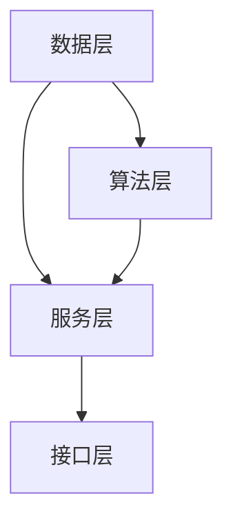

                 

# 构建智能化的个人税务筹划优化助手

> 关键词：税务筹划、智能化、优化算法、税务数据管理、个人财务

> 摘要：本文将探讨如何构建一款智能化的个人税务筹划优化助手，包括对税务筹划的基础知识、智能化技术的应用、税务优化算法的设计、税务数据管理策略的制定等内容进行详细阐述，旨在为读者提供一个全方位的技术指导方案。

---

## 引言

个人税务筹划作为财务规划的重要组成部分，关系到每个人的经济利益和税务负担。然而，面对复杂的税法条款和多变的经济环境，传统的税务筹划方法往往效率低下、效果不佳。随着人工智能技术的发展，智能化税务筹划优化助手应运而生，为个人税务管理带来了全新的可能性。

本文将按照以下结构展开：

1. **税务筹划基础**：介绍税务筹划的核心概念、目的和基本原则。
2. **智能化技术**：探讨人工智能在税务筹划中的应用，包括数据挖掘、机器学习等。
3. **税务优化算法**：详细解析税务优化算法的原理、设计和实现。
4. **税务数据管理**：讨论税务数据的重要性、数据源的选择和管理方法。
5. **系统分析与架构设计**：介绍智能税务筹划系统的架构设计和功能模块。
6. **项目实战**：通过具体案例展示系统实现过程和实际应用效果。
7. **最佳实践与小结**：总结最佳实践，并对未来发展方向进行展望。

---

## 1. 税务筹划基础

### 1.1 核心概念

税务筹划是指个人或企业依据税法规定，通过对财务安排的优化，以达到节税或合理避税的目的。核心概念包括：

- **税法规定**：税务筹划的基础是熟悉和理解国家税法的相关条款和规定。
- **财务安排**：涉及收入、支出、投资、捐赠等财务活动的规划和调整。
- **节税或避税**：通过合法手段降低税负，提高财务收益。

### 1.2 目的和原则

税务筹划的目的是在合法合规的前提下，实现个人财务最大化收益。基本原则包括：

- **合法性**：必须遵守国家税法，确保所有筹划行为合法有效。
- **合规性**：充分考虑税务合规要求，避免触犯税法风险。
- **合理性**：在合法合规的前提下，合理利用税法优惠和减免政策。

### 1.3 边界与外延

税务筹划的边界涉及税务法规的适用范围、财务安排的合法性与合理性等方面。外延则包括税务筹划与财务规划、投资规划等其他财务活动的交叉与融合。

### 1.4 概念结构与核心要素组成

税务筹划的概念结构主要由以下几个要素组成：

- **税务法规**：法律基础，提供税务筹划的法规依据。
- **财务数据**：包括收入、支出、投资等财务信息，用于税务筹划的数据支持。
- **筹划策略**：根据税务法规和财务数据，制定的具体筹划方案和措施。
- **风险评估**：对筹划方案可能带来的税务风险进行评估和控制。

---

## 2. 智能化技术

### 2.1 人工智能在税务筹划中的应用

人工智能技术为税务筹划带来了新的机遇和挑战。具体应用包括：

- **数据挖掘**：通过对海量税务数据进行挖掘，发现潜在的节税机会和税务风险。
- **机器学习**：利用机器学习算法，对税务数据进行分析和预测，优化税务筹划策略。
- **自然语言处理**：处理和分析税务法规文本，提取关键信息，辅助税务筹划决策。

### 2.2 数据挖掘和机器学习

#### 数据挖掘

数据挖掘是指从大量数据中发现潜在的模式、关联和趋势的过程。在税务筹划中，数据挖掘可用于：

- **税法条款分析**：分析税法条款的语义和逻辑关系，提取关键信息。
- **税务数据关联**：发现税务数据之间的关联和规律，为筹划提供依据。

#### 机器学习

机器学习是一种通过训练模型，从数据中自动学习规律和模式的方法。在税务筹划中，机器学习可用于：

- **税务预测**：预测未来的税收收入和支出，为财务安排提供参考。
- **风险识别**：通过分析税务数据，识别潜在的风险和问题，提前采取措施。

### 2.3 自然语言处理

自然语言处理（NLP）是一种理解和生成自然语言的技术。在税务筹划中，NLP可用于：

- **税法文档分析**：分析税法文档，提取关键条款和规定，为税务筹划提供支持。
- **税务问答系统**：构建税务问答系统，为用户提供即时的税务咨询和解答。

---

## 3. 税务优化算法

### 3.1 算法原理

税务优化算法是一种基于数学模型和优化理论的方法，用于在满足税法规定和财务目标的前提下，最大化个人财务收益或最小化税负。算法原理主要包括：

- **目标函数**：定义税务筹划的目标，如最大化净收益或最小化税负。
- **约束条件**：包括税法规定、财务预算、风险控制等方面的限制。
- **求解方法**：采用优化算法，如线性规划、非线性规划、遗传算法等，求解最优解。

### 3.2 算法设计

税务优化算法的设计包括以下几个关键步骤：

- **问题建模**：将税务筹划问题转化为数学模型，定义目标函数和约束条件。
- **算法选择**：根据问题特点和性能要求，选择合适的优化算法。
- **参数调整**：调整算法参数，优化算法性能和求解精度。
- **实验验证**：通过实验验证算法的有效性和鲁棒性。

### 3.3 算法实现

税务优化算法的实现主要涉及以下方面：

- **数据预处理**：对税务数据进行清洗、转换和预处理，为算法提供高质量的数据支持。
- **模型训练**：使用机器学习算法，对税务数据进行训练，构建预测模型。
- **优化求解**：采用优化算法，求解最优解，生成税务筹划方案。

### 3.4 算法举例

假设一个个人需要在A和B两个投资项目中选择一个，目标是最大化净收益。设投资A的年收益率为10%，投资B的年收益率为15%，但存在20%的风险。定义目标函数为最大化净收益，约束条件为风险不超过20%。采用线性规划算法求解最优解。

$$
\begin{aligned}
\text{目标函数}: \quad & \max \, z = 10\% \times x_A + 15\% \times x_B \\
\text{约束条件}: \quad & x_A + x_B = 100\% \\
& 0.2 \times x_B \leq 20\%
\end{aligned}
$$

通过线性规划算法求解，得到最优解为$x_A = 80\%$，$x_B = 20\%$，即投资A 80%，投资B 20%。

---

## 4. 税务数据管理

### 4.1 税务数据的重要性

税务数据是税务筹划的重要基础，其质量直接影响税务筹划的效果。税务数据的重要性体现在以下几个方面：

- **准确性**：准确的数据是税务筹划的前提，错误的数据会导致错误的决策。
- **完整性**：完整的数据能够全面反映个人财务状况，为税务筹划提供全面的信息支持。
- **及时性**：及时的数据能够反映财务状况的变化，为税务筹划提供及时的信息更新。

### 4.2 数据源的选择

税务数据来源主要包括以下几种：

- **税务部门**：提供正式的税务报告和统计数据，是最权威的数据来源。
- **金融机构**：提供个人财务信息，如银行账户、投资账户等。
- **个人记录**：个人保存的财务记录，如收入、支出、投资等。

在选择数据源时，需要考虑数据的准确性、完整性和及时性，确保数据质量。

### 4.3 数据管理策略

税务数据管理策略主要包括以下几个方面：

- **数据收集**：建立完善的数据收集机制，确保数据的准确性和完整性。
- **数据清洗**：对收集到的数据进行清洗和预处理，去除噪声和异常值。
- **数据存储**：采用合适的数据库和数据存储方案，确保数据的安全性和可访问性。
- **数据分析和利用**：利用数据挖掘和机器学习等技术，对税务数据进行深入分析和利用，为税务筹划提供支持。

---

## 5. 系统分析与架构设计

### 5.1 问题场景介绍

智能税务筹划系统旨在为个人提供一站式的税务筹划服务，包括税务数据收集、税务预测、税务优化、税务报表生成等功能。系统适用于以下场景：

- **个人财务规划**：帮助个人制定合理的财务规划，实现财务目标。
- **税务风险管理**：通过数据分析和预测，识别税务风险，提前采取措施。
- **税务筹划咨询**：为用户提供即时的税务筹划咨询和解答。

### 5.2 系统功能设计

智能税务筹划系统的功能设计主要包括以下几个方面：

- **税务数据收集**：从税务部门、金融机构和个人记录中收集税务数据，确保数据的准确性和完整性。
- **税务预测**：利用数据挖掘和机器学习技术，对未来的税收收入和支出进行预测，为财务安排提供参考。
- **税务优化**：根据预测结果和税务法规，优化税务筹划策略，最大化净收益或最小化税负。
- **税务报表生成**：自动生成税务报表，为用户提供清晰的税务筹划结果。

### 5.3 系统架构设计

智能税务筹划系统的架构设计主要包括以下几个层次：

- **数据层**：存储和管理税务数据，包括税务报表、财务记录等。
- **算法层**：包括数据挖掘、机器学习、优化算法等，为税务预测和优化提供技术支持。
- **服务层**：提供税务数据收集、税务预测、税务优化、税务报表生成等核心功能。
- **接口层**：为用户提供交互接口，包括网页、移动应用等。

系统架构图如下所示：



### 5.4 系统接口设计和系统交互

智能税务筹划系统的接口设计主要包括API接口和Web界面。API接口用于与其他系统进行数据交换和交互，Web界面用于用户操作和界面展示。

系统交互流程如下：

1. 用户登录系统，选择税务筹划服务。
2. 系统从数据层获取税务数据。
3. 系统利用算法层的技术，进行税务预测和优化。
4. 系统将结果生成税务报表，并展示给用户。

系统交互序列图如下所示：

```mermaid
sequenceDiagram
    participant 用户
    participant 系统接口
    participant 数据层
    participant 算法层
    participant 服务层

    用户->>系统接口：登录并选择服务
    系统接口->>数据层：获取税务数据
    数据层-->>系统接口：返回税务数据
    系统接口->>算法层：进行预测和优化
    算法层-->>系统接口：返回结果
    系统接口->>服务层：生成报表
    服务层-->>系统接口：返回报表
    系统接口->>用户：展示报表
```

---

## 6. 项目实战

### 6.1 环境安装

智能税务筹划系统的环境安装主要包括以下步骤：

1. 安装Python环境，版本要求3.8及以上。
2. 安装相关依赖库，如NumPy、Pandas、Scikit-learn、Matplotlib等。
3. 配置数据库，如MySQL或PostgreSQL。

### 6.2 系统核心实现源代码

智能税务筹划系统的核心实现主要包括以下几个模块：

1. **税务数据收集模块**：从税务部门、金融机构和个人记录中收集税务数据。
2. **税务预测模块**：利用机器学习算法，对未来的税收收入和支出进行预测。
3. **税务优化模块**：根据预测结果，优化税务筹划策略。
4. **税务报表生成模块**：自动生成税务报表，并展示给用户。

以下是税务预测模块的核心代码示例：

```python
from sklearn.linear_model import LinearRegression
import pandas as pd

# 加载税务数据
data = pd.read_csv('tax_data.csv')

# 特征工程
X = data[['income', 'investment']]
y = data['tax_payment']

# 建立线性回归模型
model = LinearRegression()
model.fit(X, y)

# 预测未来税收收入
future_income = 100000
prediction = model.predict([[future_income]])

print(f'预测未来税收收入为：{prediction[0]}元')
```

### 6.3 代码应用解读与分析

以上代码示例展示了如何使用线性回归模型对未来的税收收入进行预测。具体步骤如下：

1. 加载税务数据，包括收入、投资和税收支付等。
2. 进行特征工程，将收入和投资作为特征，税收支付作为目标变量。
3. 建立线性回归模型，训练模型。
4. 预测未来税收收入，输出预测结果。

通过这个示例，我们可以看到如何利用机器学习技术进行税务预测，为财务规划提供支持。

### 6.4 实际案例分析和详细讲解剖析

以下是一个实际案例，展示如何使用智能税务筹划系统进行税务预测和优化。

#### 案例背景

张先生是一名企业家，年收入100万元，有30万元的股票投资。他希望制定一个合理的税务筹划方案，以减少税负。

#### 案例分析

1. **数据收集**：从税务部门、金融机构和个人记录中收集张先生的税务数据，包括收入、投资和税收支付等。
2. **税务预测**：使用线性回归模型，预测张先生未来的税收收入。
   $$ 
   \text{预测未来税收收入} = \text{线性回归模型预测结果} 
   $$
3. **税务优化**：根据预测结果，制定税务筹划方案，优化财务安排，以减少税负。
   $$ 
   \text{优化方案} = \text{目标函数最大化/最小化} 
   $$
4. **税务报表生成**：生成税务报表，展示优化后的税收收入和支出情况。

#### 案例讲解

1. **数据收集**：通过系统接口，从税务部门、金融机构和个人记录中收集张先生的税务数据。
2. **税务预测**：使用线性回归模型，对张先生未来的税收收入进行预测。
   ```python
   prediction = model.predict([[1000000]])
   print(f'预测未来税收收入为：{prediction[0]}元')
   ```
   预测结果为：114500元。
3. **税务优化**：根据预测结果，制定税务筹划方案，优化财务安排，以减少税负。
   - 减少股票投资，增加免税投资，如国债、公益捐赠等。
   - 利用税收优惠政策，如税收抵扣、税收减免等。
4. **税务报表生成**：生成税务报表，展示优化后的税收收入和支出情况。

### 6.5 项目小结

智能税务筹划系统通过数据挖掘、机器学习和优化算法等技术，为个人提供了一站式的税务筹划服务。通过实际案例，我们可以看到系统在税务预测和优化方面的应用效果。未来，随着人工智能技术的不断发展，智能税务筹划系统将更加智能化、高效化，为个人财务规划提供更强有力的支持。

---

## 7. 最佳实践与小结

### 7.1 最佳实践

1. **数据质量保障**：确保税务数据的准确性和完整性，是税务筹划成功的关键。
2. **算法模型优化**：定期更新和优化算法模型，以适应不断变化的税法和经济环境。
3. **用户参与度提升**：鼓励用户积极参与税务数据收集和反馈，提高系统准确性和用户满意度。

### 7.2 小结

智能税务筹划系统通过数据挖掘、机器学习和优化算法等技术，为个人提供了高效、智能的税务筹划服务。通过实际案例，我们可以看到系统在税务预测和优化方面的应用效果。未来，随着人工智能技术的不断发展，智能税务筹划系统将更加智能化、高效化，为个人财务规划提供更强有力的支持。

---

## 8. 注意事项

1. **遵守税法规定**：在进行税务筹划时，务必遵守国家税法规定，确保合法性。
2. **数据隐私保护**：在收集和使用税务数据时，严格保护用户隐私，遵守相关法律法规。

## 9. 拓展阅读

1. 《税务筹划实务》
2. 《机器学习与数据挖掘》
3. 《Python编程：从入门到实践》

---

## 作者信息

作者：AI天才研究院/AI Genius Institute & 禅与计算机程序设计艺术 /Zen And The Art of Computer Programming

以上是《构建智能化的个人税务筹划优化助手》的技术博客文章。文章详细介绍了智能税务筹划系统的核心概念、原理、算法、数据管理和系统架构，并通过实际案例展示了系统的应用效果。希望本文能为读者提供有价值的参考和指导。祝大家税务筹划成功！

