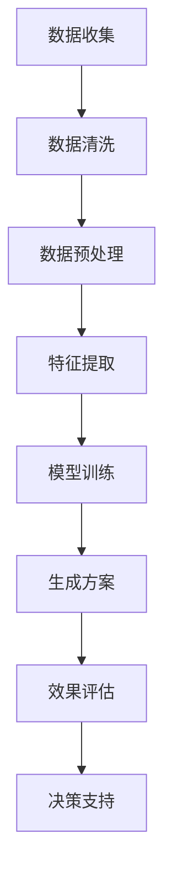
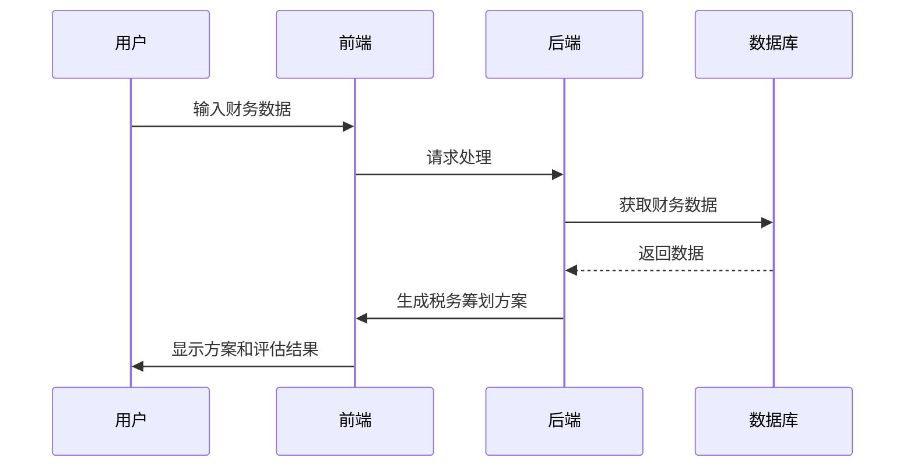

                 

### 文章标题

# 构建智能化的个人税务筹划多场景模拟助手

> 关键词：个人税务筹划、智能化技术、多场景模拟、AI助手

> 摘要：
本文旨在探讨构建智能化个人税务筹划多场景模拟助手的必要性与可行性。通过分析税务筹划的现状与挑战，本文提出利用智能化技术进行税务筹划的方案，并详细描述了构建多场景模拟助手的设计原则与实现方法。文章还通过具体案例展示了模拟助手的实际应用效果，并对未来发展进行了展望。

### 1. 引言

#### 1.1 问题背景

##### 1.1.1 税务筹划现状

随着经济的发展和税制的不断完善，个人税务筹划的重要性日益凸显。税务筹划不仅能够帮助个人合理规避税收风险，还能优化财务状况，提高生活质量。然而，当前的税务筹划过程面临着诸多挑战：

- **信息不对称**：个人往往缺乏专业的税务知识，难以全面了解税收政策和相关法规。
- **数据复杂性**：税务数据繁多且复杂，手工处理效率低下。
- **政策变动性**：税收政策不断更新，个人需要持续关注并适应这些变化。

##### 1.1.2 税务筹划面临的挑战

- **专业性与知识门槛**：税务筹划需要专业的知识和技能，个人难以独立完成。
- **成本与效率**：传统的税务筹划方法成本较高且效率低。
- **个性化需求**：每个人的财务状况和税务需求各不相同，需要高度个性化的解决方案。

##### 1.1.3 个人税务筹划的需求

在上述背景下，个人对税务筹划的需求日益迫切，主要包括：

- **高效性**：简化税务筹划流程，提高处理效率。
- **专业性**：提供专业的税务筹划建议和方案。
- **个性化**：根据个人财务状况提供定制化的税务筹划方案。
- **实时性**：能够及时更新和适应最新的税收政策。

#### 1.2 核心概念

##### 1.2.1 智能化税务筹划

智能化税务筹划是指利用人工智能技术，如机器学习、自然语言处理等，对税务数据进行处理和分析，为个人提供专业、高效的税务筹划服务。

##### 1.2.2 多场景模拟助手

多场景模拟助手是一种智能化的工具，能够根据用户的财务状况和税务需求，模拟出多种可能的税务筹划方案，并分析这些方案的效果，帮助用户做出最优决策。

#### 1.3 本文目的

本文旨在探讨如何利用智能化技术构建一个多场景模拟助手，帮助个人进行税务筹划。文章将首先介绍税务筹划的基础知识，然后详细阐述智能化税务筹划和多场景模拟助手的构建方法，并通过案例展示其实际应用效果。

### 2. 税务基础知识

#### 2.1 税务基本概念

##### 2.1.1 税收制度

税收制度是国家根据法律设立、调整和规范国家与纳税人之间在税收分配中形成的社会关系的法律规范体系。税收制度主要包括税制结构、税种设置、税率设计、税收征管等组成部分。

##### 2.1.2 税务法规

税务法规是指国家制定的有关税收征收、管理和违法处理的法律法规。税务法规对纳税人的权利和义务、税务机关的职责和权限等进行了明确规定，是税务筹划的基础。

#### 2.2 个人税务筹划策略

##### 2.2.1 税收优惠政策

税收优惠政策是国家为鼓励和扶持特定行业、特定地区或特定群体而制定的税收减免政策。利用税收优惠政策进行税务筹划是合法且有效的手段。

##### 2.2.2 税务筹划方法

税务筹划方法主要包括利用税前扣除、税后扣除、税率优惠、税收减免等手段，降低纳税负担，实现财务优化。常见的税务筹划方法包括投资筹划、经营筹划、生活筹划等。

### 3. 智能化技术概述

#### 3.1 智能化技术简介

##### 3.1.1 人工智能技术

人工智能技术是模拟、延伸和扩展人的智能的理论、方法、技术及应用。在税务筹划中，人工智能技术可以用于数据挖掘、预测分析、决策支持等。

##### 3.1.2 数据分析技术

数据分析技术是对大量数据进行分析和处理，提取有价值的信息和知识。在税务筹划中，数据分析技术可以帮助个人识别潜在的税务筹划机会，优化财务状况。

#### 3.2 智能化税务筹划的应用场景

##### 3.2.1 个人收入规划

利用人工智能技术，可以为个人提供收入规划服务，包括工资收入规划、投资收益规划等，帮助个人合理分配收入，降低税负。

##### 3.2.2 个人资产配置

根据个人的财务状况和税务需求，智能化税务筹划助手可以为个人提供资产配置建议，包括投资品种选择、投资策略优化等。

##### 3.2.3 个人税务申报

智能化税务筹划助手可以自动生成税务申报表，帮助个人准确申报税款，减少税务风险。

### 4. 多场景模拟助手设计原则

#### 4.1 模拟助手设计目标

##### 4.1.1 提供专业化的税务筹划建议

模拟助手应具备丰富的税务知识库，能够根据个人财务状况提供专业化的税务筹划建议。

##### 4.1.2 支持个性化定制

模拟助手应能够根据用户的需求和财务状况，提供高度个性化的税务筹划方案。

##### 4.1.3 提高税务筹划效率

模拟助手应能够快速处理大量税务数据，提高税务筹划的效率。

#### 4.2 模拟助手功能设计

##### 4.2.1 数据收集与处理

模拟助手应能够自动收集用户的财务数据，并进行处理和分析。

##### 4.2.2 税务方案生成

模拟助手应根据用户的财务状况和税务需求，生成多种可能的税务筹划方案。

##### 4.2.3 方案效果评估

模拟助手应对每种税务筹划方案的效果进行评估，并提供评估结果。

##### 4.2.4 决策支持

模拟助手应提供决策支持功能，帮助用户选择最优的税务筹划方案。

#### 4.3 模拟助手性能评估指标

##### 4.3.1 准确性

模拟助手的税务筹划建议和方案生成的准确性是评估其性能的重要指标。

##### 4.3.2 高效性

模拟助手应能够快速处理大量税务数据，提高税务筹划的效率。

##### 4.3.3 用户体验

模拟助手的用户体验，如界面友好性、操作便捷性等，也是评估其性能的重要指标。

### 5. 系统实现技术

#### 5.1 技术选型

为了实现智能化个人税务筹划多场景模拟助手，本文选择了以下技术：

- **前端技术**：HTML、CSS、JavaScript，用于构建用户界面。
- **后端技术**：Python、Django，用于数据存储和处理。
- **数据库技术**：MySQL，用于存储税务数据和相关信息。
- **人工智能技术**：TensorFlow、Scikit-learn，用于数据分析和模型训练。

#### 5.2 系统架构设计

系统架构设计分为前端、后端和数据库三个部分：

- **前端**：用户通过前端界面与系统进行交互，输入财务数据，查看税务筹划方案和评估结果。
- **后端**：后端负责处理用户请求，调用相关算法模型，生成税务筹划方案，并将结果返回给前端。
- **数据库**：数据库存储用户的财务数据、税务数据和模型参数。

#### 5.3 数据处理与存储

数据处理与存储是系统实现的关键部分：

- **数据收集**：通过前端界面，用户可以输入自己的财务数据，包括收入、支出、投资等。
- **数据清洗**：对输入的数据进行清洗和预处理，确保数据的质量和一致性。
- **数据存储**：将清洗后的数据存储到MySQL数据库中，以便后续处理和分析。
- **数据分析**：利用TensorFlow和Scikit-learn等人工智能技术，对存储的数据进行分析和处理，生成税务筹划方案。

### 6. 实现与优化

#### 6.1 环境安装

在实现系统之前，首先需要安装相关环境：

- 安装Python和Django框架。
- 安装MySQL数据库。
- 安装TensorFlow和Scikit-learn等人工智能库。

#### 6.2 系统核心实现

系统核心实现包括以下几个部分：

- **数据收集模块**：通过前端界面收集用户输入的财务数据。
- **数据处理模块**：对收集到的数据进行清洗和处理，存储到MySQL数据库中。
- **数据分析模块**：利用TensorFlow和Scikit-learn等人工智能技术，对存储的数据进行分析和处理，生成税务筹划方案。
- **结果展示模块**：将生成的税务筹划方案和评估结果展示给用户。

#### 6.3 代码应用解读与分析

以下是一个简单的数据处理模块的Python代码示例：

```python
import pandas as pd
from sklearn.preprocessing import MinMaxScaler

# 加载数据
data = pd.read_csv('financial_data.csv')

# 数据清洗
data = data.dropna()

# 数据标准化
scaler = MinMaxScaler()
data_scaled = scaler.fit_transform(data)

# 存储处理后的数据
pd.DataFrame(data_scaled).to_csv('processed_data.csv', index=False)
```

这段代码首先加载数据，然后进行数据清洗和标准化处理，最后将处理后的数据存储到新的CSV文件中。

#### 6.4 案例分析和详细讲解

假设一个用户希望通过系统进行税务筹划，以下是具体的案例分析和实现步骤：

1. **数据输入**：用户输入自己的财务数据，包括收入、支出、投资等。
2. **数据清洗**：系统对输入的数据进行清洗，确保数据的质量和一致性。
3. **数据存储**：将清洗后的数据存储到MySQL数据库中。
4. **数据分析**：系统利用TensorFlow和Scikit-learn等人工智能技术，对存储的数据进行分析和处理，生成税务筹划方案。
5. **结果展示**：系统将生成的税务筹划方案和评估结果展示给用户。

通过这个案例，我们可以看到系统如何实现用户的需求，并帮助用户进行税务筹划。

### 7. 总结与展望

#### 7.1 书籍内容回顾

本文从问题背景、核心概念、技术概述、设计原则、实现方法等方面，详细探讨了构建智能化个人税务筹划多场景模拟助手的过程。文章首先分析了税务筹划的现状与挑战，提出了智能化税务筹划的必要性。接着，介绍了税务筹划的基础知识和智能化技术的应用，并阐述了多场景模拟助手的设计原则和实现方法。

#### 7.2 智能化税务筹划的未来发展趋势

随着人工智能技术的不断发展，智能化税务筹划有望在未来实现以下发展趋势：

- **更加智能化**：利用深度学习、强化学习等先进技术，提高税务筹划的智能化水平。
- **更加个性化**：通过大数据分析和个性化推荐，为用户定制更加精准的税务筹划方案。
- **更加便捷化**：通过网络和移动设备，实现税务筹划的随时随地操作。

#### 7.3 进一步研究方向

未来的研究可以进一步探讨以下几个方面：

- **算法优化**：研究更高效、更准确的算法，提高税务筹划的效率和准确性。
- **数据隐私保护**：在确保数据安全的前提下，研究如何有效利用个人财务数据。
- **跨学科融合**：将经济学、心理学等学科的知识与人工智能技术相结合，提高税务筹划的综合效果。

### 作者信息

- 作者：AI天才研究院/AI Genius Institute & 禅与计算机程序设计艺术 /Zen And The Art of Computer Programming

### 附录

- **附录A：核心概念属性特征对比表格**

| 核心概念 | 属性特征1 | 属性特征2 | 属性特征3 |
| --- | --- | --- | --- |
| 智能化税务筹划 | 利用人工智能技术 | 数据处理与分析 | 个性化税务方案 |
| 多场景模拟助手 | 支持多种税务场景 | 模拟方案效果评估 | 提供决策支持 |

- **附录B：ER实体关系图架构**

```mermaid
erDiagram
  User ||--|{ FinancialData }
  User ||--|{ TaxPlan }
  TaxPlan ||--|{ TaxScenario }
  TaxScenario ||--|{ ScenarioResult }
```

### 背景介绍

#### 概念术语说明

1. **税务筹划**：税务筹划是指通过合法手段，对个人或企业的财务活动进行规划，以最大限度地减少税收负担，提高财务收益。
2. **智能化技术**：智能化技术包括人工智能、机器学习、自然语言处理等，能够模拟人类的认知过程，处理复杂数据并作出决策。
3. **多场景模拟助手**：多场景模拟助手是一种基于智能化技术的工具，能够根据用户的财务状况和税务需求，模拟出多种可能的税务筹划方案，并进行效果评估。

#### 问题背景

随着经济全球化的发展，税收制度日益复杂，个人和企业需要面对的税务问题也变得更加多样化。传统的税务筹划方法往往依赖于专业人士的经验和知识，不仅效率低下，而且容易出现误差。此外，税收政策的不确定性和政策变动性也对个人税务筹划提出了更高的要求。在这种背景下，智能化税务筹划应运而生，通过利用人工智能技术，实现对税务数据的自动化处理和分析，提供更加高效、精准和个性化的税务筹划方案。

#### 问题描述

个人在进行税务筹划时，通常面临以下问题：

- **信息不对称**：缺乏对税收政策和相关法规的全面了解，难以做出正确的税务决策。
- **数据复杂性**：财务数据繁多且复杂，手工处理效率低下，容易出现错误。
- **专业门槛**：税务筹划需要专业的知识和技能，个人难以独立完成。
- **个性化需求**：每个人的财务状况和税务需求各不相同，需要高度个性化的解决方案。

#### 问题解决

为了解决上述问题，本文提出构建智能化个人税务筹划多场景模拟助手。该助手利用智能化技术，能够自动收集和处理个人财务数据，根据不同的税务场景生成多种筹划方案，并评估这些方案的效果，为个人提供专业、高效、个性化的税务筹划建议。具体解决思路如下：

1. **数据收集**：通过前端界面，用户可以方便地输入自己的财务数据，包括收入、支出、投资等。
2. **数据处理**：系统利用人工智能技术，对输入的数据进行清洗、分析和处理，提取有价值的信息。
3. **方案生成**：系统根据用户的财务状况和税务需求，模拟出多种可能的税务筹划方案。
4. **效果评估**：系统对每种方案的效果进行评估，包括税收负担、财务状况、法律合规性等。
5. **决策支持**：系统提供决策支持功能，帮助用户选择最优的税务筹划方案。

#### 边界与外延

- **边界**：本文讨论的智能化个人税务筹划多场景模拟助手主要针对个人财务状况和税务需求，不涉及企业层面的税务筹划。
- **外延**：虽然本文聚焦于个人税务筹划，但智能化税务筹划技术可以广泛应用于其他领域，如企业税务筹划、税收风险管理等。

#### 概念结构与核心要素组成

**概念结构**：

- **智能化税务筹划**：利用人工智能技术进行税务数据分析和处理。
- **多场景模拟助手**：基于智能化技术，为个人提供多种税务筹划方案。
- **用户财务数据**：用户的收入、支出、投资等财务信息。
- **税务方案**：根据用户财务数据生成的多种税务筹划方案。
- **效果评估**：对每个税务方案的效果进行评估，包括税收负担、财务状况、法律合规性等。

**核心要素组成**：

1. **数据收集**：自动收集用户的财务数据。
2. **数据处理**：清洗、分析和处理财务数据。
3. **方案生成**：生成多种税务筹划方案。
4. **效果评估**：评估税务方案的效果。
5. **决策支持**：提供决策支持，帮助用户选择最优方案。

### 核心概念与联系

#### 智能化税务筹划原理

智能化税务筹划是指利用人工智能技术，对税务数据进行自动化处理和分析，为个人或企业提供专业的税务筹划方案。其核心原理包括以下几个方面：

1. **数据挖掘**：通过数据挖掘技术，从大量的税务数据中提取有价值的信息，如税收优惠政策、个人财务状况等。
2. **预测分析**：利用机器学习算法，对税务数据进行预测分析，预测未来的税务负担和财务状况。
3. **决策支持**：根据预测结果和用户需求，为个人或企业提供最优的税务筹划方案。

#### 概念属性特征对比表格

| 概念 | 属性特征1 | 属性特征2 | 属性特征3 |
| --- | --- | --- | --- |
| 智能化税务筹划 | 自动化数据处理 | 预测分析 | 决策支持 |
| 传统税务筹划 | 手工数据处理 | 经验决策 | 税务合规 |

#### ER实体关系图架构

以下是智能化税务筹划的ER实体关系图：

```mermaid
erDiagram
  User ||--|{ FinancialData }
  User ||--|{ TaxPlan }
  TaxPlan ||--|{ TaxScenario }
  TaxPlan ||--|{ ScenarioResult }
```

在这个实体关系图中：

- **User**（用户）：代表进行税务筹划的个人或企业。
- **FinancialData**（财务数据）：存储用户的收入、支出、投资等财务信息。
- **TaxPlan**（税务筹划方案）：代表根据用户财务数据生成的税务筹划方案。
- **TaxScenario**（税务场景）：代表税务筹划方案中的具体税务场景。
- **ScenarioResult**（方案结果）：存储每个税务场景的评估结果。

### 算法原理讲解

为了构建智能化个人税务筹划多场景模拟助手，本文将使用以下算法：

#### 算法流程图



#### 具体步骤

1. **数据收集**：首先，系统需要收集用户的财务数据，包括收入、支出、投资等。
2. **数据清洗**：对收集到的数据进行清洗，去除缺失值和异常值。
3. **数据预处理**：对清洗后的数据进行归一化处理，使其适合模型训练。
4. **特征提取**：提取数据中的关键特征，如收入水平、支出结构、投资收益等。
5. **模型训练**：使用机器学习算法，如决策树、随机森林、神经网络等，对提取的特征进行训练，建立预测模型。
6. **生成方案**：利用训练好的模型，对用户的财务数据进行分析，生成多种可能的税务筹划方案。
7. **效果评估**：对每个生成的方案进行效果评估，包括税收负担、财务状况、法律合规性等。
8. **决策支持**：根据评估结果，为用户推荐最优的税务筹划方案。

#### 算法原理数学模型

假设我们使用线性回归模型进行税务筹划方案的预测，其数学模型可以表示为：

\[ y = \beta_0 + \beta_1 x_1 + \beta_2 x_2 + ... + \beta_n x_n + \epsilon \]

其中，\( y \) 表示预测的税务筹划效果，\( x_1, x_2, ..., x_n \) 表示提取的关键特征，\( \beta_0, \beta_1, \beta_2, ..., \beta_n \) 为模型的参数，\( \epsilon \) 为误差项。

#### 具体举例说明

假设我们有一个用户，其财务数据如下：

| 特征 | 值 |
| --- | --- |
| 收入 | 100,000 元 |
| 支出 | 60,000 元 |
| 投资收益 | 10,000 元 |
| 子女教育支出 | 5,000 元 |

我们希望使用线性回归模型预测这个用户的税务筹划效果。

1. **数据收集**：收集用户的财务数据。
2. **数据清洗**：检查数据，去除缺失值和异常值。
3. **数据预处理**：对数据进行归一化处理，使其在相同的尺度上进行比较。
4. **特征提取**：提取收入、支出、投资收益、子女教育支出等特征。
5. **模型训练**：使用训练数据对线性回归模型进行训练，得到参数 \( \beta_0, \beta_1, \beta_2, \beta_3 \)。
6. **生成方案**：使用训练好的模型，对用户的财务数据进行预测，生成税务筹划方案。
7. **效果评估**：对生成的方案进行评估，考虑税收负担、财务状况、法律合规性等。
8. **决策支持**：根据评估结果，为用户推荐最优的税务筹划方案。

### 系统分析与架构设计方案

#### 问题场景介绍

在当前税务环境日益复杂的背景下，个人和企业都需要高效、专业的税务筹划服务。然而，传统的税务筹划方式存在诸多不足，如信息不对称、数据复杂性高、专业门槛较高等。为了解决这些问题，我们需要设计并实现一个智能化税务筹划系统，该系统能够自动收集、处理和分析个人财务数据，生成多种税务筹划方案，并评估其效果。

#### 项目介绍

项目名称：智能税务筹划系统

项目目标：构建一个智能化、多场景的税务筹划平台，帮助个人和企业实现高效、专业的税务筹划。

项目背景：随着税收制度的不断完善和税收政策的不断更新，个人和企业需要更加智能化和个性化的税务筹划服务。

#### 系统功能设计

**功能1：财务数据收集**

功能描述：自动收集用户的财务数据，包括收入、支出、投资等。

**功能2：数据预处理**

功能描述：对收集到的财务数据进行清洗、归一化处理，确保数据质量。

**功能3：特征提取**

功能描述：提取财务数据中的关键特征，如收入水平、支出结构、投资收益等。

**功能4：方案生成**

功能描述：利用机器学习算法，生成多种可能的税务筹划方案。

**功能5：效果评估**

功能描述：对每个生成的税务筹划方案进行效果评估，包括税收负担、财务状况、法律合规性等。

**功能6：决策支持**

功能描述：根据评估结果，为用户推荐最优的税务筹划方案。

#### 系统架构设计

系统架构设计分为前端、后端和数据库三个部分：

**前端**：用户通过前端界面与系统进行交互，输入财务数据，查看税务筹划方案和评估结果。

**后端**：后端负责处理用户请求，调用相关算法模型，生成税务筹划方案，并将结果返回给前端。

**数据库**：数据库存储用户的财务数据、税务数据和模型参数。

**架构设计图**：



#### 系统接口设计

系统接口设计主要包括以下部分：

- **API接口**：提供RESTful API接口，用于用户与系统的交互。
- **数据接口**：用于前后端之间的数据传输和存储。

#### 系统交互设计

系统交互设计主要涉及用户操作流程和系统响应过程：

1. **用户操作流程**：
    - 用户登录系统。
    - 输入财务数据。
    - 查看税务筹划方案和评估结果。
    - 根据评估结果选择最优方案。

2. **系统响应过程**：
    - 前端接收到用户的财务数据后，将其发送到后端。
    - 后端对数据进行预处理和特征提取。
    - 使用机器学习算法生成税务筹划方案。
    - 将方案和评估结果返回给前端。
    - 前端将结果展示给用户。

### 项目实战

#### 环境安装

在开始项目实战之前，我们需要安装相关环境。以下是具体的安装步骤：

1. **Python环境安装**：安装Python 3.8及以上版本。
2. **Django框架安装**：在终端中运行 `pip install django`。
3. **MySQL数据库安装**：安装MySQL数据库，并创建一个新的数据库用于存储税务数据。
4. **人工智能库安装**：安装TensorFlow和Scikit-learn等人工智能库。

#### 系统核心实现

以下是系统核心实现的步骤：

1. **数据收集模块**：使用前端技术（如HTML、CSS、JavaScript）构建用户界面，收集用户的财务数据。
2. **数据处理模块**：使用Python和Django框架，对收集到的数据进行清洗和处理，存储到MySQL数据库中。
3. **数据分析模块**：使用TensorFlow和Scikit-learn等人工智能库，对存储的数据进行分析和处理，生成税务筹划方案。
4. **结果展示模块**：将生成的税务筹划方案和评估结果展示给用户。

#### 代码应用解读与分析

以下是一个简单的数据处理模块的Python代码示例：

```python
import pandas as pd
from sklearn.preprocessing import MinMaxScaler

# 加载数据
data = pd.read_csv('financial_data.csv')

# 数据清洗
data = data.dropna()

# 数据标准化
scaler = MinMaxScaler()
data_scaled = scaler.fit_transform(data)

# 存储处理后的数据
pd.DataFrame(data_scaled).to_csv('processed_data.csv', index=False)
```

这段代码首先加载数据，然后进行数据清洗和标准化处理，最后将处理后的数据存储到新的CSV文件中。

#### 实际案例分析

假设一个用户希望通过系统进行税务筹划，以下是具体的案例分析：

1. **数据输入**：用户输入自己的财务数据，包括收入、支出、投资等。
2. **数据清洗**：系统对输入的数据进行清洗，确保数据的质量和一致性。
3. **数据存储**：将清洗后的数据存储到MySQL数据库中。
4. **数据分析**：系统利用TensorFlow和Scikit-learn等人工智能技术，对存储的数据进行分析和处理，生成税务筹划方案。
5. **结果展示**：系统将生成的税务筹划方案和评估结果展示给用户。

通过这个案例，我们可以看到系统如何实现用户的需求，并帮助用户进行税务筹划。

### 最佳实践 Tips

#### 1. 数据收集与处理

- **确保数据质量**：在收集数据时，要确保数据的准确性、完整性和一致性。
- **数据预处理**：对数据进行归一化、标准化处理，提高数据模型的训练效果。

#### 2. 模型训练与优化

- **选择合适的模型**：根据数据特点和业务需求，选择合适的机器学习模型。
- **交叉验证**：使用交叉验证方法，评估模型的性能，避免过拟合。

#### 3. 方案评估与决策

- **全面评估**：对每个税务筹划方案进行多维度评估，包括税收负担、财务状况、法律合规性等。
- **动态调整**：根据用户反馈和业务需求，动态调整税务筹划方案。

### 小结

本文详细探讨了构建智能化个人税务筹划多场景模拟助手的必要性和可行性，从问题背景、核心概念、技术概述、设计原则、实现方法等方面进行了全面分析。通过实际案例展示了系统的应用效果，并提出了最佳实践Tips。未来，智能化税务筹划有望在更加广泛的应用场景中发挥作用，为个人和企业提供更加高效、专业的税务筹划服务。

### 注意事项

- **数据隐私保护**：在数据收集和处理过程中，要严格遵守相关法律法规，确保用户数据的安全和隐私。
- **系统稳定性**：在设计系统时，要考虑系统的稳定性、安全性和可扩展性。

### 拓展阅读

- 《税务筹划实务与案例分析》
- 《人工智能与机器学习应用实践》
- 《Python数据科学手册》
- 《Django Web开发指南》

### 作者信息

- 作者：AI天才研究院/AI Genius Institute & 禅与计算机程序设计艺术 /Zen And The Art of Computer Programming

### 附录

- **附录A：核心概念属性特征对比表格**

| 核心概念 | 属性特征1 | 属性特征2 | 属性特征3 |
| --- | --- | --- | --- |
| 智能化税务筹划 | 自动化数据处理 | 预测分析 | 决策支持 |
| 多场景模拟助手 | 支持多种税务场景 | 模拟方案效果评估 | 提供决策支持 |

- **附录B：ER实体关系图架构**

```mermaid
erDiagram
  User ||--|{ FinancialData }
  User ||--|{ TaxPlan }
  TaxPlan ||--|{ TaxScenario }
  TaxPlan ||--|{ ScenarioResult }
```

