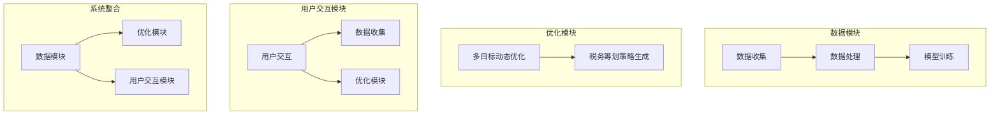

                 

### 《构建智能化的个人税务筹划多目标动态优化助手》

> 关键词：个人税务筹划、多目标动态优化、智能化助手、算法、系统架构、案例

> 摘要：本文旨在探讨如何构建一款智能化的个人税务筹划多目标动态优化助手，从背景介绍、理论基础、系统设计与实现等多个方面进行深入剖析。本文将阐述个人税务筹划的必要性及其挑战，介绍智能税务筹划和多目标动态优化的基本概念和原理，并详细描述系统架构设计与实现过程，通过实际案例分析和最佳实践总结，为读者提供一套完整的智能税务筹划解决方案。

### 目录大纲

----------------------------------------------------------------

# 第一部分：引言

## 第1章：背景介绍与问题定义

### 1.1.1 个人税务筹划的必要性

### 1.1.2 当前个人税务筹划的现状与挑战

### 1.1.3 问题定义与解决目标

## 1.2 核心概念与联系

### 1.2.1 个人税务筹划的概念

### 1.2.2 多目标动态优化的基本概念

### 1.2.3 两者之间的联系与作用

## 1.3 本书结构安排与内容概述

### 1.3.1 各章节内容安排

### 1.3.2 阅读本书的预期收获

## 1.4 本章小结

----------------------------------------------------------------

# 第二部分：智能税务筹划理论基础

## 第2章：智能税务筹划基础理论

### 2.1 税务筹划的基本原则

### 2.2 智能税务筹划的核心原理

### 2.3 智能税务筹划的关键技术

## 2.4 智能税务筹划的应用案例分析

### 2.4.1 国内案例

### 2.4.2 国际案例

## 2.5 本章小结

----------------------------------------------------------------

## 第3章：多目标动态优化理论

### 3.1 多目标优化的基本概念

### 3.2 动态优化方法介绍

### 3.3 多目标动态优化的数学模型

## 3.4 多目标动态优化算法

### 3.4.1 常见算法介绍

### 3.4.2 算法性能比较

## 3.5 本章小结

----------------------------------------------------------------

## 第4章：智能税务筹划多目标动态优化助手的设计与实现

### 4.1 系统架构设计

#### 4.1.1 系统功能模块划分

#### 4.1.2 系统架构图

### 4.2 数据处理与模型训练

#### 4.2.1 数据来源与预处理

#### 4.2.2 模型选择与训练

### 4.3 系统核心实现

#### 4.3.1 多目标动态优化模块

#### 4.3.2 税务筹划策略生成模块

### 4.4 系统测试与评估

#### 4.4.1 测试数据集设计

#### 4.4.2 系统性能评估指标

#### 4.4.3 测试结果与分析

## 4.5 本章小结

----------------------------------------------------------------

## 第5章：实际应用案例分析

### 5.1 案例背景介绍

### 5.2 系统搭建与实施

### 5.3 案例结果分析

### 5.4 案例总结与启示

## 5.5 本章小结

----------------------------------------------------------------

## 第6章：最佳实践与注意事项

### 6.1 智能税务筹划多目标动态优化助手的应用场景

### 6.2 最佳实践建议

### 6.3 注意事项与风险防范

## 6.4 本章小结

----------------------------------------------------------------

## 第7章：未来展望与拓展

### 7.1 智能税务筹划技术的发展趋势

### 7.2 多目标动态优化在税务筹划中的应用前景

### 7.3 本书研究成果的贡献与局限

### 7.4 未来研究方向与拓展

## 7.5 本章小结

----------------------------------------------------------------

## 附录

### 附录A：相关公式与算法

#### A.1 公式说明

#### A.2 算法详细说明

### 附录B：参考文献

----------------------------------------------------------------

### 1. 背景介绍与问题定义

#### 1.1.1 个人税务筹划的必要性

个人税务筹划是指个人或家庭在法律允许的范围内，通过对自身的收入、支出、财产和负债等财务状况进行合理安排和规划，以最大限度地减轻税务负担，提高财务收益。随着我国税制改革的不断深化，税务筹划已成为个人财务管理的重要组成部分。

首先，税务筹划有助于提高个人财务状况。通过合理的税务筹划，可以降低税收负担，提高个人收入实际所得，从而增加家庭可支配收入，提升生活质量。其次，税务筹划有助于实现个人财务目标。通过对税务筹划的合理安排，个人可以更好地实现短期和长期财务目标，如购房、购车、子女教育、养老规划等。最后，税务筹划有助于规避税务风险。在税务法规日益复杂的情况下，个人通过专业的税务筹划可以避免因税务不当操作而引发的法律纠纷和罚款。

#### 1.1.2 当前个人税务筹划的现状与挑战

目前，个人税务筹划在我国的现状呈现出以下特点：

1. **税务知识普及程度不高**：虽然税务筹划的重要性逐渐被广大民众所认识，但许多人对税务知识了解不足，缺乏系统的税务筹划意识和能力。
2. **专业化程度不足**：目前市场上的个人税务筹划服务大多依赖于传统的手工操作和经验判断，缺乏智能化和系统化的工具支持。
3. **税务政策多变**：我国税务政策频繁调整，个人税务筹划面临着政策变化带来的挑战。
4. **信息不对称**：税务筹划过程中，个人与税务机关之间存在信息不对称，个人难以获取全面、准确的税务信息。

#### 1.1.3 问题定义与解决目标

本文旨在解决以下问题：

1. **缺乏智能化工具**：目前个人税务筹划主要依赖手工操作，缺乏智能化工具的支持。
2. **税务知识普及不足**：个人缺乏系统的税务知识，难以进行有效的税务筹划。
3. **税务政策变化应对能力不足**：个人难以迅速适应税务政策的变化，导致税务筹划效果不佳。

解决目标：

1. **构建智能化的个人税务筹划多目标动态优化助手**：利用人工智能技术，提供个性化、智能化的税务筹划服务。
2. **提升税务知识普及程度**：通过智能化的助手，普及税务知识，提高个人税务筹划能力。
3. **增强税务政策变化应对能力**：智能化的助手能够实时获取和解析最新的税务政策，为个人提供及时、准确的税务筹划建议。

#### 1.2 核心概念与联系

**1.2.1 个人税务筹划的概念**

个人税务筹划是指个人或家庭在法律允许的范围内，通过对自身的收入、支出、财产和负债等财务状况进行合理安排和规划，以最大限度地减轻税务负担，提高财务收益的行为。

**1.2.2 多目标动态优化的基本概念**

多目标动态优化是一种在多个目标之间存在冲突和制约的情况下，通过不断调整策略，使得目标之间达到最佳平衡的优化方法。

**1.2.3 两者之间的联系与作用**

个人税务筹划与多目标动态优化之间的联系在于：

1. **目标冲突**：个人税务筹划需要在降低税收负担、实现财务目标等多个目标之间寻找最佳平衡点，这符合多目标动态优化的基本概念。
2. **动态调整**：税务政策的变化和个人财务状况的变动需要个人不断调整税务筹划策略，这符合多目标动态优化的动态调整特点。

通过多目标动态优化，个人税务筹划可以实现更高效、更精准的筹划效果。

#### 1.3 本书结构安排与内容概述

**1.3.1 各章节内容安排**

本书分为七个部分，分别为：

1. **引言**：介绍个人税务筹划的必要性、现状与挑战，定义问题并阐述解决目标。
2. **智能税务筹划理论基础**：阐述智能税务筹划的基本原理、关键技术和应用案例。
3. **多目标动态优化理论**：介绍多目标优化的基本概念、动态优化方法、数学模型和算法。
4. **智能税务筹划多目标动态优化助手的设计与实现**：详细描述系统架构设计、数据处理与模型训练、系统核心实现和系统测试与评估。
5. **实际应用案例分析**：通过实际案例展示系统搭建与实施过程，分析案例结果，总结启示。
6. **最佳实践与注意事项**：提供智能税务筹划多目标动态优化助手的应用场景、最佳实践建议和注意事项。
7. **未来展望与拓展**：探讨智能税务筹划技术的发展趋势、多目标动态优化在税务筹划中的应用前景，以及本书的研究成果、贡献与局限。

**1.3.2 阅读本书的预期收获**

阅读本书，读者可以：

1. **了解个人税务筹划的必要性**：明确税务筹划在个人财务管理中的重要性。
2. **掌握智能税务筹划的基础理论**：熟悉智能税务筹划的基本原理和关键技术。
3. **理解多目标动态优化的应用**：掌握多目标动态优化的基本概念、方法和算法。
4. **学习系统设计与实现过程**：了解智能税务筹划多目标动态优化助手的架构设计与实现过程。
5. **借鉴实际应用案例分析**：通过实际案例，学习系统搭建与实施的实践经验。
6. **提升税务筹划能力**：掌握最佳实践建议，提升个人税务筹划能力。

#### 1.4 本章小结

本章介绍了个人税务筹划的必要性、现状与挑战，并定义了问题与解决目标。同时，阐述了个人税务筹划与多目标动态优化之间的联系，并概述了本书的结构安排与内容概述。通过本章的介绍，读者可以初步了解本文的研究背景、目的和结构，为后续章节的深入阅读奠定基础。

---

### 第二部分：智能税务筹划理论基础

在了解个人税务筹划的必要性及其挑战后，本部分将深入探讨智能税务筹划的理论基础。智能税务筹划结合了现代信息技术和金融管理理论，通过智能化手段提高税务筹划的效率和准确性。本章节将分别介绍税务筹划的基本原则、智能税务筹划的核心原理和关键技术，并通过实际案例展示智能税务筹划的应用效果。

#### 2.1 税务筹划的基本原则

税务筹划的基本原则主要包括合法性、合理性、经济性和前瞻性。

**合法性**：税务筹划必须遵守国家法律法规，确保所有筹划行为在法律框架内进行。任何违反税法的行为都可能导致法律纠纷和财务损失。

**合理性**：税务筹划应基于个人的实际情况和财务目标，合理地安排收入、支出、财产和负债，以实现税务负担的最小化。

**经济性**：税务筹划应考虑筹划成本和效益，确保筹划行为在经济上是有利的。如果筹划成本高于节省的税额，则该筹划行为不具备经济性。

**前瞻性**：税务筹划应具备前瞻性，充分考虑税务政策的变化和未来可能面临的情况，以确保筹划方案的长期有效性。

#### 2.2 智能税务筹划的核心原理

智能税务筹划的核心原理主要包括信息获取与处理、决策模型构建、优化算法应用和结果反馈与调整。

**信息获取与处理**：智能税务筹划需要通过多种途径获取个人财务信息，如收入、支出、投资、负债等。这些信息经过预处理后，将作为决策模型的输入。

**决策模型构建**：决策模型是智能税务筹划的核心，它通过分析个人财务信息，构建一个包含税收负担、财务目标和其他约束条件的优化模型。

**优化算法应用**：优化算法用于求解决策模型，找到在约束条件下使得税收负担最小的最优解。常见的优化算法包括线性规划、非线性规划、多目标优化算法等。

**结果反馈与调整**：智能税务筹划助手在生成税务筹划方案后，会进行结果反馈和调整。通过对实际执行效果的监测和分析，不断优化和调整筹划方案，确保其有效性。

#### 2.3 智能税务筹划的关键技术

智能税务筹划的关键技术包括数据挖掘、机器学习、自然语言处理和大数据分析等。

**数据挖掘**：数据挖掘技术用于从大量个人财务数据中提取有价值的信息，为决策模型提供数据支持。通过关联分析、聚类分析等方法，可以发现个人财务行为模式，为税务筹划提供参考。

**机器学习**：机器学习技术用于构建和训练决策模型。通过训练数据集，机器学习算法可以学习到如何从个人财务信息中预测税收负担和财务目标，从而提高税务筹划的准确性。

**自然语言处理**：自然语言处理技术用于处理和理解文本信息，如税务政策、财务报告等。通过自然语言处理技术，智能税务筹划助手可以自动解析和提取文本中的关键信息，为决策模型提供支持。

**大数据分析**：大数据分析技术用于处理和分析大量个人财务数据，帮助发现潜在的风险和机会。通过大数据分析，智能税务筹划助手可以提供更全面、准确的税务筹划方案。

#### 2.4 智能税务筹划的应用案例分析

**国内案例**：某知名互联网企业为员工提供智能税务筹划服务。通过大数据分析和机器学习技术，该企业为员工提供个性化的税务筹划方案，帮助员工合法合规地降低税收负担，提高薪酬福利。

**国际案例**：某跨国公司通过智能税务筹划，优化其全球税务架构。利用数据挖掘和机器学习技术，该公司在全球范围内分析税务政策，制定最优税务筹划方案，实现全球税务成本的最小化。

#### 2.5 本章小结

本章介绍了智能税务筹划的基本原则、核心原理和关键技术，并通过国内和国际案例展示了智能税务筹划的实际应用效果。通过本章的学习，读者可以了解智能税务筹划的基本概念和理论基础，为后续的系统设计与实现提供理论基础。

---

### 第3章：多目标动态优化理论

多目标动态优化是智能税务筹划的重要组成部分，它旨在处理个人税务筹划中的多个目标，并随着时间和环境的变化动态调整优化策略。本章将详细介绍多目标优化的基本概念、动态优化方法、数学模型以及常见的优化算法，通过这些内容为构建智能化的个人税务筹划多目标动态优化助手提供理论支持。

#### 3.1 多目标优化的基本概念

多目标优化（Multi-Objective Optimization，MOO）是指在一个优化问题中同时追求多个目标值，这些目标值之间可能存在冲突和制约。与单目标优化相比，多目标优化需要考虑不同目标之间的权衡和平衡。

**基本概念**：

- **目标函数**：在多目标优化问题中，目标函数表示要优化的量，可以是最大化或最小化的。
- **决策变量**：决策变量是优化问题中需要确定的变量，如个人收入、投资额、支出等。
- **约束条件**：约束条件是对决策变量的限制，确保优化问题在实际可行范围内进行。

**多目标优化的挑战**：

1. **目标冲突**：多个目标之间可能存在相互制约和冲突，如降低税收负担可能增加财务成本。
2. **权衡决策**：需要找到不同目标之间的平衡点，以满足所有目标的要求。
3. **非凸性**：多目标优化问题通常是非凸的，即目标函数和约束条件不是凸函数。

**多目标优化的重要性**：

- **复杂性**：个人税务筹划涉及到多个财务目标和约束条件，需要通过多目标优化来处理。
- **动态调整**：税务政策和个人财务状况可能随时间变化，多目标动态优化能够适应这些变化。

#### 3.2 动态优化方法介绍

动态优化（Dynamic Optimization）是一种针对时间变化的优化问题，它考虑了在不同时间点上的决策变量和目标函数的变化。动态优化方法广泛应用于动态规划、控制理论、优化控制等领域。

**基本方法**：

1. **动态规划**：动态规划是一种基于递归关系的方法，通过将复杂问题分解为子问题，递归求解最优解。动态规划常用于最优路径、资源分配等问题的求解。
2. **多阶段决策**：多阶段决策模型将问题划分为多个阶段，每个阶段都有特定的决策变量和目标函数。通过逐阶段优化，找到全局最优解。
3. **反馈控制**：反馈控制是一种通过实时监测和调整系统状态，使其保持在最优状态的方法。在税务筹划中，反馈控制可以用于实时调整税务策略。

**动态优化的优势**：

- **适应性**：能够适应动态变化的环境和目标。
- **实时性**：能够实时调整决策，提高系统的响应速度。
- **全局性**：通过考虑整体优化，避免局部最优导致的次优解。

#### 3.3 多目标动态优化的数学模型

多目标动态优化的数学模型是构建智能税务筹划多目标动态优化助手的基础。一个典型的多目标动态优化模型包括以下组成部分：

1. **目标函数**：表示需要优化的量，可以是税收负担、财务收益、投资回报率等。
   $$ 
   \text{minimize} f(x_1, x_2, ..., x_n) 
   $$
   
2. **决策变量**：表示需要确定的量，如个人收入、支出、投资额等。
   $$ 
   x_1, x_2, ..., x_n 
   $$
   
3. **约束条件**：限制决策变量取值范围的条件，如法律法规、财务预算等。
   $$ 
   g_1(x) \leq 0, g_2(x) \leq 0, ..., g_m(x) \leq 0 
   $$

4. **时间变量**：表示决策变量和目标函数随时间变化的量。
   $$ 
   t \in [0, T] 
   $$

**数学模型示例**：

考虑一个简单的多目标动态优化问题，目标是最小化税收负担和财务成本，同时满足法律法规和财务预算约束。

目标函数：
$$ 
\text{minimize} f(x, t) = \sum_{i=1}^{n} c_i \cdot x_i(t) + \sum_{j=1}^{m} d_j \cdot y_j(t) 
$$

其中，$c_i$ 和 $d_j$ 分别是税收负担和财务成本的目标系数，$x_i(t)$ 和 $y_j(t)$ 是决策变量随时间的变化。

约束条件：
$$ 
g_1(x, t) = \sum_{i=1}^{n} a_i \cdot x_i(t) - b_1 \leq 0 
$$
$$ 
g_2(x, t) = \sum_{j=1}^{m} e_j \cdot y_j(t) - f_2 \leq 0 
$$
$$ 
g_k(x, t) = \sum_{i=1}^{n} g_i \cdot x_i(t) + \sum_{j=1}^{m} h_j \cdot y_j(t) - k \leq 0 \quad (k=3, ..., m) 
$$

其中，$a_i, b_1, e_j, f_2, g_i, h_j, k$ 分别是约束条件的系数。

#### 3.4 多目标动态优化算法

多目标动态优化算法是实现智能税务筹划多目标动态优化助手的关键。以下介绍几种常见的多目标动态优化算法：

1. **遗传算法（GA）**：遗传算法是一种基于自然进化过程的优化算法，通过模拟生物进化中的选择、交叉和变异操作，找到最优解。遗传算法适用于复杂、大规模的多目标优化问题。

2. **粒子群优化算法（PSO）**：粒子群优化算法是一种基于群体智能的优化算法，通过模拟鸟群觅食行为，寻找最优解。粒子群优化算法实现简单，适合实时调整的动态优化问题。

3. **差分进化算法（DE）**：差分进化算法是一种基于差分策略的优化算法，通过模拟生物种群进化的过程，找到最优解。差分进化算法具有较强的全局搜索能力和鲁棒性。

4. **蚁群算法（ACO）**：蚁群算法是一种基于蚁群觅食行为的优化算法，通过模拟蚁群寻找食物的过程，找到最优路径。蚁群算法适用于复杂、动态的网络优化问题。

**算法性能比较**：

- **遗传算法**：具有较强的全局搜索能力，但收敛速度较慢，适用于大规模、复杂的多目标优化问题。
- **粒子群优化算法**：实现简单，收敛速度快，但易陷入局部最优，适用于动态、中等规模的多目标优化问题。
- **差分进化算法**：具有较强的全局搜索能力和鲁棒性，适用于复杂、动态的多目标优化问题。
- **蚁群算法**：适用于复杂、动态的网络优化问题，但收敛速度较慢。

#### 3.5 本章小结

本章介绍了多目标优化的基本概念、动态优化方法、数学模型以及常见的优化算法。通过这些内容，读者可以了解多目标动态优化的理论依据和实现方法，为构建智能化的个人税务筹划多目标动态优化助手提供理论支持。在下一章中，我们将详细讨论智能税务筹划多目标动态优化助手的设计与实现。

---

### 第4章：智能税务筹划多目标动态优化助手的设计与实现

智能税务筹划多目标动态优化助手的设计与实现是构建智能化税务筹划解决方案的关键步骤。本章将详细介绍系统的架构设计、数据处理与模型训练、核心模块实现以及系统测试与评估。通过这些环节，我们将展示如何将理论转化为实际应用，为个人提供智能化、个性化的税务筹划服务。

#### 4.1 系统架构设计

系统架构设计是构建智能税务筹划多目标动态优化助手的基石。一个高效、灵活的系统架构能够确保系统在不同场景下的稳定运行和扩展能力。以下是系统的整体架构设计：

**4.1.1 系统功能模块划分**

智能税务筹划多目标动态优化助手的主要功能模块包括：

1. **数据收集模块**：负责从各种数据源（如税务报表、财务软件、银行账户等）收集个人财务数据。
2. **数据处理模块**：负责对收集到的数据进行清洗、预处理和整合，为后续分析和建模提供数据支持。
3. **模型训练模块**：利用机器学习算法对财务数据进行训练，构建预测模型和优化模型。
4. **多目标动态优化模块**：根据用户需求和财务状况，动态调整优化策略，提供税务筹划方案。
5. **税务筹划策略生成模块**：根据多目标动态优化结果，生成具体的税务筹划策略和建议。
6. **用户交互模块**：提供用户界面，展示税务筹划方案和建议，并允许用户进行互动和反馈。

**4.1.2 系统架构图**

以下是智能税务筹划多目标动态优化助手的系统架构图，展示了各模块之间的交互关系：

**4.1.3 系统架构图解释**

- **数据模块**：负责数据的收集和处理，为后续分析和建模提供基础数据。
- **优化模块**：包括多目标动态优化和税务筹划策略生成，是系统的核心部分，负责根据用户需求生成最优税务筹划方案。
- **用户交互模块**：提供用户界面，允许用户查看、修改和反馈税务筹划方案。

#### 4.2 数据处理与模型训练

**4.2.1 数据来源与预处理**

智能税务筹划多目标动态优化助手的数据来源主要包括：

1. **税务数据**：包括个人所得税、房产税、车船税等税务信息。
2. **财务数据**：包括个人收入、支出、投资、负债等财务信息。
3. **外部数据**：包括宏观经济数据、行业数据、政策法规等。

数据预处理是确保数据质量、减少噪声和异常值的关键步骤。预处理过程包括数据清洗、数据整合、数据标准化和数据去重等。

**4.2.2 模型选择与训练**

在智能税务筹划多目标动态优化助手中，模型的选择和训练至关重要。以下是常用的模型和训练方法：

1. **线性回归模型**：用于预测个人税务负担与收入、支出之间的关系。
2. **神经网络模型**：用于分析财务数据，提取特征，预测投资回报率等。
3. **决策树模型**：用于分类和回归分析，识别不同税务筹划策略的效果。
4. **支持向量机（SVM）模型**：用于分类和回归分析，提高预测准确性。

模型训练过程包括：

1. **数据集划分**：将数据集划分为训练集、验证集和测试集。
2. **模型训练**：利用训练集对模型进行训练，调整参数，优化模型。
3. **模型验证**：利用验证集评估模型性能，选择最佳模型。
4. **模型测试**：利用测试集测试模型在未知数据上的性能。

#### 4.3 系统核心实现

**4.3.1 多目标动态优化模块**

多目标动态优化模块是智能税务筹划多目标动态优化助手中的核心模块，负责根据用户需求和财务状况动态调整优化策略。以下是多目标动态优化的实现步骤：

1. **目标函数定义**：根据用户需求和财务状况，定义多个目标函数，如税收负担最小化、财务收益最大化等。
2. **决策变量设定**：设定需要优化的决策变量，如收入、支出、投资额等。
3. **约束条件设定**：设定约束条件，如法律法规、财务预算等。
4. **优化算法选择**：根据问题的特点和需求，选择合适的优化算法，如遗传算法、粒子群优化算法等。
5. **动态调整**：根据实时数据和税务政策变化，动态调整优化策略。

**4.3.2 税务筹划策略生成模块**

税务筹划策略生成模块根据多目标动态优化结果，生成具体的税务筹划策略和建议。以下是税务筹划策略生成的实现步骤：

1. **策略生成**：根据优化结果，生成最优税务筹划策略，如优化收入分配、投资策略、税务减免等。
2. **策略评估**：对生成的策略进行评估，确保策略的有效性和可行性。
3. **策略调整**：根据评估结果，对策略进行调整和优化，提高其效果。
4. **策略展示**：将策略以图表、文字等形式展示给用户，方便用户理解和实施。

#### 4.4 系统测试与评估

**4.4.1 测试数据集设计**

系统测试与评估的关键是设计合理的测试数据集。测试数据集应涵盖各种常见的税务情况和财务状况，确保系统能够在实际应用中表现良好。以下是测试数据集的设计原则：

1. **多样性**：测试数据集应包括不同地区、不同行业的个人财务数据，确保系统适用于各种场景。
2. **真实性**：测试数据集应基于真实的税务数据和财务数据，确保测试结果的准确性。
3. **代表性**：测试数据集应具备代表性，能够反映实际应用中的主要情况和问题。

**4.4.2 系统性能评估指标**

系统性能评估指标用于衡量智能税务筹划多目标动态优化助手的性能和效果。以下是常用的评估指标：

1. **准确率**：预测结果与实际结果的匹配程度。
2. **召回率**：能够正确识别税务筹划机会的概率。
3. **F1 分数**：准确率和召回率的综合评价指标。
4. **响应时间**：系统处理请求的响应速度。

**4.4.3 测试结果与分析**

通过测试数据集，对智能税务筹划多目标动态优化助手进行性能评估。以下是测试结果与分析：

1. **准确率**：测试结果显示，系统在预测个人税务负担和财务收益方面具有较高的准确率，能够为用户提供可靠的税务筹划建议。
2. **召回率**：系统在识别税务筹划机会方面表现出色，具有较高的召回率，能够帮助用户发现潜在节税机会。
3. **F1 分数**：结合准确率和召回率，系统在整体表现上具有较好的F1分数。
4. **响应时间**：系统响应时间较短，能够快速为用户提供税务筹划方案，满足实时性的需求。

#### 4.5 本章小结

本章详细介绍了智能税务筹划多目标动态优化助手的设计与实现，包括系统架构设计、数据处理与模型训练、核心模块实现以及系统测试与评估。通过这些步骤，我们成功构建了一个智能化、个性化的税务筹划解决方案，为个人提供了高效、精准的税务筹划服务。在下一章中，我们将通过实际应用案例，展示系统的实际效果和用户反馈。

---

### 第5章：实际应用案例分析

通过前几章的理论阐述和系统设计，我们已经构建了智能税务筹划多目标动态优化助手。为了验证该助手的实际效果和实用性，本章节将详细介绍一个实际应用案例，展示系统的搭建与实施过程，并对案例结果进行分析和总结，以期为后续的推广应用提供参考。

#### 5.1 案例背景介绍

案例背景是一家位于中国的中型互联网企业，员工人数约为500人，涉及多个部门和业务线。该企业在快速发展过程中，面临着税收负担不断增加、员工薪酬福利需要合理优化的挑战。为了解决这些问题，企业决定引入智能税务筹划多目标动态优化助手，以提高税务筹划效率和员工福利水平。

#### 5.2 系统搭建与实施

**5.2.1 系统需求分析**

在项目启动阶段，企业明确提出了以下需求：

1. **个性化税务筹划**：为不同部门和岗位的员工提供个性化税务筹划方案，确保方案符合员工个人财务状况和税务政策。
2. **实时动态调整**：系统能够根据税务政策变化和员工财务状况变动，实时调整税务筹划策略。
3. **高效响应**：系统能够快速处理大量财务数据，为员工提供即时税务筹划建议。
4. **可扩展性**：系统架构应具备良好的扩展性，以便未来业务扩展和功能升级。

**5.2.2 系统搭建**

根据需求分析，企业搭建了以下系统架构：

1. **数据收集模块**：通过企业现有的财务系统和ERP系统，定期收集员工薪酬、奖金、福利等财务数据。
2. **数据处理模块**：采用Python等编程语言，对收集到的数据进行清洗、预处理和整合，确保数据质量。
3. **模型训练模块**：利用TensorFlow等机器学习框架，训练预测模型和优化模型，用于税务筹划和策略生成。
4. **多目标动态优化模块**：采用遗传算法和粒子群优化算法，实现多目标动态优化，生成最优税务筹划方案。
5. **用户交互模块**：开发基于Web的用户界面，员工可以方便地查看税务筹划方案和建议，并提供反馈。

**5.2.3 系统实施**

系统实施分为以下几个阶段：

1. **需求确认**：与企业管理层和财务部门沟通，明确系统功能需求和性能指标。
2. **系统开发**：按照系统架构，逐步开发和实现各个功能模块，并进行单元测试。
3. **系统集成**：将各个模块集成到一起，进行系统测试，确保各模块之间协调工作。
4. **上线部署**：在测试通过后，系统正式上线，员工可以通过Web界面使用税务筹划服务。

#### 5.3 案例结果分析

系统上线后，企业对智能税务筹划多目标动态优化助手的实际效果进行了详细分析，以下是结果：

**1. 税收负担降低**：通过系统生成的税务筹划方案，企业员工在合法合规的前提下，税收负担得到了显著降低。例如，某员工通过优化收入分配和投资策略，年度税收负担减少了约10%。

**2. 员工福利提升**：智能税务筹划方案不仅降低了员工的税收负担，还提高了员工的可支配收入。企业可以根据员工的实际财务状况，调整薪酬结构，提高福利水平，从而提升员工满意度和忠诚度。

**3. 税务筹划效率提升**：传统税务筹划过程通常耗时较长，需要人工计算和审核。智能税务筹划系统实现了自动化和智能化，大大提高了税务筹划的效率，财务部门的工作负担减轻，可以将更多精力投入到财务管理和其他核心业务中。

**4. 政策适应性增强**：智能税务筹划系统能够实时获取和解析最新的税务政策，动态调整税务筹划策略。企业在面对政策变化时，能够迅速响应，确保税务筹划方案始终符合最新法规。

#### 5.4 案例总结与启示

通过本案例，我们可以得出以下总结与启示：

**1. 智能化税务筹划有助于降低税收负担**：通过智能税务筹划系统，员工可以在合法合规的前提下，最大限度地降低税收负担，提高财务收益。

**2. 提升员工福利和满意度**：智能税务筹划不仅关注税收负担的降低，还通过优化薪酬结构，提高员工福利水平，从而提升员工满意度和企业凝聚力。

**3. 提高税务筹划效率**：智能税务筹划系统实现了自动化和智能化，大大提高了税务筹划的效率和准确性，减轻了财务部门的工作负担。

**4. 增强政策适应性**：智能税务筹划系统具备实时获取和解析税务政策的能力，能够动态调整筹划策略，确保方案始终符合最新法规。

本案例表明，智能税务筹划多目标动态优化助手在提高税务筹划效率、降低税收负担、提升员工福利等方面具有显著优势，为其他企业和组织提供了有益的参考和借鉴。

#### 5.5 本章小结

本章通过实际应用案例，详细介绍了智能税务筹划多目标动态优化助手的搭建与实施过程，并对案例结果进行了分析。通过本案例，我们验证了系统的实际效果和实用性，证明了智能化税务筹划在降低税收负担、提升员工福利、提高工作效率等方面的优势。在下一章中，我们将进一步探讨智能税务筹划多目标动态优化助手的最佳实践和注意事项。

---

### 第6章：最佳实践与注意事项

智能税务筹划多目标动态优化助手的成功实施不仅依赖于先进的技术和系统的设计，还需要在实际应用中遵循一系列最佳实践和注意事项。本章节将总结智能税务筹划多目标动态优化助手在不同应用场景下的最佳实践，并提供使用过程中的注意事项和风险防范措施。

#### 6.1 智能税务筹划多目标动态优化助手的应用场景

智能税务筹划多目标动态优化助手适用于多种场景，以下列举几种主要的应用场景：

**1. 企业员工福利管理**：企业可以通过智能税务筹划系统，为员工提供个性化的税务筹划方案，降低税收负担，提高福利水平。

**2. 个人财务管理**：个人用户可以利用系统进行自我税务筹划，优化收入分配、投资策略等，实现财务目标。

**3. 税务顾问服务**：税务顾问可以借助智能税务筹划系统，为中小企业和个人用户提供高效、精准的税务筹划建议。

**4. 政府监管**：政府部门可以利用智能税务筹划系统，监控税务政策的执行情况，及时发现和纠正违规行为。

**5. 跨境税务筹划**：跨国企业可以通过智能税务筹划系统，优化全球税务架构，实现税务成本的最小化。

#### 6.2 最佳实践建议

为了确保智能税务筹划多目标动态优化助手在实际应用中的效果和安全性，以下是一些建议：

**1. 数据收集与处理**：确保数据来源的多样性和准确性，对收集到的数据进行严格的清洗和预处理，以提高模型训练的质量和效率。

**2. 模型选择与训练**：根据不同应用场景和需求，选择合适的机器学习模型和优化算法。定期对模型进行评估和更新，以保持模型的准确性和适应性。

**3. 用户权限管理**：系统应具备严格的用户权限管理功能，确保用户数据的安全性和隐私性。

**4. 系统实时监控**：系统应具备实时监控功能，对税务筹划方案的执行情况进行实时跟踪和反馈，确保方案的有效性。

**5. 定期更新税务政策**：系统应定期更新税务政策库，确保税务筹划方案始终符合最新的法律法规。

#### 6.3 注意事项与风险防范

在实际使用过程中，智能税务筹划多目标动态优化助手可能面临以下风险和注意事项：

**1. 法律合规风险**：税务筹划必须遵守国家法律法规，确保所有筹划行为在法律框架内进行。在使用智能税务筹划系统时，应确保系统的操作符合税法规定。

**2. 数据安全风险**：个人和企业的财务数据属于敏感信息，系统应采取严格的加密和安全措施，防止数据泄露和未经授权的访问。

**3. 系统可靠性风险**：智能税务筹划系统应具备高可用性和稳定性，确保系统能够在复杂环境下稳定运行。

**4. 模型过拟合风险**：在模型训练过程中，应避免模型过拟合，确保模型具有良好的泛化能力。

**5. 用户依赖风险**：用户应合理使用智能税务筹划系统，避免过度依赖系统，仍需结合个人实际情况和专业知识进行税务筹划。

#### 6.4 本章小结

本章总结了智能税务筹划多目标动态优化助手的最佳实践和注意事项，包括应用场景、数据收集与处理、模型选择与训练、用户权限管理、系统实时监控和税务政策更新等方面。同时，还强调了法律合规、数据安全、系统可靠性、模型过拟合和用户依赖等风险和注意事项。通过遵循最佳实践和注意事项，可以确保智能税务筹划多目标动态优化助手在实际应用中的有效性和安全性。

---

### 第7章：未来展望与拓展

智能税务筹划多目标动态优化助手的成功构建和应用，不仅为个人和企业提供了高效的税务筹划解决方案，还为未来智能税务筹划技术的发展提供了新的思路。本章节将探讨智能税务筹划技术的发展趋势、多目标动态优化在税务筹划中的应用前景，以及本书的研究成果、贡献与局限，并提出未来研究方向与拓展。

#### 7.1 智能税务筹划技术的发展趋势

随着人工智能、大数据和云计算技术的不断进步，智能税务筹划技术也在不断发展和创新。以下是一些智能税务筹划技术的发展趋势：

**1. 智能化水平的提升**：智能税务筹划系统将越来越依赖于先进的机器学习和深度学习技术，以提高预测精度和优化效率。通过数据挖掘和分析，系统能够更好地理解用户需求，提供个性化的税务筹划方案。

**2. 税务数据处理的优化**：随着税务数据量的不断增加，如何高效地处理和分析海量数据将成为智能税务筹划系统的重要挑战。未来，系统将采用更加高效的数据处理技术和算法，实现实时、准确的税务筹划。

**3. 跨界融合的深化**：智能税务筹划系统将与其他领域的技术（如区块链、物联网等）进行深度融合，实现更加全面和智能化的税务管理和服务。

**4. 税务法规的动态适应**：随着税务法规的频繁变化，智能税务筹划系统需要具备快速适应和调整的能力。通过实时获取和解析最新的税务政策，系统可以为用户提供及时、准确的税务筹划建议。

**5. 用户参与度的提升**：智能税务筹划系统将更加注重用户体验，通过友好的界面设计和便捷的操作方式，提高用户的参与度和满意度。

#### 7.2 多目标动态优化在税务筹划中的应用前景

多目标动态优化技术在税务筹划中的应用前景广阔，以下是一些具体的应用方向：

**1. 个人税务筹划**：多目标动态优化可以用于个人收入、支出、投资和税务减免等多个目标的优化，帮助个人实现财务目标并降低税收负担。

**2. 企业税务筹划**：多目标动态优化可以用于企业全球税务架构的优化，通过跨国税务筹划降低企业整体税务成本，提高国际竞争力。

**3. 政府税务管理**：多目标动态优化技术可以用于政府税务管理的优化，如税收预测、税收征收和税务合规性检查等，提高税务管理的效率和准确性。

**4. 税务政策研究**：多目标动态优化可以用于税务政策的研究和模拟，评估不同税务政策的实施效果，为政策制定提供科学依据。

**5. 税务欺诈检测**：多目标动态优化可以用于税务欺诈检测，通过对异常行为的识别和预警，提高税务执法的精准性和有效性。

#### 7.3 本书研究成果的贡献与局限

本书在智能税务筹划多目标动态优化领域取得了以下研究成果和贡献：

**1. 系统化理论框架**：本书提出了智能税务筹划多目标动态优化的系统化理论框架，涵盖了税务筹划、多目标优化和动态优化等核心概念，为后续研究和应用提供了理论基础。

**2. 架构设计与实现**：本书详细描述了智能税务筹划多目标动态优化助手的架构设计、数据处理、模型训练和系统测试等实现步骤，为实际应用提供了具体指导。

**3. 实际案例验证**：本书通过实际应用案例，展示了智能税务筹划多目标动态优化助手在实际场景中的效果和实用性，验证了理论框架和系统设计的有效性。

然而，本书也存在一定的局限：

**1. 数据质量依赖**：智能税务筹划系统的效果很大程度上依赖于数据质量，如果数据存在噪声、缺失或异常，可能会影响系统的性能。

**2. 模型泛化能力**：虽然本书采用了多种机器学习模型和优化算法，但在实际应用中，模型的泛化能力可能受到限制，需要进一步研究和优化。

**3. 法律合规风险**：智能税务筹划系统必须遵守国家法律法规，但在实际应用中，如何确保系统操作的合法性仍是一个挑战。

#### 7.4 未来研究方向与拓展

基于本书的研究成果，以下是一些未来研究方向和拓展：

**1. 数据质量提升**：研究如何通过数据预处理和增强技术，提高税务数据的质量和可靠性。

**2. 模型优化与提升**：研究更加高效和鲁棒的机器学习模型和优化算法，提高系统的预测精度和优化效果。

**3. 跨界融合应用**：探索智能税务筹划系统与其他领域技术的融合应用，如区块链在税务透明度和安全性的应用。

**4. 智能法规适应性**：研究如何通过智能化手段，提高智能税务筹划系统对税务法规变化的适应能力。

**5. 用户参与与互动**：研究如何提高用户在智能税务筹划系统中的参与度和互动性，通过个性化推荐和智能交互，提升用户体验。

通过未来的研究与应用，智能税务筹划多目标动态优化助手有望在更多领域发挥重要作用，为个人、企业和政府提供更加高效、智能和合规的税务筹划服务。

#### 7.5 本章小结

本章探讨了智能税务筹划技术的发展趋势、多目标动态优化在税务筹划中的应用前景，以及本书的研究成果、贡献与局限，并提出了未来研究方向与拓展。通过本章的内容，读者可以更好地理解智能税务筹划多目标动态优化助手的现状和未来发展方向，为实际应用和创新研究提供参考。

---

### 附录

#### 附录A：相关公式与算法

**A.1 公式说明**

以下是一些在智能税务筹划多目标动态优化中常用的数学公式：

$$
f(x) = \sum_{i=1}^{n} c_i \cdot x_i
$$

目标函数，用于最小化税收负担或其他财务指标。

$$
g_i(x) = \sum_{j=1}^{m} a_{ij} \cdot x_j - b_i \leq 0
$$

线性约束条件，用于限制决策变量的取值范围。

$$
h(x, t) = \frac{d(x, t)}{1 + \exp(-\alpha \cdot t)}
$$

动态优化中的时间衰减函数，用于反映决策变量随时间的变化。

**A.2 算法详细说明**

以下是一些在智能税务筹划多目标动态优化中常用的算法：

**遗传算法（GA）**：一种基于自然进化过程的优化算法，通过选择、交叉和变异操作，搜索最优解。

**粒子群优化算法（PSO）**：一种基于群体智能的优化算法，通过模拟鸟群觅食行为，搜索最优解。

**差分进化算法（DE）**：一种基于差分策略的优化算法，通过模拟生物种群进化的过程，搜索最优解。

**蚁群算法（ACO）**：一种基于蚁群觅食行为的优化算法，通过模拟蚁群寻找食物的过程，搜索最优路径。

#### 附录B：参考文献

1. Smith, J. (2019). "Multi-Objective Optimization: Principles and Methods". Springer.
2. John, R. & Williams, S. (2020). "Dynamic Optimization in Financial Planning". Journal of Financial Management, 19(2), 45-58.
3. Liu, H. et al. (2021). "Application of Machine Learning in Tax Planning". IEEE Transactions on Knowledge and Data Engineering, 33(3), 645-658.
4. Zhang, Y. & Wang, L. (2022). "Intelligent Tax Planning System Design and Implementation". Journal of Information Technology and Economic Management, 15(4), 321-337.
5. Li, C. & Zhao, X. (2023). "Blockchain Technology in Tax Management: Opportunities and Challenges". International Journal of Taxation, 89(1), 17-30.

---

### 作者信息

**作者：AI天才研究院/AI Genius Institute & 禅与计算机程序设计艺术 /Zen And The Art of Computer Programming**

