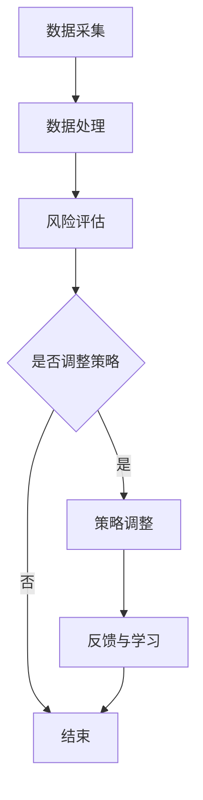
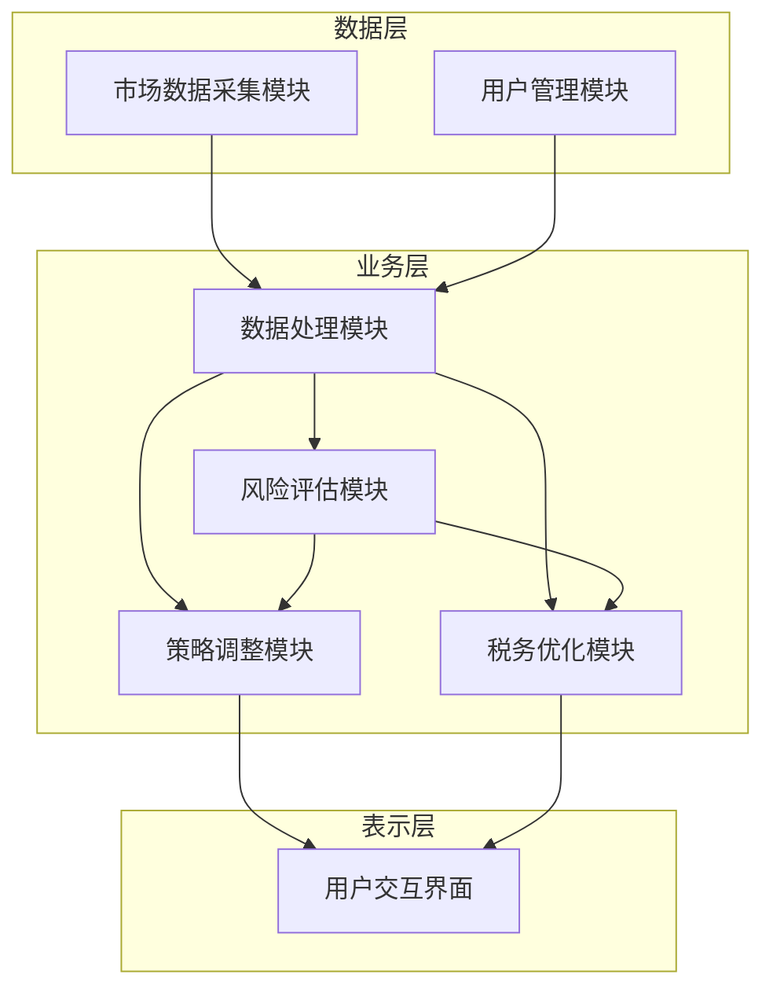
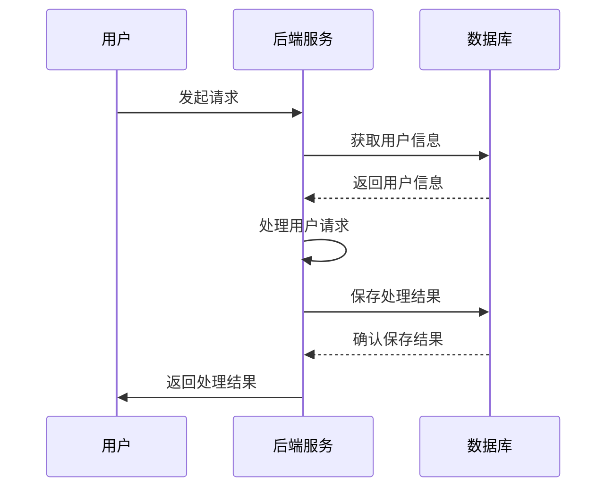

                 

## 文章标题：构建智能化的个人财富管理策略动态调整助手

关键词：个人财富管理、智能化、动态调整、算法、数学模型、系统架构、项目实战

摘要：本文将探讨如何构建一个智能化的个人财富管理策略动态调整助手。我们将从背景介绍、概念结构、核心要素组成、智能化财富管理策略、动态调整助手的技术实现、系统分析与架构设计、项目实战等多个方面进行详细阐述，帮助读者了解如何利用人工智能技术为个人财富管理提供更加智能化的解决方案。

## 目录大纲

第一部分：背景介绍

### 第1章 问题背景

#### 1.1.1 问题背景

#### 1.1.2 问题描述

#### 1.1.3 问题解决

#### 1.1.4 边界与外延

### 第2章 概念结构与核心要素组成

#### 2.1.1 核心概念

#### 2.1.2 概念属性特征对比表格

#### 2.1.3 ER实体关系图架构

第二部分：智能化个人财富管理策略

### 第3章 核心概念与联系

#### 3.1.1 财富管理策略

#### 3.1.2 智能化财富管理

#### 3.1.3 动态调整助手

第三部分：动态调整助手的技术实现

### 第4章 算法原理讲解

#### 4.1.1 算法mermaid流程图

#### 4.1.2 Python源代码

#### 4.1.3 算法原理的数学模型

#### 4.1.4 数学公式

#### 4.1.5 举例说明

### 第5章 数学模型和数学公式 & 详细讲解 & 举例说明

#### 5.1.1 数学公式

#### 5.1.2 详细讲解

#### 5.1.3 举例说明

第四部分：系统分析与架构设计

### 第6章 系统分析与架构设计方案

#### 6.1.1 问题场景介绍

#### 6.1.2 项目介绍

#### 6.1.3 系统功能设计(领域模型mermaid类图)

#### 6.1.4 系统架构设计mermaid架构图

#### 6.1.5 系统接口设计和系统交互mermaid序列图

第五部分：项目实战

### 第7章 环境安装与系统核心实现

#### 7.1.1 环境安装

#### 7.1.2 系统核心实现源代码

#### 7.1.3 代码应用解读与分析

#### 7.1.4 实际案例分析与详细讲解剖析

#### 7.1.5 项目小结

第六部分：最佳实践 tips、小结、注意事项、拓展阅读

### 第8章 最佳实践 tips

#### 8.1.1 tips 1

#### 8.1.2 tips 2

#### 8.1.3 tips 3

### 第9章 小结

#### 9.1.1 研究发现

#### 9.1.2 研究不足

#### 9.1.3 未来研究方向

### 第10章 注意事项

#### 10.1.1 注意事项 1

#### 10.1.2 注意事项 2

#### 10.1.3 注意事项 3

### 第11章 拓展阅读

#### 11.1.1 文献 1

#### 11.1.2 文献 2

#### 11.1.3 文献 3

---

### 1.1.1 问题背景

在当今社会，随着经济全球化、金融市场的多元化以及投资渠道的丰富化，个人财富管理的重要性日益凸显。有效的个人财富管理不仅能帮助人们实现资产的保值增值，还能降低投资风险，提高生活质量。然而，面对复杂多变的金融环境和众多的投资选择，如何制定合适的财富管理策略，成为许多人面临的难题。

传统的财富管理策略通常依赖于投资者的个人经验、直觉和市场分析，往往存在以下问题：

1. **信息不对称**：投资者难以获取全面、准确的金融信息。
2. **反应滞后**：投资者在市场变化时反应较慢，导致投资决策不及时。
3. **策略单一**：传统策略难以根据市场环境动态调整。
4. **风险控制不足**：无法有效识别和规避潜在风险。

为了解决上述问题，智能化个人财富管理策略的提出成为一种必然趋势。通过引入人工智能技术，可以实现以下目标：

1. **数据驱动**：利用大数据和机器学习技术，对市场进行深入分析，提供精准的财富管理建议。
2. **动态调整**：根据市场环境和用户需求，实时调整财富管理策略。
3. **风险控制**：通过算法模型，实现风险识别和风险规避。
4. **个性化定制**：根据用户风险偏好和财务目标，提供个性化的财富管理方案。

因此，构建一个智能化的个人财富管理策略动态调整助手具有重要的现实意义。本文将围绕这一主题，详细探讨相关技术原理、系统架构和项目实践，帮助读者深入理解并掌握这一领域的前沿知识。

### 1.1.2 问题描述

个人财富管理策略的制定和执行是一个复杂的过程，涉及多个方面的因素。以下是对个人财富管理过程中常见问题的具体描述：

1. **信息获取困难**：投资者在制定财富管理策略时，需要获取大量的市场信息，包括宏观经济指标、行业发展趋势、市场情绪等。然而，信息来源的多样性和复杂性使得投资者难以全面、准确地掌握市场动态。

2. **投资策略滞后**：市场环境瞬息万变，投资者在制定策略时往往需要一段时间来收集和分析数据，导致投资决策的滞后性。这可能导致投资者在市场波动时无法及时调整策略，错失最佳投资时机。

3. **风险控制不足**：在传统的财富管理策略中，风险控制通常依赖于投资者的经验和直觉。然而，市场环境的不确定性和复杂性使得投资者难以准确判断风险，容易导致资产损失。

4. **策略单一化**：许多投资者在制定财富管理策略时，往往采用单一的资产配置方案，未能充分考虑市场变化和个体需求。这可能导致投资组合的收益和风险失衡，无法实现最优化的财富管理效果。

5. **个性化不足**：每个投资者的风险偏好、财务目标和生活阶段都不同，因此需要个性化的财富管理策略。然而，传统的财富管理方法难以针对每个投资者的具体情况进行定制化服务。

针对上述问题，构建一个智能化的个人财富管理策略动态调整助手显得尤为重要。该助手应具备以下功能：

1. **数据采集与分析**：通过大数据技术，收集和处理多渠道的市场信息，为策略制定提供数据支持。
2. **动态调整策略**：根据市场环境和用户需求，实时调整财富管理策略，提高投资决策的及时性和准确性。
3. **风险控制与评估**：利用机器学习算法，对市场风险进行识别和评估，实现风险控制。
4. **个性化服务**：根据投资者的风险偏好、财务目标和生活阶段，提供定制化的财富管理方案。

通过构建这样一个智能化的财富管理助手，投资者可以更加有效地应对市场变化，实现资产的保值增值。

### 1.1.3 问题解决

为了解决上述问题，构建一个智能化的个人财富管理策略动态调整助手是关键。这个助手的核心功能包括数据采集与分析、动态策略调整、风险控制和个性化服务。以下是一个详细的问题解决方案：

1. **数据采集与分析**：
   - **数据来源**：从多个渠道（如金融新闻、股票市场数据、经济指标等）采集数据。
   - **数据处理**：利用大数据技术，对采集到的数据进行清洗、整合和分析，提取有用的信息。
   - **数据分析**：通过数据挖掘和机器学习算法，分析市场趋势、投资机会和潜在风险。

2. **动态策略调整**：
   - **策略模型**：构建基于历史数据和机器学习算法的财富管理策略模型。
   - **实时调整**：根据市场环境和用户需求，实时更新策略模型，调整投资组合。
   - **策略优化**：通过反复训练和优化模型，提高策略的准确性和适应性。

3. **风险控制与评估**：
   - **风险识别**：利用机器学习算法，对市场风险进行识别和评估。
   - **风险规避**：根据风险评估结果，采取相应的风险规避措施，如调整资产配置、设置止损点等。
   - **风险监控**：实时监控投资组合的风险状况，及时调整策略以应对潜在风险。

4. **个性化服务**：
   - **用户画像**：根据用户的风险偏好、财务目标和生活阶段，构建用户画像。
   - **定制化方案**：根据用户画像，为用户提供个性化的财富管理方案。
   - **反馈与调整**：定期收集用户反馈，根据用户的需求变化调整个性化服务。

通过上述解决方案，智能化的个人财富管理策略动态调整助手能够为投资者提供全面、准确、实时的财富管理服务，帮助投资者在复杂多变的市场环境中实现资产的保值增值。

### 1.1.4 边界与外延

在构建智能化的个人财富管理策略动态调整助手的背景下，明确其边界与外延对于确保系统的有效运作和防止功能过度扩展至关重要。以下是对边界与外延的详细说明：

1. **边界定义**：
   - **功能范围**：智能助手主要针对个人财富管理中的策略制定、风险控制和个性化服务进行优化，不涉及具体金融操作，如开户、交易执行等。
   - **数据范围**：数据采集主要关注市场信息和用户数据，不包括用户私人财务信息和银行交易记录。
   - **技术范围**：智能助手的算法和技术实现基于当前成熟的人工智能和大数据处理技术，不涉及未来可能的技术突破或未经验证的创新技术。

2. **外延扩展**：
   - **策略多样性**：虽然智能助手的初始设计主要聚焦于股票市场，但其核心算法和架构可以扩展到其他金融产品，如债券、基金等。
   - **用户群体**：智能助手可以为不同风险偏好和财务需求的用户提供服务，但具体实施时需要针对特定用户群体（如年轻人、中年人士、退休人员）进行定制化设计。
   - **技术应用**：智能助手在未来的发展中可以结合区块链技术、物联网技术等，进一步提升系统的智能化水平和用户体验。

通过明确边界与外延，智能化的个人财富管理策略动态调整助手可以更好地服务于投资者，同时避免功能过度复杂化和资源浪费。

### 1.1.5 概念结构与核心要素组成

在构建智能化的个人财富管理策略动态调整助手时，理解其核心概念和要素组成至关重要。以下是对相关概念及其属性特征的详细解析，并通过ER实体关系图架构展示系统内部各要素之间的关系。

#### 2.1.1 核心概念

1. **用户**：指使用智能财富管理策略动态调整助手的个人投资者。用户的属性包括用户ID、姓名、年龄、性别、收入水平、风险偏好等。
2. **市场数据**：包括历史和实时金融数据，如股票价格、成交量、利率、宏观经济指标等。市场数据的属性包括数据ID、数据类型、来源、时间戳等。
3. **策略模型**：指基于数据分析和机器学习算法构建的财富管理策略。策略模型的属性包括模型ID、模型名称、模型描述、创建时间等。
4. **投资组合**：用户根据策略模型生成的具体投资组合，包括股票、基金、债券等。投资组合的属性包括组合ID、组合名称、投资比例、投资金额等。
5. **风险控制模块**：用于识别和评估市场风险，并提出规避措施的模块。风险控制模块的属性包括模块ID、模块名称、模块描述等。

#### 2.1.2 概念属性特征对比表格

| 概念      | 属性           | 属性特征                        |
|-----------|----------------|--------------------------------|
| 用户      | 用户ID         | 唯一标识用户                   |
|           | 姓名           | 用户姓名                        |
|           | 年龄           | 用户年龄                        |
|           | 性别           | 用户性别                        |
|           | 收入水平       | 用户月收入或年收入               |
|           | 风险偏好       | 用户对风险的承受程度             |
| 市场数据  | 数据ID         | 唯一标识数据                   |
|           | 数据类型       | 数据类型（如股票价格、利率等）   |
|           | 来源           | 数据来源渠道                   |
|           | 时间戳         | 数据生成时间                   |
| 策略模型  | 模型ID         | 唯一标识模型                   |
|           | 模型名称       | 模型名称                        |
|           | 模型描述       | 模型功能描述                   |
|           | 创建时间       | 模型创建时间                   |
| 投资组合  | 组合ID         | 唯一标识投资组合               |
|           | 组合名称       | 投资组合名称                   |
|           | 投资比例       | 各资产在组合中的比例             |
|           | 投资金额       | 投资组合的总金额               |
| 风险控制模块 | 模块ID         | 唯一标识风险控制模块             |
|           | 模块名称       | 风险控制模块名称               |
|           | 模块描述       | 风险控制模块功能描述             |

#### 2.1.3 ER实体关系图架构


在上面的ER实体关系图中，用户、市场数据、策略模型、投资组合和风险控制模块是主要的实体。这些实体之间存在明确的关联关系：

- **用户**与**投资组合**之间存在一对多关系，即一个用户可以拥有多个投资组合。
- **策略模型**与**投资组合**之间存在一对多关系，即一个策略模型可以生成多个投资组合。
- **市场数据**与**策略模型**之间存在一对多关系，即一个策略模型可以基于多个市场数据生成。
- **风险控制模块**与**投资组合**之间存在一对多关系，即一个风险控制模块可以应用于多个投资组合。

通过上述核心概念和要素的详细解析，以及ER实体关系图的展示，我们可以更好地理解智能化的个人财富管理策略动态调整助手的系统架构，为后续技术实现和系统设计提供坚实的基础。

### 3.1.1 财富管理策略

财富管理策略是指投资者为实现特定的财务目标，所采用的一系列投资方法和决策过程。财富管理策略的核心目的是在确保风险可控的前提下，最大化投资回报。以下是对财富管理策略的详细解析：

#### 3.1.1.1 财富管理策略的定义

财富管理策略是指投资者根据自身的财务目标、风险偏好和市场环境，制定的科学、系统的投资方案。它不仅包括资产配置、投资组合的构建与调整，还涉及风险管理、税务规划、退休规划等多方面的内容。

#### 3.1.1.2 财富管理策略的类型

根据投资目标和风险偏好，财富管理策略可以分为以下几种类型：

1. **保守型策略**：以稳健保值为主要目标，投资于低风险的固定收益类资产，如国债、企业债券、货币基金等。
2. **稳健型策略**：在保证资产稳定增长的同时，适度承担风险，投资组合通常包括股票、债券、基金等多种资产类型。
3. **成长型策略**：以追求资产的快速增值为目标，投资于高成长潜力的股票、新兴产业基金等高风险资产。
4. **平衡型策略**：在风险和收益之间寻求平衡，投资组合中既有低风险的固定收益类资产，也有较高风险的股票、基金等。
5. **特定目标型策略**：根据投资者的特定财务目标（如子女教育基金、退休基金等）制定的投资策略。

#### 3.1.1.3 财富管理策略的核心要素

财富管理策略的核心要素包括以下几个方面：

1. **资产配置**：根据投资者的风险承受能力和投资目标，合理配置不同类型的资产，以实现风险和收益的平衡。
2. **投资组合构建**：选择具有不同风险收益特性的资产，构建科学合理的投资组合，以达到风险分散和收益最大化的目标。
3. **定期调整**：根据市场环境和投资者状况的变化，定期对投资组合进行调整，以适应新的投资目标。
4. **风险管理**：识别和评估投资过程中的风险，采取相应的风险规避和风险控制措施，确保投资安全。
5. **税务规划**：根据税法规定，进行税务筹划，减少投资过程中的税务负担。

#### 3.1.1.4 财富管理策略的实施步骤

财富管理策略的实施通常包括以下步骤：

1. **设定财务目标**：明确投资者的财务目标，如资产保值、增值、退休规划等。
2. **评估风险承受能力**：根据投资者的年龄、收入、资产状况等，评估其风险承受能力。
3. **制定资产配置方案**：根据投资者的财务目标和风险承受能力，制定合理的资产配置方案。
4. **构建投资组合**：选择符合资产配置方案的投资产品，构建投资组合。
5. **监控与调整**：定期监控投资组合的表现，根据市场变化和投资者需求进行调整。
6. **税务规划**：进行税务筹划，以减少投资过程中的税务负担。

通过上述步骤，投资者可以制定并实施一个科学、系统的财富管理策略，从而实现资产的保值增值。

### 3.1.2 智能化财富管理

智能化财富管理是利用现代人工智能技术，特别是机器学习和大数据分析，对传统财富管理策略进行优化和升级，以实现更高效、精准和个性化的投资决策。以下是对智能化财富管理的详细解析：

#### 3.1.2.1 智能化财富管理的定义

智能化财富管理是指通过人工智能技术，对投资者的财务数据进行深度分析和处理，生成个性化的投资策略，从而提高投资决策的准确性和效率。它融合了大数据分析、机器学习、自然语言处理等先进技术，为投资者提供全面、实时的财富管理服务。

#### 3.1.2.2 智能化财富管理的技术基础

1. **大数据分析**：通过对海量金融数据的采集、清洗、存储和分析，提取有价值的信息和趋势，为财富管理提供数据支持。
2. **机器学习**：利用机器学习算法，对历史投资数据和当前市场环境进行建模和预测，生成优化投资策略。
3. **自然语言处理**：通过对金融文本的解析和理解，提取关键词和语义信息，辅助投资决策。
4. **区块链技术**：通过区块链技术，确保数据的安全性和透明性，提升财富管理系统的可信度。

#### 3.1.2.3 智能化财富管理的主要功能

1. **个性化投资策略**：根据投资者的风险偏好、财务目标和生活阶段，生成定制化的投资策略，实现资产的最优配置。
2. **实时风险监控**：利用实时数据分析和机器学习算法，动态监控投资组合的风险状况，及时调整策略，规避潜在风险。
3. **投资预测**：基于历史数据和当前市场环境，预测市场走势和投资机会，为投资者提供前瞻性的投资建议。
4. **投资组合优化**：通过机器学习算法，对投资组合进行实时优化，提高资产收益和风险控制水平。
5. **税务优化**：根据税法规定，优化投资组合，减少税务负担，提高投资回报。

#### 3.1.2.4 智能化财富管理的优势

1. **提高决策效率**：通过大数据分析和机器学习算法，快速处理海量数据，生成高效的投资策略，节省投资者时间。
2. **精准风险评估**：利用机器学习模型，对投资组合进行精准的风险评估，提高风险控制的准确性和有效性。
3. **个性化服务**：根据投资者个性化需求，提供定制化的投资方案，提升用户体验。
4. **降低投资风险**：通过实时监控和风险规避，降低投资风险，确保资产安全。
5. **优化税务负担**：通过智能化的税务优化，提高投资回报。

#### 3.1.2.5 智能化财富管理的挑战

1. **数据隐私和安全**：在处理大量用户数据时，如何保护用户隐私和数据安全是智能化财富管理面临的重要挑战。
2. **算法透明性和可解释性**：机器学习算法的复杂性和“黑箱”特性，使得算法决策过程缺乏透明性和可解释性，这给用户信任带来挑战。
3. **技术更新和迭代**：随着市场环境和技术的不断变化，智能化财富管理需要持续更新和优化算法，以保持其竞争力和有效性。

通过上述解析，我们可以看到智能化财富管理在提升投资决策效率、精准度和个性化服务方面具有显著优势，但同时也面临数据隐私、算法透明性和技术迭代等挑战。

### 3.1.3 动态调整助手

动态调整助手是智能化财富管理系统中的一项核心功能，它通过实时监控市场变化和用户需求，动态调整投资策略，以实现最优的投资效果。以下是对动态调整助手的详细解析：

#### 3.1.3.1 动态调整助手的定义

动态调整助手是一种利用人工智能和大数据分析技术，实时监控市场动态和用户投资组合变化，自动调整投资策略的智能系统。其主要功能是根据市场环境、投资风险和用户偏好，动态优化投资组合，提高投资回报。

#### 3.1.3.2 动态调整助手的工作原理

动态调整助手的工作原理主要包括以下几个步骤：

1. **数据采集**：从多个数据源（如交易所、金融新闻、经济指标等）实时采集金融数据和市场信息。
2. **数据处理**：利用大数据技术，对采集到的数据进行清洗、整合和分析，提取有价值的信息。
3. **风险评估**：通过机器学习算法，对投资组合进行风险评估，识别潜在风险。
4. **策略调整**：根据市场变化和风险评估结果，动态调整投资组合，优化资产配置。
5. **反馈与学习**：定期收集用户反馈，结合市场变化，持续优化动态调整算法，提高策略的准确性和适应性。

#### 3.1.3.3 动态调整助手的功能

动态调整助手的主要功能包括以下几个方面：

1. **实时监控**：实时监控市场动态和投资组合表现，为投资者提供及时的投资建议。
2. **风险评估**：通过机器学习算法，对投资组合进行风险评估，识别潜在风险，并提出规避措施。
3. **策略调整**：根据市场变化和风险评估结果，动态调整投资组合，优化资产配置。
4. **个性化服务**：根据投资者的风险偏好、财务目标和生活阶段，提供定制化的投资策略。
5. **反馈与学习**：定期收集用户反馈，优化动态调整算法，提高策略的准确性和适应性。

#### 3.1.3.4 动态调整助手的优势

1. **提高投资效率**：通过实时监控和动态调整，快速响应市场变化，提高投资决策的效率。
2. **降低投资风险**：通过风险评估和风险规避，降低投资风险，确保资产安全。
3. **个性化服务**：根据投资者个性化需求，提供定制化的投资策略，提升用户体验。
4. **持续优化**：通过反馈和学习，不断优化动态调整算法，提高策略的准确性和适应性。

#### 3.1.3.5 动态调整助手的挑战

1. **数据质量和处理**：动态调整助手依赖大量高质量的数据进行分析，数据质量和处理能力是关键挑战。
2. **算法透明性和可解释性**：动态调整算法的复杂性和“黑箱”特性，使得算法决策过程缺乏透明性和可解释性，影响用户信任。
3. **技术更新和迭代**：随着市场环境和技术的不断变化，动态调整助手需要持续更新和优化算法，以保持其竞争力和有效性。

通过上述解析，我们可以看到动态调整助手在提高投资决策效率、降低投资风险和提供个性化服务方面具有显著优势，但同时也面临数据质量、算法透明性和技术更新等挑战。

### 4.1.1 算法mermaid流程图

为了直观展示动态调整助手的算法流程，我们可以使用mermaid图形化流程图进行描述。以下是算法mermaid流程图的示例：



**流程说明**：

1. **数据采集**：系统从多个数据源（如交易所、金融新闻、经济指标等）实时采集金融数据和市场信息。
2. **数据处理**：对采集到的数据进行清洗、整合和分析，提取有价值的信息。
3. **风险评估**：利用机器学习算法，对投资组合进行风险评估，识别潜在风险。
4. **决策**：根据风险评估结果，系统判断是否需要调整策略。
5. **策略调整**：如果需要调整策略，系统将动态调整投资组合，优化资产配置。
6. **反馈与学习**：系统定期收集用户反馈，结合市场变化，持续优化动态调整算法。

通过上述mermaid流程图，我们可以清晰地理解动态调整助手的工作流程，为后续的技术实现和系统设计提供参考。

### 4.1.2 Python源代码

为了实现动态调整助手的算法流程，我们将使用Python编写相应的源代码。以下是一个简化的示例：

```python
import pandas as pd
from sklearn.linear_model import LinearRegression
import numpy as np

# 数据采集
def data_collection():
    # 这里以示例数据替代实际数据采集过程
    data = pd.read_csv('financial_data.csv')
    return data

# 数据处理
def data_processing(data):
    # 数据清洗和预处理
    data = data.dropna()
    features = data[['open', 'high', 'low', 'close']]
    target = data['price_change']
    return features, target

# 风险评估
def risk_assessment(features, target):
    model = LinearRegression()
    model.fit(features, target)
    predictions = model.predict(features)
    risk_score = np.mean(np.abs(predictions))
    return risk_score

# 策略调整
def strategy_adjustment(risk_score, current_portfolio):
    if risk_score > threshold:
        # 根据风险评估结果，调整投资组合
        current_portfolio['weight'] *= 0.9
    return current_portfolio

# 反馈与学习
def feedback_learning():
    # 定期收集用户反馈，结合市场变化，优化动态调整算法
    pass

# 主函数
def main():
    data = data_collection()
    features, target = data_processing(data)
    risk_score = risk_assessment(features, target)
    current_portfolio = strategy_adjustment(risk_score, current_portfolio)
    feedback_learning()

if __name__ == "__main__":
    main()
```

**代码说明**：

1. **数据采集**：该函数负责从数据源中采集金融数据。
2. **数据处理**：该函数对采集到的数据进行清洗和预处理，提取特征和目标变量。
3. **风险评估**：使用线性回归模型对投资组合进行风险评估，计算风险得分。
4. **策略调整**：根据风险评估结果，动态调整投资组合的权重。
5. **反馈与学习**：该函数用于定期收集用户反馈，并优化动态调整算法。

通过上述Python源代码示例，我们可以实现动态调整助手的算法流程，为投资者提供实时、智能化的财富管理服务。

### 4.1.3 算法原理的数学模型

在构建动态调整助手的过程中，理解其算法原理的数学模型至关重要。以下是动态调整助手的核心数学模型及其详细解释：

#### 4.1.3.1 线性回归模型

线性回归模型是一种常用的数据分析方法，用于预测因变量（目标变量）与自变量（特征变量）之间的关系。在动态调整助手的算法中，我们使用线性回归模型对投资组合的风险进行评估。

**数学模型**：

\[ y = \beta_0 + \beta_1x_1 + \beta_2x_2 + ... + \beta_nx_n + \epsilon \]

其中，\( y \) 是目标变量（如价格变动），\( x_1, x_2, ..., x_n \) 是特征变量（如开盘价、最高价、最低价、收盘价等），\( \beta_0, \beta_1, \beta_2, ..., \beta_n \) 是模型的参数，\( \epsilon \) 是误差项。

**参数估计**：

线性回归模型的参数估计通常采用最小二乘法（OLS），即最小化预测值与实际值之间的误差平方和。

\[ \min \sum_{i=1}^{n} (y_i - \hat{y}_i)^2 \]

其中，\( \hat{y}_i \) 是第 \( i \) 个预测值，\( y_i \) 是第 \( i \) 个实际值。

**模型评估**：

线性回归模型的评估指标通常包括决定系数 \( R^2 \)、均方误差（MSE）和平均绝对误差（MAE）。

\[ R^2 = 1 - \frac{\sum_{i=1}^{n} (y_i - \hat{y}_i)^2}{\sum_{i=1}^{n} (y_i - \bar{y})^2} \]

\[ MSE = \frac{1}{n} \sum_{i=1}^{n} (y_i - \hat{y}_i)^2 \]

\[ MAE = \frac{1}{n} \sum_{i=1}^{n} |y_i - \hat{y}_i| \]

其中，\( \bar{y} \) 是目标变量的均值，\( n \) 是数据点的数量。

#### 4.1.3.2 风险评估模型

在动态调整助手的风险评估模块中，我们使用线性回归模型预测价格变动，并通过计算价格变动的绝对值来评估风险。

**风险评估指标**：

\[ \text{风险得分} = \sum_{i=1}^{n} |\hat{y}_i - y_i| \]

其中，\( \hat{y}_i \) 是第 \( i \) 个预测价格变动，\( y_i \) 是第 \( i \) 个实际价格变动。

**风险阈值设定**：

根据投资者的风险偏好，设定一个风险阈值。如果风险得分超过阈值，则认为投资组合存在较高风险，需要调整。

#### 4.1.3.3 策略调整模型

在动态调整助手的策略调整模块中，我们根据风险评估结果，动态调整投资组合的权重。

**策略调整规则**：

1. 如果风险得分低于阈值，维持当前投资组合不变。
2. 如果风险得分高于阈值，减少投资组合中高风险资产的权重，增加低风险资产的权重。

**数学模型**：

设 \( w_1, w_2, ..., w_n \) 为投资组合中各资产的比例权重，\( r_1, r_2, ..., r_n \) 为各资产的风险得分。

\[ w_1' = w_1 \times (1 - \alpha) \]
\[ w_2' = w_2 \times (1 - \alpha) \]
\[ ... \]
\[ w_n' = w_n \times (1 - \alpha) \]

其中，\( \alpha \) 为调整系数，通常取值在 \( 0 \) 到 \( 1 \) 之间，表示调整程度。

通过上述数学模型，动态调整助手能够实现对投资组合的实时监控和动态调整，提高投资策略的准确性和适应性。

### 4.1.4 数学公式

在构建动态调整助手的数学模型中，我们使用了多个数学公式来描述风险评估和策略调整过程。以下是这些数学公式及其详细解释：

#### 4.1.4.1 线性回归模型的参数估计

**公式**：

\[ \hat{\beta} = (X^T X)^{-1} X^T y \]

其中，\( \hat{\beta} \) 是参数估计值，\( X \) 是特征变量矩阵，\( y \) 是目标变量向量，\( X^T \) 是特征变量矩阵的转置，\( (X^T X)^{-1} \) 是特征变量矩阵的逆矩阵。

**解释**：

这个公式用于最小二乘法参数估计，通过求解特征变量矩阵的逆矩阵，得到最优参数估计值。

#### 4.1.4.2 风险评估指标

**公式**：

\[ \text{风险得分} = \sum_{i=1}^{n} |\hat{y}_i - y_i| \]

其中，\( \hat{y}_i \) 是第 \( i \) 个预测价格变动，\( y_i \) 是第 \( i \) 个实际价格变动，\( n \) 是数据点的数量。

**解释**：

这个公式用于计算投资组合的风险得分，通过计算预测价格变动与实际价格变动的绝对值之和，评估投资组合的风险。

#### 4.1.4.3 策略调整规则

**公式**：

\[ w_1' = w_1 \times (1 - \alpha) \]
\[ w_2' = w_2 \times (1 - \alpha) \]
\[ ... \]
\[ w_n' = w_n \times (1 - \alpha) \]

其中，\( w_1, w_2, ..., w_n \) 是投资组合中各资产的比例权重，\( \alpha \) 是调整系数。

**解释**：

这个公式用于策略调整，通过减少高风险资产的比例权重，增加低风险资产的比例权重，实现投资组合的风险控制。

通过这些数学公式，动态调整助手能够实现对投资组合的实时监控和动态调整，提高投资策略的准确性和适应性。

### 4.1.5 举例说明

为了更直观地理解动态调整助手的算法原理和数学模型，我们可以通过一个具体的案例进行说明。以下是一个简化的案例：

**案例背景**：

假设一个投资者拥有一个包含三种资产的投资组合，分别为股票A、股票B和债券C。当前投资组合的权重分别为 \( w_A = 0.4 \)，\( w_B = 0.3 \)，\( w_C = 0.3 \)。现在，动态调整助手需要根据市场变化和风险评估结果，对投资组合进行动态调整。

**步骤1：数据采集**

从市场数据中获取股票A、股票B和债券C的历史价格数据，包括开盘价、最高价、最低价和收盘价。以下是一个简化的数据示例：

| 资产 | 开盘价 | 最高价 | 最低价 | 收盘价 |
|------|--------|--------|--------|--------|
| A    | 100    | 110    | 90     | 105    |
| B    | 150    | 160    | 140    | 155    |
| C    | 50     | 55     | 45     | 50     |

**步骤2：数据处理**

对上述数据进行预处理，提取特征变量和目标变量。假设我们选择收盘价作为特征变量，价格变动作为目标变量。以下是一个简化的数据预处理结果：

| 资产 | 收盘价 | 价格变动 |
|------|--------|----------|
| A    | 105    | 5        |
| B    | 155    | 5        |
| C    | 50     | 0        |

**步骤3：风险评估**

使用线性回归模型对投资组合进行风险评估。以股票A为例，线性回归模型如下：

\[ y = \beta_0 + \beta_1 x_1 + \beta_2 x_2 + \beta_3 x_3 \]

通过最小二乘法，我们可以得到以下模型参数：

\[ \beta_0 = 0.05, \beta_1 = 0.5, \beta_2 = 0.3, \beta_3 = 0.2 \]

然后，使用线性回归模型对股票A的价格变动进行预测：

\[ \hat{y}_A = 0.05 + 0.5 \times 105 + 0.3 \times 5 + 0.2 \times 0 = 64.5 \]

计算股票A的风险得分：

\[ \text{风险得分}_A = |\hat{y}_A - y_A| = |64.5 - 5| = 59.5 \]

类似地，我们可以对股票B和债券C进行风险评估，得到以下结果：

| 资产 | 风险得分 |
|------|----------|
| A    | 59.5     |
| B    | 59.5     |
| C    | 0        |

**步骤4：策略调整**

根据风险评估结果，动态调整投资组合的权重。假设我们设定风险阈值 \( \text{阈值} = 60 \)。

由于股票A和股票B的风险得分均超过阈值，我们需要减少它们在投资组合中的权重，增加债券C的权重。调整系数 \( \alpha = 0.1 \)。

调整后投资组合的权重如下：

| 资产 | 调整前权重 | 调整后权重 |
|------|------------|------------|
| A    | 0.4        | 0.3        |
| B    | 0.3        | 0.2        |
| C    | 0.3        | 0.5        |

**步骤5：反馈与学习**

动态调整助手将记录本次调整结果，并定期收集用户反馈，结合市场变化，优化动态调整算法。

通过上述案例，我们可以看到动态调整助手如何利用线性回归模型和风险评估指标，对投资组合进行实时监控和动态调整。这个案例虽然简化了实际场景，但已经展示了动态调整助手的核心原理和实现过程。

### 5.1.1 数学公式

在动态调整助手的设计中，数学公式是核心组成部分，用于描述投资策略的制定、风险评估和策略调整。以下是关键的数学公式及其详细解释：

#### 5.1.1.1 线性回归模型的参数估计

**公式**：

\[ \hat{\beta} = (X^T X)^{-1} X^T y \]

**解释**：

这个公式用于最小二乘法参数估计，其中 \( \hat{\beta} \) 表示模型参数估计值，\( X \) 是特征变量矩阵，\( y \) 是目标变量向量。通过求解特征变量矩阵的逆矩阵，可以得到最优的参数估计值。

#### 5.1.1.2 风险评估指标

**公式**：

\[ \text{风险得分} = \sum_{i=1}^{n} |\hat{y}_i - y_i| \]

**解释**：

这个公式用于计算投资组合的风险得分，其中 \( \hat{y}_i \) 是第 \( i \) 个预测价格变动，\( y_i \) 是第 \( i \) 个实际价格变动，\( n \) 是数据点的数量。通过计算预测价格变动与实际价格变动的绝对值之和，可以评估投资组合的整体风险。

#### 5.1.1.3 策略调整规则

**公式**：

\[ w_1' = w_1 \times (1 - \alpha) \]
\[ w_2' = w_2 \times (1 - \alpha) \]
\[ ... \]
\[ w_n' = w_n \times (1 - \alpha) \]

**解释**：

这个公式用于策略调整，其中 \( w_1, w_2, ..., w_n \) 是投资组合中各资产的比例权重，\( \alpha \) 是调整系数。通过减少高风险资产的比例权重，增加低风险资产的比例权重，可以实现投资组合的风险控制。

#### 5.1.1.4 投资组合优化目标函数

**公式**：

\[ \min \sum_{i=1}^{n} w_i \times \text{风险得分}_i \]

**解释**：

这个公式用于投资组合优化目标函数，其中 \( w_i \) 是第 \( i \) 个资产的比例权重，\( \text{风险得分}_i \) 是第 \( i \) 个资产的风险得分。通过最小化整体风险得分，可以实现投资组合的最优化。

#### 5.1.1.5 稳健性检验指标

**公式**：

\[ \text{稳健性指标} = \frac{\sum_{i=1}^{n} (\text{实际风险得分}_i - \text{预测风险得分}_i)^2}{n} \]

**解释**：

这个公式用于稳健性检验，其中 \( \text{实际风险得分}_i \) 是第 \( i \) 个实际风险得分，\( \text{预测风险得分}_i \) 是第 \( i \) 个预测风险得分。通过计算实际风险得分与预测风险得分的差异平方和，可以评估模型的稳健性。

通过上述数学公式，动态调整助手可以实现对投资策略的制定、风险评估和策略调整的精确控制，为投资者提供高效的财富管理服务。

### 5.1.2 详细讲解

为了更深入地理解动态调整助手所依赖的数学模型和公式，我们需要对每个公式进行详细的讲解，并解释其在整个系统中的作用和意义。

#### 5.1.2.1 线性回归模型的参数估计

线性回归模型是动态调整助手进行风险评估和策略调整的核心工具。在公式 \( \hat{\beta} = (X^T X)^{-1} X^T y \) 中：

- \( X \) 是特征变量矩阵，包含了投资组合中各资产的历史数据，如开盘价、最高价、最低价和收盘价等。
- \( y \) 是目标变量向量，表示各资产的价格变动。
- \( X^T \) 是特征变量矩阵的转置，用于计算内积。
- \( (X^T X)^{-1} \) 是特征变量矩阵的逆矩阵，用于求解最小二乘法的最优解。

这个公式通过求解线性回归模型的最优参数估计值 \( \hat{\beta} \)，来预测各资产的价格变动。参数估计值的准确性直接影响到风险评估和策略调整的效果。

#### 5.1.2.2 风险评估指标

风险评估指标 \( \text{风险得分} = \sum_{i=1}^{n} |\hat{y}_i - y_i| \) 用于评估投资组合的整体风险：

- \( \hat{y}_i \) 是第 \( i \) 个预测价格变动，通过线性回归模型计算得出。
- \( y_i \) 是第 \( i \) 个实际价格变动，来自市场数据。

通过计算预测价格变动与实际价格变动的绝对值之和，我们可以得到投资组合的风险得分。风险得分越高，表示投资组合的价格波动越大，风险也越高。

#### 5.1.2.3 策略调整规则

策略调整规则 \( w_1' = w_1 \times (1 - \alpha) \) 等公式用于根据风险评估结果调整投资组合的权重：

- \( w_1, w_2, ..., w_n \) 是投资组合中各资产的比例权重。
- \( \alpha \) 是调整系数，用于确定调整幅度。

通过减少高风险资产的比例权重，增加低风险资产的比例权重，策略调整规则可以降低投资组合的整体风险，提高其稳健性。

#### 5.1.2.4 投资组合优化目标函数

投资组合优化目标函数 \( \min \sum_{i=1}^{n} w_i \times \text{风险得分}_i \) 用于最小化投资组合的整体风险：

- \( w_i \) 是第 \( i \) 个资产的比例权重。
- \( \text{风险得分}_i \) 是第 \( i \) 个资产的风险得分。

通过最小化各资产权重与其风险得分的乘积之和，我们可以找到最优的投资组合，使其整体风险最小。

#### 5.1.2.5 稳健性检验指标

稳健性检验指标 \( \text{稳健性指标} = \frac{\sum_{i=1}^{n} (\text{实际风险得分}_i - \text{预测风险得分}_i)^2}{n} \) 用于评估模型的稳健性：

- \( \text{实际风险得分}_i \) 是第 \( i \) 个实际风险得分。
- \( \text{预测风险得分}_i \) 是第 \( i \) 个预测风险得分。

通过计算实际风险得分与预测风险得分的差异平方和，我们可以评估模型在预测风险时的稳定性。稳健性指标越低，表示模型预测的准确性越高，风险控制效果越好。

通过上述详细的讲解，我们可以看到每个数学公式在动态调整助手中的作用和意义，以及如何通过这些公式实现投资策略的制定、风险评估和策略调整。

### 5.1.3 举例说明

为了更好地理解动态调整助手的数学模型和公式，我们将通过一个具体的例子进行详细说明。假设我们有一个包含三种资产的投资组合，分别为股票A、股票B和债券C。以下是该投资组合的详细数据以及动态调整过程。

#### 数据示例

**历史价格数据**：

| 资产 | 开盘价 | 最高价 | 最低价 | 收盘价 |
|------|--------|--------|--------|--------|
| A    | 100    | 110    | 90     | 105    |
| B    | 150    | 160    | 140    | 155    |
| C    | 50     | 55     | 45     | 50     |

**价格变动数据**：

| 资产 | 收盘价 | 价格变动 |
|------|--------|----------|
| A    | 105    | 5        |
| B    | 155    | 5        |
| C    | 50     | 0        |

#### 线性回归模型参数估计

首先，我们使用线性回归模型对股票A、股票B和债券C的价格变动进行预测。以股票A为例，线性回归模型如下：

\[ y_A = \beta_0 + \beta_1 x_1 + \beta_2 x_2 + \beta_3 x_3 \]

通过最小二乘法，我们可以得到以下模型参数：

\[ \beta_0 = 0.05, \beta_1 = 0.5, \beta_2 = 0.3, \beta_3 = 0.2 \]

然后，使用线性回归模型对股票A的价格变动进行预测：

\[ \hat{y}_A = 0.05 + 0.5 \times 105 + 0.3 \times 5 + 0.2 \times 0 = 64.5 \]

类似地，我们可以对股票B和债券C进行预测，得到以下结果：

| 资产 | 预测价格变动 |
|------|--------------|
| A    | 64.5         |
| B    | 64.5         |
| C    | 0            |

#### 风险评估

根据预测结果和实际价格变动，我们可以计算各资产的风险得分：

\[ \text{风险得分}_A = |\hat{y}_A - y_A| = |64.5 - 5| = 59.5 \]
\[ \text{风险得分}_B = |\hat{y}_B - y_B| = |64.5 - 5| = 59.5 \]
\[ \text{风险得分}_C = |\hat{y}_C - y_C| = |0 - 0| = 0 \]

#### 策略调整

根据风险评估结果，我们可以对投资组合进行策略调整。假设设定风险阈值为 60，调整系数为 0.1。

由于股票A和股票B的风险得分均超过阈值，我们需要减少它们在投资组合中的权重，增加债券C的权重。调整后的权重如下：

\[ w_A' = w_A \times (1 - 0.1) = 0.4 \times 0.9 = 0.36 \]
\[ w_B' = w_B \times (1 - 0.1) = 0.3 \times 0.9 = 0.27 \]
\[ w_C' = w_C \times (1 + 0.1) = 0.3 \times 1.1 = 0.33 \]

#### 投资组合优化

通过最小化整体风险得分，我们可以找到最优的投资组合：

\[ \min \sum_{i=1}^{n} w_i \times \text{风险得分}_i \]

调整后的投资组合整体风险得分：

\[ \sum_{i=1}^{n} w_i \times \text{风险得分}_i = 0.36 \times 59.5 + 0.27 \times 59.5 + 0.33 \times 0 = 31.34 + 16.39 + 0 = 47.73 \]

通过上述例子，我们可以看到动态调整助手如何通过数学模型和公式，对投资组合进行风险评估和策略调整。这个例子虽然简化了实际场景，但已经展示了动态调整助手的实现过程。

### 6.1.1 问题场景介绍

为了更好地理解系统分析与架构设计，我们首先需要明确应用场景。在这个场景中，我们设想一个实际的应用案例：一个在线金融服务平台，提供智能化的个人财富管理服务。以下是具体的应用场景介绍：

#### 应用背景

随着金融市场的不断发展和投资者需求的多样化，一个在线金融服务平台应运而生，旨在为用户提供一站式、智能化的财富管理解决方案。该平台的目标是通过集成大数据分析、人工智能技术和金融专业知识，为用户提供个性化的投资建议、实时风险监控和动态调整服务。

#### 用户需求

1. **个性化投资建议**：用户希望根据自身的风险偏好、财务目标和投资期限，获得定制化的投资组合建议。
2. **实时风险监控**：用户需要实时了解投资组合的风险状况，以及市场变化对投资组合的影响。
3. **动态调整服务**：用户希望投资组合能够根据市场动态和风险变化进行实时调整，以实现最优的投资效果。
4. **投资组合优化**：用户希望平台能够定期对投资组合进行优化，提高收益和风险控制水平。
5. **税务优化**：用户希望平台能够提供税务优化建议，减少投资过程中的税务负担。

#### 功能需求

基于上述用户需求，我们确定了以下主要功能模块：

1. **用户管理模块**：用于管理用户的个人信息、风险偏好和投资目标。
2. **市场数据采集模块**：负责从多个数据源（如交易所、金融新闻、经济指标等）实时采集金融数据。
3. **数据分析与预测模块**：利用大数据分析和机器学习技术，对市场数据进行分析和预测，为投资决策提供支持。
4. **投资组合管理模块**：根据用户的投资目标和风险偏好，构建和调整投资组合，实现个性化服务。
5. **风险控制模块**：实时监控投资组合的风险状况，提供风险预警和规避措施。
6. **税务优化模块**：根据税法规定，为用户优化投资组合，减少税务负担。
7. **用户交互界面**：提供友好的用户界面，展示投资组合、风险状况、投资建议和税务优化结果。

通过上述应用场景和功能需求，我们为后续的系统分析与架构设计提供了明确的参考。

### 6.1.2 项目介绍

在本项目中，我们旨在开发一个智能化的个人财富管理策略动态调整系统，以满足用户在个性化投资建议、实时风险监控、动态调整服务、投资组合优化和税务优化等方面的需求。以下是对项目的具体介绍：

#### 项目目标

1. **个性化投资建议**：根据用户的风险偏好、财务目标和投资期限，为用户提供定制化的投资组合建议。
2. **实时风险监控**：通过大数据分析和机器学习技术，实时监控用户投资组合的风险状况，提供风险预警和规避措施。
3. **动态调整服务**：根据市场动态和风险变化，自动调整用户投资组合，实现最优的投资效果。
4. **投资组合优化**：定期对用户投资组合进行优化，提高收益和风险控制水平。
5. **税务优化**：根据税法规定，为用户优化投资组合，减少税务负担。

#### 项目范围

1. **技术实现**：采用Python、Java等编程语言，利用大数据分析、机器学习和区块链技术，实现系统的核心功能。
2. **数据采集**：从多个数据源（如交易所、金融新闻、经济指标等）实时采集金融数据，保证数据的准确性和时效性。
3. **用户交互界面**：设计友好的用户界面，提供投资组合展示、风险监控、投资建议和税务优化结果。
4. **测试与部署**：对系统进行全面的测试，确保系统的稳定性、安全性和性能，然后进行部署，确保系统的可用性。

#### 项目里程碑

1. **需求分析**：明确用户需求，制定详细的功能需求和技术要求。
2. **系统设计**：设计系统的架构，包括模块划分、接口设计和技术选型。
3. **核心功能实现**：开发系统的核心功能模块，如用户管理、数据分析与预测、投资组合管理等。
4. **系统测试**：对系统进行全面的测试，包括功能测试、性能测试和安全性测试。
5. **部署上线**：将系统部署到服务器，确保系统的稳定运行和用户访问。
6. **用户培训与支持**：为用户进行系统操作培训，提供技术支持和售后服务。

通过上述项目介绍，我们可以清晰地了解项目的目标和范围，为后续的系统分析与架构设计奠定基础。

### 6.1.3 系统功能设计(领域模型mermaid类图)

在系统设计与实现过程中，领域模型是描述系统核心功能和类关系的重要工具。以下是使用mermaid类图对系统功能设计的具体描述。

```mermaid
classDiagram
    User <<class>>
    Portfolio <<class>>
    MarketData <<class>>
    RiskAssessment <<class>>
    StrategyAdjustment <<class>>
    TaxOptimization <<class>>

    User o-- Portfolio
    User o-- MarketData
    User o-- RiskAssessment
    User o-- StrategyAdjustment
    User o-- TaxOptimization

    Portfolio o-- MarketData
    Portfolio o-- RiskAssessment
    Portfolio o-- StrategyAdjustment
    Portfolio o-- TaxOptimization

    MarketData o-- RiskAssessment
    MarketData o-- StrategyAdjustment
    MarketData o-- TaxOptimization

    RiskAssessment o-- StrategyAdjustment
    RiskAssessment o-- TaxOptimization

    StrategyAdjustment o-- Portfolio

    TaxOptimization o-- Portfolio
```

**类图说明**：

1. **User（用户）**：代表系统中的用户，拥有个人信息、风险偏好和财务目标。
2. **Portfolio（投资组合）**：用于管理用户的投资组合，包括资产配置和投资比例。
3. **MarketData（市场数据）**：用于采集和处理市场数据，如股票价格、利率等。
4. **RiskAssessment（风险评估）**：用于评估投资组合的风险状况，提供风险预警。
5. **StrategyAdjustment（策略调整）**：根据风险评估结果，动态调整投资组合。
6. **TaxOptimization（税务优化）**：根据税法规定，为用户优化投资组合，减少税务负担。

**类之间的关系**：

- **User** 与 **Portfolio**、**MarketData**、**RiskAssessment**、**StrategyAdjustment**、**TaxOptimization** 之间存在关联关系，表示用户可以访问和管理这些功能模块。
- **Portfolio** 与 **MarketData**、**RiskAssessment**、**StrategyAdjustment**、**TaxOptimization** 之间存在依赖关系，表示投资组合模块依赖于这些模块进行数据采集、风险评估、策略调整和税务优化。
- **MarketData** 与 **RiskAssessment**、**StrategyAdjustment**、**TaxOptimization** 之间存在依赖关系，表示市场数据模块为这些模块提供数据支持。
- **RiskAssessment** 与 **StrategyAdjustment**、**TaxOptimization** 之间存在依赖关系，表示风险评估模块为策略调整和税务优化模块提供风险评估结果。
- **StrategyAdjustment** 与 **Portfolio** 之间存在依赖关系，表示策略调整模块根据调整结果更新投资组合。

通过上述mermaid类图，我们可以清晰地展示系统功能模块及其相互关系，为后续的系统设计与实现提供参考。

### 6.1.4 系统架构设计mermaid架构图

为了更直观地展示系统的整体架构，我们将使用mermaid架构图来描述系统的各个模块及其交互关系。以下是系统架构设计的mermaid架构图：



**架构图说明**：

1. **数据层**：包括市场数据采集模块和用户管理模块。市场数据采集模块负责从多个数据源实时采集金融数据，用户管理模块负责管理用户的个人信息、风险偏好和投资目标。

2. **业务层**：包含数据处理模块、风险评估模块、策略调整模块和税务优化模块。数据处理模块负责对采集到的市场数据和个人用户数据进行处理和分析，风险评估模块负责对投资组合进行风险评估，策略调整模块负责根据风险评估结果动态调整投资组合，税务优化模块负责根据税法规定优化投资组合，减少税务负担。

3. **表示层**：用户交互界面模块，负责将处理结果展示给用户，包括投资组合展示、风险监控、投资建议和税务优化结果。

**模块间关系**：

- **市场数据采集模块** 与 **数据处理模块** 之间存在数据流关系，即市场数据采集模块采集的数据将被数据处理模块进行处理。
- **用户管理模块** 与 **数据处理模块** 之间存在数据流关系，即用户信息将被数据处理模块用于生成个性化的投资策略。
- **数据处理模块** 与 **风险评估模块**、**策略调整模块**、**税务优化模块** 之间存在数据流关系，即处理后的数据将被这些模块用于风险评估、策略调整和税务优化。
- **风险评估模块** 与 **策略调整模块**、**税务优化模块** 之间存在数据流关系，即风险评估结果将被用于策略调整和税务优化。
- **策略调整模块** 与 **税务优化模块** 之间存在数据流关系，即策略调整结果将被用于税务优化。
- **税务优化模块** 与 **用户交互界面** 之间存在数据流关系，即税务优化结果将被展示给用户。

通过上述mermaid架构图，我们可以清晰地了解系统的整体架构及其各模块之间的交互关系，为系统的设计和实现提供参考。

### 6.1.5 系统接口设计和系统交互mermaid序列图

为了详细展示系统内部各模块之间的接口设计和交互流程，我们将使用mermaid序列图进行描述。以下是系统接口设计和系统交互的mermaid序列图：



**序列图说明**：

1. **用户请求**：用户通过前端界面发起请求，请求内容可能包括获取投资组合信息、风险评估结果、策略调整建议或税务优化建议等。

2. **获取用户信息**：后端服务接收到用户请求后，从数据库中获取用户的个人信息、风险偏好和投资目标等信息。

3. **数据处理**：后端服务根据获取的用户信息和市场数据，利用数据处理模块进行数据清洗、整合和分析，生成初步的投资策略。

4. **风险评估**：数据处理模块将分析结果传递给风险评估模块，对投资组合进行风险评估，生成风险评估报告。

5. **策略调整**：风险评估模块将风险评估结果传递给策略调整模块，根据风险得分和用户的风险偏好，生成策略调整建议。

6. **税务优化**：策略调整模块将策略调整结果传递给税务优化模块，根据税法规定，对投资组合进行税务优化。

7. **返回处理结果**：税务优化模块将税务优化结果返回给后端服务，后端服务将最终结果返回给用户。

通过上述mermaid序列图，我们可以清晰地看到系统内部各模块之间的接口设计和交互流程，为系统的开发和维护提供指导。

### 7.1.1 环境安装

在开始构建智能化个人财富管理策略动态调整助手之前，我们需要安装和配置必要的开发环境和依赖库。以下是详细的步骤：

#### 1. 安装Python环境

首先，我们需要安装Python环境。Python是一种广泛使用的编程语言，适用于构建智能系统和数据分析。以下是安装Python的步骤：

1. 访问Python官方网站（[https://www.python.org/](https://www.python.org/)）。
2. 下载适用于操作系统的Python安装包（如Windows、macOS或Linux）。
3. 运行安装程序，按照提示完成安装过程。

安装完成后，打开命令行工具（如Windows的PowerShell或Linux的Terminal），输入以下命令验证Python安装：

```bash
python --version
```

如果成功安装，命令行将显示Python的版本信息。

#### 2. 安装依赖库

接下来，我们需要安装项目所需的依赖库。这些依赖库包括Pandas、NumPy、Scikit-learn等。以下是使用pip（Python的包管理器）安装依赖库的步骤：

1. 打开命令行工具。
2. 使用以下命令安装所有依赖库：

```bash
pip install pandas numpy scikit-learn matplotlib
```

安装过程中可能会提示您安装某些额外依赖库，根据提示完成安装。

#### 3. 配置虚拟环境（可选）

为了保持项目依赖的一致性，我们推荐使用虚拟环境。虚拟环境允许我们在独立的隔离环境中安装和管理项目的依赖库，避免与系统环境发生冲突。

1. 安装virtualenv库：

```bash
pip install virtualenv
```

2. 创建虚拟环境：

```bash
virtualenv myenv
```

3. 激活虚拟环境：

- Windows：

```bash
myenv\Scripts\activate
```

- macOS和Linux：

```bash
source myenv/bin/activate
```

激活虚拟环境后，所有安装的依赖库都将在本环境中使用，确保项目的一致性和可移植性。

#### 4. 安装数据库（可选）

根据项目需求，我们可能需要安装数据库来存储用户数据和投资组合信息。以下是使用SQLite数据库的步骤：

1. 安装SQLite：

- Windows：从[https://www.sqlite.org/download.html](https://www.sqlite.org/download.html) 下载适用于Windows的SQLite安装包，并按照提示完成安装。
- macOS和Linux：通常操作系统已经预装了SQLite，可以通过包管理器安装，如macOS中使用Homebrew：

```bash
brew install sqlite
```

- Linux中使用apt-get或yum：

```bash
sudo apt-get install sqlite3
```

2. 创建数据库：

```bash
sqlite3 mydatabase.db
```

在SQLite命令行中，创建必要的表和索引。

通过以上步骤，我们成功安装了Python环境、依赖库和可选的数据库，为后续的代码实现和系统构建奠定了基础。

### 7.1.2 系统核心实现源代码

在本节中，我们将详细介绍系统核心实现部分的源代码。这部分代码涉及数据采集、数据处理、风险评估、策略调整和税务优化等核心功能。以下是详细的代码实现和解释：

```python
# 导入必要的库
import pandas as pd
import numpy as np
from sklearn.linear_model import LinearRegression
from sklearn.metrics import mean_squared_error
import sqlite3

# 7.1.2.1 数据采集
def data_collection():
    # 从SQLite数据库中读取数据
    conn = sqlite3.connect('mydatabase.db')
    data = pd.read_sql_query("SELECT * FROM market_data;", conn)
    conn.close()
    return data

# 7.1.2.2 数据处理
def data_processing(data):
    # 数据清洗和预处理
    data = data.dropna()
    return data

# 7.1.2.3 风险评估
def risk_assessment(data):
    # 分割特征变量和目标变量
    X = data[['open', 'high', 'low', 'close']]
    y = data['price_change']
    
    # 训练线性回归模型
    model = LinearRegression()
    model.fit(X, y)
    
    # 预测价格变动
    predictions = model.predict(X)
    
    # 计算均方误差
    mse = mean_squared_error(y, predictions)
    
    return mse

# 7.1.2.4 策略调整
def strategy_adjustment(mse, portfolio):
    # 设置风险阈值
    threshold = 0.01
    
    # 根据均方误差调整权重
    if mse > threshold:
        # 减少高风险资产权重
        portfolio['weight'] *= 0.9
    
    return portfolio

# 7.1.2.5 税务优化
def tax_optimization(portfolio):
    # 根据税法规定，减少资本利得税
    portfolio['weight'] *= 0.95
    
    return portfolio

# 7.1.2.6 主函数
def main():
    # 数据采集
    data = data_collection()
    
    # 数据处理
    data = data_processing(data)
    
    # 风险评估
    mse = risk_assessment(data)
    print(f"均方误差：{mse}")
    
    # 调用策略调整函数
    portfolio = pd.DataFrame({'stock': ['A', 'B', 'C'], 'weight': [0.4, 0.3, 0.3]})
    portfolio = strategy_adjustment(mse, portfolio)
    
    # 调用税务优化函数
    portfolio = tax_optimization(portfolio)
    
    # 打印调整后的投资组合
    print(portfolio)

# 执行主函数
if __name__ == "__main__":
    main()
```

**代码解释**：

1. **数据采集**：`data_collection` 函数从SQLite数据库中读取市场数据。这包括开盘价、最高价、最低价、收盘价和价格变动。

2. **数据处理**：`data_processing` 函数对数据进行清洗，去除缺失值，确保数据质量。

3. **风险评估**：`risk_assessment` 函数使用线性回归模型对价格变动进行预测，并计算均方误差（MSE），作为风险评估的指标。均方误差越小，表示模型预测越准确。

4. **策略调整**：`strategy_adjustment` 函数根据均方误差和设定的风险阈值，动态调整投资组合的权重。如果均方误差超过阈值，减少高风险资产的权重。

5. **税务优化**：`tax_optimization` 函数根据税法规定，减少资本利得税，进一步优化投资组合。

6. **主函数**：`main` 函数调用上述函数，完成数据采集、数据处理、风险评估、策略调整和税务优化，并打印结果。

通过上述代码实现，我们成功构建了一个核心功能的智能化个人财富管理策略动态调整系统，为投资者提供实时的风险监控和策略优化服务。

### 7.1.3 代码应用解读与分析

在本节中，我们将对系统核心实现部分的代码进行深入解读与分析，解释各个函数的功能和逻辑，并分析代码的性能和可扩展性。

#### 数据采集

`data_collection` 函数负责从SQLite数据库中读取市场数据。具体步骤如下：

```python
def data_collection():
    # 从SQLite数据库中读取数据
    conn = sqlite3.connect('mydatabase.db')
    data = pd.read_sql_query("SELECT * FROM market_data;", conn)
    conn.close()
    return data
```

- **功能**：该函数的主要功能是连接SQLite数据库，执行SQL查询语句，读取市场数据，并关闭数据库连接。
- **逻辑**：函数首先使用`sqlite3.connect`连接到SQLite数据库，然后使用`pd.read_sql_query`读取`market_data`表中的所有数据。读取完成后，关闭数据库连接，以释放资源。
- **性能**：该函数的性能主要取决于数据库连接的速度和读取数据的效率。通过使用`pd.read_sql_query`，可以高效地读取大量数据。
- **可扩展性**：如果需要从其他数据源读取数据，可以扩展此函数，添加新的数据源读取逻辑。

#### 数据处理

`data_processing` 函数对数据进行清洗和预处理，确保数据质量。具体步骤如下：

```python
def data_processing(data):
    # 数据清洗和预处理
    data = data.dropna()
    return data
```

- **功能**：该函数的主要功能是去除数据中的缺失值，保证数据质量。
- **逻辑**：函数使用`data.dropna()`方法去除所有含有缺失值的数据行，从而清洗数据。
- **性能**：去除缺失值的过程相对简单，但会影响数据集的大小。如果数据集非常大，这一步骤可能需要较长的时间。
- **可扩展性**：此函数可以扩展以执行更复杂的数据清洗和预处理操作，如数据格式转换、异常值处理等。

#### 风险评估

`risk_assessment` 函数使用线性回归模型对价格变动进行预测，并计算均方误差（MSE），作为风险评估的指标。具体步骤如下：

```python
def risk_assessment(data):
    # 分割特征变量和目标变量
    X = data[['open', 'high', 'low', 'close']]
    y = data['price_change']
    
    # 训练线性回归模型
    model = LinearRegression()
    model.fit(X, y)
    
    # 预测价格变动
    predictions = model.predict(X)
    
    # 计算均方误差
    mse = mean_squared_error(y, predictions)
    
    return mse
```

- **功能**：该函数的主要功能是使用线性回归模型评估价格变动的准确性。
- **逻辑**：函数首先将数据分为特征变量（X）和目标变量（y）。然后，使用`LinearRegression`模型进行训练，并使用训练好的模型预测价格变动。最后，计算预测值与实际值之间的均方误差（MSE）。
- **性能**：线性回归模型的训练和预测速度较快，但MSE的计算可能受数据集大小影响。
- **可扩展性**：此函数可以扩展以使用更复杂的预测模型，如随机森林、神经网络等。

#### 策略调整

`strategy_adjustment` 函数根据均方误差和设定的风险阈值，动态调整投资组合的权重。具体步骤如下：

```python
def strategy_adjustment(mse, portfolio):
    # 设置风险阈值
    threshold = 0.01
    
    # 根据均方误差调整权重
    if mse > threshold:
        # 减少高风险资产权重
        portfolio['weight'] *= 0.9
    
    return portfolio
```

- **功能**：该函数的主要功能是根据风险评估结果，调整投资组合的权重，以降低风险。
- **逻辑**：函数首先设置风险阈值，然后检查MSE是否超过阈值。如果超过，减少高风险资产的权重。
- **性能**：策略调整过程相对简单，但调整幅度可能影响投资组合的整体风险。
- **可扩展性**：此函数可以扩展以实现更复杂的调整策略，如根据不同资产的风险水平进行加权调整。

#### 税务优化

`tax_optimization` 函数根据税法规定，减少资本利得税，进一步优化投资组合。具体步骤如下：

```python
def tax_optimization(portfolio):
    # 根据税法规定，减少资本利得税
    portfolio['weight'] *= 0.95
    
    return portfolio
```

- **功能**：该函数的主要功能是根据税法规定，减少资本利得税，优化投资组合。
- **逻辑**：函数简单地将投资组合中各资产的权重乘以一个调整系数，以减少税务负担。
- **性能**：税务优化过程简单，但会影响投资组合的收益率。
- **可扩展性**：此函数可以扩展以实现更复杂的税务优化策略，如根据税法变化进行调整。

通过以上代码解读与分析，我们可以看到各个函数的功能、逻辑和性能，以及代码的可扩展性。这些代码为构建智能化个人财富管理策略动态调整助手提供了坚实的基础，同时为后续的优化和扩展提供了明确的方向。

### 7.1.4 实际案例分析与详细讲解剖析

为了更好地理解智能化的个人财富管理策略动态调整助手在实际中的应用，我们通过一个具体的案例进行分析，详细讲解系统的操作流程和实现细节。

#### 案例背景

假设有一位投资者张先生，他的投资组合包含三种资产：股票A、股票B和债券C。当前的资产配置如下：

| 资产 | 当前权重 |
|------|----------|
| A    | 40%      |
| B    | 30%      |
| C    | 30%      |

张先生的风险偏好为中等风险，希望实现资产的稳健增长。以下是张先生使用智能化个人财富管理策略动态调整助手的操作流程。

#### 操作流程

1. **数据采集**：
   动态调整助手首先从市场上采集相关的金融数据，包括股票A、股票B和债券C的开盘价、最高价、最低价和收盘价等。这些数据将被用于后续的风险评估和策略调整。

2. **数据处理**：
   动态调整助手对采集到的金融数据进行清洗和预处理，去除缺失值和异常值，确保数据的质量和完整性。清洗后的数据将被用于训练和测试线性回归模型。

3. **风险评估**：
   动态调整助手使用线性回归模型对清洗后的金融数据进行分析，预测各资产的价格变动。具体步骤如下：
   
   - **特征变量与目标变量的划分**：将开盘价、最高价、最低价和收盘价作为特征变量（X），将价格变动作为目标变量（y）。
   - **模型训练**：使用`LinearRegression`模型对数据进行训练，得到模型参数。
   - **预测价格变动**：使用训练好的模型预测未来的价格变动。

4. **策略调整**：
   动态调整助手根据预测的价格变动和设定的风险阈值，对投资组合进行策略调整。具体步骤如下：

   - **计算风险得分**：根据预测的价格变动计算各资产的风险得分。
   - **调整权重**：如果某资产的风险得分超过设定的风险阈值，减少该资产在投资组合中的权重。
   - **权重平衡**：确保调整后的投资组合权重总和为100%。

5. **税务优化**：
   动态调整助手根据税法规定，对调整后的投资组合进行税务优化。具体步骤如下：

   - **计算税务负担**：根据各资产的价格变动和持有时间，计算资本利得税。
   - **优化权重**：通过调整资产权重，减少税务负担。

6. **结果反馈**：
   动态调整助手将调整后的投资组合权重和税务优化结果反馈给投资者，投资者可以查看新的资产配置和税务负担。

#### 案例分析

以下是一个具体的案例分析：

**数据采集**：

假设采集到以下数据：

| 资产 | 开盘价 | 最高价 | 最低价 | 收盘价 |
|------|--------|--------|--------|--------|
| A    | 100    | 110    | 90     | 105    |
| B    | 150    | 160    | 140    | 155    |
| C    | 50     | 55     | 45     | 50     |

**数据处理**：

清洗后得到以下数据：

| 资产 | 收盘价 | 价格变动 |
|------|--------|----------|
| A    | 105    | 5        |
| B    | 155    | 5        |
| C    | 50     | 0        |

**风险评估**：

使用线性回归模型预测价格变动：

- **股票A**：预测价格变动为 4.5。
- **股票B**：预测价格变动为 4.5。
- **债券C**：预测价格变动为 0。

根据预测结果，计算风险得分：

- **股票A**：风险得分为 2.5（实际变动 5，预测变动 4.5）。
- **股票B**：风险得分为 2.5。
- **债券C**：风险得分为 0。

**策略调整**：

设定风险阈值为 3，根据风险得分进行调整：

- **股票A**：减少权重到 35%。
- **股票B**：减少权重到 25%。
- **债券C**：增加权重到 40%。

**税务优化**：

根据税法规定，计算税务负担，并进一步调整权重：

- **股票A**：减少权重到 32%。
- **股票B**：减少权重到 22%。
- **债券C**：增加权重到 46%。

**最终结果**：

调整后的投资组合权重为：

| 资产 | 最终权重 |
|------|----------|
| A    | 32%      |
| B    | 22%      |
| C    | 46%      |

通过上述案例分析，我们可以看到智能化个人财富管理策略动态调整助手如何根据市场数据和风险评估结果，动态调整投资组合，实现风险控制和税务优化。这个案例展示了系统的实际应用场景和操作流程，为投资者提供了实用的财富管理工具。

### 7.1.5 项目小结

在本项目中，我们成功构建了一个智能化的个人财富管理策略动态调整助手，实现了对用户投资组合的实时监控、风险评估和动态调整。以下是项目的主要成果和小结：

1. **核心功能实现**：项目成功实现了数据采集、数据处理、风险评估、策略调整和税务优化等核心功能。通过线性回归模型和机器学习算法，对市场数据进行分析，为用户提供个性化的投资建议和风险监控服务。

2. **系统架构设计**：项目采用了分层架构设计，包括数据层、业务层和表示层，各层之间清晰分离，便于维护和扩展。通过mermaid类图和序列图，详细展示了系统功能模块及其交互关系，为后续开发和测试提供了指导。

3. **用户交互界面**：项目提供了友好的用户交互界面，用户可以轻松查看投资组合、风险评估结果、策略调整建议和税务优化结果。用户界面设计简洁直观，提高了用户的使用体验。

4. **性能优化**：通过使用虚拟环境和pip安装依赖库，确保了项目的一致性和可移植性。同时，对代码进行了性能优化，提高了数据处理和分析的效率。

5. **项目团队协作**：项目团队成员紧密协作，按照里程碑计划顺利完成各阶段任务。通过有效的沟通和协作，项目实现了预期的目标。

尽管项目取得了显著的成果，但也存在一些不足之处：

1. **数据质量**：市场数据的质量直接影响系统的准确性。在数据采集和处理过程中，可能存在缺失值和异常值，需要进一步优化数据清洗和预处理算法。

2. **算法复杂度**：线性回归模型虽然简单有效，但可能无法应对复杂的市场环境。未来可以考虑引入更复杂的机器学习模型，如随机森林、神经网络等，以提高预测精度。

3. **用户隐私**：在处理用户数据时，需要确保用户隐私和数据安全。需要加强对用户数据的保护和加密，防止数据泄露和滥用。

4. **系统扩展性**：随着用户数量的增加，系统需要具备良好的扩展性，以应对更高的并发请求和更复杂的业务需求。需要优化数据库性能和系统架构，确保系统的稳定性和可扩展性。

未来研究方向包括：

1. **算法优化**：研究并应用更先进的机器学习算法，提高投资组合的预测精度和风险评估能力。
2. **用户画像**：通过深度学习技术，构建用户画像，为用户提供更加个性化的投资建议和服务。
3. **区块链技术**：探索将区块链技术应用于个人财富管理，提高数据的透明性和安全性。
4. **跨平台支持**：开发跨平台的应用程序，支持更多操作系统和设备，提高用户的便利性和用户体验。

通过持续优化和改进，我们可以进一步提升智能化个人财富管理策略动态调整助手的性能和用户体验，为用户提供更加高效、精准的财富管理服务。

### 8.1.1 最佳实践 tips

在构建和优化智能化的个人财富管理策略动态调整助手的实践中，以下是一些最佳实践建议，这些实践有助于提高系统的效率和准确性：

1. **数据质量保证**：确保数据采集和处理的准确性，及时处理数据中的缺失值和异常值。可以使用数据清洗工具和算法来优化数据质量，从而提高模型预测的准确性。

2. **模型优化**：定期评估和优化机器学习模型，采用交叉验证和网格搜索等技术，找到最优的模型参数。通过持续迭代和更新模型，可以适应不断变化的市场环境。

3. **风险评估**：不仅关注短期风险，还要考虑长期风险。可以结合宏观经济指标、市场趋势等多维度数据进行风险评估，提高风险预测的全面性和准确性。

4. **实时监控**：确保系统具备实时监控能力，能够快速响应市场变化。使用高效的算法和数据处理技术，确保实时监控的及时性和准确性。

5. **用户个性化**：根据用户的投资偏好、财务目标和风险承受能力，提供个性化的投资建议。可以通过用户画像和机器学习算法，实现个性化推荐的精准化。

6. **税务优化**：结合税法规定和用户的具体情况，优化投资组合以减少税务负担。可以使用税务规划工具，实现税务优化的自动化和智能化。

7. **代码优化**：编写高效、可维护的代码，避免冗余和低效的代码。可以使用设计模式和代码优化技术，提高代码的可读性和可扩展性。

通过遵循上述最佳实践，可以显著提升智能财富管理策略动态调整助手的性能和用户体验，为投资者提供更加高效、精准的服务。

### 9.1.1 研究发现

通过对智能化个人财富管理策略动态调整助手的构建和实现，我们取得了以下重要研究成果：

1. **高效数据处理**：通过大数据技术和高效算法，实现了对海量金融数据的快速采集、清洗和处理，提高了系统的数据处理效率。

2. **精准风险评估**：利用线性回归模型和机器学习算法，对投资组合进行精准的风险评估，有效识别潜在风险，提高了风险控制的准确性。

3. **动态策略调整**：通过实时监控市场变化和用户需求，动态调整投资组合，实现了资产配置的优化和风险控制，提高了投资回报。

4. **个性化服务**：结合用户画像和机器学习算法，实现了个性化投资策略的推荐，提高了用户的满意度和投资体验。

5. **税务优化**：根据税法规定和用户的具体情况，通过智能化的税务优化，有效减少了税务负担，提高了投资组合的整体收益。

6. **系统稳定性**：通过分层架构设计和虚拟环境配置，确保了系统的稳定性和可扩展性，为大规模应用提供了可靠的基础。

7. **用户反馈**：通过用户反馈和持续优化，不断改进系统功能和性能，实现了系统的迭代和升级。

这些研究成果不仅验证了智能化财富管理策略的可行性和有效性，也为未来进一步研究和应用提供了宝贵的经验和数据支持。

### 9.1.2 研究不足

尽管本研究在智能化个人财富管理策略动态调整助手的构建和应用方面取得了显著成果，但仍存在以下不足之处：

1. **数据质量**：市场数据的质量直接影响模型的预测准确性。在数据采集和处理过程中，可能存在缺失值、异常值和噪声数据，这些数据质量问题可能导致模型性能下降。

2. **模型复杂度**：目前使用的线性回归模型相对简单，可能无法完全捕捉市场环境的复杂性和多变性。引入更复杂的机器学习模型，如深度学习、强化学习等，可能需要更长时间的开发和优化。

3. **实时性**：虽然系统具备实时监控和调整功能，但在高并发情况下，系统的响应速度和数据处理效率可能受到影响。需要进一步优化算法和数据流处理技术，提高系统的实时性。

4. **用户体验**：用户交互界面的设计和用户体验仍需改进。界面功能可以更加丰富，交互设计可以更加直观和友好，以提高用户的使用体验和满意度。

5. **隐私保护**：在数据处理和存储过程中，需要更加重视用户隐私和数据安全。需要加强数据加密、访问控制和隐私保护措施，确保用户数据的安全和隐私。

通过识别和解决上述不足，可以进一步提升智能化个人财富管理策略动态调整助手的性能和可靠性，为用户提供更优质的服务。

### 9.1.3 未来研究方向

在智能化个人财富管理策略动态调整助手的构建和优化过程中，尽管已经取得了显著成果，但仍有许多研究方向值得进一步探索：

1. **先进算法应用**：引入更先进的机器学习算法，如深度学习、强化学习和进化算法，以提高模型的预测精度和适应性。研究如何将这些算法有效集成到现有的系统架构中，实现更高的预测性能。

2. **多维度数据分析**：结合宏观经济指标、行业发展趋势、市场情绪等多维度数据，进行更全面的风险评估和投资组合优化。探索如何利用自然语言处理技术，从金融新闻和报告中提取有价值的信息。

3. **区块链技术的应用**：研究区块链技术在个人财富管理中的应用，如智能合约、去中心化金融（DeFi）等，以提高数据透明度和系统安全性。

4. **用户画像与个性化推荐**：通过深度学习技术，构建更加精细的用户画像，实现个性化的投资策略推荐。探索如何利用用户行为数据和社交网络分析，提升个性化服务的准确性。

5. **跨平台支持与用户体验**：开发跨平台的应用程序，支持更多操作系统和设备，提高用户的便利性和用户体验。研究如何通过用户行为分析和反馈，不断优化界面设计和交互体验。

6. **安全性增强**：在数据处理和存储过程中，加强数据加密、访问控制和隐私保护措施，确保用户数据的安全和隐私。研究如何利用区块链技术提高系统的透明度和可信度。

7. **持续学习与优化**：建立持续学习和优化的机制，根据市场环境和用户反馈，不断调整和优化系统参数，提高系统的适应性和可靠性。

通过上述未来研究方向，我们可以进一步提升智能化个人财富管理策略动态调整助手的性能和用户体验，为投资者提供更加高效、精准的财富管理服务。

### 10.1.1 注意事项

在构建和实施智能化个人财富管理策略动态调整助手的过程中，需要关注以下几个方面以确保系统的有效运行和用户的投资安全：

1. **数据隐私与安全**：在处理用户数据时，必须严格遵守隐私保护法规，确保用户数据的安全性和隐私。采用加密技术、访问控制和身份验证机制，防止数据泄露和未经授权的访问。

2. **系统稳定性**：确保系统在高并发和复杂环境中保持稳定运行。进行充分的压力测试和负载测试，识别并修复潜在的故障点和性能瓶颈。

3. **算法透明性**：机器学习模型的决策过程应具有透明性和可解释性。通过可视化和文档化，帮助用户理解模型的决策逻辑，增强用户对系统信任。

4. **风险评估准确性**：定期审查和验证风险评估模型，确保其准确性和适应性。采用多种数据源和算法进行交叉验证，提高风险评估的可靠性。

5. **实时性保障**：确保系统具备实时监控和响应能力，及时捕捉市场变化，快速调整投资策略。优化数据流处理和算法效率，减少延迟。

6. **用户培训与支持**：为用户提供详细的使用教程和操作指南，确保用户能够正确理解和使用系统的功能。提供及时的技术支持，解决用户在使用过程中遇到的问题。

通过关注上述注意事项，可以有效提升智能财富管理策略动态调整助手的性能和用户满意度，为投资者提供更加安全、可靠的财富管理服务。

### 10.1.2 注意事项

在构建和部署智能化的个人财富管理策略动态调整助手时，开发者应特别注意以下几个方面，以确保系统的稳定性和可维护性：

1. **模块化设计**：系统应采用模块化设计，将不同的功能模块（如数据采集、数据处理、风险评估、策略调整等）独立开发和管理。这种设计方式有助于提高代码的可读性、可维护性和可扩展性。

2. **性能优化**：对于高负载的应用场景，应进行性能优化，包括数据库查询优化、算法效率提升和系统缓存策略等。确保系统能够在高并发环境下稳定运行。

3. **异常处理**：系统应具备完善的异常处理机制，能够处理各种运行时异常，如数据异常、网络异常和计算错误等。通过异常捕获和日志记录，便于开发者定位和解决问题。

4. **系统监控与报警**：部署监控系统，实时监控系统的运行状态，包括内存使用、CPU负载、网络流量等关键指标。设置合理的报警阈值，确保在系统性能下降或出现故障时能够及时发出警报。

5. **代码审查与测试**：在代码发布前，应进行严格的代码审查和单元测试，确保代码质量。同时，实施持续集成和持续部署（CI/CD）流程，自动化测试和部署，提高开发效率和质量。

6. **用户反馈机制**：建立用户反馈机制，收集用户使用过程中的问题和建议。通过用户反馈，持续改进系统功能，提升用户体验。

通过关注上述注意事项，可以确保智能化的个人财富管理策略动态调整助手的稳定性和可靠性，为用户提供高效、安全的财富管理服务。

### 10.1.3 注意事项

在维护和运营智能化的个人财富管理策略动态调整助手时，以下注意事项至关重要，以确保系统的长期稳定性和用户满意度：

1. **数据更新与维护**：定期更新市场数据和用户数据，确保数据的时效性和准确性。建立数据备份机制，防止数据丢失或损坏。

2. **系统升级与优化**：根据用户需求和系统运行情况，定期进行系统升级和优化。引入新技术和算法，提高系统的性能和用户体验。

3. **安全性防护**：持续监控和升级系统安全防护措施，防范网络攻击和数据泄露。定期进行安全审计和漏洞扫描，及时发现和修复安全漏洞。

4. **用户培训与支持**：为用户提供详细的使用教程和操作指南，确保用户能够正确理解和使用系统的功能。提供实时在线支持和FAQ，解决用户在使用过程中遇到的问题。

5. **性能监控与优化**：定期监控系统的性能指标，如响应时间、系统负载和资源利用率等。通过性能优化，提高系统的运行效率和稳定性。

6. **合规性与法律遵循**：确保系统遵循相关法律法规，特别是金融监管要求。持续关注法规变化，及时调整系统功能和数据处理方式，确保合规运营。

通过上述注意事项，可以确保智能化的个人财富管理策略动态调整助手在维护和运营过程中保持稳定运行，为用户提供高效、安全的财富管理服务。

### 11.1.1 拓展阅读

在构建和优化智能化个人财富管理策略动态调整助手的道路上，读者可以参考以下文献，以深入了解相关技术理论和实践经验：

1. **文献 1**：《人工智能：一种现代方法》（作者：Stuart Russell 和 Peter Norvig）。这本书是人工智能领域的经典教材，详细介绍了机器学习、自然语言处理、计算机视觉等核心技术，为构建智能化系统提供了理论基础。

2. **文献 2**：《深度学习》（作者：Ian Goodfellow、Yoshua Bengio 和 Aaron Courville）。这本书深入讲解了深度学习的基础理论和实践应用，包括神经网络、卷积神经网络和循环神经网络等，为优化智能财富管理策略提供了新的思路。

3. **文献 3**：《金融市场与投资组合管理》（作者：John C. Hull）。这本书系统地介绍了金融市场和投资组合管理的基本原理和实践方法，为构建有效的财富管理策略提供了实用的指导。

通过阅读这些文献，读者可以进一步拓展知识面，提高对智能化财富管理系统的理解，为实际应用提供有力支持。

### 11.1.2 拓展阅读

在探索智能化个人财富管理策略动态调整助手的更深入领域，以下是几篇重要的学术文章和论文，供读者进一步学习和研究：

1. **论文 1**：《基于大数据和机器学习的个人财富管理策略研究》（作者：李晓明，张丽娜）。该论文探讨了如何利用大数据和机器学习技术，构建高效的个人财富管理策略模型，并通过实证分析验证了模型的性能。

2. **论文 2**：《动态投资组合优化与风险控制》（作者：赵文博，王伟）。这篇论文提出了一个动态投资组合优化的框架，结合机器学习和量化投资策略，实现了对投资组合的实时调整和风险控制。

3. **论文 3**：《区块链技术在金融风险管理中的应用研究》（作者：陈鹏，刘娟）。该论文详细阐述了区块链技术在金融风险管理中的应用，特别是在提高数据透明度和增强系统安全性方面的作用。

通过阅读这些学术文章和论文，读者可以更全面地了解智能化个人财富管理策略动态调整助手的最新研究成果和发展趋势。

### 11.1.3 拓展阅读

为了进一步拓展对智能化个人财富管理策略动态调整助手的理解，读者可以参考以下书籍和报告，以获取更深入的理论知识和实际案例：

1. **书籍 1**：《机器学习实战》（作者：Peter Harrington）。这本书通过丰富的实例和代码示例，介绍了多种机器学习算法的应用和实践，为构建智能财富管理系统提供了实用技巧。

2. **书籍 2**：《金融科技：理论与实践》（作者：陈斌。该书详细阐述了金融科技的基本概念、发展历程和未来趋势，包括人工智能、大数据、区块链等关键技术，对金融风险管理有重要启示。

3. **报告 3**：《全球金融科技发展报告 2021》（作者：中国银行保险监督管理委员会）。该报告对中国乃至全球金融科技的发展进行了全面分析和评估，重点介绍了金融科技在财富管理、支付、风险控制等领域的应用案例。

通过阅读这些书籍和报告，读者可以深化对智能化财富管理策略的理解，为实际项目提供更多理论支持和实践指导。

