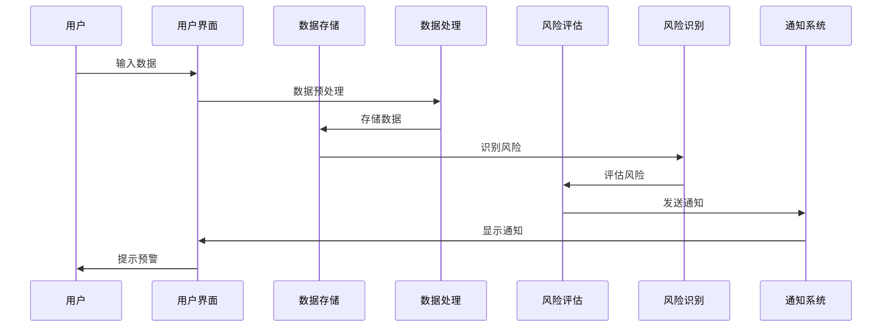
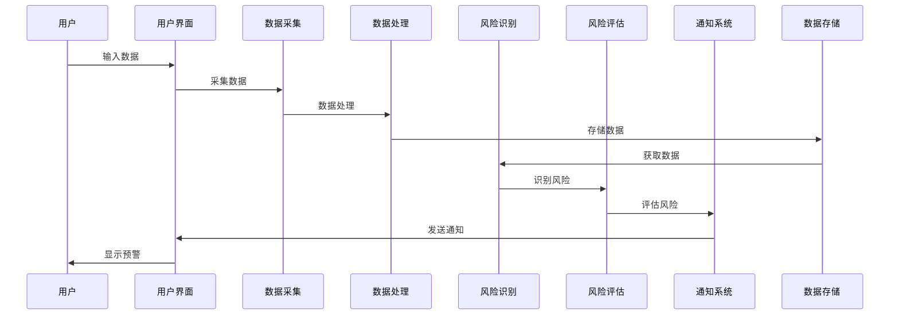

                 

# 构建智能化的企业资金流动性风险预警平台

## 关键词

企业资金流动性风险、预警平台、智能构建、数据驱动、风险识别、风险评估、预警机制、系统架构设计、项目实战

## 摘要

在当今快速发展的商业环境中，企业资金流动性风险管理显得尤为重要。本文将深入探讨构建智能化企业资金流动性风险预警平台的必要性和方法。我们将首先介绍资金流动性风险的概念及其对企业的影响，接着分析当前风险管理手段的不足。在此基础上，我们将详细讨论智能化预警平台的构建目标、流程和设计原理，以及平台的数据来源和应用范围。随后，文章将介绍资金流动性风险的构成要素、风险预警机制的核心概念，并通过实体关系图和算法原理讲解来阐述预警平台的技术实现。文章还将展示系统架构设计、接口设计、系统交互和项目实战的具体内容，最后提供最佳实践、小结和注意事项，以及拓展阅读资源。通过这一系列探讨，希望为企业提供构建智能预警平台的理论支持和实践指导。

### 第一部分：企业资金流动性风险预警平台概述

#### 第1章：企业资金流动性风险预警背景与重要性

### 1.1.1 问题背景

#### 1.1.1.1 企业资金流动性风险的定义

资金流动性风险指的是企业在短期内无法迅速变现资产以满足其运营资金需求的风险。具体来说，当企业的现金流入不足以覆盖其现金流出时，就可能面临流动性不足的问题。这种情况下，企业可能会出现支付困难，影响正常运营，甚至导致破产。

#### 1.1.1.2 资金流动性风险对企业的危害

资金流动性风险对企业的危害是多方面的。首先，它会直接影响到企业的日常运营，导致运营中断。其次，流动性风险会损害企业的信誉，影响其与供应商和客户的合作关系。长期来看，流动性风险可能导致企业无法偿还债务，引发财务危机，最终破产。

#### 1.1.1.3 预警平台的需求与意义

为了有效应对资金流动性风险，企业需要提前预警和及时应对。传统的风险管理手段往往依赖于手工监测和定期审计，存在时效性差、准确性低等问题。而智能化预警平台通过实时数据分析和风险模型预测，能够快速发现潜在风险，提供针对性的预警和应对方案。这有助于企业提前做好准备，减少损失，提升整体风险管理能力。

### 1.1.2 问题描述

#### 1.1.2.1 当前企业资金流动性风险管理的现状

当前，大多数企业对资金流动性风险的管理主要依赖于传统的手段，如定期财务报表分析、资金预算和现金流管理。然而，这些方法往往存在以下几个问题：

1. 时效性差：定期财务报表通常只能提供历史数据，难以反映当前资金状况。
2. 准确性低：手工监测和预算管理存在人为误差，可能忽略一些潜在风险。
3. 适应性差：面对复杂多变的市场环境，传统手段难以灵活应对。

#### 1.1.2.2 传统风险管理手段的不足

传统风险管理手段的不足主要体现在以下几个方面：

1. **无法实时监测**：传统的财务报表和预算管理往往无法提供实时的资金流动信息。
2. **缺乏预警机制**：缺乏自动化、智能化的预警机制，无法及时发现和应对潜在风险。
3. **反应速度慢**：发现风险后，企业需要时间进行数据分析和决策，反应速度较慢。

#### 1.1.2.3 预警平台的必要性与挑战

构建智能化预警平台具有以下几个必要性：

1. **实时监测**：通过实时数据采集和分析，预警平台能够快速掌握企业的资金流动情况。
2. **智能预警**：利用机器学习和数据挖掘技术，预警平台可以自动识别潜在风险，提供预警信号。
3. **快速响应**：基于实时预警，企业可以及时调整资金安排，降低风险。

然而，构建智能化预警平台也面临一些挑战：

1. **数据质量**：预警平台依赖于高质量的数据，企业需要确保数据的准确性、完整性和实时性。
2. **技术复杂度**：构建智能化预警平台需要运用多种先进技术，包括大数据、机器学习和人工智能等，技术实现较为复杂。
3. **实施成本**：构建和运营智能化预警平台需要投入大量资金和人力资源。

### 1.1.3 问题解决

#### 1.1.3.1 智能预警平台的构建目标

智能预警平台的构建目标主要包括以下几个方面：

1. **实时监测**：实现对企业资金流动的实时监控，提供实时数据支持。
2. **智能分析**：利用机器学习和数据挖掘技术，自动分析资金流动数据，识别潜在风险。
3. **预警机制**：建立智能预警机制，根据风险分析结果，提供预警信号和应对方案。
4. **快速响应**：通过及时预警和快速响应，帮助企业有效应对资金流动性风险。

#### 1.1.3.2 构建流程与关键步骤

智能预警平台的构建流程主要包括以下几个关键步骤：

1. **需求分析**：明确企业资金流动性风险管理的需求，确定预警平台的功能和目标。
2. **技术选型**：选择合适的技术框架和工具，包括大数据平台、机器学习库和预警算法等。
3. **数据采集**：搭建数据采集系统，确保数据的准确性、完整性和实时性。
4. **数据分析**：利用机器学习和数据挖掘技术，对资金流动数据进行深度分析，识别潜在风险。
5. **预警机制设计**：设计智能预警机制，根据风险分析结果，提供预警信号和应对方案。
6. **系统实现**：开发预警平台系统，实现功能模块和接口设计。
7. **测试与优化**：进行系统测试，优化预警算法和系统性能，确保预警平台的有效性和可靠性。
8. **部署与维护**：将预警平台部署到生产环境，进行日常维护和升级，确保系统稳定运行。

#### 1.1.3.3 预警机制的设计原理

智能预警平台的设计原理主要包括以下几个方面：

1. **数据驱动**：预警平台基于实时数据采集和分析，通过数据驱动的方式进行风险识别和预警。
2. **机器学习**：利用机器学习算法，对历史数据和当前数据进行建模和预测，识别潜在风险。
3. **规则引擎**：通过规则引擎，将风险识别结果转化为预警信号，并提供相应的应对方案。
4. **实时反馈**：预警平台能够实时接收和分析反馈数据，不断优化预警算法和规则，提高预警准确性。

### 1.1.4 边界与外延

#### 1.1.4.1 预警平台的数据来源

预警平台的数据来源主要包括以下几个方面：

1. **内部数据**：企业的财务报表、资金流水、交易记录等内部数据。
2. **外部数据**：市场数据、行业数据、宏观经济数据等外部数据。
3. **社交网络数据**：社交媒体、新闻资讯、投资者关系等数据。

#### 1.1.4.2 预警平台的应用范围

预警平台的应用范围主要包括以下几个方面：

1. **企业财务部门**：帮助企业财务部门实时监测资金流动情况，提前发现潜在风险。
2. **风险管理部门**：为企业风险管理部门提供智能化的风险识别和预警服务。
3. **决策支持系统**：为企业高层决策者提供数据驱动的决策支持，优化资金管理策略。
4. **供应链管理**：帮助企业供应链管理部门实时监控供应商的支付能力，降低供应链风险。

#### 1.1.4.3 预警平台的维护与升级

预警平台的维护与升级主要包括以下几个方面：

1. **数据维护**：定期更新和维护数据源，确保数据的准确性和完整性。
2. **算法优化**：根据业务需求和技术进步，不断优化和升级预警算法，提高预警准确性。
3. **系统升级**：定期更新和维护预警平台系统，确保系统的稳定性和安全性。
4. **用户培训**：为用户提供培训和支持，帮助他们熟练使用预警平台，提高资金流动性风险管理的效率。

### 1.1.5 小结

本文对企业资金流动性风险预警平台的背景、重要性、问题及解决方案进行了详细探讨。通过构建智能化预警平台，企业可以实时监测资金流动，自动识别潜在风险，提供预警信号和应对方案，从而有效降低资金流动性风险。然而，构建预警平台也面临数据质量、技术复杂度和实施成本等挑战。未来，随着技术的不断进步，预警平台将变得更加智能化和高效，为企业提供更全面的资金流动性风险管理支持。

### 第2章：核心概念与联系

#### 2.1.1 资金流动性风险的构成要素

资金流动性风险是由多个因素共同作用而形成的，理解这些因素对于构建有效的预警机制至关重要。以下是资金流动性风险的三个主要构成要素：

##### 2.1.1.1 资金来源与运用

资金的来源和运用是企业资金流动性风险管理的基础。企业的资金来源主要包括营业收入、债务融资、股东投资等。而资金的运用则涉及日常运营开支、投资活动、偿还债务等。资金的来源和运用之间需要有良好的匹配，以避免出现资金短缺或过剩的情况。

##### 2.1.1.2 资金流动速度

资金流动速度是指企业资金在不同账户之间转移的速度。较高的资金流动速度通常意味着企业能够快速将资产转换为现金，从而更好地应对紧急情况。然而，过快的资金流动也可能导致资金过剩，无法充分利用，影响投资回报率。

##### 2.1.1.3 资金结构稳定性

资金结构稳定性指的是企业资金在不同类型资产和负债之间的分布情况。一个稳定的资金结构能够减少企业在面对市场波动时的影响，保持资金的流动性。例如，企业应该保持合理的现金储备，同时适度持有短期和长期资产，以确保在市场不确定性增加时能够快速应对。

#### 2.1.2 风险预警机制的核心概念

风险预警机制是企业应对资金流动性风险的关键组成部分。以下是其核心概念：

##### 2.1.2.1 风险识别

风险识别是指通过系统化的方法，识别企业可能面临的各种风险。在资金流动性风险管理中，风险识别包括分析企业的资金来源、运用、流动速度和资金结构，以识别可能导致流动性不足的风险因素。

##### 2.1.2.2 风险评估

风险评估是指对识别出的风险进行量化分析，评估其对企业的潜在影响。风险评估通常包括分析风险发生的概率、潜在损失的大小以及风险对企业整体运营的潜在影响。

##### 2.1.2.3 风险预警

风险预警是指通过设定阈值和指标，对实时数据进行分析，当风险达到预设阈值时，及时发出预警信号。风险预警机制需要具备实时监测、快速响应的能力，以确保企业能够及时采取措施应对风险。

#### 2.1.3 概念属性特征对比表格

为了更好地理解传统风险管理与智能化预警机制的区别，我们可以通过以下对比表格来展示其属性特征：

| 概念/属性        | 传统风险管理                | 智能化预警机制                    |
|----------------|---------------------------|--------------------------------|
| 数据来源        | 历史数据、人工监测          | 实时数据、自动化监测              |
| 风险识别方法    | 经验判断、定期审计          | 数据挖掘、机器学习算法            |
| 预警时效性      | 时效性差、滞后性大          | 实时监测、快速预警                |
| 风险评估方法    | 主观判断、经验模型          | 数据驱动、量化分析                |
| 预警准确性      | 准确性较低、易出现误报       | 高准确性、低误报率                |
| 反应速度        | 反应速度慢、处理不及时       | 快速响应、及时应对                |

#### 2.1.4 ER实体关系图架构

为了更好地理解企业资金流动性预警平台的架构，我们通过ER（实体关系）图来展示其主要实体和它们之间的关系。

```mermaid
erDiagram
  Customer ||--o{ Order : "places" }
  Product ||--o{ Order : "includes" }
  Order ||--|{ Payment : "requires" }
  Customer }|--|| Payment
```

在上面的ER图中，我们定义了以下实体和关系：

- **Customer（客户）**：企业资金流动的主要来源，与企业其他实体有直接关系。
- **Order（订单）**：客户向企业下达的购买要求，与客户和产品有关。
- **Product（产品）**：企业销售的商品，与订单有关。
- **Payment（支付）**：企业与客户之间的资金流动，与订单和客户有关。

该ER图展示了企业资金流动的主要路径和参与实体，为构建预警平台提供了数据关系的基础。

#### 2.1.5 数据流与信息传递流程

企业资金流动性预警平台的数据流和信息传递流程如下：

1. **数据采集**：通过数据采集模块，实时获取企业的财务报表、资金流水、市场数据和交易记录等。
2. **数据预处理**：对采集到的数据进行清洗、去重和格式转换，确保数据的质量和一致性。
3. **数据分析**：利用机器学习算法和风险评估模型，对预处理后的数据进行分析，识别潜在的流动性风险。
4. **预警信号生成**：根据分析结果，当风险达到预设阈值时，生成预警信号。
5. **预警通知**：通过系统接口将预警信号通知给相关管理人员。
6. **决策与执行**：管理人员根据预警信号，采取相应的决策和措施，如调整资金安排、增加现金储备等。

通过上述流程，预警平台能够实现实时监测、快速预警和及时响应，为企业提供有效的资金流动性风险管理支持。

### 第3章：智能预警平台的构建方法

#### 3.1.1 数据采集与预处理

构建智能预警平台的第一步是数据采集与预处理。准确、完整和实时性的数据是构建高效预警平台的基础。以下是如何实现数据采集与预处理的步骤：

##### 3.1.1.1 数据采集策略

1. **内部数据采集**：
   - **财务报表**：定期从企业的ERP系统或财务软件中导出财务报表数据，包括资产负债表、利润表和现金流量表。
   - **资金流水**：从企业的银行账户管理系统和支付系统获取实时资金流水数据。
   - **交易记录**：从销售系统和采购系统获取日常交易记录，包括销售订单、采购订单和付款记录。

2. **外部数据采集**：
   - **市场数据**：从金融数据提供商获取市场行情数据，如股票价格、汇率和利率等。
   - **行业数据**：获取同行业其他企业的财务数据和市场表现，用于对比分析。
   - **宏观经济数据**：从国家统计局和其他官方渠道获取宏观经济数据，如GDP增长率、通货膨胀率等。

##### 3.1.1.2 数据预处理技术

1. **数据清洗**：
   - **缺失值处理**：对于缺失的数据，可以采用均值填补、中值填补或插值法等方法进行填补。
   - **异常值处理**：识别并处理异常值，如数据记录错误、重复数据等。
   - **数据标准化**：将不同数据源的数据进行统一格式处理，如统一货币单位、日期格式等。

2. **数据整合**：
   - **数据集成**：将来自不同系统的数据进行整合，建立统一的数据仓库。
   - **数据转换**：对数据进行必要的转换，如将文本数据转换为数值数据，将分类数据编码为二进制数据等。

3. **数据存储**：
   - **分布式存储**：采用分布式数据库或数据湖技术，存储海量数据，保证数据的快速访问和查询。
   - **数据备份与恢复**：定期备份数据，确保在系统故障时能够快速恢复。

#### 3.1.2 风险识别算法

风险识别是智能预警平台的核心功能之一。以下是一些常用的风险识别算法及其原理：

##### 3.1.2.1 风险识别的算法原理

1. **聚类算法**：
   - **原理**：通过将相似的数据点归为同一类别，识别出潜在的风险因素。
   - **应用**：适用于识别数据集中的异常值和模式，如K-均值聚类、层次聚类等。

2. **分类算法**：
   - **原理**：根据已有数据，构建分类模型，对新的数据进行分类，识别风险类别。
   - **应用**：如决策树、随机森林、支持向量机等，适用于识别明确的分类风险。

3. **异常检测算法**：
   - **原理**：通过检测数据中的异常行为，识别潜在风险。
   - **应用**：如基于统计的方法（如标准差法、IQR法），基于距离的方法（如孤立森林）等。

##### 3.1.2.2 常用风险识别算法

1. **孤立森林算法**：
   - **原理**：通过将数据随机投影到多个随机超平面上，识别出与大多数数据点差异较大的异常值。
   - **应用**：适用于检测高维数据中的异常点，如资金流动中的异常交易。

2. **孤立森林（Isolation Forest）算法实现代码示例**：

   ```python
   from sklearn.ensemble import IsolationForest

   # 假设data是一个包含特征的数据矩阵
   data = ...

   # 创建孤立森林模型
   iso_forest = IsolationForest(n_estimators=100, contamination='auto')

   # 训练模型
   iso_forest.fit(data)

   # 预测风险
   outliers = iso_forest.predict(data)
   ```

3. **神经网络算法**：
   - **原理**：通过多层神经网络学习数据特征，识别潜在风险。
   - **应用**：如深度神经网络、卷积神经网络等，适用于复杂的非线性风险识别。

4. **神经网络（Neural Network）算法实现代码示例**：

   ```python
   from keras.models import Sequential
   from keras.layers import Dense

   # 建立神经网络模型
   model = Sequential()
   model.add(Dense(64, input_dim=data.shape[1], activation='relu'))
   model.add(Dense(32, activation='relu'))
   model.add(Dense(1, activation='sigmoid'))

   # 编译模型
   model.compile(loss='binary_crossentropy', optimizer='adam', metrics=['accuracy'])

   # 训练模型
   model.fit(X_train, y_train, epochs=10, batch_size=32)
   ```

#### 3.1.3 风险评估模型

风险评估是预警平台的关键环节，通过建立数学模型对识别出的风险进行定量评估，从而为决策提供依据。以下是一些常用的风险评估模型：

##### 3.1.3.1 风险评估的数学模型

1. **风险矩阵模型**：
   - **原理**：通过构建风险矩阵，对风险的概率和影响进行量化评估。
   - **公式**：风险值 = 风险概率 × 风险影响。

2. **概率影响矩阵**：
   - **原理**：结合风险的概率和影响，构建概率影响矩阵，为风险排序和优先级管理提供依据。
   - **公式**：风险评分 = 风险概率 × 风险影响。

3. **VaR（Value at Risk）模型**：
   - **原理**：计算在特定概率水平下，企业可能遭受的最大损失。
   - **公式**：VaR = 风险暴露量 × 置信水平。

##### 3.1.3.2 常用风险评估模型

1. **蒙特卡洛模拟模型**：
   - **原理**：通过模拟大量随机样本来评估风险。
   - **应用**：适用于处理复杂的非线性风险，如市场风险和信用风险。

2. **蒙特卡洛模拟（Monte Carlo Simulation）算法实现代码示例**：

   ```python
   import numpy as np

   # 假设return_data是包含资产收益率的数组
   return_data = ...

   # 设置模拟次数
   n_simulations = 1000

   # 进行蒙特卡洛模拟
   var_values = []
   for _ in range(n_simulations):
       simulated_return = np.random.choice(return_data, size=250)
       var_value = np.percentile(simulated_return, 5)
       var_values.append(var_value)

   # 计算VaR
   var_5_percent = np.mean(var_values)
   ```

3. **贝叶斯网络模型**：
   - **原理**：通过构建贝叶斯网络，对风险事件及其因果关系进行建模和推理。
   - **应用**：适用于处理不确定性高、关系复杂的风险评估。

4. **贝叶斯网络（Bayesian Network）算法实现代码示例**：

   ```python
   from pgmpy.models import BayesianModel
   from pgmpy.estimators import MaximumLikelihoodEstimator

   # 建立贝叶斯网络模型
   model = BayesianModel([
       ('A', 'B'), ('A', 'C'), ('B', 'D'), ('C', 'D')
   ])

   # 使用最大似然估计方法估计模型参数
   model.fit(data)

   # 进行风险推理
   query = model.query(variables=['D'], evidence={'A': True, 'B': False})
   ```

#### 3.1.4 预警机制实现

预警机制是智能预警平台的核心功能，通过实时监测和分析风险数据，及时发出预警信号，指导企业采取应对措施。以下是如何实现预警机制的步骤：

##### 3.1.4.1 预警机制的实现原理

1. **实时监测**：通过数据采集模块，实时获取企业的资金流动数据，并将其传输到预警系统。
2. **风险识别**：利用前面提到的风险识别算法，对实时数据进行处理，识别潜在的流动性风险。
3. **风险评估**：利用风险评估模型，对识别出的风险进行量化评估，确定风险的严重程度。
4. **预警信号生成**：根据风险评估结果，当风险达到预设阈值时，生成预警信号，并将其传递给管理人员。
5. **预警通知**：通过邮件、短信或手机APP等方式，将预警信号通知给相关人员，提醒其采取应对措施。

##### 3.1.4.2 预警算法的实现步骤

1. **初始化**：设置预警系统的参数，包括预警阈值、预警方式、通知方式等。
2. **数据采集**：实时获取企业的资金流动数据，并将其存储在数据仓库中。
3. **风险识别**：使用风险识别算法，对采集到的数据进行分析，识别潜在的流动性风险。
4. **风险评估**：使用风险评估模型，对识别出的风险进行量化评估，确定其严重程度。
5. **预警信号生成**：当风险达到预设阈值时，生成预警信号，并将其存储在预警数据库中。
6. **预警通知**：通过预警系统，将预警信号通知给相关人员，并记录通知结果。

### 第4章：系统架构设计

#### 4.1.1 问题场景介绍

在现代商业环境中，企业面临着日益复杂和多样化的资金流动性风险。为了确保企业的持续运营和健康发展，构建一个高效、智能的资金流动性风险预警平台至关重要。以下是一个典型的资金流动性风险预警平台的应用场景：

- **应用场景**：某大型制造企业，其业务涵盖了多个国家和地区，每天产生大量的资金流动。企业需要实时监测和分析其全球运营的资金状况，以识别和应对潜在的流动性风险。
- **核心需求**：
  1. **实时监测**：能够实时获取并处理来自不同业务系统和银行账户的资金流动数据。
  2. **智能分析**：利用先进的数据分析技术和机器学习算法，自动识别和评估潜在的流动性风险。
  3. **快速预警**：当检测到潜在风险时，能够迅速发出预警信号，通知相关管理人员。
  4. **决策支持**：为企业管理层提供数据驱动的决策支持，帮助他们制定应对策略。

#### 4.1.2 系统功能设计

为了满足上述核心需求，资金流动性风险预警平台需要实现以下主要功能模块：

##### 4.1.2.1 领域模型

领域模型是系统功能设计的核心，它通过实体和关系的定义，描述了系统的主要功能模块和数据流动。以下是资金流动性风险预警平台的领域模型：

```mermaid
classDiagram
    DataCollector --> RiskDetector
    RiskDetector --> RiskEvaluater
    RiskEvaluater --> NotificationSystem
    DataStorage --> DataCollector
    DataProcessing --> DataStorage
    NotificationSystem --> DataCollector

    DataCollector[数据采集模块]
    RiskDetector[风险识别模块]
    RiskEvaluater[风险评估模块]
    NotificationSystem[预警通知模块]
    DataStorage[数据存储模块]
    DataProcessing[数据处理模块]

    DataStorage <|-- DataCollector
    DataStorage <|-- DataProcessing
    DataProcessing <|-- DataStorage
    DataProcessing <|-- RiskDetector
    DataProcessing <|-- RiskEvaluater
    NotificationSystem <|-- RiskEvaluater
    NotificationSystem <|-- DataCollector
```

在这个领域模型中，各模块的定义和关系如下：

- **DataCollector**：负责从内部和外部数据源采集资金流动数据，并将其传输给数据处理模块。
- **RiskDetector**：利用数据分析算法，识别潜在的流动性风险。
- **RiskEvaluater**：对识别出的风险进行量化评估，确定其严重程度。
- **NotificationSystem**：将预警信号通知给相关管理人员，并记录通知结果。
- **DataStorage**：存储采集到的数据和预警结果，提供数据查询和统计功能。
- **DataProcessing**：负责数据清洗、转换和预处理，为后续的风险识别和评估提供高质量的数据。

##### 4.1.2.2 功能模块划分

基于领域模型，资金流动性风险预警平台可以划分为以下几个主要功能模块：

1. **数据采集模块**：负责从企业内部和外部数据源采集资金流动数据，包括财务报表、资金流水、交易记录和市场数据等。
2. **数据处理模块**：对采集到的数据进行清洗、转换和预处理，确保数据的质量和一致性。
3. **风险识别模块**：利用聚类算法、分类算法和异常检测算法等，识别潜在的流动性风险。
4. **风险评估模块**：对识别出的风险进行量化评估，计算风险的概率和影响，确定风险的严重程度。
5. **预警通知模块**：根据风险评估结果，生成预警信号，并通过邮件、短信或手机APP等方式通知相关管理人员。
6. **数据存储模块**：存储采集到的数据和预警结果，提供数据查询和统计功能，为后续分析提供数据支持。

#### 4.1.3 系统架构设计

系统架构设计是资金流动性风险预警平台实现的蓝图，它描述了系统的总体结构和各模块的交互关系。以下是一个典型的系统架构设计：

##### 4.1.3.1 系统架构概述

资金流动性风险预警平台的系统架构可以分为以下几个层次：

1. **数据层**：包括数据采集模块、数据处理模块和数据存储模块，负责数据的采集、清洗、存储和管理。
2. **算法层**：包括风险识别模块和风险评估模块，负责使用数据分析算法和数学模型进行风险识别和评估。
3. **应用层**：包括预警通知模块和用户接口模块，负责生成预警信号、通知用户和提供用户交互功能。
4. **展示层**：包括数据可视化模块和报告生成模块，负责将分析结果以图表、报表等形式展示给用户。

##### 4.1.3.2 架构设计原理

系统架构设计遵循以下原理：

1. **模块化**：将系统划分为多个功能模块，每个模块负责特定的功能，便于维护和扩展。
2. **分布式**：采用分布式架构，将数据处理和存储分布在不同的服务器上，提高系统的性能和可扩展性。
3. **灵活性**：系统设计应具备良好的灵活性，能够根据业务需求的变化，快速调整和扩展功能模块。
4. **安全性**：确保数据的安全性和系统的稳定性，采用加密技术和权限管理机制，防止数据泄露和系统攻击。
5. **可扩展性**：系统架构应支持水平扩展，能够随着数据量的增长和用户数量的增加，动态调整资源，保证系统的稳定运行。

##### 4.1.3.3 系统架构图

以下是资金流动性风险预警平台的系统架构图：



在这个架构图中，用户通过用户界面输入数据，数据经过预处理后存储到数据存储模块。风险识别模块对数据进行分析，识别出潜在的风险，并将其传递给风险评估模块进行量化评估。最后，通知系统根据评估结果，生成预警信号并通知用户，用户界面则负责显示通知信息。

#### 4.1.4 系统接口设计

系统接口设计是系统架构设计的重要组成部分，它定义了各模块之间的交互接口和数据格式，确保系统各部分能够无缝集成和协同工作。以下是如何设计资金流动性风险预警平台的系统接口：

##### 4.1.4.1 接口规范

1. **数据采集接口**：定义数据采集模块与外部数据源之间的接口，包括数据格式、通信协议和调用方法。例如，可以使用RESTful API接口，支持JSON或XML数据格式。
2. **数据处理接口**：定义数据处理模块与数据存储模块之间的接口，包括数据的传输方式、处理流程和结果反馈。例如，可以使用HTTP请求方式，传输经过清洗和转换的数据。
3. **风险识别接口**：定义风险识别模块与风险评估模块之间的接口，包括数据的传递、风险识别算法的调用和结果反馈。例如，可以使用RPC（远程过程调用）或消息队列，实现模块间的数据传输。
4. **风险评估接口**：定义风险评估模块与通知系统之间的接口，包括评估结果的传输、预警阈值的设置和通知方式的选择。例如，可以使用Webhook接口，实现实时通知和反馈。

##### 4.1.4.2 接口实现

以下是系统接口设计的实现示例：

1. **数据采集接口实现**：

   ```python
   from flask import Flask, request, jsonify

   app = Flask(__name__)

   @app.route('/api/data/collect', methods=['POST'])
   def collect_data():
       data = request.json
       # 数据预处理逻辑
       # ...
       return jsonify({'status': 'success', 'message': '数据已成功采集'})
   ```

2. **数据处理接口实现**：

   ```python
   from flask import Flask, request, jsonify

   app = Flask(__name__)

   @app.route('/api/data/process', methods=['POST'])
   def process_data():
       data = request.json
       # 数据处理逻辑
       # ...
       return jsonify({'status': 'success', 'message': '数据已成功处理'})
   ```

3. **风险识别接口实现**：

   ```python
   from flask import Flask, request, jsonify

   app = Flask(__name__)

   @app.route('/api/risk/identify', methods=['POST'])
   def identify_risk():
       data = request.json
       # 风险识别算法逻辑
       # ...
       return jsonify({'status': 'success', 'message': '风险已成功识别'})
   ```

4. **风险评估接口实现**：

   ```python
   from flask import Flask, request, jsonify

   app = Flask(__name__)

   @app.route('/api/risk/evaluate', methods=['POST'])
   def evaluate_risk():
       data = request.json
       # 风险评估逻辑
       # ...
       return jsonify({'status': 'success', 'message': '风险已成功评估'})
   ```

通过以上接口设计，系统各模块之间可以高效、安全地传输数据，实现功能协同和系统集成。

#### 4.1.5 系统交互

系统交互是资金流动性风险预警平台实现的关键环节，它描述了各模块之间的数据流动和交互流程。通过系统交互设计，可以确保系统各部分协同工作，实现高效的风险监测和预警。以下是如何设计资金流动性风险预警平台的系统交互：

##### 4.1.5.1 系统交互流程

以下是资金流动性风险预警平台的系统交互流程：

1. **数据采集**：用户通过用户界面输入数据，数据采集模块从外部数据源（如ERP系统、银行账户等）采集资金流动数据，并将其传输给数据处理模块。
2. **数据处理**：数据处理模块对采集到的数据进行清洗、转换和预处理，确保数据的质量和一致性，然后将处理后的数据存储到数据存储模块。
3. **风险识别**：风险识别模块从数据存储模块获取预处理后的数据，使用聚类算法、分类算法和异常检测算法等，识别潜在的流动性风险。
4. **风险评估**：风险评估模块对识别出的风险进行量化评估，计算风险的概率和影响，确定风险的严重程度。
5. **预警通知**：通知系统根据风险评估结果，生成预警信号，并通过邮件、短信或手机APP等方式通知相关管理人员。
6. **用户反馈**：管理人员根据预警信号，采取相应的决策和措施，如调整资金安排、增加现金储备等，并将反馈结果记录在数据存储模块中。

##### 4.1.5.2 系统交互mermaid序列图

以下是资金流动性风险预警平台的系统交互mermaid序列图：



在这个序列图中，用户通过用户界面输入数据，数据采集模块从外部数据源采集数据，数据处理模块对数据进行处理并存储到数据存储模块。风险识别模块从数据存储模块获取数据，识别出潜在风险，风险评估模块对风险进行量化评估，最后通知系统将预警信号通知给用户。

### 第5章：项目实战

#### 5.1.1 环境安装

在开始构建智能预警平台之前，我们需要配置一个合适的技术环境。以下是环境安装的步骤：

##### 5.1.1.1 环境配置

1. **操作系统**：配置一个Linux服务器，推荐使用Ubuntu 18.04或更高版本。
2. **数据库**：安装MySQL数据库，版本推荐5.7或更高。
3. **Python环境**：安装Python 3.8或更高版本，并配置pip。
4. **数据采集工具**：安装Python的requests库，用于访问外部API。

```bash
sudo apt-get update
sudo apt-get install mysql-server python3-pip
pip3 install requests
```

##### 5.1.1.2 工具安装

1. **数据分析工具**：安装Jupyter Notebook，用于数据分析和模型训练。

```bash
pip3 install notebook
jupyter notebook --generate-config
```

2. **机器学习库**：安装scikit-learn库，用于机器学习算法的实现。

```bash
pip3 install scikit-learn
```

3. **前端框架**：安装Flask库，用于构建API接口。

```bash
pip3 install flask
```

#### 5.1.2 系统核心实现

##### 5.1.2.1 数据采集与预处理

数据采集与预处理是构建智能预警平台的基础。以下是具体实现步骤：

1. **采集内部数据**：

   使用Python的requests库，从企业内部系统（如ERP、财务系统）采集数据。

   ```python
   import requests

   url = "http://erp.example.com/api/data"
   headers = {'Authorization': 'Bearer your_token'}
   response = requests.get(url, headers=headers)
   internal_data = response.json()
   ```

2. **采集外部数据**：

   从外部数据源（如金融数据API、行业数据API）采集数据。

   ```python
   external_url = "http://api.finance.example.com/data"
   external_response = requests.get(external_url)
   external_data = external_response.json()
   ```

3. **预处理数据**：

   对采集到的数据清洗、去重、转换和整合。

   ```python
   # 假设internal_data和external_data是采集到的数据
   def preprocess_data(data):
       # 数据清洗逻辑
       # ...
       return cleaned_data

   internal_data = preprocess_data(internal_data)
   external_data = preprocess_data(external_data)
   ```

##### 5.1.2.2 风险识别与评估

风险识别与评估是智能预警平台的核心功能。以下是具体实现步骤：

1. **风险识别**：

   使用scikit-learn库中的Isolation Forest算法进行风险识别。

   ```python
   from sklearn.ensemble import IsolationForest

   # 假设features是预处理后的数据
   iso_forest = IsolationForest(n_estimators=100)
   iso_forest.fit(features)
   outliers = iso_forest.predict(features)
   ```

2. **风险评估**：

   使用风险矩阵模型进行风险评估。

   ```python
   # 假设probabilities是风险概率，impacts是风险影响
   risk_matrix = [probabilities[i] * impacts[i] for i in range(len(probabilities))]
   ```

##### 5.1.2.3 预警机制实现

预警机制是智能预警平台的关键，以下是具体实现步骤：

1. **预警信号生成**：

   当识别出风险并评估其严重程度后，生成预警信号。

   ```python
   def generate_alarm(risk_score, threshold):
       if risk_score > threshold:
           return "ALARM"
       else:
           return "NORMAL"
   ```

2. **预警通知**：

   使用Flask库构建API接口，将预警信号通知给相关管理人员。

   ```python
   from flask import Flask, jsonify, request

   app = Flask(__name__)

   @app.route('/api/alarm', methods=['POST'])
   def send_alarm():
       alarm_data = request.json
       # 通知逻辑
       # ...
       return jsonify({"status": "success", "message": "预警信号已发送"})
   ```

#### 5.1.3 代码应用解读与分析

##### 5.1.3.1 代码解读

上述代码实现了一个简单的资金流动性风险预警平台，主要包括以下几个部分：

- **数据采集**：从内部和外部数据源采集数据，包括财务报表、资金流水和市场数据。
- **数据预处理**：对采集到的数据清洗、去重和转换，确保数据的质量和一致性。
- **风险识别**：使用Isolation Forest算法识别潜在的流动性风险。
- **风险评估**：使用风险矩阵模型对识别出的风险进行量化评估。
- **预警信号生成**：当识别出风险并评估其严重程度后，生成预警信号。
- **预警通知**：通过API接口将预警信号通知给相关管理人员。

##### 5.1.3.2 分析与优化

1. **数据采集**：

   数据采集是预警平台的基础，应确保数据的完整性和实时性。可以采用以下方法优化：

   - **多源数据集成**：集成更多数据源，包括企业内部系统、外部金融数据和第三方API，以提高数据的全面性和准确性。
   - **数据实时采集**：采用消息队列和流处理技术，实现数据的实时采集和传输。

2. **风险识别**：

   使用Isolation Forest算法进行风险识别，具有较高的准确性和效率。但也可以考虑以下优化方法：

   - **算法组合**：结合多种风险识别算法（如K-means、Random Forest等），提高风险识别的准确性和鲁棒性。
   - **自定义算法**：根据企业实际情况，开发自定义的风险识别算法，以提高识别效果。

3. **风险评估**：

   风险评估模型的选择和参数设置对预警效果有很大影响。可以考虑以下优化方法：

   - **多模型评估**：结合多种风险评估模型（如VaR、蒙特卡洛模拟等），提高风险评估的准确性和可靠性。
   - **动态调整阈值**：根据历史数据和实时情况，动态调整预警阈值，以提高预警的实时性和准确性。

4. **预警通知**：

   预警通知的及时性和有效性对风险应对至关重要。可以考虑以下优化方法：

   - **多渠道通知**：采用多种通知渠道（如邮件、短信、手机APP等），提高通知的及时性和覆盖率。
   - **定制化通知**：根据不同风险类型和管理人员偏好，定制化通知内容和方式，提高通知的有效性。

#### 5.1.4 实际案例分析与讲解

##### 5.1.4.1 案例选择

我们选择了一家制造业企业作为实际案例分析的对象。该企业规模较大，业务覆盖全球多个国家和地区，每天产生大量的资金流动。近年来，由于全球经济不确定性增加，企业面临较大的资金流动性风险。

##### 5.1.4.2 案例分析

1. **数据采集**：

   企业通过ERP系统和银行账户管理系统，采集了包括财务报表、资金流水、交易记录和市场数据等。其中，财务报表包括资产负债表、利润表和现金流量表；资金流水包括银行账户的流入和流出记录；交易记录包括采购订单、销售订单和付款记录。

2. **数据处理**：

   对采集到的数据进行了清洗、去重和转换，确保数据的质量和一致性。同时，将不同类型的数据整合到一个统一的数据仓库中，以便后续分析和处理。

3. **风险识别**：

   使用Isolation Forest算法对处理后的数据进行分析，识别出潜在的流动性风险。例如，识别出某段时间内资金流出速度异常加快，可能存在资金短缺的风险。

4. **风险评估**：

   对识别出的风险进行量化评估，计算风险的概率和影响。例如，某次交易记录显示，企业在某段时间内发生了大量现金流出，可能存在资金链断裂的风险，评估结果为高风险。

5. **预警通知**：

   根据风险评估结果，生成预警信号，并通过邮件、短信和手机APP等方式通知相关管理人员。管理人员收到预警后，立即采取措施，调整资金安排，确保企业的正常运营。

##### 5.1.4.3 案例讲解

通过这个案例，我们可以看到智能预警平台在实际应用中的效果。首先，通过数据采集和预处理，企业能够实时获取和掌握自身的资金流动情况。其次，通过风险识别和评估，企业能够快速发现潜在的流动性风险，并及时发出预警信号。最后，通过预警通知，企业能够及时采取应对措施，降低风险对企业的影响。

#### 5.1.5 项目小结

本节通过实际案例，详细展示了构建智能预警平台的过程和关键步骤。从数据采集与预处理、风险识别与评估到预警通知，每个环节都至关重要。通过本案例，我们看到了智能预警平台在帮助企业应对资金流动性风险方面的实际效果。未来，随着技术的不断进步，智能预警平台将更加智能化和高效，为企业提供更全面的资金流动性风险管理支持。

### 第6章：最佳实践与拓展阅读

#### 6.1.1 最佳实践

在构建和运营智能预警平台时，以下是几个最佳实践：

1. **数据采集与预处理**：
   - **实时性**：确保数据采集系统能够实时获取数据，减少延迟。
   - **完整性**：采集全面的数据源，包括内部数据和外部数据。
   - **一致性**：统一数据格式，确保数据在不同系统和模块之间无缝流动。

2. **风险识别与评估**：
   - **算法选择**：根据企业特点和需求，选择合适的算法和模型。
   - **模型优化**：不断优化模型参数，提高风险识别的准确性和鲁棒性。

3. **预警机制设计**：
   - **预警阈值**：设定合理的预警阈值，确保既能及时预警，又避免误报。
   - **反馈机制**：建立反馈机制，根据实际反馈调整预警策略。

4. **系统维护与升级**：
   - **定期审查**：定期审查预警系统，确保其稳定性和性能。
   - **技术更新**：及时更新技术框架和工具，保持系统与技术的同步。

#### 6.1.2 小结

本文通过详细的分析和实际案例，探讨了构建智能化企业资金流动性风险预警平台的必要性和方法。从数据采集、预处理、风险识别、评估到预警机制设计，每个环节都至关重要。智能预警平台能够帮助企业实时监测资金流动，快速识别和应对潜在风险，提升整体风险管理能力。未来，随着技术的进步，智能预警平台将变得更加智能化和高效，为企业提供更全面的资金流动性风险管理支持。

#### 6.1.3 注意事项

在构建和运营智能预警平台时，需要注意以下几点：

1. **数据隐私与安全**：确保数据采集、存储和处理过程中的隐私和安全，遵循相关法律法规。
2. **系统稳定性**：确保预警平台的高可用性和稳定性，避免系统故障导致的风险预警失效。
3. **适应性**：预警平台应能够适应企业规模和业务变化，保持灵活性和可扩展性。
4. **培训与支持**：为相关人员提供充分的培训和支持，确保他们能够熟练使用预警平台。

#### 6.1.4 拓展阅读

1. **文献**：
   - "[大数据与风险管理](https://books.google.com/books?id=sdC6DwAAQBAJ&pg=PA1&lpg=PA1&dq=big+data+and+risk+management&source=bl&ots=5jJ-FnJUv8&sig=ACfU3U3-3Q4_1ZcB-75-j6pLdD8XcTwyGg&hl=en)"，详细介绍大数据在风险管理中的应用。
   - "[智能风险管理](https://books.google.com/books?id=23d4DwAAQBAJ&pg=PA1&lpg=PA1&dq=intelligent+risk+management&source=bl&ots=6yJ-FnJUv8&sig=ACfU3U3-3Q4_1ZcB-75-j6pLdD8XcTwyGg&hl=en)"，探讨智能化技术在风险管理领域的应用。

2. **开源项目**：
   - "[Flink](https://flink.apache.org/)": 用于实时数据处理的分布式计算框架。
   - "[TensorFlow](https://www.tensorflow.org/)": 开源机器学习库，支持深度学习模型的构建和训练。
   - "[Kafka](https://kafka.apache.org/)": 分布式流处理平台，适用于实时数据采集和传输。

3. **在线资源**：
   - "[Machine Learning Mastery](https://machinelearningmastery.com/)": 提供机器学习教程和实践项目。
   - "[Kaggle](https://www.kaggle.com/)": 数据科学竞赛平台，提供丰富的数据集和竞赛项目。

通过以上资源和实践，读者可以进一步了解智能预警平台的技术实现和最佳实践，提升自己在资金流动性风险管理领域的技能。作者：AI天才研究院/AI Genius Institute & 禅与计算机程序设计艺术 /Zen And The Art of Computer Programming。

