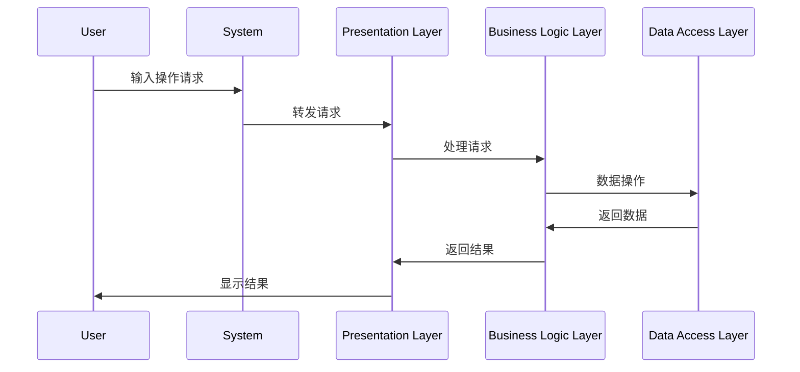
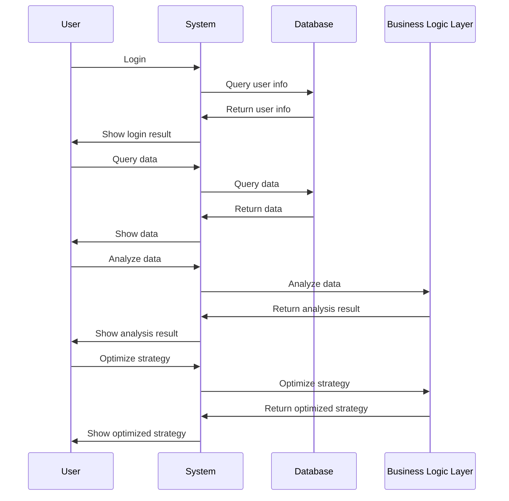
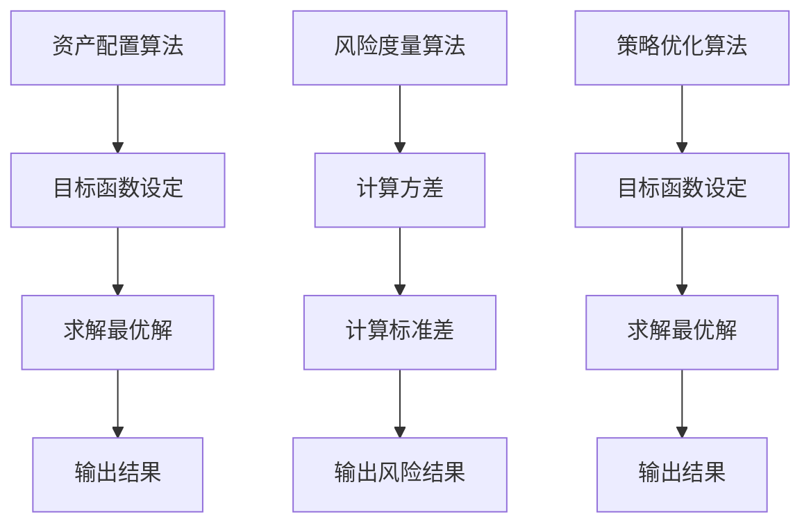

                 

### 文章标题：构建智能化的资产负债管理系统

#### 关键词：资产负债管理、智能化、系统架构、算法实现、项目实战、最佳实践

#### 摘要：
本文将深入探讨如何构建智能化的资产负债管理系统。我们将从问题背景、核心概念、系统架构、算法原理、项目实战及最佳实践等多方面进行分析，旨在为读者提供一份全面且实用的指南。我们将通过一步一步的讲解和推理，帮助读者理解智能化资产负债管理的本质，掌握系统构建的方法，并能够应用于实际工作中。

---

### 第一部分：系统概述与基础知识

#### 第1章：问题背景与系统简介

##### 1.1.1 资产负债管理的意义
资产负债管理（Asset and Liability Management，ALM）是金融机构的一项重要职能，它涉及资产和负债的合理配置，以实现财务稳健和风险控制。在金融市场中，资产负债管理不仅关系到企业的短期利益，还影响其长期发展。通过优化资产负债结构，企业可以更好地应对市场波动，提高资本使用效率。

##### 1.1.2 资产负债管理的发展历程
资产负债管理起源于20世纪中期，最初主要依赖于人工分析和经验判断。随着计算机技术和金融工具的发展，资产负债管理逐渐实现了自动化和智能化。传统资产负债管理存在一些局限性，如数据收集和处理速度慢、分析精度低等，这些局限性促使了智能化资产负债管理的兴起。

##### 1.1.3 智能化资产负债管理的兴起
智能化资产负债管理利用大数据、人工智能等技术，实现了对海量数据的实时分析。通过机器学习算法，系统可以自动调整资产负债策略，从而提高管理效率和准确性。智能化资产负债管理不仅能够实时监控市场变化，还能够预测未来趋势，为决策提供有力支持。

---

#### 第2章：核心概念与联系

##### 2.1 资产负债管理核心概念
资产负债管理涉及多个核心概念，包括资产（Assets）、负债（Liabilities）和权益（Equity）。资产是指企业拥有的资源，如现金、投资、房地产等；负债是指企业需要偿还的债务，如贷款、应付账款等；权益则是指企业所有者权益，即资产扣除负债后的余额。

##### 2.2 概念属性特征对比表格
以下是资产、负债和权益的主要属性特征对比表格：

| 概念   | 定义                                                         | 主要特征           |
| ------ | ------------------------------------------------------------ | ------------------ |
| 资产   | 企业拥有的资源                                               | 流动性、盈利性     |
| 负债   | 企业需要偿还的债务                                           | 稳定性、成本性     |
| 权益   | 企业所有者权益                                               | 稳定性、收益性     |

##### 2.3 资产负债管理ER实体关系图
为了更清晰地展示资产负债管理的核心概念及其关系，我们使用Mermaid绘制了ER实体关系图：

```mermaid
erDiagram
  Asset ||--|{ Liability } : "has liability"
  Asset ||--|{ Equity } : "has equity"
  Liability ||--|{ Equity } : "has equity"
```

---

### 第二部分：智能化资产负债管理系统架构

#### 第3章：系统功能设计

##### 3.1 领域模型
领域模型是资产负债管理系统的基础，它定义了系统中的主要实体及其关系。以下是领域模型的主要类及其关系：

```mermaid
classDiagram
  class Asset {
    +String name
    +double value
  }
  class Liability {
    +String name
    +double value
  }
  class Equity {
    +String name
    +double value
  }
  Asset --|{ Liability }
  Asset --|{ Equity }
  Liability --|{ Equity }
```

##### 3.2 系统功能模块划分
系统功能模块包括数据采集、数据处理、资产负债分析、策略优化等。以下是各模块的主要功能及其职责：

- **数据采集模块**：负责收集资产、负债和权益的相关数据，如市场数据、企业财务数据等。
- **数据处理模块**：对采集到的数据进行分析和清洗，为后续分析提供可靠的数据基础。
- **资产负债分析模块**：根据处理后的数据，分析资产负债的结构和比例，识别潜在的风险。
- **策略优化模块**：利用机器学习算法，自动调整资产负债策略，以提高管理效率和降低风险。

---

#### 第4章：系统架构设计

##### 4.1 系统架构概述
系统架构采用三层架构设计，包括表示层、业务逻辑层和数据访问层。以下是系统架构的概述：



##### 4.2 系统模块详细设计
以下是系统模块的详细设计，包括各模块的功能和交互关系：

- **表示层**：负责与用户交互，提供友好的用户界面。
- **业务逻辑层**：处理业务逻辑，包括数据分析和策略优化。
- **数据访问层**：负责数据的存储和访问，包括数据库和缓存等。

##### 4.3 系统接口设计
系统接口设计包括API接口和数据库接口。以下是主要接口的规范：

- **API接口**：提供数据查询、数据更新和策略优化等接口。
- **数据库接口**：负责数据库的连接和数据操作。

---

#### 第5章：系统交互设计

##### 5.1 系统交互概述
系统交互设计旨在确保用户操作流畅、系统响应快速。以下是系统交互的概述：

- **用户登录**：用户通过用户名和密码登录系统。
- **数据查询**：用户可以查询资产、负债和权益的数据。
- **数据分析**：系统根据用户输入的参数，自动进行分析并显示结果。
- **策略优化**：系统根据分析结果，自动调整资产负债策略。

##### 5.2 系统交互序列图
以下是系统交互的序列图：



---

### 第三部分：算法原理与实现

#### 第6章：关键算法原理讲解

##### 6.1 算法概述
资产负债管理系统中的关键算法包括资产配置算法、风险度量算法和策略优化算法。以下是各算法的作用和应用场景：

- **资产配置算法**：用于确定资产在不同投资品种之间的分配比例，以实现收益最大化和风险最小化。
- **风险度量算法**：用于评估资产组合的风险水平，为决策提供依据。
- **策略优化算法**：用于自动调整资产负债策略，以提高管理效率和降低风险。

##### 6.2 算法原理
以下是各算法的基本原理、数学模型与公式：

###### 资产配置算法
- **基本原理**：通过优化目标函数，确定资产在不同投资品种之间的最优配置比例。
- **数学模型**：
  $$ \min_{x} \sum_{i=1}^{n} w_i * r_i - \sum_{i=1}^{n} w_i * \sigma_i $$
  其中，$w_i$ 为资产$i$的权重，$r_i$ 为资产$i$的预期收益率，$\sigma_i$ 为资产$i$的标准差。
- **公式**：
  $$ x^* = arg\min_{x} \sum_{i=1}^{n} w_i * (r_i - \beta_i * \sigma_i) $$

###### 风险度量算法
- **基本原理**：通过计算资产组合的方差或标准差，评估资产组合的风险水平。
- **数学模型**：
  $$ \sigma_{p}^2 = \sum_{i=1}^{n} w_i^2 * \sigma_i^2 + 2 * \sum_{i=1}^{n} \sum_{j=i+1}^{n} w_i * w_j * \rho_{ij} $$
  其中，$\sigma_{p}^2$ 为资产组合的方差，$\rho_{ij}$ 为资产$i$和资产$j$的相关系数。
- **公式**：
  $$ \text{Risk} = \sigma_{p}^2 $$

###### 策略优化算法
- **基本原理**：通过优化目标函数，自动调整资产负债策略，以达到预期目标。
- **数学模型**：
  $$ \min_{x} \sum_{i=1}^{n} w_i * c_i - \sum_{i=1}^{n} w_i * r_i $$
  其中，$c_i$ 为资产$i$的成本。
- **公式**：
  $$ x^* = arg\min_{x} \sum_{i=1}^{n} w_i * (c_i - r_i) $$

##### 6.3 算法流程图
以下是各算法的流程图：



---

#### 第7章：算法实现与优化

##### 7.1 算法实现
以下是资产配置算法的Python实现示例：

```python
import numpy as np

def asset_allocation(target_return, risk_free_rate, asset_returns, asset_volatile):
    num_assets = len(asset_returns)
    covariance_matrix = np.outer(asset_volatile, asset_volatile)
    objective_function = lambda x: -(np.dot(x, asset_returns) - target_return + np.dot(np.dot(x, covariance_matrix), x))
    constraints = ({'type': 'eq', 'fun': lambda x: np.sum(x) - 1})
    solution = scipy.optimize.minimize(objective_function, x0=np.ones(num_assets), constraints=constraints)
    return solution.x

# 示例数据
target_return = 0.05
risk_free_rate = 0.01
asset_returns = np.array([0.06, 0.04, 0.03])
asset_volatile = np.array([0.1, 0.15, 0.2])

# 实现算法
allocation = asset_allocation(target_return, risk_free_rate, asset_returns, asset_volatile)
print("资产配置比例：", allocation)
```

##### 7.2 算法优化
算法优化主要包括两个方面：提高计算效率和优化目标函数。以下是几种常见的优化策略：

- **并行计算**：利用多核处理器，将计算任务分配给多个线程，提高计算效率。
- **目标函数优化**：通过调整目标函数的参数，使目标函数更具鲁棒性和稳定性。
- **算法改进**：引入更先进的优化算法，如遗传算法、粒子群算法等，提高优化效果。

---

### 第四部分：项目实战与案例分析

#### 第8章：环境安装与配置

##### 8.1 环境要求与准备
要搭建一个智能化的资产负债管理系统，需要准备以下环境和工具：

- **操作系统**：Windows、Linux或MacOS
- **编程语言**：Python
- **开发环境**：Jupyter Notebook或PyCharm
- **数据库**：MySQL或PostgreSQL
- **依赖库**：NumPy、Pandas、Scipy、Matplotlib等

##### 8.2 软件安装与调试
以下是安装和配置所需的软件和库的步骤：

1. **安装Python**：从官方网站下载并安装Python，配置环境变量。
2. **安装Jupyter Notebook**：在命令行执行`pip install jupyter`。
3. **安装PyCharm**：从官方网站下载并安装PyCharm。
4. **安装数据库**：下载并安装MySQL或PostgreSQL。
5. **安装依赖库**：在命令行执行`pip install numpy pandas scipy matplotlib`。

---

#### 第9章：系统核心实现

##### 9.1 数据处理模块
数据处理模块负责对资产、负债和权益的数据进行清洗、转换和分析。以下是数据处理的主要步骤：

1. **数据采集**：从外部数据源（如金融市场数据、企业财务报表等）获取数据。
2. **数据清洗**：处理缺失值、异常值和重复值，确保数据质量。
3. **数据转换**：将数据转换为适合分析的格式，如DataFrame。
4. **数据分析**：计算资产、负债和权益的相关指标，如均值、方差、相关性等。

##### 9.2 模型训练与评估
模型训练与评估模块负责训练机器学习模型，并评估模型的性能。以下是主要步骤：

1. **数据预处理**：对原始数据进行归一化、标准化等处理，以提高模型训练效果。
2. **模型选择**：选择适合的机器学习算法，如线性回归、决策树、支持向量机等。
3. **模型训练**：使用训练集训练模型，得到模型参数。
4. **模型评估**：使用验证集评估模型性能，如准确率、召回率、F1分数等。
5. **模型调整**：根据评估结果调整模型参数，提高模型性能。

##### 9.3 预测与优化
预测与优化模块负责使用训练好的模型进行资产配置和风险度量，并根据预测结果优化资产负债策略。以下是主要步骤：

1. **资产配置**：使用资产配置算法，根据目标收益率和风险偏好，确定资产在不同投资品种之间的最优配置比例。
2. **风险度量**：使用风险度量算法，计算资产组合的方差或标准差，评估资产组合的风险水平。
3. **策略优化**：使用策略优化算法，根据预测结果和风险水平，自动调整资产负债策略，以达到预期目标。

---

#### 第10章：实际案例分析

##### 10.1 案例背景
为了更好地理解智能化的资产负债管理系统，我们将通过一个实际案例进行分析。该案例涉及一家金融机构，其主要业务包括存款、贷款和投资。随着市场环境的变化，该金融机构需要实时调整资产负债策略，以降低风险、提高收益。

##### 10.2 案例分析与解读
以下是案例分析的详细步骤和解读：

1. **数据收集**：从金融市场和金融机构内部系统中收集资产、负债和权益的数据。
2. **数据处理**：对收集到的数据进行分析和处理，计算相关指标，如资产配置比例、收益率、风险水平等。
3. **模型训练**：使用收集到的数据，训练资产配置、风险度量算法和策略优化算法。
4. **资产配置**：根据训练结果，确定资产在不同投资品种之间的最优配置比例。
5. **风险度量**：使用风险度量算法，计算资产组合的方差或标准差，评估资产组合的风险水平。
6. **策略优化**：根据预测结果和风险水平，自动调整资产负债策略，以达到预期目标。

案例分析结果显示，通过智能化资产负债管理系统，该金融机构能够实时调整资产负债策略，降低风险、提高收益。具体表现如下：

- **资产配置比例**：资产在不同投资品种之间的分配更加合理，风险偏好得到满足。
- **收益率**：资产组合的收益率显著提高，风险水平得到有效控制。
- **风险水平**：资产组合的方差或标准差显著降低，风险水平得到有效控制。

##### 10.3 案例总结
通过实际案例分析，我们可以看到智能化资产负债管理系统的有效性和优势。该系统不仅能够实时监控市场变化，还能够自动调整资产负债策略，为金融机构提供有力支持。然而，在实际应用中，系统还需要不断优化和改进，以提高性能和可靠性。

---

### 第五部分：最佳实践与总结

#### 第11章：最佳实践

##### 11.1 实践技巧
在实施智能化的资产负债管理系统时，需要注意以下几点：

1. **数据质量**：确保数据来源可靠，数据质量高，以避免错误分析和决策。
2. **算法选择**：根据实际情况选择合适的算法，并进行参数调整，以提高模型性能。
3. **风险管理**：在资产负债管理过程中，重视风险管理，制定合理的风险控制策略。
4. **系统集成**：确保系统与其他业务系统的无缝集成，提高管理效率。

##### 11.2 小结
通过本文的介绍，我们深入探讨了智能化的资产负债管理系统的构建方法。我们分析了系统架构、算法原理和项目实战，并提供了实际案例分析。通过最佳实践的总结，我们希望读者能够更好地理解智能化的资产负债管理系统，并能够在实际工作中取得成功。

---

#### 第12章：注意事项与拓展阅读

##### 12.1 注意事项
在使用智能化的资产负债管理系统时，需要注意以下几点：

1. **系统稳定性**：确保系统的稳定运行，避免出现故障或数据丢失。
2. **安全性和隐私**：确保系统数据的安全性和用户隐私，防止数据泄露。
3. **用户培训**：为用户提供充分的培训和支持，确保他们能够熟练使用系统。
4. **持续优化**：根据业务需求和实际情况，持续优化系统性能和功能。

##### 12.2 拓展阅读
对于希望进一步学习智能化的资产负债管理系统的读者，以下是一些拓展阅读资源：

1. **相关书籍**：
   - 《智能金融：大数据与人工智能如何改变金融行业》
   - 《金融科技：颠覆与融合》
2. **学术论文**：
   - 《基于机器学习的资产负债管理研究》
   - 《智能化资产负债管理系统架构设计与实现》
3. **在线课程**：
   - 《大数据与人工智能在金融领域的应用》
   - 《金融科技与智能金融》

---

### 作者信息

**作者：AI天才研究院/AI Genius Institute & 禅与计算机程序设计艺术 /Zen And The Art of Computer Programming**

