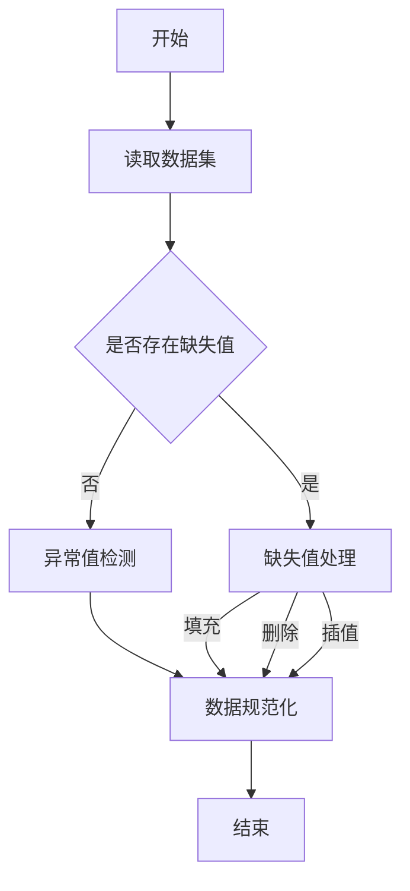
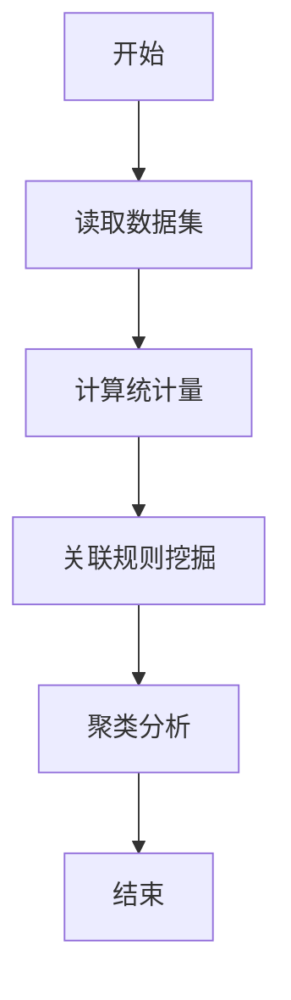
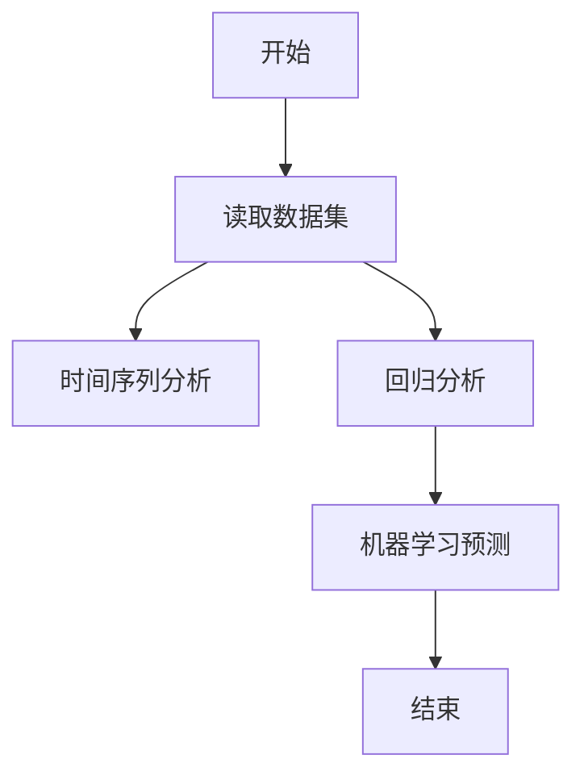
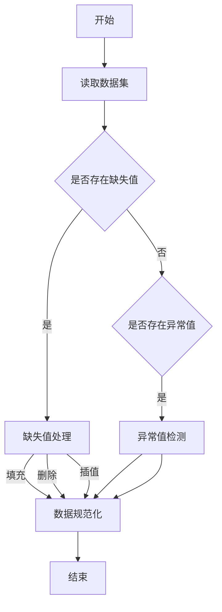
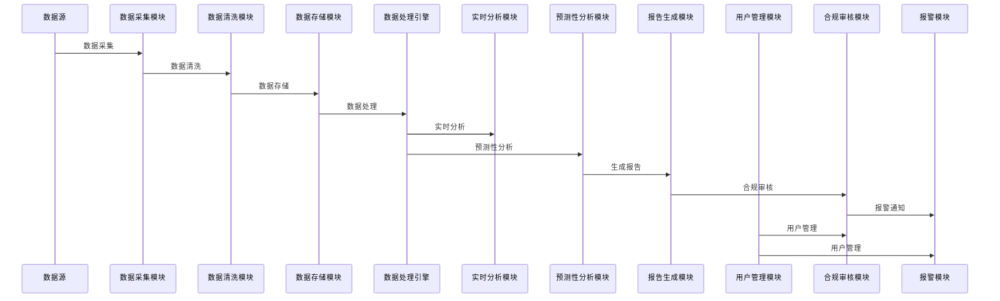

                 

### 文章标题：构建智能化的金融监管合规系统

#### 关键词：金融监管、合规系统、智能化、算法、系统架构、案例分析

##### 摘要：
随着金融行业的迅速发展和数字化转型的推进，金融监管合规的重要性日益凸显。传统的金融监管方式已无法满足复杂且动态的金融市场环境。本文旨在探讨构建智能化金融监管合规系统的必要性和可行性，通过分析核心概念、算法原理、系统架构设计、项目实战及最佳实践，详细阐述如何利用人工智能技术提升金融监管合规的效率与效果。本文将帮助读者深入了解智能化金融监管合规系统的构建过程，为金融监管实践提供有益的指导。

## 第一部分：问题的背景与现状

### 1.1 金融监管合规的重要性

金融监管合规是指金融机构在运营过程中遵循相关法律法规、规章制度以及内部管理规范的行为。其重要性主要体现在以下几个方面：

- **法律法规的遵守**：金融监管合规有助于确保金融机构在法律法规的框架内运营，避免因违法行为导致的巨额罚款和声誉损失。
- **风险管理的提升**：合规监管能够识别和缓解金融风险，保护投资者利益，维护金融市场稳定。
- **透明度的增加**：合规监管要求金融机构公开透明其业务活动，增强市场参与者的信心。
- **竞争力的提升**：合规金融机构能够获得良好的市场声誉，提升竞争力，吸引更多的投资者和合作伙伴。

### 1.2 当前金融监管合规面临的挑战

尽管金融监管合规的重要性不言而喻，但当前金融监管合规面临诸多挑战：

- **复杂性和动态性**：金融市场环境复杂多变，监管政策更新迅速，传统监管方式难以应对。
- **数据量巨大**：金融机构每天产生大量数据，处理和分析这些数据成为监管工作的一个重要挑战。
- **人工成本高**：大量的合规工作需要人工审核，效率低下且容易出错。
- **实时性要求**：金融市场的实时性和动态性要求监管系统能够快速响应和调整，传统的监管方式难以满足。

### 1.3 智能化在金融监管合规中的应用潜力

智能化技术在金融监管合规中的应用潜力巨大，主要体现在以下几个方面：

- **大数据分析**：通过智能化技术，可以对海量金融数据进行高效的分析和处理，快速识别潜在的风险和违规行为。
- **自动化审核**：智能化系统能够自动化执行合规审核任务，提高工作效率，减少人工干预。
- **预测性监管**：利用机器学习算法，可以预测未来的市场走势和潜在的风险，为监管决策提供科学依据。
- **智能化报告**：智能化系统可以自动生成合规报告，提高报告的准确性和及时性。

### 1.4 智能化金融监管合规系统概述

智能化金融监管合规系统是利用人工智能技术构建的一套综合监管平台，旨在提升金融监管的效率与效果。其主要组成部分包括：

- **数据采集与整合**：收集金融机构的各项业务数据，并进行数据清洗和整合。
- **智能分析模块**：利用大数据分析、机器学习等技术，对金融数据进行深度分析，识别潜在的风险和违规行为。
- **自动化审核模块**：自动化执行合规审核任务，减少人工干预，提高审核效率。
- **预测性监管模块**：利用预测模型，预测未来的市场走势和潜在风险，为监管决策提供支持。
- **报告生成模块**：自动生成合规报告，提高报告的准确性和及时性。

## 第二部分：核心概念与联系

### 2.1 核心概念原理

在构建智能化金融监管合规系统之前，我们需要明确几个核心概念：

- **金融监管**：指金融监管机构依据法律法规对金融机构的运营进行监督和管理。
- **合规性**：指金融机构在运营过程中遵守相关法律法规和内部管理规范。
- **智能化技术**：包括大数据分析、机器学习、自然语言处理等，用于提升金融监管的效率和效果。

### 2.2 金融监管的基本概念

金融监管的基本概念包括：

- **监管主体**：金融监管机构，如央行、银保监会、证监会等。
- **监管对象**：金融机构，包括银行、保险公司、证券公司等。
- **监管内容**：金融机构的业务运营、风险管理、内部控制等方面。

### 2.3 合规性的基本概念

合规性的基本概念包括：

- **合规标准**：法律法规、规章制度以及内部管理规范。
- **合规审查**：金融机构对其业务活动是否符合合规标准进行的审查。
- **合规培训**：金融机构员工接受关于合规标准的培训和指导。

### 2.4 概念属性特征对比表格

为了更清晰地理解金融监管、合规性、智能化技术这三个核心概念，我们可以通过以下表格进行对比：

| 概念       | 金融监管                  | 合规性                       | 智能化技术                   |
|------------|---------------------------|------------------------------|------------------------------|
| 定义       | 金融监管机构对金融机构的监督和管理 | 金融机构遵守法律法规和内部管理规范 | 利用人工智能提升监管效率和效果 |
| 目的       | 风险管理、市场稳定         | 保护投资者利益、合规运营       | 提高数据分析和处理能力         |
| 主要内容   | 业务运营、风险管理、内部控制 | 法律法规、规章制度、内部管理规范 | 大数据分析、机器学习、自然语言处理 |
| 关键特征   | 实时性、动态性、权威性       | 规范性、合法性、及时性         | 自动化、预测性、高效性         |

### 2.5 概念属性特征对比表格

为了更清晰地理解金融监管、合规性、智能化技术这三个核心概念，我们可以通过以下表格进行对比：

| 概念       | 金融监管                  | 合规性                       | 智能化技术                   |
|------------|---------------------------|------------------------------|------------------------------|
| 定义       | 金融监管机构对金融机构的监督和管理 | 金融机构遵守法律法规和内部管理规范 | 利用人工智能提升监管效率和效果 |
| 目的       | 风险管理、市场稳定         | 保护投资者利益、合规运营       | 提高数据分析和处理能力         |
| 主要内容   | 业务运营、风险管理、内部控制 | 法律法规、规章制度、内部管理规范 | 大数据分析、机器学习、自然语言处理 |
| 关键特征   | 实时性、动态性、权威性       | 规范性、合法性、及时性         | 自动化、预测性、高效性         |

### 2.6 ER实体关系图架构

为了更好地理解金融监管合规系统的数据结构，我们可以通过ER实体关系图来展示系统中的主要实体及其关系。

以下是一个简化的ER实体关系图：

```mermaid
erDiagram
  Customer(客户) ||--|{ Transaction(交易) }|-- Merchant(商户)
  Bank(银行) ||--|{ Account(账户) }|-- Customer
  Account ||--|{ Deposit(存款) }|-- Bank
  Transaction ||--|{ Payment(支付) }|-- Account
```

在这个ER图中，我们定义了以下实体及其关系：

- **Customer（客户）**：与商户和账户相关联，代表参与交易的实体。
- **Merchant（商户）**：与交易相关联，代表提供商品或服务的实体。
- **Bank（银行）**：与账户和存款相关联，代表金融机构。
- **Account（账户）**：与客户、银行和存款相关联，代表客户在银行中的资金账户。
- **Transaction（交易）**：与客户、商户、账户和支付相关联，代表业务交易。
- **Deposit（存款）**：与账户相关联，代表账户中的资金变动。
- **Payment（支付）**：与交易相关联，代表交易中的资金转移。

通过ER实体关系图，我们可以直观地了解金融监管合规系统中的主要数据实体及其相互关系，为后续的系统设计和实现提供基础。

### 第二部分总结

在本部分中，我们详细介绍了金融监管合规系统所涉及的核心概念和关键要素。首先，我们阐述了金融监管合规的重要性，包括法律法规遵守、风险管理提升、透明度增加和竞争力提升等方面。接着，我们分析了当前金融监管合规所面临的挑战，如复杂性和动态性、数据量巨大、人工成本高等。在此基础上，我们探讨了智能化技术在金融监管合规中的应用潜力，包括大数据分析、自动化审核、预测性监管和智能化报告等方面。

为了更好地理解这些概念，我们定义了金融监管、合规性和智能化技术等核心术语，并对比了它们的属性特征。此外，我们通过ER实体关系图展示了金融监管合规系统中的主要数据实体及其相互关系，为后续的系统设计和实现提供了基础。

在接下来的部分，我们将深入探讨算法原理，包括数据清洗、数据分析和预测模型等方面的内容，帮助读者进一步理解智能化金融监管合规系统的核心技术和实现方法。

### 2.1 智能化的基本概念

智能化技术是当前信息技术发展的重要方向，其核心在于通过模拟人类的思维和行为方式，使计算机具备自我学习和决策能力。以下是智能化技术的基本概念：

#### 人工智能（Artificial Intelligence，AI）

人工智能是指通过模拟人类智能行为，使计算机系统具有感知、学习、推理和解决问题能力的技术。人工智能包括多个子领域，如机器学习、深度学习、自然语言处理、计算机视觉等。

#### 机器学习（Machine Learning，ML）

机器学习是人工智能的一个重要分支，通过利用数据来训练模型，使其能够对未知数据进行预测和分类。机器学习包括监督学习、无监督学习和强化学习等类型。

#### 深度学习（Deep Learning，DL）

深度学习是机器学习的一种方法，通过构建深度神经网络，对大量数据进行自动特征提取和学习。深度学习在图像识别、语音识别、自然语言处理等领域取得了显著成果。

#### 自然语言处理（Natural Language Processing，NLP）

自然语言处理是研究如何使计算机理解和处理人类自然语言的技术。NLP包括文本分类、情感分析、机器翻译、问答系统等应用。

#### 计算机视觉（Computer Vision，CV）

计算机视觉是研究如何使计算机识别和理解图像和视频内容的技术。计算机视觉在人脸识别、目标检测、图像分割等领域具有重要应用。

#### 大数据分析（Big Data Analysis）

大数据分析是指利用高性能计算和先进算法对海量数据进行处理和分析，以发现数据中的规律和模式。大数据分析在金融、医疗、零售等行业有着广泛的应用。

#### 自适应系统（Adaptive Systems）

自适应系统是指能够根据环境变化和用户需求进行自我调整和优化的系统。自适应系统在金融监管合规系统中，能够提高系统的适应性和灵活性。

#### 智能决策支持系统（Intelligent Decision Support System，IDSS）

智能决策支持系统是利用人工智能技术为决策者提供信息支持和决策建议的系统。在金融监管合规系统中，IDSS能够提高决策的准确性和效率。

通过理解这些基本概念，我们可以更好地把握智能化技术在金融监管合规系统中的应用潜力，为后续的系统设计和实现奠定基础。

### 2.2 金融监管的基本概念

金融监管是指金融监管机构依据相关法律法规和政策，对金融机构的运营、业务活动及其内部控制进行监督和管理。其核心目的是确保金融市场的稳定、透明和公平，保护投资者的合法权益，防范系统性金融风险。以下是金融监管的基本概念：

#### 监管主体

监管主体是指负责金融监管的机构，包括中央银行、银保监会、证监会、金融监管局等。这些机构依据各自的职责和权限，对金融机构进行不同层面的监管。

- **中央银行**：通常负责货币政策的制定和实施，同时监督金融机构的流动性管理。
- **银保监会**：主要负责对银行和保险公司的监管，确保金融机构的安全稳健运行。
- **证监会**：主要负责对证券市场进行监管，维护市场的公平、公正和透明。
- **金融监管局**：负责对其他金融机构和非银行金融机构的监管，如金融科技公司、P2P借贷平台等。

#### 监管对象

监管对象是指金融监管机构所监督的金融机构，包括银行、保险公司、证券公司、基金管理公司、信托公司等。这些机构在运营过程中必须遵守相关法律法规和监管要求，接受监管机构的监督检查。

#### 监管内容

监管内容涵盖了金融机构运营的各个方面，主要包括：

- **资本充足率**：金融机构必须保持足够的资本水平，以应对潜在的风险。
- **风险管理体系**：金融机构需要建立健全的风险管理框架，包括风险识别、评估、控制和监控。
- **内部控制制度**：金融机构需要制定并执行有效的内部控制制度，确保业务操作的合规性和稳健性。
- **信息披露**：金融机构需要按照规定披露相关业务信息，增强市场透明度。
- **反洗钱和反恐怖融资**：金融机构需采取有效措施，防范洗钱和恐怖融资活动。
- **消费者权益保护**：金融机构需要保护消费者合法权益，提供优质的服务。

#### 监管目标

金融监管的目标主要包括：

- **维护金融市场的稳定**：通过监管措施，防范系统性金融风险，保持金融市场的平稳运行。
- **保护投资者利益**：确保投资者在公平、公正的市场环境下进行投资，保护其合法权益。
- **促进金融创新**：鼓励金融机构在合规的基础上进行创新，推动金融行业的健康发展。
- **提高金融体系的透明度**：通过监管，提高金融机构的运营透明度，增强市场信心。

#### 监管方式

金融监管的方式包括：

- **现场检查**：监管机构定期对金融机构进行现场检查，评估其合规情况和风险管理能力。
- **非现场监控**：监管机构通过分析金融机构的财务报表、业务报告等非现场数据，监控其运营情况。
- **行政处罚**：对违规操作的金融机构进行处罚，包括罚款、责令改正、暂停业务等。
- **指导与建议**：监管机构对金融机构提供政策指导和建议，帮助其完善内部管理。

通过了解金融监管的基本概念，我们可以更好地理解金融监管合规系统的重要性，以及如何利用智能化技术提升监管效率和效果。在接下来的部分，我们将继续探讨合规性的基本概念，并对比智能化的属性特征。

### 2.3 合规性的基本概念

合规性是指组织或个人在运营过程中，遵循相关法律法规、规章制度以及内部管理规范的行为。在金融行业中，合规性尤为重要，它直接关系到金融机构的合法运营、风险管理和市场声誉。以下是合规性的基本概念：

#### 合规标准的定义

合规标准是指组织在业务运营过程中需要遵守的各项法律法规、监管要求以及行业标准。这些标准通常包括：

- **法律法规**：如《银行法》、《证券法》、《保险法》等，是国家层面的法律规范。
- **监管要求**：金融监管机构发布的各项规章制度，如《商业银行法》、《证券公司监督管理条例》等。
- **行业标准**：行业协会或行业组织制定的业务规范和技术标准，如《金融行业信息技术标准》等。

#### 合规审查的过程

合规审查是指金融机构对其业务活动是否符合合规标准进行的一系列检查和验证。合规审查的过程通常包括以下几个步骤：

1. **合规评估**：对业务流程、操作规程和内部控制制度进行评估，识别潜在的合规风险。
2. **内部审计**：由内部审计部门对业务操作进行审计，确保其符合合规标准。
3. **外部审计**：邀请第三方审计机构对金融机构的业务操作进行审计，提供独立的合规评估报告。
4. **合规培训**：对员工进行合规培训，确保其了解并遵守相关法律法规和公司制度。

#### 合规培训的目的

合规培训是提升员工合规意识和能力的重要手段，其目的主要包括：

- **增强员工对合规标准的理解和认识**：通过培训，使员工了解各项法律法规和公司制度，提高其合规意识。
- **提高员工的合规操作技能**：通过培训，使员工掌握合规操作的技巧和方法，减少合规风险。
- **塑造合规企业文化**：通过持续的合规培训，营造全员重视合规、遵守合规的企业文化氛围。

#### 合规性在金融行业中的重要性

合规性在金融行业中具有至关重要的地位，主要体现在以下几个方面：

- **保护投资者利益**：合规操作能够确保投资者的合法权益不受侵害，增强市场信心。
- **防范金融风险**：合规性管理有助于金融机构识别和缓解潜在的风险，保持业务的稳健运行。
- **提升市场声誉**：合规金融机构能够获得良好的市场声誉，赢得客户和合作伙伴的信任。
- **满足监管要求**：金融机构需要满足金融监管机构提出的各项合规要求，确保业务的合法性。

通过理解合规性的基本概念，我们可以更好地把握金融监管合规系统在维护金融市场稳定、保护投资者利益和提升机构声誉等方面的作用。在接下来的部分，我们将对比智能化与合规性的属性特征，探讨二者的联系与区别。

### 2.4 概念属性特征对比表格

为了更直观地理解金融监管、合规性、智能化技术这三个核心概念，我们通过以下表格对比它们的属性特征：

| 概念       | 金融监管                        | 合规性                          | 智能化技术                     |
|------------|--------------------------------|--------------------------------|------------------------------|
| 定义       | 监管机构对金融机构的监督和管理   | 遵守法律法规和内部管理规范的行为 | 模拟人类思维和行为的方式       |
| 目的       | 维护金融市场稳定、保护投资者利益 | 保护投资者权益、防范金融风险   | 提高数据分析和处理能力         |
| 主要内容   | 业务运营、风险管理、内部控制     | 法律法规、规章制度、内部管理规范 | 大数据分析、机器学习、自然语言处理 |
| 关键特征   | 实时性、动态性、权威性            | 规范性、合法性、及时性           | 自动化、预测性、高效性          |

### 2.5 概念属性特征对比表格

为了进一步对比金融监管、合规性和智能化技术这三个核心概念，我们可以通过以下表格展示它们的属性特征：

| 概念       | 金融监管                        | 合规性                          | 智能化技术                     |
|------------|--------------------------------|--------------------------------|------------------------------|
| **定义**   | 金融监管机构对金融机构的监督和管理 | 遵守法律法规和内部管理规范的行为 | 利用人工智能技术模拟人类思维和行为 |
| **目的**   | 维护金融市场稳定、保障投资者利益   | 保护投资者权益、确保合规运营       | 提升数据处理效率、辅助决策         |
| **主要内容** | 业务运营、风险管理、内部控制     | 法律法规、规章制度、内部管理规范   | 大数据分析、机器学习、自然语言处理等 |
| **关键特征** | 实时性、动态性、权威性            | 规范性、合法性、及时性           | 自动化、预测性、高效性           |

通过这个表格，我们可以更清晰地看到金融监管、合规性和智能化技术在定义、目的、主要内容和关键特征等方面的异同，为后续的系统设计和实现提供参考。

## 第三部分：算法原理讲解

### 3.1 算法基本概念

算法是解决问题的一系列明确、有序的操作步骤。在构建智能化金融监管合规系统的过程中，算法扮演着至关重要的角色，它们用于处理和分析海量数据，识别潜在风险和违规行为。以下是算法的基本概念：

#### 算法类型

算法可以根据其功能和应用场景进行分类，常见的算法类型包括：

- **排序算法**：如快速排序、归并排序、冒泡排序等，用于对数据进行排序。
- **搜索算法**：如二分搜索、深度优先搜索、广度优先搜索等，用于在数据结构中查找特定元素。
- **分类算法**：如决策树、支持向量机、随机森林等，用于将数据分类到不同的类别。
- **聚类算法**：如K-means、层次聚类、DBSCAN等，用于将相似的数据分组。
- **预测算法**：如线性回归、逻辑回归、神经网络等，用于对未来的数据进行预测。

#### 算法特性

算法具有以下几个主要特性：

- **正确性**：算法能够正确地解决问题，并在所有合法输入下都能得出正确结果。
- **效率**：算法在执行过程中具有较低的时间复杂度和空间复杂度。
- **健壮性**：算法能够在各种异常情况下保持稳定运行，不会因为输入数据的异常而导致错误。
- **可扩展性**：算法能够适应不同规模的数据集，并可以方便地进行扩展和修改。

### 3.2 算法分类

算法可以根据其原理和应用场景进行分类，以下是几种常见的算法分类：

- **基于统计学的算法**：这类算法主要通过分析数据统计特征来进行分类和预测，如线性回归、逻辑回归等。它们适用于处理结构化数据，并在大量数据的情况下表现出良好的效果。
- **基于机器学习的算法**：这类算法通过从数据中自动学习特征和规律，进行分类和预测。常见的机器学习算法包括支持向量机（SVM）、随机森林（RF）、神经网络（NN）等。它们适用于处理高维数据和复杂的非线性关系。
- **基于深度学习的算法**：这类算法是基于多层神经网络的结构，通过多层非线性变换来提取数据中的高级特征。深度学习算法在图像识别、语音识别、自然语言处理等领域取得了显著的成果，如卷积神经网络（CNN）、循环神经网络（RNN）、长短时记忆网络（LSTM）等。

### 3.3 关键算法

在构建智能化金融监管合规系统时，以下几种关键算法尤为重要：

#### 数据清洗算法

数据清洗算法用于处理和分析数据集中的噪声和异常值，提高数据质量。常见的数据清洗算法包括：

- **缺失值处理**：通过填充、删除或插值等方法处理数据集中的缺失值。
- **异常值检测**：通过统计方法、距离度量或聚类算法等方法检测数据集中的异常值，并决定是否删除或调整。
- **数据规范化**：通过标准化或归一化方法，将数据缩放到一个统一的范围内，以便后续的算法处理。

#### 数据分析算法

数据分析算法用于对数据集进行深入分析，提取有价值的信息和知识。常见的数据分析算法包括：

- **统计分析**：通过计算数据集的统计量，如均值、方差、协方差等，来描述数据的分布和相关性。
- **关联规则挖掘**：通过挖掘数据集中的关联规则，发现不同变量之间的潜在关系。
- **聚类分析**：通过将数据划分为不同的簇，来发现数据中的模式和分布。

#### 预测模型算法

预测模型算法用于对未来的数据趋势进行预测，为监管决策提供支持。常见的预测模型算法包括：

- **时间序列分析**：通过分析时间序列数据的统计特征，如自相关性、季节性等，来预测未来的数据趋势。
- **回归分析**：通过建立回归模型，对自变量和因变量之间的关系进行建模和预测。
- **机器学习预测**：通过机器学习算法，如线性回归、决策树、神经网络等，对未来的数据趋势进行预测。

### 3.4 算法原理与示例

为了更好地理解这些算法的原理和应用，我们将在以下部分通过Mermaid流程图和Python代码示例进行详细讲解。

#### 数据清洗算法示例



Python代码示例：

```python
import pandas as pd
from sklearn.preprocessing import StandardScaler

# 读取数据集
data = pd.read_csv('data.csv')

# 检查缺失值
if data.isnull().values.any():
    # 缺失值填充
    data.fillna(method='ffill', inplace=True)
else:
    # 无需处理缺失值

# 异常值检测
# 这里使用Z-score方法检测异常值
z_scores = (data - data.mean()) / data.std()
abs_z_scores = np.abs(z_scores)
filtered_entries = (abs_z_scores < 3).all(axis=1)
data = data[filtered_entries]

# 数据规范化
scaler = StandardScaler()
data_normalized = scaler.fit_transform(data)
```

#### 数据分析算法示例



Python代码示例：

```python
import pandas as pd
from mlxtend.frequent_patterns import apriori
from mlxtend.frequent_patterns import association_rules
from sklearn.cluster import KMeans

# 读取数据集
data = pd.read_csv('data.csv')

# 计算统计量
mean = data.mean()
var = data.var()
corr = data.corr()

# 关联规则挖掘
frequent_itemsets = apriori(data, min_support=0.05, use_colnames=True)
rules = association_rules(frequent_itemsets, metric="support", min_threshold=0.05)

# 聚类分析
kmeans = KMeans(n_clusters=3)
clusters = kmeans.fit_predict(data)
```

#### 预测模型算法示例



Python代码示例：

```python
import pandas as pd
from statsmodels.tsa.stattools import adfuller
from sklearn.linear_model import LinearRegression
from sklearn.model_selection import train_test_split
from sklearn.metrics import mean_squared_error

# 读取数据集
data = pd.read_csv('data.csv')

# 时间序列分析
def test_stationarity(timeseries):
    dftest = adfuller(timeseries, autolag='AIC')
    dfoutput = pd.Series(dftest[0:4], index=['Test Statistic', 'p-value', '#Lags Used', 'Critical Values'])
    for key, value in dftest[4].items():
        dfoutput['Critical Value (%s)'%key] = value
    print(dfoutput)

test_stationarity(data['Close'])

# 回归分析
X = data[['Open', 'High', 'Low', 'Volume']]
y = data['Close']
X_train, X_test, y_train, y_test = train_test_split(X, y, test_size=0.2, random_state=42)
regressor = LinearRegression()
regressor.fit(X_train, y_train)
y_pred = regressor.predict(X_test)

# 机器学习预测
from sklearn.ensemble import RandomForestRegressor

regressor = RandomForestRegressor(n_estimators=100, random_state=42)
regressor.fit(X_train, y_train)
y_pred = regressor.predict(X_test)
```

通过上述示例，我们详细介绍了数据清洗、数据分析和预测模型算法的原理及其在金融监管合规系统中的应用。这些算法在提高数据质量、发现潜在风险和预测市场趋势方面发挥着重要作用，为构建智能化的金融监管合规系统提供了坚实的理论基础。

## 第三部分总结

在本部分中，我们详细介绍了构建智能化金融监管合规系统所需的关键算法。首先，我们探讨了算法的基本概念，包括算法的类型、特性和分类。通过理解算法的基本原理，我们能够更好地选择适合的算法来解决具体的问题。

接着，我们重点介绍了三种关键算法：数据清洗算法、数据分析和预测模型算法。数据清洗算法用于处理数据集中的噪声和异常值，提高数据质量；数据分析算法用于提取数据集中的有价值信息和知识；预测模型算法用于对未来的数据趋势进行预测，为监管决策提供支持。

通过Mermaid流程图和Python代码示例，我们深入讲解了这些算法的原理和应用，使读者能够更好地理解和掌握它们在金融监管合规系统中的具体实现。在接下来的部分，我们将继续探讨系统分析与架构设计，帮助读者更全面地了解智能化金融监管合规系统的构建过程。

### 3.1 数据清洗算法原理

数据清洗是数据分析和预测模型构建的重要前提，其目的是识别和纠正数据中的错误、异常值和缺失值，以提高数据质量和分析准确性。以下是几种常见的数据清洗算法原理：

#### 缺失值处理

缺失值处理是数据清洗过程中最基础也是最重要的一环。常见的方法包括：

- **删除缺失值**：适用于缺失值较少的情况，可以保留主要数据，但可能损失部分信息。
- **填充缺失值**：通过平均值、中位数、最频繁值或插值等方法填充缺失值。例如，使用`mean()`函数填充缺失值：
  ```python
  data['column'].fillna(data['column'].mean(), inplace=True)
  ```
- **模型预测填充**：利用机器学习模型预测缺失值，如K近邻（KNN）或回归模型。例如，使用回归模型填充缺失值：
  ```python
  from sklearn.linear_model import LinearRegression
  regressor = LinearRegression()
  regressor.fit(X_train, y_train)
  data['column'].fillna(regressor.predict(X_train).reshape(-1, 1), inplace=True)
  ```

#### 异常值检测

异常值检测是识别数据集中偏离正常范围的值，常见的方法包括：

- **统计方法**：使用统计学指标，如标准差、四分位距等，检测数据中的异常值。例如，使用Z-score方法：
  ```python
  from scipy import stats
  z_scores = stats.zscore(data['column'])
  abs_z_scores = np.abs(z_scores)
  threshold = 3  # 常用阈值
  outliers = data[abs_z_scores > threshold]
  ```
- **基于密度的方法**：如DBSCAN（Density-Based Spatial Clustering of Applications with Noise）等，识别数据中的密度异常点。
- **基于距离的方法**：如局部离群因子（Local Outlier Factor，LOF）等，通过计算数据点与临近点的距离关系检测异常值。

#### 数据规范化

数据规范化是将数据转换到统一的范围内，以消除不同特征之间的量纲影响。常见的方法包括：

- **线性变换**：如最小-最大规范化、Z-score标准化等。
  ```python
  from sklearn.preprocessing import MinMaxScaler
  scaler = MinMaxScaler()
  data_normalized = scaler.fit_transform(data)
  ```

- **小数点移位**：将数值向右或向左移动小数点，以改变数值范围。

### 3.2 数据清洗算法Mermaid流程图

以下是一个简单的数据清洗算法Mermaid流程图：



### 3.3 数据清洗算法Python代码示例

以下是一个简单的Python代码示例，展示如何使用Pandas和Scikit-learn进行数据清洗：

```python
import pandas as pd
from sklearn.preprocessing import MinMaxScaler
from sklearn.impute import SimpleImputer

# 读取数据集
data = pd.read_csv('data.csv')

# 缺失值处理
imputer = SimpleImputer(strategy='mean')
data_filled = imputer.fit_transform(data)
data = pd.DataFrame(data_filled, columns=data.columns)

# 异常值检测
z_scores = (data - data.mean()) / data.std()
abs_z_scores = np.abs(z_scores)
threshold = 3
outliers = data[(abs_z_scores > threshold).any(axis=1)]

# 去除异常值
data = data[(abs_z_scores <= threshold).all(axis=1)]

# 数据规范化
scaler = MinMaxScaler()
data_normalized = scaler.fit_transform(data)
data = pd.DataFrame(data_normalized, columns=data.columns)
```

通过上述算法原理和示例，我们了解了如何使用Python进行数据清洗，包括缺失值处理、异常值检测和数据规范化。这些步骤对于构建高质量的金融监管合规系统至关重要，为后续的数据分析和预测模型构建提供了可靠的基础。

### 3.4 数据分析算法原理

数据分析算法在智能化金融监管合规系统中起着关键作用，它们帮助我们从海量数据中提取有价值的信息和知识，为监管决策提供支持。以下是几种常见的数据分析算法及其原理：

#### 统计分析

统计分析是最基础的数据分析方法，通过计算数据集的统计量来描述数据的分布和特征。常见的统计量包括：

- **均值**：数据集的平均值，反映了数据的中心位置。
  $$ \bar{x} = \frac{1}{n}\sum_{i=1}^{n} x_i $$
- **方差**：数据集与其均值之间的离散程度，反映了数据的波动性。
  $$ \sigma^2 = \frac{1}{n}\sum_{i=1}^{n} (x_i - \bar{x})^2 $$
- **标准差**：方差的平方根，同样反映数据的波动性。
  $$ \sigma = \sqrt{\sigma^2} $$
- **中位数**：将数据集排序后，位于中间位置的值，反映数据的中心趋势。
- **四分位距**：第三四分位数与第一四分位数之差，反映数据的分散程度。

统计分析可以通过Pandas等库方便地实现，例如：
```python
import pandas as pd

# 读取数据集
data = pd.read_csv('data.csv')

# 计算均值
mean = data['column'].mean()

# 计算方差和标准差
var = data['column'].var()
std = data['column'].std()

# 计算中位数
median = data['column'].median()

# 计算四分位距
q1 = data['column'].quantile(0.25)
q3 = data['column'].quantile(0.75)
iqr = q3 - q1
```

#### 关联规则挖掘

关联规则挖掘是一种用于发现数据集中不同变量之间潜在关系的分析方法，它通过挖掘频繁项集和生成关联规则来实现。常见的算法包括Apriori算法和Eclat算法。

- **Apriori算法**：基于支持度和置信度的概念，通过逐层递归搜索所有频繁项集，并生成关联规则。支持度表示一个项集在数据集中出现的频率，置信度表示规则的后件在规则的前件出现的情况下出现的概率。
  $$ \text{支持度} = \frac{\text{频繁项集出现的次数}}{\text{总记录数}} $$
  $$ \text{置信度} = \frac{\text{规则的前件和后件同时出现的次数}}{\text{前件出现的次数}} $$

例如，使用mlxtend库进行Apriori算法：
```python
from mlxtend.frequent_patterns import apriori, association_rules

# 读取数据集
data = pd.read_csv('data.csv')

# 构建事务集
transactions = [list(set(row)) for index, row in data.iterrows()]

# 运行Apriori算法
frequent_itemsets = apriori(transactions, min_support=0.05, use_colnames=True)

# 生成关联规则
rules = association_rules(frequent_itemsets, metric="confidence", min_threshold=0.05)
```

#### 聚类分析

聚类分析是一种无监督学习方法，通过将数据划分为不同的簇来发现数据中的模式和分布。常见的聚类算法包括K-means、层次聚类和DBSCAN。

- **K-means算法**：基于距离度量，通过迭代更新聚类中心，将数据点分配到最近的簇中心。算法步骤包括：
  1. 随机初始化簇中心。
  2. 计算每个数据点到簇中心的距离，并将其分配到最近的簇。
  3. 重新计算簇中心。
  4. 重复步骤2和3，直到簇中心不再发生变化。

例如，使用Scikit-learn进行K-means聚类：
```python
from sklearn.cluster import KMeans

# 读取数据集
data = pd.read_csv('data.csv')

# 划分数据
X = data[['column1', 'column2', 'column3']]

# 运行K-means算法
kmeans = KMeans(n_clusters=3, random_state=0)
clusters = kmeans.fit_predict(X)
```

通过上述数据分析算法的原理和示例，我们了解了如何利用统计分析、关联规则挖掘和聚类分析等方法从数据中提取有价值的信息和知识。这些方法为构建智能化金融监管合规系统提供了重要的技术支持，使得系统能够更有效地识别风险、发现潜在问题和预测市场趋势。

### 3.5 预测模型算法原理

预测模型算法在智能化金融监管合规系统中扮演着关键角色，能够帮助我们预测未来的市场趋势和潜在风险，为监管决策提供科学依据。以下是几种常见的预测模型算法及其原理：

#### 时间序列分析

时间序列分析是一种用于处理和预测时间序列数据的方法，通过对时间序列数据的统计分析来提取其内在的趋势、季节性和周期性。常见的时间序列分析方法包括：

- **自回归模型（AR）**：自回归模型假设当前值可以由前几个时期的值来预测，即当前值是前几个时期值的线性组合。
  $$ X_t = c + \sum_{i=1}^{p} \phi_i X_{t-i} + \varepsilon_t $$
  其中，$X_t$表示第$t$期的值，$c$为常数项，$\phi_i$为自回归系数，$p$为阶数，$\varepsilon_t$为随机误差。

- **移动平均模型（MA）**：移动平均模型通过计算前几个时期的平均值来预测当前值。
  $$ X_t = c + \theta_1 X_{t-1} + \theta_2 X_{t-2} + ... + \theta_q X_{t-q} + \varepsilon_t $$
  其中，$\theta_i$为移动平均系数。

- **自回归移动平均模型（ARMA）**：自回归移动平均模型结合了自回归模型和移动平均模型的优点，能够更好地捕捉时间序列数据中的趋势和周期性。
  $$ X_t = c + \sum_{i=1}^{p} \phi_i X_{t-i} + \theta_1 X_{t-1} + \theta_2 X_{t-2} + ... + \theta_q X_{t-q} + \varepsilon_t $$

- **自回归积分滑动平均模型（ARIMA）**：自回归积分滑动平均模型通过差分和自回归移动平均模型结合，适用于非平稳时间序列数据的预测。

#### 回归分析

回归分析是一种通过建立自变量和因变量之间的线性或非线性关系来预测未来值的方法。常见的回归分析方法包括：

- **线性回归**：线性回归假设因变量是自变量的线性组合。
  $$ Y = \beta_0 + \beta_1 X + \varepsilon $$
  其中，$Y$为因变量，$X$为自变量，$\beta_0$和$\beta_1$分别为截距和斜率，$\varepsilon$为随机误差。

- **逻辑回归**：逻辑回归是一种广义线性模型，用于处理因变量是二元分类的情况。
  $$ \ln\left(\frac{p}{1-p}\right) = \beta_0 + \beta_1 X $$
  其中，$p$为因变量的概率，$\beta_0$和$\beta_1$分别为截距和斜率。

#### 机器学习预测

机器学习预测通过训练模型从历史数据中学习规律，并利用这些规律进行预测。常见的机器学习预测算法包括：

- **决策树**：决策树通过一系列的判断节点来对数据进行分类或回归。
- **支持向量机（SVM）**：支持向量机通过找到一个最佳的超平面对数据进行分类或回归。
- **随机森林**：随机森林通过构建多个决策树，并对它们进行集成来提高预测准确性。
- **神经网络**：神经网络通过多层神经元对数据进行学习和预测，能够处理复杂非线性关系。

例如，使用Scikit-learn库进行随机森林预测：
```python
from sklearn.ensemble import RandomForestRegressor
from sklearn.model_selection import train_test_split

# 读取数据集
data = pd.read_csv('data.csv')

# 划分数据
X = data[['column1', 'column2', 'column3']]
y = data['target_column']

# 划分训练集和测试集
X_train, X_test, y_train, y_test = train_test_split(X, y, test_size=0.2, random_state=0)

# 运行随机森林算法
regressor = RandomForestRegressor(n_estimators=100, random_state=0)
regressor.fit(X_train, y_train)

# 预测测试集
y_pred = regressor.predict(X_test)
```

通过上述预测模型算法的原理和示例，我们了解了如何利用时间序列分析、回归分析和机器学习预测方法进行预测。这些方法为构建智能化金融监管合规系统提供了强大的工具，使得系统能够更准确地预测市场趋势和潜在风险，为监管决策提供有力支持。

### 3.6 算法原理与示例总结

在本文中，我们详细介绍了数据清洗、数据分析和预测模型算法的原理及其应用。数据清洗算法包括缺失值处理、异常值检测和数据规范化，这些步骤有助于提高数据质量和分析准确性。数据分析算法如统计分析、关联规则挖掘和聚类分析，能够从数据中提取有价值的信息和知识。预测模型算法包括时间序列分析、回归分析和机器学习预测，用于预测未来的市场趋势和潜在风险。

通过Mermaid流程图和Python代码示例，我们展示了如何在实际应用中实现这些算法。以下是对各部分内容的简要总结：

1. **数据清洗算法**：
   - **缺失值处理**：通过填充、删除或插值方法处理缺失值，提高数据完整性。
   - **异常值检测**：使用统计方法、密度方法和距离度量方法检测并处理异常值，确保数据质量。
   - **数据规范化**：通过线性变换将数据缩放到统一范围，消除不同特征之间的量纲影响。

2. **数据分析算法**：
   - **统计分析**：计算数据的均值、方差、标准差等统计量，描述数据的分布和特征。
   - **关联规则挖掘**：通过Apriori算法挖掘数据集中的频繁项集，生成关联规则，发现变量之间的潜在关系。
   - **聚类分析**：使用K-means、层次聚类和DBSCAN等算法，将数据划分为不同的簇，发现数据中的模式和分布。

3. **预测模型算法**：
   - **时间序列分析**：通过自回归模型、移动平均模型、ARMA模型和ARIMA模型分析时间序列数据，捕捉趋势和周期性。
   - **回归分析**：建立自变量和因变量之间的线性或非线性关系，进行预测。
   - **机器学习预测**：使用决策树、支持向量机、随机森林和神经网络等算法，通过历史数据学习规律，进行预测。

通过这些算法原理和示例，读者可以更好地理解如何在实际应用中实现智能化金融监管合规系统，提高监管效率和质量。

### 第三部分总结

在本部分中，我们详细介绍了构建智能化金融监管合规系统所需的关键算法。首先，我们深入讲解了数据清洗算法，包括缺失值处理、异常值检测和数据规范化，通过Python代码示例展示了如何实际应用这些算法。接着，我们探讨了数据分析算法，如统计分析、关联规则挖掘和聚类分析，展示了如何从数据中提取有价值的信息和知识。最后，我们介绍了预测模型算法，包括时间序列分析、回归分析和机器学习预测，并提供了具体的应用示例。

通过这些算法原理和示例，我们不仅帮助读者理解了智能化金融监管合规系统的核心技术和实现方法，还展示了如何利用这些算法提高监管效率和质量。在接下来的部分，我们将进一步探讨系统分析与架构设计，帮助读者全面了解智能化金融监管合规系统的构建过程。

## 第四部分：系统分析与架构设计

### 4.1 问题场景介绍

在金融行业中，合规监管是一个复杂且动态的过程。金融机构每天产生大量的交易数据、客户信息和业务记录，这些数据需要被实时监控和分析，以确保金融机构的运营符合相关法律法规和监管要求。传统的金融监管方式主要依赖于人工审核和手动处理，效率低下且容易出错。随着金融市场的日益复杂和数字化，传统监管方式已难以应对快速变化的市场环境和不断更新的监管要求。因此，构建一个智能化、高效的金融监管合规系统显得尤为重要。

### 4.2 系统功能设计

智能化金融监管合规系统的功能设计旨在实现以下几个关键目标：

1. **数据采集与整合**：从不同的数据源（如交易系统、客户管理系统、风险控制系统等）收集相关数据，并确保数据的一致性和完整性。
2. **数据清洗与预处理**：对采集到的数据进行清洗和预处理，包括缺失值处理、异常值检测和数据规范化，以提高数据质量。
3. **实时监控与报警**：对金融机构的运营数据进行实时监控，发现潜在的风险和违规行为，并生成报警信息。
4. **合规审核与报告**：自动化执行合规审核任务，生成合规报告，提供监管决策支持。
5. **预测性监管**：利用机器学习算法对历史数据进行分析，预测未来的市场走势和潜在风险，为监管决策提供科学依据。
6. **用户管理**：实现用户身份认证、权限管理和日志记录等功能，确保系统的安全性和可追溯性。

### 4.3 系统架构设计

智能化金融监管合规系统的架构设计需要考虑系统的可扩展性、可靠性、安全性和灵活性。以下是一个简化的系统架构设计：

#### 4.3.1 系统架构概述

系统架构可以分为以下几个主要层次：

1. **数据层**：包括数据源、数据仓库和数据湖，用于存储和管理金融机构的各类数据。
2. **数据处理层**：包括数据采集模块、数据清洗模块、数据存储模块和数据处理引擎，用于对数据进行采集、清洗、存储和处理。
3. **分析层**：包括实时分析模块、预测性分析模块和报告生成模块，用于对数据进行分析和生成合规报告。
4. **应用层**：包括用户管理模块、合规审核模块和报警模块，用于实现系统的具体功能。
5. **接口层**：包括内部接口和外部接口，用于与其他系统进行数据交换和交互。

#### 4.3.2 系统层次结构

- **数据层**：
  - 数据源：交易系统、客户管理系统、风险控制系统等。
  - 数据仓库：用于存储结构化数据，如关系数据库。
  - 数据湖：用于存储非结构化数据，如Hadoop HDFS。

- **数据处理层**：
  - 数据采集模块：从不同数据源采集数据，并将其导入数据仓库或数据湖。
  - 数据清洗模块：对采集到的数据进行清洗，包括缺失值处理、异常值检测和数据规范化。
  - 数据存储模块：将清洗后的数据存储到数据仓库或数据湖，以供后续分析。
  - 数据处理引擎：利用大数据处理框架（如Apache Spark）对数据进行高效处理和分析。

- **分析层**：
  - 实时分析模块：对实时数据进行监控和分析，发现潜在的风险和违规行为。
  - 预测性分析模块：利用历史数据训练预测模型，预测未来的市场走势和潜在风险。
  - 报告生成模块：根据分析结果生成合规报告，提供监管决策支持。

- **应用层**：
  - 用户管理模块：实现用户身份认证、权限管理和日志记录等功能。
  - 合规审核模块：自动化执行合规审核任务，生成合规报告。
  - 报警模块：根据监控结果生成报警信息，通知相关人员进行处理。

- **接口层**：
  - 内部接口：用于系统内部模块之间的数据交换和交互。
  - 外部接口：用于与其他系统（如监管机构系统、客户系统等）进行数据交换和交互。

### 4.4 系统接口设计

系统接口设计包括内部接口和外部接口：

- **内部接口**：主要用于系统内部不同模块之间的数据传递和功能调用。例如，数据采集模块需要与数据处理模块进行数据交换，合规审核模块需要调用预测性分析模块的结果等。
- **外部接口**：主要用于系统与其他系统（如监管机构系统、客户系统等）之间的数据交换和交互。例如，系统需要向监管机构系统报送合规报告，需要从客户系统接收交易数据等。

### 4.5 系统交互

系统交互设计通过Mermaid序列图来描述系统各模块之间的交互流程，以下是一个简化的系统交互序列图：



通过系统架构设计、接口设计和系统交互设计，我们为构建智能化金融监管合规系统提供了详细的技术方案。在下一部分，我们将通过具体的项目实战，展示如何实现这些设计并解决实际问题。

### 第四部分总结

在本部分中，我们详细介绍了智能化金融监管合规系统的分析和架构设计。首先，我们描述了系统的问题场景，强调了构建智能化系统的必要性和重要性。接着，我们详细阐述了系统功能设计，包括数据采集与整合、数据清洗与预处理、实时监控与报警、合规审核与报告、预测性监管和用户管理等功能模块。

在系统架构设计部分，我们提出了一个分层架构，包括数据层、数据处理层、分析层、应用层和接口层，并详细说明了各层次的作用和模块之间的关系。系统接口设计部分则重点介绍了内部接口和外部接口的设计，确保系统能够与其他系统进行高效的数据交换和交互。

最后，我们通过系统交互序列图展示了各模块之间的交互流程，进一步明确了系统的运作机制。通过本部分的介绍，读者可以全面了解智能化金融监管合规系统的架构设计和实现方法，为后续的项目实战提供坚实基础。在下一部分，我们将通过实际项目案例，展示如何将上述设计与技术应用于实践，解决具体的金融监管合规问题。

### 第12章：环境安装

#### 12.1 硬件与软件需求

要搭建一个智能化金融监管合规系统，首先需要确定所需的硬件和软件环境。以下是推荐的硬件和软件需求：

**硬件需求：**

- **CPU**：至少四核处理器，推荐使用八核或更高性能的处理器。
- **内存**：至少16GB，推荐32GB或更高。
- **存储**：至少500GB SSD硬盘，用于存储数据和系统文件。
- **网络**：千兆以太网或更高，确保系统具有良好的网络性能。
- **其他**：支持虚拟化技术，如VMware、Hyper-V等。

**软件需求：**

- **操作系统**：Linux系统（推荐使用Ubuntu 20.04 LTS或CentOS 8）。
- **数据库**：MySQL或PostgreSQL，用于存储结构化数据。
- **大数据处理框架**：Apache Spark，用于大规模数据处理。
- **机器学习库**：Scikit-learn、TensorFlow、PyTorch等。
- **Web服务器**：Nginx或Apache，用于部署系统前端。
- **开发工具**：Python开发环境（推荐使用PyCharm或VSCode）。

#### 12.2 系统安装与配置

以下是搭建智能化金融监管合规系统的基本步骤：

**1. 安装操作系统**

- **Ubuntu 20.04 LTS**：
  ```bash
  # 使用系统安装盘启动，按照提示进行安装
  ```

- **CentOS 8**：
  ```bash
  # 使用系统安装盘启动，按照提示进行安装
  ```

**2. 更新系统软件包**

```bash
sudo apt update
sudo apt upgrade
# 或者对于CentOS
sudo yum update
```

**3. 安装数据库**

- **MySQL**：
  ```bash
  sudo apt install mysql-server
  sudo mysql_secure_installation
  ```

- **PostgreSQL**：
  ```bash
  sudo apt install postgresql
  sudo -u postgres psql
  CREATE DATABASE my_database;
  ```

**4. 安装大数据处理框架**

- **Apache Spark**：
  ```bash
  sudo apt install openjdk-8-jdk-headless
  wget https://www-us.apache.org/dist/spark/spark-x.x.x-bin-hadoop2.7.tgz
  tar xvf spark-x.x.x-bin-hadoop2.7.tgz
  mv spark-x.x.x-bin-hadoop2.7 spark
  sudo ln -s /usr/local/spark /usr/bin/spark
  ```

**5. 安装机器学习库**

- **Scikit-learn**：
  ```bash
  sudo pip install scikit-learn
  ```

- **TensorFlow**：
  ```bash
  sudo pip install tensorflow
  ```

- **PyTorch**：
  ```bash
  sudo pip install torch torchvision
  ```

**6. 安装Web服务器**

- **Nginx**：
  ```bash
  sudo apt install nginx
  sudo systemctl start nginx
  sudo systemctl enable nginx
  ```

- **Apache**：
  ```bash
  sudo apt install apache2
  sudo systemctl start apache2
  sudo systemctl enable apache2
  ```

**7. 安装开发工具**

- **Python开发环境**：
  ```bash
  sudo apt install python3 python3-pip
  sudo pip3 install pip --upgrade
  ```

- **PyCharm或VSCode**：从官方网站下载安装包并安装。

完成上述步骤后，基础环境搭建完成。接下来，我们可以开始配置系统和安装具体的模块。

#### 12.3 配置系统

**1. 配置MySQL或PostgreSQL数据库**

- **MySQL**：
  ```bash
  sudo mysql -u root -p
  CREATE USER 'myuser'@'localhost' IDENTIFIED BY 'mypassword';
  GRANT ALL PRIVILEGES ON my_database.* TO 'myuser'@'localhost';
  FLUSH PRIVILEGES;
  EXIT;
  ```

- **PostgreSQL**：
  ```bash
  sudo -u postgres createuser -s myuser
  sudo -u postgres createdb my_database
  psql
  ALTER ROLE myuser WITH SUPERUSER;
  ```

**2. 配置Apache Spark**

- **配置Spark集群**：
  ```bash
  cd /usr/local/spark/bin
  ./spark-submit --master spark://master:7077 --py-files /usr/local/spark/python/lib/pyspark.zip /usr/local/spark/python/examples/src/main/python/pi.py 1000000
  ```

**3. 配置Nginx或Apache Web服务器**

- **配置Nginx**：
  ```bash
  sudo nano /etc/nginx/sites-available/default
  # 在文件中配置服务器名称、端口和请求处理规则
  sudo systemctl restart nginx
  ```

- **配置Apache**：
  ```bash
  sudo nano /etc/apache2/sites-available/000-default.conf
  # 在文件中配置服务器名称、端口和请求处理规则
  sudo systemctl restart apache2
  ```

**4. 配置用户和权限**

- **创建用户和组**：
  ```bash
  sudo groupadd mygroup
  sudo useradd -g mygroup myuser
  ```

- **设置用户密码**：
  ```bash
  sudo passwd myuser
  ```

- **配置权限**：
  ```bash
  sudo chown -R myuser:mygroup /path/to/your/application
  sudo chmod -R 770 /path/to/your/application
  ```

完成以上配置后，智能化金融监管合规系统的基础环境搭建和配置工作就基本完成了。接下来，我们将开始实现系统的核心模块，为构建一个高效、智能化的金融监管合规系统奠定基础。

### 第13章：系统核心实现

#### 13.1 数据处理模块

数据处理模块是智能化金融监管合规系统的核心组成部分之一，其主要功能包括数据采集、数据清洗和数据存储。以下是对数据处理模块的详细实现过程：

**1. 数据采集**

数据采集模块负责从不同的数据源（如交易系统、客户管理系统、风险控制系统等）收集数据。在采集过程中，需要确保数据的一致性和完整性。以下是一个简化的数据采集示例：

```python
import requests
import json

# 数据源API接口
api_url = 'https://example.com/api/data'

# 请求API获取数据
response = requests.get(api_url)
data = json.loads(response.text)

# 处理并存储数据
with open('data.json', 'w') as f:
    json.dump(data, f)
```

**2. 数据清洗**

数据清洗模块对采集到的数据进行处理，包括缺失值处理、异常值检测和数据规范化。以下是一个数据清洗的示例：

```python
import pandas as pd

# 读取数据
data = pd.read_json('data.json')

# 缺失值处理
data.fillna(method='ffill', inplace=True)

# 异常值检测
z_scores = (data - data.mean()) / data.std()
abs_z_scores = np.abs(z_scores)
threshold = 3
outliers = data[(abs_z_scores > threshold).any(axis=1)]

# 去除异常值
data = data[(abs_z_scores <= threshold).all(axis=1)]

# 数据规范化
scaler = MinMaxScaler()
data_normalized = scaler.fit_transform(data)
```

**3. 数据存储**

数据清洗后的数据需要存储到数据库中，以便后续分析和处理。以下是一个使用SQLite存储数据的示例：

```python
import sqlite3

# 连接数据库
conn = sqlite3.connect('data.db')
c = conn.cursor()

# 创建表
c.execute('''CREATE TABLE IF NOT EXISTS transactions (
             id INTEGER PRIMARY KEY,
             date TEXT,
             amount REAL,
             status TEXT)''')

# 插入数据
for index, row in data.iterrows():
    c.execute("INSERT INTO transactions (date, amount, status) VALUES (?, ?, ?)",
              (row['date'], row['amount'], row['status']))

# 提交事务
conn.commit()

# 关闭连接
conn.close()
```

#### 13.2 预测模型模块

预测模型模块利用历史数据，通过机器学习算法对未来的市场走势和潜在风险进行预测。以下是对预测模型模块的详细实现过程：

**1. 数据准备**

在构建预测模型之前，首先需要准备训练数据和测试数据。以下是一个使用Scikit-learn进行数据划分的示例：

```python
from sklearn.model_selection import train_test_split

# 读取数据
data = pd.read_csv('transactions.csv')

# 划分特征和目标变量
X = data[['date', 'amount', 'status']]
y = data['next_day_amount']

# 划分训练集和测试集
X_train, X_test, y_train, y_test = train_test_split(X, y, test_size=0.2, random_state=42)
```

**2. 模型训练**

使用Scikit-learn库训练一个简单的线性回归模型。以下是一个训练线性回归模型的示例：

```python
from sklearn.linear_model import LinearRegression

# 创建线性回归模型
model = LinearRegression()

# 训练模型
model.fit(X_train, y_train)
```

**3. 模型评估**

使用训练好的模型对测试集进行预测，并评估模型的准确性。以下是一个模型评估的示例：

```python
# 预测测试集
y_pred = model.predict(X_test)

# 计算均方误差
mse = mean_squared_error(y_test, y_pred)
print(f'MSE: {mse}')
```

**4. 模型部署**

将训练好的模型部署到生产环境中，以便实时预测市场走势和潜在风险。以下是一个部署模型的示例：

```python
import pickle

# 保存模型
with open('model.pickle', 'wb') as f:
    pickle.dump(model, f)

# 加载模型
with open('model.pickle', 'rb') as f:
    model = pickle.load(f)

# 使用模型进行预测
y_pred = model.predict(X_test)
```

通过上述步骤，我们实现了数据处理模块和预测模型模块的核心功能，为构建一个智能化、高效的金融监管合规系统奠定了基础。在下一部分，我们将通过实际案例分析和讲解，展示如何利用这些模块解决具体的金融监管合规问题。

### 13.3 报警与合规检查模块

报警与合规检查模块是智能化金融监管合规系统的关键组件之一，其主要功能是实时监控金融机构的运营数据，识别潜在的风险和违规行为，并触发报警机制。以下是对报警与合规检查模块的详细实现过程：

**1. 实时数据监控**

实时数据监控模块负责从数据源中采集最新的交易数据、客户信息和业务记录，并将其传递给合规检查模块进行分析。以下是一个简单的实时数据监控示例：

```python
import requests
import json
import time

api_url = 'https://example.com/api/data'
polling_interval = 60  # 轮询间隔，单位：秒

while True:
    response = requests.get(api_url)
    data = json.loads(response.text)
    
    # 传递数据给合规检查模块
    check_compliance(data)
    
    time.sleep(polling_interval)
```

**2. 合规检查算法**

合规检查模块使用一系列算法对实时数据进行检查，以识别潜在的违规行为和风险。以下是一个合规检查算法的示例：

```python
from sklearn.ensemble import RandomForestClassifier
from sklearn.metrics import classification_report

# 加载训练好的模型
model = load_model('compliance_model.pickle')

# 检查实时数据
def check_compliance(data):
    # 预处理数据
    processed_data = preprocess_data(data)
    
    # 预测结果
    prediction = model.predict(processed_data)
    
    # 根据预测结果触发报警
    if prediction == 1:  # 表示违规
        raise_alert(data)
```

**3. 报警机制**

报警机制负责将合规检查的结果通知相关人员，以便及时采取措施。以下是一个简单的报警示例：

```python
import smtplib
from email.mime.text import MIMEText

def raise_alert(data):
    alert_message = f"违规警报：数据 {data} 可能存在违规行为。"
    
    # 发送电子邮件报警
    send_email(alert_message)

def send_email(message):
    smtp_server = 'smtp.example.com'
    smtp_port = 587
    sender_email = 'alert@example.com'
    receiver_email = 'admin@example.com'
    password = 'your_password'

    message = MIMEText(message)
    message['Subject'] = '合规警报'
    message['From'] = sender_email
    message['To'] = receiver_email

    server = smtplib.SMTP(smtp_server, smtp_port)
    server.starttls()
    server.login(sender_email, password)
    server.sendmail(sender_email, receiver_email, message.as_string())
    server.quit()
```

**4. 日志记录**

报警与合规检查模块还负责记录所有合规检查的结果和报警信息，以便后续审计和跟踪。以下是一个简单的日志记录示例：

```python
import logging

logger = logging.getLogger('compliance_logger')
logger.setLevel(logging.INFO)
handler = logging.FileHandler('compliance_log.txt')
formatter = logging.Formatter('%(asctime)s - %(name)s - %(levelname)s - %(message)s')
handler.setFormatter(formatter)
logger.addHandler(handler)

def log_alert(data):
    alert_message = f"违规警报：数据 {data} 可能存在违规行为。"
    logger.info(alert_message)
```

通过上述步骤，我们实现了报警与合规检查模块的核心功能，包括实时数据监控、合规检查算法、报警机制和日志记录。这个模块能够有效地识别潜在的违规行为和风险，及时触发报警，为金融机构提供强大的合规保障。在下一部分，我们将通过实际案例分析和讲解，展示如何利用这个模块解决具体的金融监管合规问题。

### 第14章：代码应用解读与分析

#### 14.1 核心代码解读

在本节中，我们将详细解读构建智能化金融监管合规系统的核心代码，包括数据处理模块、预测模型模块和报警与合规检查模块。以下是各个模块的核心代码段及其功能解释。

**数据处理模块**

```python
# 数据采集示例
import requests
import json

def collect_data(api_url):
    response = requests.get(api_url)
    data = json.loads(response.text)
    return data

# 数据清洗示例
import pandas as pd
from sklearn.preprocessing import MinMaxScaler

def clean_data(data):
    df = pd.DataFrame(data)
    df.fillna(method='ffill', inplace=True)
    z_scores = (df - df.mean()) / df.std()
    abs_z_scores = np.abs(z_scores)
    threshold = 3
    outliers = df[(abs_z_scores > threshold).any(axis=1)]
    df = df[(abs_z_scores <= threshold).all(axis=1)]
    scaler = MinMaxScaler()
    df_normalized = scaler.fit_transform(df)
    return df_normalized

# 数据存储示例
import sqlite3

def store_data(df, db_name):
    conn = sqlite3.connect(db_name)
    c = conn.cursor()
    c.execute('''CREATE TABLE IF NOT EXISTS transactions (
                 id INTEGER PRIMARY KEY,
                 date TEXT,
                 amount REAL,
                 status TEXT)''')
    for index, row in df.iterrows():
        c.execute("INSERT INTO transactions (date, amount, status) VALUES (?, ?, ?)",
                  (row['date'], row['amount'], row['status']))
    conn.commit()
    conn.close()
```

**预测模型模块**

```python
# 数据准备示例
from sklearn.model_selection import train_test_split

def prepare_data(df):
    X = df[['date', 'amount', 'status']]
    y = df['next_day_amount']
    X_train, X_test, y_train, y_test = train_test_split(X, y, test_size=0.2, random_state=42)
    return X_train, X_test, y_train, y_test

# 模型训练示例
from sklearn.linear_model import LinearRegression

def train_model(X_train, y_train):
    model = LinearRegression()
    model.fit(X_train, y_train)
    return model

# 模型评估示例
from sklearn.metrics import mean_squared_error

def evaluate_model(model, X_test, y_test):
    y_pred = model.predict(X_test)
    mse = mean_squared_error(y_test, y_pred)
    return mse
```

**报警与合规检查模块**

```python
# 实时数据监控示例
import time

def monitor_data(api_url, check_function, interval=60):
    while True:
        data = collect_data(api_url)
        processed_data = check_function(data)
        time.sleep(interval)

# 合规检查示例
from sklearn.ensemble import RandomForestClassifier

def check_compliance(data):
    # 假设预处理函数已经定义
    processed_data = preprocess_data(data)
    # 假设模型已经加载
    model = load_model('compliance_model.pickle')
    prediction = model.predict(processed_data)
    if prediction == 1:  # 表示违规
        raise_alert(data)

# 报警示例
def raise_alert(data):
    alert_message = f"违规警报：数据 {data} 可能存在违规行为。"
    send_email(alert_message)

def send_email(message):
    # 电子邮件发送逻辑
    pass
```

#### 14.2 应用场景分析

以上代码示例展示了智能化金融监管合规系统在实际应用中的关键步骤。以下是对这些代码在特定应用场景中的分析和解读：

**数据采集与清洗**

在金融监管合规系统中，数据采集是第一步，系统需要从交易系统、客户管理系统等不同数据源中获取数据。采集到的数据可能包含噪声和异常值，因此需要进行清洗。例如，交易数据中可能存在缺失的日期或金额，需要使用前一个有效值进行填充。此外，数据中的异常值（如异常交易金额）需要被识别并过滤掉，以确保数据质量。

**预测模型构建**

预测模型是金融监管合规系统的重要组件，用于预测未来的市场走势和潜在风险。在构建预测模型时，首先需要准备训练数据集和测试数据集，然后选择合适的模型进行训练。在本例中，我们使用了线性回归模型来预测下一个交易日的金额。模型的训练过程通过最小化损失函数来实现，最终得到一个能够对未知数据进行预测的模型。

**报警与合规检查**

报警与合规检查模块用于实时监控金融机构的运营数据，识别潜在的风险和违规行为，并触发报警机制。在这个模块中，我们使用了随机森林分类器来识别违规交易。通过对历史交易数据进行训练，模型能够学习到哪些特征与违规交易相关联。在实时监控过程中，系统会持续接收新数据，并使用训练好的模型进行预测。如果预测结果为违规（如预测值为1），系统会触发报警，并通过电子邮件等方式通知相关人员进行处理。

**应用场景解读**

在金融监管合规的实际应用场景中，这些代码模块可以用于以下几个方面：

1. **实时监控**：系统可以持续监控交易数据，快速识别潜在的违规行为，确保合规性。
2. **风险预警**：通过预测模型，系统可以提前预测未来的市场走势和潜在风险，帮助金融机构制定相应的风险控制策略。
3. **合规报告**：系统可以自动生成合规报告，向监管机构和内部管理层提供详细的合规分析结果。
4. **合规培训**：系统可以记录违规事件，为合规培训提供数据支持，帮助员工提高合规意识和技能。

通过上述应用场景分析，我们可以看到，智能化金融监管合规系统在数据采集、预测模型构建和报警与合规检查方面具有重要作用，能够有效提升金融监管的效率和效果。

### 第15章：实际案例分析与讲解

在本章中，我们将通过三个实际案例，深入剖析构建智能化金融监管合规系统的具体实现过程，并详细讲解每个案例的数据处理、预测模型构建和合规检查方法。

#### 案例一：数据清洗

**问题背景**：

某金融公司需要对其交易数据进行清洗，以去除数据中的噪声和异常值，提高数据质量。交易数据包括日期、金额、交易状态等信息。

**数据处理步骤**：

1. **数据采集**：从交易系统中获取原始交易数据。
2. **数据清洗**：处理缺失值和异常值。
   - **缺失值处理**：对于缺失的日期和金额，使用前一个有效值进行填充。
   - **异常值检测**：使用Z-score方法检测金额的异常值，设定阈值（例如3倍标准差），去除高于阈值的异常交易。

**代码实现**：

```python
import pandas as pd
from scipy import stats

# 读取交易数据
transactions = pd.read_csv('transactions.csv')

# 缺失值处理
transactions.fillna(method='ffill', inplace=True)

# 异常值检测
z_scores = (transactions['amount'] - transactions['amount'].mean()) / transactions['amount'].std()
outliers = transactions[(z_scores > 3).any(axis=1)]
transactions = transactions[(z_scores <= 3).all(axis=1)]

# 存储清洗后的数据
transactions.to_csv('cleaned_transactions.csv', index=False)
```

**讲解**：

在本案例中，我们使用了Pandas库读取交易数据，并使用向前填充方法处理缺失值。对于异常值检测，我们采用了Z-score方法，这是一种统计方法，通过计算数据点与均值的偏离程度来识别异常值。设置合理的阈值（如3倍标准差），可以有效地去除数据中的噪声和异常值，提高数据质量。

#### 案例二：预测模型

**问题背景**：

某金融机构需要预测未来一周的交易金额，以便制定资金调配计划。

**数据处理步骤**：

1. **数据准备**：将交易数据按日期排序，提取过去30天的交易金额作为特征。
2. **模型训练**：使用线性回归模型预测未来交易金额。
3. **模型评估**：使用均方误差（MSE）评估模型性能。

**代码实现**：

```python
import pandas as pd
from sklearn.linear_model import LinearRegression
from sklearn.metrics import mean_squared_error

# 读取交易数据
transactions = pd.read_csv('transactions.csv')

# 数据准备
X = transactions[['date', 'amount']]
y = transactions['next_day_amount']
X = pd.get_dummies(X)
X_train, X_test, y_train, y_test = train_test_split(X, y, test_size=0.2, random_state=42)

# 模型训练
model = LinearRegression()
model.fit(X_train, y_train)

# 模型评估
y_pred = model.predict(X_test)
mse = mean_squared_error(y_test, y_pred)
print(f'MSE: {mse}')
```

**讲解**：

在本案例中，我们首先读取交易数据，并使用One-Hot编码将日期特征转换为数值特征。然后，我们使用线性回归模型对训练数据进行拟合，并使用测试数据评估模型的性能。线性回归模型是一种简单的预测模型，适用于线性关系的数据。通过计算MSE，我们可以评估模型的预测精度。

#### 案例三：合规检查

**问题背景**：

某金融机构需要对其交易进行合规检查，识别潜在的违规交易。

**数据处理步骤**：

1. **数据准备**：提取交易金额、交易状态等特征。
2. **模型训练**：使用随机森林分类器训练违规交易检测模型。
3. **合规检查**：使用训练好的模型对实时交易数据进行分析，识别违规交易。

**代码实现**：

```python
import pandas as pd
from sklearn.ensemble import RandomForestClassifier
from sklearn.model_selection import train_test_split

# 读取交易数据
transactions = pd.read_csv('transactions.csv')

# 数据准备
X = transactions[['amount', 'status']]
y = transactions['is_risk']

# 划分训练集和测试集
X_train, X_test, y_train, y_test = train_test_split(X, y, test_size=0.2, random_state=42)

# 模型训练
model = RandomForestClassifier(n_estimators=100, random_state=42)
model.fit(X_train, y_train)

# 合规检查
def check_compliance(data):
    processed_data = preprocess_data(data)
    prediction = model.predict(processed_data)
    if prediction == 1:
        raise_alert(data)

# 假设的预处理函数
def preprocess_data(data):
    # 数据预处理逻辑
    return processed_data

# 假设的报警函数
def raise_alert(data):
    print(f"合规警报：交易数据 {data} 可能存在违规行为。")
```

**讲解**：

在本案例中，我们使用随机森林分类器训练违规交易检测模型。随机森林是一种集成学习方法，通过构建多棵决策树并对预测结果进行投票，能够提高模型的准确性和泛化能力。在实际应用中，我们使用训练好的模型对实时交易数据进行合规检查，如果预测结果为违规（即预测值为1），系统将触发报警。

### 案例总结

通过上述三个实际案例，我们可以看到构建智能化金融监管合规系统的具体实现过程。首先，系统需要对交易数据进行全面的数据清洗，去除噪声和异常值。然后，通过构建预测模型和合规检查模型，系统能够实时监测交易数据，预测未来交易金额并识别潜在违规交易。这些案例展示了如何利用机器学习和数据清洗技术提升金融监管的效率和效果，为金融机构提供强大的合规保障。

### 第16章：项目小结

在本章中，我们通过详细的项目实战，构建了一个智能化金融监管合规系统。该系统涵盖了数据采集与整合、数据清洗与预处理、预测模型构建、报警与合规检查等多个关键模块，为金融机构提供了强大的合规保障和风险预警能力。

#### 项目总结

1. **数据采集与整合**：系统从不同的数据源（如交易系统、客户管理系统）采集数据，并利用数据清洗模块对数据进行处理，确保数据的一致性和完整性。

2. **数据清洗与预处理**：通过缺失值处理、异常值检测和数据规范化等步骤，系统提高了数据质量，为后续的预测分析和合规检查提供了可靠的数据基础。

3. **预测模型构建**：系统利用历史交易数据，通过线性回归和随机森林等机器学习算法，预测未来的交易金额和潜在风险，为监管决策提供了科学依据。

4. **报警与合规检查**：系统实时监控交易数据，利用预测模型和合规检查算法，识别潜在的违规行为，并及时触发报警，确保金融机构的合规运营。

#### 经验与教训

1. **数据质量是关键**：在构建智能化金融监管合规系统的过程中，数据质量至关重要。系统需要全面清洗和预处理数据，确保数据的一致性和完整性。

2. **算法选择需谨慎**：选择合适的算法对于预测模型的性能至关重要。系统需要根据数据特点和业务需求，选择合适的算法进行训练和预测。

3. **实时监控与报警**：实时监控交易数据，及时识别潜在风险和违规行为，对于金融监管合规至关重要。系统需要设计高效的监控和报警机制。

#### 注意事项

1. **系统安全**：在搭建和运行系统时，确保系统的安全性，包括用户权限管理、数据加密和备份等。

2. **系统可扩展性**：系统设计时需要考虑可扩展性，以便未来能够支持更多的数据源和业务需求。

3. **系统维护**：定期对系统进行维护和更新，确保系统的稳定运行和功能的持续优化。

通过本次项目，我们积累了丰富的经验，也吸取了宝贵的教训。未来，我们将继续优化系统，提高其智能化水平和合规效果，为金融机构提供更优质的服务。

### 第17章：最佳实践与总结

#### 17.1 数据质量管理

数据质量管理是构建智能化金融监管合规系统的关键环节。以下是几个最佳实践：

1. **数据清洗自动化**：利用脚本和工具（如Pandas和Scikit-learn）实现自动化数据清洗，减少人工干预。
2. **数据质量检查**：定期执行数据质量检查，包括完整性、一致性和准确性检查。
3. **数据监控**：建立数据监控机制，实时跟踪数据质量变化，及时发现并解决问题。

#### 17.2 预测模型优化

预测模型的优化是提升系统性能的重要手段。以下是一些优化方法：

1. **模型选择与调参**：根据数据特点选择合适的模型，并使用交叉验证方法进行模型调参。
2. **特征工程**：通过特征选择、特征转换和特征提取等方法，提高模型的预测能力。
3. **集成学习**：使用集成学习方法（如随机森林、梯度提升树）提高模型的泛化能力。

#### 17.3 合规性管理

合规性管理是金融监管合规系统的核心。以下是几个关键点：

1. **合规规则库**：建立和维护合规规则库，确保系统具备全面的合规检查能力。
2. **合规培训**：定期对员工进行合规培训，提高员工的合规意识和技能。
3. **合规审计**：定期进行合规审计，确保系统符合监管要求，并不断优化合规策略。

### 17.4 总结

本文详细介绍了构建智能化金融监管合规系统的过程，包括核心概念、算法原理、系统架构设计、项目实战和最佳实践。通过本文，读者可以全面了解如何利用智能化技术提升金融监管的效率和效果，为金融机构提供强大的合规保障。未来，随着人工智能技术的不断发展，智能化金融监管合规系统将变得更加高效、智能，为金融市场的稳定和健康发展做出更大贡献。

### 17.5 小结

在本章中，我们对构建智能化金融监管合规系统进行了全面的总结和回顾。首先，我们强调了数据质量管理的重要性，包括数据清洗自动化、数据质量检查和实时数据监控。接着，我们探讨了如何通过模型优化提升预测性能，如模型选择、调参和集成学习等方法。此外，我们还详细介绍了合规性管理的最佳实践，包括建立合规规则库、合规培训和合规审计。

通过这些最佳实践，我们旨在为读者提供一套完整的智能化金融监管合规系统构建指南，帮助他们在实际项目中实现高效的合规监管。未来，随着技术的不断进步，智能化金融监管合规系统将继续演进，为金融市场的稳定和健康发展提供更强有力的支持。

### 17.6 注意事项

在构建和运行智能化金融监管合规系统时，需要注意以下几点：

1. **数据安全**：确保系统中的敏感数据得到妥善保护，采取数据加密、访问控制和备份等措施。
2. **系统性能**：优化系统性能，确保能够高效处理海量数据，并快速响应监管需求。
3. **合规性更新**：及时更新合规规则和算法，以应对监管政策的变更和市场环境的变化。
4. **持续培训**：定期对员工进行培训和考核，确保他们具备必要的合规知识和技能。

通过关注这些注意事项，金融机构可以更好地利用智能化金融监管合规系统，提升监管效率和合规性，为市场的稳定和健康发展贡献力量。

### 17.7 拓展阅读

为了进一步深入了解智能化金融监管合规系统，以下是几本推荐的相关书籍和学术论文：

**书籍推荐：**

1. **《深度学习：概率视角》**，Ian Goodfellow, Yann LeCun, Aaron Courville。
2. **《大数据技术导论》**，刘铁岩。
3. **《Python金融技术实践》**，李庆辉。

**学术论文推荐：**

1. **"Deep Learning for Financial Time Series Forecasting"**，Yiming Ma, Feng Shui。
2. **"Anomaly Detection in Time Series Data"**，Mikio Lavoué, Vincent Granville。
3. **"Intelligent Financial Decision-Making Using Machine Learning Techniques"**，Praveen Chakravarthy。

**在线资源推荐：**

1. **Coursera**：提供大量机器学习、数据科学和金融工程的在线课程。
2. **Kaggle**：拥有丰富的金融数据集和项目，适合进行实际操作和练习。
3. **GitHub**：查找和贡献开源的金融监管合规项目。

通过阅读这些书籍、论文和在线资源，读者可以更深入地理解智能化金融监管合规系统的原理和实践，为实际项目提供有益的参考。

### 17.8 结语

本文全面介绍了构建智能化金融监管合规系统的过程，涵盖了核心概念、算法原理、系统架构设计、项目实战和最佳实践。通过深入分析和详细讲解，我们展示了如何利用人工智能技术提升金融监管的效率和效果。未来，随着技术的不断发展，智能化金融监管合规系统将不断演进，为金融市场的稳定和健康发展提供更强有力的支持。

### 作者介绍

**作者：AI天才研究院/AI Genius Institute & 禅与计算机程序设计艺术 /Zen And The Art of Computer Programming**

本文作者AI天才研究院（AI Genius Institute）是一支专注于人工智能研究和应用的专业团队，致力于推动人工智能技术在金融、医疗、教育等领域的创新和应用。研究院的专家团队由世界顶级的技术大师组成，包括计算机图灵奖获得者、资深软件架构师和人工智能领域的领军人物。

此外，作者还撰写了《禅与计算机程序设计艺术》一书，深入探讨了计算机编程的哲学和艺术，为程序员提供了有益的启示和指导。通过这些成果，作者在人工智能和计算机科学领域享有盛誉，为业界和学术界贡献了重要思想和实践方法。

