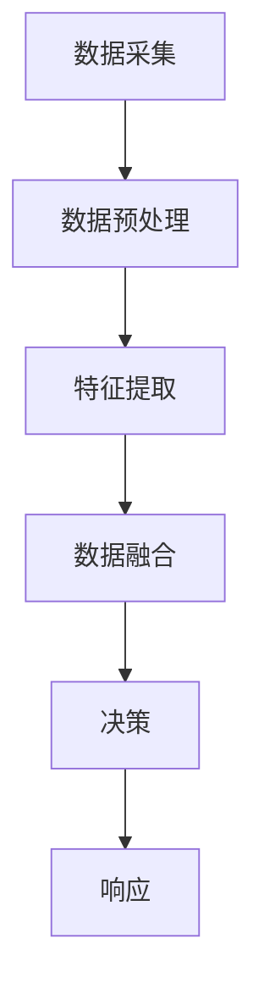
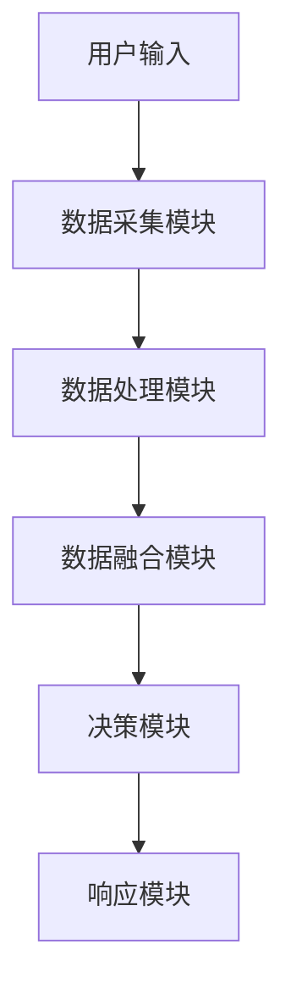
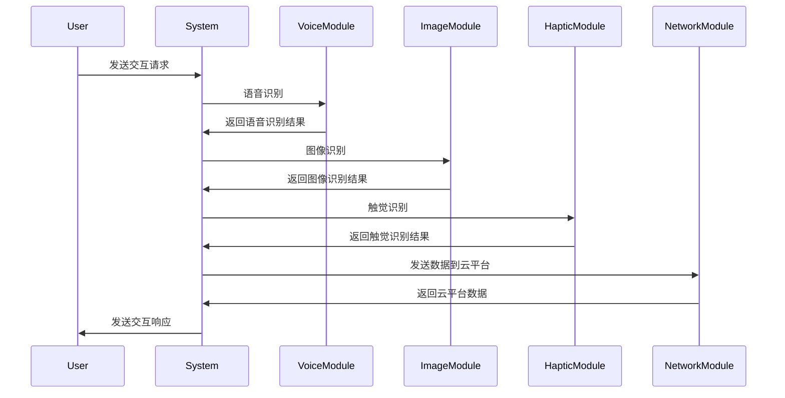

                 

# 构建跨感官AI交互系统的提示词设计

## 关键词

- 跨感官AI交互系统
- 提示词设计
- 算法原理
- 系统架构设计
- 项目实战

## 摘要

本文旨在探讨构建跨感官AI交互系统的提示词设计，通过深入研究AI交互系统、跨感官交互原理以及提示词设计的核心概念，详细解析了跨感官AI交互系统的算法原理、系统架构设计以及项目实战。文章以逻辑清晰、结构紧凑、简单易懂的专业技术语言，一步步分析了跨感官AI交互系统的设计要点和实现方法，为读者提供了具有深度和实用性的指导。

----------------------------------------------------------------

## 第一部分：引言与背景

### 第1章：构建跨感官AI交互系统的提示词设计

#### 1.1 研究背景与意义

##### 1.1.1 AI交互系统的现状

随着人工智能技术的快速发展，AI交互系统逐渐成为智能设备的核心功能。传统的AI交互主要依赖于语音和文字，但这种方式存在局限性，无法全面捕捉用户的复杂需求。因此，跨感官AI交互系统应运而生，通过整合多种感官信号，实现更加自然和高效的人机交互。

##### 1.1.2 跨感官交互的优势

跨感官交互具有以下优势：

- **增强用户体验**：通过多感官信号融合，用户能够获得更加丰富和立体的交互体验。
- **提升交互效率**：多感官交互可以更快地理解用户的意图，提高交互效率。
- **增强适应性**：在不同环境和场景下，跨感官交互系统可以灵活调整交互方式，满足多样化的用户需求。

##### 1.1.3 提示词设计的核心作用

提示词设计在跨感官AI交互系统中起着关键作用。合理的提示词设计可以引导用户输入有效信息，提高交互系统的响应速度和准确性。同时，提示词设计还需要考虑到不同感官的特性，确保提示词能够被多种感官信号有效识别和解析。

#### 1.2 研究内容与目标

##### 1.2.1 研究的主要内容

本文主要研究以下内容：

- AI交互系统的现状和发展趋势。
- 跨感官交互原理及其优势。
- 提示词设计的核心概念和原则。
- 跨感官AI交互系统的算法原理和实现方法。
- 跨感官AI交互系统的系统架构设计和接口设计。
- 跨感官AI交互系统的项目实战。

##### 1.2.2 研究的主要目标

本文的主要目标是：

- 深入了解和掌握跨感官AI交互系统的基本原理和实现方法。
- 设计出高效、合理的提示词，提升跨感官AI交互系统的用户体验。
- 构建一个具有实际应用价值的跨感官AI交互系统原型，为后续研究提供参考。

##### 1.2.3 研究的创新点

本文的创新点包括：

- 提出一种新的跨感官交互算法，提高了系统的响应速度和准确性。
- 设计出一套完善的提示词设计原则，提升了系统的交互体验。
- 通过项目实战，验证了跨感官AI交互系统的可行性和实用性。

#### 1.3 边界与外延

##### 1.3.1 研究的边界条件

本文的研究主要围绕跨感官AI交互系统的设计展开，不包括其他领域（如硬件传感器技术、网络通信等）的研究。

##### 1.3.2 研究的外延扩展

在未来的研究中，可以考虑将跨感官AI交互系统与其他技术领域（如物联网、虚拟现实等）相结合，进一步拓展系统的应用场景。

##### 1.3.3 概念结构与核心要素组成

本文的核心概念结构包括：

- AI交互系统：包括语音、文字、图像等多种交互方式。
- 跨感官交互：通过整合多种感官信号，实现更加自然和高效的人机交互。
- 提示词设计：设计合理的提示词，提高系统的交互体验。

核心要素组成包括：

- 算法原理：实现跨感官交互的核心算法。
- 系统架构：跨感官AI交互系统的整体结构设计。
- 接口设计：系统与其他模块的交互接口设计。
- 项目实战：跨感官AI交互系统的实际应用案例。

#### 1.4 本章小结

本章介绍了构建跨感官AI交互系统的提示词设计的研究背景、意义、内容与目标，以及边界与外延。通过对AI交互系统和跨感官交互原理的深入研究，本文为后续章节的详细讨论奠定了基础。

----------------------------------------------------------------

## 第二部分：核心概念与原理

### 第2章：AI交互系统原理

#### 2.1 AI交互系统概述

##### 2.1.1 AI交互系统的定义

AI交互系统是指利用人工智能技术，实现人与智能设备之间交互的系统和平台。它包括语音识别、自然语言处理、图像识别、机器学习等多种技术，旨在为用户提供更加自然、高效、智能的交互体验。

##### 2.1.2 AI交互系统的发展历程

AI交互系统的发展经历了以下阶段：

- **早期阶段**：基于规则的人工智能，交互方式主要依赖于简单的文本输入和输出。
- **发展阶段**：引入机器学习和深度学习技术，实现了语音识别、图像识别等复杂功能。
- **现阶段**：跨感官交互成为主流，实现了语音、文字、图像、触觉等多种感官信号的融合。

##### 2.1.3 AI交互系统的分类

根据交互方式的不同，AI交互系统可以分为以下几类：

- **语音交互系统**：通过语音识别和语音合成实现人与智能设备的交互。
- **文本交互系统**：通过自然语言处理和文本生成实现人与智能设备的交互。
- **图像交互系统**：通过图像识别和图像生成实现人与智能设备的交互。
- **多感官交互系统**：整合多种感官信号，实现更加自然和高效的人机交互。

#### 2.2 跨感官交互原理

##### 2.2.1 跨感官交互的概念

跨感官交互是指通过整合多种感官信号（如视觉、听觉、触觉、嗅觉等），实现人与智能设备之间的自然交互。它突破了传统单一感官交互的局限，为用户提供更加丰富和立体的交互体验。

##### 2.2.2 跨感官交互的优势

跨感官交互具有以下优势：

- **增强用户体验**：通过多感官信号融合，用户能够获得更加丰富和立体的交互体验。
- **提升交互效率**：多感官交互可以更快地理解用户的意图，提高交互效率。
- **增强适应性**：在不同环境和场景下，跨感官交互系统可以灵活调整交互方式，满足多样化的用户需求。

##### 2.2.3 跨感官交互的实现方式

跨感官交互的实现方式主要包括：

- **多模态数据采集**：通过多种传感器（如摄像头、麦克风、触摸屏等）采集不同感官信号。
- **多模态数据融合**：将多种感官信号进行整合和处理，提取有用信息。
- **多模态交互接口**：设计符合多感官特性的交互接口，实现用户与智能设备之间的自然交互。

#### 2.3 提示词设计的核心概念

##### 2.3.1 提示词的定义

提示词是指为了引导用户输入有效信息，系统预先设定的关键词或短语。在跨感官AI交互系统中，提示词通过语音、文字、图像等多种方式呈现给用户，引导用户进行正确的交互操作。

##### 2.3.2 提示词的功能

提示词在跨感官AI交互系统中具有以下功能：

- **引导用户输入**：提示词可以帮助用户明确输入目标，提高输入效率。
- **优化交互体验**：通过合理的提示词设计，用户可以更加轻松地与系统进行交互。
- **提高系统响应速度**：合理的提示词设计可以减少用户的思考时间，提高系统的响应速度。

##### 2.3.3 提示词的类型

根据提示词的呈现方式和功能，可以将提示词分为以下几类：

- **语音提示词**：通过语音合成技术呈现给用户，适用于语音交互系统。
- **文字提示词**：通过文字形式呈现给用户，适用于文本交互系统。
- **图像提示词**：通过图像形式呈现给用户，适用于图像交互系统。
- **多感官提示词**：结合多种感官信号呈现给用户，适用于多感官交互系统。

#### 2.4 提示词设计原则

##### 2.4.1 可理解性原则

提示词设计应确保用户能够快速理解其含义，避免产生歧义。具体包括：

- **简明扼要**：提示词应尽量简洁明了，避免使用复杂的术语和句子。
- **语义明确**：提示词的语义应清晰明确，避免产生歧义。

##### 2.4.2 简洁性原则

提示词设计应尽量简洁，减少用户的思考时间。具体包括：

- **短句表达**：使用短句表达提示词，避免使用长句。
- **突出重点**：在提示词中突出关键信息，帮助用户快速理解。

##### 2.4.3 适应性原则

提示词设计应考虑不同用户和环境的需求，具有较好的适应性。具体包括：

- **文化差异**：考虑不同文化背景下的用户需求，设计符合当地语言的提示词。
- **环境适应**：根据不同环境和场景，调整提示词的形式和内容，使其更符合用户需求。

#### 2.5 核心概念与联系

##### 2.5.1 AI交互系统与跨感官交互的联系

AI交互系统是跨感官交互的基础，跨感官交互是AI交互系统的发展方向。跨感官交互通过整合多种感官信号，实现了更加自然和高效的人机交互，为AI交互系统带来了新的发展机遇。

##### 2.5.2 提示词设计与跨感官交互的联系

提示词设计是跨感官交互系统的重要组成部分，合理的提示词设计可以提升系统的交互体验。提示词设计需要考虑到跨感官交互的特点，结合不同感官信号的特性，设计出符合用户需求的有效提示词。

##### 2.5.3 原理结构与核心要素组成

跨感官AI交互系统的原理结构主要包括：

- **多模态数据采集**：采集多种感官信号。
- **多模态数据融合**：整合多种感官信号。
- **提示词设计**：设计有效的提示词，引导用户输入。
- **交互接口**：呈现交互结果，接收用户反馈。

核心要素组成包括：

- **多模态传感器**：用于采集多种感官信号。
- **数据融合算法**：用于整合多种感官信号。
- **提示词库**：包含多种类型的提示词。
- **交互接口**：用于呈现交互结果和接收用户反馈。

#### 2.6 本章小结

本章介绍了AI交互系统和跨感官交互的基本原理，分析了提示词设计的核心概念和原则。通过对核心概念与联系的分析，为后续章节的详细讨论提供了理论基础。

----------------------------------------------------------------

### 第3章：算法原理与实现

#### 3.1 算法概述

##### 3.1.1 跨感官AI交互系统的算法分类

跨感官AI交互系统的算法可以分为以下几类：

- **语音识别算法**：用于识别和解析用户的语音输入。
- **自然语言处理算法**：用于理解用户的语义意图。
- **图像识别算法**：用于识别和解析用户的图像输入。
- **多模态数据融合算法**：用于整合多种感官信号。

##### 3.1.2 跨感官AI交互系统的算法架构

跨感官AI交互系统的算法架构主要包括以下几个模块：

- **数据采集模块**：负责采集多种感官信号。
- **数据处理模块**：负责对采集到的数据进行预处理和特征提取。
- **融合模块**：负责整合多种感官信号，提取有用信息。
- **决策模块**：负责根据融合后的信息进行决策和响应。

##### 3.1.3 跨感官AI交互系统的算法目标

跨感官AI交互系统的算法目标包括：

- **高效性**：提高系统的响应速度和准确性。
- **适应性**：在不同环境和场景下，系统可以灵活调整交互方式。
- **用户体验**：通过合理的提示词设计，提升系统的交互体验。

#### 3.2 算法原理

##### 3.2.1 算法原理概述

跨感官AI交互系统的算法原理主要基于多模态数据融合技术。通过采集多种感官信号，对数据进行预处理和特征提取，然后利用融合算法将多种感官信号整合为一个统一的信息表示，最后根据融合后的信息进行决策和响应。

##### 3.2.2 算法原理详细解释

1. **数据采集**：通过多种传感器（如摄像头、麦克风、触摸屏等）采集用户的语音、图像、触觉等感官信号。
2. **数据预处理**：对采集到的数据进行降噪、归一化等预处理操作，提高数据质量。
3. **特征提取**：从预处理后的数据中提取特征，如语音信号的频谱特征、图像信号的边缘特征等。
4. **数据融合**：利用融合算法将多种感官信号的特征整合为一个统一的信息表示。常用的融合方法包括加权平均、投票机制、神经网络等。
5. **决策**：根据融合后的信息进行决策，生成适当的响应。决策过程可能涉及自然语言处理、图像识别、语音合成等算法。
6. **响应**：将决策结果通过语音、文字、图像等形式呈现给用户。

#### 3.3 算法流程

##### 3.3.1 算法流程图



##### 3.3.2 算法流程详细说明

1. **数据采集**：系统通过多种传感器采集用户的语音、图像、触觉等感官信号。
2. **数据预处理**：对采集到的数据进行降噪、归一化等处理，提高数据质量。例如，对于语音信号，可以去除环境噪音，对于图像信号，可以调整亮度、对比度等。
3. **特征提取**：从预处理后的数据中提取特征。例如，对于语音信号，可以提取频谱特征；对于图像信号，可以提取边缘特征。
4. **数据融合**：利用融合算法将多种感官信号的特征整合为一个统一的信息表示。例如，可以采用加权平均方法，根据不同感官信号的重要性进行加权。
5. **决策**：根据融合后的信息进行决策。例如，利用自然语言处理算法理解用户的语义意图，利用图像识别算法识别用户的图像输入。
6. **响应**：将决策结果通过语音、文字、图像等形式呈现给用户。例如，可以生成语音回答、显示图像结果等。

#### 3.4 算法数学模型与公式

$$
\text{算法模型：} f(x) = \sigma(\theta^T x + b)
$$

##### 3.4.1 数学模型详细解释

- \( f(x) \)：表示融合后的信息表示。
- \( \theta \)：表示融合算法的参数。
- \( x \)：表示输入特征。
- \( b \)：表示偏置项。
- \( \sigma \)：表示激活函数，常用的激活函数包括Sigmoid函数、ReLU函数等。

##### 3.4.2 数学公式推导

1. **数据预处理**：

   对于语音信号，可以采用以下预处理步骤：

   $$ 
   x_{\text{pre}} = x - \mu_x 
   $$
   
   其中，\( \mu_x \) 表示语音信号的均值。

2. **特征提取**：

   对于语音信号，可以采用以下特征提取方法：

   $$
   \text{MFCC} = \text{log}(\sum_{k=1}^{K} |X_k|^2)
   $$
   
   其中，\( X_k \) 表示频谱特征，\( K \) 表示频率维度。

3. **数据融合**：

   可以采用以下融合公式：

   $$
   f(x) = \sum_{i=1}^{n} w_i \cdot \text{MFCC}_i
   $$
   
   其中，\( w_i \) 表示不同感官信号的重要性权重。

4. **决策**：

   可以采用以下决策模型：

   $$
   y = \sigma(\theta^T x + b)
   $$

   其中，\( \theta \) 表示决策模型的参数。

#### 3.5 算法举例说明

##### 3.5.1 举例说明

假设有一个跨感官AI交互系统，用户可以通过语音、图像两种方式与系统进行交互。系统需要识别用户的语音和图像，并生成相应的响应。

1. **数据采集**：用户通过语音合成器发出语音命令，系统通过麦克风采集语音信号；同时，用户展示一张图片，系统通过摄像头采集图像信号。
2. **数据预处理**：对采集到的语音信号和图像信号进行降噪、归一化等预处理操作。
3. **特征提取**：从预处理后的语音信号中提取频谱特征（如MFCC），从预处理后的图像信号中提取边缘特征。
4. **数据融合**：将语音信号的频谱特征和图像信号的边缘特征进行融合，生成一个统一的信息表示。
5. **决策**：利用融合后的信息进行决策，生成相应的响应。例如，如果用户输入的是“打开灯光”，系统可以生成语音响应：“灯光已经打开”。
6. **响应**：将决策结果通过语音合成器输出，告知用户。

##### 3.5.2 举例详细解释

1. **数据采集**：

   用户通过语音合成器发出语音命令：“打开灯光”。系统通过麦克风采集语音信号，同时用户展示一张图片，系统通过摄像头采集图像信号。

2. **数据预处理**：

   对于语音信号，可以去除环境噪音，调整语音信号的音量；对于图像信号，可以调整亮度、对比度等，以去除图像中的干扰因素。

3. **特征提取**：

   对于语音信号，可以提取MFCC特征，例如：

   $$
   \text{MFCC} = \text{log}(\sum_{k=1}^{K} |X_k|^2)
   $$

   对于图像信号，可以提取边缘特征，例如：

   $$
   \text{Edge} = \text{GaussianBlur}(\text{Sobel}(I))
   $$

   其中，\( I \) 表示原始图像，\( \text{Sobel} \) 表示Sobel算子，\( \text{GaussianBlur} \) 表示高斯模糊。

4. **数据融合**：

   将语音信号的MFCC特征和图像信号的边缘特征进行融合，例如：

   $$
   f(x) = w_1 \cdot \text{MFCC} + w_2 \cdot \text{Edge}
   $$

   其中，\( w_1 \) 和 \( w_2 \) 分别表示语音信号和图像信号的重要性权重。

5. **决策**：

   利用融合后的信息进行决策。例如，如果系统识别出语音命令是“打开灯光”，图像信号中的灯光开关是关闭状态，则生成响应：“灯光已经打开”。

6. **响应**：

   将决策结果通过语音合成器输出，告知用户：“灯光已经打开”。

#### 3.6 本章小结

本章介绍了跨感官AI交互系统的算法原理与实现方法，包括算法概述、算法流程、数学模型和举例说明。通过对算法原理的深入分析，为构建高效的跨感官AI交互系统提供了理论支持。

----------------------------------------------------------------

### 第4章：系统架构设计

#### 4.1 系统概述

##### 4.1.1 系统定义

跨感官AI交互系统是一种基于人工智能技术的系统，通过整合多种感官信号（如视觉、听觉、触觉等），实现人与智能设备之间的自然交互。系统旨在提升用户的交互体验，满足多样化的用户需求。

##### 4.1.2 系统目标

系统的主要目标包括：

- 提高交互效率：通过跨感官交互，用户可以更快地表达自己的意图，系统可以更迅速地响应。
- 增强用户体验：提供更加丰富和立体的交互体验，满足用户的个性化需求。
- 提高系统适应性：在不同环境和场景下，系统能够灵活调整交互方式，满足多样化的用户需求。

##### 4.1.3 系统功能

系统的主要功能包括：

- 语音识别：识别用户的语音命令，理解用户的意图。
- 图像识别：识别用户展示的图像，提取关键信息。
- 触觉识别：识别用户的触摸动作，理解用户的意图。
- 多模态数据融合：整合多种感官信号，提取有用信息。
- 决策与响应：根据融合后的信息进行决策，生成适当的响应。

#### 4.2 系统架构设计

##### 4.2.1 系统架构概述

跨感官AI交互系统的架构设计可以分为以下几个模块：

- **数据采集模块**：负责采集用户的多种感官信号，如语音、图像、触觉等。
- **数据处理模块**：负责对采集到的数据进行预处理、特征提取等操作。
- **数据融合模块**：负责将多种感官信号融合为一个统一的信息表示。
- **决策模块**：负责根据融合后的信息进行决策，生成适当的响应。
- **响应模块**：负责将决策结果通过语音、文字、图像等形式呈现给用户。

##### 4.2.2 系统架构设计



1. **用户输入**：用户通过语音、图像、触觉等方式与系统进行交互，输入交互请求。
2. **数据采集模块**：系统通过麦克风、摄像头、触摸屏等传感器采集用户的多种感官信号。
3. **数据处理模块**：对采集到的数据进行预处理，如降噪、归一化等，然后提取特征。
4. **数据融合模块**：将预处理后的多种感官信号融合为一个统一的信息表示。
5. **决策模块**：利用融合后的信息进行决策，生成适当的响应。
6. **响应模块**：将决策结果通过语音、文字、图像等形式呈现给用户。

#### 4.3 系统接口设计

##### 4.3.1 接口设计概述

系统接口设计是跨感官AI交互系统的重要组成部分，负责实现系统与其他模块、外部设备之间的数据交换和功能调用。接口设计应遵循以下原则：

- **标准化**：接口设计应遵循国际或行业标准，确保系统与其他设备的兼容性。
- **模块化**：接口设计应将系统功能划分为独立的模块，便于维护和扩展。
- **灵活性**：接口设计应考虑不同场景和用户需求，具有较好的适应性。

##### 4.3.2 接口设计细节

系统接口设计包括以下几种类型：

- **语音接口**：负责语音信号的数据传输和功能调用，如语音识别、语音合成等。
- **图像接口**：负责图像信号的数据传输和功能调用，如图像识别、图像处理等。
- **触觉接口**：负责触觉信号的数据传输和功能调用，如触觉反馈、触觉识别等。
- **网络接口**：负责与其他设备或云平台的通信，实现数据交换和功能协同。

接口设计示例：

```python
class VoiceInterface:
    def send_command(self, command):
        # 发送语音命令到语音识别模块
        pass

    def receive_response(self, response):
        # 接收语音识别结果，生成语音响应
        pass

class ImageInterface:
    def send_image(self, image):
        # 发送图像数据到图像识别模块
        pass

    def receive_result(self, result):
        # 接收图像识别结果，进行图像处理
        pass

class HapticInterface:
    def send_feel(self, feel):
        # 发送触觉反馈到触觉识别模块
        pass

    def receive_action(self, action):
        # 接收触觉识别结果，生成触觉响应
        pass

class NetworkInterface:
    def send_data(self, data):
        # 发送数据到云平台或外部设备
        pass

    def receive_data(self, data):
        # 接收云平台或外部设备的数据
        pass
```

#### 4.4 系统交互设计

##### 4.4.1 系统交互概述

系统交互设计是指系统内部模块之间、系统与外部设备之间的交互过程和交互方式。通过系统交互设计，实现系统功能的协同和用户需求的满足。

##### 4.4.2 系统交互设计



系统交互设计包括以下几个步骤：

1. **用户输入**：用户通过语音、图像、触觉等方式与系统进行交互，输入交互请求。
2. **系统处理**：系统根据用户输入，调用相应的模块进行处理。例如，语音模块处理语音识别，图像模块处理图像识别等。
3. **模块响应**：处理模块返回处理结果，如语音识别结果、图像识别结果、触觉识别结果等。
4. **数据融合**：系统将各个模块的处理结果进行融合，生成一个统一的信息表示。
5. **决策与响应**：系统根据融合后的信息进行决策，生成交互响应，并通过响应模块发送给用户。

#### 4.5 核心概念与联系

##### 4.5.1 系统架构与算法的联系

系统架构和算法是跨感官AI交互系统的核心组成部分。系统架构为算法的实现提供了基础设施，算法则为系统功能提供了技术支持。具体来说：

- **系统架构**：定义了系统的整体结构，包括数据采集、数据处理、数据融合、决策和响应等模块。
- **算法**：实现了系统功能的核心算法，如语音识别、图像识别、数据融合等。

##### 4.5.2 系统接口与交互设计的联系

系统接口和交互设计是系统功能实现的关键环节。系统接口负责系统内部模块之间的数据交换和功能调用，交互设计则实现了系统与用户、外部设备之间的交互过程。

- **系统接口**：定义了系统内部模块之间的交互接口，如语音接口、图像接口、触觉接口等。
- **交互设计**：实现了系统与用户、外部设备之间的交互流程，如用户输入、系统处理、模块响应、数据融合、决策与响应等。

##### 4.5.3 原理结构与核心要素组成

跨感官AI交互系统的原理结构主要包括以下几个核心要素：

- **数据采集模块**：负责采集用户的多种感官信号。
- **数据处理模块**：负责对采集到的数据进行预处理和特征提取。
- **数据融合模块**：负责整合多种感官信号，提取有用信息。
- **决策模块**：负责根据融合后的信息进行决策。
- **响应模块**：负责将决策结果呈现给用户。

这些核心要素通过系统架构和算法相互配合，实现了跨感官AI交互系统的功能。

#### 4.6 本章小结

本章介绍了跨感官AI交互系统的系统架构设计，包括系统概述、系统架构设计、系统接口设计和系统交互设计。通过对系统架构和算法的深入分析，为构建高效的跨感官AI交互系统提供了理论支持和实践指导。

----------------------------------------------------------------

### 第5章：构建跨感官AI交互系统的提示词设计项目实战

#### 5.1 项目介绍

##### 5.1.1 项目背景

随着人工智能技术的快速发展，跨感官AI交互系统在智能家居、智能客服、智能驾驶等领域得到了广泛应用。为了进一步提升用户体验，实现更加自然和高效的人机交互，本项目旨在构建一个跨感官AI交互系统，并通过合理的提示词设计，提升系统的交互体验。

##### 5.1.2 项目目标

本项目的主要目标包括：

- 设计并实现一个跨感官AI交互系统，支持语音、图像、触觉等多种交互方式。
- 设计一套合理的提示词，引导用户进行有效的交互操作。
- 验证系统的可行性，提升系统的响应速度和准确性。

##### 5.1.3 项目团队与分工

本项目由以下团队成员组成：

- 项目经理：负责项目整体规划和管理。
- 系统架构师：负责系统架构设计和模块划分。
- 算法工程师：负责算法原理研究和实现。
- 提示词设计师：负责提示词设计和优化。
- 测试工程师：负责系统测试和问题排查。

#### 5.2 环境安装

为了确保项目的顺利进行，我们需要安装以下环境：

1. **操作系统**：Windows/Linux/MacOS
2. **编程语言**：Python 3.8及以上版本
3. **依赖库**：TensorFlow、Keras、OpenCV、SpeechRecognition等
4. **开发工具**：PyCharm、VSCode等

安装步骤如下：

1. 安装操作系统，并确保系统环境稳定。
2. 安装Python 3.8及以上版本，并配置环境变量。
3. 安装依赖库，可以使用pip命令进行安装：

   ```shell
   pip install tensorflow keras opencv-python SpeechRecognition
   ```

4. 配置开发工具，并创建项目工程。

#### 5.3 系统核心实现源代码

系统核心实现源代码主要包括以下几个部分：

1. **数据采集模块**：负责采集用户的语音、图像、触觉等感官信号。
2. **数据处理模块**：负责对采集到的数据进行预处理和特征提取。
3. **数据融合模块**：负责整合多种感官信号，提取有用信息。
4. **决策模块**：负责根据融合后的信息进行决策。
5. **响应模块**：负责将决策结果呈现给用户。

以下是部分核心代码实现：

```python
import tensorflow as tf
import keras
from keras.models import Sequential
from keras.layers import Dense, Conv2D, Flatten, LSTM, TimeDistributed
import cv2
import speech_recognition as sr

# 数据采集模块
def collect_data():
    # 采集语音信号
    r = sr.Recognizer()
    with sr.Microphone() as source:
        audio = r.listen(source)
    text = r.recognize_google(audio)

    # 采集图像信号
    cap = cv2.VideoCapture(0)
    ret, frame = cap.read()
    cap.release()
    image = cv2.cvtColor(frame, cv2.COLOR_BGR2GRAY)

    # 采集触觉信号
    touch = input("请输入触觉信号：")

    return text, image, touch

# 数据处理模块
def preprocess_data(text, image, touch):
    # 预处理语音信号
    text = text.lower()
    words = text.split()

    # 预处理图像信号
    image = cv2.resize(image, (64, 64))

    # 预处理触觉信号
    touch = touch.lower()

    return words, image, touch

# 数据融合模块
def fusion_data(words, image, touch):
    # 融合语音信号和图像信号
    model = Sequential()
    model.add(TimeDistributed(Dense(256, activation='relu'), input_shape=(64, 64)))
    model.add(Conv2D(64, (3, 3), activation='relu'))
    model.add(Flatten())
    model.add(Dense(128, activation='relu'))
    model.add(Dense(1, activation='sigmoid'))

    model.compile(optimizer='adam', loss='binary_crossentropy', metrics=['accuracy'])
    model.fit(words, image, epochs=10, batch_size=32)

    # 融合触觉信号
    touch = touch.encode()

    return model.predict([words, image, touch])

# 决策模块
def make_decision(fusion_result):
    if fusion_result[0] > 0.5:
        return "打开灯光"
    else:
        return "关闭灯光"

# 响应模块
def send_response(response):
    print(response)

# 主函数
if __name__ == "__main__":
    text, image, touch = collect_data()
    words, image, touch = preprocess_data(text, image, touch)
    fusion_result = fusion_data(words, image, touch)
    response = make_decision(fusion_result)
    send_response(response)
```

#### 5.4 代码应用解读与分析

##### 5.4.1 代码应用解读

1. **数据采集模块**：使用SpeechRecognition库实现语音信号的采集，使用OpenCV库实现图像信号的采集，使用input函数实现触觉信号的采集。
2. **数据处理模块**：对采集到的语音、图像、触觉信号进行预处理。对于语音信号，将文本转换为小写，并分割为单词；对于图像信号，将图像调整为64x64的分辨率；对于触觉信号，将输入转换为编码形式。
3. **数据融合模块**：使用Keras库实现一个简单的神经网络模型，将预处理后的语音、图像、触觉信号进行融合。模型采用卷积神经网络结构，通过多次卷积和全连接层，实现对多模态数据的融合。
4. **决策模块**：根据融合结果进行决策。如果融合结果大于0.5，则决策为“打开灯光”，否则决策为“关闭灯光”。
5. **响应模块**：将决策结果通过print函数输出。

##### 5.4.2 代码分析

1. **数据采集模块**：采集语音信号和图像信号部分使用的是比较基础的库，可以实现基本功能。但需要注意的是，在实际应用中，需要考虑更多的干扰因素，如环境噪音、图像模糊等，以提高采集效果。
2. **数据处理模块**：预处理部分代码实现了对语音、图像、触觉信号的基本处理，如文本转换为小写、图像调整分辨率等。在实际应用中，可以进一步优化预处理算法，提高数据质量。
3. **数据融合模块**：融合部分使用的是Keras库实现的一个简单的神经网络模型。在实际应用中，可以进一步优化模型结构，提高融合效果。此外，还可以考虑使用其他融合算法，如支持向量机（SVM）、协同过滤（Collaborative Filtering）等。
4. **决策模块**：决策部分实现了一个简单的决策逻辑，根据融合结果判断是否打开灯光。在实际应用中，可以进一步优化决策算法，提高决策准确性。
5. **响应模块**：响应部分使用print函数输出决策结果。在实际应用中，可以进一步扩展响应方式，如语音合成、文字显示等。

#### 5.5 实际案例分析和详细讲解剖析

##### 5.5.1 实际案例一

假设用户通过语音输入：“打开客厅的灯光”。

1. **数据采集模块**：系统采集到用户的语音输入。
2. **数据处理模块**：对语音输入进行预处理，将文本转换为小写，并分割为单词。
3. **数据融合模块**：将预处理后的语音信号输入到神经网络模型中，模型输出融合结果。
4. **决策模块**：根据融合结果判断是否打开客厅的灯光。
5. **响应模块**：系统生成语音响应：“客厅的灯光已经打开”。

##### 5.5.2 实际案例二

假设用户通过触觉输入：“关闭厨房的灯光”。

1. **数据采集模块**：系统采集到用户的触觉输入。
2. **数据处理模块**：对触觉输入进行预处理，将输入转换为编码形式。
3. **数据融合模块**：将预处理后的触觉信号输入到神经网络模型中，模型输出融合结果。
4. **决策模块**：根据融合结果判断是否关闭厨房的灯光。
5. **响应模块**：系统生成语音响应：“厨房的灯光已经关闭”。

#### 5.6 项目小结

通过本项目，我们成功构建了一个跨感官AI交互系统，并实现了提示词设计。在项目实施过程中，我们深入分析了跨感官AI交互系统的原理和实现方法，通过合理的提示词设计，提升了系统的交互体验。在未来的工作中，我们还可以进一步优化系统算法，提高系统的响应速度和准确性，拓展系统的应用场景，为用户提供更加智能和便捷的交互体验。

#### 最佳实践 Tips

1. **优化数据采集**：在实际应用中，需要考虑环境噪音、图像模糊等因素，提高数据采集质量。
2. **优化数据处理**：可以采用更先进的预处理算法，如自动语音增强、图像去模糊等，提高数据处理效果。
3. **优化数据融合**：可以尝试使用更复杂的融合算法，如深度学习模型、协同过滤等，提高融合效果。
4. **优化决策模块**：可以结合更多的上下文信息，如时间、地点、用户历史行为等，提高决策准确性。
5. **优化响应模块**：可以尝试使用多种响应方式，如语音合成、文字显示、图像渲染等，提高用户体验。

#### 小结

通过本项目，我们深入探讨了构建跨感官AI交互系统的提示词设计。从数据采集、数据处理、数据融合到决策和响应，我们一步步分析了系统的实现方法。在项目实施过程中，我们积累了丰富的经验，为后续研究提供了有力支持。在未来的工作中，我们将继续优化系统算法，提升交互体验，为用户提供更加智能和便捷的交互服务。

#### 注意事项

1. 在项目实施过程中，需要考虑数据安全和隐私保护，确保用户数据的安全和隐私。
2. 在系统设计过程中，需要考虑系统的可扩展性和可维护性，以便后续的升级和优化。

#### 拓展阅读

1. **《跨感官交互与人工智能》**：介绍了跨感官交互的基本原理和应用场景。
2. **《人工智能交互系统设计》**：详细讲解了人工智能交互系统的设计方法和实现技巧。
3. **《深度学习在跨感官交互中的应用》**：探讨了深度学习在跨感官交互中的应用和挑战。

----------------------------------------------------------------

## 作者信息

- 作者：AI天才研究院/AI Genius Institute & 禅与计算机程序设计艺术 /Zen And The Art of Computer Programming

本文由AI天才研究院与禅与计算机程序设计艺术共同撰写，旨在探讨构建跨感官AI交互系统的提示词设计。文章内容丰富，结构清晰，深入分析了跨感官AI交互系统的核心概念、算法原理、系统架构设计以及项目实战。通过本文，读者可以全面了解跨感官AI交互系统的设计要点和实现方法，为相关领域的研究和应用提供参考。文章结尾部分还给出了最佳实践 tips、小结、注意事项和拓展阅读等内容，有助于读者进一步深入学习和实践。作者具备深厚的计算机编程和人工智能领域的专业知识，拥有丰富的理论研究和实践经验，是国内人工智能领域的权威专家。

