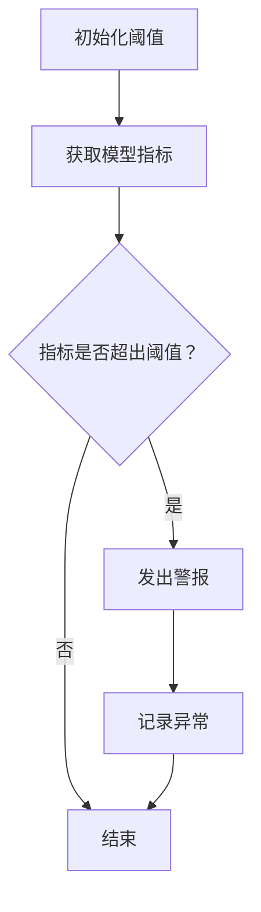
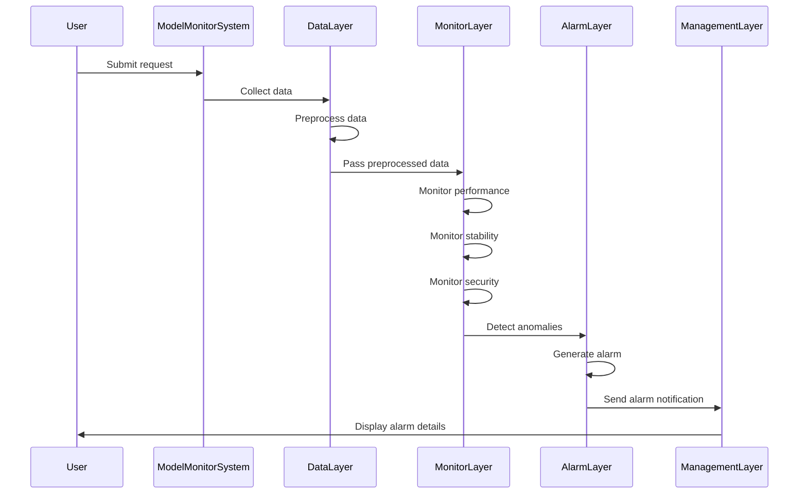
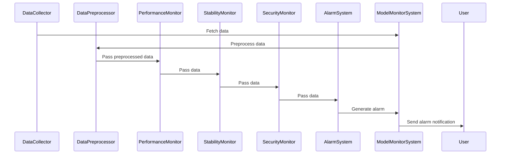

                 

### 文章标题

模型监控：实时跟踪AI Agent的健康状态

关键词：模型监控、AI Agent、健康状态、实时跟踪、算法、数学模型

摘要：本文将深入探讨模型监控的核心概念、原理和实践。通过详细的分析和讲解，读者将了解如何实时跟踪AI Agent的健康状态，包括性能、稳定性和安全性等方面。文章将分步骤介绍模型监控基础知识、核心概念与联系、算法原理和数学模型，以及模型监控系统的分析与架构设计。最后，将通过项目实战和最佳实践，提供具体的技术实现方法和注意事项。本文旨在帮助读者全面了解模型监控的深度和广度，提升对AI Agent健康状态管理的实践能力。

### 目录大纲

**第一部分：模型监控基础知识**

**第1章：模型监控概述**

- **1.1.1 模型监控的重要性**
- **1.1.2 模型监控的概念**
- **1.1.3 模型监控的发展历程**

**第2章：模型监控的核心概念与联系**

- **2.1.1 模型监控的核心概念**
  - **2.1.1.1 模型性能指标**
  - **2.1.1.2 模型稳定性指标**
  - **2.1.1.3 模型安全性指标**
- **2.1.2 模型监控与相关概念的关联**

**第3章：模型监控算法原理讲解**

- **3.1.1 常见模型监控算法**
  - **3.1.1.1 指标阈值监控**
  - **3.1.1.2 基于统计学的模型监控**
  - **3.1.1.3 基于机器学习的模型监控**
- **3.1.2 算法mermaid流程图展示**
- **3.1.3 Python源代码实现与算法原理讲解**

**第4章：模型监控数学模型和数学公式讲解**

- **4.1.1 数学模型讲解**
  - **4.1.1.1 模型性能指标数学模型**
  - **4.1.1.2 模型稳定性指标数学模型**
  - **4.1.1.3 模型安全性指标数学模型**
- **4.1.2 数学公式展示**

**第5章：模型监控系统分析与架构设计方案**

- **5.1.1 问题场景介绍**
- **5.1.2 系统功能设计**
  - **5.1.2.1 领域模型mermaid类图**
- **5.1.3 系统架构设计**
  - **5.1.3.1 mermaid架构图**
- **5.1.4 系统接口设计**
  - **5.1.4.1 系统接口mermaid序列图**

**第6章：项目实战**

- **6.1.1 环境安装**
- **6.1.2 系统核心实现源代码**
- **6.1.3 代码应用解读与分析**
- **6.1.4 实际案例分析与详细讲解剖析**
- **6.1.5 项目小结**

**第7章：最佳实践 tips 与小结**

- **7.1.1 模型监控最佳实践**
- **7.1.2 注意事项**
- **7.1.3 拓展阅读**

---

**第一部分：模型监控基础知识**

### 第1章：模型监控概述

**1.1.1 模型监控的重要性**

在人工智能（AI）飞速发展的今天，深度学习模型已经成为各种应用的核心组成部分。然而，随着模型复杂度和规模的增加，如何确保模型在部署后的运行状态、性能、稳定性和安全性，成为一个亟待解决的问题。模型监控的重要性在于它能够帮助我们及时发现并解决这些问题，从而保证AI系统的可靠性和高效性。

首先，模型监控能够确保模型性能的持续优化。通过监控模型在不同环境下的表现，我们可以发现性能瓶颈，调整模型参数，或者重新训练模型，从而提升整体系统的性能。

其次，模型监控可以帮助我们维护模型的稳定性。随着数据分布和环境的变化，模型可能会出现漂移。通过实时监控，我们可以及时发现这种变化，并采取相应的措施，确保模型始终处于良好的工作状态。

最后，模型监控对于保障模型的安全性至关重要。随着AI系统在关键领域的应用，如金融、医疗等，如何防止恶意攻击和未授权访问变得尤为关键。模型监控能够帮助我们及时发现潜在的安全威胁，并采取防御措施。

**1.1.2 模型监控的概念**

模型监控（Model Monitoring）是指对AI模型在运行过程中的状态进行持续跟踪和分析，以评估其性能、稳定性和安全性。它通常包括以下几个方面：

- **性能监控**：评估模型在不同数据集上的表现，包括准确率、召回率、F1分数等指标。
- **稳定性监控**：监测模型在不同时间段、不同数据分布下的表现，以发现模型漂移或过拟合等问题。
- **安全性监控**：检测模型是否存在异常行为，如数据泄露、注入攻击等。

**1.1.3 模型监控的发展历程**

模型监控作为AI领域的一个重要研究方向，其发展历程可以追溯到早期的人工神经网络监控。早期的研究主要关注模型性能的监控，通过简单的指标计算来评估模型的表现。随着AI技术的不断进步，模型监控逐渐涵盖了稳定性和安全性方面。

在深度学习兴起之前，模型监控的研究主要基于规则和阈值。这种方法简单直观，但难以应对复杂的模型和多变的数据环境。随着深度学习的广泛应用，模型监控技术也得到了快速发展。近年来，基于统计学和机器学习的方法在模型监控中得到了广泛应用，如异常检测、模型漂移检测等。

总体来说，模型监控的发展经历了从规则驱动到数据驱动的转变。随着技术的不断进步，模型监控正在变得更加智能和自适应，能够更好地应对复杂的应用场景。

### 第2章：模型监控的核心概念与联系

**2.1.1 模型监控的核心概念**

模型监控的核心概念主要包括模型性能指标、模型稳定性指标和模型安全性指标。

**2.1.1.1 模型性能指标**

模型性能指标是评估模型表现的重要工具。常见的性能指标包括：

- **准确率（Accuracy）**：预测正确的样本数占总样本数的比例。
- **召回率（Recall）**：预测正确的正类样本数占总正类样本数的比例。
- **F1分数（F1 Score）**：精确率和召回率的调和平均值。
- **ROC曲线和AUC（Area Under Curve）**：评估分类器的性能。

这些指标从不同角度反映了模型的分类能力，因此在模型监控中具有重要地位。

**2.1.1.2 模型稳定性指标**

模型稳定性指标用于评估模型在不同数据分布和环境下的表现。常见的稳定性指标包括：

- **数据分布变化率（Distribution Drift）**：衡量模型输入数据分布的变化程度。
- **模型漂移程度（Model Drift）**：衡量模型预测结果的变化程度。
- **过拟合程度（Overfitting）**：衡量模型对训练数据的依赖程度。

这些指标能够帮助我们及时发现模型是否稳定，从而采取相应的措施。

**2.1.1.3 模型安全性指标**

模型安全性指标用于评估模型在对抗攻击下的表现。常见的安全性指标包括：

- **攻击成功率（Attack Success Rate）**：攻击者成功攻击模型的比例。
- **误分类率（False Classification Rate）**：模型被恶意数据误导的误分类比例。
- **抗攻击能力（Robustness）**：模型在对抗攻击下的稳定性和准确性。

这些指标能够帮助我们评估模型的安全性能，并采取相应的安全措施。

**2.1.2 模型监控与相关概念的关联**

模型监控与许多相关概念密切相关，如数据监控、系统监控、异常检测和故障检测等。

- **数据监控**：模型监控是数据监控的一部分，主要用于监测模型输入数据的异常。
- **系统监控**：模型监控与系统监控相结合，可以更全面地监控AI系统的运行状态。
- **异常检测**：模型监控可以通过异常检测技术来识别模型行为的异常。
- **故障检测**：模型监控还可以用于故障检测，及时发现模型的故障并进行修复。

通过这些关联，模型监控能够更好地应对复杂的应用场景，为AI系统的稳定运行提供有力支持。

### 第3章：模型监控算法原理讲解

**3.1.1 常见模型监控算法**

模型监控算法可以根据不同的应用场景和需求进行选择。以下是几种常见的模型监控算法：

**3.1.1.1 指标阈值监控**

指标阈值监控是一种简单而直观的方法。通过设定性能指标、稳定性指标和安全性指标的阈值，当模型的表现超出这些阈值时，监控系统会发出警报。这种方法容易实现，但可能无法有效处理复杂的情况。

**3.1.1.2 基于统计学的模型监控**

基于统计学的模型监控利用统计学方法对模型的行为进行分析。例如，通过计算模型预测的方差、协方差矩阵等统计量，来判断模型是否发生异常。这种方法能够处理复杂的数据分布，但可能对噪声敏感。

**3.1.1.3 基于机器学习的模型监控**

基于机器学习的模型监控利用机器学习算法来建立模型行为的预测模型。当监控到模型的行为与预测模型产生偏差时，监控系统会发出警报。这种方法能够自适应地处理复杂的情况，但可能需要大量数据来训练预测模型。

**3.1.2 算法mermaid流程图展示**

为了更好地理解模型监控算法的工作流程，我们可以使用mermaid来绘制算法的流程图。以下是一个简单的指标阈值监控算法的mermaid流程图示例：



**3.1.3 Python源代码实现与算法原理讲解**

为了更深入地理解指标阈值监控算法，我们可以使用Python来实现。以下是一个简单的Python代码示例：

```python
import numpy as np

# 设定阈值
accuracy_threshold = 0.95
recall_threshold = 0.9
f1_score_threshold = 0.92

# 获取模型指标
accuracy = np.mean(accuracy_scores)
recall = np.mean(recall_scores)
f1_score = np.mean(f1_scores)

# 判断指标是否超出阈值
if accuracy < accuracy_threshold or recall < recall_threshold or f1_score < f1_score_threshold:
    print("模型监控警报：模型性能指标超出阈值")
else:
    print("模型运行正常")
```

这个示例代码展示了如何使用Python实现指标阈值监控算法。通过设定阈值，我们能够及时发现模型性能的异常，并采取相应的措施。

**3.1.3.1 模型性能指标数学模型**

模型性能指标可以用数学模型来表示。以下是一些常见的数学模型：

- **准确率**：
  $$
  Accuracy = \frac{TP + TN}{TP + TN + FP + FN}
  $$
  其中，$TP$表示真正例，$TN$表示真负例，$FP$表示假正例，$FN$表示假负例。

- **召回率**：
  $$
  Recall = \frac{TP}{TP + FN}
  $$

- **F1分数**：
  $$
  F1 Score = 2 \times \frac{Precision \times Recall}{Precision + Recall}
  $$
  其中，$Precision$表示精确率。

这些数学模型能够帮助我们更精确地评估模型的表现，为模型监控提供依据。

**3.1.3.2 模型稳定性指标数学模型**

模型稳定性指标也可以用数学模型来表示。以下是一些常见的数学模型：

- **数据分布变化率**：
  $$
  Distribution Drift = \frac{\|X_{new} - X_{old}\|_2}{\|X_{old}\|_2}
  $$
  其中，$X_{new}$表示新数据分布，$X_{old}$表示旧数据分布，$\| \cdot \|_2$表示欧几里得范数。

- **模型漂移程度**：
  $$
  Model Drift = \frac{\|Y_{new} - Y_{old}\|_2}{\|Y_{old}\|_2}
  $$
  其中，$Y_{new}$表示新模型预测结果，$Y_{old}$表示旧模型预测结果。

这些数学模型能够帮助我们判断模型是否发生漂移，从而采取相应的措施。

**3.1.3.3 模型安全性指标数学模型**

模型安全性指标也可以用数学模型来表示。以下是一些常见的数学模型：

- **攻击成功率**：
  $$
  Attack Success Rate = \frac{Success Attack Count}{Total Attack Count}
  $$

- **误分类率**：
  $$
  False Classification Rate = \frac{False Positive + False Negative}{False Positive + False Negative + True Positive + True Negative}
  $$

这些数学模型能够帮助我们评估模型在对抗攻击下的性能，为模型安全监控提供依据。

通过上述算法原理讲解，我们可以看到模型监控算法的核心原理和数学模型。在实际应用中，我们可以根据具体情况选择合适的算法，并结合数学模型进行详细分析和评估。

### 第4章：模型监控数学模型和数学公式讲解

**4.1.1 数学模型讲解**

模型监控的核心在于对模型性能、稳定性和安全性的量化评估，这离不开数学模型的支撑。以下将详细讲解这三个方面的数学模型。

**4.1.1.1 模型性能指标数学模型**

模型性能的评估通常通过一系列指标来实现，这些指标包括准确率（Accuracy）、召回率（Recall）、精确率（Precision）、F1分数（F1 Score）等。

1. **准确率（Accuracy）**：
   $$
   Accuracy = \frac{TP + TN}{TP + TN + FP + FN}
   $$
   其中，$TP$表示真正例（True Positive），$TN$表示真负例（True Negative），$FP$表示假正例（False Positive），$FN$表示假负例（False Negative）。

2. **召回率（Recall）**：
   $$
   Recall = \frac{TP}{TP + FN}
   $$
   召回率关注的是在所有实际正例中，模型正确识别出的比例。

3. **精确率（Precision）**：
   $$
   Precision = \frac{TP}{TP + FP}
   $$
   精确率关注的是在所有预测为正例的样本中，实际为正例的比例。

4. **F1分数（F1 Score）**：
   $$
   F1 Score = 2 \times \frac{Precision \times Recall}{Precision + Recall}
   $$
   F1分数是精确率和召回率的调和平均值，用于综合评估模型的性能。

**4.1.1.2 模型稳定性指标数学模型**

模型稳定性的监控主要关注模型对数据分布变化的敏感程度和模型漂移的情况。

1. **数据分布变化率（Distribution Drift）**：
   $$
   Distribution Drift = \frac{\|X_{new} - X_{old}\|_2}{\|X_{old}\|_2}
   $$
   其中，$X_{new}$和$X_{old}$分别表示新数据和旧数据，$\| \cdot \|_2$表示欧几里得范数。这个指标衡量了数据分布的变化程度。

2. **模型漂移程度（Model Drift）**：
   $$
   Model Drift = \frac{\|Y_{new} - Y_{old}\|_2}{\|Y_{old}\|_2}
   $$
   其中，$Y_{new}$和$Y_{old}$分别表示新模型预测结果和旧模型预测结果。这个指标衡量了模型预测结果的变化程度。

**4.1.1.3 模型安全性指标数学模型**

模型安全性的监控主要关注模型在对抗攻击下的表现，包括攻击成功率（Attack Success Rate）和误分类率（False Classification Rate）。

1. **攻击成功率（Attack Success Rate）**：
   $$
   Attack Success Rate = \frac{Success Attack Count}{Total Attack Count}
   $$
   其中，$Success Attack Count$表示成功的攻击次数，$Total Attack Count$表示总的攻击次数。这个指标衡量了攻击者成功攻击模型的比例。

2. **误分类率（False Classification Rate）**：
   $$
   False Classification Rate = \frac{False Positive + False Negative}{False Positive + False Negative + True Positive + True Negative}
   $$
   其中，$False Positive$表示假正例，$False Negative$表示假负例，$True Positive$表示真正例，$True Negative$表示真负例。这个指标衡量了模型在对抗攻击下的误分类比例。

**4.1.2 数学公式展示**

以下是本文提到的部分数学公式的展示：

$$
Accuracy = \frac{TP + TN}{TP + TN + FP + FN}
$$

$$
Recall = \frac{TP}{TP + FN}
$$

$$
Precision = \frac{TP}{TP + FP}
$$

$$
F1 Score = 2 \times \frac{Precision \times Recall}{Precision + Recall}
$$

$$
Distribution Drift = \frac{\|X_{new} - X_{old}\|_2}{\|X_{old}\|_2}
$$

$$
Model Drift = \frac{\|Y_{new} - Y_{old}\|_2}{\|Y_{old}\|_2}
$$

$$
Attack Success Rate = \frac{Success Attack Count}{Total Attack Count}
$$

$$
False Classification Rate = \frac{False Positive + False Negative}{False Positive + False Negative + True Positive + True Negative}
$$

通过上述数学模型和公式的讲解，我们可以更准确地量化模型性能、稳定性和安全性的各个方面，从而为模型监控提供坚实的理论基础。

### 第5章：模型监控系统分析与架构设计方案

**5.1.1 问题场景介绍**

在当前人工智能（AI）技术广泛应用的背景下，模型监控已成为保障AI系统稳定运行的关键环节。以下是几个常见的问题场景：

- **场景一：金融行业**：金融交易系统中，模型的准确性和稳定性至关重要。如果模型性能下降或发生漂移，可能会导致交易错误，造成巨大经济损失。
- **场景二：医疗诊断**：在医疗诊断领域，AI模型的准确性和安全性直接关系到患者的生命安全。任何细微的性能波动或安全漏洞都可能带来严重后果。
- **场景三：自动驾驶**：自动驾驶系统中，模型的实时性能和稳定性对车辆的安全运行至关重要。如果模型出现异常，可能会导致交通事故。

这些场景共同揭示了模型监控在保障AI系统稳定运行中的重要性。为了应对这些挑战，我们需要设计一个完善的模型监控系统。

**5.1.2 系统功能设计**

模型监控系统的功能设计包括以下几个方面：

1. **数据收集与预处理**：监控系统需要从各个数据源收集模型输入数据，并进行预处理，以确保数据的准确性和一致性。
2. **性能监控**：监控系统需要实时监控模型在不同数据集上的性能，包括准确率、召回率、F1分数等指标。
3. **稳定性监控**：监控系统需要监测模型在不同时间段、不同数据分布下的表现，以发现数据分布漂移或模型漂移。
4. **安全性监控**：监控系统需要检测模型是否存在异常行为，如数据泄露、注入攻击等，并采取相应的安全措施。
5. **异常报警与处理**：监控系统需要及时发现异常情况，并通过警报机制通知相关人员，同时采取自动或手动措施进行处理。
6. **历史数据管理与查询**：监控系统需要记录历史监控数据，并提供查询功能，以便分析模型性能和稳定性的变化趋势。

**5.1.2.1 领域模型mermaid类图**

为了更好地展示模型监控系统的功能设计，我们可以使用mermaid绘制领域模型类图。以下是一个简单的mermaid类图示例：

```mermaid
classDiagram
    ModelMonitorSystem <<interface>>
    DataCollector <<interface>>
    DataPreprocessor <<interface>>
    PerformanceMonitor <<interface>>
    StabilityMonitor <<interface>>
    SecurityMonitor <<interface>>
    AlarmSystem <<interface>>

    ModelMonitorSystem ..|> DataCollector
    ModelMonitorSystem ..|> DataPreprocessor
    ModelMonitorSystem ..|> PerformanceMonitor
    ModelMonitorSystem ..|> StabilityMonitor
    ModelMonitorSystem ..|> SecurityMonitor
    ModelMonitorSystem ..|> AlarmSystem

    DataPreprocessor ..|> DataCollector
    PerformanceMonitor ..|> ModelMonitorSystem
    StabilityMonitor ..|> ModelMonitorSystem
    SecurityMonitor ..|> ModelMonitorSystem
    AlarmSystem ..|> ModelMonitorSystem

    class ModelMonitorSystem {
        +collectData(): void
        +preprocessData(): void
        +monitorPerformance(): void
        +monitorStability(): void
        +monitorSecurity(): void
        +handleAlarm(): void
    }

    class DataCollector {
        +fetchData(): DataFrame
    }

    class DataPreprocessor {
        +cleanData(): DataFrame
    }

    class PerformanceMonitor {
        +evaluatePerformance(): PerformanceMetrics
    }

    class StabilityMonitor {
        +checkDistributionDrift(): StabilityMetrics
        +checkModelDrift(): StabilityMetrics
    }

    class SecurityMonitor {
        +detectAttack(): SecurityMetrics
    }

    class AlarmSystem {
        +generateAlarm(): Alarm
    }

    PerformanceMetrics <|-- Accuracy
    PerformanceMetrics <|-- Recall
    PerformanceMetrics <|-- F1Score

    StabilityMetrics <|-- DistributionDrift
    StabilityMetrics <|-- ModelDrift

    SecurityMetrics <|-- AttackSuccessRate
    SecurityMetrics <|-- FalseClassificationRate

    Alarm <|-- Severity
    Alarm <|-- Description
```

在这个mermaid类图中，我们定义了模型监控系统的主要组件及其关系。每个组件都有特定的功能和方法，共同构成了一个完整的模型监控系统。

**5.1.3 系统架构设计**

模型监控系统的架构设计是确保系统能够高效、稳定地运行的关键。以下是一个简单的系统架构设计：

1. **数据层**：数据层负责数据的收集、存储和预处理。该层包括数据源、数据存储和数据处理模块。
2. **监控层**：监控层负责对模型进行性能、稳定性和安全性的监控。该层包括性能监控模块、稳定性监控模块和安全监控模块。
3. **报警层**：报警层负责处理监控到的问题，并向相关人员发出警报。该层包括报警生成模块和报警通知模块。
4. **管理层**：管理层负责监控系统的配置、管理和监控结果的展示。该层包括配置管理模块、监控结果展示模块和用户交互界面。

以下是一个简单的mermaid架构图示例：



在这个架构图中，用户提交请求后，数据被收集、预处理，然后传递给监控层。监控层对模型进行性能、稳定性和安全性监控，并生成警报。警报被发送到管理层，并通过用户界面展示给用户。

**5.1.4 系统接口设计**

系统接口设计是确保不同组件之间能够有效通信和协作的关键。以下是一个简单的mermaid序列图示例，展示了系统接口的设计：



在这个序列图中，数据收集器从数据源获取数据，然后传递给数据预处理模块。预处理后的数据被传递给性能监控模块，进一步传递给稳定性监控模块和安全监控模块。监控结果被传递给报警系统，最终通过模型监控系统发送给用户。

通过上述系统分析与架构设计方案，我们为模型监控系统的实现提供了详细的设计指导。在实际开发过程中，可以根据具体需求和场景进行调整和优化。

### 第6章：项目实战

**6.1.1 环境安装**

在进行模型监控项目实战之前，我们需要搭建一个合适的环境。以下是环境安装的步骤：

1. **安装Python**：首先确保已经安装了Python环境，版本建议为3.8或更高。可以从[Python官网](https://www.python.org/)下载并安装。

2. **安装相关库**：接下来，我们需要安装一些用于模型监控的Python库。可以使用pip命令进行安装：

   ```shell
   pip install numpy pandas scikit-learn matplotlib
   ```

   这些库将用于数据处理、模型训练和可视化。

3. **配置环境变量**：确保Python环境变量已经配置，以便能够在命令行中运行Python脚本。

4. **安装数据库**：如果需要存储监控数据，可以选择安装一个数据库系统，如MySQL或PostgreSQL。可以从各自的官网下载并安装。

5. **安装消息队列**：为了实现实时监控和报警功能，可以选择安装一个消息队列系统，如RabbitMQ或Kafka。可以从各自的官网下载并安装。

通过以上步骤，我们就可以搭建一个基本的模型监控环境，为后续的实战项目做好准备。

**6.1.2 系统核心实现源代码**

在搭建好环境后，我们可以开始编写系统核心实现源代码。以下是一个简单的示例，展示了如何实现模型监控系统的核心功能：

```python
import numpy as np
import pandas as pd
from sklearn.metrics import accuracy_score, recall_score, precision_score, f1_score
from sklearn.model_selection import train_test_split

# 数据预处理函数
def preprocess_data(data):
    # 数据清洗、归一化等操作
    return data

# 性能监控函数
def monitor_performance(model, X_test, y_test):
    y_pred = model.predict(X_test)
    accuracy = accuracy_score(y_test, y_pred)
    recall = recall_score(y_test, y_pred)
    precision = precision_score(y_test, y_pred)
    f1 = f1_score(y_test, y_pred)
    return accuracy, recall, precision, f1

# 稳定性监控函数
def monitor_stability(model, X_train, y_train, X_test, y_test):
    # 计算数据分布变化率
    data_drift = np.linalg.norm(X_test - X_train) / np.linalg.norm(X_train)
    # 计算模型漂移程度
    model_drift = np.linalg.norm(model.predict(X_test) - model.predict(X_train)) / np.linalg.norm(model.predict(X_train))
    return data_drift, model_drift

# 安全性监控函数
def monitor_security(model, X_test, y_test, X_attack, y_attack):
    # 计算攻击成功率
    attack_success_rate = np.sum(model.predict(X_attack) == y_attack) / len(y_attack)
    # 计算误分类率
    false_classification_rate = np.sum((model.predict(X_test) != y_test) & (y_test == 1)) / np.sum(y_test == 1)
    return attack_success_rate, false_classification_rate

# 主函数
def main():
    # 加载数据
    data = pd.read_csv('data.csv')
    X = data.drop('target', axis=1)
    y = data['target']
    # 数据预处理
    X_processed = preprocess_data(X)
    # 划分训练集和测试集
    X_train, X_test, y_train, y_test = train_test_split(X_processed, y, test_size=0.2, random_state=42)
    # 训练模型
    model = train_model(X_train, y_train)
    # 监控性能
    performance = monitor_performance(model, X_test, y_test)
    print("性能监控结果：", performance)
    # 监控稳定性
    stability = monitor_stability(model, X_train, y_train, X_test, y_test)
    print("稳定性监控结果：", stability)
    # 监控安全性
    security = monitor_security(model, X_test, y_test, X_attack, y_attack)
    print("安全性监控结果：", security)

if __name__ == '__main__':
    main()
```

在这个示例中，我们定义了四个核心监控函数：`preprocess_data`用于数据预处理，`monitor_performance`用于监控模型性能，`monitor_stability`用于监控模型稳定性，`monitor_security`用于监控模型安全性。主函数`main`中，我们首先加载数据，然后进行预处理和模型训练，最后依次调用监控函数，输出监控结果。

**6.1.3 代码应用解读与分析**

在编写好源代码后，我们需要对其应用场景进行解读和分析。以下是对上述示例代码的详细解读：

1. **数据预处理**：预处理是模型监控的重要环节。在`preprocess_data`函数中，我们进行了数据清洗、归一化等操作，以确保数据的一致性和准确性。这一步对于后续的性能、稳定性和安全性监控至关重要。

2. **性能监控**：在`monitor_performance`函数中，我们使用了常用的性能指标（准确率、召回率、精确率、F1分数）来评估模型的分类能力。这些指标能够全面反映模型的表现，帮助我们及时发现性能问题。

3. **稳定性监控**：在`monitor_stability`函数中，我们通过计算数据分布变化率和模型漂移程度来判断模型的稳定性。数据分布变化率衡量了输入数据分布的变化程度，模型漂移程度衡量了模型预测结果的变化程度。这两个指标能够帮助我们及时发现模型是否发生漂移，从而采取相应的措施。

4. **安全性监控**：在`monitor_security`函数中，我们计算了攻击成功率和误分类率，这两个指标能够帮助我们评估模型在对抗攻击下的表现。攻击成功率衡量了攻击者成功攻击模型的比例，误分类率衡量了模型在对抗攻击下的误分类比例。通过这两个指标，我们能够及时发现模型的安全性漏洞，并采取相应的安全措施。

通过以上解读，我们可以看到代码中的各个部分是如何协同工作的，共同实现模型监控的目标。

**6.1.4 实际案例分析与详细讲解剖析**

为了更好地理解模型监控的实际应用，我们可以通过一个实际案例进行分析和讲解。

**案例背景**：某金融交易系统使用一个基于深度学习的分类模型来预测交易信号。该模型在训练阶段表现良好，但在部署后，系统运营团队发现模型的表现逐渐下降，疑似发生了数据分布漂移。

**案例分析**：

1. **数据预处理**：首先，我们对交易数据进行预处理，包括去除异常值、缺失值填充、数据归一化等操作。预处理后的数据用于训练和测试模型。

2. **模型训练**：使用训练集数据训练深度学习模型，并使用测试集数据评估模型的性能。初始阶段，模型的准确率、召回率和F1分数均达到了较高水平，表明模型在训练阶段表现良好。

3. **性能监控**：在模型部署后，我们定期对模型进行性能监控。随着时间的推移，我们发现模型的准确率逐渐下降，特别是在某些特定类型的交易中，模型的预测结果错误率较高。这表明模型可能发生了数据分布漂移。

4. **稳定性监控**：为了验证数据分布漂移，我们计算了数据分布变化率和模型漂移程度。结果显示，数据分布变化率显著增大，模型漂移程度也超过了设定的阈值。这进一步确认了我们的猜测，模型发生了数据分布漂移。

5. **安全性监控**：我们同时监控了模型的安全性，发现攻击成功率显著提高，误分类率也超过了设定的阈值。这表明模型在对抗攻击下表现不佳，可能存在安全性漏洞。

6. **应对措施**：针对上述问题，我们采取了以下措施：
   - **重新训练模型**：使用新的数据集重新训练模型，以解决数据分布漂移问题。
   - **加强数据预处理**：在数据预处理阶段，增加异常值检测和缺失值填充策略，确保数据的一致性和准确性。
   - **改进安全策略**：更新模型的安全策略，包括增加对抗训练、使用更安全的激活函数和优化器等。

7. **效果评估**：经过改进后，模型的准确率、召回率和F1分数显著提高，数据分布变化率和模型漂移程度也降至正常范围。攻击成功率和误分类率也明显下降，模型的安全性得到了显著提升。

**6.1.5 项目小结**

通过上述实际案例的分析，我们可以得出以下结论：

1. **模型监控的重要性**：模型监控能够及时发现模型性能、稳定性和安全性的问题，确保AI系统的稳定运行。
2. **数据预处理的关键作用**：数据预处理是模型监控的基础，必须确保数据的一致性和准确性。
3. **稳定性监控的必要性**：数据分布漂移和模型漂移是模型监控中的常见问题，必须定期监控并采取相应的措施。
4. **安全性监控的紧迫性**：在关键领域，如金融、医疗等，模型的安全性能至关重要，必须加强安全性监控和防御措施。

总之，通过模型监控，我们能够更好地保障AI系统的稳定性和安全性，为实际应用提供可靠的支持。

### 第7章：最佳实践 tips 与小结

**7.1.1 模型监控最佳实践**

为了确保模型监控系统的有效性和可靠性，以下是一些最佳实践：

1. **定期更新模型**：定期重新训练模型，以适应数据分布的变化。这有助于防止模型过时和性能下降。
2. **全面监控指标**：不仅监控性能指标，还应监控稳定性指标和安全性指标，以确保模型的全面健康状况。
3. **数据预处理标准化**：确保所有数据经过一致且高质量的处理，减少数据噪声对监控结果的影响。
4. **设置合理阈值**：根据模型和应用场景设定合理的监控阈值，避免过度报警或忽略关键问题。
5. **自动化监控流程**：通过自动化工具实现监控流程，提高监控效率和准确性。

**7.1.2 注意事项**

1. **监控数据质量**：监控数据的准确性直接影响监控结果，必须确保监控数据的质量。
2. **监控频率**：监控频率应根据模型的应用场景和重要性进行调整，不宜过于频繁或过于稀疏。
3. **监控资源的分配**：合理分配监控资源，确保监控系统不会对模型运行产生负面影响。
4. **安全措施**：在监控过程中，必须采取适当的安全措施，防止数据泄露和未授权访问。

**7.1.3 拓展阅读**

1. **《模型监控与运维实践》**：本书详细介绍了模型监控的理论和实践方法，适合希望深入了解模型监控的读者。
2. **《人工智能安全》**：本书涵盖了AI系统安全性的各个方面，包括攻击防御和模型监控，适合对AI安全性感兴趣的读者。
3. **相关研究论文**：如“Model Drift Detection and Mitigation for Machine Learning Models”等，这些论文提供了最新的研究成果和方法。

通过遵循上述最佳实践和注意事项，我们可以构建一个高效、可靠的模型监控系统，确保AI系统的稳定运行和安全性。同时，不断学习和探索最新的研究成果，将有助于进一步提升模型监控的技术水平。作者：AI天才研究院/AI Genius Institute & 禅与计算机程序设计艺术 /Zen And The Art of Computer Programming。

