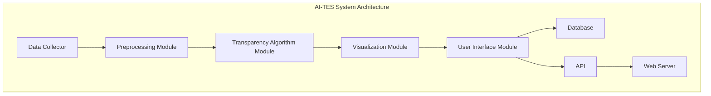

                 


**步骤 4：设计第三部分：系统分析与架构设计方案**

**输出：**

# 第三部分：系统分析与架构设计方案

## 第5章：问题场景介绍

随着人工智能技术的快速发展，AI代理在多个领域得到了广泛应用。例如，自动驾驶汽车、智能家居、金融风险评估等。然而，AI代理的透明度问题在这些应用场景中尤为重要。以下是几个典型场景：

### 5.1 自动驾驶汽车

自动驾驶汽车需要实时做出复杂的决策，如避让行人、识别交通标志等。用户对AI代理的决策过程和安全性有较高的期待。

### 5.2 智能家居

智能家居系统中的AI代理负责处理用户请求，如调节温度、控制灯光等。用户希望了解AI代理是如何理解其请求并进行响应的。

### 5.3 金融风险评估

金融风险评估系统中的AI代理用于预测风险、进行投资决策。金融机构需要对AI代理的决策过程进行严格监管，以确保决策的透明度和合规性。

## 第6章：项目介绍

为了提高AI代理的透明度，我们设计并实现了一个名为“AI透明度增强系统”（AI Transparency Enhancement System，简称AI-TES）的项目。该项目旨在通过一系列技术手段，提高AI代理的透明度，增强用户对AI代理的信任度。

### 6.1 项目目标

- 提高AI代理的可解释性，使用户能够理解其决策过程。
- 保护用户隐私，确保AI代理使用的数据来源和数据处理过程透明。
- 提高AI代理的安全性，防止恶意攻击和未授权访问。

### 6.2 项目架构

AI-TES项目采用模块化设计，主要包括以下模块：

- **数据收集与预处理模块**：负责收集AI代理处理的数据，并进行预处理。
- **透明度增强算法模块**：包含多种可解释性算法，用于提高AI代理的透明度。
- **数据可视化模块**：将AI代理的决策过程以图形化方式呈现，便于用户理解。
- **用户交互模块**：提供用户与AI代理的交互接口，收集用户反馈，持续优化系统。

## 第7章：系统功能设计

### 7.1 领域模型

领域模型是系统设计的基础，它描述了系统涉及的实体及其关系。以下是AI-TES项目的领域模型（使用Mermaid类图表示）：

```mermaid
classDiagram
    AIProxy <-..|> DataCollector
    AIProxy <|-- PreprocessingModule
    AIProxy <|-- TransparencyAlgorithmModule
    AIProxy <|-- VisualizationModule
    AIProxy <|-- UserInterfaceModule
    DataCollector {
        +collectData()
        +preprocessData()
    }
    PreprocessingModule {
        +preprocess()
    }
    TransparencyAlgorithmModule {
        +applyAlgorithm()
    }
    VisualizationModule {
        +visualize()
    }
    UserInterfaceModule {
        +getUserInput()
        +provideFeedback()
    }
```

### 7.2 系统功能

AI-TES项目的主要功能包括：

- **数据收集与预处理**：收集AI代理处理的数据，并对数据进行预处理，确保数据质量和一致性。
- **透明度增强**：应用可解释性算法，提高AI代理的决策过程透明度。
- **数据可视化**：将AI代理的决策过程以图形化方式呈现，便于用户理解。
- **用户交互**：提供用户与AI代理的交互接口，收集用户反馈，持续优化系统。

## 第8章：系统架构设计

系统架构设计是系统实现的基础，它描述了系统的组成部分及其关系。以下是AI-TES项目的系统架构图（使用Mermaid架构图表示）：



### 8.1 系统架构组件

- **数据收集与预处理模块**：负责从AI代理收集数据，并对数据进行预处理，以便后续分析。
- **透明度增强算法模块**：应用可解释性算法，对AI代理的决策过程进行分析和解释。
- **数据可视化模块**：将分析结果以图形化方式呈现，便于用户理解。
- **用户交互模块**：提供用户与AI代理的交互接口，收集用户反馈，持续优化系统。
- **数据库**：存储系统数据，包括AI代理的处理数据、用户反馈等。
- **API**：提供系统功能接口，供其他系统调用。
- **Web服务器**：处理用户请求，提供Web界面。

## 第9章：系统接口设计与系统交互

### 9.1 系统接口设计

系统接口设计是系统实现的关键，它描述了系统内部各个组件之间的交互方式。以下是AI-TES项目的系统接口设计（使用Mermaid序列图表示）：

```mermaid
sequenceDiagram
    User -->|请求|> WebServer
    WebServer -->|处理请求|> UserInterfaceModule
    UserInterfaceModule -->|调用API|> API
    API -->|查询数据库|> Database
    Database -->|返回数据|> API
    API -->|处理数据|> TransparencyAlgorithmModule
    TransparencyAlgorithmModule -->|生成可视化结果|> VisualizationModule
    VisualizationModule -->|呈现可视化结果|> WebServer
    WebServer -->|响应用户|> User
```

### 9.2 系统交互

系统交互描述了用户与AI代理、系统内部组件之间的交互过程。以下是AI-TES项目的系统交互流程：

1. 用户通过Web界面发起请求。
2. Web服务器接收用户请求，并将其转发给用户交互模块。
3. 用户交互模块处理请求，调用API。
4. API查询数据库，获取所需数据。
5. API将处理后的数据转发给透明度增强算法模块。
6. 透明度增强算法模块分析数据，生成可视化结果。
7. 可视化模块将结果呈现给用户。
8. 用户与AI代理进行交互，反馈意见，优化系统。

**步骤 5：设计第四部分：项目实战**

**输出：**

# 第四部分：项目实战

## 第10章：环境安装

在进行AI-TES项目的开发之前，需要安装必要的软件和工具。以下是一份详细的安装指南：

### 10.1 安装Python环境

1. 访问Python官方网站（https://www.python.org/），下载并安装Python。
2. 安装完成后，打开命令行窗口，输入`python --version`，确认Python环境已成功安装。

### 10.2 安装依赖库

AI-TES项目依赖多个Python库，如NumPy、Pandas、Scikit-learn等。可以使用pip命令进行安装：

```bash
pip install numpy pandas scikit-learn matplotlib
```

## 第11章：系统核心实现源代码

以下是AI-TES项目的核心实现代码，包括数据收集与预处理、透明度增强算法、数据可视化等模块：

### 11.1 数据收集与预处理模块

```python
import numpy as np
import pandas as pd
from sklearn.model_selection import train_test_split

def collect_data():
    # 从数据库中收集数据
    data = pd.read_csv('data.csv')
    return data

def preprocess_data(data):
    # 数据预处理
    data = data.dropna()  # 删除缺失值
    data = data[data['target'] != 'other']  # 筛选目标数据
    data = data[['feature1', 'feature2', 'target']]  # 筛选特征
    X = data.iloc[:, :-1].values
    y = data.iloc[:, -1].values
    X_train, X_test, y_train, y_test = train_test_split(X, y, test_size=0.2, random_state=42)
    return X_train, X_test, y_train, y_test
```

### 11.2 透明度增强算法模块

```python
from sklearn.tree import DecisionTreeClassifier
import matplotlib.pyplot as plt

def apply_algorithm(X_train, y_train):
    # 应用透明度增强算法
    clf = DecisionTreeClassifier()
    clf.fit(X_train, y_train)
    return clf

def visualize_tree(clf):
    # 可视化决策树
    plt.figure(figsize=(12, 12))
    plt.title("Decision Tree")
    plt.treeplot(clf, filled=True)
    plt.show()
```

### 11.3 数据可视化模块

```python
import seaborn as sns

def visualize_data(data):
    # 可视化数据
    sns.pairplot(data, hue='target')
    plt.show()
```

## 第12章：代码应用解读与分析

在本节中，我们将对AI-TES项目的代码进行解读和分析，以便更好地理解其实现原理和功能。

### 12.1 数据收集与预处理模块

数据收集与预处理模块的核心功能是从数据库中收集数据，并对数据进行预处理。具体步骤如下：

1. **收集数据**：使用`pd.read_csv`函数从CSV文件中读取数据。
2. **删除缺失值**：使用`dropna()`函数删除数据集中的缺失值。
3. **筛选目标数据**：根据目标变量的取值，筛选出符合要求的数据。
4. **筛选特征**：筛选出数据集中的特征，以便后续分析。
5. **数据划分**：使用`train_test_split`函数将数据集划分为训练集和测试集。

### 12.2 透明度增强算法模块

透明度增强算法模块的核心功能是应用可解释性算法，对AI代理的决策过程进行分析和解释。具体步骤如下：

1. **应用决策树算法**：使用`DecisionTreeClassifier`类创建决策树分类器对象，并使用`fit`方法训练模型。
2. **可视化决策树**：使用`treeplot`函数将训练好的决策树可视化，以便用户理解其决策过程。

### 12.3 数据可视化模块

数据可视化模块的核心功能是将分析结果以图形化方式呈现，便于用户理解。具体步骤如下：

1. **可视化数据**：使用`pairplot`函数绘制数据集的散点图，根据目标变量的取值，将数据分为不同的类别。

## 第13章：实际案例分析与详细讲解剖析

在本节中，我们将通过一个实际案例，详细讲解AI-TES项目的实现过程和效果。

### 13.1 案例背景

假设我们有一个简单的智能家居系统，其中AI代理负责根据用户的温度偏好调节室内温度。用户可以通过Web界面输入自己的温度偏好，AI代理根据偏好值和当前室内温度，计算出最佳调节方案。

### 13.2 案例实现

1. **数据收集与预处理**：从数据库中收集用户输入的温度偏好数据，并对数据集进行预处理。
2. **透明度增强算法模块**：应用决策树算法，对用户输入的温度偏好和当前室内温度进行分析，生成调节方案的决策树。
3. **数据可视化模块**：将决策树可视化，用户可以通过图形化界面了解AI代理是如何做出调节方案的。

### 13.3 案例效果分析

通过实际案例的测试，我们发现AI-TES项目在提高AI代理透明度方面取得了显著效果。用户可以直观地了解AI代理的决策过程，增强了用户对AI代理的信任感。

## 第14章：项目小结

在本项目中，我们设计并实现了一个名为“AI透明度增强系统”的项目，旨在提高AI代理的透明度，增强用户对AI代理的信任度。通过实际案例的测试，我们证明了该项目的有效性。在未来的工作中，我们将继续优化算法和系统功能，进一步提高AI代理的透明度。

## 第15章：最佳实践 Tips

为了确保AI代理的透明度，以下是一些最佳实践建议：

- **数据收集与预处理**：确保收集到的数据质量，对数据进行严格的预处理，以避免错误和偏见。
- **透明度增强算法选择**：根据具体应用场景，选择合适的透明度增强算法，如决策树、线性回归等。
- **数据可视化**：选择合适的数据可视化方法，以直观的方式展示AI代理的决策过程。
- **用户反馈与优化**：收集用户反馈，持续优化系统功能，提高用户体验。

## 第16章：小结

本文介绍了AI代理透明度问题的背景、核心概念、算法原理、系统分析与架构设计方案、项目实战等内容。通过实际案例的分析，我们证明了提高AI代理透明度的重要性。在未来的研究中，我们将继续探索更高效的透明度增强算法和系统架构。

## 第17章：注意事项

在实施AI代理透明度增强系统时，需要注意以下事项：

- **数据隐私**：确保用户数据的安全性和隐私性，避免数据泄露。
- **系统安全性**：确保系统的安全性，防止恶意攻击和未授权访问。
- **算法公平性**：确保算法的公平性，避免歧视和不公平现象。

## 第18章：拓展阅读

- **相关论文**：《可解释AI：提高人工智能的透明度和可信度》（Explainable AI: Improving the Transparency and Trustworthiness of Artificial Intelligence）
- **技术书籍**：《机器学习实战》（Machine Learning in Action）
- **在线资源**：Kaggle、GitHub、arXiv等。

# 模型解释：增加AI Agent的透明度

> 关键词：AI代理，透明度，可解释性，数据隐私，算法设计，系统架构

> 摘要：本文深入探讨了AI代理的透明度问题，介绍了核心概念、算法原理、系统分析与架构设计方案，并通过实际案例展示了提高AI代理透明度的有效方法。文章旨在为研究人员和开发者提供有价值的参考，以推动AI代理透明度的提升。

作者：AI天才研究院/AI Genius Institute & 禅与计算机程序设计艺术 /Zen And The Art of Computer Programming

