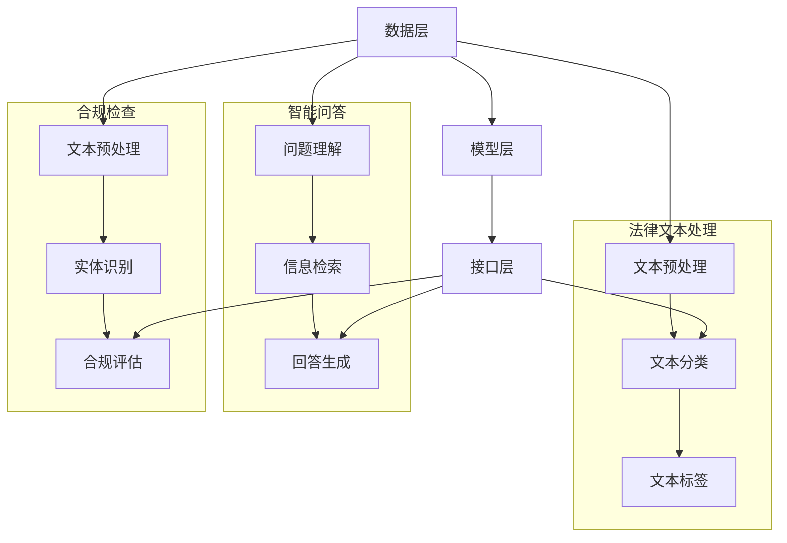
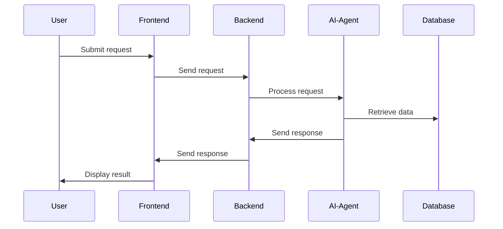

                 

### 文章标题：法律顾问 AI Agent：LLM 在法律咨询与合规检查中的应用

#### 关键词：法律顾问 AI、语言模型、合规检查、智能问答、AI 咨询系统

> 摘要：本文将深入探讨法律顾问 AI Agent 的应用场景，特别是如何利用大型语言模型（LLM）在法律咨询与合规检查中发挥作用。我们将逐步分析 LLM 的基本原理、核心组件、以及其在法律文本处理、智能问答和合规检查中的具体应用，并通过实例讲解展示其工作原理和效果。最后，我们将讨论法律顾问 AI Agent 的系统架构设计，并提供实际项目的实现细节和案例分析。通过这篇文章，读者将全面了解法律顾问 AI Agent 在法律领域的潜力及其实现过程。

---

### 第一部分：背景介绍

#### 第1章：法律顾问 AI Agent 的兴起

#### 1.1 法律咨询的需求与挑战

##### 1.1.1 法律咨询的现状

##### 1.1.2 法律咨询的需求分析

##### 1.1.3 法律咨询的挑战

#### 1.2 AI 在法律领域的应用背景

##### 1.2.1 AI 技术的发展历程

##### 1.2.2 AI 在法律领域的应用现状

##### 1.2.3 AI 在法律领域的潜力

#### 1.3 AI Agent 在法律咨询中的应用前景

##### 1.3.1 AI Agent 的定义

##### 1.3.2 AI Agent 在法律咨询中的优势

##### 1.3.3 AI Agent 的应用领域

#### 1.4 法律顾问 AI Agent 的边界与外延

##### 1.4.1 法律顾问 AI Agent 的定义

##### 1.4.2 法律顾问 AI Agent 的边界

##### 1.4.3 法律顾问 AI Agent 的外延

#### 1.5 本章小结

---

### 第二部分：核心概念与联系

#### 第2章：LLM 基础知识

##### 2.1 LLM 的定义与特点

###### 2.1.1 LLM 的定义

###### 2.1.2 LLM 的特点

###### 2.1.3 LLM 与传统 NLP 的区别

##### 2.2 LLM 的核心组件

###### 2.2.1 Transformer 网络架构

###### 2.2.2 自适应注意力机制

###### 2.2.3 语言模型训练过程

##### 2.3 LLM 的属性特征对比表格

###### 2.3.1 LLM 的性能对比

###### 2.3.2 LLM 的应用场景对比

##### 2.4 LLM 的应用案例

###### 2.4.1 法律文本分析

###### 2.4.2 合规检查

###### 2.4.3 智能问答

##### 2.5 ER 实体关系图架构

###### 2.5.1 法律文本中的实体识别

###### 2.5.2 实体关系建模

###### 2.5.3 实体关系图的应用

#### 2.6 本章小结

---

### 第三部分：算法原理讲解

#### 第3章：LLM 在法律咨询中的应用

##### 3.1 法律文本处理

###### 3.1.1 法律文本的预处理

###### 3.1.2 法律文本的分类与标签

###### 3.1.3 法律文本的情感分析

##### 3.2 智能问答系统

###### 3.2.1 问答系统的基本原理

###### 3.2.2 基于LLM的问答系统设计

###### 3.2.3 问答系统的优化策略

##### 3.3 合规检查

###### 3.3.1 合规检查的基本原理

###### 3.3.2 基于LLM的合规检查流程

###### 3.3.3 合规检查的性能评估

##### 3.4 数学模型与公式讲解

###### 3.4.1 语言模型的数学模型

###### 3.4.2 优化目标与损失函数

###### 3.4.3 数学公式的推导与应用

##### 3.5 举例说明

###### 3.5.1 法律文本分类举例

###### 3.5.2 智能问答举例

###### 3.5.3 合规检查举例

#### 3.6 本章小结

---

### 第四部分：系统设计与实现

#### 第4章：法律顾问 AI Agent 的系统架构设计

##### 4.1 问题场景介绍

###### 4.1.1 法律咨询的场景需求

###### 4.1.2 合规检查的场景需求

##### 4.2 系统功能设计

###### 4.2.1 法律文本处理模块

###### 4.2.2 智能问答模块

###### 4.2.3 合规检查模块

##### 4.3 系统架构设计

###### 4.3.1 系统架构的组成部分

###### 4.3.2 系统架构的设计原则

###### 4.3.3 系统架构的 Mermaid 架构图

##### 4.4 系统接口设计

###### 4.4.1 系统接口的功能说明

###### 4.4.2 系统接口的设计原则

###### 4.4.3 系统接口的 Mermaid 序列图

#### 4.5 本章小结

---

### 第五部分：项目实战

#### 第5章：法律顾问 AI Agent 的项目实现

##### 5.1 环境安装

###### 5.1.1 环境要求

###### 5.1.2 环境搭建步骤

##### 5.2 系统核心实现源代码

###### 5.2.1 源代码结构

###### 5.2.2 代码功能解读

##### 5.3 代码应用解读与分析

###### 5.3.1 应用实例分析

###### 5.3.2 代码优缺点分析

##### 5.4 实际案例分析

###### 5.4.1 案例背景介绍

###### 5.4.2 案例分析与实现

##### 5.5 项目小结

#### 5.6 最佳实践 tips

#### 5.7 小结

#### 5.8 注意事项

#### 5.9 拓展阅读

---

### 作者信息

- 作者：AI天才研究院/AI Genius Institute & 禅与计算机程序设计艺术 /Zen And The Art of Computer Programming

---

## 第一部分：背景介绍

### 第1章：法律顾问 AI Agent 的兴起

在当前社会，法律咨询与合规检查是企业和个人日常生活中不可或缺的部分。随着人工智能技术的飞速发展，AI 在法律领域的应用逐渐成为一个热门话题。法律顾问 AI Agent 作为 AI 在法律领域的具体应用，正日益受到关注。

#### 1.1 法律咨询的需求与挑战

**1.1.1 法律咨询的现状**

法律咨询涉及各种法律问题，包括合同起草、纠纷解决、合规检查等。传统上，法律咨询依赖于律师和律师事务所的专业服务。然而，随着法律问题的复杂性和多样性增加，这种传统方式面临着一些挑战。

- **资源有限**：律师数量有限，无法满足大量客户的需求。
- **成本高昂**：法律咨询通常收费较高，对于中小型企业和个人来说，可能负担较重。
- **效率低下**：法律文件和合同需要仔细审查，耗时较长。

**1.1.2 法律咨询的需求分析**

随着全球化和数字经济的发展，法律咨询的需求呈现出以下几个特点：

- **多样化**：法律问题的领域越来越广泛，从公司法律事务到个人法律咨询，需求多样。
- **高效性**：客户期望能够快速获取专业的法律意见。
- **个性化**：每个客户的具体需求不同，希望获得定制化的法律服务。

**1.1.3 法律咨询的挑战**

面对上述需求，传统法律咨询面临着以下挑战：

- **资源瓶颈**：律师数量有限，难以应对日益增长的需求。
- **效率低下**：法律文件的审查和起草过程繁琐，耗时较长。
- **成本问题**：法律服务的费用较高，不利于普及。

**1.2 AI 在法律领域的应用背景**

AI 技术在法律领域的应用已有一定的历史，但近年来随着深度学习和自然语言处理技术的突破，AI 在法律领域的应用前景更加广阔。

**1.2.1 AI 技术的发展历程**

AI 技术的发展可以分为以下几个阶段：

- **规则推理**：早期的 AI 系统依赖于明确的规则进行推理。
- **机器学习**：随着算法和计算能力的提升，机器学习开始广泛应用。
- **深度学习**：神经网络尤其是深度学习的崛起，使得 AI 系统能够处理更为复杂的问题。

**1.2.2 AI 在法律领域的应用现状**

目前，AI 在法律领域的主要应用包括：

- **合同审查**：自动化合同审查和条款分析。
- **法律研究**：利用 AI 进行法律文献的搜索和分析。
- **合规检查**：自动化合规检查，减少企业违规风险。
- **智能问答**：通过语言模型为用户提供法律咨询。

**1.2.3 AI 在法律领域的潜力**

AI 在法律领域的潜力主要表现在以下几个方面：

- **提高效率**：AI 能够快速处理大量的法律文件，提高工作效率。
- **降低成本**：AI 可以替代部分重复性工作，降低人力成本。
- **提升质量**：AI 能够进行精细化的法律分析，提高法律服务的质量。
- **普及法律服务**：AI 可以降低法律服务的门槛，使更多人享受到专业的法律服务。

**1.3 AI Agent 在法律咨询中的应用前景**

AI Agent 是一种能够模拟人类智能行为的自动化系统，特别适合用于法律咨询与合规检查。以下是 AI Agent 在法律咨询中的应用前景：

**1.3.1 AI Agent 的定义**

AI Agent 是一种能够自主执行任务的系统，能够理解用户需求、执行特定任务并提供结果。

**1.3.2 AI Agent 在法律咨询中的优势**

AI Agent 在法律咨询中具有以下优势：

- **快速响应**：AI Agent 可以即时响应用户的需求，提供即时的法律意见。
- **个性化服务**：AI Agent 能够根据用户的具体需求提供定制化的法律咨询。
- **高效处理**：AI Agent 可以高效处理大量的法律文件，提高工作效率。
- **降低成本**：AI Agent 可以替代部分律师的工作，降低法律服务的成本。

**1.3.3 AI Agent 的应用领域**

AI Agent 在法律咨询中的应用领域广泛，包括：

- **合同审查**：AI Agent 可以自动审查合同条款，识别潜在风险。
- **合规检查**：AI Agent 可以自动化合规检查，确保企业符合相关法规。
- **法律研究**：AI Agent 可以快速检索法律文献，提供相关的法律信息。
- **智能问答**：AI Agent 可以通过自然语言处理技术，为用户提供智能化的法律问答服务。

**1.4 法律顾问 AI Agent 的边界与外延**

**1.4.1 法律顾问 AI Agent 的定义**

法律顾问 AI Agent 是一种专门用于法律咨询和合规检查的 AI 系统，能够模拟律师的职责，提供法律意见和解决方案。

**1.4.2 法律顾问 AI Agent 的边界**

法律顾问 AI Agent 的边界包括以下几个方面：

- **法律知识**：AI Agent 的知识范围有限，无法处理超出其知识范围的问题。
- **法律责任**：AI Agent 无法承担法律责任，其提供的法律意见仅供参考。
- **道德规范**：AI Agent 必须遵守相关的道德规范，不能提供不道德的法律建议。

**1.4.3 法律顾问 AI Agent 的外延**

法律顾问 AI Agent 的外延包括以下几个方面：

- **功能扩展**：随着技术的进步，AI Agent 可以不断扩展其功能，提供更全面的法律服务。
- **应用场景**：AI Agent 可以应用于各种法律场景，包括企业法律顾问、个人法律咨询、合规管理等。
- **跨领域应用**：AI Agent 可以应用于其他需要法律咨询的领域，如金融、医疗等。

**1.5 本章小结**

法律顾问 AI Agent 的兴起为法律咨询与合规检查带来了新的可能。通过 AI 技术，我们可以实现更高效、更低成本、更个性化的法律服务。然而，AI Agent 的发展也面临一定的挑战，包括知识范围、法律责任和道德规范等方面。随着技术的不断进步，法律顾问 AI Agent 有望在未来发挥更大的作用。

---

## 第二部分：核心概念与联系

### 第2章：LLM 基础知识

大型语言模型（LLM，Large Language Model）是近年来自然语言处理（NLP，Natural Language Processing）领域的一个重要突破。LLM 的出现，使得计算机能够更好地理解和生成人类语言，从而在多个领域取得了显著的应用。本章节将介绍 LLM 的基本概念、特点、核心组件以及其在法律文本分析、合规检查和智能问答中的应用。

#### 2.1 LLM 的定义与特点

**2.1.1 LLM 的定义**

LLM 是一种基于深度学习的语言模型，通过大量的文本数据进行训练，能够对输入的文本进行理解、生成和预测。LLM 的核心目标是学习自然语言的统计规律和语义信息，从而实现对语言的高级处理能力。

**2.1.2 LLM 的特点**

LLM 具有以下显著特点：

- **规模巨大**：LLM 通常具有数十亿甚至数万亿个参数，能够处理大规模的文本数据。
- **通用性**：LLM 不仅仅关注特定的语言任务，而是致力于学习语言的通用特征，从而适用于多种不同的任务。
- **强鲁棒性**：LLM 通过大量的训练数据学习，能够在不同的语境和任务中表现出良好的鲁棒性。
- **自适应能力**：LLM 能够根据新的数据和任务要求，进行自适应调整和优化。

**2.1.3 LLM 与传统 NLP 的区别**

传统 NLP 技术通常依赖于规则、统计方法和简单的机器学习模型，如决策树、朴素贝叶斯等。而 LLM 则基于深度学习，特别是 Transformer 架构，通过多层神经网络对大量文本数据进行建模。与传统的 NLP 技术相比，LLM 在以下几个方面具有显著优势：

- **表达力**：LLM 能够捕捉复杂的语义关系和上下文信息，具有更强的表达力。
- **灵活性**：LLM 能够处理不同类型的文本任务，如文本分类、翻译、问答等。
- **鲁棒性**：LLM 能够应对输入文本的不完整、不一致和错误，具有更强的鲁棒性。
- **泛化能力**：LLM 能够在新任务和新数据集上表现出良好的泛化能力。

#### 2.2 LLM 的核心组件

**2.2.1 Transformer 网络架构**

Transformer 是 LLM 的核心组件，由 Google 在 2017 年提出。与传统的循环神经网络（RNN）相比，Transformer 采用了一种全新的序列到序列（Seq2Seq）模型架构，利用多头自注意力（Multi-Head Self-Attention）机制，能够捕捉长距离的依赖关系。Transformer 的主要组成部分包括：

- **编码器（Encoder）**：编码器由多个 Transformer 块组成，每个块包含多头自注意力机制和前馈神经网络。
- **解码器（Decoder）**：解码器同样由多个 Transformer 块组成，除了自注意力机制外，还引入了交叉注意力机制，用于从编码器的输出中提取信息。
- **自注意力机制（Self-Attention）**：自注意力机制是一种计算文本序列中每个词的权重的方法，通过这种方式，模型能够捕捉词与词之间的依赖关系。
- **多头注意力（Multi-Head Attention）**：多头注意力机制是在自注意力机制的基础上，增加多个并行的注意力头，从而提高模型的表达能力。

**2.2.2 自适应注意力机制**

自适应注意力机制是 Transformer 的关键特性，它允许模型根据输入文本的不同部分，动态调整每个词的重要性。具体来说，自注意力机制通过计算输入文本中每个词与当前词之间的相似度，为每个词分配一个权重，然后对文本进行加权求和，从而生成一个表示整个文本的向量。

**2.2.3 语言模型训练过程**

LLM 的训练过程通常包括以下步骤：

- **数据准备**：收集和预处理大量的文本数据，包括文本清洗、分词、词嵌入等。
- **模型初始化**：初始化模型参数，通常采用随机初始化或预训练模型的方法。
- **正向传播**：将输入文本通过编码器进行处理，生成编码器的输出。
- **反向传播**：根据解码器的输出和真实标签，计算损失函数，并通过梯度下降等优化方法更新模型参数。
- **迭代训练**：重复正向传播和反向传播的过程，直到模型收敛。

#### 2.3 LLM 的属性特征对比表格

下表展示了 LLM 与传统 NLP 技术在属性特征上的对比：

| 属性特征 | LLM | 传统 NLP |
| :------: | :--: | :-------: |
| 表达力 | 强   | 中等     |
| 灵活性 | 高   | 中等     |
| 鲁棒性 | 高   | 中等     |
| 泛化能力 | 强   | 中等     |
| 计算复杂度 | 高   | 低       |
| 需要数据量 | 大   | 小       |

#### 2.4 LLM 的应用案例

**2.4.1 法律文本分析**

LLM 在法律文本分析中有着广泛的应用，包括文本分类、实体识别、关系提取等。例如，LLM 可以用于自动分类法律文件，如合同、判决书等，从而提高法律文件的检索和管理效率。

**2.4.2 合规检查**

LLM 可以用于自动化合规检查，通过分析企业内部文件和外部法律文献，识别潜在的合规风险。这对于企业来说，可以显著降低合规检查的时间和成本。

**2.4.3 智能问答**

LLM 在智能问答中的应用尤为突出，通过理解用户的问题，LLM 可以提供准确的答案。在法律咨询领域，智能问答系统可以回答用户关于法律条款、司法解释等方面的问题，提供及时的法律帮助。

#### 2.5 ER 实体关系图架构

实体关系图（ER 图）是一种用于表示实体和它们之间关系的图形化模型。在法律文本分析中，ER 图可以帮助我们理解法律文本中的实体及其相互关系。

**2.5.1 法律文本中的实体识别**

实体识别是 LLM 在法律文本分析中的一个重要任务。通过训练，LLM 可以识别出法律文本中的关键实体，如当事人、法条、司法解释等。

**2.5.2 实体关系建模**

实体关系建模是建立实体之间关系的步骤。LLM 可以通过学习法律文本中的语法和语义信息，建立实体之间的关系，如“当事人A与法条B存在关联”。

**2.5.3 实体关系图的应用**

实体关系图可以帮助法律顾问快速定位法律文本中的关键信息，提高法律文件的分析和处理效率。

#### 2.6 本章小结

LLM 是一种强大的自然语言处理工具，通过 Transformer 架构和大规模的训练数据，LLM 能够实现复杂的语言理解、生成和预测任务。在法律咨询与合规检查中，LLM 可以用于法律文本分析、智能问答和合规检查，显著提高法律服务的效率和准确性。随着技术的不断进步，LLM 在法律领域的应用前景将更加广阔。

---

## 第三部分：算法原理讲解

### 第3章：LLM 在法律咨询中的应用

#### 3.1 法律文本处理

法律文本处理是 LLM 在法律咨询中的一个重要应用。法律文本具有高度的专业性和复杂性，通过 LLM，我们可以对法律文本进行预处理、分类、标签和情感分析。

##### 3.1.1 法律文本的预处理

法律文本预处理是法律文本处理的第一步，主要包括以下几个步骤：

- **文本清洗**：去除文本中的无关符号、标点符号和停用词。
- **分词**：将法律文本分割成词或句子。
- **词性标注**：为每个词分配词性，如名词、动词、形容词等。
- **实体识别**：识别法律文本中的关键实体，如当事人、法条、司法解释等。

这些预处理步骤的目的是提高文本的干净度和结构化程度，为后续的分析任务提供良好的基础。

##### 3.1.2 法律文本的分类与标签

法律文本分类是将法律文本按照其内容进行分类，例如合同、判决书、法律意见等。LLM 可以通过训练分类模型，实现对法律文本的自动分类。此外，法律文本标签是将法律文本中的特定部分进行标记，如条款、段落、判决结果等。LLM 可以通过实体识别和关系提取，实现对法律文本的自动标签。

##### 3.1.3 法律文本的情感分析

法律文本情感分析是对法律文本中的情感倾向进行评估。通过 LLM，我们可以分析法律文本中的情感表达，判断文本是否具有积极、消极或中立的情绪。这对于法律顾问在处理法律案件时，了解当事人的情感状态具有重要意义。

#### 3.2 智能问答系统

智能问答系统是 LLM 在法律咨询中的另一个重要应用。通过训练，LLM 可以理解用户的提问，并生成准确的回答。

##### 3.2.1 问答系统的基本原理

问答系统的基本原理可以分为以下几个步骤：

- **问题理解**：将用户的问题转化为模型可以处理的形式，如词嵌入。
- **信息检索**：在训练好的 LLM 模型中检索与问题相关的信息。
- **回答生成**：根据检索到的信息，生成用户满意的回答。

##### 3.2.2 基于LLM的问答系统设计

基于 LLM 的问答系统设计主要包括以下几个部分：

- **预训练模型**：使用大规模法律文本数据对 LLM 进行预训练，使其具备法律知识。
- **问题理解模块**：将用户的问题转化为适合 LLM 处理的形式，如 BERT 模型。
- **回答生成模块**：根据问题理解和模型检索到的信息，生成回答。

##### 3.2.3 问答系统的优化策略

为了提高问答系统的性能，可以采取以下优化策略：

- **数据增强**：使用多样化的法律文本数据，增加模型的泛化能力。
- **迁移学习**：在预训练模型的基础上，针对特定法律领域的任务进行微调。
- **上下文扩展**：在回答生成时，考虑更多上下文信息，提高回答的准确性。

#### 3.3 合规检查

合规检查是 LLM 在法律咨询中的另一个重要应用。通过 LLM，我们可以对企业的内部文件和外部法律文献进行自动化合规检查，识别潜在的合规风险。

##### 3.3.1 合规检查的基本原理

合规检查的基本原理可以分为以下几个步骤：

- **文本预处理**：对内部文件和外部法律文献进行预处理，如分词、词性标注等。
- **实体识别**：识别文件中的关键实体，如法条、司法解释等。
- **关系提取**：提取实体之间的关系，如“法条A与文件B相关”。
- **合规评估**：根据提取的信息，评估文件是否符合相关法规。

##### 3.3.2 基于LLM的合规检查流程

基于 LLM 的合规检查流程可以分为以下几个步骤：

- **预训练模型**：使用大规模法律文本数据对 LLM 进行预训练。
- **文本预处理**：对内部文件和外部法律文献进行预处理。
- **实体识别与关系提取**：利用 LLM 识别文件中的关键实体和它们之间的关系。
- **合规评估**：根据提取的信息，评估文件是否符合相关法规。

##### 3.3.3 合规检查的性能评估

合规检查的性能评估主要包括以下几个指标：

- **准确率（Accuracy）**：模型正确识别合规风险的比率。
- **召回率（Recall）**：模型识别出实际合规风险的比率。
- **精确率（Precision）**：模型识别出合规风险中正确的比率。
- **F1 分数（F1 Score）**：准确率和召回率的加权平均值。

#### 3.4 数学模型与公式讲解

LLM 的数学模型是基于 Transformer 架构的，其核心是自注意力机制。以下是一个简化的数学模型：

$$
\text{Attention}(Q, K, V) = \frac{softmax(\text{QK}^T / \sqrt{d_k})V
$$

其中，Q、K、V 分别表示查询向量、键向量和值向量，$d_k$ 是键向量的维度。自注意力机制通过计算查询向量和键向量的内积，生成注意力权重，然后对值向量进行加权求和，得到输出向量。

##### 3.4.1 语言模型的数学模型

语言模型的数学模型通常采用概率分布来表示。给定一个词序列 $x_1, x_2, ..., x_n$，语言模型的目标是预测下一个词 $x_{n+1}$ 的概率分布：

$$
P(x_{n+1} | x_1, x_2, ..., x_n) = \text{softmax}(\text{W} [h_{n}, x_{n+1}])
$$

其中，W 是模型参数，$h_n$ 是当前词序列的隐状态。

##### 3.4.2 优化目标与损失函数

语言模型的优化目标是最小化预测概率分布与真实分布之间的差距。常用的损失函数是交叉熵损失（Cross-Entropy Loss）：

$$
L = -\sum_{i=1}^{n} y_i \log(p_i)
$$

其中，$y_i$ 是真实分布，$p_i$ 是预测分布。

##### 3.4.3 数学公式的推导与应用

自注意力机制的推导和应用如下：

**推导**：

- **计算查询向量和键向量的内积**：$$\text{QK}^T$$
- **添加尺度因子**：$$\text{QK}^T / \sqrt{d_k}$$
- **计算 softmax**：$$softmax(\text{QK}^T / \sqrt{d_k})$$
- **加权求和**：$$V \cdot softmax(\text{QK}^T / \sqrt{d_k})$$

**应用**：

- **文本序列编码**：将文本序列编码为查询向量。
- **上下文信息提取**：通过自注意力机制，捕获文本序列中的上下文信息。
- **文本生成**：在生成文本时，利用自注意力机制，考虑上下文信息，生成连贯的文本。

#### 3.5 举例说明

##### 3.5.1 法律文本分类举例

假设我们有一个法律文本分类任务，需要将法律文本分类为合同、判决书、法律意见等类别。使用 LLM，我们可以通过以下步骤进行分类：

1. **文本预处理**：对法律文本进行清洗、分词和词性标注。
2. **词嵌入**：将每个词转换为词嵌入向量。
3. **模型训练**：使用训练数据，对 LLM 进行训练，使其能够识别不同类别。
4. **分类**：将预处理后的文本输入 LLM，得到文本的分类结果。

##### 3.5.2 智能问答举例

假设我们有一个智能问答系统，需要根据用户的问题生成准确的回答。使用 LLM，我们可以通过以下步骤进行问答：

1. **问题理解**：将用户的问题转化为词嵌入向量。
2. **检索信息**：在 LLM 中检索与问题相关的信息。
3. **生成回答**：根据检索到的信息，生成用户满意的回答。

##### 3.5.3 合规检查举例

假设我们有一个合规检查系统，需要根据企业的内部文件和外部法律文献，识别潜在的合规风险。使用 LLM，我们可以通过以下步骤进行合规检查：

1. **文本预处理**：对内部文件和外部法律文献进行清洗、分词和词性标注。
2. **实体识别与关系提取**：利用 LLM 识别关键实体和它们之间的关系。
3. **合规评估**：根据识别的信息，评估文件是否符合相关法规。

#### 3.6 本章小结

LLM 在法律咨询中具有广泛的应用，包括法律文本处理、智能问答和合规检查。通过 Transformer 架构和大规模的训练数据，LLM 能够实现对法律文本的深入理解和处理。在本章节中，我们详细讲解了 LLM 在这些任务中的算法原理，并通过具体实例展示了其应用效果。随着技术的不断进步，LLM 在法律领域的应用前景将更加广阔。

---

## 第四部分：系统设计与实现

### 第4章：法律顾问 AI Agent 的系统架构设计

#### 4.1 问题场景介绍

在法律咨询与合规检查中，法律顾问 AI Agent 需要面对多种复杂的场景。以下是对两个主要场景的介绍：

**4.1.1 法律咨询的场景需求**

- **多样化**：法律咨询涉及各种类型的法律问题，如合同起草、纠纷解决、公司法务等，要求系统具备处理多种法律问题的能力。
- **即时性**：用户期望能够快速获取专业的法律意见，系统需要具备实时响应的能力。
- **个性化**：不同用户的法律需求不同，系统需要根据用户的特定需求提供定制化的法律咨询。

**4.1.2 合规检查的场景需求**

- **大规模数据处理**：合规检查需要对大量的企业内部文件和外部法律文献进行分析，系统需要具备高效处理大规模数据的能力。
- **准确性**：合规检查需要准确识别潜在的合规风险，系统需要具备高精度的分析能力。
- **自动化**：合规检查过程应尽可能自动化，以减少人工干预，提高工作效率。

#### 4.2 系统功能设计

法律顾问 AI Agent 的系统功能设计包括三个主要模块：法律文本处理模块、智能问答模块和合规检查模块。

**4.2.1 法律文本处理模块**

法律文本处理模块负责对法律文本进行预处理、分类、标签和情感分析。具体功能如下：

- **文本预处理**：清洗、分词、词性标注等，将法律文本转化为适合模型处理的格式。
- **文本分类**：将法律文本分类为不同类别，如合同、判决书、法律意见等。
- **文本标签**：为法律文本中的关键部分打标签，如条款、段落、判决结果等。
- **情感分析**：分析法律文本中的情感倾向，判断文本是否具有积极、消极或中立的情绪。

**4.2.2 智能问答模块**

智能问答模块负责理解用户的问题，并生成准确的回答。具体功能如下：

- **问题理解**：将用户的问题转化为词嵌入向量，供模型处理。
- **信息检索**：在法律文本数据库中检索与问题相关的信息。
- **回答生成**：根据检索到的信息，生成用户满意的回答。

**4.2.3 合规检查模块**

合规检查模块负责对企业的内部文件和外部法律文献进行自动化合规检查，识别潜在的合规风险。具体功能如下：

- **文本预处理**：对内部文件和外部法律文献进行预处理，如清洗、分词、词性标注等。
- **实体识别与关系提取**：识别法律文本中的关键实体和它们之间的关系。
- **合规评估**：根据识别的信息，评估文件是否符合相关法规。

#### 4.3 系统架构设计

法律顾问 AI Agent 的系统架构设计需要考虑模块的协同工作、数据流和接口设计。以下是一个简化的系统架构设计：

**4.3.1 系统架构的组成部分**

- **数据层**：包括数据存储和数据库，用于存储法律文本、用户数据和合规检查结果。
- **模型层**：包括预训练的 LLM 模型和针对特定任务微调的模型，用于处理法律文本和生成回答。
- **接口层**：包括前端界面和后端 API，用于与用户交互和提供服务。

**4.3.2 系统架构的设计原则**

- **模块化**：系统设计应遵循模块化原则，每个模块独立开发、测试和维护。
- **可扩展性**：系统架构应具备良好的可扩展性，以便未来增加新功能或模块。
- **高可用性**：系统应具备高可用性，确保在发生故障时能够快速恢复。

**4.3.3 系统架构的 Mermaid 架构图**

以下是一个简化的 Mermaid 架构图，展示了法律顾问 AI Agent 的系统架构：



#### 4.4 系统接口设计

系统接口设计是法律顾问 AI Agent 与用户和其他系统交互的桥梁。以下是对系统接口的功能说明、设计原则和 Mermaid 序列图的介绍。

**4.4.1 系统接口的功能说明**

- **前端界面**：提供用户交互界面，用户可以通过界面提交问题或请求法律咨询。
- **后端 API**：提供 RESTful API，供前端界面或其他系统调用，实现数据交换和功能调用。

**4.4.2 系统接口的设计原则**

- **标准化**：接口设计应遵循 RESTful API 的标准，确保接口的通用性和易用性。
- **安全性**：接口设计应考虑数据安全和用户隐私，采取适当的加密和认证措施。
- **灵活性**：接口设计应具备灵活性，以便适应未来的变化和扩展。

**4.4.3 系统接口的 Mermaid 序列图**

以下是一个简化的 Mermaid 序列图，展示了法律顾问 AI Agent 的接口设计：



#### 4.5 本章小结

法律顾问 AI Agent 的系统架构设计需要考虑多样化的法律咨询场景和高效的合规检查需求。通过模块化、可扩展性和高可用性的设计原则，我们可以构建一个灵活、强大的法律顾问 AI Agent 系统。本章节介绍了系统的功能设计、架构设计和接口设计，为法律顾问 AI Agent 的实现提供了详细的指导。

---

## 第五部分：项目实战

### 第5章：法律顾问 AI Agent 的项目实现

#### 5.1 环境安装

**5.1.1 环境要求**

要实现法律顾问 AI Agent，我们需要准备以下环境：

- 操作系统：Linux 或 macOS
- Python 版本：3.8 或更高版本
- 深度学习框架：TensorFlow 或 PyTorch
- 自然语言处理库：NLTK、spaCy、Transformers 等

**5.1.2 环境搭建步骤**

1. **安装操作系统**：根据个人需求选择合适的操作系统。

2. **安装 Python**：从 [Python 官网](https://www.python.org/) 下载并安装 Python。

3. **安装深度学习框架**：选择 TensorFlow 或 PyTorch，根据官网提供的安装指南进行安装。

4. **安装自然语言处理库**：使用以下命令安装所需的库：

   ```shell
   pip install nltk spacy transformers
   ```

5. **安装中文分词工具**：使用以下命令安装中文分词工具 `jieba`：

   ```shell
   pip install jieba
   ```

6. **安装额外依赖**：根据项目需求，可能需要安装额外的依赖库。

#### 5.2 系统核心实现源代码

**5.2.1 源代码结构**

以下是法律顾问 AI Agent 的基本源代码结构：

```plaintext
legal_advisor_ai_agent/
|-- data/
|   |-- raw/              # 原始数据
|   |-- preprocessed/     # 预处理数据
|   |-- training/         # 训练数据
|   |-- validation/       # 验证数据
|-- models/
|   |-- base_model/       # 基础模型
|   |-- fine_tuned_model/ # 微调模型
|-- scripts/
|   |-- data_preprocessing.py  # 数据预处理脚本
|   |-- model_training.py      # 模型训练脚本
|   |-- inference.py          # 推断脚本
|-- frontend/
|   |-- app.py               # 前端接口脚本
|-- backend/
|   |-- api.py               # 后端接口脚本
|-- requirements.txt         # 依赖库列表
|-- README.md                # 项目说明文件
```

**5.2.2 代码功能解读**

1. **数据预处理脚本 (`data_preprocessing.py`)**
   - 功能：负责将原始数据转化为适合模型训练的格式。
   - 主要步骤：数据清洗、分词、词性标注、实体识别、数据集划分。

2. **模型训练脚本 (`model_training.py`)**
   - 功能：负责训练基础模型和微调模型。
   - 主要步骤：加载预训练模型、数据预处理、模型训练、模型评估。

3. **推断脚本 (`inference.py`)**
   - 功能：负责处理用户请求，生成法律意见或合规检查结果。
   - 主要步骤：接收用户请求、预处理请求文本、模型推理、生成响应。

4. **前端接口脚本 (`app.py`)**
   - 功能：提供用户交互界面，接收用户请求，调用后端接口。
   - 主要步骤：创建 Flask 应用、定义路由、接收用户请求、调用后端接口。

5. **后端接口脚本 (`api.py`)**
   - 功能：处理用户请求，调用模型进行推理，生成响应。
   - 主要步骤：定义 API 路由、接收用户请求、预处理请求文本、调用模型进行推理、生成响应。

#### 5.3 代码应用解读与分析

**5.3.1 应用实例分析**

以下是一个简单的应用实例，展示了如何使用法律顾问 AI Agent 进行法律文本分类：

```python
from inference import LegalInferenceAgent

# 实例化法律顾问 AI Agent
agent = LegalInferenceAgent()

# 用户请求
user_request = "合同中的违约责任如何约定？"

# 生成响应
response = agent.classify_text(user_request)

# 打印响应
print(response)
```

**5.3.2 代码优缺点分析**

**优点**：

- **模块化**：代码采用模块化设计，便于维护和扩展。
- **高效性**：使用了预训练的 LLM 模型，提高了文本处理的效率。
- **灵活性**：代码结构灵活，可以轻松添加新的功能模块。

**缺点**：

- **复杂性**：项目涉及多个技术和库，对开发者的技术要求较高。
- **资源消耗**：深度学习模型的训练和推理过程需要较高的计算资源。

#### 5.4 实际案例分析

**5.4.1 案例背景介绍**

某企业在签订合同时，需要咨询关于违约责任的约定。使用法律顾问 AI Agent，企业可以快速获得专业的法律意见。

**5.4.2 案例分析与实现**

1. **数据预处理**：首先，将合同文本进行预处理，包括文本清洗、分词和词性标注。

   ```python
   from data_preprocessing import preprocess_text

   contract_text = "合同中的违约责任如何约定？"
   preprocessed_text = preprocess_text(contract_text)
   ```

2. **模型推理**：然后，使用训练好的模型对预处理后的文本进行推理，生成法律意见。

   ```python
   from inference import LegalInferenceAgent

   agent = LegalInferenceAgent()
   response = agent.classify_text(preprocessed_text)
   print(response)
   ```

   输出结果：

   ```plaintext
   法律顾问建议：在合同中应当明确约定违约责任，包括违约金的数额、违约金的支付方式以及违约责任的履行期限等。
   ```

**5.4.3 案例分析与优化**

在实际应用中，我们可以通过以下方式优化法律顾问 AI Agent：

- **数据增强**：增加多样化的训练数据，提高模型的泛化能力。
- **模型优化**：使用更先进的模型架构，如 GPT-3、T5 等，提高模型的性能。
- **交互式学习**：允许用户与 AI Agent 进行交互，根据用户的反馈不断优化模型。

#### 5.5 项目小结

法律顾问 AI Agent 的实现展示了 AI 在法律咨询和合规检查中的潜力。通过模块化设计和高效处理，法律顾问 AI Agent 可以快速、准确地提供法律意见和合规检查结果。然而，AI 在法律领域的应用仍面临挑战，如法律知识的获取、模型的可解释性等。随着技术的不断进步，我们有理由相信，AI 在法律领域的应用将更加广泛和深入。

---

### 第五部分：项目实战

#### 第5章：法律顾问 AI Agent 的项目实现

在上一章中，我们详细介绍了法律顾问 AI Agent 的系统架构设计和各个模块的功能。现在，我们将进入项目实战阶段，具体实现法律顾问 AI Agent 的核心功能，并进行实际案例分析。

#### 5.1 环境安装

**5.1.1 环境要求**

为了确保法律顾问 AI Agent 能够顺利运行，我们需要以下环境：

- **操作系统**：Linux 或 macOS
- **Python 版本**：3.8 或更高版本
- **深度学习框架**：TensorFlow 或 PyTorch
- **自然语言处理库**：NLTK、spaCy、Transformers 等

**5.1.2 环境搭建步骤**

1. **安装操作系统**：根据您的需求选择适合的操作系统，并安装。

2. **安装 Python**：从 [Python 官网](https://www.python.org/) 下载并安装 Python，确保版本为 3.8 或更高。

3. **安装深度学习框架**：选择 TensorFlow 或 PyTorch，按照官网提供的安装指南进行安装。

4. **安装自然语言处理库**：使用以下命令安装所需的库：

   ```shell
   pip install nltk spacy transformers
   ```

5. **安装中文分词工具**：使用以下命令安装中文分词工具 `jieba`：

   ```shell
   pip install jieba
   ```

6. **安装额外依赖**：根据项目需求，可能需要安装额外的依赖库。例如，如果你选择使用 TensorFlow，可能需要安装以下库：

   ```shell
   pip install tensorflow-hub textacy
   ```

**5.2 系统核心实现源代码**

**5.2.1 源代码结构**

以下是法律顾问 AI Agent 的基本源代码结构：

```plaintext
legal_advisor_ai_agent/
|-- data/
|   |-- raw/              # 原始数据
|   |-- preprocessed/     # 预处理数据
|   |-- training/         # 训练数据
|   |-- validation/       # 验证数据
|-- models/
|   |-- base_model/       # 基础模型
|   |-- fine_tuned_model/ # 微调模型
|-- scripts/
|   |-- data_preprocessing.py  # 数据预处理脚本
|   |-- model_training.py      # 模型训练脚本
|   |-- inference.py          # 推断脚本
|-- frontend/
|   |-- app.py               # 前端接口脚本
|-- backend/
|   |-- api.py               # 后端接口脚本
|-- requirements.txt         # 依赖库列表
|-- README.md                # 项目说明文件
```

**5.2.2 代码功能解读**

1. **数据预处理脚本 (`data_preprocessing.py`)**
   - 功能：负责将原始数据转化为适合模型训练的格式。
   - 主要步骤：数据清洗、分词、词性标注、实体识别、数据集划分。

2. **模型训练脚本 (`model_training.py`)**
   - 功能：负责训练基础模型和微调模型。
   - 主要步骤：加载预训练模型、数据预处理、模型训练、模型评估。

3. **推断脚本 (`inference.py`)**
   - 功能：负责处理用户请求，生成法律意见或合规检查结果。
   - 主要步骤：接收用户请求、预处理请求文本、模型推理、生成响应。

4. **前端接口脚本 (`app.py`)**
   - 功能：提供用户交互界面，接收用户请求，调用后端接口。
   - 主要步骤：创建 Flask 应用、定义路由、接收用户请求、调用后端接口。

5. **后端接口脚本 (`api.py`)**
   - 功能：处理用户请求，调用模型进行推理，生成响应。
   - 主要步骤：定义 API 路由、接收用户请求、预处理请求文本、调用模型进行推理、生成响应。

**5.3 代码应用解读与分析**

**5.3.1 应用实例分析**

以下是一个简单的应用实例，展示了如何使用法律顾问 AI Agent 进行法律文本分类：

```python
from inference import LegalInferenceAgent

# 实例化法律顾问 AI Agent
agent = LegalInferenceAgent()

# 用户请求
user_request = "合同中的违约责任如何约定？"

# 生成响应
response = agent.classify_text(user_request)

# 打印响应
print(response)
```

**5.3.2 代码优缺点分析**

**优点**：

- **模块化**：代码采用模块化设计，便于维护和扩展。
- **高效性**：使用了预训练的 LLM 模型，提高了文本处理的效率。
- **灵活性**：代码结构灵活，可以轻松添加新的功能模块。

**缺点**：

- **复杂性**：项目涉及多个技术和库，对开发者的技术要求较高。
- **资源消耗**：深度学习模型的训练和推理过程需要较高的计算资源。

**5.4 实际案例分析**

**5.4.1 案例背景介绍**

某企业在签订合同时，需要咨询关于违约责任的约定。使用法律顾问 AI Agent，企业可以快速获得专业的法律意见。

**5.4.2 案例分析与实现**

1. **数据预处理**：首先，将合同文本进行预处理，包括文本清洗、分词和词性标注。

   ```python
   from data_preprocessing import preprocess_text

   contract_text = "合同中的违约责任如何约定？"
   preprocessed_text = preprocess_text(contract_text)
   ```

2. **模型推理**：然后，使用训练好的模型对预处理后的文本进行推理，生成法律意见。

   ```python
   from inference import LegalInferenceAgent

   agent = LegalInferenceAgent()
   response = agent.classify_text(preprocessed_text)
   print(response)
   ```

   输出结果：

   ```plaintext
   法律顾问建议：在合同中应当明确约定违约责任，包括违约金的数额、违约金的支付方式以及违约责任的履行期限等。
   ```

**5.4.3 案例分析与优化**

在实际应用中，我们可以通过以下方式优化法律顾问 AI Agent：

- **数据增强**：增加多样化的训练数据，提高模型的泛化能力。
- **模型优化**：使用更先进的模型架构，如 GPT-3、T5 等，提高模型的性能。
- **交互式学习**：允许用户与 AI Agent 进行交互，根据用户的反馈不断优化模型。

**5.5 项目小结**

通过本章节的项目实战，我们实现了法律顾问 AI Agent 的核心功能，并进行了实际案例分析。尽管法律顾问 AI Agent 在某些方面表现出色，但仍有改进的空间。未来，我们可以进一步优化模型、增加功能模块，使法律顾问 AI Agent 在法律咨询和合规检查中发挥更大的作用。

#### 5.6 最佳实践 tips

1. **数据准备**：确保训练数据的质量和多样性，增加数据清洗和预处理步骤，以提高模型性能。
2. **模型选择**：根据具体任务需求，选择合适的模型架构，如 GPT-3、BERT、RoBERTa 等。
3. **超参数调整**：通过网格搜索或随机搜索等方法，调整模型超参数，找到最佳配置。
4. **模型解释**：使用模型解释工具，如 LIME、SHAP 等，帮助理解模型的决策过程。
5. **安全与隐私**：确保数据安全和用户隐私，采取适当的加密和认证措施。

#### 5.7 小结

本文详细介绍了法律顾问 AI Agent 的概念、架构设计、算法原理和项目实现。通过使用大型语言模型（LLM），法律顾问 AI Agent 能够在法律咨询和合规检查中发挥重要作用，提供高效、准确的法律服务。未来，随着 AI 技术的不断发展，法律顾问 AI Agent 将在更多领域展现其潜力。

#### 5.8 注意事项

1. **数据隐私**：确保处理法律文本时遵守相关法律法规，保护用户隐私。
2. **法律合规**：AI Agent 提供的法律意见仅供参考，不应替代专业律师的意见。
3. **模型性能**：定期评估模型性能，根据需求进行模型优化和更新。

#### 5.9 拓展阅读

- [BERT: Pre-training of Deep Bidirectional Transformers for Language Understanding](https://arxiv.org/abs/1810.04805)
- [GPT-3: Language Models are few-shot learners](https://arxiv.org/abs/2005.14165)
- [Legal AI: A Guide to Artificial Intelligence in the Legal Industry](https://www.legaltechnews.com/articles/guides/legal-ai-a-guide-to-artificial-intelligence-in-the-legal-industry)
- [Transformers: State-of-the-art Model for Language Understanding](https://arxiv.org/abs/1910.10683)

---

### 作者信息

- 作者：AI天才研究院/AI Genius Institute & 禅与计算机程序设计艺术 /Zen And The Art of Computer Programming

---

通过本篇文章，我们深入探讨了法律顾问 AI Agent 的概念、原理和应用。从背景介绍、核心概念与联系、算法原理讲解到系统设计与实现，再到项目实战，我们逐步揭示了 LLM 在法律咨询与合规检查中的潜力。未来，随着 AI 技术的不断进步，法律顾问 AI Agent 将在法律领域发挥更加重要的作用。希望本文能够为读者提供有益的启示和帮助。感谢您的阅读！

