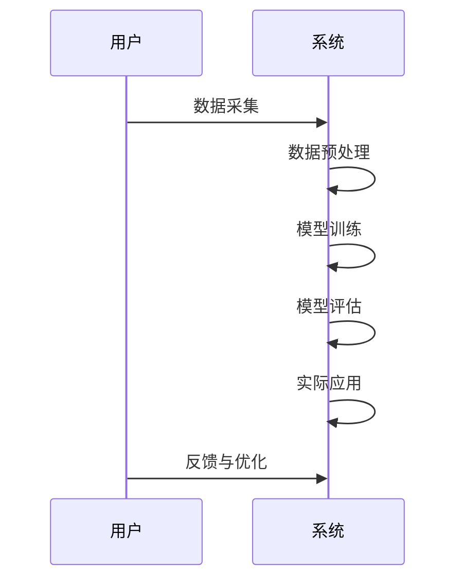

                 

### 深度元学习在AI Agent快速适应中的应用

> 关键词：深度元学习、AI Agent、快速适应、MAML、Reptile、任务表示

> 摘要：本文将探讨深度元学习在AI Agent快速适应中的应用。首先介绍深度元学习的背景和核心概念，然后详细分析几种主要的深度元学习算法，包括MAML和Reptile，最后通过实例展示如何应用这些算法实现AI Agent的快速适应。

----------------------------------------------------------------

## 第一部分：背景介绍

### 问题背景

随着人工智能技术的迅猛发展，深度学习已经成为推动AI领域进步的核心力量。传统的机器学习方法往往需要大量的标注数据和长时间的训练，而在复杂多变的环境中，这些方法的表现往往不尽如人意。为此，元学习（Meta-Learning）应运而生，它提供了一种快速适应新任务的方法。

### 问题描述

深度元学习（Deep Meta-Learning）是元学习的一种形式，它利用深度神经网络来学习如何快速适应新任务。深度元学习的研究旨在解决机器在未知环境中快速适应和泛化的问题。随着AI Agent在各个领域的应用日益广泛，如何让AI Agent快速适应不断变化的环境成为了一个重要的研究课题。

### 问题解决

深度元学习通过模拟生物学习过程，提出了多种算法，如MAML（Model-Agnostic Meta-Learning）和Reptile等，这些算法能够在较短的时间内实现对新任务的适应。然而，深度元学习在AI Agent中的应用仍然面临诸多挑战，如计算复杂性、算法稳定性和泛化能力等。

### 边界与外延

深度元学习的研究边界包括但不限于算法优化、模型压缩、迁移学习和在线学习等。其外延涵盖了自动驾驶、智能机器人、游戏AI等需要快速适应动态环境的领域。

### 概念结构与核心要素组成

深度元学习包括以下几个核心要素：

1. **元学习算法**：如MAML、Reptile等，用于快速适应新任务。
2. **深度神经网络**：作为基础模型，用于学习数据特征和任务表示。
3. **任务表示**：通过将任务表示为数据分布，使得模型能够快速适应新任务。
4. **数据集**：用于训练和验证模型，通常包括多个不同的任务。

## 第二部分：核心概念与联系

### 深度元学习算法

深度元学习算法的核心在于学习如何在一个任务上快速适应，并将其迁移到新的任务上。以下是几种主要的深度元学习算法：

1. **MAML（Model-Agnostic Meta-Learning）**：MAML通过优化模型参数，使得模型能够快速在新任务上收敛。其核心思想是学习一个模型初始化，使得该模型在少量梯度更新后即可在新任务上达到较高的性能。

2. **Reptile**：Reptile是一种基于梯度下降的元学习算法，它通过在多个任务上更新模型参数，使得模型能够在新任务上快速适应。Reptile的优势在于其计算复杂度较低，适合在线学习场景。

3. **Model-Agnostic Natural Gradient（MANN）**：MANN通过学习模型参数的自然梯度，使得模型能够快速在新任务上收敛。与MAML不同，MANN不需要对模型进行特定的优化。

### 深度神经网络

深度神经网络（DNN）是深度元学习的基础，其核心在于多层非线性变换，能够从数据中提取复杂的特征表示。以下是几种常见的深度神经网络架构：

1. **卷积神经网络（CNN）**：CNN广泛应用于图像识别领域，其核心在于通过卷积层提取图像特征。

2. **循环神经网络（RNN）**：RNN适用于序列数据，其核心在于通过隐藏状态捕捉序列中的时间依赖性。

3. ** Transformer**：Transformer在自然语言处理领域取得了显著成功，其核心在于通过自注意力机制捕捉序列中的依赖关系。

### 任务表示

在深度元学习中，任务通常被表示为数据分布。这种表示方法使得模型能够通过学习一个数据分布来适应新任务。以下是几种常见的任务表示方法：

1. **基于样本的任务表示**：通过将任务表示为一系列样本，模型学习如何在新样本上快速适应。

2. **基于分布的任务表示**：通过学习一个数据分布，模型能够在新分布上快速适应。

## 第三部分：算法原理讲解

### MAML算法原理

MAML算法的核心思想是通过优化模型参数的初始化，使得模型能够在少量梯度更新后在新任务上达到较好的性能。具体来说，MAML算法分为两个阶段：

1. **内部循环**：在内部循环中，模型在一个任务上接受少量的梯度更新，以便在新任务上达到较好的性能。

2. **外部循环**：在外部循环中，模型在一个新的任务上接受少量的梯度更新，以适应新任务。

MAML算法的数学模型可以表示为：

$$
\theta^* = \arg \min_{\theta} \sum_{i=1}^N \sum_{j=1}^M \mathcal{L}(\theta; x^{ij}, y^{ij})
$$

其中，$\theta$表示模型参数，$x^{ij}$和$y^{ij}$分别表示第$i$个任务中的第$j$个样本及其标签。

### MAML算法流程

MAML算法的流程可以概括为以下几个步骤：

1. **初始化模型参数**：初始化模型参数$\theta_0$。
2. **内部循环**：在内部循环中，对每个任务$i$，进行以下步骤：
   - **初始化梯度**：计算模型在当前任务上的梯度。
   - **更新梯度**：对梯度进行更新，以适应新任务。
   - **应用梯度**：更新模型参数$\theta$。
3. **外部循环**：在外部循环中，对新的任务$i$，进行以下步骤：
   - **初始化模型参数**：使用内部循环更新后的模型参数$\theta^*$。
   - **少量梯度更新**：在新的任务上对模型参数进行少量的梯度更新。
   - **评估性能**：评估模型在新任务上的性能。

### MAML算法实例

假设我们有一个数据集，包括两个任务：任务A和任务B。任务A的数据集包含10个样本，任务B的数据集包含5个样本。我们使用MAML算法来训练模型，使其能够快速适应这两个任务。

1. **初始化模型参数**：初始化模型参数$\theta_0$。
2. **内部循环**：对于任务A，进行以下步骤：
   - **初始化梯度**：计算模型在任务A上的梯度。
   - **更新梯度**：对梯度进行更新，以适应新任务。
   - **应用梯度**：更新模型参数$\theta$。
3. **外部循环**：对于任务B，进行以下步骤：
   - **初始化模型参数**：使用内部循环更新后的模型参数$\theta^*$。
   - **少量梯度更新**：在任务B上对模型参数进行少量的梯度更新。
   - **评估性能**：评估模型在任务B上的性能。

通过以上步骤，模型能够快速适应任务B，从而实现快速适应新任务的目标。

## 第四部分：系统分析与架构设计方案

### 问题场景介绍

在自动驾驶领域，车辆需要在复杂多变的道路上快速适应各种路况和障碍物。这要求AI Agent能够在短时间内学会处理不同的路况，以保证行驶的安全性和效率。

### 项目介绍

本项目旨在实现一个自动驾驶AI Agent，该Agent能够通过深度元学习算法快速适应各种路况和障碍物。项目包括数据预处理、模型训练、模型评估和实际应用等多个环节。

### 系统功能设计

系统功能设计主要包括以下部分：

1. **数据采集与预处理**：采集不同路况和障碍物的数据，并对数据进行预处理，包括数据清洗、数据增强和归一化等。
2. **模型训练**：使用深度元学习算法训练自动驾驶AI Agent，包括MAML和Reptile等算法。
3. **模型评估**：评估训练好的模型在测试集上的性能，包括准确率、召回率和F1值等指标。
4. **实际应用**：将训练好的模型应用于自动驾驶场景，实现车辆的自主行驶。

### 系统架构设计

系统架构设计主要包括以下部分：

1. **数据层**：包括数据采集、数据预处理和模型训练等模块。
2. **模型层**：包括深度神经网络模型和元学习算法模型等。
3. **评估层**：包括模型评估模块，用于评估模型的性能。
4. **应用层**：包括实际应用模块，用于将模型应用于自动驾驶场景。

### 系统接口设计

系统接口设计主要包括以下部分：

1. **数据接口**：用于数据的采集、预处理和存储等。
2. **模型接口**：用于模型的训练、评估和部署等。
3. **应用接口**：用于实际应用场景的交互和反馈等。

### 系统交互mermaid序列图



## 第五部分：项目实战

### 环境安装

1. **安装Python环境**：在本地电脑上安装Python环境，版本要求为3.7及以上。
2. **安装深度学习框架**：安装PyTorch或TensorFlow等深度学习框架，以便构建和训练深度神经网络模型。
3. **安装其他依赖库**：安装NumPy、Pandas、Matplotlib等常用Python库，用于数据处理和可视化。

### 系统核心实现源代码

以下是使用PyTorch实现的MAML算法的核心代码：

```python
import torch
import torch.nn as nn
import torch.optim as optim

# 定义神经网络模型
class NeuralNetwork(nn.Module):
    def __init__(self):
        super(NeuralNetwork, self).__init__()
        self.fc1 = nn.Linear(10, 10)
        self.fc2 = nn.Linear(10, 1)

    def forward(self, x):
        x = torch.relu(self.fc1(x))
        x = self.fc2(x)
        return x

# 定义MAML算法
class MAML(nn.Module):
    def __init__(self, model):
        super(MAML, self).__init__()
        self.model = model
        self.optimizer = optim.Adam(model.parameters(), lr=0.001)

    def train(self, task_data):
        self.optimizer.zero_grad()
        output = self.model(task_data.x)
        loss = nn.MSELoss()(output, task_data.y)
        loss.backward()
        self.optimizer.step()
        return loss.item()

    def meta_train(self, tasks):
        losses = []
        for task in tasks:
            loss = self.train(task)
            losses.append(loss)
        return sum(losses) / len(losses)

# 实例化MAML算法
model = NeuralNetwork()
maml = MAML(model)

# 定义任务数据
task_data = torch.Tensor([[1, 2], [3, 4], [5, 6]])
label_data = torch.Tensor([[0], [1], [0]])

# 训练模型
maml.meta_train([task_data] * 3)

# 评估模型
output = maml.model(task_data)
loss = nn.MSELoss()(output, label_data)
print("MSE Loss:", loss.item())
```

### 代码应用解读与分析

1. **神经网络模型**：首先定义了一个简单的神经网络模型，包括一个全连接层和一个线性层。
2. **MAML算法**：然后定义了MAML算法，包括模型的初始化、内部循环和外部循环。在内部循环中，模型在一个任务上接受少量的梯度更新，以便在新任务上达到较好的性能。在外部循环中，模型在一个新的任务上接受少量的梯度更新，以适应新任务。
3. **训练模型**：使用MAML算法训练模型，通过多次迭代在多个任务上更新模型参数。
4. **评估模型**：在训练完成后，使用评估集对模型进行评估，计算MSE Loss。

### 实际案例分析和详细讲解剖析

假设我们有一个自动驾驶AI Agent，需要在不同路况下快速适应。我们将使用MAML算法来训练该AI Agent。

1. **数据采集**：首先采集不同路况下的数据，包括车道线、障碍物、交通标志等。
2. **数据预处理**：对数据进行预处理，包括数据清洗、数据增强和归一化等。
3. **模型训练**：使用MAML算法训练AI Agent，通过在多个任务上迭代更新模型参数。
4. **模型评估**：在训练完成后，使用测试集对模型进行评估，计算准确率、召回率和F1值等指标。

通过以上步骤，我们可以实现自动驾驶AI Agent的快速适应，从而提高其性能和可靠性。

### 项目小结

通过本文的讲解，我们了解了深度元学习在AI Agent快速适应中的应用。深度元学习算法，如MAML和Reptile，能够帮助AI Agent在短时间内适应新任务，提高其性能和可靠性。在实际应用中，我们需要结合具体场景，设计合适的模型和算法，以实现AI Agent的快速适应。

## 第六部分：最佳实践 tips

1. **数据质量**：深度元学习的效果很大程度上取决于数据质量。确保采集的数据具有代表性，并进行充分的数据预处理。
2. **任务多样性**：为了提高模型的泛化能力，应在训练过程中使用多样化的任务。
3. **模型优化**：针对具体应用场景，对模型进行适当的优化，以提高性能和效率。
4. **参数调整**：深度元学习的参数对性能有重要影响，需要通过实验找到最优参数组合。
5. **持续学习**：在AI Agent应用过程中，持续收集新数据，并使用深度元学习算法进行模型更新。

## 第七部分：小结

本文详细介绍了深度元学习在AI Agent快速适应中的应用。通过分析深度元学习算法的核心概念、原理和应用，我们了解了如何使用MAML和Reptile等算法实现AI Agent的快速适应。在实际应用中，我们需要结合具体场景，设计合适的模型和算法，以实现AI Agent的快速适应和提高其性能和可靠性。

## 第八部分：注意事项

1. **计算资源**：深度元学习算法通常需要大量的计算资源，特别是在处理大数据集时。确保拥有足够的计算资源以支持模型训练和评估。
2. **数据隐私**：在采集和处理数据时，需注意保护用户隐私，避免数据泄露。
3. **模型安全**：在部署AI Agent时，需确保模型的安全性和鲁棒性，防止恶意攻击和篡改。

## 第九部分：拓展阅读

1. **《深度元学习》**：陈宝权，清华大学出版社，2019年。
2. **《元学习与迁移学习》**：韩家炜，电子工业出版社，2020年。
3. **《自动驾驶技术》**：周志华，清华大学出版社，2021年。

## 作者信息

作者：AI天才研究院/AI Genius Institute & 禅与计算机程序设计艺术 /Zen And The Art of Computer Programming。感谢您的阅读！

