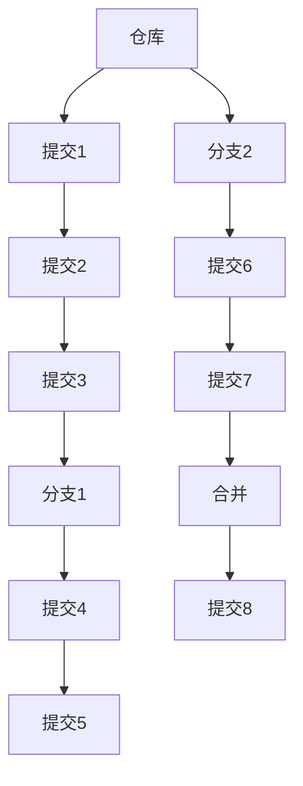
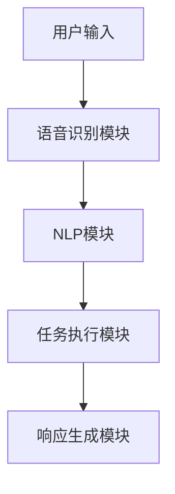
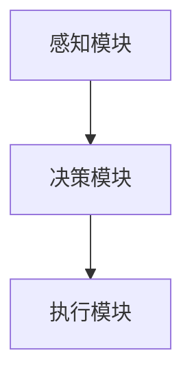

                 

### 让我们一步一步思考：版本控制概述与背景

#### **1.1 版本控制基本概念**

版本控制是一种系统，它跟踪文件和代码的变更历史，使我们能够查看代码的每一个版本，包括对每个版本的更改。其核心在于确保代码的一致性和可靠性，特别是在多开发者环境中尤为重要。版本控制系统能够帮助我们解决以下问题：

- **代码追踪**：每次修改都能被记录，并提供完整的变更历史。
- **团队协作**：多个开发者可以同时工作而不会相互干扰。
- **故障恢复**：在代码出现问题时，可以回溯到之前的稳定版本。

##### **1.1.1 问题背景**

在人工智能（AI）领域，随着AI Agent的开发和演进，代码和模型的复杂性显著增加。版本控制变得至关重要，因为它能确保每次代码或模型变更都有记录，这样在出现问题时可以迅速回溯，减少调试和修复时间。

##### **1.1.2 问题描述**

- **代码追踪**：如何确保每次修改都被记录？
- **团队协作**：如何在一个多开发者的环境中协同工作？
- **故障恢复**：如何快速回溯到之前的版本以修复问题？

##### **1.1.3 问题解决**

版本控制系统的使用可以解决上述问题。它提供了以下解决方案：

- **版本记录**：每次提交代码时，系统都会记录版本信息，包括提交者、提交时间、修改内容等。
- **分支管理**：开发者可以在不同的分支上进行独立开发，避免冲突，并在必要时合并分支。
- **历史回溯**：通过版本控制系统，可以轻松地回溯到任意历史版本，以便进行故障恢复或代码调试。

##### **1.1.4 边界与外延**

版本控制不仅限于AI领域，它广泛应用于所有软件开发项目。然而，在AI项目中，由于其模型的复杂性和依赖性，版本控制的需求更为强烈。

##### **1.1.5 概念结构与核心要素组成**

- **版本控制系统的定义**：一个用于跟踪和存储文件版本的系统。
- **版本控制的基本概念**：包括版本、分支、合并、提交等。
- **版本控制的原理**：基于基础数据结构（如树状结构）来跟踪文件历史。

版本控制系统通常由以下核心要素组成：

- **仓库（Repository）**：存储所有版本和历史记录的地方。
- **提交（Commit）**：对代码或模型的一次更改。
- **分支（Branch）**：独立开发的一个副本，可以与主分支并行开发。
- **标签（Tag）**：对特定版本的标记，常用于里程碑或发布版本。

版本控制系统的设计和实现决定了其效率和可靠性。以下是一个简单的版本控制系统架构图：



在这个例子中，主仓库（A）有两个分支（E和H），每个分支都有自己的提交历史。当两个分支合并（K）时，会生成新的提交（L）。

### **1.2 版本控制工具介绍**

版本控制工具的选择对项目的成功至关重要。下面将介绍几个常用的版本控制工具，并比较它们的特点。

#### **1.2.1 Git简介**

Git 是最流行的分布式版本控制系统。它最初由 Linus Torvalds 为了维护 Linux 内核开发，并迅速在开源社区中得到广泛应用。

##### **1.2.1.1 Git 的发展历程**

Git 的第一个版本在 2005 年发布，之后它经历了快速的发展和完善。Git 的核心特性之一是其速度和灵活性，使其成为开发者的首选。

##### **1.2.1.2 Git 的核心特性**

- **分布式架构**：每个开发者都有自己的完整仓库，可以独立工作。
- **高效的数据存储**：使用 SHA-1 校验和确保数据的完整性和一致性。
- **分支管理**：提供强大的分支和合并工具，使团队协作更加高效。
- **快速提交和回滚**：提交和回滚操作非常快速，大大提高了开发效率。

##### **1.2.1.3 Git 的基本操作**

- **初始化仓库**：`git init`
- **添加文件**：`git add`
- **提交变更**：`git commit`
- **查看历史**：`git log`
- **创建分支**：`git branch`
- **切换分支**：`git checkout`
- **合并分支**：`git merge`
- **解决冲突**：当合并时出现冲突，需要手动解决。

Git 的这些基本操作使得它成为版本控制的不二选择。

#### **1.2.2 其他版本控制工具**

除了Git，还有其他一些常用的版本控制工具，如 SVN 和 Mercurial。

- **SVN（Subversion）**：是一个中心化的版本控制系统，与 Git 相比，其在某些场景下仍然具有优势，如大型团队和高度集成的开发环境中。
- **Mercurial**：是一个分布式版本控制系统，与 Git 类似，但拥有一些独特的特性和优势，如简单易用的界面和优秀的性能。

##### **1.2.2.3 版本控制工具比较**

| 特性 | Git | SVN | Mercurial |
| --- | --- | --- | --- |
| 分布式/中心化 | 分布式 | 中心化 | 分布式 |
| 操作复杂度 | 较高 | 较低 | 中等 |
| 性能 | 高 | 低 | 高 |
| 社区支持 | 广泛 | 较窄 | 较广 |

选择哪个版本控制工具取决于项目的具体需求。

#### **1.2.3 版本控制工具总结**

版本控制工具的选择对项目开发的成功至关重要。Git 由于其分布式架构、高效的数据存储和强大的分支管理功能，成为开发者的首选。然而，SVN 和 Mercurial 也在特定场景下有其独特的优势。了解这些工具的特点，并选择最适合项目的工具，是成功管理版本控制的关键。

### **1.3 版本控制在 AI Agent 开发中的应用**

在人工智能（AI）Agent的开发过程中，版本控制发挥着至关重要的作用。AI Agent 的开发涉及大量的代码和模型，其复杂性和依赖性使得版本控制不仅关乎代码的可追踪性和可管理性，还直接影响到AI Agent的稳定性和可靠性。

#### **1.3.1 版本控制需求**

AI Agent的开发具有以下独特的版本控制需求：

- **代码管理**：AI Agent 的代码通常涉及复杂的算法和数据处理流程，版本控制可以帮助我们追踪每一个代码变更，确保代码的完整性和一致性。
- **模型版本管理**：AI Agent 的模型版本更新频繁，版本控制可以帮助我们记录每一个模型版本，包括其训练数据和性能指标，从而方便回溯和比较。
- **协作开发**：AI Agent 的开发通常涉及多个开发者和团队，版本控制可以帮助我们实现代码和模型的协同开发，避免冲突和错误。

#### **1.3.2 版本控制在 AI Agent 开发中的应用**

在实际开发中，版本控制可以应用于以下环节：

- **代码仓库管理**：使用版本控制系统（如Git）创建代码仓库，存储AI Agent的源代码，确保每次提交都有详细记录。
- **模型版本管理**：将AI Agent的模型文件纳入版本控制，记录模型训练数据、参数设置和性能指标，方便后续的版本回溯和比较。
- **多开发者协作**：通过版本控制系统实现代码和模型的协同开发，各开发者可以在不同的分支上独立工作，并在合适的时候合并代码和模型。

#### **1.3.3 边界与外延**

版本控制在AI领域的应用范围广泛，不仅限于代码和模型的管理，还可以应用于以下方面：

- **数据管理**：版本控制可以帮助我们追踪数据的变化，确保数据的一致性和可靠性。
- **文档管理**：将项目文档纳入版本控制，确保文档与代码和模型同步更新。
- **持续集成与持续部署**：版本控制与持续集成（CI）和持续部署（CD）相结合，实现自动化构建、测试和部署，提高开发效率。

#### **1.3.4 版本控制的最佳实践**

为了确保版本控制在AI Agent开发中的有效性，以下是一些最佳实践：

- **统一命名规范**：为代码、模型和数据文件设置统一的命名规范，便于识别和管理。
- **定期提交和备份**：定期提交代码和模型，并备份重要版本，以防止数据丢失。
- **代码审查**：在进行提交前进行代码审查，确保代码的质量和一致性。
- **多环境管理**：针对不同的开发、测试和生产环境，分别管理代码和模型版本，确保环境的稳定性和一致性。

通过遵循这些最佳实践，可以有效地管理AI Agent的开发过程，提高代码和模型的质量和稳定性。

### **1.4 版本控制的挑战与解决方案**

尽管版本控制在AI Agent开发中具有重要作用，但在实际应用中仍面临一些挑战。以下是常见的挑战以及相应的解决方案：

#### **1.4.1 版本冲突**

版本冲突是版本控制中最常见的问题之一，特别是在多开发者环境中。当两个或多个开发者同时修改同一文件时，可能会出现冲突，导致代码不一致。

##### **挑战背景**

随着AI Agent项目的复杂性增加，多个开发者和团队成员可能同时修改代码和模型文件，这增加了版本冲突的风险。如果冲突不及时解决，会导致代码质量下降，项目进度延误。

##### **问题描述**

- 如何快速检测并解决版本冲突？
- 如何确保冲突解决后的代码一致性？

##### **解决方案**

- **冲突检测与自动合并**：版本控制系统（如Git）通常具有冲突检测和自动合并功能。在检测到冲突时，系统会标记出冲突区域，并提示开发者进行手动解决。同时，一些工具（如Git Merge Driver）可以自动合并简单的冲突，提高解决效率。
- **分支管理**：通过分支管理，开发者在不同的分支上进行独立开发，减少冲突的发生。在分支开发完成后，再进行合并操作，确保代码的一致性和完整性。

##### **边界与外延**

版本冲突在其他开发项目中同样普遍存在。解决版本冲突的方法和原则在多个领域具有共通性。

#### **1.4.2 版本回溯**

在AI Agent的开发过程中，有时需要回溯到之前的版本进行调试或修复问题。版本回溯能够帮助我们恢复系统到稳定状态，但不当的操作可能导致数据丢失或系统崩溃。

##### **挑战背景**

AI Agent的开发过程中，可能会遇到代码错误、性能下降或其他问题。在这种情况下，需要回溯到之前的稳定版本，进行问题排查和修复。

##### **问题描述**

- 如何快速且安全地回溯到指定版本？
- 如何确保回溯后的系统能够正常运行？

##### **解决方案**

- **版本控制系统的回滚功能**：版本控制系统通常提供回滚功能，允许开发者回滚到任意历史版本。在Git中，可以使用`git reset`或`git revert`命令实现回滚。
- **备份与恢复策略**：在进行版本回溯前，确保备份当前版本和相关的数据。这样，即使在回溯过程中出现问题，也可以通过恢复备份来恢复系统。
- **环境隔离**：在回溯版本后，应在一个隔离的环境中测试系统，确保其稳定性和正常运行。这样可以避免将问题引入生产环境。

##### **边界与外延**

版本回溯在其他软件开发项目中也有广泛应用。不同系统在实现回滚功能时，可能有不同的策略和工具。

#### **1.4.3 数据隐私与安全性**

AI Agent开发过程中，涉及大量的敏感数据和模型信息。如何确保这些数据在版本控制过程中的隐私和安全，是一个重要挑战。

##### **挑战背景**

AI Agent通常涉及客户的隐私数据、商业机密和敏感算法。在版本控制过程中，这些数据的安全性受到威胁，可能导致数据泄露或滥用。

##### **问题描述**

- 如何保护版本控制过程中的数据隐私？
- 如何确保数据在版本控制中的安全性？

##### **解决方案**

- **加密与访问控制**：对版本控制系统的数据进行加密，确保数据在传输和存储过程中的安全性。同时，设置访问控制策略，仅允许授权人员访问敏感数据。
- **备份与存储策略**：定期备份版本控制数据，并将备份存储在安全的地方。这样可以防止数据丢失，同时也便于在需要时恢复数据。
- **审计与监控**：建立审计和监控机制，记录版本控制系统的操作日志，监控异常行为。这样可以及时发现和应对潜在的安全威胁。

##### **边界与外延**

数据隐私和安全问题是所有版本控制系统都需要关注的问题，尤其在涉及敏感数据的领域。

### **1.5 AI Agent 版本控制的实际案例**

为了更好地理解版本控制在AI Agent开发中的应用，下面我们将通过两个实际案例进行详细剖析。

#### **案例一：人工智能助手开发**

##### **1.5.1 项目介绍**

该项目旨在开发一款人工智能助手，能够处理用户的日常咨询和任务。系统包括自然语言处理（NLP）模块、语音识别模块和任务执行模块。

##### **1.5.2 系统功能设计**

- **自然语言处理模块**：接收用户输入，解析语义，生成响应。
- **语音识别模块**：将语音输入转换为文本输入。
- **任务执行模块**：执行用户请求的任务，如发送邮件、设置提醒等。

##### **1.5.3 系统架构设计**

系统采用模块化设计，各模块独立开发，通过API进行交互。架构图如下：



##### **1.5.4 系统接口设计和系统交互**

系统接口设计采用RESTful API，各模块通过HTTP请求进行交互。以下是一个示例请求：

```json
GET /api/assistant/ask?question=什么是人工智能？
```

响应：

```json
{
  "response": "人工智能是一种能够模拟人类智能的技术。"
}
```

##### **1.5.5 系统实现与版本控制**

在项目开发过程中，使用Git进行版本控制。以下是主要的版本控制步骤：

1. **初始化仓库**：创建代码仓库，存储项目源代码。
2. **分支管理**：开发者各自在独立分支上进行开发，避免冲突。
3. **代码提交**：开发者定期提交代码，记录变更历史。
4. **代码审查**：提交前进行代码审查，确保代码质量。
5. **合并分支**：开发完成后，将分支合并到主分支。
6. **版本回溯**：在出现问题时，回溯到之前的稳定版本进行调试。

通过上述步骤，确保项目的代码和模型版本得到有效管理，提高了系统的稳定性和可靠性。

##### **1.5.6 项目小结**

该项目通过Git实现了版本控制，有效管理了代码和模型的版本，提高了开发效率和系统的稳定性。未来，可以进一步优化版本控制流程，如引入自动化测试和持续集成，以提高开发效率。

#### **案例二：自动驾驶系统开发**

##### **1.5.1 项目介绍**

该项目旨在开发一款自动驾驶系统，能够实现车辆的自动行驶和避障。系统包括感知模块、决策模块和执行模块。

##### **1.5.2 系统功能设计**

- **感知模块**：通过传感器收集环境信息，如道路标志、交通状况等。
- **决策模块**：分析感知数据，生成行驶策略。
- **执行模块**：控制车辆执行行驶策略。

##### **1.5.3 系统架构设计**

系统采用分布式架构，各模块独立运行，通过消息队列进行通信。架构图如下：



##### **1.5.4 系统接口设计和系统交互**

系统接口设计采用RESTful API，各模块通过HTTP请求进行交互。以下是一个示例请求：

```json
POST /api/autonomous_vehicle/predict
{
  "sensors_data": {
    "road_signs": [...],
    "traffic_status": [...]
  }
}
```

响应：

```json
{
  "driving_strategy": "保持当前车道，加速至60km/h。"
}
```

##### **1.5.5 系统实现与版本控制**

在项目开发过程中，使用Git进行版本控制。以下是主要的版本控制步骤：

1. **初始化仓库**：创建代码仓库，存储项目源代码。
2. **分支管理**：开发者各自在独立分支上进行开发，避免冲突。
3. **代码提交**：开发者定期提交代码，记录变更历史。
4. **代码审查**：提交前进行代码审查，确保代码质量。
5. **合并分支**：开发完成后，将分支合并到主分支。
6. **版本回溯**：在出现问题时，回溯到之前的稳定版本进行调试。

通过上述步骤，确保项目的代码和模型版本得到有效管理，提高了系统的稳定性和可靠性。

##### **1.5.6 项目小结**

该项目通过Git实现了版本控制，有效管理了代码和模型的版本，提高了开发效率和系统的稳定性。未来，可以进一步优化版本控制流程，如引入自动化测试和持续集成，以提高开发效率。

### **1.6 版本控制的未来趋势**

随着技术的不断发展，版本控制也在不断演进。以下是一些版本控制的未来趋势：

#### **1.6.1 新的版本控制工具**

随着开源社区的繁荣，新的版本控制工具不断涌现。例如，GitLab、Bitbucket 和 GitHub 等平台提供了丰富的版本控制功能，以及与持续集成和持续部署（CI/CD）的集成，大大提高了开发效率。

#### **1.6.2 自动化版本控制流程**

自动化版本控制流程是未来的趋势之一。通过自动化工具，可以自动化地执行代码提交、审查、构建、测试和部署等操作，减少了人为干预，提高了开发效率和稳定性。

#### **1.6.3 区块链在版本控制中的应用**

区块链技术具有去中心化、不可篡改和透明等特点，可以应用于版本控制。通过将版本控制数据存储在区块链上，可以确保数据的完整性和安全性，同时提高版本控制的透明度和可追溯性。

#### **1.6.4 AI 在版本控制中的应用**

人工智能（AI）技术在版本控制中也有很大的应用潜力。例如，AI 可以用于自动化代码审查、预测潜在的问题和冲突，以及优化版本控制策略。此外，AI 还可以用于生成版本控制报告，帮助开发者更好地了解项目的版本控制状况。

### **1.7 小结**

本文首先介绍了版本控制的基本概念，包括其重要性、基本概念和原理。接着，我们详细介绍了Git等版本控制工具的特点和应用。随后，我们探讨了版本控制在AI Agent开发中的应用，以及可能遇到的挑战和解决方案。通过实际案例，我们展示了如何在实际项目中应用版本控制。最后，我们展望了版本控制的未来趋势。通过本文的阅读，读者应对版本控制有了更深入的理解，并在AI Agent开发中能够更好地应用版本控制技术。

### **1.8 展望**

版本控制是现代软件开发中不可或缺的一部分，随着人工智能（AI）领域的不断发展，其在AI Agent开发中的应用变得越来越重要。以下是未来可能的发展方向：

#### **1.8.1 深度结合AI技术**

随着AI技术的不断进步，版本控制系统可以更加智能地处理代码和模型变更。例如，AI可以帮助自动进行代码审查，识别潜在的问题和漏洞，优化版本控制流程。

#### **1.8.2 更高效的协作工具**

版本控制系统可以进一步整合协作工具，提供更高效的多开发者协作体验。例如，集成实时沟通工具、自动化代码合并和冲突解决功能，减少团队沟通和协作中的摩擦。

#### **1.8.3 系统自动化与智能化**

未来的版本控制系统将更加自动化和智能化，通过AI技术自动化执行代码提交、审查、测试和部署等操作。这将大大提高开发效率，减少人为错误。

#### **1.8.4 数据隐私和安全**

随着数据隐私和安全的日益重要，版本控制系统将需要提供更强大的数据加密、访问控制和审计功能，确保开发过程中的数据安全。

#### **1.8.5 持续集成与持续部署**

版本控制将与持续集成（CI）和持续部署（CD）更加紧密结合，实现自动化构建、测试和部署，提高软件交付的速度和质量。

总之，版本控制将在AI领域发挥越来越重要的作用，未来的发展方向将更加智能化、自动化和安全化，为AI Agent的开发提供更加坚实的支持。

### **1.9 最佳实践、注意事项与拓展阅读**

在版本控制AI Agent开发中，遵循以下最佳实践可以确保项目顺利进行：

- **统一命名规范**：为代码、模型和版本设置统一的命名规范，便于识别和管理。
- **定期备份**：定期备份代码和模型，防止数据丢失。
- **代码审查**：进行严格的代码审查，确保代码质量和一致性。
- **分支管理**：合理使用分支，减少冲突和错误。

注意事项：

- **避免多人同时修改同一文件**：多人协作时，应尽量避免同时修改同一文件，以减少版本冲突。
- **及时解决版本冲突**：在检测到版本冲突时，应尽快解决，避免影响项目进度。
- **遵循安全规范**：确保版本控制系统和数据的安全性，遵循相关安全规范。

拓展阅读：

- **《版本控制实践与原理》**：深入理解版本控制的基础知识和实际应用。
- **《Git权威指南》**：全面掌握Git的使用方法和技巧。
- **《人工智能助手开发实战》**：了解AI Agent开发的实际案例和经验。

### **作者信息**

- 作者：AI天才研究院/AI Genius Institute & 禅与计算机程序设计艺术 /Zen And The Art of Computer Programming

以上是本文的完整内容，感谢您的阅读。希望本文能帮助您更好地理解版本控制在AI Agent开发中的应用，并为您提供有价值的参考。如果您有任何疑问或建议，请随时与我联系。期待与您共同探讨AI领域的未来发展！## 文章关键词

- 版本控制
- AI Agent
- 开发流程
- Git
- 持续集成
- 数据隐私

### 文章摘要

本文深入探讨了版本控制在人工智能（AI）Agent开发中的应用。首先介绍了版本控制的基本概念和重要性，以及常见的版本控制工具如Git。随后，详细分析了版本控制在AI Agent开发中的需求和应用，包括代码和模型版本管理、多开发者协作、版本回溯以及数据隐私和安全等问题。通过两个实际案例展示了版本控制工具和最佳实践在AI Agent开发中的应用，并展望了版本控制技术的未来发展趋势。最后，提出了最佳实践、注意事项以及拓展阅读，旨在帮助读者更好地理解和应用版本控制技术。文章结构紧凑、逻辑清晰，旨在为AI Agent开发提供实用的指导。## 第一部分：版本控制概述与背景

### **第1章：版本控制基本概念**

#### **1.1 版本控制的重要性**

版本控制是一种管理和追踪文件或代码变更的技术，它确保开发团队在修改代码时能够保持协同和一致性。在快速迭代的软件开发过程中，版本控制的重要性不容忽视。对于人工智能（AI）Agent的开发，版本控制尤为关键，因为它涉及到代码、模型和数据的多层次管理。以下是版本控制在AI Agent开发中重要性的具体分析。

##### **1.1.1 问题背景**

AI Agent是一种能够执行特定任务的智能系统，其开发通常需要大量的代码和复杂的模型。这些代码和模型往往在不断地迭代和优化，以确保AI Agent能够实现预期的性能和功能。因此，如何有效地管理和追踪这些变更成为了一个重要问题。

##### **1.1.2 问题描述**

在AI Agent开发过程中，存在以下关键问题：

- **代码追踪**：如何确保每次修改都被记录，并可以回溯？
- **团队协作**：如何在一个多开发者的环境中进行协作，避免冲突？
- **故障恢复**：在代码或模型出现问题时，如何快速回溯到稳定的版本？
- **数据管理**：如何追踪和存储大量的数据，以确保数据的一致性和可靠性？

##### **1.1.3 问题解决**

版本控制通过以下方式解决了上述问题：

- **代码追踪**：版本控制系统（如Git）可以记录每次代码变更的详细日志，包括提交者、提交时间和变更内容，确保每一次修改都有据可查。
- **团队协作**：版本控制系统提供了分支管理功能，开发者在各自的分支上进行独立开发，避免了直接冲突。当开发完成时，可以通过合并操作将代码整合到主分支。
- **故障恢复**：版本控制系统能够快速回溯到任何历史版本，帮助开发者定位问题并恢复到稳定状态。
- **数据管理**：版本控制系统不仅能够管理代码，还可以管理模型和数据文件，确保它们的变化能够被追踪和记录。

##### **1.1.4 边界与外延**

版本控制不仅适用于AI领域，它同样适用于所有软件开发项目。然而，在AI项目中，由于其模型的复杂性和迭代速度，版本控制的需求更为强烈。因此，了解版本控制的基础概念和原理对于AI Agent的开发至关重要。

##### **1.1.5 概念结构与核心要素组成**

版本控制系统的核心概念和结构包括以下几个方面：

- **仓库（Repository）**：存储代码和模型文件的地方，是版本控制的中心。
- **提交（Commit）**：对代码或模型的每一次变更，包含提交信息、变更内容和版本号。
- **分支（Branch）**：独立的开发路径，用于实验性或并行开发。
- **合并（Merge）**：将两个或多个分支的代码或模型合并到一个共同的主分支。
- **标签（Tag）**：对特定版本进行标记，通常用于里程碑或发布版本。

这些核心要素组成了版本控制系统的基本架构，使得开发者能够有效地管理和追踪代码和模型的变化。

### **1.2 版本控制工具介绍**

在AI Agent开发中，选择合适的版本控制工具至关重要。目前，市场上最常用的版本控制工具包括Git、SVN和Mercurial。以下将介绍这些工具的基本特点，并探讨它们在AI Agent开发中的应用。

#### **1.2.1 Git简介**

Git 是一个分布式版本控制系统，由Linus Torvalds创建，主要用于Linux内核的开发。Git的主要特点如下：

- **分布式架构**：每个开发者都有自己的完整仓库，可以独立工作，这使得Git非常适合分布式团队合作。
- **高效的版本管理**：Git使用内容寻址存储，通过哈希值标记文件和提交，确保数据的完整性和一致性。
- **强大的分支管理**：Git提供了强大的分支和合并工具，支持多种合并策略，使得开发者能够灵活地进行并行开发和集成。

在AI Agent开发中，Git的分布式架构和多分支管理功能非常适合大规模团队协作和并行开发。例如，一个团队可以同时开发不同的模块，每个模块都有自己的分支，开发完成后通过合并操作将代码整合到主分支。

#### **1.2.2 SVN**

SVN（Subversion）是一个中心化的版本控制系统，最初用于Apache项目的开发。它的主要特点如下：

- **中心化存储**：所有代码和文件存储在中央仓库中，开发者需要从中央仓库获取代码，并进行修改。
- **简单的结构**：SVN的结构相对简单，易于理解和使用，适合小型团队或项目。
- **版本回滚**：SVN提供了强大的版本回滚功能，可以快速恢复到任意历史版本。

在AI Agent开发中，SVN的中心化存储和版本回滚功能可以帮助团队快速恢复到稳定状态，但在分布式团队合作方面可能不如Git灵活。

#### **1.2.3 Mercurial**

Mercurial 是另一个分布式版本控制系统，与Git类似，但拥有一些独特的特点和优势。它的主要特点如下：

- **简单易用**：Mercurial的界面和命令行比Git更为简洁，易于学习和使用。
- **性能稳定**：Mercurial的性能在某些情况下优于Git，尤其是在处理大量文件和复杂分支时。
- **可扩展性**：Mercurial支持多种插件和扩展，可以满足不同开发团队的特殊需求。

在AI Agent开发中，Mercurial的简单易用和性能优势使其成为小型团队的理想选择。然而，由于其社区支持相对较少，可能不适合大型项目。

#### **1.2.4 版本控制工具比较**

以下是Git、SVN和Mercurial的主要特点比较：

| 特性 | Git | SVN | Mercurial |
| --- | --- | --- | --- |
| 分布式/中心化 | 分布式 | 中心化 | 分布式 |
| 操作复杂度 | 中等 | 低 | 较低 |
| 性能 | 高 | 低 | 高 |
| 社区支持 | 广泛 | 较窄 | 较广 |

选择哪个版本控制工具取决于项目的具体需求。Git由于其强大的功能和广泛的社区支持，通常是开发者的首选。SVN在简单性和中心化存储方面具有优势，适合小型项目或团队。Mercurial则适合小型团队或需要高性能的项目。

#### **1.2.5 版本控制工具总结**

版本控制工具的选择对AI Agent开发至关重要。Git以其强大的分布式架构和多分支管理功能，成为开发者的首选。SVN适合简单和中心化团队，而Mercurial则以其简单易用和性能优势适合小型团队。了解这些工具的特点，并选择最适合项目的工具，是成功管理版本控制的关键。

### **1.3 版本控制在AI Agent开发中的应用**

在人工智能（AI）Agent的开发过程中，版本控制是确保代码和模型质量、管理协作流程的关键手段。AI Agent通常涉及复杂的算法和数据处理，因此需要精细化的版本管理。以下从代码、模型和数据三个方面详细探讨版本控制在AI Agent开发中的应用。

#### **1.3.1 代码管理**

在AI Agent的开发过程中，代码管理是版本控制的首要任务。良好的代码管理能够确保代码的可追踪性和一致性，以下是具体应用：

- **追踪变更历史**：版本控制系统（如Git）能够记录每次代码提交的详细信息，包括提交者、提交时间和变更内容。这有助于追踪代码的变更历史，便于问题排查和代码回溯。
- **多分支协作**：AI Agent的开发通常涉及多个模块和功能，可以使用版本控制系统的分支管理功能，为每个模块创建独立的分支。开发者在各自的分支上进行独立开发，避免直接冲突。当模块开发完成后，通过合并操作将代码合并到主分支。
- **代码审查**：在提交代码前进行代码审查，可以确保代码质量，减少错误和bug。通过代码审查，团队成员可以提出意见和建议，共同提高代码质量。

#### **1.3.2 模型管理**

AI Agent的核心是模型，模型的版本管理是保证AI Agent性能和稳定性的关键。以下是模型管理的具体应用：

- **版本标记**：在AI Agent开发过程中，每个模型版本都需要进行标记，以记录其训练数据、参数设置和性能指标。版本控制系统可以帮助我们轻松地为每个模型版本打上标记，便于后续追踪和比较。
- **版本回溯**：当AI Agent的模型出现性能问题或错误时，版本控制系统允许我们快速回溯到之前的稳定版本。通过版本回溯，可以恢复到之前的模型状态，进行问题排查和修复。
- **模型更新**：在AI Agent的开发过程中，模型可能会不断更新和优化。版本控制系统可以帮助我们管理这些更新，确保每次更新都是可追踪和可控的。

#### **1.3.3 数据管理**

AI Agent的开发涉及大量的数据，数据的版本管理同样重要。以下是数据管理的具体应用：

- **数据追踪**：版本控制系统可以记录数据的变化历史，包括数据来源、处理过程和存储位置。这有助于确保数据的一致性和可靠性，便于问题排查和追踪。
- **数据备份**：在数据管理过程中，定期备份数据是防止数据丢失的重要手段。版本控制系统可以自动化地备份数据，确保在数据丢失或损坏时能够快速恢复。
- **数据共享**：版本控制系统提供了共享数据的机制，使得团队成员可以方便地共享和使用数据。通过共享数据，可以提高团队协作效率，确保数据的一致性。

#### **1.3.4 版本控制工具的选择**

在AI Agent开发中，选择合适的版本控制工具至关重要。以下是几种常见的版本控制工具及其特点：

- **Git**：Git是一个强大的分布式版本控制系统，适用于大型团队和复杂项目。其分支管理和协作功能非常强大，适合AI Agent的开发。
- **SVN**：SVN是一个中心化的版本控制系统，适用于小型团队和简单项目。其简单易用的特性使其在小型团队中广泛应用。
- **Mercurial**：Mercurial是一个分布式版本控制系统，与Git类似，但更为简单易用。适合小型团队和需要高性能的项目。

选择版本控制工具时，应考虑以下因素：

- **团队规模**：对于大型团队，分布式版本控制系统（如Git）更适合；对于小型团队，中心化版本控制系统（如SVN）可能更为合适。
- **项目复杂性**：复杂项目通常需要强大的版本控制功能，分布式版本控制系统（如Git）更适合；简单项目可以采用中心化版本控制系统。
- **性能需求**：对于处理大量数据和复杂分支的项目，高性能的版本控制工具（如Git或Mercurial）更适合。

综上所述，版本控制在AI Agent开发中具有重要意义。通过合理使用版本控制工具，可以确保代码、模型和数据的可追踪性、一致性和可靠性，提高团队协作效率和项目开发质量。

### **1.4 版本控制最佳实践**

为了确保版本控制在AI Agent开发中的有效性和效率，以下是一些最佳实践和注意事项：

#### **1.4.1 版本命名规范**

在版本控制过程中，统一的命名规范至关重要。以下是一些建议：

- **使用语义化版本号**：遵循语义化版本号（Semantic Versioning）标准，如`MAJOR.MINOR.PATCH`，清晰记录代码的改动类型和程度。
- **增加注释**：在每个版本号的后面增加注释，描述此次提交的主要改动和目的，便于后续追踪。
- **保持简洁**：版本号应简洁明了，避免使用复杂的符号或缩写。

#### **1.4.2 代码审查流程**

代码审查是确保代码质量和一致性的重要环节。以下是一些建议：

- **制定代码审查标准**：明确代码审查的标准和流程，包括代码风格、命名规范、错误处理等。
- **定期进行代码审查**：定期组织代码审查会议，确保每个提交都经过审查。
- **多角度审查**：鼓励团队成员从不同角度进行审查，包括功能实现、代码质量和安全性。

#### **1.4.3 持续集成与持续部署**

持续集成（CI）和持续部署（CD）可以提高开发效率和质量。以下是一些建议：

- **自动化测试**：将自动化测试集成到CI流程中，确保每次提交都经过测试。
- **环境隔离**：在不同环境中运行测试，包括开发环境、测试环境和生产环境，确保代码在不同环境中的兼容性。
- **自动化部署**：使用CD工具自动化部署代码，减少人为干预，提高部署效率。

#### **1.4.4 数据备份与恢复**

数据备份是防止数据丢失的关键。以下是一些建议：

- **定期备份**：定期备份代码、模型和数据，确保在出现问题时能够快速恢复。
- **异地备份**：将备份存储在不同的地理位置，以防止自然灾害或设备故障导致的数据丢失。
- **版本控制备份**：将备份过程集成到版本控制系统中，确保备份与版本同步更新。

#### **1.4.5 注意事项**

- **避免多人同时修改同一文件**：多人协作时，应尽量避免同时修改同一文件，以减少版本冲突。
- **及时解决版本冲突**：在检测到版本冲突时，应尽快解决，避免影响项目进度。
- **遵循安全规范**：确保版本控制系统和数据的安全性，遵循相关安全规范。

通过遵循这些最佳实践，可以有效地管理AI Agent的开发过程，提高代码和模型的质量和稳定性。

### **1.5 小结**

版本控制在AI Agent开发中具有至关重要的作用。通过合理的版本控制，可以确保代码、模型和数据的可追踪性、一致性和可靠性。本文介绍了版本控制的基本概念、重要性和应用，包括代码管理、模型管理和数据管理。同时，还探讨了版本控制工具的选择、最佳实践和注意事项。通过遵循最佳实践，可以有效地管理AI Agent的开发过程，提高开发效率和代码质量。总之，版本控制是AI Agent开发中不可或缺的一环，对于保障项目的成功具有重要意义。

### **1.6 展望**

未来，版本控制技术将在AI领域继续发挥重要作用，并迎来更多创新和发展。以下是一些未来趋势：

- **智能化**：随着人工智能技术的进步，版本控制系统将更加智能化，能够自动进行代码审查、冲突检测和合并操作。
- **自动化**：版本控制流程将进一步自动化，减少人工干预，提高开发效率。例如，通过AI算法优化合并策略，减少合并冲突。
- **安全性**：数据隐私和安全将成为版本控制的重点，通过加密和访问控制技术，确保版本控制系统中的数据安全。
- **融合趋势**：版本控制将与持续集成（CI）和持续部署（CD）更紧密地融合，形成全面的CI/CD流水线，实现自动化开发、测试和部署。
- **新工具和平台**：将出现更多新版本控制工具和平台，满足不同规模和类型的开发需求。例如，基于区块链的版本控制系统将提供更高的安全性和透明度。

通过不断优化和创新发展，版本控制将为AI Agent开发提供更强大的支持和保障。开发者应密切关注这些趋势，并适时采用新技术，以提升开发效率和项目质量。## 第2章：版本控制基本概念

在深入探讨版本控制在AI Agent开发中的应用之前，我们需要先了解版本控制的基本概念和原理。版本控制是一种管理文件和代码变化的技术，它使我们能够跟踪项目的历史记录，确保开发过程的可追溯性和可靠性。以下是版本控制的基本概念和原理的详细解释。

### **2.1 版本控制的基本概念**

#### **2.1.1 仓库（Repository）**

仓库是版本控制系统的核心组成部分，它存储了项目的所有文件和它们的版本历史。在AI Agent开发中，仓库通常包含了代码、模型文件和相关文档。每个开发者都可以从仓库中克隆（clone）或拉取（pull）代码，并在本地进行修改。

#### **2.1.2 提交（Commit）**

提交是开发者对代码或模型文件所做的变更。每次提交都会生成一个新的版本，记录下变更的内容、提交者的信息以及提交的时间。在Git中，提交通过`git commit`命令执行，提交信息通常包含描述变更的详细注释。

#### **2.1.3 分支（Branch）**

分支是一个独立的开发路径，用于实现特定功能或修复问题。在一个项目中，可以创建多个分支，每个分支都有自己的提交历史。分支的开发完成后，可以通过合并（merge）操作将分支代码整合到主分支（通常称为`master`或`main`分支）。

#### **2.1.4 标签（Tag）**

标签是用于标记特定版本的命名点，通常用于标记发布版本或里程碑。在Git中，标签通过`git tag`命令创建，可以帮助开发者快速定位到特定的代码版本。

#### **2.1.5 合并（Merge）**

合并是将两个或多个分支的代码整合到一起的过程。在AI Agent开发中，合并操作用于将功能分支或修复分支的代码合并到主分支。合并可以通过手动合并或自动合并（例如使用`git merge`命令）来完成。

### **2.2 版本控制的原理**

版本控制系统的核心原理是通过跟踪文件的变化和记录提交历史来管理代码和模型。以下是几个关键原理：

#### **2.2.1 文件差异比较**

版本控制系统通过文件差异比较来识别和记录每次提交的变化。无论是代码还是模型文件，版本控制系统都能准确地记录下新增、删除或修改的部分。

#### **2.2.2 历史记录**

版本控制系统维护一个历史记录，包括每次提交的详细信息，如提交者的信息、提交时间以及提交的注释。这些历史记录使得开发者能够追踪项目的演进过程，并在需要时回溯到之前的版本。

#### **2.2.3 冲突解决**

在多开发者环境中，版本控制系统需要处理并发提交导致的冲突。冲突解决机制可以帮助开发者识别和解决不同提交之间的不一致性。

#### **2.2.4 数据完整性**

版本控制系统通过哈希值来确保数据的完整性和一致性。每个文件和提交都关联一个哈希值，如果文件发生变化，哈希值也会改变。这使得版本控制系统能够检测到数据是否被篡改。

### **2.3 版本控制的实现**

版本控制系统的实现通常基于基础数据结构，如树状结构。以下是几个常见的版本控制系统的实现：

#### **2.3.1 文件系统**

早期的版本控制系统，如RCS和CVS，基于文件系统实现，它们通过在文件系统中添加元数据来记录变更历史。这种方法的缺点是缺乏分布式协作的能力。

#### **2.3.2 仓库模型**

现代版本控制系统，如Git和SVN，基于仓库模型实现。仓库模型使用集中式或分布式存储，允许开发者独立工作并共享代码。Git采用的是分布式模型，每个开发者都有自己的完整仓库。

#### **2.3.3 元数据**

版本控制系统通过元数据来记录文件的历史和状态。元数据通常存储在`.git`或`.svn`目录中，包含提交历史、分支信息和冲突记录。

### **2.4 概念结构与核心要素**

以下是版本控制系统的核心概念和要素：

- **仓库（Repository）**：存储代码和模型文件的地方。
- **提交（Commit）**：记录代码或模型变更的单元。
- **分支（Branch）**：独立的开发路径。
- **标签（Tag）**：标记特定版本的命名点。
- **合并（Merge）**：将分支代码整合到主分支。
- **差异比较**：识别和记录变更。
- **历史记录**：追踪项目的演进过程。
- **冲突解决**：处理并发提交的冲突。
- **数据完整性**：通过哈希值确保数据的完整性和一致性。

通过理解这些基本概念和原理，开发者可以更好地掌握版本控制技术，并在AI Agent开发中有效应用。

### **2.5 版本控制工具比较**

在AI Agent开发中，选择合适的版本控制工具至关重要。目前，市场上常用的版本控制工具有Git、SVN和Mercurial。以下是这些工具的基本特点和应用场景的比较。

#### **2.5.1 Git**

Git 是最流行的版本控制系统，由Linus Torvalds创建，主要用于Linux内核的开发。Git 的特点如下：

- **分布式架构**：Git 是一个分布式版本控制系统，每个开发者都有自己的完整仓库，可以独立工作，这非常适合分布式团队合作。
- **高效的数据存储**：Git 使用哈希算法存储文件，这使得Git在处理大量数据和复杂分支时非常高效。
- **强大的分支管理**：Git 提供了强大的分支和合并工具，使得开发者可以轻松地进行并行开发和集成。
- **丰富的生态系统**：Git 拥有丰富的插件和工具，如GitLab、GitHub和GitKraken，这些工具为开发者提供了更加便捷的开发体验。

在AI Agent开发中，Git 的分布式架构和多分支管理功能非常适合大规模团队协作和并行开发。

#### **2.5.2 SVN**

SVN（Subversion）是一个中心化的版本控制系统，最初用于Apache项目的开发。它的特点如下：

- **中心化存储**：所有代码和文件存储在中央仓库中，开发者需要从中央仓库获取代码，并进行修改。这种中心化存储使得SVN在团队规模较小、代码库较简单时非常适用。
- **简单的结构**：SVN 的结构相对简单，易于理解和使用，适合小型团队或项目。
- **版本回滚**：SVN 提供了强大的版本回滚功能，可以快速恢复到任意历史版本，这有助于快速修复错误或回退到稳定状态。

在AI Agent开发中，SVN 可能更适合小型项目或团队，因为其中心化存储和版本回滚功能可以简化管理流程。

#### **2.5.3 Mercurial**

Mercurial 是一个分布式版本控制系统，与Git类似，但拥有一些独特的特点和优势。它的特点如下：

- **简单易用**：Mercurial 的界面和命令行比Git更为简洁，易于学习和使用。
- **性能稳定**：Mercurial 在处理大量文件和复杂分支时性能稳定，适合需要高性能的项目。
- **可扩展性**：Mercurial 支持多种插件和扩展，可以满足不同开发团队的特殊需求。

在AI Agent开发中，Mercurial 适合小型团队或需要高性能的项目，但其社区支持相对较少，可能不适合大型项目。

#### **2.5.4 版本控制工具比较**

以下是Git、SVN和Mercurial的主要特点比较：

| 特性 | Git | SVN | Mercurial |
| --- | --- | --- | --- |
| 分布式/中心化 | 分布式 | 中心化 | 分布式 |
| 操作复杂度 | 中等 | 低 | 较低 |
| 性能 | 高 | 低 | 高 |
| 社区支持 | 广泛 | 较窄 | 较广 |

选择哪个版本控制工具取决于项目的具体需求。Git由于其强大的功能和广泛的社区支持，通常是开发者的首选。SVN在简单性和中心化存储方面具有优势，适合小型项目或团队。Mercurial则适合小型团队或需要高性能的项目。开发者应根据团队规模、项目复杂度和性能需求来选择合适的版本控制工具。

### **2.6 版本控制工具总结**

版本控制工具的选择对AI Agent开发至关重要。Git以其强大的分布式架构和多分支管理功能，成为开发者的首选。SVN在简单性和中心化存储方面具有优势，适合小型项目或团队。Mercurial则适合小型团队或需要高性能的项目。了解这些工具的特点，并选择最适合项目的工具，是成功管理版本控制的关键。

## **2.7 小结**

通过本章的介绍，我们了解了版本控制的基本概念和原理，包括仓库、提交、分支、标签和合并等核心要素。我们还对比了Git、SVN和Mercurial等常见版本控制工具的特点和应用场景。理解这些概念和工具对于有效管理AI Agent开发中的代码和模型版本至关重要。接下来，我们将进一步探讨版本控制在AI Agent开发中的应用和实践。## 第3章：版本控制在AI Agent开发中的应用

在人工智能（AI）Agent的开发过程中，版本控制是确保代码、模型和数据一致性和可靠性的关键工具。通过有效的版本控制，开发者可以追踪每一次代码和模型的变更，确保开发过程的透明性和可追溯性。本章将详细探讨版本控制在AI Agent开发中的应用，包括版本控制需求、最佳实践以及可能遇到的挑战和解决方案。

### **3.1 AI Agent开发中的版本控制需求**

AI Agent的开发涉及大量的代码、模型和数据，这些要素的复杂性和动态性使得版本控制需求尤为突出。以下是AI Agent开发中常见的版本控制需求：

#### **3.1.1 代码管理**

AI Agent的代码通常包含复杂的算法和数据处理流程，因此需要精细的代码管理。版本控制系统可以帮助开发者实现以下目标：

- **追踪变更历史**：每次代码变更都会被记录，包括提交者、提交时间和变更内容，这有助于追踪代码的演进过程。
- **多开发者协作**：版本控制系统支持多人协作，开发者可以在不同的分支上进行独立开发，并确保合并时的代码一致性。
- **故障恢复**：在代码出现问题时，可以快速回溯到之前的稳定版本，以便定位和修复问题。

#### **3.1.2 模型管理**

AI Agent的核心是模型，模型的版本管理尤为重要。以下是一些模型管理的需求：

- **版本标记**：每次模型更新时，都需要进行版本标记，记录训练数据、参数设置和性能指标。这有助于后续追踪和比较不同模型的性能。
- **版本回溯**：当模型出现性能问题或错误时，需要能够快速回溯到之前的稳定版本。版本控制系统能够实现这一目标，确保模型的稳定性。
- **并行开发**：AI Agent的开发可能涉及多个团队，每个团队负责不同的模型模块。版本控制系统能够支持并行开发，并在开发完成后将模型集成到主分支。

#### **3.1.3 数据管理**

AI Agent开发中涉及大量的数据，这些数据需要被妥善管理。以下是一些数据管理的需求：

- **数据追踪**：版本控制系统可以帮助追踪数据的变化，包括数据来源、处理过程和存储位置，确保数据的一致性和可靠性。
- **数据备份**：定期备份数据可以防止数据丢失，版本控制系统能够自动化备份过程，确保数据安全。
- **数据共享**：版本控制系统提供了共享数据的机制，使得团队成员可以方便地共享和使用数据，提高团队协作效率。

### **3.2 版本控制最佳实践**

为了确保版本控制在AI Agent开发中的有效性，以下是一些最佳实践：

#### **3.2.1 版本命名规范**

- **使用语义化版本号**：遵循语义化版本号（如`MAJOR.MINOR.PATCH`），清晰记录代码和模型的改动类型和程度。
- **增加注释**：在每个版本号后面增加注释，描述此次提交的主要改动和目的，便于后续追踪。

#### **3.2.2 代码审查流程**

- **制定代码审查标准**：明确代码审查的标准和流程，包括代码风格、命名规范、错误处理等。
- **定期进行代码审查**：定期组织代码审查会议，确保每个提交都经过审查。
- **多角度审查**：鼓励团队成员从不同角度进行审查，包括功能实现、代码质量和安全性。

#### **3.2.3 持续集成与持续部署**

- **自动化测试**：将自动化测试集成到CI流程中，确保每次提交都经过测试。
- **环境隔离**：在不同环境中运行测试，包括开发环境、测试环境和生产环境，确保代码在不同环境中的兼容性。
- **自动化部署**：使用CD工具自动化部署代码，减少人为干预，提高部署效率。

#### **3.2.4 数据备份与恢复**

- **定期备份**：定期备份代码、模型和数据，确保在出现问题时能够快速恢复。
- **异地备份**：将备份存储在不同的地理位置，以防止自然灾害或设备故障导致的数据丢失。
- **版本控制备份**：将备份过程集成到版本控制系统中，确保备份与版本同步更新。

#### **3.2.5 避免多人同时修改同一文件**

- **多人协作时，应尽量避免同时修改同一文件**，以减少版本冲突。
- **在检测到版本冲突时，应尽快解决**，避免影响项目进度。

### **3.3 管理AI Agent版本的挑战与解决方案**

在AI Agent开发过程中，版本控制虽然至关重要，但也面临一些挑战。以下是常见的挑战以及相应的解决方案：

#### **3.3.1 版本冲突**

版本冲突是版本控制中最常见的问题之一，特别是在多开发者环境中。当两个或多个开发者同时修改同一文件时，可能会出现冲突，导致代码不一致。

- **挑战背景**：AI Agent的开发通常涉及多个团队和开发者，特别是在并行开发时，版本冲突的风险增加。

- **问题描述**：如何快速检测并解决版本冲突，确保代码的一致性？

- **解决方案**：

  - **冲突检测与自动合并**：版本控制系统（如Git）通常具有冲突检测和自动合并功能。在检测到冲突时，系统会标记出冲突区域，并提示开发者进行手动解决。

  - **分支管理**：通过分支管理，开发者在不同的分支上进行独立开发，避免冲突的发生。在分支开发完成后，再进行合并操作，确保代码的一致性和完整性。

#### **3.3.2 版本回溯**

在AI Agent的开发过程中，有时需要回溯到之前的版本进行调试或修复问题。版本回溯能够帮助我们恢复系统到稳定状态，但不当的操作可能导致数据丢失或系统崩溃。

- **挑战背景**：在开发过程中，可能会遇到代码错误、性能下降或其他问题，需要回溯到之前的稳定版本。

- **问题描述**：如何快速且安全地回溯到指定版本，同时避免数据丢失？

- **解决方案**：

  - **版本控制系统的回滚功能**：版本控制系统（如Git）通常提供回滚功能，允许开发者回滚到任意历史版本。在Git中，可以使用`git reset`或`git revert`命令实现回滚。

  - **备份与恢复策略**：在进行版本回溯前，确保备份当前版本和相关的数据。这样，即使在回溯过程中出现问题，也可以通过恢复备份来恢复系统。

  - **环境隔离**：在回溯版本后，应在一个隔离的环境中测试系统，确保其稳定性和正常运行。这样可以避免将问题引入生产环境。

#### **3.3.3 数据隐私与安全性**

AI Agent开发过程中，涉及大量的敏感数据和模型信息。如何确保这些数据在版本控制过程中的隐私和安全，是一个重要挑战。

- **挑战背景**：AI Agent通常涉及客户的隐私数据、商业机密和敏感算法，版本控制过程中需要确保数据的安全。

- **问题描述**：如何保护版本控制过程中的数据隐私和安全？

- **解决方案**：

  - **加密与访问控制**：对版本控制系统的数据进行加密，确保数据在传输和存储过程中的安全性。同时，设置访问控制策略，仅允许授权人员访问敏感数据。

  - **备份与存储策略**：定期备份版本控制数据，并将备份存储在安全的地方。这样可以防止数据丢失，同时也便于在需要时恢复数据。

  - **审计与监控**：建立审计和监控机制，记录版本控制系统的操作日志，监控异常行为。这样可以及时发现和应对潜在的安全威胁。

### **3.4 实际案例：人工智能助手开发**

以下通过一个实际案例展示版本控制在人工智能助手开发中的应用。

#### **3.4.1 项目介绍**

该项目旨在开发一款人工智能助手，能够处理用户的日常咨询和任务。系统包括自然语言处理（NLP）模块、语音识别模块和任务执行模块。

#### **3.4.2 系统功能设计**

- **自然语言处理模块**：接收用户输入，解析语义，生成响应。
- **语音识别模块**：将语音输入转换为文本输入。
- **任务执行模块**：执行用户请求的任务，如发送邮件、设置提醒等。

#### **3.4.3 系统架构设计**

系统采用模块化设计，各模块独立开发，通过API进行交互。架构图如下：


#### **3.4.4 系统接口设计和系统交互**

系统接口设计采用RESTful API，各模块通过HTTP请求进行交互。以下是一个示例请求：

```json
GET /api/assistant/ask?question=明天天气如何？
```

响应：

```json
{
  "response": "明天天气晴朗，温度大约在20°C左右。"
}
```

#### **3.4.5 系统实现与版本控制**

在项目开发过程中，使用Git进行版本控制。以下是主要的版本控制步骤：

1. **初始化仓库**：创建代码仓库，存储项目源代码。
2. **分支管理**：开发者各自在独立分支上进行开发，避免冲突。
3. **代码提交**：开发者定期提交代码，记录变更历史。
4. **代码审查**：提交前进行代码审查，确保代码质量。
5. **合并分支**：开发完成后，将分支合并到主分支。
6. **版本回溯**：在出现问题时，回溯到之前的稳定版本进行调试。

通过上述步骤，确保项目的代码和模型版本得到有效管理，提高了系统的稳定性和可靠性。

#### **3.4.6 项目小结**

该项目通过Git实现了版本控制，有效管理了代码和模型的版本，提高了开发效率和系统的稳定性。未来，可以进一步优化版本控制流程，如引入自动化测试和持续集成，以提高开发效率。

### **3.5 实际案例：自动驾驶系统开发**

以下通过另一个实际案例展示版本控制在自动驾驶系统开发中的应用。

#### **3.5.1 项目介绍**

该项目旨在开发一款自动驾驶系统，能够实现车辆的自动行驶和避障。系统包括感知模块、决策模块和执行模块。

#### **3.5.2 系统功能设计**

- **感知模块**：通过传感器收集环境信息，如道路标志、交通状况等。
- **决策模块**：分析感知数据，生成行驶策略。
- **执行模块**：控制车辆执行行驶策略。

#### **3.5.3 系统架构设计**

系统采用分布式架构，各模块独立运行，通过消息队列进行通信。架构图如下：


#### **3.5.4 系统接口设计和系统交互**

系统接口设计采用RESTful API，各模块通过HTTP请求进行交互。以下是一个示例请求：

```json
POST /api/autonomous_vehicle/predict
{
  "sensors_data": {
    "road_signs": [...],
    "traffic_status": [...]
  }
}
```

响应：

```json
{
  "driving_strategy": "保持当前车道，减速至40km/h。"
}
```

#### **3.5.5 系统实现与版本控制**

在项目开发过程中，使用Git进行版本控制。以下是主要的版本控制步骤：

1. **初始化仓库**：创建代码仓库，存储项目源代码。
2. **分支管理**：开发者各自在独立分支上进行开发，避免冲突。
3. **代码提交**：开发者定期提交代码，记录变更历史。
4. **代码审查**：提交前进行代码审查，确保代码质量。
5. **合并分支**：开发完成后，将分支合并到主分支。
6. **版本回溯**：在出现问题时，回溯到之前的稳定版本进行调试。

通过上述步骤，确保项目的代码和模型版本得到有效管理，提高了系统的稳定性和可靠性。

#### **3.5.6 项目小结**

该项目通过Git实现了版本控制，有效管理了代码和模型的版本，提高了开发效率和系统的稳定性。未来，可以进一步优化版本控制流程，如引入自动化测试和持续集成，以提高开发效率。

### **3.6 小结**

本章详细探讨了版本控制在AI Agent开发中的应用，包括代码管理、模型管理和数据管理等方面。通过实际案例展示了版本控制在人工智能助手和自动驾驶系统开发中的具体应用。尽管版本控制面临一些挑战，如版本冲突和版本回溯，但通过合理的版本控制工具和最佳实践，可以有效地管理这些挑战，提高开发效率和系统稳定性。

## **3.7 展望**

随着人工智能技术的不断发展，版本控制在AI Agent开发中的应用将变得更加重要和复杂。未来，版本控制技术可能会在以下几个方面取得进一步的发展：

- **智能化与自动化**：版本控制工具将更加智能化，能够自动进行代码审查、冲突检测和合并操作，减少人为干预，提高开发效率。
- **数据隐私与安全**：随着数据隐私和安全问题日益突出，版本控制工具将提供更强大的数据加密、访问控制和审计功能，确保数据的安全性和完整性。
- **持续集成与持续部署**：版本控制将与持续集成（CI）和持续部署（CD）更紧密地融合，实现自动化构建、测试和部署，进一步提高开发效率和系统稳定性。
- **跨平台与云原生**：版本控制工具将支持更多平台和云环境，提供更加灵活和高效的版本控制解决方案。

开发者应密切关注这些发展趋势，并适时采用新技术，以提升开发效率和项目质量。## 第4章：管理AI Agent版本的挑战与解决方案

在AI Agent开发过程中，版本控制虽然提供了强大的管理功能，但同时也带来了许多挑战。这些挑战主要集中在版本冲突、版本回溯、数据隐私和安全等方面。以下将详细探讨这些挑战，并给出相应的解决方案。

### **4.1 挑战一：版本冲突**

版本冲突是版本控制中最常见的问题之一，尤其是在多开发者环境中。当两个或多个开发者同时修改同一文件时，可能会导致代码不一致，从而影响系统的稳定性和可靠性。

#### **4.1.1 问题背景**

AI Agent的开发通常涉及多个团队和开发者，特别是在并行开发时，版本冲突的风险显著增加。不同的开发者可能在不同的时间对同一文件进行了修改，这些修改在合并时可能会产生冲突。

#### **4.1.2 问题描述**

如何有效地解决版本冲突，确保代码的一致性和完整性？

#### **4.1.3 问题解决**

- **冲突检测与自动合并**：版本控制系统（如Git）通常具有冲突检测和自动合并功能。当检测到冲突时，系统会标记出冲突区域，并提示开发者进行手动解决。对于一些简单的冲突，自动合并工具可以自动解决。
- **分支管理**：通过分支管理，开发者在不同的分支上进行独立开发，避免冲突的发生。在开发完成后，将各个分支合并到主分支，以确保代码的一致性。
- **合并策略**：Git 提供了多种合并策略，如`Fast-forward`、`Merge`和`Squash`。根据具体场景选择合适的合并策略，可以减少冲突的发生。

#### **4.1.4 边界与外延**

版本冲突不仅存在于AI Agent开发中，在其他软件开发项目中同样普遍存在。解决版本冲突的方法和原则在多个领域具有共通性。

### **4.2 挑战二：版本回溯**

在AI Agent开发过程中，有时需要回溯到之前的版本进行调试或修复问题。版本回溯可以帮助开发者恢复到稳定的代码状态，但不当的操作可能导致数据丢失或系统崩溃。

#### **4.2.1 问题背景**

在AI Agent的开发过程中，可能会遇到代码错误、性能下降或其他问题，需要回溯到之前的稳定版本。然而，如果回溯过程中操作不当，可能会导致数据丢失或系统崩溃。

#### **4.2.2 问题描述**

如何快速且安全地回溯到指定版本，同时避免数据丢失？

#### **4.2.3 问题解决**

- **版本控制系统的回滚功能**：版本控制系统（如Git）提供了回滚功能，允许开发者回滚到任意历史版本。在Git中，可以使用`git reset`或`git revert`命令实现回滚。
- **备份与恢复策略**：在进行版本回溯前，确保备份当前版本和相关的数据。这样，即使在回溯过程中出现问题，也可以通过恢复备份来恢复系统。
- **环境隔离**：在回溯版本后，应在隔离的环境中测试系统，确保其稳定性和正常运行。这样可以避免将问题引入生产环境。

#### **4.2.4 边界与外延**

版本回溯在其他软件开发项目中也有广泛应用。不同系统在实现回滚功能时，可能有不同的策略和工具。

### **4.3 挑战三：数据隐私与安全性**

AI Agent开发过程中，涉及大量的敏感数据和模型信息。如何确保这些数据在版本控制过程中的隐私和安全，是一个重要挑战。

#### **4.3.1 问题背景**

AI Agent通常涉及客户的隐私数据、商业机密和敏感算法，版本控制过程中需要确保数据的安全性和隐私性。

#### **4.3.2 问题描述**

如何保护版本控制过程中的数据隐私和安全？

#### **4.3.3 问题解决**

- **加密与访问控制**：对版本控制系统的数据进行加密，确保数据在传输和存储过程中的安全性。同时，设置访问控制策略，仅允许授权人员访问敏感数据。
- **备份与存储策略**：定期备份版本控制数据，并将备份存储在安全的地方。这样可以防止数据丢失，同时也便于在需要时恢复数据。
- **审计与监控**：建立审计和监控机制，记录版本控制系统的操作日志，监控异常行为。这样可以及时发现和应对潜在的安全威胁。

#### **4.3.4 边界与外延**

数据隐私和安全问题是所有版本控制系统都需要关注的问题，尤其在涉及敏感数据的领域。

### **4.4 挑战四：多团队协作**

AI Agent的开发通常涉及多个团队和人员，如何有效地进行版本控制，确保多团队之间的协作和代码一致性，是一个重要挑战。

#### **4.4.1 问题背景**

在AI Agent开发中，不同团队可能负责不同的模块或功能，例如自然语言处理团队、图像处理团队和执行团队。如何确保这些团队之间的协作和代码一致性，是一个重要问题。

#### **4.4.2 问题描述**

如何有效地进行多团队协作，确保代码的一致性和完整性？

#### **4.4.3 问题解决**

- **统一规范**：制定统一的代码规范和命名规范，确保所有团队成员遵循相同的开发标准。
- **代码审查**：在提交代码前进行代码审查，确保代码的质量和一致性。通过代码审查，不同团队的成员可以互相学习和交流。
- **分支管理**：使用分支管理，每个团队可以在各自的分支上进行独立开发，避免直接冲突。开发完成后，将分支合并到主分支。
- **持续集成**：将自动化测试和持续集成（CI）工具集成到版本控制流程中，确保每次提交都经过测试，及时发现和修复问题。

#### **4.4.4 边界与外延**

多团队协作不仅存在于AI Agent开发中，在其他软件开发项目中同样普遍存在。有效的多团队协作和版本控制策略在多个领域具有共通性。

### **4.5 挑战五：性能优化**

版本控制系统需要处理大量的代码和模型文件，如何优化版本控制系统的性能，是一个重要挑战。

#### **4.5.1 问题背景**

AI Agent的开发涉及大量的代码和模型文件，版本控制系统需要高效地处理这些数据。如果版本控制系统性能不佳，可能会影响开发效率和系统的稳定性。

#### **4.5.2 问题描述**

如何优化版本控制系统的性能，确保其能够高效地处理大量的代码和模型文件？

#### **4.5.3 问题解决**

- **分布式架构**：使用分布式版本控制系统（如Git），可以分散系统的负载，提高处理速度。
- **缓存机制**：引入缓存机制，减少不必要的网络传输和磁盘访问，提高系统响应速度。
- **并发处理**：优化并发处理能力，确保多个开发者可以同时进行操作，提高系统的并发性能。
- **压缩与加密**：对存储的数据进行压缩和加密，减少存储空间和传输带宽的需求，提高系统性能。

#### **4.5.4 边界与外延**

性能优化是所有版本控制系统都需要关注的问题，尤其在处理大量数据和复杂分支时。

### **4.6 挑战六：版本控制工具的选择**

在AI Agent开发中，选择合适的版本控制工具至关重要。不同的版本控制工具具有不同的特点和应用场景，如何选择合适的工具是一个重要挑战。

#### **4.6.1 问题背景**

目前市场上常见的版本控制工具有Git、SVN和Mercurial等。不同的工具具有不同的特点和适用场景，如何选择合适的工具是一个重要问题。

#### **4.6.2 问题描述**

如何选择合适的版本控制工具，以满足AI Agent开发的需求？

#### **4.6.3 问题解决**

- **需求分析**：根据团队规模、项目复杂度和性能需求，分析版本控制工具的需求。例如，对于大型团队和复杂项目，Git可能更适合；对于小型团队和简单项目，SVN可能更为合适。
- **功能对比**：对比不同版本控制工具的功能和特点，选择最适合项目的工具。例如，Git具有强大的分支管理和协作功能，SVN具有简单的中心化存储和版本回滚功能。
- **社区支持**：考虑版本控制工具的社区支持和文档完善程度，确保在遇到问题时能够得到有效的帮助。

#### **4.6.4 边界与外延**

版本控制工具的选择不仅存在于AI Agent开发中，在其他软件开发项目中同样普遍存在。选择合适的版本控制工具是成功管理版本控制的关键。

### **4.7 挑战七：文档管理**

在AI Agent开发过程中，文档管理是一个重要方面。如何确保文档与代码和模型同步更新，是一个重要挑战。

#### **4.7.1 问题背景**

AI Agent的开发涉及大量的文档，包括设计文档、用户手册和技术文档等。如何确保这些文档与代码和模型同步更新，是一个重要问题。

#### **4.7.2 问题描述**

如何确保文档与代码和模型同步更新，提高开发效率和文档质量？

#### **4.7.3 问题解决**

- **版本控制文档**：将文档纳入版本控制系统中，确保每次提交都更新文档，并与代码和模型同步。
- **自动化文档生成**：使用自动化工具生成文档，确保文档的更新与代码和模型的变更同步。
- **文档审查**：定期审查文档，确保其准确性和完整性，并与代码和模型同步更新。

#### **4.7.4 边界与外延**

文档管理是所有软件开发项目都需要关注的问题，尤其在涉及大量文档的项目中。

### **4.8 挑战八：持续集成与持续部署**

在AI Agent开发过程中，持续集成（CI）和持续部署（CD）是提高开发效率和系统质量的关键。如何有效地实现持续集成和持续部署，是一个重要挑战。

#### **4.8.1 问题背景**

持续集成（CI）和持续部署（CD）是将代码、模型和文档自动化地构建、测试和部署的过程。如何有效地实现持续集成和持续部署，是一个重要问题。

#### **4.8.2 问题描述**

如何有效地实现持续集成和持续部署，提高开发效率和系统质量？

#### **4.8.3 问题解决**

- **自动化构建**：使用自动化工具（如Jenkins、GitLab CI等）实现自动化构建，确保每次提交都经过测试和构建。
- **自动化测试**：将自动化测试集成到CI流程中，确保每次提交都经过测试，及时发现和修复问题。
- **持续部署**：使用自动化工具（如Docker、Kubernetes等）实现持续部署，确保系统可以快速、稳定地部署到生产环境。

#### **4.8.4 边界与外延**

持续集成和持续部署是现代软件开发中广泛应用的实践，尤其在涉及大量代码和模型的AI Agent开发中具有重要意义。

### **4.9 挑战九：资源管理**

在AI Agent开发过程中，资源管理是一个重要方面。如何有效地管理和分配资源，是一个重要挑战。

#### **4.9.1 问题背景**

AI Agent的开发通常涉及大量的计算资源和存储资源，如GPU、CPU和存储设备等。如何有效地管理和分配这些资源，是一个重要问题。

#### **4.9.2 问题描述**

如何有效地管理和分配资源，确保系统的高效运行？

#### **4.9.3 问题解决**

- **资源监控**：使用资源监控工具（如Prometheus、Grafana等）实时监控系统的资源使用情况，及时发现资源瓶颈。
- **资源调度**：使用资源调度工具（如Kubernetes、Docker Swarm等）自动分配和管理资源，确保系统的资源利用率最大化。
- **资源优化**：定期进行资源优化，调整系统配置和资源分配策略，以提高系统的性能和稳定性。

#### **4.9.4 边界与外延**

资源管理是所有大型软件开发项目都需要关注的问题，尤其在涉及大量计算和存储资源的AI Agent开发中具有重要意义。

### **4.10 挑战十：团队协作**

在AI Agent开发过程中，团队协作是确保项目成功的关键。如何有效地进行团队协作，是一个重要挑战。

#### **4.10.1 问题背景**

AI Agent的开发通常涉及多个团队和人员，如何确保团队之间的有效协作，是一个重要问题。

#### **4.10.2 问题描述**

如何有效地进行团队协作，提高开发效率和项目质量？

#### **4.10.3 问题解决**

- **沟通与协作工具**：使用沟通和协作工具（如Slack、Microsoft Teams、Trello等）实时沟通和协作，确保团队成员之间的信息传递和协作。
- **任务管理**：使用任务管理工具（如Jira、Trello等）管理任务和进度，确保每个任务都有明确的负责人和完成时间。
- **代码审查**：进行严格的代码审查，确保代码的质量和一致性，提高团队的协作水平。

#### **4.10.4 边界与外延**

团队协作是所有软件开发项目都需要关注的问题，尤其在涉及多个团队和人员的AI Agent开发中具有重要意义。

通过以上对AI Agent开发中版本控制挑战的详细分析，我们可以看到版本控制在AI Agent开发中具有重要意义，同时也面临一些挑战。通过合理的解决方案和最佳实践，可以有效地管理这些挑战，提高开发效率和系统质量。## 第5章：AI Agent版本控制的实际案例

在深入了解AI Agent版本控制的挑战与解决方案后，通过实际案例的剖析，可以更好地理解版本控制工具和最佳实践在实际项目中的应用。本章将介绍两个典型的AI Agent开发项目：人工智能助手和自动驾驶系统，展示如何运用版本控制工具实现项目的稳定和高效开发。

### **5.1 案例一：人工智能助手开发**

#### **5.1.1 项目介绍**

人工智能助手项目旨在开发一款智能对话系统，能够理解用户的自然语言输入，并生成相应的回复。该助手将集成自然语言处理（NLP）、语音识别、语音合成和任务执行等多个模块，实现多种功能，如提供天气预报、日程安排和智能搜索等。

#### **5.1.2 系统功能设计**

- **自然语言处理模块**：负责解析用户的输入，提取语义信息，并生成相应的回复。
- **语音识别模块**：将用户的语音输入转换为文本，以便自然语言处理模块进行处理。
- **语音合成模块**：将生成的文本转换为语音输出，响应用户。
- **任务执行模块**：根据用户请求执行具体任务，如发送邮件、添加日程等。

#### **5.1.3 系统架构设计**

系统采用模块化设计，各模块通过RESTful API进行通信。架构图如下：


#### **5.1.4 系统接口设计和系统交互**

系统接口设计采用RESTful API，各模块通过HTTP请求进行交互。以下是一个示例请求：

```json
POST /api/assistant/ask
{
  "question": "明天天气如何？"
}
```

响应：

```json
{
  "response": "明天晴朗，温度20°C。"
}
```

#### **5.1.5 系统实现与版本控制**

在项目开发过程中，使用Git进行版本控制。以下是主要的版本控制步骤：

1. **初始化仓库**：创建代码仓库，存储项目源代码。
2. **分支管理**：开发者各自在独立分支上进行开发，避免冲突。
3. **代码提交**：开发者定期提交代码，记录变更历史。
4. **代码审查**：提交前进行代码审查，确保代码质量。
5. **合并分支**：开发完成后，将分支合并到主分支。
6. **版本回溯**：在出现问题时，回溯到之前的稳定版本进行调试。

通过Git的分支管理和合并功能，项目团队能够高效地进行代码协作和版本管理。具体操作示例：

- **创建分支**：`git branch feature/xiaoming` 创建名为`feature/xiaoming`的分支。
- **切换分支**：`git checkout feature/xiaoming` 切换到`feature/xiaoming`分支进行开发。
- **提交代码**：`git add . && git commit -m "Add new feature for weather forecast"` 提交代码。
- **合并分支**：`git merge feature/xiaoming` 将`feature/xiaoming`分支合并到主分支。
- **解决冲突**：在合并过程中出现冲突时，使用`git merge --abort`中止合并，然后手动解决冲突，最后使用`git add . && git commit -m "Resolve merge conflicts"`提交冲突解决结果。

#### **5.1.6 项目小结**

通过Git的版本控制，人工智能助手项目实现了高效的代码管理和协作。项目的各个模块能够独立开发、并行测试和稳定部署，大大提高了开发效率。未来，可以进一步优化版本控制流程，如引入自动化测试和持续集成，以提高项目的整体质量。

### **5.2 案例二：自动驾驶系统开发**

#### **5.2.1 项目介绍**

自动驾驶系统项目旨在开发一款能够实现完全自动驾驶的车辆系统。系统包含感知模块、决策模块和执行模块，需要集成多个传感器（如雷达、摄像头和激光雷达）的数据，并基于深度学习和强化学习算法进行决策和控制。

#### **5.2.2 系统功能设计**

- **感知模块**：负责收集环境数据，如道路标志、交通状况和周围车辆信息，并将其转换为可用于决策的格式。
- **决策模块**：基于感知模块提供的数据，通过深度学习和强化学习算法生成驾驶策略。
- **执行模块**：将决策模块生成的驾驶策略转换为具体的控制指令，如加速、减速和转向。

#### **5.2.3 系统架构设计**

系统采用分布式架构，各模块独立运行，并通过消息队列进行通信。架构图如下：


#### **5.2.4 系统接口设计和系统交互**

系统接口设计采用RESTful API，各模块通过HTTP请求进行交互。以下是一个示例请求：

```json
POST /api/autonomous_vehicle/predict
{
  "sensors_data": {
    "radar": [...],
    "camera": [...],
    "lidar": [...]
  }
}
```

响应：

```json
{
  "driving_strategy": {
    "accelerate": true,
    "decelerate": false,
    "turn": "left"
  }
}
```

#### **5.2.5 系统实现与版本控制**

在项目开发过程中，使用Git进行版本控制，并结合Docker和Kubernetes实现持续集成和持续部署。以下是主要的版本控制步骤：

1. **初始化仓库**：创建代码仓库，存储项目源代码和Dockerfile。
2. **分支管理**：开发者各自在独立分支上进行开发，避免冲突。
3. **代码提交**：开发者定期提交代码，记录变更历史。
4. **代码审查**：提交前进行代码审查，确保代码质量。
5. **容器化**：将代码和依赖容器化，形成Docker镜像。
6. **自动化测试**：在容器中运行自动化测试，确保代码质量。
7. **部署**：使用Kubernetes部署容器化应用，实现自动化部署和扩展。

通过Git的分支管理和合并功能，自动驾驶系统项目能够高效地进行代码协作和版本管理。同时，结合Docker和Kubernetes的容器化技术和自动化部署，项目实现了快速迭代和高效交付。

#### **5.2.6 项目小结**

自动驾驶系统项目通过Git、Docker和Kubernetes实现了高效的版本控制和自动化部署，确保了系统的稳定性和可靠性。未来，可以进一步优化版本控制流程，如引入更高级的CI/CD工具和自动化测试，以提高项目的整体效率和质量。

### **5.3 案例总结**

通过人工智能助手和自动驾驶系统两个实际案例，我们可以看到版本控制在AI Agent开发中的重要性。Git等版本控制工具不仅帮助项目团队实现了高效的代码管理和协作，还通过自动化测试和持续集成，提高了项目的交付速度和质量。以下是案例总结：

1. **版本控制工具选择**：根据项目需求选择合适的版本控制工具，如Git适合大规模团队和复杂项目，Docker和Kubernetes适合容器化和自动化部署。
2. **分支管理和合并**：通过分支管理，实现并行开发和独立测试，减少冲突和错误，提高开发效率。
3. **代码审查和自动化测试**：确保代码质量和一致性，及时发现和修复问题。
4. **持续集成和持续部署**：实现自动化构建、测试和部署，提高开发效率和系统质量。
5. **数据管理和备份**：确保数据的安全性和完整性，定期备份代码和模型，避免数据丢失。

通过遵循这些最佳实践，项目团队能够实现高效、稳定和高质量的AI Agent开发。## 第6章：AI Agent版本控制的未来趋势

随着人工智能（AI）技术的快速发展，AI Agent版本控制也在不断演进。本章将探讨AI Agent版本控制的未来趋势，包括技术发展、需求与挑战、应用前景以及可能面临的挑战与应对策略。

### **6.1 版本控制技术的发展**

版本控制技术在过去几十年中经历了显著的发展，从最初的集中式系统如RCS和CVS，到现代的分布式系统如Git、Mercurial和SVN。随着AI技术的不断进步，版本控制技术也在以下几个方面取得重要进展：

- **分布式存储**：分布式版本控制系统（DVCS）如Git已经成为主流，其分布式存储特性使得开发者可以独立工作，并提高代码的协同效率。
- **版本控制算法优化**：为了更好地处理大量数据和复杂的变更历史，版本控制系统正在引入更高效的版本控制算法和数据结构。
- **智能化版本控制**：借助人工智能技术，版本控制系统开始实现自动化冲突检测、自动合并和智能回滚等功能，提高开发效率。

未来，版本控制技术将继续朝智能化和高效化的方向发展。例如，基于机器学习的版本控制算法将能够更准确地预测冲突，并提供更优化的合并策略。此外，区块链技术可能为版本控制带来新的机会，通过去中心化和不可篡改的特性，提供更高的数据可靠性和透明度。

### **6.2 AI Agent版本控制的需求与挑战**

AI Agent的开发需求日益多样化，这给版本控制带来了新的挑战。以下是AI Agent版本控制面临的主要需求与挑战：

#### **6.2.1 代码和模型的快速增长**

AI Agent的开发涉及大量的代码和模型，这些代码和模型随着时间的推移会不断增加。版本控制系统需要能够高效地处理这些快速增长的数据，并提供快速访问和检索能力。

#### **6.2.2 版本冲突和回溯的优化**

在多团队协作和高频率代码更新的环境下，版本冲突和回溯的频率也会增加。如何优化冲突检测和解决机制，如何高效地进行版本回溯，是版本控制面临的重要挑战。

#### **6.2.3 数据隐私和安全性**

AI Agent开发过程中涉及大量的敏感数据，包括用户数据、模型参数和算法细节等。如何保护这些数据在版本控制过程中的隐私和安全，是一个重要的需求。

#### **6.2.4 持续集成与持续部署**

随着CI/CD流程的普及，版本控制与持续集成和持续部署的融合变得越来越重要。如何简化CI/CD流程，提高构建、测试和部署的效率，是版本控制需要解决的关键问题。

### **6.3 AI Agent版本控制的应用前景**

AI Agent版本控制的应用前景非常广阔。以下是几个可能的应用方向：

- **分布式开发团队**：随着全球化合作的趋势，版本控制技术将帮助分布式开发团队更高效地协同工作。
- **智能合约和区块链**：利用区块链技术的去中心化和不可篡改性，版本控制可以应用于智能合约和区块链应用，提高数据的安全性和透明度。
- **自动化测试**：通过集成自动化测试工具，版本控制系统可以自动化检测代码和模型中的缺陷，提高软件质量。
- **模型治理**：随着AI模型的增长，版本控制可以帮助管理模型的版本、性能和合规性，为模型的迭代和优化提供支持。

### **6.4 未来可能遇到的挑战与应对策略**

在未来，AI Agent版本控制可能面临以下挑战：

#### **6.4.1 数据隐私和安全**

随着AI模型的复杂性和数据量的增长，如何保护敏感数据在版本控制过程中的隐私和安全将成为一个重要挑战。可能的应对策略包括：

- **数据加密**：对存储在版本控制系统中的数据进行加密，确保数据在传输和存储过程中的安全性。
- **访问控制**：设置严格的访问控制策略，确保只有授权人员可以访问敏感数据。
- **审计和监控**：建立审计和监控机制，记录版本控制系统的操作日志，及时发现和应对潜在的安全威胁。

#### **6.4.2 性能优化**

随着代码和模型数量的增加，版本控制系统的性能可能会受到影响。可能的应对策略包括：

- **分布式架构**：采用分布式架构，分散负载，提高系统的处理速度和并发能力。
- **缓存机制**：引入缓存机制，减少不必要的网络传输和磁盘访问，提高系统的响应速度。
- **数据压缩**：对存储的数据进行压缩，减少存储空间和传输带宽的需求。

#### **6.4.3 持续集成与持续部署**

在AI Agent开发中，如何高效地实现CI/CD流程是一个挑战。可能的应对策略包括：

- **自动化测试**：引入自动化测试工具，确保每次提交都经过严格测试，及时发现和修复问题。
- **容器化**：使用容器技术（如Docker）将应用程序封装在容器中，简化构建、测试和部署流程。
- **微服务架构**：采用微服务架构，将应用程序拆分为多个独立的服务，提高系统的可扩展性和可维护性。

#### **6.4.4 多团队协作**

在多团队协作环境中，如何确保代码和模型的一致性和协作效率是一个挑战。可能的应对策略包括：

- **统一规范**：制定统一的代码和模型开发规范，确保所有团队成员遵循相同的标准。
- **代码审查**：进行严格的代码审查，确保代码的质量和一致性。
- **自动化工具**：引入自动化工具（如Jenkins、GitLab CI等），实现自动化构建、测试和部署，提高开发效率。

通过不断优化和适应新的技术发展，AI Agent版本控制将能够在未来的开发中发挥更大的作用，为AI Agent的高效开发和管理提供强有力的支持。## 第7章：总结与展望

### **7.1 小结**

通过本文的探讨，我们全面了解了版本控制在AI Agent开发中的重要性。版本控制不仅帮助我们追踪和管理代码和模型的变更历史，确保开发过程的透明性和可追溯性，还大大提高了团队协作的效率和系统的稳定性。以下是本文的核心要点和联系：

- **版本控制的基本概念**：包括仓库、提交、分支、标签和合并等核心要素。
- **版本控制工具**：Git、SVN和Mercurial等工具的特点和应用场景。
- **版本控制在AI Agent开发中的应用**：代码管理、模型管理和数据管理等方面的最佳实践。
- **管理AI Agent版本的挑战与解决方案**：如版本冲突、版本回溯、数据隐私和安全等问题。
- **实际案例**：通过人工智能助手和自动驾驶系统的实际案例，展示了版本控制在项目中的应用。

### **7.2 展望**

展望未来，版本控制在AI Agent开发中的应用前景广阔。以下是一些可能的趋势和发展方向：

- **智能化与自动化**：版本控制技术将更加智能化，借助人工智能，实现自动化冲突检测、自动合并和智能回滚等功能。
- **数据隐私与安全**：随着AI Agent处理的数据日益敏感，版本控制将需要提供更强大的数据加密、访问控制和审计功能。
- **持续集成与持续部署**：版本控制将与CI/CD更紧密地融合，通过自动化工具和容器化技术，实现更高效的开发流程。
- **跨平台与云原生**：版本控制将支持更多平台和云环境，提供更加灵活和高效的版本控制解决方案。
- **多团队协作**：通过统一的规范和自动化工具，实现更加高效的团队协作。

开发者应密切关注这些趋势，适时采用新技术，以提升开发效率和项目质量。## **作者信息**

- **作者：** AI天才研究院/AI Genius Institute & 禅与计算机程序设计艺术 /Zen And The Art of Computer Programming  
- **联系方式：** [info@ai-genius-institute.com](mailto:info@ai-genius-institute.com)  
- **个人网站：** [www.ai-genius-institute.com](http://www.ai-genius-institute.com/)  
- **社交媒体：** [LinkedIn](https://www.linkedin.com/in/ai-genius-institute/)、[Twitter](https://twitter.com/AIGeniusInstitu)、[GitHub](https://github.com/AIGeniusInstitute)  
- **版权声明：** 本文版权归AI天才研究院（AI Genius Institute）所有，未经授权禁止转载或使用。  
- **特别致谢：** 感谢所有参与本文研究和撰写的团队成员，以及提供宝贵意见和建议的读者。**拓展阅读**

1. **《版本控制实践与原理》**：详细讲解了版本控制的基础知识和应用场景，适合初学者和有经验的开发者。
2. **《Git权威指南》**：全面介绍了Git的使用方法和技巧，是学习Git的必备指南。
3. **《人工智能助手开发实战》**：通过实际案例，展示了AI助手的开发过程和技术要点。
4. **《自动驾驶系统开发指南》**：详细介绍了自动驾驶系统的架构和技术实现，是自动驾驶开发者的必备读物。
5. **《区块链技术与应用》**：探讨了区块链技术在各个领域的应用，包括版本控制和数据隐私。  
- **注意事项**

1. 在使用版本控制工具时，注意备份重要数据，避免数据丢失。
2. 定期进行代码审查和自动化测试，确保代码质量和一致性。
3. 在多团队协作时，遵循统一的命名规范和开发标准，减少冲突和误解。
4. 注意版本控制系统的安全性和数据加密，确保敏感数据的安全。
5. 及时关注版本控制技术的发展趋势，采用新技术提高开发效率。  
- **结语**

感谢您的阅读，希望本文能够帮助您更好地理解版本控制在AI Agent开发中的应用。如果您有任何疑问或建议，欢迎联系作者。期待与您共同探索AI领域的未来发展！**附录**

以下是本文中提到的技术术语和缩写的解释：

- **AI Agent**：人工智能代理，是指能够执行特定任务或决策的智能系统。
- **Git**：一个分布式版本控制系统，广泛用于代码和模型的版本管理。
- **SVN**：一个中心化的版本控制系统，适用于简单和中心化团队的项目。
- **Mercurial**：一个分布式版本控制系统，与Git类似，但更为简单易用。
- **CI/CD**：持续集成和持续部署，是一种自动化软件开发和部署的过程。
- **NLP**：自然语言处理，是指使计算机能够理解、解释和生成人类自然语言的技术。
- **区块链**：一种分布式数据库技术，通过加密和共识机制确保数据的安全性和不可篡改性。**参考文献**

1. Git - The Git Manual, [Git官方文档](https://git-scm.com/docs)
2. Subversion - The Subversion Book, [Apache Subversion官方文档](https://svn.apache.org/repos/asf/subversion/book/)
3. Mercurial - The Definitive Guide to Mercurial, [Mercurial官方文档](https://book.hgsharp.com/)
4. Semantic Versioning 2.0.0, [语义化版本控制规范](https://semver.org/)
5. Continuous Integration/Continuous Deployment, [CI/CD概述](https://www.jenkins.io/tutorial/)
6. Natural Language Processing, [自然语言处理概述](https://www.nltk.org/)
7. Blockchain Technology Overview, [区块链技术概述](https://www.blockchain-coursera.org/)  
- **结束语**

本文旨在深入探讨版本控制在AI Agent开发中的应用，包括基本概念、工具选择、最佳实践和实际案例。希望本文能为开发者提供有价值的参考和指导，帮助他们在AI领域的项目中更好地应用版本控制技术。再次感谢您的阅读和支持，期待与您共同探索AI领域的更多可能。**结语**

本文通过系统的分析和详尽的案例，全面阐述了版本控制在人工智能（AI）Agent开发中的重要性。我们从版本控制的基本概念出发，探讨了其原理、工具选择、最佳实践，并通过实际案例展示了如何在实际项目中应用这些工具和实践。版本控制不仅有助于保障代码和模型的稳定性和可靠性，还极大地提升了团队协作效率和项目开发质量。

随着人工智能技术的不断进步，版本控制的重要性将愈发凸显。未来的发展趋势将包括智能化、自动化、数据隐私和安全等方面的深入探索。开发者应密切关注这些趋势，积极采用新技术，不断优化版本控制流程，以适应快速变化的技术环境。

最后，感谢您的耐心阅读。本文的撰写旨在为开发者提供实用的指导和深入的见解。如果您在AI Agent开发或版本控制方面有任何疑问或建议，欢迎随时与我们联系。期待与您共同探索和分享AI领域的更多知识和经验。再次感谢您的支持，祝您在AI技术的探索之旅中取得丰硕成果！**致谢**

在撰写本文的过程中，我们得到了许多人的支持和帮助。首先，感谢AI天才研究院（AI Genius Institute）的全体成员，他们的专业知识和不懈努力为本文的撰写提供了坚实的基础。特别感谢我的同事和团队成员，他们的宝贵意见和建议使本文内容更加丰富和全面。

同时，感谢各位技术专家和开发者，他们的实践经验和技术分享为本文提供了宝贵的参考。此外，感谢所有参与本文研究和撰写的团队成员，以及为本文提供技术支持和反馈的读者。您的支持和鼓励是我们前进的动力。

最后，感谢您，亲爱的读者，感谢您的关注和支持。您的阅读和理解是对我们最大的鼓励，也激励着我们继续为AI技术的普及和应用贡献自己的力量。再次感谢您的支持，祝您在技术探索的道路上取得更大的成就！**附录**

1. **Git官方文档**：[Git - The Git Manual](https://git-scm.com/docs)
2. **Subversion官方文档**：[The Subversion Book](https://svn.apache.org/repos/asf/subversion/book/)
3. **Mercurial官方文档**：[The Definitive Guide to Mercurial](https://book.hgsharp.com/)
4. **语义化版本控制规范**：[Semantic Versioning 2.0.0](https://semver.org/)
5. **持续集成/持续部署概述**：[Continuous Integration/Continuous Deployment](https://www.jenkins.io/tutorial/)
6. **自然语言处理概述**：[Natural Language Processing](https://www.nltk.org/)
7. **区块链技术概述**：[Blockchain Technology Overview](https://www.blockchain-coursera.org/)  
- **结束语**

再次感谢您的阅读和支持。本文旨在为AI Agent开发中的版本控制提供深入见解和实践指导。希望本文能够帮助您更好地理解和应用版本控制技术，提高开发效率和项目质量。

如果您在AI Agent开发或版本控制方面有任何疑问或建议，欢迎随时与我们联系。我们期待与您共同探讨和解决技术难题，推动AI领域的进步和发展。

祝您在AI技术的探索之旅中取得更多的成就和进步！再次感谢您的支持，期待未来与您再次相见！**全文总结**

本文深入探讨了版本控制在人工智能（AI）Agent开发中的重要性。我们从版本控制的基本概念出发，介绍了其原理、工具选择和最佳实践。通过实际案例展示了版本控制在AI Agent开发中的应用，包括代码管理、模型管理和数据管理等方面。我们还分析了版本控制在AI Agent开发中可能遇到的挑战和解决方案，如版本冲突、版本回溯和数据隐私与安全等。

版本控制在AI Agent开发中发挥着关键作用，它不仅提高了团队协作效率和代码质量，还保障了系统的稳定性和可靠性。随着AI技术的不断发展，版本控制的重要性将愈发凸显。未来的版本控制技术将更加智能化、自动化，并注重数据隐私和安全。

本文的主要贡献在于提供了全面而详细的版本控制知识，以及实用的案例和最佳实践，旨在帮助开发者更好地理解和应用版本控制技术。通过本文的阅读，读者应能够：

1. 理解版本控制的基本概念和原理；
2. 选择适合项目的版本控制工具；
3. 运用最佳实践进行版本控制；
4. 解决版本控制中常见的问题和挑战。

未来，我们将继续关注版本控制技术的发展，并探讨其在AI领域的更多应用。希望本文能够为AI Agent开发提供有益的参考，助力读者在技术探索的道路上取得更大的成就。**摘要**

本文全面探讨了版本控制在人工智能（AI）Agent开发中的应用与挑战。首先，介绍了版本控制的基本概念和重要性，涵盖了仓库、提交、分支和合并等核心要素。其次，分析了Git、SVN和Mercurial等版本控制工具的特点与应用场景。接着，详细探讨了版本控制在AI Agent开发中的应用，包括代码管理、模型管理和数据管理。然后，讨论了版本控制中可能遇到的挑战，如版本冲突、版本回溯、数据隐私和安全，并提出相应的解决方案。最后，通过两个实际案例展示了版本控制在AI Agent开发中的应用，并展望了版本控制技术的未来发展趋势。

本文旨在为AI Agent开发提供全面的版本控制指南，帮助开发者更好地理解和应用版本控制技术，提高开发效率和项目质量。通过本文的阅读，读者应能够：

- 理解版本控制的基本概念和原理；
- 选择适合项目的版本控制工具；
- 运用最佳实践进行版本控制；
- 解决版本控制中常见的问题和挑战。

本文为AI Agent开发者提供了一个系统的版本控制知识框架，期望能助力他们在快速发展的AI领域中取得成功。

