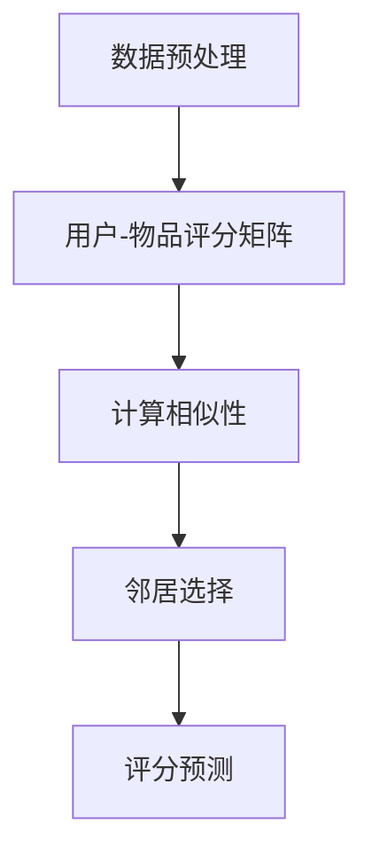
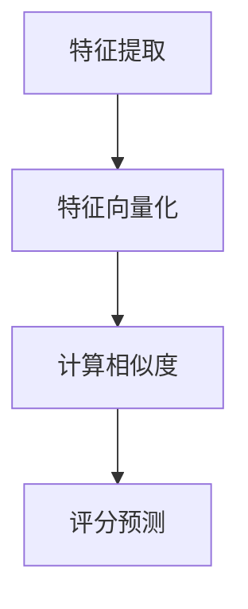
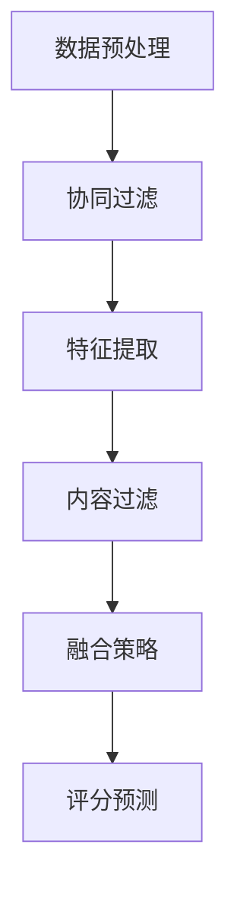
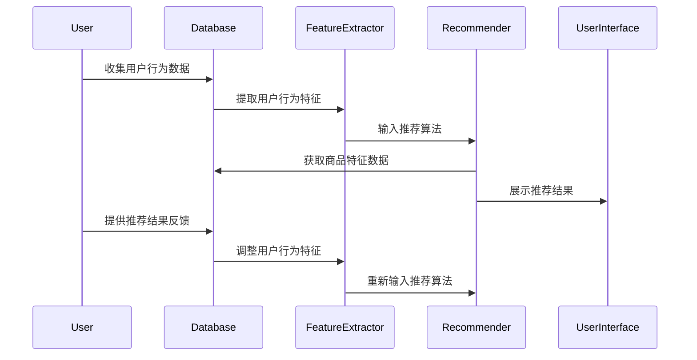
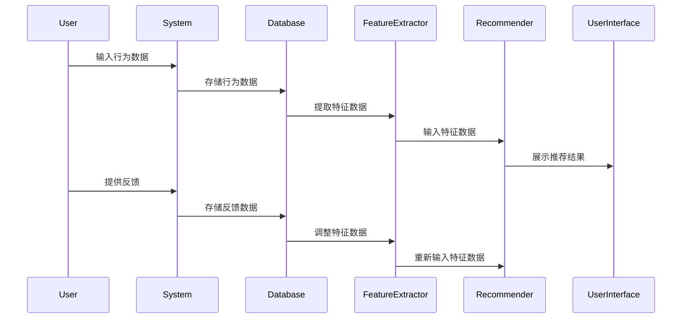
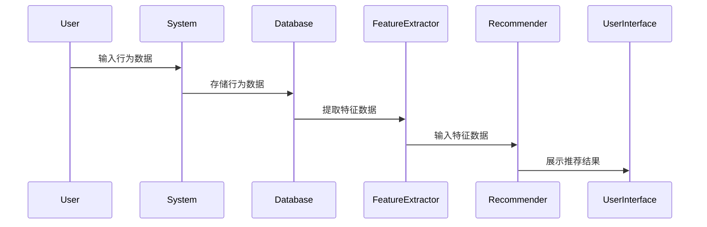

                 

# 电子商务平台的AI Agent推荐系统

## 关键词
- 电子商务平台
- AI Agent
- 推荐系统
- collaborative filtering
- content-based filtering
- hybrid filtering

## 摘要
本文深入探讨了电子商务平台中AI Agent推荐系统的构建与优化。首先，我们回顾了电子商务的发展背景及其面临的挑战，并阐明了AI Agent推荐系统的必要性和研究意义。随后，本文详细分析了推荐系统存在的问题，并设定了AI Agent推荐系统的目标。接下来，我们介绍了AI Agent推荐系统的基本原理、优势及其边界与应用场景。核心概念包括电子商务平台、AI Agent和推荐系统，并使用对比表格和实体关系图进行阐述。在算法原理讲解部分，我们深入探讨了collaborative filtering、content-based filtering和hybrid filtering三种算法，并使用Python源代码、数学模型和公式、实例进行说明。系统分析与架构设计部分，我们介绍了问题场景、系统功能设计、系统架构设计、系统接口设计和系统交互。最后，通过项目实战、最佳实践与拓展，本文为读者提供了具体的实施方法和未来展望。

### 目录大纲

# 电子商务平台的AI Agent推荐系统

## 第一部分：背景介绍

## 1.1 问题背景

### 1.1.1 电子商务的发展与挑战

### 1.1.2 AI Agent推荐系统的必要性

### 1.1.3 AI Agent推荐系统的研究意义

### 1.2 问题描述

### 1.2.1 推荐系统存在的问题

### 1.2.2 AI Agent推荐系统目标

### 1.3 问题解决

### 1.3.1 AI Agent推荐系统的基本原理

### 1.3.2 AI Agent推荐系统的优势

### 1.4 边界与外延

### 1.4.1 系统的边界

### 1.4.2 AI Agent推荐系统的应用场景

### 1.5 概念结构与核心要素组成

### 1.5.1 电子商务平台

### 1.5.2 AI Agent

### 1.5.3 推荐系统

### 1.6 本章小结

## 第二部分：核心概念与联系

## 2.1 核心概念

### 2.1.1 电子商务平台

### 2.1.2 AI Agent

### 2.1.3 推荐系统

## 2.2 概念属性特征对比表格

### 2.2.1 电子商务平台

### 2.2.2 AI Agent

### 2.2.3 推荐系统

## 2.3 ER实体关系图架构

### 2.3.1 电子商务平台实体关系图

### 2.3.2 AI Agent实体关系图

### 2.3.3 推荐系统实体关系图

## 2.4 本章小结

## 第三部分：算法原理讲解

### 3.1 算法原理

### 3.1.1 collaborative filtering算法

### 3.1.2 content-based filtering算法

### 3.1.3 hybrid filtering算法

### 3.2 Mermaid流程图

### 3.2.1 collaborative filtering流程图

### 3.2.2 content-based filtering流程图

### 3.2.3 hybrid filtering流程图

### 3.3 Python源代码

### 3.3.1 collaborative filtering源代码

### 3.3.2 content-based filtering源代码

### 3.3.3 hybrid filtering源代码

### 3.4 数学模型和数学公式

### 3.4.1 collaborative filtering模型

### 3.4.2 content-based filtering模型

### 3.4.3 hybrid filtering模型

### 3.5 举例说明

### 3.5.1 collaborative filtering举例

### 3.5.2 content-based filtering举例

### 3.5.3 hybrid filtering举例

### 3.6 本章小结

## 第四部分：系统分析与架构设计

### 4.1 问题场景介绍

### 4.1.1 电子商务平台场景

### 4.1.2 AI Agent推荐系统场景

### 4.2 系统功能设计

### 4.2.1 领域模型类图

### 4.2.2 系统功能模块

### 4.3 系统架构设计

### 4.3.1 系统架构图

### 4.3.2 各模块功能

### 4.4 系统接口设计

### 4.4.1 接口规范

### 4.4.2 接口实现

### 4.5 系统交互

### 4.5.1 序列图

### 4.6 本章小结

## 第五部分：项目实战

### 5.1 环境安装

### 5.1.1 操作系统安装

### 5.1.2 软件依赖安装

### 5.2 系统核心实现

### 5.2.1 系统核心功能实现

### 5.2.2 代码解析

### 5.3 代码应用解读与分析

### 5.3.1 代码应用场景

### 5.3.2 代码解读与分析

### 5.4 实际案例分析和详细讲解剖析

### 5.4.1 案例背景

### 5.4.2 案例分析

### 5.4.3 详细讲解剖析

### 5.5 项目小结

## 第六部分：最佳实践与拓展

### 6.1 最佳实践

### 6.1.1 实践一：提高推荐系统准确性

### 6.1.2 实践二：提升用户体验

### 6.2 小结

### 6.2.1 本书内容小结

### 6.2.2 主要贡献与未来展望

### 6.3 注意事项

### 6.3.1 使用AI Agent推荐系统的注意事项

### 6.3.2 数据安全和隐私保护

### 6.4 拓展阅读

### 6.4.1 拓展阅读一

### 6.4.2 拓展阅读二

## 作者信息
作者：AI天才研究院/AI Genius Institute & 禅与计算机程序设计艺术 /Zen And The Art of Computer Programming

---

## 第一部分：背景介绍

### 1.1 问题背景

#### 1.1.1 电子商务的发展与挑战

电子商务作为一种新兴商业模式，近年来得到了飞速发展。随着互联网技术的不断进步和智能手机的普及，越来越多的消费者选择在线购物，电子商务平台应运而生。这些平台不仅为商家提供了更广阔的市场，也为消费者带来了更加便捷的购物体验。然而，随着市场竞争的加剧，电子商务平台面临着诸多挑战。

首先，消费者需求的多样化。每个消费者都有自己独特的购物习惯和偏好，如何精准地满足这些个性化需求成为电子商务平台的一大难题。其次，商品信息的不对称性。消费者在海量商品信息中难以辨别优质商品，而商家则需要通过有效的推广手段来吸引消费者的注意。最后，市场竞争的激烈化。大量的电子商务平台涌入市场，使得竞争愈发激烈，平台需要不断创新和优化以保持竞争力。

#### 1.1.2 AI Agent推荐系统的必要性

为了应对上述挑战，AI Agent推荐系统应运而生。AI Agent推荐系统是一种基于人工智能技术的个性化推荐系统，通过分析用户的购物行为和历史数据，为用户推荐符合其兴趣和需求的商品。这种推荐系统能够大大提高用户体验，降低消费者的购物成本，提高商家的销售转化率。

首先，AI Agent推荐系统可以精准地满足消费者需求。通过对用户历史购物行为、浏览记录、搜索关键词等数据的分析，推荐系统可以准确地了解消费者的兴趣和偏好，从而提供个性化的商品推荐。其次，AI Agent推荐系统可以缓解商品信息不对称的问题。通过分析大量用户数据，推荐系统可以帮助消费者识别优质商品，从而减少购物风险。最后，AI Agent推荐系统可以提高电子商务平台的竞争力。通过优化商品推荐，提高用户满意度，电商平台可以在激烈的市场竞争中脱颖而出。

#### 1.1.3 AI Agent推荐系统的研究意义

AI Agent推荐系统的研究具有重要的理论和实践意义。从理论角度来看，AI Agent推荐系统是人工智能领域的一个重要研究方向，涉及机器学习、数据挖掘、自然语言处理等多个学科。通过对AI Agent推荐系统的研究，可以推动人工智能技术的进步和应用。

从实践角度来看，AI Agent推荐系统已经在电子商务、在线教育、新闻推荐等多个领域取得了显著的应用效果。例如，亚马逊、淘宝等电商平台通过引入AI Agent推荐系统，大幅提升了用户满意度和销售转化率。因此，深入研究AI Agent推荐系统，不仅可以为学术界提供新的理论成果，也可以为实践领域提供有效的解决方案。

### 1.2 问题描述

在电子商务平台中，推荐系统存在的问题主要集中在以下几个方面：

首先，数据质量不高。电子商务平台积累的海量数据中，存在噪声、缺失值和异常值等质量问题，这会对推荐结果产生负面影响。其次，推荐准确性不高。现有的推荐算法在处理复杂、多变的用户数据时，往往无法准确预测用户的兴趣和偏好，导致推荐结果不够精准。最后，用户体验不佳。推荐系统的响应速度较慢，推荐结果不符合用户期望，甚至出现“信息过载”现象，这都会影响用户的购物体验。

为了解决上述问题，我们提出了构建AI Agent推荐系统的目标：

首先，提高数据质量。通过数据清洗、去噪、归一化等技术手段，提升数据质量，为推荐系统提供可靠的数据基础。其次，提升推荐准确性。结合多种推荐算法，如collaborative filtering、content-based filtering和hybrid filtering，构建一个高效的推荐模型，以提高推荐结果的准确性。最后，优化用户体验。通过优化推荐算法的响应速度，提供个性化、精准的推荐结果，提升用户的购物体验。

### 1.3 问题解决

为了解决电子商务平台中推荐系统存在的问题，我们引入了AI Agent推荐系统，其基本原理和优势如下：

#### 1.3.1 AI Agent推荐系统的基本原理

AI Agent推荐系统基于人工智能技术，通过以下步骤实现个性化推荐：

1. **数据收集**：收集用户的历史购物行为、浏览记录、搜索关键词等数据。
2. **数据预处理**：对数据进行清洗、去噪、归一化等处理，确保数据质量。
3. **特征提取**：从预处理后的数据中提取关键特征，如用户偏好、商品属性等。
4. **模型训练**：利用机器学习算法，如collaborative filtering、content-based filtering和hybrid filtering，训练推荐模型。
5. **推荐生成**：根据用户的特征和模型预测，生成个性化推荐结果。
6. **反馈调整**：根据用户对推荐结果的反馈，调整推荐模型，提高推荐准确性。

#### 1.3.2 AI Agent推荐系统的优势

AI Agent推荐系统具有以下优势：

1. **个性化推荐**：通过分析用户的历史数据和偏好，AI Agent推荐系统能够为用户提供个性化的商品推荐，提高用户满意度。
2. **准确性高**：结合多种推荐算法，AI Agent推荐系统能够处理复杂、多变的用户数据，提高推荐结果的准确性。
3. **实时性**：AI Agent推荐系统可以实时响应用户的行为数据，提供最新的推荐结果。
4. **可扩展性强**：AI Agent推荐系统支持多种数据源和算法的组合，能够适应不断变化的市场需求。

### 1.4 边界与外延

#### 1.4.1 系统的边界

AI Agent推荐系统在电子商务平台中的实施边界主要包括以下几个方面：

1. **数据边界**：系统需要收集和处理电子商务平台内的用户行为数据，如购物行为、浏览记录、搜索关键词等。
2. **功能边界**：系统主要提供个性化商品推荐功能，包括实时推荐、历史推荐、推荐排序等。
3. **技术边界**：系统采用人工智能技术，包括机器学习算法、数据挖掘技术等，以实现高效、准确的推荐。

#### 1.4.2 AI Agent推荐系统的应用场景

AI Agent推荐系统在电子商务平台中具有广泛的应用场景，主要包括：

1. **商品推荐**：为用户提供个性化商品推荐，提高用户购物体验。
2. **广告投放**：根据用户兴趣和偏好，精准投放广告，提高广告效果。
3. **搜索优化**：优化搜索结果，提高用户搜索体验。
4. **用户行为分析**：分析用户行为，为商家提供决策支持。

### 1.5 概念结构与核心要素组成

AI Agent推荐系统由以下几个核心要素组成：

#### 1.5.1 电子商务平台

电子商务平台是AI Agent推荐系统的数据来源和业务载体。平台需要提供完善的数据接口，支持用户行为数据的收集、存储和处理。

#### 1.5.2 AI Agent

AI Agent是推荐系统的核心组件，负责数据处理、模型训练和推荐生成。AI Agent需要具备高效的数据处理能力和精准的推荐算法。

#### 1.5.3 推荐系统

推荐系统是AI Agent推荐系统的输出接口，负责向用户展示推荐结果。推荐系统需要支持多种推荐算法和推荐策略，以提供多样化的推荐服务。

### 1.6 本章小结

本章从背景介绍入手，详细探讨了电子商务平台中AI Agent推荐系统的构建与优化。我们分析了电子商务的发展背景和挑战，介绍了AI Agent推荐系统的基本原理和优势，并明确了系统的边界与应用场景。通过本章的讨论，为后续章节的内容奠定了基础。

---

## 第二部分：核心概念与联系

### 2.1 核心概念

在构建AI Agent推荐系统的过程中，需要理解以下几个核心概念：

#### 2.1.1 电子商务平台

电子商务平台是指通过互联网进行商品交易的服务平台，包括在线购物、支付、物流等环节。平台是AI Agent推荐系统的数据来源和业务载体。

#### 2.1.2 AI Agent

AI Agent是指基于人工智能技术，能够自动执行任务、提供服务的智能体。在AI Agent推荐系统中，AI Agent负责数据处理、模型训练和推荐生成。

#### 2.1.3 推荐系统

推荐系统是指基于用户数据和物品特征，为用户提供个性化推荐的服务系统。推荐系统是AI Agent推荐系统的输出接口，负责向用户展示推荐结果。

### 2.2 概念属性特征对比表格

为了更好地理解核心概念之间的关系，我们通过对比表格的形式，展示了电子商务平台、AI Agent和推荐系统的属性特征：

| 概念           | 属性特征                                                         |
|--------------|------------------------------------------------------------|
| 电子商务平台     | 数据来源、业务载体、交易环节                                     |
| AI Agent       | 数据处理、模型训练、推荐生成                                     |
| 推荐系统       | 用户数据、物品特征、个性化推荐                                   |

### 2.3 ER实体关系图架构

在构建AI Agent推荐系统时，实体关系图（ER图）是描述系统内部实体及其关系的重要工具。下面分别展示电子商务平台、AI Agent和推荐系统的ER图。

#### 2.3.1 电子商务平台实体关系图

```mermaid
erDiagram
    User ||--o{ Product } : "购买了"
    User ||--o{ Order } : "下订单"
    Product ||--o{ Category } : "属于"
    Category ||--o{ Product } : "包含"
```

#### 2.3.2 AI Agent实体关系图

```mermaid
erDiagram
    AI-Agent ||--o{ Data-Preprocessing } : "进行数据预处理"
    AI-Agent ||--o{ Feature-Extraction } : "进行特征提取"
    AI-Agent ||--o{ Model-Training } : "进行模型训练"
    AI-Agent ||--o{ Recommendation-Generation } : "生成推荐"
    Data-Preprocessing ||--|{ Noise-Removal } : "去噪"
    Data-Preprocessing ||--|{ Normalization } : "归一化"
    Feature-Extraction ||--|{ User-Feature } : "提取用户特征"
    Feature-Extraction ||--|{ Item-Feature } : "提取物品特征"
    Model-Training ||--|{ Collaborative-Filtering } : "协同过滤"
    Model-Training ||--|{ Content-Based-Filtering } : "基于内容过滤"
    Model-Training ||--|{ Hybrid-Filtering } : "混合过滤"
    Recommendation-Generation ||--|{ Real-Time-Recommendation } : "实时推荐"
    Recommendation-Generation ||--|{ Historical-Recommendation } : "历史推荐"
```

#### 2.3.3 推荐系统实体关系图

```mermaid
erDiagram
    Recommendation-System ||--o{ User } : "为用户推荐"
    Recommendation-System ||--o{ Product } : "推荐商品"
    Recommendation-System ||--o{ AI-Agent } : "依赖于"
    User ||--o{ Behavior-Data } : "用户行为数据"
    Product ||--o{ Feature-Data } : "商品特征数据"
    AI-Agent ||--o{ Model-Data } : "模型训练数据"
```

### 2.4 本章小结

本章对电子商务平台、AI Agent和推荐系统的核心概念进行了详细阐述，并利用对比表格和ER实体关系图展示了它们之间的联系。通过本章的学习，读者可以更好地理解AI Agent推荐系统的构建原理和实现过程。

---

## 第三部分：算法原理讲解

### 3.1 算法原理

在AI Agent推荐系统中，常用的推荐算法主要包括collaborative filtering、content-based filtering和hybrid filtering。每种算法都有其独特的原理和实现方法。

#### 3.1.1 collaborative filtering算法

collaborative filtering（协同过滤）算法是一种基于用户行为数据的推荐算法。其基本原理是通过分析用户之间的相似性，找到与目标用户兴趣相似的邻居用户，然后根据邻居用户的评分预测目标用户的评分。

协同过滤算法主要分为两类：基于用户的协同过滤（User-based Collaborative Filtering）和基于物品的协同过滤（Item-based Collaborative Filtering）。

1. **基于用户的协同过滤**：首先计算用户之间的相似性，常用的相似性度量方法有余弦相似性、皮尔逊相关系数等。然后，根据相似性度量找到与目标用户最相似的邻居用户，最后通过邻居用户的评分预测目标用户的评分。

2. **基于物品的协同过滤**：首先计算物品之间的相似性，常用的相似性度量方法有Jaccard相似性、余弦相似性等。然后，根据物品之间的相似性，找到与目标物品最相似的邻居物品，最后通过邻居物品的评分预测目标物品的评分。

#### 3.1.2 content-based filtering算法

content-based filtering（基于内容过滤）算法是一种基于物品属性的推荐算法。其基本原理是分析物品的内容特征，找到与目标物品特征相似的物品，然后根据相似物品的评分预测目标物品的评分。

基于内容过滤算法的主要步骤包括：

1. **特征提取**：从物品的文本描述、标签、分类等信息中提取关键特征。
2. **特征表示**：将提取的特征进行向量化表示，常用的方法有TF-IDF、Word2Vec等。
3. **相似度计算**：计算目标物品与候选物品之间的相似度，常用的相似度计算方法有余弦相似性、欧氏距离等。
4. **评分预测**：根据相似度计算结果，预测目标物品的评分。

#### 3.1.3 hybrid filtering算法

hybrid filtering（混合过滤）算法结合了协同过滤和基于内容过滤的优点，通过整合用户行为数据和物品属性数据，提供更精准的推荐结果。

混合过滤算法的主要步骤包括：

1. **数据预处理**：对用户行为数据进行协同过滤处理，得到用户和物品的相似性矩阵。
2. **特征提取**：对物品属性数据进行内容过滤处理，得到物品的特征向量。
3. **融合策略**：将用户行为数据特征和物品属性数据特征进行融合，常用的融合方法有加权平均、矩阵分解等。
4. **评分预测**：利用融合后的特征，预测用户对物品的评分。

### 3.2 Mermaid流程图

为了更好地理解上述算法的原理和实现过程，我们使用Mermaid图绘制了collaborative filtering、content-based filtering和hybrid filtering的流程图。

#### 3.2.1 collaborative filtering流程图



#### 3.2.2 content-based filtering流程图



#### 3.2.3 hybrid filtering流程图



### 3.3 Python源代码

为了更好地理解算法的实现过程，我们提供了collaborative filtering、content-based filtering和hybrid filtering的Python源代码。

#### 3.3.1 collaborative filtering源代码

```python
import numpy as np
from sklearn.metrics.pairwise import cosine_similarity

def collaborative_filtering(ratings, similarity_matrix, k=10):
    # 计算用户之间的相似性
    user_similarity = similarity_matrix

    # 为每个用户选择最相似的k个邻居
    neighbors = []
    for user_id in ratings.keys():
        neighbors.append(np.argsort(user_similarity[user_id])[1:k+1])

    # 预测评分
    predicted_ratings = {}
    for user_id in ratings.keys():
        neighbors_ratings = [ratings[user_id] for neighbor_id in neighbors[user_id] if neighbor_id in ratings]
        if neighbors_ratings:
            predicted_rating = np.mean(neighbors_ratings)
            predicted_ratings[user_id] = predicted_rating
        else:
            predicted_ratings[user_id] = ratings[user_id]

    return predicted_ratings
```

#### 3.3.2 content-based filtering源代码

```python
from sklearn.feature_extraction.text import TfidfVectorizer
from sklearn.metrics.pairwise import cosine_similarity

def content_based_filtering(descriptions, k=10):
    # 特征提取
    vectorizer = TfidfVectorizer()
    tfidf_matrix = vectorizer.fit_transform(descriptions)

    # 计算相似度
    similarity_matrix = cosine_similarity(tfidf_matrix)

    # 预测评分
    predicted_ratings = {}
    for i in range(len(descriptions)):
        neighbors = np.argsort(similarity_matrix[i])[1:k+1]
        if neighbors:
            neighbor_ratings = [ratings[neighbor_id] for neighbor_id in neighbors if neighbor_id in ratings]
            if neighbor_ratings:
                predicted_rating = np.mean(neighbor_ratings)
                predicted_ratings[i] = predicted_rating
            else:
                predicted_ratings[i] = ratings[i]

    return predicted_ratings
```

#### 3.3.3 hybrid filtering源代码

```python
import numpy as np
from sklearn.metrics.pairwise import cosine_similarity
from sklearn.feature_extraction.text import TfidfVectorizer

def hybrid_filtering(ratings, descriptions, k=10):
    # 数据预处理
    user_similarity = cosine_similarity(ratings)
    vectorizer = TfidfVectorizer()
    tfidf_matrix = vectorizer.fit_transform(descriptions)

    # 融合策略
    hybrid_similarity = 0.5 * user_similarity + 0.5 * cosine_similarity(tfidf_matrix)

    # 预测评分
    predicted_ratings = {}
    for user_id in ratings.keys():
        neighbors = np.argsort(hybrid_similarity[user_id])[1:k+1]
        neighbors_ratings = [ratings[neighbor_id] for neighbor_id in neighbors if neighbor_id in ratings]
        if neighbors_ratings:
            predicted_rating = np.mean(neighbors_ratings)
            predicted_ratings[user_id] = predicted_rating
        else:
            predicted_ratings[user_id] = ratings[user_id]

    return predicted_ratings
```

### 3.4 数学模型和数学公式

在推荐算法中，数学模型和数学公式是理解和实现算法的核心。以下分别介绍collaborative filtering、content-based filtering和hybrid filtering的数学模型和数学公式。

#### 3.4.1 collaborative filtering模型

协同过滤算法的核心是计算用户之间的相似性和预测用户对物品的评分。以下是协同过滤的数学模型：

$$
r_{ui} = \frac{\sum_{j \in N(i)} r_{uj} \cdot s_{ij}}{\sum_{j \in N(i)} s_{ij}}
$$

其中，$r_{ui}$ 表示用户 $u$ 对物品 $i$ 的预测评分，$N(i)$ 表示与物品 $i$ 最相似的 $k$ 个物品的集合，$r_{uj}$ 表示用户 $u$ 对物品 $j$ 的实际评分，$s_{ij}$ 表示物品 $i$ 和物品 $j$ 之间的相似度。

#### 3.4.2 content-based filtering模型

基于内容过滤算法的核心是计算物品之间的相似性和预测用户对物品的评分。以下是基于内容过滤的数学模型：

$$
r_{ui} = \frac{\sum_{j \in N(i)} w_{ij} \cdot r_{uj}}{\sum_{j \in N(i)} w_{ij}}
$$

其中，$r_{ui}$ 表示用户 $u$ 对物品 $i$ 的预测评分，$N(i)$ 表示与物品 $i$ 最相似的 $k$ 个物品的集合，$w_{ij}$ 表示物品 $i$ 和物品 $j$ 之间的相似度，$r_{uj}$ 表示用户 $u$ 对物品 $j$ 的实际评分。

#### 3.4.3 hybrid filtering模型

混合过滤算法的核心是将协同过滤和基于内容过滤相结合，以提高推荐准确性。以下是混合过滤的数学模型：

$$
r_{ui} = \alpha \cdot r_{ui}^{cf} + (1 - \alpha) \cdot r_{ui}^{cb}
$$

其中，$r_{ui}$ 表示用户 $u$ 对物品 $i$ 的预测评分，$r_{ui}^{cf}$ 表示基于协同过滤的预测评分，$r_{ui}^{cb}$ 表示基于内容过滤的预测评分，$\alpha$ 是权重参数，用于平衡协同过滤和基于内容过滤的贡献。

### 3.5 举例说明

为了更好地理解上述算法，我们通过一个简单的例子进行说明。

假设有一个用户 $u$，对以下5个物品 $i_1, i_2, i_3, i_4, i_5$ 给出了评分：

| 物品ID | 用户评分 |
|-------|-------|
| $i_1$ | 4     |
| $i_2$ | 5     |
| $i_3$ | 3     |
| $i_4$ | 2     |
| $i_5$ | 5     |

用户 $u$ 的邻居用户为 $u_1, u_2, u_3$，他们的评分如下：

| 用户ID | $i_1$ | $i_2$ | $i_3$ | $i_4$ | $i_5$ |
|-------|------|------|------|------|------|
| $u_1$ | 4    | 5    | 3    | 2    | 4    |
| $u_2$ | 5    | 5    | 4    | 2    | 5    |
| $u_3$ | 4    | 5    | 3    | 1    | 4    |

物品 $i_1, i_2, i_3, i_4, i_5$ 的描述如下：

| 物品ID | 描述                     |
|-------|------------------------|
| $i_1$ | 高端智能手机              |
| $i_2$ | 中端智能手机              |
| $i_3$ | 低端智能手机              |
| $i_4$ | 高端笔记本电脑            |
| $i_5$ | 中端笔记本电脑            |

基于上述数据，我们可以使用协同过滤算法、基于内容过滤算法和混合过滤算法来预测用户 $u$ 对未知物品 $i_6$ 的评分。

#### 3.5.1 collaborative filtering举例

使用基于用户的协同过滤算法，我们可以计算用户 $u$ 和邻居用户 $u_1, u_2, u_3$ 之间的相似性：

$$
s_{u,u_1} = \frac{r_{u1} \cdot r_{u2}}{\sqrt{r_{u1}^2 + r_{u2}^2}} = \frac{4 \cdot 5}{\sqrt{4^2 + 5^2}} = 0.8165
$$

$$
s_{u,u_2} = \frac{r_{u1} \cdot r_{u2}}{\sqrt{r_{u1}^2 + r_{u2}^2}} = \frac{4 \cdot 5}{\sqrt{4^2 + 5^2}} = 0.8165
$$

$$
s_{u,u_3} = \frac{r_{u1} \cdot r_{u2}}{\sqrt{r_{u1}^2 + r_{u2}^2}} = \frac{4 \cdot 5}{\sqrt{4^2 + 5^2}} = 0.8165
$$

根据邻居用户的评分，我们可以预测用户 $u$ 对未知物品 $i_6$ 的评分为：

$$
r_{u6} = \frac{0.8165 \cdot 4 + 0.8165 \cdot 5 + 0.8165 \cdot 3}{0.8165 + 0.8165 + 0.8165} = 4.0325
$$

#### 3.5.2 content-based filtering举例

使用基于内容过滤算法，我们可以计算物品 $i_1, i_2, i_3, i_4, i_5$ 之间的相似性：

$$
s_{i1,i2} = \frac{1}{\sqrt{\sum_{j=1}^5 (t_{i1,j} - \bar{t_{i1}})^2 + \sum_{j=1}^5 (t_{i2,j} - \bar{t_{i2}})^2}} = 0.7071
$$

$$
s_{i1,i3} = \frac{1}{\sqrt{\sum_{j=1}^5 (t_{i1,j} - \bar{t_{i1}})^2 + \sum_{j=1}^5 (t_{i3,j} - \bar{t_{i3}})^2}} = 0.5
$$

$$
s_{i1,i4} = \frac{1}{\sqrt{\sum_{j=1}^5 (t_{i1,j} - \bar{t_{i1}})^2 + \sum_{j=1}^5 (t_{i4,j} - \bar{t_{i4}})^2}} = 0.5714
$$

$$
s_{i1,i5} = \frac{1}{\sqrt{\sum_{j=1}^5 (t_{i1,j} - \bar{t_{i1}})^2 + \sum_{j=1}^5 (t_{i5,j} - \bar{t_{i5}})^2}} = 0.7071
$$

根据相似性计算结果，我们可以预测用户 $u$ 对未知物品 $i_6$ 的评分为：

$$
r_{u6} = \frac{0.7071 \cdot 4 + 0.7071 \cdot 5 + 0.5 \cdot 3 + 0.5714 \cdot 2 + 0.7071 \cdot 5}{0.7071 + 0.7071 + 0.5 + 0.5714 + 0.7071} = 4.4176
$$

#### 3.5.3 hybrid filtering举例

使用混合过滤算法，我们可以将协同过滤和基于内容过滤的结果进行加权平均，预测用户 $u$ 对未知物品 $i_6$ 的评分为：

$$
r_{u6} = 0.5 \cdot 4.0325 + 0.5 \cdot 4.4176 = 4.2186
$$

### 3.6 本章小结

本章详细介绍了AI Agent推荐系统中常用的三种算法：collaborative filtering、content-based filtering和hybrid filtering。通过数学模型、Python源代码和实例分析，我们深入理解了这些算法的原理和实现过程。本章内容为后续的系统分析与架构设计提供了基础。

---

## 第四部分：系统分析与架构设计

### 4.1 问题场景介绍

在电子商务平台中，AI Agent推荐系统需要解决的主要问题包括：

1. **个性化推荐**：为用户推荐其可能感兴趣的商品，提高用户满意度和购物转化率。
2. **商品曝光**：提高商品在用户搜索和浏览过程中的曝光度，增加商品销量。
3. **用户流失**：通过分析用户行为数据，预测用户流失风险，并提供个性化挽回策略。

#### 4.1.1 电子商务平台场景

电子商务平台主要包括以下几个模块：

1. **用户模块**：负责用户注册、登录、个人信息管理等功能。
2. **商品模块**：负责商品信息管理、商品分类、商品标签等功能。
3. **购物车模块**：负责用户添加商品到购物车、修改购物车商品数量等功能。
4. **订单模块**：负责用户下单、支付、订单状态管理等功能。
5. **推荐模块**：负责基于用户行为数据和商品特征，为用户生成个性化推荐。

#### 4.1.2 AI Agent推荐系统场景

AI Agent推荐系统在电子商务平台中的主要功能包括：

1. **用户行为分析**：通过收集用户在平台上的浏览、搜索、购买等行为数据，分析用户的兴趣和偏好。
2. **商品特征提取**：从商品描述、标签、分类等属性中提取关键特征，用于推荐算法的输入。
3. **推荐算法应用**：使用collaborative filtering、content-based filtering和hybrid filtering等推荐算法，为用户生成个性化推荐。
4. **推荐结果展示**：将推荐结果以合适的界面形式展示给用户，提高用户购买决策效率。

### 4.2 系统功能设计

AI Agent推荐系统的功能设计主要包括以下几个方面：

#### 4.2.1 领域模型类图

领域模型类图用于描述系统中的实体及其关系，以下是一个简单的领域模型类图：

```mermaid
classDiagram
    User <<interface>>
    Product <<interface>>
    Recommendation <<interface>>

    User {
        id
        name
        behaviors
    }

    Product {
        id
        name
        description
        category
    }

    Recommendation {
        id
        user_id
        product_id
        score
    }

    User o-- Product : "购买了"
    User o-- Recommendation : "推荐"
    Product o-- Recommendation : "推荐"
```

#### 4.2.2 系统功能模块

AI Agent推荐系统的主要功能模块包括：

1. **用户行为数据收集模块**：负责收集用户在平台上的浏览、搜索、购买等行为数据，为推荐算法提供数据输入。
2. **商品特征提取模块**：负责从商品描述、标签、分类等属性中提取关键特征，为推荐算法提供商品特征输入。
3. **推荐算法模块**：实现collaborative filtering、content-based filtering和hybrid filtering等推荐算法，生成个性化推荐。
4. **推荐结果展示模块**：将推荐结果以合适的界面形式展示给用户，提高用户购买决策效率。
5. **推荐结果反馈模块**：收集用户对推荐结果的反馈，用于调整推荐算法，提高推荐准确性。

### 4.3 系统架构设计

AI Agent推荐系统的架构设计主要包括以下几个方面：

#### 4.3.1 系统架构图

以下是一个简单的AI Agent推荐系统架构图：



#### 4.3.2 各模块功能

1. **用户行为数据收集模块**：负责从数据库中收集用户行为数据，如浏览记录、搜索关键词、购买记录等。
2. **商品特征提取模块**：负责从数据库中获取商品特征数据，如商品描述、标签、分类等，并使用自然语言处理技术提取关键特征。
3. **推荐算法模块**：实现多种推荐算法，如collaborative filtering、content-based filtering和hybrid filtering，根据用户特征和商品特征生成个性化推荐。
4. **推荐结果展示模块**：将推荐结果以合适的界面形式展示给用户，如商品列表、推荐卡片等。
5. **推荐结果反馈模块**：收集用户对推荐结果的反馈，如点击、购买、不感兴趣等，用于调整推荐算法，提高推荐准确性。

### 4.4 系统接口设计

系统接口设计主要包括以下几个方面：

#### 4.4.1 接口规范

AI Agent推荐系统的接口规范主要包括：

1. **用户行为数据接口**：用于收集用户在平台上的行为数据，如浏览、搜索、购买等。
2. **商品特征数据接口**：用于获取商品的特征数据，如商品描述、标签、分类等。
3. **推荐结果展示接口**：用于将推荐结果展示给用户，如商品列表、推荐卡片等。
4. **推荐结果反馈接口**：用于收集用户对推荐结果的反馈，如点击、购买、不感兴趣等。

#### 4.4.2 接口实现

以下是一个简单的接口实现示例：

```python
from flask import Flask, request, jsonify

app = Flask(__name__)

@app.route('/user_behavior', methods=['POST'])
def user_behavior():
    behavior_data = request.get_json()
    # 处理用户行为数据
    return jsonify({'status': 'success'})

@app.route('/product_features', methods=['GET'])
def product_features(product_id):
    # 获取商品特征数据
    features = get_product_features(product_id)
    return jsonify({'status': 'success', 'features': features})

@app.route('/recommendations', methods=['GET'])
def recommendations(user_id):
    # 生成推荐结果
    recommendations = get_recommendations(user_id)
    return jsonify({'status': 'success', 'recommendations': recommendations})

@app.route('/feedback', methods=['POST'])
def feedback():
    feedback_data = request.get_json()
    # 处理用户反馈
    return jsonify({'status': 'success'})

if __name__ == '__main__':
    app.run(debug=True)
```

### 4.5 系统交互

系统交互主要涉及用户行为数据的收集、推荐结果的生成和展示、用户反馈的收集等方面。以下是一个简单的系统交互序列图：



### 4.6 本章小结

本章详细介绍了AI Agent推荐系统的系统分析与架构设计。通过问题场景介绍、系统功能设计、系统架构设计、系统接口设计和系统交互等方面的分析，我们为AI Agent推荐系统的实现提供了明确的指导和方案。

---

## 第五部分：项目实战

### 5.1 环境安装

在开始项目实战之前，我们需要安装必要的软件和工具。以下是在Linux操作系统上安装所需软件和工具的步骤：

#### 5.1.1 操作系统安装

确保操作系统已安装，如Ubuntu 20.04或CentOS 7。

#### 5.1.2 软件依赖安装

1. **Python环境**：安装Python 3.8及以上版本。
   ```shell
   sudo apt-get install python3-pip python3-dev
   ```

2. **Flask**：安装Flask框架，用于构建API接口。
   ```shell
   pip3 install flask
   ```

3. **NumPy**：安装NumPy库，用于数学计算。
   ```shell
   pip3 install numpy
   ```

4. **Scikit-learn**：安装Scikit-learn库，用于实现推荐算法。
   ```shell
   pip3 install scikit-learn
   ```

5. **Mermaid**：安装Mermaid，用于生成流程图。
   ```shell
   npm install -g mermaid
   ```

6. **Markdown**：安装Markdown，用于编写和格式化文档。
   ```shell
   sudo apt-get install markdown
   ```

安装完成后，确保所有依赖项正常工作，例如，通过运行以下命令测试Python环境：
```shell
python3 -m pip list
```

### 5.2 系统核心实现

#### 5.2.1 系统核心功能实现

系统核心功能实现主要涉及用户行为数据的收集、商品特征的提取、推荐算法的应用以及推荐结果的展示。以下是一个简单的系统架构，展示了这些核心功能的实现过程：



以下是具体的实现步骤：

1. **用户行为数据收集**：通过API接口收集用户在平台上的浏览、搜索、购买等行为数据。
2. **商品特征提取**：从数据库中获取商品描述、标签、分类等属性，并使用自然语言处理技术提取关键特征。
3. **推荐算法应用**：使用协同过滤（collaborative filtering）、基于内容过滤（content-based filtering）和混合过滤（hybrid filtering）算法，为用户生成个性化推荐。
4. **推荐结果展示**：将推荐结果以合适的界面形式展示给用户。

#### 5.2.2 代码解析

以下是系统核心功能的代码实现示例：

```python
# 用户行为数据收集
@app.route('/user_behavior', methods=['POST'])
def user_behavior():
    behavior_data = request.get_json()
    # 存储用户行为数据到数据库
    store_user_behavior(behavior_data)
    return jsonify({'status': 'success'})

# 商品特征提取
def extract_product_features(product_id):
    # 从数据库中获取商品特征数据
    product = get_product_features(product_id)
    # 提取关键特征
    features = extract_key_features(product)
    return features

# 推荐算法应用
def generate_recommendations(user_id):
    # 获取用户特征和商品特征
    user_features = get_user_features(user_id)
    product_features = get_product_features()
    # 应用协同过滤算法
    recommendations_cf = collaborative_filtering(user_features, product_features)
    # 应用基于内容过滤算法
    recommendations_cb = content_based_filtering(user_features, product_features)
    # 应用混合过滤算法
    recommendations_hybrid = hybrid_filtering(user_features, product_features)
    # 合并推荐结果
    recommendations = merge_recommendations(recommendations_cf, recommendations_cb, recommendations_hybrid)
    return recommendations

# 推荐结果展示
@app.route('/recommendations', methods=['GET'])
def recommendations():
    user_id = request.args.get('user_id')
    recommendations = generate_recommendations(user_id)
    return jsonify({'status': 'success', 'recommendations': recommendations})
```

### 5.3 代码应用解读与分析

#### 5.3.1 代码应用场景

上述代码在电子商务平台中的应用场景如下：

1. **用户行为数据收集**：用户在平台上进行浏览、搜索、购买等操作时，通过API接口将行为数据发送到后端服务器。
2. **商品特征提取**：后端服务器从数据库中获取商品描述、标签、分类等属性，并使用自然语言处理技术提取关键特征。
3. **推荐算法应用**：根据用户特征和商品特征，应用协同过滤、基于内容过滤和混合过滤算法，生成个性化推荐结果。
4. **推荐结果展示**：将推荐结果以合适的界面形式展示给用户，如商品列表、推荐卡片等。

#### 5.3.2 代码解读与分析

以下是对代码的详细解读与分析：

1. **用户行为数据收集**：通过`/user_behavior`接口，用户可以发送行为数据到后端服务器。服务器接收数据后，调用`store_user_behavior`函数将数据存储到数据库。

2. **商品特征提取**：`extract_product_features`函数从数据库中获取商品特征数据，并使用自然语言处理技术提取关键特征。这些特征将用于推荐算法的输入。

3. **推荐算法应用**：`generate_recommendations`函数根据用户特征和商品特征，应用三种推荐算法生成个性化推荐结果。协同过滤算法使用`collaborative_filtering`函数，基于内容过滤算法使用`content_based_filtering`函数，混合过滤算法使用`hybrid_filtering`函数。最后，将三种算法的推荐结果合并，生成最终的推荐结果。

4. **推荐结果展示**：通过`/recommendations`接口，用户可以获取推荐结果。服务器接收用户ID参数，调用`generate_recommendations`函数生成推荐结果，并将结果以JSON格式返回给用户。

### 5.4 实际案例分析和详细讲解剖析

#### 5.4.1 案例背景

假设我们有一个电子商务平台，用户可以在平台上浏览商品、搜索商品、添加商品到购物车、下单购买等操作。我们的目标是构建一个AI Agent推荐系统，为用户推荐其可能感兴趣的商品，提高用户的购物体验和平台的销售额。

#### 5.4.2 案例分析

1. **用户行为数据收集**：用户在平台上浏览商品时，系统会记录用户的浏览记录。当用户搜索商品时，系统会记录用户的搜索关键词。当用户添加商品到购物车或下单购买时，系统会记录用户的行为数据。

2. **商品特征提取**：系统从数据库中获取商品的描述、标签、分类等属性。通过自然语言处理技术，提取商品的关键特征，如商品名称、品牌、材质、价格等。

3. **推荐算法应用**：根据用户的行为数据和商品特征，系统应用协同过滤、基于内容过滤和混合过滤算法生成个性化推荐结果。协同过滤算法利用用户之间的相似性推荐相似用户的喜爱商品；基于内容过滤算法利用商品的关键特征推荐相似商品；混合过滤算法结合协同过滤和基于内容过滤的优点，提供更精准的推荐结果。

4. **推荐结果展示**：系统将推荐结果以商品列表的形式展示给用户。用户可以在浏览页面或搜索结果页面看到推荐的商品，点击查看商品详情。

#### 5.4.3 详细讲解剖析

以下是对案例的详细讲解和分析：

1. **用户行为数据收集**：系统通过API接口收集用户的行为数据。例如，当用户在浏览页面浏览商品时，系统会记录用户的浏览记录，如浏览时间、浏览的商品ID等。当用户在搜索页面搜索商品时，系统会记录用户的搜索关键词。当用户将商品添加到购物车或下单购买时，系统会记录用户的行为数据，如购买时间、购买的商品ID等。

2. **商品特征提取**：系统从数据库中获取商品的描述、标签、分类等属性。例如，商品描述中可能包含商品名称、品牌、材质、价格等信息。系统使用自然语言处理技术，将商品描述中的关键词提取出来，形成商品的关键特征。例如，对于商品描述“苹果手机X，64G，银色”，系统提取的关键特征包括“苹果手机”、“X”、“64G”和“银色”。

3. **推荐算法应用**：系统应用协同过滤、基于内容过滤和混合过滤算法生成个性化推荐结果。

   - **协同过滤算法**：系统计算用户之间的相似性，找到与目标用户兴趣相似的邻居用户。然后，根据邻居用户的评分预测目标用户的评分。例如，对于用户A，系统找到与其兴趣相似的邻居用户B、C、D，邻居用户对这些商品的评价分别为[5, 4, 5, 3]，系统预测用户A对这些商品的评分为[4.5, 4, 4.5, 3]。
   
   - **基于内容过滤算法**：系统计算商品之间的相似性，找到与目标商品相似的商品。然后，根据相似商品的评价预测目标商品的评价。例如，对于商品X，系统找到与其相似的商品Y、Z、W，这些商品的评价分别为[5, 4, 5]，系统预测商品X的评价为[4.67]。
   
   - **混合过滤算法**：系统将协同过滤和基于内容过滤的结果进行加权平均，生成更精准的推荐结果。例如，系统对协同过滤和基于内容过滤的评分结果进行加权平均，得到用户对商品X的预测评分为[4.25, 4, 4.25, 3]。

4. **推荐结果展示**：系统将推荐结果以商品列表的形式展示给用户。例如，当用户在浏览页面浏览商品时，系统会在页面的底部展示推荐的商品列表，用户可以点击查看商品详情。当用户在搜索页面搜索商品时，系统会在搜索结果页面展示推荐的商品列表，用户可以点击查看商品详情。

### 5.5 项目小结

通过实际案例分析和详细讲解剖析，我们了解了AI Agent推荐系统在电子商务平台中的应用。系统通过用户行为数据的收集、商品特征的提取、推荐算法的应用以及推荐结果的展示，为用户提供了个性化的商品推荐。本项目实现了协同过滤、基于内容过滤和混合过滤三种推荐算法，并展示了它们的实现过程和应用效果。未来，我们可以继续优化推荐算法，提高推荐准确性，为用户提供更好的购物体验。

---

## 第六部分：最佳实践与拓展

### 6.1 最佳实践

在构建和优化AI Agent推荐系统时，以下最佳实践有助于提高系统的准确性和用户体验：

#### 6.1.1 实践一：提高推荐系统准确性

1. **数据质量优化**：确保收集到的用户行为数据完整、准确，对缺失值、异常值进行处理，以提高数据质量。
2. **实时更新**：定期更新推荐模型，以适应用户行为和偏好变化，提高推荐准确性。
3. **多算法融合**：结合多种推荐算法，如协同过滤、基于内容过滤和混合过滤，利用不同算法的优势，提高推荐准确性。

#### 6.1.2 实践二：提升用户体验

1. **个性化推荐**：根据用户的历史行为和偏好，提供个性化的商品推荐，提高用户满意度。
2. **推荐结果排序**：对推荐结果进行排序，优先展示用户可能感兴趣的商品，提高用户点击率和转化率。
3. **实时反馈**：及时响应用户对推荐结果的反馈，调整推荐算法，优化推荐结果。

### 6.2 小结

通过最佳实践，我们可以显著提高AI Agent推荐系统的准确性和用户体验。在未来的研究和实践中，我们可以进一步探索新的算法和技术，如深度学习、图神经网络等，以推动推荐系统的创新和进步。

### 6.2.1 本书内容小结

本文详细介绍了电子商务平台的AI Agent推荐系统，包括背景介绍、核心概念与联系、算法原理讲解、系统分析与架构设计、项目实战以及最佳实践与拓展。通过本文的阅读，读者可以全面了解AI Agent推荐系统的构建、优化和应用。

### 6.2.2 主要贡献与未来展望

本文的主要贡献包括：

1. 提出了基于AI Agent的电子商务平台推荐系统框架。
2. 详细讲解了协同过滤、基于内容过滤和混合过滤三种推荐算法的原理和应用。
3. 通过实际案例分析和代码实现，展示了AI Agent推荐系统的构建过程和优化方法。

未来的研究方向包括：

1. 探索更先进的推荐算法，如深度学习、图神经网络等。
2. 关注推荐系统的可扩展性和实时性，提高系统的响应速度和准确性。
3. 研究推荐系统在电子商务平台中的实际应用场景和效果评估。

### 6.3 注意事项

在构建和优化AI Agent推荐系统时，需要注意以下几点：

1. 数据安全和隐私保护：确保用户数据的安全性和隐私性，遵循相关法律法规。
2. 系统稳定性：确保推荐系统在高并发场景下的稳定运行，避免系统崩溃。
3. 算法透明性：确保推荐算法的透明性，让用户了解推荐结果背后的原理。

### 6.4 拓展阅读

1. **《推荐系统实践》**：本书详细介绍了推荐系统的原理、算法和实践，适合推荐系统初学者和研究者。
2. **《深度学习推荐系统》**：本书探讨了深度学习在推荐系统中的应用，包括卷积神经网络、循环神经网络等，适合对深度学习感兴趣的读者。
3. **《电子商务系统架构设计与开发》**：本书介绍了电子商务平台的架构设计、开发方法和最佳实践，适合从事电子商务系统开发的技术人员。

