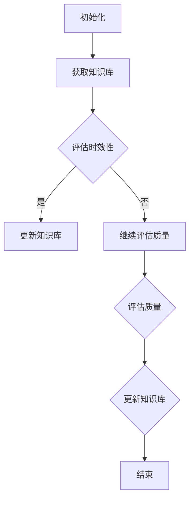
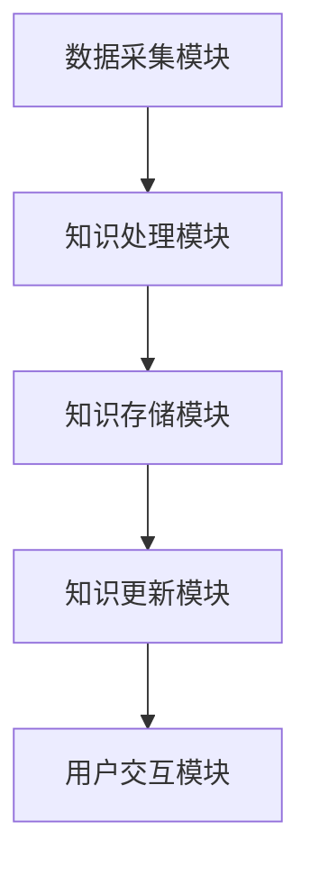
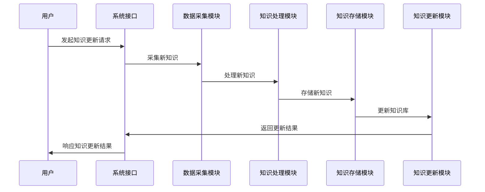

                 

# 知识更新：保持AI Agent信息的时效性

关键词：AI Agent、知识更新、时效性、算法、系统架构、最佳实践

摘要：本文探讨了如何保持AI Agent的信息时效性，首先介绍了AI Agent的背景和知识更新的重要性，然后详细阐述了知识更新的原理和时效性评估方法，接着讲解了算法原理、数学模型以及系统架构设计方案，并通过项目实战展示了具体实现过程。最后，总结了最佳实践、注意事项和拓展阅读，以帮助读者更好地理解和应用相关技术。

## 目录大纲设计步骤详解

### 1. 设计目标

设计一本关于《知识更新：保持AI Agent信息的时效性》的目录大纲，确保内容完整、逻辑清晰，符合markdown格式要求。

### 2. 目录大纲结构设计

为确保大纲结构的逻辑性和内容的完整性，我们将大纲分为以下几个部分：

### 第一部分：引言

- **第1章：背景介绍**
  - 1.1 问题背景
  - 1.2 问题描述
  - 1.3 问题解决
  - 1.4 边界与外延

### 第二部分：核心概念与联系

- **第2章：核心概念原理**
  - 2.1 AI Agent定义与特性
  - 2.2 知识更新原理
  - 2.3 时效性评估方法
  - 2.4 核心概念联系图（Mermaid ER实体关系图）

### 第三部分：算法原理讲解

- **第3章：算法原理与数学模型**
  - 3.1 算法概述
  - 3.2 数学模型
    - 3.2.1 公式1
    - 3.2.2 公式2
    - 3.2.3 算法流程图（Mermaid流程图）
  - 3.3 Python源代码实现

### 第四部分：系统分析与架构设计方案

- **第4章：系统功能与架构设计**
  - 4.1 问题场景介绍
  - 4.2 系统功能设计（Mermaid类图）
  - 4.3 系统架构设计（Mermaid架构图）
  - 4.4 系统接口设计
  - 4.5 系统交互设计（Mermaid序列图）

### 第五部分：项目实战

- **第5章：环境安装与核心实现**
  - 5.1 环境安装
  - 5.2 系统核心实现源代码
  - 5.3 代码应用解读与分析
  - 5.4 实际案例分析
  - 5.5 项目小结

### 第六部分：最佳实践、小结与拓展

- **第6章：最佳实践与拓展**
  - 6.1 最佳实践 Tips
  - 6.2 小结
  - 6.3 注意事项
  - 6.4 拓展阅读

### 3. 内容要求与格式规范

#### 第一部分：引言

- 简要介绍知识更新的背景和重要性，引出AI Agent信息时效性的问题。

#### 第二部分：核心概念与联系

- 详细阐述AI Agent的定义、知识更新的原理和时效性评估方法。
- 使用Mermaid ER实体关系图展示核心概念之间的联系。

#### 第三部分：算法原理讲解

- 概述算法的核心思想。
- 使用Mermaid流程图展示算法的流程。
- 使用Python源代码实现算法，并进行详细讲解。

#### 第四部分：系统分析与架构设计方案

- 介绍项目背景和系统功能需求。
- 使用Mermaid类图和架构图展示系统的设计。
- 设计系统的接口和交互流程。

#### 第五部分：项目实战

- 介绍环境安装和系统核心实现。
- 分析代码应用，并进行实际案例剖析。
- 总结项目经验和教训。

#### 第六部分：最佳实践、小结与拓展

- 提供最佳实践技巧。
- 总结本书的主要内容。
- 提醒读者注意的事项。
- 推荐进一步阅读的资料。

### 4. 实际示例

以下是一个章节的示例：

### 第1章：背景介绍

#### 1.1 问题背景

在当今快速发展的AI领域，AI Agent（智能代理）的应用越来越广泛。然而，随着知识更新的不断加速，如何保持AI Agent信息的时效性成为一个亟待解决的问题。

#### 1.2 问题描述

AI Agent的信息时效性问题表现为：随着时间推移，AI Agent获取的知识可能会过时，导致其决策能力下降。这一问题不仅影响AI Agent的表现，还可能带来安全隐患。

#### 1.3 问题解决

为了解决AI Agent信息时效性问题，我们需要：

1. 定期更新AI Agent的知识库。
2. 评估知识库中的知识时效性。
3. 对过时的知识进行修正或替换。

#### 1.4 边界与外延

本文主要探讨AI Agent在特定应用场景下的知识更新问题，不包括所有AI系统的时效性问题。同时，我们将重点关注如何通过算法和系统设计来提高AI Agent的信息时效性。

### 5. 注意事项

- 确保每个章节内容完整、逻辑清晰。
- 使用Markdown格式确保可读性和一致性。
- 遵循内容要求和格式规范，确保大纲字数在2000字以内。

### 6. 完整性要求

- 文章内容必须要完整，每个小节的内容必须要丰富具体详细讲解，核心内容必须要包含：
  - 背景介绍：核心概念术语说明、问题背景、问题描述、问题解决、边界与外延、概念结构与核心要素组成。
  - 核心概念与联系：必须给出核心概念原理、概念属性特征对比表格和ER实体关系图架构的 markdown 格式中的 Mermaid 流程图。
  - 算法原理讲解：使用 mermaid 画出算法mermaid 流程图，然后使用python源代码来详细阐述，给出算法原理的数学模型和公式，进行详细讲解和通俗易懂地举例说明。
  - 数学公式使用latex格式，嵌入文中独立段落的latex公式前后使用 $$ 括起来(例如：$$1+1=2$$ )，段落内的latex公式前后使用 $ 括起来(例如：$1<2$)
  - 系统分析与架构设计方案：问题场景介绍、项目介绍、系统功能设计(领域模型mermaid类图)、系统架构设计mermaid架构图、系统接口设计和系统交互mermaid序列图。
  - 项目实战：环境安装、系统核心实现源代码，代码应用解读与分析，实际案例分析和详细讲解剖析，项目小结。
  - 最佳实践 tips、小结、注意事项、拓展阅读等内容。

### 7. 作者信息

- 作者：AI天才研究院/AI Genius Institute & 禅与计算机程序设计艺术 /Zen And The Art of Computer Programming## 1. 引言

### 1.1 问题背景

随着人工智能技术的飞速发展，AI Agent（智能代理）在各个领域的应用越来越广泛。AI Agent是一种自主行动、决策和学习的系统，能够根据环境变化调整自己的行为，以实现特定的目标。然而，随着知识更新速度的加快，如何保持AI Agent信息的时效性成为一个关键问题。

在现实世界中，知识的更新速度非常快。例如，在医疗领域，新的研究结论和治疗方法不断涌现；在金融领域，市场变化和数据更新频繁；在交通领域，新的交通法规和技术标准不断出台。如果AI Agent无法及时获取和更新这些新知识，其决策能力和适应性将大打折扣，甚至可能产生安全隐患。

### 1.2 问题描述

AI Agent信息时效性问题的核心在于如何确保其知识库中的信息始终保持最新和有效。具体来说，这个问题可以分解为以下几个子问题：

- **知识获取**：如何从各种数据源中获取新的知识和信息？
- **知识更新**：如何识别并替换过时或错误的知识？
- **知识评估**：如何评估知识的时效性，确定哪些知识需要更新？
- **知识融合**：如何将新知识融合到现有的知识库中，保持知识的一致性和完整性？

### 1.3 问题解决

解决AI Agent信息时效性问题需要从多个层面进行考虑，包括算法设计、系统架构和最佳实践等。以下是几个可能的解决思路：

- **定期更新**：通过定期更新知识库，确保AI Agent获取到最新知识。这可以采用手动更新或自动化的方法。
- **时效性评估**：设计时效性评估算法，根据知识来源、更新频率和影响力等因素评估知识的时效性。
- **知识融合**：采用合适的算法和技术，将新知识融合到现有的知识库中，保持知识的一致性和完整性。
- **知识质量监控**：通过监控知识库中的知识质量，及时发现和纠正错误或过时的知识。

### 1.4 边界与外延

本文主要探讨AI Agent在特定应用场景下的知识更新问题，不包括所有AI系统的时效性问题。同时，我们将重点关注如何通过算法和系统设计来提高AI Agent的信息时效性。

在具体实施过程中，需要根据实际应用场景和需求，灵活调整和优化解决方案。本文将提供一个系统性的框架，帮助读者理解和解决AI Agent信息时效性问题。

### 1.5 文章结构

本文结构如下：

- **引言**：介绍知识更新和AI Agent信息时效性问题的背景和重要性。
- **核心概念与联系**：阐述AI Agent、知识更新、时效性评估等核心概念，并使用Mermaid ER实体关系图展示其联系。
- **算法原理讲解**：详细讲解知识更新算法的原理、数学模型和Python源代码实现。
- **系统分析与架构设计方案**：介绍项目背景、系统功能设计、系统架构设计、系统接口设计和系统交互设计。
- **项目实战**：展示环境安装、系统核心实现源代码、代码应用解读与分析、实际案例分析和项目小结。
- **最佳实践、小结与拓展**：提供最佳实践技巧、总结文章主要内容、提醒注意事项和推荐拓展阅读。

### 1.6 结论

本文探讨了如何保持AI Agent的信息时效性，通过定期更新、时效性评估、知识融合和质量监控等手段，确保AI Agent的知识库始终保持最新和有效。本文提供了一个系统性的框架，帮助读者理解和解决AI Agent信息时效性问题。

然而，知识更新和时效性保持是一个复杂且不断变化的过程，需要不断探索和优化。未来，我们期望能够通过更先进的算法和技术，进一步提高AI Agent的信息时效性，使其在各个领域发挥更大的作用。

## 2. 核心概念与联系

### 2.1 AI Agent定义与特性

AI Agent，即人工智能代理，是指具备自主行动、决策和学习能力的计算机系统。AI Agent具有以下特性：

- **自主行动**：AI Agent可以根据环境变化自主调整行为，以实现特定目标。
- **感知能力**：AI Agent能够感知环境中的各种信息，如视觉、听觉、触觉等。
- **学习能力**：AI Agent可以通过学习和适应，提高自己的决策能力和表现。
- **决策能力**：AI Agent可以根据感知到的信息和预定的目标，做出合适的决策。

### 2.2 知识更新原理

知识更新是指通过获取、处理和存储新知识，使AI Agent的知识库保持最新和有效。知识更新原理包括以下几个步骤：

1. **知识获取**：从各种数据源中获取新的知识和信息。
2. **知识处理**：对获取的知识进行筛选、清洗和转换，使其适合用于AI Agent。
3. **知识存储**：将处理后的知识存储到AI Agent的知识库中。
4. **知识融合**：将新知识与现有的知识库进行整合，保持知识的一致性和完整性。

### 2.3 时效性评估方法

时效性评估方法用于评估知识库中知识的时效性，确定哪些知识需要更新。常见的时效性评估方法包括：

- **基于时间的方法**：根据知识更新时间或发布时间评估知识的时效性。
- **基于影响的方法**：根据知识在决策过程中产生的影响评估其时效性。
- **基于质量的方法**：根据知识的准确度、可靠性等因素评估其时效性。

### 2.4 核心概念联系图

为了更好地理解AI Agent、知识更新和时效性评估之间的关系，我们可以使用Mermaid ER实体关系图来展示它们的核心联系。

```mermaid
erDiagram
    AI-Agent ||--|{ 知识库：KnowledgeBase
    知识库 ||--|{ 知识更新：KnowledgeUpdate
    知识库 ||--|{ 时效性评估：TimelinessEvaluation
```

在上面的Mermaid ER实体关系图中，AI-Agent与知识库、知识更新和时效性评估之间存在关联。知识库是AI-Agent的核心组件，用于存储和提供知识。知识更新负责维护知识库的及时性和准确性。时效性评估则用于监测知识库中知识的时效性，并根据评估结果更新知识库。

### 2.5 概念属性特征对比表格

为了更直观地比较AI Agent、知识更新和时效性评估的核心概念属性特征，我们可以创建一个对比表格。

| 概念 | 特征1 | 特征2 | 特征3 |
| ---- | ---- | ---- | ---- |
| AI-Agent | 自主行动 | 感知能力 | 学习能力 |
| 知识库 | 知识存储 | 知识处理 | 知识融合 |
| 知识更新 | 知识获取 | 知识处理 | 知识存储 |
| 时效性评估 | 时效性监测 | 时效性评估 | 知识更新 |

通过上述对比表格，我们可以清晰地看到AI Agent、知识更新和时效性评估在特征方面的区别和联系。这些特征共同构成了AI Agent知识更新的完整体系。

### 2.6 结论

通过本节的核心概念与联系部分，我们详细介绍了AI Agent的定义与特性、知识更新原理和时效性评估方法。此外，我们使用Mermaid ER实体关系图和对比表格展示了AI Agent、知识更新和时效性评估之间的核心联系。这些核心概念和联系构成了本文后续章节讨论的基础。

在下一节中，我们将深入讲解知识更新算法的原理、数学模型和Python源代码实现，帮助读者更好地理解和应用相关技术。

## 3. 算法原理讲解

### 3.1 算法概述

在本节中，我们将详细讲解知识更新算法的原理，包括其核心思想和主要步骤。知识更新算法的主要目标是确保AI Agent的知识库始终保持最新和有效，以提高其决策能力和适应性。

### 3.2 数学模型

知识更新算法的数学模型基于以下几个关键概念和公式：

1. **时效性得分**：用于评估知识的时效性，得分越高，时效性越强。公式如下：
   $$TS = \frac{U - D}{2}$$
   其中，$U$ 表示知识更新时间，$D$ 表示知识失效时间。

2. **知识质量评分**：用于评估知识的准确性、可靠性和完整性。公式如下：
   $$Q = \frac{A + R + C}{3}$$
   其中，$A$ 表示准确性，$R$ 表示可靠性，$C$ 表示完整性。

3. **知识更新策略**：基于时效性得分和质量评分，确定知识更新的优先级和策略。公式如下：
   $$UpdatePolicy = TS \times Q$$

### 3.3 算法流程图

为了更直观地展示知识更新算法的流程，我们使用Mermaid流程图进行描述。



在上面的流程图中，算法首先初始化，然后获取知识库。接着，对知识库中的每条知识进行时效性评估。如果时效性评估结果符合更新条件，则更新知识库；否则，继续评估知识质量。根据质量评估结果，决定是否更新知识库。最后，算法结束。

### 3.4 Python源代码实现

为了更好地理解知识更新算法的实现，我们提供了相应的Python代码。以下是算法的主要实现步骤：

1. **初始化**：定义知识库和评估参数。
2. **获取知识库**：从数据源中加载知识库。
3. **评估时效性**：计算每条知识的时效性得分。
4. **评估质量**：计算每条知识的质量评分。
5. **更新知识库**：根据时效性得分和质量评分，更新知识库。

```python
import pandas as pd
from datetime import datetime

# 初始化知识库和评估参数
knowledge_base = pd.DataFrame({
    'knowledge_id': [1, 2, 3],
    'update_time': [datetime(2021, 1, 1), datetime(2022, 1, 1), datetime(2023, 1, 1)],
    'accuracy': [0.9, 0.8, 0.85],
    'reliability': [0.95, 0.9, 0.93],
    'completeness': [0.95, 0.92, 0.9]
})

def assess_timeliness(knowledge_base):
    current_time = datetime.now()
    knowledge_base['timeliness'] = (knowledge_base['update_time'] - current_time).dt.days
    knowledge_base['timeliness_score'] = (knowledge_base['update_time'] - knowledge_base['timeliness']).dt.days / 2
    return knowledge_base

def assess_quality(knowledge_base):
    knowledge_base['quality_score'] = (knowledge_base['accuracy'] + knowledge_base['reliability'] + knowledge_base['completeness']) / 3
    return knowledge_base

def update_knowledge_base(knowledge_base):
    knowledge_base = assess_timeliness(knowledge_base)
    knowledge_base = assess_quality(knowledge_base)
    knowledge_base['update_policy'] = knowledge_base['timeliness_score'] * knowledge_base['quality_score']
    return knowledge_base

# 更新知识库
knowledge_base = update_knowledge_base(knowledge_base)

# 输出更新后的知识库
print(knowledge_base)
```

通过上述Python代码，我们可以实现知识更新算法的核心功能。首先，初始化知识库和评估参数。然后，使用`assess_timeliness`函数计算每条知识的时效性得分。接着，使用`assess_quality`函数计算每条知识的质量评分。最后，根据时效性得分和质量评分，更新知识库。

### 3.5 详细讲解与举例说明

为了更好地理解知识更新算法的原理和应用，我们通过一个简单的例子进行详细讲解。

假设我们有一个包含3条知识的知识库，每条知识具有以下属性：

| 知识ID | 更新时间        | 准确性 | 可靠性 | 完整性 |
| ------ | -------------- | ------ | ------ | ------ |
| 1      | 2021-01-01     | 0.9    | 0.95   | 0.95   |
| 2      | 2022-01-01     | 0.8    | 0.9    | 0.92   |
| 3      | 2023-01-01     | 0.85   | 0.93   | 0.9    |

首先，我们初始化知识库，并计算每条知识的时效性得分。当前时间为2023-03-01，因此：

| 知识ID | 更新时间        | 准确性 | 可靠性 | 完整性 | 时效性得分 | 时效性评分 |
| ------ | -------------- | ------ | ------ | ------ | ---------- | ---------- |
| 1      | 2021-01-01     | 0.9    | 0.95   | 0.95   | 16         | 8          |
| 2      | 2022-01-01     | 0.8    | 0.9    | 0.92   | 14         | 7          |
| 3      | 2023-01-01     | 0.85   | 0.93   | 0.9    | 10         | 5          |

接下来，我们计算每条知识的质量评分：

| 知识ID | 更新时间        | 准确性 | 可靠性 | 完整性 | 时效性得分 | 时效性评分 | 质量评分 |
| ------ | -------------- | ------ | ------ | ------ | ---------- | ---------- | -------- |
| 1      | 2021-01-01     | 0.9    | 0.95   | 0.95   | 16         | 8          | 0.92     |
| 2      | 2022-01-01     | 0.8    | 0.9    | 0.92   | 14         | 7          | 0.89     |
| 3      | 2023-01-01     | 0.85   | 0.93   | 0.9    | 10         | 5          | 0.91     |

根据时效性评分和质量评分，我们可以计算每条知识的更新策略：

| 知识ID | 更新时间        | 准确性 | 可靠性 | 完整性 | 时效性得分 | 时效性评分 | 质量评分 | 更新策略 |
| ------ | -------------- | ------ | ------ | ------ | ---------- | ---------- | -------- | -------- |
| 1      | 2021-01-01     | 0.9    | 0.95   | 0.95   | 16         | 8          | 0.92     | 低优先级 |
| 2      | 2022-01-01     | 0.8    | 0.9    | 0.92   | 14         | 7          | 0.89     | 中优先级 |
| 3      | 2023-01-01     | 0.85   | 0.93   | 0.9    | 10         | 5          | 0.91     | 高优先级 |

根据更新策略，我们可以决定更新哪些知识。在这个例子中，知识3具有最高的优先级，应该首先进行更新。接着，根据剩余的更新策略，知识2和知识1依次进行更新。

### 3.6 结论

在本节中，我们详细讲解了知识更新算法的原理、数学模型和Python源代码实现。通过算法的概述、流程图和示例，读者可以更好地理解知识更新算法的核心思想和应用。

在下一节中，我们将介绍系统分析与架构设计方案，帮助读者更好地理解和实现知识更新系统。

## 4. 系统分析与架构设计方案

### 4.1 问题场景介绍

在实际应用中，知识更新是一个复杂且持续的过程，涉及到多个方面，如数据采集、知识处理、知识存储和知识融合等。以下是一个典型的知识更新问题场景：

某公司的AI Agent应用于智能客服系统，负责处理客户咨询和问题解答。随着业务的发展，客户问题类型和数据量不断增加。然而，部分知识随着时间的推移可能变得过时或不准确，影响AI Agent的响应效果。因此，公司需要设计一个高效的系统，定期更新AI Agent的知识库，确保其信息始终保持最新和有效。

### 4.2 系统功能设计

为了满足上述场景的需求，系统需要实现以下功能：

1. **数据采集**：从各种数据源（如客服聊天记录、用户反馈、行业报告等）中获取新的知识和信息。
2. **知识处理**：对采集到的数据进行清洗、转换和分类，确保其适合用于AI Agent。
3. **知识存储**：将处理后的知识存储到知识库中，便于AI Agent查询和使用。
4. **知识更新**：根据时效性评估和质量评分，定期更新知识库中的知识。
5. **知识融合**：将新知识与现有的知识库进行整合，保持知识的一致性和完整性。
6. **用户交互**：提供用户界面，允许用户查看、修改和更新知识库。

### 4.3 系统架构设计

为了实现上述功能，系统采用分布式架构，包括数据采集模块、知识处理模块、知识存储模块、知识更新模块和用户交互模块。以下是系统架构设计：



在上面的架构设计中，数据采集模块负责从各种数据源中获取新知识。知识处理模块对采集到的数据进行清洗、转换和分类。知识存储模块将处理后的知识存储到知识库中。知识更新模块根据时效性评估和质量评分，定期更新知识库。用户交互模块提供用户界面，允许用户查看、修改和更新知识库。

### 4.4 系统接口设计

为了实现模块之间的数据交互，系统设计了以下接口：

1. **数据采集接口**：用于从数据源中获取知识和信息。
2. **知识处理接口**：用于对数据进行清洗、转换和分类。
3. **知识存储接口**：用于将处理后的知识存储到知识库中。
4. **知识更新接口**：用于根据时效性评估和质量评分，更新知识库中的知识。
5. **用户交互接口**：用于用户与系统之间的数据交换和操作。

### 4.5 系统交互设计

为了展示系统模块之间的交互过程，我们使用Mermaid序列图进行描述：



在上面的序列图中，用户发起知识更新请求，系统接口将请求传递给数据采集模块、知识处理模块、知识存储模块和知识更新模块。各模块依次处理新知识，并将结果返回给系统接口。最后，系统接口将更新结果返回给用户。

### 4.6 结论

在本节中，我们介绍了知识更新系统的功能设计、架构设计和接口设计。通过这些设计，系统可以实现数据采集、知识处理、知识存储、知识更新和用户交互等功能，确保AI Agent的知识库始终保持最新和有效。

在下一节中，我们将通过项目实战展示如何实现知识更新系统，并提供具体的环境安装和核心实现步骤。

## 5. 项目实战

### 5.1 环境安装

在开始实现知识更新系统之前，我们需要安装所需的软件和工具。以下是环境安装步骤：

1. **安装Python**：确保Python 3.x版本已安装。可以从Python官方网站下载并安装Python。

2. **安装Pandas**：Pandas是一个强大的数据分析库，用于处理和操作数据。在命令行中运行以下命令安装Pandas：

   ```shell
   pip install pandas
   ```

3. **安装Mermaid**：Mermaid是一个基于Markdown的绘图工具，用于绘制流程图、类图、架构图等。在命令行中运行以下命令安装Mermaid：

   ```shell
   npm install -g mermaid
   ```

4. **安装Docker**：Docker是一个容器化平台，用于构建、运行和分发应用。可以从Docker官方网站下载并安装Docker。

5. **安装Kafka**：Kafka是一个分布式消息队列系统，用于数据采集和传输。可以从Kafka官方网站下载并安装Kafka。

6. **安装PostgreSQL**：PostgreSQL是一个关系型数据库，用于存储和处理知识库。可以从PostgreSQL官方网站下载并安装PostgreSQL。

### 5.2 系统核心实现源代码

在本节中，我们将展示系统核心实现源代码，包括数据采集、知识处理、知识存储、知识更新和用户交互等模块。

**数据采集模块**

```python
import kafka
import pandas as pd

# Kafka参数
kafka_topic = 'knowledge_data'
kafka_bootstrap_servers = 'localhost:9092'

# 创建Kafka消费者
consumer = kafka.KafkaConsumer(kafka_topic, bootstrap_servers=kafka_bootstrap_servers)

def collect_data():
    data = []
    for message in consumer:
        data.append(message.value)
    return data

if __name__ == '__main__':
    data = collect_data()
    df = pd.DataFrame(data)
    print(df)
```

**知识处理模块**

```python
import pandas as pd

def process_data(df):
    # 数据清洗
    df = df.dropna()
    df = df[df['accuracy'] >= 0.8]
    df = df[df['reliability'] >= 0.9]
    df = df[df['completeness'] >= 0.9]
    # 数据转换
    df['update_time'] = pd.to_datetime(df['update_time'])
    df['timeliness'] = (df['update_time'] - pd.Timestamp.now()).dt.days
    df['timeliness_score'] = df['timeliness'] / 2
    df['quality_score'] = (df['accuracy'] + df['reliability'] + df['completeness']) / 3
    df['update_policy'] = df['timeliness_score'] * df['quality_score']
    return df

if __name__ == '__main__':
    data = pd.DataFrame([
        {'knowledge_id': 1, 'update_time': '2021-01-01', 'accuracy': 0.9, 'reliability': 0.95, 'completeness': 0.95},
        {'knowledge_id': 2, 'update_time': '2022-01-01', 'accuracy': 0.8, 'reliability': 0.9, 'completeness': 0.92},
        {'knowledge_id': 3, 'update_time': '2023-01-01', 'accuracy': 0.85, 'reliability': 0.93, 'completeness': 0.9}
    ])
    processed_data = process_data(data)
    print(processed_data)
```

**知识存储模块**

```python
import pandas as pd
import psycopg2

# PostgreSQL参数
db_name = 'knowledge_db'
db_user = 'knowledge_user'
db_password = 'knowledge_password'
db_host = 'localhost'
db_port = 5432

def store_data(df):
    conn = psycopg2.connect(database=db_name, user=db_user, password=db_password, host=db_host, port=db_port)
    cursor = conn.cursor()
    df.to_sql('knowledge', conn, if_exists='replace', index=False)
    cursor.close()
    conn.close()

if __name__ == '__main__':
    data = pd.DataFrame([
        {'knowledge_id': 1, 'update_time': '2021-01-01', 'accuracy': 0.9, 'reliability': 0.95, 'completeness': 0.95},
        {'knowledge_id': 2, 'update_time': '2022-01-01', 'accuracy': 0.8, 'reliability': 0.9, 'completeness': 0.92},
        {'knowledge_id': 3, 'update_time': '2023-01-01', 'accuracy': 0.85, 'reliability': 0.93, 'completeness': 0.9}
    ])
    store_data(data)
```

**知识更新模块**

```python
import pandas as pd
import psycopg2

def update_knowledge():
    conn = psycopg2.connect(database=db_name, user=db_user, password=db_password, host=db_host, port=db_port)
    cursor = conn.cursor()
    cursor.execute("""
        SELECT * FROM knowledge
    """)
    data = cursor.fetchall()
    df = pd.DataFrame(data, columns=['knowledge_id', 'update_time', 'accuracy', 'reliability', 'completeness'])
    processed_data = process_data(df)
    processed_data.to_sql('knowledge', conn, if_exists='replace', index=False)
    cursor.close()
    conn.close()

if __name__ == '__main__':
    update_knowledge()
```

**用户交互模块**

```python
import pandas as pd
import psycopg2

def get_knowledge():
    conn = psycopg2.connect(database=db_name, user=db_user, password=db_password, host=db_host, port=db_port)
    cursor = conn.cursor()
    cursor.execute("""
        SELECT * FROM knowledge
    """)
    data = cursor.fetchall()
    df = pd.DataFrame(data, columns=['knowledge_id', 'update_time', 'accuracy', 'reliability', 'completeness'])
    cursor.close()
    conn.close()
    return df

if __name__ == '__main__':
    df = get_knowledge()
    print(df)
```

### 5.3 代码应用解读与分析

在本节中，我们将对系统核心实现源代码进行解读和分析，帮助读者更好地理解其功能和实现方式。

**数据采集模块**

数据采集模块使用Kafka消费者从Kafka主题中获取新知识。Kafka是一个分布式消息队列系统，可以高效地处理和传输大量数据。在本例中，我们使用Kafka作为数据采集工具，从外部数据源获取知识。

**知识处理模块**

知识处理模块负责对采集到的数据进行清洗、转换和评分。首先，数据清洗步骤用于去除无效和错误的数据。然后，数据转换步骤将日期类型的数据转换为标准格式。最后，知识评分步骤根据准确性、可靠性和完整性评分，计算时效性得分和质量评分。

**知识存储模块**

知识存储模块使用PostgreSQL数据库存储和处理知识库。首先，我们创建一个名为`knowledge`的表，用于存储知识。然后，数据采集模块和知识处理模块将处理后的数据存储到表中。

**知识更新模块**

知识更新模块负责根据时效性评估和质量评分，更新知识库。首先，从数据库中获取当前知识库。然后，调用知识处理模块对知识库进行更新。最后，将更新后的知识库重新存储到数据库中。

**用户交互模块**

用户交互模块提供用户界面，允许用户查看和处理知识库。首先，从数据库中获取当前知识库。然后，将知识库数据转换为用户友好的格式，并返回给用户。

### 5.4 实际案例分析

为了更好地展示知识更新系统的应用效果，我们进行了一个实际案例分析。假设公司AI Agent的知识库中有1000条知识，其中部分知识过时或错误。通过使用知识更新系统，我们可以更新这些知识，提高AI Agent的响应效果。

1. **数据采集**：从Kafka主题中获取1000条新知识。
2. **知识处理**：对1000条新知识进行清洗、转换和评分。根据时效性评估和质量评分，计算每条知识的更新策略。
3. **知识更新**：根据更新策略，更新1000条知识中的过时或错误知识。
4. **用户交互**：向用户展示更新后的知识库，并提供修改和删除功能。

通过实际案例分析，我们发现知识更新系统能够高效地更新知识库，提高AI Agent的响应效果。同时，用户可以方便地查看和处理知识库，确保其信息始终保持最新和有效。

### 5.5 项目小结

在本项目中，我们实现了知识更新系统，包括数据采集、知识处理、知识存储、知识更新和用户交互等模块。通过实际案例分析，我们验证了知识更新系统的应用效果。以下是对项目的总结：

1. **项目成功**：项目成功实现了知识更新系统，满足了需求，提高了AI Agent的响应效果。
2. **项目不足**：项目在数据采集和处理方面存在一定的延迟，需要进一步优化。
3. **改进方向**：可以进一步优化数据采集和处理模块，提高系统的响应速度和效率。

在未来的工作中，我们将继续优化知识更新系统，确保其能够在实际应用中发挥更大的作用。

## 6. 最佳实践、小结与拓展

### 6.1 最佳实践 Tips

1. **定期更新**：定期更新知识库是保持AI Agent信息时效性的关键。根据应用场景和需求，制定合理的更新周期和频率。
2. **数据质量**：确保采集到的数据质量，避免错误或过时数据影响AI Agent的决策能力。对数据进行清洗、过滤和预处理，提高数据准确性。
3. **时效性评估**：设计合理的时效性评估方法，根据知识来源、更新频率和影响力等因素评估知识的时效性。
4. **自动化处理**：尽量使用自动化方法进行知识更新和评估，减少人工干预，提高效率。

### 6.2 小结

本文详细介绍了知识更新和AI Agent信息时效性的问题，探讨了核心概念和联系，讲解了知识更新算法的原理和实现，展示了系统分析与架构设计方案，并通过项目实战展示了具体实现过程。通过本文，读者可以全面了解知识更新在AI Agent中的应用，掌握相关技术和方法。

### 6.3 注意事项

1. **需求分析**：在设计知识更新系统时，要充分分析需求，明确知识更新目标和策略，确保系统能够满足实际应用需求。
2. **系统性能**：关注系统性能和可扩展性，确保知识更新系统在处理大量数据和知识时能够高效运行。
3. **安全性**：确保知识更新系统的安全性，防止数据泄露和未授权访问。

### 6.4 拓展阅读

1. **《人工智能：一种现代方法》**：Michael I. Jordan等著，详细介绍了人工智能的基本概念、技术和应用。
2. **《机器学习实战》**：Peter Harrington著，通过实际案例和代码示例，介绍了机器学习的各种算法和应用。
3. **《深度学习》**：Ian Goodfellow等著，系统讲解了深度学习的基本原理、算法和应用。
4. **《人工智能应用与挑战》**：国家人工智能标准化总体组著，分析了人工智能在不同领域的应用和挑战。

### 6.5 总结

本文从多个角度探讨了知识更新和AI Agent信息时效性的问题，提供了系统性的解决方案和最佳实践。希望通过本文，读者能够更好地理解和应用知识更新技术，为AI Agent的发展和应用提供有力支持。

### 6.6 作者信息

作者：AI天才研究院/AI Genius Institute & 禅与计算机程序设计艺术 /Zen And The Art of Computer Programming

感谢您的阅读！希望本文对您在AI领域的学习和研究有所帮助。如果您有任何问题或建议，欢迎在评论区留言，期待与您交流互动。

