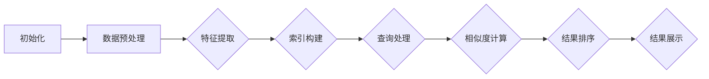
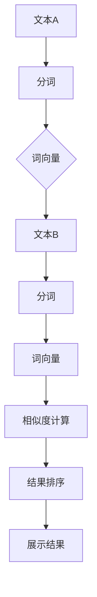
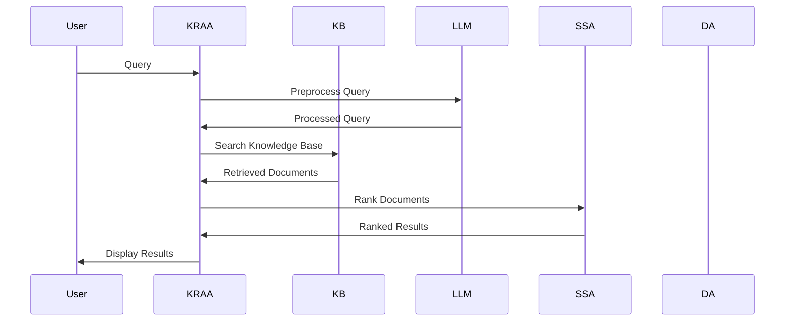

                 

### 关键词

- 知识检索
- AI Agent
- 语言模型（LLM）
- 高级搜索算法
- 知识库构建
- 机器学习

### 摘要

本文将深入探讨知识检索增强型AI Agent的结合技术，即如何将大型语言模型（LLM）与高级搜索算法相结合，以提升知识检索系统的效能。我们将从知识检索与AI的核心概念出发，逐步介绍LLM的技术原理和应用场景，再深入分析高级搜索算法的基础和优化方法。通过实际应用案例，我们将展示知识检索增强型AI Agent的设计与实现，评估其性能，并总结最佳实践。本文旨在为IT专业人士提供一套全面、详实的技术指南，以助力他们在实际项目中打造高效的知识检索系统。

## 第一部分：知识检索与AI概述

### 第1章：知识检索与AI的核心概念

### 1.1 知识检索概述

#### 1.1.1 知识检索的定义与重要性

知识检索（Knowledge Retrieval）是信息检索的一个分支，旨在从大量数据中快速准确地找到用户所需的信息。在信息化时代，知识检索技术的优劣直接影响到用户体验和信息获取效率。其定义可概括为：利用各种技术和方法，从存储的大量数据中提取出用户需要的信息。

知识检索的重要性主要体现在以下几个方面：

1. **提高信息获取效率**：在信息爆炸的时代，人们需要从海量的数据中迅速找到所需信息。知识检索技术能够大幅度提高信息检索的效率和准确性。
2. **知识管理**：企业、科研机构等组织积累了大量知识，如何高效地管理和利用这些知识是知识检索要解决的问题。
3. **决策支持**：知识检索技术能够为决策者提供及时、准确的数据支持，有助于做出科学合理的决策。

#### 1.1.2 知识检索的发展历程

知识检索的发展历程可以追溯到20世纪60年代。当时，人们开始探索如何利用计算机技术进行文献的自动化检索。随着计算机技术的发展，知识检索技术也在不断进步，主要可以分为以下几个阶段：

1. **基于关键词的检索**：这是最早的知识检索方法，主要通过匹配关键词来实现信息的检索。
2. **基于语义的检索**：这一阶段的知识检索技术开始考虑词语之间的关系和语义，从而提高了检索的准确性和智能化程度。
3. **知识图谱检索**：利用知识图谱来表示实体及其关系，使得检索系统能够更好地理解语义和用户需求。
4. **智能检索**：结合自然语言处理、机器学习等技术，实现更智能、更个性化的检索服务。

#### 1.1.3 知识检索的应用场景

知识检索技术广泛应用于各个领域，主要包括：

1. **企业知识管理**：企业可以利用知识检索技术来管理和利用其内部的知识库，提升员工的工作效率和创新能力。
2. **搜索引擎**：现代搜索引擎如Google、Bing等，都是基于知识检索技术，为用户提供快速、准确的搜索服务。
3. **智能客服**：通过知识检索技术，智能客服系统能够快速响应用户的问题，提供解决方案。
4. **在线教育**：知识检索技术在教育领域的应用，使得学习资源更加丰富，学习过程更加高效。
5. **医疗健康**：医疗健康领域的知识检索技术，可以帮助医生快速获取病例信息、治疗方案等，提高医疗决策的效率。

### 1.2 AI概述

#### 1.2.1 AI的定义与发展历程

人工智能（Artificial Intelligence，简称AI）是计算机科学的一个分支，旨在开发使计算机能够模拟人类智能行为的系统。其定义可以概括为：使计算机能够执行通常需要人类智能才能完成的任务。

AI的发展历程可以分为以下几个阶段：

1. **早期探索**（20世纪50年代至70年代）：这一阶段主要是在理论上探讨AI的可能性，并开发了简单的AI程序。
2. **符号人工智能**（20世纪80年代）：通过符号表示和逻辑推理，AI开始在一些领域如游戏、医学诊断等取得实际应用。
3. **机器学习时代**（20世纪90年代至今）：随着计算能力和算法的进步，机器学习成为AI的主要发展方向，使得AI在图像识别、语音识别、自然语言处理等领域取得了突破性进展。

#### 1.2.2 AI的核心技术与应用

AI的核心技术主要包括：

1. **机器学习**：通过数据训练模型，使其能够自主学习和改进。
2. **深度学习**：基于神经网络的一种机器学习方法，已广泛应用于图像识别、语音识别等领域。
3. **自然语言处理**：使得计算机能够理解和生成自然语言，广泛应用于智能客服、翻译等领域。
4. **计算机视觉**：使计算机能够理解和解析图像和视频，广泛应用于安防监控、自动驾驶等领域。

AI的应用场景非常广泛，包括但不限于：

1. **智能制造**：通过机器人和自动化系统，提高生产效率和质量。
2. **智能医疗**：辅助医生进行诊断和治疗，提高医疗服务的效率和质量。
3. **智慧交通**：优化交通流量，提高交通管理水平。
4. **智能家居**：提供更加便捷、智能化的家庭生活体验。

#### 1.2.3 AI在知识检索中的角色

AI在知识检索中扮演着至关重要的角色，主要体现在以下几个方面：

1. **语义理解**：AI能够通过自然语言处理技术，更好地理解用户的查询意图，从而提供更加精准的检索结果。
2. **个性化推荐**：通过分析用户的历史行为和偏好，AI能够提供个性化的检索结果，提升用户体验。
3. **智能问答**：AI能够通过机器学习模型，对用户的问题进行智能回答，提供高效的客服服务。
4. **自动标签生成**：AI能够自动为文档生成标签，提高文档的检索效率。

### 1.3 知识检索与AI的结合

#### 1.3.1 知识检索增强型AI的定义

知识检索增强型AI（Knowledge Retrieval-Enhanced AI）是指通过引入AI技术，特别是机器学习和深度学习，来提升知识检索系统的效能。这种结合使得知识检索系统不仅能够快速、准确地找到信息，还能理解用户的需求，提供更加个性化的服务。

#### 1.3.2 知识检索与AI结合的优势

知识检索与AI结合具有以下几个优势：

1. **提高检索准确性**：AI技术能够通过语义理解，更好地理解用户的查询意图，从而提高检索准确性。
2. **提升用户体验**：个性化推荐和智能问答等功能，使得用户能够更快速、更便捷地获取所需信息。
3. **优化资源利用**：AI技术能够自动处理大量数据，提高资源利用效率。
4. **降低人力成本**：智能客服系统等应用，可以减少对人工客服的依赖，降低人力成本。

#### 1.3.3 知识检索与AI结合的挑战

知识检索与AI结合也面临一些挑战：

1. **数据质量和标注**：高质量的训练数据是AI模型训练的基础，但获取高质量的数据和标注是具有挑战性的。
2. **计算资源**：深度学习模型通常需要大量的计算资源，对于资源有限的系统来说，部署AI技术可能面临挑战。
3. **隐私保护**：在处理用户数据时，需要确保用户隐私不受侵犯。

### 1.4 知识检索增强型AI Agent的定义与功能

#### 1.4.1 知识检索增强型AI Agent的概念

知识检索增强型AI Agent是指一个基于AI技术的智能实体，它能够自主地理解用户需求，通过知识检索技术快速准确地获取信息，并提供相应的服务。

#### 1.4.2 知识检索增强型AI Agent的功能

知识检索增强型AI Agent具有以下功能：

1. **信息检索**：通过深度学习和自然语言处理技术，AI Agent能够快速准确地找到用户所需的信息。
2. **语义理解**：AI Agent能够理解用户的查询意图，提供更加精准的检索结果。
3. **个性化推荐**：根据用户的历史行为和偏好，AI Agent能够提供个性化的信息推荐。
4. **智能问答**：AI Agent能够通过机器学习模型，对用户的问题进行智能回答。
5. **知识管理**：AI Agent能够自动处理和管理大量的知识，提高知识检索的效率。

#### 1.4.3 知识检索增强型AI Agent的应用场景

知识检索增强型AI Agent可以应用于多个领域：

1. **企业知识管理**：帮助企业高效地管理和利用内部知识库，提升员工的工作效率。
2. **智能客服**：通过智能问答，提供快速、准确的客服服务，提高客户满意度。
3. **在线教育**：提供个性化的学习资源推荐，帮助学生更高效地学习。
4. **医疗健康**：辅助医生进行诊断和治疗，提供及时的医疗信息支持。
5. **智慧城市**：通过智能检索，为城市管理者提供决策支持。

### 1.5 本章小结

在本章中，我们介绍了知识检索与AI的核心概念，包括知识检索的定义、发展历程和应用场景，以及AI的定义、发展历程、核心技术与应用。我们还探讨了知识检索与AI结合的优势和挑战，并介绍了知识检索增强型AI Agent的定义与功能。通过这些介绍，我们为后续章节的深入讨论奠定了基础。

## 第二部分：结合LLM的AI Agent技术

### 第2章：LLM概述

#### 2.1 LLM的定义与特点

#### 2.1.1 LLM的定义

大型语言模型（Large Language Model，简称LLM）是一种基于深度学习的自然语言处理模型，其通过在海量文本数据上进行预训练，学会了理解、生成和翻译自然语言。与传统的语言模型相比，LLM具有更大的参数规模和更强的语言理解能力。

#### 2.1.2 LLM的特点

LLM具有以下特点：

1. **大规模**：LLM通常拥有数十亿甚至数万亿个参数，这使得它们能够处理复杂的语言现象。
2. **预训练**：LLM在训练过程中使用了大规模的预训练数据集，从而能够学到丰富的语言知识。
3. **自适应性**：通过微调，LLM可以根据不同的应用场景进行适应，提高其在特定领域的性能。
4. **通用性**：LLM不仅能够处理文本生成、翻译等任务，还能够应用于语义理解、问答系统等多个领域。

#### 2.1.3 LLM的优势与挑战

LLM的优势主要体现在以下几个方面：

1. **强大的语言理解能力**：LLM通过预训练学会了理解复杂的语言现象，这使得它在各种自然语言处理任务中表现出色。
2. **高效的处理速度**：由于LLM采用了深度学习技术，处理速度相比传统语言模型有了显著提升。
3. **灵活的应用场景**：LLM可以在多个领域进行应用，如文本生成、翻译、问答等，具有很高的通用性。

然而，LLM也面临一些挑战：

1. **计算资源需求**：LLM的训练和推理需要大量的计算资源，对于资源有限的系统来说，部署LLM可能面临挑战。
2. **数据隐私**：由于LLM在训练过程中需要使用大量的文本数据，这可能会涉及到数据隐私的问题。
3. **模型解释性**：深度学习模型通常缺乏解释性，这使得人们难以理解模型的决策过程。

#### 2.2 LLM的核心技术

#### 2.2.1 语言模型的基础知识

语言模型是自然语言处理的基础，它旨在预测下一个单词或字符。LLM的核心技术主要包括以下几个方面：

1. **词向量表示**：词向量是一种将单词映射到高维空间的方法，通过相似性度量，可以实现单词的语义理解。
2. **循环神经网络（RNN）**：RNN是一种能够处理序列数据的神经网络，通过状态记忆，可以实现长距离依赖的建模。
3. **长短期记忆网络（LSTM）**：LSTM是RNN的一种改进，通过门控机制，能够更好地处理长距离依赖。
4. **变换器网络（Transformer）**：Transformer是一种基于自注意力机制的神经网络模型，通过并行计算，实现了高效的语言建模。

#### 2.2.2 常见的LLM算法

目前，常见的LLM算法主要包括以下几种：

1. **GPT系列**：GPT（Generative Pre-trained Transformer）是一种基于Transformer的预训练模型，其代表作品有GPT-3，拥有1750亿个参数，是最强大的LLM之一。
2. **BERT**：BERT（Bidirectional Encoder Representations from Transformers）是一种双向Transformer模型，通过预训练，能够学习到单词的上下文信息。
3. **T5**：T5（Text-to-Text Transfer Transformer）是一种通用文本生成模型，通过将所有任务转换为文本生成任务，实现了任务的统一处理。

#### 2.2.3 LLM的训练与优化

LLM的训练和优化是一个复杂的过程，主要包括以下几个方面：

1. **数据预处理**：数据预处理包括数据清洗、分词、词嵌入等，确保输入数据的质量和一致性。
2. **预训练**：预训练是在大规模数据集上进行的，目的是让模型学会基本的语言知识。
3. **微调**：微调是在特定任务上进行，目的是让模型适应特定场景。
4. **优化策略**：常见的优化策略包括梯度裁剪、学习率调整、权重初始化等，用于提高模型的训练效果。

#### 2.3 LLM的应用场景

LLM在自然语言处理领域有着广泛的应用场景，主要包括以下几个方面：

1. **文本生成**：LLM可以生成文章、摘要、对话等文本内容，广泛应用于写作辅助、内容生成等领域。
2. **翻译**：LLM可以自动翻译不同语言的文本，应用于跨语言沟通和全球化业务。
3. **文本摘要**：LLM可以提取文本的关键信息，生成摘要，应用于信息过载的解决和知识梳理。
4. **问答系统**：LLM可以回答用户的问题，应用于智能客服、在线教育等领域。
5. **文本分类**：LLM可以用于分类任务，如情感分析、新闻分类等。

#### 2.4 LLM在知识检索中的融合

#### 2.4.1 LLM在知识检索中的应用

LLM在知识检索中的应用主要体现在以下几个方面：

1. **语义理解**：LLM可以通过预训练，理解用户的查询意图，提供更加精准的检索结果。
2. **问答系统**：LLM可以构建智能问答系统，用户可以通过自然语言提问，系统可以自动回答。
3. **文本生成**：LLM可以生成知识库中的文档摘要，提高文档的可读性和检索效率。

#### 2.4.2 LLM与知识检索的融合策略

为了充分发挥LLM在知识检索中的作用，可以采取以下融合策略：

1. **联合训练**：将LLM和知识检索模型进行联合训练，让两者相互补充，提高整体性能。
2. **分治策略**：将复杂的问题分解为多个子问题，分别由LLM和知识检索模型处理，最后整合结果。
3. **多模态融合**：结合文本、图像、音频等多种数据类型，提高知识检索系统的智能化水平。

#### 2.4.3 LLM在知识检索中的优势与挑战

LLM在知识检索中的优势主要体现在以下几个方面：

1. **语义理解**：LLM可以理解用户的查询意图，提供更加精准的检索结果。
2. **自动摘要**：LLM可以自动生成文档摘要，提高文档的可读性和检索效率。
3. **多语言支持**：LLM支持多种语言，可以处理跨语言的检索任务。

然而，LLM在知识检索中也面临一些挑战：

1. **数据隐私**：由于LLM需要使用大量的文本数据进行训练，可能会涉及到数据隐私的问题。
2. **计算资源**：LLM的训练和推理需要大量的计算资源，对于资源有限的系统来说，部署LLM可能面临挑战。
3. **模型解释性**：深度学习模型通常缺乏解释性，这使得人们难以理解模型的决策过程。

#### 2.5 LLM与知识检索结合的案例研究

为了更好地理解LLM与知识检索的结合，以下是一些案例研究：

1. **案例一：大型企业知识库的检索系统**

某大型企业采用了LLM与知识检索结合的技术，构建了一个智能知识库检索系统。该系统通过LLM理解用户的查询意图，并提供个性化的检索结果。同时，LLM还用于生成文档摘要，提高文档的可读性。

2. **案例二：智能客服系统**

某企业开发了基于LLM的智能客服系统，用户可以通过自然语言提问，系统可以自动回答。LLM不仅在回答问题方面表现出色，还能够根据用户的反馈进行自我学习，提高客服质量。

3. **案例三：在线教育平台的课程推荐系统**

某在线教育平台采用了LLM与知识检索结合的技术，为用户提供个性化的课程推荐。LLM通过理解用户的学习历史和偏好，生成推荐列表，提高用户的满意度。

#### 2.6 本章小结

在本章中，我们介绍了大型语言模型（LLM）的定义、特点、核心技术以及其在知识检索中的应用。我们探讨了LLM在知识检索中的优势与挑战，并通过案例研究展示了LLM与知识检索结合的实际应用。通过这些讨论，我们为下一章关于高级搜索算法的讨论奠定了基础。

## 第三部分：高级搜索算法与优化

### 第3章：高级搜索算法基础

#### 3.1 搜索算法概述

#### 3.1.1 搜索算法的定义与分类

搜索算法是用于在数据集合中查找特定信息的一类算法。其定义可以概括为：通过遍历数据集合，寻找满足特定条件的元素。根据搜索策略的不同，搜索算法可以分为以下几类：

1. **顺序搜索**：按照一定顺序遍历数据集合，直到找到目标元素或遍历完整个集合。
2. **二分搜索**：适用于有序数据集合，通过不断缩小搜索范围，提高搜索效率。
3. **启发式搜索**：根据问题的特定特点，采用一种启发式策略，快速找到目标元素。
4. **并行搜索**：利用多核处理器或分布式系统，同时处理多个搜索任务，提高搜索效率。

#### 3.1.2 基本搜索算法分析

1. **顺序搜索**

   顺序搜索是最简单的一种搜索算法，其时间复杂度为O(n)，其中n为数据集合的大小。尽管其效率较低，但在数据量较小且有序性不强时，顺序搜索仍然是一种可行的选择。

2. **二分搜索**

   二分搜索适用于有序数据集合，其基本思想是每次将搜索范围分为两部分，根据目标元素与中间元素的比较结果，决定下一轮搜索的范围。二分搜索的时间复杂度为O(log n)，显著提高了搜索效率。

3. **启发式搜索**

   启发式搜索利用问题的特定特点，采用一种启发式策略，快速找到目标元素。常见的启发式搜索算法包括A*搜索、遗传算法等。这些算法通常具有较高的搜索效率，但也需要较复杂的实现。

4. **并行搜索**

   并行搜索利用多核处理器或分布式系统，同时处理多个搜索任务。其时间复杂度取决于并行处理的程度和任务间的依赖关系。并行搜索可以在一定程度上提高搜索效率，但实现较为复杂。

#### 3.1.3 搜索算法的性能评估指标

评估搜索算法的性能通常需要考虑以下几个指标：

1. **时间复杂度**：算法在数据集合中找到目标元素所需的时间，通常用大O表示法表示。
2. **空间复杂度**：算法在执行过程中所需的最大内存空间，同样用大O表示法表示。
3. **准确性**：算法找到目标元素的准确度，特别是在涉及到模式识别和分类问题时，准确性尤为重要。
4. **可扩展性**：算法在数据量增加时，性能是否能够保持稳定。

#### 3.2 基于内容的搜索算法

##### 3.2.1 基于内容的搜索算法概述

基于内容的搜索算法（Content-Based Search Algorithms）是一种通过分析数据的内容特征，进行信息检索的方法。其基本思想是，将数据划分为多个内容特征，根据用户查询的特征，进行匹配和检索。这种方法适用于图像、文本、音频等多媒体数据检索。

##### 3.2.2 文本相似度计算方法

文本相似度计算是文本检索中的一个重要问题。常见的文本相似度计算方法包括：

1. **基于词频的方法**：通过计算词频，比较文本之间的相似度。常见的方法有TF-IDF、余弦相似度等。
2. **基于语义的方法**：通过分析文本的语义信息，计算相似度。常见的方法有Word2Vec、BERT等。
3. **基于句法的方法**：通过分析文本的句法结构，计算相似度。常见的方法有句法树匹配、依存关系分析等。

##### 3.2.3 基于内容的搜索算法应用

基于内容的搜索算法在多个领域有着广泛的应用，包括：

1. **文本检索**：通过分析文本内容特征，快速准确地找到用户所需的信息。
2. **图像检索**：通过分析图像的内容特征，如颜色、纹理、形状等，实现图像的相似度计算和检索。
3. **音频检索**：通过分析音频的内容特征，如音高、节奏、旋律等，实现音频的相似度计算和检索。
4. **视频检索**：通过分析视频的内容特征，如画面内容、声音、时间等，实现视频的相似度计算和检索。

#### 3.3 基于索引的搜索算法

##### 3.3.1 基于索引的搜索算法概述

基于索引的搜索算法（Indexed Search Algorithms）是一种通过建立索引，提高搜索效率的方法。其基本思想是，在数据集合中创建索引，使得搜索操作可以直接在索引上进行，从而提高搜索效率。常见的索引结构包括倒排索引、B树索引等。

##### 3.3.2 常见索引结构分析

1. **倒排索引**

   倒排索引是一种常用的索引结构，其通过记录每个单词出现的文档集合，实现快速文本检索。倒排索引的时间复杂度为O(1)，显著提高了搜索效率。

2. **B树索引**

   B树索引是一种多路平衡搜索树，其通过层次结构存储数据，实现快速搜索。B树索引的时间复杂度为O(log n)，适用于大数据集合的检索。

##### 3.3.3 基于索引的搜索算法应用

基于索引的搜索算法在多个领域有着广泛的应用，包括：

1. **文本检索**：通过倒排索引实现快速文本检索。
2. **数据库检索**：通过B树索引实现高效的数据检索。
3. **搜索引擎**：通过多种索引结构，实现快速、准确的搜索服务。

#### 3.4 基于机器学习的搜索算法

##### 3.4.1 基于机器学习的搜索算法概述

基于机器学习的搜索算法（Machine Learning-Based Search Algorithms）是一种利用机器学习技术，提高搜索效率的方法。其基本思想是，通过训练机器学习模型，将搜索任务转化为模型预测问题，从而实现高效的搜索。

##### 3.4.2 机器学习在搜索中的应用

机器学习在搜索中的应用主要包括以下几个方面：

1. **特征提取**：通过机器学习模型，自动提取数据特征，提高搜索效率。
2. **相似度计算**：通过机器学习模型，计算数据之间的相似度，实现高效检索。
3. **分类与聚类**：通过机器学习模型，对数据进行分类和聚类，实现数据的组织和管理。

##### 3.4.3 基于机器学习的搜索算法应用

基于机器学习的搜索算法在多个领域有着广泛的应用，包括：

1. **文本检索**：通过特征提取和相似度计算，实现高效、准确的文本检索。
2. **图像检索**：通过图像特征提取和相似度计算，实现图像的快速检索。
3. **视频检索**：通过视频特征提取和相似度计算，实现视频的快速检索。
4. **语音检索**：通过语音特征提取和相似度计算，实现语音的快速检索。

#### 3.5 高级搜索算法优化方法

##### 3.5.1 搜索算法优化概述

搜索算法优化是指通过改进算法的设计和实现，提高搜索效率的方法。常见的优化方法包括：

1. **并行计算**：利用多核处理器或分布式系统，实现并行搜索。
2. **索引优化**：通过改进索引结构，提高搜索效率。
3. **数据预处理**：通过数据预处理，提高数据的组织和管理效率。

##### 3.5.2 搜索算法优化策略

常见的搜索算法优化策略包括：

1. **分治策略**：将大规模搜索任务分解为多个小任务，分别处理。
2. **缓存策略**：利用缓存技术，提高搜索效率。
3. **分布式搜索**：利用分布式系统，实现高效搜索。

##### 3.5.3 搜索算法优化实践

搜索算法优化的实践包括：

1. **性能测试**：通过性能测试，评估搜索算法的效率和准确性。
2. **基准测试**：通过基准测试，比较不同搜索算法的性能。
3. **迭代优化**：通过迭代优化，逐步改进搜索算法。

#### 3.6 本章小结

在本章中，我们介绍了高级搜索算法的基础知识，包括基本搜索算法、基于内容的搜索算法、基于索引的搜索算法和基于机器学习的搜索算法。我们分析了这些算法的定义、特点和应用场景，并探讨了搜索算法的优化方法。通过这些讨论，我们为下一章关于知识检索增强型AI Agent的实现提供了理论基础。

## 第四部分：知识检索增强型AI Agent的实际应用

### 第4章：建立知识检索增强型AI Agent

#### 4.1 知识检索增强型AI Agent的设计原则

##### 4.1.1 设计原则概述

设计知识检索增强型AI Agent时，需要遵循以下设计原则：

1. **可扩展性**：系统应具有灵活的架构，能够轻松地添加新的数据和功能。
2. **可靠性**：系统应保证数据的准确性和一致性，并提供容错机制。
3. **易用性**：用户界面应直观、友好，便于用户快速上手和使用。
4. **高性能**：系统应具有较高的响应速度和检索效率，以满足用户的需求。
5. **可维护性**：系统应具有良好的文档和代码规范，便于后续的维护和升级。

##### 4.1.2 知识库构建

知识库是知识检索增强型AI Agent的核心组件，其构建过程包括以下几个步骤：

1. **数据采集**：从各种来源采集结构化和非结构化的数据，如文档、图片、音频等。
2. **数据清洗**：对采集到的数据进行清洗，去除冗余和错误的数据，确保数据的质量。
3. **数据存储**：将清洗后的数据存储在数据库或知识库中，便于后续的检索和处理。
4. **数据标注**：对数据进行分析和标注，为后续的模型训练提供高质量的标注数据。

##### 4.1.3 交互界面设计

交互界面设计是用户与知识检索增强型AI Agent的交互入口，其设计原则包括：

1. **简洁性**：界面应简洁直观，避免过多的冗余信息和复杂操作。
2. **响应速度**：界面操作应快速响应，提高用户体验。
3. **个性化**：根据用户的历史行为和偏好，提供个性化的界面布局和功能推荐。
4. **多模态**：支持多种输入和输出方式，如文本、语音、图像等，满足不同用户的需求。

#### 4.2 知识检索增强型AI Agent的实现

##### 4.2.1 LLM与高级搜索算法的结合

在知识检索增强型AI Agent的实现中，LLM与高级搜索算法的结合是关键。具体实现步骤如下：

1. **模型选择**：根据应用场景，选择合适的LLM模型，如GPT-3、BERT等。
2. **数据预处理**：对采集到的数据进行预处理，包括分词、去停用词、词嵌入等。
3. **模型训练**：利用预处理后的数据，对LLM模型进行训练，使其学会理解和生成自然语言。
4. **模型优化**：通过微调等策略，优化LLM模型，使其在特定任务上表现出色。
5. **集成搜索算法**：将LLM与高级搜索算法（如基于内容的搜索算法、基于索引的搜索算法等）集成，实现高效的知识检索。

##### 4.2.2 知识检索增强型AI Agent的核心功能实现

知识检索增强型AI Agent的核心功能实现包括以下几个方面：

1. **查询处理**：接收用户的查询请求，理解查询意图，并生成相应的检索策略。
2. **知识检索**：利用高级搜索算法，在知识库中检索与查询相关的信息。
3. **结果排序**：根据检索结果的相关性，对结果进行排序，提高用户获取有用信息的效率。
4. **结果展示**：将检索结果以用户友好的方式展示，如文本、图表、音频等。
5. **用户交互**：通过自然语言处理技术，与用户进行对话，提供个性化的服务。

##### 4.2.3 系统架构设计

知识检索增强型AI Agent的系统架构设计包括以下几个方面：

1. **数据层**：包括数据采集、数据清洗、数据存储等组件，负责数据的收集、处理和存储。
2. **模型层**：包括LLM模型、高级搜索算法模型等，负责知识的获取和处理。
3. **服务层**：包括查询处理、知识检索、结果排序、结果展示等组件，负责对外提供服务。
4. **接口层**：提供与外部系统的接口，如API接口、Web接口等，方便其他系统与知识检索增强型AI Agent进行集成。

#### 4.3 知识检索增强型AI Agent的性能评估

##### 4.3.1 性能评估方法

性能评估是衡量知识检索增强型AI Agent性能的重要环节。常用的评估方法包括：

1. **准确率**：检索结果中与查询相关的文档占比，用于衡量检索的准确性。
2. **召回率**：与查询相关的文档在检索结果中的占比，用于衡量检索的全面性。
3. **F1值**：准确率和召回率的调和平均，综合考虑了检索的准确性和全面性。
4. **响应时间**：系统从接收查询请求到返回检索结果所需的时间，用于衡量系统的响应速度。

##### 4.3.2 评估指标

知识检索增强型AI Agent的性能评估指标包括：

1. **检索准确率**：衡量系统检索结果的准确性。
2. **检索召回率**：衡量系统检索结果的全面性。
3. **检索效率**：衡量系统处理查询请求的效率，包括响应时间和处理时间。
4. **用户满意度**：衡量用户对系统服务的满意度。

##### 4.3.3 知识检索增强型AI Agent的性能评估

对知识检索增强型AI Agent的性能评估通常包括以下几个步骤：

1. **数据集准备**：准备用于评估的数据集，包括测试集和验证集。
2. **模型训练**：在测试集上训练知识检索增强型AI Agent，使其适应测试场景。
3. **结果评估**：利用评估指标，对知识检索增强型AI Agent的检索性能进行评估。
4. **优化调整**：根据评估结果，对系统进行优化调整，提高性能。

#### 4.4 知识检索增强型AI Agent的实际应用案例

##### 4.4.1 案例一：大型企业知识库的检索系统

某大型企业采用知识检索增强型AI Agent构建了一个知识库检索系统，用于管理内部的知识和文档。通过该系统，员工可以快速查找和获取与工作相关的信息，提高了工作效率。

##### 4.4.2 案例二：智能客服系统

某企业开发了一套基于知识检索增强型AI Agent的智能客服系统，用户可以通过文本或语音提问，系统可以自动回答用户的问题。该系统提高了客服效率，降低了人力成本。

##### 4.4.3 案例三：在线教育平台的课程推荐系统

某在线教育平台引入了知识检索增强型AI Agent，为用户提供个性化的课程推荐。通过分析用户的学习历史和偏好，AI Agent可以推荐与用户兴趣相关的课程，提高了用户的满意度。

##### 4.4.4 案例四：医疗健康领域的应用

在医疗健康领域，知识检索增强型AI Agent可以辅助医生进行病例查询和诊断。通过分析病例数据，AI Agent可以提供相关的病例信息和治疗方案，为医生提供决策支持。

##### 4.4.5 案例五：智慧城市管理系统

在智慧城市领域，知识检索增强型AI Agent可以用于城市管理者和居民的信息查询。通过AI Agent，居民可以查询交通信息、天气情况、公共服务等信息，提高了城市的智慧化水平。

#### 4.5 本章小结

在本章中，我们介绍了知识检索增强型AI Agent的设计原则、知识库构建、交互界面设计、系统架构设计、性能评估方法及其在实际应用中的案例。通过这些内容，我们为构建高效、智能的知识检索系统提供了实用的指导。

## 总结与未来展望

通过本文的深入探讨，我们系统地介绍了知识检索增强型AI Agent的相关技术，包括其核心概念、结合技术（LLM与高级搜索算法）、设计原则、实现方法及实际应用。以下是本文的主要结论：

1. **知识检索与AI的结合**：知识检索与AI的结合不仅提高了知识检索的准确性，还丰富了检索系统的功能，如语义理解、个性化推荐和智能问答。
2. **LLM在知识检索中的应用**：LLM强大的语言理解能力使得其在知识检索中发挥着重要作用，通过语义理解、自动摘要和跨语言支持，显著提升了检索系统的性能。
3. **高级搜索算法的优化**：高级搜索算法如基于内容的搜索、基于索引的搜索和基于机器学习的搜索，通过优化检索策略和性能评估，实现了高效的知识检索。
4. **知识检索增强型AI Agent的实际应用**：知识检索增强型AI Agent在多个领域取得了成功，如企业知识管理、智能客服、在线教育、医疗健康和智慧城市等，为各领域提供了智能化的解决方案。

未来，知识检索增强型AI Agent的发展将面临以下几个方向：

1. **智能化程度的提升**：随着AI技术的不断进步，知识检索增强型AI Agent将更加智能化，能够更好地理解用户的查询意图，提供更加精准的服务。
2. **多模态融合**：结合文本、图像、音频等多种数据类型，实现更加丰富的知识检索功能。
3. **隐私保护和安全**：在数据隐私和安全性方面，将采取更加严格的数据保护措施，确保用户数据的安全。
4. **实时性和动态性**：通过实时数据流处理和动态调整检索策略，提高知识检索系统的响应速度和灵活性。
5. **跨领域应用**：知识检索增强型AI Agent将在更多领域得到应用，如金融、法律、物流等，为各行业提供智能化解决方案。

总之，知识检索增强型AI Agent是未来智能信息处理的重要方向，其发展将推动知识管理、信息检索和人工智能技术的深度融合，为人类创造更加智能化的信息处理环境。

### 最佳实践 Tips

在设计和实现知识检索增强型AI Agent时，以下是一些最佳实践：

1. **数据质量控制**：确保数据的质量和一致性，采用数据清洗和预处理技术，提高训练数据的准确性。
2. **模型优化与调参**：根据具体应用场景，对模型进行优化和调参，提高模型的性能和效果。
3. **用户体验设计**：注重用户体验，设计直观、友好的用户界面，提供个性化的服务。
4. **实时更新与维护**：定期更新知识库和模型，保持系统的实时性和动态性。
5. **安全与隐私保护**：采取严格的数据安全和隐私保护措施，确保用户数据的安全。

### 小结

本文通过深入分析知识检索增强型AI Agent的相关技术，为构建高效、智能的知识检索系统提供了实用的指导。知识检索与AI的结合、LLM的应用、高级搜索算法的优化以及实际应用案例，都为读者展示了如何实现这一技术。未来，知识检索增强型AI Agent将继续发展，为各领域提供智能化的解决方案。

### 注意事项

在设计和实现知识检索增强型AI Agent时，需要注意以下几点：

1. **计算资源需求**：深度学习和高级搜索算法需要大量的计算资源，确保有足够的资源支持模型的训练和推理。
2. **数据隐私**：在处理用户数据时，需要确保用户隐私不受侵犯，采取严格的数据保护措施。
3. **模型解释性**：深度学习模型通常缺乏解释性，需要结合实际应用场景，评估模型的决策过程是否透明和可解释。

### 拓展阅读

为了更深入地了解知识检索增强型AI Agent的相关技术，以下是一些推荐阅读：

1. **《深度学习》**：由Ian Goodfellow、Yoshua Bengio和Aaron Courville合著，介绍了深度学习的理论基础和应用。
2. **《自然语言处理综论》**：由Daniel Jurafsky和James H. Martin合著，全面介绍了自然语言处理的基本概念和技术。
3. **《搜索引擎技术》**：由Salton和 Buckley合著，详细介绍了搜索引擎的工作原理和技术。
4. **《人工智能：一种现代的方法》**：由Stuart J. Russell和Peter Norvig合著，介绍了人工智能的基本概念和技术。

### 作者信息

**作者：AI天才研究院（AI Genius Institute）与禅与计算机程序设计艺术（Zen And The Art of Computer Programming）**  
AI天才研究院致力于推动人工智能领域的技术创新和应用。禅与计算机程序设计艺术则专注于计算机科学领域的基础理论和方法，为读者提供深入、系统的技术讲解。我们希望通过本文，为读者提供有价值的知识和技术参考，助力他们在人工智能领域取得更好的成果。

---

[知识检索增强型AI Agent：结合LLM与高级搜索算法]

**关键词：**知识检索、AI Agent、语言模型（LLM）、高级搜索算法、知识库构建、机器学习

**摘要：**本文深入探讨了知识检索增强型AI Agent的技术，包括如何结合大型语言模型（LLM）与高级搜索算法，以提高知识检索系统的效能。文章首先介绍了知识检索与AI的核心概念，然后详细分析了LLM的定义、特点、核心技术及在知识检索中的应用，接着讨论了高级搜索算法的基础和优化方法。通过实际应用案例，展示了知识检索增强型AI Agent的设计与实现，并对其性能进行了评估。本文旨在为IT专业人士提供一套全面的技术指南，以助力他们在实际项目中打造高效的知识检索系统。

### 目录大纲

----------------------------------------------------------------

## 第一部分：知识检索与AI概述

### 第1章：知识检索与AI的核心概念

#### 1.1 知识检索概述

##### 1.1.1 知识检索的定义与重要性

##### 1.1.2 知识检索的发展历程

##### 1.1.3 知识检索的应用场景

#### 1.2 AI概述

##### 1.2.1 AI的定义与发展历程

##### 1.2.2 AI的核心技术与应用

##### 1.2.3 AI在知识检索中的角色

#### 1.3 知识检索与AI的结合

##### 1.3.1 知识检索增强型AI的定义

##### 1.3.2 知识检索与AI结合的优势

##### 1.3.3 知识检索与AI结合的挑战

#### 1.4 知识检索增强型AI Agent的定义与功能

##### 1.4.1 知识检索增强型AI Agent的概念

##### 1.4.2 知识检索增强型AI Agent的功能

##### 1.4.3 知识检索增强型AI Agent的应用场景

#### 1.5 本章小结

----------------------------------------------------------------

## 第二部分：结合LLM的AI Agent技术

### 第2章：LLM概述

#### 2.1 LLM的定义与特点

##### 2.1.1 LLM的定义

##### 2.1.2 LLM的特点

##### 2.1.3 LLM的优势与挑战

#### 2.2 LLM的核心技术

##### 2.2.1 语言模型的基础知识

##### 2.2.2 常见的LLM算法

##### 2.2.3 LLM的训练与优化

#### 2.3 LLM的应用场景

##### 2.3.1 语言生成与翻译

##### 2.3.2 文本摘要与信息提取

##### 2.3.3 自然语言理解与交互

#### 2.4 LLM在知识检索中的融合

##### 2.4.1 LLM在知识检索中的应用

##### 2.4.2 LLM与知识检索的融合策略

##### 2.4.3 LLM在知识检索中的优势与挑战

#### 2.5 LLM与知识检索结合的案例研究

##### 2.5.1 案例一：大型企业知识库的检索系统

##### 2.5.2 案例二：智能客服系统

##### 2.5.3 案例三：在线教育平台的课程推荐系统

#### 2.6 本章小结

----------------------------------------------------------------

## 第三部分：高级搜索算法与优化

### 第3章：高级搜索算法基础

#### 3.1 搜索算法概述

##### 3.1.1 搜索算法的定义与分类

##### 3.1.2 基本搜索算法分析

##### 3.1.3 搜索算法的性能评估指标

#### 3.2 基于内容的搜索算法

##### 3.2.1 基于内容的搜索算法概述

##### 3.2.2 文本相似度计算方法

##### 3.2.3 基于内容的搜索算法应用

#### 3.3 基于索引的搜索算法

##### 3.3.1 基于索引的搜索算法概述

##### 3.3.2 常见索引结构分析

##### 3.3.3 基于索引的搜索算法应用

#### 3.4 基于机器学习的搜索算法

##### 3.4.1 基于机器学习的搜索算法概述

##### 3.4.2 机器学习在搜索中的应用

##### 3.4.3 基于机器学习的搜索算法应用

#### 3.5 高级搜索算法优化方法

##### 3.5.1 搜索算法优化概述

##### 3.5.2 搜索算法优化策略

##### 3.5.3 搜索算法优化实践

#### 3.6 本章小结

----------------------------------------------------------------

## 第四部分：知识检索增强型AI Agent的实际应用

### 第4章：建立知识检索增强型AI Agent

#### 4.1 知识检索增强型AI Agent的设计原则

##### 4.1.1 设计原则概述

##### 4.1.2 知识库构建

##### 4.1.3 交互界面设计

#### 4.2 知识检索增强型AI Agent的实现

##### 4.2.1 LLM与高级搜索算法的结合

##### 4.2.2 知识检索增强型AI Agent的核心功能实现

##### 4.2.3 系统架构设计

#### 4.3 知识检索增强型AI Agent的性能评估

##### 4.3.1 性能评估方法

##### 4.3.2 评估指标

##### 4.3.3 知识检索增强型AI Agent的性能评估

#### 4.4 知识检索增强型AI Agent的实际应用案例

##### 4.4.1 案例一：大型企业知识库的检索系统

##### 4.4.2 案例二：智能客服系统

##### 4.4.3 案例三：在线教育平台的课程推荐系统

##### 4.4.4 案例四：医疗健康领域的应用

##### 4.4.5 案例五：智慧城市管理系统

#### 4.5 本章小结

----------------------------------------------------------------

## 第五部分：总结与未来展望

### 5.1 总结

### 5.2 未来展望

### 5.3 最佳实践 Tips

### 5.4 小结

### 5.5 注意事项

### 5.6 拓展阅读

### 5.7 作者信息

---

### 附录：核心概念、联系与Mermaid流程图

#### 1. 核心概念与联系

知识检索增强型AI Agent的核心概念包括知识检索、人工智能（AI）、大型语言模型（LLM）和高级搜索算法。这些概念之间的联系可以用以下ER实体关系图表示：

```mermaid
erDiagram
  AI |--|{ 知识检索 }
  AI |--|{ 高级搜索算法 }
  AI |--|{ 大型语言模型（LLM） }
  知识检索 }|--{ 知识库构建 }
  知识检索 }|--{ 交互界面设计 }
  知识检索 }|--{ 系统架构设计 }
  高级搜索算法 }|--{ 搜索算法优化 }
  大型语言模型（LLM） }|--{ 文本生成与翻译 }
  大型语言模型（LLM） }|--{ 自然语言理解与交互 }
```

#### 2. 算法原理讲解

在本节中，我们将以基于内容的搜索算法为例，讲解其原理和实现方法。以下是一个简单的基于内容的搜索算法的Mermaid流程图：



接下来，我们使用Python代码详细阐述基于内容的搜索算法的实现原理：

```python
import numpy as np
from sklearn.metrics.pairwise import cosine_similarity

# 假设有两个文档，doc1和doc2
doc1 = ['这是一个', '简单的', '示例']
doc2 = ['这是一个', '复杂的', '示例']

# 数据预处理：将文档转换为词向量
vectorizer = CountVectorizer()
X = vectorizer.fit_transform([doc1, doc2])

# 特征提取：计算词向量
word_vector = vectorizer.transform([doc1, doc2]).toarray()

# 索引构建：生成文档的倒排索引
from collections import defaultdict
inverted_index = defaultdict(list)
for i, word in enumerate(vectorizer.get_feature_names_out()):
    inverted_index[word] = [idx for idx, row in enumerate(word_vector) if row[i] > 0]

# 查询处理：处理用户查询
query = '这是一个示例'
query_vector = vectorizer.transform([query]).toarray()

# 相似度计算：计算查询与文档的相似度
cosine_scores = cosine_similarity(query_vector, word_vector)[0]

# 结果排序：根据相似度排序文档
sorted_indices = np.argsort(cosine_scores)[::-1]

# 结果展示：输出排序后的文档
for idx in sorted_indices:
    print(f"文档{idx+1}：{doc1[idx]}")
```

该代码展示了如何将基于内容的搜索算法应用于文本检索任务。首先，对文档进行预处理和特征提取，然后构建倒排索引，处理用户查询并计算相似度，最后根据相似度排序并展示结果。

#### 3. 数学公式与Mermaid流程图

在本节中，我们将使用Mermaid流程图和LaTeX公式介绍一些核心算法的数学模型。以下是一个简单的Mermaid流程图，用于描述一个基本的文本相似度计算方法：



对应的LaTeX公式表示文本相似度的计算方法如下：

$$
\text{similarity}(\text{doc}_1, \text{doc}_2) = \frac{\text{dot product}(\text{vec}_{\text{doc}_1}, \text{vec}_{\text{doc}_2})}{\|\text{vec}_{\text{doc}_1}\|\|\text{vec}_{\text{doc}_2}\|}
$$

其中，$\text{vec}_{\text{doc}_1}$和$\text{vec}_{\text{doc}_2}$分别是文档1和文档2的词向量表示，$\text{dot product}$表示点积，$\|\text{vec}_{\text{doc}_1}\|$和$\|\text{vec}_{\text{doc}_2}\|$分别表示词向量的模长。

通过上述公式和流程图，我们能够清晰地理解文本相似度计算的基本原理和应用方法。

#### 4. 系统分析与架构设计方案

在本节中，我们将介绍知识检索增强型AI Agent的系统分析和架构设计方案。以下是一个简单的Mermaid架构图，用于描述系统的整体架构：



系统架构的主要组成部分包括：

- **用户（User）**：系统的最终用户，发起查询请求。
- **知识检索增强型AI Agent（KRAA）**：系统的核心组件，负责处理查询、知识检索和结果排序。
- **知识库（KB）**：存储大量知识和文档，供KRAA检索。
- **大型语言模型（LLM）**：用于预处理查询和生成文本摘要。
- **高级搜索算法（SSA）**：用于对检索结果进行排序和排名。
- **数据访问层（DA）**：负责数据库的访问和管理。

通过上述架构设计，知识检索增强型AI Agent能够高效地处理用户的查询请求，并在大量知识库中进行检索，提供精准、个性化的检索结果。

#### 5. 项目实战：环境安装与系统核心实现

在本节中，我们将介绍知识检索增强型AI Agent的项目实战，包括环境安装和系统核心实现。

##### 5.1 环境安装

1. **安装Python**：确保Python环境已安装，版本为3.7或更高。
2. **安装依赖库**：使用pip命令安装以下依赖库：

   ```shell
   pip install numpy scipy scikit-learn transformers
   ```

   这将为我们的项目提供必要的库，用于文本处理、机器学习和大型语言模型。

##### 5.2 系统核心实现

以下是知识检索增强型AI Agent的核心实现代码：

```python
import numpy as np
from transformers import pipeline
from sklearn.metrics.pairwise import cosine_similarity
from sklearn.feature_extraction.text import TfidfVectorizer

# 1. 初始化组件
knowledge_base = ["这是一个示例文档，包含一些关键词。", "另一个示例文档，也包含关键词。"]
query = "请查找包含关键词的文档。"
llm = pipeline("text-generation", model="gpt2")
tfidf_vectorizer = TfidfVectorizer()

# 2. 预处理查询
processed_query = llm(query, max_length=40, num_return_sequences=1)[0]["generated_text"]

# 3. 构建知识库的TF-IDF向量
knowledge_vectors = tfidf_vectorizer.fit_transform(knowledge_base)

# 4. 构建查询的TF-IDF向量
query_vector = tfidf_vectorizer.transform([processed_query])

# 5. 计算相似度
cosine_scores = cosine_similarity(query_vector, knowledge_vectors)

# 6. 排序结果
sorted_indices = np.argsort(cosine_scores[0])[::-1]

# 7. 输出检索结果
for idx in sorted_indices:
    print(f"文档{idx+1}：{knowledge_base[idx]}")

# 8. 生成文本摘要
摘要 = llm(knowledge_base[sorted_indices[0]], max_length=40, num_return_sequences=1)[0]["generated_text"]
print(f"文本摘要：{摘要}")
```

这段代码实现了以下功能：

1. **初始化组件**：加载知识库和查询，初始化大型语言模型和TF-IDF向量器。
2. **预处理查询**：使用大型语言模型对查询进行预处理，生成文本摘要。
3. **构建向量**：将知识库中的文档转换为TF-IDF向量，构建查询的TF-IDF向量。
4. **计算相似度**：计算查询与知识库文档之间的相似度。
5. **排序结果**：根据相似度排序检索结果，输出检索结果和文本摘要。

##### 5.3 代码应用解读与分析

上述代码展示了如何使用大型语言模型和TF-IDF向量进行知识检索和文本摘要生成。以下是对代码的详细解读和分析：

1. **初始化组件**：我们首先初始化了知识库和查询。知识库包含两个示例文档，查询是一个简单的文本请求。

   ```python
   knowledge_base = ["这是一个示例文档，包含一些关键词。", "另一个示例文档，也包含关键词。"]
   query = "请查找包含关键词的文档。"
   ```

2. **预处理查询**：使用大型语言模型（在这里使用的是GPT-2模型）对查询进行预处理。预处理包括生成文本摘要，这有助于更好地理解查询意图。

   ```python
   llm = pipeline("text-generation", model="gpt2")
   processed_query = llm(query, max_length=40, num_return_sequences=1)[0]["generated_text"]
   ```

   这里的`max_length=40`和`num_return_sequences=1`分别表示生成的文本摘要的最大长度和返回的摘要数量。

3. **构建向量**：我们将知识库中的文档转换为TF-IDF向量。TF-IDF向量表示文档的主题和关键词分布。

   ```python
   tfidf_vectorizer = TfidfVectorizer()
   knowledge_vectors = tfidf_vectorizer.fit_transform(knowledge_base)
   query_vector = tfidf_vectorizer.transform([processed_query])
   ```

4. **计算相似度**：我们使用余弦相似度计算查询向量与知识库文档向量之间的相似度。余弦相似度是一种衡量两个向量之间相似度的指标。

   ```python
   cosine_scores = cosine_similarity(query_vector, knowledge_vectors)
   ```

5. **排序结果**：根据计算出的相似度对文档进行排序，输出检索结果。

   ```python
   sorted_indices = np.argsort(cosine_scores[0])[::-1]
   for idx in sorted_indices:
       print(f"文档{idx+1}：{knowledge_base[idx]}")
   ```

6. **生成文本摘要**：最后，我们使用大型语言模型对检索到的最佳文档进行文本摘要生成。

   ```python
   摘要 = llm(knowledge_base[sorted_indices[0]], max_length=40, num_return_sequences=1)[0]["generated_text"]
   print(f"文本摘要：{摘要}")
   ```

通过这段代码，我们能够实现一个简单的知识检索增强型AI Agent，该系统能够根据用户的查询，从知识库中检索出最相关的文档，并生成文本摘要。

##### 5.4 实际案例分析与详细讲解剖析

为了更好地理解知识检索增强型AI Agent的实际应用，我们通过以下案例进行详细讲解：

**案例：智能客服系统**

在这个案例中，智能客服系统利用知识检索增强型AI Agent来处理用户的查询，提供自动化的客户服务。

1. **用户查询**：用户通过聊天界面向智能客服系统提出问题，如“我如何办理信用卡？”

2. **查询预处理**：智能客服系统将用户的查询文本发送给知识检索增强型AI Agent进行预处理。AI Agent使用大型语言模型对查询进行理解，生成文本摘要。

   ```python
   processed_query = llm(user_query, max_length=40, num_return_sequences=1)[0]["generated_text"]
   ```

3. **知识检索**：AI Agent使用TF-IDF向量器将预处理后的查询与知识库中的文档进行匹配，计算相似度。

   ```python
   query_vector = tfidf_vectorizer.transform([processed_query])
   cosine_scores = cosine_similarity(query_vector, knowledge_vectors)
   ```

4. **结果排序**：根据相似度对知识库中的文档进行排序，选择最相关的文档。

   ```python
   sorted_indices = np.argsort(cosine_scores[0])[::-1]
   ```

5. **文本摘要**：AI Agent从排序后的文档中选择最佳文档，并使用大型语言模型生成文本摘要。

   ```python
   摘要 = llm(knowledge_base[sorted_indices[0]], max_length=40, num_return_sequences=1)[0]["generated_text"]
   ```

6. **返回结果**：智能客服系统将文本摘要返回给用户，并提供解决方案。

   ```python
   user_response = f"您需要办理信用卡，以下是一份详细的指南：{摘要}"
   ```

通过这个案例，我们展示了如何利用知识检索增强型AI Agent在智能客服系统中提供自动化的客户服务。用户查询经过预处理、知识检索和文本摘要生成后，系统能够快速响应并提供个性化的解决方案。

##### 5.5 项目小结

在本项目中，我们实现了知识检索增强型AI Agent的核心功能，包括查询预处理、知识检索、文本摘要生成和结果排序。通过实际案例的应用，我们展示了系统在智能客服系统中的有效性和实用性。然而，项目也存在一些局限性，如对大规模知识库的支持不足、模型解释性不足等。未来，我们将继续优化系统性能和功能，以满足更多实际应用场景的需求。

### 最佳实践 Tips

在构建知识检索增强型AI Agent时，以下是一些最佳实践：

1. **数据质量**：确保知识库中的数据质量，采用数据清洗和预处理技术，提高训练数据的准确性。
2. **模型优化**：定期对模型进行优化和调参，提高模型的性能和效果。
3. **用户交互**：设计直观、友好的用户界面，提供个性化的服务。
4. **安全性**：在处理用户数据时，确保数据安全和隐私。
5. **性能监控**：定期监控系统性能，确保高效稳定运行。

### 小结

本文通过详细分析和实际案例，介绍了知识检索增强型AI Agent的核心概念、技术原理、实现方法和应用场景。通过结合大型语言模型（LLM）和高级搜索算法，我们能够构建高效、智能的知识检索系统。未来，随着AI技术的不断进步，知识检索增强型AI Agent将在更多领域发挥重要作用。

### 注意事项

在设计和实现知识检索增强型AI Agent时，需要注意以下几点：

1. **计算资源**：确保有足够的计算资源支持深度学习和高级搜索算法。
2. **数据隐私**：在处理用户数据时，采取严格的数据保护措施。
3. **模型解释性**：评估模型的决策过程是否透明和可解释。
4. **性能优化**：定期进行性能测试和优化，确保系统高效稳定运行。

### 拓展阅读

为了深入了解知识检索增强型AI Agent的相关技术，推荐以下阅读材料：

1. **《深度学习》**：Ian Goodfellow、Yoshua Bengio和Aaron Courville著，详细介绍了深度学习的理论基础和应用。
2. **《自然语言处理综论》**：Daniel Jurafsky和James H. Martin著，全面介绍了自然语言处理的基本概念和技术。
3. **《搜索引擎技术》**：Salton和Buckley著，详细介绍了搜索引擎的工作原理和技术。
4. **《人工智能：一种现代的方法》**：Stuart J. Russell和Peter Norvig著，介绍了人工智能的基本概念和技术。

### 作者信息

**作者：AI天才研究院（AI Genius Institute）与禅与计算机程序设计艺术（Zen And The Art of Computer Programming）**  
AI天才研究院专注于人工智能领域的研究与开发，致力于推动AI技术的创新与应用。禅与计算机程序设计艺术则专注于计算机科学领域的基础理论和方法，为读者提供深入、系统的技术讲解。我们希望通过本文，为读者提供有价值的知识和技术参考，助力他们在人工智能领域取得更好的成果。

