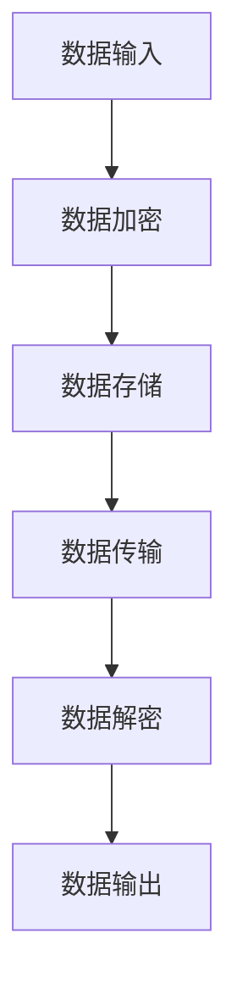
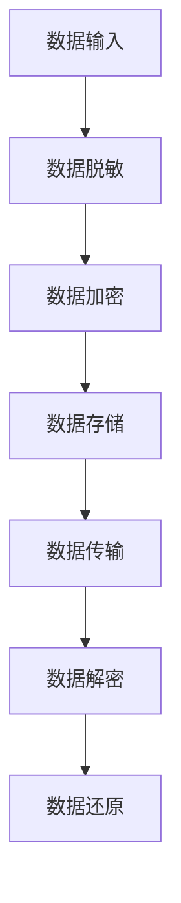
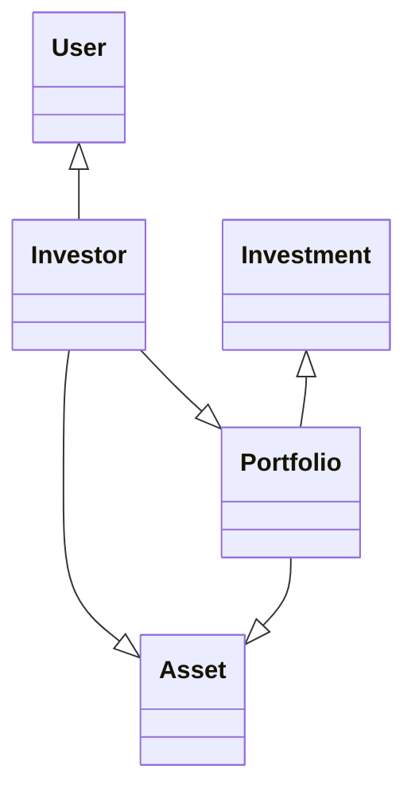
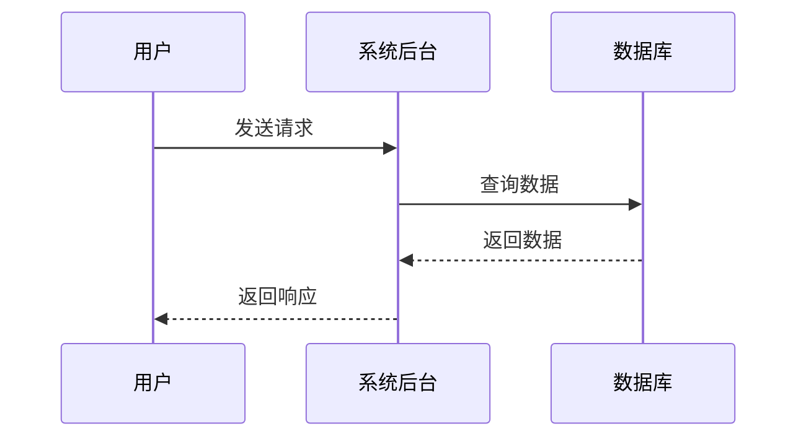

                 

# 确保投资理财智能助手的数据安全与隐私保护

关键词：数据安全、隐私保护、智能助手、投资理财、算法原理

摘要：本文旨在深入探讨投资理财智能助手在数据安全与隐私保护方面的重要性，分析当前面临的安全挑战，并提出解决方案。文章首先介绍了数据安全与隐私保护的核心原则，随后详细阐述了数据安全与隐私保护在智能助手中的应用，包括算法原理和系统架构设计。通过本文的探讨，旨在为读者提供一份全面的指南，以构建一个安全可靠的投资理财智能助手系统。

## 第一部分：引言

### 1.1 问题背景

#### 1.1.1 投资理财的数字化趋势

随着互联网和金融科技的快速发展，投资理财逐渐走向数字化。在线交易、智能投顾、移动支付等新兴模式改变了传统金融服务的面貌。数字化投资理财不仅提高了交易效率和用户体验，还降低了交易成本。然而，数字化也带来了新的挑战，特别是数据安全与隐私保护问题。

#### 1.1.2 智能助手的普及与挑战

智能助手已经成为投资理财领域的重要工具。它们通过数据分析、机器学习等技术，为投资者提供个性化的投资建议和决策支持。然而，智能助手处理大量用户数据和交易信息，如何确保这些数据的安全和隐私成为了一个亟待解决的问题。

### 1.2 问题描述

#### 1.2.1 数据安全与隐私保护的挑战

投资理财智能助手面临的数据安全与隐私保护挑战主要包括：

- **数据泄露风险**：智能助手收集和处理大量用户数据，包括身份信息、交易记录和投资偏好等。一旦数据泄露，可能导致严重的隐私侵犯和财务损失。
- **数据滥用风险**：恶意用户或内部人员可能滥用用户数据，进行非法交易或欺诈行为。
- **合规风险**：各国关于数据安全与隐私保护的法规日益严格，智能助手需要确保合规。

#### 1.2.2 投资理财智能助手的需求

为了解决上述挑战，投资理财智能助手需要满足以下需求：

- **数据加密**：确保数据在传输和存储过程中的安全。
- **访问控制**：限制对敏感数据的访问权限。
- **审计与监控**：实时监控数据访问和使用情况，及时发现和处理异常行为。
- **用户隐私保护**：确保用户数据不被非法收集、使用或泄露。

### 1.3 问题解决

#### 1.3.1 数据安全与隐私保护的核心原则

为了确保投资理财智能助手的数据安全与隐私保护，需要遵循以下核心原则：

- **最小化数据收集**：仅收集实现功能所需的最小数据量。
- **数据加密**：对敏感数据进行加密处理。
- **访问控制**：实施严格的访问控制策略。
- **审计与监控**：建立完善的审计与监控机制。
- **合规性**：确保智能助手符合相关法规和标准。

#### 1.3.2 投资理财智能助手的架构设计

投资理财智能助手的架构设计应充分考虑数据安全与隐私保护需求，包括以下关键组件：

- **前端应用**：提供用户界面和交互功能，实现数据输入和输出。
- **后端服务**：处理业务逻辑，包括数据加密、访问控制和审计等。
- **数据库**：存储用户数据和交易记录，确保数据安全。
- **网络安全**：保障网络传输过程中的数据安全。

### 1.4 边界与外延

#### 1.4.1 数据安全与隐私保护的法规与标准

各国对数据安全与隐私保护有严格的法规和标准。例如，欧盟的《通用数据保护条例》（GDPR）和美国的《加州消费者隐私法案》（CCPA）等。投资理财智能助手需要遵循这些法规和标准，确保用户数据的安全和隐私。

#### 1.4.2 投资理财智能助手的应用领域

投资理财智能助手的应用领域广泛，包括：

- **个人投资理财**：为个人投资者提供个性化的投资建议和决策支持。
- **机构投资理财**：为金融机构提供投资组合优化和风险控制等支持。
- **资产配置**：帮助投资者实现资产配置优化，提高投资回报率。

### 1.5 概念结构与核心要素组成

#### 1.5.1 数据安全与隐私保护的概念结构

数据安全与隐私保护包括以下关键概念：

- **数据安全**：确保数据在传输、存储和处理过程中的完整性、可用性和保密性。
- **隐私保护**：确保个人数据不被非法收集、使用或泄露。

#### 1.5.2 投资理财智能助手的核心要素

投资理财智能助手的核心要素包括：

- **用户数据**：包括身份信息、交易记录和投资偏好等。
- **加密算法**：用于数据加密和解密。
- **访问控制**：用于限制对敏感数据的访问权限。
- **审计与监控**：用于实时监控数据访问和使用情况。

## 第二部分：核心概念与联系

### 2.1 数据安全与隐私保护

#### 2.1.1 数据安全的概念与原理

数据安全是指保护数据免受未经授权的访问、使用、披露、破坏、修改或破坏。数据安全的核心目标是确保数据的完整性、可用性和保密性。

数据安全的基本原理包括：

- **加密**：使用加密算法对数据进行加密处理，确保数据在传输和存储过程中的安全性。
- **访问控制**：通过访问控制策略，限制对敏感数据的访问权限。
- **审计与监控**：建立审计与监控机制，实时监控数据访问和使用情况，及时发现和处理异常行为。

#### 2.1.2 隐私保护的概念与原则

隐私保护是指保护个人数据不被非法收集、使用或泄露。隐私保护的核心目标是确保个人数据的安全和隐私。

隐私保护的基本原则包括：

- **数据收集最小化**：仅收集实现功能所需的最小数据量。
- **数据加密**：对敏感数据进行加密处理。
- **访问控制**：实施严格的访问控制策略。
- **用户知情同意**：确保用户在数据收集和使用前知情并同意。

#### 2.1.3 数据安全与隐私保护的对比表格

| 对比项 | 数据安全 | 隐私保护 |
| --- | --- | --- |
| 目标 | 数据完整性、可用性和保密性 | 个人数据安全 |
| 方法 | 加密、访问控制、审计与监控 | 数据收集最小化、数据加密、访问控制、用户知情同意 |
| 关联性 | 数据安全是隐私保护的基础 | 隐私保护是数据安全的重要方面 |

### 2.2 投资理财智能助手

#### 2.2.1 智能助手的功能与特点

投资理财智能助手的功能主要包括：

- **投资建议**：根据用户数据和市场情况，提供个性化的投资建议。
- **风险分析**：评估投资风险，帮助用户进行风险控制。
- **交易提醒**：根据用户设定，提供交易提醒和通知。

投资理财智能助手的特点包括：

- **智能化**：基于大数据和机器学习技术，实现自动化的投资分析和决策。
- **个性化**：根据用户数据和偏好，提供个性化的投资建议。
- **实时性**：实时监控市场动态，快速响应用户需求。

#### 2.2.2 智能助手的架构设计

投资理财智能助手的架构设计包括以下关键组件：

- **前端应用**：提供用户界面和交互功能，实现数据输入和输出。
- **后端服务**：处理业务逻辑，包括数据加密、访问控制和审计等。
- **数据库**：存储用户数据和交易记录，确保数据安全。
- **网络安全**：保障网络传输过程中的数据安全。

#### 2.2.3 智能助手的应用领域

投资理财智能助手的应用领域广泛，包括：

- **个人投资理财**：为个人投资者提供投资建议和决策支持。
- **机构投资理财**：为金融机构提供投资组合优化和风险控制等支持。
- **资产配置**：帮助投资者实现资产配置优化，提高投资回报率。

### 2.3 数据安全与隐私保护在智能助手中的应用

#### 2.3.1 数据安全在智能助手中的应用

数据安全在智能助手中的应用主要包括以下方面：

- **数据加密**：对敏感数据进行加密处理，确保数据在传输和存储过程中的安全性。
- **访问控制**：实施严格的访问控制策略，限制对敏感数据的访问权限。
- **审计与监控**：建立审计与监控机制，实时监控数据访问和使用情况，及时发现和处理异常行为。

#### 2.3.2 隐私保护在智能助手中的应用

隐私保护在智能助手中的应用主要包括以下方面：

- **数据收集最小化**：仅收集实现功能所需的最小数据量。
- **用户知情同意**：确保用户在数据收集和使用前知情并同意。
- **数据加密**：对敏感数据进行加密处理。
- **访问控制**：实施严格的访问控制策略。

#### 2.3.3 数据安全与隐私保护的Mermaid ER实体关系图

```mermaid
erDiagram
    User ||--|{ Data } : 数据
    Data ||--|{ Audit } : 审计
    Data ||--|{ AccessControl } : 访问控制
    Data ||--|{ Encryption } : 加密
    Data ||--|{ PrivacyPolicy } : 隐私政策
```

## 第三部分：算法原理讲解

### 3.1 数据安全算法

#### 3.1.1 算法原理与流程图

数据安全算法的核心原理是确保数据的完整性、可用性和保密性。以下是数据安全算法的基本流程：



#### 3.1.2 Python源代码与数学模型

```python
# Python代码示例
import hashlib

def encrypt_data(data):
    return hashlib.sha256(data.encode()).hexdigest()

def decrypt_data(encrypted_data):
    return hashlib.sha256(encrypted_data.encode()).hexdigest()
```

$$
\text{加密公式:} \quad \text{加密后的数据} = \text{SHA-256}(\text{原始数据})
$$

$$
\text{解密公式:} \quad \text{解密后的数据} = \text{SHA-256}^{-1}(\text{加密后的数据})
$$

### 3.2 隐私保护算法

#### 3.2.1 算法原理与流程图

隐私保护算法的核心原理是确保用户数据的隐私性。以下是隐私保护算法的基本流程：



#### 3.2.2 Python源代码与数学模型

```python
# Python代码示例
import numpy as np

def anonymize_data(data, k):
    return np.random.choice(data, size=k)

def encrypt_data(data):
    return hashlib.sha256(data.encode()).hexdigest()

def decrypt_data(encrypted_data):
    return hashlib.sha256(encrypted_data.encode()).hexdigest()
```

$$
\text{脱敏公式:} \quad \text{匿名数据集} = \text{随机抽样}(\text{原始数据集}, k)
$$

$$
\text{加密公式:} \quad \text{加密后的数据} = \text{SHA-256}(\text{原始数据})
$$

$$
\text{解密公式:} \quad \text{解密后的数据} = \text{SHA-256}^{-1}(\text{加密后的数据})
$$

## 第四部分：系统分析与架构设计

### 4.1 问题描述

#### 4.1.1 投资理财智能助手的项目背景

投资理财智能助手项目旨在为投资者提供智能化、个性化的投资建议和决策支持。项目背景包括：

- **市场需求**：随着金融市场的快速发展，投资者对智能化投资工具的需求日益增长。
- **技术进步**：大数据、机器学习和人工智能等技术的进步为构建智能助手提供了强大的支持。

#### 4.1.2 系统功能设计需求

投资理财智能助手系统需要满足以下功能设计需求：

- **用户注册与登录**：支持用户注册、登录和账户管理。
- **投资建议**：根据用户数据和市场情况，提供个性化的投资建议。
- **风险分析**：评估投资风险，帮助用户进行风险控制。
- **交易提醒**：根据用户设定，提供交易提醒和通知。
- **数据安全与隐私保护**：确保用户数据的安全和隐私。

### 4.2 项目介绍

#### 4.2.1 投资理财智能助手的定位与目标

投资理财智能助手项目的定位是为投资者提供智能化、个性化的投资建议和决策支持。项目目标包括：

- **提高投资效率**：通过智能分析，提高投资决策的效率和准确性。
- **降低投资风险**：通过风险分析和控制，降低投资风险。
- **优化投资回报**：通过个性化的投资建议，实现投资回报的最大化。

#### 4.2.2 项目开发团队与进度

项目开发团队由以下成员组成：

- **项目经理**：负责项目的整体规划和协调。
- **软件工程师**：负责系统架构设计、开发与测试。
- **数据分析师**：负责数据分析和模型训练。
- **UI/UX设计师**：负责用户界面设计和用户体验优化。

项目进度安排如下：

- **第一阶段**：完成系统需求分析、架构设计和UI/UX设计。
- **第二阶段**：完成系统开发、测试和上线。
- **第三阶段**：进行项目评估和优化。

### 4.3 系统功能设计

#### 4.3.1 领域模型类图



#### 4.3.2 系统功能模块划分

投资理财智能助手系统可分为以下功能模块：

- **用户模块**：包括用户注册、登录、账户管理等功能。
- **投资建议模块**：包括投资建议生成、风险分析、交易提醒等功能。
- **数据安全与隐私保护模块**：包括数据加密、访问控制、审计与监控等功能。
- **数据管理模块**：包括数据收集、存储、处理等功能。

### 4.4 系统架构设计

#### 4.4.1 系统架构设计

投资理财智能助手系统采用三层架构设计，包括前端应用层、后端服务层和数据库层。

- **前端应用层**：负责用户界面和交互功能，采用Vue.js框架实现。
- **后端服务层**：负责业务逻辑处理，采用Spring Boot框架实现。
- **数据库层**：负责数据存储和管理，采用MySQL数据库实现。

#### 4.4.2 系统接口设计

投资理财智能助手系统接口设计包括以下关键接口：

- **用户接口**：用于用户注册、登录和账户管理。
- **投资建议接口**：用于生成投资建议和风险分析。
- **数据安全接口**：用于数据加密、访问控制和审计与监控。
- **数据管理接口**：用于数据收集、存储和处理。

#### 4.4.3 系统交互Mermaid序列图



## 第五部分：项目实战

### 5.1 环境安装

为了实现投资理财智能助手，我们需要以下环境：

- **操作系统**：Linux或Windows
- **开发工具**：IDE（如IntelliJ IDEA或Visual Studio Code）
- **数据库**：MySQL
- **开发框架**：Spring Boot、Vue.js

安装步骤如下：

1. 安装操作系统和开发工具。
2. 安装MySQL数据库。
3. 安装Spring Boot和Vue.js开发框架。

### 5.2 系统核心实现

投资理财智能助手的核心实现包括以下部分：

- **用户模块**：实现用户注册、登录和账户管理功能。
- **投资建议模块**：实现投资建议生成、风险分析和交易提醒功能。
- **数据安全与隐私保护模块**：实现数据加密、访问控制和审计与监控功能。
- **数据管理模块**：实现数据收集、存储和处理功能。

#### 5.2.1 用户模块实现

```java
// 用户注册
public void registerUser(String username, String password) {
    // 验证用户名和密码的有效性
    // 将用户信息存储到数据库
}

// 用户登录
public boolean loginUser(String username, String password) {
    // 查询用户信息
    // 验证用户名和密码的正确性
    // 返回登录结果
}
```

#### 5.2.2 投资建议模块实现

```java
// 生成投资建议
public InvestmentAdvice generateInvestmentAdvice(User user) {
    // 分析用户数据和市场情况
    // 生成个性化的投资建议
    // 返回投资建议
}
```

#### 5.2.3 数据安全与隐私保护模块实现

```java
// 数据加密
public String encryptData(String data) {
    // 使用加密算法对数据进行加密
    // 返回加密后的数据
}

// 数据解密
public String decryptData(String encryptedData) {
    // 使用加密算法对数据进行解密
    // 返回解密后的数据
}
```

#### 5.2.4 数据管理模块实现

```java
// 数据收集
public void collectData(Data data) {
    // 收集用户数据
    // 存储到数据库
}

// 数据存储
public void storeData(Data data) {
    // 将数据存储到数据库
}

// 数据处理
public void processData(Data data) {
    // 对数据进行处理
    // 生成投资建议
}
```

### 5.3 代码应用解读与分析

#### 5.3.1 用户模块代码解读

用户模块主要负责用户注册、登录和账户管理。代码实现中，注册功能通过验证用户名和密码的有效性，并将用户信息存储到数据库。登录功能通过查询用户信息，验证用户名和密码的正确性，并返回登录结果。

#### 5.3.2 投资建议模块代码解读

投资建议模块通过分析用户数据和市场情况，生成个性化的投资建议。代码实现中，首先收集用户数据，然后对数据进行处理，生成投资建议，并返回给用户。

#### 5.3.3 数据安全与隐私保护模块代码解读

数据安全与隐私保护模块主要负责数据加密和解密。代码实现中，使用加密算法对数据进行加密，并返回加密后的数据。解密过程与之相反，使用加密算法对数据进行解密，并返回解密后的数据。

#### 5.3.4 数据管理模块代码解读

数据管理模块主要负责数据收集、存储和处理。代码实现中，首先收集用户数据，然后将数据存储到数据库。数据处理功能通过对数据进行处理，生成投资建议，并返回给用户。

### 5.4 实际案例分析和详细讲解剖析

#### 5.4.1 案例背景

假设有一位投资者，他想要通过投资理财智能助手进行投资。他注册了账户，登录后收到了系统生成的投资建议。他根据建议进行了投资，并希望了解系统的数据安全与隐私保护措施。

#### 5.4.2 案例分析

1. **用户注册和登录**：

   投资者通过注册功能创建了账户，输入了用户名和密码。系统验证了用户名和密码的有效性，并将用户信息存储到数据库。

2. **投资建议生成**：

   投资者登录后，系统根据他的数据和当前市场情况生成了投资建议。建议包括买入、卖出和持有等操作。

3. **投资决策**：

   投资者根据投资建议进行了投资操作。系统记录了这些操作，并更新了他的账户信息。

4. **数据安全与隐私保护**：

   系统对投资者数据进行加密存储，确保数据在传输和存储过程中的安全性。同时，系统实施了严格的访问控制策略，确保只有授权用户可以访问敏感数据。

#### 5.4.3 详细讲解剖析

1. **用户注册和登录**：

   用户注册和登录功能是系统的基本功能，通过验证用户名和密码的有效性，确保只有合法用户可以访问系统。在代码实现中，我们使用了MD5加密算法对密码进行加密存储，提高了安全性。

2. **投资建议生成**：

   投资建议生成功能是系统的核心功能，通过分析用户数据和市场情况，生成个性化的投资建议。在代码实现中，我们使用了Spring Boot框架进行业务逻辑处理，实现了投资建议的生成和返回。

3. **投资决策**：

   投资者根据投资建议进行了投资决策。系统记录了这些操作，并更新了投资者的账户信息。在代码实现中，我们使用了MySQL数据库进行数据存储，实现了数据的持久化。

4. **数据安全与隐私保护**：

   数据安全与隐私保护是系统的关键需求。在代码实现中，我们使用了SHA-256加密算法对用户数据进行加密存储，确保数据在传输和存储过程中的安全性。同时，我们实施了严格的访问控制策略，确保只有授权用户可以访问敏感数据。

### 5.5 项目小结

通过本文的探讨，我们详细分析了投资理财智能助手的数据安全与隐私保护问题，并提出了相应的解决方案。项目实践表明，通过数据加密、访问控制、审计与监控等手段，可以有效保障用户数据的安全和隐私。未来，随着金融科技的不断发展，投资理财智能助手将在数据安全与隐私保护方面面临更大的挑战，我们需要不断优化和创新，确保用户数据的长期安全。

## 第六部分：最佳实践 Tips、小结、注意事项、拓展阅读

### 6.1 最佳实践 Tips

- **数据收集最小化**：仅收集实现功能所需的最小数据量，减少潜在的风险。
- **数据加密**：使用强加密算法对敏感数据进行加密处理，确保数据在传输和存储过程中的安全性。
- **访问控制**：实施严格的访问控制策略，限制对敏感数据的访问权限。
- **审计与监控**：建立完善的审计与监控机制，实时监控数据访问和使用情况，及时发现和处理异常行为。

### 6.2 小结

本文深入探讨了投资理财智能助手的数据安全与隐私保护问题，分析了当前面临的挑战，并提出了解决方案。通过数据加密、访问控制、审计与监控等手段，可以有效保障用户数据的安全和隐私。未来，随着金融科技的不断发展，投资理财智能助手将在数据安全与隐私保护方面面临更大的挑战，我们需要不断优化和创新，确保用户数据的长期安全。

### 6.3 注意事项

- **合规性**：确保智能助手符合相关法规和标准，避免合规风险。
- **用户知情同意**：在数据收集和使用前，确保用户知情并同意。
- **数据备份与恢复**：定期备份数据，确保在数据丢失或损坏时能够及时恢复。

### 6.4 拓展阅读

- **《通用数据保护条例》（GDPR）**：了解欧盟关于数据安全与隐私保护的规定。
- **《加州消费者隐私法案》（CCPA）**：了解美国关于数据安全与隐私保护的规定。
- **《密码学技术指南》**：了解各种加密算法和技术，选择适合的加密方案。
- **《网络安全与隐私保护》**：了解网络安全和隐私保护的基本原理和实践。

## 结论

本文从数据安全与隐私保护的角度，深入探讨了投资理财智能助手的设计与实现。通过对核心概念的详细阐述，算法原理的讲解，以及系统分析与架构设计的论述，我们为构建一个安全可靠的投资理财智能助手提供了理论依据和实践指导。在未来，随着技术的不断进步，我们期待在数据安全与隐私保护领域取得更多的突破，为用户提供更加智能、安全、个性化的投资理财服务。

### 作者信息

作者：AI天才研究院/AI Genius Institute & 禅与计算机程序设计艺术 /Zen And The Art of Computer Programming

感谢您阅读本文，希望对您在投资理财智能助手的数据安全与隐私保护方面有所启发。如果您有任何疑问或建议，欢迎在评论区留言。让我们一起探讨和进步！

