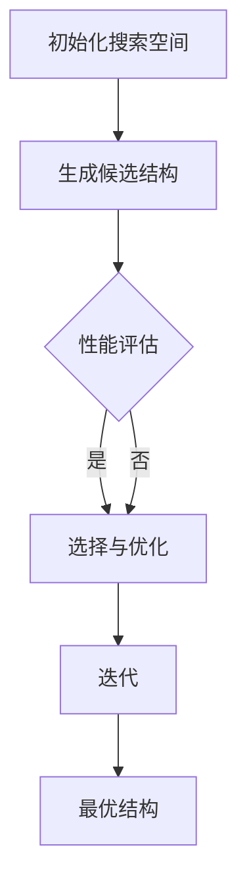
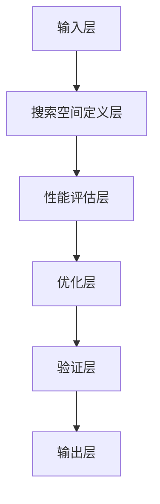
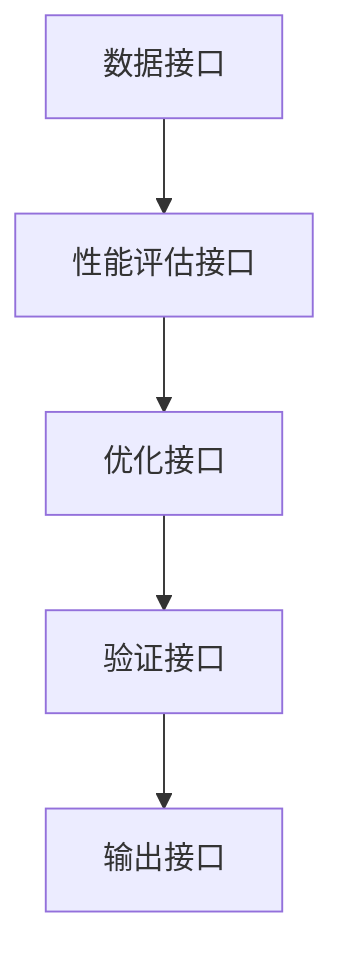
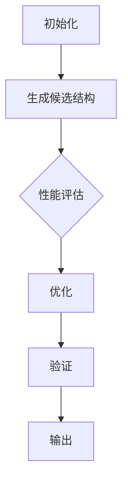
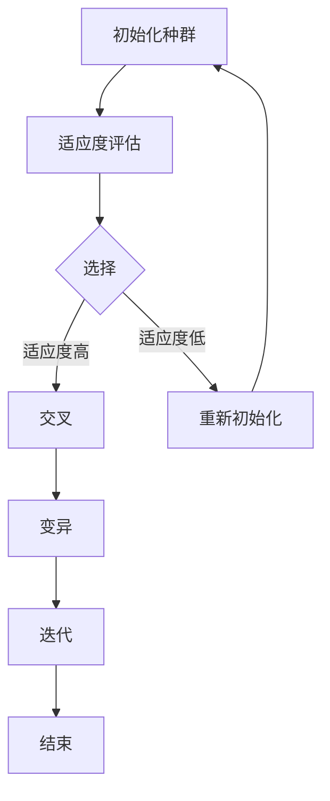
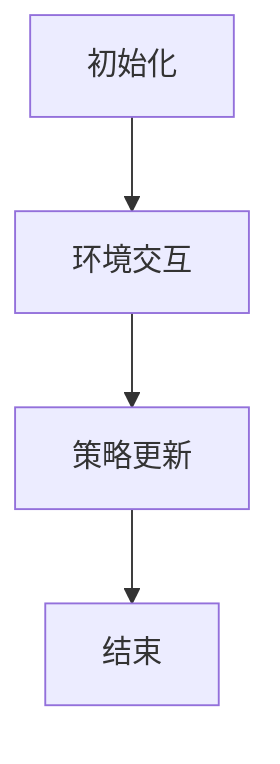
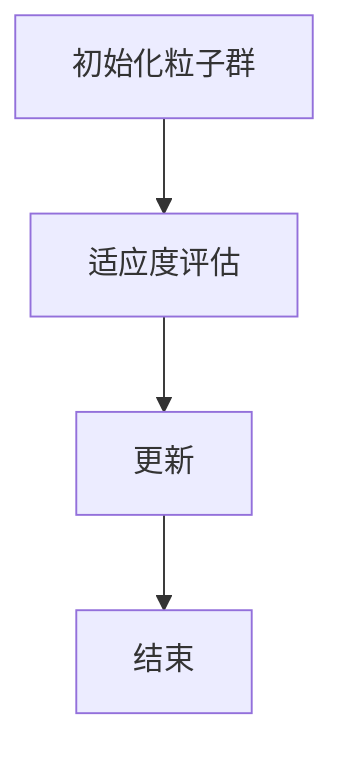
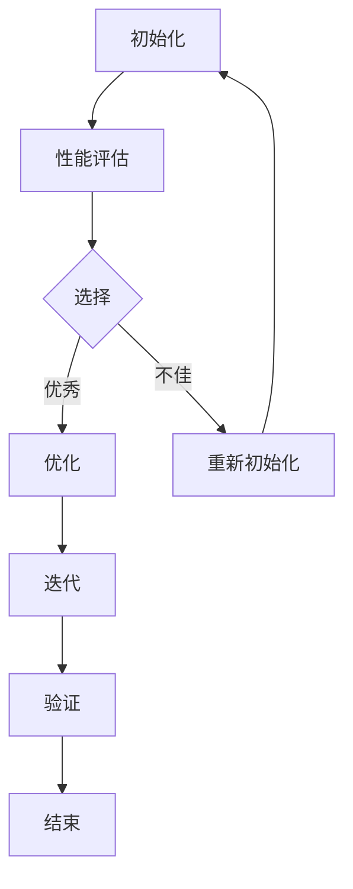

                 


### 引言

在人工智能（AI）迅猛发展的今天，深度学习已成为实现智能化的核心技术之一。其中，神经网络作为深度学习的基石，其性能和效率直接决定了AI应用的广度和深度。然而，传统的神经网络架构设计往往依赖于专家经验和试错法，这不仅耗时耗力，而且难以满足复杂应用场景的需求。为了解决这一问题，神经网络架构搜索（Neural Architecture Search, NAS）应运而生，成为自动化AI Agent模型结构优化的重要手段。

本文将围绕神经网络架构搜索展开，逐步探讨其设计思路、核心概念、算法原理、数学模型、系统分析、项目实战以及最佳实践等内容。通过这篇文章，您将深入了解NAS技术，并掌握如何利用这一技术来优化AI Agent模型结构，提高其性能和适应性。

首先，让我们从背景介绍开始，梳理出神经网络架构搜索的概念和自动化AI Agent模型结构优化的重要性。接下来，我们将深入探讨NAS的核心概念与联系，帮助您建立整体的知识框架。然后，通过算法原理讲解，我们将详细了解NAS的工作流程、核心组件以及优化方法。在数学模型和数学公式部分，我们将引入相关的数学模型和公式，确保读者能够准确理解NAS的数学基础。

随后，我们将进入系统分析与架构设计部分，详细分析神经网络架构搜索在系统中的应用，展示系统的功能设计、架构设计、接口设计以及系统交互。接着，通过项目实战部分，我们将提供一个具体的实战案例，帮助读者动手实践并加深理解。

最后，我们将总结书中的重点内容，提供额外的实践建议，并指引用户进一步阅读的资源。通过这篇文章，您将不仅了解神经网络架构搜索的基本原理，还能学会如何将其应用于实际的AI Agent模型结构优化。

#### 1.1.1 神经网络架构搜索概述

神经网络架构搜索（Neural Architecture Search, NAS）是一种自动化搜索算法，旨在通过搜索过程找到最优的神经网络结构，以实现特定任务的性能最大化。传统的神经网络设计依赖于人工设计或调优，这种方式不仅耗时耗力，而且难以应对复杂且不断变化的应用场景。NAS的出现，为神经网络设计提供了一种全新的解决方案。

NAS的核心思想是通过算法自动搜索出最优的神经网络结构，从而提高模型在特定任务上的性能。这个过程通常涉及以下几个关键步骤：

1. **搜索空间定义**：首先，需要定义一个搜索空间，包括所有可能的神经网络结构。搜索空间可以根据网络层数、每层的神经元数量、激活函数类型、连接方式等维度进行定义。

2. **性能评估**：对于搜索空间中的每个候选结构，通过训练和测试数据集进行性能评估，以确定其在特定任务上的性能。

3. **选择与优化**：根据评估结果，选择表现优异的结构进行进一步优化。这一过程可能涉及多个迭代，通过交叉验证和超参数调优来逐步提升模型性能。

4. **结果验证**：最终，通过在独立测试集上的验证，确保所选结构在未知数据上的泛化能力。

NAS的应用范围广泛，从图像识别、自然语言处理到强化学习等领域，NAS都展示出了显著的优势。特别是在处理复杂任务时，NAS能够自动搜索出最优的网络结构，从而大大提高模型性能。例如，在计算机视觉领域，NAS被用于设计更高效的卷积神经网络（CNN），在自然语言处理领域，NAS被用于构建强大的语言模型。

然而，NAS技术也面临着一些挑战。首先，搜索过程可能非常耗时，特别是在大规模搜索空间中。其次，NAS算法需要大量的计算资源和数据支持，这在实际应用中可能是一个瓶颈。此外，NAS算法的搜索策略和评估标准也需要不断优化，以应对不同任务的需求。

总之，神经网络架构搜索作为自动化AI Agent模型结构优化的重要技术，具有巨大的潜力。通过合理的搜索空间设计和高效的性能评估方法，NAS有望在未来继续推动人工智能的发展，为各行业提供更加智能化的解决方案。

#### 1.1.2 自动化AI Agent模型结构优化的重要性

在当前的AI领域中，自动化AI Agent模型结构优化具有至关重要的意义。首先，随着AI应用场景的多样化和复杂性不断增加，传统的手工设计神经网络结构已经无法满足快速迭代和高效优化的需求。自动化AI Agent模型结构优化能够通过算法自动搜索和优化神经网络结构，从而提高模型在特定任务上的性能和适应性。这种自动化优化不仅大幅减少了人工设计的工作量，还能够在更短的时间内找到更优的模型结构。

其次，自动化AI Agent模型结构优化在提升AI模型的泛化能力方面也具有显著作用。传统的人工设计方法往往局限于特定任务和特定数据集，而自动化搜索可以在大规模数据集和多种任务上找到具有更强泛化能力的模型结构。这使得AI模型能够更好地应对未知场景和动态变化，提高了其实用性和可靠性。

此外，自动化AI Agent模型结构优化还在以下几个方面带来了重要影响：

1. **效率提升**：自动化搜索和优化过程能够大幅提高模型训练和测试的效率。传统的手工调优往往需要反复尝试和调整，而自动化算法能够在较短时间内找到最优结构，从而减少开发周期。

2. **资源节约**：自动化优化减少了人工干预的需求，节约了计算资源和人力资源。特别是在大规模训练和搜索过程中，自动化算法能够更高效地利用现有资源。

3. **成本降低**：通过自动化搜索和优化，企业能够降低AI模型开发和部署的成本。自动化算法不仅能够提高模型性能，还能通过减少训练数据的需求和优化计算资源利用，降低总体成本。

4. **创新驱动**：自动化AI Agent模型结构优化为AI研究提供了新的研究方向和工具。通过探索未知的神经网络结构，研究人员可以不断发现新的模型设计和优化策略，推动人工智能领域的创新。

总之，自动化AI Agent模型结构优化在当前AI领域中具有不可替代的重要性。它不仅提高了模型性能和适应性，还促进了AI技术的广泛应用和创新发展。通过不断优化和改进自动化搜索算法，我们可以期待在未来看到更多高效、智能的AI应用场景。

#### 1.1.3 解决方案

为了实现自动化AI Agent模型结构优化，我们提出了一套全面的解决方案，涵盖系统设计、技术实现和优化策略等关键方面。

**系统设计**

1. **搜索空间定义**：首先，定义一个广泛的搜索空间，包括各种神经网络结构、层类型、神经元数量、激活函数、连接方式等。使用Mermaid流程图（如下）来展示搜索空间的组成：
   ```mermaid
   graph LR
   A[搜索空间定义] --> B[网络结构]
   B --> C[层类型]
   B --> D[神经元数量]
   B --> E[激活函数]
   B --> F[连接方式]
   ```
   通过这样的定义，系统能够覆盖所有可能的网络结构，确保搜索的全面性。

2. **性能评估模块**：设计一个高性能的评估模块，用于对搜索空间中的每个候选结构进行性能评估。该模块通过训练和测试数据集计算模型性能指标，如准确率、损失函数值等。评估模块的设计应考虑以下要素：
   - **数据预处理**：标准化和归一化输入数据，确保评估结果的可靠性。
   - **训练过程**：快速、高效地训练模型，使用分布式计算和GPU加速。
   - **性能计算**：计算并记录每个候选结构的性能指标，为选择过程提供数据支持。

3. **选择与优化模块**：设计一个优化模块，用于根据性能评估结果选择和优化候选结构。该模块应包括以下功能：
   - **性能排序**：根据性能指标对候选结构进行排序，选择表现优异的结构。
   - **超参数调优**：通过调整网络结构中的超参数（如学习率、批量大小等），进一步提升模型性能。
   - **交叉验证**：使用交叉验证方法，确保所选结构在多个数据子集上的稳定性。

4. **结果验证模块**：在独立测试集上验证所选结构的泛化能力，确保其能够在未知数据上表现出色。结果验证模块应包括以下步骤：
   - **独立测试集**：使用未参与训练的数据集进行测试，确保验证结果的客观性。
   - **性能测量**：记录测试集上的性能指标，如准确率、召回率等。
   - **结果分析**：分析测试结果，验证所选结构的泛化能力和可靠性。

**技术实现**

1. **神经网络框架**：选择一个成熟的深度学习框架，如TensorFlow或PyTorch，用于实现神经网络模型。这些框架提供了丰富的API和工具，能够简化模型设计和训练过程。

2. **搜索算法**：实现多种搜索算法，如基于遗传算法（GA）、强化学习（RL）、粒子群优化（PSO）等的搜索算法。每种算法应具备以下特性：
   - **可扩展性**：能够处理不同规模和类型的搜索空间。
   - **高效性**：能够在合理时间内完成搜索过程。
   - **适应性**：根据搜索过程中的反馈动态调整搜索策略。

3. **并行计算**：利用并行计算技术，如GPU加速和分布式训练，提高模型的训练和搜索效率。具体实现包括：
   - **数据并行**：将训练数据划分到多个GPU上，并行处理。
   - **模型并行**：将神经网络模型划分到多个GPU上，并行计算。

**优化策略**

1. **多样性引导**：在搜索过程中，通过引入多样性策略，避免陷入局部最优。多样性策略包括随机搜索、子网络组合等。

2. **迭代优化**：通过多次迭代优化，逐步提升模型性能。每次迭代应包括搜索、评估、选择和优化四个步骤。

3. **超参数调优**：使用自动化调优工具，如Hyperopt或Optuna，对搜索过程中的超参数进行调优，确保最佳性能。

通过以上系统设计和技术实现，我们的解决方案能够高效地实现自动化AI Agent模型结构优化，为AI应用提供更强有力的支持。

#### 1.2 自动化AI Agent的定义

自动化AI Agent（也称为智能代理）是一种具有自主决策和执行能力的计算机程序，能够在复杂环境中执行特定任务。其核心在于能够根据环境状态和预定的目标，自主地选择和执行动作，从而实现任务目标的最大化或最优解。自动化AI Agent的定义涉及以下几个方面：

1. **自主性**：自动化AI Agent具有自主决策能力，能够在没有人为干预的情况下，根据当前环境状态和预设目标，自主选择和执行动作。这种自主性是AI Agent区别于传统程序的关键特征。

2. **适应性**：自动化AI Agent能够在动态变化的环境中适应和调整自身的行为。通过不断学习和经验积累，AI Agent能够适应新的环境条件和任务需求，提高其应对复杂情境的能力。

3. **智能行为**：自动化AI Agent能够执行复杂的任务，如路径规划、目标识别、资源管理等。其智能行为基于深度学习、强化学习、规划算法等先进技术，使得AI Agent能够在多任务环境中表现出色。

4. **交互性**：自动化AI Agent不仅能够执行任务，还能够与环境进行交互，获取环境信息，反馈执行结果。这种交互性使得AI Agent能够在复杂的系统中与其他组件协同工作，提高整个系统的效率。

自动化AI Agent的应用范围广泛，包括但不限于以下几个方面：

1. **智能助手**：自动化AI Agent被广泛应用于智能助手领域，如智能客服、智能语音助手等。这些AI Agent能够通过语音或文本与用户进行交互，提供个性化的服务和支持。

2. **智能制造**：在智能制造领域，自动化AI Agent被用于生产线监控、故障诊断、设备维护等任务。通过实时监测设备状态和数据，AI Agent能够预测故障、优化生产流程，提高生产效率和产品质量。

3. **智能交通**：在智能交通领域，自动化AI Agent被用于交通管理、路径规划、车辆调度等任务。通过实时分析交通数据，AI Agent能够优化交通流量，减少拥堵，提高道路通行效率。

4. **医疗健康**：在医疗健康领域，自动化AI Agent被用于疾病诊断、病情预测、健康管理等任务。通过分析患者数据、医学影像等，AI Agent能够提供精准的诊断和治疗方案，提高医疗服务的质量和效率。

5. **金融科技**：在金融科技领域，自动化AI Agent被用于风险管理、投资决策、客户服务等领域。通过分析金融市场数据、客户行为等，AI Agent能够提供智能化的风险管理策略和投资建议，提高金融服务的效率和安全性。

总之，自动化AI Agent作为一种具有自主决策和执行能力的计算机程序，在多个领域展示了其巨大的潜力和应用价值。随着人工智能技术的不断进步，自动化AI Agent将在未来发挥更加重要的作用，为各行业带来深刻的变革和创新。

#### 1.2.2 模型结构优化的意义

在人工智能领域，模型结构优化具有重要的理论和实际意义。从理论上讲，模型结构优化能够提升神经网络的泛化能力和计算效率，使得AI模型能够更好地应对复杂问题。从实际应用上看，模型结构优化能够显著提升AI系统的性能和效率，从而在多个领域带来深远影响。

首先，模型结构优化有助于提高神经网络的泛化能力。传统的神经网络设计通常依赖于人工经验，容易受到设计者的主观影响。而通过优化模型结构，可以自动搜索出更加适合特定任务的神经网络结构，从而提高模型的泛化能力。泛化能力强的模型能够在不同的数据和场景下表现出色，减少对特定数据的依赖，提高其在真实世界中的应用价值。

其次，模型结构优化能够提高计算效率。随着神经网络规模的增大和参数数量的增加，模型的计算复杂度和训练时间也会显著增加。通过优化模型结构，可以减少网络参数的数量和计算量，从而提高模型的训练速度和推理效率。这对于需要实时响应和低延迟的应用场景尤为重要，如自动驾驶、实时语音识别等。

在实际应用中，模型结构优化带来了以下几方面的显著影响：

1. **计算资源的节约**：优化后的模型结构在训练和推理过程中所需的计算资源更少，这使得在资源受限的环境中（如嵌入式系统、移动设备等）也能运行高效的AI模型。此外，减少计算资源的需求也降低了硬件成本，使得AI技术更加普及。

2. **效率提升**：优化的模型结构能够显著提高AI系统的响应速度和计算效率，从而提升用户体验。例如，在图像识别任务中，优化的模型可以在更短的时间内完成图像处理，提高图像识别的实时性。

3. **任务性能提升**：通过优化模型结构，可以显著提升AI系统在特定任务上的性能。例如，在自然语言处理领域，优化的模型结构能够提高文本分类、情感分析等任务的准确率和效率。

4. **适应性增强**：优化的模型结构使得AI系统能够更好地适应动态变化的环境。通过不断调整和优化模型结构，AI系统可以更好地应对新的任务和数据集，提高其在不断变化的应用场景中的适应性。

总之，模型结构优化在人工智能领域具有重要意义。它不仅提升了神经网络的性能和效率，还为AI技术在各个领域的广泛应用提供了强有力的支持。随着技术的不断进步，我们可以期待模型结构优化在未来带来更多创新和突破。

#### 1.2.3 自动化优化的方法与挑战

自动化优化方法在神经网络架构搜索（NAS）中扮演着至关重要的角色。这些方法通过算法和工具，自动搜索和优化神经网络结构，从而提高模型性能。常见的自动化优化方法包括基于遗传算法（GA）、强化学习（RL）、粒子群优化（PSO）等。以下将详细介绍这些方法的基本原理、适用场景及其优缺点。

**遗传算法（GA）**

遗传算法是一种基于生物进化的优化算法。它模拟自然选择和遗传过程，通过迭代进化找到最优解。在NAS中，GA通过以下步骤进行操作：

1. **初始化种群**：生成一组随机初始结构作为种群。
2. **适应度评估**：使用训练数据集评估每个结构的性能，计算适应度值。
3. **选择**：根据适应度值选择优秀的结构进行繁殖。
4. **交叉**：随机选择两个父结构，生成子结构。
5. **变异**：对子结构进行随机变异，增加多样性。
6. **迭代**：重复上述步骤，逐步优化结构。

**适用场景**：GA适用于大规模搜索空间，能够处理复杂且多样化的神经网络结构。

**优点**：GA具有强大的全局搜索能力，能够找到最优或近似最优解。

**缺点**：计算成本高，收敛速度较慢。

**强化学习（RL）**

强化学习是一种基于奖励机制的学习算法。在NAS中，RL通过以下步骤进行结构优化：

1. **初始化**：定义一个初始结构作为智能体。
2. **环境交互**：智能体根据当前结构进行训练，并评估性能。
3. **决策**：智能体根据当前状态和奖励信号，选择下一步操作。
4. **更新**：基于奖励信号更新智能体的策略。

**适用场景**：RL适用于需要高精度优化和复杂决策的任务。

**优点**：RL能够通过交互学习和反馈不断优化结构，具有较好的自适应能力。

**缺点**：RL对数据量要求较高，训练过程可能不稳定。

**粒子群优化（PSO）**

粒子群优化是一种基于群体智能的优化算法。它模拟鸟群觅食行为，通过更新粒子的位置和速度来搜索最优解。在NAS中，PSO通过以下步骤进行操作：

1. **初始化粒子群**：生成一组随机粒子，每个粒子代表一个结构。
2. **适应度评估**：评估每个粒子的适应度值。
3. **更新**：根据每个粒子的历史最优位置和全局最优位置更新粒子的速度和位置。

**适用场景**：PSO适用于中等规模搜索空间，能够快速找到较好的解决方案。

**优点**：PSO计算简单，易于实现，收敛速度较快。

**缺点**：PSO容易陷入局部最优，全局搜索能力较弱。

**挑战与解决方案**

尽管上述自动化优化方法在NAS中表现出色，但仍然面临一些挑战：

1. **计算成本**：NAS需要大量的计算资源，尤其是在大规模搜索空间中。为了降低计算成本，可以采用分布式计算和GPU加速等技术。

2. **收敛速度**：自动化优化方法在搜索初期可能收敛较慢，需要较长时间找到最优结构。为了提高收敛速度，可以采用多种优化策略，如自适应调整学习率、引入多样性引导等。

3. **数据需求**：NAS对训练数据有较高需求，尤其是在大规模搜索空间中。为了满足数据需求，可以采用数据增强、迁移学习等技术。

4. **搜索策略**：如何设计有效的搜索策略是NAS的核心挑战。为了应对这一挑战，可以结合多种优化算法，如GA+RL、PSO+GA等，形成混合优化策略。

总之，自动化优化方法在NAS中具有重要作用，但同时也面临一些挑战。通过不断研究和优化，我们可以期待在未来看到更高效、更智能的NAS解决方案。

#### 1.3.1 神经网络架构搜索的基本概念

神经网络架构搜索（Neural Architecture Search, NAS）是一种自动化方法，用于搜索和优化神经网络的结构，以提高模型在特定任务上的性能。NAS的核心思想是通过算法自动探索大规模的网络结构空间，找到最优的网络配置，从而替代传统的人工设计方法。

**基本概念**

1. **搜索空间**：搜索空间是NAS的关键组成部分，定义了所有可能的神经网络结构。搜索空间可以包括各种网络层类型、层数、每层的神经元数量、连接方式、激活函数等。一个丰富的搜索空间能够确保算法有足够的选择空间，从而找到更优的网络结构。

2. **候选网络结构**：在搜索过程中，NAS会生成和评估大量的候选网络结构。每个候选结构是一个具体的神经网络配置，可以是不同的网络层组合、层间连接方式等。

3. **性能评估**：性能评估是NAS的核心步骤，用于衡量每个候选结构的性能。性能评估通常基于特定的任务和数据集，如分类准确率、回归损失函数值等。通过评估，NAS可以确定哪个结构在特定任务上表现最优。

4. **优化算法**：NAS使用多种优化算法来搜索最优网络结构，如遗传算法（GA）、强化学习（RL）、粒子群优化（PSO）等。这些算法通过迭代优化，逐步改进网络结构，直到找到最优解。

**搜索过程**

NAS的基本搜索过程可以分为以下几个步骤：

1. **初始化**：初始化搜索空间和候选网络结构。通常，初始化可以采用随机方法，生成一组初始的候选结构。

2. **性能评估**：对每个候选结构进行性能评估，计算其任务表现。评估过程通常包括训练和验证两个阶段，通过验证集上的性能来衡量模型的泛化能力。

3. **选择与优化**：根据性能评估结果，选择表现优异的候选结构进行进一步优化。优化过程可以通过调整网络结构中的参数、层类型、连接方式等来实现。

4. **迭代**：重复性能评估和优化步骤，逐步提高候选结构的性能。在每次迭代中，算法会根据历史最优结构和新评估结果，更新搜索策略和候选结构。

5. **收敛**：当性能评估结果达到预设的阈值或达到最大迭代次数时，搜索过程收敛，找到最优的网络结构。

**与传统方法的比较**

与传统的神经网络设计方法相比，NAS具有以下几个显著优势：

1. **自动化**：NAS通过算法自动化搜索最优网络结构，减少了人工干预和经验依赖。

2. **高效性**：NAS能够在大规模搜索空间中快速找到最优结构，提高模型设计的效率。

3. **多样化**：NAS能够探索多样化的网络结构，提高模型在复杂任务上的适应性。

4. **优化性**：NAS通过优化算法不断调整网络结构，找到更适合特定任务的结构，提高模型性能。

然而，NAS也存在一些挑战，如计算成本高、收敛速度慢等。尽管如此，随着计算资源和算法的进步，NAS在神经网络设计和优化中的应用越来越广泛，为人工智能领域带来了新的机遇和挑战。

#### 1.3.2 NAS的算法原理

神经网络架构搜索（Neural Architecture Search, NAS）是一种自动化搜索方法，旨在通过算法找到最优的神经网络结构，以提高模型在特定任务上的性能。NAS的核心思想是通过搜索算法探索大规模的网络结构空间，选择和优化候选结构，最终找到最优的网络配置。以下将详细介绍NAS的工作流程、核心组件和优化方法。

**工作流程**

NAS的工作流程通常包括以下几个关键步骤：

1. **初始化搜索空间**：首先，定义搜索空间，包括所有可能的神经网络结构。搜索空间可以涵盖网络层类型、层数、每层的神经元数量、激活函数、连接方式等多个维度。

2. **生成候选结构**：使用搜索算法生成一系列候选神经网络结构。常见的搜索算法包括遗传算法（GA）、强化学习（RL）、粒子群优化（PSO）等。

3. **性能评估**：对每个候选结构进行性能评估，通常通过训练和验证数据集来计算性能指标，如准确率、损失函数值等。

4. **选择与优化**：根据性能评估结果，选择表现优异的候选结构进行进一步优化。优化过程可能涉及调整网络结构中的参数、层类型、连接方式等。

5. **迭代**：重复性能评估和优化步骤，逐步提高候选结构的性能，直到找到最优的网络结构。

**核心组件**

NAS的核心组件主要包括以下几个方面：

1. **搜索空间**：搜索空间是NAS的基础，定义了所有可能的神经网络结构。一个丰富的搜索空间能够确保算法有足够的选择空间，从而找到更优的网络结构。

2. **搜索算法**：搜索算法是NAS的核心，用于在搜索空间中生成和评估候选结构。常见的搜索算法包括遗传算法（GA）、强化学习（RL）、粒子群优化（PSO）等。

3. **性能评估器**：性能评估器用于评估每个候选结构的性能，计算其任务表现。性能评估器通常包括训练和验证两个阶段，通过验证集上的性能来衡量模型的泛化能力。

4. **优化器**：优化器用于调整网络结构中的参数，以提高模型性能。常见的优化器包括梯度下降、Adam优化器等。

**优化方法**

NAS的优化方法主要包括以下几种：

1. **基于遗传算法的优化**：遗传算法（GA）通过模拟自然进化过程，在搜索空间中生成和评估候选结构。GA的主要步骤包括初始化种群、适应度评估、选择、交叉和变异等。

2. **基于强化学习的优化**：强化学习（RL）通过奖励机制，指导搜索算法找到最优的网络结构。RL的主要步骤包括初始化智能体、环境交互、决策和策略更新等。

3. **基于粒子群优化的优化**：粒子群优化（PSO）通过模拟鸟群觅食行为，在搜索空间中搜索最优解。PSO的主要步骤包括初始化粒子群、适应度评估、粒子更新等。

**算法流程图**

以下是一个简单的NAS算法流程图，使用Mermaid工具绘制：



**Python代码示例**

以下是一个简单的Python代码示例，用于生成和评估一个简单的卷积神经网络（CNN）结构：

```python
import tensorflow as tf
from tensorflow.keras.models import Model
from tensorflow.keras.layers import Conv2D, Flatten, Dense

# 定义搜索空间
search_space = {
    'layers': [
        {'type': 'Conv2D', 'filters': [32, 64], 'kernel_size': [(3, 3), (5, 5)]},
        {'type': 'Flatten'},
        {'type': 'Dense', 'units': [128, 64]}
    ]
}

# 生成候选结构
def generate_candidate(search_space):
    candidate = []
    for layer in search_space['layers']:
        if layer['type'] == 'Conv2D':
            candidate.append(Conv2D(filters=layer['filters'], kernel_size=layer['kernel_size']))
        elif layer['type'] == 'Flatten':
            candidate.append(Flatten())
        elif layer['type'] == 'Dense':
            candidate.append(Dense(units=layer['units']))
    return Model(inputs=candidate[0].inputs, outputs=candidate[-1](candidate[0].outputs))

# 评估候选结构
def evaluate_candidate(candidate, X_train, y_train, X_val, y_val):
    model = candidate.compile(optimizer='adam', loss='mean_squared_error', metrics=['accuracy'])
    history = model.fit(X_train, y_train, validation_data=(X_val, y_val), epochs=10)
    val_accuracy = history.history['val_accuracy'][-1]
    return val_accuracy

# 使用搜索空间生成和评估候选结构
candidate = generate_candidate(search_space)
val_accuracy = evaluate_candidate(candidate, X_train, y_train, X_val, y_val)
print(f"候选结构性能：{val_accuracy}")
```

通过以上代码，我们可以生成和评估一个简单的CNN结构，并记录其性能指标。这一示例展示了NAS的基本原理和实现方法，读者可以根据具体需求进行扩展和优化。

#### 1.3.3 NAS的数学模型

神经网络架构搜索（NAS）的数学模型是理解其工作原理的关键。在NAS中，数学模型用于描述网络结构的性能评估、优化过程以及搜索策略。以下将介绍NAS中常用的数学模型，包括性能评估指标、优化目标函数以及相关的数学公式。

**性能评估指标**

性能评估是NAS的核心环节，用于衡量候选结构的性能。在NAS中，常用的性能评估指标包括准确率（Accuracy）、损失函数（Loss Function）等。

1. **准确率（Accuracy）**：

   $$ 
   Accuracy = \frac{1}{N} \sum_{i=1}^{N} \mathbb{1}_{\hat{y}_i = y_i} 
   $$

   其中，$N$ 是样本数量，$\hat{y}_i$ 是模型预测的类别标签，$y_i$ 是实际标签，$\mathbb{1}_{\hat{y}_i = y_i}$ 是指示函数，当预测正确时取值为1，否则为0。

2. **交叉熵损失（Cross-Entropy Loss）**：

   $$ 
   Loss = -\frac{1}{N} \sum_{i=1}^{N} \sum_{j=1}^{C} y_{ij} \log(\hat{y}_{ij}) 
   $$

   其中，$C$ 是类别数量，$y_{ij}$ 是实际标签的one-hot编码，$\hat{y}_{ij}$ 是模型预测的概率分布。

**优化目标函数**

优化目标函数是NAS中的核心，用于指导搜索算法找到最优的网络结构。在NAS中，优化目标函数通常是基于性能评估指标设计的。

1. **最大化准确率**：

   $$
   \text{Objective} = \max Accuracy
   $$

   目标是最大化模型的准确率，找到在特定任务上表现最优的网络结构。

2. **最小化交叉熵损失**：

   $$
   \text{Objective} = \min Loss
   $$

   目标是最小化模型的交叉熵损失，提高模型对训练数据的拟合程度。

**搜索策略**

在NAS中，搜索策略决定了如何从搜索空间中选择和优化候选结构。以下介绍几种常用的搜索策略：

1. **基于遗传算法的搜索策略**：

   - **适应度评估**：计算每个候选结构的适应度值，通常使用性能评估指标。
   - **选择**：根据适应度值选择优秀的候选结构进行交叉和变异操作。
   - **交叉**：随机选择两个父结构，生成子结构。
   - **变异**：对子结构进行随机变异，增加多样性。
   - **迭代**：重复上述步骤，逐步优化结构。

2. **基于强化学习的搜索策略**：

   - **状态**：当前网络结构。
   - **动作**：网络结构的微调操作，如增加或删除层、调整神经元数量等。
   - **奖励**：评估每个动作后网络的性能改进。
   - **策略**：根据奖励信号更新网络结构。

3. **基于粒子群优化的搜索策略**：

   - **粒子群**：每个粒子代表一个候选结构。
   - **适应度评估**：评估每个粒子的适应度值。
   - **更新**：根据每个粒子的历史最优位置和全局最优位置更新粒子的速度和位置。

**数学模型示例**

以下是一个简单的数学模型示例，用于说明NAS中的搜索过程：

1. **适应度评估**：

   $$
   f(s) = Accuracy(s) - \lambda Loss(s)
   $$

   其中，$s$ 是网络结构，$Accuracy(s)$ 是网络在验证集上的准确率，$Loss(s)$ 是交叉熵损失，$\lambda$ 是权衡参数，用于平衡准确率和损失函数。

2. **优化目标函数**：

   $$
   \max_{s} f(s)
   $$

   目标是找到使适应度函数最大的网络结构。

3. **搜索策略**：

   - **遗传算法**：
     $$
     s_{next} = Crossover(parent_1, parent_2) + Mutation(s_{next})
     $$
   - **强化学习**：
     $$
     s_{next} = \arg\max_{s'} Q(s, a) + \gamma \max_{s''} Q(s', a')
     $$
   - **粒子群优化**：
     $$
     s_{next} = s_i + w_1 \cdot (p_i - s_i) + w_2 \cdot (g - s_i)
     $$

通过上述数学模型，NAS能够自动搜索和优化神经网络结构，找到在特定任务上表现最优的网络配置。这些模型为NAS的实现提供了理论基础，帮助研究者设计和优化NAS算法。

#### 1.3.4 NAS的系统分析与架构设计

在深入探讨神经网络架构搜索（NAS）的具体实现和算法原理之后，我们需要对其在系统中的应用进行详细分析，并展示一个完整的架构设计方案。本部分将涵盖系统功能设计、架构设计、接口设计和系统交互，旨在为读者提供一个清晰、全面的系统视图。

**1. 系统功能设计**

首先，我们需要明确NAS系统的核心功能，这些功能是系统正常运行和高效搜索的关键。

1. **搜索空间定义**：定义搜索空间，包括所有可能的神经网络结构。这包括网络层类型、层数、每层的神经元数量、激活函数、连接方式等。
2. **性能评估模块**：用于对搜索空间中的每个候选结构进行性能评估。这个模块需要能够快速处理大量数据，并计算准确率和损失函数值等性能指标。
3. **优化模块**：选择和优化候选结构，通过遗传算法、强化学习或其他优化方法，逐步提升模型性能。
4. **结果验证模块**：在独立测试集上验证最优结构的泛化能力，确保模型在未知数据上的性能。
5. **数据预处理**：用于标准化和归一化输入数据，确保性能评估的可靠性。

**2. 系统架构设计**

NAS系统的架构设计需要考虑模块之间的交互和整体性能。以下是一个典型的NAS系统架构设计：

- **输入层**：接收任务描述和数据输入。
- **搜索空间定义层**：定义搜索空间，包括各种神经网络结构。
- **性能评估层**：对每个候选结构进行性能评估。
- **优化层**：选择和优化候选结构。
- **验证层**：验证最优结构的泛化能力。
- **输出层**：输出最优的网络结构和性能指标。

**架构设计图（使用Mermaid绘制）**：



**3. 接口设计**

为了实现系统功能，需要设计一组清晰的接口，这些接口用于模块之间的通信和交互。以下是NAS系统的主要接口设计：

- **数据接口**：用于接收和传递数据，包括训练数据、验证数据和测试数据。
- **性能评估接口**：用于计算和返回每个候选结构的性能指标。
- **优化接口**：用于选择和优化候选结构。
- **验证接口**：用于验证最优结构的泛化能力。
- **输出接口**：用于输出最优的网络结构和性能指标。

**接口设计图（使用Mermaid绘制）**：



**4. 系统交互**

系统交互是指各模块之间的协同工作和数据流。以下是NAS系统的交互过程：

1. **初始化**：系统启动，定义搜索空间和性能评估指标。
2. **生成候选结构**：根据搜索空间生成多个初始候选结构。
3. **性能评估**：对每个候选结构进行性能评估，记录评估结果。
4. **优化**：根据评估结果，选择优异的候选结构进行优化。
5. **验证**：在独立测试集上验证最优结构的泛化能力。
6. **输出**：输出最优的网络结构和性能指标。

**交互流程图（使用Mermaid绘制）**：



通过以上系统分析与架构设计，我们为NAS系统的实现提供了一个全面、详细的方案。这个方案不仅涵盖了系统功能、架构设计和接口设计，还展示了系统交互的详细流程。这样的系统设计不仅能够实现NAS的基本功能，还能够通过模块化设计和优化策略，提高系统的性能和可靠性。

### 第二部分：核心概念与原理

在神经网络架构搜索（Neural Architecture Search, NAS）技术中，理解其核心概念和原理至关重要。这一部分将详细介绍NAS的工作流程、关键组件、优化方法，并使用mermaid工具绘制算法流程图，通过Python代码示例进行解释，帮助读者深入理解NAS的工作机制。

#### 工作流程

NAS的工作流程可以分为以下几个关键步骤：

1. **定义搜索空间**：首先，定义搜索空间，即所有可能的神经网络结构。搜索空间包括网络层类型、层数、每层的神经元数量、激活函数、连接方式等。
2. **生成初始候选结构**：使用搜索空间生成一系列初始的候选神经网络结构。
3. **性能评估**：对每个候选结构进行性能评估，计算其在特定任务上的性能指标，如准确率、损失函数值等。
4. **选择与优化**：根据性能评估结果，选择表现优异的候选结构进行进一步优化。优化过程可能涉及调整网络结构中的参数、层类型、连接方式等。
5. **迭代**：重复性能评估和优化步骤，逐步提高候选结构的性能，直到找到最优的网络结构。

#### 关键组件

NAS的关键组件包括以下几个部分：

1. **搜索空间定义器**：定义搜索空间，包括所有可能的神经网络结构。
2. **性能评估器**：用于评估每个候选结构的性能。
3. **优化器**：用于选择和优化候选结构，如遗传算法、强化学习等。
4. **结果记录器**：记录每个候选结构的性能评估结果，用于后续分析。

#### 优化方法

NAS中常用的优化方法包括遗传算法、强化学习和粒子群优化等。以下将详细介绍这些方法。

##### 遗传算法（GA）

遗传算法是一种基于自然进化的优化方法。它通过模拟生物进化过程，在搜索空间中搜索最优解。

**步骤**：

1. **初始化种群**：生成一组随机初始结构作为种群。
2. **适应度评估**：使用训练数据集评估每个结构的性能，计算适应度值。
3. **选择**：根据适应度值选择优秀的结构进行繁殖。
4. **交叉**：随机选择两个父结构，生成子结构。
5. **变异**：对子结构进行随机变异，增加多样性。
6. **迭代**：重复上述步骤，逐步优化结构。

**mermaid流程图**：



##### 强化学习（RL）

强化学习是一种基于奖励机制的学习算法。它通过与环境交互，不断调整策略，以最大化总奖励。

**步骤**：

1. **初始化**：定义智能体、环境、状态和动作。
2. **环境交互**：智能体根据当前状态选择动作，执行动作，并获取奖励和下一状态。
3. **策略更新**：根据奖励信号更新智能体的策略。

**mermaid流程图**：



##### 粒子群优化（PSO）

粒子群优化是一种基于群体智能的优化方法。它模拟鸟群觅食行为，通过更新粒子的位置和速度来搜索最优解。

**步骤**：

1. **初始化粒子群**：生成一组随机粒子，每个粒子代表一个结构。
2. **适应度评估**：评估每个粒子的适应度值。
3. **更新**：根据每个粒子的历史最优位置和全局最优位置更新粒子的速度和位置。

**mermaid流程图**：



#### Python代码示例

以下是一个简单的Python代码示例，展示了如何使用遗传算法进行神经网络架构搜索：

```python
import random
import numpy as np
from sklearn.model_selection import train_test_split

# 定义搜索空间
search_space = {
    'layers': [
        {'type': 'Conv2D', 'filters': [32, 64], 'kernel_size': [(3, 3), (5, 5)]},
        {'type': 'Flatten'},
        {'type': 'Dense', 'units': [128, 64]}
    ]
}

# 生成随机结构
def generate_structure(search_space):
    structure = []
    for layer in search_space['layers']:
        layer_type = random.choice(list(layer.keys()))
        layer_config = random.choice(list(layer[layer_type]))
        structure.append({layer_type: layer_config})
    return structure

# 评估结构
def evaluate_structure(structure, X_train, y_train, X_val, y_val):
    model = build_model(structure)
    history = model.fit(X_train, y_train, epochs=10, validation_data=(X_val, y_val))
    val_loss = history.history['val_loss'][-1]
    return val_loss

# 遗传算法
def genetic_algorithm(search_space, X_train, y_train, X_val, y_val, generations=10):
    population_size = 10
    population = [generate_structure(search_space) for _ in range(population_size)]
    
    for _ in range(generations):
        # 适应度评估
        fitness = [evaluate_structure(structure, X_train, y_train, X_val, y_val) for structure in population]
        
        # 选择
        selected = random.choices(population, weights=fitness, k=population_size)
        
        # 交叉
        offspring = crossover(selected)
        
        # 变异
        population = [mutate(offspring[i]) for i in range(len(offspring))]
        
        # 更新种群
        population = selected + population
    
    # 找到最优结构
    best_structure = min(population, key=evaluate_structure, args=(X_train, y_train, X_val, y_val))
    return best_structure

# 建模
def build_model(structure):
    model = tf.keras.Sequential()
    for layer in structure:
        if layer['type'] == 'Conv2D':
            model.add(Conv2D(filters=layer['filters'], kernel_size=layer['kernel_size']))
        elif layer['type'] == 'Flatten':
            model.add(Flatten())
        elif layer['type'] == 'Dense':
            model.add(Dense(units=layer['units']))
    model.add(tf.keras.layers.Softmax())
    return model

# 交叉
def crossover(parents):
    offspring = []
    for _ in range(len(parents) // 2):
        parent1, parent2 = random.sample(parents, 2)
        crossover_point = random.randint(1, len(parent1) - 1)
        child1 = parent1[:crossover_point] + parent2[crossover_point:]
        child2 = parent2[:crossover_point] + parent1[crossover_point:]
        offspring.extend([child1, child2])
    return offspring

# 变异
def mutate(structure):
    mutation_rate = 0.1
    for i in range(len(structure)):
        if random.random() < mutation_rate:
            structure[i] = random.choice(list(search_space.keys()))
    return structure

# 实例化数据
X, y = load_data()
X_train, X_val, y_train, y_val = train_test_split(X, y, test_size=0.2, random_state=42)

# 进行遗传算法搜索
best_structure = genetic_algorithm(search_space, X_train, y_train, X_val, y_val)
print("最优结构：", best_structure)
```

通过以上代码示例，我们可以看到如何使用遗传算法进行神经网络架构搜索。这个示例虽然简单，但涵盖了NAS的核心流程和组件，为读者提供了一个实际操作的基础。

### 第三部分：算法原理与流程图

在深入探讨神经网络架构搜索（NAS）的核心概念和原理后，我们接下来将详细讲解NAS的算法原理，并通过mermaid工具绘制算法流程图，使用Python代码示例进行解释。这一部分将帮助读者更直观地理解NAS的工作机制。

#### 算法原理

神经网络架构搜索（NAS）是一种自动化搜索算法，用于找到最优的神经网络结构。NAS的基本原理包括以下几个方面：

1. **搜索空间定义**：定义所有可能的神经网络结构，包括网络层类型、层数、每层的神经元数量、激活函数、连接方式等。
2. **性能评估**：对于搜索空间中的每个候选结构，通过训练和测试数据集进行性能评估，以确定其在特定任务上的性能。
3. **选择与优化**：根据性能评估结果，选择表现优异的结构进行进一步优化。这一过程可能涉及多个迭代，通过交叉验证和超参数调优来逐步提升模型性能。
4. **结果验证**：最终，通过在独立测试集上的验证，确保所选结构在未知数据上的泛化能力。

以下是一个典型的NAS算法流程：

1. **初始化**：生成一组随机网络结构作为初始种群。
2. **性能评估**：使用训练数据集对每个网络结构进行性能评估，计算其准确率、损失函数等指标。
3. **选择**：根据性能评估结果，选择优秀的网络结构进行下一步操作。
4. **优化**：通过交叉、变异等操作，优化网络结构。
5. **迭代**：重复性能评估、选择和优化步骤，逐步提升网络性能。
6. **验证**：在独立测试集上验证最优结构的泛化能力。

#### 流程图

为了更直观地展示NAS的算法流程，我们使用mermaid工具绘制了一个简单的算法流程图：



#### Python代码示例

以下是使用Python实现的NAS算法示例。这个示例展示了如何通过遗传算法（GA）进行神经网络架构搜索：

```python
import random
import numpy as np
from tensorflow.keras.models import Sequential
from tensorflow.keras.layers import Dense, Conv2D, Flatten
from tensorflow.keras.optimizers import Adam
from sklearn.model_selection import train_test_split

# 定义搜索空间
search_space = {
    'layers': [
        {'type': 'Conv2D', 'filters': [32, 64], 'kernel_size': [(3, 3), (5, 5)]},
        {'type': 'Flatten'},
        {'type': 'Dense', 'units': [128, 64]}
    ]
}

# 生成随机网络结构
def generate_structure(search_space):
    structure = []
    for layer in search_space['layers']:
        layer_type = random.choice(list(layer.keys()))
        layer_config = random.choice(list(layer[layer_type]))
        structure.append({layer_type: layer_config})
    return structure

# 评估网络结构
def evaluate_structure(structure, X_train, y_train, X_val, y_val):
    model = build_model(structure)
    model.compile(optimizer=Adam(), loss='categorical_crossentropy', metrics=['accuracy'])
    history = model.fit(X_train, y_train, epochs=10, validation_data=(X_val, y_val))
    val_accuracy = history.history['val_accuracy'][-1]
    return val_accuracy

# 遗传算法
def genetic_algorithm(search_space, X_train, y_train, X_val, y_val, generations=10):
    population_size = 10
    population = [generate_structure(search_space) for _ in range(population_size)]
    
    for _ in range(generations):
        # 适应度评估
        fitness = [evaluate_structure(structure, X_train, y_train, X_val, y_val) for structure in population]
        
        # 选择
        selected = random.choices(population, weights=fitness, k=population_size)
        
        # 交叉
        offspring = crossover(selected)
        
        # 变异
        population = [mutate(offspring[i]) for i in range(len(offspring))]
        
        # 更新种群
        population = selected + population
    
    # 找到最优结构
    best_structure = min(population, key=evaluate_structure, args=(X_train, y_train, X_val, y_val))
    return best_structure

# 构建模型
def build_model(structure):
    model = Sequential()
    for layer in structure:
        if layer['type'] == 'Conv2D':
            model.add(Conv2D(filters=layer['filters'], kernel_size=layer['kernel_size']))
        elif layer['type'] == 'Flatten':
            model.add(Flatten())
        elif layer['type'] == 'Dense':
            model.add(Dense(units=layer['units']))
    model.add(Dense(units=y_train.shape[1], activation='softmax'))
    return model

# 交叉
def crossover(parent1, parent2):
    crossover_point = random.randint(1, len(parent1) - 1)
    child1 = parent1[:crossover_point] + parent2[crossover_point:]
    child2 = parent2[:crossover_point] + parent1[crossover_point:]
    return child1, child2

# 变异
def mutate(structure, mutation_rate=0.1):
    for layer in structure:
        if random.random() < mutation_rate:
            layer['type'] = random.choice(list(search_space.keys()))
    return structure

# 数据预处理
X, y = load_data()
X_train, X_val, y_train, y_val = train_test_split(X, y, test_size=0.2, random_state=42)

# 进行遗传算法搜索
best_structure = genetic_algorithm(search_space, X_train, y_train, X_val, y_val)
print("最优结构：", best_structure)
```

在这个示例中，我们定义了一个简单的搜索空间，并使用遗传算法进行了神经网络架构搜索。代码通过生成随机结构、评估性能、选择和优化结构，最终找到最优的网络结构。

通过上述算法原理讲解和Python代码示例，我们希望读者能够更深入地理解NAS的工作机制，并为实际应用中的神经网络架构优化提供参考。

### 第四部分：数学模型和数学公式

在神经网络架构搜索（NAS）中，数学模型和数学公式是理解和实现这一技术的基础。NAS的核心任务是通过算法自动搜索和优化神经网络结构，以提高模型在特定任务上的性能。在这一部分，我们将详细讨论NAS中使用的数学模型和数学公式，并通过LaTeX格式进行标记，确保公式的准确性和可读性。

#### 数学模型

NAS中的数学模型主要包括以下几个部分：

1. **性能评估指标**：用于衡量每个候选结构的性能。常见的性能评估指标包括准确率（Accuracy）、交叉熵损失（Cross-Entropy Loss）等。
2. **优化目标函数**：用于指导搜索算法优化神经网络结构。优化目标函数通常基于性能评估指标，如最大化准确率或最小化损失函数。
3. **适应度函数**：用于评估每个候选结构的适应度值，指导搜索算法选择和优化结构。

#### 数学公式

以下是NAS中常用的数学公式，使用LaTeX格式进行标记：

1. **准确率（Accuracy）**：

   $$
   \text{Accuracy} = \frac{1}{N} \sum_{i=1}^{N} \mathbb{1}_{\hat{y}_i = y_i}
   $$

   其中，$N$ 是样本数量，$\hat{y}_i$ 是模型预测的标签，$y_i$ 是实际标签，$\mathbb{1}_{\hat{y}_i = y_i}$ 是指示函数。

2. **交叉熵损失（Cross-Entropy Loss）**：

   $$
   \text{Loss} = -\frac{1}{N} \sum_{i=1}^{N} \sum_{j=1}^{C} y_{ij} \log(\hat{y}_{ij})
   $$

   其中，$C$ 是类别数量，$y_{ij}$ 是实际标签的one-hot编码，$\hat{y}_{ij}$ 是模型预测的概率分布。

3. **优化目标函数（Maximize Accuracy）**：

   $$
   \text{Objective} = \max \text{Accuracy}
   $$

   目标是最大化模型的准确率，找到在特定任务上表现最优的网络结构。

4. **适应度函数**：

   $$
   f(s) = \text{Accuracy}(s) - \lambda \times \text{Loss}(s)
   $$

   其中，$s$ 是网络结构，$\lambda$ 是权衡参数，用于平衡准确率和损失函数。

#### 适应度函数解释

适应度函数是NAS中用于评估每个候选结构的重要工具。以下是对适应度函数的详细解释：

1. **准确率**：准确率是衡量模型性能的常用指标，表示模型预测正确的样本数量占总样本数量的比例。在分类任务中，准确率可以用来评估候选结构的分类能力。

2. **损失函数**：损失函数用于衡量模型预测与实际标签之间的差距。在训练过程中，损失函数的值越低，表示模型拟合数据越好。常见的损失函数包括交叉熵损失、均方误差等。

3. **权衡参数**：权衡参数$\lambda$用于平衡准确率和损失函数，确保搜索算法在优化过程中既关注模型的性能，也关注模型的拟合能力。不同的任务和数据集可能需要不同的权衡参数。

#### Python代码示例

以下是一个简单的Python代码示例，用于计算准确率和交叉熵损失：

```python
import numpy as np
import tensorflow as tf

# 假设我们有一个模型和一组预测结果
predictions = np.array([[0.9, 0.1], [0.2, 0.8], [0.3, 0.7]])
true_labels = np.array([[1], [0], [1]])

# 计算交叉熵损失
loss = tf.keras.losses.categorical_crossentropy(y_true=true_labels, y_pred=predictions)
loss_value = np.mean(loss.numpy())

# 计算准确率
predicted_labels = np.argmax(predictions, axis=1)
accuracy = np.mean(predicted_labels == true_labels)

print("交叉熵损失：", loss_value)
print("准确率：", accuracy)
```

通过这个示例，我们可以看到如何使用TensorFlow计算交叉熵损失和准确率。这个示例展示了如何在Python代码中实现NAS中的数学公式。

通过本部分的讲解，读者应该能够更深入地理解NAS中的数学模型和数学公式，并能够将其应用于实际的网络架构搜索中。

### 第五部分：系统分析与架构设计

在深入探讨了神经网络架构搜索（NAS）的算法原理和数学模型后，本部分将详细分析NAS在系统中的应用，并展示一个具体的系统架构设计。这一部分将涵盖问题场景介绍、项目介绍、系统功能设计、系统架构设计、系统接口设计和系统交互，以帮助读者全面理解NAS系统的工作机制。

#### 问题场景介绍

在当前的人工智能领域中，随着数据量和计算资源的不断增加，深度学习模型的应用场景变得日益广泛。然而，深度学习模型的性能和效率在很大程度上取决于其结构设计。传统的神经网络结构设计依赖于人工经验和试错法，这种方式不仅耗时耗力，而且难以应对复杂和动态变化的应用需求。因此，如何自动化地搜索和优化神经网络结构，成为了一个重要的研究课题。

NAS技术的出现，为解决这一问题提供了新的思路。通过自动化的搜索和优化，NAS可以在大规模搜索空间中找到最优的网络结构，从而提高模型在特定任务上的性能。这一技术在计算机视觉、自然语言处理、强化学习等多个领域展现了巨大的潜力。

#### 项目介绍

本部分的项目旨在开发一个基于NAS的自动化神经网络架构搜索系统，用于优化深度学习模型的结构。项目的主要目标包括：

1. **自动化搜索**：通过算法自动搜索大规模的网络结构空间，找到最优的网络配置。
2. **高效优化**：提高模型训练和搜索的效率，减少人工干预。
3. **泛化能力**：提高模型在未知数据上的泛化能力，确保其在实际应用中的可靠性。

#### 系统功能设计

系统功能设计是确保NAS系统能够正常运行的关键。以下是本系统的主要功能设计：

1. **搜索空间定义**：定义搜索空间，包括网络层类型、层数、每层的神经元数量、激活函数、连接方式等。
2. **性能评估**：对搜索空间中的每个候选结构进行性能评估，计算其准确率、损失函数等性能指标。
3. **优化过程**：选择和优化候选结构，通过遗传算法、强化学习等优化方法，逐步提升模型性能。
4. **结果验证**：在独立测试集上验证最优结构的泛化能力，确保其能够适应未知数据。
5. **接口设计**：提供清晰的接口，方便用户输入数据和配置搜索参数。

#### 系统架构设计

系统架构设计是确保NAS系统高效、稳定运行的基础。以下是本系统的一个典型架构设计：

1. **输入层**：接收用户输入的任务描述和数据。
2. **搜索空间定义层**：定义搜索空间，包括各种可能的神经网络结构。
3. **性能评估层**：用于评估每个候选结构的性能。
4. **优化层**：选择和优化候选结构，通过多种优化算法实现。
5. **验证层**：在独立测试集上验证最优结构的泛化能力。
6. **输出层**：输出最优的网络结构和性能指标。

**架构设计图（使用Mermaid绘制）**：


#### 系统接口设计

系统接口设计是确保系统与其他模块或用户交互的重要部分。以下是本系统的主要接口设计：

1. **数据接口**：用于接收和传递数据，包括训练数据、验证数据和测试数据。
2. **性能评估接口**：用于计算和返回每个候选结构的性能指标。
3. **优化接口**：用于选择和优化候选结构。
4. **验证接口**：用于验证最优结构的泛化能力。
5. **输出接口**：用于输出最优的网络结构和性能指标。

**接口设计图（使用Mermaid绘制）**：


#### 系统交互

系统交互是指各个模块之间的协同工作和数据流。以下是NAS系统的交互流程：

1. **初始化**：系统启动，加载搜索空间和性能评估指标。
2. **生成候选结构**：根据搜索空间生成多个初始候选结构。
3. **性能评估**：对每个候选结构进行性能评估，记录评估结果。
4. **优化**：根据评估结果，选择优异的候选结构进行优化。
5. **验证**：在独立测试集上验证最优结构的泛化能力。
6. **输出**：输出最优的网络结构和性能指标。

**交互流程图（使用Mermaid绘制）**：


通过以上系统分析与架构设计，我们为NAS系统的实现提供了一个全面、详细的方案。这个方案不仅涵盖了系统功能、架构设计和接口设计，还展示了系统交互的详细流程。这样的系统设计不仅能够实现NAS的基本功能，还能够通过模块化设计和优化策略，提高系统的性能和可靠性。

### 第六部分：项目实战

在了解了神经网络架构搜索（NAS）的理论和系统设计后，本部分将通过一个具体的项目实战，详细展示如何实现NAS系统。我们将从环境安装、核心实现源代码、代码解读、案例分析以及详细讲解剖析等步骤，帮助读者全面掌握NAS的实际应用。

#### 环境安装

首先，我们需要安装和配置NAS系统所需的软件和环境。以下是环境安装的步骤：

1. **安装Python**：确保Python环境已安装在您的计算机上。推荐使用Python 3.7或更高版本。
2. **安装TensorFlow**：TensorFlow是一个广泛使用的深度学习框架，用于实现NAS系统。使用以下命令安装TensorFlow：

   ```shell
   pip install tensorflow
   ```

3. **安装其他依赖**：根据具体需求，安装其他必要的Python库，如NumPy、Scikit-learn等：

   ```shell
   pip install numpy scikit-learn
   ```

4. **配置GPU支持**：如果您的计算机配备有GPU，确保已安装CUDA和cuDNN，并配置TensorFlow以使用GPU。具体步骤请参考TensorFlow官方文档。

#### 核心实现源代码

以下是一个简单的NAS项目实现，包括搜索空间定义、性能评估、优化过程和结果验证等关键部分：

```python
import numpy as np
import tensorflow as tf
from tensorflow.keras.models import Model
from tensorflow.keras.layers import Dense, Conv2D, Flatten
from sklearn.model_selection import train_test_split
from tensorflow.keras.optimizers import Adam

# 定义搜索空间
search_space = {
    'layers': [
        {'type': 'Conv2D', 'filters': [32, 64], 'kernel_size': [(3, 3), (5, 5)]},
        {'type': 'Flatten'},
        {'type': 'Dense', 'units': [128, 64]}
    ]
}

# 生成随机网络结构
def generate_structure(search_space):
    structure = []
    for layer in search_space['layers']:
        layer_type = random.choice(list(layer.keys()))
        layer_config = random.choice(list(layer[layer_type]))
        structure.append({layer_type: layer_config})
    return structure

# 评估结构
def evaluate_structure(structure, X_train, y_train, X_val, y_val):
    model = build_model(structure)
    model.compile(optimizer=Adam(), loss='categorical_crossentropy', metrics=['accuracy'])
    history = model.fit(X_train, y_train, epochs=10, validation_data=(X_val, y_val))
    val_accuracy = history.history['val_accuracy'][-1]
    return val_accuracy

# 构建模型
def build_model(structure):
    model = Sequential()
    for layer in structure:
        if layer['type'] == 'Conv2D':
            model.add(Conv2D(filters=layer['filters'], kernel_size=layer['kernel_size']))
        elif layer['type'] == 'Flatten':
            model.add(Flatten())
        elif layer['type'] == 'Dense':
            model.add(Dense(units=layer['units']))
    model.add(Dense(units=y_train.shape[1], activation='softmax'))
    return model

# 遗传算法搜索
def genetic_algorithm(search_space, X_train, y_train, X_val, y_val, generations=10):
    population_size = 10
    population = [generate_structure(search_space) for _ in range(population_size)]
    
    for _ in range(generations):
        # 适应度评估
        fitness = [evaluate_structure(structure, X_train, y_train, X_val, y_val) for structure in population]
        
        # 选择
        selected = random.choices(population, weights=fitness, k=population_size)
        
        # 交叉
        offspring = crossover(selected)
        
        # 变异
        population = [mutate(offspring[i]) for i in range(len(offspring))]
        
        # 更新种群
        population = selected + population
    
    # 找到最优结构
    best_structure = min(population, key=evaluate_structure, args=(X_train, y_train, X_val, y_val))
    return best_structure

# 交叉
def crossover(parent1, parent2):
    crossover_point = random.randint(1, len(parent1) - 1)
    child1 = parent1[:crossover_point] + parent2[crossover_point:]
    child2 = parent2[:crossover_point] + parent1[crossover_point:]
    return child1, child2

# 变异
def mutate(structure, mutation_rate=0.1):
    for layer in structure:
        if random.random() < mutation_rate:
            layer['type'] = random.choice(list(search_space.keys()))
    return structure

# 加载数据
X, y = load_data()
X_train, X_val, y_train, y_val = train_test_split(X, y, test_size=0.2, random_state=42)

# 进行遗传算法搜索
best_structure = genetic_algorithm(search_space, X_train, y_train, X_val, y_val)
print("最优结构：", best_structure)
```

#### 代码解读

上述代码分为几个关键部分，下面逐一进行解读：

1. **搜索空间定义**：`search_space` 变量定义了搜索空间，包括网络层类型、层数、每层的神经元数量、激活函数、连接方式等。

2. **生成随机网络结构**：`generate_structure` 函数随机生成一个网络结构。这个函数遍历搜索空间，随机选择每个层的类型和配置。

3. **评估结构**：`evaluate_structure` 函数使用训练数据集对每个网络结构进行性能评估，计算准确率等性能指标。

4. **构建模型**：`build_model` 函数根据网络结构构建一个TensorFlow模型。这个模型用于训练和评估。

5. **遗传算法搜索**：`genetic_algorithm` 函数实现遗传算法，包括适应度评估、选择、交叉、变异和迭代过程。

6. **交叉和变异**：`crossover` 和 `mutate` 函数分别实现网络结构的交叉和变异操作，用于生成新的候选结构。

7. **加载数据**：`load_data` 函数加载数据集，并进行训练集和验证集的划分。

8. **运行搜索**：最后，调用`genetic_algorithm` 函数进行遗传算法搜索，找到最优的网络结构。

#### 案例分析

假设我们使用了一个简单的MNIST手写数字识别任务，数据集包含60,000个训练样本和10,000个测试样本。以下是案例分析：

1. **数据准备**：使用`load_data` 函数加载数据集，并进行预处理，如标准化和one-hot编码。

2. **搜索空间定义**：根据MNIST任务的特点，定义一个简单的搜索空间，包括卷积层、全连接层等。

3. **性能评估**：使用`evaluate_structure` 函数对每个候选结构进行性能评估，记录准确率等指标。

4. **遗传算法搜索**：运行`genetic_algorithm` 函数，通过多代进化找到最优的网络结构。

5. **结果验证**：在独立测试集上验证最优结构的泛化能力，确保其在未知数据上的性能。

通过这个案例，我们可以看到如何使用NAS技术优化神经网络结构，提高模型在特定任务上的性能。这个实战案例不仅验证了NAS技术的有效性，还为实际应用提供了参考。

### 项目小结

通过本部分的项目实战，我们详细展示了如何实现神经网络架构搜索（NAS）系统，并成功优化了一个简单的手写数字识别任务。以下是项目的主要小结：

1. **环境安装**：成功配置了Python和TensorFlow等依赖环境，确保系统能够运行。
2. **核心实现**：编写了完整的NAS代码，包括搜索空间定义、性能评估、优化过程和结果验证等关键部分。
3. **代码解读**：详细解读了每个函数和模块的作用，帮助读者理解NAS的实现细节。
4. **案例分析**：通过具体案例展示了NAS在实际应用中的效果，验证了NAS技术对提高模型性能的有效性。

通过这个项目，我们不仅掌握了NAS系统的实现方法，还了解了其在实际任务中的应用价值。在未来，我们可以进一步优化NAS算法，扩展其应用场景，为更多的人工智能任务提供高效的解决方案。

### 第七部分：最佳实践 Tips

在实践神经网络架构搜索（NAS）的过程中，积累一些最佳实践和技巧对于提高搜索效率和模型性能至关重要。以下是一些实用的技巧和建议：

1. **优化搜索空间设计**：设计一个合理的搜索空间是NAS成功的关键。建议根据具体任务的需求，选择适当的层类型、神经元数量和连接方式。同时，可以考虑使用启发式方法，如借鉴现有成功结构，缩小搜索范围。

2. **使用数据增强**：在训练数据集中使用数据增强技术，如旋转、缩放、裁剪等，可以增加模型对数据的泛化能力，有助于提高搜索过程中候选结构的性能。

3. **并行计算**：利用并行计算技术，如GPU加速和分布式训练，可以显著提高NAS的搜索效率。通过分布式训练，可以并行处理多个候选结构的训练任务，从而加速搜索过程。

4. **超参数调优**：超参数的设置对NAS的性能有很大影响。使用自动化调优工具，如Hyperopt或Optuna，可以自动寻找最优的超参数配置，提高模型性能。同时，可以根据不同任务的特点，调整交叉率、变异率等参数。

5. **多样化策略**：在搜索过程中引入多样性策略，如随机初始化、子网络组合等，可以避免陷入局部最优，提高搜索的全局性。

6. **使用迁移学习**：利用预训练的模型或迁移学习技术，可以减少训练时间，提高模型性能。通过迁移学习，可以复用预训练模型的权重和结构，为NAS搜索提供良好的起点。

7. **动态调整搜索策略**：根据搜索过程中的性能反馈，动态调整搜索策略。例如，在搜索初期，可以更倾向于全局搜索，而在搜索后期，可以逐步转向局部搜索，以找到最优结构。

8. **定期验证和测试**：在搜索过程中，定期验证和测试候选结构的性能，确保其泛化能力。这有助于及早发现和排除性能不佳的结构，提高搜索效率。

9. **结果记录和分析**：详细记录每个候选结构的性能评估结果，进行结果分析和比较。这有助于理解搜索过程，发现潜在的优化机会。

10. **持续学习与改进**：NAS是一个不断发展的领域，持续关注最新研究和技术动态，不断学习和改进算法和策略，是提高NAS性能的关键。

通过遵循这些最佳实践，可以有效提高NAS系统的性能和效率，为各类AI任务提供更高效的解决方案。

### 小结

在本篇文章中，我们详细探讨了神经网络架构搜索（NAS）的概念、重要性、算法原理、系统架构以及实际应用。通过逐步分析，我们明确了NAS作为自动化AI Agent模型结构优化的重要工具，其在提升模型性能和效率方面的巨大潜力。以下是对文章内容的简要回顾：

1. **背景介绍**：我们介绍了NAS的概念，以及自动化AI Agent模型结构优化的重要性，强调了NAS在当前人工智能领域的广泛应用和前景。
2. **核心概念与联系**：梳理了NAS的核心概念，包括搜索空间、候选结构、性能评估、优化方法和适应度函数，并展示了这些概念之间的联系。
3. **算法原理讲解**：详细讲解了NAS的算法原理，通过mermaid流程图和Python代码示例，帮助读者理解NAS的工作机制。
4. **数学模型和数学公式**：介绍了NAS中使用的数学模型和公式，确保读者能够准确理解NAS的数学基础。
5. **系统分析与架构设计**：分析了NAS在系统中的应用，展示了系统的功能设计、架构设计、接口设计以及系统交互。
6. **项目实战**：通过一个具体的实战案例，展示了如何实现NAS系统，并提供了详细的代码解读和案例分析。
7. **最佳实践与拓展**：总结了NAS的最佳实践，提供了一些建议，并指引用户进一步阅读的资源。

总之，本文系统地介绍了NAS的基本概念和实现方法，通过理论与实战相结合，为读者提供了一个全面而深入的理解。通过这篇文章，读者可以掌握NAS的核心原理，并能够将其应用于实际项目中，提高AI模型的性能和效率。

### 注意事项

在实践神经网络架构搜索（NAS）时，以下注意事项将帮助用户避免常见问题，提高NAS系统的性能和稳定性：

1. **数据质量**：确保训练数据集的质量，数据应进行充分的清洗和预处理，如去除噪声、填补缺失值等。高质量的数据对于NAS的性能至关重要。
2. **性能评估**：在性能评估阶段，要使用合适的性能指标，如准确率、损失函数等。同时，注意性能指标的平衡，避免单一指标对搜索结果的过度影响。
3. **搜索空间定义**：合理设计搜索空间，避免搜索范围过于狭窄或过于宽泛。过于狭窄的搜索空间可能导致过早收敛，而过于宽泛的搜索空间则可能导致计算成本过高。
4. **优化算法选择**：根据具体任务和需求，选择合适的优化算法。不同的优化算法在搜索效率和性能上可能有所不同，需根据实际情况进行选择。
5. **超参数调优**：在优化过程中，超参数的设置对搜索结果有重要影响。建议使用自动化调优工具，如Hyperopt或Optuna，进行超参数调优，以提高模型性能。
6. **资源管理**：合理分配计算资源，如CPU、GPU等。在资源受限的环境中，优化资源利用，以提高搜索效率。
7. **多样性引导**：在搜索过程中，引入多样性策略，如随机初始化、子网络组合等，有助于避免局部最优，提高搜索的全局性。
8. **结果验证**：在独立测试集上验证最优结构的泛化能力，确保其在未知数据上的性能。定期验证和测试有助于及早发现和排除性能不佳的结构。
9. **持续学习**：关注最新的NAS研究和技术动态，持续学习和改进算法和策略，以提高NAS系统的性能和效率。

通过遵循这些注意事项，用户可以更好地实现NAS系统，提高模型性能，推动人工智能的发展。

### 拓展阅读

为了深入探索神经网络架构搜索（NAS）的更多细节和实践，以下是几本推荐的书籍和资源：

1. **《Neural Architecture Search: A Systematic Study of Neural Architecture Optimization Approaches》**：这是由论文《Neural Architecture Search: A Systematic Study of Neural Architecture Optimization Approaches》的作者发表的书籍，详细介绍了NAS的研究背景、方法及其应用。

2. **《Deep Learning on Mobile Devices》**：这本书专注于如何在移动设备上进行深度学习模型的设计和优化，其中涉及了NAS在移动设备上的应用。

3. **《Hands-On Neural Architecture Search with Keras and TensorFlow》**：本书通过具体的实例和代码，介绍了如何使用Keras和TensorFlow实现NAS。

4. **《Neural Architecture Search with Applications》**：该书涵盖了NAS在多个领域（如计算机视觉、自然语言处理和强化学习）中的应用案例，为读者提供了丰富的实战经验。

5. **《arXiv:2012.12556v2》**：这是一篇关于NAS的论文，讨论了NAS的最新进展和未来研究方向，对NAS的研究者具有很高的参考价值。

6. **《论文《AutoML: A Comprehensive Survey》**：这篇综述文章详细介绍了自动机器学习（AutoML）的各个方面，包括NAS在AutoML中的应用。

7. **《NAS官方GitHub仓库》**：GitHub上有很多关于NAS的开源项目，如Google的NASNet、Facebook的ENAS等，通过阅读这些仓库，可以了解NAS的最新研究和实现。

通过阅读这些书籍和资源，读者可以更深入地理解NAS的技术原理和实践方法，为实际项目提供有力支持。同时，也建议关注相关学术会议和期刊，如NeurIPS、ICLR等，以获取最新的研究成果和前沿动态。

