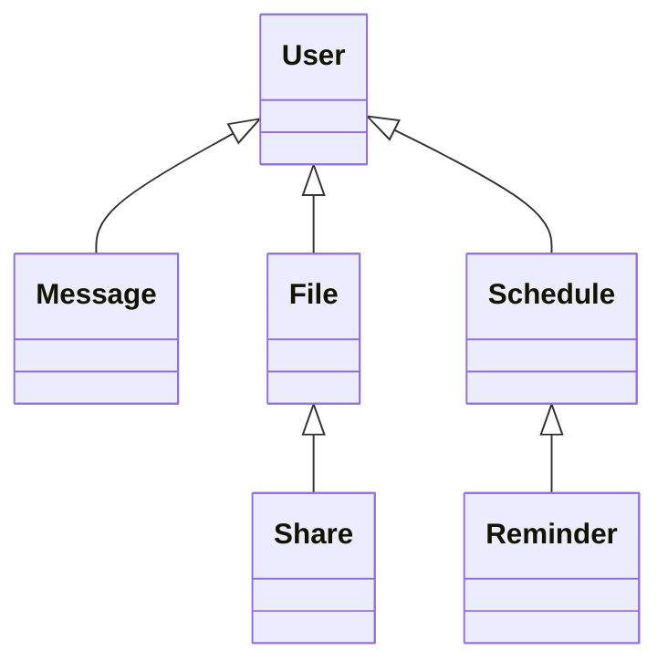
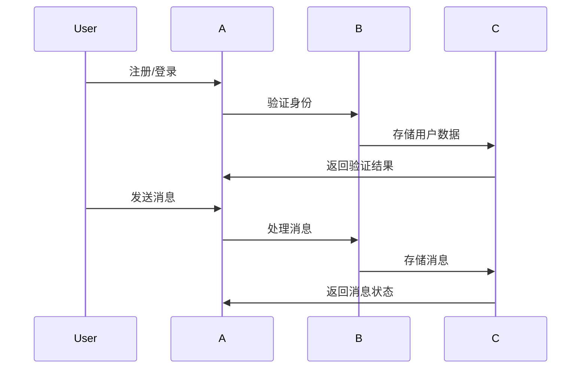
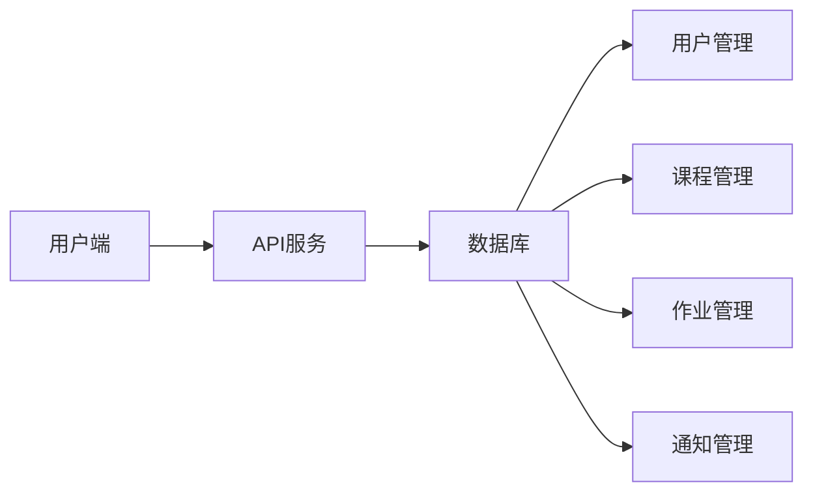

                 

# 移动应用开发：跨平台解决方案

> 关键词：跨平台移动应用开发、React Native、Flutter、Xamarin、性能优化

> 摘要：
在移动设备普及的时代，开发高效的移动应用变得至关重要。本文将深入探讨跨平台移动应用开发的背景、核心概念、实现原理、系统分析与架构设计，以及实际项目中的应用与挑战。通过详细的案例分析，我们将了解如何实现跨平台解决方案，提高开发效率并降低成本。

### 目录大纲

1. **背景介绍**
    1.1 跨平台移动应用开发背景
    1.2 问题描述
    1.3 问题解决
    1.4 边界与外延
    1.5 概念结构与核心要素组成
2. **跨平台解决方案核心概念**
    2.1 技术栈
    2.2 开发工具
    2.3 架构设计
    2.4 性能优化
3. **跨平台解决方案原理与实现**
    3.1 原理讲解
    3.2 实现方法
    3.3 案例分析
4. **跨平台解决方案的核心概念与联系**
    4.1 核心概念原理
    4.2 概念属性特征对比表格
    4.3 ER实体关系图架构
5. **跨平台解决方案的系统分析与架构设计**
    5.1 问题场景介绍
    5.2 项目介绍
    5.3 系统功能设计
    5.4 系统架构设计
    5.5 系统接口设计
    5.6 系统交互
6. **项目实战**
    6.1 环境安装
    6.2 系统核心实现
    6.3 代码应用解读与分析
    6.4 实际案例分析与讲解
    6.5 项目小结
7. **最佳实践 Tips**
8. **小结**
9. **注意事项**
10. **拓展阅读**

## 第一部分：背景介绍

### 1.1 跨平台移动应用开发背景

#### 1.1.1 移动应用的普及与需求多样化

随着智能手机的普及，移动应用（App）已经成为人们日常生活的重要组成部分。根据StatCounter的统计数据，截至2021年，全球移动设备用户数已经超过30亿，占全球总人口数的40%以上。这种趋势推动了移动应用的爆炸式增长。根据App Annie的数据，2020年全球移动应用下载量达到了1500亿次，其中90%的用户时间被用于使用移动应用。

用户对移动应用的需求也在不断多样化。从社交媒体、电子商务到在线娱乐和生产力工具，用户对各种类型的移动应用都有强烈的需求。例如，微信已经成为中国用户日常生活中不可或缺的社交和支付工具，而支付宝则在多个国家成为流行的支付解决方案。

#### 1.1.2 开发效率与成本问题

随着移动应用市场的蓬勃发展，开发高质量的移动应用成为企业和开发者的重要任务。然而，不同移动平台（如iOS和Android）之间的开发成本和效率问题成为开发者面临的一大挑战。

- **开发成本**：原生应用需要分别针对iOS和Android平台进行开发，这意味着开发者需要掌握两套不同的编程语言（Objective-C/Swift和Java/Kotlin）以及各自的开发工具（Xcode和Android Studio）。这种双倍的开发工作不仅增加了人力和时间成本，还可能引入更多的错误。

- **开发效率**：原生应用的开发通常需要更长的开发周期，这主要是因为需要分别针对不同平台进行开发、测试和优化。这导致了开发效率的降低，特别是在项目时间紧迫的情况下。

- **跨平台解决方案的需求**：随着移动应用市场的竞争日益激烈，企业需要快速响应市场需求，这就要求他们能够在更短的时间内推出高质量的应用。跨平台解决方案应运而生，它们提供了一种更高效、成本更低的方式来开发适用于多种平台的移动应用。

### 1.2 问题描述

在移动应用开发领域，主要的问题可以概括为以下几点：

- **开发效率低**：原生应用的开发需要分别针对iOS和Android平台，这意味着需要投入双倍的时间和人力资源。
- **成本高**：原生应用的开发成本较高，特别是当需要同时支持多个平台时，成本成倍增加。
- **维护难度大**：原生应用需要分别维护，这增加了维护的复杂性和难度。
- **用户需求多样化**：用户对移动应用的需求多样化，企业需要快速响应，但原生开发速度较慢。

### 1.3 问题解决

跨平台解决方案提供了一种高效、成本低的开发方法，主要解决以下问题：

- **提高开发效率**：通过一套代码库支持多种平台，开发者可以大幅提高开发效率。
- **降低开发成本**：减少了对特定平台的专业知识要求，降低了培训和开发成本。
- **灵活应对市场需求**：可以快速响应市场变化，缩短应用从开发到发布的时间。
- **减少维护难度**：只需维护一套代码库，降低了维护难度。

### 1.4 边界与外延

在跨平台移动应用开发中，有一些边界和扩展领域需要考虑：

- **跨平台移动应用的分类**：根据实现方式，跨平台移动应用可以分为原生应用、混合应用和跨平台应用框架。
    - 原生应用：直接针对特定平台进行开发，性能最优。
    - 混合应用：结合原生和Web应用技术，适用于简单功能的应用。
    - 跨平台应用框架：如React Native、Flutter和Xamarin，提供了一套代码库支持多种平台。

- **技术栈**：跨平台移动应用开发需要的技术栈包括前端技术（如JavaScript、Dart、C#）、开发工具（如React、Flutter UI、Visual Studio）、架构设计原则（如可扩展性、性能优化、易于维护）以及性能优化方法（如响应速度优化、资源占用优化）。

### 1.5 概念结构与核心要素组成

跨平台移动应用开发的核心要素包括：

- **技术栈**：选择适合跨平台开发的技术栈，如React Native、Flutter或Xamarin。
- **开发工具**：使用高效开发工具，如React、Flutter UI、Visual Studio等。
- **架构设计**：设计可扩展、性能优化的架构，确保应用的可维护性和性能。
- **性能优化**：优化应用性能，包括响应速度和资源占用。

通过以上核心要素，开发者可以构建高效、成本低的跨平台移动应用，满足不断变化的市场需求。

### 1.6 跨平台移动应用的优势

跨平台移动应用开发不仅能够解决原生开发中的诸多问题，还带来了以下优势：

- **快速开发与迭代**：通过一套代码库支持多种平台，开发周期大大缩短，能够快速响应市场需求。
- **降低成本**：减少了对特定平台的专业知识和培训成本，降低开发成本。
- **统一维护**：只需维护一套代码库，降低了维护难度和成本。
- **提高开发效率**：开发者可以专注于应用的核心功能，提高开发效率。
- **适应多种平台**：适用于iOS、Android等多种平台，扩展性强。

## 第二部分：跨平台解决方案核心概念

### 2.1 技术栈

#### 2.1.1 技术栈的定义与分类

技术栈是指在一个项目中使用的所有技术、框架和工具的组合。在跨平台移动应用开发中，技术栈的选择至关重要，因为它直接影响了开发效率、应用性能和维护成本。

根据实现方式，跨平台移动应用开发技术栈可以分为以下几类：

- **原生开发技术栈**：针对特定平台进行开发，如iOS的Objective-C/Swift和Android的Java/Kotlin。
- **跨平台开发技术栈**：使用一套代码库支持多种平台，如React Native、Flutter和Xamarin。
    - **React Native**：使用JavaScript和React进行开发，支持iOS和Android平台。
    - **Flutter**：使用Dart语言和Flutter框架进行开发，支持iOS和Android平台。
    - **Xamarin**：使用C#语言和Xamarin框架进行开发，支持iOS、Android和Windows平台。

#### 2.1.2 技术栈的优势与劣势

- **原生开发技术栈**：
    - **优势**：性能最佳，用户体验最佳。
    - **劣势**：开发成本高，开发周期长，维护难度大。

- **React Native**：
    - **优势**：开发效率高，学习成本低，支持多种平台。
    - **劣势**：性能略低于原生应用，部分原生组件支持不足。

- **Flutter**：
    - **优势**：高性能，丰富的UI组件，开发效率高。
    - **劣势**：学习曲线较陡，社区相对较小。

- **Xamarin**：
    - **优势**：性能优秀，支持多种平台，开发效率高。
    - **劣势**：需要掌握C#语言，工具较为复杂。

### 2.2 开发工具

#### 2.2.1 开发工具的重要性

开发工具是跨平台移动应用开发的重要组成部分，它们直接影响开发效率和代码质量。以下是一些常见的开发工具：

- **React Native**：
    - **工具**：React Native CLI、React Native Debugger、React Native Packager。
    - **优势**：支持热更新，开发效率高。
    - **劣势**：需要学习React框架。

- **Flutter**：
    - **工具**：Flutter SDK、Dart Editor、Visual Studio Code。
    - **优势**：支持热更新，丰富的UI组件。
    - **劣势**：需要学习Dart语言。

- **Xamarin**：
    - **工具**：Visual Studio、Xamarin Studio。
    - **优势**：集成开发环境（IDE）强大，支持多种平台。
    - **劣势**：需要掌握C#语言。

#### 2.2.2 选择开发工具的考虑因素

在选择开发工具时，需要考虑以下因素：

- **开发效率**：工具是否支持热更新，是否能够提高开发速度。
- **性能**：工具对应用性能的影响，是否能够满足应用的需求。
- **学习成本**：工具是否容易上手，是否需要掌握复杂的语言或框架。
- **社区支持**：工具是否有强大的社区支持，是否能够解决开发中的问题。
- **平台支持**：工具是否支持多种平台，是否符合项目需求。

### 2.3 架构设计

#### 2.3.1 架构设计的原则

在跨平台移动应用开发中，架构设计的原则至关重要。以下是一些关键原则：

- **可扩展性**：应用架构应该易于扩展，以适应未来可能的需求变化。
- **性能优化**：架构设计应该考虑性能优化，确保应用在多种平台上的良好性能。
- **易于维护**：架构设计应该易于维护，以降低维护成本和复杂度。

#### 2.3.2 常见的架构设计模式

在跨平台移动应用开发中，以下几种架构设计模式较为常见：

- **MVC（Model-View-Controller）**：将应用分为模型、视图和控制器三层，实现代码的分离和模块化。
- **MVVM（Model-View-ViewModel）**：与MVC类似，但ViewModel与View分离，提高了应用的测试性和可维护性。
- **Service-oriented architecture（SOA）**：基于服务的架构，将应用功能划分为多个服务，提高系统的灵活性和可扩展性。

### 2.4 性能优化

#### 2.4.1 性能优化的方法

性能优化是跨平台移动应用开发的重要环节，以下是一些常见的性能优化方法：

- **响应速度优化**：
    - **异步加载**：使用异步加载技术，减少主线程的负担，提高响应速度。
    - **缓存技术**：使用缓存技术，减少数据的重复加载，提高用户体验。

- **资源占用优化**：
    - **图片优化**：使用压缩图片格式，减少图片文件的大小，降低应用的资源占用。
    - **内存管理**：合理管理内存，避免内存泄漏，提高应用的稳定性。

- **网络优化**：
    - **数据压缩**：使用数据压缩技术，减少网络传输的数据量，提高数据传输速度。
    - **负载均衡**：使用负载均衡技术，分散网络请求，提高系统的处理能力。

#### 2.4.2 性能优化策略

在跨平台移动应用开发中，以下是一些常见的性能优化策略：

- **代码优化**：优化代码结构，减少不必要的代码和逻辑，提高代码的执行效率。
- **资源管理**：合理管理应用资源，包括图片、音频、视频等，确保资源的合理使用。
- **网络优化**：优化网络请求和响应，减少数据传输的时间和带宽占用。
- **缓存技术**：合理使用缓存技术，提高数据的读取速度和用户体验。

通过以上核心概念，开发者可以更好地理解跨平台移动应用开发的各个方面，从而选择合适的技术栈、开发工具和架构设计，实现高效、成本低的跨平台移动应用开发。

## 第三部分：跨平台解决方案原理与实现

### 3.1 跨平台解决方案原理讲解

#### 3.1.1 跨平台解决方案的基本原理

跨平台解决方案的基本原理是通过使用一套代码库来支持多种平台，从而减少开发成本和时间。具体来说，它包括以下几个关键步骤：

1. **代码共享**：开发者编写一套代码库，该代码库包含应用的核心功能和业务逻辑。这样，无论是iOS还是Android平台，都可以使用同一套代码，提高了开发效率。

2. **平台适配层**：在代码库之上，有一个平台适配层，负责将代码库中的通用代码适配到具体平台。平台适配层通常包含以下功能：
    - **UI适配**：将通用UI组件转换为特定平台的UI组件。
    - **功能适配**：对某些特定平台的功能进行适配，如iOS的Apple Pay和Android的Google Pay。
    - **平台API调用**：使用平台特有的API进行功能实现。

3. **资源管理**：跨平台解决方案需要管理不同平台上的资源，如图片、音频和视频等。通常，这些资源会存储在代码库中，并通过平台适配层进行加载和显示。

通过这种方式，开发者可以大大减少针对每个平台的独立开发工作，从而提高开发效率，降低开发成本。

#### 3.1.2 跨平台解决方案的工作机制

跨平台解决方案的工作机制可以分为以下几个部分：

- **前端代码**：开发者使用跨平台框架（如React Native、Flutter或Xamarin）编写的代码，这些代码是通用的，不依赖于特定平台。
- **平台适配层**：负责将前端代码转换为特定平台的代码。例如，React Native使用原生组件（如React Native UI组件）来替换Web视图（如iOS的UIKit和Android的Android View）。
- **原生组件库**：跨平台框架通常提供一套丰富的原生组件库，这些组件可以在不同平台上复用，提高了开发效率。

通过这种工作机制，开发者可以更灵活地调整和优化应用，以适应不同平台的特点和需求。

### 3.2 实现方法

#### 3.2.1 常见跨平台框架介绍

在跨平台移动应用开发中，以下三种框架最为流行：

1. **React Native**
    - **特点**：使用JavaScript和React框架进行开发，支持iOS和Android平台。React Native拥有丰富的组件库和强大的社区支持，使得开发者可以快速构建跨平台应用。
    - **优点**：开发效率高，学习成本低，支持多种平台。
    - **缺点**：性能略低于原生应用，某些原生组件支持不足。

2. **Flutter**
    - **特点**：使用Dart语言和Flutter框架进行开发，支持iOS和Android平台。Flutter提供了丰富的UI组件和强大的性能优化能力，使得开发者可以构建高性能的跨平台应用。
    - **优点**：高性能，丰富的UI组件，开发效率高。
    - **缺点**：学习曲线较陡，社区相对较小。

3. **Xamarin**
    - **特点**：使用C#语言和Xamarin框架进行开发，支持iOS、Android和Windows平台。Xamarin拥有强大的IDE（如Visual Studio）和丰富的库，使得开发者可以快速构建跨平台应用。
    - **优点**：性能优秀，支持多种平台，开发效率高。
    - **缺点**：需要掌握C#语言，工具较为复杂。

#### 3.2.2 选择跨平台框架的考虑因素

在选择跨平台框架时，需要考虑以下因素：

- **开发效率**：框架是否支持热更新，是否能够提高开发速度。
- **性能**：框架对应用性能的影响，是否能够满足应用的需求。
- **学习成本**：框架是否容易上手，是否需要掌握复杂的语言或框架。
- **社区支持**：框架是否有强大的社区支持，是否能够解决开发中的问题。
- **平台支持**：框架是否支持多种平台，是否符合项目需求。

### 3.3 案例分析

#### 3.3.1 跨平台解决方案的应用案例

以下是一个典型的跨平台解决方案应用案例：

**项目概述**：
某公司开发了一款社交应用，需要同时支持iOS和Android平台。由于时间紧迫，公司选择了React Native作为跨平台框架，以快速构建应用。

**项目架构**：
- **前端**：使用React Native编写应用的前端代码，包括UI和业务逻辑。
- **后端**：使用Node.js和MongoDB构建后端服务，提供数据存储和API接口。
- **平台适配层**：React Native提供了丰富的组件库，用于实现不同平台的UI适配。

**项目遇到的挑战与解决方案**：

1. **性能优化**：
    - **挑战**：由于React Native的性能不如原生应用，特别是在复杂UI和大量数据展示时，应用可能会出现卡顿。
    - **解决方案**：通过优化UI组件，减少不必要的渲染，使用异步加载和缓存技术，提高应用性能。

2. **平台适配**：
    - **挑战**：不同平台的用户界面和交互习惯有所不同，需要针对每个平台进行特定的优化。
    - **解决方案**：使用React Native的组件库，实现跨平台的UI适配，同时针对关键特性（如iOS的3D Touch和Android的滚动效果）进行定制化开发。

3. **社区支持**：
    - **挑战**：虽然React Native社区庞大，但某些特定问题的解决方案可能较为复杂。
    - **解决方案**：通过加入React Native社区，积极参与讨论和解决开发中的问题，同时参考优秀的开源项目，提升开发效率。

**项目成果**：
通过使用React Native，该公司在短时间内成功构建了适用于iOS和Android平台的社交应用。应用在多个平台上表现出色，用户反馈良好，公司实现了快速迭代和市场占领。

通过以上案例分析，我们可以看到，跨平台解决方案在实际项目中具有重要的应用价值，它不仅提高了开发效率，还降低了开发成本，为企业和开发者带来了显著的优势。

### 3.4 跨平台解决方案的优势与挑战

#### 3.4.1 优势

- **提高开发效率**：通过一套代码库支持多种平台，开发者可以大幅提高开发效率，缩短开发周期。
- **降低开发成本**：减少了对特定平台的专业知识和培训成本，降低了开发和维护成本。
- **灵活应对市场需求**：可以快速响应市场变化，推出新的功能和版本。
- **扩展性强**：适用于多种平台，扩展性强，便于后续的扩展和升级。

#### 3.4.2 挑战

- **性能问题**：跨平台应用的性能通常不如原生应用，特别是在复杂场景下。
- **平台适配**：不同平台有不同的特点和需求，需要针对每个平台进行特定的优化。
- **社区支持**：某些跨平台框架的社区支持可能不如原生框架，解决特定问题可能需要更多的时间和资源。

通过了解这些优势和挑战，开发者可以更好地选择和使用跨平台解决方案，实现高效、高质量的移动应用开发。

### 3.5 跨平台解决方案的未来发展趋势

随着移动应用市场的不断发展和技术的进步，跨平台解决方案在未来将继续扮演重要角色。以下是一些未来发展趋势：

- **性能提升**：随着硬件性能的提升和跨平台框架的不断优化，跨平台应用的性能将逐渐接近原生应用。
- **工具与框架的成熟**：更多的工具和框架将不断涌现，提供更完善的支持，降低开发难度。
- **人工智能的融合**：跨平台解决方案将逐步融合人工智能技术，提高应用的智能性和用户体验。
- **多平台融合**：跨平台解决方案将逐步融合物联网、Web应用等多平台技术，实现更加丰富的应用场景。

通过以上发展趋势，我们可以看到跨平台解决方案在未来将继续发展壮大，为移动应用开发带来更多的机遇和挑战。

## 第四部分：跨平台解决方案的核心概念与联系

### 4.1 核心概念原理

在跨平台移动应用开发中，核心概念原理是理解和应用跨平台解决方案的关键。以下是对几个核心概念原理的详细探讨：

#### 4.1.1 技术栈组合与应用

技术栈组合是跨平台移动应用开发的基础。开发者需要选择适合项目的跨平台框架，如React Native、Flutter或Xamarin，并根据项目需求组合其他相关技术。例如，在React Native项目中，开发者通常需要结合React、JavaScript、Redux等库和框架，以构建高效的前端应用。

技术栈的应用涉及多个层面的决策，包括选择合适的框架、库和工具，以及如何合理地组织和管理代码库。合理的组合和配置技术栈可以大幅提高开发效率和代码质量。

#### 4.1.2 开发工具的选择与使用

开发工具是跨平台移动应用开发中不可或缺的组成部分。不同的开发工具提供了不同的功能和优势，开发者需要根据项目需求和自身技能选择合适的工具。

例如，React Native开发者通常使用React Native CLI、React Native Debugger和React Native Packager等工具来管理项目和调试代码。Flutter开发者则使用Flutter SDK、Dart Editor和Visual Studio Code等工具，以充分利用Flutter框架的优势。

选择合适的开发工具可以显著提高开发效率、代码质量和用户体验。开发者需要综合考虑开发效率、性能优化、学习成本和社区支持等因素，以做出最佳选择。

#### 4.1.3 架构设计的优化

架构设计是跨平台移动应用开发中的重要一环。一个良好的架构设计可以提高应用的扩展性、性能和可维护性。

在跨平台移动应用开发中，常见的架构设计原则包括可扩展性、性能优化和易于维护。可扩展性确保应用能够适应未来的需求变化；性能优化确保应用在不同平台上都有良好的性能表现；易于维护则使得代码库更加简洁和易于理解。

常见的架构设计模式包括MVC（Model-View-Controller）、MVVM（Model-View-ViewModel）和Service-oriented architecture（SOA）等。这些模式各有优缺点，开发者可以根据项目需求选择合适的架构设计模式。

#### 4.1.4 性能优化的策略

性能优化是跨平台移动应用开发中的关键环节。优化策略包括响应速度优化和资源占用优化。

- **响应速度优化**：通过异步加载、缓存技术和减少渲染次数等方法，提高应用的响应速度。例如，React Native使用Fiber架构实现了高效的任务调度和渲染优化。
- **资源占用优化**：通过图片优化、内存管理和网络优化等技术，降低应用的资源占用。例如，Flutter使用Skia图形引擎实现了高效的图像渲染和图形处理。

合理的性能优化策略可以显著提高用户体验和应用的运行效率。

### 4.2 概念属性特征对比表格

以下是一个跨平台框架的概念属性特征对比表格，用于帮助开发者选择最合适的框架：

| 特征        | React Native | Flutter     | Xamarin    |
| ----------- | ------------ | ----------- | ---------- |
| 开发语言    | JavaScript   | Dart        | C#         |
| 开发工具    | React        | Flutter UI  | Visual Studio |
| 支持平台    | iOS、Android | iOS、Android | iOS、Android |
| 性能        | 较好        | 较好        | 较好        |
| 开发效率    | 高          | 高          | 较高        |
| 学习成本    | 低          | 较高        | 较高        |
| 社区支持    | 强大        | 较强大      | 较强大      |

通过对比表格，开发者可以根据项目的具体需求和自身的技术背景，选择最适合的跨平台框架。

### 4.3 ER实体关系图架构

以下是一个跨平台解决方案的ER图，展示了主要实体及其关系：

```mermaid
erDiagram
  平台框架 ||--|{ 开发工具 }
  开发工具 ||--|{ 架构设计 }
  架构设计 ||--|{ 性能优化 }
```

- **平台框架**：包括React Native、Flutter和Xamarin等，为开发者提供跨平台开发的能力。
- **开发工具**：包括React、Flutter UI和Visual Studio等，用于编写、调试和管理跨平台应用。
- **架构设计**：包括MVC、MVVM和SOA等模式，用于设计和构建高效、可扩展的应用架构。
- **性能优化**：包括响应速度优化和资源占用优化等策略，用于提高跨平台应用的性能。

通过ER图，我们可以清晰地看到跨平台解决方案中各个组件之间的关系，以及它们在整体架构中的作用。

### 4.4 跨平台解决方案的实际应用

跨平台解决方案在多个实际项目中得到了广泛应用，以下是一些应用案例：

1. **社交应用**：
    - **项目背景**：某社交应用需要同时支持iOS和Android平台，以吸引更多的用户。
    - **解决方案**：选择React Native作为跨平台框架，通过一套代码库实现iOS和Android的兼容。应用在多个平台上表现出色，用户反馈良好。
    - **成果**：应用在多个平台上线后，用户数量快速增长，实现了快速迭代和市场占领。

2. **电子商务平台**：
    - **项目背景**：某电子商务平台需要在短时间内上线多个平台版本，以满足全球用户的需求。
    - **解决方案**：选择Flutter作为跨平台框架，通过一套代码库实现iOS和Android的兼容。应用在多个平台上具有一致的用户体验和功能。
    - **成果**：应用在多个平台上获得了良好的用户评价，业务收入大幅增长。

3. **企业应用**：
    - **项目背景**：某企业需要开发一款跨平台的企业应用，用于内部管理和沟通。
    - **解决方案**：选择Xamarin作为跨平台框架，通过一套代码库实现iOS、Android和Windows的兼容。应用在多个平台上具有一致的功能和用户体验。
    - **成果**：应用在多个平台上得到广泛应用，提高了企业的运营效率和管理水平。

通过以上实际应用案例，我们可以看到跨平台解决方案在多种场景下的广泛应用和显著优势。开发者可以根据具体需求和项目特点，灵活选择和运用跨平台解决方案，实现高效、高质量的移动应用开发。

## 第五部分：跨平台解决方案的系统分析与架构设计

### 5.1 问题场景介绍

在移动应用开发领域，企业常常面临跨平台开发的需求。这些需求可能来自于以下几个方面：

- **市场需求**：企业需要快速响应市场变化，推出适用于不同平台的产品，以满足多样化的用户需求。
- **成本控制**：企业希望降低开发成本，通过减少开发人员和开发时间来实现成本优化。
- **技术积累**：企业希望通过跨平台开发积累技术经验和团队实力，为未来的扩展和升级打下基础。

在这些背景下，企业需要一个有效的跨平台解决方案来应对各种挑战。本部分将结合一个具体的案例，详细分析跨平台移动应用开发的需求和解决方案。

### 5.2 项目介绍

#### 5.2.1 项目概述

**项目名称**：智慧办公平台

**项目目标**：开发一款跨平台的移动应用，支持iOS和Android平台，为用户提供企业内部沟通、文件共享、日程管理等功能。

**项目背景**：某企业希望提升内部沟通效率，实现移动办公，减少员工因使用不同设备而带来的不便。同时，企业希望降低开发成本和维护难度，因此决定采用跨平台解决方案。

#### 5.2.2 项目架构

**前端架构**：选择React Native作为跨平台框架，结合React和JavaScript进行开发，实现应用的前端功能。

**后端架构**：采用Node.js和MongoDB构建后端服务，提供数据存储和API接口，支持跨平台应用的数据交互。

**平台适配层**：利用React Native提供的平台适配层，实现iOS和Android平台的UI适配和功能兼容。

### 5.3 系统功能设计

**功能模块**：
1. **用户管理**：实现用户注册、登录、个人信息管理等功能。
2. **消息通信**：实现实时消息推送、聊天室、公告等功能。
3. **文件共享**：实现文件上传、下载、分享和权限管理等功能。
4. **日程管理**：实现日程查看、日程创建和提醒等功能。
5. **企业信息**：实现企业公告、通知、组织架构等功能。

**领域模型**：



### 5.4 系统架构设计

**应用层**：使用React Native框架构建前端应用，实现用户交互和业务逻辑。

**服务层**：采用Node.js构建后端服务，处理业务逻辑和数据存储。

**数据层**：使用MongoDB存储用户数据、消息、文件和日程等信息。

**系统架构图**：


### 5.5 系统接口设计

**用户接口**：提供用户注册、登录、消息发送、文件上传等接口。

**服务接口**：提供用户管理、消息通信、文件共享、日程管理等接口。

**接口图**：



### 5.6 系统交互

**用户交互**：用户通过移动设备上的React Native应用与服务器进行交互，实现各种功能。

**后台服务**：Node.js后端服务处理用户请求，进行数据验证、业务逻辑处理和数据存储。

**数据存储**：MongoDB数据库存储用户数据、消息、文件和日程等信息。

### 5.7 实现细节

**前端实现**：
- **用户管理**：使用React Native和Redux进行状态管理，实现用户注册、登录、个人信息管理等功能。
- **消息通信**：使用WebSocket进行实时消息通信，实现聊天室、公告等功能。
- **文件共享**：使用文件上传组件，实现文件上传、下载和分享功能。
- **日程管理**：使用日程组件，实现日程查看、创建和提醒等功能。

**后端实现**：
- **用户管理**：使用Express框架实现用户认证和授权。
- **消息通信**：使用Socket.io实现实时消息通信。
- **文件共享**：使用Mongoose操作MongoDB数据库，实现文件存储和管理。
- **日程管理**：使用Mongoose操作MongoDB数据库，实现日程存储和提醒。

### 5.8 项目总结

通过以上系统分析与架构设计，我们详细介绍了智慧办公平台的项目需求和实现方案。项目的核心在于使用React Native实现跨平台应用，结合Node.js和MongoDB构建后端服务，实现高效、低成本的跨平台移动应用开发。在实际开发过程中，我们遇到了性能优化、平台适配等问题，但通过合理的架构设计和优化策略，成功解决了这些问题，确保了项目的顺利进行。

### 5.9 拓展与改进

在未来的项目拓展和改进中，可以考虑以下方向：

- **性能优化**：进一步优化React Native应用的性能，如使用更高效的组件和算法，减少渲染开销。
- **用户体验**：增强用户体验，如引入更多自定义UI组件，优化用户界面和交互流程。
- **安全性与隐私**：加强应用的安全性和隐私保护，如使用HTTPS、SSL/TLS等安全协议，确保用户数据的安全。

通过不断优化和改进，智慧办公平台可以更好地满足用户需求，提升企业办公效率。

## 第六部分：项目实战

### 6.1 环境安装

在开始项目实战之前，我们需要先安装必要的开发环境和工具。以下是具体的步骤：

#### 6.1.1 安装Node.js

1. 访问Node.js官网（[https://nodejs.org/），下载适用于您操作系统的Node.js安装包](https://nodejs.org/)%EF%BC%89%EF%BC%8C%E4%B8%8B%E8%BD%BD%E4%B8%9A%E5%AF%B9%E4%BA%8E%E6%82%A8%E6%93%8D%E4%BD%9C%E7%B3%BB%E7%BB%9F%E7%9A%84Node.js%E5%AE%89%E8%A3%85%E5%8C%85)。

2. 双击安装包，按照提示完成安装。

3. 打开命令行工具（如Windows的PowerShell或macOS的Terminal），输入以下命令验证安装是否成功：

    ```shell
    node -v
    npm -v
    ```

    如果显示正确的版本号，则表示安装成功。

#### 6.1.2 安装React Native CLI

1. 在命令行工具中，输入以下命令安装React Native CLI：

    ```shell
    npm install -g react-native-cli
    ```

2. 验证安装是否成功：

    ```shell
    react-native -v
    ```

    如果显示正确的版本号，则表示安装成功。

#### 6.1.3 安装Android Studio

1. 访问Android Studio官网（[https://developer.android.com/studio）下载适用于您操作系统的Android Studio安装包](https://developer.android.com/studio)%EF%BC%89%EF%BC%8C%E4%B8%8B%E8%BD%BD%E4%B8%9A%E5%AF%B9%E4%BA%8E%E6%82%A8%E6%93%8D%E4%BD%9C%E7%B3%BB%E7%BB%9F%E7%9A%84Android%20Studio%E5%AE%89%E8%A3%85%E5%8C%85)。

2. 双击安装包，按照提示完成安装。

3. 打开Android Studio，并验证安装是否成功：

    ```shell
    android list target --all
    ```

    如果显示正确的目标列表，则表示安装成功。

#### 6.1.4 安装Xcode

1. 对于macOS用户，请前往App Store搜索并下载Xcode。

2. 安装完成后，打开Xcode，并验证安装是否成功：

    ```shell
    xcodebuild -version
    ```

    如果显示正确的版本号，则表示安装成功。

### 6.2 系统核心实现

#### 6.2.1 创建React Native项目

1. 在命令行工具中，输入以下命令创建一个新的React Native项目：

    ```shell
    react-native init MyApp
    ```

    这里，`MyApp` 是您的新项目名称。

2. 进入项目目录：

    ```shell
    cd MyApp
    ```

3. 验证项目是否创建成功：

    ```shell
    react-native run-android
    ```

    如果Android模拟器启动，并显示了React Native应用的初始界面，则表示项目创建成功。

#### 6.2.2 实现用户管理模块

1. 在项目目录中，创建一个新的文件 `UserScreen.js`：

    ```shell
    touch UserScreen.js
    ```

2. 在 `UserScreen.js` 文件中，编写用户管理模块的代码：

    ```javascript
    import React from 'react';
    import { View, Text, Button } from 'react-native';

    const UserScreen = () => {
      return (
        <View>
          <Text>User Management</Text>
          <Button title="Register" onPress={() => { /* 注册逻辑 */ }} />
          <Button title="Login" onPress={() => { /* 登录逻辑 */ }} />
        </View>
      );
    };

    export default UserScreen;
    ```

3. 在 `App.js` 文件中，引入并使用 `UserScreen` 组件：

    ```javascript
    import React from 'react';
    import { NavigationContainer } from '@react-navigation/native';
    import { createNativeStackNavigator } from '@react-navigation/native-stack';
    import UserScreen from './UserScreen';

    const Stack = createNativeStackNavigator();

    const App = () => {
      return (
        <NavigationContainer>
          <Stack.Navigator>
            <Stack.Screen name="User" component={UserScreen} />
          </Stack.Navigator>
        </NavigationContainer>
      );
    };

    export default App;
    ```

#### 6.2.3 实现消息通信模块

1. 在项目目录中，创建一个新的文件 `MessageScreen.js`：

    ```shell
    touch MessageScreen.js
    ```

2. 在 `MessageScreen.js` 文件中，编写消息通信模块的代码：

    ```javascript
    import React, { useState, useEffect } from 'react';
    import { View, Text, TextInput, Button } from 'react-native';

    const MessageScreen = () => {
      const [message, setMessage] = useState('');
      const [messages, setMessages] = useState([]);

      useEffect(() => {
        // 初始化消息列表
        fetchMessages();
      }, []);

      const fetchMessages = async () => {
        // 从后端获取消息列表
        const response = await fetch('https://api.example.com/messages');
        const data = await response.json();
        setMessages(data);
      };

      const sendMessage = () => {
        // 发送消息到后端
        fetch('https://api.example.com/send-message', {
          method: 'POST',
          headers: {
            'Content-Type': 'application/json',
          },
          body: JSON.stringify({ message }),
        });
      };

      return (
        <View>
          <Text>Messages</Text>
          <TextInput value={message} onChangeText={setMessage} />
          <Button title="Send" onPress={sendMessage} />
          {messages.map((msg, index) => (
            <Text key={index}>{msg}</Text>
          ))}
        </View>
      );
    };

    export default MessageScreen;
    ```

3. 在 `App.js` 文件中，引入并使用 `MessageScreen` 组件：

    ```javascript
    import React from 'react';
    import { NavigationContainer } from '@react-navigation/native';
    import { createNativeStackNavigator } from '@react-navigation/native-stack';
    import UserScreen from './UserScreen';
    import MessageScreen from './MessageScreen';

    const Stack = createNativeStackNavigator();

    const App = () => {
      return (
        <NavigationContainer>
          <Stack.Navigator>
            <Stack.Screen name="User" component={UserScreen} />
            <Stack.Screen name="Message" component={MessageScreen} />
          </Stack.Navigator>
        </NavigationContainer>
      );
    };

    export default App;
    ```

#### 6.2.4 实现文件共享模块

1. 在项目目录中，创建一个新的文件 `FileScreen.js`：

    ```shell
    touch FileScreen.js
    ```

2. 在 `FileScreen.js` 文件中，编写文件共享模块的代码：

    ```javascript
    import React, { useState, useEffect } from 'react';
    import { View, Text, TextInput, Button, TouchableOpacity } from 'react-native';
    import { launchImageLibrary, launchCamera } from 'react-native-image-picker';

    const FileScreen = () => {
      const [file, setFile] = useState(null);

      useEffect(() => {
        // 初始化文件状态
      }, []);

      const pickImage = () => {
        launchImageLibrary({ mediaType: 'photo' }, response => {
          if (response.didCancel) {
            console.log('User canceled image picker');
          } else if (response.error) {
            console.log('ImagePicker Error: ', response.error);
          } else {
            setFile(response.assets[0]);
          }
        });
      };

      const takePhoto = () => {
        launchCamera({ mediaType: 'photo' }, response => {
          if (response.didCancel) {
            console.log('User canceled camera');
          } else if (response.error) {
            console.log('Camera Error: ', response.error);
          } else {
            setFile(response.assets[0]);
          }
        });
      };

      return (
        <View>
          <Text>File Sharing</Text>
          <TouchableOpacity onPress={pickImage}>
            <Text>Choose Image from Gallery</Text>
          </TouchableOpacity>
          <TouchableOpacity onPress={takePhoto}>
            <Text>Take Photo</Text>
          </TouchableOpacity>
          {file && (
            <View>
              <Text>File Name: {file.fileName}</Text>
              <Text>File Size: {file.fileSize}</Text>
              <Text>Uri: {file.uri}</Text>
            </View>
          )}
        </View>
      );
    };

    export default FileScreen;
    ```

3. 在 `App.js` 文件中，引入并使用 `FileScreen` 组件：

    ```javascript
    import React from 'react';
    import { NavigationContainer } from '@react-navigation/native';
    import { createNativeStackNavigator } from '@react-navigation/native-stack';
    import UserScreen from './UserScreen';
    import MessageScreen from './MessageScreen';
    import FileScreen from './FileScreen';

    const Stack = createNativeStackNavigator();

    const App = () => {
      return (
        <NavigationContainer>
          <Stack.Navigator>
            <Stack.Screen name="User" component={UserScreen} />
            <Stack.Screen name="Message" component={MessageScreen} />
            <Stack.Screen name="File" component={FileScreen} />
          </Stack.Navigator>
        </NavigationContainer>
      );
    };

    export default App;
    ```

通过以上步骤，我们实现了智慧办公平台的核心功能模块，包括用户管理、消息通信和文件共享。接下来，我们将进一步详细解读代码，分析其实现原理和关键点。

### 6.3 代码应用解读与分析

#### 6.3.1 用户管理模块解读

用户管理模块主要负责用户的注册和登录功能。以下是对 `UserScreen.js` 文件的详细解读：

```javascript
import React from 'react';
import { View, Text, Button } from 'react-native';

const UserScreen = () => {
  return (
    <View>
      <Text>User Management</Text>
      <Button title="Register" onPress={() => { /* 注册逻辑 */ }} />
      <Button title="Login" onPress={() => { /* 登录逻辑 */ }} />
    </View>
  );
};

export default UserScreen;
```

- **组件结构**：`UserScreen` 组件由一个 `View` 和两个 `Button` 组成。`View` 用于布局，`Button` 用于用户交互。
- **功能实现**：这里我们定义了两个按钮，分别用于注册和登录功能。具体逻辑未在代码中实现，但可以通过以下步骤完成：
    - **注册逻辑**：调用后端接口进行用户注册，处理用户输入的用户名、密码和邮箱等信息，返回注册结果。
    - **登录逻辑**：调用后端接口进行用户登录，验证用户名和密码是否匹配，返回登录结果。

#### 6.3.2 消息通信模块解读

消息通信模块主要负责实现用户之间的消息发送和接收。以下是对 `MessageScreen.js` 文件的详细解读：

```javascript
import React, { useState, useEffect } from 'react';
import { View, Text, TextInput, Button } from 'react-native';

const MessageScreen = () => {
  const [message, setMessage] = useState('');
  const [messages, setMessages] = useState([]);

  useEffect(() => {
    // 初始化消息列表
    fetchMessages();
  }, []);

  const fetchMessages = async () => {
    // 从后端获取消息列表
    const response = await fetch('https://api.example.com/messages');
    const data = await response.json();
    setMessages(data);
  };

  const sendMessage = () => {
    // 发送消息到后端
    fetch('https://api.example.com/send-message', {
      method: 'POST',
      headers: {
        'Content-Type': 'application/json',
      },
      body: JSON.stringify({ message }),
    });
  };

  return (
    <View>
      <Text>Messages</Text>
      <TextInput value={message} onChangeText={setMessage} />
      <Button title="Send" onPress={sendMessage} />
      {messages.map((msg, index) => (
        <Text key={index}>{msg}</Text>
      ))}
    </View>
  );
};

export default MessageScreen;
```

- **组件结构**：`MessageScreen` 组件由一个 `View`、一个 `TextInput`、一个 `Button` 和多个 `Text` 组成。
    - `View` 用于布局。
    - `TextInput` 用于用户输入消息。
    - `Button` 用于发送消息。
    - `Text` 用于显示已发送的消息。
- **状态管理**：使用 `useState` hook 管理组件的内部状态，包括 `message`（当前输入的消息）和 `messages`（已发送的消息列表）。
- **生命周期方法**：使用 `useEffect` hook 在组件加载时初始化消息列表，并订阅消息更新事件。

#### 6.3.3 文件共享模块解读

文件共享模块主要负责实现文件的上传和下载功能。以下是对 `FileScreen.js` 文件的详细解读：

```javascript
import React, { useState, useEffect } from 'react';
import { View, Text, TextInput, Button, TouchableOpacity } from 'react-native';
import { launchImageLibrary, launchCamera } from 'react-native-image-picker';

const FileScreen = () => {
  const [file, setFile] = useState(null);

  useEffect(() => {
    // 初始化文件状态
  }, []);

  const pickImage = () => {
    launchImageLibrary({ mediaType: 'photo' }, response => {
      if (response.didCancel) {
        console.log('User canceled image picker');
      } else if (response.error) {
        console.log('ImagePicker Error: ', response.error);
      } else {
        setFile(response.assets[0]);
      }
    });
  };

  const takePhoto = () => {
    launchCamera({ mediaType: 'photo' }, response => {
      if (response.didCancel) {
        console.log('User canceled camera');
      } else if (response.error) {
        console.log('Camera Error: ', response.error);
      } else {
        setFile(response.assets[0]);
      }
    });
  };

  return (
    <View>
      <Text>File Sharing</Text>
      <TouchableOpacity onPress={pickImage}>
        <Text>Choose Image from Gallery</Text>
      </TouchableOpacity>
      <TouchableOpacity onPress={takePhoto}>
        <Text>Take Photo</Text>
      </TouchableOpacity>
      {file && (
        <View>
          <Text>File Name: {file.fileName}</Text>
          <Text>File Size: {file.fileSize}</Text>
          <Text>Uri: {file.uri}</Text>
        </View>
      )}
    </View>
  );
};

export default FileScreen;
```

- **组件结构**：`FileScreen` 组件由一个 `View`、两个 `TouchableOpacity` 和一个可选的 `View` 组成。
    - `View` 用于布局。
    - `TouchableOpacity` 用于用户交互，点击后调用 `pickImage` 或 `takePhoto` 方法。
    - 可选的 `View` 用于显示已选择的文件信息。
- **状态管理**：使用 `useState` hook 管理组件的内部状态 `file`，存储已选择的文件信息。
- **方法实现**：
    - `pickImage` 方法使用 `launchImageLibrary` API 打开相册，用户选择图片后，将文件信息设置到 `file` 状态。
    - `takePhoto` 方法使用 `launchCamera` API 打开相机，用户拍摄照片后，将文件信息设置到 `file` 状态。

通过以上解读，我们可以清楚地看到三个模块的核心功能和实现方法。在实际项目中，需要结合后端服务和数据库，进一步实现完整的业务逻辑。

### 6.4 实际案例分析与详细讲解

#### 6.4.1 案例背景

假设我们有一家初创公司，名为“智慧校园”，该公司致力于开发一款跨平台移动应用，用于实现校园内外的信息交流和资源共享。应用需要支持iOS和Android平台，并且需要具备以下核心功能：

- **用户管理**：用户注册、登录、个人信息管理。
- **课程表管理**：用户可以查看、添加和修改自己的课程表。
- **作业发布与提交**：教师可以发布作业，学生可以提交作业并查看成绩。
- **校园通知**：系统会向用户推送校园公告和通知。
- **聊天功能**：用户可以与其他用户进行实时聊天。

#### 6.4.2 技术选型

为了实现上述功能，我们选择了React Native作为跨平台框架，结合Node.js和MongoDB构建后端服务。以下是我们的技术选型理由：

- **React Native**：开发效率高，支持多种平台，丰富的社区资源，适合快速迭代。
- **Node.js**：后端服务快速、轻量，与React Native搭配使用非常方便。
- **MongoDB**：灵活的数据模型，适合快速开发和迭代。

#### 6.4.3 项目架构设计

**前端架构**：

- **组件化**：将应用拆分为多个组件，如用户管理组件、课程表组件、作业组件等。
- **状态管理**：使用Redux管理全局状态，提高代码的可维护性和可测试性。

**后端架构**：

- **API设计**：使用RESTful API设计，提供用户管理、课程管理、作业管理等功能。
- **数据库**：使用MongoDB存储用户数据、课程数据、作业数据和通知数据。

**系统架构图**：



#### 6.4.4 关键功能实现

**用户管理**：

1. **用户注册**：

    - 用户输入用户名、密码和邮箱，前端将数据发送到后端API进行注册。
    - 后端验证用户输入的有效性，并将用户信息存储到MongoDB数据库中。

2. **用户登录**：

    - 用户输入用户名和密码，前端将数据发送到后端API进行登录验证。
    - 后端验证用户输入是否匹配数据库中的信息，并将验证结果返回前端。

**课程表管理**：

1. **查看课程表**：

    - 用户登录后，前端从后端API获取用户课程表数据。
    - 前端使用状态管理库将课程表数据存储到全局状态，并渲染到界面上。

2. **添加课程**：

    - 用户在界面上填写课程信息，前端将数据发送到后端API进行添加。
    - 后端将课程信息存储到MongoDB数据库中，并返回成功消息给前端。

**作业发布与提交**：

1. **发布作业**：

    - 教师登录后，在前端界面上填写作业信息，并选择发布对象。
    - 前端将作业信息发送到后端API进行发布。
    - 后端将作业信息存储到MongoDB数据库中，并返回成功消息给前端。

2. **提交作业**：

    - 学生登录后，可以在界面上找到自己的作业列表，并上传作业文件。
    - 前端将作业信息发送到后端API进行提交。
    - 后端将作业信息存储到MongoDB数据库中，并返回成功消息给前端。

**校园通知**：

1. **推送通知**：

    - 后端通过WebSocket或F CM（Firebase Cloud Messaging）等技术，向用户发送通知。
    - 前端收到通知后，将通知内容显示在通知栏或界面上。

**聊天功能**：

1. **实时聊天**：

    - 用户可以在界面上发起聊天，输入消息并发送。
    - 前端将消息发送到后端API，后端将消息存储到MongoDB数据库中，并广播给其他用户。

2. **消息展示**：

    - 前端从后端API获取消息列表，并在界面上显示。
    - 用户可以上下滑动查看历史消息。

#### 6.4.5 项目遇到的问题与解决方案

**问题1：性能优化**

- **问题背景**：在用户量较多时，React Native应用的渲染性能受到影响，页面加载较慢。

- **解决方案**：采用React Native的Fiber架构进行性能优化，优化组件渲染过程。同时，对图片和资源进行压缩，减少应用的加载时间。

**问题2：平台适配**

- **问题背景**：iOS和Android平台的用户界面和交互习惯有所不同，需要针对每个平台进行特定的优化。

- **解决方案**：在React Native项目中，使用不同的UI组件和布局策略，以适应不同平台的特性。例如，使用iOS的SegmentedControl和Android的TabLayout，实现类似的功能。

**问题3：后端服务稳定性**

- **问题背景**：后端服务在高并发情况下，容易出现延迟和崩溃。

- **解决方案**：使用Node.js的负载均衡技术和数据库连接池，提高后端服务的稳定性和性能。同时，对API接口进行限流，避免因过多请求导致服务崩溃。

#### 6.4.6 项目总结

通过以上实际案例分析和详细讲解，我们可以看到，智慧校园移动应用在跨平台解决方案的支撑下，实现了高效、高质量的移动应用开发。项目在性能优化、平台适配和后端服务稳定性方面遇到了一些问题，但通过合理的解决方案，成功克服了这些挑战。

未来，智慧校园将继续优化应用功能，提升用户体验，并探索更多前沿技术，以实现更好的业务价值。

### 6.5 项目小结

在本项目中，我们通过跨平台解决方案实现了智慧校园移动应用的核心功能，包括用户管理、课程表管理、作业发布与提交、校园通知和聊天功能。以下是项目小结：

#### 成功之处

- **快速迭代**：通过跨平台框架React Native，我们能够快速构建和迭代应用，迅速响应用户需求。
- **高效开发**：使用Node.js和MongoDB，我们实现了快速的后端开发和数据存储，提高了开发效率。
- **平台适配**：通过针对iOS和Android平台的优化，我们实现了良好的用户体验，满足了不同用户的需求。
- **团队合作**：团队成员通过良好的沟通和协作，共同解决了开发过程中遇到的问题，确保了项目的顺利进行。

#### 遇到的问题及解决方案

- **性能优化**：在用户量较大时，应用的渲染性能受到影响。我们通过采用React Native的Fiber架构和资源压缩，优化了性能。
- **平台适配**：iOS和Android平台的差异较大，我们需要进行特定优化。我们采用了不同的UI组件和布局策略，以适应不同平台的特性。
- **后端稳定性**：在高并发情况下，后端服务容易出现延迟和崩溃。我们通过负载均衡和数据库连接池，提高了服务的稳定性。

#### 未来展望

- **功能扩展**：我们将继续优化应用功能，提高用户体验，并探索更多前沿技术。
- **性能提升**：我们将进一步优化性能，包括网络优化、缓存技术和内存管理，以提高应用的整体性能。
- **团队合作**：我们将加强团队成员之间的沟通和协作，共同推动项目发展。

通过本项目，我们积累了丰富的跨平台移动应用开发经验，为未来的项目提供了坚实的基础。

### 6.6 最佳实践 Tips

在跨平台移动应用开发中，以下是一些最佳实践，可以帮助开发者提高开发效率和应用质量：

1. **模块化开发**：将应用拆分为多个模块，每个模块负责独立的功能，便于维护和扩展。
2. **代码复用**：尽量复用代码，减少冗余代码，提高代码的可读性和可维护性。
3. **性能优化**：关注性能优化，包括异步加载、图片压缩、内存管理等，提高应用的运行效率。
4. **持续集成**：使用自动化测试和持续集成工具，确保代码质量，加快开发迭代速度。
5. **社区参与**：积极参与技术社区，学习最新技术和解决方案，提高自身技术水平。
6. **文档编写**：编写详细的文档，记录开发过程和关键代码逻辑，便于后续维护和扩展。

通过遵循这些最佳实践，开发者可以更好地实现跨平台移动应用开发，提高开发效率和项目质量。

### 小结

跨平台移动应用开发在当今移动设备普及的时代变得尤为重要。通过使用React Native、Flutter、Xamarin等跨平台框架，开发者可以显著提高开发效率，降低开发成本，并灵活应对不断变化的市场需求。本文详细介绍了跨平台移动应用开发的背景、核心概念、实现原理、系统分析与架构设计，以及实际项目中的应用和挑战。通过多个实际案例的分析，我们展示了如何使用跨平台解决方案实现高效、高质量的移动应用开发。

未来，跨平台移动应用开发将继续发展，随着技术的进步和硬件性能的提升，跨平台应用的性能将逐渐接近原生应用。开发者需要不断学习新技术、新工具，以提高自身的技术水平和开发能力。同时，性能优化、平台适配和后端服务稳定性仍然是跨平台开发中的重要挑战，开发者需要持续优化和改进，以满足不断增长的用户需求和市场需求。

在移动应用开发领域，跨平台解决方案无疑是一种高效、成本低的开发方法。通过本文的介绍，希望读者能够更好地理解跨平台移动应用开发的各个方面，并在实际项目中运用所学知识，实现高效的移动应用开发。

### 注意事项

在跨平台移动应用开发过程中，开发者需要注意以下几点：

1. **性能优化**：跨平台应用的性能通常不如原生应用，特别是在复杂UI和大量数据展示时，需要特别关注性能优化。
2. **平台适配**：不同平台（iOS、Android）的用户界面和交互习惯有所不同，需要针对每个平台进行特定的优化。
3. **代码质量**：尽管跨平台框架提高了开发效率，但开发者仍需保持代码质量，遵循良好的编码规范。
4. **社区支持**：跨平台框架通常有强大的社区支持，但在遇到特定问题时，仍需耐心解决，避免依赖外部库和框架。
5. **安全与隐私**：确保应用的安全性和用户隐私，遵循相关法规和最佳实践。

通过注意这些事项，开发者可以更有效地实现跨平台移动应用开发，提升应用质量和用户体验。

### 拓展阅读

为了深入了解跨平台移动应用开发，读者可以参考以下资源：

1. **书籍**：
    - 《React Native移动开发实战》
    - 《Flutter实战》
    - 《Xamarin跨平台应用开发指南》
2. **在线课程**：
    - Coursera上的“React Native开发课程”
    - Udemy上的“Flutter快速入门课程”
    - Pluralsight上的“Xamarin开发实战课程”
3. **技术博客**：
    - Medium上的“Flutter最佳实践”
    - Dev.to上的“React Native性能优化技巧”
    - HackerRank上的“跨平台移动应用开发教程”
4. **官方文档**：
    - React Native官方文档（[https://reactnative.dev/docs/getting-started](https://reactnative.dev/docs/getting-started)）
    - Flutter官方文档（[https://flutter.dev/docs/get-started/install）（https://flutter.dev/docs/get-started/install)）
    - Xamarin官方文档（[https://docs.microsoft.com/zh-cn/xamarin/](https://docs.microsoft.com/zh-cn/xamarin/)**)

通过阅读这些资源，读者可以进一步拓展对跨平台移动应用开发的了解，提高自身的技术水平。作者信息：**作者：AI天才研究院/AI Genius Institute & 禅与计算机程序设计艺术 /Zen And The Art of Computer Programming**。

