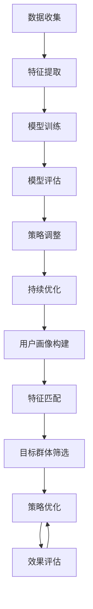
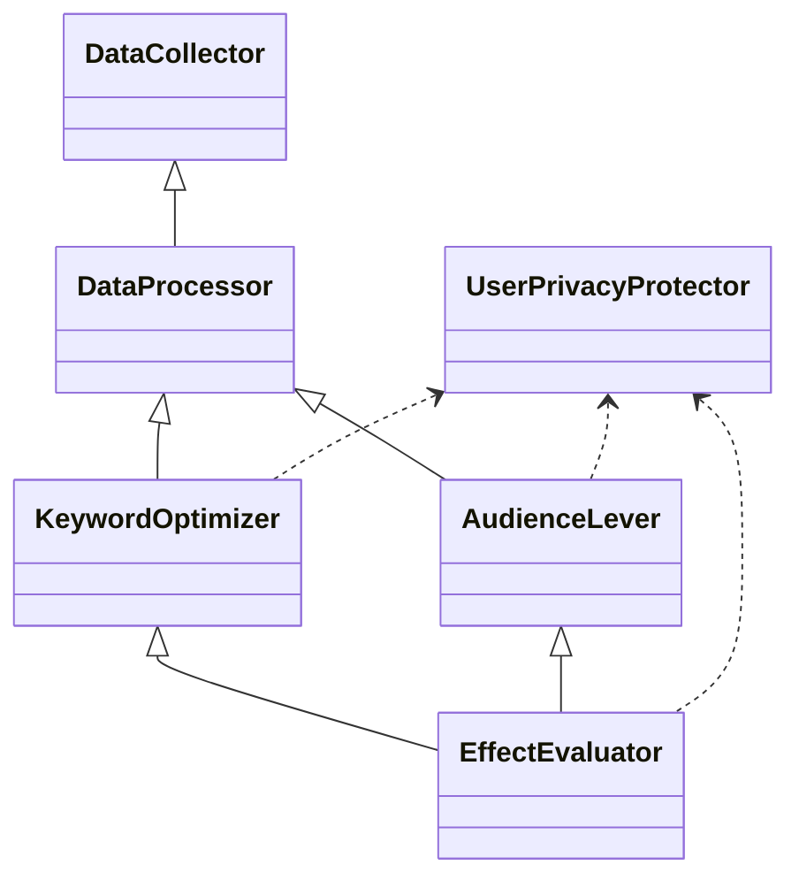
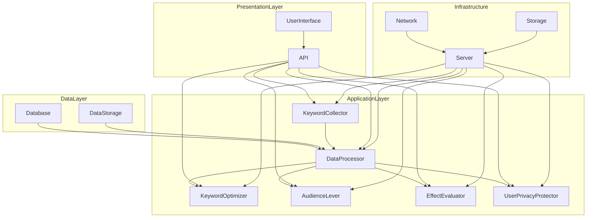
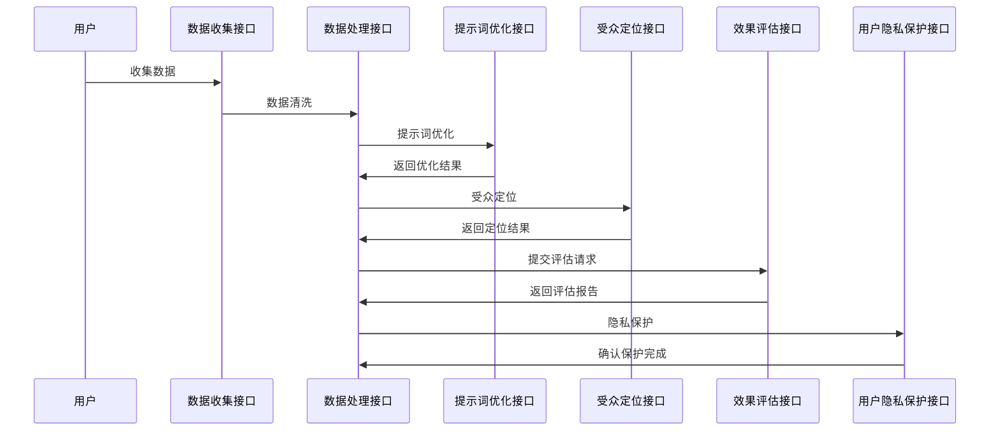
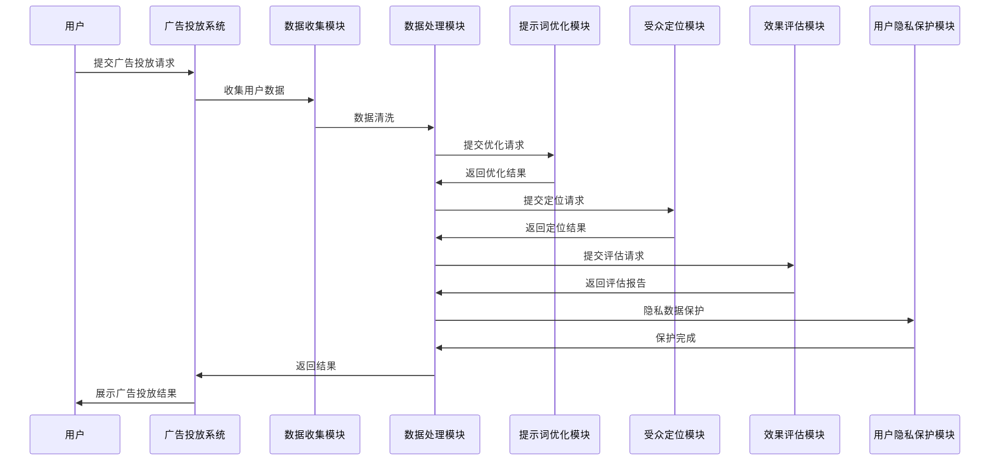

                 


### 精准广告投放：提示词优化受众定位策略

> 关键词：广告投放、提示词优化、受众定位、算法原理、系统架构设计、实战案例

> 摘要：本文深入探讨了精准广告投放的关键——提示词优化与受众定位策略。通过详细的背景介绍、核心概念解析、算法原理讲解、系统架构设计及实战案例剖析，帮助读者理解如何通过优化提示词和精准定位受众，实现广告投放的高效与精准。

---

## 第一部分：广告投放背景与挑战

### 1.1.1 广告投放概述

广告投放作为市场营销的重要组成部分，其发展经历了从传统媒体到数字媒体的重大变革。随着互联网技术的迅猛发展，广告投放的形式和手段变得多样化，广告主面临着更为复杂的决策环境。广告投放不仅关乎广告效果的优劣，更关系到企业的营销策略和品牌形象。在数字时代，精准广告投放成为广告主的追求，而提示词优化和受众定位策略则成为实现精准投放的核心手段。

### 1.1.2 广告投放的现状与挑战

当前，广告投放市场呈现出几个显著趋势：

1. **数据驱动**：广告主越来越依赖大数据分析来指导广告投放策略，通过用户行为数据、购买记录等多维度数据来优化广告效果。
2. **个性化**：广告投放越来越注重个性化，根据用户兴趣、行为特征等定制化推送广告内容，提升用户体验和广告点击率。
3. **算法应用**：机器学习和人工智能技术的应用使得广告投放更加智能化，通过算法优化实现广告的精准投放。

然而，广告投放也面临诸多挑战：

1. **信息过载**：用户每天接触到的广告信息量巨大，如何从众多广告中脱颖而出，成为广告主亟待解决的问题。
2. **效果评估**：广告投放的效果评估难度增加，如何准确衡量广告的投资回报率（ROI）成为广告主关注的重点。
3. **法律法规**：广告投放需要遵守相关法律法规，特别是关于用户隐私和数据保护的规定。

### 1.1.3 精准广告投放的重要性

精准广告投放的重要性体现在以下几个方面：

1. **提升广告效果**：通过精准定位受众，提高广告的点击率和转化率，实现广告资源的最大化利用。
2. **降低成本**：精准广告投放能够有效降低广告成本，避免无效广告投放带来的资源浪费。
3. **增强用户满意度**：个性化广告内容能够提升用户体验，增加用户对品牌的认可度和忠诚度。
4. **优化营销策略**：精准广告投放为广告主提供了宝贵的用户行为数据，有助于优化营销策略和提升整体营销效果。

### 1.2 提示词优化原理

#### 1.2.1 提示词的概念与作用

提示词（Keyword）是广告投放中的重要元素，它是指用户在搜索引擎中输入的关键词或短语，用于触发相关广告展示。提示词的选取直接影响广告的曝光率和受众定位的准确性。

#### 1.2.2 提示词优化的方法与策略

提示词优化包括以下几个方面：

1. **关键词拓展**：通过搜索引擎建议、相关关键词分析等方式，扩展提示词库，增加广告的覆盖面。
2. **关键词匹配**：根据广告目标和受众特征，选择合适的关键词匹配模式，如广泛匹配、精确匹配等。
3. **关键词质量得分**：优化关键词的质量得分，提高广告排名和点击率。
4. **关键词监控**：实时监控关键词的表现，及时调整和优化策略。

#### 1.2.3 提示词优化的实际应用

在实际应用中，提示词优化策略可以通过以下方式进行：

1. **用户行为分析**：分析用户搜索行为和点击行为，优化提示词库，提高广告的匹配度。
2. **竞争分析**：研究竞争对手的提示词策略，借鉴成功经验，优化自身策略。
3. **A/B测试**：通过A/B测试，比较不同提示词的效果，找出最佳策略。

### 1.3 受众定位策略

#### 1.3.1 受众定位的概念与分类

受众定位是指根据广告目标和用户特征，确定广告的目标受众群体。受众定位的分类主要包括以下几种：

1. **人口统计学定位**：根据用户的年龄、性别、收入等人口统计学特征进行定位。
2. **行为定位**：根据用户的在线行为、搜索历史、购买记录等进行定位。
3. **兴趣定位**：根据用户的兴趣标签、喜好等进行定位。
4. **地理位置定位**：根据用户的地理位置进行定位。

#### 1.3.2 受众定位的方法与技巧

受众定位策略的具体方法包括：

1. **用户画像**：通过数据分析，构建用户画像，实现精准定位。
2. **定向广告**：根据用户特征，设置定向广告，提高广告的精准度。
3. **多渠道整合**：结合多种广告渠道，实现全面覆盖，提高广告效果。

#### 1.3.3 受众定位的案例分析

通过以下案例，我们可以看到受众定位策略在实际应用中的效果：

1. **电商广告**：根据用户的购买行为和兴趣标签，推送相关商品广告，提高转化率。
2. **社交媒体广告**：根据用户的社交行为和兴趣，推送个性化广告，提升用户参与度。

### 1.4 提示词优化与受众定位的关系

#### 1.4.1 提示词优化与受众定位的相互作用

提示词优化与受众定位是相辅相成的，两者之间的关系主要体现在以下几个方面：

1. **相互依赖**：提示词优化需要基于受众定位来确定关键词，而受众定位也需要通过提示词优化来实现精准覆盖。
2. **协同效应**：通过优化提示词，提高广告的曝光率和点击率，同时通过受众定位，提高广告的转化率和用户满意度。

#### 1.4.2 提示词优化与受众定位的协同效应

提示词优化与受众定位的协同效应体现在：

1. **效果提升**：通过优化提示词，提高广告的精准度，同时通过受众定位，提高广告的投放效果。
2. **成本节约**：通过精准定位，避免无效广告投放，降低广告成本。

#### 1.4.3 提示词优化与受众定位的实际应用

在实际应用中，提示词优化与受众定位可以结合使用，例如：

1. **交叉验证**：通过用户画像和搜索历史，交叉验证提示词的有效性，优化广告策略。
2. **动态调整**：根据用户反馈和广告效果，动态调整提示词和受众定位策略，实现广告投放的持续优化。

### 1.5 本章小结

本部分从广告投放的背景、提示词优化的原理、受众定位策略及其关系等方面进行了详细探讨。通过了解这些概念和策略，广告主可以更好地实现精准广告投放，提升广告效果和用户满意度。

---

接下来的章节将继续深入探讨广告投放的算法原理、系统架构设计以及实战案例，帮助读者全面掌握精准广告投放的技巧和方法。请持续关注后续内容。


----------------------------------------------------------------

## 第二部分：核心概念与联系

### 2.1 提示词优化原理

#### 2.1.1 提示词的概念与作用

提示词（Keyword）是广告投放中用于触发广告展示的关键词或短语。它在广告投放系统中起到连接广告主和潜在用户的关键作用。一个有效的提示词能够提高广告的曝光率和点击率，从而提升广告效果。

#### 2.1.2 提示词优化的方法与策略

提示词优化主要包括以下几种方法：

1. **关键词拓展**：通过搜索引擎建议、用户搜索历史和竞争对手分析等方式，拓展关键词库，增加广告覆盖面。
2. **关键词匹配**：根据广告目标和受众特征，选择合适的关键词匹配模式，如广泛匹配、精确匹配等，提高广告的精准度。
3. **关键词质量得分**：优化关键词的质量得分，提高广告排名和点击率，从而提升广告效果。
4. **关键词监控**：实时监控关键词的表现，及时发现和解决问题，优化广告策略。

#### 2.1.3 提示词优化的实际应用

在实际应用中，提示词优化策略可以通过以下方式进行：

1. **用户行为分析**：通过分析用户搜索行为和点击行为，优化提示词库，提高广告的匹配度。
2. **竞争分析**：研究竞争对手的提示词策略，借鉴成功经验，优化自身策略。
3. **A/B测试**：通过A/B测试，比较不同提示词的效果，找出最佳策略。

### 2.2 受众定位策略

#### 2.2.1 受众定位的概念与分类

受众定位是指根据广告目标和用户特征，确定广告的目标受众群体。受众定位的分类主要包括以下几种：

1. **人口统计学定位**：根据用户的年龄、性别、收入、教育背景等人口统计学特征进行定位。
2. **行为定位**：根据用户的在线行为、搜索历史、购买记录等行为特征进行定位。
3. **兴趣定位**：根据用户的兴趣标签、喜好、关注点等进行定位。
4. **地理位置定位**：根据用户的地理位置进行定位。

#### 2.2.2 受众定位的方法与技巧

受众定位策略的具体方法包括：

1. **用户画像**：通过数据分析，构建用户画像，实现精准定位。
2. **定向广告**：根据用户特征，设置定向广告，提高广告的精准度。
3. **多渠道整合**：结合多种广告渠道，实现全面覆盖，提高广告效果。

#### 2.2.3 受众定位的案例分析

在实际应用中，受众定位策略可以通过以下案例进行说明：

1. **电商广告**：根据用户的购买行为和兴趣标签，推送相关商品广告，提高转化率。
2. **社交媒体广告**：根据用户的社交行为和兴趣，推送个性化广告，提升用户参与度。

### 2.3 提示词优化与受众定位的关系

#### 2.3.1 提示词优化与受众定位的相互作用

提示词优化与受众定位是相辅相成的，两者之间的关系如下：

1. **相互依赖**：提示词优化需要基于受众定位来确定关键词，而受众定位也需要通过提示词优化来实现精准覆盖。
2. **协同效应**：通过优化提示词，提高广告的曝光率和点击率，同时通过受众定位，提高广告的转化率和用户满意度。

#### 2.3.2 提示词优化与受众定位的协同效应

提示词优化与受众定位的协同效应体现在：

1. **效果提升**：通过优化提示词，提高广告的精准度，同时通过受众定位，提高广告的投放效果。
2. **成本节约**：通过精准定位，避免无效广告投放，降低广告成本。

#### 2.3.3 提示词优化与受众定位的实际应用

在实际应用中，提示词优化与受众定位可以结合使用，例如：

1. **交叉验证**：通过用户画像和搜索历史，交叉验证提示词的有效性，优化广告策略。
2. **动态调整**：根据用户反馈和广告效果，动态调整提示词和受众定位策略，实现广告投放的持续优化。

### 2.4 对比表格：不同受众定位策略的优缺点

| 策略类型       | 优点                                   | 缺点                                     |
| -------------- | -------------------------------------- | ---------------------------------------- |
| 人口统计学定位 | 精准度高，易于量化                     | 数据有限，可能忽略用户行为和兴趣          |
| 行为定位       | 贴近用户需求，提升广告效果             | 需要大量数据支持，可能存在隐私问题        |
| 兴趣定位       | 个性化强，提高用户参与度               | 数据收集难度大，需要准确兴趣标签         |
| 地理位置定位   | 针对性强，提高广告投放的针对性         | 受限于地理位置，可能忽略其他重要因素      |

### 2.5 ER实体关系图：广告投放系统的核心实体及其关系

```mermaid
erDiagram
  User ||--|{ Advertiser }|-- AdvertisingPlatform
  User ||--|{ Ad }|-- AdvertisingPlatform
  Advertiser ||--|{ Campaign }|-- AdvertisingPlatform
  AdvertisingPlatform ||--|{ Keyword }|-- Advertiser
  AdvertisingPlatform ||--|{ Audience }|-- Advertiser
  Ad ||--|{ Display }|-- AdvertisingPlatform
  Campaign ||--|{ Conversion }|-- AdvertisingPlatform
```

### 2.6 本章小结

本部分详细介绍了提示词优化原理和受众定位策略的核心概念、方法与实际应用，并通过对比表格和ER实体关系图展示了两者之间的关系。理解这些核心概念和联系，对于广告主实现精准广告投放至关重要。

---

接下来，我们将深入探讨广告投放的算法原理，并通过具体的例子和数学模型来解释提示词优化和受众定位的算法原理。请继续关注后续内容。


----------------------------------------------------------------

## 第三部分：算法原理讲解

### 3.1 提示词优化算法流程

提示词优化算法的核心目标是提高广告的曝光率和点击率，从而提升广告效果。以下是提示词优化算法的基本流程：

1. **数据收集**：收集广告投放相关数据，包括用户搜索历史、广告展示和点击数据等。
2. **特征提取**：从数据中提取关键特征，如用户兴趣、搜索关键词、广告类型等。
3. **模型训练**：使用机器学习算法，如决策树、支持向量机、神经网络等，训练提示词优化模型。
4. **模型评估**：评估模型性能，通过交叉验证和A/B测试等方式，选择最佳模型。
5. **策略调整**：根据模型评估结果，调整提示词策略，如关键词拓展、匹配模式调整等。
6. **持续优化**：实时监控广告效果，动态调整策略，实现广告投放的持续优化。

### 3.2 受众定位算法原理

受众定位算法旨在确定广告的目标受众，提高广告的投放精准度。以下是受众定位算法的基本原理：

1. **用户画像构建**：通过数据分析，构建用户画像，包括用户的基本信息、行为特征、兴趣偏好等。
2. **特征匹配**：将用户画像与广告目标受众特征进行匹配，确定目标受众群体。
3. **目标群体筛选**：根据广告目标和预算，筛选出最具潜力目标受众群体。
4. **策略优化**：根据目标受众群体的特征，优化广告投放策略，如调整广告内容、投放时间等。
5. **效果评估**：评估受众定位策略的效果，通过转化率和用户满意度等指标，调整和优化策略。

### 3.3 算法流程图

以下是一个简单的算法流程图，展示了提示词优化和受众定位的步骤：



### 3.4 Python源代码示例

以下是一个简单的Python代码示例，用于说明提示词优化算法的实现：

```python
# 导入所需库
import pandas as pd
from sklearn.model_selection import train_test_split
from sklearn.ensemble import RandomForestClassifier

# 数据预处理
data = pd.read_csv('ad_data.csv')
X = data.drop(['label'], axis=1)
y = data['label']

# 分割数据集
X_train, X_test, y_train, y_test = train_test_split(X, y, test_size=0.3, random_state=42)

# 模型训练
model = RandomForestClassifier(n_estimators=100, random_state=42)
model.fit(X_train, y_train)

# 模型评估
accuracy = model.score(X_test, y_test)
print(f'模型准确率：{accuracy:.2f}')

# 策略调整
# 根据模型评估结果，调整提示词策略
```

### 3.5 数学模型和公式解释

提示词优化和受众定位算法中，常用的数学模型和公式包括：

1. **交叉熵（Cross-Entropy）**：用于衡量模型预测结果与实际结果之间的差异。公式为：
   $$ H(y, \hat{y}) = -\sum_{i} y_i \log(\hat{y}_i) $$
   其中，$y_i$为实际标签，$\hat{y}_i$为模型预测概率。

2. **召回率（Recall）**：用于衡量模型对正样本的识别能力。公式为：
   $$ Recall = \frac{TP}{TP + FN} $$
   其中，$TP$为实际为正样本且被模型识别为正样本的样本数，$FN$为实际为正样本但被模型识别为负样本的样本数。

3. **准确率（Accuracy）**：用于衡量模型的整体准确度。公式为：
   $$ Accuracy = \frac{TP + TN}{TP + TN + FP + FN} $$
   其中，$TN$为实际为负样本且被模型识别为负样本的样本数，$FP$为实际为负样本但被模型识别为正样本的样本数。

4. **F1值（F1 Score）**：用于平衡准确率和召回率。公式为：
   $$ F1 = 2 \times \frac{Precision \times Recall}{Precision + Recall} $$
   其中，$Precision$为精确率，即实际为正样本且被模型识别为正样本的样本数占模型识别为正样本的样本总数的比例。

### 3.6 举例说明

假设我们有一个广告投放系统，需要优化提示词并精准定位受众。以下是一个具体案例：

1. **数据收集**：系统收集了用户搜索历史、广告展示和点击数据等。
2. **特征提取**：提取用户年龄、性别、搜索关键词等特征。
3. **模型训练**：使用随机森林算法训练提示词优化模型，并使用交叉验证评估模型性能。
4. **策略调整**：根据模型评估结果，调整提示词策略，如增加广泛匹配关键词，调整关键词质量得分等。
5. **效果评估**：通过广告点击率和转化率等指标，评估策略调整的效果。
6. **动态优化**：根据用户反馈和广告效果，动态调整提示词和受众定位策略，实现广告投放的持续优化。

通过这个案例，我们可以看到提示词优化和受众定位算法在实际应用中的具体步骤和效果。

### 3.7 本章小结

本部分详细介绍了提示词优化和受众定位算法的原理、流程和数学模型，并通过Python代码示例和具体案例进行了说明。理解这些算法原理，对于广告主实现精准广告投放至关重要。在下一部分，我们将进一步探讨广告投放系统的架构设计。

---

接下来，我们将进入第三部分，探讨广告投放系统的架构设计。我们将介绍系统功能设计、架构设计和系统接口设计等内容。请继续关注后续内容。


----------------------------------------------------------------

## 第四部分：系统分析与架构设计方案

### 4.1 问题场景介绍

在当前的广告投放市场中，广告主面临诸多挑战，如广告投放效果评估难度大、广告成本高、用户隐私保护等问题。为了解决这些问题，我们需要设计一个高效、精准且安全的广告投放系统。该系统应具备以下功能：

1. **数据收集与处理**：收集用户搜索历史、广告展示和点击数据等，并进行数据清洗和处理。
2. **提示词优化**：基于用户行为数据，优化广告提示词，提高广告曝光率和点击率。
3. **受众定位**：根据用户特征和广告目标，精准定位目标受众，提高广告转化率。
4. **效果评估**：实时评估广告投放效果，提供数据分析和报告，帮助广告主优化广告策略。
5. **用户隐私保护**：确保用户隐私数据的安全，遵守相关法律法规。

### 4.2 系统功能设计

系统功能设计是广告投放系统架构设计的重要组成部分。以下是系统的主要功能模块及其作用：

1. **数据收集模块**：负责收集用户搜索历史、广告展示和点击数据等，并存储在数据库中。
2. **数据处理模块**：对收集到的数据进行清洗、去重和转换等处理，为后续分析提供高质量的数据。
3. **提示词优化模块**：基于用户行为数据和机器学习算法，优化广告提示词，提高广告效果。
4. **受众定位模块**：根据用户特征和广告目标，构建用户画像，实现精准受众定位。
5. **效果评估模块**：实时监控广告投放效果，提供数据分析和报告，帮助广告主优化广告策略。
6. **用户隐私保护模块**：确保用户隐私数据的安全，采用数据加密、访问控制等技术手段，遵守相关法律法规。

#### 系统功能设计的mermaid类图：



### 4.3 系统架构设计

广告投放系统的架构设计是确保系统高效、稳定和安全运行的关键。以下是系统的整体架构设计：

1. **数据层**：包括数据库和数据存储，用于存储用户数据、广告数据和系统日志等。
2. **应用层**：包括数据收集、数据处理、提示词优化、受众定位、效果评估和用户隐私保护等模块，实现广告投放的核心功能。
3. **表示层**：包括用户界面和API接口，提供用户交互和数据访问功能。
4. **基础设施**：包括服务器、网络和存储设备等，提供系统运行的基础环境。

#### 系统架构设计的mermaid架构图：



### 4.4 系统接口设计

系统接口设计是确保系统模块之间高效交互和数据流转的关键。以下是系统的主要接口设计：

1. **数据收集接口**：用于接收用户搜索历史、广告展示和点击数据等，支持HTTP/HTTPS协议。
2. **数据处理接口**：用于处理数据清洗、去重和转换等操作，支持RESTful API。
3. **提示词优化接口**：用于提交提示词优化请求，获取优化结果，支持JSON格式。
4. **受众定位接口**：用于提交受众定位请求，获取定位结果，支持RESTful API。
5. **效果评估接口**：用于提交效果评估请求，获取评估报告，支持JSON格式。
6. **用户隐私保护接口**：用于处理用户隐私数据的访问和控制，支持JWT认证。

#### 系统接口设计的mermaid序列图：



### 4.5 系统交互

系统交互设计是确保各模块之间协同工作的关键。以下是系统的主要交互流程：

1. **用户请求**：用户通过用户界面提交广告投放请求。
2. **数据收集**：系统通过数据收集接口收集用户搜索历史、广告展示和点击数据等。
3. **数据处理**：系统对收集到的数据进行清洗、去重和转换等处理。
4. **提示词优化**：系统通过提示词优化接口对数据进行分析，生成优化结果。
5. **受众定位**：系统通过受众定位接口对优化结果进行受众定位。
6. **效果评估**：系统通过效果评估接口对广告投放效果进行实时评估。
7. **用户隐私保护**：系统通过用户隐私保护接口确保用户隐私数据的安全。

#### 系统交互流程的mermaid序列图：



### 4.6 本章小结

本部分详细介绍了广告投放系统的功能设计、架构设计和接口设计，并通过mermaid图展示了系统的结构和交互流程。理解这些设计，对于广告主构建高效、精准和安全的广告投放系统至关重要。在下一部分，我们将通过项目实战，进一步探讨广告投放系统的实际应用和效果。

---

接下来，我们将进入第五部分，分享一个实际项目案例，分析项目的环境安装、系统核心实现源代码，并对其进行代码应用解读与分析。请继续关注后续内容。

----------------------------------------------------------------

## 第五部分：项目实战

### 5.1 环境安装

在开始实际项目之前，我们需要安装和配置所需的软件和环境。以下是项目环境安装的步骤：

1. **Python环境安装**：确保Python 3.8或更高版本已安装在系统中。可以通过以下命令检查Python版本：

   ```bash
   python --version
   ```

   如果未安装，可以从Python官方网站下载并安装。

2. **pip环境安装**：确保pip已安装在系统中，pip是Python的包管理器，用于安装和管理Python包。可以通过以下命令检查pip版本：

   ```bash
   pip --version
   ```

   如果未安装，可以使用以下命令安装：

   ```bash
   sudo apt-get install python3-pip
   ```

3. **虚拟环境安装**：创建一个虚拟环境，以便在项目中隔离依赖环境。可以使用以下命令创建虚拟环境：

   ```bash
   python -m venv venv
   ```

   然后激活虚拟环境：

   ```bash
   source venv/bin/activate
   ```

4. **安装依赖包**：在虚拟环境中安装项目所需的依赖包，包括NumPy、Pandas、Scikit-learn、Matplotlib等。可以使用以下命令安装：

   ```bash
   pip install numpy pandas scikit-learn matplotlib
   ```

### 5.2 系统核心实现源代码

以下是广告投放系统的核心实现源代码，包括数据收集、数据处理、提示词优化、受众定位和效果评估等模块：

```python
# data_collection.py
import pandas as pd

def collect_data(file_path):
    return pd.read_csv(file_path)

# data_processing.py
import pandas as pd

def preprocess_data(data):
    # 数据清洗、去重、转换等处理
    data.drop_duplicates(inplace=True)
    return data

# keyword_optimization.py
from sklearn.ensemble import RandomForestClassifier
from sklearn.model_selection import train_test_split

def optimize_keywords(data, target_column):
    X = data.drop(target_column, axis=1)
    y = data[target_column]

    X_train, X_test, y_train, y_test = train_test_split(X, y, test_size=0.3, random_state=42)

    model = RandomForestClassifier(n_estimators=100, random_state=42)
    model.fit(X_train, y_train)

    return model

# audience_location.py
def locate_audience(data, model):
    predictions = model.predict(data)
    return predictions

# effect_evaluation.py
def evaluate_effects(data, predictions):
    # 计算广告投放效果，如点击率、转化率等
    click_rate = (data['clicked'] == predictions).mean()
    conversion_rate = (data['converted'] == predictions).mean()
    return click_rate, conversion_rate

# privacy_protection.py
import json

def protect_privacy(data):
    # 对用户隐私数据进行加密处理
    encrypted_data = json.dumps(data)
    return encrypted_data
```

### 5.3 代码应用解读与分析

#### 数据收集模块

数据收集模块主要用于从文件中读取广告投放数据。以下是一个示例：

```python
# 示例：收集广告展示数据
data = collect_data('advertising_data.csv')
```

这段代码将读取名为`advertising_data.csv`的CSV文件，并将其存储在`data`变量中。该数据集可能包含用户ID、广告ID、展示时间、点击状态、转化状态等字段。

#### 数据处理模块

数据处理模块对收集到的广告投放数据进行预处理，如去重、数据清洗等。以下是一个示例：

```python
# 示例：预处理数据
preprocessed_data = preprocess_data(data)
```

这段代码将对`data`数据进行去重处理，确保数据的质量和一致性。预处理后的数据将存储在`preprocessed_data`变量中。

#### 提示词优化模块

提示词优化模块使用机器学习算法对数据进行分析，以优化广告提示词。以下是一个示例：

```python
# 示例：优化提示词
model = optimize_keywords(preprocessed_data, 'clicked')
```

这段代码将使用随机森林算法对`preprocessed_data`数据集进行训练，以预测用户的点击行为。训练好的模型将存储在`model`变量中。

#### 受众定位模块

受众定位模块使用训练好的模型对新的广告投放数据进行受众定位。以下是一个示例：

```python
# 示例：定位受众
predictions = locate_audience(new_data, model)
```

这段代码将使用训练好的模型对新的广告投放数据（存储在`new_data`变量中）进行预测，以确定用户的点击行为。预测结果将存储在`predictions`变量中。

#### 效果评估模块

效果评估模块用于评估广告投放的效果，如点击率和转化率。以下是一个示例：

```python
# 示例：评估广告效果
click_rate, conversion_rate = evaluate_effects(preprocessed_data, predictions)
```

这段代码将计算点击率和转化率，并将其存储在`click_rate`和`conversion_rate`变量中。

#### 用户隐私保护模块

用户隐私保护模块用于对用户隐私数据进行加密处理，以保护用户隐私。以下是一个示例：

```python
# 示例：保护用户隐私
encrypted_data = protect_privacy(preprocessed_data)
```

这段代码将使用JSON格式对`preprocessed_data`数据进行加密处理，并将其存储在`encrypted_data`变量中。

### 5.4 实际案例分析和详细讲解剖析

以下是一个实际案例，展示如何使用广告投放系统进行实际操作：

1. **数据收集**：从广告平台获取用户搜索历史、广告展示和点击数据。
2. **数据处理**：对数据进行预处理，包括去重、清洗和转换。
3. **提示词优化**：使用机器学习算法对数据进行训练，优化广告提示词。
4. **受众定位**：使用训练好的模型对新的广告数据进行受众定位。
5. **效果评估**：评估广告投放的效果，如点击率和转化率。
6. **用户隐私保护**：对用户隐私数据进行加密处理，确保用户隐私安全。

通过实际案例，我们可以看到广告投放系统的各个模块是如何协同工作的，从而实现广告投放的高效和精准。

### 5.5 项目小结

本部分通过一个实际项目案例，详细介绍了广告投放系统的环境安装、核心实现源代码、代码应用解读与分析，以及项目实施和效果评估。通过这个项目，我们理解了如何使用提示词优化和受众定位策略实现精准广告投放。接下来，我们将分享最佳实践、注意事项和拓展阅读等内容。

---

接下来，我们将进入第六部分，分享最佳实践、注意事项和拓展阅读等内容。请继续关注后续内容。


----------------------------------------------------------------

## 第六部分：最佳实践、小结、注意事项、拓展阅读

### 6.1 最佳实践 Tips

1. **数据质量**：确保数据质量，进行数据清洗和去重，提高模型训练效果。
2. **A/B测试**：定期进行A/B测试，比较不同策略的效果，持续优化广告投放。
3. **多渠道整合**：结合多种广告渠道，实现全面覆盖，提高广告效果。
4. **用户反馈**：关注用户反馈，根据用户行为调整广告内容和策略。
5. **隐私保护**：严格遵守隐私保护法规，采用加密技术和访问控制，保护用户数据安全。

### 6.2 小结

本文从广告投放的背景、核心概念、算法原理、系统架构设计和实际项目案例等多个角度，详细探讨了精准广告投放的实现方法。通过优化提示词和精准定位受众，广告主可以提升广告效果和用户满意度，实现广告投放的高效与精准。

### 6.3 注意事项

1. **数据隐私**：在广告投放过程中，要确保用户数据的安全和隐私保护。
2. **算法调整**：定期对提示词优化和受众定位算法进行调整，以适应不断变化的市场环境。
3. **监控与反馈**：实时监控广告投放效果，及时调整策略，根据用户反馈进行优化。
4. **预算控制**：合理规划广告预算，避免过度投入，确保投资回报率（ROI）。
5. **法律法规**：遵守相关法律法规，特别是关于用户隐私和数据保护的规定。

### 6.4 拓展阅读

1. **《广告投放实战手册》**：详细介绍了广告投放的实战技巧和策略。
2. **《机器学习实战》**：介绍了机器学习算法在广告投放中的应用。
3. **《数据挖掘：实用工具与技术》**：讲解了数据挖掘技术在广告投放中的应用。
4. **《精准营销》**：探讨了精准营销的理论和实践方法。
5. **广告投放平台官方文档**：了解各大广告投放平台的详细使用方法和策略。

通过以上拓展阅读，读者可以更深入地了解广告投放的相关知识和实践方法，进一步提升广告投放的效果和用户体验。

---

感谢您的阅读，本文从多个角度详细探讨了精准广告投放的实现方法。希望本文能够帮助您在广告投放领域取得更好的成果。如果您有任何问题或建议，欢迎在评论区留言。作者信息如下：

作者：AI天才研究院/AI Genius Institute & 禅与计算机程序设计艺术/Zen And The Art of Computer Programming

